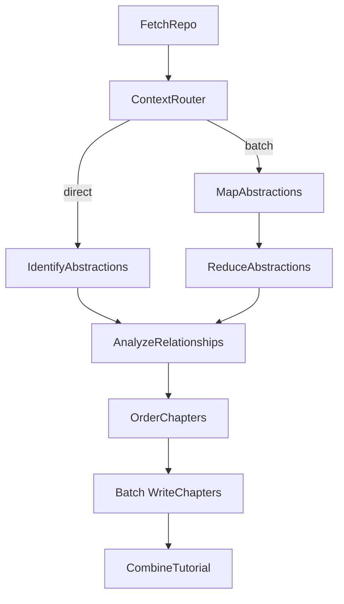

# System Design: Codebase Knowledge Builder

> Please DON'T remove notes for AI

## Requirements

> Notes for AI: Keep it simple and clear.
> If the requirements are abstract, write concrete user stories

**User Story:** As a developer onboarding to a new codebase, I want a tutorial automatically generated from its GitHub repository or local directory, optionally in a specific language. This tutorial should explain the core abstractions, their relationships (visualized), and how they work together, using beginner-friendly language, analogies, and multi-line descriptions where needed, so I can understand the project structure and key concepts quickly without manually digging through all the code. The system must also gracefully handle codebases of any size by dynamically switching to a Map-Reduce approach when context limits are reached.

**Input:**
- A publicly accessible GitHub repository URL or a local directory path.
- A project name (optional, will be derived from the URL/directory if not provided).
- Desired language for the tutorial (optional, defaults to English).
- Advanced configurations for token scaling (`--max-tokens`, `--batch`, `--force-batch`), prompting (`--advanced`, `--thinking-level`, `--max-abstractions`), caching (`--no-cache`), and execution cleanup (`--cleanup`).

**Output:**
- A directory named after the project containing:
    - An `index.md` file with:
        - A high-level project summary (potentially translated).
        - A Mermaid flowchart diagram visualizing relationships between abstractions (using potentially translated names/labels).
        - An ordered list of links to chapter files (using potentially translated names).
    - Individual Markdown files for each chapter (`01_chapter_one.md`, `02_chapter_two.md`, etc.) detailing core abstractions in a logical order (potentially translated content).
    - A `full_content.md` containing the merged chapters and TOC.

## Flow Design

> Notes for AI:
> 1. Consider the design patterns of agent, map-reduce, rag, and workflow. Apply them if they fit.
> 2. Present a concise, high-level description of the workflow.

### Applicable Design Pattern:

This project primarily uses a **Workflow** pattern with dynamic branching into a **Map-Reduce** pattern. The chapter writing step also utilizes a **BatchNode**.

1.  **Workflow & Routing:** The overall process fetches code, estimates token payloads, and routes based on context limits. If the codebase fits the LLM window, it goes directly to abstraction identification.
2.  **Map-Reduce:** If the codebase exceeds context limits (or if forced), the codebase is grouped into batches by directory. A `MapAbstractions` BatchNode processes each chunk individually, and a `ReduceAbstractions` Node merges them into a global list.
3.  **Batch Processing:** The `WriteChapters` node processes each identified abstraction independently (map) before final tutorial compilation.

### Flow high-level Design:

1.  **`FetchRepo`**: Crawls the specified repository/directory using `crawl_github_files` or `crawl_local_files`.
2.  **`ContextRouter`**: Analyzes the total token payload of the fetched files using `tiktoken`. If the total tokens exceed a safety threshold (95% of `max_tokens`) or if `--force-batch` is used, it chunks files by directory and routes to `"batch"`. Otherwise, it routes to `"direct"`.
3.  **Path A: Direct**
    *   **`IdentifyAbstractions`**: Analyzes the entire codebase at once to identify core abstractions.
4.  **Path B: Map-Reduce**
    *   **`MapAbstractions` (BatchNode)**: Analyzes each localized directory chunk to extract partial abstractions.
    *   **`ReduceAbstractions`**: Merges overlapping/partial abstractions into a global list of architecture components.
5.  **`AnalyzeRelationships`**: Takes the unified abstractions list (from either path) and generates a high-level project summary and relationships diagram.
6.  **`OrderChapters`**: Determines the most logical sequence to present the abstractions.
7.  **`WriteChapters` (BatchNode)**: Iterates through the ordered abstractions and writes detailed Markdown chapters using context-aware code inclusion.
8.  **`CombineTutorial`**: Assembles the final outputs including `index.md`, individual chapter files, and a compiled `full_content.md`.



## Utility Functions

> Notes for AI:
> 1. Understand the utility function definition thoroughly by reviewing the doc.
> 2. Include only the necessary utility functions, based on nodes in the flow.

1.  **`crawl_github_files` / `crawl_local_files`**: Handlers for fetching codebase directories/repos.
2.  **`call_llm`** (`utils/call_llm.py`): The core LLM execution wrapper. Supports retries, JSON exception handling, caching, and reasoning tokens.
3.  **`token_utils.py`**:
    *   **`log_token_estimation`**: Calculates tokens dynamically via `tiktoken` (falling back to simple character counting) and prints beautiful analytics metrics (`node_name`, `usage`, `capacity %`) to the CLI just before API execution.

## Node Design

### Shared Store

> Notes for AI: Try to minimize data redundancy

The shared Store structure is organized as follows:

```python
shared = {
    # --- Inputs ---
    "repo_url": None, "local_dir": None, "project_name": None,
    "github_token": None, "output_dir": "output",
    "include_patterns": set(), "exclude_patterns": set(),
    "max_file_size": 200000, "language": "english",
    "use_cache": True, "max_abstraction_num": 10,
    "thinking_level": None, "advanced_mode": False,
    "max_tokens": None, # Dynamic window threshold
    "batch_size": 50, "force_batch": False, # Map-reduce flags

    # --- Intermediate/Output Data ---
    "files": [], # List of (path, content) tuples
    "file_batches": [], # If routed to Map-Reduce, holds chunked file lists
    "mapped_abstractions": [], # Partial abstractions from Map step
    "abstractions": [], # Final unified list (from either Identify or Reduce)
    "relationships": { "summary": None, "details": [] },
    "chapter_order": [],
    "chapters": [],
    "final_output_dir": None
}
```

### Node Steps

> Notes for AI: All active nodes invoke `log_token_estimation` before calling the LLM.

1.  **`FetchRepo`**: Download/read files.
2.  **`ContextRouter`**: Establishes `max_tokens` (fetching dynamically from provider endpoints if needed). Groups files by `os.path.dirname` if tokens exceed `max_tokens * 0.95`. Returns `"batch"` or `"direct"`.
3.  **`IdentifyAbstractions`**: (Direct Route) Extracts abstractions and related `file_indices`.
4.  **`MapAbstractions`**: (Batch Route) BatchNode that runs chunked files through local abstraction prompts. Stores outputs in `mapped_abstractions`.
5.  **`ReduceAbstractions`**: (Batch Route) Standard node that takes all `mapped_abstractions` and merges them via LLM into the final global `abstractions` list.
6.  **`AnalyzeRelationships`**: Generates high-level project summary and interaction links (`from`, `to`, `label`).
7.  **`OrderChapters`**: Identifies linear tutorial flow.
8.  **`WriteChapters`**: BatchNode writing Markdown content for each abstraction.
9.  **`CombineTutorial`**: Assembles outputs, table of contents, and mermaid diagram.
