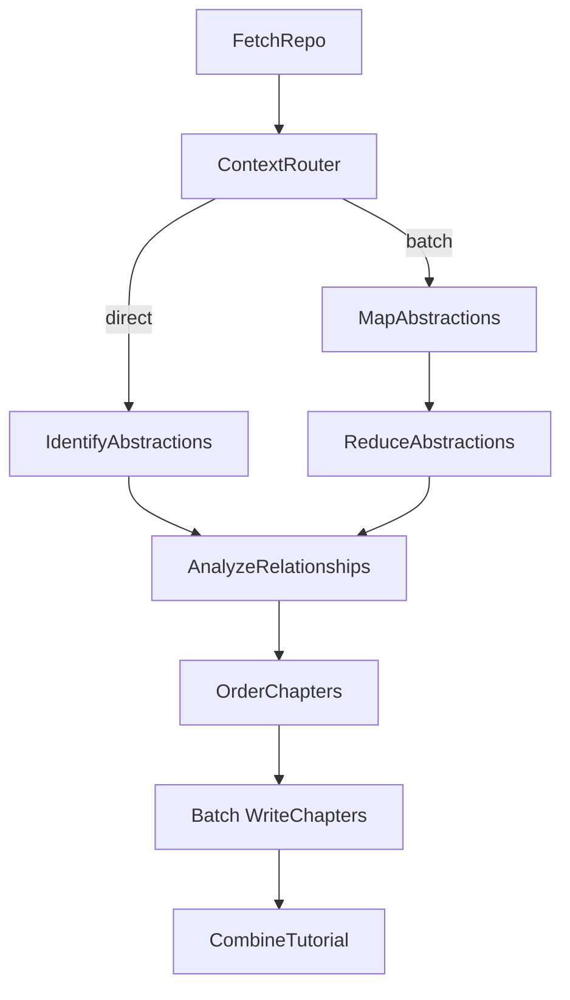

# System Design: Codebase Knowledge Builder

> Please DON'T remove notes for AI

## 1. Requirements

> Notes for AI: Keep it simple and clear.
> If the requirements are abstract, write concrete user stories

**User Story:** As a developer onboarding to a new codebase, I want a tutorial automatically generated from its GitHub repository or local directory, optionally in a specific language. The system supports two modes: a **tutorial mode** that explains core abstractions with beginner-friendly language, analogies, and code walkthroughs; and an **advanced mode** that produces architecture deep-dives aimed at senior developers or PMs joining a project mid-way, covering design patterns, key dependencies, and practical onboarding notes. The system must also gracefully handle codebases of any size by dynamically switching to a Map-Reduce approach when context limits are reached.

**Input:**
- A publicly accessible GitHub repository URL or a local directory path.
- A project name (optional, will be derived from the URL/directory if not provided).
- Desired language for the tutorial (optional, defaults to English).
- Advanced configurations for token scaling (`--max-tokens`, `--batch`, `--force-batch`), prompting (`--advanced`, `--thinking-level`, `--max-abstractions`), caching (`--no-cache`), debugging (`--debug`), and execution cleanup (`--cleanup`).

**Output:**
- A directory named after the project containing:
    - An `index.md` file with:
        - A high-level project summary (potentially translated).
        - A Mermaid flowchart diagram visualizing relationships between abstractions (using potentially translated names/labels).
        - An ordered list of links to chapter files (using potentially translated names).
        - A link to `full_content.md` at the bottom.
    - Individual Markdown files for each chapter (`01_chapter_one.md`, `02_chapter_two.md`, etc.) detailing core abstractions in a logical order (potentially translated content).
    - A `full_content.md` (inside the project subdirectory) containing all merged chapters and a Table of Contents.

## 2. Flow Design

> Notes for AI:
> 1. Consider the design patterns of agent, map-reduce, rag, and workflow. Apply them if they fit.
> 2. Present a concise, high-level description of the workflow.

### Applicable Design Pattern:

This project primarily uses a **Workflow** pattern with dynamic branching into a **Map-Reduce** pattern. The chapter writing step also utilizes a **BatchNode**.

1.  **Workflow & Routing:** The overall process fetches code, estimates token payloads, and routes based on context limits. If the codebase fits the LLM window, it goes directly to abstraction identification.
2.  **Map-Reduce:** If the codebase exceeds context limits (or if forced), the codebase is grouped into token-aware, directory-isolated batches (each batch stays under the effective token limit and never mixes files from different directories). A `MapAbstractions` BatchNode processes each batch individually, and a `ReduceAbstractions` Node merges them into a global list.
3.  **Batch Processing:** The `WriteChapters` node processes each identified abstraction independently (map) before final tutorial compilation.

### Flow high-level Design:

1.  **`FetchRepo`**: Crawls the specified repository/directory using `crawl_github_files` or `crawl_local_files`.
2.  **`ContextRouter`**: Analyzes the total token payload of the fetched files using `tiktoken`. Dynamically calculates **prompt overhead** (template tokens + directory tree tokens) and computes an **effective limit** = `safety_limit - prompt_overhead`. If the file content tokens exceed this effective limit or if `--force-batch` is used, it chunks files into **token-aware, directory-isolated batches** (never mixing files from different directories) and routes to `"batch"`. Also builds a compact directory tree of all files (stored in `shared["directory_tree"]`) for cross-batch awareness. With `--debug`, displays detailed per-batch file lists and token breakdowns. Otherwise, it routes to `"direct"`.
3.  **Path A: Direct**
    *   **`IdentifyAbstractions`**: Analyzes the entire codebase at once to identify core abstractions.
4.  **Path B: Map-Reduce**
    *   **`MapAbstractions` (BatchNode)**: Analyzes each localized directory chunk to extract partial abstractions. Each batch receives the full directory tree for cross-batch awareness.
    *   **`ReduceAbstractions`**: Merges overlapping/partial abstractions into a global list of architecture components.
5.  **`AnalyzeRelationships`**: Takes the unified abstractions list (from either path) and generates a high-level project summary and relationships diagram. Uses token-budget-aware file inclusion: the budget is split evenly across abstractions, with unused budget redistributed in a second pass, maximizing code context without exceeding the context window.
6.  **`OrderChapters`**: Determines the most logical sequence to present the abstractions.
7.  **`WriteChapters` (BatchNode)**: Iterates through the ordered abstractions and writes detailed Markdown chapters using context-aware code inclusion.
8.  **`CombineTutorial`**: Assembles the final outputs including `index.md`, individual chapter files, and a compiled `full_content.md`.



## 3. Project Structure

> Notes for AI: This is the exact file tree. Create ALL these files when rebuilding.

```
codebase_kb/
├── main.py                          # CLI entry point, arg parsing, shared store init
├── flow.py                          # PocketFlow graph wiring
├── nodes.py                         # All 9 node classes + helper functions
├── .env.sample                      # Environment variable template
├── requirements.txt                 # Python dependencies
├── utils/
│   ├── __init__.py                  # Empty
│   ├── call_llm.py                  # Multi-provider LLM wrapper with caching
│   ├── crawl_github_files.py        # GitHub API crawler
│   ├── crawl_local_files.py         # Local directory crawler
│   └── token_utils.py               # Token estimation utility
├── prompts/
│   ├── tutorial/                    # Beginner-friendly prompt templates
│   │   ├── identify_abstractions.md
│   │   ├── map_abstractions.md
│   │   ├── reduce_abstractions.md
│   │   ├── identify_relationships.md
│   │   ├── order_chapters.md
│   │   └── draft_chapters.md
│   └── advanced/                    # Senior-dev prompt templates
│       ├── identify_abstractions.md
│       ├── map_abstractions.md
│       ├── reduce_abstractions.md
│       ├── identify_relationships.md
│       ├── order_chapters.md
│       └── draft_chapters.md
└── docs/
    ├── design.md                    # THIS FILE
    ├── index.md                     # Project README/landing page
    └── pocketflow/                  # PocketFlow framework reference docs
        ├── guide.md
        ├── index.md
        └── core_abstraction/
            ├── node.md
            ├── flow.md
            ├── communication.md
            ├── batch.md
            ├── async.md
            └── parallel.md
```

## 4. Dependencies

> Notes for AI: Use these EXACT versions in `requirements.txt`.

```
pocketflow>=0.0.3
pyyaml>=6.0.3
requests>=2.34.2
gitpython>=3.1.59
google-cloud-aiplatform>=1.164.0
google-genai>=2.18.1
python-dotenv>=1.2.3
pathspec>=1.1.1
tiktoken>=0.8.0
mkdocs-material>=9.0.0
```

## 5. Environment Configuration

> Notes for AI: Create `.env.sample` (committed) and `.env` (gitignored). The project uses `python-dotenv` to load `.env`.

### `.env.sample` content:
```ini
# Provider Selection
# LLM_PROVIDER = OPENROUTER

# GitHub Token (Optional, for avoiding rate limits when crawling public repos)
# GITHUB_TOKEN = <YOUR_GITHUB_TOKEN>

# --- Gemini (Default if no LLM_PROVIDER is set) ---
# GEMINI_PROJECT_ID = <YOUR_GEMINI_PROJECT_ID>
# GEMINI_API_KEY = <YOUR_GEMINI_API_KEY>

# --- OpenRouter ---
# OPENROUTER_BASE_URL = https://openrouter.ai/api
# OPENROUTER_API_KEY = <YOUR_OPENROUTER_API_KEY>
# OPENROUTER_MODEL = anthropic/claude-sonnet-4.6
# OPENROUTER_MODEL = google/gemini-3.7-flash
# OPENROUTER_MODEL = qwen/qwen3.8-max

# --- Ollama ---
# OLLAMA_BASE_URL = http://localhost:11434
# OLLAMA_MODEL = llama3
```

### Provider Resolution Logic
```python
provider = os.environ.get("LLM_PROVIDER")
if provider:
    model_name = os.environ.get(f"{provider}_MODEL", "unknown")
    endpoint_url = os.environ.get(f"{provider}_BASE_URL", "unknown")
    api_key = os.environ.get(f"{provider}_API_KEY", "")
else:
    if os.environ.get("GEMINI_PROJECT_ID") or os.environ.get("GEMINI_API_KEY"):
        provider = "GEMINI"
        model_name = os.environ.get("GEMINI_MODEL", "gemini-3.7-flash")
        endpoint_url = "generativelanguage.googleapis.com"
        api_key = os.environ.get("GEMINI_API_KEY", "")
    else:
        provider = "UNKNOWN"
        model_name = "unknown"
        endpoint_url = "unknown"
        api_key = ""
```

### Gemini Client Initialization (Vertex AI vs API Key)

> Notes for AI: The Gemini provider supports TWO authentication modes. You MUST implement both.

```python
# In _call_llm_gemini():
if os.getenv("GEMINI_PROJECT_ID"):
    client = genai.Client(
        vertexai=True,
        project=os.getenv("GEMINI_PROJECT_ID"),
        location=os.getenv("GEMINI_LOCATION", "us-central1")
    )
elif os.getenv("GEMINI_API_KEY"):
    client = genai.Client(api_key=os.getenv("GEMINI_API_KEY"))
else:
    raise ValueError("Either GEMINI_PROJECT_ID or GEMINI_API_KEY must be set")
```

### `.env.sample` Additional Variables
```ini
# Gemini Vertex AI (alternative to API key)
# GEMINI_PROJECT_ID = <YOUR_GCP_PROJECT_ID>
# GEMINI_LOCATION = us-central1
```

## 6. CLI Arguments & Startup Display

> Notes for AI: Implement ALL these CLI arguments in `main.py` via `argparse`. The startup display MUST be printed before the flow runs.

### CLI Arguments

| Argument | Type | Default | Description |
|---|---|---|---|
| `--repo` | `str` | `None` | URL of public GitHub repository (mutually exclusive with `--dir`) |
| `--dir` | `str` | `None` | Path to local directory (mutually exclusive with `--repo`) |
| `-n`, `--name` | `str` | `None` | Project name (derived from repo/dir if omitted) |
| `-t`, `--token` | `str` | `None` | GitHub personal access token (falls back to `GITHUB_TOKEN` env) |
| `-o`, `--output` | `str` | `"output"` | Base directory for output |
| `-i`, `--include` | `nargs="+"` | `None` | Include glob patterns (e.g., `*.py *.js`) |
| `-e`, `--exclude` | `nargs="+"` | `None` | Exclude glob patterns (merged with DEFAULT_EXCLUDE_PATTERNS) |
| `-s`, `--max-size` | `int` | `200000` | Maximum file size in bytes (~200KB) |
| `--language` | `str` | `"english"` | Target language for generated tutorial |
| `--no-cache` | `store_true` | `False` | Disable LLM response caching |
| `--cleanup` | `store_true` | `False` | Remove `llm_cache.json` and `logs/` after completion |
| `--max-abstractions` | `int` | `10` | Maximum number of abstractions to identify |
| `--thinking-level` | `str` | `None` | LLM reasoning effort (`low`, `medium`, `high`) |
| `--max-tokens` | `int` | `None` | Override context window (auto-detected if omitted) |
| `--mode` | `str` | `"tutorial"` | Documentation style (tutorial, advanced, api-reference, sdk). (default: tutorial) |
| `--advanced` | `store_true` | `False` | Legacy flag: equivalent to --mode advanced |
| `--mkdocs` | `store_true` | `False` | Format output for MkDocs Material (adds YAML frontmatter & nav snippet) |
| `--incremental` | `store_true` | `False` | Enable MD5 incremental caching to skip unchanged modules (Only supported in --mode api-reference) |
| `--batch` | `int` | `50` | Max files per batch in map-reduce mode |
| `--force-batch` | `store_true` | `False` | Force map-reduce mode regardless of context size |
| `--debug` | `store_true` | `False` | Enable verbose debug output |

### Startup Config Display
```python
print(f"Starting tutorial generation for: {args.repo or args.dir} in {args.language.capitalize()} language")
print(f"--- Configuration ---")
print(f"AI Provider    : {provider}")
print(f"AI Endpoint    : {endpoint_url}")
print(f"AI Model       : {model_name}")
print(f"Context Length : {context_length:,} tokens")
print(f"Thinking Level : {args.thinking_level if args.thinking_level else 'None'}")
print(f"Advanced Prompts: {'Enabled' if args.advanced else 'Disabled'}")
print(f"Batch Size     : {args.batch} files/batch")
print(f"Force Batch    : {'Enabled' if args.force_batch else 'Disabled'}")
print(f"Max Abstractions: {args.max_abstractions}")
print(f"LLM Caching    : {'Disabled' if args.no_cache else 'Enabled'}")
if args.debug:
    print(f"Debug Mode     : Enabled")
print(f"---------------------")
```

## 7. Default Exclude Patterns

> Notes for AI: This EXACT set must be defined in `main.py` as `DEFAULT_EXCLUDE_PATTERNS`. User-supplied `--exclude` patterns are MERGED with (not replacing) this set via `.union()`.

```python
DEFAULT_INCLUDE_PATTERNS = {"*"}

DEFAULT_EXCLUDE_PATTERNS = {
    # 1. Media, Data, and Static Assets
    "assets/*", "data/*", "images/*", "public/*", "static/*", "temp/*", "tmp/*", "media/*",
    "*.jpg", "*.jpeg", "*.png", "*.gif", "*.ico", "*.svg", "*.webp",
    "*.mp4", "*.webm", "*.mov", "*.mp3", "*.wav",
    "*.pdf", "*.doc", "*.docx", "*.xls", "*.xlsx", "*.ppt", "*.pptx",
    "*.zip", "*.tar", "*.gz", "*.rar", "*.7z",

    # 2. Build, Distribution, and Framework Caches
    "dist/*", "build/*", "out/*", "target/*", "bin/*", "obj/*",
    ".next/*", ".nuxt/*", ".svelte-kit/*", ".expo/*",
    "docs/*", "test/*", "tests/*", "examples/*",
    "v1/*", "experimental/*", "deprecated/*", "misc/*", "legacy/*",
    "*.log", "*.bak", "*.tmp", "*.swp",

    # 3. Environments, Dependencies & Lockfiles
    "venv/*", ".venv/*", "env/*", ".env", ".env.*",
    "node_modules/*", "bower_components/*", "jspm_packages/*",
    "vendor/*", "packages/*",
    "*.lock", "package-lock.json", "yarn.lock", "pnpm-lock.yaml", "Cargo.lock", "Gemfile.lock", "poetry.lock", "mix.lock", "Pipfile.lock",

    # 4. Language-Specific Exclusions
    "__pycache__/*", "*.pyc", "*.pyo", "*.pyd", ".pytest_cache/*", ".tox/*", ".coverage", "htmlcov/*", # Python
    ".gradle/*", "*.class", "*.jar", "*.war", "*.ear", "*.nar", # Java / JVM
    "*.o", "*.obj", "*.dll", "*.exe", "*.so", "*.dylib", "*.lib", "*.a", # C/C++/Native
    "ios/Pods/*", "android/.gradle/*", "android/app/build/*", # Mobile

    # 5. OS & Version Control
    ".git/*", ".github/*", ".svn/*", ".hg/*",
    ".DS_Store", "Thumbs.db", "desktop.ini",

    # 6. Classic IDEs
    ".vscode/*", ".idea/*", "*.iml", ".eclipse/*", ".settings/*", ".classpath", ".project", ".vs/*",

    # 7. AI Agents & Modern AI IDEs
    ".cursor/*", ".cursorrules",
    ".windsurf/*", ".windsurfrules",
    ".cline/*", ".clinerules",
    ".roo/*", ".roorules",
    ".agent/*", ".agents/*",
    ".continue/*", ".aide/*",
    ".gemini/*", ".antigravity/*",
    ".claude/*", ".copilot/*",
}
```

## 8. Shared Store Schema

> Notes for AI: This is the EXACT shared store structure. Pay attention to data type transformations noted with ⚠.

```python
shared = {
    # --- Set by main.py from CLI args ---
    "repo_url": args.repo,                    # str | None
    "local_dir": args.dir,                    # str | None
    "project_name": args.name,                # str | None (FetchRepo derives if None)
    "github_token": github_token,             # str | None
    "output_dir": args.output,                # str, default "output"
    "include_patterns": include_set,          # set[str]
    "exclude_patterns": exclude_set,          # set[str]
    "max_file_size": args.max_size,           # int, default 200000
    "language": args.language,                 # str, default "english"
    "use_cache": not args.no_cache,           # bool, default True
    "max_abstraction_num": args.max_abstractions,  # int, default 10
    "thinking_level": args.thinking_level,    # str | None
    "max_tokens": args.max_tokens,            # int | None (auto-detected later)
    "advanced_mode": args.advanced,           # bool, default False
    "batch_size": args.batch,                 # int, default 50
    "force_batch": args.force_batch,          # bool, default False
    "debug": args.debug,                      # bool, default False

    # --- Populated by downstream nodes ---
    "files": [],              # Set by FetchRepo: list[tuple[str, str]] = [(relpath, content), ...]
    "mapped_abstractions": [],# Set by MapAbstractions (batch path only): list[dict]
    "file_batches": [],       # Set by ContextRouter (batch path only): list[list[tuple[int, str, str]]]
    "directory_tree": "",     # Set by ContextRouter (batch path only): str
    "abstractions": [],       # Set by IdentifyAbstractions OR ReduceAbstractions
    "relationships": {},      # Set by AnalyzeRelationships
    "chapter_order": [],      # Set by OrderChapters
    "chapters": [],           # Set by WriteChapters
    "final_output_dir": None  # Set by CombineTutorial
}
```

### Data Transformations Between Nodes

> Notes for AI: These transformations are CRITICAL. An AI builder MUST understand how data shapes change as it flows through nodes.

| Stage | `shared["files"]` format | Who transforms |
|---|---|---|
| After FetchRepo | `[(relpath, content), ...]` — 2-tuples sorted by path | FetchRepo.post |
| Used by ContextRouter | Same 2-tuples — ContextRouter reads but does NOT modify `shared["files"]` | — |
| `shared["file_batches"]` | `[[(global_idx, path, content), ...], ...]` — list of batches, each batch is list of 3-tuples with global index | ContextRouter.post |

| Stage | `shared["abstractions"]` format |
|---|---|
| After Identify/Reduce | `[{"name": str, "description": str, "files": [int, ...]}, ...]` |
| Note | `"files"` key contains validated integer indices into `shared["files"]` |

| Stage | `shared["relationships"]` format |
|---|---|
| After AnalyzeRelationships | `{"summary": str, "details": [{"from": int, "to": int, "label": str}, ...]}` |
| Note | LLM returns `from_abstraction`/`to_abstraction` strings; node parses to int `from`/`to` |

| Stage | `shared["mapped_abstractions"]` format |
|---|---|
| After MapAbstractions | `[{"name": str, "description": str, "files": [int, ...]}, ...]` — flattened from all batches |
| Note | Only exists in batch path. Fed into ReduceAbstractions for merging/deduplication |

| Stage | `shared["directory_tree"]` format |
|---|---|
| After ContextRouter | String built by `_build_directory_tree()` — see Section 10 for format |
| Note | Only exists in batch path. Passed to MapAbstractions for project structure context |

## 9. Utility Interface Contracts

> Notes for AI: These are EXACT function signatures. Do NOT rename parameters. Do NOT change return formats.

### `crawl_local_files`
```python
def crawl_local_files(directory, include_patterns=None, exclude_patterns=None,
                      max_file_size=None, use_relative_paths=True) -> dict:
    # Returns: {"files": {relative_path_str: content_str, ...}}
```

**Directory Pruning Algorithm** (critical for nested directories like `Core.User/.vs/`):
```python
# During os.walk, for each subdirectory d:
excluded_dirs = set()
for d in dirs:
    dirpath_rel = os.path.relpath(os.path.join(root, d), directory)
    # Check .gitignore first
    if gitignore_spec and gitignore_spec.match_file(dirpath_rel):
        excluded_dirs.add(d)
        continue
    # Check exclude patterns — strip trailing /* for directory matching
    if exclude_patterns:
        for pattern in exclude_patterns:
            dir_pattern = pattern[:-2] if pattern.endswith("/*") else pattern
            if fnmatch.fnmatch(dirpath_rel, dir_pattern) or fnmatch.fnmatch(d, dir_pattern):
                excluded_dirs.add(d)
                break
# Remove matched dirs to prevent os.walk descent
for d in dirs.copy():
    if d in excluded_dirs:
        dirs.remove(d)
```

> Note: Directory validation: raises `ValueError` if `directory` path doesn't exist. Loads `.gitignore` with `utf-8-sig` encoding (BOM-safe). All directories and files are `sorted()` for deterministic traversal order.

**Progress Display Format:**
- Green (`\033[92m`): `[processed]` — Successfully read files
- Gray (`\033[90m`): `[excluded (.gitignore)]` / `[excluded (not in include list)]` — Skipped by pattern
- Red (`\033[91m`): `[size limit: {size_kb:.0f}KB]` — Exceeded max_file_size
- Red (`\033[91m`): `[cannot process: not a text file]` / `[cannot process: {e}]` — Binary/encoding errors

> Note: After crawling, prints a `--- Crawl Summary ---` block with total found, processed, excluded, size limited, and non-text counts.

### `crawl_github_files`
```python
def crawl_github_files(repo_url, token=None, max_file_size=1048576,
                       use_relative_paths=False, include_patterns=None,
                       exclude_patterns=None) -> dict:
    # Returns: {"files": {path_str: content_str, ...}, "stats": {...}}
```

> Notes for AI: This is the most complex utility (~550 lines). You MUST implement ALL subsystems below.

**Imports required:** `requests`, `base64`, `os`, `tempfile`, `git`, `time`, `fnmatch`, `pathspec`, `urlparse`

**Input normalization:** Convert single string patterns to `set`:
```python
if include_patterns and isinstance(include_patterns, str):
    include_patterns = {include_patterns}
if exclude_patterns and isinstance(exclude_patterns, str):
    exclude_patterns = {exclude_patterns}
```

**`should_include_file(file_path, file_name, gitignore_spec=None)` helper:**
- If `include_patterns` set: file must match at least one pattern via `fnmatch.fnmatch(file_name, pattern)`
- If `gitignore_spec`: reject if `gitignore_spec.match_file(file_path)`
- If `exclude_patterns`: reject if `fnmatch.fnmatch(file_path, pattern)` matches any

#### Path 1: SSH/Git Clone
Triggered when `repo_url.startswith("git@") or repo_url.endswith(".git")`:
```python
with tempfile.TemporaryDirectory() as tmpdirname:
    print(f"Cloning SSH repo {repo_url} to temp dir {tmpdirname} ...")
    try:
        repo = git.Repo.clone_from(repo_url, tmpdirname)
    except Exception as e:
        print(f"Error cloning repo: {e}")
        return {"files": {}, "stats": {"error": str(e)}}

    files = {}
    skipped_files = []

    # --- ANSI colors ---
    C_GREEN  = "\033[92m"
    C_GRAY   = "\033[90m"
    C_RED    = "\033[91m"
    C_RESET  = "\033[0m"

    # --- Counters ---
    count_processed = 0
    count_excluded = 0
    count_size_limit = 0
    count_non_text = 0
    skipped_size_list = []
    skipped_non_text_list = []
    entry_num = 0

    # --- Load .gitignore (BOM-safe) ---
    gitignore_path = os.path.join(tmpdirname, ".gitignore")
    gitignore_spec = None
    if os.path.exists(gitignore_path):
        try:
            with open(gitignore_path, "r", encoding="utf-8-sig") as f:
                gitignore_spec = pathspec.PathSpec.from_lines("gitwildmatch", f.readlines())
        except Exception:
            pass

    for root, dirs, filenames in os.walk(tmpdirname):
        # --- Directory pruning (same algorithm as crawl_local_files) ---
        excluded_dirs = set()
        for d in sorted(dirs):
            dirpath_rel = os.path.relpath(os.path.join(root, d), tmpdirname)
            reason = None
            if gitignore_spec and gitignore_spec.match_file(dirpath_rel):
                reason = "excluded (.gitignore)"
            elif exclude_patterns:
                for pattern in exclude_patterns:
                    dir_pattern = pattern[:-2] if pattern.endswith("/*") else pattern
                    if fnmatch.fnmatch(dirpath_rel, dir_pattern) or fnmatch.fnmatch(d, dir_pattern):
                        reason = "excluded"
                        break
            if reason:
                excluded_dirs.add(d)
                entry_num += 1
                count_excluded += 1
                print(f"{C_GRAY}  [{entry_num}] {dirpath_rel}/ [{reason}]{C_RESET}")

        for d in dirs.copy():
            if d in excluded_dirs:
                dirs.remove(d)
        dirs.sort()  # Deterministic traversal order

        # --- File processing ---
        for filename in sorted(filenames):
            abs_path = os.path.join(root, filename)
            rel_path = os.path.relpath(abs_path, tmpdirname)
            entry_num += 1

            if not should_include_file(rel_path, filename, gitignore_spec=gitignore_spec):
                count_excluded += 1
                print(f"{C_GRAY}  [{entry_num}] {rel_path} [excluded]{C_RESET}")
                continue

            try:
                file_size = os.path.getsize(abs_path)
            except OSError:
                continue

            if file_size > max_file_size:
                count_size_limit += 1
                skipped_size_list.append(rel_path)
                size_kb = file_size / 1024
                print(f"{C_RED}  [{entry_num}] {rel_path} [size limit: {size_kb:.0f}KB]{C_RESET}")
                continue

            try:
                with open(abs_path, "r", encoding="utf-8-sig") as f:
                    content = f.read()
                files[rel_path] = content
                count_processed += 1
                print(f"{C_GREEN}  [{entry_num}] {rel_path} [processed]{C_RESET}")
            except (UnicodeDecodeError, ValueError):
                count_non_text += 1
                skipped_non_text_list.append(rel_path)
                print(f"{C_RED}  [{entry_num}] {rel_path} [cannot process: not a text file]{C_RESET}")
            except Exception as e:
                count_non_text += 1
                skipped_non_text_list.append(rel_path)
                print(f"{C_RED}  [{entry_num}] {rel_path} [cannot process: {e}]{C_RESET}")

    # --- Crawl Summary ---
    total_fetched = count_processed + count_excluded + count_size_limit + count_non_text
    print(f"\n--- Crawl Summary ---")
    print(f"  Total found : {total_fetched}")
    print(f"{C_GREEN}  Processed   : {count_processed}{C_RESET}")
    if count_excluded > 0:
        print(f"{C_GRAY}  Excluded    : {count_excluded}{C_RESET}")
    if count_size_limit > 0:
        print(f"{C_RED}  Size limit  : {count_size_limit}{C_RESET}")
        for sf in skipped_size_list:
            print(f"{C_RED}    - {sf}{C_RESET}")
    if count_non_text > 0:
        print(f"{C_RED}  Non-text    : {count_non_text}{C_RESET}")
        for sf in skipped_non_text_list:
            print(f"{C_RED}    - {sf}{C_RESET}")
    print(f"---------------------")

    return {
        "files": files,
        "stats": {
            "downloaded_count": len(files),
            "skipped_count": len(skipped_files),
            "skipped_files": skipped_files,
            "base_path": None,
            "include_patterns": include_patterns,
            "exclude_patterns": exclude_patterns,
            "source": "ssh_clone"
        }
    }
```

#### Path 2: GitHub API Crawl

**Step 1 — URL Parsing and Branch/Ref Resolution:**
```python
parsed_url = urlparse(repo_url)
path_parts = parsed_url.path.strip('/').split('/')
owner, repo = path_parts[0], path_parts[1]

headers = {"Accept": "application/vnd.github.v3+json"}
if token:
    headers["Authorization"] = f"token {token}"
```

**Step 2 — Dynamic Branch Detection (handles multi-segment branch names like `feature/foo`):**
```python
if len(path_parts) > 2 and 'tree' == path_parts[2]:
    join_parts = lambda i: '/'.join(path_parts[i:])
    
    # Fetch all branches
    branches = fetch_branches(owner, repo)  # GET /repos/{owner}/{repo}/branches
    branch_names = map(lambda b: b.get("name"), branches)
    
    # Match URL path against branch names (handles multi-segment names)
    relevant_path = join_parts(3)
    ref = next((name for name in branch_names if relevant_path.startswith(name)), None)
    
    # Fallback: check if it's a commit/tree hash
    if ref is None:
        tree = path_parts[3]
        ref = tree if check_tree(owner, repo, tree) else None  # GET /repos/{owner}/{repo}/git/trees/{tree}
    
    # Extract subdirectory (accounts for multi-slash branch names)
    part_index = 5 if '/' in ref else 4
    specific_path = join_parts(part_index) if part_index < len(path_parts) else ""
else:
    ref = None  # Let GitHub use default branch
    specific_path = ""
```

**Step 3 — Remote `.gitignore` Fetch:**
```python
gi_url = f"https://api.github.com/repos/{owner}/{repo}/contents/.gitignore"
gi_params = {"ref": ref} if ref is not None else {}
gi_resp = requests.get(gi_url, headers=headers, params=gi_params, timeout=(10, 10))
if gi_resp.status_code == 200:
    gi_data = gi_resp.json()
    if "content" in gi_data and gi_data.get("encoding") == "base64":
        gi_content = base64.b64decode(gi_data["content"]).decode('utf-8')
        gitignore_spec = pathspec.PathSpec.from_lines("gitwildmatch", gi_content.splitlines())
```

**Step 4 — Recursive Content Fetching (1 API call per directory):**
```python
def fetch_contents(path):
    url = f"https://api.github.com/repos/{owner}/{repo}/contents/{path}"
    params = {"ref": ref} if ref is not None else {}
    response = requests.get(url, headers=headers, params=params, timeout=(30, 30))
    
    # Rate limit handling with header-based wait:
    if response.status_code in (403, 429) and 'rate limit exceeded' in response.text.lower():
        if not token:
            raise Exception("GitHub API rate limit exceeded. Provide a token.")
        reset_time = int(response.headers.get('X-RateLimit-Reset', 0))
        wait_time = max(reset_time - time.time(), 0) + 1
        time.sleep(wait_time)
        return fetch_contents(path)  # Recursive retry
    
    contents = response.json()
    if not isinstance(contents, list):
        contents = [contents]
    
    for item in contents:
        if item["type"] == "file":
            # Check patterns, size, then fetch content
            # Path A: Use download_url directly, check Content-Length header
            # Path B (fallback): If no download_url, GET item["url"],
            #   base64 decode with size estimate: len(content) * 0.75 > max_file_size
        elif item["type"] == "dir":
            # Check gitignore + exclude before recursing
            fetch_contents(item["path"])
```

**Step 5 — Dual Content Fetch Strategy:**
```python
# Path A: download_url available
if "download_url" in item and item["download_url"]:
    file_response = requests.get(item["download_url"], headers=headers, timeout=(30, 30))
    content_length = int(file_response.headers.get('content-length', 0))
    if content_length > max_file_size:  # Final size check
        continue
    files[rel_path] = file_response.text

# Path B: base64 fallback
else:
    content_response = requests.get(item["url"], headers=headers, timeout=(30, 30))
    content_data = content_response.json()
    if len(content_data["content"]) * 0.75 > max_file_size:  # Approximate size
        continue
    file_content = base64.b64decode(content_data["content"]).decode('utf-8')
    files[rel_path] = file_content
```

**Error Messages (5 scenarios):**
| Status | Condition | Message |
|---|---|---|
| 404 | No token | `"Repository not found or is private. Provide a GitHub token."` |
| 404 | Token, no path, ref='main' | `"Repository not found. Check if default branch is not 'main'"` |
| 404 | Token, with path | `"Path '{path}' not found or insufficient permissions."` |
| 403/429 | No token | Raise exception: `"Rate limit exceeded. Provide a token."` |
| 403/429 | With token | Sleep using `X-RateLimit-Reset` header, recursive retry |

**Stats Return Structure:**
```python
return {
    "files": files,  # {path: content, ...}
    "stats": {
        "downloaded_count": len(files),
        "skipped_count": len(skipped_files),
        "skipped_files": skipped_files,
        "base_path": specific_path if use_relative_paths else None,
        "include_patterns": include_patterns,
        "exclude_patterns": exclude_patterns,
        "source": "ssh_clone"  # Only in SSH mode
    }
}
```

> Note: Progress display uses ANSI colors: Green `\033[92m` `[processed]`, Gray `\033[90m` `[excluded]` / `[excluded (.gitignore)]`, Red `\033[91m` `[size limit: {size_kb:.0f}KB]` / `[cannot process: ...]`. Each line prefixed with entry counter `[{entry_num}]`. End-of-crawl summary block with counts per category.

### `call_llm`
```python
def call_llm(prompt, use_cache=True, thinking_level=None) -> str:
    # Returns: LLM response content as string
```

> Notes for AI: This function has multiple critical subsystems. Implement ALL of them.

**Disk Caching:**
- Cache file: `llm_cache.json`, key = exact prompt string
- Load cache before checking; if hit, return cached response
- Before writing to cache, re-load from disk to prevent concurrent overwrites:
```python
if use_cache:
    cache = load_cache()  # Re-load to avoid overwrites
    cache[prompt] = response_text
    save_cache(cache)
```

**Provider Routing:**
- `get_llm_provider()` reads `LLM_PROVIDER` env var; falls back to `"GEMINI"` if `GEMINI_PROJECT_ID` or `GEMINI_API_KEY` exists
- `provider == "GEMINI"` → calls `_call_llm_gemini()`
- Otherwise → calls `_call_llm_provider()` (generic OpenAI-compatible)

**`_call_llm_gemini(prompt, thinking_level=None)` — Gemini-specific:**
```python
# Authentication — MUST support both modes:
if os.getenv("GEMINI_PROJECT_ID"):
    client = genai.Client(vertexai=True, project=os.getenv("GEMINI_PROJECT_ID"),
                          location=os.getenv("GEMINI_LOCATION", "us-central1"))
elif os.getenv("GEMINI_API_KEY"):
    client = genai.Client(api_key=os.getenv("GEMINI_API_KEY"))

# Thinking budget mapping:
budget_map = {"low": 1024, "medium": 4096, "high": 8192}
if thinking_level:
    thinking_config = types.ThinkingConfig(include_thoughts=True,
                                           thinking_budget=budget_map.get(thinking_level.lower(), 4096))
    kwargs["config"] = types.GenerateContentConfig(thinking_config=thinking_config)

# CRITICAL — Thought part filtering (avoids 'thought_signature' warnings):
if response.candidates and response.candidates[0].content.parts:
    text_parts = [part.text for part in response.candidates[0].content.parts if part.text is not None]
    return "".join(text_parts)
return ""
```

**`_call_llm_provider(prompt, thinking_level=None)` — OpenAI-compatible REST:**
- URL: `{base_url}/v1/chat/completions`, timeout `(10, 300)`
- Dynamic env var resolution: `{provider}_MODEL`, `{provider}_BASE_URL`, `{provider}_API_KEY`
- Default temperature: `0.7`

**OpenRouter Reasoning Detection:**
```python
if provider == "OPENROUTER" and thinking_level:
    model_info = _get_openrouter_model_info(model)  # Queries /api/v1/models, cached
    if model_info and "reasoning" in model_info:
        supported_efforts = model_info["reasoning"].get("supported_efforts", [])
        if thinking_level.lower() in supported_efforts:
            payload["reasoning"] = {"effort": thinking_level.lower()}
            payload["temperature"] = 1.0  # MUST override to 1.0 when reasoning enabled
```

**Ollama Think Mode:**
```python
elif provider == "OLLAMA" and thinking_level:
    payload["think"] = thinking_level.lower()
    payload["reasoning_effort"] = thinking_level.lower()
    payload["temperature"] = 1.0  # MUST override to 1.0
```

**Logging:** Daily log files in `logs/llm_calls_YYYYMMDD.log` (directory from `LOG_DIR` env var, default `"logs"`)

### `get_model_context_length`
```python
def get_model_context_length(endpoint_url, model_name, api_key) -> int:
    # Returns 1,000,000 for Gemini models
    # Queries OpenRouter /api/v1/models for OpenRouter models
    # Default fallback: 100,000
```

### `log_token_estimation`
```python
def log_token_estimation(node_name: str, prompt_content: str, max_tokens: int) -> None:
    # Prints: \033[93m[Token Analytics] {node_name}: {token_count:,} / {max_tokens:,} tokens ({percentage:.1f}% capacity)\033[0m
```
- Uses `tiktoken.get_encoding('cl100k_base')`, fallback to `len(text) // 4`
- **Takes 3 arguments, NOT 1** — node_name for display, prompt for counting, max_tokens for percentage

### `get_content_for_indices` (helper in `nodes.py`)
```python
def get_content_for_indices(files_data, indices):
    # files_data: list of (path, content) tuples
    # Returns: {"i # path": content} for valid indices
    content_map = {}
    for i in indices:
        if 0 <= i < len(files_data):
            path, content = files_data[i]
            content_map[f"{i} # {path}"] = content
    return content_map
```

## 10. Node Design — Template Variable Contracts

> Notes for AI: This section is THE MOST CRITICAL for correct code generation. Every node that calls an LLM must pass EXACTLY these variables to `prompt_template.format()`. Do NOT invent new variable names.

### How to Build Common Template Variables

> Notes for AI: These exact f-string formats MUST be used. Do not modify them.

```python
# Building "context" (file content block — used by Identify, Map, Analyze, Order):
context = ""
for i, path, content in files:  # 3-tuple format from ContextRouter
    context += f"--- File Index {i}: {path} ---\n{content}\n\n"

# Building "file_listing_for_prompt" (index reference — used by Identify, Map):
file_listing_for_prompt = "\n".join([f"- {i} # {path}" for i, path, _ in files])

# Building "abstraction_listing" (used by Analyze, Order):
abstraction_listing = "\n".join([f"{i} # {abstr['name']}" for i, abstr in enumerate(abstractions)])

# Building "partial_abstractions" (used by Reduce):
partial_abstractions = ""
for i, a in enumerate(mapped_abstractions):
    partial_abstractions += f"- Partial Abstraction {i}: {a['name']}\n  Description: {a['description']}\n  Files: {a['files']}\n\n"
```

### Language Instruction Variables

> Notes for AI: These patterns are used by ALL LLM-calling nodes. Each node constructs them with slightly different wording depending on context.

**MapAbstractions / ReduceAbstractions:**
```python
language_instruction = f"Output language MUST be entirely in {language}. " if language.lower() != "english" else ""
name_lang_hint = f" (in {language})" if language.lower() != "english" else ""
desc_lang_hint = f" (in {language})" if language.lower() != "english" else ""
```

**IdentifyAbstractions** (uses different, more emphatic wording):
```python
language_instruction = f"IMPORTANT: Generate the `name` and `description` for each abstraction in **{language.capitalize()}** language. Do NOT use English for these fields.\n\n" if language.lower() != "english" else ""
name_lang_hint = f" (value in {language.capitalize()})" if language.lower() != "english" else ""
desc_lang_hint = f" (value in {language.capitalize()})" if language.lower() != "english" else ""
```

**AnalyzeRelationships:**
```python
language_instruction = f"IMPORTANT: Generate the `summary` and relationship `label` fields in **{language.capitalize()}** language. Do NOT use English for these fields.\n\n" if language.lower() != "english" else ""
lang_hint = f" (in {language.capitalize()})" if language.lower() != "english" else ""
list_lang_note = f" (Names might be in {language.capitalize()})" if language.lower() != "english" else ""
```

**OrderChapters:**
```python
list_lang_note = f" (Names might be in {language.capitalize()})" if language.lower() != "english" else ""
summary_note = f" (Note: Project Summary might be in {language.capitalize()})" if language.lower() != "english" else ""
# Note: summary_note is prepended to the context string: f"Project Summary{summary_note}:\n..."
# Note: OrderChapters does NOT use language_instruction in the template
```

**WriteChapters (most complex):**
```python
language_instruction = ""
concept_details_note = ""
structure_note = ""
prev_summary_note = ""
instruction_lang_note = ""
mermaid_lang_note = ""
code_comment_note = ""
link_lang_note = ""
tone_note = ""
if language.lower() != "english":
    lang_cap = language.capitalize()
    language_instruction = f"IMPORTANT: Write this ENTIRE tutorial chapter in **{lang_cap}**. Some input context (like concept name, description, chapter list, previous summary) might already be in {lang_cap}, but you MUST translate ALL other generated content including explanations, examples, technical terms, and potentially code comments into {lang_cap}. DO NOT use English anywhere except in code syntax, required proper nouns, or when specified. The entire output MUST be in {lang_cap}.\n\n"
    concept_details_note = f" (Note: Provided in {lang_cap})"
    structure_note = f" (Note: Chapter names might be in {lang_cap})"
    prev_summary_note = f" (Note: This summary might be in {lang_cap})"
    instruction_lang_note = f" (in {lang_cap})"
    mermaid_lang_note = f" (Use {lang_cap} for labels/text if appropriate)"
    code_comment_note = f" (PRESERVE original code comments exactly as-is. Add your explanatory notes OUTSIDE code blocks in {lang_cap}, not inside them.)"
    link_lang_note = f" (Use the {lang_cap} chapter title from the structure above)"
    tone_note = f" (appropriate for {lang_cap} readers)"
```

### Per-Node Template Variable Mapping

> Notes for AI: The left column is the exact kwarg name to pass to `.format()`. The right column is where the value comes from.

#### FetchRepo
No LLM call. Reads shared store, calls crawl utility, writes `shared["files"]` and `shared["project_name"]`.

**`prep()` return:** `dict`
```python
return {
    "repo_url": repo_url, "local_dir": local_dir,
    "token": shared.get("github_token"),
    "include_patterns": include_patterns, "exclude_patterns": exclude_patterns,
    "max_file_size": max_file_size, "use_relative_paths": True,
}
```
**`exec()` validation:** Raises `ValueError("No matching files found...")` if 0 files crawled.
**Project name derivation:** `repo_url.split("/")[-1].replace(".git", "")` if URL, else `os.path.basename(os.path.abspath(local_dir))`
**`post()` writes:** `shared["files"] = exec_res` (list of tuples). Returns `None`.

#### ContextRouter
No LLM call. Routes to `"direct"` or `"batch"`. Writes `shared["max_tokens"]`, `shared["file_batches"]`, `shared["directory_tree"]`.

**ContextRouter Algorithm:**
1. Auto-detect `max_tokens` from provider if not set; write to `shared["max_tokens"]`
2. Measure prompt overhead = max(template_tokens for tutorial/advanced `map_abstractions.md`) + directory_tree_tokens
3. `safety_limit = int(max_tokens * 0.95)`; `effective_limit = safety_limit - prompt_overhead`
4. Count total file content tokens using `f"--- File Index {i}: {path} ---\n{content}\n\n"` per file
5. If `total_tokens > effective_limit` OR `force_batch`:
   - Group files by `os.path.dirname(path)` — NEVER mix directories
   - Within each directory group, create batches respecting both `effective_limit` tokens AND `batch_size` file count
   - Return `"batch"`
6. Else: Return `"direct"`

**`_build_directory_tree(files_data)` format:**
```
dirname/
  filename.ext (idx:0)
  other.ext (idx:1)
other_dir/
  file.ext (idx:2)
```

**`--debug` output format (when `shared["debug"]` is True):**
```
\033[93m  [Debug] Batch {idx}: {len(batch)} files, ~{content_tokens:,} content tokens (limit: {effective_limit:,})\033[0m
\033[92m    - [{i}] {path}\033[0m
```

**`prep()` return:** 8-element `tuple`
```python
# Direct route:
return ("direct", files_data, effective_limit, batch_size, None, None, directory_tree, False)
# Batch route:
return ("batch", files_data, effective_limit, batch_size, file_token_map, count_tokens, directory_tree, debug)
```
**`post()` writes and return:**
- Direct: returns `"direct"` (does NOT write `file_batches` or `directory_tree` to shared)
- Batch: writes `shared["file_batches"] = exec_res`, `shared["directory_tree"]`, returns `"batch"`

#### IdentifyAbstractions
Template: `prompts/{mode}/identify_abstractions.md`

| `.format()` kwarg | Value source |
|---|---|
| `project_name` | `shared["project_name"]` |
| `context` | Built from `shared["files"]` — see "Building context" above |
| `language_instruction` | Language prefix string |
| `max_abstraction_num` | `shared["max_abstraction_num"]` |
| `name_lang_hint` | `f" (in {lang})"` or `""` |
| `desc_lang_hint` | `f" (in {lang})"` or `""` |
| `file_listing_for_prompt` | Built from `shared["files"]` — see above |

**Expected YAML response:** List of dicts with `name`, `description`, `file_indices`
**Index parsing:** `re.findall(r'\d+', str(idx_entry))` — handles `3`, `"3 # path.py"`, `"0-3"` range formats
**Writes:** `shared["abstractions"] = [{"name": ..., "description": ..., "files": [int, ...]}, ...]`

**`prep()` return:** 12-element `tuple` — `(context, file_listing, file_count, project_name, language, use_cache, max_abstraction_num, thinking_level, advanced_mode, max_tokens, max_tokens, max_tokens)`
**Context truncation:** If total tokens exceed `int(max_tokens * 0.95)`, truncates at that file index with a warning print.
**Range parsing:** `"0-3"` expands to `[0, 1, 2, 3]` via `range(start, end+1)`, NOT "takes first number".
**`post()` return:** `None`

#### MapAbstractions (BatchNode)
Template: `prompts/{mode}/map_abstractions.md`

| `.format()` kwarg | Value source |
|---|---|
| `project_name` | `item["project_name"]` |
| `context` | Built from `item["files"]` (3-tuples from batch) |
| `file_listing_for_prompt` | `"\n".join([f"- {i} # {path}" ...])` |
| `directory_tree` | `item["directory_tree"]` (full project tree) |
| `language_instruction` | Language prefix |
| `name_lang_hint` | Lang hint |
| `desc_lang_hint` | Lang hint |

**Expected YAML response:** Same as IdentifyAbstractions — `name`, `description`, `file_indices`
**Writes:** `shared["mapped_abstractions"]` — flattened from all batch results

**`prep()` return:** `list[dict]` — each dict has keys: `batch_index`, `files`, `project_name`, `language`, `use_cache`, `thinking_level`, `advanced_mode`, `max_tokens`, `directory_tree`
**`post()` return:** `None`

#### ReduceAbstractions
Template: `prompts/{mode}/reduce_abstractions.md`

| `.format()` kwarg | Value source |
|---|---|
| `project_name` | `shared["project_name"]` |
| `partial_abstractions` | String built from mapped_abstractions (see above) |
| `language_instruction` | Language prefix |
| `max_abstraction_num` | `shared["max_abstraction_num"]` |
| `name_lang_hint` | Lang hint |
| `desc_lang_hint` | Lang hint |

**Expected YAML response:** List of dicts with `name`, `description`, `files` (⚠ NOT `file_indices` — uses `files` key here)
**Writes:** `shared["abstractions"]`

**`prep()` return:** 8-element `tuple` — `(mapped_abstractions, project_name, language, use_cache, max_abstraction_num, thinking_level, advanced_mode, max_tokens)`
**`post()` return:** `None`

#### AnalyzeRelationships
Template: `prompts/{mode}/identify_relationships.md`

| `.format()` kwarg | Value source |
|---|---|
| `project_name` | `shared["project_name"]` |
| `abstraction_listing` | `"\n".join([f"{i} # {name}" ...])` |
| `context` | Abstraction listing + TWO-PASS budget-aware file snippets |
| `language_instruction` | Special relationship-specific prefix |
| `list_lang_note` | `f" (Names might be in {lang})"` or `""` |
| `lang_hint` | `f" (in {lang})"` or `""` |

**TWO-PASS Token Budget Algorithm:**
1. Calculate `total_budget = safety_limit - current_context_tokens - 2000` (prompt overhead)
2. `per_abstr_budget = total_budget // num_abstractions`
3. For each abstraction, sort files by token count DESCENDING (largest = most significant)
4. **Pass 1:** Include files up to `per_abstr_budget`. Track `included_indices` for dedup. Record unused budget.
5. **Pass 2:** Redistribute total unused budget to abstractions with remaining files.
6. **Dedup:** Already-included files render as `(File {idx} # {path} -- already shown above)`
7. **Budget exhausted:** Remaining files listed as `Other files (path only, budget exhausted): {list}`

**Expected YAML response:** Dict with `summary` (str), `relationships` (list of `{from_abstraction, to_abstraction, label}`)
**Post-processing:** Parse `from_abstraction`/`to_abstraction` to int indices via `re.findall(r'\d+', ...)`
**Writes:** `shared["relationships"] = {"summary": str, "details": [{"from": int, "to": int, "label": str}, ...]}`

**`prep()` return:** 11-element `tuple` — `(context, abstraction_listing, num_abstractions, project_name, language, use_cache, thinking_level, advanced_mode, max_tokens, max_tokens, max_tokens)`
**`post()` return:** `None`

#### OrderChapters
Template: `prompts/{mode}/order_chapters.md`

| `.format()` kwarg | Value source |
|---|---|
| `project_name` | `shared["project_name"]` |
| `abstraction_listing` | `"\n".join([f"- {i} # {name}" ...])` |
| `context` | Summary + relationship edges formatted as `From {i} ({name}) to {j} ({name}): {label}` |
| `list_lang_note` | `f" (Names might be in {lang})"` or `""` |

**Expected YAML response:** Top-level YAML list of indices `[0, 3, 1, ...]` or `["0 # Name", ...]`
**Validation:** Must cover all abstractions, no duplicates, indices in valid range
**Writes:** `shared["chapter_order"] = [int, ...]`

**`prep()` return:** 11-element `tuple` — `(abstraction_listing, context, num_abstractions, project_name, list_lang_note, use_cache, thinking_level, advanced_mode, max_tokens, max_tokens, max_tokens)`
**`post()` return:** `None`

#### WriteChapters (BatchNode)
Template: `prompts/{mode}/draft_chapters.md`

| `.format()` kwarg | Value source |
|---|---|
| `language_instruction` | Full WriteChapters language block (see above) |
| `project_name` | `shared["project_name"]` |
| `abstraction_name` | `abstractions[idx]["name"]` |
| `chapter_num` | 1-based chapter number |
| `concept_details_note` | Lang note or `""` |
| `abstraction_description` | `abstractions[idx]["description"]` |
| `structure_note` | Lang note or `""` |
| `full_chapter_listing` | All chapters formatted as `"1. [Name](filename)"` |
| `prev_summary_note` | Lang note or `""` |
| `previous_chapters_summary` | `"\n---\n".join(self.chapters_written_so_far)` or `"This is the first chapter."` |
| `file_context_str` | File contents from `get_content_for_indices()` |
| `language` | `shared["language"]` |
| `instruction_lang_note` | Lang note or `""` |
| `link_lang_note` | Lang note or `""` |
| `code_comment_note` | Lang note or `""` |
| `mermaid_lang_note` | Lang note or `""` |
| `tone_note` | (tutorial template only) Lang note or `""` |

**Chapter filename generation:**
```python
safe_name = "".join(c if c.isalnum() else "_" for c in chapter_name).lower()
filename = f"{i+1:02d}_{safe_name}.md"
```

**Heading cleanup:** If response doesn't start with `# Chapter {num}`, prepend or replace first heading.
**Accumulation:** `self.chapters_written_so_far` accumulates across batch items for progressive context.
**Writes:** `shared["chapters"] = [markdown_str, ...]` (list of strings, NOT dicts)

**`prep()` return:** `list[dict]` — each dict contains all metadata for one chapter (chapter_num, abstraction details, prev/next chapter info, etc.)
**`post()` return:** `None`. Also cleans up: `del self.chapters_written_so_far`

#### CombineTutorial
No LLM call. Assembles final output files.

**Mermaid generation:**
```python
mermaid_lines = ["flowchart TD"]
for i, abstr in enumerate(abstractions):
    sanitized_name = abstr["name"].replace('"', "")
    mermaid_lines.append(f'    A{i}["{sanitized_name}"]')
for rel in relationships_data["details"]:
    edge_label = rel["label"].replace('"', "").replace("\n", " ")
    if len(edge_label) > 30: edge_label = edge_label[:27] + "..."
    mermaid_lines.append(f'    A{rel["from"]} -- "{edge_label}" --> A{rel["to"]}')
```

**`full_content.md` TOC:**
```python
toc_lines.append(f"- [{title}](#chapter-{i+1})")
full_content_lines.append(f'<a id="chapter-{i+1}"></a>\n')
```

**`prep()` return:** `dict` with keys: `output_path`, `output_base_dir`, `index_content`, `chapter_files` (list of `{"filename": str, "content": str}`), `ui` (translated strings)
**`exec()` operations:** Creates output directory, writes `index.md`, individual chapter files, and `full_content.md`.
**`post()` writes:** `shared["final_output_dir"] = exec_res` (output path string). Returns `None`.


### Node Validation Strictness

> Notes for AI: Each node handles malformed LLM output differently. This table determines whether a node retries (via PocketFlow's retry mechanism) or silently skips bad items.

| Node | Validation Style | Behavior on Invalid Output |
|---|---|---|
| FetchRepo | Strict | Raises `ValueError` if 0 files crawled |
| ContextRouter | N/A | Internal math, no LLM output to validate |
| IdentifyAbstractions | Strict on structure, lenient on indices | Raises `ValueError` if not list, missing keys, or wrong types → triggers retry. Invalid individual indices are silently skipped with a warning. |
| MapAbstractions | Lenient | Silently skips malformed items (missing keys, wrong types). Does NOT raise `ValueError`. |
| ReduceAbstractions | Lenient | Same as MapAbstractions — silently skips invalid items. |
| AnalyzeRelationships | Strict on structure, lenient on indices | Raises `ValueError` if missing `summary`/`relationships` keys or wrong types. Invalid individual relationship indices are skipped with a warning. |
| OrderChapters | Extremely strict | Raises `ValueError` on: non-list output, unparseable index, out-of-bounds, duplicates, incomplete coverage → triggers retry for ALL anomalies. |
| WriteChapters | Auto-correcting | If heading doesn't match `# Chapter {num}: {name}`, auto-prepends/replaces correct heading. |
| CombineTutorial | Lenient on indices | Skips mismatched indices/missing content with a warning print in `prep()`. |

## 11. YAML Response Parsing Rules

> Notes for AI: LLM responses are unpredictable. The parser must handle multiple formats.

### Extraction Pattern

The `parse_yaml_response()` helper uses the split-based approach (primary implementation):
```python
def parse_yaml_response(response):
    yaml_str = response.strip().split("```yaml")[1].split("```")[0].strip()
    return yaml.safe_load(yaml_str)
```

> Note: Some nodes may alternatively use `re.search(r'```yaml\s*\n(.*?)\n\s*```', response, re.DOTALL)`. Both methods extract the YAML block from fenced code blocks.

### Expected YAML Field Names Per Node

| Node | Top-level | Per-item fields | Notes |
|---|---|---|---|
| IdentifyAbstractions | list | `name`, `description`, `file_indices` | Indices: int or `"3 # path"` |
| MapAbstractions | list | `name`, `description`, `file_indices` | Same |
| ReduceAbstractions | list | `name`, `description`, `files` | ⚠ `files` not `file_indices` |
| AnalyzeRelationships | dict | `summary`, `relationships[].from_abstraction`, `.to_abstraction`, `.label` | |
| OrderChapters | list | Top-level int list | `[0, 3, 1, ...]` |

### Index Validation
```python
def parse_index(idx_value):
    nums = re.findall(r'\d+', str(idx_value))
    if nums: return int(nums[0])
    return None
```
Handles: `3`, `"3 # path/file.py"`, `"0-3"` (IdentifyAbstractions expands range to `[0,1,2,3]` via `range(start, end+1)`; Map/Reduce take first number only)

## 12. Internationalization

> Notes for AI: `CombineTutorial` uses this EXACT translation table for UI strings.

```python
ui_strings = {
    "english":    {"tutorial": "Tutorial", "source_repo": "Source Repository", "chapters": "Chapters", "toc": "Table of Contents", "chapter": "Chapter", "full_content": "Full Content"},
    "vietnamese": {"tutorial": "Hướng dẫn", "source_repo": "Kho mã nguồn", "chapters": "Các chương", "toc": "Mục lục", "chapter": "Chương", "full_content": "Nội dung đầy đủ"},
    "chinese":    {"tutorial": "教程", "source_repo": "源代码仓库", "chapters": "章节", "toc": "目录", "chapter": "第", "full_content": "完整内容"},
    "japanese":   {"tutorial": "チュートリアル", "source_repo": "ソースリポジトリ", "chapters": "章", "toc": "目次", "chapter": "章", "full_content": "全文"},
    "korean":     {"tutorial": "튜토리얼", "source_repo": "소스 저장소", "chapters": "챕터", "toc": "목차", "chapter": "챕터", "full_content": "전체 내용"},
    "french":     {"tutorial": "Tutoriel", "source_repo": "Dépôt source", "chapters": "Chapitres", "toc": "Table des matières", "chapter": "Chapitre", "full_content": "Contenu complet"},
    "spanish":    {"tutorial": "Tutorial", "source_repo": "Repositorio fuente", "chapters": "Capítulos", "toc": "Tabla de contenidos", "chapter": "Capítulo", "full_content": "Contenido completo"},
    "german":     {"tutorial": "Anleitung", "source_repo": "Quellrepository", "chapters": "Kapitel", "toc": "Inhaltsverzeichnis", "chapter": "Kapitel", "full_content": "Vollständiger Inhalt"},
    "portuguese": {"tutorial": "Tutorial", "source_repo": "Repositório fonte", "chapters": "Capítulos", "toc": "Índice", "chapter": "Capítulo", "full_content": "Conteúdo completo"},
    "russian":    {"tutorial": "Руководство", "source_repo": "Исходный репозиторий", "chapters": "Главы", "toc": "Оглавление", "chapter": "Глава", "full_content": "Полное содержание"},
    "thai":       {"tutorial": "บทเรียน", "source_repo": "แหล่งโค้ด", "chapters": "บท", "toc": "สารบัญ", "chapter": "บท", "full_content": "เนื้อหาทั้งหมด"},
    "indonesian": {"tutorial": "Tutorial", "source_repo": "Repositori Sumber", "chapters": "Bab", "toc": "Daftar Isi", "chapter": "Bab", "full_content": "Konten Lengkap"},
}
ui = ui_strings.get(language.lower(), ui_strings["english"])
```

## 13. Error Handling & Retry Configuration

> Notes for AI: Node retry settings are configured in `flow.py`, NOT in node class definitions.

### Retry Configuration
| Node | `max_retries` | `wait` (seconds) |
|---|---|---|
| FetchRepo | 1 (default) | 0 |
| ContextRouter | 1 (default) | 0 |
| MapAbstractions | 5 | 20 |
| ReduceAbstractions | 5 | 20 |
| IdentifyAbstractions | 5 | 20 |
| AnalyzeRelationships | 5 | 20 |
| OrderChapters | 5 | 20 |
| WriteChapters | 5 | 20 |
| CombineTutorial | 1 (default) | 0 |

### LLM Cache-on-Retry Pattern
```python
result = call_llm(prompt, use_cache=(use_cache and self.cur_retry == 0), thinking_level=thinking_level)
```
First attempt uses cache; retries always get fresh responses.

### `call_llm` Error Handling
```python
try:
    response = requests.post(url, headers=headers, json=payload, timeout=(10, 300))
    response_json = response.json()
    response.raise_for_status()
    return response_json["choices"][0]["message"]["content"]
except requests.exceptions.HTTPError as e:
    error_details = response.json().get("error", "No additional details")
    raise Exception(f"HTTP error occurred: {e} (Details: {error_details})")
except requests.exceptions.ConnectionError:
    raise Exception(f"Failed to connect to {provider} API.")
except requests.exceptions.Timeout:
    raise Exception(f"Request to {provider} API timed out.")
```

### Cleanup Logic
```python
if args.cleanup:
    # Remove llm_cache.json
    # Remove logs/ directory via shutil.rmtree
```

## 14. Prompt Template Rules

> Notes for AI: Prompt templates are in `prompts/tutorial/` and `prompts/advanced/`. They contain `{placeholder}` variables that form a CONTRACT with the node code.

1. **NEVER paraphrase, truncate, or summarize** prompt templates — copy them byte-for-byte from the originals
2. The `{variable}` placeholders are a CONTRACT — nodes MUST pass exactly matching kwargs to `.format()`
3. To verify correctness: grep each template for `{word}` patterns. Every match must appear as a kwarg in the corresponding node's `.format()` call
4. Templates use Python `.format()` syntax — any literal `{` or `}` in template text MUST be escaped as `{{` or `}}`
5. Both `tutorial/` and `advanced/` directories have the SAME 6 template files with the SAME placeholder names (but different prompt content)

### Prompt Loading Pattern
```python
prompt_dir = "advanced" if advanced_mode else "tutorial"
template_path = os.path.join(os.path.dirname(os.path.abspath(__file__)), "prompts", prompt_dir, f"{template_name}.md")
with open(template_path, "r", encoding="utf-8-sig") as f:
    prompt_template = f.read()
```

## 15. Flow Wiring

> Notes for AI: This is the EXACT content of `flow.py`. Reproduce it exactly.

```python
from pocketflow import Flow
from nodes import (
    FetchRepo, ContextRouter, MapAbstractions, ReduceAbstractions,
    IdentifyAbstractions, AnalyzeRelationships, OrderChapters,
    WriteChapters, CombineTutorial
)

def create_tutorial_flow():
    fetch_repo = FetchRepo()
    context_router = ContextRouter()
    map_abstractions = MapAbstractions(max_retries=5, wait=20)
    reduce_abstractions = ReduceAbstractions(max_retries=5, wait=20)
    identify_abstractions = IdentifyAbstractions(max_retries=5, wait=20)
    analyze_relationships = AnalyzeRelationships(max_retries=5, wait=20)
    order_chapters = OrderChapters(max_retries=5, wait=20)
    write_chapters = WriteChapters(max_retries=5, wait=20)
    combine_tutorial = CombineTutorial()

    fetch_repo >> context_router
    context_router - "direct" >> identify_abstractions
    context_router - "batch" >> map_abstractions
    map_abstractions >> reduce_abstractions
    identify_abstractions >> analyze_relationships
    reduce_abstractions >> analyze_relationships
    analyze_relationships >> order_chapters
    order_chapters >> write_chapters
    write_chapters >> combine_tutorial

    return Flow(start=fetch_repo)
```

## 16. Code Organization & DRY Patterns

> Notes for AI: Always look for repeated code patterns and extract them into helper functions. When building nodes, check if the pattern you're about to write already exists as a helper. These are not optional suggestions — they are REQUIRED patterns.

### Mindset

As you implement nodes, you will notice recurring operations: loading prompts, parsing YAML, counting tokens, resolving provider config. **Do NOT copy-paste these inline.** Extract them as module-level helpers in `nodes.py` and reuse them. This keeps the codebase maintainable and reduces the surface area for bugs.

### Required Helper Functions

These helpers MUST be defined at the top of `nodes.py`, after imports and before any class definitions:

#### `load_prompt_template(template_name, advanced_mode=False)` → `str`
Loads a prompt template from `prompts/{tutorial|advanced}/{template_name}.md`.
```python
def load_prompt_template(template_name, advanced_mode=False):
    """Load a prompt template file from the prompts/ directory."""
    prompt_dir = "advanced" if advanced_mode else "tutorial"
    path = os.path.join(os.path.dirname(os.path.abspath(__file__)),
                        "prompts", prompt_dir, f"{template_name}.md")
    with open(path, "r", encoding="utf-8-sig") as f:
        return f.read()
```
**Used by:** MapAbstractions, ReduceAbstractions, IdentifyAbstractions, AnalyzeRelationships, OrderChapters, WriteChapters (6 nodes)

#### `parse_yaml_response(response)` → `Any`
Extracts and parses YAML from an LLM response fenced in ` ```yaml ` blocks.
```python
def parse_yaml_response(response):
    """Extract and parse YAML from an LLM response fenced in ```yaml blocks."""
    try:
        yaml_str = response.strip().split("```yaml")[1].split("```")[0].strip()
        return yaml.safe_load(yaml_str)
    except Exception as e:
        raise ValueError(f"Failed to parse YAML: {e}")
```
**Used by:** MapAbstractions, ReduceAbstractions, IdentifyAbstractions, AnalyzeRelationships, OrderChapters (5 nodes)

#### `create_token_counter()` → `Callable[[str], int]`
Creates a token counting function using tiktoken with char-count fallback.
```python
def create_token_counter():
    """Create a token counting function using tiktoken with char-count fallback."""
    try:
        enc = tiktoken.get_encoding("cl100k_base")
        return lambda text: len(enc.encode(text, disallowed_special=()))
    except Exception:
        return lambda text: len(text) // 4
```
**Used by:** ContextRouter, IdentifyAbstractions, AnalyzeRelationships (3 nodes)

#### `resolve_max_tokens(shared)` → `int`
Resolves max_tokens from shared store or auto-detects from provider environment variables.
```python
def resolve_max_tokens(shared):
    """Resolve max_tokens from shared store or auto-detect from provider env vars."""
    max_tokens = shared.get("max_tokens")
    if max_tokens is not None:
        return max_tokens
    provider = os.environ.get("LLM_PROVIDER")
    if provider == "GEMINI" or not provider:
        endpoint = "https://generativelanguage.googleapis.com"
        model_name = os.getenv("GEMINI_MODEL", "gemini-3.7-flash")
        api_key = os.getenv("GEMINI_API_KEY", "")
    else:
        endpoint = os.environ.get(f"{provider}_BASE_URL", "")
        model_name = os.environ.get(f"{provider}_MODEL", "")
        api_key = os.environ.get(f"{provider}_API_KEY", "")
    return get_model_context_length(endpoint, model_name, api_key)
```
**Used by:** ContextRouter, IdentifyAbstractions (2 nodes)

### Anti-Patterns to Avoid

| ❌ Don't | ✅ Do Instead |
|---|---|
| `prompt_path = os.path.join(os.path.dirname(os.path.abspath(__file__)), "prompts", ...)` inline in every node | `prompt_template = load_prompt_template("identify_abstractions", advanced_mode)` |
| `yaml_str = response.strip().split("```yaml")[1]...` repeated 5× | `data = parse_yaml_response(response)` |
| `try: enc = tiktoken.get_encoding(...)` in 3 different methods | `count_tokens = create_token_counter()` |
| `provider = os.environ.get("LLM_PROVIDER")` + if/else in 2 nodes | `max_tokens = resolve_max_tokens(shared)` |
| Redefining `import re` inside functions when it's already imported at the top | Use the top-level import |

### When to Create New Helpers

If you find yourself writing the same block of code (≥3 lines) in 2+ nodes, extract it as a module-level helper function. Name it descriptively and add a docstring explaining what it does, what it takes, and what it returns.
