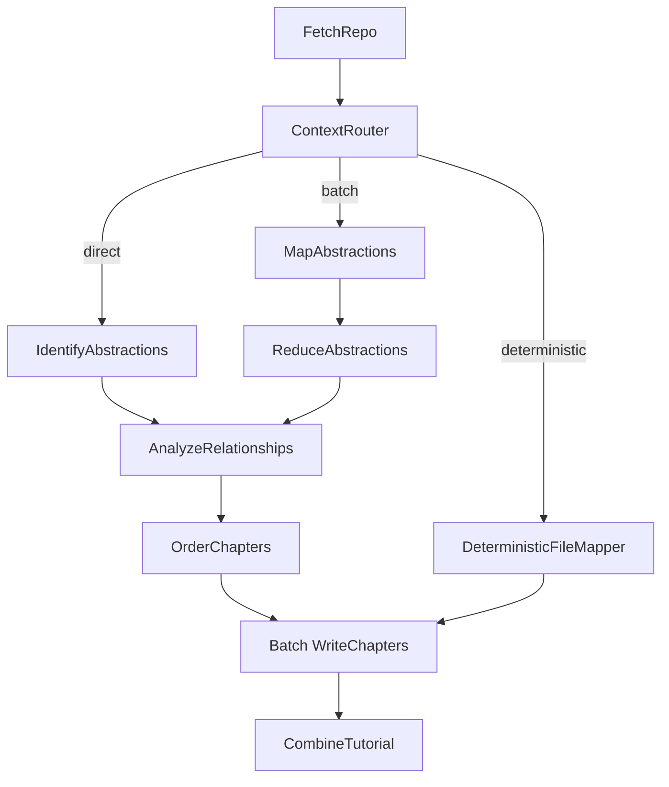

# System Design: Codebase Knowledge Builder

> Please DON'T remove notes for AI

## 1. Requirements

> Notes for AI: Keep it simple and clear.
> If the requirements are abstract, write concrete user stories

**User Story:** As a developer onboarding to a new codebase, I want a tutorial automatically generated from its GitHub repository or local directory, optionally in a specific language. The system supports four documentation styles: a **tutorial mode** that explains core abstractions with beginner-friendly language, analogies, and code walkthroughs; an **advanced mode** that produces architecture deep-dives aimed at senior developers or PMs joining a project mid-way, covering design patterns, key dependencies, and practical onboarding notes; an **api-reference mode** that generates exhaustive, formal API documentation for every code module (1:1 file-to-chapter mapping); and an **sdk mode** that produces SDK-style integration guides. The system must also gracefully handle codebases of any size by dynamically switching to a Map-Reduce approach when context limits are reached.

**Input:**
- A publicly accessible GitHub repository URL or a local directory path.
- A project name (optional, will be derived from the URL/directory if not provided).
- Desired language for the tutorial (optional, defaults to English).
- Advanced configurations: documentation style (`--mode`, `--advanced`), token scaling (`--max-tokens`, `--batch`, `--force-batch`), prompting (`--thinking-level`, `--thinking-profile`, `--thinking-override`, `--max-abstractions`), caching (`--no-cache`), output format (`--mkdocs`, `--incremental`, `--force-rebuild`), file filtering (`-i`/`--include`, `-e`/`--exclude`, `-s`/`--max-size`), output directory (`-o`/`--output`), GitHub token (`-t`/`--token`), debugging (`--debug`), and execution cleanup (`--cleanup`).

**Output:**
- A directory named after the project containing:
    - An `index.md` file with:
        - A high-level project summary (potentially translated).
        - A Mermaid flowchart diagram visualizing relationships between abstractions (using potentially translated names/labels).
        - An ordered list of links to chapter files (using potentially translated names).
        - A link to `full_content.md` at the bottom.
    - Individual Markdown files for each chapter (`01_chapter_one.md`, `02_chapter_two.md`, etc.) detailing core abstractions in a logical order (potentially translated content).
    - A `full_content.md` (inside the project subdirectory) containing all merged chapters and a Table of Contents.
    - When `--mkdocs` is used: YAML frontmatter is injected into every chapter, filenames mirror source directory structure instead of numbered prefixes, and the following MkDocs artifacts are generated: `mkdocs.yml` (Material theme config with panzoom and mermaid support), `docs/javascripts/mermaid-init.js` (custom Mermaid renderer), `docs/api/index.md` (section landing page with grouped chapter table and one-line module descriptions; api-reference adds an architecture overview and a module dependency graph from the grouping call, tutorial/advanced/sdk show the project summary and relationship diagram), and `nav_snippet.yml` next to `mkdocs.yml` (sidebar navigation snippet, with LLM-assisted grouping for api-reference mode; kept out of `docs/` so it is not published). `docs/api/` is generator-owned: `.md` pages that belong to no current chapter (removed/renamed modules, earlier runs in another mode) are deleted at the end of each run.
    - When `--incremental` is used (api-reference mode only): a `.doc_cache_manifest.json` tracks MD5 hashes of each module's source files plus a generation signature (mode, language, provider, model, `write_chapters` thinking level, `draft_chapters` template digest) to skip regeneration of unchanged modules across runs. Entries are keyed by the module's source path, rebuilt from the current run's chapters (removed modules drop out) and saved only after the pages are written.

## 2. Flow Design

> Notes for AI:
> 1. Consider the design patterns of agent, map-reduce, rag, and workflow. Apply them if they fit.
> 2. Present a concise, high-level description of the workflow.

### Applicable Design Pattern:

This project primarily uses a **Workflow** pattern with dynamic branching into a **Map-Reduce** pattern. The chapter writing step also utilizes a **BatchNode**.

1.  **Workflow & Routing:** The overall process fetches code, estimates token payloads, and routes based on context limits. If the codebase fits the LLM window, it goes directly to abstraction identification.
2.  **Map-Reduce:** If the codebase exceeds context limits (or if forced), the codebase is grouped into token-aware, directory-isolated batches (each batch stays under the effective token limit and never mixes files from different directories). A `MapAbstractions` BatchNode processes each batch individually, and a `ReduceAbstractions` Node merges them into a global list.
3.  **Batch Processing:** The `WriteChapters` node processes each identified abstraction independently (map) before final tutorial compilation.

### Flow high-level Design:

1.  **`FetchRepo`**: Crawls the specified repository/directory using `crawl_github_files` or `crawl_local_files`.
2.  **`ContextRouter`**: Analyzes the total token payload of the fetched files using `tiktoken`. Dynamically calculates **prompt overhead** (worst-case template tokens across 4 modes × 3 templates + directory tree tokens + chapter listing estimate tokens) and computes an **effective limit** = `safety_limit - prompt_overhead`. If `--mode api-reference` is used, routes to `"deterministic"`. If the file content tokens exceed this effective limit or if `--force-batch` is used, it chunks files into **token-aware, directory-isolated batches** (never mixing files from different directories) and routes to `"batch"`. Also builds a compact directory tree of all files (stored in `shared["directory_tree"]`) for cross-batch awareness. With `--debug`, displays detailed per-batch file lists and token breakdowns. Otherwise, it routes to `"direct"`.
3.  **Path A: Direct**
    *   **`IdentifyAbstractions`**: Analyzes the entire codebase at once to identify core abstractions.
4.  **Path B: Map-Reduce**
    *   **`MapAbstractions` (BatchNode)**: Analyzes each localized directory chunk to extract partial abstractions. Each batch receives the full directory tree for cross-batch awareness.
    *   **`ReduceAbstractions`**: Merges overlapping/partial abstractions into a global list of architecture components.
5.  **Path C: Deterministic** (api-reference mode)
    *   **`DeterministicFileMapper`**: Bypasses LLM-based abstraction discovery entirely. Uses a lightweight LLM call to filter out non-code files (configs, UI layouts, static assets), then creates a 1:1 mapping of each code file to a documentation module. Sorts chapters by **directory depth (deepest first, then alphabetical)** so that utility/leaf files are documented before orchestration files — their summaries become available as cross-chapter context via `previous_chapters_summary`. This ordering is language-agnostic (works for Python, C#, C++, Java, etc.). Skips `AnalyzeRelationships` and `OrderChapters`, routing directly to `WriteChapters`.
6.  **`AnalyzeRelationships`** (Paths A & B only): Takes the unified abstractions list (from either path) and generates a high-level project summary and relationships diagram. Uses token-budget-aware file inclusion: the budget is split evenly across abstractions, with unused budget redistributed in a second pass, maximizing code context without exceeding the context window.
7.  **`OrderChapters`** (Paths A & B only): Determines the most logical sequence to present the abstractions.
8.  **`WriteChapters` (BatchNode)**: Iterates through the ordered abstractions and writes detailed Markdown chapters using context-aware code inclusion.
9.  **`CombineTutorial`**: Assembles the final outputs including `index.md`, individual chapter files, and a compiled `full_content.md`.



## 3. Project Structure

> Notes for AI: This is the exact file tree. Create ALL these files when rebuilding.

```
codebase_kb/
├── main.py                          # CLI entry point: parse_arguments, build_shared_store, detect_llm_config, display_config, main orchestrator
├── flow.py                          # PocketFlow graph wiring
├── nodes.py                         # All 10 node classes (helpers moved to utils/)
├── .env.sample                      # Environment variable template
├── requirements.txt                 # Python dependencies
├── pyproject.toml                   # Ruff linter/formatter configuration
├── .pre-commit-config.yaml          # Pre-commit hooks (ruff check + ruff format)
├── README.md                        # Bilingual (EN/VI) user-facing documentation
├── CLAUDE.md                        # Agent rules for Claude Code (synced copy of AGENTS.md)
├── .python-version                  # pyenv Python version pin
├── .coderabbit.yaml                 # CodeRabbit AI review config
├── Dockerfile                       # Docker container build for CI/deployment
├── .dockerignore                    # Docker build exclusions
├── LICENSE                          # CC BY-NC-SA 4.0 (project copyright + full legal code)
├── NOTICE                           # How to credit, commercial-license contact, upstream MIT notices
├── .github/
│   ├── ci_mkdocs_config.py          # CI helper: generates mkdocs.yml and mermaid-init.js (avoids bash heredoc issues)
│   └── workflows/
│       ├── deploy-docs.yml          # GitHub Actions CI/CD: generate & deploy API docs (gated by DOCS_DEPLOY_MODE + docs-deploy approval)
│       └── lint.yml                 # GitHub Actions workflow for Ruff linting
├── utils/
│   ├── __init__.py                  # Empty
│   ├── call_llm.py                  # Multi-provider LLM dispatcher with model-scoped caching
│   ├── crawl_github_files.py        # GitHub API crawler
│   ├── crawl_local_files.py         # Local directory crawler
│   ├── exclude_patterns.py          # Centralized definition of DEFAULT_EXCLUDE_PATTERNS
│   ├── files.py                     # File and content helpers (build_directory_tree, get_content_for_indices)
│   ├── i18n.py                      # Auto-translation of missing UI strings via LLM
│   ├── llm_anthropic.py             # Native Anthropic (Claude) provider: adaptive thinking/effort, streaming, refusal fallbacks, usage
│   ├── llm_common.py                # SDK-free shared LLM helpers: TruncatedResponse, LLMRefusalError, refusal memo, usage ledger (per provider and per step), warn_once
│   ├── llm_gemini.py                # Native Gemini provider (google-genai): per-model thinking_level / budget, streaming, finish reasons, usage
│   ├── llm_openrouter.py            # OpenRouter provider (requests, SSE): catalog-driven reasoning.effort, max_tokens, temperature, usage
│   ├── llm_config.py                # LLM provider/settings resolution (resolve_llm_settings), context length, token ratio
│   ├── mkdocs.py                    # MkDocs output generation (config, nav, index, links, chapter writing)
│   ├── output.py                    # Centralized CLI output & logging utility (emit/get/emit_raw)
│   ├── prompts.py                   # Prompt template loaders, YAML parsers, inline prompt builders
│   ├── strings.csv                  # Externalized string table (STRING_KEY, LEVEL, DEST, 12 languages)
│   ├── thinking.py                  # Per-node thinking effort profiles ("thinking flows") and plan resolution
│   └── token_utils.py               # Token counting (model-calibrated), input budgets, context window resolution
├── prompts/
│   ├── tutorial/                    # Beginner-friendly prompt templates
│   │   ├── identify_abstractions.md
│   │   ├── map_abstractions.md
│   │   ├── reduce_abstractions.md
│   │   ├── identify_relationships.md
│   │   ├── order_chapters.md
│   │   └── draft_chapters.md
│   ├── advanced/                    # Senior-dev prompt templates
│   │   ├── identify_abstractions.md
│   │   ├── map_abstractions.md
│   │   ├── reduce_abstractions.md
│   │   ├── identify_relationships.md
│   │   ├── order_chapters.md
│   │   └── draft_chapters.md
│   ├── api-reference/               # Exhaustive API documentation templates
│   │   ├── identify_abstractions.md
│   │   ├── map_abstractions.md
│   │   ├── reduce_abstractions.md
│   │   ├── identify_relationships.md
│   │   ├── order_chapters.md
│   │   └── draft_chapters.md
│   ├── sdk/                         # SDK integration guide templates
│   │   ├── identify_abstractions.md
│   │   ├── map_abstractions.md
│   │   ├── reduce_abstractions.md
│   │   ├── identify_relationships.md
│   │   ├── order_chapters.md
│   │   └── draft_chapters.md
│   └── common/                      # Shared prompts used across modes
│       ├── group_modules.md         # LLM-assisted sidebar nav grouping + module descriptions and dependencies (api/index.md)
│       └── translate_strings.md     # LLM-assisted translation prompt
└── docs/
    ├── design.md                    # THIS FILE
    ├── index.md                     # Project README/landing page
    └── pocketflow/                  # PocketFlow framework reference docs
        ├── guide.md
        ├── index.md
        └── core_abstraction/
            ├── node.md
            ├── flow.md
            ├── communication.md
            ├── batch.md
            ├── async.md
            └── parallel.md
├── .agents/
│   └── rules/
│       ├── AGENTS.md                # Agent rules for Gemini/Antigravity
│       └── GEMINI.md                # Agent rules (synced copy)
├── .clinerules/
│   └── project.md                   # Agent rules for Cline/Roo (synced copy)
├── .cursor/
│   └── rules/
│       └── project.mdc              # Agent rules for Cursor (synced copy)
└── .windsurf/
    └── rules/
        └── project.md               # Agent rules for Windsurf (synced copy)
```

## 4. Dependencies

> Notes for AI: Use these EXACT versions in `requirements.txt`.

```
pocketflow>=0.0.3
pyyaml>=6.0.3
requests>=2.34.2
gitpython>=3.1.59
google-genai>=2.18.1
anthropic>=1.8.0
python-dotenv>=1.2.3
pathspec>=1.1.1
tiktoken>=0.8.0
mkdocs>=1.6.0
mkdocs-material>=9.0.0
mkdocs-panzoom-plugin>=0.5.2
```

`google-genai` covers both Gemini API-key and Vertex AI access (it pulls in `google-auth`), so `google-cloud-aiplatform` is not needed. `mkdocs-panzoom-plugin>=0.5.2` is the version whose `include_selectors`/`exclude_selectors` handling the MkDocs config relies on.

## 5. Environment Configuration

> Notes for AI: Create `.env.sample` (committed) and `.env` (gitignored). The project uses `python-dotenv` to load `.env`.

### `.env.sample` content:
```ini
# Provider Selection
# LLM_PROVIDER = OPENROUTER
# Notes go on their own comment lines: text after a value (without " # ") becomes part of the value.

# GitHub Token (Optional, for avoiding rate limits when crawling public repos)
# GITHUB_TOKEN = <YOUR_GITHUB_TOKEN>

# --- Gemini (Default if no LLM_PROVIDER is set) — needs google-genai >= 1.56 (pip install -r requirements.txt) ---
# AI Studio key (https://aistudio.google.com/apikey):
# GEMINI_API_KEY = <YOUR_GEMINI_API_KEY>
# OR Vertex AI (Application Default Credentials: gcloud auth application-default login):
# GEMINI_PROJECT_ID = <YOUR_GEMINI_PROJECT_ID>
# Vertex location: Gemini 3.x is served from global / us / eu (3.1 Pro and 3 Flash: global only), not us-central1.
# Regional endpoints cost about 10% more than global.
# GEMINI_LOCATION = global
# Gemini 3.1+ models: gemini-3.8-flash (default), gemini-3.7-flash, gemini-3.6-flash, gemini-3.5-flash,
#   gemini-3.5-flash-lite, gemini-3.1-flash-lite, gemini-3.1-pro-preview, gemini-3.8-flash-cyber (Vertex, allowlisted);
#   aliases gemini-flash-latest / gemini-pro-latest also work. 2.5 models use thinking budgets.
# GEMINI_MODEL = gemini-3.8-flash
# Output cap incl. thinking; default per thinking level, max 65,536:
# GEMINI_MAX_OUTPUT_TOKENS = 65536
# Total deadline per request in seconds (covers the whole streamed reply, so keep it generous):
# GEMINI_TIMEOUT_SECONDS = 1800
# tiktoken -> Gemini token multiplier (static prior; calibrated automatically from billed usage):
# GEMINI_TOKEN_RATIO = 1.0

# --- Anthropic (Claude) — requires LLM_PROVIDER=ANTHROPIC (never auto-selected from ANTHROPIC_API_KEY) ---
# LLM_PROVIDER = ANTHROPIC
# Auth — EITHER an API key:
# ANTHROPIC_API_KEY = <YOUR_ANTHROPIC_API_KEY>
# OR log in with the ant CLI (no key; leave ANTHROPIC_API_KEY unset — a non-empty key overrides the login):
#   1. install ant: Windows: winget install Anthropic.Ant | macOS: brew install anthropics/tap/ant | Linux: https://github.com/anthropics/anthropic-cli/releases
#      or with Go 1.25+: go install github.com/anthropics/anthropic-cli/cmd/ant@latest
#   2. ant auth login      (browser: pick your organization + workspace; billed to that API org)
#   3. ant auth status     (main.py and utils/call_llm.py run this check automatically)
# Claude 4.6+ (adaptive thinking + effort) and Haiku 4.5 (thinking budgets) are supported.
# Default claude-sonnet-5; set e.g. claude-opus-5-5 for Opus 5.5 (higher price):
# ANTHROPIC_MODEL = claude-sonnet-5
# Optional: gateway/proxy base URL, or an OAuth bearer token instead of the API key
# ANTHROPIC_BASE_URL = https://api.anthropic.com
# ANTHROPIC_AUTH_TOKEN = <YOUR_ANTHROPIC_AUTH_TOKEN>
# Refusal fallbacks: default (Opus 5.x / Fable 5.x: server picks the fallback model) | off |
#   comma-separated model IDs (any model, e.g. for Mythos 5.1)
# ANTHROPIC_FALLBACKS = default
# ANTHROPIC_MAX_OUTPUT_TOKENS = 64000
# ANTHROPIC_PROMPT_CACHE = off
# tiktoken -> Claude token multiplier used for context budgeting (static prior; calibrated automatically);
#   default 1.55 for Opus 4.7+ tokenizer models (incl. Sonnet 5), 1.2 for 4.6 and older:
# ANTHROPIC_TOKEN_RATIO = 1.55

# --- OpenRouter (key: https://openrouter.ai/settings/keys) — reasoning/limits come from the model catalog ---
# LLM_PROVIDER = OPENROUTER
# OPENROUTER_API_KEY = <YOUR_OPENROUTER_API_KEY>
# Default https://openrouter.ai/api (a trailing /v1 is accepted). Another OpenAI-compatible host with an
#   OpenRouter-style /v1/models catalog also works; the key is then optional.
# OPENROUTER_BASE_URL = https://openrouter.ai/api
# OPENROUTER_MODEL = anthropic/claude-sonnet-4.6
# OPENROUTER_MODEL = anthropic/claude-opus-4.6
# OPENROUTER_MODEL = google/gemini-3.1-pro-preview
# OPENROUTER_MODEL = qwen/qwen3.8-flash
# Output cap incl. reasoning; default per thinking level (omitted for models missing from the catalog):
# OPENROUTER_MAX_OUTPUT_TOKENS = 64000
# Max silence between streamed events in seconds:
# OPENROUTER_TIMEOUT_SECONDS = 300
# Only for non-reasoning requests on models that accept it:
# OPENROUTER_TEMPERATURE = 0.7
# App attribution is off by default. Set a URL to opt in: it is sent as HTTP-Referer together with the
#   title "Codebase Knowledge Builder" (X-OpenRouter-Title), e.g. this project's repository:
# OPENROUTER_APP_URL = https://github.com/ardennguyen/Codebase-Knowledge-Builder

# --- Ollama ---
# OLLAMA_BASE_URL = http://localhost:11434
# OLLAMA_MODEL = llama3

# --- General ---
# tiktoken multiplier for other providers:
# LLM_TOKEN_RATIO = 1.0
# Token-ratio calibration: learns the real tiktoken -> provider ratio from billed prompt tokens per
#   provider+model, saves it to llm_token_calibration.json for the next run (on by default):
# TOKEN_RATIO_CALIBRATION = on
# LOG_DIR = logs
```

> `python-dotenv` keeps text after an unquoted value unless it is preceded by `" #"`, so notes live on their
> own comment lines — never append `(note)` after a value.

### Provider Resolution Logic

`utils/llm_config.resolve_llm_settings()` is the **single source of truth** — `main.detect_llm_config`,
`token_utils.resolve_max_tokens` and `call_llm` all call it. Do not re-implement provider detection elsewhere.

```python
def get_llm_provider() -> str | None:
    provider = os.getenv("LLM_PROVIDER")
    if provider:
        return provider.strip().upper()          # explicit wins (normalized to upper case)
    if os.getenv("GEMINI_PROJECT_ID") or os.getenv("GEMINI_API_KEY"):
        return "GEMINI"                          # legacy default
    return None   # ANTHROPIC is never auto-selected: ANTHROPIC_API_KEY is often exported for other tools

def resolve_llm_settings() -> tuple[str, str, str, str]:   # (provider, model_name, endpoint_url, api_key)
    # GEMINI    → GEMINI_MODEL (default gemini-3.8-flash), "generativelanguage.googleapis.com", GEMINI_API_KEY
    # GEMINI (Vertex, GEMINI_PROJECT_ID set) → endpoint "aiplatform.googleapis.com" (global),
    #             "aiplatform.{us|eu}.rep.googleapis.com" (multi-region) or "{loc}-aiplatform.googleapis.com", api_key ""
    # ANTHROPIC → ANTHROPIC_MODEL (default claude-sonnet-5), ANTHROPIC_BASE_URL or "https://api.anthropic.com", ANTHROPIC_API_KEY
    # OPENROUTER → OPENROUTER_MODEL, OPENROUTER_BASE_URL (trailing "/v1" stripped) or "https://openrouter.ai/api", OPENROUTER_API_KEY
    # other     → {P}_MODEL / {P}_BASE_URL / {P}_API_KEY ("unknown" when unset)
    # none      → ("UNKNOWN", "unknown", "unknown", "")
```

### Gemini Client Initialization (Vertex AI vs API Key)

> Notes for AI: The Gemini provider supports TWO authentication modes. You MUST implement both. The client
> lives in `utils/llm_gemini._get_client()` (the only google-genai importer); see Section 17.

```python
http_options = types.HttpOptions(
    timeout=_timeout_ms(),   # GEMINI_TIMEOUT_SECONDS (default 1800) → ms; total deadline for the whole stream
    retry_options=types.HttpRetryOptions(attempts=2, http_status_codes=[408, 429, 500, 502, 503, 504]),
)
if os.getenv("GEMINI_PROJECT_ID"):
    client = genai.Client(vertexai=True, project=os.getenv("GEMINI_PROJECT_ID"),
                          location=gemini_location(),   # GEMINI_LOCATION, default "global"
                          http_options=http_options)
elif os.getenv("GEMINI_API_KEY"):
    # vertexai=False explicitly, so GOOGLE_GENAI_USE_VERTEXAI in the environment cannot reroute the key
    client = genai.Client(vertexai=False, api_key=os.getenv("GEMINI_API_KEY"), http_options=http_options)
else:
    raise ValueError("Either GEMINI_PROJECT_ID or GEMINI_API_KEY must be set in the environment")
```

`LOG_DIR` (default `logs`) is read by `main.py` and `utils/output.py`.

## 6. CLI Arguments & Startup Display

> Notes for AI: Implement ALL these CLI arguments in `main.py` via `argparse`. The startup display MUST be printed before the flow runs.

### CLI Arguments

| Argument | Type | Default | Description |
|---|---|---|---|
| `--repo` | `str` | `None` | URL of the public GitHub repository. |
| `--dir` | `str` | `None` | Path to local directory. |
| `-n`, `--name` | `str` | `None` | Project name (optional, derived from repo/directory if omitted). |
| `-t`, `--token` | `str` | `None` | GitHub personal access token (optional, reads from GITHUB_TOKEN env var if not provided). |
| `-o`, `--output` | `str` | `"output"` | Base directory for output (default: ./output). |
| `-i`, `--include` | `nargs="+"` | `None` | Files to include (e.g., '*.py' '*.js'). Defaults to '*' (all files). |
| `-e`, `--exclude` | `nargs="+"` | `None` | Files to exclude. Custom patterns are automatically merged with a massive global exclusion list (build caches, node_modules, binaries, media, AI environments) AND your repository's native .gitignore rules. |
| `-s`, `--max-size` | `int` | `200000` | Maximum file size in bytes (default: 200000, about 200KB). |
| `--language` | `str` | `"english"` | Language for the generated tutorial (default: english). |
| `--no-cache` | `store_true` | `False` | Disable LLM response caching (default: caching enabled). |
| `--cleanup` | `store_true` | `False` | Clean up logs and cache files. Can be used standalone or after a run. |
| `--max-abstractions` | `int` | `10` | Maximum number of abstractions to identify (default: 10). |
| `--thinking-level` | `str` (`_thinking_level_arg`, lower-cased) | `None` | Global thinking effort for EVERY LLM call: `minimal`, `low`, `medium`, `high`, `xhigh`, `max`; `default` or empty = model default. Overrides `--thinking-profile`. Mapped per provider (Section 17). |
| `--thinking-profile` | `str` (choices, lower-cased) | `"auto"` | Per-node effort profile: `auto`, `off`, `economy`, `balanced`, `quality`, `max`. `auto` = `balanced` on `ANTHROPIC`, `GEMINI` and `OPENROUTER` (`utils/thinking.PROFILED_PROVIDERS`), `off` (model defaults) elsewhere. |
| `--thinking-override` | `nargs="+"` (`NODE=LEVEL`) | `None` | Per-node overrides, highest precedence (e.g. `write_chapters=high`). NODE ∈ `utils/thinking.NODE_KEYS`. |
| `--max-tokens` | `int` | `None` | Maximum number of tokens for the context window (default: fetched dynamically). |
| `--mode` | `str` | `"tutorial"` | Documentation style (tutorial, advanced, api-reference, sdk). (default: tutorial). |
| `--advanced` | `store_true` | `False` | Legacy flag: equivalent to --mode advanced. |
| `--mkdocs` | `store_true` | `False` | Format output for MkDocs Material (adds YAML frontmatter & nav snippet). |
| `--incremental` | `store_true` | `False` | Enable MD5 incremental caching to skip unchanged modules (Only supported in --mode api-reference). |
| `--force-rebuild` | `store_true` | `False` | Clear incremental cache and regenerate all chapters from scratch (use with --incremental). |
| `--batch` | `int` | `50` | Maximum files per batch when using map-reduce mode (default: 50). |
| `--force-batch` | `store_true` | `False` | Force map-reduce mode regardless of context size. |
| `--debug` | `store_true` | `False` | Enable verbose debug output. |

### Startup Config Display
```python
def display_config(args, mode, provider, model_name, endpoint_url, context_length, log_file, thinking_profile, thinking_plan):
    """Emit all configuration values to the console."""
    emit("START_GENERATION", source=args.repo or args.dir, language=args.language.capitalize())
    emit("CFG_HEADER")
    emit("CFG_AI_PROVIDER", value=provider)
    emit("CFG_AI_ENDPOINT", value=endpoint_url)
    emit("CFG_AI_MODEL", value=model_name)
    emit("CFG_CONTEXT_LENGTH", value=f"{context_length:,}")
    emit("CFG_THINKING_LEVEL", value=args.thinking_level or "None")
    emit("CFG_THINKING_PROFILE", value=thinking_profile)          # resolved: balanced / off / global / ...
    if any(thinking_plan.values()):
        emit("CFG_THINKING_PLAN", value=describe_plan(thinking_plan, mode))  # node=level for nodes that run in this mode
    emit("CFG_THINKING_SUPPORT", value=describe_thinking_support(provider, model_name))
    emit("CFG_TOKEN_RATIO", value=describe_token_ratio())   # "1.55 (static prior ...)" or "1.61 (calibrated from 12 calls; static 1.55)"
    emit("CFG_BATCH_SIZE", value=f"{args.batch}")
    _enabled = get("CFG_VALUE_ENABLED")
    _disabled = get("CFG_VALUE_DISABLED")
    emit("CFG_FORCE_BATCH", value=_enabled if args.force_batch else _disabled)
    emit("CFG_OUTPUT_MODE", value=mode)
    emit("CFG_MKDOCS", value=_enabled if args.mkdocs else _disabled)
    emit("CFG_INCREMENTAL", value=_enabled if args.incremental else _disabled)
    if args.incremental:
        emit("CFG_FORCE_REBUILD", value=_enabled if args.force_rebuild else _disabled)
    if mode == "api-reference":
        emit("CFG_MAX_ABSTRACTIONS", value=get("CFG_VALUE_API_REF_MAX"))
    else:
        emit("CFG_MAX_ABSTRACTIONS", value=str(args.max_abstractions))
    emit("CFG_LLM_CACHING", value=_disabled if args.no_cache else _enabled)
    if args.debug:
        emit("CFG_DEBUG_MODE")
    emit("CFG_LOG_FILE", value=log_file)
    print()  # Blank line after config block
```

### Argument Validation Rules

These checks run in `main()` after `parse_args()`. All use `emit()` for bilingual output:

| Condition | Severity | Action | String Key |
|---|---|---|---|
| `--advanced` with explicit `--mode` | WARNING | Use advanced, warn user | `WARN_ADVANCED_OVERRIDES_MODE` |
| `--token` without `--repo` | WARNING | Ignore token, warn user | `WARN_TOKEN_NO_REPO` |
| `--force-rebuild` without `--incremental` | ERROR | `sys.exit(1)` | `ERROR_FORCE_REBUILD_NO_INCREMENTAL` |
| `--force-batch` with `--mode api-reference` | WARNING | Clear flag, warn user | `WARN_FORCE_BATCH_API_REF` |
| `--max-abstractions` with `--mode api-reference` | WARNING | Warn user (flag ignored at runtime) | `WARN_MAX_ABS_API_REF` |
| `--incremental` with `--mode` != `api-reference` | WARNING | Clear flag, warn user | `WARN_INCREMENTAL_API_ONLY` |
| `--exclude`/`--include` value contains embedded CLI flag | ERROR | `sys.exit(1)` | `ERROR_QUOTING` |
| `--thinking-override` value not `NODE=LEVEL` with a known NODE/LEVEL | ERROR | `sys.exit(1)` | `ERROR_THINKING_OVERRIDE` |
| `--thinking-level` with an explicit `--thinking-profile` (not `auto`) | WARNING | Global level wins, warn user | `WARN_THINKING_LEVEL_OVERRIDES_PROFILE` |
| `--thinking-override` for a node the mode never calls (`thinking.MODE_NODES`) | WARNING | Keep going, warn user | `WARN_THINKING_OVERRIDE_UNUSED` |
| `LLM_PROVIDER=ANTHROPIC` and `check_anthropic_auth()` fails (no `anthropic` package; or no key and no active `ant` login) | ERROR | Print setup instructions, `sys.exit(1)` before crawling | `ERROR_ANTHROPIC_SDK_MISSING` / `ERROR_ANTHROPIC_NO_CREDENTIALS` / `ERROR_ANTHROPIC_NOT_LOGGED_IN` + `ANTHROPIC_AUTH_HELP_*` |

Note: `--repo`/`--dir` exclusivity is handled by `argparse.add_mutually_exclusive_group()` (built-in argparse error). The quoting error check in `_check_quoting_errors(parser, args)` dynamically extracts all registered flags (both `--long` and `-short`) from the argparse parser — no hardcoded flag list to maintain.

## 7. Default Exclude Patterns

> Notes for AI: `DEFAULT_EXCLUDE_PATTERNS` is defined in `utils/exclude_patterns.py`, while `DEFAULT_INCLUDE_PATTERNS = {"*"}` is defined in `main.py`. `DEFAULT_EXCLUDE_PATTERNS` is imported into `main.py`. User-supplied `--exclude` patterns are MERGED with (not replacing) this set via `.union()`.

```python
DEFAULT_INCLUDE_PATTERNS = {"*"}

DEFAULT_EXCLUDE_PATTERNS = {
    # 1. Media, Data, and Static Assets
    "assets/*", "data/*", "images/*", "public/*", "static/*", "temp/*", "tmp/*", "media/*",
    "*.jpg", "*.jpeg", "*.png", "*.gif", "*.ico", "*.svg", "*.webp",
    "*.mp4", "*.webm", "*.mov", "*.mp3", "*.wav",
    "*.pdf", "*.doc", "*.docx", "*.xls", "*.xlsx", "*.ppt", "*.pptx",
    "*.zip", "*.tar", "*.gz", "*.rar", "*.7z",

    # 2. Build, Distribution, and Framework Caches
    "dist/*", "build/*", "out/*", "output/*", "output-test*/*", "target/*", "bin/*", "obj/*",
    ".next/*", ".nuxt/*", ".svelte-kit/*", ".expo/*",
    "docs/*", "test/*", "tests/*", "examples/*",
    "v1/*", "experimental/*", "deprecated/*", "misc/*", "legacy/*",
    "*.log", "*.bak", "*.tmp", "*.swp",

    # 3. Environments, Dependencies & Lockfiles
    "venv/*", ".venv/*", "env/*", ".env", ".env.*",
    # Secrets at any depth — never sent to an LLM provider or written to the cache
    "*/.env", "*/.env.*", "*.pem", "*.key", "*.p12", "*.pfx", "*.jks", "*.keystore",
    "id_rsa", "id_rsa.*", "*/id_rsa", "*/id_rsa.*",          # SSH keys, anchored to the basename
    "id_ecdsa", "id_ecdsa.*", "*/id_ecdsa", "*/id_ecdsa.*",
    "id_ed25519", "id_ed25519.*", "*/id_ed25519", "*/id_ed25519.*",
    "node_modules/*", "bower_components/*", "jspm_packages/*",
    "vendor/*", "packages/*",
    "*.lock", "package-lock.json", "yarn.lock", "pnpm-lock.yaml", "Cargo.lock", "Gemfile.lock", "poetry.lock", "mix.lock", "Pipfile.lock",

    # 4. Language-Specific Exclusions
    "__pycache__/*", "*.pyc", "*.pyo", "*.pyd", ".pytest_cache/*", ".ruff_cache/*", ".tox/*", ".coverage", "htmlcov/*", # Python
    ".gradle/*", "*.class", "*.jar", "*.war", "*.ear", "*.nar", # Java / JVM
    "*.o", "*.obj", "*.dll", "*.exe", "*.so", "*.dylib", "*.lib", "*.a", # C/C++/Native
    "ios/Pods/*", "android/.gradle/*", "android/app/build/*", # Mobile

    # 5. OS & Version Control
    ".git/*", ".github/*", ".svn/*", ".hg/*",
    ".DS_Store", "Thumbs.db", "desktop.ini",

    # 6. Classic IDEs
    ".vscode/*", ".idea/*", "*.iml", ".eclipse/*", ".settings/*", ".classpath", ".project", ".vs/*",

    # 7. AI Agents & Modern AI IDEs
    ".cursor/*", ".cursorrules",
    ".windsurf/*", ".windsurfrules",
    ".cline/*", ".clinerules",
    ".roo/*", ".roorules",
    ".agent/*", ".agents/*",
    ".continue/*", ".aide/*",
    ".gemini/*", ".antigravity/*",
    ".claude/*", ".copilot/*",
}
```

## 8. Shared Store Schema

> Notes for AI: This is the EXACT shared store structure. Pay attention to data type transformations noted with ⚠.

```python
shared = {
    # --- Set by main.py from CLI args ---
    "repo_url": args.repo,                    # str | None
    "local_dir": args.dir,                    # str | None
    "project_name": project_name,             # str — resolved once by resolve_mode_and_project() (repo basename without .git, or dir basename) so logs, --force-rebuild and output agree; FetchRepo derives the same way only if None
    "github_token": github_token,             # str | None
    "output_dir": args.output,                # str, default "output"
    "include_patterns": include_set,          # set[str]
    "exclude_patterns": exclude_set,          # set[str]
    "max_file_size": args.max_size,           # int, default 200000
    "language": args.language,                 # str, default "english"
    "use_cache": not args.no_cache,           # bool, default True
    "max_abstraction_num": args.max_abstractions,  # int, default 10
    "thinking_level": args.thinking_level,    # str | None — global level (legacy); nodes read thinking_plan via resolve_thinking_level()
    "thinking_plan": thinking_plan,           # dict[str, str | None] — per-node levels keyed by utils/thinking.NODE_KEYS (Section 17)
    "max_tokens": args.max_tokens,            # int | None (auto-detected later)
    "mode": mode,                             # str: "tutorial", "advanced", "api-reference", or "sdk"
    "mkdocs": args.mkdocs,                    # bool, default False
    "incremental": args.incremental,          # bool, default False
    "advanced_mode": mode == "advanced",  # bool, derived from mode
    "batch_size": args.batch,                 # int, default 50
    "force_batch": args.force_batch,          # bool, default False
    "debug": args.debug,                      # bool, default False

    # --- Populated by downstream nodes (initialized empty in main.py) ---
    "files": [],              # Set by FetchRepo: list[tuple[str, str]] = [(relpath, content), ...]
    "abstractions": [],       # Set by IdentifyAbstractions OR ReduceAbstractions
    "relationships": {},      # Set by AnalyzeRelationships
    "chapter_order": [],      # Set by OrderChapters
    "chapters": [],           # Set by WriteChapters
    "final_output_dir": None  # Set by CombineTutorial
}
```

**Runtime-only keys** (created by nodes at runtime — do NOT add to `build_shared_store()`):

| Key | Set by | Type | Description |
|---|---|---|---|
| `mapped_abstractions` | `MapAbstractions` (batch path) | `list[dict]` | Per-batch abstraction results |
| `file_batches` | `ContextRouter` (batch path) | `list[list[tuple]]` | File batches with global indices |
| `directory_tree` | `ContextRouter.post()` (every route) | `str` | Full directory tree string (read by draft_chapters and group_modules prompts) |
| `chapter_summaries` | `WriteChapters.post()` | `list[str]` | Per-chapter summaries for LLM nav grouping and `api/index.md` descriptions |
| `pending_manifest` | `WriteChapters.post()` (`--incremental` only) | `dict[str, dict]` | New incremental manifest (`{source_path: {"hash", "summary", "filename"}}`); written to `.doc_cache_manifest.json` by `CombineTutorial.post()` after the pages are on disk |

### Data Transformations Between Nodes

> Notes for AI: These transformations are CRITICAL. An AI builder MUST understand how data shapes change as it flows through nodes.

| Stage | `shared["files"]` format | Who transforms |
|---|---|---|
| After FetchRepo | `[(relpath, content), ...]` — 2-tuples sorted by path | FetchRepo.post |
| Used by ContextRouter | Same 2-tuples — ContextRouter reads but does NOT modify `shared["files"]` | — |
| `shared["file_batches"]` | `[[(global_idx, path, content), ...], ...]` — list of batches, each batch is list of 3-tuples with global index | ContextRouter.post |

| Stage | `shared["abstractions"]` format |
|---|---|
| After Identify/Reduce | `[{"name": str, "description": str, "files": [int, ...]}, ...]` |
| After DeterministicFileMapper | `[{"name": str, "description": str, "files": [int], "original_path": str}, ...]` |
| Note | `"files"` key contains validated integer indices into `shared["files"]`. In api-reference mode, `"original_path"` stores the relative repository path of the source file. |

| Stage | `shared["relationships"]` format |
|---|---|
| After AnalyzeRelationships | `{"summary": str, "details": [{"from": int, "to": int, "label": str}, ...]}` |
| Note | LLM returns `from_abstraction`/`to_abstraction` strings; node parses to int `from`/`to` |

| Stage | `shared["mapped_abstractions"]` format |
|---|---|
| After MapAbstractions | `[{"name": str, "description": str, "files": [int, ...]}, ...]` — flattened from all batches |
| Note | Only exists in batch path. Fed into ReduceAbstractions for merging/deduplication |

| Stage | `shared["directory_tree"]` format |
|---|---|
| After ContextRouter | String built by `build_directory_tree()` — see Section 10 for format |
| Note | Used by IdentifyAbstractions (all modes), MapAbstractions (batch path), and CombineTutorial (nav grouping) for project structure context |

## 9. Utility Interface Contracts

> Notes for AI: These are EXACT function signatures. Do NOT rename parameters. Do NOT change return formats.

### `crawl_local_files`
```python
def crawl_local_files(directory, include_patterns=None, exclude_patterns=None,
                      max_file_size=None, use_relative_paths=True) -> dict:
    # Returns: {"files": {relative_path_str: content_str, ...}}
```

**Directory Pruning Algorithm** (critical for nested directories like `Core.User/.vs/`):
> Note: `DEFAULT_EXCLUDE_PATTERNS` is imported from `utils/exclude_patterns.py`. Nested `.gitignore` files are supported: during `os.walk`, each subdirectory is checked for its own `.gitignore`, and a dict of `{abs_dir_path: pathspec}` is maintained. Matching uses `os.path.relpath()` from each spec's directory.

```python
# During os.walk, for each subdirectory d:
excluded_dirs = set()
for d in dirs:
    abs_d = os.path.join(root, d)
    dirpath_rel = os.path.relpath(abs_d, directory)
    # Check .gitignore first (iterating through nested specs)
    is_ignored = False
    for spec_dir, spec in gitignore_specs.items():
        if abs_d.startswith(spec_dir):
            rel_to_spec = os.path.relpath(abs_d, spec_dir)
            if spec.match_file(rel_to_spec):
                is_ignored = True
                break
    if is_ignored:
        excluded_dirs.add(d)
        continue
    # Check exclude patterns — strip trailing /* for directory matching
    if exclude_patterns:
        for pattern in exclude_patterns:
            dir_pattern = pattern[:-2] if pattern.endswith("/*") else pattern
            if fnmatch.fnmatch(dirpath_rel, dir_pattern) or fnmatch.fnmatch(d, dir_pattern):
                excluded_dirs.add(d)
                break
# Remove matched dirs to prevent os.walk descent
for d in dirs.copy():
    if d in excluded_dirs:
        dirs.remove(d)
```

> Note: Directory validation: raises `ValueError` if `directory` path doesn't exist. Loads `.gitignore` with `utf-8-sig` encoding (BOM-safe). All directories and files are `sorted()` for deterministic traversal order.

**Progress Display Format:**
Output is handled by `utils.output.emit()` using string keys (e.g., `CRAWL_FILE_PROCESSED`).
Colors (Green for processed, Gray for excluded, Red for errors) are configured via the `LEVEL` column in `strings.csv`.

> Note: After crawling, prints a `--- Crawl Summary ---` block with total found, processed, excluded, size limited, and non-text counts.

### `crawl_github_files`
```python
def crawl_github_files(repo_url, token=None, max_file_size=1048576,
                       use_relative_paths=False, include_patterns=None,
                       exclude_patterns=None) -> dict:
    # Returns: {"files": {path_str: content_str, ...}, "stats": {...}}
```

> Notes for AI: This is the most complex utility (~550 lines). You MUST implement ALL subsystems below.

**Imports required:** `requests`, `base64`, `os`, `tempfile`, `git`, `time`, `fnmatch`, `pathspec`, `urlparse`

**Input normalization:** Convert single string patterns to `set`:
```python
if include_patterns and isinstance(include_patterns, str):
    include_patterns = {include_patterns}
if exclude_patterns and isinstance(exclude_patterns, str):
    exclude_patterns = {exclude_patterns}
```

**`should_include_file(file_path, file_name, gitignore_spec=None)` helper:**
- If `include_patterns` set: file must match at least one pattern via `fnmatch.fnmatch(file_name, pattern)`
- If `gitignore_spec`: reject if `gitignore_spec.match_file(file_path)`
- If `exclude_patterns`: reject if `fnmatch.fnmatch(file_path, pattern)` matches any

#### Path 1: SSH/Git Clone
Triggered when `repo_url.startswith("git@") or repo_url.endswith(".git")`:
```python
with tempfile.TemporaryDirectory() as tmpdirname:
    print(f"Cloning SSH repo {repo_url} to temp dir {tmpdirname} ...")
    try:
        repo = git.Repo.clone_from(repo_url, tmpdirname)
    except Exception as e:
        print(f"Error cloning repo: {e}")
        return {"files": {}, "stats": {"error": str(e)}}

    files = {}
    skipped_files = []
    
    # All logging uses emit() from utils/output.py — no raw ANSI constants.
    # emit("CRAWL_ENTRY_PROCESSED", num=entry_num, path=rel_path)
    # emit("CRAWL_ENTRY_EXCLUDED", num=entry_num, path=rel_path, reason=reason)
    # emit("CRAWL_SUMMARY_HEADER"); emit("CRAWL_SUMMARY_TOTAL", count=total)

    # --- Counters ---
    count_processed = 0
    count_excluded = 0
    count_size_limit = 0
    count_non_text = 0
    skipped_size_list = []
    skipped_non_text_list = []
    entry_num = 0

    # --- Load .gitignore (BOM-safe) ---
    gitignore_path = os.path.join(tmpdirname, ".gitignore")
    gitignore_spec = None
    if os.path.exists(gitignore_path):
        try:
            with open(gitignore_path, "r", encoding="utf-8-sig") as f:
                gitignore_spec = pathspec.PathSpec.from_lines("gitwildmatch", f.readlines())
        except Exception:
            pass

    for root, dirs, filenames in os.walk(tmpdirname):
        # --- Directory pruning (same algorithm as crawl_local_files) ---
        excluded_dirs = set()
        for d in sorted(dirs):
            dirpath_rel = os.path.relpath(os.path.join(root, d), tmpdirname)
            reason = None
            if gitignore_spec and gitignore_spec.match_file(dirpath_rel):
                reason = "excluded (.gitignore)"
            elif exclude_patterns:
                for pattern in exclude_patterns:
                    dir_pattern = pattern[:-2] if pattern.endswith("/*") else pattern
                    if fnmatch.fnmatch(dirpath_rel, dir_pattern) or fnmatch.fnmatch(d, dir_pattern):
                        reason = "excluded"
                        break
            if reason:
                excluded_dirs.add(d)
                entry_num += 1
                count_excluded += 1
                print(f"{C_GRAY}  [{entry_num}] {dirpath_rel}/ [{reason}]{C_RESET}")

        for d in dirs.copy():
            if d in excluded_dirs:
                dirs.remove(d)
        dirs.sort()  # Deterministic traversal order

        # --- File processing ---
        for filename in sorted(filenames):
            abs_path = os.path.join(root, filename)
            rel_path = os.path.relpath(abs_path, tmpdirname)
            entry_num += 1

            if not should_include_file(rel_path, filename, gitignore_spec=gitignore_spec):
                count_excluded += 1
                print(f"{C_GRAY}  [{entry_num}] {rel_path} [excluded]{C_RESET}")
                continue

            try:
                file_size = os.path.getsize(abs_path)
            except OSError:
                continue

            if file_size > max_file_size:
                count_size_limit += 1
                skipped_size_list.append(rel_path)
                size_kb = file_size / 1024
                print(f"{C_RED}  [{entry_num}] {rel_path} [size limit: {size_kb:.0f}KB]{C_RESET}")
                continue

            try:
                with open(abs_path, "r", encoding="utf-8-sig") as f:
                    content = f.read()
                files[rel_path] = content
                count_processed += 1
                print(f"{C_GREEN}  [{entry_num}] {rel_path} [processed]{C_RESET}")
            except (UnicodeDecodeError, ValueError):
                count_non_text += 1
                skipped_non_text_list.append(rel_path)
                print(f"{C_RED}  [{entry_num}] {rel_path} [cannot process: not a text file]{C_RESET}")
            except Exception as e:
                count_non_text += 1
                skipped_non_text_list.append(rel_path)
                print(f"{C_RED}  [{entry_num}] {rel_path} [cannot process: {e}]{C_RESET}")

    # --- Crawl Summary ---
    total_fetched = count_processed + count_excluded + count_size_limit + count_non_text
    print(f"\n--- Crawl Summary ---")
    print(f"  Total found : {total_fetched}")
    print(f"{C_GREEN}  Processed   : {count_processed}{C_RESET}")
    if count_excluded > 0:
        print(f"{C_GRAY}  Excluded    : {count_excluded}{C_RESET}")
    if count_size_limit > 0:
        print(f"{C_RED}  Size limit  : {count_size_limit}{C_RESET}")
        for sf in skipped_size_list:
            print(f"{C_RED}    - {sf}{C_RESET}")
    if count_non_text > 0:
        print(f"{C_RED}  Non-text    : {count_non_text}{C_RESET}")
        for sf in skipped_non_text_list:
            print(f"{C_RED}    - {sf}{C_RESET}")
    print(f"---------------------")

    return {
        "files": files,
        "stats": {
            "downloaded_count": len(files),
            "skipped_count": len(skipped_files),
            "skipped_files": skipped_files,
            "base_path": None,
            "include_patterns": include_patterns,
            "exclude_patterns": exclude_patterns,
            "source": "ssh_clone"
        }
    }
```

#### Path 2: GitHub API Crawl

**Step 1 — URL Parsing and Branch/Ref Resolution:**
```python
parsed_url = urlparse(repo_url)
path_parts = parsed_url.path.strip('/').split('/')
owner, repo = path_parts[0], path_parts[1]

headers = {"Accept": "application/vnd.github.v3+json"}
if token:
    headers["Authorization"] = f"token {token}"
```

**Step 2 — Dynamic Branch Detection (handles multi-segment branch names like `feature/foo`):**
```python
if len(path_parts) > 2 and 'tree' == path_parts[2]:
    join_parts = lambda i: '/'.join(path_parts[i:])
    
    # Fetch all branches
    branches = fetch_branches(owner, repo)  # GET /repos/{owner}/{repo}/branches
    branch_names = map(lambda b: b.get("name"), branches)
    
    # Match URL path against branch names (handles multi-segment names)
    relevant_path = join_parts(3)
    ref = next((name for name in branch_names if relevant_path.startswith(name)), None)
    
    # Fallback: check if it's a commit/tree hash
    if ref is None:
        tree = path_parts[3]
        ref = tree if check_tree(owner, repo, tree) else None  # GET /repos/{owner}/{repo}/git/trees/{tree}
    
    # Extract subdirectory (accounts for multi-slash branch names)
    part_index = 5 if '/' in ref else 4
    specific_path = join_parts(part_index) if part_index < len(path_parts) else ""
else:
    ref = None  # Let GitHub use default branch
    specific_path = ""
```

**Step 3 — Remote `.gitignore` Fetch:**
```python
gi_url = f"https://api.github.com/repos/{owner}/{repo}/contents/.gitignore"
gi_params = {"ref": ref} if ref is not None else {}
gi_resp = requests.get(gi_url, headers=headers, params=gi_params, timeout=(10, 10))
if gi_resp.status_code == 200:
    gi_data = gi_resp.json()
    if "content" in gi_data and gi_data.get("encoding") == "base64":
        gi_content = base64.b64decode(gi_data["content"]).decode('utf-8')
        gitignore_spec = pathspec.PathSpec.from_lines("gitwildmatch", gi_content.splitlines())
```

**Step 4 — Recursive Content Fetching (1 API call per directory):**
```python
def fetch_contents(path):
    url = f"https://api.github.com/repos/{owner}/{repo}/contents/{path}"
    params = {"ref": ref} if ref is not None else {}
    response = requests.get(url, headers=headers, params=params, timeout=(30, 30))
    
    # Rate limit handling with header-based wait:
    if response.status_code in (403, 429) and 'rate limit exceeded' in response.text.lower():
        if not token:
            raise Exception("GitHub API rate limit exceeded. Provide a token.")
        reset_time = int(response.headers.get('X-RateLimit-Reset', 0))
        wait_time = max(reset_time - time.time(), 0) + 1
        time.sleep(wait_time)
        return fetch_contents(path)  # Recursive retry
    
    contents = response.json()
    if not isinstance(contents, list):
        contents = [contents]
    
    for item in contents:
        if item["type"] == "file":
            # Check patterns, size, then fetch content
            # Path A: Use download_url directly, check Content-Length header
            # Path B (fallback): If no download_url, GET item["url"],
            #   base64 decode with size estimate: len(content) * 0.75 > max_file_size
        elif item["type"] == "dir":
            # Check gitignore + exclude before recursing
            fetch_contents(item["path"])
```

**Step 5 — Dual Content Fetch Strategy:**
```python
# Path A: download_url available
if "download_url" in item and item["download_url"]:
    file_response = requests.get(item["download_url"], headers=headers, timeout=(30, 30))
    content_length = int(file_response.headers.get('content-length', 0))
    if content_length > max_file_size:  # Final size check
        continue
    files[rel_path] = file_response.text

# Path B: base64 fallback
else:
    content_response = requests.get(item["url"], headers=headers, timeout=(30, 30))
    content_data = content_response.json()
    if len(content_data["content"]) * 0.75 > max_file_size:  # Approximate size
        continue
    file_content = base64.b64decode(content_data["content"]).decode('utf-8')
    files[rel_path] = file_content
```

**Error Messages (5 scenarios):**
| Status | Condition | Message |
|---|---|---|
| 404 | No token | `"Repository not found or is private. Provide a GitHub token."` |
| 404 | Token, no path, ref='main' | `"Repository not found. Check if default branch is not 'main'"` |
| 404 | Token, with path | `"Path '{path}' not found or insufficient permissions."` |
| 403/429 | No token | Raise exception: `"Rate limit exceeded. Provide a token."` |
| 403/429 | With token | Sleep using `X-RateLimit-Reset` header, recursive retry |

**Stats Return Structure:**
```python
return {
    "files": files,  # {path: content, ...}
    "stats": {
        "downloaded_count": len(files),
        "skipped_count": len(skipped_files),
        "skipped_files": skipped_files,
        "base_path": specific_path if use_relative_paths else None,
        "include_patterns": include_patterns,
        "exclude_patterns": exclude_patterns,
        "source": "ssh_clone"  # Only in SSH mode
    }
}
```

> Note: Progress display output is handled by `utils.output.emit()`. Colors (Green for processed, Gray for excluded, Red for errors) are configured via the `LEVEL` column in `strings.csv`. Each line prefixed with entry counter `[{entry_num}]`. End-of-crawl summary block with counts per category.

### `call_llm`
```python
def call_llm(prompt, use_cache=True, thinking_level=None, step=None) -> str:
    # Returns: LLM response content as string
    # step: the calling node's NODE_KEYS name (utils/thinking.py) — every call site passes it; usage is
    #   attributed to it (llm_common.usage_step) for the per-call usage line, step subtotals and summary.
```

**Per-call usage display:** `call_llm` snapshots the provider's ledger totals before the provider call and diffs them afterwards (`llm_common.usage_snapshot` / `usage_delta`), so one call's usage includes every billed request it made (Anthropic truncation retry, resend after fallbacks were disabled), even when it raises. Only measured requests (provider-reported usage; `calls - unmeasured_calls`) are compared: it emits `LLM_CALL_USAGE` (INFO/BOTH) with billed input vs the estimate `count_tokens(prompt)` and the per-request deviation, `; N requests` inside the parentheses when more than one, output (thinking), cached input, and cost (`token_utils.format_cost`). A call that returned but whose requests carried no usage emits `LLM_CALL_USAGE_MISSING`; a failed call without measured usage prints nothing (the node retry reports the error). An LLM-cache hit emits `LLM_CALL_CACHED` ("nothing billed") and counts a cache hit for the step. The estimate is recorded per step (`llm_common.record_estimate`) — once per measured request — so steps and the summary compare like with like.

> Notes for AI: This function has multiple critical subsystems. Implement ALL of them.

**Disk Caching (in-memory singleton):**
- Cache file: `llm_cache_v2.json`, key = `sha256(f"{provider}|{model}|{thinking_level or 'default'}\n{prompt}")` — responses are scoped to the model and thinking level that produced them (switching providers never returns another model's answer), and full prompts are no longer stored on disk. The legacy prompt-keyed `llm_cache.json` is never read: `notice_legacy_cache()` (called by `main()` and the self-test after the credential preflight) emits `CACHE_LEGACY_FOUND` with its size when a leftover copy exists, and `--cleanup` removes both files.
- Writes go to `llm_cache_v2.json.tmp` then `os.replace()` (atomic — an interrupted run never truncates the cache). Empty responses and truncated ones (`TruncatedResponse`, i.e. `response.truncated is True`) are never cached.
- Loaded once into `_cache` module-level dict on first `load_cache()` call; subsequent reads are pure dict lookups (avoids re-parsing hundreds of MB of JSON on every call)
- Writes update the in-memory dict and flush to disk immediately (safety: each new entry persisted right away)
```python
if use_cache and response_text and not getattr(response_text, "truncated", False):
    cache = load_cache()  # Returns in-memory singleton
    cache[_cache_key(prompt, provider, model, thinking_level)] = response_text
    save_cache(cache)     # Updates singleton + atomic write to disk
```

**Provider Routing:**
- `resolve_llm_settings()` (Section 5) determines provider + model
- `provider == "GEMINI"` → `_call_llm_gemini()` → `utils.llm_gemini.call_gemini()` (Section 17)
- `provider == "ANTHROPIC"` → `_call_llm_anthropic()` → `utils.llm_anthropic.call_anthropic()` (Section 17)
- `provider == "OPENROUTER"` → `_call_llm_openrouter()` → `utils.llm_openrouter.call_openrouter()` (Section 17)
- Otherwise (OLLAMA, other OpenAI-compatible endpoints) → `_call_llm_provider()`
- Provider SDKs are imported lazily; a missing SDK raises a clear `ImportError` (the preflight normally catches it first).

**Refused requests are not re-sent:** a deterministic decline (`LLMRefusalError` with `retryable=False` — Claude refusal, a blocked Gemini prompt or PROHIBITED_CONTENT / BLOCKLIST / SPII stop, an OpenRouter refusal, policy block or HTTP 403 moderation) is remembered under `llm_common.request_key(provider, model, level, prompt)`; a node retry raises the same error without another API call. Sampling-dependent stops (`retryable=True` — Gemini SAFETY / RECITATION / LANGUAGE / OTHER on the candidate, OpenRouter `content_filter` / safety / recitation) are not remembered, so the node retry re-samples (`WARN_LLM_BLOCKED_RETRYABLE`).

**Thinking level mapping** (levels are provider-neutral: `minimal`, `low`, `medium`, `high`, `xhigh`, `max` — `utils/thinking.THINKING_LEVELS`; each provider clamps with `thinking.clamp_level(level, supported)` → nearest supported level, ties → lower). Per-provider rules: Section 17.

**`_call_llm_provider(prompt, thinking_level=None)` — generic OpenAI-compatible REST (OLLAMA, others):**
- URL: `{base_url}/v1/chat/completions`, timeout `(10, 300)`; HTTP status is checked before parsing JSON
- Dynamic env var resolution: `{provider}_MODEL`, `{provider}_BASE_URL`, `{provider}_API_KEY`
- Default temperature: `0.7` — omitted for models that reject sampling parameters (`rejects_sampling_params()`: Claude Opus 4.7+, Opus/Sonnet 5, Fable, Mythos, Gemini 3.x)
- A 200 body without `choices` raises `RuntimeError`; `finish_reason == "length"` returns a `TruncatedResponse`

**Ollama Think Mode:**
```python
elif provider == "OLLAMA" and thinking_level:
    effort = _clamp_level(thinking_level.lower(), ["low", "medium", "high"]) or "medium"   # xhigh/max → high
    payload["think"] = effort
    payload["reasoning_effort"] = effort
    payload["temperature"] = 1.0  # MUST override to 1.0
```

**Logging:** Note that `configure_logging()` has been moved to `utils/output.py`. `call_llm` now relies on `utils.output.emit()` for all output and logging rather than managing its own logger.

### `get_model_context_length`
```python
def get_model_context_length(endpoint_url, model_name, api_key) -> int:
    # ANTHROPIC: Anthropic Models API max_input_tokens (llm_anthropic.get_model_limits; offline fallback 1M, Haiku 4.5 200K)
    # OPENROUTER (checked before any 'gemini' name heuristic): catalog top_provider.context_length, else context_length
    # GEMINI: llm_gemini.get_model_limits — models.get input_token_limit on AI Studio; static 1,048,576 on Vertex / without SDK
    # Default fallback: 100,000
```

### `count_tokens`
```python
def count_tokens_raw(text: str) -> int:
    # tiktoken cl100k_base count via encode_ordinary (lazy singleton); 0 for empty text. Memoized by content:
    # bounded LRU (MEMO_MAX_ENTRIES) keyed on (len, hash) for texts >= MEMO_MIN_CHARS, storing ints only — the
    # node, log_token_estimation, call_llm and the provider all count the same prompt, and only the first
    # count encodes. If the encoding cannot load: one WARN_TIKTOKEN_UNAVAILABLE (the failure is remembered —
    # tiktoken's download has no timeout) and a conservative ceil(UTF-8 bytes / 3) estimate.

def count_tokens_raw_many(texts: list[str]) -> list[int]:
    # Per-item raw counts; uncached items are batch-encoded (encode_ordinary_batch, up to 8 threads).

def count_tokens(text: str) -> int:
    # count_tokens_raw(text) x token_ratio().
def count_tokens_many(texts: list[str]) -> list[int]:
    # count_tokens for many texts (ContextRouter's per-file pass).

def token_ratio() -> float:
    # Static prior llm_config.get_token_ratio() for the active provider|model (Claude: ANTHROPIC_TOKEN_RATIO,
    # default 1.55 for the Opus 4.7+ tokenizer incl. Sonnet 5, 1.2 for 4.6 and older; Gemini: GEMINI_TOKEN_RATIO
    # 1.0; others: LLM_TOKEN_RATIO 1.0; env values must be finite, clamped to [0.5, 3.0]) corrected by the
    # calibration: effective = clamp(ema x 1.03, prior x 0.75, prior x 1.5). Until the evidence gate
    # (>= 3 samples AND >= 150K measured raw tokens, CALIBRATION_MIN_RAW_TO_LOWER) it can only rise.
    # Key = provider|model: Gemini ids normalized (gemini_model_id), OpenRouter aliases keyed by the catalog-
    # resolved model (an alias that retargets never inherits the old model's ratio). An entry whose saved
    # 'prior' differs > 2% from the current static prior is stale and ignored.
def observe_prompt_tokens(provider, model, raw_tokens, billed_tokens, served_model=None) -> None:
    # Called by every provider path with the provider-reported TOTAL prompt tokens (cached included) of one
    # request. Size-weighted: a weighted mean until one full-weight sample's worth of text (50K raw), then an
    # EMA (0.35 x min(raw / 50K, 1)) — small prompts never outweigh a large one, whatever the order. Skipped
    # for prompts < 2K raw tokens (fixed framing dominates), raw counts from the bytes/3 fallback, responses
    # served by another model (fallback), OpenRouter ':online' routes (search results injected in transit)
    # and ratios outside [0.5, 3.0]. Saved atomically to TOKEN_CALIBRATION_FILE (llm_token_calibration.json,
    # with counter "cl100k_base"; a file for another counter is ignored) and reloaded next run;
    # TOKEN_RATIO_UPDATED when the effective ratio moves >= 2%. TOKEN_RATIO_CALIBRATION=off disables it.
    # reset_token_calibration() for tests.
def ratio_is_calibrated() -> bool:      # evidence gate passed for the active provider|model
def describe_token_ratio() -> str:      # CFG_TOKEN_RATIO value (static / calibrated from N calls)

def input_token_budget(max_tokens: int, thinking_level: str | None = None) -> int:
    # Largest prompt that still leaves room for the response in the context window.
    # ANTHROPIC / OPENROUTER: max_tokens - (llm_config.context_output_reserve(thinking_level) + CONTEXT_MARGIN) — exactly
    #   what the provider module requests (anthropic_planned_output: per-effort table on adaptive models, budget_tokens + 16K
    #   on Haiku 4.5; openrouter_output_budget), so a budget-packed prompt still gets its planned output.
    # GEMINI: max_tokens - CONTEXT_MARGIN (input and output limits are separate).
    # Others (OLLAMA, generic, an OpenRouter model missing from the catalog): max_tokens - clamp(5%, 8,192, 64,000).
    # Every provider also reserves an estimation-uncertainty share of the window: ESTIMATE_RESERVE_UNCALIBRATED
    #   (5%) until ratio_is_calibrated(), then ESTIMATE_RESERVE_CALIBRATED (2%). Never below max_tokens // 2.
    # Callers pass the consuming node's level: ContextRouter (min over identify_abstractions and map_abstractions — the
    #   budget sizes both the direct-route prompt and every map batch), IdentifyAbstractions, AnalyzeRelationships.
```
- Uses `tiktoken.get_encoding('cl100k_base')` via module-level singleton (`_get_encoding()`)
- Returns 0 for empty/None text
- Shared by `log_token_estimation`, `call_llm` (prompt_tokens), the provider modules (max_tokens sizing), and every node's breakdown; the memo makes the repeated counts of one prompt free
- `emit_step_usage(key, step, usage)` / `format_cost(usage)`: one per-step row (`LLM_USAGE_STEP` / `LLM_STEP_SUBTOTAL`) and the cost string (`$X.XX`, or 4 decimals below one cent; `LLM_USAGE_COST_PARTIAL` when some calls are unpriced, or `CFG_VALUE_UNKNOWN`)

### `log_token_estimation`
```python
def log_token_estimation(node_name: str, prompt_content: str, max_tokens: int,
                         token_usage: dict = None) -> None:
    # emit("TOKEN_ANALYTICS", ...) (console with --debug; always logged) plus a single-line
    # 'NODE EXEC | node=... | prompt_tokens=... | ratio=...' record via emit_raw(..., dest="LOG").
```
- Uses `count_tokens()` internally for consistent measurement
- `token_usage` dict: optional per-component token counts. Each key is a label (e.g. `file_context`, `prev_chapters`), value is token count. Displayed as `| label=N (X%)` appended to both CLI and log output.
- **Takes 3-4 arguments** — node_name for display, prompt for counting, max_tokens for percentage, optional token_usage for diagnostics

### `utils/prompts.py` — Prompt Template Loaders & Builders

Prompt template loading, YAML response parsing, and inline prompt builders for LLM calls.

#### `load_prompt_template`
```python
def load_prompt_template(template_name, advanced_mode=False, mode=None) -> str:
```
- Loads a prompt template from `prompts/{mode}/{template_name}.md`
- When `mode` is provided, it directly selects the subdirectory; when `None`, falls back to legacy `advanced_mode` boolean
- Used by: MapAbstractions, ReduceAbstractions, IdentifyAbstractions, AnalyzeRelationships, OrderChapters, WriteChapters (6 nodes)

#### `parse_yaml_response`
```python
def parse_yaml_response(response) -> Any:
```
- Extracts and parses YAML from an LLM response fenced in ` ```yaml ` blocks
- Uses split-based extraction, not regex
- Used by: MapAbstractions, ReduceAbstractions, IdentifyAbstractions, AnalyzeRelationships, OrderChapters, DeterministicFileMapper (6 nodes); `parse_grouping_response` wraps it for CombineTutorial

#### `parse_grouping_response`
```python
def parse_grouping_response(response) -> Any:
```
- Parses the `group_modules.md` reply (`sections` + `descriptions` + `dependencies`) via `parse_yaml_response`
- When the full block is invalid YAML (typically one malformed description), parses each top-level block (`sections:`, `descriptions:`, `dependencies:`) on its own and keeps the ones that parse, so one bad description costs neither the grouped sidebar nor the dependencies. Raises when `sections` cannot be recovered, for truncated replies, and for replies without a ```` ```yaml ```` block
- Used by: `write_mkdocs_output` (CombineTutorial nav grouping)

#### `build_code_file_filter_prompt`
```python
def build_code_file_filter_prompt(project_name: str, file_listing: str) -> str:
```
- Used by `DeterministicFileMapper` in api-reference mode
- Asks LLM to identify which files are actual code (APIs, classes, business logic)
- Excludes: UI layouts (.xaml, .html), configs (.json, .xml), assets, build scripts
- Returns YAML list of file indices

#### `build_chapter_summary_prompt`
```python
def build_chapter_summary_prompt(chapter_num: int, abstraction_name: str,
                                  chapter_content: str, language: str = "english") -> str:
```
- Used by `WriteChapters` after each chapter is generated
- Generates structured technical brief with 4 dimensions (3-5 sentences each):
  1. Component scope & responsibility
  2. Key technical elements (classes, services, functions)
  3. Implementation patterns & architecture
  4. System integration & dependencies
- Language-aware: prefixes with `"Write the entire summary in {language}."` for non-English
- Summary output stored in `self.chapter_summaries[]` for cross-chapter context

### `utils/files.py` — File & Content Helpers

Helpers for building directory trees and extracting file content by index.

#### `build_directory_tree`
```python
def build_directory_tree(files_data) -> str:
```
- Builds a hierarchical directory tree string with file indices from `list[tuple[str, str]]`
- Used by: ContextRouter, IdentifyAbstractions, MapAbstractions, CombineTutorial (4 callers)

#### `get_content_for_indices`
```python
def get_content_for_indices(files_data, indices) -> dict:
```
- Extracts file content dictionary `{relpath: content}` for given file indices
- Used by: WriteChapters (1 caller)

### `utils/mkdocs.py` — MkDocs Output Generation

All MkDocs-related logic: config generation, nav building, index/homepage creation, link normalization, and chapter file writing.

#### `yaml_str`
```python
def yaml_str(value) -> str:
    return json.dumps(str(value).strip(), ensure_ascii=False)
```
- Quotes every hand-built YAML scalar (nav labels, section/directory names, frontmatter `title`, `site_name`). JSON strings are valid YAML double-quoted scalars, so names with apostrophes, colons, `[`/`@` prefixes (e.g. French abstraction names, `[slug].tsx`) never break `mkdocs.yml`, `nav_snippet.yml` or page frontmatter.
- Used by `build_mkdocs_config`, `build_grouped_nav`, and `CombineTutorial` (flat nav + frontmatter).

#### `build_mkdocs_config`
```python
def build_mkdocs_config(site_name: str, nav_yaml: str, include_home: bool = True, lang_code: str = "") -> str:
```
- Used by `write_mkdocs_output` to generate a ready-to-use `mkdocs.yml`
- Includes Material theme, code copy, syntax highlighting, and mermaid diagram support
- **Mermaid fence:** `pymdownx.superfences` custom fence `mermaid` with class `mermaid-raw` and `format: fence_div_format`, so each diagram is `<div class="mermaid-raw">…source…</div>`. It must be a DIV: the panzoom plugin's `zoompan.js` only activates on DIV/IMG elements.
- **Panzoom:** `full_screen: true` (a maximize button on every diagram; wide ones such as the index module graph are readable only at full width), `include_selectors: ['.mermaid-raw']` plus `exclude_selectors: ['.mermaid']`. The plugin's built-in `.mermaid` selector regex also matches `class="mermaid-raw"` and would wrap every diagram in a second, dead panzoom box.
- Merges the generated `nav_snippet` into the config's nav section; `include_home=True` (always passed by `write_mkdocs_output`) adds `- "<UI_HOME>": index.md`, the Home label translated like the rest of the nav (`get("UI_HOME")`, quoted with `yaml_str`)
- Output file can be used directly with `mkdocs serve` or `mkdocs build`
- **Must be kept in sync** with `.github/ci_mkdocs_config.py` `MKDOCS_YML` (theme, plugins, markdown_extensions, extra_javascript). The CI copy differs only in `site_name`, `site_url` and its fixed Home / Architecture & Design nav entries.

#### `build_mermaid_init_js`
```python
def build_mermaid_init_js() -> str:
```
- Returns JavaScript that initializes Mermaid on `.mermaid-raw` elements (bypasses Material theme overrides)
- `fence_div_format` emits the diagram source (HTML-escaped) directly inside the DIV, which `mermaid.run()` reads and entity-decodes; no unwrapping is needed
- Leaves `securityLevel` at Mermaid's default (`'strict'`): diagram source is LLM-generated, and no generated diagram needs a `loose`-only feature (click callbacks, unsanitized URLs)
- Injects one CSS rule, `[data-md-color-scheme="slate"] .mermaid-raw { background-color: #fff; border-radius: .2rem; }`: on Material's dark palette the default theme's dark-gray edges would otherwise vanish against the dark panzoom box
- Wraps `mermaid.run()` in try-catch with `.catch()` for resilient rendering
- Uses `document.readyState` check instead of bare `DOMContentLoaded` listener for reliable initialization
- Diagrams render with Mermaid's native default theme (yellow subgraph backgrounds, lavender nodes) matching GitHub rendering
- Written to `docs/javascripts/mermaid-init.js` by `write_mkdocs_output`
- **Must be kept in sync** with `.github/ci_mkdocs_config.py` `MERMAID_INIT_JS` constant (identical text)

#### `build_chapter_filenames`
```python
def build_chapter_filenames(chapter_order: list, abstractions: list, is_mkdocs: bool) -> dict:
```
- Returns `{position_in_chapter_order: filename}` for every valid chapter. Shared by `WriteChapters.prep` (the `(doc: path.md)` link targets given to the LLM) and `CombineTutorial.prep` (the files written), so both always agree
- `--mkdocs`: `original_path + ".md"` when the abstraction has an `original_path` (api-reference), else the sanitized lowercase name (`"LLM Call"` → `llm_call.md`); standalone: `NN_` prefix (`01_llm_call.md`)
- Collisions (case-insensitive) with another chapter or with the generated `index.md` get a numeric suffix (`index_2.md`, `llm_call_2.md`), so a chapter named "Index" can no longer overwrite the `api/index.md` landing page. MkDocs builds `README.md` as its directory's index page, so `README.md` is compared as `<dir>/index.md` (a top-level extensionless `README` source becomes `README_2.md`)

#### `strip_summary_header` / `clip_sentences` / `table_cell_text` / `summary_description` / `md_link_text`
```python
def strip_summary_header(summary: str) -> str
def clip_sentences(text: str, limit: int) -> str
def table_cell_text(text: str) -> str
def summary_description(summary: str, limit: int = 300) -> str
def md_link_text(text: str) -> str
```
- `strip_summary_header`: drops the `"<Chapter> N — name:"` first line that WriteChapters puts on each chapter summary. Used for the grouping prompt's module list, for index descriptions, and by WriteChapters to re-head cached summaries with the current chapter number
- `clip_sentences`: collapses whitespace and keeps **whole sentences** up to `limit` characters. Sentence ends are `. ! ?` before whitespace and CJK `。！？` with or without it (CJK text has no spaces); a whole-word abbreviation (`e.g.`, `i.e.`, `vs.`, `etc.`, `cf.`, `approx.`, `incl.`, `resp.`, `no.`, `fig.`) never ends a sentence. A first sentence longer than `limit` is cut at a word boundary (CJK: at `limit`) with `…`, closing a code span it would leave open — cells never stop mid-word or with a dangling backtick
- `table_cell_text`: escapes `|` as `\|` for a table cell, except inside code spans (the tables extension already ignores pipes there, so `str | None` stays intact)
- `summary_description`: **fallback** description (used when the grouping reply has none, and for the flat index). Real summaries arrive as a 4-point brief, often wrapped in a preamble ("Here is a structured technical brief …:") with the points as headings (`### (1) Component Scope & Responsibility`) or inline labels (`(1) **Component Scope & Responsibility**: …`). It keeps only point (1) (markers matched as `(1)`…`(2)` at line start, else `1.`/`1)`), then: an inline label (`_SUMMARY_LABEL_RE`: optional `#>*_` prefix, `(1)`/`1.` marker, label ≤ 80 chars, ASCII or full-width `：` colon) is removed; a first line that is only a label (no sentence punctuation) is dropped; otherwise only the bare marker is removed. Without markers, a short first line ending in `:`/`：` is dropped as a preamble (any language). Result: `table_cell_text(clip_sentences(…, limit))`
- `md_link_text`: backslash-escapes `\ ` `` ` `` `* _ [ ] |` so link text like `__init__.py` renders literally instead of as bold `init`

#### `module_name_lookup` / `grouping_extras`
```python
def module_name_lookup(chapter_files: list) -> dict
def grouping_extras(parsed, chapter_files: list) -> tuple[dict, dict]
```
- `module_name_lookup`: every name the LLM may use for a module → its `module_name` (exact `module_name`, `original_path`, and the bare basename when unique)
- `grouping_extras`: validated extras of the `group_modules.md` reply → `({module_name: description}, {module_name: [module_name, …]})`. Unknown names, self-dependencies, duplicates and non-string values are dropped; a single string target is accepted, and a `[{from, to}]` list form is tolerated. Descriptions: `table_cell_text(clip_sentences(…, 400))`

#### `build_section_map` / `build_module_graph`
```python
def build_section_map(sections: list, dependencies: dict, max_listed: int = 8) -> tuple[str, bool, bool]
def build_module_graph(sections: list, dependencies: dict, chapter_files: list) -> tuple[str, int]
```
- Deterministic Mermaid sources for `api/index.md`, built from the grouped sections plus `grouping_extras` dependencies (no extra LLM call). Top-level sections own their children's modules; a module listed twice belongs to its first section
- `build_section_map` (**Architecture Overview**): `flowchart TD`, one node `S{i}` per top-level section labelled `name<br/>module, module, …` (first `max_listed`, then `UI_MORE`), an arrow `S{a} --> S{b}` when a module in *a* uses one in *b*. Sections with ≥ 2 incoming arrows get `classDef entryNode`. Returns `(source, has_arrows, has_hubs)` so the caption explains only what is drawn; `("", False, False)` for fewer than two sections
- `build_module_graph` (**Module Dependencies**): `flowchart LR` (measured narrower than TD for grouped graphs), one `subgraph G{i}` box per top-level section, one node `M{i}` per module, `M{a} --> M{b}` per dependency. **Hub folding:** modules used by at least `max(5, modules // 4)` others (logging, config, shared types — 41 of 60 arrows in this repo) get `entryNode`, a `UI_USED_BY` ("used by N modules") label line and no incoming arrows. Returns `(source, hub_threshold)` (threshold `0` without hubs); `("", 0)` without dependencies or above `_MODULE_GRAPH_MAX_MODULES` (80) modules
- Labels go through `_mermaid_label`: whitespace collapsed and Mermaid's special characters written as entity codes (`#` → `#35;` first, then `"` → `#quot;`, `` ` `` → `#96;`, `<` → `#lt;`, `>` → `#gt;`). A label opening with a backtick would start a markdown string and break the whole diagram, `<…>` would be stripped by the sanitizer and `#…;` decoded as an entity. The builders add their `<br/>` separators after escaping. Node ids are synthetic (`S0`, `G0`, `M0`), so module names such as `end` or `subgraph` never act as keywords

#### `build_grouped_nav`
```python
def build_grouped_nav(sections: list, chapter_files: list, indent: int = 4) -> list[str]:
```
- Recursively builds MkDocs nav YAML lines from LLM-generated section grouping
- Handles arbitrary nesting via `children` key in sections
- Each module is matched to `chapter_files` by `module_name`. Each `chapter_files` entry must include `original_path` for directory sub-grouping.
- Files in subdirectories are **always** auto-sub-grouped by their full directory path (deterministic, no extra LLM call). Root-level files remain flat (no sub-layer). Module names inside dir sub-layers are bare (no directory prefix).
- Returns list of indented YAML lines

#### `collect_all_modules`
```python
def collect_all_modules(sections: list) -> set:
```
- Recursively collects all module names from a sections tree
- Used to validate LLM grouping covers all modules (ungrouped → "Other" section)

#### `prune_sections`
```python
def prune_sections(sections: list, chapter_files: list) -> list:
```
- Drops grouped module names that match no `chapter_files` `module_name` (hallucinated or path-prefixed names), then drops sections left with no modules and no children (recursively). Non-dict entries are skipped
- Runs on the parsed LLM grouping before `collect_all_modules`: an empty section would become a null nav entry (`- "Name":`) and `mkdocs build` would abort with "Expected nav to be a list, got None". If nothing survives, `write_mkdocs_output` falls back to the flat directory nav (`GROUP_EMPTY_FALLBACK`)

#### `build_index_sections`
```python
def build_index_sections(lines: list, sections: list, chapter_files: list, level: int = 3, summaries: dict | None = None, descriptions: dict | None = None):
```
- Recursively builds markdown sections with module tables for `api/index.md`
- Each section gets a heading (`###`, `####`, etc.) and a `| Chapter | Description |` table
- **Module names:** Chapter column displays `mod_name` (bare, or `dir/name` when disambiguated), escaped with `md_link_text` — directory context is provided by the section heading
- **Descriptions:** `descriptions` (module_name → one-line description from the grouping reply) first. Otherwise `summary_description` of the chapter summary (`summaries`, header stripped) when `description` is the generic DeterministicFileMapper text (`"Internal API reference …"`), else of `description`
- **Link paths:** Uses `match['filename']` directly (e.g., `utils/call_llm.py.md`) — NOT prefixed with `api/` since `index.md` is already at `docs/api/index.md`

#### `normalize_chapter_links`
```python
def normalize_chapter_links(chapter_files):
```
- Deterministic post-processing: fixes all cross-chapter `[text](target.md)` links
- Builds lookup from known filenames, rewrites each link to correct relative path via `os.path.relpath()`
- Lookup is built in two passes: every full path first, then a bare-basename alias only for basenames that occur exactly once and are not themselves a full path. Ambiguous basenames (same filename in different dirs) get no alias, and the result no longer depends on chapter order (the old single pass could pop a root file's own key)
- **Idempotent:** cached pages are read back and normalized again on every `--incremental` run. A page-relative target that equals another chapter's root-relative path (e.g. `config.py.md` from `app/` while a root `config.py.md` exists) is written as `./config.py.md`, so the next pass cannot re-read it as the root chapter

#### `split_frontmatter`
```python
def split_frontmatter(text: str) -> tuple[str, bool]:
```
- Returns `(body, found)`: splits a leading YAML frontmatter block off `text`, recognized the way MkDocs' meta parser does (`^---\n…\n(---|...)\n`) and only when it parses as a YAML mapping
- Used by `WriteChapters.exec` (strip the frontmatter from a cached page) and `CombineTutorial.prep` (inject the generator frontmatter only when the page has none). A chapter that merely opens with a `---` horizontal rule is no longer mistaken for frontmatter (the old `split("---", 2)` dropped everything up to the next rule on every cache hit)

#### `write_mkdocs_output`
```python
def write_mkdocs_output(output_path, prep_res, chapter_files):
```
- Orchestrates all MkDocs output: nav grouping, mkdocs.yml, homepage redirect, section index, nav_snippet.yml, link normalization, chapter files, and stale-page pruning
- For api-reference mode with 6+ modules, runs LLM-assisted nav grouping via `prompts/common/group_modules.md`; the module list uses each chapter's summary (header stripped), falling back to `cf["description"]`. The reply is parsed with `parse_grouping_response`; its sections go through `prune_sections`, its `descriptions` / `dependencies` through `grouping_extras` (both reset to `{}` when grouping fails)
- **Grouped `api/index.md` layout:** title + count line → `## UI_ARCH_OVERVIEW` with the `build_section_map` diagram and, when it has arrows, an italic `UI_SECTION_MAP_NOTE` caption (+ `UI_SECTION_MAP_HUBS` when a section is outlined) → `## UI_CHAPTER_INDEX` section tables (`build_index_sections(…, descriptions=…)`) → `## UI_MODULE_DEPENDENCIES` with the `build_module_graph` diagram and a `UI_MODULE_GRAPH_NOTE` caption (+ `UI_MODULE_GRAPH_HUBS` when hubs were folded). Each diagram is omitted when its builder returns `""`
- The flat index (no grouping) shows `original_path` (or `module_name`) as link text and `summary_description(summary or description)` as the description. For tutorial/advanced/sdk it also places `prep_res["overview"]` (project summary, source line, relationship Mermaid diagram — the same block as the standalone `index.md`) between the count line and the chapter index
- Writes `nav_snippet.yml` next to `mkdocs.yml` (output root), not in `docs/`: MkDocs copies every non-Markdown file in `docs_dir` into the site, so it used to be published at the site root. A leftover `docs/nav_snippet.yml` from older runs is removed
- Ends with `prune_stale_pages(api_docs_path, chapter_files)`: deletes every `.md` under `docs/api/` that is neither `index.md` nor a current chapter file (matched by file identity, `os.stat` device + inode, so a case-only rename on a case-insensitive filesystem never deletes the page just written), emitting `MKDOCS_PRUNED_STALE`, and removes directories left empty. MkDocs publishes every page in `docs_dir` even when the nav no longer lists it, so without this, pages of removed modules stayed live and searchable (and CI's cache restored them every run)
- Called by `CombineTutorial.exec` when `is_mkdocs=True`

#### `write_standalone_output`
```python
def write_standalone_output(output_path, prep_res, chapter_files, ui):
```
- Writes non-MkDocs output: `index.md`, individual chapter files, and `full_content.md` with TOC
- Called by `CombineTutorial.exec` when `is_mkdocs=False`

#### Dynamic Nav Section Labels

`write_mkdocs_output` (and `CombineTutorial.prep` for its flat nav) resolves user-facing mode names from `utils/strings.csv`, falling back to `"Documentation"`:

```python
mode_labels = {
    "tutorial": get("UI_MODE_TUTORIAL"),
    "advanced": get("UI_MODE_ADVANCED"),
    "sdk": get("UI_MODE_SDK"),
    "api-reference": get("UI_MODE_API_REF"),
}
```

This drives:
- MkDocs site title: `"{project_name} — {mode_label}"`
- Top-level nav label in `nav_snippet.yml`: `"nav:\n  - {mode_label}:\n..."`
- Index page title: `"# {project_name} — {mode_label}"`
- CLI progress: `emit("COMBINE_FORMAT_MKDOCS", mode=mode_label)`

#### Summary Fallback for Nav Grouping
Each `module_list` entry uses the chapter's summary (header stripped) when it is present and non-empty, and otherwise `cf["description"]`. There is no content parsing.


### `utils/output.py`

> Notes for AI: This is the centralized output utility. ALL user-facing output (stdout prints, log file entries) goes through this module. No code file should use `print()` directly or define ANSI color constants. Logging uses a simple file handle — no Python `logging` module.

**Initialization:**
```python
def init(language="english", use_cache=True, thinking_level=None, debug=False, auto_translate=True):
    """Load utils/strings.csv, set language, auto-translate missing strings via LLM.
    Must be called from main() after argument parsing, before any emit() calls.
    Note: `_language` stores capitalized form (e.g., "Vietnamese") for display/LLM prompts. `_lang_col` stores lowercase (e.g., "vietnamese") for CSV column lookups.
    `debug` enables D-prefixed DEST keys to output to console (see DEST table below)."""
```

**Output functions:**
```python
def emit(key, suffix="", **kwargs):
    """Emit a translatable string to stdout and/or log file.
    - key: STRING_KEY from strings.csv
    - suffix: optional extra text appended (e.g., token breakdown lines)
    - **kwargs: variables to substitute into the template
    Destination (stdout/log/both) and color styling are determined by LEVEL and DEST columns in CSV."""

def emit_raw(level, text, dest="BOTH"):
    """Emit a pre-formatted string with explicit level styling.
    Use for dynamic/structural output not in strings.csv (e.g., token breakdown tables).
    DEBUG-level messages are suppressed from console unless --debug is active."""

def get(key, **kwargs):
    """Return raw translated string without printing/logging.
    Use for UI strings embedded in generated markdown (index.md headings, etc.)."""

def is_debug() -> bool:
    """True when --debug is active (gates verbose diagnostics outside output.py, e.g. Claude thinking summaries)."""

def configure_logging(project_name="project", mode="tutorial"):
    """Configure file-based logging. Creates logs/{project}_{mode}_{timestamp}.log.
    Opens a plain file handle — no Python logging module. Log entries are timestamped
    via _write_log(level, text) which is called by emit() and emit_raw(). Lines written before the log
    file opens (credential preflight, string translation) are buffered (_pending_log, at most
    PENDING_LOG_MAX_LINES) and flushed into the file here."""
```

**String levels and their ANSI colors:**
| Level | ANSI Code | Color | Usage |
|-------|-----------|-------|-------|
| `PROGRESS` | `\033[96m` | Cyan | LLM calls, active steps |
| `SUCCESS` | `\033[92m` | Green | Completions, cache hits |
| `WARNING` | `\033[93m` | Yellow | Warnings, capacity alerts |
| `ERROR` | `\033[91m` | Red | Errors, failures |
| `INFO` | (none) | Plain | Config display, counts |
| `DEBUG` | `\033[90m` | Gray | Skipped files, debug |
| `FILE_WRITE` | (none) | Plain | `  - Wrote {path}` messages |
| `UI` | N/A | N/A | Generated markdown content (not printed) |

**Destination types (DEST column in CSV):**
| DEST | Behavior |
|------|----------|
| `BOTH` | Print to stdout (colored) + log to file (plain) |
| `STDOUT` | Print to stdout only |
| `LOG` | Log to file only |
| `DBOTH` | Debug-gated: with `--debug` → same as `BOTH`; without → same as `LOG` |
| `DSTDOUT` | Debug-gated: with `--debug` → same as `STDOUT` (not logged); without → same as `LOG` |

> **Design principle:** LEVEL controls **color**, DEST controls **visibility**. To make a string debug-only, set its DEST to `DBOTH` or `DSTDOUT` — never change its LEVEL to `DEBUG` just for gating (that would lose the intended color).

**Auto-translation flow:**
1. On `init(language, use_cache=True, thinking_level=None, debug=False, auto_translate=True)`, reconfigure non-TTY stdout/stderr to UTF-8 (`_ensure_utf8_streams()`: on Windows a piped stream otherwise uses cp1252 and non-English output raises `UnicodeEncodeError`), then load `utils/strings.csv` with `csv.DictReader`.
2. For each row, try: language column → English fallback.
3. If any strings fell back to English (no translation found), batch-translate via LLM using `prompts/common/translate_strings.md`. `use_cache` and `thinking_level` are forwarded to the LLM call.
4. Write translations directly back into `utils/strings.csv` using `_write_translations_to_csv()` with `utf-8-sig` encoding (BOM for Excel compatibility).
5. The CSV write-back adds the language column if it doesn't exist.

## 10. Node Design — Template Variable Contracts

> Notes for AI: This section is THE MOST CRITICAL for correct code generation. Every node that calls an LLM must pass EXACTLY these variables to `prompt_template.format()`. Do NOT invent new variable names.

### How to Build Common Template Variables

> Notes for AI: These exact f-string formats MUST be used. Do not modify them.

```python
# Building "context" (file content block — used by Identify, Map, Analyze, Order):
context = ""
for i, path, content in files:  # 3-tuple format from ContextRouter
    context += f"--- File Index {i}: {path} ---\n{content}\n\n"

# Building "abstraction_listing" (used by Analyze, Order):
abstraction_listing = "\n".join([f"{i} # {abstr['name']}" for i, abstr in enumerate(abstractions)])

# Building "partial_abstractions" (used by Reduce):
partial_abstractions = ""
for i, a in enumerate(mapped_abstractions):
    partial_abstractions += f"- Partial Abstraction {i}: {a['name']}\n  Description: {a['description']}\n  Files: {a['files']}\n\n"
```

### Language Instruction Variables

> Notes for AI: These patterns are used by ALL LLM-calling nodes. Each node constructs them with slightly different wording depending on context.

**MapAbstractions / ReduceAbstractions:**
```python
language_instruction = f"Output language MUST be entirely in {language}. " if language.lower() != "english" else ""
name_lang_hint = f" (in {language})" if language.lower() != "english" else ""
desc_lang_hint = f" (in {language})" if language.lower() != "english" else ""
```

**IdentifyAbstractions** (uses different, more emphatic wording):
```python
language_instruction = f"IMPORTANT: Generate the `name` and `description` for each abstraction in **{language.capitalize()}** language. Do NOT use English for these fields.\n\n" if language.lower() != "english" else ""
name_lang_hint = f" (value in {language.capitalize()})" if language.lower() != "english" else ""
desc_lang_hint = f" (value in {language.capitalize()})" if language.lower() != "english" else ""
```

**AnalyzeRelationships:**
```python
language_instruction = f"IMPORTANT: Generate the `summary` and relationship `label` fields in **{language.capitalize()}** language. Do NOT use English for these fields.\n\n" if language.lower() != "english" else ""
lang_hint = f" (in {language.capitalize()})" if language.lower() != "english" else ""
list_lang_note = f" (Names might be in {language.capitalize()})" if language.lower() != "english" else ""
```

**OrderChapters:**
```python
list_lang_note = f" (Names might be in {language.capitalize()})" if language.lower() != "english" else ""
summary_note = f" (Note: Project Summary might be in {language.capitalize()})" if language.lower() != "english" else ""
# Note: summary_note is prepended to the context string: f"Project Summary{summary_note}:\n..."
# Note: OrderChapters does NOT use language_instruction in the template
```

**WriteChapters (most complex):**
```python
language_instruction = ""
concept_details_note = ""
structure_note = ""
prev_summary_note = ""
instruction_lang_note = ""
mermaid_lang_note = ""
code_comment_note = ""
link_lang_note = ""
tone_note = ""
if language.lower() != "english":
    lang_cap = language.capitalize()
    language_instruction = f"IMPORTANT: Write this ENTIRE tutorial chapter in **{lang_cap}**. Some input context (like concept name, description, chapter list, previous summary) might already be in {lang_cap}, but you MUST translate ALL other generated content including explanations, examples, technical terms, and potentially code comments into {lang_cap}. DO NOT use English anywhere except in code syntax, required proper nouns, or when specified. The entire output MUST be in {lang_cap}.\n\n"
    concept_details_note = f" (Note: Provided in {lang_cap})"
    structure_note = f" (Note: Chapter names might be in {lang_cap})"
    prev_summary_note = f" (Note: This summary might be in {lang_cap})"
    instruction_lang_note = f" (in {lang_cap})"
    mermaid_lang_note = f" (Use {lang_cap} for labels/text if appropriate)"
    code_comment_note = f" (PRESERVE original code comments exactly as-is. Add your explanatory notes OUTSIDE code blocks in {lang_cap}, not inside them.)"
    link_lang_note = f" (Use the {lang_cap} chapter title from the structure above)"
    tone_note = f" (appropriate for {lang_cap} readers)"
```

### Per-Node Template Variable Mapping

> Notes for AI: The left column is the exact kwarg name to pass to `.format()`. The right column is where the value comes from.

#### FetchRepo
No LLM call. Reads shared store, calls crawl utility, writes `shared["files"]` and `shared["project_name"]`.

**`prep()` return:** `dict`
```python
return {
    "repo_url": repo_url, "local_dir": local_dir,
    "token": shared.get("github_token"),
    "include_patterns": include_patterns, "exclude_patterns": exclude_patterns,
    "max_file_size": max_file_size, "use_relative_paths": True,
}
```
**`exec()` validation:** Raises `ValueError("No matching files found...")` if 0 files crawled.
**Project name derivation:** normally resolved by `main.resolve_mode_and_project()` and passed in `shared["project_name"]`. If it is `None` (library use), FetchRepo derives it the same way: `repo_url.rstrip("/").split("/")[-1].removesuffix(".git")` for a URL, else `os.path.basename(os.path.abspath(local_dir))`.
**`post()` writes:** `shared["files"] = exec_res` (list of tuples). Returns `None`.

#### ContextRouter
No LLM call. Routes to `"direct"` or `"batch"`. Writes `shared["max_tokens"]`, `shared["file_batches"]`, `shared["directory_tree"]`.

**ContextRouter Algorithm:**
1. Auto-detect `max_tokens` from provider if not set; write to `shared["max_tokens"]`; build `directory_tree`. In api-reference mode, emit `CAPACITY_API_REF_MODE` and return `"deterministic"` right away — no overhead, file-token or `effective_limit` computation (WriteChapters packs each page itself)
2. Measure prompt overhead = max(template_tokens across ALL 4 mode subdirs × 3 template types: `identify_abstractions.md`, `map_abstractions.md`, `draft_chapters.md`) + directory_tree_tokens + chapter_listing_tokens (estimated as `"N. basename (doc: path.md)"` per file)
3. `safety_limit = min(input_token_budget(max_tokens, <identify_abstractions level>), input_token_budget(max_tokens, <map_abstractions level>))`; `effective_limit = safety_limit - prompt_overhead`
4. Count total file content tokens using `f"--- File Index {i}: {path} ---\n{content}\n\n"` per file (`count_tokens_many`: batch-encoded, memoized for the nodes that re-count the same entries)
5. If `total_tokens > effective_limit` OR `force_batch`:
   - Group files by `os.path.dirname(path)` — NEVER mix directories
   - Within each directory group, create batches respecting both `effective_limit` tokens AND `batch_size` file count
   - Return `"batch"`
6. Else: Return `"direct"`

**`build_directory_tree(files_data)` format:**
```
dirname/
  filename.ext (idx:0)
  other.ext (idx:1)
other_dir/
  file.ext (idx:2)
```

**`--debug` output format (when `shared["debug"]` is True):**
```
\033[93m  [Debug] Batch {idx}: {len(batch)} files, ~{content_tokens:,} content tokens (limit: {effective_limit:,})\033[0m
\033[92m    - [{i}] {path}\033[0m
```

**`prep()` return:** 7-element `tuple` — `directory_tree` MUST stay the last element (`post()` reads `prep_res[-1]`)
```python
# Deterministic route (api-reference): no routing budget is computed, so the third slot is 0
return ("deterministic", files_data, 0, batch_size, None, None, directory_tree)
# Direct route:
return ("direct", files_data, effective_limit, batch_size, None, None, directory_tree)
# Batch route:
return ("batch", files_data, effective_limit, batch_size, file_token_map, count_tokens, directory_tree)
```
**`post()` writes and return:**
- Every route: writes `shared["directory_tree"] = prep_res[-1]` (draft_chapters and group_modules prompts read it)
- Direct / deterministic: returns `"direct"` / `"deterministic"`
- Batch: also writes `shared["file_batches"] = exec_res`, returns `"batch"`

#### IdentifyAbstractions
Template: `prompts/{mode}/identify_abstractions.md`

| `.format()` kwarg | Value source |
|---|---|
| `project_name` | `shared["project_name"]` |
| `context` | Built from `shared["files"]` — see "Building context" above |
| `language_instruction` | Language prefix string |
| `max_abstraction_num` | `shared["max_abstraction_num"]` |
| `name_lang_hint` | `f" (value in {language.capitalize()})"` or `""` |
| `desc_lang_hint` | `f" (value in {language.capitalize()})"` or `""` |
| `directory_tree` | Built from `shared["files"]` via `build_directory_tree()` |

**Expected YAML response:** List of dicts with `name`, `description`, `file_indices`
**Index parsing:** `re.findall(r'\d+', str(idx_entry))` — handles `3`, `"3 # path.py"`, `"0-3"` range formats
**Writes:** `shared["abstractions"] = [{"name": ..., "description": ..., "files": [int, ...]}, ...]`

**`prep()` return:** 12-element `tuple` — `(context, directory_tree, total_files_count, project_name, language, use_cache, max_abstraction_num, thinking_level, advanced_mode, max_tokens, mode, context_tokens)`; `context_tokens` is the sum of the per-file entry counts (entries end on a blank line, so it equals the joined count) and feeds the `file_content` breakdown without re-encoding the codebase
**Context truncation:** If total tokens exceed `input_token_budget(max_tokens, thinking_level)`, truncates at that file index with a warning.
**Range parsing:** `"0-3"` expands to `[0, 1, 2, 3]` via `range(start, end+1)`, NOT "takes first number".
**`post()` return:** `None`

#### MapAbstractions (BatchNode)
Template: `prompts/{mode}/map_abstractions.md`

| `.format()` kwarg | Value source |
|---|---|
| `project_name` | `item["project_name"]` |
| `context` | Built from `item["files"]` (3-tuples from batch) |
| `directory_tree` | `item["directory_tree"]` (full project tree) |
| `language_instruction` | Language prefix |
| `name_lang_hint` | Lang hint |
| `desc_lang_hint` | Lang hint |

**Expected YAML response:** Same as IdentifyAbstractions — `name`, `description`, `file_indices`
**Writes:** `shared["mapped_abstractions"]` — flattened from all batch results

**`prep()` return:** `list[dict]` — each dict has keys: `batch_index`, `files`, `project_name`, `language`, `use_cache`, `thinking_level`, `advanced_mode`, `max_tokens`, `directory_tree`, `mode`
**`post()` return:** `None`

#### ReduceAbstractions
Template: `prompts/{mode}/reduce_abstractions.md`

| `.format()` kwarg | Value source |
|---|---|
| `project_name` | `shared["project_name"]` |
| `partial_abstractions` | String built from mapped_abstractions (see above) |
| `language_instruction` | Language prefix |
| `max_abstraction_num` | `shared["max_abstraction_num"]` |
| `name_lang_hint` | Lang hint |
| `desc_lang_hint` | Lang hint |

**Expected YAML response:** List of dicts with `name`, `description`, `files` (⚠ NOT `file_indices` — uses `files` key here)
**Writes:** `shared["abstractions"]`

**`prep()` return:** 9-element `tuple` — `(mapped_abstractions, project_name, language, use_cache, max_abstraction_num, thinking_level, advanced_mode, max_tokens, mode)`
**`post()` return:** `None`

#### AnalyzeRelationships
Template: `prompts/{mode}/identify_relationships.md`

| `.format()` kwarg | Value source |
|---|---|
| `project_name` | `shared["project_name"]` |
| `abstraction_listing` | `"\n".join([f"{i} # {name}" ...])` |
| `context` | Abstraction listing + TWO-PASS budget-aware file snippets |
| `language_instruction` | Special relationship-specific prefix |
| `list_lang_note` | `f" (Names might be in {lang})"` or `""` |
| `lang_hint` | `f" (in {lang})"` or `""` |

**TWO-PASS Token Budget Algorithm:**
1. Calculate `total_budget = safety_limit - current_context_tokens - 2000` (prompt overhead)
2. `per_abstr_budget = total_budget // num_abstractions`
3. For each abstraction, sort files by token count DESCENDING (largest = most significant)
4. **Pass 1:** Include files up to `per_abstr_budget`. Track `included_indices` for dedup. Record unused budget.
5. **Pass 2:** Redistribute total unused budget to abstractions with remaining files.
6. **Dedup:** Already-included files render as `(File {idx} # {path} -- already shown above)`
7. **Budget exhausted:** Remaining files listed as `Other files (path only, budget exhausted): {list}`

**Expected YAML response:** Dict with `summary` (str), `relationships` (list of `{from_abstraction, to_abstraction, label}`)
**Post-processing:** Parse `from_abstraction`/`to_abstraction` to int indices via `re.findall(r'\d+', ...)`
**Writes:** `shared["relationships"] = {"summary": str, "details": [{"from": int, "to": int, "label": str}, ...]}`

**`prep()` return:** 10-element `tuple` — `(context, abstraction_listing, num_abstractions, project_name, language, use_cache, thinking_level, advanced_mode, max_tokens, mode)`
**`post()` return:** `None`

#### OrderChapters
Template: `prompts/{mode}/order_chapters.md`

| `.format()` kwarg | Value source |
|---|---|
| `project_name` | `shared["project_name"]` |
| `abstraction_listing` | `"\n".join([f"- {i} # {name}" ...])` |
| `context` | Summary + relationship edges formatted as `From {i} ({name}) to {j} ({name}): {label}` |
| `list_lang_note` | `f" (Names might be in {lang})"` or `""` |

**Expected YAML response:** Top-level YAML list of indices `[0, 3, 1, ...]` or `["0 # Name", ...]`
**Validation:** Must cover all abstractions, no duplicates, indices in valid range
**Writes:** `shared["chapter_order"] = [int, ...]`

**`prep()` return:** 10-element `tuple` — `(abstraction_listing, context, num_abstractions, project_name, list_lang_note, use_cache, thinking_level, advanced_mode, max_tokens, mode)`
**`post()` return:** `None`

#### DeterministicFileMapper
Prompt builder: `utils.prompts.build_code_file_filter_prompt(project_name, file_listing)`

Filters non-code files (configs, UI layouts, static assets) and creates a 1:1 mapping of each code file to a documentation module.

- **Filter listing:** `prep()` lists only files with non-whitespace content (`{i} # {path}`, original indices kept). Empty files such as a bare `__init__.py` are never sent to the LLM, and `post()` also re-checks the content (`if idx not in valid_indices or not content.strip()`), so they are skipped (`SKIP_NON_CODE_FILE`) deterministically even if the LLM returns an index it was not shown, instead of the page flipping in and out between runs
- **Module naming:** `clean_name = os.path.basename(file_path)` — basename with file extension
- **Doc path:** `doc_path = file_path.replace(os.sep, "/")` — the crawler keeps `os.sep`, so on Windows this turns `utils\sub\x.py` into `utils/sub/x.py` for nav directory labels, index text and filenames (matching CI)
- **Doc filename:** `original_path + '.md'` (preserves original extension, e.g., `utils/call_llm.py.md`)
- **Abstraction dict:** `{"name": clean_name, "description": f"Internal API reference for `{doc_path}`", "files": [idx], "original_path": doc_path}`
- **Writes:** `shared["abstractions"]`, `shared["chapter_order"]` (sorted by directory depth), `shared["relationships"]`

**`prep()` return:** 4-element `tuple` — `(prompt, use_cache, thinking_level, max_tokens)` (passes `use_cache` from shared store)
**`post()` return:** `"default"`

#### WriteChapters (BatchNode)
Template: `prompts/{mode}/draft_chapters.md`

| `.format()` kwarg | Value source |
|---|---|
| `language_instruction` | Full WriteChapters language block (see above) |
| `project_name` | `shared["project_name"]` |
| `abstraction_name` | `abstractions[idx]["name"]` |
| `chapter_num` | 1-based chapter number |
| `concept_details_note` | Lang note or `""` |
| `abstraction_description` | `abstractions[idx]["description"]` |
| `structure_note` | Lang note or `""` |
| `full_chapter_listing` | Flat numbered chapter listing with doc path mapping. Format: `N. name (doc: path.md)`. Same for all chapters (no per-chapter variation). |
| `current_doc_path` | Current page doc path for LLM relative link computation |
| `directory_tree` | Full project directory structure (from shared store) |
| `prev_summary_note` | Lang note or `""` |
| `previous_chapters_summary` | Sliding window of `self.chapter_summaries` capped at 50% of context window. Drops oldest summaries first when budget exceeded. `"This is the first chapter."` for chapter 1. In `--incremental` mode, summaries are persisted in `.doc_cache_manifest.json` alongside content hashes. |
| `file_context_str` | File contents from `get_content_for_indices()` |
| `language` | `shared["language"]` |
| `instruction_lang_note` | Lang note or `""` |
| `link_lang_note` | Lang note or `""` |
| `code_comment_note` | Lang note or `""` |
| `mermaid_lang_note` | Lang note or `""` |
| `tone_note` | (tutorial template only) Lang note or `""` |

**Chapter filename generation:** `filenames = build_chapter_filenames(chapter_order, abstractions, shared["mkdocs"])` (`utils/mkdocs.py`, same call as `CombineTutorial.prep`):
```python
# In --mkdocs mode with api-reference (DeterministicFileMapper):
# original_path + ".md" (preserves original extension, e.g., utils/call_llm.py.md)
# --mkdocs without original_path: f"{safe_name}.md"; standard mode:
safe_name = "".join(c if c.isalnum() else "_" for c in chapter_name).lower()
filename = f"{i+1:02d}_{safe_name}.md"
# Case-insensitive collisions (incl. the reserved index.md; README.md counts as its directory's index.md) get a _2, _3 ... suffix
```

**Token usage logging:** Before each LLM call, computes per-component token counts via `count_tokens()`:
- `file_context` — source code for this abstraction's files
- `prev_chapters` — accumulated LLM-generated summaries: the sum of each selected summary's (memoized) count plus separators and the window note — the joined text is never re-counted, which keeps the summary window linear in the chapter count
- `chapter_listing` — full chapter index
- `overhead` — template + instructions + language notes

**Response token logging:** After each chapter is generated, logs the reply's text size as an estimate:
- CLI: `DONE_WRITE_CHAPTER` / `SUMMARY_DONE` / `SUMMARY_DONE_CACHED` with `tokens="~N"` (the `~` marks an estimate; billed output incl. thinking is on the preceding `LLM_CALL_USAGE` line). A summary loaded from the manifest shows its estimated size, not a placeholder.
- Log: `CHAPTER RESPONSE | chapter=N | name=... | response_tokens=X`
- `post()` emits `LLM_STEP_SUBTOTAL` for `write_chapters` and `chapter_summary` (MapAbstractions does the same for `map_abstractions`).

**Heading cleanup:** If response doesn't start with `# Chapter {num}`, prepend or replace first heading.

**Cross-chapter summary workflow:**
1. `self.chapters_written_so_far` accumulates FULL chapter content for output files and incremental cache
2. `self.chapter_summaries` accumulates LLM-generated technical briefs for cross-chapter context
3. After each chapter is written, `build_chapter_summary_prompt()` generates a summary prompt
4. An LLM call (uses the plan's `chapter_summary` level and the run's `use_cache` setting) produces a structured brief (4 points × 3-5 sentences)
5. Summary is stored as `"Chapter N — Name:\n{summary}"` in `self.chapter_summaries`
6. Subsequent chapters receive a sliding window of `self.chapter_summaries` capped at 50% of context window as `previous_chapters_summary` (drops oldest summaries first when budget exceeded)
7. **Incremental mode (`--incremental`)**: summaries are persisted in `.doc_cache_manifest.json` alongside content hashes. The hash is `md5(generation_signature + file_context_str)`, where `generation_signature = f"{mode}|{language}|{provider}|{model}|{write_chapters level}|{md5(draft_chapters template)}"` is computed once in `prep()` — switching model, effort, language or template regenerates pages (a one-time full rebuild after upgrading). On cache hits, summaries are loaded from manifest (zero LLM calls) and re-headed with the current chapter number (`strip_summary_header`), since numbers shift when modules are added or removed. Old manifest format (hash-only strings) is auto-detected and migrated.
   - **Manifest key:** `item["cache_key"]` = the module's `original_path` (e.g. `utils/__init__.py`), falling back to the abstraction name when there is none. Bare names collided when two files shared a basename, so all but one of them missed the cache on every run. Lookups fall back to the legacy name key (`manifest.get(cache_key) or manifest.get(name)`); that is safe because the hash covers the file path.
   - **Page check:** each entry also stores the chapter `filename`, and a hit requires `hash == current_hash` **and** that filename equal the module's current one (`same_page`). Standalone filenames carry the chapter position (`NN_`), so after positions shift the file at the current name can hold another module's (or an older) page. Entries without a `filename` (older manifests) are trusted only with `--mkdocs`, whose names are path-derived; in standalone mode they regenerate once.
   - **When it is saved:** `post()` builds `shared["pending_manifest"]` from this run's results only (entries with a hash), so removed modules and legacy name keys drop out. `CombineTutorial.post()` writes it (temp file + `os.replace`) after `write_mkdocs_output`/`write_standalone_output` returned. Saving earlier let an interrupted run leave new hashes next to old pages, which later runs served as cache hits.
7a. An empty chapter response raises `ValueError` (node retry). A truncated response (`TruncatedResponse`) is kept for this run but gets `hash=None`, so it is left out of the new manifest: no stale hash can serve the partial page and the next incremental run regenerates it.
7b. `exec_fallback(item, exc)`: when a chapter still fails after all retries, emit `WARN_CHAPTER_FALLBACK` and return a placeholder page (`# {name}` + `UI_CHAPTER_UNAVAILABLE`) with `hash=None` and a placeholder summary appended to `chapter_summaries` (keeps summaries aligned with chapter files). The run completes instead of discarding every chapter already generated.
8. CLI output: `\033[96m[Summarizing] Chapter N for cross-chapter context (X tokens)...\033[0m` → `\033[96m[Summary Done] Chapter N: X tokens\033[0m` (cyan)
9. Log: `CHAPTER SUMMARY START | chapter=N | prompt_tokens=X` → `CHAPTER SUMMARY DONE | chapter=N | summary_tokens=X`

**Writes:** `shared["chapters"] = [markdown_str, ...]` (list of strings, NOT dicts)
**Writes:** `shared["chapter_summaries"] = [str, ...]` (list of summary strings for LLM nav grouping)

**`prep()` return:** `list[dict]` — each dict contains all metadata for one chapter (chapter_num, abstraction details, prev/next chapter info, etc.)
**`post()` return:** `None`. Also cleans up: `del self.chapters_written_so_far; del self.chapter_summaries`

#### CombineTutorial
Assembles final output files. In `api-reference` + `--mkdocs` mode with 6+ modules, makes **one LLM call** to group modules into sidebar sections.

**LLM-Assisted Nav Grouping (api-reference + --mkdocs only):**
- Loads `prompts/common/group_modules.md` template
- Sends module names + chapter summaries + directory tree to LLM
- LLM returns YAML with hierarchical sections (supports arbitrary nesting via `children`)
- Validates all modules are covered; ungrouped modules → "Other" section
- Fallback: if LLM fails, uses flat nav (all modules listed directly)
- Only triggered for 6+ modules; smaller projects keep flat layout

**Mermaid generation:**
```python
mermaid_lines = ["flowchart TD"]
for i, abstr in enumerate(abstractions):
    sanitized_name = abstr["name"].replace('"', "")
    mermaid_lines.append(f'    A{i}("{sanitized_name}")')
for rel in relationships_data["details"]:
    edge_label = rel["label"].replace('"', "").replace("\n", " ")
    if len(edge_label) > 30: edge_label = edge_label[:27] + "..."
    mermaid_lines.append(f'    A{rel["from"]} -- "{edge_label}" --> A{rel["to"]}')
```

**`full_content.md` TOC:**
```python
toc_lines.append(f"- [{title}](#chapter-{i+1})")
full_content_lines.append(f'<a id="chapter-{i+1}"></a>\n')
```

**`prep()` return:** `dict` with keys: `output_path`, `output_base_dir`, `is_mkdocs`, `chapter_files` (list of `{"filename": str, "content": str, "module_name": str, "description": str, "original_path": str}`), `ui` (translated strings). MkDocs adds: `nav_snippet`, `project_name`, `mode`, `overview` (summary + source line + relationship diagram markdown, `""` in api-reference), `chapter_summaries`, `directory_tree`, `language`, `use_cache`, `thinking_level`, `max_tokens`. Standard adds: `index_content`.
**`exec()` operations:**
- **Standard mode:** Creates output directory, writes `index.md`, individual chapter files, and `full_content.md`.
- **MkDocs mode:** Generates `mkdocs.yml` (via `build_mkdocs_config()` with Material theme, mermaid, panzoom, navigation.indexes), `docs/javascripts/mermaid-init.js` (native Mermaid default theme initializer), `docs/api/index.md` (section landing page with chapter table and relative links), `nav_snippet.yml` (output root), and individual chapter files in `docs/api/`, then deletes stale `docs/api/*.md` pages. The generator frontmatter (`title`, `sidebar_position`) is injected only when `split_frontmatter()` finds no frontmatter block. For `api-reference` mode with 6+ modules, runs LLM grouping to create nested sidebar sections.
- Chapter filenames come from `build_chapter_filenames(chapter_order, abstractions, is_mkdocs)`, the same call WriteChapters used for its link targets.
**`post()` writes:** `shared["final_output_dir"] = exec_res` (output path string). With `--incremental`, also writes `shared["pending_manifest"]` to `{exec_res}/.doc_cache_manifest.json` (temp file + `os.replace`), only now that the pages are on disk. Returns `None`.


### Node Validation Strictness

> Notes for AI: Each node handles malformed LLM output differently. This table determines whether a node retries (via PocketFlow's retry mechanism) or silently skips bad items.

| Node | Validation Style | Behavior on Invalid Output |
|---|---|---|
| FetchRepo | Strict | Raises `ValueError` if 0 files crawled |
| ContextRouter | N/A | Internal math, no LLM output to validate |
| IdentifyAbstractions | Strict on structure, lenient on indices | Raises `ValueError` if not list, missing keys, or wrong types → triggers retry. Invalid individual indices are silently skipped with a warning. |
| MapAbstractions | Lenient | Silently skips malformed items (missing keys, wrong types). Does NOT raise `ValueError`. |
| ReduceAbstractions | Lenient | Same as MapAbstractions — silently skips invalid items. |
| AnalyzeRelationships | Strict on structure, lenient on indices | Raises `ValueError` if missing `summary`/`relationships` keys or wrong types. Invalid individual relationship indices are skipped with a warning. |
| OrderChapters | Extremely strict | Raises `ValueError` on: non-list output, unparseable index, out-of-bounds, duplicates, incomplete coverage → triggers retry for ALL anomalies. |
| WriteChapters | Auto-correcting | If heading doesn't match `# Chapter {num}: {name}`, auto-prepends/replaces correct heading. |
| CombineTutorial | Lenient on indices | Skips mismatched indices/missing content with a warning print in `prep()`. |

## 11. YAML Response Parsing Rules

> Notes for AI: LLM responses are unpredictable. The parser must handle multiple formats.

### Extraction Pattern

`parse_yaml_response()` first raises `ValueError` when the response is a `TruncatedResponse` (`response.truncated is True`): a reply cut off at max_tokens can still contain a parseable fenced prefix that silently drops items, so the node retries instead.

The `parse_yaml_response()` helper uses the split-based approach (primary implementation):
```python
def parse_yaml_response(response):
    yaml_str = response.strip().split("```yaml")[1].split("```")[0].strip()
    return yaml.safe_load(yaml_str)
```

> Note: Some nodes may alternatively use `re.search(r'```yaml\s*\n(.*?)\n\s*```', response, re.DOTALL)`. Both methods extract the YAML block from fenced code blocks.

### Expected YAML Field Names Per Node

| Node | Top-level | Per-item fields | Notes |
|---|---|---|---|
| DeterministicFileMapper | list | Top-level int list | File indices to keep; uses `build_code_file_filter_prompt` |
| IdentifyAbstractions | list | `name`, `description`, `file_indices` | Indices: int or `"3 # path"` |
| MapAbstractions | list | `name`, `description`, `file_indices` | Same |
| ReduceAbstractions | list | `name`, `description`, `files` | ⚠ `files` not `file_indices` |
| AnalyzeRelationships | dict | `summary`, `relationships[].from_abstraction`, `.to_abstraction`, `.label` | |
| OrderChapters | list | Top-level int list | `[0, 3, 1, ...]` |
| CombineTutorial | dict | `sections[].name`, `.modules[]`, `.children[]`; `descriptions` (`{module: str}`), `dependencies` (`{module: [module]}`) | Nested nav grouping, index descriptions and index diagrams via `group_modules.md` (`parse_grouping_response`, `grouping_extras`) |

### Index Validation
```python
def parse_index(idx_value):
    nums = re.findall(r'\d+', str(idx_value))
    if nums: return int(nums[0])
    return None
```
Handles: `3`, `"3 # path/file.py"`, `"0-3"` (IdentifyAbstractions expands range to `[0,1,2,3]` via `range(start, end+1)`; Map/Reduce take first number only)

## 12. Internationalization

> Notes for AI: UI strings and all CLI output strings are stored in `utils/strings.csv`. Do NOT hardcode strings in Python files.

### String Table: `utils/strings.csv`

All user-facing strings (CLI output, generated UI labels) are externalized to `utils/strings.csv`.

**CSV columns:**
| Column | Purpose |
|--------|---------|
| `STRING_KEY` | Unique identifier (UPPER_SNAKE_CASE, e.g., `LLM_CALL_WRITE_CHAPTER`) |
| `LEVEL` | Output level: `PROGRESS`, `SUCCESS`, `WARNING`, `ERROR`, `INFO`, `DEBUG`, `FILE_WRITE`, `UI` |
| `DEST` | Output destination: `BOTH`, `STDOUT`, `LOG` |
| `english` | English text with `{placeholder}` variables |
| `vietnamese` | Vietnamese text (pre-filled for UI strings, empty for CLI → auto-translated) |
| ... | Additional language columns: `chinese`, `japanese`, `korean`, `french`, `spanish`, `german`, `portuguese`, `russian`, `thai`, `indonesian` |

**String key conventions:**
| Prefix | Category | Example |
|--------|----------|---------|
| `LLM_*` | LLM call progress | `LLM_CALL_WRITE_CHAPTER` |
| `DONE_*` | Completion messages | `DONE_IDENTIFIED_ABSTRACTIONS` |
| `WARN_*` | Warnings | `WARN_CONTEXT_TRUNCATED` |
| `CACHE_*` | Cache operations | `CACHE_HIT_SKIP` |
| `COMBINE_*` | CombineTutorial output | `COMBINE_WRITING_OUTPUT` |
| `CFG_*` | Config display labels | `CFG_AI_PROVIDER` |
| `CRAWL_*` | File crawl status | `CRAWL_FILE_PROCESSED` |
| `UI_*` | Generated doc UI labels | `UI_TUTORIAL`, `UI_CHAPTERS` |

**UI string keys (pre-translated for 12 languages):**
| Key | English | Purpose |
|-----|---------|----------|
| `UI_TUTORIAL` | Tutorial | Section heading for generated docs |
| `UI_SOURCE_REPO` | Source Repository | Link label to source |
| `UI_CHAPTERS` | Chapters | Chapter listing heading |
| `UI_TOC` | Table of Contents | TOC heading |
| `UI_CHAPTER` | Chapter | Individual chapter prefix |
| `UI_FULL_CONTENT` | Full Content | Full content link label |
| `UI_HOME` | Home | MkDocs nav label of the site's `index.md` |
| `UI_ARCH_OVERVIEW` / `UI_MODULE_DEPENDENCIES` | Architecture Overview / Module Dependencies | `api/index.md` diagram headings (grouped api-reference index) |
| `UI_SECTION_MAP_NOTE` / `UI_SECTION_MAP_HUBS` / `UI_MODULE_GRAPH_NOTE` / `UI_MODULE_GRAPH_HUBS` | "Arrows point from …" / "… outlined in red …" | Captions under the two index diagrams; the `*_HUBS` sentence only when something is outlined (`UI_MODULE_GRAPH_HUBS` takes `{count}`) |
| `UI_USED_BY` / `UI_MORE` | used by {count} modules / +{count} more | Hub-module label in the module graph / overflow in section-map node labels |

**Usage in code:**
```python
from utils.output import emit, get

# CLI output (prints to stdout with color + logs to file)
emit("LLM_CALL_WRITE_CHAPTER", chapter_num=1, name="flow")

# UI strings for generated markdown (no print, just returns translated text)
ui = {
    "tutorial": get("UI_TUTORIAL"),
    "chapters": get("UI_CHAPTERS"),
    "toc": get("UI_TOC"),
    ...
}
```

**Auto-translation:** Missing language cells in `utils/strings.csv` are auto-translated via LLM at startup and written directly back into the CSV. The `--language` flag controls both generated document language AND CLI output language.

## 13. Error Handling & Retry Configuration

> Notes for AI: Node retry settings are configured in `flow.py`, NOT in node class definitions.

### Retry Configuration
| Node | `max_retries` | `wait` (seconds) |
|---|---|---|
| FetchRepo | 0 (default) | 0 |
| ContextRouter | 0 (default) | 0 |
| MapAbstractions | 5 | 20 |
| ReduceAbstractions | 5 | 20 |
| IdentifyAbstractions | 5 | 20 |
| AnalyzeRelationships | 5 | 20 |
| OrderChapters | 5 | 20 |
| WriteChapters | 5 | 20 |
| DeterministicFileMapper | 5 | 20 |
| CombineTutorial | 0 (default) | 0 |

### Anthropic Provider Errors

- The anthropic SDK retries connection errors, 408, 409, 429 and 5xx itself (`max_retries=3`); PocketFlow node retries sit on top.
- `stop_reason == "refusal"` (after any server-side fallback) → `WARN_ANTHROPIC_REFUSAL` + `LLMRefusalError` (deterministic: node retries re-raise it without a new request; WriteChapters falls back to a placeholder page, other nodes stop).
- `stop_reason == "max_tokens"` → one internal retry at the largest allowed budget (`WARN_ANTHROPIC_TRUNCATED_RETRY`); if still truncated (or `model_context_window_exceeded`), `WARN_ANTHROPIC_TRUNCATED` and the partial text is returned as `TruncatedResponse` — never cached, so later runs regenerate it.
- A 400 that rejects the fallback feature itself (the `server-side-fallback-*` beta header, or `fallbacks: "default"` for this model/account) disables fallbacks for the rest of the run (`WARN_ANTHROPIC_FALLBACK_DISABLED`) and the request is resent without them. Other 400s — including a bad model list in `ANTHROPIC_FALLBACKS` — propagate.

### Gemini / OpenRouter Provider Errors

- **Gemini:** SDK `HttpRetryOptions(attempts=2)` retries 408/429/5xx once; `GEMINI_TIMEOUT_SECONDS` (default 1800) is the total per-request deadline, covering the whole stream. `MAX_TOKENS` → `WARN_LLM_TRUNCATED` + `TruncatedResponse`. A blocked prompt (`prompt_feedback.block_reason`) and `PROHIBITED_CONTENT` / `BLOCKLIST` / `SPII` / `IMAGE_*` finish reasons → `WARN_LLM_REFUSAL` + `LLMRefusalError` (deterministic). `SAFETY` / `RECITATION` / `LANGUAGE` / `OTHER` on the candidate → `WARN_LLM_BLOCKED_RETRYABLE` + `LLMRefusalError(retryable=True)`. A 400 that rejects the thinking config → `WARN_GEMINI_THINKING_REJECTED`, resend without it (model remembered for the run). Other `ClientError` / `ServerError` propagate.
- **OpenRouter:** up to 3 attempts on connection errors and 408/429/502/503/524/529, honoring `Retry-After` (capped 60 s). HTTP 403 whose error is a refusal / `content_policy_violation` / moderation (`metadata.reasons` / `flagged_input`) → `LLMRefusalError`; other 4xx/5xx → `RuntimeError` with the provider's message. `finish_reason` `length` → `TruncatedResponse`; a `refusal` delta or a native `refusal` / `prohibited_content` / `blocklist` / `spii` → `LLMRefusalError`; `content_filter` or native `safety` / `recitation` → `LLMRefusalError(retryable=True)`; `error` (finish reason, choice error, or a mid-stream `error` chunk) and a stream that ends without any `finish_reason` (dropped connection, empty body) → `RuntimeError`.
- Deterministic refusals from every provider are remembered and not re-sent on node retries; retryable blocks are re-sampled (Section 9).

### LLM Cache-on-Retry Pattern
```python
result = call_llm(prompt, use_cache=(use_cache and self.cur_retry == 0), thinking_level=thinking_level, step="<node_key>")
```
First attempt uses cache; retries always get fresh responses.

### `call_llm` Error Handling
```python
try:
    response = requests.post(url, headers=headers, json=payload, timeout=(10, 300))
    try:
        response_json = response.json()
    except (ValueError, requests.exceptions.JSONDecodeError):
        emit_raw("WARNING", f"Warning: Provider returned invalid JSON. Status Code: {response.status_code}")
        raise ValueError(f"Provider returned invalid JSON. Status Code: {response.status_code}") from None
    response.raise_for_status()

    # Defensive check: API may return 200 with error/rate-limit payload missing 'choices'
    if "choices" not in response_json or not response_json["choices"]:
        error_detail = response_json.get("error", response_json)
        raise ValueError(f"API response missing 'choices' key. Response: {error_detail}")

    return response_json["choices"][0]["message"]["content"]
except requests.exceptions.HTTPError as e:
    error_message = f"HTTP error occurred: {e}"
    try:
        error_details = response.json().get("error", "No additional details")
        error_message += f" (Details: {error_details})"
    except Exception:
        pass
    raise Exception(error_message) from e
except requests.exceptions.ConnectionError as e:
    raise Exception(f"Failed to connect to {provider} API. Check your network connection.") from e
except requests.exceptions.Timeout as e:
    raise Exception(f"Request to {provider} API timed out.") from e
except requests.exceptions.RequestException as e:
    raise Exception(f"An error occurred while making the request to {provider}: {e}") from e
except ValueError as e:
    raise Exception(f"Failed to parse response as JSON from {provider}.") from e
```

### Cleanup Logic
```python
if args.cleanup:
    # Remove llm_cache_v2.json (+ .tmp), the legacy llm_cache.json, and llm_token_calibration.json (+ .tmp)
    # Remove logs/ directory via shutil.rmtree
```

## 14. Prompt Template Rules

> Notes for AI: Prompt templates are in `prompts/tutorial/`, `prompts/advanced/`, `prompts/api-reference/`, and `prompts/sdk/`. They contain `{placeholder}` variables that form a CONTRACT with the node code.

1. **NEVER paraphrase, truncate, or summarize** prompt templates — copy them byte-for-byte from the originals
2. The `{variable}` placeholders are a CONTRACT — nodes MUST pass exactly matching kwargs to `.format()`
3. To verify correctness: grep each template for `{word}` patterns. Every match must appear as a kwarg in the corresponding node's `.format()` call
4. Templates use Python `.format()` syntax — any literal `{` or `}` in template text MUST be escaped as `{{` or `}}`
5. All 4 directories (`tutorial/`, `advanced/`, `api-reference/`, `sdk/`) have the SAME 6 template files. The `tutorial/` and `advanced/` directories share identical placeholder names. The `api-reference/` and `sdk/` templates may have different placeholder sets (e.g., `api-reference/draft_chapters.md` omits `{tone_note}`, `{chapter_num}`, `{instruction_lang_note}`, `{code_comment_note}`).

### Prompt Loading Pattern
```python
# mode is one of: "tutorial", "advanced", "api-reference", "sdk"
prompt_dir = mode  # Directly selects the prompt subdirectory
template_path = os.path.join(os.path.dirname(os.path.abspath(__file__)), "prompts", prompt_dir, f"{template_name}.md")
with open(template_path, "r", encoding="utf-8-sig") as f:
    prompt_template = f.read()
```

### Common Prompts (`prompts/common/`)
Shared prompts that are NOT mode-specific. Loaded directly by path, not via `load_prompt_template()`.

#### `group_modules.md` — LLM Nav Grouping, Module Descriptions and Dependencies
One call (api-reference, 6+ modules) returns the sidebar grouping **and** the data for the `api/index.md` description column and diagrams, so the index needs no extra LLM call. Rules in the prompt: every module in exactly one section; one description per module (1–2 complete sentences, ≤ 40 words, responsibility + key mechanism, no preamble / headings / labels, identifiers in backticks); dependencies = other listed modules a module directly uses (imports, calls, instantiates, reads config/data from), exact names only, no self-dependencies.

**Template variables:**
| Variable | Source | Description |
|---|---|---|
| `{project_name}` | `shared["project_name"]` | Project display name |
| `{module_count}` | `len(chapter_files)` | Number of documented modules |
| `{module_list}` | Built from chapter_files + chapter_summaries | `- module_name: summary` per module |
| `{directory_tree}` | `shared["directory_tree"]` | Project directory tree string |
| `{language_note}` | Conditional on `shared["language"]` | `"Section names and module descriptions MUST be in {language}."` or empty |

**Expected YAML response** (descriptions as `>-` folded scalars so quotes, colons and `#` inside them never break parsing; `parse_grouping_response` still salvages the sections if they do):
```yaml
sections:
  - name: "Section Name"
    modules: ["module_name_1", "module_name_2"]
  - name: "Parent Section"
    children:
      - name: "Child Section"
        modules: ["module_name_3"]
descriptions:
  "module_name_1": >-
    Loads and validates the project settings and exposes them through `get_config()`.
  "module_name_2": >-
    One or two sentences about module_name_2.
  "module_name_3": >-
    One or two sentences about module_name_3.
dependencies:
  "module_name_1": ["module_name_2"]
  "module_name_3": ["module_name_1", "module_name_2"]
```

#### `translate_strings.md` — LLM String Translation
**Template variables:**
| Variable | Source | Description |
|---|---|---|
| `{language}` | `--language` argument | The target language to translate strings into |
| `{entries}` | Missing translations from `utils/strings.csv` | List or JSON of strings needing translation |

### Output Format Conventions
Standardized output formats enforced by prompt instructions to ensure consistency across chapters:

| Mode | Convention | Prompt Instruction |
|---|---|---|
| `api-reference` | File path header | `> **Source:** \`path/to/file.ext\`` (blockquote with bold label) |

### Mandatory Page Skeletons (`draft_chapters.md`)

Each mode's `draft_chapters.md` enforces a fixed set of `##` headings. Only these headings are allowed at the `##` level — the LLM must NOT invent headings like "Pipeline Context", "Key Architectural Capabilities", or "Standalone Execution Block". `###` and `####` headings are free-form.

| Mode | Skeleton (`##` headings) |
|---|---|
| `tutorial` | Motivation & Use Case → Key Concepts → How It Works → Under the Hood → Summary |
| `advanced` | Technical Overview → Implementation Deep-Dive → Data Structures → Error Handling → Practical Notes |
| `api-reference` | Technical Overview → Public API → Internal Helpers → Data Structures → Error Handling → See Also |
| `sdk` | Technical Overview → Public API → Configuration & Options → Data Structures → Error Handling → See Also |

All `##` skeleton headings MUST be translated to the target `{language}`.

### Function Documentation Depth

Depth scales proportionally to the function's **logical complexity** — NOT by counting lines of code:

| Complexity | Documentation approach |
|---|---|
| **Simple** (single responsibility, linear flow) | One code block + one explanation paragraph under `###` |
| **Multi-phase** (distinct logical phases) | Split into `####` sub-sections, one per logical phase. Each gets its own code block + explanation paragraph |
| **Very large** (many distinct phases) | Phase overview, then a `####` sub-section per phase. There is NO cap on sub-sections — if a function has 12 logical phases, create 12 `####` sub-sections |

Phase names must describe the actual phase (e.g., "Tree Traversal", "Response Assembly") — NOT generic labels like "Implementation Walkthrough: Part 1".

**Consistency rule:** If two chapters cover functions of similar complexity, they MUST get similar documentation depth.

### Diagram & Mermaid Standards (ABSOLUTE)

**NEVER use ASCII art** — no `+---+`, `|`, `-->`, box-drawing characters, or plaintext diagrams. ALL diagrams must be fenced ` ```mermaid ` blocks using one of: `flowchart TD`, `classDiagram`, `sequenceDiagram`, `stateDiagram`, `erDiagram`.

Mermaid rendering rules:
- All flowcharts use `flowchart TD` (top-down only; never LR, RL, or BT)
- Process nodes use rectangular brackets with quoted labels: `nodeId["Label"]`
- Decision nodes MAY use diamond shape: `nodeId{{"Decision?"}}`
- For 6+ nodes, use `subgraph` blocks to prevent flat sprawl
- Define `classDef entryNode stroke:#d33,stroke-width:3px,fill:#fff5f5;` once at the end, apply to first node of flow and each subgraph
- Do NOT use `%%{{init}}%%` directives — the site handles theming

### Mandatory Data Structures Section

Required in `api-reference`, `sdk`, and `advanced` modes. Every type, schema, container class, and complex return dictionary shape must be documented with field-by-field tables:

```markdown
| Field | Type | Description |
|---|---|---|
| `name` | `str` | The abstraction name |
| `files` | `list[int]` | File indices containing this abstraction |
```

### Language-Agnostic Grouping (api-reference / sdk)

Criteria for categorizing symbols into Public API, Internal Helpers, and Data Structures are language-agnostic. The LLM determines visibility using the language's own conventions — access modifiers, naming conventions, export mechanisms, header declarations, etc. For non-typed languages (HTML, CSS, config files), document structural contracts instead.

### Code Extraction Rules

- Code fidelity: preserve exact code and original comments without translation inside code fences
- Block size caps: 30 lines (tutorial), 60 lines (advanced), 50 lines (api-reference/sdk)
- Minimum 1 full paragraph (3-5 sentences) of technical explanation after every code block
- Minimum 55-60% prose ratio across chapters

### Target Chapter Length

| Mode | Word range |
|---|---|
| `tutorial` | 3,000–6,000 |
| `advanced` | 5,000–10,000 |
| `api-reference` | 3,000–8,000 |
| `sdk` | 3,000–6,000 |

## 15. Flow Wiring

> Notes for AI: This is the EXACT content of `flow.py`. Reproduce it exactly.

```python
from pocketflow import Flow
from nodes import (
    FetchRepo, ContextRouter, MapAbstractions, ReduceAbstractions,
    IdentifyAbstractions, AnalyzeRelationships, OrderChapters,
    WriteChapters, CombineTutorial, DeterministicFileMapper
)

def create_tutorial_flow():
    fetch_repo = FetchRepo()
    context_router = ContextRouter()
    map_abstractions = MapAbstractions(max_retries=5, wait=20)
    reduce_abstractions = ReduceAbstractions(max_retries=5, wait=20)
    identify_abstractions = IdentifyAbstractions(max_retries=5, wait=20)
    analyze_relationships = AnalyzeRelationships(max_retries=5, wait=20)
    order_chapters = OrderChapters(max_retries=5, wait=20)
    write_chapters = WriteChapters(max_retries=5, wait=20)
    combine_tutorial = CombineTutorial()
    deterministic_mapper = DeterministicFileMapper(max_retries=5, wait=20)

    fetch_repo >> context_router
    
    context_router - "direct" >> identify_abstractions
    context_router - "batch" >> map_abstractions
    context_router - "deterministic" >> deterministic_mapper

    map_abstractions >> reduce_abstractions
    
    identify_abstractions >> analyze_relationships
    reduce_abstractions >> analyze_relationships
    
    analyze_relationships >> order_chapters
    order_chapters >> write_chapters
    
    deterministic_mapper >> write_chapters
    
    write_chapters >> combine_tutorial

    return Flow(start=fetch_repo)
```

## 16. Code Organization & DRY Patterns

> Notes for AI: Always look for repeated code patterns and extract them into helper functions. When building nodes, check if the pattern you're about to write already exists as a helper. These are not optional suggestions — they are REQUIRED patterns.

### Mindset

As you implement nodes, you will notice recurring operations: loading prompts, parsing YAML, counting tokens, resolving provider config. **Do NOT copy-paste these inline.** These are extracted into purpose-specific utility modules in `utils/`. This keeps the codebase maintainable and reduces the surface area for bugs.

### Required Helper Functions

These helpers are organized by function across utility modules:

#### `load_prompt_template` — `utils/prompts.py`
Loads a prompt template from `prompts/{mode}/{template_name}.md`. When `mode` is provided, it directly selects the subdirectory. When `mode` is `None`, falls back to legacy `advanced_mode` boolean.
```python
def load_prompt_template(template_name, advanced_mode=False, mode=None):
    """Load a prompt template file from the prompts/ directory."""
    if mode is None:
        prompt_dir = "advanced" if advanced_mode else "tutorial"
    else:
        prompt_dir = mode
    path = os.path.join(os.path.dirname(os.path.abspath(__file__)),
                        "prompts", prompt_dir, f"{template_name}.md")
    with open(path, "r", encoding="utf-8-sig") as f:
        return f.read()
```
**Used by:** MapAbstractions, ReduceAbstractions, IdentifyAbstractions, AnalyzeRelationships, OrderChapters, WriteChapters (6 nodes)

#### `parse_yaml_response` — `utils/prompts.py`
Extracts and parses YAML from an LLM response fenced in ` ```yaml ` blocks.
```python
def parse_yaml_response(response):
    """Extract and parse YAML from an LLM response fenced in ```yaml blocks."""
    try:
        yaml_str = response.strip().split("```yaml")[1].split("```")[0].strip()
        return yaml.safe_load(yaml_str)
    except Exception as e:
        raise ValueError(f"Failed to parse YAML: {e}") from e
```
**Used by:** MapAbstractions, ReduceAbstractions, IdentifyAbstractions, AnalyzeRelationships, OrderChapters, DeterministicFileMapper, CombineTutorial (7 nodes)

#### `count_tokens` / `input_token_budget` — `utils/token_utils.py`
`count_tokens(text)` is the model-calibrated estimate (tiktoken × `token_ratio()`, memoized); `input_token_budget(max_tokens, thinking_level)`
is the prompt budget after reserving room for the response and the estimation uncertainty (Section 9).
```python
safety_limit = input_token_budget(max_tokens, thinking_level)
tokens = count_tokens(entry)
```
**Used by:** ContextRouter, IdentifyAbstractions, AnalyzeRelationships (budgets); every node (analytics)

#### `resolve_thinking_level` — `utils/thinking.py`
Returns the thinking level for one LLM call site from `shared["thinking_plan"]` (Section 17).
```python
thinking_level = resolve_thinking_level(shared, "identify_abstractions")
call_llm(prompt, use_cache=(use_cache and self.cur_retry == 0), thinking_level=thinking_level, step="identify_abstractions")
```
**Used by:** every node that calls `call_llm()` (10 call sites)

#### `resolve_max_tokens` — `utils/token_utils.py`
Resolves max_tokens from shared store or auto-detects from provider environment variables.
```python
def resolve_max_tokens(shared):
    """Resolve max_tokens from shared store or auto-detect from the active provider."""
    max_tokens = shared.get("max_tokens")
    if max_tokens is not None:
        return max_tokens
    _, model_name, endpoint, api_key = resolve_llm_settings()
    return get_model_context_length(endpoint, model_name, api_key)
```
**Used by:** ContextRouter, IdentifyAbstractions (2 nodes)

#### `build_directory_tree` — `utils/files.py`
Used by: ContextRouter, IdentifyAbstractions, MapAbstractions, CombineTutorial (4 callers)
```python
def build_directory_tree(files_data):
```
Builds a hierarchical directory tree string with file indices. `files_data` is `list[tuple[str, str]]` (the `shared["files"]` format: `[(relpath, content), ...]`).

#### `get_content_for_indices` — `utils/files.py`
Used by: WriteChapters (1 caller)
```python
def get_content_for_indices(files_data, indices):
```
Extracts file content dictionary `{relpath: content}` for the given list of file indices. `files_data` is `list[tuple[str, str]]`.

#### `normalize_chapter_links` — `utils/mkdocs.py`
Used by: write_mkdocs_output (1 caller)
```python
def normalize_chapter_links(chapter_files):
```
Deterministic post-processing that fixes all cross-chapter markdown link targets using `os.path.relpath()`.

#### `write_mkdocs_output` / `write_standalone_output` — `utils/mkdocs.py`
Used by: CombineTutorial.exec (1 caller each)
```python
def write_mkdocs_output(output_path, prep_res, chapter_files):
def write_standalone_output(output_path, prep_res, chapter_files, ui):
```
Orchestrate all output writing: MkDocs mode (nav, config, index, chapters, stale-page pruning) or standalone mode (index, chapters, full_content.md).

#### `build_chapter_filenames` — `utils/mkdocs.py`
Used by: WriteChapters.prep, CombineTutorial.prep (2 callers)
```python
def build_chapter_filenames(chapter_order: list, abstractions: list, is_mkdocs: bool) -> dict:
```
Single source of chapter filenames, so the link targets given to the LLM always match the files written. Replaces three inline copies of the `safe_name` logic.

#### `split_frontmatter` — `utils/mkdocs.py`
Used by: WriteChapters.exec (cache-hit strip), CombineTutorial.prep (frontmatter injection check)
```python
def split_frontmatter(text: str) -> tuple[str, bool]:
```

#### `strip_summary_header` — `utils/mkdocs.py`
Used by: WriteChapters.exec (cache-hit re-heading), write_mkdocs_output (grouping prompt + index descriptions)
```python
def strip_summary_header(summary: str) -> str:
```

#### `prune_sections` / `prune_stale_pages` — `utils/mkdocs.py`
Used by: write_mkdocs_output (1 caller each)
```python
def prune_sections(sections: list, chapter_files: list) -> list:
def prune_stale_pages(api_docs_path, chapter_files):
```

#### `grouping_extras` / `build_section_map` / `build_module_graph` — `utils/mkdocs.py`
Used by: write_mkdocs_output (grouped api-reference index)
```python
def grouping_extras(parsed, chapter_files: list) -> tuple[dict, dict]:
def build_section_map(sections: list, dependencies: dict, max_listed: int = 8) -> tuple[str, bool, bool]:
def build_module_graph(sections: list, dependencies: dict, chapter_files: list) -> tuple[str, int]:
```
Descriptions and dependencies come from the existing grouping call; both diagrams are built deterministically from them.

### Anti-Patterns to Avoid

| ❌ Don't | ✅ Do Instead |
|---|---|
| `prompt_path = os.path.join(os.path.dirname(os.path.abspath(__file__)), "prompts", ...)` inline in every node | `prompt_template = load_prompt_template("identify_abstractions", advanced_mode)` |
| `yaml_str = response.strip().split("```yaml")[1]...` repeated 5× | `data = parse_yaml_response(response)` |
| `try: enc = tiktoken.get_encoding(...)` in 3 different methods | `tokens = count_tokens(text)` (model-calibrated) |
| `provider = os.environ.get("LLM_PROVIDER")` + if/else in 2 nodes | `provider, model, endpoint, key = resolve_llm_settings()` / `max_tokens = resolve_max_tokens(shared)` |
| `safety_limit = int(max_tokens * 0.95)` | `safety_limit = input_token_budget(max_tokens, thinking_level)` |
| `thinking_level = shared.get("thinking_level")` in a node | `thinking_level = resolve_thinking_level(shared, "<node_key>")` |
| Redefining `import re` inside functions when it's already imported at the top | Use the top-level import |

### When to Create New Helpers

If you find yourself writing the same block of code (≥3 lines) in 2+ nodes, extract it as a module-level helper function. Name it descriptively and add a docstring explaining what it does, what it takes, and what it returns.

### `main.py` Modular Design

`main()` is a short orchestrator (~40 lines). All logic is extracted into module-level functions:

| Function | Signature | Returns | Description |
|---|---|---|---|
| `parse_arguments` | `() -> tuple[ArgumentParser, Namespace]` | `(parser, args)` | All argparse setup; returns parser (for `.error()`) and parsed args |
| `resolve_mode_and_project` | `(args) -> tuple[str, str]` | `(mode, project_name)` | Handles `--advanced` legacy flag, derives project name from args |
| `build_shared_store` | `(args, github_token, mode, thinking_plan, project_name) -> dict` | shared dict | Constructs the shared store dictionary passed between PocketFlow nodes |
| `resolve_thinking_plan` | `(args) -> tuple[str, dict, list[str]]` | `(profile, thinking_plan, invalid_overrides)` | Pure (no `emit`), runs before `init_output()` so string translation uses the plan's `translate_strings` level |
| `_validate_thinking_args` | `(args, invalid_overrides) -> None` | — | Emits `ERROR_THINKING_OVERRIDE` (exit 1), `WARN_THINKING_OVERRIDE_UNUSED` (override names a node not in `thinking.MODE_NODES[mode]`), and `WARN_THINKING_LEVEL_OVERRIDES_PROFILE` — after `init_output()` |
| `detect_llm_config` | `(args) -> tuple[str, str, str, str, int]` | `(provider, model_name, endpoint_url, api_key, context_length)` | `resolve_llm_settings()` + context length |
| `display_config` | `(args, mode, provider, model_name, endpoint_url, context_length, log_file, thinking_profile, thinking_plan) -> None` | — | Emits all `CFG_*` strings to console |
| (startup order) | — | — | `parse_arguments` → `resolve_thinking_plan` → `init_output(auto_translate=False)` → `_check_quoting_errors` / `_validate_thinking_args` → standalone `--cleanup` → `check_llm_auth()` (exit 1 on failure) → `translate_missing_strings()` → `notice_legacy_cache()` → mode/project resolution → flow. Translation is an LLM call, so it runs only after arguments and credentials are checked. |
| `_emit_usage_summary` | `() -> None` | — | In `finally`: one `LLM_USAGE_SUMMARY` per provider used (`llm_common.get_usage_summary()`: calls, input incl. cached / cache write, output/thinking, refusals, fallbacks, truncations, cost via `token_utils.format_cost`), then `LLM_USAGE_STEPS_HEADER` and one `LLM_USAGE_STEP` row per step (`get_step_summary()`: calls, LLM-cache hits, billed vs estimated input with deviation, output/thinking, cost) |
| `_run_cleanup` | `() -> None` | — | Removes `llm_cache_v2.json` (+ `.tmp`), legacy `llm_cache.json`, `llm_token_calibration.json` (+ `.tmp`), and the `logs/` directory |

### Depth-First File Ordering (api-reference mode)

In `DeterministicFileMapper.post()`, `chapter_order` is sorted by directory depth (deepest first, then alphabetical within same depth). This ensures utility/leaf files are processed before orchestration files in `WriteChapters`, making their summaries available as `previous_chapters_summary` context when processing higher-level files.

```python
shared["chapter_order"] = sorted(
    chapter_order,
    key=lambda idx: (-modules[idx]["original_path"].count("/") - modules[idx]["original_path"].count(os.sep), modules[idx]["original_path"].lower()),
)
```

This ordering is **language-agnostic** — it works for any codebase (Python, C#, C++, Java, etc.) because it exploits the universal convention that utility files live in deeper directories.

## 17. LLM Providers & Thinking Flows

> Notes for AI: `utils/llm_anthropic.py` is the ONLY file that imports the anthropic SDK. `utils/thinking.py` is the ONLY place that defines per-node effort. Nodes never hard-code a thinking level.

### Thinking Plan (`utils/thinking.py`)

Every LLM call site has a NODE key. `main.resolve_thinking_plan()` builds `shared["thinking_plan"]` once:
`--thinking-override NODE=LEVEL` > `--thinking-level LEVEL` (all nodes) > `--thinking-profile` table (+ per-mode adjustments).
Nodes read their level with `resolve_thinking_level(shared, "<node_key>")` (falls back to `shared["thinking_level"]` when no plan exists).

| NODE key | Call site | Workload |
|---|---|---|
| `filter_files` | `DeterministicFileMapper` | Mechanical classification (api-reference) |
| `map_abstractions` | `MapAbstractions` (per batch) | Extraction |
| `reduce_abstractions` | `ReduceAbstractions` | Reasoning-heavy synthesis |
| `identify_abstractions` | `IdentifyAbstractions` | Reasoning-heavy synthesis |
| `analyze_relationships` | `AnalyzeRelationships` | Reasoning-heavy synthesis |
| `order_chapters` | `OrderChapters` | Planning |
| `write_chapters` | `WriteChapters` (per chapter) | Long-form generation |
| `chapter_summary` | `WriteChapters` (per chapter, `summary_thinking_level`) | Mechanical summary |
| `group_modules` | `CombineTutorial` → `write_mkdocs_output` nav grouping | Light structuring |
| `translate_strings` | `utils/i18n.auto_translate` (via `init_output`) | Mechanical translation |

Profiles (`auto` = `balanced` on ANTHROPIC, GEMINI and OPENROUTER (`thinking.PROFILED_PROVIDERS`), `off` elsewhere; `off` = every node `None` → model default):

| NODE | economy | balanced | quality | max |
|---|---|---|---|---|
| filter_files | low | low | medium | medium |
| map_abstractions | low | medium | high | xhigh |
| reduce_abstractions | medium | high | high | max |
| identify_abstractions | medium | high | high | max |
| analyze_relationships | low | medium | high | xhigh |
| order_chapters | low | medium | high | high |
| write_chapters | low | medium | high | xhigh |
| chapter_summary | low | low | medium | medium |
| group_modules | low | medium | high | high |
| translate_strings | low | low | medium | medium |

Rationale: reasoning-heavy synthesis (identify/reduce) gets the most effort; relationship analysis only feeds the summary, diagram and ordering; chapter writing runs N times (hundreds in api-reference), so shipped profiles stop at `high` — current Claude 5 models already do strong work at `medium` (Opus 5.5 at `medium` beats Opus 5 at `high` on knowledge work). `xhigh`/`max` only in the explicit `max` profile (use when a gain has been measured).

Per-mode adjustments: economy → `write_chapters=medium` for advanced (design-rationale chapters, at most `max_abstraction_num` calls). `MODE_NODES` lists which nodes can run per mode (api-reference: `filter_files`, `write_chapters`, `chapter_summary`, `group_modules`, `translate_strings`; other modes: the analysis nodes + `write_chapters`, `chapter_summary`, `translate_strings`) — used for the config display and `WARN_THINKING_OVERRIDE_UNUSED`.

Provider mapping of a level: ANTHROPIC → `output_config.effort` (xhigh → high on the 4.6 family; pre-4.6 models such as Haiku 4.5 → `budget_tokens` 2,048 / 8,192 / 16,384 / 24,576 / 32,000); GEMINI 3.x → `thinking_level` (per-model set, `llm_config.GEMINI_THINKING_LEVELS`), Gemini 2.5 → `thinking_budget` (`GEMINI_THINKING_BUDGETS` clamped to `GEMINI_BUDGET_RANGES`); OPENROUTER → `reasoning.effort` clamped to the catalog's `supported_efforts`, or `reasoning.max_tokens` for budget-only models; OLLAMA → low/medium/high. The startup display shows it as `CFG_THINKING_SUPPORT` (`llm_config.describe_thinking_support`).

### `call_anthropic(prompt, thinking_level=None) -> str` (`utils/llm_anthropic.py`)

- **Model:** `ANTHROPIC_MODEL`, default `claude-sonnet-5` (1M context, 128K output; `claude-opus-5-5` for Opus 5.5). Limits from the Models API (`client.models.retrieve(model)` → `max_input_tokens`, `max_tokens`), cached per process; offline fallback 1M/128K (Haiku 4.5: 200K/64K) with `WARN_ANTHROPIC_MODEL_LOOKUP`.
- **Thinking:** adaptive-thinking models (Opus 5.x, Sonnet 5, Fable/Mythos, Opus 4.6–4.8, Sonnet 4.6) get `thinking={"type": "adaptive"}` and, when a level is set, `output_config={"effort": level}` (`minimal` → `low`). With no level (model default), `thinking` is omitted on Opus/Sonnet 4.6–4.8, where omission means no thinking; Opus/Sonnet 5.x, Fable and Mythos think adaptively either way. Sonnet 5 (the default) thinks adaptively unless told otherwise and defaults to effort `high`; Opus 5.5 cannot disable thinking and defaults to `medium` — so the plan sets effort explicitly. With `--debug`, `display="summarized"` and the summaries are written to the log file only.
- **Never sent:** `temperature`/`top_p`/`top_k`, assistant prefill, `budget_tokens` on adaptive models (all 400 on Opus 5.5; Sonnet 5 rejects `enabled` budget thinking and non-default sampling values).
- **max_tokens** (thinking counts toward it): `llm_config.anthropic_planned_output(model, level)` — adaptive models: `ANTHROPIC_MAX_TOKENS_BY_EFFORT` (minimal/low 32K, medium/high/None 64K, xhigh 96K, max 128K); Haiku 4.5 and older: `ANTHROPIC_BUDGET_BY_LEVEL` + 16K for the reply. `input_token_budget` reserves the same value. Level → effort normalization (`llm_config.anthropic_effort`) is shared too. `ANTHROPIC_MAX_OUTPUT_TOKENS` is a hard cap: planned max_tokens = min(table, cap), and the truncation retry never exceeds it. Ceiling = min(model output cap, `context − count_tokens(prompt) − ANTHROPIC_CONTEXT_MARGIN (2,000)`, cap), min 4,096; `WARN_ANTHROPIC_OUTPUT_CLAMPED` only when the ceiling is < 90% of the plan. The prompt is tokenized once per call.
- **Streaming:** every request uses `messages.stream(...)` + `get_final_message()` (large max_tokens never hit HTTP timeouts).
- **Refusal fallbacks:** `ANTHROPIC_FALLBACKS=default` (Opus 5.x and Fable 5.x only) → beta `server-side-fallback-2026-07-01` + `extra_body={"fallbacks": "default"}` on `client.beta.messages.stream`; a comma-separated model list (any model, e.g. Mythos 5.1) → beta `server-side-fallback-2026-06-01` + `[{"model": ...}]`; `off` disables. A fallback-served answer emits `WARN_ANTHROPIC_FALLBACK_SERVED`. Cost with fallbacks sums `usage.iterations`, each at its own model's price; an attempt with 0 output tokens (declined before output) is unbilled.
- **Prompt caching:** `ANTHROPIC_PROMPT_CACHE=on` adds top-level `cache_control={"type": "ephemeral"}`. Off by default: templates start with per-call content (chapter name, batch files), so only exact retries share a prefix — the 1.25× write cost is not repaid on single-shot calls.
- **Response:** text = concatenated `text` blocks (thinking/fallback blocks ignored). A reply that ends with `max_tokens` / `model_context_window_exceeded` is returned as `TruncatedResponse` (a `str` subclass with `truncated = True`), which `call_llm` never caches. Refusal / truncation handling: Section 13.
- **Usage:** one ledger request per billed attempt (`_billed_entries`: every `usage.iterations` entry with output under server-side fallbacks, each priced and listed under its own model; otherwise the top-level usage), recording total input (input + cache read + cache write), output, cache read/write and thinking (`usage.output_tokens_details.thinking_tokens`). A refusal with no output tokens is an unbilled decline (`_declined_before_output`, same rule for tokens and `_message_cost`): recorded as one unmeasured $0 request. `_billed_tokens` sums the billed attempts for the debug line. The attempt that produced the message (top-level usage) feeds `token_utils.observe_prompt_tokens` unless a fallback model served it; the truncation retry observes once. Per request, `ANTHROPIC USAGE | ...` (DEBUG, dest BOTH: console with --debug) shows tokens, thinking, cache, est. cost and `observed_token_ratio` (billed input ÷ tiktoken count); `call_llm` prints the per-call `LLM_CALL_USAGE` line and the totals are emitted after the flow as `LLM_USAGE_SUMMARY`. Prices (USD/MTok in/out/cache-read) live in `_PRICING`; 5-minute cache writes = 1.25× input.

### Credentials & preflight (`utils/llm_config.check_anthropic_auth`)

The anthropic SDK (zero-arg `anthropic.Anthropic()`) resolves credentials itself: `ANTHROPIC_API_KEY` → `ANTHROPIC_AUTH_TOKEN` → the `ant auth login` profile (`ANTHROPIC_PROFILE` or the active one, stored under `ANTHROPIC_CONFIG_DIR`, default `%APPDATA%\Anthropic` on Windows / `~/.config/anthropic` elsewhere) → Workload Identity Federation. Empty variables count as unset. For OAuth profiles the SDK merges its `oauth-2025-04-20` beta header with ours (fallback beta), so `betas=[...]` is safe.

`check_anthropic_auth() -> bool` (SDK-free; returns True for every other provider) runs before any LLM call in both entry points — `main()` (after argument validation, before `translate_missing_strings()` and the flow) and the `utils/call_llm.py` self-test (after `init_output`):

| Step | Condition | Result |
|---|---|---|
| 1 | `anthropic` package not importable | `ERROR_ANTHROPIC_SDK_MISSING` (pip install -r requirements.txt) → False |
| 2 | `ANTHROPIC_API_KEY` or `ANTHROPIC_AUTH_TOKEN` non-empty (both → `WARN_ANTHROPIC_KEY_AND_TOKEN`) | `ANTHROPIC_AUTH_OK` → True |
| 3 | Federation vars (`ANTHROPIC_FEDERATION_RULE_ID`, `_ORGANIZATION_ID`, `_SERVICE_ACCOUNT_ID` + `_IDENTITY_TOKEN[_FILE]`) | `ANTHROPIC_AUTH_OK` → True |
| 4 | `ant` on PATH | run `ant auth status` (30 s timeout, empty key vars removed from its env). Its exit code is not a health signal, so `parse_ant_auth_status()` reads the `(active)` rows of the `Credentials` / `Workspace` sections (token prefixes redacted). Active credential → `ANTHROPIC_AUTH_OK` (source + workspace) → True; none → `ERROR_ANTHROPIC_NOT_LOGGED_IN` + the (redacted) status output + help → False; subprocess error/timeout → `WARN_ANTHROPIC_AUTH_UNVERIFIED` → True |
| 5 | `ant` not on PATH | stored `credentials/*.json` in the config dir → `WARN_ANTHROPIC_ANT_MISSING_LOGIN_FOUND` → True; otherwise `ERROR_ANTHROPIC_NO_CREDENTIALS` + help (incl. OS-specific `ANTHROPIC_AUTH_HELP_INSTALL_ANT_{WIN,MAC,LINUX}`: `winget install Anthropic.Ant` / `brew install anthropics/tap/ant` / release packages, each with a `go install` or zip fallback) → False |

Help lines: `ANTHROPIC_AUTH_HELP_HEADER`, `_KEY` (API key from platform.claude.com/settings/keys), `_INSTALL_ANT_*` (only when ant is missing), `_LOGIN` (`ant auth login` / `ant auth status`), `_NOTE` (leave the key unset; billed to the API org, not a Claude.ai plan). Interactive login is for your own machine; CI uses `ANTHROPIC_API_KEY` or federation.

`utils/call_llm.py` adds the repo root to `sys.path` when run as a script, so the self-test works as both `python utils/call_llm.py` and `python -m utils.call_llm`.

### `call_gemini(prompt, thinking_level=None) -> str` (`utils/llm_gemini.py`)

The only module that imports google-genai (>= 1.56: `thinking_level` MINIMAL/MEDIUM; 1.51 had LOW/HIGH only; older SDKs reject the field).

| Model (prefix, longest wins) | Thinking control | Levels | Default when omitted |
|---|---|---|---|
| gemini-3.8-flash, gemini-3.7-flash | `thinking_level` | low, medium, high (MINIMAL errors) | medium |
| gemini-3.6-flash, gemini-3.5-flash(-lite) | `thinking_level` | minimal, low, medium, high | medium (Flash-Lite: minimal) |
| gemini-3.1-pro(-preview) | `thinking_level` | low, medium, high (cannot turn off) | high |
| gemini-3.1-flash-lite, gemini-3-flash | `thinking_level` | minimal, low, medium, high | minimal / high |
| other gemini-3.x, `gemini-flash-latest` / `gemini-pro-latest`, newer families | `thinking_level` | low, medium, high | — |
| gemini-2.5-pro / -flash / -flash-lite | `thinking_budget` | 128-32,768 / 1-24,576 / 512-24,576 | dynamic |
| gemini-1.x / 2.0, other 2.5 variants, non-Gemini ids | none (`WARN_THINKING_NOT_SUPPORTED`) | — | — |

Model ids are normalized first (`llm_config.gemini_model_id`: `models/…` and `publishers/google/models/…` prefixes stripped, lower-cased).

- `thinking_level` and `thinking_budget` are never sent together (400). Levels outside the set clamp (`WARN_THINKING_LEVEL_CLAMPED`, once per model+level); `xhigh`/`max` → `high`. No level → no `thinking_config` (model default). `include_thoughts=True` only with `--debug` (summaries go to the log).
- `max_output_tokens` = `llm_config.gemini_output_budget(level, output_limit)`: minimal/low 32,768, else 65,536 (the 3.x / 2.5 output limit, thinking included), capped by `GEMINI_MAX_OUTPUT_TOKENS`. Gemini's input and output limits are separate, so output is not reduced for large prompts and `input_token_budget` reserves only `CONTEXT_MARGIN`.
- Limits: `models.get` (`input_token_limit`, `output_token_limit`) on AI Studio, cached; Vertex AI (SDK maps no limits) and failures → `GEMINI_DEFAULT_LIMITS` (1,048,576 / 65,536; `WARN_GEMINI_MODEL_LOOKUP`).
- One client per process: `HttpOptions(timeout=GEMINI_TIMEOUT_SECONDS×1000 ms (default 1800 s, total deadline), retry_options=HttpRetryOptions(attempts=2, 408/429/5xx))`; Vertex via `vertexai=True, project, location=GEMINI_LOCATION` (default `global` — Gemini 3.x is not served from `us-central1`); AI Studio via `vertexai=False, api_key`.
- Requests stream (`generate_content_stream`): text = non-thought parts; `prompt_feedback` from the first chunk; the last `usage_metadata` and `finish_reason` win. Never sends temperature/top_p/top_k (deprecated on 3.x).
- Usage: input = `prompt_token_count` (incl. cached), output = candidates + thoughts (thinking is billed as output), cost from `_PRICING` (standard prices, AI Studio = Vertex global; >200K-prompt tier for Pro; 3.6–3.8 Flash at the introductory `_INTRO_PRICING` through 2026-12-31; Vertex regional endpoints +10%; unknown models → cost n/a).
- Retired ids (`GEMINI_RETIRED_MODELS`: id → (replacement, still aliased on AI Studio)): gemini-3-pro-preview on AI Studio → `WARN_GEMINI_MODEL_RETIRED` (served by 3.1 Pro Preview); on Vertex, and gemini-3.1-flash-lite-preview anywhere → `ERROR_GEMINI_MODEL_RETIRED` (preflight fails).
- Vertex locations per model (`GEMINI_VERTEX_LOCATIONS`, longest prefix): 3.1 Pro / 3 Flash / 3 Pro → global; 3.8 Flash Cyber → global, us; 3.5 Flash → any (also single regions); other 3.x → global, us, eu. `us` / `eu` use the `aiplatform.{us|eu}.rep.googleapis.com` endpoints.

### `call_openrouter(prompt, thinking_level=None) -> str` (`utils/llm_openrouter.py`)

Catalog-driven (`llm_config.openrouter_model_info`: exact id, `canonical_slug`, a dated canonical slug only (`anthropic/claude-4.6-opus` → `…-20260205`; looser prefixes are not matched), routing suffixes `:nitro`/`:floor`/`:online`/…, `~…-latest` aliases via `alias_target`). The catalog is fetched from `{OPENROUTER_BASE_URL}/v1/models` and cached on success; after a failure callers get None and the fetch is retried after a 60 s cooldown (`WARN_OPENROUTER_CATALOG_UNAVAILABLE` once). Family checks (`rejects_sampling_params`, `get_token_ratio`) resolve aliases through the catalog, and `_normalize_claude_id` maps version-first ids (`claude-4.7-opus` → `claude-opus-4-7`).

| Catalog `reasoning` | Request |
|---|---|
| `supported_efforts` list | `reasoning.effort` = level clamped to the list (never `none`; `WARN_THINKING_LEVEL_CLAMPED` once) |
| `supported_efforts` key missing + `supports_max_tokens` (e.g. Qwen 3.8 Flash) | `reasoning.max_tokens` = 1,024 / 2,048 / 8,192 / 16,384 / 24,576 / 32,000 for minimal…max (kept below `max_tokens`) |
| `supported_efforts` null / key missing otherwise (e.g. Claude Haiku 4.5, Gemini 2.5) | `reasoning.effort` = level (OpenRouter converts to a budget) |
| no `reasoning` and not in `supported_parameters` | no reasoning (`WARN_THINKING_NOT_SUPPORTED` once) |
| model not in catalog / catalog unavailable | `reasoning.effort` = level (unverified) |

- `reasoning.exclude = not --debug` (reasoning is billed either way; with `--debug` it is logged).
- `max_tokens`: `openrouter_output_budget(model, level)` (shared per-effort table capped by `top_provider.max_completion_tokens`, 32K when that is unknown, and `OPENROUTER_MAX_OUTPUT_TOKENS`), clamped to `context − prompt − CONTEXT_MARGIN` (min 4,096). Omitted for a model missing from the catalog unless `OPENROUTER_MAX_OUTPUT_TOKENS` is set.
- `temperature` (`OPENROUTER_TEMPERATURE`, default 0.7) only when: no reasoning requested, not `rejects_sampling_params(model)` (Claude 4.7+/5.x, Gemini 3.x), `temperature` in `supported_parameters`, and the model is neither `mandatory` nor `default_enabled` reasoning.
- SSE streaming (`stream: true`; lines split as bytes and decoded per line — `str.splitlines()` would break JSON containing U+2028; `:`-prefixed keep-alive lines skipped; read timeout `OPENROUTER_TIMEOUT_SECONDS` between events). A proxy that answers with one `application/json` body is parsed as a single chunk. Headers `Authorization: Bearer` (when a key is set). App attribution is opt-in (`llm_openrouter._attribution_headers()`): only when `OPENROUTER_APP_URL` is set are `HTTP-Referer` (that URL), `X-OpenRouter-Title` and legacy `X-Title` ("Codebase Knowledge Builder") sent; unset → no attribution headers.
- Usage from the final chunk: prompt / completion (incl. reasoning) / `completion_tokens_details.reasoning_tokens` / `prompt_tokens_details.cached_tokens`/`cache_write_tokens` / `cost` (USD, authoritative; with BYOK, `cost_details.upstream_inference_cost` is added).
- Claude 4.6+ through OpenRouter: effort → Anthropic `output_config.effort` (xhigh → high on 4.6, minimal → low); Gemini 3.x: effort → `thinkingLevel`.

### Shared helpers (`utils/llm_common.py`, SDK-free)

`TruncatedResponse(str)` (`truncated = True`), `LLMRefusalError(model, category, provider, retryable=False)`, the refusal memo (`request_key`, `remember_refusal`, `previous_refusal`), the usage ledger (`record_usage(provider, model, *, input_tokens, output_tokens, thinking_tokens, cache_read, cache_write, cost)` — `input_tokens` is the TOTAL prompt tokens incl. cached for every provider, cache fields are breakdowns, `cost=None` counts an unpriced call; `measured=False` (no usage reported, or an unbilled decline) counts the request in `unmeasured_calls` and keeps it out of estimate-vs-billed comparisons; totals are kept per provider and per step (`usage_step(step)` context set by `call_llm`); `count_event(provider, "refusals"|"fallbacks"|"truncations")`, `record_estimate(step, estimate, cache_hit=False)`, `usage_snapshot(provider)` / `usage_delta`, `get_usage_summary()`, `get_step_summary()` — entries expose `unpriced_calls` and `cost_known`), and `warn_once(key, *parts)`. `llm_anthropic` re-exports `TruncatedResponse` / `LLMRefusalError`.

### Preflight for every provider (`utils/llm_config.check_llm_auth`)

Called by `main()` and the `utils/call_llm.py` self-test before any LLM call; returns False (after printing instructions) when the run cannot work:
- ANTHROPIC → `check_anthropic_auth()` (above).
- GEMINI → `check_gemini_config()`: google-genai installed (`ERROR_GEMINI_SDK_MISSING`) and >= 1.56 (`ERROR_GEMINI_SDK_OUTDATED`); retired model → `WARN_GEMINI_MODEL_RETIRED` (AI Studio alias) or `ERROR_GEMINI_MODEL_RETIRED` → False; Vertex: location not in `gemini_vertex_locations(model)` → `WARN_GEMINI_LOCATION` (lists the allowed locations), `google.auth.default()` must succeed (`ERROR_GEMINI_VERTEX_CREDENTIALS`: `gcloud auth application-default login`); else `GEMINI_API_KEY` required (`ERROR_GEMINI_NO_CREDENTIALS`). Success → `LLM_AUTH_OK`.
- OPENROUTER → `check_openrouter_config()`: `OPENROUTER_API_KEY` when the base URL is an openrouter.ai host (`ERROR_OPENROUTER_NO_KEY`), `OPENROUTER_MODEL` (`ERROR_OPENROUTER_NO_MODEL`); a catalog that cannot load → `WARN_OPENROUTER_CATALOG_UNAVAILABLE` (with the URL and error, e.g. a 404 from a proxy without `/v1/models`); a model missing from a loaded catalog → `WARN_OPENROUTER_MODEL_UNKNOWN` (continues). Success → `LLM_AUTH_OK`.
- Other providers → True.
