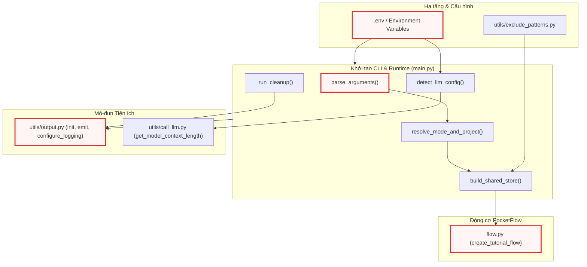
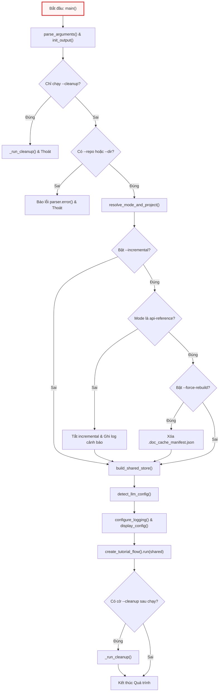
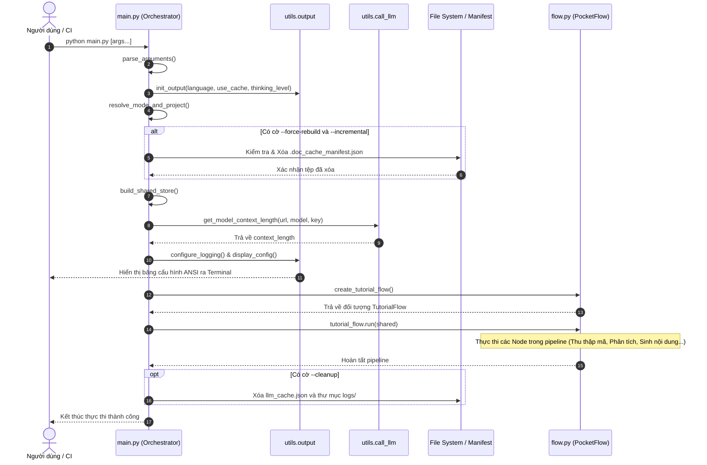

# Chapter 1: Khởi tạo CLI, Cấu hình Runtime & Hạ tầng Dự án


Chào mừng bạn đến với tài liệu kiến trúc kỹ thuật của dự án **Codebase Knowledge Builder**. Là một kỹ sư cấp cao hoặc Technical PM mới tiếp nhận hệ thống, việc nắm bắt hạ tầng khởi tạo, giao diện dòng lệnh (CLI), và mô hình quản lý cấu hình runtime là bước tiên quyết để hiểu cách dữ liệu và trạng thái được điều phối xuyên suốt toàn bộ luồng xử lý tự động hóa bằng AI.

Chương này đi sâu vào kiến trúc điểm vào (entry point) của hệ thống, cơ chế phân giải cấu hình môi trường, khởi tạo kho lưu trữ dùng chung (*Shared Store*) cho framework PocketFlow, cùng các chuẩn mực đóng gói container và kiểm soát chất lượng mã nguồn.

---

## 1. Tổng quan Kiến trúc (Technical Overview)

### 1.1 Vai trò Kiến trúc (Architectural Role)
Trong kiến trúc tổng thể của hệ sinh thái PocketFlow, thành phần **Khởi tạo CLI, Cấu hình Runtime & Hạ tầng Dự án** đóng vai trò là *Lớp Biên (Boundary Layer)* và *Bộ Điều Phối Khởi Động (Bootstrap Orchestrator)*. Thành phần này chịu trách nhiệm thu hẹp khoảng cách giữa môi trường bên ngoài (tham số dòng lệnh người dùng nhập, biến môi trường hệ thống `.env`, hệ thống tệp cục bộ hoặc API từ xa) và đồ thị luồng xử lý bên trong (*PocketFlow Execution Graph*).

Nếu thành phần này không tồn tại hoặc được thiết kế nguyên khối (monolithic) thiếu tách bạch:
- Các Node xử lý nghiệp vụ bên dưới sẽ bị phụ thuộc chặt chẽ (tight coupling) vào các cơ chế đọc biến môi trường và cờ CLI.
- Việc kiểm thử tự động (Unit Test / Integration Test) sẽ đòi hỏi phải giả lập toàn bộ môi trường CLI phức tạp thay vì chỉ cần truyền vào một đối tượng trạng thái.
- Hệ thống sẽ mất khả năng tự động thích ứng ngữ cảnh (Dynamic Context Adaptation) khi chuyển đổi giữa các nhà cung cấp LLM khác nhau (Gemini, OpenRouter, Ollama) hoặc khi thay đổi chế độ sinh tài liệu (`tutorial`, `advanced`, `api-reference`, `sdk`).

```
+-------------------------------------------------------------------------------+
|                            Môi Trường Bên Ngoài                              |
|  [CLI Flags: --repo, --mode]    [Environment: .env]    [Docker / CI Systems]  |
+---------------------------------------+---------------------------------------+
                                        |
                                        v
+-------------------------------------------------------------------------------+
|             Khởi tạo CLI & Cấu hình Runtime (main.py, Docker, Configs)        |
|  - parse_arguments()          - resolve_mode_and_project()                    |
|  - detect_llm_config()        - build_shared_store()                          |
+---------------------------------------+---------------------------------------+
                                        |
                                        v
+-------------------------------------------------------------------------------+
|                  Kho Lưu Trữ Dùng Chung (Shared Store Dictionary)             |
|   { "repo_url", "files", "abstractions", "mode", "thinking_level", ... }      |
+---------------------------------------+---------------------------------------+
                                        |
                                        v
+-------------------------------------------------------------------------------+
|                  Động Cơ Luồng PocketFlow (flow.py & nodes.py)                |
|              Node.prep()  --->  Node.exec()  --->  Node.post()                |
+-------------------------------------------------------------------------------+
```

### 1.2 Mẫu Thiết kế (Design Patterns)
Thành phần khởi tạo triển khai hai mẫu thiết kế phần mềm cốt lõi:

1. **Command Line Facade Pattern**:
   - *Lý do lựa chọn*: Cung cấp một giao diện trừu tượng hóa, đơn giản hóa tối đa việc cấu hình một hệ thống sinh tài liệu đa tầng phức tạp. Toàn bộ logic kiểm tra xung đột tham số (ví dụ: cờ `--repo` và `--dir` xung đột loại trừ lẫn nhau, hoặc `--incremental` chỉ hỗ trợ `--mode api-reference`) được đóng gói hoàn toàn bên trong CLI Facade trước khi bất kỳ luồng xử lý nghiệp vụ nào được kích hoạt.
   - *Đánh đổi (Trade-off)*: Cần duy trì một bộ phân tích cú pháp tương đối chi tiết, nhưng đổi lại giữ cho toàn bộ phần lõi của ứng dụng hoàn toàn độc lập với giao diện điều khiển.

2. **Dependency Injection (DI) qua Shared Store**:
   - *Lý do lựa chọn*: PocketFlow sử dụng một từ điển trạng thái dùng chung (*Shared Store*) được truyền qua từng Node. Thay vì để các Node tự truy vấn cấu hình toàn cục hoặc tự khởi tạo client LLM, `main.py` đóng vai trò là *Composition Root*, phân giải toàn bộ thông số kỹ thuật (URL, token limits, thinking level, filter patterns) và "tiêm" (inject) vào Shared Store.
   - *Đánh đổi*: Cấu trúc dữ liệu trong Shared Store mang tính linh động cao (dynamically typed dict), đòi hỏi tài liệu hóa hợp đồng dữ liệu (Data Contracts) nghiêm ngặt để tránh lỗi sai kiểu dữ liệu giữa các Node.

### 1.3 Trách nhiệm Cốt lõi (Core Responsibilities)
Thành phần chịu trách nhiệm trực tiếp đối với 6 nhiệm vụ then chốt:
- **Phân tích cú pháp & Thẩm định tham số CLI**: Tiếp nhận và xác thực tính hợp lệ của các tùy chọn dòng lệnh, thiết lập các giá trị mặc định cho token, batch size, exclude patterns.
- **Phân giải Định danh Dự án & Chế độ Tài liệu**: Trích xuất tên dự án từ đường dẫn thư mục cục bộ hoặc URL GitHub, chuẩn hóa các cờ tương thích ngược (`--advanced` chuyển thành `--mode advanced`).
- **Tự động Phát hiện Cấu hình LLM & Context Length**: Kiểm tra biến môi trường của các provider (Gemini, OpenRouter, Ollama) và tự động tính toán kích thước cửa sổ ngữ cảnh (*context window length*).
- **Khởi tạo Kho lưu trữ Dùng chung (Shared Store)**: Đóng gói toàn bộ cấu hình runtime và cấp phát các trường dữ liệu rỗng cho luồng xử lý hạ nguồn.
- **Chuẩn hóa Giao diện Hiển thị & Đa ngôn ngữ (i18n)**: Khởi tạo hệ thống logging và output định dạng chuẩn theo ngôn ngữ được chỉ định mà không hardcode chuỗi hiển thị.
- **Đóng gói Hạ tầng & Tự động Hóa Chất lượng Mã nguồn**: Đảm bảo môi trường thực thi đồng nhất qua `Dockerfile`, kiểm soát chuẩn định dạng qua `pyproject.toml`, `.pre-commit-config.yaml` và `.coderabbit.yaml`.

### 1.4 Phụ thuộc & Sơ đồ Ngữ cảnh (Key Dependencies & System Context)

Thành phần khởi tạo tương tác trực tiếp với các mô-đun hạ tầng và chuẩn bị dữ liệu đầu vào cho động cơ luồng:



---

## 2. Cấu trúc Hạ tầng, Tiêu chuẩn Mã nguồn & Đóng gói Container

Một hệ thống tự động sinh tài liệu mã nguồn quy mô lớn đòi hỏi sự nhất quán tuyệt đối giữa môi trường phát triển cục bộ, môi trường kiểm thử CI/CD và môi trường đóng gói container.

### 2.1 Cấu hình Quản lý Mã nguồn & Linter (`pyproject.toml`, `.pre-commit-config.yaml`)
Dự án sử dụng công cụ **Ruff** thế hệ mới nhằm thay thế cho Flake8, Black và isort, giúp tối ưu hóa tốc độ kiểm tra tĩnh (static analysis) và định dạng mã nguồn.

```toml
[project]
name = "codebase-knowledge-builder"
requires-python = ">=3.10"

[tool.ruff]
line-length = 150
target-version = "py310"

# Exclude generated/vendored/docs/agent-rule files
exclude = [
    "output/",
    "__pycache__/",
    ".git/",
    "logs/",
    "docs/",
    ".clinerules/",
    ".windsurf/",
    ".agents/",
    "CLAUDE.md",
    "tests/",
    "prompts/",
]

[tool.ruff.lint]
select = [
    "E",     # pycodestyle errors (whitespace, syntax style)
    "F",     # pyflakes (unused imports, undefined names, redefined)
    "W",     # pycodestyle warnings
    "I",     # isort (import ordering)
    "UP",    # pyupgrade (modernize Python syntax)
    "B",     # flake8-bugbear (common bug patterns)
    "SIM",   # flake8-simplify (simplifiable code)
    "RUF",   # Ruff-specific rules
    "C4",    # flake8-comprehensions (unnecessary list/dict wrapping)
    "PERF",  # Perflint (performance anti-patterns)
    "FURB",  # refurb (modern Python idioms)
    "RET",   # flake8-return (consistent return patterns)
]
ignore = [
    "E402",    # module import not at top — main.py needs dotenv.load_dotenv() before env-dependent imports
    "E501",    # line too long — handled by line-length setting above
    "SIM108",  # ternary operator — readability preference
    "PERF203", # try-except-in-loop — intentional per-item error handling
    "RET504",  # unnecessary assignment before return — readability preference
]

[tool.ruff.lint.isort]
known-first-party = ["utils"]

[tool.ruff.format]
quote-style = "double"
indent-style = "space"
```

Cấu hình `pyproject.toml` thể hiện các quyết định kiến trúc cụ thể:
- **Ngưỡng độ dài dòng (`line-length = 150`)**: Được mở rộng thay vì chuẩn 88 ký tự của Black, nhằm hỗ trợ các câu lệnh prompt cấu hình phức tạp và các chuỗi định dạng logging mà không làm phân mảnh mã nguồn.
- **Bỏ qua quy tắc `E402` (Module import not at top)**: Đây là một ngoại lệ có chủ đích. Tập lệnh `main.py` bắt buộc phải gọi `dotenv.load_dotenv()` trước khi các mô-đun phụ thuộc biến môi trường (như `utils.output` hoặc `flow`) được nạp vào bộ nhớ.
- **Bỏ qua `PERF203` (try-except-in-loop)**: Các tác vụ quét tệp tin cục bộ và thu thập API cần cơ chế xử lý lỗi cục bộ cho từng tệp riêng lẻ mà không làm gián đoạn toàn bộ vòng lặp thu thập.

Quy trình kiểm soát tự động trước khi commit được thiết lập qua `.pre-commit-config.yaml`:

```yaml
repos:
  - repo: https://github.com/astral-sh/ruff-pre-commit
    # Ruff version.
    rev: v0.16.4
    hooks:
      # Run the linter with auto-fix.
      - id: ruff-check
        args: [--fix, --verbose]
        verbose: true
      # Run the formatter.
      - id: ruff-format
        args: [--verbose]
        verbose: true
```

Pipeline này đảm bảo rằng mọi thay đổi mã nguồn trước khi được ghi nhận vào Git đều tự động sửa lỗi cú pháp (`--fix`) và định dạng thống nhất theo chuẩn `double quotes` và thụt lề chuẩn.

### 2.2 Quy tắc Đánh giá Tự động (`.coderabbit.yaml`)
Hệ thống tích hợp CodeRabbit AI để đánh giá (code review) tự động trên các nhánh Pull Request. Tập tin cấu hình định nghĩa rõ ràng các vùng trọng tâm cho từng tầng trong kiến trúc:

```yaml
# CodeRabbit Configuration
# Docs: https://docs.coderabbit.ai/guides/configure-coderabbit

language: en

reviews:
  auto_review:
    enabled: true
    drafts: false
    base_branches:
      - main
  profile: assertive

  path_instructions:
    - path: "nodes.py"
      instructions: |
        This is the core pipeline — 10 PocketFlow Node classes.
        Focus on: token budget management, LLM prompt construction,
        shared store read/write patterns, and retry/cache logic.
    - path: "utils/*.py"
      instructions: |
        Utility modules. Focus on: function signatures matching
        docs/design.md Section 9 contracts, error handling, and
        edge cases in file crawling and token counting.
    - path: "prompts/**/*.md"
      instructions: |
        LLM prompt templates. Focus on: placeholder variable names
        matching the node code, instruction clarity, and whether
        the prompts could cause LLM hallucination or off-topic output.
    - path: "main.py"
      instructions: |
        CLI entry point. Focus on: argument validation, shared store
        initialization, and backward compatibility of CLI flags.

chat:
  auto_reply: true
```

Chỉ thị `path_instructions` hướng dẫn reviewer tự động kiểm tra chặt chẽ tính tương thích ngược của CLI trong `main.py`, tính chính xác của các biến giữ chỗ (`{placeholder}`) trong prompt template, và tính toàn vẹn của hợp đồng interface trong `utils/`.

### 2.3 Đóng gói Môi trường Container (`Dockerfile`)
Nhằm loại bỏ sự khác biệt giữa các hệ điều hành của lập trình viên và phục vụ triển khai trong CI/CD pipeline, hệ thống cung cấp Dockerfile chuẩn hóa:

```dockerfile
FROM python:3.10-slim

# update packages, install git and remove cache
RUN apt-get update && apt-get install -y git && rm -rf /var/lib/apt/lists/*

WORKDIR /app

COPY requirements.txt .
RUN pip install --no-cache-dir -r requirements.txt

COPY . .

ENTRYPOINT ["python", "main.py"]
```

Quy trình build tối ưu hóa layer caching:
1. Sử dụng base image `python:3.10-slim` để giảm thiểu dung lượng image.
2. Cài đặt tiện ích hệ thống `git` — phụ thuộc thiết yếu của thư viện `GitPython` khi thu thập kho lưu trữ từ xa.
3. Sao chép và cài đặt `requirements.txt` trước khi sao chép toàn bộ mã nguồn, giúp tận dụng Docker layer cache khi mã nguồn thay đổi nhưng danh sách thư viện giữ nguyên.
4. Thiết lập `ENTRYPOINT ["python", "main.py"]`, biến container thành một CLI executable trực tiếp.

---

## 3. Phân tích Chi tiết Từng Hàm & Luồng Xử lý (Function-by-Function Breakdown)

Điểm vào `main.py` được thiết kế theo nguyên tắc phân rã chức năng mô-đun (*Modular Decomposition*). Mỗi hàm chịu một trách nhiệm rõ ràng trong chuỗi khởi tạo trước khi chuyển giao quyền điều khiển cho đồ thị luồng PocketFlow.

```
                    +--------------------------------+
                    |             main()             |
                    +---------------+----------------+
                                    |
     +------------------------------+------------------------------+
     |                |             |              |               |
     v                v             v              v               v
parse_arguments()  resolve()  build_store()  detect_llm()  display_config()
```

### 3.1 Phân tích Tham số Dòng lệnh: `parse_arguments()`

Hàm `parse_arguments()` chịu trách nhiệm định nghĩa toàn bộ giao diện cờ dòng lệnh mà người dùng hoặc hệ thống CI/CD có thể truyền vào.

```python
def parse_arguments():
    """Parse and return command-line arguments."""
    parser = argparse.ArgumentParser(description="Generate a tutorial for a GitHub codebase or local directory.")

    # Source: --repo or --dir (mutually exclusive but not required if --cleanup is used)
    source_group = parser.add_mutually_exclusive_group()
    source_group.add_argument("--repo", help="URL of the public GitHub repository.")
    source_group.add_argument("--dir", help="Path to local directory.")
    parser.add_argument("--cleanup", action="store_true", help="Clean up logs and cache files. Can be used standalone or after a run.")

    parser.add_argument("-n", "--name", help="Project name (optional, derived from repo/directory if omitted).")
    parser.add_argument("-t", "--token", help="GitHub personal access token (optional, reads from GITHUB_TOKEN env var if not provided).")
    parser.add_argument("-o", "--output", default="output", help="Base directory for output (default: ./output).")
    parser.add_argument("-i", "--include", nargs="+", help="Files to include (e.g., '*.py' '*.js'). Defaults to '*' (all files).")
    parser.add_argument(
        "-e",
        "--exclude",
        nargs="+",
        help="Files to exclude. Custom patterns are automatically merged with a massive global exclusion list (build caches, node_modules, binaries, media, AI environments) AND your repository's native .gitignore rules.",
    )
    parser.add_argument("-s", "--max-size", type=int, default=200000, help="Maximum file size in bytes (default: 200000, about 200KB).")
    # ...
```

Phần đầu của hàm thiết lập nhóm tham số nguồn dữ liệu bằng `add_mutually_exclusive_group()`. Cơ chế này ngăn chặn người dùng kích hoạt đồng thời cả `--repo` (thu thập từ xa) và `--dir` (quét thư mục cục bộ). Đồng thời, các tham số như `--include` và `--exclude` được cấu hình `nargs="+"`, cho phép người dùng truyền danh sách nhiều mẫu globbing phân cách bởi khoảng trắng.

Tiếp theo, hàm đăng ký các tham số điều khiển hành vi của LLM, chế độ tạo tài liệu và các cơ chế xử lý lô (batching):

```python
    # ...
    # Add language parameter for multi-language support
    parser.add_argument("--language", default="english", help="Language for the generated tutorial (default: english).")
    # Add use_cache parameter to control LLM caching
    parser.add_argument("--no-cache", action="store_true", help="Disable LLM response caching (default: caching enabled).")
    # Add max_abstraction_num parameter to control the number of abstractions
    parser.add_argument("--max-abstractions", type=int, default=10, help="Maximum number of abstractions to identify (default: 10).")
    # Add thinking_level parameter for LLM reasoning capabilities
    parser.add_argument(
        "--thinking-level",
        default=None,
        help="Thinking effort level for native Gemini, OpenRouter, and Ollama reasoning models (e.g., low, medium, high). Leave empty to use model defaults.",
    )
    # Add max_tokens parameter
    parser.add_argument(
        "--max-tokens", type=int, default=None, help="Maximum number of tokens for the context window (default: fetched dynamically)."
    )

    # --- Documentation Mode & Generation Styles ---
    parser.add_argument(
        "--mode",
        choices=["tutorial", "advanced", "api-reference", "sdk"],
        default="tutorial",
        help="Documentation style (tutorial, advanced, api-reference, sdk). (default: tutorial).",
    )
    parser.add_argument("--advanced", action="store_true", help="Legacy flag: equivalent to --mode advanced.")
    parser.add_argument("--mkdocs", action="store_true", help="Format output for MkDocs Material (adds YAML frontmatter & nav snippet).")
    parser.add_argument(
        "--incremental",
        action="store_true",
        help="Enable MD5 incremental caching to skip unchanged modules (Only supported in --mode api-reference).",
    )
    parser.add_argument(
        "--force-rebuild", action="store_true", help="Clear incremental cache and regenerate all chapters from scratch (use with --incremental)."
    )

    # Add batching parameters
    parser.add_argument("--batch", type=int, default=50, help="Maximum files per batch when using map-reduce mode (default: 50).")
    parser.add_argument("--force-batch", action="store_true", help="Force map-reduce mode regardless of context size.")
    # Debug mode
    parser.add_argument("--debug", action="store_true", help="Enable verbose debug output.")

    return parser, parser.parse_args()
```

Cấu hình tham số tại đoạn mã trên cho thấy một số kỹ thuật thiết kế quan trọng:
- **Tương thích ngược (Backward Compatibility)**: Cờ `--advanced` vẫn được duy trì song song với `--mode advanced` để không làm đứt gãy các tập lệnh tự động hóa cũ của người dùng.
- **Tính toán động vs Ghi đè thủ công**: Tham số `--max-tokens` mặc định là `None`, cho phép hệ thống tự động phát hiện kích thước cửa sổ ngữ cảnh thực tế của model thông qua API metadata, trừ khi người dùng chủ động ép buộc một giá trị cụ thể.
- **Tách bạch đối tượng phân tích cú pháp**: Hàm trả về cả `parser` và `args` (dưới dạng một tuple `(parser, parser.parse_args())`), giúp hàm điều phối `main()` có thể chủ động gọi `parser.error(...)` khi xảy ra lỗi logic nghiệp vụ mà không cần tái tạo parser.

### 3.2 Phân giải Chế độ Tài liệu & Định danh Dự án: `resolve_mode_and_project()`

Hàm `resolve_mode_and_project()` chuẩn hóa chế độ thực thi và tự động trích xuất tên dự án nếu người dùng không truyền cờ `--name` tường minh.

```python
def resolve_mode_and_project(args):
    """Resolve documentation mode (handling --advanced legacy flag) and derive project name.

    Returns:
        tuple[str, str]: (mode, project_name)
    """
    mode = "advanced" if args.advanced else args.mode
    project_name = args.name
    if not project_name:
        if args.dir:
            project_name = os.path.basename(os.path.abspath(args.dir))
        elif args.repo:
            project_name = args.repo.rstrip("/").split("/")[-1]
        else:
            project_name = "project"
    return mode, project_name
```

Luồng logic của hàm xử lý các trường hợp biên:
1. Nếu cờ kế thừa `args.advanced` mang giá trị `True`, nó sẽ ưu tiên ghi đè chế độ thành `"advanced"`, bất kể giá trị của `args.mode`.
2. Nếu `project_name` bị bỏ trống (`None`), hàm sẽ:
   - Với nguồn thư mục cục bộ (`args.dir`): Sử dụng `os.path.abspath()` để giải quyết triệt để các đường dẫn tương đối (như `.`, `..`, `./src`) trước khi lấy tên thư mục cuối cùng bằng `os.path.basename()`.
   - Với nguồn kho lưu trữ Git (`args.repo`): Loại bỏ ký tự gạch chéo cuối (`rstrip("/")`) và tách chuỗi URL để lấy phần định danh cuối cùng của repository (ví dụ `https://github.com/facebook/react` $\rightarrow$ `react`).
   - Trường hợp dự phòng (fallback) khi chỉ chạy tác vụ dọn dẹp: Đặt tên mặc định là `"project"`.

### 3.3 Tự động Phát hiện & Đàm phán Cấu hình LLM: `detect_llm_config()`

Hệ thống hỗ trợ đa nhà cung cấp mô hình ngôn ngữ (Google Gemini, OpenRouter, Ollama). Hàm `detect_llm_config()` có nhiệm vụ phân giải nhà cung cấp đang hoạt động và xác định giới hạn token ngữ cảnh.

```python
def detect_llm_config(args):
    """Detect LLM provider, model, endpoint, and context length from environment.

    Returns:
        tuple: (provider, model_name, endpoint_url, api_key, context_length)
    """
    from utils.call_llm import get_model_context_length

    provider = os.environ.get("LLM_PROVIDER")
    if provider:
        model_name = os.environ.get(f"{provider}_MODEL", "unknown")
        endpoint_url = os.environ.get(f"{provider}_BASE_URL", "unknown")
        api_key = os.environ.get(f"{provider}_API_KEY", "")
    else:
        # Fallback to Gemini if neither provider is explicitly set but it's used
        if os.environ.get("GEMINI_PROJECT_ID") or os.environ.get("GEMINI_API_KEY"):
            provider = "GEMINI"
            model_name = os.environ.get("GEMINI_MODEL", "gemini-3.7-flash")
            endpoint_url = "generativelanguage.googleapis.com"
            api_key = os.environ.get("GEMINI_API_KEY", "")
        else:
            provider = "UNKNOWN"
            model_name = "unknown"
            endpoint_url = "unknown"
            api_key = ""

    context_length = args.max_tokens or get_model_context_length(endpoint_url, model_name, api_key)
    return provider, model_name, endpoint_url, api_key, context_length
```

Cơ chế phân giải hoạt động theo mô hình phân cấp (Hierarchical Fallback):
- **Phân cấp 1 (Tường minh)**: Nếu biến `LLM_PROVIDER` được định nghĩa (ví dụ `OPENROUTER` hoặc `OLLAMA`), hệ thống tự động suy luận tiền tố biến môi trường tương ứng: `{PROVIDER}_MODEL`, `{PROVIDER}_BASE_URL`, và `{PROVIDER}_API_KEY`.
- **Phân cấp 2 (Mặc định Gemini)**: Nếu `LLM_PROVIDER` không được đặt nhưng phát hiện sự tồn tại của `GEMINI_API_KEY` hoặc `GEMINI_PROJECT_ID`, hệ thống tự động kích hoạt cấu hình Gemini với model mặc định là `gemini-3.7-flash`.
- **Phân định Context Window**: Giá trị `context_length` được ưu tiên lấy từ cờ ghi đè `args.max_tokens`. Nếu không có, hàm sẽ gọi `get_model_context_length(endpoint_url, model_name, api_key)` từ `utils.call_llm` để truy vấn kích thước ngữ cảnh được tối ưu hóa cho model đó.

### 3.4 Xây dựng Kho Lưu Trữ Dùng Chung: `build_shared_store()`

Kho lưu trữ dùng chung (*Shared Store*) là trung tâm dữ liệu được truyền xuyên suốt đồ thị PocketFlow. Hàm `build_shared_store()` khởi tạo và cấu trúc hóa từ điển này theo đúng hợp đồng thiết kế.

```python
def build_shared_store(args, github_token, mode):
    """Construct the shared store dictionary passed between PocketFlow nodes.

    Returns:
        dict: The shared store with all CLI args, patterns, and empty output slots.
    """
    return {
        "repo_url": args.repo,
        "local_dir": args.dir,
        "project_name": args.name,  # Can be None, FetchRepo will derive it
        "github_token": github_token,
        "output_dir": args.output,  # Base directory for CombineTutorial output
        # Include/exclude patterns and max file size
        "include_patterns": set(args.include) if args.include else DEFAULT_INCLUDE_PATTERNS,
        "exclude_patterns": DEFAULT_EXCLUDE_PATTERNS.union(set(args.exclude)) if args.exclude else DEFAULT_EXCLUDE_PATTERNS,
        "max_file_size": args.max_size,
        # Language for multi-language support
        "language": args.language,
        # Cache flag (inverse of no-cache)
        "use_cache": not args.no_cache,
        # Max abstractions
        "max_abstraction_num": args.max_abstractions,
        # LLM reasoning capabilities
        "thinking_level": args.thinking_level,
        # Max tokens override
        "max_tokens": args.max_tokens,
        # Mode, mkdocs, and incremental
        "mode": mode,
        "mkdocs": args.mkdocs,
        "incremental": args.incremental,
        "advanced_mode": mode == "advanced",
        # Batching settings
        "batch_size": args.batch,
        "force_batch": args.force_batch,
        # Debug mode
        "debug": args.debug,
        # Outputs populated by downstream nodes
        "files": [],
        "abstractions": [],
        "relationships": {},
        "chapter_order": [],
        "chapters": [],
        "final_output_dir": None,
    }
```

Một số lưu ý quan trọng về thiết kế trong Shared Store:
- **Hợp nhất Mẫu Loại trừ (Pattern Union)**: `exclude_patterns` luôn được tính toán bằng phép hợp tập hợp (`DEFAULT_EXCLUDE_PATTERNS.union(...)`). Điều này đảm bảo rằng dù người dùng truyền vào các mẫu loại trừ tùy biến thông qua cờ `-e/--exclude`, các danh mục nhị phân, cache, file tạm, thư viện môi trường máy ảo và các tệp nhạy cảm định nghĩa trong `utils/exclude_patterns.py` sẽ **không bao giờ** bị quét nhầm.
- **Cấp phát trước các Khe Đầu ra (Output Slots)**: Các khóa dữ liệu như `files`, `abstractions`, `relationships`, `chapter_order`, và `chapters` được khởi tạo sẵn với kiểu dữ liệu rỗng (`[]` hoặc `{}`). Điều này giúp các Node kế tiếp có thể đọc hoặc ghi đè mà không gây ra ngoại lệ `KeyError`.
- **Cờ logic suy diễn**: `use_cache` được đảo ngược logic từ `not args.no_cache`, và `advanced_mode` được suy diễn từ `mode == "advanced"` để duy trì tính tương thích với các Node cũ.

### 3.5 Hiển thị Cấu hình & Quốc tế hóa UI: `display_config()`

Trước khi bắt đầu thực thi đồ thị xử lý, toàn bộ cấu hình đã phân giải được in ra console nhằm phục vụ mục đích kiểm tra và ghi log.

```python
def display_config(args, mode, provider, model_name, endpoint_url, context_length, log_file):
    """Emit all configuration values to the console."""
    emit("START_GENERATION", source=args.repo or args.dir, language=args.language.capitalize())
    emit("CFG_HEADER")
    emit("CFG_AI_PROVIDER", value=provider)
    emit("CFG_AI_ENDPOINT", value=endpoint_url)
    emit("CFG_AI_MODEL", value=model_name)
    emit("CFG_CONTEXT_LENGTH", value=f"{context_length:,}")
    emit("CFG_THINKING_LEVEL", value=args.thinking_level or "None")
    emit("CFG_BATCH_SIZE", value=f"{args.batch}")
    _enabled = get("CFG_VALUE_ENABLED")
    _disabled = get("CFG_VALUE_DISABLED")
    emit("CFG_FORCE_BATCH", value=_enabled if args.force_batch else _disabled)
    emit("CFG_OUTPUT_MODE", value=mode)
    emit("CFG_MKDOCS", value=_enabled if args.mkdocs else _disabled)
    emit("CFG_INCREMENTAL", value=_enabled if args.incremental else _disabled)
    if args.incremental:
        emit("CFG_FORCE_REBUILD", value=_enabled if args.force_rebuild else _disabled)
    if mode == "api-reference":
        emit("CFG_MAX_ABSTRACTIONS", value=get("CFG_VALUE_API_REF_MAX"))
    else:
        emit("CFG_MAX_ABSTRACTIONS", value=str(args.max_abstractions))
    emit("CFG_LLM_CACHING", value=_disabled if args.no_cache else _enabled)
    if args.debug:
        emit("CFG_DEBUG_MODE")
    emit("CFG_LOG_FILE", value=log_file)
    print()  # Blank line after config block
```

Tuân thủ nghiêm ngặt quy tắc kiến trúc của dự án, hàm `display_config()` **hoàn toàn không chứa các chuỗi giao diện người dùng hardcoded** và không trực tiếp sử dụng mã màu ANSI. Thay vào đó, toàn bộ việc định dạng, màu sắc và dịch thuật đa ngôn ngữ được ủy quyền cho hàm `emit()` và `get()` từ `utils.output`, sử dụng bảng từ điển chuỗi `utils/strings.csv`.

### 3.6 Cơ chế Dọn dẹp Tài nguyên & Cache: `_run_cleanup()`

Hàm `_run_cleanup()` chịu trách nhiệm giải phóng không gian lưu trữ và xóa các tệp cache/log khi có yêu cầu.

```python
def _run_cleanup():
    """Clean up cache files and log directory."""
    import shutil

    emit("CLEANUP_START")

    for cache_path in ["llm_cache.json"]:
        if os.path.exists(cache_path):
            try:
                os.remove(cache_path)
                emit("CLEANUP_REMOVED", path=cache_path)
            except Exception as e:
                emit("CLEANUP_FAILED", path=cache_path, error=e)

    log_dir = os.environ.get("LOG_DIR", "logs")
    if os.path.exists(log_dir) and os.path.isdir(log_dir):
        try:
            shutil.rmtree(log_dir)
            emit("CLEANUP_REMOVED_DIR", path=log_dir)
        except Exception as e:
            emit("CLEANUP_FAILED", path=log_dir, error=e)
```

Hàm này được thiết kế để có thể chạy độc lập (khi người dùng chỉ truyền cờ `--cleanup`) hoặc chạy như một bước dọn dẹp hậu kỳ (post-run cleanup) sau khi quy trình sinh tài liệu hoàn tất. Cơ chế xử lý sử dụng khối `try-except` độc lập cho từng mục tiêu xóa nhằm đảm bảo nếu việc xóa cache LLM gặp sự cố quyền truy cập (permission denied), hệ thống vẫn tiếp tục nỗ lực xóa thư mục logs mà không bị crash đột ngột.

### 3.7 Điều phối Thực thi Điểm vào: `main()`

Hàm `main()` là hàm điều phối chính kết nối toàn bộ các hàm thành phần kể trên thành một luồng thực thi hoàn chỉnh.

Do `main()` quản lý toàn bộ vòng đời khởi động, chúng ta phân tích nó qua 2 giai đoạn logic:

#### Giai đoạn 1: Khởi tạo, Kiểm tra Ràng buộc & Xử lý Cache Tăng dần

```python
def main():
    parser, args = parse_arguments()
    init_output(
        language=args.language,
        use_cache=not args.no_cache,
        thinking_level=args.thinking_level,
    )

    # Handle standalone --cleanup (no --dir or --repo)
    if args.cleanup and not args.dir and not args.repo:
        _run_cleanup()
        return

    # Require --dir or --repo for generation
    if not args.dir and not args.repo:
        parser.error("one of the arguments --repo --dir --cleanup is required")

    # Get GitHub token from argument or environment variable if using repo
    github_token = None
    if args.repo:
        github_token = args.token or os.environ.get("GITHUB_TOKEN")
        if not github_token:
            emit("WARN_NO_GITHUB_TOKEN")

    mode, project_name = resolve_mode_and_project(args)

    # Enforce incremental cache constraints
    if args.incremental and mode != "api-reference":
        emit("WARN_INCREMENTAL_API_ONLY")
        args.incremental = False

    # Handle --force-rebuild: delete the cache manifest to force fresh generation
    if args.force_rebuild and args.incremental:
        output_base = args.output or "output"
        manifest_path = os.path.join(output_base, project_name, ".doc_cache_manifest.json")
        if os.path.exists(manifest_path):
            os.remove(manifest_path)
            emit("FORCE_REBUILD_DELETED", path=manifest_path)
        else:
            emit("FORCE_REBUILD_NO_MANIFEST", path=manifest_path)
    elif args.force_rebuild and not args.incremental:
        emit("WARN_FORCE_REBUILD_NO_INCREMENTAL")
```

Trong giai đoạn đầu, hệ thống thực hiện khởi tạo hệ thống xuất nhập `init_output` dựa trên ngôn ngữ chỉ định. Nếu cờ `--cleanup` được gọi đơn lẻ, nó thực thi dọn dẹp và thoát ngay lập tức. Nếu chạy luồng sinh tài liệu, hệ thống xác thực sự hiện diện của `--repo` hoặc `--dir`. 

Đặc biệt, hệ thống kiểm soát chặt chẽ tính hợp lệ của cờ `--incremental`: chế độ cache tăng dần MD5 hiện chỉ được hỗ trợ trong `--mode api-reference`. Nếu người dùng bật cờ này ở các chế độ khác, hệ thống sẽ phát cảnh báo `WARN_INCREMENTAL_API_ONLY` và tự động tắt cờ. Đối với cờ `--force-rebuild`, hệ thống chủ động tìm và xóa tệp `.doc_cache_manifest.json` trong thư mục đầu ra của dự án để buộc các node downstream tái tạo tài liệu từ đầu.

#### Giai đoạn 2: Xây dựng Store, Khởi tạo Logging & Kích hoạt Flow

```python
    # ...
    shared = build_shared_store(args, github_token, mode)
    provider, model_name, endpoint_url, _, context_length = detect_llm_config(args)
    log_file = configure_logging(project_name=project_name, mode=mode)
    display_config(args, mode, provider, model_name, endpoint_url, context_length, log_file)

    # Create and run the flow
    tutorial_flow = create_tutorial_flow()
    tutorial_flow.run(shared)

    # Cleanup after run if requested
    if args.cleanup:
        _run_cleanup()


if __name__ == "__main__":
    main()
```

Ở giai đoạn cuối, sau khi `build_shared_store()` và `detect_llm_config()` hoàn tất việc đóng gói trạng thái, hệ thống kích hoạt cấu hình ghi log ra tệp chuyên biệt (`configure_logging`) và hiển thị bảng thông số qua `display_config`. 

Sau đó, hàm triệu gọi `create_tutorial_flow()` từ `flow.py` để tạo đồ thị luồng xử lý của PocketFlow và truyền đối tượng `shared` vào phương thức `run()`. Nếu người dùng chỉ định cờ `--cleanup` đồng thời với tác vụ sinh tài liệu, hàm `_run_cleanup()` sẽ được kích hoạt ở bước cuối cùng sau khi đồ thị thực thi xong hoàn toàn.

---

## 4. Sơ đồ Luồng Thực thi & Vòng đời Trạng thái (Execution Flow & Lifecycle State Diagrams)

Để hình dung trực quan cách thức dữ liệu chuyển động từ khi người dùng gõ lệnh cho đến khi PocketFlow tiếp nhận quyền điều khiển, chúng ta xem xét hai sơ đồ dưới đây.

### 4.1 Sơ đồ Phân nhánh & Quyết định Khởi tạo (`flowchart TD`)



### 4.2 Sơ đồ Tuần tự Tương tác giữa các Thành phần (`sequenceDiagram`)

Sơ đồ tuần tự minh họa sự cộng tác giữa CLI Facade, Hệ thống Tệp, Biến Môi trường và Động cơ Luồng:



---

## 5. Các Ràng buộc Hệ thống, Concurrency & Xử lý Bộ nhớ

Khi xây dựng và bảo trì tầng khởi tạo runtime, các kỹ sư cần nắm rõ các đặc tính và ràng buộc hệ thống sau:

### 5.1 Mô hình Luồng & Xử lý Đồng thời (Concurrency Model)
- `main.py` hoạt động trên tiến trình đơn (**Single-threaded Process**). Quá trình khởi tạo, đọc biến môi trường, phân tích cú pháp CLI và xây dựng Shared Store diễn ra hoàn toàn tuần tự.
- Khi `tutorial_flow.run(shared)` được gọi, các `BatchNode` của PocketFlow (sẽ được tìm hiểu chi tiết ở các chương sau) có thể thực thi các tác vụ gọi API song song hoặc phân lô (batching). Do đó, đối tượng `shared` (từ điển Python) được truyền qua tham chiếu (**pass-by-reference**).
- *Quy tắc An toàn Dữ liệu*: Tầng khởi tạo `main.py` chỉ cấp phát cấu trúc khung. Các Node nghiệp vụ bên dưới không được phép xóa (delete) hoặc thay đổi kiểu dữ liệu (re-type) của các khóa cấu hình cốt lõi trong `shared`, mà chỉ được phép đọc cấu hình và ghi dữ liệu bổ sung vào các khe đầu ra đã được cấp phát sẵn (`files`, `abstractions`, `chapters`, ...).

### 5.2 Quản lý Bộ nhớ & Giới hạn Kích thước Tệp (Memory Footprint)
- Tham số `--max-size` (mặc định 200,000 bytes ~ 200KB) được thiết lập tại `main.py` đóng vai trò là chốt chặn an toàn vòng ngoài (**Safety Gatekeeper**). Bộ thu thập tệp tin sẽ dựa vào giá trị này trong Shared Store để bỏ qua ngay lập tức các tệp mã nguồn quá lớn, ngăn ngừa rủi ro cạn kiệt bộ nhớ RAM khi đọc các file bundle minified hoặc dữ liệu nhị phân kích thước lớn.
- Biến `use_cache` điều khiển cơ chế lưu trữ phản hồi LLM vào tệp `llm_cache.json` trên ổ đĩa. Khi xử lý các kho mã nguồn khổng lồ, kỹ sư có thể sử dụng cờ `--cleanup` để giải phóng dung lượng đĩa cứng sau khi hoàn thành.

---

## 6. Hướng dẫn Thực tế Dành cho Thành viên Mới (Practical Notes for New Team Members)

Phần này cung cấp các hướng dẫn cụ thể giúp các kỹ sư mới nhanh chóng làm quen và gỡ lỗi hệ thống.

### 6.1 Vị trí Cấu hình & Biến Môi trường Quan Trọng

Để kích hoạt hệ thống, bạn cần tạo tệp `.env` tại thư mục gốc dự án dựa trên mẫu sau:

```bash
# 1. Cấu hình mặc định Google Gemini (Khuyến nghị)
GEMINI_API_KEY="your-gemini-api-key-here"
GEMINI_MODEL="gemini-3.7-flash"

# 2. Hoặc Cấu hình OpenRouter (Nếu sử dụng Claude 3.7 / OpenAI O1)
LLM_PROVIDER="OPENROUTER"
OPENROUTER_API_KEY="your-openrouter-key"
OPENROUTER_BASE_URL="https://openrouter.ai/api/v1"
OPENROUTER_MODEL="anthropic/claude-3.7-sonnet"

# 3. Hoặc Cấu hình Ollama Cục bộ (Local LLM)
LLM_PROVIDER="OLLAMA"
OLLAMA_BASE_URL="http://localhost:11434"
OLLAMA_MODEL="deepseek-r1:14b"

# 4. Token truy cập GitHub (Dành cho kho mã nguồn private hoặc tránh rate limit)
GITHUB_TOKEN="ghp_yourPersonalAccessTokenHere"

# 5. Cấu hình đường dẫn thư mục Log (Tùy chọn)
LOG_DIR="logs"
```

### 6.2 Điểm Ngắt Gỡ Lỗi (Debugging Entry Points)

Khi gặp sự cố trong quá trình khởi động ứng dụng, hãy đặt breakpoint tại các vị trí chiến lược sau trong `main.py`:

| Tập tin / Hàm | Vị trí Breakpoint | Mục đích Kiểm tra |
|---|---|---|
| `main.py:parse_arguments()` | Dòng `return parser, parser.parse_args()` | Kiểm tra các cờ người dùng truyền vào đã được chuyển đổi đúng kiểu dữ liệu (`int`, `bool`, `list`) chưa. |
| `main.py:detect_llm_config()` | Dòng `context_length = args.max_tokens or ...` | Xác minh xem API key có nạp thành công từ `.env` không và kích thước `context_length` đàm phán được là bao nhiêu. |
| `main.py:build_shared_store()` | Dòng `return { ... }` | Kiểm tra tập hợp các mẫu `exclude_patterns` đã bao gồm cả mẫu tùy biến lẫn mẫu mặc định chưa. |
| `main.py:main()` | Dòng `tutorial_flow.run(shared)` | Kiểm tra toàn bộ trạng thái cuối cùng của Shared Store ngay trước khi kích hoạt Node đầu tiên. |

### 6.3 Các Điểm Kỳ Dị Kỹ Thuật & Nợ Công Nghệ (Known Quirks & Tech Debt)

1. **Thứ tự Import và Cảnh báo Linter `E402`**:
   - `dotenv.load_dotenv()` bắt buộc phải được gọi ở đầu `main.py`, ngay trước khi import `utils.output` và `flow`. Điều này là do một số mô-đun phụ thuộc trực tiếp vào các biến môi trường được nạp tại thời điểm khởi tạo package. Linter Ruff đã được cấu hình tường minh để bỏ qua lỗi `E402` cho tệp này.
2. **Ép kiểu Dữ liệu Tập hợp (Set vs List) trong Pattern Matching**:
   - `include_patterns` và `exclude_patterns` trong Shared Store được lưu dưới dạng `set` để tối ưu hóa hiệu năng kiểm tra phần tử ($O(1)$) khi quét hàng ngàn tệp tin. Tuy nhiên, khi truyền từ CLI qua `argparse`, chúng là `list`. Hàm `build_shared_store()` bắt buộc phải bọc `set(args.include)` để tránh lỗi kiểu dữ liệu ở các tầng sau.
3. **Sự phụ thuộc Ngầm của `project_name`**:
   - Nếu `--name` không được truyền, `resolve_mode_and_project()` sẽ suy diễn tên dự án từ URL hoặc thư mục. Tuy nhiên, nếu nguồn là `--repo`, tên chính xác thực tế của repository đôi khi chỉ được xác định chắc chắn sau khi `FetchRepo` clone kho về. Do đó, Shared Store chấp nhận `project_name: None` ban đầu và cho phép `FetchRepo` ghi đè lại sau.

### 6.4 Lưu ý Khi Tạo Pull Request & Code Review

Khi thực hiện các thay đổi liên quan đến CLI và hạ tầng khởi tạo, hãy luôn tuân thủ các quy tắc kiểm tra:

1. **Không phá vỡ hợp đồng CLI**: Nếu thêm tham số CLI mới, luôn cung cấp giá trị `default` hợp lý và cập nhật tài liệu `README.md` ở cả hai phần ngôn ngữ (English & Tiếng Việt).
2. **Không hardcode chuỗi thông báo**: Tất cả chuỗi hiển thị console mới phải được thêm vào tệp `utils/strings.csv` kèm theo mã khóa (`STRING_KEY`) và gọi thông qua `emit("STRING_KEY", ...)` trong `utils.output`.
3. **Kiểm tra cú pháp tự động**: Trước khi gửi PR, hãy chạy lệnh sau để xác minh toàn bộ các tệp Python đều vượt qua bộ phân tích cú pháp AST:
   ```bash
   python -c "import ast; [ast.parse(open(f).read()) for f in ['main.py','flow.py','nodes.py','utils/call_llm.py','utils/crawl_local_files.py','utils/crawl_github_files.py','utils/token_utils.py','utils/output.py','utils/exclude_patterns.py','utils/prompts.py']]; print('All files pass syntax check')"
   ```

---

## 7. Tổng kết Kỹ thuật & Bước Tiếp Theo

Trong chương này, chúng ta đã phân tích chi tiết nền tảng hạ tầng và điểm vào của hệ thống **Codebase Knowledge Builder**:
- **Cấu hình & Tiêu chuẩn**: Cách thức dự án sử dụng `pyproject.toml`, `Dockerfile`, `.pre-commit-config.yaml` và `.coderabbit.yaml` để duy trì chất lượng mã nguồn và môi trường đồng nhất.
- **Phân giải Tham số & Cấu hình Runtime**: Luồng hoạt động của `main.py` từ việc phân tích cờ CLI qua `parse_arguments()`, chuẩn hóa chế độ tài liệu qua `resolve_mode_and_project()`, đến việc tự động phát hiện thông số LLM qua `detect_llm_config()`.
- **Mô hình Trạng thái Khởi tạo**: Cấu trúc của đối tượng *Shared Store* — huyết mạch dữ liệu liên kết CLI Facade với động cơ thực thi PocketFlow.

Sau khi hệ thống khởi tạo hoàn tất và Shared Store được thiết lập đầy đủ thông số cấu hình, bước tiếp theo trong pipeline là nạp mã nguồn từ hệ thống tệp cục bộ hoặc tải kho lưu trữ từ xa qua GitHub API, đồng thời áp dụng các bộ lọc chuyên sâu để loại bỏ nhiễu.

Mời bạn tiếp tục tìm hiểu cơ chế này tại [Chương 2: Hệ thống Thu thập & Lọc Mã nguồn Đa nguồn](02_hệ_thống_thu_thập___lọc_mã_nguồn_đa_nguồn.md).

