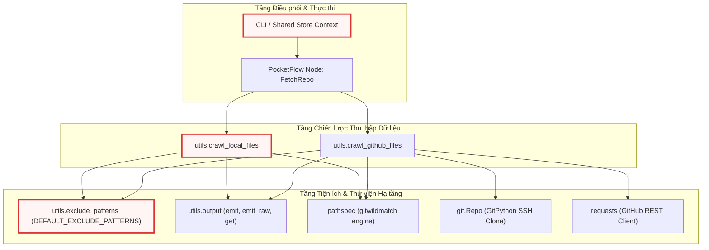
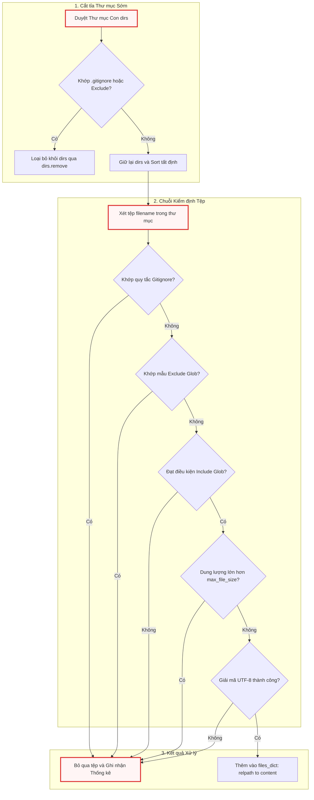
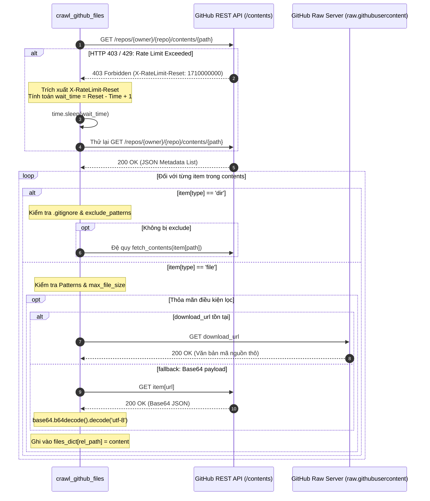

# Chapter 2: Hệ thống Thu thập & Lọc Mã nguồn Đa nguồn

Tiếp nối kiến trúc khởi tạo CLI, đàm phán cấu hình runtime và thiết lập `Shared Store` đã được trình bày chi tiết tại [Chapter 1: Khởi tạo CLI, Cấu hình Runtime & Hạ tầng Dự án](01_khởi_tạo_cli__cấu_hình_runtime___hạ_tầng_dự_án.md), quy trình xử lý của hệ thống chuyển tiếp sang bước quan trọng tiếp theo: nạp dữ liệu mã nguồn thô vào bộ nhớ. Đây là giai đoạn thực thi của node `FetchRepo`, nơi dữ liệu từ hệ thống tệp cục bộ hoặc các kho lưu trữ từ xa (GitHub) được thu thập, phân loại, lọc bỏ rác và chuẩn hóa thành một cấu trúc dữ liệu duy nhất để phục vụ các tầng phân tích AST và LLM hạ nguồn.

Chương này đi sâu vào kiến trúc và chi tiết hiện thực của **Hệ thống Thu thập & Lọc Mã nguồn Đa nguồn** (Data Ingestion & Filtering Layer), phân tích cách hệ thống kết hợp các mẫu thiết kế hướng đối tượng, thuật toán duyệt cây thư mục đơn lượt, cơ chế phân tích `.gitignore` đa tầng và các chốt chặn an toàn bộ nhớ.

---

## 1. Tổng quan Kiến trúc (Technical Overview)

### 1.1. Vai trò Kiến trúc (Architectural Role)

Hệ thống Thu thập & Lọc Mã nguồn đóng vai trò là Tầng Nhập liệu Dữ liệu (Data Ingestion Layer) trong toàn bộ pipeline. Nhiệm vụ tối thượng của tầng này là chuyển đổi các nguồn mã nguồn không đồng nhất—bao gồm thư mục cục bộ trên đĩa cứng, kho lưu trữ GitHub truy xuất qua REST API, hoặc kho lưu trữ Git truy xuất qua giao thức SSH—thành một biểu diễn phẳng chuẩn hóa trong bộ nhớ dưới dạng:

```python
{"files": {filepath: content}}
```

```
+-------------------------------------------------------------------------------+
|                       DATA INGESTION LAYER BOUNDARY                           |
|                                                                               |
|   +-------------------+  +--------------------+  +------------------------+   |
|   | Local Filesystem  |  |  GitHub REST API   |  |   Remote Git via SSH   |   |
|   | (os.walk single)  |  | (Tree/Blob/Raw API)|  |  (Temporary Git Clone) |   |
|   +---------+---------+  +---------+----------+  +-----------+------------+   |
|             |                      |                         |                |
|             +----------------------+-------------------------+                |
|                                    |                                          |
|                                    v                                          |
|                 +--------------------------------------+                      |
|                 | 6-Stage Multi-Tier Filtering Pipeline|                      |
|                 +--------------------------------------+                      |
|                                    |                                          |
|                                    v                                          |
|                 +--------------------------------------+                      |
|                 | Standard In-Memory Dict Contract     |                      |
|                 | {"files": {filepath: file_content}}  |                      |
|                 +--------------------------------------+                      |
+------------------------------------+------------------------------------------+
                                     |
                                     v
                  [Downstream AST & LLM Context Nodes]
```

Nếu thành phần này không tồn tại hoặc được thiết kế sơ sài, toàn bộ hệ thống sẽ phải đối mặt với các rủi ro kỹ thuật nghiêm trọng:
1. **Tràn bộ nhớ và cạn kiệt Context Window**: Việc vô tình đọc các tệp nhị phân (`.png`, `.exe`, `.pyc`), các thư mục thư viện bên thứ ba (`node_modules`, `.venv`), hoặc các tệp lockfile khổng lồ (`package-lock.json`, `Cargo.lock`) sẽ làm bùng nổ dung lượng token, dẫn đến vượt ngưỡng context window của LLM hoặc gây lỗi `OutOfMemoryError` tại runtime.
2. **Nghẽn băng thông và Rate Limit HTTP**: Việc duyệt đệ quy kho lưu trữ từ xa mà không có chiến lược caching, né tránh rate limit (HTTP 429/403) và tải payload tối ưu sẽ làm tê liệt pipeline khi làm việc với các repository quy mô lớn.
3. **Rò rỉ bí mật và dữ liệu nhạy cảm**: Nếu không tuân thủ nghiêm ngặt chuẩn loại trừ `.gitignore` và các tệp môi trường (`.env`), hệ thống có thể vô tình đưa các token API, khóa bí mật hoặc mã nguồn nhạy cảm vào prompt của mô hình ngôn ngữ.

### 1.2. Mẫu Thiết kế (Design Patterns)

Kiến trúc của thành phần ingestion được xây dựng dựa trên hai mẫu thiết kế chính:

*   **Strategy Pattern (Mẫu Chiến lược)**: Tách biệt hoàn toàn hành vi thu thập dữ liệu thành các chiến lược độc lập dựa trên giao thức và nguồn dữ liệu:
    *   `crawl_local_files`: Chiến lược quét trực tiếp hệ thống tệp cục bộ.
    *   `crawl_github_files` (nhánh SSH): Chiến lược phân nhánh sử dụng `gitpython` để clone tạm thời kho lưu trữ vào thư mục ẩn `tempfile.TemporaryDirectory()`.
    *   `crawl_github_files` (nhánh REST API): Chiến lược duyệt cây đối tượng GitHub API (`/trees`, `/contents`) có tích hợp khả năng tự động nghỉ chờ khi chạm ngưỡng rate limit.
*   **Filter Chain Pattern (Chuỗi Bộ lọc Đa cấp)**: Quy trình đánh giá tệp và thư mục được tổ chức thành một chuỗi kiểm tra nghiêm ngặt tuần tự:
    $$\text{Prune Directory} \longrightarrow \text{Multi-tier Gitignore} \longrightarrow \text{Exclude Globs} \longrightarrow \text{Include Globs} \longrightarrow \text{Size Guardrail} \longrightarrow \text{UTF-8 Decode}$$
    Việc áp dụng mẫu Filter Chain cho phép loại bỏ các nhánh cây thư mục không hợp lệ từ sớm (Early Pruning), triệt tiêu hàng nghìn thao tác đọc đĩa (Disk I/O) hoặc gọi API mạng không cần thiết.

### 1.3. Trách nhiệm Cốt lõi (Core Responsibilities)

1.  **Phân giải Điểm nhập Nguồn (Source Resolution)**: Tự động nhận diện định dạng đường dẫn đầu vào (Local Path, GitHub HTTPS URL, Git SSH URL) và điều phối sang chiến lược crawl phù hợp.
2.  **Khởi tạo & Đồng bộ Ngữ cảnh Loại trừ (Exclusion Context)**: Hợp nhất danh sách loại trừ mặc định toàn cục `DEFAULT_EXCLUDE_PATTERNS` với các cờ dòng lệnh do người dùng định nghĩa (`--exclude`).
3.  **Xử lý Phân cấp `.gitignore` Chuẩn Git Wildmatch**: Tải và áp dụng các tệp `.gitignore` ở cấp gốc cũng như lồng ghép ở các thư mục con theo đúng phạm vi hiệu lực cục bộ bằng thư viện `pathspec`.
4.  **Cắt tỉa Nhánh Sớm (Early Directory Pruning)**: Can thiệp trực tiếp vào danh sách duyệt thư mục để dừng duyệt toàn bộ cây con nếu thư mục cha khớp mẫu loại trừ.
5.  **Thẩm tra Ranh giới Dữ liệu (Safety Guardrails)**: Kiểm tra dung lượng tệp (`max_file_size`) và đảm bảo chỉ nạp các tệp văn bản giải mã được qua bảng mã UTF-8 (hỗ trợ UTF-8 BOM qua `utf-8-sig`).
6.  **Chuẩn hóa Đầu ra và Thống kê Vận hành**: Trả về từ điển tệp chuẩn và phát tín hiệu đo lường (telemetry/logging) thông qua hệ thống `utils.output`.

### 1.4. Phụ thuộc Hệ thống (Key Dependencies)

Thành phần này tương tác trực tiếp với các thư viện ngoại vi cấp thấp và các module tiện ích nội bộ của dự án.



---

## 2. Danh mục Mẫu Lọc Toàn cục (`utils/exclude_patterns.py`)

Module `utils/exclude_patterns.py` đóng vai trò là một cơ sở tri thức tĩnh (static knowledge base) chứa tập hợp các biểu thức lọc dạng glob (`fnmatch`). Các mẫu này được thiết kế dựa trên kinh nghiệm phát triển phần mềm thực tế nhằm loại bỏ toàn bộ các tệp rác, tệp sinh tự động (build artifacts), môi trường ảo và tệp cấu hình của các IDE hiện đại.

```python
DEFAULT_EXCLUDE_PATTERNS = {
    # 1. Media, Data, and Static Assets
    "assets/*",
    "data/*",
    "images/*",
    "public/*",
    "static/*",
    "temp/*",
    "tmp/*",
    "media/*",
    "*.jpg",
    "*.jpeg",
    "*.png",
    "*.gif",
    "*.ico",
    "*.svg",
    "*.webp",
    "*.mp4",
    "*.webm",
    "*.mov",
    "*.mp3",
    "*.wav",
    "*.pdf",
    "*.doc",
    "*.docx",
    "*.xls",
    "*.xlsx",
    "*.ppt",
    "*.pptx",
    "*.zip",
    "*.tar",
    "*.gz",
    "*.rar",
    "*.7z",
    # 2. Build, Distribution, and Framework Caches
    "dist/*",
    "build/*",
    "out/*",
    "output/*",
    "target/*",
    "bin/*",
    "obj/*",
    ".next/*",
    ".nuxt/*",
    ".svelte-kit/*",
    ".expo/*",
    "docs/*",
    "test/*",
    "tests/*",
    "examples/*",
    "v1/*",
    "experimental/*",
    "deprecated/*",
    "misc/*",
    "legacy/*",
    "*.log",
    "*.bak",
    "*.tmp",
    "*.swp",
    # ...
```

Tập hợp `DEFAULT_EXCLUDE_PATTERNS` được tổ chức thành 7 nhóm phân loại chiến lược:
1. **Media, Data & Assets tĩnh**: Ngăn chặn nạp các định dạng ảnh, video, audio và tài liệu văn phòng nhị phân.
2. **Build, Distribution & Framework Caches**: Loại bỏ các thư mục đầu ra của trình biên dịch (C++, Rust, Java) và các framework frontend hiện đại (Next.js, Nuxt, SvelteKit).
3. **Môi trường, Dependencies & Lockfiles**: Loại bỏ `node_modules`, `.venv`, các tệp khóa gói (`package-lock.json`, `Cargo.lock`, `poetry.lock`) vốn chứa hàng triệu ký tự có thể làm tê liệt bộ nhớ đệm ngữ cảnh của LLM.
4. **Đặc thù Ngôn ngữ Lập trình**: Loại bỏ bytecode Python (`.pyc`, `__pycache__`), thư viện Java bytecode (`.class`, `.jar`), và thư viện liên kết động/tĩnh (`.so`, `.dll`, `.dylib`, `.a`).
5. **Hệ điều hành & Quản lý Phiên bản**: Bỏ qua metadata của OS (`.DS_Store`, `Thumbs.db`) và cơ sở dữ liệu nội bộ của VCS (`.git/*`, `.svn/*`).
6. **IDE Cổ điển**: Bỏ qua cấu hình của VS Code, IntelliJ, Eclipse (`.vscode/*`, `.idea/*`).
7. **AI Agents & Modern AI IDEs**: Đây là điểm kiến trúc đáng chú ý: hệ thống chủ động bỏ qua cấu hình và quy tắc của các AI agent khác như `.cursor/*`, `.windsurf/*`, `.cline/*`, `.claude/*`, `.copilot/*` để tránh gây nhiễu loạn ngữ cảnh cho prompt kiến trúc của chính pipeline.

Các mẫu thư mục được định dạng theo quy ước kết thúc bằng `/*` (ví dụ: `"dist/*"`). Khi thực hiện kiểm tra, tầng crawl sẽ sử dụng phương thức `removesuffix("/*")` để trích xuất tên thư mục gốc phục vụ thao tác khớp chuỗi với tên thư mục trong quá trình duyệt cây.

---

## 3. Động cơ Quét Tệp Cục bộ (`utils/crawl_local_files.py`)

Module `utils/crawl_local_files.py` chịu trách nhiệm thu thập mã nguồn từ hệ thống tệp cục bộ với hiệu năng cao, đảm bảo không đọc thừa tệp và xử lý chính xác hệ thống `.gitignore` đa tầng.

### 3.1. Cơ chế Nạp và Thẩm tra `.gitignore` Đa tầng

Trong các dự án phần mềm phức tạp (đặc biệt là Monorepo), các thư mục con có thể chứa tệp `.gitignore` riêng để ghi đè hoặc bổ sung quy tắc cho nhánh cây con đó. Hàm `_load_gitignore` và `_matches_any_gitignore` xử lý triệt để bài toán này.

```python
def _load_gitignore(gitignore_path):
    """Load a .gitignore file and return a PathSpec, or None on failure."""
    try:
        with open(gitignore_path, encoding="utf-8-sig") as f:
            return pathspec.PathSpec.from_lines("gitwildmatch", f.readlines())
    except Exception:
        return None


def _matches_any_gitignore(gitignore_specs, abs_path, is_dir=False):
    """Check if a path matches ANY loaded .gitignore spec.

    Each spec is checked with the path relative to its own .gitignore directory.
    For directories, a trailing '/' is appended for proper gitignore matching.

    Args:
        gitignore_specs: dict of {abs_dir_path: pathspec.PathSpec}
        abs_path: absolute path of the file or directory to check
        is_dir: True if checking a directory
    Returns:
        True if the path matches any gitignore rule
    """
    for gi_dir, spec in gitignore_specs.items():
        rel = os.path.relpath(abs_path, gi_dir)
        # Skip if the path is not under this gitignore's scope
        if rel.startswith(".."):
            continue
        match_path = rel.replace("\\", "/")
        if is_dir:
            match_path = match_path.rstrip("/") + "/"
        if spec.match_file(match_path):
            return True
    return False
```

`_load_gitignore` khởi tạo một đối tượng `pathspec.PathSpec` sử dụng cú pháp `gitwildmatch` chuẩn Git. Hàm mở tệp với bảng mã `utf-8-sig` nhằm tự động xử lý các tệp cấu hình chứa Byte Order Mark (BOM) do Windows tạo ra. 

Hàm `_matches_any_gitignore` duyệt qua một từ điển chứa các `pathspec` đã tải, trong đó khóa là đường dẫn tuyệt đối đến thư mục chứa tệp `.gitignore` tương ứng (`gi_dir`). Điểm mấu chốt ở đây là việc tính toán đường dẫn tương đối `rel = os.path.relpath(abs_path, gi_dir)`. Nếu `rel.startswith("..")`, tệp hoặc thư mục hiện tại nằm ngoài phạm vi ảnh hưởng của tệp `.gitignore` này và bị bỏ qua ngay lập tức. Đối với thư mục (`is_dir=True`), hàm chuẩn hóa đường dẫn bằng cách thêm dấu gạch chéo `/` ở cuối (`match_path.rstrip("/") + "/"`), giúp bộ phân tích `pathspec` phân biệt chính xác quy tắc dành riêng cho thư mục (ví dụ: `build/`) với quy tắc tệp trùng tên.

### 3.2. Thuật toán Duyệt Thư mục Đơn lượt và Cắt tỉa Nhánh sớm

Để tối ưu hóa hiệu năng I/O trên đĩa cứng, `crawl_local_files` triển khai thuật toán duyệt đơn lượt (Single-pass Traversal) thông qua `os.walk`, kết hợp việc biến đổi trực tiếp danh sách thư mục con `dirs` để cắt tỉa toàn bộ nhánh cây không hợp lệ.

```python
    # --- Single-pass: walk, filter, and process inline ---
    for root, dirs, files in os.walk(directory):
        abs_root = os.path.abspath(root)

        # Check for nested .gitignore in current directory (skip root, already loaded)
        if abs_root != os.path.abspath(directory):
            nested_gi = os.path.join(root, ".gitignore")
            if os.path.exists(nested_gi):
                spec = _load_gitignore(nested_gi)
                if spec:
                    gitignore_specs[abs_root] = spec

        # --- Directory filtering ---
        excluded_dirs = set()
        for d in sorted(dirs):
            abs_d = os.path.join(abs_root, d)
            dirpath_rel = os.path.relpath(abs_d, directory)

            reason = None
            if _matches_any_gitignore(gitignore_specs, abs_d, is_dir=True):
                reason = reason_gitignore
            elif exclude_patterns:
                for pattern in exclude_patterns:
                    dir_pattern = pattern.removesuffix("/*")
                    if fnmatch.fnmatch(dirpath_rel, dir_pattern) or fnmatch.fnmatch(d, dir_pattern):
                        reason = reason_excluded
                        break

            if reason:
                excluded_dirs.add(d)
                entry_num += 1
                count_excluded += 1
                emit("CRAWL_DIR_EXCLUDED", num=entry_num, path=dirpath_rel, reason=reason)

        for d in dirs.copy():
            if d in excluded_dirs:
                dirs.remove(d)

        # Sort remaining dirs for consistent traversal order
        dirs.sort()
```

Đoạn mã trên thể hiện kỹ thuật tối ưu hóa cốt lõi khi làm việc với `os.walk`. Khi duyệt qua mỗi thư mục `root`:
1. **Phát hiện `.gitignore` lồng nhau (Nested .gitignore Discovery)**: Nếu thư mục hiện tại không phải là gốc và chứa `.gitignore`, `pathspec` tương ứng sẽ được nạp ngay lập tức vào `gitignore_specs` với phạm vi áp dụng bắt đầu từ `abs_root`.
2. **Cắt tỉa Thư mục Sớm (Early Directory Pruning)**: Hệ thống kiểm tra từng thư mục con `d` dựa trên cả `_matches_any_gitignore` và `exclude_patterns`. Khi phát hiện một thư mục nằm trong danh sách loại trừ (ví dụ: `node_modules` hoặc `.git`), thư mục đó được thêm vào tập hợp `excluded_dirs`.
3. **Biến đổi `dirs` tại chỗ (`dirs.remove(d)`)**: Bằng cách loại bỏ phần tử khỏi danh sách `dirs` mà `os.walk` đang tham chiếu, Python sẽ bỏ qua hoàn toàn việc duyệt đệ quy vào các thư mục con của `d`. Cơ chế này ngăn chặn việc quét hàng chục nghìn tệp phụ thuộc không cần thiết, giúp tiết kiệm thời gian và tài nguyên CPU.
4. **Sắp xếp thứ tự (`dirs.sort()`)**: Đảm bảo thứ tự duyệt luôn tất định (deterministic) trên mọi hệ điều hành khác nhau (Linux, macOS, Windows).

### 3.3. Chuỗi Lọc Tệp Đa cấp, Giới hạn Dung lượng và Giải mã Văn bản

Sau khi các thư mục con đã được lọc sạch, các tệp tin trong thư mục hiện tại sẽ đi vào quy trình thẩm định tệp chi tiết trước khi nội dung được nạp vào bộ nhớ.

```python
        # --- File processing (inline, sorted) ---
        for filename in sorted(files):
            filepath = os.path.join(root, filename)
            abs_filepath = os.path.abspath(filepath)
            relpath = os.path.relpath(filepath, directory) if use_relative_paths else filepath
            entry_num += 1

            # Check gitignore (all levels)
            if _matches_any_gitignore(gitignore_specs, abs_filepath):
                count_excluded += 1
                emit("CRAWL_FILE_GITIGNORE", num=entry_num, path=relpath)
                continue

            # Check exclude patterns
            excluded = False
            if exclude_patterns:
                for pattern in exclude_patterns:
                    if fnmatch.fnmatch(relpath, pattern):
                        excluded = True
                        break
            if excluded:
                count_excluded += 1
                emit("CRAWL_FILE_EXCLUDED", num=entry_num, path=relpath)
                continue

            # Check include patterns
            if include_patterns:
                matched = False
                for pattern in include_patterns:
                    if fnmatch.fnmatch(relpath, pattern):
                        matched = True
                        break
                if not matched:
                    count_excluded += 1
                    emit("CRAWL_FILE_NOT_INCLUDED", num=entry_num, path=relpath)
                    continue

            # Check size limit
            if max_file_size and os.path.getsize(filepath) > max_file_size:
                count_size_limit += 1
                skipped_size_limit.append(relpath)
                size_kb = os.path.getsize(filepath) / 1024
                emit("CRAWL_FILE_SIZE_LIMIT", num=entry_num, path=relpath, size=f"{size_kb:.0f}")
                continue

            # Try to read as text
            try:
                with open(filepath, encoding="utf-8-sig") as f:
                    content = f.read()
                files_dict[relpath] = content
                count_processed += 1
                emit("CRAWL_FILE_PROCESSED", num=entry_num, path=relpath)
            except (UnicodeDecodeError, ValueError):
                count_non_text += 1
                skipped_non_text.append(relpath)
                emit("CRAWL_FILE_NOT_TEXT", num=entry_num, path=relpath)
            except Exception as e:
                count_non_text += 1
                skipped_non_text.append(relpath)
                emit("CRAWL_FILE_ERROR", num=entry_num, path=relpath, error=e)
```

Quy trình xử lý tệp tin áp dụng nguyên lý Fail-Fast để tối ưu tài nguyên:
* **Bộ lọc Cú pháp**: Tệp được so khớp tuần tự với quy tắc `.gitignore`, mẫu `exclude_patterns` và mẫu `include_patterns`. Nếu không đạt, hàm gọi lệnh `continue` để dừng xử lý ngay lập tức trước khi thực hiện bất kỳ lệnh đọc đĩa nào.
* **Chốt chặn Kích thước Tệp (`os.getsize`)**: Trước khi mở tệp, `os.getsize(filepath)` được gọi để kiểm tra ngưỡng `max_file_size`. Nếu tệp vượt quá ngưỡng (mặc định cấu hình từ CLI), nó sẽ bị loại bỏ nhằm ngăn ngừa các tệp dump dữ liệu hoặc log làm tràn RAM.
* **Phát hiện Dữ liệu Nhị phân bằng Exception Handling**: Thay vì sử dụng các thư viện đoán mime-type nặng nề, mã nguồn chủ động mở tệp bằng chế độ văn bản với encoding `utf-8-sig`. Nếu tệp là mã nhị phân (như hình ảnh, file thực thi biên dịch, PDF), Python sẽ ném ra ngoại lệ `UnicodeDecodeError` hoặc `ValueError`. Khối `try-except` bắt chính xác các lỗi này, ghi nhận tệp vào danh sách `skipped_non_text` và tiếp tục luồng xử lý mà không làm sập chương trình.

---

## 4. Động cơ Thu thập Mã nguồn Từ xa (`utils/crawl_github_files.py`)

Module `utils/crawl_github_files.py` là một giải pháp thu thập dữ liệu từ xa hoàn chỉnh, hỗ trợ hai phương thức vận hành: Clone tạm qua SSH và Duyệt cây đối tượng qua GitHub REST API.

### 4.1. Phân giải URL, Nhánh và Cây Thư mục (URL Parsing & Ref Resolution)

Khi nhận một URL GitHub từ người dùng, hệ thống cần phân tích chính xác cấu trúc của URL để tách biệt: Tên chủ sở hữu (owner), tên kho lưu trữ (repo), tham chiếu phiên bản (commit SHA, tag hoặc branch) và đường dẫn thư mục con cụ thể.

```python
    # Parse GitHub URL to extract owner, repo, commit/branch, and path
    parsed_url = urlparse(repo_url)
    path_parts = parsed_url.path.strip("/").split("/")

    if len(path_parts) < 2:
        raise ValueError(f"Invalid GitHub URL: {repo_url}")

    # Extract the basic components
    owner = path_parts[0]
    repo = path_parts[1]

    # Setup for GitHub API
    headers = {"Accept": "application/vnd.github.v3+json"}
    if token:
        headers["Authorization"] = f"token {token}"
    # ...
    # Check if URL contains a specific branch/commit
    if len(path_parts) > 3 and path_parts[2] == "tree":

        def join_parts(i):
            return "/".join(path_parts[i:])

        branches = fetch_branches(owner, repo)
        branch_names = (branch.get("name") for branch in branches)

        # Fetching branches was not successful
        if len(branches) == 0:
            return None

        # Check branch name
        relevant_path = join_parts(3)

        # Find a match with relevant path and get the branch name
        filter_gen = (name for name in branch_names if relevant_path.startswith(name))
        ref = next(filter_gen, None)

        # If match is not found, check for is it a tree
        if ref is None:
            tree = path_parts[3]
            ref = tree if check_tree(owner, repo, tree) else None

        # If it is neither a tree nor a branch name
        if ref is None:
            emit_raw("ERROR", "The given path does not match with any branch and any tree in the repository.\nPlease verify the path is exists.")
            return None

        # Combine all parts after the ref as the path
        part_index = 5 if "/" in ref else 4
        specific_path = join_parts(part_index) if part_index < len(path_parts) else ""
    else:
        # Don't put the ref param in query
        # and let Github decide default branch
        ref = None
        specific_path = ""
```

Logic phân giải URL giải quyết bài toán phức tạp khi tên nhánh chứa dấu gạch chéo (ví dụ: `feature/authentication`):
1. **Trích xuất Owner/Repo**: Sử dụng `urllib.parse.urlparse` để lấy đường dẫn và tách theo dấu `/`.
2. **Nhận diện Từ khóa `tree`**: Nếu URL có định dạng `https://github.com/owner/repo/tree/...`, hệ thống gọi hàm trợ năng `fetch_branches` để lấy danh sách toàn bộ các nhánh của kho lưu trữ từ endpoint `/branches`.
3. **Phân giải Tiền tố Nhánh (Branch Prefix Matching)**: Hệ thống sử dụng một generator expression để so khớp đường dẫn phía sau `tree/` với danh sách tên nhánh thực tế. Nhờ vậy, nếu nhánh là `fix/bug-123`, hệ thống sẽ nhận diện chính xác `ref = "fix/bug-123"` và tính toán phần còn lại của URL thành `specific_path`.
4. **Fallback sang Git Tree Object**: Nếu không khớp với bất kỳ tên nhánh nào, hệ thống kiểm tra xem mã hash có phải là một commit SHA hoặc Git Tree hợp lệ hay không qua hàm `check_tree`.

### 4.2. Chiến lược Clone Tạm thời qua Giao thức SSH

Khi đường dẫn repository được định dạng dưới dạng SSH URL (bắt đầu bằng `git@` hoặc kết thúc bằng `.git`), hệ thống kích hoạt chiến lược clone cục bộ tạm thời.

```python
    # Detect SSH URL (git@ or .git suffix)
    is_ssh_url = repo_url.startswith("git@") or repo_url.endswith(".git")

    if is_ssh_url:
        # Clone repo via SSH to temp dir
        with tempfile.TemporaryDirectory() as tmpdirname:
            emit_raw("PROGRESS", f"Cloning SSH repo {repo_url} to temp dir {tmpdirname} ...")
            try:
                repo = git.Repo.clone_from(repo_url, tmpdirname)
            except Exception as e:
                emit_raw("ERROR", f"Error cloning repo: {e}")
                return {"files": {}, "stats": {"error": str(e)}}

            # Attempt to checkout specific commit/branch if in URL
            # Parse ref and subdir from SSH URL? SSH URLs don't have branch info embedded
            # So rely on default branch, or user can checkout manually later
            # Optionally, user can pass ref explicitly in future API

            # Walk directory
            files = {}

            # --- Counters ---
            count_processed = 0
            count_excluded = 0
            count_size_limit = 0
            count_non_text = 0
            skipped_size_list = []
            skipped_non_text_list = []
            entry_num = 0
            # ...
```

Chiến lược này sử dụng context manager `tempfile.TemporaryDirectory()` để đảm bảo tính cô lập và quản lý tài nguyên nghiêm ngặt:
* **Quản lý Vòng đời Tự động**: Toàn bộ dữ liệu của kho lưu trữ được clone từ xa bằng `git.Repo.clone_from(repo_url, tmpdirname)`. Khi khối lệnh `with` kết thúc (kể cả khi xảy ra ngoại lệ), hệ điều hành sẽ tự động xóa sạch thư mục tạm thời, không để lại bất kỳ dữ liệu rác nào trên ổ đĩa của server.
* **Tái sử dụng Logic Duyệt Cục bộ**: Bên trong thư mục tạm `tmpdirname`, quy trình tải `.gitignore`, cắt tỉa thư mục cha và duyệt tệp tuần tự được tái lập hoàn toàn tương tự như `crawl_local_files`, mang lại tốc độ đọc nội dung tệp ở mức I/O đĩa cục bộ cực nhanh so với việc gọi hàng trăm HTTP request qua API.

### 4.3. Thuật toán Đệ quy Qua REST API và Cơ chế Tự động Né Rate Limit

Đối với các URL HTTPS thông thường, `crawl_github_files` sử dụng GitHub Contents API (`/repos/{owner}/{repo}/contents/{path}`). Do GitHub áp dụng hạn ngạch gọi API rất nghiêm ngặt (60 request/giờ cho unauthenticated và 5,000 request/giờ cho authenticated requests), hàm `fetch_contents` tích hợp sẵn cơ chế chống nghẽn và tự động phục hồi.

```python
    def fetch_contents(path):
        """Fetch contents of the repository at a specific path and commit"""
        url = f"https://api.github.com/repos/{owner}/{repo}/contents/{path}"
        params = {"ref": ref} if ref is not None else {}

        response = requests.get(url, headers=headers, params=params, timeout=(30, 30))

        if response.status_code in (403, 429) and "rate limit exceeded" in response.text.lower():
            if not token:
                raise Exception("GitHub API rate limit exceeded. Please provide a GitHub token using --token or GITHUB_TOKEN env var.")
            reset_time = int(response.headers.get("X-RateLimit-Reset", 0))
            wait_time = max(reset_time - time.time(), 0) + 1
            emit_raw("WARNING", f"Rate limit exceeded. Waiting for {wait_time:.0f} seconds...")
            time.sleep(wait_time)
            return fetch_contents(path)

        if response.status_code == 404:
            # ... (Emit appropriate 404 error based on token / branch state)
            return None

        if response.status_code != 200:
            emit_raw("ERROR", f"Error fetching {path}: {response.status_code} - {response.text}")
            return None

        contents = response.json()
        if not isinstance(contents, list):
            contents = [contents]
        # ...
```

Cơ chế xử lý lỗi HTTP và Rate Limiting hoạt động như sau:
1. **Bắt mã trạng thái 403 / 429**: Khi API trả về lỗi vượt ngưỡng hạn mức, hệ thống kiểm tra sự tồn tại của `token`. Nếu chạy ở chế độ unauthenticated, một ngoại lệ tường minh sẽ được ném ra để cảnh báo người dùng cần bổ sung `GITHUB_TOKEN`.
2. **Tự động Đàm phán Thời gian Chờ (`X-RateLimit-Reset`)**: Khi có token hợp lệ nhưng vẫn bị rate limit (ví dụ trong các đợt crawl quy mô lớn), hệ thống trích xuất header `X-RateLimit-Reset` của GitHub (thời điểm Epoch mà hạn ngạch được làm mới), tính toán khoảng thời gian cần ngủ (`wait_time = max(reset_time - time.time(), 0) + 1`), gọi lệnh `time.sleep(wait_time)` và tự động thực hiện lại lệnh gọi hàm đệ quy `return fetch_contents(path)`.
3. **Phân hóa Lỗi 404 Thông minh**: Xử lý ngữ cảnh lỗi 404 để phân biệt rõ ràng giữa các trường hợp: Repository riêng tư (cần token), nhánh mặc định không phải `main` (gợi ý chuyển sang `master`), hoặc đường dẫn con không tồn tại.

### 4.4. Chiến lược Tải Nội dung Kép: Download URL và Giải mã Base64

Sau khi nhận được danh sách metadata của các đối tượng trong thư mục từ GitHub API, hệ thống duyệt qua từng mục và áp dụng chiến lược tải dữ liệu kép tùy theo thuộc tính của payload.

```python
            if item["type"] == "file":
                api_counters["entry"] += 1
                entry_num = api_counters["entry"]

                # Check if file should be included based on patterns
                if not should_include_file(rel_path, item["name"], gitignore_spec=gitignore_spec):
                    api_counters["excluded"] += 1
                    emit("CRAWL_FILE_EXCLUDED", num=entry_num, path=rel_path)
                    continue

                # Check file size if available
                file_size = item.get("size", 0)
                if file_size > max_file_size:
                    api_counters["size_limit"] += 1
                    api_skipped_size.append(rel_path)
                    size_kb = file_size / 1024
                    emit("CRAWL_FILE_SIZE_LIMIT", num=entry_num, path=rel_path, size=f"{size_kb:.0f}")
                    continue

                # For files, get raw content
                if item.get("download_url"):
                    file_url = item["download_url"]
                    file_response = requests.get(file_url, headers=headers, timeout=(30, 30))

                    # Final size check in case content-length header is available but differs from metadata
                    content_length = int(file_response.headers.get("content-length", 0))
                    if content_length > max_file_size:
                        api_counters["size_limit"] += 1
                        api_skipped_size.append(rel_path)
                        size_kb = content_length / 1024
                        emit("CRAWL_FILE_SIZE_LIMIT", num=entry_num, path=rel_path, size=f"{size_kb:.0f}")
                        continue

                    if file_response.status_code == 200:
                        files[rel_path] = file_response.text
                        api_counters["processed"] += 1
                        emit("CRAWL_FILE_PROCESSED", num=entry_num, path=rel_path)
                    else:
                        api_counters["non_text"] += 1
                        api_skipped_non_text.append(rel_path)
                        emit("CRAWL_FILE_HTTP_ERROR", num=entry_num, path=rel_path, status=file_response.status_code)
                else:
                    # Alternative method if download_url is not available
                    content_response = requests.get(item["url"], headers=headers, timeout=(30, 30))
                    if content_response.status_code == 200:
                        content_data = content_response.json()
                        if content_data.get("encoding") == "base64" and "content" in content_data:
                            # Check size of base64 content before decoding
                            if len(content_data["content"]) * 0.75 > max_file_size:  # Approximate size calculation
                                estimated_size = int(len(content_data["content"]) * 0.75)
                                api_counters["size_limit"] += 1
                                api_skipped_size.append(rel_path)
                                size_kb = estimated_size / 1024
                                emit("CRAWL_FILE_SIZE_LIMIT", num=entry_num, path=rel_path, size=f"{size_kb:.0f}")
                                continue

                            file_content = base64.b64decode(content_data["content"]).decode("utf-8")
                            files[rel_path] = file_content
                            api_counters["processed"] += 1
                            emit("CRAWL_FILE_PROCESSED", num=entry_num, path=rel_path)
```

Đoạn mã trên thể hiện tính toàn vẹn trong xử lý biên dữ liệu:
1. **Ưu tiên Tải Thô (Raw Download)**: Khi thuộc tính `download_url` khả dụng (trỏ tới `raw.githubusercontent.com`), hệ thống thực hiện request trực tiếp để lấy `file_response.text`. Cách này tiết kiệm chi phí CPU vì không phải phân tích JSON và giải mã chuỗi Base64.
2. **Kiểm tra Kích thước 2 Lớp (Two-tier Size Guard)**: Kích thước tệp được kiểm tra lần đầu thông qua trường `size` trong metadata của JSON API. Khi tải qua `download_url`, hệ thống kiểm tra lại lần thứ hai thông qua header HTTP `content-length`.
3. **Dự phòng Giải mã Base64 (Base64 Fallback & Size Estimation)**: Trong trường hợp `download_url` bị khuyết (thường xảy ra ở một số enterprise GitHub setup hoặc đối tượng đặc thù), hệ thống gọi API URL của đối tượng (`item["url"]`), nhận payload JSON chứa chuỗi mã hóa Base64. Trước khi giải mã bằng hàm `base64.b64decode`, hệ thống áp dụng công thức ước lượng kích thước:
   $$\text{Kích thước ước tính (bytes)} = \text{len}(\text{content}) \times 0.75$$
   Nếu kích thước ước lượng này vượt quá `max_file_size`, thao tác giải mã sẽ bị hủy bỏ ngay lập tức, tránh lãng phí chu kỳ xử lý của CPU và phân bổ bộ nhớ không cần thiết.

---

## 5. Sơ đồ Luồng Thực thi & Luồng Dữ liệu (Execution Flows)

### 5.1. Chuỗi Bộ lọc Dữ liệu Đa cấp (Filter Chain Pipeline)

Sơ đồ tuần tự các điều kiện logic mà một tệp tin phải vượt qua để được nạp vào từ điển kết quả cuối cùng:



### 5.2. Luồng Xử lý GitHub REST API và Né Rate Limit

Sơ đồ luồng tương tác giữa Crawler và GitHub REST API trong kịch bản phát hiện vượt ngưỡng hạn ngạch gọi mạng:



---

## 6. Mô hình Đồng quy, Ràng buộc & Đặc tính Mở rộng

### 6.1. Mô hình Xử lý và An toàn Bộ nhớ

1. **Thực thi Đồng bộ Tuyến tính (Synchronous Single-Threaded Execution)**: Cả hai module crawl hiện tại đều thực thi đồng bộ trên luồng chính. Đây là một quyết định thiết kế có chủ đích:
   * *Ưu điểm*: Đơn giản hóa việc quản lý trạng thái đếm số lượng tệp, đảm bảo tính tất định của nhật ký dòng lệnh và loại bỏ hoàn toàn các nguy cơ tranh chấp tài nguyên (race conditions) khi ghi dữ liệu vào từ điển `files`.
   * *Đánh đổi*: Thời gian chờ I/O mạng khi gọi GitHub API tuần tự qua từng thư mục có thể kéo dài nếu kho lưu trữ có cấu trúc cây thư mục quá sâu.
2. **Dấu chân Bộ nhớ (Memory Footprint)**: Dữ liệu mã nguồn được lưu trữ hoàn toàn trong RAM dưới dạng chuỗi UTF-8 trong một từ điển Python duy nhất `{"files": {filepath: content}}`. 
   * Đối với các codebase thông thường (dưới 50MB mã nguồn văn bản), mô hình này đạt hiệu năng truy cập tức thì (in-memory lookup $O(1)$) cho các node phân tích cú pháp AST tiếp theo.
   * Để bảo vệ hệ thống khỏi cạn kiệt RAM, `max_file_size` (mặc định 1MB mỗi tệp) đóng vai trò là chốt chặn cứng; các tệp dữ liệu lớn, database SQLite nhúng hay artifact sẽ bị triệt tiêu từ cấp I/O.

### 6.2. Bảng Tóm tắt Chức năng các Module

| Module / Hàm | Trách nhiệm Nghiệp vụ | Đầu vào Chính | Đầu ra / Trạng thái Thay đổi |
| :--- | :--- | :--- | :--- |
| `DEFAULT_EXCLUDE_PATTERNS` | Định nghĩa tập hợp các mẫu loại trừ rác, cache, lockfile toàn cục | Không | `set[str]` |
| `_load_gitignore` | Đọc và biên dịch cú pháp Git wildmatch từ đĩa | Đường dẫn tệp `.gitignore` | Đối tượng `pathspec.PathSpec` hoặc `None` |
| `_matches_any_gitignore` | Thẩm tra đường dẫn với toàn bộ cây phân cấp `.gitignore` | `gitignore_specs`, `abs_path`, `is_dir` | `bool` (`True` nếu khớp luật bỏ qua) |
| `crawl_local_files` | Quét, lọc và nạp tệp từ hệ thống đĩa cục bộ | `directory`, `include_patterns`, `exclude_patterns`, `max_file_size` | `dict`: `{"files": {filepath: content}}` |
| `crawl_github_files` | Quét kho lưu trữ GitHub từ xa qua SSH hoặc REST API | `repo_url`, `token`, `max_file_size`, `use_relative_paths` | `dict`: `{"files": {...}, "stats": {...}}` |

---

## 7. Ghi chú Thực tế cho Kỹ sư Mới (Practical Notes for New Team Members)

### 7.1. Cấu hình & Biến Môi trường Liên quan

*   **`GITHUB_TOKEN`**: Khai báo trong tệp `.env` hoặc truyền qua cờ CLI `--token`. Đây là cấu hình tối quan trọng nếu bạn crawl các kho lưu trữ từ xa. Nếu không có token, bạn sẽ bị giới hạn ở 60 request/giờ và không thể crawl các private repository.
*   **`DEFAULT_EXCLUDE_PATTERNS`**: Tọa lạc tại `utils/exclude_patterns.py`. Khi dự án tiếp nhận một framework mới có thư mục cache đặc thù (ví dụ: `.astro/*` hay `.turbo/*`), đây là nơi đầu tiên bạn cần cập nhật để áp dụng cho toàn hệ thống.

### 7.2. Điểm Gỡ lỗi Phổ biến (Debugging Entry Points)

1. **Tại sao một tệp mã nguồn quan trọng bị bỏ qua (Skip)?**
   * Đặt breakpoint tại vòng lặp `for filename in sorted(files):` trong `crawl_local_files.py` hoặc bên trong `fetch_contents` trong `crawl_github_files.py`.
   * Kiểm tra xem tệp có bị khớp bởi `_matches_any_gitignore` (do có tệp `.gitignore` ẩn ở thư mục cha nào đó) hoặc do khớp với danh sách mẫu mở rộng trong `DEFAULT_EXCLUDE_PATTERNS` (ví dụ: tệp nằm trong thư mục có tên `test/` hoặc `examples/`).
2. **Lỗi `UnicodeDecodeError` / Không đọc được tệp tiếng Nhật, tiếng Trung, tiếng Việt:**
   * Hệ thống sử dụng encoding `utf-8-sig`. Nếu dự án mục tiêu sử dụng các bảng mã legacy như `Shift-JIS`, `GBK` hoặc `Windows-1252`, tệp sẽ bị phân loại nhầm thành non-text (`skipped_non_text`). Điểm can thiệp là khối `try-except` đọc tệp trong `crawl_local_files.py`.
3. **Lỗi treo khi crawl GitHub URL:**
   * Kiểm tra log hiển thị xem hệ thống có đang rơi vào trạng thái `time.sleep(wait_time)` do vượt hạn mức API hay không. Header `X-RateLimit-Reset` sẽ báo chính xác thời điểm hệ thống tiếp tục chạy.

### 7.3. Nợ Kỹ thuật & Đặc tính Dị biệt Cần Lưu ý

*   **SSH Branch Extraction**: Trong `crawl_github_files.py`, khi crawl qua URL dạng SSH, hệ thống hiện tại mặc định clone nhánh mặc định của repo từ xa (`default branch`) chứ chưa phân giải sâu các branch con được chỉ định trong URL.
*   **Chi phí API Calls khi dùng REST**: Với các kho lưu trữ có hàng trăm thư mục nhỏ, việc gọi HTTP GET đệ quy cho từng thư mục làm tăng độ trễ mạng (Network Latency). Một hướng tối ưu hóa tiềm năng trong tương lai là chuyển sang sử dụng GitHub Trees API đệ quy (`GET /repos/{owner}/{repo}/git/trees/{tree_sha}?recursive=1`) để lấy toàn bộ cây thư mục chỉ trong 1 request duy nhất trước khi tải nội dung.

### 7.4. Quy chuẩn Đánh giá Mã nguồn (Code Review Guidelines)

Khi review các Pull Request liên quan đến thành phần này, cần chú ý:
*   **Không phá vỡ hợp đồng dữ liệu**: Giá trị trả về bắt buộc phải tuân thủ nghiêm ngặt cấu trúc `{"files": {filepath: content}}`.
*   **Không đưa logic in chuỗi trực tiếp (`print`) vào module**: Mọi thông báo tiến trình, lỗi hoặc cảnh báo bắt buộc phải ủy quyền cho hệ thống i18n thông qua `emit()` hoặc `emit_raw()` của `utils.output`.
*   **Không được xóa bỏ `utf-8-sig`**: Việc hạ cấp xuống `open(filepath, 'r')` mặc định sẽ gây lỗi trên các môi trường Windows khi gặp tệp chứa ký tự BOM.

---

## 8. Tóm tắt Kỹ thuật & Bước tiếp theo

Trong chương này, chúng ta đã mổ xẻ toàn diện kiến trúc của **Hệ thống Thu thập & Lọc Mã nguồn Đa nguồn**:
*   Cách tổ chức danh mục loại trừ toàn cục 7 nhóm tại `exclude_patterns.py`.
*   Thuật toán duyệt đĩa đơn lượt kết hợp cắt tỉa thư mục cha sớm và giải quyết `.gitignore` đa cấp tại `crawl_local_files.py`.
*   Chiến lược linh hoạt giữa SSH clone và REST API kèm cơ chế tự động đàm phán rate limit tại `crawl_github_files.py`.
*   Toàn bộ luồng dữ liệu đều quy tụ về cấu trúc từ điển `files` chuẩn hóa trong bộ nhớ, sẵn sàng cung cấp cho các node xử lý thông minh tiếp theo.

Sau khi toàn bộ mã nguồn của kho lưu trữ đã được nạp sạch sẽ vào bộ nhớ, thách thức tiếp theo là: Làm thế nào để quản lý ngữ cảnh này, tính toán token và gửi các truy vấn tối ưu đến các nhà cung cấp mô hình ngôn ngữ lớn (LLM)? 

Mời bạn tiếp tục tìm hiểu tại [Chapter 3: Tích hợp Mô hình Ngôn ngữ & Quản lý Token Context](03_tích_hợp_mô_hình_ngôn_ngữ___quản_lý_token_context.md).

