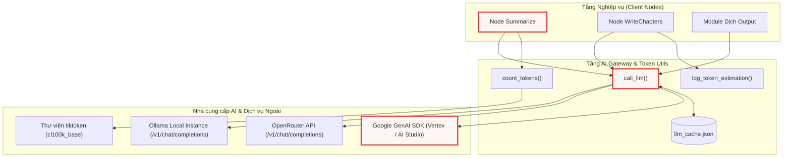
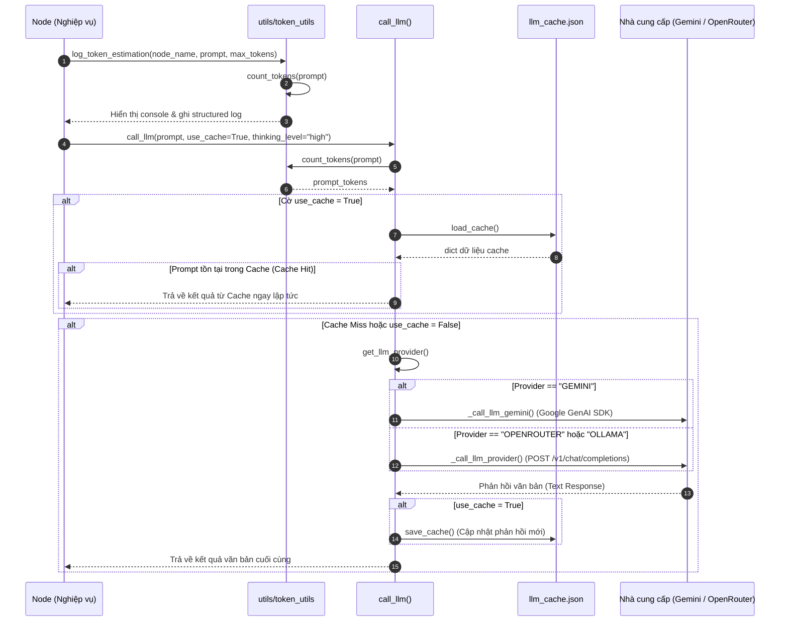
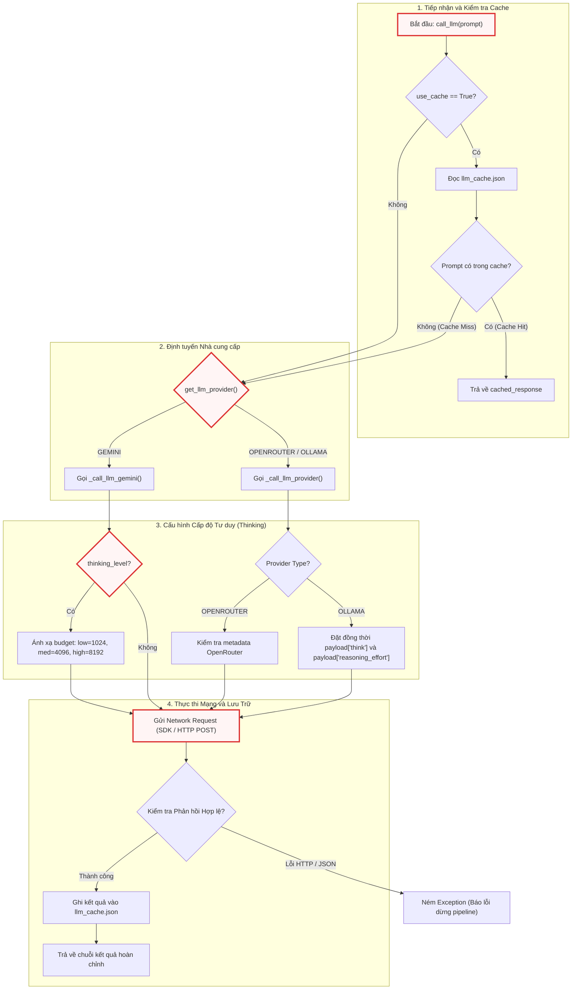

# Chapter 3: Tích hợp Mô hình Ngôn ngữ & Quản lý Token Context


Ở [Chương 2: Hệ thống Thu thập & Lọc Mã nguồn Đa nguồn](02_hệ_thống_thu_thập___lọc_mã_nguồn_đa_nguồn.md), chúng ta đã tìm hiểu cách thức hệ thống quét, thẩm định và chuẩn hóa toàn bộ tệp tin của kho mã nguồn thành một từ điển dữ liệu phẳng trong bộ nhớ. Sau khi dữ liệu mã nguồn đã được làm sạch và nạp vào bộ nhớ RAM, thách thức cốt lõi tiếp theo là: làm thế nào để chuyển đổi hàng trăm nghìn dòng mã thô này thành các prompt có cấu trúc, gửi chúng đến các Mô hình Ngôn ngữ Lớn (LLM) khác nhau một cách tin cậy, kiểm soát chặt chẽ ngân sách token, tối ưu hóa chi phí API thông qua bộ nhớ đệm, và hỗ trợ đa dạng nhà cung cấp mà không làm biến đổi logic nghiệp vụ của hệ thống?

Chương này sẽ phân tích sâu tầng kiến trúc Gateway/Adapter nằm tại hai module nòng cốt: `utils/call_llm.py` và `utils/token_utils.py`.

---

## 1. Tổng quan Kiến trúc (Technical Overview)

### 1.1 Vai trò Kiến trúc (Architectural Role)

Trong một hệ thống phân tích mã nguồn tự động, việc tương tác với LLM không chỉ đơn thuần là gửi một chuỗi văn bản và nhận về phản hồi. Tầng Tích hợp LLM & Quản lý Token Context đóng vai trò là **Lớp Biên Dịch vụ AI (AI Gateway & Adapter Layer)**, thiết lập ranh giới phân lập giữa logic nghiệp vụ phân tích AST/đồ thị luồng (thuộc các Node trong PocketFlow) và các giao thức giao tiếp mạng với nhà cung cấp mô hình.

```
+-------------------------------------------------------------------------------+
|                             PocketFlow Nodes Layer                            |
|             (Summarize, GenerateChapters, WriteTutorial, Translate)           |
+-------------------------------------------------------------------------------+
                                      │
                                      ▼
+-------------------------------------------------------------------------------+
|                      AI Gateway & Token Management Layer                      |
|                                                                               |
|   +--------------------------+             +------------------------------+   |
|   |   utils/token_utils.py   |             |      utils/call_llm.py       |   |
|   |  - BPE Token Counter     |             |  - Caching Proxy             |   |
|   |  - Context Budgeting     |             |  - Multi-Provider Adapter    |   |
|   |  - Fallback Heuristics   |             |  - Thinking Config Engine    |   |
|   +--------------------------+             +------------------------------+   |
+-------------------------------------------------------------------------------+
                 │                                           │
                 ▼                                           ▼
      +---------------------+               +-------------------------------+
      |  tiktoken (cl100k)  |               | Google GenAI SDK (Vertex/AI)  |
      |  Character Fallback |               | OpenAI-Compatible HTTP REST   |
      +---------------------+               | (OpenRouter / Ollama)         |
                                            +-------------------------------+
```

Nếu thành phần này không tồn tại dưới dạng một lớp trừu tượng độc lập:
* Toàn bộ mã nguồn nghiệp vụ tại các Node xử lý sẽ bị "nhiễm" (leaked) mã triển khai SDK đặc thù của từng nhà cung cấp (ví dụ: cú pháp `types.ThinkingConfig` của Google SDK bị trộn lẫn với logic sinh tài liệu).
* Không có điểm kiểm soát tập trung để đo lường token đầu vào/đầu ra, dẫn đến nguy cơ vượt quá cửa sổ ngữ cảnh (Context Window Overflow) gây gián đoạn quy trình thực thi dài hạn.
* Chi phí vận hành và thời gian phát triển sẽ bùng nổ do thiếu cơ chế bộ nhớ đệm (caching) cho các prompt lặp lại trong quá trình gỡ lỗi hoặc chạy lại pipeline.

### 1.2 Mẫu Thiết kế (Design Patterns)

Thành phần tích hợp này áp dụng ba mẫu thiết kế kinh điển:

1. **Adapter Pattern**: Chuẩn hóa các giao diện gọi API không tương thích giữa Google Gemini (`google.genai` SDK chuyên dụng) và các nhà cung cấp hỗ trợ giao thức chuẩn `/v1/chat/completions` (OpenRouter, Ollama) về một hàm thực thi duy nhất: `call_llm(prompt, use_cache, thinking_level)`. 
   * *Đánh đổi (Trade-off)*: Giảm thiểu sự phụ thuộc vào các tính năng độc quyền của một SDK đơn lẻ để đổi lấy tính linh hoạt và khả năng hoán đổi nhà cung cấp mà không phải sửa đổi mã nguồn ở tầng Node.
2. **Proxy Pattern (Caching Proxy)**: Hàm `call_llm` bọc một lớp đệm trung gian dựa trên tệp JSON (`llm_cache.json`). Mọi yêu cầu trước khi được chuyển đến mạng đều được tra cứu theo hàm băm của nội dung prompt.
   * *Đánh đổi (Trade-off)*: Tăng nhẹ độ trễ đọc đĩa (Disk I/O) cho mỗi lượt gọi để đổi lấy việc tiết kiệm $100\%$ chi phí API và triệt tiêu độ trễ mạng đối với các prompt đã từng thực thi.
3. **Gateway Pattern**: Đóng gói logic đàm phán kích thước ngữ cảnh (`get_model_context_length`), phát hiện nhà cung cấp tự động (`get_llm_provider`), và điều khiển cấp độ tư duy/suy luận (`thinking_level`).

### 1.3 Trách nhiệm Cốt lõi (Core Responsibilities)

* **Điều phối & Định tuyến Truy vấn**: Tiếp nhận prompt từ tầng nghiệp vụ, thẩm định cấu hình môi trường và định tuyến lệnh gọi đến đúng SDK cục bộ hoặc endpoint HTTP từ xa.
* **Quản lý Cấp độ Tư duy (Reasoning/Thinking Budget)**: Chuyển đổi tham số trừu tượng (`low`, `medium`, `high`) thành cấu hình ngân sách token tư duy cụ thể cho Google Gemini hoặc cờ `reasoning_effort` / `think` cho OpenRouter và Ollama.
* **Kiểm soát & Ước tính Dung lượng Token**: Sử dụng bộ mã hóa BPE `cl100k_base` từ thư viện `tiktoken` để tính toán chính xác số token của prompt trước khi gửi, đi kèm cơ chế dự phòng (fallback) tự động dựa trên tỷ lệ ký tự.
* **Bộ nhớ đệm Phản hồi Cục bộ**: Quản lý vòng đời lưu trữ và tải kết quả truy vấn từ `llm_cache.json` nhằm hỗ trợ tái thực thi nhanh và tiết kiệm chi phí.
* **Phân tích và Giám sát Context Window**: Xuất thông số thống kê chi tiết về tỷ lệ chiếm dụng cửa sổ ngữ cảnh của từng Node ra màn hình console và tệp nhật ký có cấu trúc.

### 1.4 Phụ thuộc Hệ thống (Key Dependencies)

Sơ đồ ngữ cảnh dưới đây thể hiện mối quan hệ giữa Tầng Tích hợp LLM với các thành phần phụ thuộc bên trong và bên ngoài:



---

## 2. Phân tích Hiện thực Chi tiết theo Hàm (Function-by-Function Breakdown)

Dưới đây là chi tiết mã nguồn và các phân tích kỹ thuật chuyên sâu của từng module.

### 2.1 Quản lý Trì hoãn Logging và Bộ nhớ đệm Cục bộ

Trong `utils/call_llm.py`, việc cấu hình logging và bộ nhớ đệm đòi hỏi xử lý khéo léo để tránh xung đột khi module được import tại các thời điểm khác nhau trong chu trình khởi động ứng dụng.

```python
# Configure logging - deferred until main.py calls configure_logging()
# At import time, set up logger with NullHandler (no file output yet)
logger = logging.getLogger("llm_logger")
logger.setLevel(logging.INFO)
logger.propagate = False  # Prevent propagation to root logger
logger.addHandler(logging.NullHandler())  # Absorb logs until configured


# Simple cache configuration
cache_file = "llm_cache.json"


def load_cache():
    try:
        with open(cache_file) as f:
            return json.load(f)
    except Exception:
        logger.warning("Failed to load cache.")
    return {}


def save_cache(cache):
    try:
        with open(cache_file, "w") as f:
            json.dump(cache, f)
    except Exception:
        logger.warning("Failed to save cache")
```

Đoạn mã trên thể hiện hai quyết định kiến trúc quan trọng:
1. **Mô hình Trì hoãn Logging (Deferred Logging)**: Tại thời điểm nạp module (`import time`), đường dẫn thư mục `logs/` có thể chưa được `main.py` khởi tạo. Do đó, logger được gắn một `logging.NullHandler()` và tắt cờ `propagate` để nuốt toàn bộ log tạm thời, ngăn chặn việc xuất log rác ra console trước khi hệ thống sẵn sàng.
2. **Cơ chế Nuốt Ngoại lệ An toàn cho Cache (Fail-Safe Cache I/O)**: Hai hàm `load_cache()` và `save_cache()` bắt toàn bộ ngoại lệ chung (`except Exception`). Nếu tệp `llm_cache.json` bị khóa, lỗi phân tích cú pháp JSON hoặc quyền truy cập tệp bị từ chối, hệ thống chỉ ghi nhận cảnh báo và trả về một từ điển rỗng `{}` thay vì làm sập toàn bộ tiến trình phân tích kéo dài.

---

### 2.2 Nhận diện Nhà cung cấp và Đàm phán Ngữ cảnh Mô hình

Hệ thống cho phép cấu hình động nhà cung cấp thông qua biến môi trường, đồng thời cung cấp khả năng tự động truy vấn thông tin metadata từ API từ xa.

```python
def get_llm_provider():
    provider = os.getenv("LLM_PROVIDER")
    if not provider and (os.getenv("GEMINI_PROJECT_ID") or os.getenv("GEMINI_API_KEY")):
        provider = "GEMINI"
    # if necessary, add ANTHROPIC/OPENAI
    return provider


# Cache for model capabilities to avoid repeated API calls
_openrouter_models_cache = None


def _get_openrouter_model_info(model_id: str) -> dict:
    global _openrouter_models_cache
    if _openrouter_models_cache is None:
        try:
            resp = requests.get("https://openrouter.ai/api/v1/models", timeout=5)
            _openrouter_models_cache = resp.json().get("data", [])
        except Exception:
            _openrouter_models_cache = []

    return next((m for m in _openrouter_models_cache if m.get("id") == model_id), None)
```

Hàm `get_llm_provider()` triển khai logic suy đoán thông minh: nếu biến `LLM_PROVIDER` không được chỉ định tường minh nhưng tồn tại khóa `GEMINI_PROJECT_ID` hoặc `GEMINI_API_KEY`, hệ thống sẽ tự động chuyển hướng sử dụng nhà cung cấp Google Gemini.

Đối với OpenRouter, module duy trì một biến bộ nhớ đệm toàn cục `_openrouter_models_cache`. Việc truy vấn danh sách mô hình qua HTTP `GET /api/v1/models` chỉ diễn ra duy nhất một lần (Lazy Loading với thời gian timeout ngắn 5 giây). Các lần gọi tiếp theo sẽ duyệt trực tiếp trên danh sách đối tượng đã được lưu trong bộ nhớ RAM, hạn chế tối đa độ trễ mạng.

Tiếp theo là hàm xác định kích thước cửa sổ ngữ cảnh cực đại:

```python
def get_model_context_length(endpoint_url: str, model_name: str, api_key: str = "") -> int:
    """
    Fetch the maximum context length of a model based on the endpoint.
    If endpoint is Gemini API, safely default to 1,000,000 tokens.
    If endpoint is openrouter.ai, make GET to /api/v1/models and extract.
    Default to 100,000.
    """
    default_limit = 100000
    try:
        if not endpoint_url:
            return default_limit

        if "generativelanguage.googleapis.com" in endpoint_url or "gemini" in model_name.lower():
            # Safely default to 1M tokens for Gemini models
            return 1000000

        if "openrouter.ai" in endpoint_url:
            resp = requests.get("https://openrouter.ai/api/v1/models", timeout=5)
            data = resp.json().get("data", [])
            for m in data:
                if m.get("id") == model_name:
                    return m.get("context_length", default_limit)
    except Exception as e:
        logger.warning(f"Failed to fetch context length for {model_name} at {endpoint_url}: {e}")

    return default_limit
```

Hàm `get_model_context_length` đóng vai trò là cơ chế bảo vệ ngưỡng an toàn (Safety Boundary) cho toàn bộ pipeline:
* Nếu mô hình thuộc họ Google Gemini, hệ thống tự động gán trần hạn ngạch là $1{,}000{,}000$ tokens.
* Nếu là OpenRouter, hệ thống trích xuất trường `context_length` từ phản hồi API của model tương ứng.
* Nếu có bất kỳ lỗi mạng hoặc không khớp thông tin, hệ thống tự động fallback về mức an toàn chuẩn là $100{,}000$ tokens.

---

### 2.3 Bộ Điều phối Gọi LLM Thống nhất (`call_llm`)

Hàm `call_llm()` là giao diện công khai chính mà toàn bộ các Node và mô-đun dịch thuật tiêu thụ. Hàm này tích hợp toàn bộ chu trình: tính toán token, kiểm tra cache, gọi mạng, đo thời gian thực thi và cập nhật cache.

```python
# By default, we use Google Gemini 3.7 flash, as it shows great performance for code understanding
def call_llm(prompt: str, use_cache: bool = True, thinking_level: str | None = None) -> str:
    import time

    from utils.token_utils import count_tokens

    provider = get_llm_provider()
    model = os.environ.get(f"{provider}_MODEL", os.environ.get("GEMINI_MODEL", "unknown"))
    prompt_tokens = count_tokens(prompt)

    logger.info(f"{'=' * 80}")
    logger.info(
        f"LLM CALL START | provider={provider} | model={model} | thinking={thinking_level} | cache={'enabled' if use_cache else 'disabled'} | prompt_tokens={prompt_tokens:,}"
    )
    logger.info(f"PROMPT:\n{prompt}")

    # Check cache if enabled
    if use_cache:
        cache = load_cache()
        if prompt in cache:
            cached_response = cache[prompt]
            logger.info(f"CACHE HIT | response_chars={len(cached_response):,}")
            logger.info(f"RESPONSE (cached):\n{cached_response}")
            logger.info("LLM CALL END | result=cache_hit")
            return cached_response
// ...
```

Ở đoạn đầu của `call_llm()`, cấu trúc log dạng key-value phân cách bằng ký tự `|` được thiết lập nhằm phục vụ việc phân tích dữ liệu tự động (log parsing). Nếu tham số `use_cache=True`, chuỗi prompt đầy đủ sẽ được sử dụng làm khóa định danh để tra cứu trực tiếp trong tệp cache. Nếu xảy ra **Cache Hit**, hàm lập tức trả về nội dung đã lưu, cắt giảm hoàn toàn thời gian chờ đợi và tiêu tốn quota.

Nếu xảy ra **Cache Miss**, quy trình chuyển sang giai đoạn thực thi cuộc gọi mạng thực tế:

```python
// ...
    # Make the actual LLM call
    start_time = time.time()
    logger.info(f"API CALL | sending request to {provider}...")

    if provider == "GEMINI":
        response_text = _call_llm_gemini(prompt, thinking_level=thinking_level)
    else:  # generic method using a URL that is OpenAI compatible API (Ollama, ...)
        response_text = _call_llm_provider(prompt, thinking_level=thinking_level)

    elapsed = time.time() - start_time
    logger.info(f"API CALL COMPLETE | elapsed={elapsed:.1f}s | response_chars={len(response_text):,}")
    logger.info(f"RESPONSE:\n{response_text}")

    # Update cache if enabled
    if use_cache:
        cache = load_cache()
        cache[prompt] = response_text
        save_cache(cache)
        logger.info("CACHE WRITE | saved response to cache")

    logger.info(f"LLM CALL END | result=success | elapsed={elapsed:.1f}s")
    return response_text
```

Khối mã trên minh họa tính đối xứng trong xử lý: hàm định thời `time.time()` đo lường chính xác độ trễ mạng đến hàng phần mười giây (`elapsed:.1f}s`). Ngay sau khi nhận kết quả thành công, nếu cờ `use_cache` bật, dữ liệu sẽ lập tức được ghi ngược lại vào bộ lưu trữ đĩa thông qua cặp hàm `load_cache()` / `save_cache()`, đảm bảo tính bền vững của dữ liệu cho các lần chạy tiếp theo.

---

### 2.4 Tích hợp Chuyên biệt Google Gemini SDK (`_call_llm_gemini`)

Google Gemini là mô hình mặc định chính của dự án nhờ hiệu năng vượt trội trong việc phân tích mã nguồn và cửa sổ ngữ cảnh lớn. Hàm `_call_llm_gemini()` đóng gói toàn bộ các cấu hình chuyên biệt của SDK mới `google.genai`.

```python
def _call_llm_gemini(prompt: str, thinking_level: str | None = None) -> str:
    if os.getenv("GEMINI_PROJECT_ID"):
        client = genai.Client(vertexai=True, project=os.getenv("GEMINI_PROJECT_ID"), location=os.getenv("GEMINI_LOCATION", "us-central1"))
    elif os.getenv("GEMINI_API_KEY"):
        client = genai.Client(api_key=os.getenv("GEMINI_API_KEY"))
    else:
        raise ValueError("Either GEMINI_PROJECT_ID or GEMINI_API_KEY must be set in the environment")
    model = os.getenv("GEMINI_MODEL", "gemini-3.7-flash")

    kwargs = {"model": model, "contents": [prompt]}

    if thinking_level:
        # Map string levels to budgets for the installed SDK version
        budget_map = {"low": 1024, "medium": 4096, "high": 8192}
        budget = budget_map.get(thinking_level.lower(), 4096)
        thinking_config = types.ThinkingConfig(include_thoughts=True, thinking_budget=budget)
        kwargs["config"] = types.GenerateContentConfig(thinking_config=thinking_config)

    response = client.models.generate_content(**kwargs)

    # Extract only text parts to avoid "non-text parts: ['thought_signature']" warnings
    if response.candidates and response.candidates[0].content.parts:
        text_parts = [part.text for part in response.candidates[0].content.parts if part.text is not None]
        return "".join(text_parts)
    return ""
```

Phân tích các chi tiết kỹ thuật chuyên sâu trong hàm này:
1. **Hỗ trợ Song song Hai Chế độ Xác thực (Dual Authentication Mode)**: Hàm hỗ trợ cả môi trường doanh nghiệp trên Google Cloud Vertex AI (thông qua `GEMINI_PROJECT_ID` và `GEMINI_LOCATION`) lẫn môi trường phát triển độc lập sử dụng khóa Google AI Studio (`GEMINI_API_KEY`).
2. **Ánh xạ Ngân sách Tư duy (Thinking Budget Mapping)**: Chuỗi ký tự cấp độ tư duy (`low`, `medium`, `high`) được chuyển đổi thành số lượng token ngân sách cụ thể (`1024`, `4096`, `8192` tokens) thông qua cấu hình `types.ThinkingConfig`.
3. **Lọc Phần tử Nội dung (Candidate Content Filtering)**: Khi kích hoạt chế độ suy luận mở rộng (`include_thoughts=True`), SDK của Gemini trả về nhiều phần tử `parts` bên trong nội dung, bao gồm cả các khối siêu dữ liệu như `thought_signature`. Logic duyệt danh sách `[part.text for part in parts if part.text is not None]` đảm bảo chỉ các đoạn văn bản thực sự mới được ghép lại thành kết quả, triệt tiêu triệt để các cảnh báo rác từ SDK.

---

### 2.5 Cổng Tương thích Chuẩn OpenAI (`_call_llm_provider`)

Để hỗ trợ các nhà cung cấp bên thứ ba hoặc các máy chủ mô hình chạy cục bộ (như OpenRouter hoặc Ollama), hàm `_call_llm_provider()` triển khai một client HTTP đa năng tương thích với giao thức chuẩn OpenAI `/v1/chat/completions`.

#### Phần 1: Cấu hình Biến Môi trường, Headers và Payload Suy luận

```python
def _call_llm_provider(prompt: str, thinking_level: str | None = None) -> str:
    """
    Call an LLM provider based on environment variables.
    Environment variables:
    - LLM_PROVIDER: "OLLAMA" or "OPENROUTER"
    - <provider>_MODEL: Model name (e.g., OLLAMA_MODEL, OPENROUTER_MODEL)
    - <provider>_BASE_URL: Base URL without endpoint (e.g., OLLAMA_BASE_URL, OPENROUTER_BASE_URL)
    - <provider>_API_KEY: API key (e.g., OLLAMA_API_KEY, OPENROUTER_API_KEY; optional for providers that don't require it)
    The endpoint /v1/chat/completions will be appended to the base URL.
    """

    # Read the provider from environment variable
    provider = os.environ.get("LLM_PROVIDER")
    if not provider:
        raise ValueError("LLM_PROVIDER environment variable is required")

    # Construct the names of the other environment variables
    model_var = f"{provider}_MODEL"
    base_url_var = f"{provider}_BASE_URL"
    api_key_var = f"{provider}_API_KEY"

    # Read the provider-specific variables
    model = os.environ.get(model_var)
    base_url = os.environ.get(base_url_var)
    api_key = os.environ.get(api_key_var, "")  # API key is optional, default to empty string

    # Validate required variables
    if not model:
        raise ValueError(f"{model_var} environment variable is required")
    if not base_url:
        raise ValueError(f"{base_url_var} environment variable is required")

    # Append the endpoint to the base URL
    url = f"{base_url.rstrip('/')}/v1/chat/completions"

    # Configure headers and payload based on provider
    headers = {
        "Content-Type": "application/json",
    }
    if api_key:  # Only add Authorization header if API key is provided
        headers["Authorization"] = f"Bearer {api_key}"

    payload = {
        "model": model,
        "messages": [{"role": "user", "content": prompt}],
        "temperature": 0.7,
    }
// ...
```

Cơ chế đọc cấu hình sử dụng mô hình nội suy biến môi trường theo tiền tố: `{PROVIDER}_MODEL`, `{PROVIDER}_BASE_URL`, và `{PROVIDER}_API_KEY`. Điều này cho phép cấu hình đồng thời nhiều nhà cung cấp trong cùng một tệp `.env` mà không gây xung đột khóa. Đường dẫn cơ sở được chuẩn hóa bằng phương thức `.rstrip('/')` để ngăn chặn lỗi nhân đôi dấu gạch chéo khi ghép nối endpoint `/v1/chat/completions`.

Tiếp theo là phân đoạn xử lý các dị biệt về tham số suy luận (reasoning parameters) giữa các nhà cung cấp:

```python
// ...
    if provider == "OPENROUTER" and thinking_level:
        model_info = _get_openrouter_model_info(model)
        if model_info and "reasoning" in model_info:
            supported_efforts = model_info["reasoning"].get("supported_efforts", [])
            if thinking_level.lower() in supported_efforts:
                payload["reasoning"] = {"effort": thinking_level.lower()}
                payload["temperature"] = 1.0  # Required for many reasoning models
            else:
                logger.warning(f"Invalid thinking level '{thinking_level}' for model {model}. Supported efforts: {supported_efforts}")
        else:
            logger.warning(f"Model {model} does not support reasoning via OpenRouter API.")

    elif provider == "OLLAMA" and thinking_level:
        # Some Ollama SDKs / API versions look for `think`, others look for standard `reasoning_effort`
        payload["think"] = thinking_level.lower()
        payload["reasoning_effort"] = thinking_level.lower()
        payload["temperature"] = 1.0
// ...
```

Đoạn mã trên xử lý sự khác biệt cơ bản trong cách các nền tảng hiểu khái niệm "suy luận":
* **OpenRouter**: Kiểm tra khả năng hỗ trợ thông qua metadata (`supported_efforts`). Nếu hợp lệ, tham số được đặt vào đối tượng `payload["reasoning"] = {"effort": ...}` và nhiệt độ bắt buộc phải nâng lên `1.0` (theo đặc tả kỹ thuật của các mô hình như OpenAI o1/o3-mini hoặc DeepSeek R1).
* **Ollama**: Do sự không nhất quán giữa các phiên bản máy chủ Ollama, mã nguồn chủ động thiết lập song song cả hai khóa `payload["think"]` và `payload["reasoning_effort"]` để đạt được khả năng tương thích tối đa.

#### Phần 2: Thực thi Yêu cầu HTTP và Xử lý Lỗi Phòng thủ Đa tầng

```python
// ...
    try:
        response = requests.post(url, headers=headers, json=payload, timeout=(10, 300))
        try:
            response_json = response.json()  # Log the response
        except (ValueError, requests.exceptions.JSONDecodeError):
            from utils.output import emit_raw

            emit_raw(
                "WARNING",
                f"Warning: Provider returned invalid JSON. Status Code: {response.status_code}, Response Text: {response.text}",
                dest="STDOUT",
            )
            logger.warning(f"Provider returned invalid JSON. Status Code: {response.status_code}, Response Text: {response.text}")
            raise ValueError(f"Provider returned invalid JSON. Status Code: {response.status_code}") from None
        response.raise_for_status()

        # Defensive check: API may return 200 with error/rate-limit payload missing 'choices'
        if "choices" not in response_json or not response_json["choices"]:
            error_detail = response_json.get("error", response_json)
            logger.warning(f"API returned 200 but no 'choices' in response: {error_detail}")
            raise ValueError(f"API response missing 'choices' key. Response: {error_detail}")

        return response_json["choices"][0]["message"]["content"]
    except requests.exceptions.HTTPError as e:
        error_message = f"HTTP error occurred: {e}"
        try:
            error_details = response.json().get("error", "No additional details")
            error_message += f" (Details: {error_details})"
        except Exception:
            pass
        raise Exception(error_message) from e
    except requests.exceptions.ConnectionError as e:
        raise Exception(f"Failed to connect to {provider} API. Check your network connection.") from e
    except requests.exceptions.Timeout as e:
        raise Exception(f"Request to {provider} API timed out.") from e
    except requests.exceptions.RequestException as e:
        raise Exception(f"An error occurred while making the request to {provider}: {e}") from e
    except ValueError as e:
        raise Exception(f"Failed to parse response as JSON from {provider}. The server might have returned an invalid response.") from e
```

Khối thực thi HTTP này áp dụng chiến lược xử lý lỗi phòng thủ đa lớp (Defensive Programming):
1. **Thiết lập Timeout Kép `timeout=(10, 300)`**: Yêu cầu thiết lập kết nối (Connect Timeout) trong vòng 10 giây, và cho phép thời gian đọc phản hồi (Read Timeout) tối đa lên tới 300 giây (5 phút), phù hợp với các tác vụ tổng hợp mã nguồn lớn hoặc các mô hình reasoning cần thời gian suy nghĩ dài.
2. **Kiểm tra Phản hồi 200 Không hợp lệ (Defensive Choice Verification)**: Một số cổng proxy API trả về mã HTTP `200 OK` nhưng nội dung JSON bên trong lại là thông báo lỗi hoặc bị cắt ngắn làm mất mảng `choices`. Khối mã chủ động kiểm tra sự tồn tại của `choices` trước khi truy xuất phần tử con, ngăn chặn lỗi `IndexError` hoặc `KeyError` không tường minh.
3. **Bóc tách Thông tin Lỗi HTTP Chi tiết**: Khi phát sinh ngoại lệ `HTTPError`, hệ thống cố gắng trích xuất trường `error` từ nội dung JSON trả về để làm giàu ngữ cảnh lỗi cho kỹ sư vận hành.

---

### 2.6 Đo lường và Phân tích Token Context (`utils/token_utils.py`)

Module `utils/token_utils.py` cung cấp các công cụ toán học và hiển thị để theo dõi tải lượng ngữ cảnh mà hệ thống đưa vào LLM.

#### Bộ đếm Token với Singleton BPE và Dự phòng Ký tự

```python
import logging

import tiktoken

from utils.output import emit

# Get the shared logger from call_llm module
logger = logging.getLogger("llm_logger")

# Lazy-loaded tiktoken encoding (singleton)
_encoding = None


def _get_encoding():
    global _encoding
    if _encoding is None:
        try:
            _encoding = tiktoken.get_encoding("cl100k_base")
        except Exception:
            _encoding = None
    return _encoding


def count_tokens(text: str) -> int:
    """Count tokens using tiktoken, with fallback to chars/4."""
    if not text:
        return 0
    enc = _get_encoding()
    if enc:
        return len(enc.encode(text, disallowed_special=()))
    return len(text) // 4
```

Hàm `_get_encoding()` khởi tạo đối tượng mã hóa `cl100k_base` (tương thích chuẩn OpenAI/GPT-4) theo mô hình Lazy Singleton. Quá trình tải bảng từ vựng BPE chỉ diễn ra một lần duy nhất trong toàn bộ vòng đời ứng dụng.

Tại hàm `count_tokens()`:
* Tham số `disallowed_special=()` vô hiệu hóa việc ném ngoại lệ khi gặp các token đặc biệt (như `<|endoftext|>`), cho phép đếm an toàn trên toàn bộ chuỗi mã nguồn thô chứa các ký tự đặc thù.
* **Cơ chế Fallback Heuristic**: Nếu môi trường không thể tải bảng từ vựng `tiktoken` (ví dụ: thiếu kết nối Internet để tải file từ điển BPE lúc cài đặt hoặc lỗi nhị phân C-extension), hệ thống tự động chuyển sang ước tính bằng công thức: $\text{Số tokens} \approx \lfloor \text{Số ký tự} / 4 \rfloor$, bảo đảm ứng dụng không bao giờ bị dừng đột ngột.

#### Phân bổ và Giám sát Dung lượng Context cho Từng Node

```python
def log_token_estimation(node_name: str, prompt_content: str, max_tokens: int, token_usage: dict | None = None) -> None:
    token_count = count_tokens(prompt_content)
    percentage = (token_count / max_tokens) * 100 if max_tokens else 0

    # Build token usage breakdown suffix for stdout display
    suffix = ""
    usage_log_str = ""
    if token_usage:
        max_label_len = max(len(label) for label in token_usage)
        lines = []
        log_parts = []
        for label, value in token_usage.items():
            pct = (value / token_count * 100) if token_count else 0
            padded_label = label.ljust(max_label_len)
            lines.append(f"\t{padded_label} : {value:,} ({pct:.0f}%)")
            log_parts.append(f"{label}={value:,} ({pct:.0f}%)")
        suffix = "\n" + "\n".join(lines)
        usage_log_str = " | " + " | ".join(log_parts)

    # Console output via emit (styled by CSV LEVEL=WARNING → yellow)
    emit(
        "TOKEN_ANALYTICS",
        suffix=suffix,
        node_name=node_name,
        token_count=f"{token_count:,}",
        max_tokens=f"{max_tokens:,}",
        percentage=f"{percentage:.1f}",
    )

    # File log stays single-line for parseability (structured, not translatable)
    logger.info(f"NODE EXEC | node={node_name} | prompt_tokens={token_count:,} / {max_tokens:,} ({percentage:.1f}% capacity){usage_log_str}")
```

Hàm `log_token_estimation` chịu trách nhiệm tạo bức tranh toàn cảnh về việc sử dụng bộ nhớ ngữ cảnh:
* **Tính toán Tỷ lệ Chiếm dụng**: Đo lường tỷ lệ phần trăm dung lượng prompt so với giới hạn cực đại của mô hình ($\text{percentage} = \frac{\text{token\_count}}{\text{max\_tokens}} \times 100$).
* **Phân rã Thành phần Prompt (Usage Breakdown)**: Nếu truyền vào tham số `token_usage` (chứa số token của từng thành phần như mã nguồn tệp tin, sơ đồ quan hệ, prompt chỉ thị), hàm sẽ tự động căn lề văn bản (`ljust`) và tính tỷ lệ phần trăm đóng góp của từng thành phần.
* **Phân tách Đa kênh (Dual-Channel Output)**: Đầu ra console được định dạng màu sắc thông qua hàm `emit("TOKEN_ANALYTICS")` từ `utils.output`, trong khi tệp log nhận một bản ghi đơn dòng (single-line log) có cấu trúc chuẩn để các hệ thống thu thập log (như ELK hoặc Datadog) dễ dàng trích xuất thông tin.

---

### 2.7 Bảng Tổng hợp Toàn bộ Các Hàm trong Thành phần

Dưới đây là bảng tổng hợp trách nhiệm và hành vi cốt lõi của các hàm thuộc tầng tích hợp LLM:

| Tệp nguồn | Tên hàm / Thuộc tính | Trách nhiệm chính | Hành vi kỹ thuật đặc thù |
| :--- | :--- | :--- | :--- |
| `utils/call_llm.py` | `load_cache()` | Đọc bộ nhớ đệm từ đĩa | Bắt mọi ngoại lệ I/O, trả về `{}` nếu lỗi. |
| `utils/call_llm.py` | `save_cache(cache)` | Ghi phản hồi vào đĩa | Ghi đè file `llm_cache.json` dưới dạng JSON có cấu trúc. |
| `utils/call_llm.py` | `get_llm_provider()` | Xác định Provider đang hoạt động | Ưu tiên biến `LLM_PROVIDER`, tự suy luận `GEMINI` nếu có Key/Project ID. |
| `utils/call_llm.py` | `_get_openrouter_model_info()` | Tra cứu năng lực mô hình OpenRouter | Tải lười (Lazy fetch) metadata qua HTTP GET, lưu bộ nhớ RAM tĩnh. |
| `utils/call_llm.py` | `get_model_context_length()` | Xác định trần Context Window | Mặc định $1\text{M}$ cho Gemini, tra cứu động cho OpenRouter, fallback $100\text{k}$. |
| `utils/call_llm.py` | `call_llm()` | Điều phối truy vấn LLM cấp cao | Kiểm tra cache hit, gọi API, đo thời gian, ghi log và lưu cache miss. |
| `utils/call_llm.py` | `_call_llm_gemini()` | Tương tác SDK Google Gemini | Hỗ trợ VertexAI/AI Studio, cấu hình `ThinkingConfig`, lọc bỏ `thought_signature`. |
| `utils/call_llm.py` | `_call_llm_provider()` | Tương tác qua HTTP OpenAI format | Ánh xạ biến môi trường động, cấu hình timeout kép `(10, 300)`, kiểm tra `choices`. |
| `utils/token_utils.py` | `_get_encoding()` | Khởi tạo Tokenizer | Khởi tạo Singleton cho bộ mã hóa `cl100k_base` của `tiktoken`. |
| `utils/token_utils.py` | `count_tokens()` | Đếm số lượng token văn bản | Mã hóa BPE an toàn; tự động fallback sang `len(text) // 4`. |
| `utils/token_utils.py` | `log_token_estimation()` | Báo cáo dung lượng ngữ cảnh | Tính tỷ lệ phần trăm context, định dạng phân rã chi tiết, xuất console và log tệp. |

---

## 3. Luồng Thực thi & Chuyển đổi Trạng thái (Execution Flow & Sequence)

Để nắm rõ cách các hàm phối hợp với nhau trong một chu kỳ xử lý, chúng ta xem xét hai sơ đồ dưới đây.

### 3.1 Sơ đồ Tuần tự: Vòng đời Một Yêu cầu Truy vấn LLM

Sơ đồ tuần tự sau mô tả luồng dữ liệu từ khi một Node (ví dụ `GenerateChapters`) yêu cầu sinh nội dung cho đến khi nhận được kết quả cuối cùng:



### 3.2 Sơ đồ Cây Quyết định: Điều hướng Nhà cung cấp và Cấu hình Suy luận

Sơ đồ luồng dưới đây thể hiện toàn bộ nhánh logic rẽ hướng bên trong `call_llm()`, `_call_llm_gemini()` và `_call_llm_provider()`:



---

## 4. Ràng buộc Kỹ thuật, Xử lý Đồng thời & Khả năng Mở rộng

Khi vận hành hệ thống trong môi trường thực tế với các kho mã nguồn lớn, kỹ sư cần lưu ý các đặc tính vận hành sau:

### 4.1 Mô hình I/O-Bound và Rủi ro Tranh chấp Tệp Cache (Race Conditions)

* Toàn bộ các thao tác mạng gọi LLM đều là các tác vụ I/O-bound có độ trễ lớn (dao động từ $2$ giây đến hơn $60$ giây cho mỗi yêu cầu).
* **Tranh chấp Ghi Cache (Cache Race Condition)**: Hiện tại, `llm_cache.json` được thiết kế dưới dạng một tệp JSON phẳng đơn lẻ trên đĩa. Trong mô hình thực thi tuần tự của PocketFlow, cơ chế này hoạt động hoàn hảo mà không gặp rủi ro xung đột. Tuy nhiên, nếu hệ thống được nâng cấp để chạy các Node hoặc các Chapter song song (sử dụng `asyncio` hoặc `concurrent.futures`), việc nhiều tiến trình cùng đọc/ghi đồng thời vào `llm_cache.json` mà không có cơ chế khóa tệp (File Locking như thư viện `filelock`) sẽ dẫn đến hiện tượng tệp JSON bị hỏng dữ liệu (`JSONDecodeError`).

### 4.2 Chiến lược Quản lý Hạn ngạch và Timeout

* Hàm `_call_llm_provider` áp dụng cấu hình `timeout=(10, 300)`. Đây là thiết kế có chủ đích:
  * **Connect Timeout (10s)**: Ngắt kết nối sớm nếu địa chỉ IP máy chủ không phản hồi, ngăn ngừa việc tiến trình bị treo vô thời hạn do sự cố định tuyến mạng.
  * **Read Timeout (300s)**: Dành thời lượng đủ lớn cho các mô hình có năng lực suy luận sâu (như Gemini 3.7 Thinking hoặc DeepSeek R1) tổng hợp và phân tích các prompt mã nguồn phức tạp có dung lượng lên đến hàng chục nghìn tokens.

### 4.3 Độ Lệch Mã hóa Token (Tokenizer Drift)

* Module `token_utils.py` chuẩn hóa việc đếm token thông qua bảng từ vựng `cl100k_base` của OpenAI.
* Cần lưu ý rằng: Google Gemini sử dụng bộ mã hóa BPE riêng biệt của họ (SentencePiece-based tokenizer). Do đó, số lượng token tính toán bởi `tiktoken` sẽ có độ lệch nhỏ ($\pm 5-10\%$) so với số token thực tế mà API của Gemini tính toán. Tuy nhiên, với cửa sổ ngữ cảnh lên tới $1{,}000{,}000$ tokens của Gemini, mức độ sai lệch này hoàn toàn nằm trong biên độ an toàn cho phép.

---

## 5. Ghi chú Thực tế cho Kỹ sư Mới (Practical Notes for New Team Members)

### 5.1 Vị trí Cấu hình và Biến Môi trường Cần Thiết

Toàn bộ cấu hình của thành phần này được điều khiển qua tệp `.env` tại thư mục gốc của dự án. Dưới đây là bảng ma trận các biến môi trường quan trọng:

```ini
# ==============================================================================
# CẤU HÌNH NHÀ CUNG CẤP AI (CHỌN 1 TRONG 3 NHÓM DƯỚI ĐÂY)
# ==============================================================================

# Nhóm 1: Google Gemini (Khuyên dùng - Mặc định)
LLM_PROVIDER=GEMINI
GEMINI_API_KEY=AIzaSy...               # Sử dụng cho Google AI Studio
# Hoặc cấu hình Vertex AI Enterprise:
# GEMINI_PROJECT_ID=my-gcp-project
# GEMINI_LOCATION=us-central1
GEMINI_MODEL=gemini-3.7-flash

# Nhóm 2: OpenRouter (Hỗ trợ truy cập đa dạng mô hình thương mại)
# LLM_PROVIDER=OPENROUTER
# OPENROUTER_API_KEY=sk-or-v1-...
# OPENROUTER_BASE_URL=https://openrouter.ai/api
# OPENROUTER_MODEL=anthropic/claude-3.7-sonnet

# Nhóm 3: Máy chủ Mô hình Cục bộ (Ollama)
# LLM_PROVIDER=OLLAMA
# OLLAMA_BASE_URL=http://localhost:11434
# OLLAMA_MODEL=qwen2.5-coder:32b
# OLLAMA_API_KEY=                      # Để trống nếu không yêu cầu
```

### 5.2 Điểm Gỡ lỗi Phổ biến (Common Debugging Entry Points)

1. **Kiểm tra Log Truy vấn Đầy đủ**: Mọi prompt thô gửi đi và văn bản phản hồi nhận về đều được ghi nhận chi tiết tại tệp log có cấu trúc trong thư mục `logs/llm_execution.log` (được kích hoạt bởi `main.py`). Khi kết quả đầu ra của tài liệu không như kỳ vọng, hãy tìm kiếm từ khóa `LLM CALL START` hoặc `PROMPT:` trong tệp log này để kiểm tra nội dung prompt thực tế.
2. **Điểm Đặt Breakpoint Chiến lược**:
   * `utils/call_llm.py:call_llm`: Kiểm tra luồng xem prompt có bị Cache Hit ngoài ý muốn hay không.
   * `utils/call_llm.py:_call_llm_gemini`: Kiểm tra đối tượng `kwargs["config"]` xem `thinking_budget` có được truyền chính xác vào SDK hay không.
   * `utils/call_llm.py:_call_llm_provider`: Đặt breakpoint ngay trước dòng `requests.post` để kiểm tra cấu trúc payload JSON thực tế gửi đến OpenRouter/Ollama.

### 5.3 Điểm Kỳ dị & Nợ Kỹ thuật Cần Lưu ý (Known Quirks & Tech Debt)

* **Xóa Bộ nhớ đệm Thao tác Tay**: Tệp `llm_cache.json` lưu dồn toàn bộ phản hồi qua các lần chạy. Khi bạn thay đổi mã nguồn prompt template trong các file `prompts/` hoặc thay đổi logic phân tích AST, prompt có thể vẫn giữ nguyên nếu nội dung file không đổi, dẫn đến việc LLM trả về kết quả cũ từ cache. Khi debug hoặc tinh chỉnh prompt, hãy chạy CLI với cờ vô hiệu hóa cache hoặc chủ động xóa tệp `llm_cache.json`.
* **Trích xuất Text Part từ Gemini SDK**: Tại `_call_llm_gemini`, đoạn code kiểm tra `response.candidates[0].content.parts` là bắt buộc để tránh crash khi Gemini trả về cấu trúc nội dung hỗn hợp chứa cả khối reasoning metadata và khối văn bản thường. Đừng cố gắng thay thế nó bằng thuộc tính viết tắt `response.text` vì thuộc tính này sẽ ném ngoại lệ nếu phản hồi chứa các phần tử phi văn bản (non-text parts).

### 5.4 Quy chuẩn Đánh giá Mã nguồn (Code Review Checklist)

Khi đánh giá (review) các Pull Request liên quan đến module này, cần kiểm tra nghiêm ngặt:
* [ ] Có đoạn mã nào vô tình hardcode chuỗi API Key hoặc URL thay vì đọc từ `os.environ` không?
* [ ] Khi bổ sung Provider mới, hàm có đảm bảo tuân thủ cấu trúc timeout `timeout=(10, 300)` và bóc tách lỗi HTTP chi tiết không?
* [ ] Hàm đếm token mới (nếu có) có cơ chế fallback an toàn phòng trường hợp thư viện BPE bị lỗi không?
* [ ] Định dạng bản ghi log có duy trì quy chuẩn phân cách bằng ký tự `|` để không làm hỏng bộ phân tích log tự động không?

---

## 6. Tóm tắt Kỹ thuật & Chuyển tiếp

Trong chương này, chúng ta đã mổ xẻ toàn diện kiến trúc của Tầng Tích hợp Mô hình Ngôn ngữ & Quản lý Token Context:
1. **Kiến trúc Adapter/Gateway**: Cách module `call_llm.py` trừu tượng hóa sự khác biệt giữa SDK độc quyền Google Gemini và giao thức chuẩn OpenAI (OpenRouter, Ollama) thành một giao diện thống nhất.
2. **Cơ chế Quản lý Cấp độ Tư duy**: Ánh xạ linh hoạt tham số `thinking_level` thành ngân sách token (`ThinkingConfig`) trên Gemini và cấu hình `reasoning_effort`/`think` trên OpenRouter/Ollama.
3. **Đo lường & Phân tích Token**: Cơ chế đếm token Singleton dựa trên `tiktoken` với phương án dự phòng ký tự, kết hợp cùng hệ thống phân rã dung lượng context đa kênh (`log_token_estimation`).
4. **Bộ nhớ đệm Hai Lớp**: Khả năng tối ưu chi phí và tăng tốc chu trình phát triển thông qua bộ nhớ đệm `llm_cache.json`.

Sau khi đã làm chủ tầng thu thập dữ liệu mã nguồn ([Chương 2](02_hệ_thống_thu_thập___lọc_mã_nguồn_đa_nguồn.md)) và tầng giao tiếp AI Gateway (Chương 3), hệ thống đã sẵn sàng kết nối các thành phần này vào một đồ thị xử lý có cấu trúc. Hãy cùng chuyển tiếp sang [Chương 4: Động cơ Điều phối Luồng & Xử lý Node Đa tầng](04_động_cơ_điều_phối_luồng___xử_lý_node_đa_tầng.md) để khám phá cách framework PocketFlow điều phối luồng dữ liệu qua các Node phân tích, trích xuất cấu trúc trừu tượng và kiến tạo tài liệu chuyên sâu.

