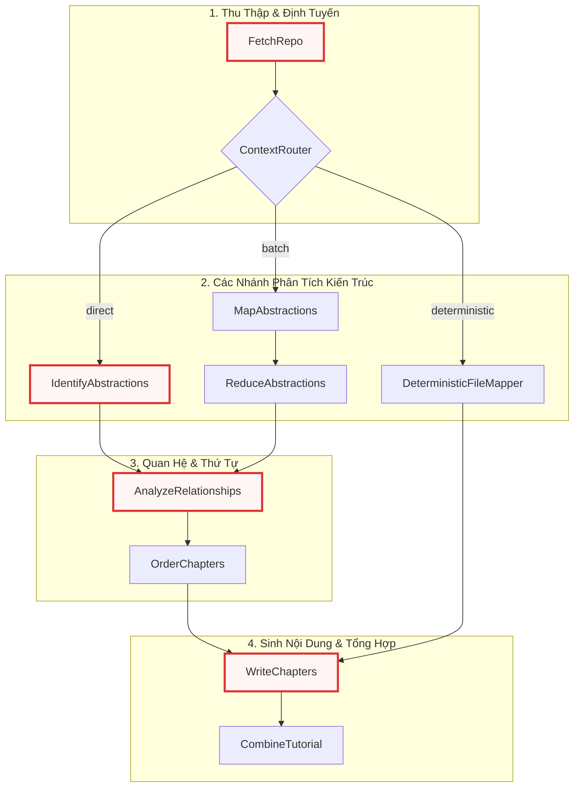
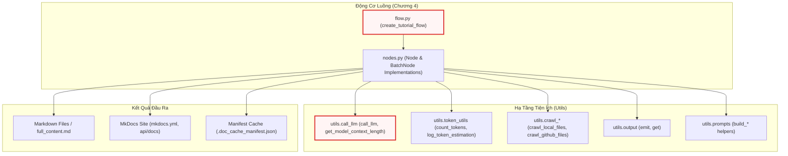
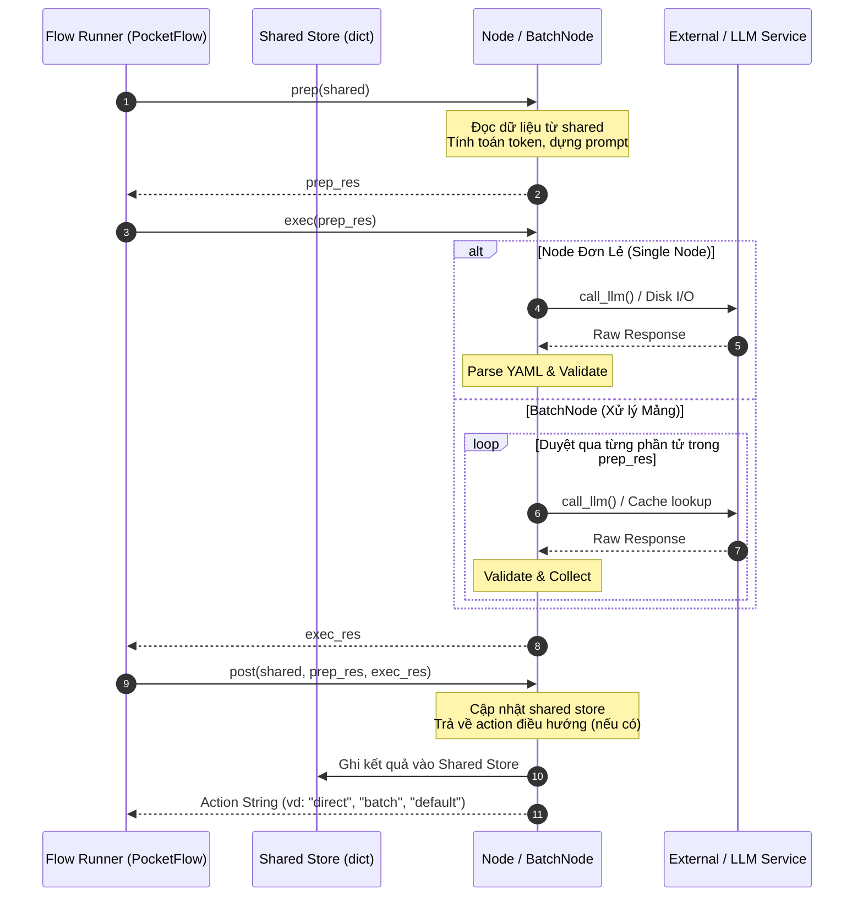
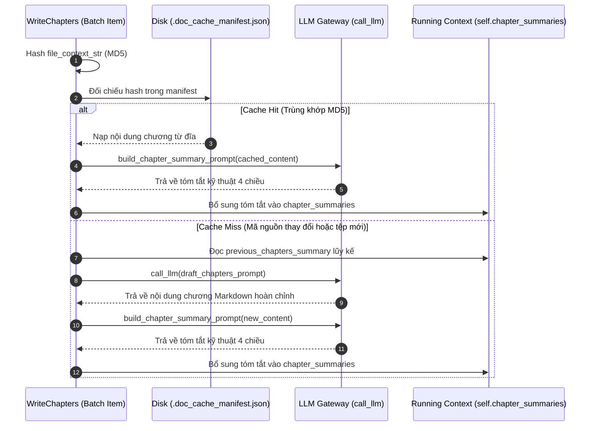

# Chapter 4: Động cơ Điều phối Luồng & Xử lý Node Đa tầng


Sau khi đã thiết lập nền tảng giao tiếp AI và kiểm soát ngân sách token tại [Chương 3: Tích hợp Mô hình Ngôn ngữ & Quản lý Token Context](03_tích_hợp_mô_hình_ngôn_ngữ___quản_lý_token_context.md), hệ thống cần một cơ chế điều phối cấp cao để kết nối các tài nguyên mã nguồn thô thành một chuỗi phân tích mạch lạc. Động cơ Điều phối Luồng (Flow Orchestration Engine) và hệ thống Node xử lý đa tầng chính là hạt nhân hiện thực hóa toàn bộ logic nghiệp vụ đó.

Chương này sẽ phân tích chi tiết cấu trúc đồ thị luồng có hướng không chu trình (DAG - Directed Acyclic Graph) được xây dựng trên nền tảng framework PocketFlow, phân tích sâu các mẫu thiết kế kiến trúc, chiến lược phân bổ token hai lượt (two-pass token budgeting), cơ chế lưu đệm tăng dần bằng mã băm MD5 và thuật toán gom cụm điều hướng tài liệu tự động.

---

## 1. Tổng quan Kiến trúc (Technical Overview)

### 1.1 Vai trò Kiến trúc (Architectural Role)
Trong kiến trúc tổng thể, thành phần này đóng vai trò là **Bộ Điều Phối Trung Tâm (Core Orchestrator)**. Quá trình chuyển đổi một kho mã nguồn lớn thành bộ tài liệu hoàn chỉnh đòi hỏi việc phân tách thành nhiều giai đoạn tính toán: thu thập tệp tin, đo lường dung lượng ngữ cảnh, trích xuất các khái niệm trừu tượng (abstractions), phân tích quan hệ phụ thuộc, định thứ tự đọc tối ưu và soạn thảo nội dung từng chương.

Nếu không có động cơ điều phối này, hệ thống sẽ rơi vào một kiến trúc nguyên khối (monolithic script), dẫn đến các vấn đề nghiêm trọng:
- Khó kiểm soát lỗi cục bộ (nếu một bước sinh nội dung thất bại, toàn bộ tiến trình phân tích trước đó bị mất trắng).
- Không thể tối ưu hóa dung lượng token động theo kích thước repository (dễ vượt ngưỡng context window của LLM).
- Không có cơ chế lưu đệm trạng thái giữa chừng, gây lãng phí chi phí API và thời gian chạy khi biên dịch lại.

Hệ thống giải quyết triệt để vấn đề này bằng cách mô hình hóa toàn bộ quy trình thành một đồ thị thực thi, trong đó mỗi nút (Node) là một đơn vị tính toán độc lập, tự đóng gói logic và giao tiếp với nhau qua một bộ nhớ dùng chung (`shared store`).



### 1.2 Các Mẫu Thiết kế (Design Patterns)
Động cơ điều phối áp dụng 5 mẫu thiết kế phần mềm cốt lõi:

1. **Pipeline & Chain of Responsibility Pattern**: Toàn bộ quy trình xử lý dữ liệu được tổ chức thành các trạm liên tiếp. Dữ liệu đầu ra của trạm trước trở thành đầu vào hoặc ngữ cảnh cho trạm sau thông qua cấu trúc từ điển `shared store`.
2. **Template Method Pattern**: Hiện thực hóa thông qua lớp cơ sở `Node` và `BatchNode` của PocketFlow. Chu trình sống của mỗi nút bắt buộc tuân theo ba pha: `prep()` (chuẩn bị dữ liệu/prompt) $\rightarrow$ `exec()` (thực thi I/O mạng hoặc tính toán nặng) $\rightarrow$ `post()` (cập nhật kết quả vào `shared store` hoặc quyết định nhánh rẽ).
3. **Strategy / Dynamic Routing Pattern**: Nút `ContextRouter` đánh giá kích thước mã nguồn thực tế so với giới hạn `max_tokens` của LLM để chuyển đổi linh hoạt giữa các chiến lược xử lý: `direct` (xử lý đơn lượt), `batch` (MapReduce đa lượt) hoặc `deterministic` (ánh xạ từng tệp mã nguồn cho API Reference).
4. **MapReduce Pattern**: Áp dụng trong cặp nút `MapAbstractions` và `ReduceAbstractions` khi phân tích các repository vượt ngưỡng cửa sổ ngữ cảnh, chia nhỏ tệp mã nguồn thành từng lô và tổng hợp danh sách khái niệm kiến trúc tổng thể.
5. **Incremental Cache Pattern**: Áp dụng tại `WriteChapters` thông qua bảng kê `.doc_cache_manifest.json` và mã băm MD5 của nội dung tệp, giúp bỏ qua các chương không có thay đổi mã nguồn trong các lần chạy kế tiếp.

### 1.3 Trách nhiệm Cốt lõi (Core Responsibilities)
- **Quản lý cấu trúc Đồ thị Luồng (DAG Topology)**: Thiết lập thứ tự thực thi và các ràng buộc phụ thuộc giữa các node trong `flow.py`.
- **Định tuyến Ngữ cảnh & Cân đối Dung lượng (Token Budget Routing)**: Đo lường chính xác chi phí token (file content, directory tree, prompt overhead) để phân nhánh xử lý an toàn.
- **Phát hiện Trừu tượng Kiến trúc (Architectural Abstraction Discovery)**: Nhận diện các thành phần cốt lõi của hệ thống mã nguồn thông qua phân tích cú pháp YAML trả về từ LLM.
- **Phân tích Đồ thị Phụ thuộc (Dependency Analysis)**: Thiết lập quan hệ gọi/kế thừa giữa các module với thuật toán phân bổ ngân sách hai lượt chống cạn kiệt token.
- **Sinh Chương Tuần tự kèm Tóm tắt Lũy kế (Progressive Chapter Generation)**: Tạo tài liệu từng chương và duy trì ngữ cảnh kỹ thuật liên chương mà không gây bùng nổ token $O(n^2)$.
- **Biên tập & Xuất bản Đa định dạng (Multi-format Publishing)**: Xuất bản tài liệu dưới dạng tệp Markdown độc lập hoặc cấu trúc thư mục MkDocs hoàn chỉnh kèm sơ đồ tương tác Mermaid.

### 1.4 Các Phụ thuộc Chính (Key Dependencies)



---

## 2. Kiến trúc Đồ thị Thực thi & Mô hình Vòng đời Node

### 2.1 Cấu hình Đồ thị Thực thi (`create_tutorial_flow`)
Tệp `flow.py` là nơi duy nhất định nghĩa cấu trúc đồ thị thực thi bằng cách khởi tạo các đối tượng Node và kết nối chúng bằng các toán tử luồng của PocketFlow (`>>` cho luồng tuần tự và `- "branch_name" >>` cho định tuyến có điều kiện).

```python
def create_tutorial_flow():
    fetch_repo = FetchRepo()
    context_router = ContextRouter()
    map_abstractions = MapAbstractions(max_retries=5, wait=20)
    reduce_abstractions = ReduceAbstractions(max_retries=5, wait=20)
    identify_abstractions = IdentifyAbstractions(max_retries=5, wait=20)
    analyze_relationships = AnalyzeRelationships(max_retries=5, wait=20)
    order_chapters = OrderChapters(max_retries=5, wait=20)
    write_chapters = WriteChapters(max_retries=5, wait=20)
    combine_tutorial = CombineTutorial()
    deterministic_mapper = DeterministicFileMapper(max_retries=5, wait=20)

    fetch_repo >> context_router

    context_router - "direct" >> identify_abstractions
    context_router - "batch" >> map_abstractions
    context_router - "deterministic" >> deterministic_mapper

    map_abstractions >> reduce_abstractions

    identify_abstractions >> analyze_relationships
    reduce_abstractions >> analyze_relationships

    analyze_relationships >> order_chapters
    order_chapters >> write_chapters

    deterministic_mapper >> write_chapters

    write_chapters >> combine_tutorial

    return Flow(start=fetch_repo)
```

Đoạn mã trên thể hiện sự tách biệt rõ ràng giữa cấu trúc đồ thị và logic xử lý nội tại của từng nút. Các nút có tương tác trực tiếp với mô hình ngôn ngữ lớn (LLM) đều được cấu hình tham số tự phục hồi `max_retries=5` và thời gian chờ giãn cách `wait=20` giây để xử lý triệt để các sự cố gián đoạn mạng hoặc lỗi vượt hạn ngạch tốc độ (rate limit).

Điểm đáng chú ý trong cấu trúc đồ thị này là cơ chế hội tụ luồng:
1. Nhánh `direct` (đi qua `identify_abstractions`) và nhánh `batch` (đi qua `map_abstractions >> reduce_abstractions`) đều hội tụ tại `analyze_relationships`.
2. Nhánh `deterministic` (đi qua `deterministic_mapper`) bỏ qua hoàn toàn các bước phân tích quan hệ trừu tượng và sắp xếp chương, đi thẳng vào `write_chapters` vì thứ tự tệp đã được tính toán tất định theo cấu trúc thư mục.

### 2.2 Vòng đời Thực thi của `Node` và `BatchNode`
Mỗi Node trong hệ thống kế thừa từ lớp `Node` hoặc `BatchNode` của thư viện PocketFlow và bắt buộc phải tuân theo chu trình ba bước nghiêm ngặt:



- **`prep(self, shared)`**: Hàm nhận tham chiếu đến từ điển `shared`. Tại đây, Node chỉ đọc các khóa cần thiết, tính toán dữ liệu trung gian và chuẩn bị tham số đầu vào (ví dụ: prompt string, token budget). Pha này tuyệt đối không thay đổi trạng thái của `shared`.
- **`exec(self, prep_res)`**: Nhận đầu ra của `prep()`. Đây là nơi diễn ra các tác vụ tốn thời gian hoặc có khả năng phát sinh ngoại lệ (gọi mạng HTTP, đọc ghi tệp đĩa, phân tích cú pháp). Đối với `BatchNode`, `exec(self, item)` sẽ được gọi lặp cho từng phần tử trong danh sách mà `prep()` trả về.
- **`post(self, shared, prep_res, exec_res)`**: Nhận kết quả từ `exec()`, tiến hành ghi đè hoặc bổ sung các trường dữ liệu mới vào `shared`. Nếu Node tham gia định tuyến, hàm này sẽ trả về chuỗi định danh nhánh tiếp theo (ví dụ: `"direct"`, `"batch"`).

---

## 3. Phân tích Chi tiết Từng Node & Luồng Nghiệp vụ

### 3.1 Thu thập và Tiền xử lý Mã nguồn (`FetchRepo`)
Nút `FetchRepo` đóng vai trò là điểm vào (`start`) của toàn bộ đồ thị. Nó tiếp nhận cấu hình nguồn từ CLI/môi trường và chuyển hóa cây thư mục thành một danh sách phẳng các bộ dữ liệu `(path, content)`.

```python
class FetchRepo(Node):
    def prep(self, shared):
        repo_url = shared.get("repo_url")
        local_dir = shared.get("local_dir")
        project_name = shared.get("project_name")

        if not project_name:
            if repo_url:
                project_name = repo_url.split("/")[-1].replace(".git", "")
            else:
                project_name = os.path.basename(os.path.abspath(local_dir))
            shared["project_name"] = project_name

        include_patterns = shared["include_patterns"]
        exclude_patterns = shared["exclude_patterns"]
        max_file_size = shared["max_file_size"]

        return {
            "repo_url": repo_url,
            "local_dir": local_dir,
            "token": shared.get("github_token"),
            "include_patterns": include_patterns,
            "exclude_patterns": exclude_patterns,
            "max_file_size": max_file_size,
            "use_relative_paths": True,
        }
```

Trong phương thức `prep()`, nếu tên dự án (`project_name`) chưa được người dùng chỉ định tường minh qua dòng lệnh, hệ thống sẽ tự động suy luận tên dự án từ phần cuối của URL GitHub hoặc tên thư mục cục bộ. Toàn bộ các quy tắc lọc tệp (`include_patterns`, `exclude_patterns`) và trần dung lượng tệp (`max_file_size`) được đóng gói thành một từ điển cấu hình độc lập để bàn giao cho `exec()`.

```python
    def exec(self, prep_res):
        source = prep_res["repo_url"] or prep_res["local_dir"]
        llm_logger.info(f"NODE EXEC | node=FetchRepo | action=crawl_files | source={source}")

        if prep_res["repo_url"]:
            emit("CRAWL_REPOSITORY", url=prep_res["repo_url"])
            result = crawl_github_files(
                repo_url=prep_res["repo_url"],
                token=prep_res["token"],
                include_patterns=prep_res["include_patterns"],
                exclude_patterns=prep_res["exclude_patterns"],
                max_file_size=prep_res["max_file_size"],
                use_relative_paths=prep_res["use_relative_paths"],
            )
        else:
            emit("CRAWL_DIRECTORY", path=prep_res["local_dir"])
            result = crawl_local_files(
                directory=prep_res["local_dir"],
                include_patterns=prep_res["include_patterns"],
                exclude_patterns=prep_res["exclude_patterns"],
                max_file_size=prep_res["max_file_size"],
                use_relative_paths=prep_res["use_relative_paths"],
            )

        files_list = list(result.get("files", {}).items())
        if len(files_list) == 0:
            raise ValueError("No matching files found. Check your directory and include/exclude patterns.")

        llm_logger.info(f"NODE COMPLETE | node=FetchRepo | files_found={len(files_list)}")
        return files_list

    def post(self, shared, prep_res, exec_res):
        shared["files"] = exec_res  # List of (path, content) tuples
```

Phương thức `exec()` kích hoạt bộ thu thập tệp tương ứng (GitHub crawler hoặc Local crawler) đã được xây dựng từ [Chương 2: Hệ thống Thu thập & Lọc Mã nguồn Đa nguồn](02_hệ_thống_thu_thập___lọc_mã_nguồn_đa_nguồn.md). Kết quả được chuyển đổi từ dạng từ điển sang danh sách các tuple `[(path, content), ...]`, đảm bảo tính tất định về thứ tự chỉ mục (`index`) của tệp trong suốt toàn bộ pipeline hạ nguồn. Nếu danh sách tệp rỗng, hệ thống sẽ phát sinh `ValueError` ngay lập tức theo nguyên lý Fail-Fast để dừng tiến trình trước khi tiêu tốn tài nguyên token.

---

### 3.2 Đo lường & Định tuyến Ngữ cảnh Động (`ContextRouter`)
`ContextRouter` là nút ra quyết định thông minh nhất trong đồ thị luồng. Nhiệm vụ của nó là tính toán chính xác tổng lượng token của mã nguồn, khấu trừ dung lượng tiêu hao cố định của hệ thống prompt, và chọn ra nhánh thực thi tối ưu nhất.

#### Giai đoạn 1: Đo lường Overhead và Tính toán Ngưỡng An toàn
```python
class ContextRouter(Node):
    def prep(self, shared):
        files_data = shared["files"]
        max_tokens = resolve_max_tokens(shared)
        shared["max_tokens"] = max_tokens

        count_tokens = create_token_counter()

        prompt_dir = os.path.join(os.path.dirname(os.path.abspath(__file__)), "prompts")
        max_template_tokens = 0
        for subdir in ["tutorial", "advanced"]:
            template_path = os.path.join(prompt_dir, subdir, "map_abstractions.md")
            if os.path.exists(template_path):
                with open(template_path, encoding="utf-8-sig") as f:
                    t = count_tokens(f.read())
                max_template_tokens = max(max_template_tokens, t)

        directory_tree = build_directory_tree(files_data)
        tree_tokens = count_tokens(directory_tree)

        file_listing_str = "\n".join(f"- {i} # {path}" for i, (path, _) in enumerate(files_data))
        listing_tokens = count_tokens(file_listing_str)

        prompt_overhead = max_template_tokens + tree_tokens + listing_tokens
        emit(
            "CAPACITY_PROMPT_OVERHEAD",
            total=f"{prompt_overhead:,}",
            template=f"{max_template_tokens:,}",
            tree=f"{tree_tokens:,}",
            listing=f"{listing_tokens:,}",
        )
```

Đoạn mã trên xử lý bài toán định cỡ ngữ cảnh một cách thận trọng. Thay vì giả định một con số tĩnh, `ContextRouter` nạp trực tiếp mẫu prompt từ đĩa, dựng cây thư mục đầy đủ (`build_directory_tree`) và đo lường kích thước chính xác bằng bộ đếm token BPE (`tiktoken`). Tổng dung lượng của các phần tử này được gộp thành `prompt_overhead`.

#### Giai đoạn 2: Phân nhóm Token và Quyết định Nhánh Rẽ
```python
        total_tokens = 0
        file_token_map = []
        for i, (path, content) in enumerate(files_data):
            entry = f"--- File Index {i}: {path} ---\n{content}\n\n"
            tokens = count_tokens(entry)
            total_tokens += tokens
            file_token_map.append(tokens)

        safety_limit = int(max_tokens * 0.95)
        effective_limit = safety_limit - prompt_overhead
        force_batch = shared.get("force_batch", False)

        if shared.get("mode", "tutorial") == "api-reference":
            emit("CAPACITY_API_REF_MODE")
            return ("deterministic", files_data, effective_limit, shared.get("batch_size", 50), None, None, directory_tree, False)

        if total_tokens <= effective_limit and not force_batch:
            emit(
                "CAPACITY_FITS", tokens=f"{total_tokens:,}", limit=f"{effective_limit:,}", safety=f"{safety_limit:,}", overhead=f"{prompt_overhead:,}"
            )
            return ("direct", files_data, effective_limit, shared.get("batch_size", 50), None, None, directory_tree, False)

        return (
            "batch",
            files_data,
            effective_limit,
            shared.get("batch_size", 50),
            file_token_map,
            count_tokens,
            directory_tree,
            shared.get("debug", False),
        )
```

Giới hạn hiệu dụng (`effective_limit`) được tính toán bằng công thức:
$$\text{effective\_limit} = (\text{max\_tokens} \times 0.95) - \text{prompt\_overhead}$$

Trong đó, biên an toàn $5\%$ được bảo lưu để chứa phản hồi sinh ra từ LLM. Logic định tuyến hoạt động như sau:
1. Nếu chế độ hoạt động là `api-reference`, tuyến đường lập tức được gán thành `"deterministic"`.
2. Nếu tổng số token của toàn bộ mã nguồn nhỏ hơn hoặc bằng `effective_limit` và không bật cờ `--force-batch`, hệ thống chọn tuyến `"direct"`.
3. Trường hợp mã nguồn vượt ngưỡng `effective_limit` hoặc có cờ ép buộc phân lô, tuyến đường được gán thành `"batch"`.

#### Giai đoạn 3: Thuật toán Gom Cụm Lô Giữ Toàn Vẹn Thư Mục (Folder-Aware Batching)
```python
    def exec(self, prep_res):
        route, files_data, effective_limit, batch_size, file_token_map, _count_tokens, directory_tree, debug = prep_res

        if route in ("direct", "deterministic"):
            return route

        dir_groups = defaultdict(list)
        for i, (path, content) in enumerate(files_data):
            dir_groups[os.path.dirname(path)].append((i, path, content, file_token_map[i]))

        batches = []
        for dirname in sorted(dir_groups.keys()):
            current_batch = []
            current_tokens = 0

            for i, path, content, tokens in dir_groups[dirname]:
                if current_batch and (current_tokens + tokens > effective_limit or len(current_batch) >= batch_size):
                    batches.append(current_batch)
                    current_batch = []
                    current_tokens = 0

                current_batch.append((i, path, content))
                current_tokens += tokens

            if current_batch:
                batches.append(current_batch)

        self._directory_tree = directory_tree
        return batches

    def post(self, shared, prep_res, exec_res):
        if exec_res in ("direct", "deterministic"):
            return exec_res
        shared["file_batches"] = exec_res
        shared["directory_tree"] = getattr(self, "_directory_tree", build_directory_tree(shared["files"]))
        return "batch"
```

Khi rơi vào nhánh `batch`, phương thức `exec()` thực thi một thuật toán gom cụm thông minh:
- Gom tất cả các tệp có chung thư mục cha (`os.path.dirname`) vào cùng một nhóm để bảo toàn ngữ cảnh cục bộ của các module có liên quan chặt chẽ.
- Không bao giờ trộn lẫn các tệp của hai thư mục khác nhau vào cùng một lô trừ khi lô đó đã được đóng gói hoàn toàn.
- Kiểm tra liên tục hai điều kiện dừng của mỗi lô: tổng lượng token vượt quá `effective_limit` hoặc số lượng tệp đạt trần `batch_size`.
- Giá trị trả về từ `post()` trực tiếp kích hoạt PocketFlow chuyển hướng luồng dữ liệu sang nhánh tương ứng.

---

### 3.3 Ánh xạ Module Quyết định (`DeterministicFileMapper`)
Dành riêng cho chế độ sinh tài liệu tham chiếu API (`api-reference`), nút `DeterministicFileMapper` loại bỏ tính ngẫu nhiên trong việc phân nhóm module của LLM và thay thế bằng việc lập tài liệu cho từng tệp mã nguồn cụ thể.

```python
class DeterministicFileMapper(Node):
    def prep(self, shared):
        files_data = shared["files"]
        project_name = shared["project_name"]
        file_listing = "\n".join([f"{i} # {path}" for i, (path, _) in enumerate(files_data)])
        prompt = build_code_file_filter_prompt(project_name, file_listing)
        return prompt, shared.get("use_cache", True), shared.get("thinking_level", None), shared.get("max_tokens", 100000)

    def exec(self, prep_res):
        try:
            prompt, use_cache, thinking_level, max_tokens = prep_res
            emit("LLM_CALL_FILTER_FILES")
            log_token_estimation(self.__class__.__name__, prompt, max_tokens)
            response = call_llm(prompt, use_cache=(use_cache and self.cur_retry == 0), thinking_level=thinking_level)
            valid_indices = parse_yaml_response(response)
            if not isinstance(valid_indices, list):
                valid_indices = []
            return [int(idx) for idx in valid_indices]
        except Exception as e:
            emit("NODE_RETRY_ERROR", class_name=self.__class__.__name__, error=e)
            llm_logger.error(f"[Node {self.__class__.__name__}] Error: {e}", exc_info=True)
            raise e
```

Thay vì phân tích toàn bộ nội dung tệp, `DeterministicFileMapper` gửi danh sách đường dẫn tệp đến LLM với prompt chuyên biệt `build_code_file_filter_prompt` để sàng lọc các tệp mã nguồn thuần túy chứa logic nghiệp vụ, đồng thời loại bỏ các tệp giao diện (UI layout như `.xaml`, `.html`), tệp cấu hình (`.xml`, `.json`), và kịch bản dựng (`.csproj`).

```python
    def post(self, shared, prep_res, exec_res):
        files = shared.get("files", [])
        valid_indices = set(exec_res)
        modules = []
        chapter_order = []

        for idx, (file_path, _content) in enumerate(files):
            if idx not in valid_indices:
                emit("SKIP_NON_CODE_FILE", path=file_path)
                continue

            clean_name = os.path.basename(file_path)
            modules.append(
                {"name": clean_name, "description": f"Internal API reference for `{file_path}`", "files": [idx], "original_path": file_path}
            )
            chapter_order.append(len(modules) - 1)

        shared["abstractions"] = modules
        shared["chapter_order"] = sorted(
            chapter_order,
            key=lambda idx: (
                -modules[idx]["original_path"].count("/") - modules[idx]["original_path"].count(os.sep),
                modules[idx]["original_path"].lower(),
            ),
        )
        shared["relationships"] = {"summary": "Deterministic Internal API Reference.", "details": []}
        emit("DONE_DETERMINISTIC_MAPPER", count=len(modules))
        return "default"
```

Trong phương thức `post()`, một cơ chế sắp xếp thứ tự chương đặc biệt được áp dụng: **Sắp xếp theo độ sâu thư mục giảm dần (Deepest Directory First)**. Các tệp nằm sâu nhất trong cây thư mục (thường là các hàm tiện ích `utils`, lớp cơ sở dữ liệu `models`) sẽ được đặt lên đầu để viết tài liệu trước. Khi đến lượt các tệp điều phối cấp cao ở thư mục gốc (như `main.py` hay `server.py`), phần tóm tắt kỹ thuật của các module tầng dưới đã sẵn sàng làm ngữ cảnh bổ trợ.

---

### 3.4 Nhận diện Khái niệm Kiến trúc Trực tiếp (`IdentifyAbstractions`)
Khi kích thước mã nguồn nằm trong giới hạn một lần gọi của LLM (nhánh `direct`), `IdentifyAbstractions` chịu trách nhiệm phân tích toàn bộ repository và trích xuất danh sách các khái niệm kiến trúc cốt lõi.

```python
class IdentifyAbstractions(Node):
    def prep(self, shared):
        files_data = shared["files"]
        project_name = shared["project_name"]
        language = shared.get("language", "english")
        use_cache = shared.get("use_cache", True)
        max_abstraction_num = shared.get("max_abstraction_num", 10)
        thinking_level = shared.get("thinking_level", None)

        def create_llm_context(files_data):
            max_tokens = resolve_max_tokens(shared)
            safety_limit = int(max_tokens * 0.95)
            count_tokens = create_token_counter()
            context = ""
            current_tokens = 0

            for i, (path, content) in enumerate(files_data):
                entry = f"--- File Index {i}: {path} ---\n{content}\n\n"
                entry_tokens = count_tokens(entry)
                if current_tokens + entry_tokens > safety_limit:
                    emit("WARN_CONTEXT_TRUNCATED", index=i, path=path, limit=safety_limit)
                    break
                context += entry
                current_tokens += entry_tokens
            return context

        context = create_llm_context(files_data)
        directory_tree = build_directory_tree(files_data)
        return (
            context, directory_tree, len(files_data), project_name,
            language, use_cache, max_abstraction_num, thinking_level,
            shared.get("advanced_mode", False), shared.get("max_tokens", 100000), shared.get("mode", "tutorial")
        )
```

Hàm `prep()` xây dựng một chuỗi ngữ cảnh liên tục chứa toàn bộ các tệp mã nguồn kèm chỉ mục định danh `File Index {i}`. Cơ chế cắt tỉa an toàn (`safety_limit`) được lồng trực tiếp trong vòng lặp duyệt tệp để phòng ngừa trường hợp tổng kích thước vượt ngưỡng bất ngờ.

```python
    def exec(self, prep_res):
        try:
            (context, directory_tree, total_files_count, project_name, language,
             use_cache, max_abstraction_num, thinking_level, _advanced_mode, max_tokens, mode) = prep_res

            language_instruction = ""
            name_lang_hint = ""
            desc_lang_hint = ""
            if language.lower() != "english":
                language_instruction = f"IMPORTANT: Generate the `name` and `description` for each abstraction in **{language.capitalize()}** language. Do NOT use English for these fields.\n\n"
                name_lang_hint = f" (value in {language.capitalize()})"
                desc_lang_hint = f" (value in {language.capitalize()})"

            prompt_template = load_prompt_template("identify_abstractions", mode=mode)
            prompt = prompt_template.format(
                project_name=project_name, context=context, language_instruction=language_instruction,
                max_abstraction_num=max_abstraction_num, name_lang_hint=name_lang_hint,
                desc_lang_hint=desc_lang_hint, directory_tree=directory_tree,
            )

            response = call_llm(prompt, use_cache=(use_cache and self.cur_retry == 0), thinking_level=thinking_level)
            abstractions = parse_yaml_response(response)

            validated_abstractions = []
            for item in abstractions:
                import re
                validated_indices = []
                for idx_entry in item["file_indices"]:
                    idx_str = str(idx_entry).split("#")[0].strip()
                    if "-" in idx_str:
                        parts = idx_str.split("-")
                        if len(parts) == 2:
                            start_idx = int(re.findall(r"\d+", parts[0])[0])
                            end_idx = int(re.findall(r"\d+", parts[1])[0])
                            validated_indices.extend(idx for idx in range(start_idx, end_idx + 1) if 0 <= idx < total_files_count)
                            continue
                    nums = re.findall(r"\d+", idx_str)
                    if nums:
                        idx = int(nums[0])
                        if 0 <= idx < total_files_count:
                            validated_indices.append(idx)

                validated_abstractions.append({
                    "name": item["name"],
                    "description": item["description"],
                    "files": sorted(set(validated_indices)),
                })
            return validated_abstractions
        except Exception as e:
            emit("NODE_RETRY_ERROR", class_name=self.__class__.__name__, error=e)
            raise e
```

Trong phương thức `exec()`, hệ thống thực hiện kiểm định nghiêm ngặt kết quả phản hồi từ LLM:
- Sử dụng hàm `parse_yaml_response` để bóc tách khối YAML nằm trong cặp dấu ```yaml.
- Sử dụng biểu thức chính quy (`regex`) để chuẩn hóa trường `file_indices`. LLM thường trả về các định dạng phong phú như `["0 # main.py", "1-3"]`. Logic trên xử lý phân tách dải số liên tiếp (`0-3` $\rightarrow$ `[0, 1, 2, 3]`), loại bỏ phần chú thích đường dẫn phía sau dấu `#`, và kiểm tra biên (`0 <= idx < total_files_count`) để ngăn chặn hoàn toàn lỗi truy cập vượt chỉ mục (IndexError).

---

### 3.5 Phân tách và Tổng hợp Khái niệm Kiến trúc Lớn (`MapAbstractions` & `ReduceAbstractions`)
Khi xử lý các kho mã nguồn vượt ngưỡng kích thước của một cửa sổ ngữ cảnh, nhánh `batch` sẽ kích hoạt mô hình MapReduce gồm hai giai đoạn.

```python
class MapAbstractions(BatchNode):
    def prep(self, shared):
        return [
            {
                "batch_index": i,
                "files": batch,
                "project_name": shared["project_name"],
                "language": shared.get("language", "english"),
                "use_cache": shared.get("use_cache", True),
                "thinking_level": shared.get("thinking_level", None),
                "max_tokens": shared.get("max_tokens", 100000),
                "directory_tree": shared.get("directory_tree", ""),
                "mode": shared.get("mode", "tutorial"),
            }
            for i, batch in enumerate(shared["file_batches"])
        ]

    def exec(self, item):
        batch_index = item["batch_index"]
        files = item["files"]
        emit("LLM_CALL_MAP_ABSTRACTIONS", batch_index=batch_index, file_count=len(files))

        context = "".join(f"--- File Index {i}: {path} ---\n{content}\n\n" for i, path, content in files)
        prompt_template = load_prompt_template("map_abstractions", mode=item.get("mode", "tutorial"))
        prompt = prompt_template.format(
            project_name=item["project_name"],
            context=context,
            language_instruction="",
            name_lang_hint="",
            desc_lang_hint="",
            directory_tree=item.get("directory_tree", "Not available"),
        )
        response = call_llm(prompt, use_cache=(item["use_cache"] and self.cur_retry == 0), thinking_level=item["thinking_level"])
        return parse_yaml_response(response)

    def post(self, shared, prep_res, exec_res_list):
        all_abstractions = []
        for batch_abs in exec_res_list:
            if isinstance(batch_abs, list):
                all_abstractions.extend(batch_abs)
        shared["mapped_abstractions"] = all_abstractions
```

`MapAbstractions` là một `BatchNode`. Phương thức `prep()` phân rã danh sách các lô tệp (`shared["file_batches"]`) thành các payload độc lập. Trong `exec()`, mỗi lô được gửi tới LLM kèm theo cây thư mục tổng thể (`directory_tree`) để LLM hiểu được vị trí tương đối của lô tệp hiện tại trong toàn bộ cấu trúc dự án. Kết quả từng phần được gộp lại tại `post()` vào khóa `mapped_abstractions`.

Sau khi giai đoạn Map hoàn tất, `ReduceAbstractions` nhận toàn bộ các trừu tượng cục bộ này và thực hiện tổng hợp thành danh sách khái niệm kiến trúc toàn cục (tối đa `max_abstraction_num`, mặc định là 10):

```python
class ReduceAbstractions(Node):
    def prep(self, shared):
        return (
            shared["mapped_abstractions"],
            shared["project_name"],
            shared.get("language", "english"),
            shared.get("use_cache", True),
            shared.get("max_abstraction_num", 10),
            shared.get("thinking_level", None),
            shared.get("max_tokens", 100000),
            shared.get("mode", "tutorial"),
        )

    def exec(self, prep_res):
        mapped_abstractions, project_name, language, use_cache, max_abstraction_num, thinking_level, max_tokens, mode = prep_res

        context = ""
        for i, abs_obj in enumerate(mapped_abstractions):
            context += f"- Partial Abstraction {i}: {abs_obj['name']}\n  Description: {abs_obj['description']}\n  Files: {abs_obj.get('file_indices', abs_obj.get('files', []))}\n\n"

        prompt_template = load_prompt_template("reduce_abstractions", mode=mode)
        prompt = prompt_template.format(
            project_name=project_name,
            partial_abstractions=context,
            max_abstraction_num=max_abstraction_num,
            language_instruction="",
            name_lang_hint="",
            desc_lang_hint="",
        )
        response = call_llm(prompt, use_cache=(use_cache and self.cur_retry == 0), thinking_level=thinking_level)
        return parse_yaml_response(response)

    def post(self, shared, prep_res, exec_res):
        shared["abstractions"] = exec_res
```

Giai đoạn Reduce này khử trùng lặp (deduplication) các module bị phân mảnh giữa các lô, gộp các tệp liên quan vào cùng một chủ đề kiến trúc thống nhất và bảo toàn ánh xạ chỉ số tệp (`file_indices`).

---

### 3.6 Phân tích Quan hệ Phụ thuộc với Thuật toán Phân bổ Ngân sách Hai Lượt (`AnalyzeRelationships`)
Nút `AnalyzeRelationships` xác định các quan hệ tương tác giữa các khái niệm trừu tượng (ví dụ: "gọi API", "kế thừa", "lắng nghe sự kiện"). Thách thức lớn nhất tại nút này là cung cấp đủ đoạn mã minh chứng cho tất cả các trừu tượng mà không làm tràn ngân sách token.

#### Thuật toán Phân bổ Ngân sách Hai Lượt (Two-Pass Token Budgeting)
```python
class AnalyzeRelationships(Node):
    def prep(self, shared):
        abstractions = shared["abstractions"]
        files_data = shared["files"]
        project_name = shared["project_name"]
        max_tokens = shared.get("max_tokens", 100000)
        safety_limit = int(max_tokens * 0.95)
        prompt_overhead = 2000

        estimate_tokens = create_token_counter()
        context = "Identified Abstractions:\n"
        for i, abstr in enumerate(abstractions):
            file_indices_str = ", ".join(map(str, abstr["files"]))
            context += f"- Index {i}: {abstr['name']} (Relevant files: [{file_indices_str}])\n  Description: {abstr['description']}\n"

        current_tokens = estimate_tokens(context)
        total_budget = safety_limit - current_tokens - prompt_overhead
        num_abstractions = len(abstractions)

        abstr_file_data = []
        for abstr in abstractions:
            sized = []
            for idx in abstr["files"]:
                if 0 <= idx < len(files_data):
                    path, file_content = files_data[idx]
                    entry = f"\n--- File: {idx} # {path} ---\n{file_content}\n"
                    sized.append((idx, path, file_content, estimate_tokens(entry)))
            sized.sort(key=lambda x: x[3], reverse=True)
            abstr_file_data.append(sized)
```

Trước tiên, hệ thống trích xuất toàn bộ các tệp liên quan đến từng trừu tượng và sắp xếp các tệp theo dung lượng giảm dần (`sized.sort(key=lambda x: x[3], reverse=True)`), giả định rằng các tệp có dung lượng mã lớn hơn thường chứa nhiều cấu trúc logic và định nghĩa giao tiếp hơn.

```python
        # Pass 1: Chia đều ngân sách cho từng abstraction, theo dõi ngân sách dư
        per_abstr_budget = total_budget // max(num_abstractions, 1)
        included_indices = set()
        abstr_results = []

        for _i, sized in enumerate(abstr_file_data):
            budget = per_abstr_budget
            included_files = []
            remaining_files = []
            for idx, path, file_content, tokens in sized:
                if idx in included_indices:
                    included_files.append((idx, path, None, 0))
                    continue
                if tokens <= budget:
                    included_files.append((idx, path, file_content, tokens))
                    budget -= tokens
                    included_indices.add(idx)
                else:
                    remaining_files.append((idx, path, file_content, tokens))
            abstr_results.append((included_files, remaining_files, budget))

        # Pass 2: Tái phân phối phần ngân sách chưa dùng hết cho các abstraction bị thiếu
        total_unused = sum(r[2] for r in abstr_results)
        if total_unused > 0:
            for i, (included_files, remaining_files, _unused) in enumerate(abstr_results):
                if not remaining_files or total_unused <= 0:
                    continue
                still_remaining = []
                for idx, path, file_content, tokens in remaining_files:
                    if idx in included_indices:
                        included_files.append((idx, path, None, 0))
                        continue
                    if tokens <= total_unused:
                        included_files.append((idx, path, file_content, tokens))
                        total_unused -= tokens
                        included_indices.add(idx)
                    else:
                        still_remaining.append((idx, path, file_content, tokens))
                abstr_results[i] = (included_files, still_remaining, 0)
```

Thuật toán phân bổ hai lượt hoạt động như sau:
1. **Lượt 1 (Pass 1 - Fair Share)**: Ngân sách token khả dụng được chia đều cho tất cả các trừu tượng (`per_abstr_budget`). Điều này ngăn chặn tình trạng các trừu tượng đầu danh sách chiếm hết dung lượng ngữ cảnh khiến các trừu tượng cuối bị "bỏ đói" (starvation). Nếu một tệp đã được đưa vào một trừu tượng trước đó, nó sẽ được đánh dấu và không tính trùng dung lượng.
2. **Lượt 2 (Pass 2 - Redistribution)**: Thu thập toàn bộ lượng token chưa sử dụng từ các trừu tượng nhỏ (ít mã nguồn) và phân bổ tuần tự cho các trừu tượng phức tạp đang còn tệp trong danh sách `remaining_files`.
3. Nếu một tệp không thể nhét vừa ngân sách sau cả 2 lượt, hệ thống chỉ đính kèm đường dẫn tệp (`path only`) để LLM vẫn nhận thức được sự tồn tại của tệp mà không gây tràn context.

```python
    def exec(self, prep_res):
        try:
            (context, abstraction_listing, num_abstractions, project_name, language,
             use_cache, thinking_level, _advanced_mode, max_tokens, mode) = prep_res

            prompt_template = load_prompt_template("identify_relationships", mode=mode)
            prompt = prompt_template.format(
                project_name=project_name, list_lang_note="", abstraction_listing=abstraction_listing,
                context=context, language_instruction="", lang_hint="",
            )
            response = call_llm(prompt, use_cache=(use_cache and self.cur_retry == 0), thinking_level=thinking_level)
            relationships_data = parse_yaml_response(response)

            validated_relationships = []
            for rel in relationships_data["relationships"]:
                from_nums = re.findall(r"\d+", str(rel["from_abstraction"]))
                to_nums = re.findall(r"\d+", str(rel["to_abstraction"]))
                if from_nums and to_nums:
                    from_idx = int(from_nums[0])
                    to_idx = int(to_nums[0])
                    if 0 <= from_idx < num_abstractions and 0 <= to_idx < num_abstractions:
                        validated_relationships.append({
                            "from": from_idx,
                            "to": to_idx,
                            "label": rel["label"],
                        })
            return {"summary": relationships_data["summary"], "details": validated_relationships}
        except Exception as e:
            emit("NODE_RETRY_ERROR", class_name=self.__class__.__name__, error=e)
            raise e
```

Phương thức `exec()` gửi prompt quan hệ đến LLM, bóc tách cấu trúc YAML và chuyển đổi các định danh trừu tượng thành các cặp chỉ mục số nguyên hợp lệ `{"from": int, "to": int, "label": str}`, loại bỏ hoàn toàn các liên kết trỏ đến các chỉ mục không tồn tại.

---

### 3.7 Sắp xếp Trình tự Chương Hợp lý (`OrderChapters`)
Nút `OrderChapters` xác định lộ trình đọc hợp lý nhất cho tài liệu, đảm bảo người đọc tiếp cận kiến trúc từ gốc đến ngọn hoặc theo trình tự khởi tạo tự nhiên của hệ thống.

```python
class OrderChapters(Node):
    def prep(self, shared):
        abstractions = shared["abstractions"]
        relationships = shared["relationships"]
        project_name = shared["project_name"]

        abstraction_info = [f"- {i} # {a['name']}" for i, a in enumerate(abstractions)]
        abstraction_listing = "\n".join(abstraction_info)

        context = f"Project Summary:\n{relationships['summary']}\n\nRelationships:\n"
        for rel in relationships["details"]:
            from_name = abstractions[rel["from"]]["name"]
            to_name = abstractions[rel["to"]]["name"]
            context += f"- From {rel['from']} ({from_name}) to {rel['to']} ({to_name}): {rel['label']}\n"

        return (
            abstraction_listing, context, len(abstractions), project_name,
            shared.get("use_cache", True), shared.get("thinking_level", None),
            shared.get("max_tokens", 100000), shared.get("mode", "tutorial")
        )

    def exec(self, prep_res):
        try:
            (abstraction_listing, context, num_abstractions, project_name,
             use_cache, thinking_level, max_tokens, mode) = prep_res

            prompt_template = load_prompt_template("order_chapters", mode=mode)
            prompt = prompt_template.format(
                project_name=project_name, list_lang_note="", abstraction_listing=abstraction_listing, context=context
            )
            response = call_llm(prompt, use_cache=(use_cache and self.cur_retry == 0), thinking_level=thinking_level)
            ordered_indices_raw = parse_yaml_response(response)

            ordered_indices = []
            seen_indices = set()
            for entry in ordered_indices_raw:
                idx = int(str(entry).split("#")[0].strip())
                if not (0 <= idx < num_abstractions) or idx in seen_indices:
                    raise ValueError(f"Invalid or duplicate index {idx} in ordered list.")
                ordered_indices.append(idx)
                seen_indices.add(idx)

            if len(ordered_indices) != num_abstractions:
                raise ValueError(f"Ordered list length mismatch. Missing: {set(range(num_abstractions)) - seen_indices}")

            return ordered_indices
        except Exception as e:
            emit("NODE_RETRY_ERROR", class_name=self.__class__.__name__, error=e)
            raise e

    def post(self, shared, prep_res, exec_res):
        shared["chapter_order"] = exec_res
```

Phương thức `exec()` thực thi một kiểm tra tính toàn vẹn nghiêm ngặt (Strict Integrity Validation):
- Đảm bảo danh sách trả về là một hoán vị hợp lệ (permutation) của tập chỉ số `[0 .. num_abstractions - 1]`.
- Không cho phép trùng lặp phần tử (`seen_indices`).
- Không cho phép thiếu bất kỳ khái niệm trừu tượng nào. Nếu phát hiện thiếu chỉ mục, `ValueError` sẽ được kích hoạt để kích hoạt cơ chế retry của PocketFlow nhằm yêu cầu LLM tạo lại thứ tự.

---

### 3.8 Soạn thảo Chương Tăng dần & Quản lý Bộ nhớ Đệm MD5 (`WriteChapters`)
`WriteChapters` là nút tốn nhiều tài nguyên tính toán nhất trong toàn bộ hệ thống. Nó sinh nội dung chi tiết cho từng chương dựa trên danh sách thứ tự đã được xác định, áp dụng cơ chế tóm tắt kỹ thuật liên chương và lưu đệm tăng dần bằng mã băm MD5.

#### Giai đoạn 1: Chuẩn bị Payload Lô & Tên Tệp Tài liệu
```python
class WriteChapters(BatchNode):
    def prep(self, shared):
        chapter_order = shared["chapter_order"]
        abstractions = shared["abstractions"]
        files_data = shared["files"]
        language = shared.get("language", "english")
        is_mkdocs = shared.get("mkdocs", False)

        self.chapters_written_so_far = []
        self.chapter_summaries = []

        all_chapters = []
        chapter_filenames = {}
        for i, abstraction_index in enumerate(chapter_order):
            if 0 <= abstraction_index < len(abstractions):
                chapter_num = i + 1
                chapter_name = abstractions[abstraction_index]["name"].replace("\n", " ").strip()
                if is_mkdocs and "original_path" in abstractions[abstraction_index]:
                    doc_rel_path = abstractions[abstraction_index]["original_path"] + ".md"
                    filename = doc_rel_path.replace(os.sep, "/")
                elif is_mkdocs:
                    safe_name = "".join(c if c.isalnum() else "_" for c in chapter_name).lower()
                    filename = f"{safe_name}.md"
                else:
                    safe_name = "".join(c if c.isalnum() else "_" for c in chapter_name).lower()
                    filename = f"{i + 1:02d}_{safe_name}.md"

                all_chapters.append(f"{chapter_num}. {chapter_name} (doc: {filename})")
                chapter_filenames[abstraction_index] = {
                    "num": chapter_num, "name": chapter_name, "filename": filename,
                }

        full_chapter_listing = "\n".join(all_chapters)
```

Phương thức `prep()` tạo bảng ánh xạ tên tệp tài liệu `chapter_filenames`. Việc chuẩn hóa tên tệp ngay tại đây cho phép mọi chương đều nắm được đường dẫn chính xác (`doc: filename.md`) của các chương khác, từ đó hỗ trợ LLM tạo các liên kết chéo nội bộ (cross-references) dạng Markdown chuẩn xác.

#### Giai đoạn 2: Kiểm tra Bộ nhớ Đệm Tăng Dần MD5 (Incremental Cache)
```python
    def exec(self, item):
        try:
            abstraction_name = item["abstraction_details"]["name"]
            chapter_num = item["chapter_num"]
            project_name = item.get("project_name")
            language = item.get("language", "english")
            incremental = item.get("incremental", False)
            output_dir = item.get("output_dir", "output")
            filename = item.get("filename")
            is_mkdocs = item.get("mkdocs", False)

            file_context_str = "\n\n".join(
                f"--- File: {idx_path.split('# ')[1] if '# ' in idx_path else idx_path} ---\n{content}"
                for idx_path, content in item["related_files_content_map"].items()
            )

            current_hash = None
            if incremental and output_dir:
                import hashlib, json
                hasher = hashlib.md5()
                hasher.update(file_context_str.encode("utf-8"))
                current_hash = hasher.hexdigest()

                manifest_path = os.path.join(output_dir, project_name, ".doc_cache_manifest.json")
                if os.path.exists(manifest_path):
                    with open(manifest_path, encoding="utf-8") as f:
                        manifest = json.load(f)
                    if manifest.get(abstraction_name) == current_hash:
                        file_path = (
                            os.path.join(output_dir, project_name, "docs", "api", filename)
                            if is_mkdocs
                            else os.path.join(output_dir, project_name, filename)
                        )
                        if os.path.exists(file_path):
                            emit("CACHE_HIT_SKIP", name=abstraction_name)
                            with open(file_path, encoding="utf-8") as f:
                                cached_content = f.read()
                            clean_content = cached_content
                            if is_mkdocs and clean_content.startswith("---"):
                                parts = clean_content.split("---", 2)
                                if len(parts) >= 3:
                                    clean_content = parts[2].strip()
                            self.chapters_written_so_far.append(clean_content)
                            # Tái tạo tóm tắt kỹ thuật cho chương từ cache
                            summary_prompt = build_chapter_summary_prompt(chapter_num, abstraction_name, clean_content, language)
                            chapter_summary = call_llm(summary_prompt, use_cache=True, thinking_level=None)
                            self.chapter_summaries.append(f"Chapter {chapter_num} — {abstraction_name.strip()}:\n{chapter_summary}")
                            return {"content": clean_content, "hash": current_hash, "name": abstraction_name}
```

Kiến trúc đệm tăng dần được tối ưu hóa như sau:
1. Tính mã băm MD5 dựa trên chuỗi ghép nội dung của tất cả các tệp mã nguồn thuộc về chương đó (`file_context_str`).
2. Đối chiếu mã băm này với bảng kê `.doc_cache_manifest.json` đã lưu từ lần chạy trước.
3. **Cache Hit**: Nếu mã băm trùng khớp và tệp tài liệu tồn tại trên đĩa, hệ thống đọc trực tiếp nội dung từ đĩa, bỏ qua cuộc gọi LLM sinh chương tốn kém.
4. **Bảo tồn Ngữ cảnh**: Ngay cả khi trúng cache, hệ thống vẫn gọi một prompt nhẹ (`build_chapter_summary_prompt`) để lấy tóm tắt kỹ thuật cô đọng của chương đó, đưa vào `self.chapter_summaries` nhằm phục vụ ngữ cảnh cho các chương tiếp theo.

#### Giai đoạn 3: Sinh Nội Dung và Tạo Tóm Tắt Kỹ Thuật 4 Chiều Lũy Kế
```python
            previous_chapters_summary = "\n---\n".join(self.chapter_summaries)
            prompt_template = load_prompt_template("draft_chapters", mode=item.get("mode", "tutorial"))
            prompt = prompt_template.format(
                language_instruction="", project_name=project_name, abstraction_name=abstraction_name,
                chapter_num=chapter_num, concept_details_note="", abstraction_description=item["abstraction_details"]["description"],
                structure_note="", full_chapter_listing=item["full_chapter_listing"], current_doc_path=item.get("current_doc_path", ""),
                directory_tree=item.get("directory_tree", ""), prev_summary_note="",
                previous_chapters_summary=previous_chapters_summary or "This is the first chapter.",
                file_context_str=file_context_str or "No specific code snippets provided for this abstraction.",
                language=language.capitalize(), instruction_lang_note="", link_lang_note="",
                code_comment_note="", mermaid_lang_note="", tone_note="",
            )

            chapter_content = call_llm(prompt, use_cache=(item["use_cache"] and self.cur_retry == 0), thinking_level=item["thinking_level"])
            self.chapters_written_so_far.append(chapter_content)

            # Tạo tóm tắt kỹ thuật cấu trúc 4 chiều phục vụ các chương sau
            summary_prompt = build_chapter_summary_prompt(chapter_num, abstraction_name, chapter_content, language)
            chapter_summary = call_llm(summary_prompt, use_cache=item["use_cache"], thinking_level=None)
            self.chapter_summaries.append(f"Chapter {chapter_num} — {abstraction_name.strip()}:\n{chapter_summary}")

            return {"content": chapter_content, "hash": current_hash, "name": abstraction_name}
        except Exception as e:
            emit("NODE_RETRY_ERROR", class_name=self.__class__.__name__, error=e)
            raise e
```

Việc truyền tải toàn bộ nội dung của các chương trước vào prompt của chương hiện tại sẽ gây ra hiện tượng bùng nổ token bậc hai $O(n^2)$. Để giải quyết vấn đề này, hàm `build_chapter_summary_prompt` từ `utils/prompts.py` được sử dụng để tóm tắt chương vừa viết thành 4 chiều kỹ thuật (Mỗi chiều 3-5 câu):
1. **Component Scope & Responsibility**: Phạm vi nghiệp vụ và vai trò trong hệ thống.
2. **Key Technical Elements**: Các lớp, dịch vụ, hàm, giao thức cụ thể.
3. **Implementation Patterns & Architecture**: Mẫu thiết kế, luồng dữ liệu, cơ chế xử lý lỗi.
4. **System Integration & Dependencies**: Điểm tích hợp và quan hệ với các thành phần khác.

Chuỗi tóm tắt cấu trúc này giúp các chương phía sau nắm bắt trọn vẹn ngữ cảnh kiến trúc của các chương phía trước với chi phí token không đổi $O(n)$.



---

### 3.9 Tổng hợp Tài liệu, Điều hướng MkDocs & Trực quan hóa Mermaid (`CombineTutorial`)
Nút cuối cùng trong đồ thị, `CombineTutorial`, tổng hợp toàn bộ các kết quả phân tích thành các tệp phân phối cuối cùng, hỗ trợ cả định dạng Markdown độc lập (Standalone) lẫn trang tài liệu MkDocs Material hoàn chỉnh.

#### Giai đoạn 1: Dựng Sơ đồ Mermaid Tự động
```python
class CombineTutorial(Node):
    def prep(self, shared):
        project_name = shared["project_name"]
        output_base_dir = shared.get("output_dir", "output")
        output_path = os.path.join(output_base_dir, project_name)
        relationships_data = shared["relationships"]
        abstractions = shared["abstractions"]

        mermaid_lines = ["flowchart TD"]
        for i, abstr in enumerate(abstractions):
            node_id = f"A{i}"
            sanitized_name = abstr["name"].replace('"', "").replace("\n", " ").strip()
            mermaid_lines.append(f'    {node_id}("{sanitized_name}")')

        for rel in relationships_data["details"]:
            from_node_id = f"A{rel['from']}"
            to_node_id = f"A{rel['to']}"
            edge_label = rel["label"].replace('"', "").replace("\n", " ")
            if len(edge_label) > 30:
                edge_label = edge_label[:27] + "..."
            mermaid_lines.append(f'    {from_node_id} -- "{edge_label}" --> {to_node_id}')

        # Đánh dấu các node nền tảng (có từ 2 liên kết trỏ đến trở lên)
        incoming = {f"A{i}": 0 for i in range(len(abstractions))}
        for rel in relationships_data["details"]:
            incoming[f"A{rel['to']}"] += 1
        entry_nodes = [nid for nid, inc in incoming.items() if inc >= 2]
        if entry_nodes:
            mermaid_lines.append("    classDef entryNode stroke:#d33,stroke-width:3px,fill:#fff5f5")
            mermaid_lines.extend(f"    class {node_id} entryNode" for node_id in entry_nodes)

        mermaid_diagram = "\n".join(mermaid_lines)
```

Sơ đồ Mermaid được dựng tự động từ danh sách quan hệ:
- Mỗi khái niệm trừu tượng trở thành một nút `A{i}` với nhãn đã được làm sạch ký tự xuống dòng và dấu ngoặc kép.
- Các liên kết có nhãn cạnh (`edge_label`) được cắt ngắn nếu vượt quá 30 ký tự để giữ cho biểu đồ trực quan.
- Thuật toán đếm bậc vào (in-degree count) nhận diện các nút nền tảng (`inc >= 2`) và áp dụng lớp CSS `entryNode` với viền đỏ nổi bật.

#### Giai đoạn 2: Gom Nhóm Điều Hướng Bằng LLM Cho MkDocs (LLM-Assisted Nav Grouping)
Trong chế độ `api-reference` với số lượng module lớn ($>5$), việc hiển thị thanh điều hướng phẳng (flat navigation) làm giảm trải nghiệm người dùng. `CombineTutorial` sử dụng LLM cùng hàm `build_grouped_nav` để gom nhóm các module theo chức năng nghiệp vụ.

```python
    def exec(self, prep_res):
        output_path = prep_res["output_path"]
        is_mkdocs = prep_res["is_mkdocs"]
        chapter_files = prep_res["chapter_files"]
        os.makedirs(output_path, exist_ok=True)

        if is_mkdocs:
            mode = prep_res["mode"]
            project_name = prep_res["project_name"]
            sections = None

            if mode == "api-reference" and len(chapter_files) > 5:
                try:
                    chapter_summaries = prep_res.get("chapter_summaries", [])
                    module_entries = [
                        f"- {cf['module_name']}: {chapter_summaries[i] if i < len(chapter_summaries) else cf['description']}"
                        for i, cf in enumerate(chapter_files)
                    ]
                    module_list = "\n".join(module_entries)

                    prompt_path = os.path.join(os.path.dirname(os.path.abspath(__file__)), "prompts", "common", "group_modules.md")
                    with open(prompt_path, encoding="utf-8-sig") as f:
                        group_template = f.read()

                    group_prompt = group_template.format(
                        project_name=project_name, module_count=len(chapter_files),
                        module_list=module_list, directory_tree=prep_res.get("directory_tree", "N/A"),
                        language_note="",
                    )
                    group_response = call_llm(group_prompt, use_cache=prep_res.get("use_cache", True))
                    parsed = parse_yaml_response(group_response)
                    sections = parsed.get("sections", parsed) if isinstance(parsed, dict) else None

                    if sections:
                        grouped_modules = collect_all_modules(sections)
                        ungrouped = [cf["module_name"] for cf in chapter_files if cf["module_name"] not in grouped_modules]
                        if ungrouped:
                            sections.append({"name": "Other", "modules": ungrouped})
                        nav_lines = build_grouped_nav(sections, chapter_files, indent=4)
                        nav_lines.insert(0, "    - api/index.md")
                        nav_snippet = "nav:\n  - API Reference:\n" + "\n".join(nav_lines)
```

Đoạn mã trên thể hiện tính phòng thủ cao trong việc xử lý kết quả nhóm của LLM:
- Kiểm tra danh sách các module đã được gom nhóm bằng hàm `collect_all_modules(sections)`.
- Nếu LLM bỏ sót bất kỳ module nào, hệ thống tự động tạo một nhóm cứu trợ `"Other"` để chứa các module chưa được phân nhóm (`ungrouped`), đảm bảo không có tệp tài liệu nào bị mất liên kết trên thanh điều hướng.
- Hàm `build_grouped_nav` từ `utils/prompts.py` duyệt đệ quy cây phân nhóm, tự động tạo các lớp thư mục con nếu các module trong cùng nhóm nằm ở nhiều thư mục khác nhau.

#### Giai đoạn 3: Xuất Bản Tệp Cấu Hình và Mã Nguồn Tài Liệu
```python
                mkdocs_config = build_mkdocs_config(f"{project_name} — Documentation", nav_snippet)
                with open(os.path.join(output_path, "mkdocs.yml"), "w", encoding="utf-8") as f:
                    f.write(mkdocs_config)

                js_dir = os.path.join(output_path, "docs", "javascripts")
                os.makedirs(js_dir, exist_ok=True)
                with open(os.path.join(js_dir, "mermaid-init.js"), "w", encoding="utf-8") as f:
                    f.write(build_mermaid_init_js())

                for chapter_info in chapter_files:
                    chapter_filepath = os.path.join(output_path, "docs", "api", chapter_info["filename"])
                    os.makedirs(os.path.dirname(chapter_filepath), exist_ok=True)
                    with open(chapter_filepath, "w", encoding="utf-8") as f:
                        f.write(chapter_info["content"])
```

Nếu cấu hình là MkDocs:
1. Ghi tệp cấu hình `mkdocs.yml` hoàn chỉnh dựa trên Material for MkDocs thông qua `build_mkdocs_config`.
2. Tạo tệp JavaScript `mermaid-init.js` để khởi tạo sơ đồ Mermaid với lớp CSS `.mermaid-raw`, vượt qua các thiết lập ghi đè màu mặc định của giao diện Material và trả lại giao diện chuẩn như trên GitHub.
3. Xuất bản toàn bộ các tệp tài liệu chương vào thư mục con `docs/api/`, sẵn sàng cho lệnh `mkdocs serve` hoặc `mkdocs build`.

Nếu là chế độ tài liệu độc lập (Standalone), `CombineTutorial` sẽ tạo `index.md` chứa bảng mục lục và sơ đồ Mermaid, cùng với tệp gộp `full_content.md` chứa toàn bộ nội dung của tất cả các chương để tiện cho việc đọc một lượt hoặc xuất PDF.

---

## 4. Tóm Tắt Trách Nhiệm Các Module & Hàm Bổ Trợ

Dưới đây là bảng tổng hợp các hàm bổ trợ kiến trúc được sử dụng xuyên suốt trong `nodes.py` và `utils/prompts.py`:

| Tên Hàm / Lớp | Vị Trí | Trách Nhiệm Kỹ Thuật | Hành Vi & Logic Cốt Lõi |
| :--- | :--- | :--- | :--- |
| `build_directory_tree` | `nodes.py` | Tạo chuỗi biểu diễn phân cấp thư mục | Nhóm tệp theo thư mục cha, gán nhãn chỉ mục `(idx:i)`, sắp xếp thứ tự bảng chữ cái. |
| `get_content_for_indices` | `nodes.py` | Trích xuất nội dung mã nguồn theo chỉ mục | Nhận danh sách chỉ số `[int]`, trả về từ điển `{"idx # path": content}` an toàn với lỗi tràn biên. |
| `parse_yaml_response` | `nodes.py` | Bóc tách và thẩm định YAML từ phản hồi LLM | Cắt chuỗi giữa khối ` ```yaml ` và ` ``` `, phân tích cú pháp an toàn với `yaml.safe_load`. |
| `resolve_max_tokens` | `nodes.py` | Xác định trần token tối đa của runtime | Đọc từ `shared["max_tokens"]` hoặc truy vấn kích thước ngữ cảnh API thông qua `get_model_context_length`. |
| `build_chapter_summary_prompt` | `utils/prompts.py` | Tạo prompt tóm tắt kỹ thuật 4 chiều | Đóng gói nội dung chương vừa viết, yêu cầu LLM tóm tắt phạm vi, phần tử kỹ thuật, mẫu thiết kế và tích hợp. |
| `build_mkdocs_config` | `utils/prompts.py` | Tạo tệp cấu hình `mkdocs.yml` hoàn chỉnh | Cấu hình Material theme, tiện ích mở rộng pymdownx (superfences, highlight), nạp plugin Panzoom và nhúng navigation. |
| `build_grouped_nav` | `utils/prompts.py` | Dựng cấu trúc cây điều hướng MkDocs đệ quy | Chuyển đổi JSON phân nhóm của LLM thành cú pháp YAML nav, tự động phân nhóm phụ nếu chung nhóm nhưng khác thư mục. |

---

## 5. Ràng Buộc Kỹ Thuật, Xung Nhịp Luồng & An Toàn Bộ Nhớ

### 5.1 Mô hình Đột biến Trạng thái Bộ nhớ Dùng chung (Shared Mutable State)
- Framework PocketFlow sử dụng một từ điển Python duy nhất (`shared: dict`) được truyền theo dạng tham chiếu (pass-by-reference) qua tất cả các Node.
- **Tính tuần tự (Sequential Execution)**: Đồ thị DAG hiện tại thực thi đơn luồng (single-threaded). Các BatchNode xử lý tuần tự từng item trong lô thay vì chạy song song qua đa tiến trình. Điều này loại bỏ hoàn toàn hiện tượng tương tranh bộ nhớ (race condition) trên `shared store`, đồng thời giữ cho việc theo dõi biến trạng thái lũy kế (`self.chapter_summaries`) luôn đảm bảo tính thứ tự.

### 5.2 Cơ chế Tự phục hồi và Kháng lỗi LLM
Mọi nút thực thi LLM đều được trang bị hai tầng phòng thủ:
1. **Tầng SDK / Mạng**: `max_retries=5` kết hợp với tham số `wait=20` giây tại `flow.py` giúp vượt qua các lỗi nghẽn mạng tạm thời hoặc hạn ngạch HTTP 429/503.
2. **Tầng Thẩm định Cú pháp (Parsing Validation)**: Nếu LLM trả về cấu trúc YAML bị lỗi hoặc thiếu các khóa bắt buộc (`file_indices`, `from_abstraction`, `relationships`), Node sẽ chủ động ném ra ngoại lệ `ValueError`. PocketFlow bắt ngoại lệ này tại chu trình `exec()` và tự động kích hoạt retry, trong đó cờ `use_cache` được tắt tại các lần thử lại (`self.cur_retry > 0`) để ép buộc LLM sinh lại một phản hồi mới hoàn toàn.

---

## 6. Hướng Dẫn Thực Hành Dành Cho Kỹ Sư Mới (Practical Notes for New Team Members)

### 6.1 Vị trí Cấu hình & Biến Trạng thái Trọng yếu
Khi gỡ lỗi hoặc bổ sung tính năng mới cho pipeline, các khóa trạng thái cốt lõi trong `shared` bao gồm:
- `shared["files"]`: Mảng gốc `[(path, content), ...]`. Đây là chân lý dữ liệu (source of truth), chỉ mục của mảng này quyết định ID của tệp xuyên suốt hệ thống.
- `shared["abstractions"]`: Danh sách từ điển các khái niệm kiến trúc `[{"name": str, "description": str, "files": [int]}]`.
- `shared["chapter_order"]`: Danh sách các chỉ số nguyên quy định trình tự sinh tài liệu.
- `shared["chapter_summaries"]`: Danh sách các đoạn tóm tắt kỹ thuật 4 chiều lũy kế từ Chương 1 đến Chương hiện tại.

### 6.2 Điểm Gỡ Lỗi Chiến Lược (Strategic Debugging Breakpoints)
1. **Lỗi tràn cửa sổ ngữ cảnh**: Đặt breakpoint tại `ContextRouter.prep()`. Kiểm tra biến `prompt_overhead` và `effective_limit`. Xem giá trị trả về của `route` để biết vì sao hệ thống quyết định đi nhánh `batch` hay `direct`.
2. **Lỗi mất mát module trong thanh điều hướng**: Đặt breakpoint tại `CombineTutorial.exec()`, ngay sau lệnh `parse_yaml_response(group_response)`. Kiểm tra danh sách `ungrouped` để xem LLM có bỏ sót module nào trong quá trình nhóm hay không.
3. **Lỗi trượt Cache MD5**: Đặt breakpoint tại `WriteChapters.exec()`. Kiểm tra giá trị `current_hash` và nội dung đọc ra từ `.doc_cache_manifest.json`.

### 6.3 Các Bẫy Kỹ Thuật Thường Gặp (Known Gotchas)
- **YAML Format Hallucination**: LLM đôi khi trả về chuỗi bọc ngoài bằng ` ```yaml ` nhưng bên trong lại là JSON hoặc định dạng danh sách không chuẩn. Hàm `parse_yaml_response` có thể ném `ValueError` nếu LLM chèn thêm các đoạn giải thích bên ngoài khối mã.
- **Mã băm MD5 thay đổi do định dạng dòng (Line Endings)**: Nếu tệp mã nguồn được checkout trên Windows (`CRLF`) rồi chạy trên Linux (`LF`), mã băm MD5 của `file_context_str` sẽ bị thay đổi dù mã nguồn không đổi, dẫn đến việc toàn bộ cache bị vô hiệu hóa (cache miss toàn bộ).

---

## 7. Tổng kết & Chuyển tiếp

Chương 4 đã phân tích toàn diện kiến trúc **Động cơ Điều phối Luồng & Xử lý Node Đa tầng**, bao gồm:
- Mô hình đồ thị thực thi DAG dựa trên PocketFlow với chu trình sống ba pha chuẩn hóa (`prep` $\rightarrow$ `exec` $\rightarrow$ `post`).
- Cơ chế định tuyến token động tại `ContextRouter` với biên an toàn và khấu trừ chi phí overhead hệ thống.
- Thuật toán MapReduce cho codebase lớn và thuật toán phân bổ ngân sách hai lượt tại `AnalyzeRelationships`.
- Quản lý bộ nhớ đệm tăng dần MD5 và tóm tắt kỹ thuật 4 chiều lũy kế tại `WriteChapters`.
- Cơ chế xuất bản đa định dạng và gom nhóm điều hướng thông minh tại `CombineTutorial`.

Để hiểu rõ cấu trúc chi tiết của các prompt mẫu được sử dụng trong các Node phân tích kiến trúc này, mời bạn tiếp tục đón đọc [Chương 5: Hệ thống Prompt Mẫu cho Tutorial & Phân tích Kiến trúc Nâng cao](05_hệ_thống_prompt_mẫu_cho_tutorial___phân_tích_kiến_trúc_nâng_cao.md).

