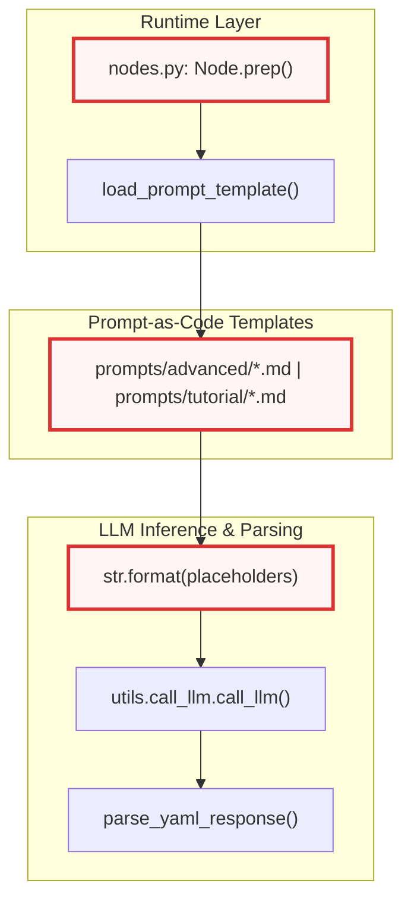
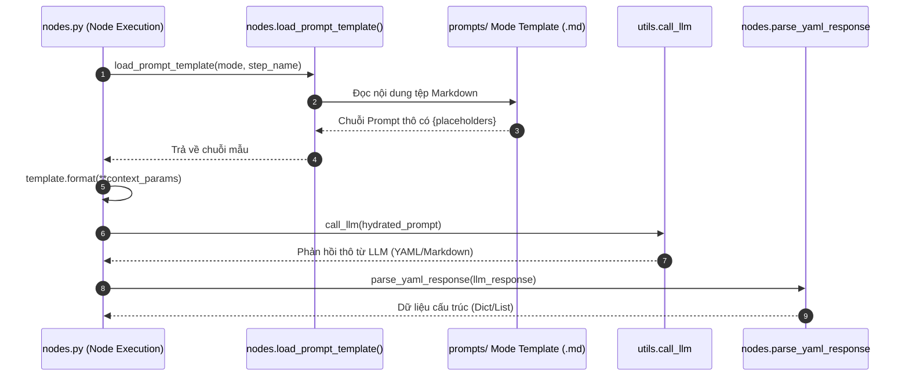
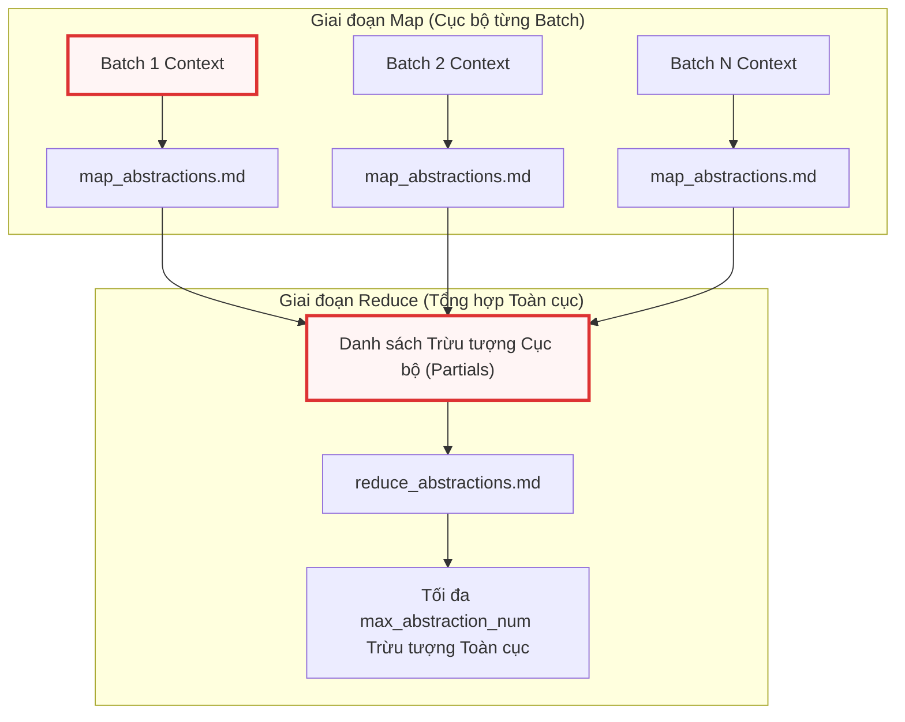
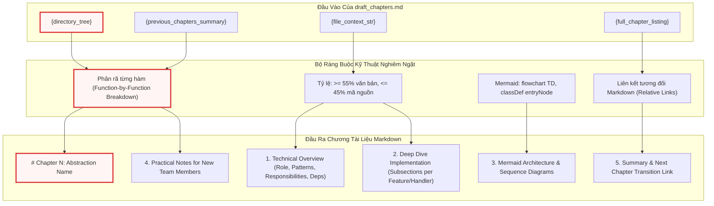

# Chapter 5: Hệ thống Prompt Mẫu cho Tutorial & Phân tích Kiến trúc Nâng cao


Sau khi đã tìm hiểu cách [Chương 4: Động cơ Điều phối Luồng & Xử lý Node Đa tầng](04_động_cơ_điều_phối_luồng___xử_lý_node_đa_tầng.md) xây dựng đồ thị thực thi DAG và quản lý chu trình sống của các Node xử lý, chương này sẽ đi sâu vào Tầng Quy định Tri thức và Định hình Phản hồi (Prompt & Knowledge Specification Layer). Đây là nơi lưu trữ toàn bộ các mẫu chỉ dẫn (prompt templates) bằng Markdown, định nghĩa các hợp đồng dữ liệu nghiêm ngặt giữa mã nguồn phân tích và các mô hình ngôn ngữ lớn (LLM).

---

## 1. Tổng quan Kiến trúc (Technical Overview)

### 1.1 Vai trò Kiến trúc (Architectural Role)
Hệ thống Prompt Mẫu đóng vai trò là tầng định hướng suy luận chuyên biệt, tách biệt hoàn toàn mã logic điều phối (`nodes.py`, `flow.py`) khỏi các quy tắc biên soạn ngôn ngữ tự nhiên. Nếu không có tầng trừu tượng này:
- Toàn bộ logic prompt kỹ thuật sẽ bị nhúng cứng (hardcoded) dưới dạng chuỗi ký tự bên trong các lớp Python, dẫn đến vi phạm nguyên lý Phân tách Mối quan tâm (Separation of Concerns).
- Việc tối ưu hóa kỹ thuật sinh prompt (Prompt Engineering), thay đổi ngôn ngữ đích (i18n), hoặc điều chỉnh tỷ lệ trích xuất mã nguồn sẽ đòi hỏi phải chỉnh sửa trực tiếp mã thực thi, làm tăng rủi ro hồi quy (regression risk) trên toàn bộ pipeline.
- Không thể chuẩn hóa hợp đồng dữ liệu đầu ra: LLM sẽ sinh dữ liệu phi cấu trúc, gây sập bộ phân tích cú pháp YAML hạ nguồn (`parse_yaml_response`).

Hệ thống được tổ chức thành hai chế độ phân tích độc lập:
1. `prompts/tutorial/`: Hướng tới đối tượng kỹ sư mới làm quen với dự án, ưu tiên phương pháp giải thích bằng phép loại suy (analogy), phân rã use-case tuần tự và kiểm soát kích thước khối mã nhỏ (10-20 dòng).
2. `prompts/advanced/`: Hướng tới kỹ sư cao cấp (Senior Engineer) và Quản lý Kỹ thuật (Technical PM), tập trung sâu vào ranh giới thiết kế hệ thống, phân tích đánh đổi kiến trúc (architectural tradeoffs), mô hình tương tranh (concurrency), và quy chuẩn Mermaid đa dạng.



### 1.2 Mẫu Thiết kế Ứng dụng (Design Patterns)
Hệ thống kết hợp ba mẫu thiết kế cốt lõi:
- **Prompt-as-Code Pattern**: Các tệp Markdown đóng vai trò như các mã nguồn cấu hình có cấu trúc. Mỗi mẫu chứa các biến giữ chỗ `{placeholder}` được định nghĩa rõ ràng, biến tệp prompt thành một khuôn mẫu giao diện (interface contract) được kiểm tra kiểu dữ liệu tĩnh gián tiếp thông qua hàm `format()` của Python.
- **Strategy Pattern**: Việc chia tách hai thư mục `tutorial` và `advanced` cho phép hoán đổi chiến lược biên soạn tài liệu trong thời gian chạy (runtime) dựa trên tham số dòng lệnh `--mode` mà không làm thay đổi logic vận hành của các Node bên trong `flow.py`.
- **Interface Contract / Schema Enforcement Pattern**: Định nghĩa mẫu phản hồi YAML bắt buộc trong từng prompt trích xuất (`identify_abstractions`, `map_abstractions`, `reduce_abstractions`, `identify_relationships`, `order_chapters`), biến câu trả lời tự do của LLM thành cấu trúc dữ liệu có thể giải mã an toàn.

### 1.3 Trách nhiệm Cốt lõi (Core Responsibilities)
- Thiết lập hợp đồng biến giữ chỗ (`{project_name}`, `{context}`, `{directory_tree}`, v.v.) đồng bộ với các tham số truyền vào từ `nodes.py`.
- Ép buộc định dạng phản hồi chuẩn YAML với các trường bắt buộc (`name`, `description`, `file_indices`, `relationships`), loại bỏ hoàn toàn hiện tượng ảo giác cú pháp.
- Định chế hóa tỷ lệ nội dung (Content Ratio): Bắt buộc tỷ lệ văn bản phân tích đạt tối thiểu 55-60% và giới hạn mã nguồn ở mức 40-45%.
- Chuẩn hóa hệ thống sơ đồ Mermaid: Quy định định hướng bắt buộc `flowchart TD`, chuẩn hóa định dạng nút quy trình `nodeId["Label"]`, cấm các ký tự đặc biệt gây lỗi render trình duyệt.
- Áp dụng nguyên tắc trung thực mã nguồn (Code Fidelity): Nghiêm cấm tạo mã giả tưởng, bắt buộc trích xuất trực tiếp mã thực tế từ ngữ cảnh tệp và giữ nguyên chú thích gốc.

### 1.4 Phụ thuộc Hệ thống (Key Dependencies)



Thành phần prompt phụ thuộc vào:
- `nodes.py`: Nơi thực hiện nạp tệp, điền giá trị cho các biến và giải mã kết quả đầu ra.
- `utils/call_llm.py`: Đóng vai trò cầu nối đưa prompt hoàn chỉnh tới mô hình ngôn ngữ tương ứng (xem chi tiết tại [Chương 3: Tích hợp Mô hình Ngôn ngữ & Quản lý Token Context](03_tích_hợp_mô_hình_ngôn_ngữ___quản_lý_token_context.md)).
- `utils/output.py`: Chịu trách nhiệm cung cấp các chuỗi chỉ thị ngôn ngữ tự nhiên được nội địa hóa (`{language_instruction}`, `{desc_lang_hint}`) thông qua hệ thống i18n (xem chi tiết tại [Chương 7: Hệ thống Đa ngôn ngữ (i18n), Định dạng Đầu ra & Logging](07_hệ_thống_đa_ngôn_ngữ__i18n___định_dạng_đầu_ra___logging.md)).

---

## 2. Đi sâu vào Hiện thực Kiến trúc (Deep-Dive Implementation)

### 2.1 Hợp đồng Dữ liệu Biến giữ chỗ (Placeholder Data Contracts)
Mỗi tệp template Markdown hoạt động như một hàm nhận tham số. Bảng dưới đây liệt kê các biến giữ chỗ tiêu chuẩn và kiểu dữ liệu tương ứng được cung cấp bởi `nodes.py`:

| Tên Biến Giữ Chỗ | Kiểu Dữ Liệu | Nguồn Cung Cấp trong `nodes.py` | Mô Tả Ý Nghĩa |
| :--- | :--- | :--- | :--- |
| `{project_name}` | `str` | `shared["project_name"]` | Tên dự án được suy luận hoặc người dùng chỉ định |
| `{context}` | `str` | Nối nội dung các tệp mã nguồn | Toàn bộ hoặc một phần (batch) mã nguồn kèm chỉ số tệp |
| `{directory_tree}` | `str` | `build_directory_tree()` | Biểu diễn cây thư mục hệ thống dưới dạng văn bản |
| `{max_abstraction_num}` | `int` | `shared["max_abstractions"]` | Số lượng trừu tượng kiến trúc tối đa cần trích xuất |
| `{abstraction_listing}` | `str` | `shared["abstractions"]` | Danh sách các trừu tượng đã định danh kèm chỉ số |
| `{language_instruction}` | `str` | `get_language_instruction()` | Chỉ thị ép buộc ngôn ngữ đầu ra (ví dụ: tiếng Việt) |
| `{name_lang_hint}` | `str` | `get_language_hint("name")` | Gợi ý ngôn ngữ cho trường tên trong YAML |
| `{desc_lang_hint}` | `str` | `get_language_hint("desc")` | Gợi ý ngôn ngữ cho trường mô tả trong YAML |
| `{file_context_str}` | `str` | `_build_file_context()` | Đoạn mã nguồn trích xuất riêng cho chương hiện tại |
| `{previous_chapters_summary}` | `str` | `shared["chapter_summaries"]` | Tóm tắt kiến trúc 4 chiều tích lũy từ các chương trước |

### 2.2 Cơ chế Thực thi Phân cấp giữa `tutorial` và `advanced`
Sự khác biệt cốt lõi giữa hai chế độ tài liệu không nằm ở kiến trúc luồng dữ liệu mà nằm ở các ràng buộc kỹ thuật được cài đặt bên trong prompt:

```mermaid
flowchart TD
    subgraph SubgraphModeDifferences["So Sánh Ràng Buộc Kỹ Thuật Giữa 2 Chế Độ"]
        TutorialBranch["Chế độ Tutorial"]
        AdvancedBranch["Chế độ Advanced"]
    end

    subgraph SubgraphTutorialRules["Quy Định Tutorial"]
        T_Tone["Giọng văn thân thiện, dùng phép loại suy"]
        T_Block["Kích thước khối mã: 10-20 dòng (Max 30)"]
        T_Ratio["Tỷ lệ văn bản: >= 60% giải thích"]
        T_Length["Dung lượng chương: 3,000 - 6,000 từ"]
    end

    subgraph SubgraphAdvancedRules["Quy Định Advanced"]
        A_Tone["Chuyên sâu, bỏ qua lý thuyết cơ bản"]
        A_Block["Kích thước khối mã: 20-50 dòng (Max 60)"]
        A_Ratio["Tỷ lệ văn bản: >= 55% giải thích"]
        A_Length["Dung lượng chương: 5,000 - 10,000 từ"]
        A_Breakdown["Bắt buộc mổ xẻ từng hàm/handler chuyên biệt"]
    end

    TutorialBranch --> T_Tone
    TutorialBranch --> T_Block
    TutorialBranch --> T_Ratio
    TutorialBranch --> T_Length

    AdvancedBranch --> A_Tone
    AdvancedBranch --> A_Block
    AdvancedBranch --> A_Ratio
    AdvancedBranch --> A_Length
    AdvancedBranch --> A_Breakdown

    classDef entryNode stroke:#d33,stroke-width:3px,fill:#fff5f5;
    class TutorialBranch entryNode
    class T_Tone entryNode
    class A_Tone entryNode
```



---

## 3. Phân rã Chi tiết Từng Tệp Prompt Mẫu (Template-by-Template Breakdown)

### 3.1 Nhóm Prompt Phân tích & Nhận diện Trừu tượng Kiến trúc

#### 3.1.1 `prompts/advanced/identify_abstractions.md`
- **Kích hoạt & Ngữ cảnh**: Được gọi bởi Node `IdentifyAbstractions` khi toàn bộ codebase nằm vừa trong một cửa sổ ngữ cảnh đơn (Single-pass mode).
- **Hợp đồng Đầu vào / Đầu ra**: Nhận `{context}`, `{directory_tree}`, `{max_abstraction_num}`; sinh danh sách YAML chứa các trường `name`, `description`, và `file_indices`.
- **Đoạn mã Prompt Trích xuất**:

```markdown
For the project `{project_name}`:

Codebase Context:
{context}

Full Project Directory Structure:
{directory_tree}

{language_instruction}Analyze the codebase context.
Identify the top 5-{max_abstraction_num} core architectural abstractions and components for an advanced system onboarding reference.

COVERAGE RULE: Every file index listed below MUST belong to at least one abstraction.
After forming your initial abstractions, scan the file listing to verify no files are unassigned.
If any files are orphaned, either create a new abstraction or expand an existing one.
Do NOT skip files just because they contain only data models, configuration, or simple boilerplate —
these are architecturally significant for understanding the system's data boundaries.

GRANULARITY GUIDANCE:
- Group files that share the same design pattern and serve the same architectural role into ONE abstraction.
- Keep files that serve fundamentally different roles in SEPARATE abstractions, even if co-located in the same directory.
- Data model / schema / DTO files should be grouped with the service or component that primarily consumes them,
  NOT lumped into a catch-all "Models" or "Types" abstraction.
- If a single directory contains 20+ files, it likely spans multiple abstractions — don't force them into one.
// ...
```

- **Phân tích Kiến trúc**:
Quy tắc `COVERAGE RULE` áp đặt một ràng buộc toán học chặt chẽ lên LLM: tập hợp các chỉ số tệp gán vào các abstraction phải phủ hoàn toàn tập hợp tệp đầu vào ($F_{assigned} = F_{total}$). Điều này ngăn chặn xu hướng của mô hình bỏ qua các tệp cấu hình, thực thể DTO hoặc script phụ trợ. Hướng dẫn `GRANULARITY GUIDANCE` ngăn ngừa lỗi phản mẫu thiết kế (anti-pattern) phổ biến khi LLM gom toàn bộ thực thể vào một nhóm rác mang tên "Models" hoặc gộp chung 20+ tệp trong cùng một thư mục thành một module duy nhất, qua đó bảo toàn ranh giới miền nghiệp vụ (Domain Boundaries).

---

#### 3.1.2 `prompts/tutorial/identify_abstractions.md`
- **Kích hoạt & Ngữ cảnh**: Được gọi bởi Node `IdentifyAbstractions` trong chế độ `tutorial`.
- **Hợp đồng Đầu vào / Đầu ra**: Tương tự bản `advanced`, nhưng định hướng mô tả khái niệm theo hướng tiếp cận người mới bắt đầu.
- **Đoạn mã Prompt Trích xuất**:

```markdown
For each abstraction, provide:
1. A concise `name`{name_lang_hint}.
2. A beginner-friendly `description` explaining what it is with a simple analogy, in around 150-250 words{desc_lang_hint}.
   Include: (a) the core problem it solves, (b) which 2-3 classes or files are most central, (c) a one-sentence note on how it connects to other parts of the system.
3. A list of relevant `file_indices` (integers) using the format `idx # path/comment`.

Format the output as a YAML list of dictionaries:

```yaml
- name: |
    Query Processing{name_lang_hint}
  description: |
    Explains what the abstraction does.
    It's like a central dispatcher routing requests.{desc_lang_hint}
  file_indices:
    - 0 # path/to/file1.py
    - 3 # path/to/related.py
# ...
```
```

- **Phân tích Kiến trúc**:
Prompt này tái cấu trúc định dạng mô tả bằng cách giới hạn độ dài từ 150-250 từ và bắt buộc sử dụng phép loại suy (analogy). Kỹ thuật này giúp chuyển đổi các khái niệm kỹ thuật phức tạp thành các mô hình tư duy trực quan (mental models), phục vụ mục đích đào tạo nhanh cho nhân sự mới mà không làm mất đi tính chính xác của danh sách chỉ số tệp liên quan (`file_indices`).

---

### 3.2 Nhóm Prompt Phân tích Phân tán (MapReduce Abstraction Pipeline)

Khi kích thước codebase vượt quá ngưỡng cửa sổ ngữ cảnh đơn, hệ thống kích hoạt cơ chế MapReduce. Giai đoạn này sử dụng hai mẫu prompt: `map_abstractions.md` và `reduce_abstractions.md`.



#### 3.2.1 `prompts/advanced/map_abstractions.md`
- **Kích hoạt & Ngữ cảnh**: Được gọi bởi Node `DeterministicFileMapper` hoặc `MapAbstractions` lặp qua từng phần nhỏ (batch) của codebase.
- **Hợp đồng Đầu vào / Đầu ra**: Nhận một tập con các tệp `{context}` và `{directory_tree}` toàn cục; trả về danh sách trừu tượng cục bộ.
- **Đoạn mã Prompt Trích xuất**:

```markdown
Analyze the provided codebase context which is a subset (batch) of the entire codebase.
Identify the core abstractions to help those new to the codebase. Focus on "local" abstractions present in this batch.
You MUST preserve core logic, architectural patterns, class structures, and function signatures with minimal loss.

You MUST identify at least 3 abstractions per batch, even if files seem closely related.
Distinguish between: service/logic files vs. data model/schema files vs. configuration/infrastructure files.

This batch is one slice of a larger codebase. The full directory structure is provided above for context.
If you see references to external types, namespaces, or services not present in this batch,
mention them as "external dependencies" in the description but do NOT create abstractions for code you cannot see.
// ...
```

- **Phân tích Kiến trúc**:
Vấn đề nan giải nhất trong giai đoạn Map là hiện tượng mô hình suy diễn sai lệch về các thành phần nằm ngoài ngữ cảnh hiện tại. Chỉ thị `do NOT create abstractions for code you cannot see` thiết lập ranh giới dữ liệu nghiêm ngặt: LLM chỉ được phép phân tích các tệp có mặt trong batch, biến các tham chiếu bên ngoài thành `external dependencies`. Quy tắc bắt buộc nhận diện tối thiểu 3 abstraction ngăn chặn việc LLM lười biếng gộp toàn bộ batch thành một thực thể duy nhất.

---

#### 3.2.2 `prompts/advanced/reduce_abstractions.md`
- **Kích hoạt & Ngữ cảnh**: Được gọi bởi Node `ReduceAbstractions` sau khi toàn bộ các batch đã hoàn thành giai đoạn Map.
- **Hợp đồng Đầu vào / Đầu ra**: Nhận `{partial_abstractions}` thô từ tất cả các batch; gom cụm và chuẩn hóa thành tối đa `{max_abstraction_num}` trừu tượng hoàn chỉnh.
- **Đoạn mã Prompt Trích xuất**:

```markdown
We have identified several partial, overlapping abstractions from different batches of the codebase.

Partial Abstractions:
{partial_abstractions}

{language_instruction}Your task is to merge these overlapping partial abstractions into a cohesive, global list of maximum {max_abstraction_num} core abstractions.

MERGE RULES:
- DO merge: partial abstractions from different batches that clearly describe the same component
  (same class names mentioned, same namespace, overlapping file indices).
- DO merge: a small auxiliary concern (1-3 files) into the larger component it serves.
- DO NOT merge: abstractions at different architectural layers (e.g., network infrastructure + business logic).
- DO NOT merge: abstractions with different consumers (e.g., admin-facing tools + end-user-facing services).
- DO NOT merge if the result would cover more than ~30 files — that's too broad for one section; keep them separate.
// ...
```

- **Phân tích Kiến trúc**:
Phần `MERGE RULES` cung cấp một cây quyết định logic giúp LLM giải quyết bài toán gom cụm đồ thị:
1. *Tiêu chuẩn Hợp nhất*: Dựa trên giao thoa chỉ số tệp (`file_indices`), không gian tên (namespace) và các lớp phụ trợ (1-3 tệp).
2. *Ranh giới Cấm Hợp nhất*: Phân tách tuyệt đối giữa các tầng kiến trúc (ví dụ: Hạ tầng mạng vs Logic nghiệp vụ) và giới hạn quy mô một abstraction không được vượt quá ~30 tệp để tránh làm loãng nội dung chương sau này.
3. *Kiểm tra Bảo toàn Độ phủ*: Bắt buộc đối chiếu danh sách chỉ số tệp sau khi hợp nhất nhằm đảm bảo không có tệp nào bị đánh rơi trong quá trình rút gọn.

---

#### 3.2.3 `prompts/tutorial/map_abstractions.md` & `reduce_abstractions.md`
- **Kích hoạt & Ngữ cảnh**: Tương đương phiên bản `advanced` trong luồng MapReduce của chế độ `tutorial`.
- **Đoạn mã Trích xuất (`prompts/tutorial/reduce_abstractions.md`)**:

```markdown
For each merged abstraction, provide:
1. A concise `name`{name_lang_hint}.
2. A beginner-friendly `description` summarizing the merged concepts, their architectural role, and core logic with a simple analogy, in around 150-250 words{desc_lang_hint}.
3. A merged list of `files` combining all file indices and paths from the input abstractions.

Format the output as a YAML list of dictionaries:

```yaml
- name: |
    Global Query Engine{name_lang_hint}
  description: |
    Combined description of the query processing engine.
    It acts as the central hub routing queries to the correct database.{desc_lang_hint}
  files:
    - 0 # path/to/file1.py
    - 3 # path/to/related.py
    - 15 # path/to/other_batch_file.js
# ... up to {max_abstraction_num} abstractions
```
```

- **Phân tích Kiến trúc**:
Cấu trúc đầu ra duy trì tính nhất quán hoàn toàn với phiên bản `advanced` về lược đồ dữ liệu YAML (`name`, `description`, `files`), đảm bảo hàm `parse_yaml_response()` trong `nodes.py` có thể tái sử dụng cùng một logic phân tích cú pháp mà không cần quan tâm đến chế độ tài liệu đang chạy.

---

### 3.3 Nhóm Prompt Quan hệ Đồ thị & Sắp xếp Thứ tự Chương

#### 3.3.1 `prompts/advanced/identify_relationships.md`
- **Kích hoạt & Ngữ cảnh**: Được gọi bởi Node `AnalyzeRelationships` sau khi danh sách trừu tượng toàn cục đã được xác lập.
- **Hợp đồng Đầu vào / Đầu ra**: Nhận danh sách trừu tượng `{abstraction_listing}` và ngữ cảnh mã nguồn trích xuất `{context}`; sinh tóm tắt kiến trúc (`summary`) và danh sách cạnh đồ thị có hướng (`relationships`).
- **Đoạn mã Prompt Trích xuất**:

```markdown
{language_instruction}Please provide:
1. A high-level technical `summary` of the project's architecture, key technologies, and design philosophy in a few sentences{lang_hint}. Use markdown formatting with **bold** and *italic* text to highlight critical architectural components.
2. A list (`relationships`) describing the key technical interactions, dependencies, or data flows between these abstractions. For each relationship, specify:
    - `from_abstraction`: Index of the source abstraction (e.g., `0 # AbstractionName1`)
    - `to_abstraction`: Index of the target abstraction (e.g., `1 # AbstractionName2`)
    - `label`: A brief, technically precise label for the interaction **in just a few words**{lang_hint}.
      The label should tell an onboarding engineer what specifically flows between components and through what mechanism.
      Examples of good labels: "calls via RPC for lookup", "subscribes to config-change events", "encrypts tokens using", "delegates background tasks to"
      Examples of bad labels: "uses", "manages", "depends on" (too vague for architecture understanding)
    Ideally the relationship should be backed by one abstraction directly depending on, calling, or passing parameters to another.
    Exclude trivial interactions.

IMPORTANT: Make sure EVERY abstraction is involved in at least ONE relationship (either as source or target). Each abstraction index must appear at least once across all relationships.
// ...
```

- **Phân tích Kiến trúc**:
Chỉ thị này giải quyết hai vấn đề cốt tử trong việc dựng đồ thị kiến trúc hệ thống:
1. *Chất lượng Nhãn Quan hệ (`label`)*: Bằng cách đưa ra các phản ví dụ cụ thể (bad labels: `"uses"`, `"manages"` vs good labels: `"calls via RPC for lookup"`), prompt buộc mô hình phải chỉ rõ cơ chế giao tiếp kỹ thuật (IPC, RPC, Event, DI) thay vì các động từ mơ hồ.
2. *Tính Liên thông của Đồ thị*: Điều kiện `EVERY abstraction is involved in at least ONE relationship` đảm bảo đồ thị kiến trúc không bị phân mảnh thành các đỉnh cô lập (isolated nodes), cho phép trình trực quan hóa Mermaid ở giai đoạn sau render một cấu trúc liên kết hoàn chỉnh.

---

#### 3.3.2 `prompts/advanced/order_chapters.md` & `prompts/tutorial/order_chapters.md`
- **Kích hoạt & Ngữ cảnh**: Được gọi bởi Node `OrderChapters` để xác định trình tự biên soạn các chương tài liệu.
- **Hợp đồng Đầu vào / Đầu ra**: Nhận danh sách trừu tượng và các mối quan hệ đồ thị; sinh danh sách thứ tự chỉ số trừu tượng theo định dạng YAML list.
- **Đoạn mã Prompt Trích xuất (`prompts/advanced/order_chapters.md`)**:

```markdown
Given the following project abstractions and their relationships for the project ```` {project_name} ````:

Abstractions (Index # Name){list_lang_note}:
{abstraction_listing}

Context about relationships and project summary:
{context}

The reader is a senior engineer or PM onboarding mid-project. Order for maximum "aha, now I get the system" progression:

ORDERING STRATEGY:
1. Start with shared infrastructure that everything depends on (utilities, common libraries, connection management).
2. Then security & identity (authentication, authorization, token management) — readers need to understand trust boundaries early.
3. Then core domain services in dependency order (if service A calls service B, explain B first).
4. Then integration/adapter layers (external gateways, third-party connectors).
5. End with cross-cutting operational concerns (logging, analytics, monitoring, admin tools).

The goal: after reading chapters 1-3, the reader can understand any code review. After all chapters, they can lead architecture discussions.

Output the ordered list of abstraction indices, including the name in a comment for clarity. Use the format `idx # AbstractionName`.
// ...
```

- **Phân tích Kiến trúc**:
Chiến lược sắp xếp (`ORDERING STRATEGY`) định nghĩa một thuật toán sắp xếp topo (topological sort) có nhận thức ngữ nghĩa:
- Tầng 1: Hạ tầng dùng chung & Tiện ích nền tảng.
- Tầng 2: Ranh giới tin cậy & Bảo mật (Security/Identity).
- Tầng 3: Dịch vụ nghiệp vụ cốt lõi theo thứ tự phụ thuộc (Dependency Order).
- Tầng 4: Tầng kết nối ngoại vi (Gateways/Adapters).
- Tầng 5: Mối quan tâm cắt ngang (Logging/Telemetry/CLI).
Cách sắp xếp này đảm bảo người đọc tích lũy ngữ cảnh kỹ thuật tuyến tính: không bao giờ gặp một khái niệm ở chương sau mà chưa được định nghĩa ở các chương trước.

---

### 3.4 Nhóm Prompt Soạn thảo Chương Kỹ thuật Chuyên sâu (Draft Chapters)

Đây là các mẫu prompt phức tạp nhất trong toàn bộ hệ thống, điều khiển trực tiếp quá trình sinh nội dung chi tiết cho từng chương tài liệu.

#### 3.4.1 `prompts/advanced/draft_chapters.md`
- **Kích hoạt & Ngữ cảnh**: Được gọi tuần tự bên trong vòng lặp của Node `WriteChapters` trong chế độ `advanced`.
- **Hợp đồng Đầu vào / Đầu ra**: Tiếp nhận toàn bộ cây thư mục `{directory_tree}`, cấu trúc toàn bộ tài liệu `{full_chapter_listing}`, đường dẫn tài liệu hiện tại `{current_doc_path}`, tóm tắt lũy kế các chương trước `{previous_chapters_summary}`, và ngữ cảnh mã nguồn riêng của chương `{file_context_str}`. Đầu ra là một văn bản Markdown hoàn chỉnh.



- **Đoạn mã Prompt Trích xuất (Quy định Phân rã Chức năng & Tỷ lệ Mã nguồn)**:

```markdown
- FUNCTION-BY-FUNCTION BREAKDOWN (CRITICAL): Do NOT write a brief architectural overview and then dump the source code. Instead, identify EVERY major feature, option, handler, or workflow in this component and give each its own `###` subsection. For each feature/handler:
  1. State what it does and when it is triggered (button click, event, API call, etc.)
  2. Trace the control flow step-by-step through the key internal methods it calls
  3. Show ONLY the 20-50 most significant lines of code for that feature (extracted selectively with `// ...` for boilerplate)
  4. Explain the logic, edge cases, and error handling AFTER the code block
  If a single class file implements 8 distinct operations (e.g., Option 1 through Option 8), each operation MUST get its own subsection with its own code analysis — do not lump them together.
  WITHIN SUBSECTIONS: If a method is longer than 50 lines, split it into 2-3 logical segments (e.g., setup/validation → core logic → result handling). Show each segment as a separate code block (20-40 lines) with its own analysis paragraph between blocks.

- IMPORTANT: You MUST extract and include ACTUAL code snippets from the provided file context — never invent examples. However, DO NOT dump entire source files. Instead, selectively extract the most architecturally significant methods, classes, or code sections.

- CODE FIDELITY: Inside fenced code blocks, preserve ALL original source code and comments EXACTLY as they appear{code_comment_note}. Your explanatory notes go in prose paragraphs OUTSIDE the code fence, not as modified inline comments.

- CODE BLOCK SIZE: Keep individual code blocks to 20-50 lines each. The absolute maximum is 60 lines — only for tightly coupled struct definitions, P/Invoke declarations, or similar indivisible blocks. Use `// ...` (or the language's comment syntax) to skip boilerplate, repetitive branches, or trivial accessors. NEVER exceed 60 lines in one code block.

- EXPLANATION RATIO: For every code block, you MUST write at least one full paragraph (3-5 sentences minimum) of analysis immediately after it — explain WHY the code is structured that way, what design decisions are visible, what edge cases it handles, and what an engineer should pay attention to. The overall chapter should be at least 55% prose and at most 45% code by line count.
// ...
```

- **Phân tích Kiến trúc**:
Đoạn chỉ dẫn trên ngăn chặn hai lỗi nghiêm trọng nhất khi LLM viết tài liệu kỹ thuật:
1. *Hiện tượng "Code-Dumping"*: LLM thường có xu hướng in toàn bộ tệp mã nguồn dài hàng trăm dòng mà không có bình luận. Bằng cách giới hạn kích thước khối mã từ 20-50 dòng (tuyệt đối không vượt quá 60 dòng) và yêu cầu tách một hàm dài thành 2-3 phân đoạn logic có đoạn văn phân tích ở giữa, prompt buộc mô hình phải thực hiện mổ xẻ mã nguồn chi tiết.
2. *Nguyên tắc Trung thực Tuyệt đối (Code Fidelity)*: Cấm chỉnh sửa, dịch hoặc thay đổi chú thích bên trong khối mã. Mọi phân tích kỹ thuật phải nằm ở các đoạn văn xuôi bên ngoài khối mã, đảm bảo mã nguồn trích xuất có thể sao chép và chạy chính xác.

- **Đoạn mã Prompt Trích xuất (Quy chuẩn Sơ đồ Mermaid & Liên kết Điều hướng)**:

```markdown
- Describe the internal execution flow or state transitions{instruction_lang_note}. You MUST generate Mermaid diagrams using fenced code blocks (```mermaid). NEVER use ASCII art, box-drawing characters (+---+, |, v), or plaintext diagrams — they render poorly in web documentation. Choose the diagram type based on what aspect of the code you're illustrating:
  * `sequenceDiagram` — for request/response flows that cross multiple components or services
  * `flowchart TD` — for decision logic, branching, or pipeline stages within a single component (MUST use TD direction)
  * `erDiagram` — for data model relationships (database schemas, entity hierarchies)
  * `classDiagram` — for inheritance, composition, or factory patterns
  * `stateDiagram` — for entity lifecycle states (e.g., pending → confirmed → settled)
  Use AT LEAST 2 different diagram types per chapter when appropriate.
  Keep the diagrams technically precise. {mermaid_lang_note}.
  MERMAID RENDERING RULES: All flowcharts MUST use `flowchart TD` (top-down). Never use LR, RL, or BT. All process nodes MUST use rectangular brackets with quoted labels: `nodeId["Label"]`. Never use rounded `("Label")`, stadium `(["Label"])`, hexagon, or other shapes. Decision nodes MAY use diamond shape: `nodeId{{"Decision?"}}`. Do not embed newlines inside node label quotes. Avoid special characters (`&`, `<`, `>`) in labels — use words instead. For diagrams with 6+ nodes, use `subgraph` blocks to group related nodes and prevent flat sprawl.
  MERMAID STYLING RULES: For flowchart diagrams, define `classDef entryNode stroke:#d33,stroke-width:3px,fill:#fff5f5;` ONCE at the end of the diagram, then apply `class nodeId entryNode` to the first node of the overall flow AND the first node inside each subgraph. Leave ALL other nodes with default Mermaid styling — do NOT add custom colors, fills, or styles to non-entry nodes. Do NOT use `%%{{init}}%%` directives — the site handles theming automatically.
// ...
```

- **Phân tích Kiến trúc**:
Quy chuẩn Mermaid này giải quyết triệt để các lỗi phân tích cú pháp thường gặp trên trình duyệt khi render bằng MkDocs Material:
- *Hướng bắt buộc `flowchart TD`*: Ngăn chặn việc hiển thị tràn chiều ngang màn hình trên giao diện web di động hoặc máy tính bảng.
- *Quy chuẩn Nút `nodeId["Label"]`*: Đặt nhãn trong dấu ngoặc kép ngăn ngừa xung đột cú pháp khi nhãn chứa khoảng trắng hoặc dấu phân cách.
- *Quy tắc Định kiểu (Styling Rule)*: Định nghĩa lớp `entryNode` đồng nhất với viền đỏ `#d33` và nền `#fff5f5` giúp làm nổi bật điểm vào thực thi của hệ thống mà không làm rối loạn bộ giao diện sáng/tối mặc định của trang tài liệu.

---

#### 3.4.2 `prompts/tutorial/draft_chapters.md`
- **Kích hoạt & Ngữ cảnh**: Được gọi tuần tự trong chế độ `tutorial`.
- **Đoạn mã Prompt Trích xuất**:

```markdown
- Begin with a high-level motivation explaining what problem this abstraction solves{instruction_lang_note}. Start with a central use case as a concrete example. The whole chapter should guide the reader to understand how to solve this use case. Make it very minimal and friendly to beginners.

- If the abstraction is complex, break it down into key concepts. Explain each concept one-by-one in a very beginner-friendly way{instruction_lang_note}.

- Explain how to use this abstraction to solve the use case{instruction_lang_note}. Give example inputs and outputs for code snippets (if the output isn't values, describe at a high level what will happen{instruction_lang_note}).

- CODE BLOCK SIZE: Keep each code block to 10-20 lines. The absolute maximum for any single code block is 30 lines — only when showing a tightly coupled struct/class definition that cannot be meaningfully split. Use `// ...` to skip boilerplate. NEVER exceed 30 lines in one code block.

- EXPLANATION RATIO: For every code block, you MUST write at least one full paragraph (3-5 sentences minimum) of explanation immediately after it. The overall chapter should be at least 60% prose and at most 40% code by line count.
// ...
```

- **Phân tích Kiến trúc**:
Trong chế độ `tutorial`, mục tiêu sư phạm được ưu tiên hàng đầu. Quy mô khối mã bị giới hạn xuống chỉ còn 10-20 dòng (tối đa 30 dòng) và tỷ lệ văn bản giải thích nâng lên $\ge 60\%$. Mỗi khối mã bắt buộc phải đi kèm ví dụ đầu vào/đầu ra (Inputs/Outputs) rõ ràng, giúp kỹ sư chưa có kinh nghiệm dễ dàng hình dung luồng dữ liệu mà không bị quá tải bởi các chi tiết kỹ thuật cấp thấp.

---

## 4. Bảng Tra cứu Tổng hợp Mẫu Prompt Hệ thống

Bảng dưới đây tổng hợp toàn bộ 12 tệp mẫu prompt thuộc hai chế độ `advanced` và `tutorial`, xác định rõ Node điều phối và vai trò kiến trúc trong hệ thống:

| Đường Dẫn Tệp Mẫu | Node Điều Phối Tiếp Nhận | Mục Tiêu & Trọng Tâm Kỹ Thuật | Định Dạng Đầu Ra |
| :--- | :--- | :--- | :--- |
| `prompts/advanced/identify_abstractions.md` | `IdentifyAbstractions` | Nhận diện ranh giới module kiến trúc đơn lượt cho Senior | YAML List |
| `prompts/advanced/map_abstractions.md` | `MapAbstractions` | Trích xuất module cục bộ từ từng batch mã nguồn | YAML List |
| `prompts/advanced/reduce_abstractions.md` | `ReduceAbstractions` | Hợp nhất và loại bỏ trùng lặp các trừu tượng phân tán | YAML List |
| `prompts/advanced/identify_relationships.md` | `AnalyzeRelationships` | Xây dựng đồ thị quan hệ và nhãn giao tiếp kỹ thuật | YAML (Summary + Edges) |
| `prompts/advanced/order_chapters.md` | `OrderChapters` | Quy hoạch thứ tự đọc theo luồng phụ thuộc kiến trúc | YAML List |
| `prompts/advanced/draft_chapters.md` | `WriteChapters` | Soạn thảo chương kiến trúc chuyên sâu, mổ xẻ hàm | Markdown thuần |
| `prompts/tutorial/identify_abstractions.md` | `IdentifyAbstractions` | Nhận diện khái niệm cốt lõi kèm phép loại suy | YAML List |
| `prompts/tutorial/map_abstractions.md` | `MapAbstractions` | Trích xuất khái niệm cơ bản cục bộ theo batch | YAML List |
| `prompts/tutorial/reduce_abstractions.md` | `ReduceAbstractions` | Hợp nhất khái niệm thân thiện cho người mới | YAML List |
| `prompts/tutorial/identify_relationships.md` | `AnalyzeRelationships` | Xác định tương tác dữ liệu/điều khiển cơ bản | YAML (Summary + Edges) |
| `prompts/tutorial/order_chapters.md` | `OrderChapters` | Sắp xếp thứ tự từ giao diện người dùng vào bên trong | YAML List |
| `prompts/tutorial/draft_chapters.md` | `WriteChapters` | Soạn thảo hướng dẫn từng bước theo use-case | Markdown thuần |

---

## 5. Lưu ý Thực tiễn cho Kỹ sư Phát triển (Practical Notes for New Team Members)

### 5.1 Vị trí Cấu hình & Mở rộng Mẫu Prompt
- Toàn bộ các tệp prompt mẫu được đặt tại thư mục gốc `prompts/advanced/` và `prompts/tutorial/`.
- Khi bổ sung hoặc sửa đổi một biến giữ chỗ `{new_placeholder}` trong tệp Markdown, kỹ sư **bắt buộc** phải cập nhật phương thức chuẩn bị tham số tương ứng trong `nodes.py` (tại các phương thức `prep()` của Node liên quan). Nếu không, quá trình gọi hàm `str.format()` của Python sẽ ném ra ngoại lệ `KeyError` và làm sập pipeline.

### 5.2 Điểm vào Gỡ lỗi Thường gặp (Debugging Entry Points)
- **Lỗi Phân tích Cú pháp YAML (`YAML Parsing Error`)**: Khi LLM sinh phản hồi bọc trong các thẻ markdown không chuẩn hoặc quên thụt đầu dòng (indentation), hãy kiểm tra trực tiếp nhật ký tại `logs/llm_execution.log`. Phương thức `parse_yaml_response()` trong `nodes.py` là điểm đặt breakpoint lý tưởng để kiểm tra chuỗi thô trả về từ mô hình trước khi giải mã.
- **Hiện tượng Tràn Token Ngữ cảnh**: Nếu một prompt trong giai đoạn MapReduce vượt quá cửa sổ ngữ cảnh của LLM, hãy kiểm tra hàm `build_directory_tree()` và chuỗi `{context}` xem có chứa các tệp rác chưa được lọc qua `DEFAULT_EXCLUDE_PATTERNS` hay không.

### 5.3 Điểm Kỳ dị Kỹ thuật Cần Lưu ý (Known Quirks & Technical Debt)
- **Xung đột Dấu ngoặc nhọn trong Markdown**: Do hệ thống sử dụng cơ chế nội suy chuỗi chuẩn của Python (`template.format(...)`), bất kỳ ký tự ngoặc nhọn `{` hoặc `}` nào xuất hiện tự nhiên trong mã giả hoặc biểu đồ Mermaid bên trong tệp prompt Markdown đều **phải được nhân đôi** thành `{{` hoặc `}}` để tránh bị trình biên dịch nhầm lẫn là biến giữ chỗ.
- **Ràng buộc Đường dẫn Tương đối (Relative Markdown Links)**: Biến `{current_doc_path}` được tính toán động để LLM có thể sinh chính xác các đường dẫn liên kết giữa các chương tài liệu (ví dụ: `../ch02/doc.md`). Nếu thay đổi cấu trúc thư mục xuất bản của MkDocs, logic tính toán đường dẫn tương đối trong `nodes.py` phải được cập nhật đồng bộ.

### 5.4 Lưu ý Khi Đánh giá Mã nguồn (Code Review Checklist)
1. **Kiểm tra Độ trung thực của Biến Giữ Chỗ**: Đảm bảo mọi biến `{variable}` trong tệp prompt đều có đối số truyền vào tương ứng trong `nodes.py`.
2. **Kiểm tra Quy chuẩn Mermaid**: Không chấp nhận các PR đưa vào các chỉ thị sơ đồ Mermaid dạng `flowchart LR` hoặc các hình dạng nút không chuẩn (`([])`, `(())`) trong các tệp prompt soạn thảo chương.
3. **Bảo toàn Tỷ lệ Văn bản/Mã nguồn**: Bất kỳ thay đổi nào làm giảm tỷ lệ văn bản giải thích xuống dưới 55% đều phải bị từ chối để duy trì chiều sâu kỹ thuật của tài liệu.

---

## 6. Tổng kết Kỹ thuật & Bước tiếp theo

Chương này đã phân tích toàn diện Tầng Quy định Tri thức và Định hình Phản hồi của hệ thống, làm rõ cách thức các mẫu prompt Markdown hoạt động như các hợp đồng dữ liệu nghiêm ngặt để điều phối năng lực suy luận của LLM. Chúng ta đã mổ xẻ cấu trúc chi tiết của 12 tệp prompt mẫu, cơ chế phân cấp giữa hai chế độ `tutorial` và `advanced`, cũng như các quy tắc ngặt nghèo về trích xuất mã nguồn và tạo biểu đồ Mermaid.

Ở chương tiếp theo, chúng ta sẽ chuyển trọng tâm sang một chế độ tài liệu chuyên biệt khác: [Chương 6: Hệ thống Prompt Mẫu cho Tài liệu API & Tích hợp SDK](06_hệ_thống_prompt_mẫu_cho_tài_liệu_api___tích_hợp_sdk.md), nơi các prompt được tối ưu hóa đặc thù cho việc bóc tách chữ ký hàm, tham số REST endpoint và sinh tài liệu SDK hướng nhà phát triển.

