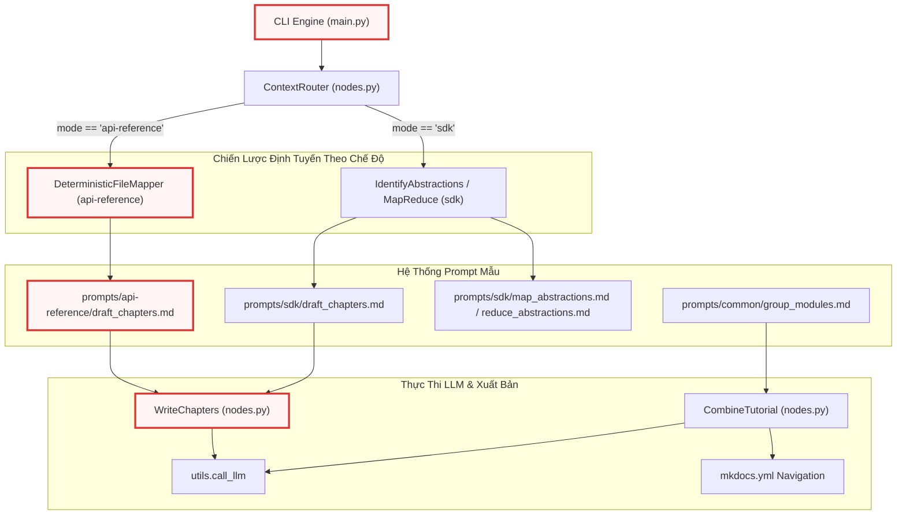
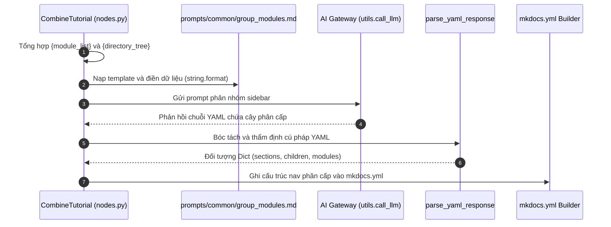
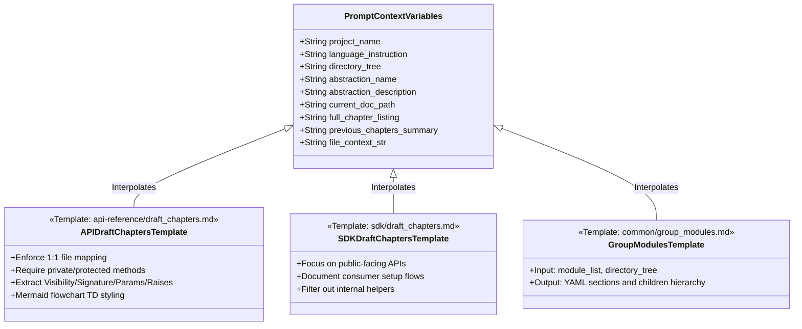

# Chapter 6: Hệ thống Prompt Mẫu cho Tài liệu API & Tích hợp SDK

Trong [Chương 5: Hệ thống Prompt Mẫu cho Tutorial & Phân tích Kiến trúc Nâng cao](05_hệ_thống_prompt_mẫu_cho_tutorial___phân_tích_kiến_trúc_nâng_cao.md), chúng ta đã phân tích cách hệ thống sử dụng các mẫu chỉ dẫn sư phạm để truyền tải luồng dữ liệu nghiệp vụ và ranh giới kiến trúc cấp cao. Tuy nhiên, đối với các kỹ sư trực tiếp tích hợp thư viện hoặc bảo trì mã nguồn nội bộ, hệ thống đòi hỏi hai định dạng tài liệu có tính quy chuẩn khắt khe hơn: **Tài liệu Tham chiếu API Toàn diện (API Reference)** và **Hướng dẫn Tích hợp Thư viện (SDK Integration Guide)**.

Chương này đi sâu vào kiến trúc của hệ thống Prompt Mẫu chuyên biệt hóa cho hai chế độ `--mode api-reference` và `--mode sdk`, cùng cơ chế phân cụm ngữ nghĩa thanh điều hướng thông minh thông qua mẫu `prompts/common/group_modules.md`.

---

## 1. Tổng quan Kiến trúc

### 1.1 Vai trò Kiến trúc (Architectural Role)
Tầng Prompt Mẫu cho API Reference và SDK chịu trách nhiệm định hình tri thức kỹ thuật thành các hợp đồng giao diện có độ chính xác tuyệt đối. 

Nếu như chế độ `tutorial` chấp nhận việc gộp nhóm các tệp tin theo use-case để tạo câu chuyện mạch lạc, thì chế độ `api-reference` áp dụng nguyên tắc **Ánh xạ Tất định 1:1 (Deterministic 1:1 File Mapping)**: Mỗi tệp nguồn trong dự án tương ứng chính xác với một trang tài liệu độc lập, bóc tách toàn bộ hàm công khai, hàm nội bộ (private/protected helpers), thuộc tính lớp và ngoại lệ phát sinh. Ngược lại, chế độ `sdk` tái cấu trúc mã nguồn theo góc nhìn của **Lập trình viên Tiêu thụ (SDK Consumer)**, chỉ trích xuất các bề mặt API công khai, quy trình khởi tạo cấu hình và các mẫu tích hợp thực tế.

Nếu thiếu thành phần này:
- LLM sẽ tự do tóm tắt mã nguồn dẫn đến việc bỏ sót các hàm nội bộ quan trọng trong tài liệu API.
- Các đoạn mã ví dụ sẽ bị "sáng tác" (hallucinated) thay vì trích xuất từ các điểm gọi lệnh (call sites) hoặc ca kiểm thử thực tế.
- Thanh điều hướng (sidebar) của hệ thống MkDocs Material sẽ bị phẳng hóa hoặc phân mảnh, khiến người dùng không thể điều hướng trong các dự án có hàng trăm module.

### 1.2 Mẫu Thiết kế (Design Patterns)
Hệ thống triển khai các mẫu thiết kế phần mềm cốt lõi sau:

1. **Prompt-as-Code & Schema Enforcement**: Toàn bộ chỉ dẫn kỹ thuật được quản lý như mã nguồn trong các tệp Markdown (`prompts/api-reference/*.md`, `prompts/sdk/*.md`, `prompts/common/*.md`), áp đặt các ràng buộc cấu trúc YAML và Markdown nghiêm ngặt ở đầu ra của LLM.
2. **Strategy Pattern qua Routing Động vs. Tất định**: 
   - Trong chế độ `sdk`, hệ thống sử dụng chiến lược Khám phá Trừu tượng Động (*Dynamic Abstraction Discovery*) thông qua quy trình MapReduce (`map_abstractions.md` $\rightarrow$ `reduce_abstractions.md`).
   - Trong chế độ `api-reference`, hệ thống chuyển hướng qua `DeterministicFileMapper` để ánh xạ trực tiếp 1:1, bỏ qua hoàn toàn bước trích xuất trừu tượng của LLM nhằm loại bỏ rủi ro bỏ sót tệp.
3. **Two-Tier Information Architecture**: Sử dụng mẫu `prompts/common/group_modules.md` để tách biệt việc tạo nội dung chương khỏi việc xây dựng cấu trúc điều hướng phân cấp (hierarchical navigation).

### 1.3 Trách nhiệm Cốt lõi (Core Responsibilities)
- **Chuẩn hóa Đặc tả Kỹ thuật Từng Hàm (Method-by-Method Breakdown)**: Ràng buộc LLM phân tích chi tiết từng hàm theo mẫu cố định: Visibility, Signature, Description, Parameters, Returns, Raises, Example.
- **Bảo toàn Tính Chân thực của Mã Nguồn (Code Fidelity)**: Ngăn chặn tuyệt đối việc LLM dịch chú thích trong code, đổi tên biến hoặc bịa đặt mã kiểm thử.
- **Phân cụm Ngữ nghĩa Đa tầng (Semantic Module Grouping)**: Tự động phân tích toàn bộ metadata của các module để tạo cấu trúc cây thư mục điều hướng chuẩn YAML cho MkDocs.
- **Định tuyến Lộ trình Tích hợp SDK**: Sắp xếp thứ tự các module theo hành trình tự nhiên của nhà phát triển (Khởi tạo $\rightarrow$ Xác thực $\rightarrow$ Nghiệp vụ cốt lõi $\rightarrow$ Tùy biến nâng cao $\rightarrow$ Tiện ích chẩn đoán).

### 1.4 Các Thành phần Phụ thuộc & Vị trí trong Hệ thống

Hệ thống prompt mẫu tương tác trực tiếp với các Node điều phối trong [Động cơ Điều phối Luồng & Xử lý Node Đa tầng](04_động_cơ_điều_phối_luồng___xử_lý_node_đa_tầng.md), nhận chỉ thị ngôn ngữ từ [Hệ thống Đa ngôn ngữ (i18n), Định dạng Đầu ra & Logging](07_hệ_thống_đa_ngôn_ngữ__i18n___định_dạng_đầu_ra___logging.md), và chuyển tiếp prompt đã nội suy qua [Tích hợp Mô hình Ngôn ngữ & Quản lý Token Context](03_tích_hớp_mô_hình_ngôn_ngữ___quản_lý_token_context.md).



---

## 2. Phân rã Chi tiết Từng Chức năng & Mẫu Chỉ dẫn

### 2.1 Chế độ API Reference: Đặc tả Toàn diện 1:1 (`api-reference/draft_chapters.md`)

Trong chế độ `api-reference`, tài liệu hướng tới các kỹ sư phát triển nội bộ hoặc các chuyên gia cần hiểu rõ từng ngóc ngách của mã nguồn. Tệp mẫu `prompts/api-reference/draft_chapters.md` thiết lập một hợp đồng nghiêm ngặt: **Mỗi tệp mã nguồn là một trang tài liệu tham chiếu hoàn chỉnh**.

#### Trích đoạn Mẫu Chỉ dẫn Khởi tạo & Cấu trúc Phân rã Từng Hàm:
```markdown
{language_instruction}Write a complete formal API and internal engineering documentation reference page (in Markdown format) for the source file `{abstraction_name}` in the project `{project_name}`.
This is a 1:1 file-to-page mapping — each page documents exactly ONE source code file exhaustively.

File Details{concept_details_note}:
- Name: {abstraction_name}
- Description:
{abstraction_description}

Full Project Directory Structure:
{directory_tree}

Complete API Index{structure_note}:
{full_chapter_listing}

Your documentation page location: {current_doc_path}

Context from previous pages{prev_summary_note}:
{previous_chapters_summary}

Source Code Context:
{file_context_str}

Instructions for the API reference page (Generate content in {language} unless specified otherwise):
- Start with a clear heading `# {abstraction_name}`.
- Below the heading, state the source file path in this exact format: `> **Source:** \`path/to/file.ext\``
- Provide a technical overview of this file's purpose, behavior, and role in the system.

- If this is not the first page in the API Index, begin with a brief transition noting how this file relates to the previous one. Reference the previous page with a proper Markdown link using its name{link_lang_note}.

- This is an EXHAUSTIVE internal reference. Extract ALL classes, methods, functions, AND important class properties/fields defined in this file.
- CRITICAL: You MUST include all private methods, protected methods (e.g., methods starting with `_` or `__`), and internal helper functions present in the Source Code Context above. Do not skip any classes or functions — document EVERYTHING in this file.
```

Đoạn prompt trên thiết lập ngữ cảnh đầu vào gồm 8 biến nội suy chính. Điểm mấu chốt nằm ở chỉ thị `CRITICAL`: Bắt buộc mô hình không được bỏ qua các phương thức private (`_` hoặc `__`) và các hàm trợ năng nội bộ. Điều này trực tiếp giải quyết vấn đề cố hữu của các hệ thống tạo tài liệu tự động vốn chỉ quét qua các định nghĩa `public export`. Biến `{file_context_str}` chứa toàn bộ nội dung tệp nguồn (được cung cấp bởi `DeterministicFileMapper`), đảm bảo LLM có đầy đủ ngữ cảnh để thực thi bóc tách.

#### Hợp đồng Cấu trúc Hàm & Ràng buộc Độ dài:
```markdown
- FUNCTION-BY-FUNCTION BREAKDOWN (CRITICAL): Do NOT dump the entire source file and call it documentation. Instead, go method-by-method:
  1. Give each public method/function its own `###` subsection using the template below
  2. For each method, show its signature and the core implementation logic (10-50 lines, using `// ...` to skip boilerplate)
  3. Follow each code block with a prose paragraph explaining the behavior, edge cases, and error handling
  If the file implements multiple distinct features or handlers (e.g., 8 button click handlers), each MUST get its own documented subsection — do not lump them into one giant code block.

- Generate standard Markdown API documentation enforcing this exact structure for each method/function:

### `function_or_method_name()`
**Visibility**: (Specify Public, Protected, or Private)
**Signature**: `def _function_name(arg1: type) -> type:` (or equivalent in the source language)

**Description**: Technical description of the behavior and internal implementation details. What does this actually do under the hood?

**Parameters**:
* `arg1` (type): Description of the argument.

**Returns**:
* `type`: Description of the return value.

**Raises**:
* `ExceptionType`: When/why it is raised internally.

**Example**:
```python
# Show ACTUAL usage from the source code — extract a real call site, test case,
# or the method's own implementation. NEVER invent example code.
```
```

Cấu trúc định dạng này chuẩn hóa đầu ra theo chuẩn tài liệu kỹ thuật cấp cao. Ràng buộc `FUNCTION-BY-FUNCTION BREAKDOWN` ngăn chặn hiện tượng LLM nhồi nhét toàn bộ tệp nguồn vào một khối code duy nhất rồi đưa ra giải thích chung chung. Mỗi hàm bắt buộc phải có trường `Visibility`, `Signature`, `Parameters`, `Returns`, `Raises` và `Example`. Quy tắc `NO INVENTED CODE` yêu cầu LLM trích xuất các ví dụ từ chính các ca kiểm thử hoặc lời gọi hàm thực tế có trong ngữ cảnh mã nguồn; nếu không có điểm gọi lệnh, LLM phải hiển thị chính phần thân hàm đó thay vì tự tạo một đoạn mã giả lập.

#### Ràng buộc Sơ đồ Trực quan & Tỷ lệ Giải thích Kỹ thuật:
```markdown
- CODE FIDELITY: Inside fenced code blocks, preserve ALL original source code and comments EXACTLY as they appear — in their original language, with original variable names, and original inline comments. Never translate, rephrase, or modify code or inline comments. Your own explanations belong in prose paragraphs outside the code fence.

- CODE BLOCK SIZE: For each documented method/function, show its signature and the core implementation logic in a code block of 10-50 lines. Use `// ...` (or the language's comment syntax) to skip boilerplate, repetitive branches, or trivial setup within the method body. NEVER exceed 50 lines in one code block. Follow each code block with a prose paragraph explaining the implementation behavior.

- EXPLANATION RATIO: For every code block, you MUST write at least one full paragraph (3-5 sentences minimum) of technical explanation immediately after it — describe the behavior, implementation strategy, error handling, and edge cases. Do NOT just show code with a one-liner description.

- When the file defines control flows, inheritance hierarchies, state machines, or node/pipeline architectures, you MUST include Mermaid diagrams using fenced code blocks (```mermaid). NEVER use ASCII art, box-drawing characters (+---+, |, v), or plaintext diagrams — they render poorly in web documentation. Choose the appropriate Mermaid diagram type:
  * `classDiagram` — for inheritance, composition, or factory patterns
  * `sequenceDiagram` — for request/response flows that cross multiple components
  * `flowchart TD` — for decision logic, branching, pipeline stages, or node architecture (MUST use TD direction)
  * `stateDiagram` — for entity lifecycle states
```

Chỉ thị `CODE FIDELITY` bảo vệ toàn vẹn cú pháp của mã nguồn: Mô hình ngôn ngữ tuyệt đối không được dịch mã nguồn hoặc chú thích nội dòng sang ngôn ngữ khác, bảo đảm mã copy-paste luôn chạy được. Tỷ lệ phân tích `EXPLANATION RATIO` (tối thiểu 3-5 câu văn xuôi sau mỗi khối code) buộc LLM phải giải thích chiến lược xử lý lỗi (error handling) và các trường hợp biên (edge cases). Về mặt trực quan hóa, hệ thống cấm hoàn toàn ASCII art và áp đặt quy chuẩn Mermaid nghiêm ngặt (`flowchart TD`, khối hộp vuông có nhãn chuỗi `"Label"` và lớp giao diện nhấn mạnh `entryNode`).

---

### 2.2 Chế độ SDK: Bề mặt Tích hợp Công khai & Developer Experience (`sdk/draft_chapters.md`)

Chế độ `sdk` phục vụ đối tượng lập trình viên bên ngoài tích hợp thư viện vào ứng dụng của họ. Khác với `api-reference`, tài liệu SDK lược bỏ các chi tiết triển khai nội bộ tầm thường, tập trung vào giao diện công khai và mô hình sử dụng thực tế.

#### Cấu trúc Chỉ dẫn Soạn thảo SDK:
```markdown
{language_instruction}Write a complete formal SDK documentation reference page (in Markdown format) for the module `{abstraction_name}` in the project `{project_name}`.

Module Details{concept_details_note}:
- Name: {abstraction_name}
- Description:
{abstraction_description}

Full Project Directory Structure:
{directory_tree}

Complete SDK Index{structure_note}:
{full_chapter_listing}

Your documentation page location: {current_doc_path}

Context from previous modules{prev_summary_note}:
{previous_chapters_summary}

Source Code Context:
{file_context_str}

Instructions for the SDK reference page (Generate content in {language} unless specified otherwise):
- Start with a clear heading `# {abstraction_name}`.
- Provide a technical overview of this module's behavior and what capability it provides to SDK consumers.

- If this is not the first module in the SDK Index, begin with a brief transition noting how this module relates to the previous one. Reference the previous module with a proper Markdown link using its name{link_lang_note}.

- Extract the primary public-facing APIs, classes, and methods relevant for an SDK consumer. Focus on what a developer needs to integrate this module. You DO NOT need to document internal helper methods or private functions unless they are crucial for understanding the architecture.
```

So sánh với `api-reference`, mục tiêu của mẫu này chuyển dịch từ *exhaustiveness* (tính toàn diện) sang *actionability* (tính khả thi trong tích hợp). Câu chỉ thị `"You DO NOT need to document internal helper methods or private functions unless they are crucial for understanding the architecture"` giúp tinh giản tài liệu, giữ sự tập trung của nhà phát triển vào các API công khai chính.

#### Quy chuẩn Định dạng Phương thức SDK:
```markdown
- Generate standard Markdown API documentation enforcing this exact structure for each public method/function:

### `function_or_method_name()`
**Signature**: `def function_name(arg1: type) -> type:` (or equivalent in the source language)

**Description**: What does this function do for the developer? Focus on usage, not internal implementation.

**Parameters**:
* `arg1` (type): Description of the argument.

**Returns**:
* `type`: Description of the return value.

**Example**:
```python
# Show a REAL-WORLD usage example derived from actual source code patterns.
# Extract from tests, existing call sites, or construct from the method's
# actual signature and behavior. NEVER invent hypothetical code.
```

- Document all public-facing APIs present in the Source Code Context above. Group methods under their respective class headings (`## ClassName`).

- IMPORTANT: You MUST reference ACTUAL code from the provided Source Code Context — never invent examples. However, DO NOT dump entire source files. Instead, extract the most significant public methods and classes selectively.
```

Mục `Description` trong mẫu SDK tập trung vào giá trị sử dụng cho lập trình viên thay vì phân tích cơ chế nội tại dưới nắp ca-pô. Khối `Example` được tối ưu hóa để phản ánh các mẫu tích hợp thực tế (real-world usage patterns), hỗ trợ kỹ sư tích hợp nhanh chóng thông qua việc sao chép các đoạn mã khởi tạo và cấu hình hợp lệ.

---

### 2.3 Phân cụm Ngữ nghĩa Thanh Điều hướng: `prompts/common/group_modules.md`

Khi tài liệu hóa một hệ thống lớn có từ 50 đến hàng trăm tệp tin, việc hiển thị toàn bộ danh sách module trên một thanh bên phẳng (flat sidebar) sẽ gây quá tải nhận thức. Mẫu chỉ dẫn `group_modules.md` được gọi trong node `CombineTutorial` để yêu cầu LLM phân tích toàn bộ danh sách module và cây thư mục, từ đó tổng hợp thành cấu trúc cây điều hướng phân cấp (hierarchical navigation tree) cho MkDocs Material.

#### Toàn văn Mẫu Chỉ dẫn Phân nhóm:
```markdown
You are organizing a documentation sidebar for the project "{project_name}".

Below are all {module_count} documented modules with their technical summaries:

{module_list}

Directory structure of the project:
{directory_tree}

Group these modules into a LOGICAL HIERARCHY for a documentation sidebar.

Rules:
- Create as many sections and sub-sections as the project needs
- Group by PURPOSE and DOMAIN, not by directory or filename
- Section names should be meaningful to developers
- Every module MUST appear in exactly one section
- Order sections from most fundamental to most specialized
- Order modules within each section logically
- For small projects (under 15 modules), 2-4 sections is fine
- For large projects (50+ modules), use nested sub-sections
{language_note}

Return ONLY valid YAML:

```yaml
sections:
  - name: "Section Name"
    modules: ["module_name_1", "module_name_2"]
  - name: "Parent Section"
    children:
      - name: "Child Section"
        modules: ["module_name_3"]
```
```

Đoạn chỉ dẫn áp đặt các quy tắc logic chặt chẽ:
1. **Phân nhóm theo Mục đích và Miền nghiệp vụ (Purpose & Domain)**: Không phụ thuộc cứng nhắc vào vị trí thư mục vật lý, cho phép gộp các file có vai trò tương hỗ (như client và middleware) vào cùng một phân mục hợp lý.
2. **Nguyên tắc Bao phủ Toàn vẹn (Exhaustive Coverage)**: Mọi module bắt buộc phải xuất hiện trong đúng một section.
3. **Thứ tự Tiến hóa (Progression Ordering)**: Sắp xếp các section từ nền tảng nhất (Core/Models/Config) đến chuyên biệt nhất (Extensions/CLI/Diagnostics).
4. **Hợp đồng Đầu ra YAML Đơn nhất (Strict YAML Schema)**: Chỉ trả về cấu trúc danh sách lồng nhau gồm các khóa `sections`, `name`, `modules`, `children` giúp hàm `parse_yaml_response()` giải mã trực tiếp thành cấu trúc dữ liệu Python để ghi vào `mkdocs.yml`.

#### Quy trình Xử lý Phân nhóm Thanh Điều hướng:



---

### 2.4 Khám phá & Gom cụm Module SDK (`sdk/identify_abstractions.md` & `sdk/reduce_abstractions.md`)

Trong chế độ `sdk`, hệ thống không ánh xạ 1:1 theo tệp mà gom nhóm các tệp có mối liên hệ chức năng chặt chẽ thành các "Module SDK". 

#### Trích đoạn Mẫu Chỉ dẫn Nhận diện Module SDK (`sdk/identify_abstractions.md`):
```markdown
For the project `{project_name}`, your task is to identify the core logical SDK modules or namespaces from the codebase context provided below to generate a cohesive Public SDK documentation reference.

Codebase Context:
{context}

Full Project Directory Structure:
{directory_tree}

{language_instruction}You must identify and group the files into logically distinct SDK Modules (e.g., `Authentication`, `Database Models`, `UI Event Handlers`). Do NOT do a 1:1 file mapping. Group related files into cohesive modules that a developer would naturally look for when integrating this SDK.

COVERAGE RULE: Every file index listed below MUST belong to at least one SDK module.
After forming your initial modules, scan the file listing to verify no files are unassigned.
If any files are orphaned, either create a new module or expand an existing one.
Do NOT skip files just because they contain only data models, configuration, or simple boilerplate —
these define the SDK's data contracts and configuration surface.
```

Quy tắc `COVERAGE RULE` đảm bảo tính toàn vẹn 100% của kho mã nguồn. Dù không ánh xạ 1:1, hệ thống không cho phép bất kỳ tệp nào bị "bỏ rơi" (orphaned). Các tệp mô hình dữ liệu (DTO/Schema) phải được nhóm kèm với module trực tiếp tiêu thụ chúng, tránh tạo ra các module vô danh dạng "Models" hoặc "Types" chung chung gây khó khăn cho việc tra cứu.

#### Hợp nhất Batch qua `sdk/reduce_abstractions.md`:
Đối với các codebase vượt ngưỡng kích thước cửa sổ ngữ cảnh, node `IdentifyAbstractions` chạy qua nhiều batch (`map_abstractions.md`), sau đó sử dụng `sdk/reduce_abstractions.md` để hợp nhất các module trùng lặp.

```markdown
For the project `{project_name}`:

We have identified several partial, overlapping SDK modules from different batches of the codebase.

Partial Modules:
{partial_abstractions}

{language_instruction}Your task is to merge these overlapping partial modules into a cohesive, global list of maximum {max_abstraction_num} core SDK modules.

MERGE RULES:
- DO merge: partial modules from different batches that clearly describe the same component (same class names mentioned, same namespace, overlapping file indices).
- DO merge: a small auxiliary concern (1-3 files) into the larger module it serves.
- DO NOT merge: modules at different architectural layers (e.g., network infrastructure + business logic).
- DO NOT merge: modules with different consumers (e.g., admin-facing tools + end-user-facing services).
- DO NOT merge if the result would cover more than ~30 files — that is too broad for one reference page; keep them separate.
```

Các quy tắc `MERGE RULES` và `SIZING GUIDANCE` thiết lập ranh giới định lượng rõ ràng: Nếu một module gom quá 30 tệp, nó phải được tách biệt; nếu một mối quan tâm phụ chỉ gồm 1-3 tệp, nó phải được gộp vào module chính. Điều này giúp cân bằng độ dài của các trang tài liệu SDK, ngăn ngừa việc tài liệu bị quá ngắn (loãng) hoặc quá dài (vượt trần token context khi sinh nội dung chi tiết).

---

### 2.5 Quy hoạch Lộ trình Tích hợp & Sơ đồ Quan hệ SDK (`sdk/order_chapters.md` & `sdk/identify_relationships.md`)

Sau khi danh sách module trừu tượng được thiết lập, hệ thống tiến hành xác định thứ tự đọc và các mối quan hệ tương tác.

#### Chỉ dẫn Sắp xếp Chương SDK (`sdk/order_chapters.md`):
```markdown
Given the following SDK modules and their dependencies for the project `{project_name}`:

Modules (Index # Name){list_lang_note}:
{abstraction_listing}

Context about relationships and project summary:
{context}

What is the best order to present these modules in the SDK documentation?
The reader is a developer integrating this SDK into their application. Order for maximum "I can start building immediately" progression.

ORDERING STRATEGY:
1. Start with getting-started essentials: initialization, configuration, and client setup — what the developer needs to write their first line of code.
2. Then authentication and identity modules — the developer needs to understand trust boundaries before calling any API.
3. Then core domain modules in the order a typical integration would use them (e.g., create resource → query resource → update resource → delete resource).
4. Then advanced features and customization modules (hooks, plugins, middleware, custom serializers).
5. End with utilities, helpers, and diagnostic modules (logging, debugging, error handling).
```

Chiến lược `ORDERING STRATEGY` phản ánh chính xác hành trình nhận thức (cognitive journey) của một lập trình viên:
$$\text{Cài đặt \& Cấu hình} \longrightarrow \text{Xác thực} \longrightarrow \text{Nghiệp vụ Cốt lõi} \longrightarrow \text{Tùy biến Nâng cao} \longrightarrow \text{Tiện ích \& Chẩn đoán}$$

Thứ tự này giúp lập trình viên có thể đọc tài liệu tuần tự từ Chương 1 đến hết và có thể bắt đầu viết code ngay từ những trang đầu tiên.

#### Định nghĩa Mối quan hệ Kỹ thuật (`sdk/identify_relationships.md`):
```markdown
{language_instruction}Please provide:
1. A high-level technical `summary` of the project's SDK architecture in a few sentences{lang_hint}. Use markdown formatting with **bold** and *italic* text to highlight key components and integration patterns.
2. A list (`relationships`) describing the key technical interactions, dependencies, or data flows between these modules. For each relationship, specify:
    - `from_abstraction`: Index of the source module (e.g., `0 # Module1`)
    - `to_abstraction`: Index of the target module (e.g., `1 # Module2`)
    - `label`: A precise technical label for the interaction **in just a few words**{lang_hint}.
      The label should describe WHAT flows between the two (data, control, events) and through what mechanism.
      Examples of good labels: "calls via RPC for lookup", "inherits interface from", "validates tokens via", "persists entities to", "subscribes to config-change events"
      Examples of bad labels: "uses", "manages", "depends on", "related to" (too vague to be useful for SDK consumers)
```

Prompt yêu cầu các nhãn quan hệ (`label`) phải mô tả chính xác bản chất tương tác kỹ thuật (giao thức, luồng dữ liệu, sự kiện) thay vì các động từ mơ hồ như `"uses"` hay `"depends on"`. Dữ liệu này sau đó được chuyển đổi trực tiếp thành biểu đồ kiến trúc hệ thống bằng Mermaid trong tài liệu hoàn chỉnh.

---

### 2.6 Cơ chế Bỏ qua Nhận diện Trừu tượng Tất định (Deterministic Bypass) trong API Reference

Một quyết định thiết kế kiến trúc quan trọng trong hệ thống là sự hiện diện của các tệp prompt có chú thích vô hiệu hóa trong thư mục `prompts/api-reference/`:
- `identify_abstractions.md`
- `identify_relationships.md`
- `map_abstractions.md`
- `reduce_abstractions.md`
- `order_chapters.md`

#### Ghi chú Kỹ thuật Đầu Tệp (Header Warning):
```markdown
<!-- NOTE: This template is NOT used in the current api-reference flow.
     ContextRouter routes api-reference mode to DeterministicFileMapper,
     which bypasses abstraction discovery entirely (1:1 file mapping).
     Kept for potential future use if api-reference adds a non-deterministic path. -->
```

#### Phân tích Cơ chế Kiến trúc:
Trong chế độ `api-reference`, lớp `ContextRouter` trong `nodes.py` nhận diện cờ `--mode api-reference` và chuyển hướng luồng thực thi sang `DeterministicFileMapper`. Node này trực tiếp lặp qua danh sách `shared["files"]` và tạo ra danh sách abstractions mà mỗi abstraction tương ứng chính xác với một tệp vật lý. 

Tại sao hệ thống lại duy trì các tệp prompt này trong mã nguồn dù không thực thi tại runtime?
1. **Tính Nhất quán của Cấu trúc Thư mục (Directory Symmetry)**: Giữ cho cây thư mục `prompts/api-reference` đối xứng 1:1 với `prompts/tutorial`, `prompts/advanced` và `prompts/sdk`.
2. **Khả năng Mở rộng Tương lai (Future Extension)**: Sẵn sàng kích hoạt chế độ "API Reference Cấp Cụm" (Clustered API Reference) nếu người dùng yêu cầu gom nhóm các endpoint mà không muốn dùng chế độ 1:1 chi tiết.
3. **Phòng thủ Hồi quy (Regression Defense)**: Đảm bảo nếu một lập trình viên vô tình gọi phương thức trừu tượng hóa cho API Reference, hệ thống vẫn có prompt hợp lệ để nạp thay vì gây lỗi `FileNotFoundError`.

---

## 3. So sánh Kiến trúc Giữa Các Chế độ Prompt

Bảng dưới đây tổng hợp sự khác biệt về bản chất kỹ thuật, đối tượng độc giả và hợp đồng đầu ra giữa chế độ `api-reference`, `sdk`, và hai chế độ đã phân tích ở Chương 5:

| Thuộc tính Kiến trúc | Chế độ `api-reference` | Chế độ `sdk` | Chế độ `tutorial` / `advanced` (Chương 5) |
| :--- | :--- | :--- | :--- |
| **Mục tiêu Trọng tâm** | Tham chiếu nội bộ chi tiết, toàn diện 100% | Tích hợp thư viện công khai, nâng cao DX | Sư phạm, luồng thực thi, đánh đổi thiết kế |
| **Chiến lược Ánh xạ Tệp** | **Tất định 1:1** (`DeterministicFileMapper`) | **Phân cụm Ngữ nghĩa** (MapReduce/LLM) | **Phân cụm Trừu tượng** (MapReduce/LLM) |
| **Phạm vi Hàm Bóc tách** | **Tất cả** (Public, Protected, Private, Helper) | **Chỉ Public APIs** và luồng tích hợp | Khối mã nguồn minh họa luồng dữ liệu |
| **Mẫu Cấu trúc Hàm** | Bắt buộc (Visibility, Signature, Params, Returns, Raises, Example) | Bắt buộc (Signature, Description, Params, Returns, Real Example) | Tự do theo ngữ cảnh câu chuyện kỹ thuật |
| **Yêu cầu Mã Ví dụ** | Trích xuất call site/test thực tế (Tuyệt đối không bịa đặt) | Trích xuất pattern thực tế từ code/test | Đoạn code minh họa kèm giải thích |
| **Xây dựng Thanh Nav** | Phân cụm ngữ nghĩa qua `group_modules.md` | Phân cụm ngữ nghĩa qua `group_modules.md` | Sắp xếp theo thứ tự đọc tuyến tính (`order_chapters`) |
| **Độ dài Trang Dự kiến** | 3,000 – 8,000 từ / trang | 3,000 – 6,000 từ / trang | 3,000 – 7,000 từ / chương |

---

## 4. Mô hình Dữ liệu và Cấu trúc Biến Nội suy

Để đảm bảo khả năng liên kết chéo và tái cấu trúc nội dung chính xác, các prompt mẫu trong chương này ràng buộc chặt chẽ với các biến trạng thái trong `shared store`.



Mỗi biến đại diện cho một phần dữ liệu được tính toán động bởi pipeline:
- `{current_doc_path}`: Cho phép LLM tính toán chính xác đường dẫn tương đối (`../sub/file.md`) khi tạo các liên kết Markdown chéo giữa các trang tài liệu.
- `{full_chapter_listing}`: Cung cấp toàn bộ chỉ mục tài liệu của dự án để LLM biết trang hiện tại đang đứng ở đâu trong bức tranh tổng thể.
- `{previous_chapters_summary}`: Chứa tóm tắt lũy kế 4 chiều từ các chương trước (được tạo bởi `build_chapter_summary_prompt`), giúp duy trì tính liên tục và tham chiếu nhất quán.

---

## 5. Ghi chú Thực tiễn cho Kỹ sư Mới (Practical Notes for New Team Members)

### 5.1 Vị trí Cấu hình & Mở rộng Mẫu Chỉ dẫn
- **Đường dẫn Prompt**: Toàn bộ prompt được lưu trữ trong thư mục `prompts/`. Khi cần chỉnh sửa định dạng tài liệu API, hãy can thiệp trực tiếp vào `prompts/api-reference/draft_chapters.md`. Nếu cần thay đổi hành vi tích hợp SDK, can thiệp vào `prompts/sdk/draft_chapters.md`.
- **Cấu hình Thanh Điều hướng**: Quy tắc phân nhóm sidebar được quy định tại `prompts/common/group_modules.md`. Nếu cấu trúc điều hướng sinh ra quá sâu hoặc quá phẳng, hãy điều chỉnh các chỉ thị phân cấp trong tệp này.

### 5.2 Điểm Kiểm tra Khi Gặp Lỗi (Debugging Entry Points)
- **Lỗi Cú pháp YAML trong `group_modules`**: Khi LLM sinh ra YAML không hợp lệ cho cấu trúc sidebar, hàm `parse_yaml_response()` trong `nodes.py` sẽ ném ngoại lệ hoặc trả về từ điển rỗng. Hãy kiểm tra tệp `logs/llm_execution.log` để xem chuỗi YAML thô do LLM trả về.
- **Hiện tượng Thiếu Hàm Private trong API Reference**: Nếu tài liệu API sinh ra thiếu các phương thức nội bộ, hãy kiểm tra lại biến `{file_context_str}` trong `WriteChapters.prep()`. Đảm bảo rằng `DeterministicFileMapper` đã đọc toàn bộ tệp và không bị cắt tỉa nhầm bởi bộ lọc kích thước `--max-size`.
- **Lỗi Sai Đường Dẫn Liên Kết Markdown**: Nếu các liên kết tương đối giữa các trang bị lỗi 404 trên MkDocs, kiểm tra biến `{current_doc_path}` được truyền vào prompt. LLM dựa hoàn toàn vào đường dẫn này để sinh đường dẫn tương đối.

### 5.3 Nợ Kỹ thuật & Các Lưu ý Đặc thù (Known Quirks)
- **Ràng buộc Giới hạn 50 Dòng Code Block**: Prompt chỉ thị LLM không được xuất khối mã vượt quá 50 dòng và phải dùng `// ...` để bỏ qua boilerplate. Một số mô hình LLM nhỏ có thể phớt lờ chỉ thị này và xuất toàn bộ mã nguồn lớn. Cần theo dõi log token nếu nhận thấy dung lượng phản hồi tăng đột biến.
- **Tính Thừa kế của các Tệp Prompt Vô hiệu hóa**: Các tệp `prompts/api-reference/identify_*.md` hiện không tham gia vào luồng runtime. Khi thực hiện tái cấu trúc lớn (refactoring), hãy cẩn trọng không xóa nhầm các tệp này để duy trì tính đối xứng của kho prompt.

### 5.4 Quy chuẩn Đánh giá Code (Code Review Guidelines)
- Khi cập nhật bất kỳ tệp Markdown prompt nào, **tuyệt đối không hardcode ngôn ngữ tự nhiên** trong thân prompt. Luôn sử dụng các biến giữ chỗ `{language_instruction}`, `{name_lang_hint}`, `{desc_lang_hint}` để đảm bảo tính năng đa ngôn ngữ (i18n) không bị phá vỡ.
- Mọi thay đổi trong cấu trúc đầu ra Markdown của `draft_chapters.md` phải được kiểm tra tương thích với trình dựng của theme MkDocs Material (đặc biệt là cú pháp Admonition, Code Fences và biểu đồ Mermaid).

---

## 6. Tóm tắt Kỹ thuật & Bước tiếp theo

Chương này đã làm rõ kiến trúc thiết kế của Hệ thống Prompt Mẫu dành cho Tài liệu Tham chiếu API và Hướng dẫn Tích hợp SDK. Chúng ta đã phân tích:
- Cơ chế ánh xạ tất định 1:1 và quy chuẩn bóc tách từng phương thức khắt khe trong `api-reference/draft_chapters.md`.
- Hướng tiếp cận lấy nhà phát triển làm trung tâm trong `sdk/draft_chapters.md`.
- Thuật toán phân cụm thanh điều hướng đệ quy thông minh qua `common/group_modules.md`.
- Lý do kiến trúc cho việc bỏ qua nhận diện trừu tượng động trong chế độ API Reference.

Trong chương tiếp theo, chúng ta sẽ khảo sát lớp hỗ trợ toàn cục: cách hệ thống thực hiện bản địa hóa đa ngôn ngữ, chuẩn hóa định dạng kết xuất và quản lý luồng nhật ký thực thi.

👉 Chuyển sang [Chương 7: Hệ thống Đa ngôn ngữ (i18n), Định dạng Đầu ra & Logging](07_hệ_thống_đa_ngôn_ngữ__i18n___định_dạng_đầu_ra___logging.md).

