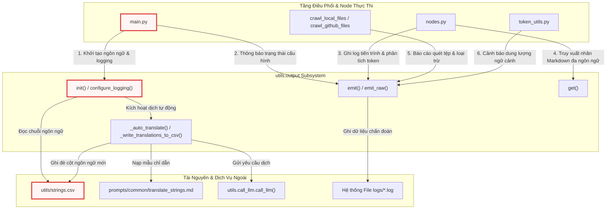
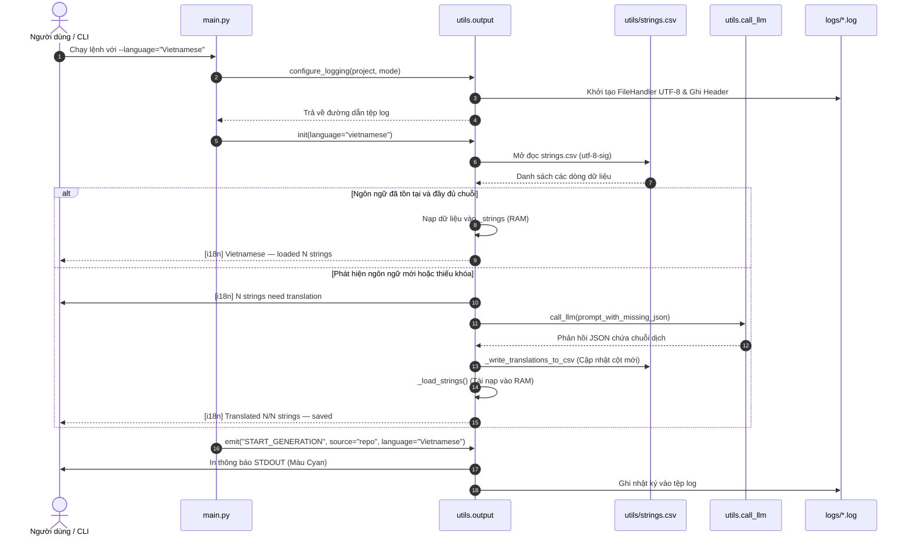
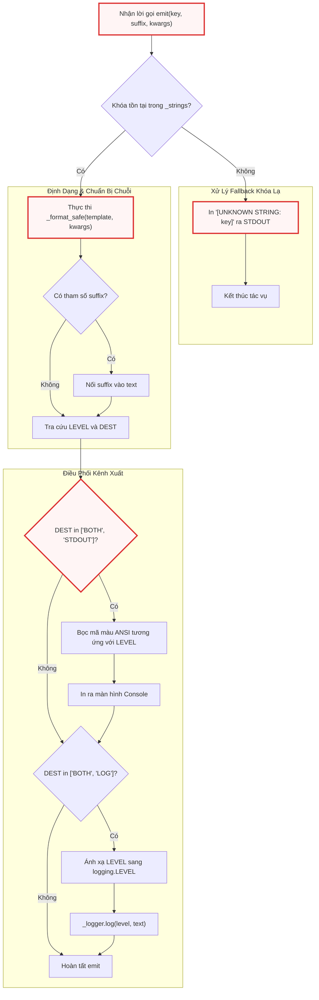

# Chapter 7: Hệ thống Đa ngôn ngữ (i18n), Định dạng Đầu ra & Logging

Ở chương trước, [Hệ thống Prompt Mẫu cho Tài liệu API & Tích hợp SDK](06_hệ_thống_prompt_mẫu_cho_tài_liệu_api___tích_hợp_sdk.md) đã phân tích chi tiết kỹ thuật trích xuất bề mặt mã nguồn, ánh xạ tất định 1:1 và cấu trúc hóa cây điều hướng phân cấp. Tuy nhiên, để một hệ thống tài liệu hóa mã nguồn tự động vận hành trơn tru trong môi trường kỹ thuật đa quốc gia, toàn bộ thông điệp giao diện dòng lệnh (CLI), luồng nhật ký chẩn đoán (Diagnostic Logging) và các nhãn tiêu đề Markdown sinh ra phải được trừu tượng hóa khỏi mã nguồn logic.

Chương này đi sâu vào kiến trúc của **Hệ thống Đa ngôn ngữ (i18n), Định dạng Đầu ra & Logging** — lớp dịch vụ nền tảng chịu trách nhiệm về toàn bộ giao diện tương tác người dùng trên Terminal, cơ chế tự động bản địa hóa chuỗi thông điệp dựa trên LLM (*LLM Auto-Translation Fallback*) và hệ thống phân lập luồng ghi nhật ký vận hành theo từng phiên làm việc.

---

## 1. Tổng quan Kiến trúc (Technical Overview)

### 1.1. Vai trò Kiến trúc (Architectural Role)
Trong các công cụ CLI phức tạp, việc nhúng trực tiếp các chuỗi ký tự hiển thị (*hardcoded strings*), mã màu terminal và lệnh in `print()` rải rác khắp các tầng nghiệp vụ dẫn đến ba vấn đề kiến trúc nghiêm trọng:
1. **Khó bảo trì và kiểm thử:** Bất kỳ thay đổi nào về văn bản, định dạng hiển thị hoặc bổ sung ngôn ngữ mới đều đòi hỏi phải can thiệp trực tiếp vào mã nguồn của các Node xử lý dữ liệu.
2. **Nhiễu loạn luồng dữ liệu:** Việc thiếu kiểm soát giữa đầu ra tiêu chuẩn (`STDOUT`) dành cho người dùng và đầu ra nhật ký (`LOG`) dành cho việc chẩn đoán lỗi khiến việc phân tích hiệu năng và debug trở nên khó khăn.
3. **Phá vỡ tính nhất quán của tài liệu sinh ra:** Các nhãn điều hướng (Navigation Labels), tiêu đề chương (Chapter Headings) và bảng mục lục (TOC) trong tài liệu Markdown đầu ra có thể bị lệch ngôn ngữ so với cấu hình người dùng yêu cầu.

Thành phần `utils.output` đóng vai trò là một **Lớp Trừu Tượng Hóa Đầu Ra Tập Trung (Centralized Output Abstraction Layer)**. Nó phân tách hoàn toàn tầng giao tiếp người dùng ra khỏi logic điều phối lõi (`flow.py`, `nodes.py`, `crawl_*.py`). Nếu hệ thống này gặp sự cố, CLI sẽ mất khả năng hiển thị tiến trình, định dạng mã màu ANSI bị vỡ, luồng ghi log bị gián đoạn và hệ thống tài liệu Markdown sẽ bị lỗi hiển thị các thành phần đa ngôn ngữ.

### 1.2. Mẫu Thiết kế (Design Patterns)
Hệ thống kết hợp ba mẫu thiết kế chính nhằm tối ưu hóa tính mở rộng và khả năng tự phục hồi:

*   **Externalized Strings (Resource Bundle Pattern):** Toàn bộ chuỗi thông điệp, nhãn giao diện và mẫu câu định dạng được lưu trữ độc lập trong tệp tài nguyên tĩnh `utils/strings.csv`. Mã nguồn ứng dụng chỉ tham chiếu đến các chuỗi này thông qua định danh duy nhất (`STRING_KEY`).
*   **LLM Auto-Translation Fallback (Self-Healing i18n):** Khác với các hệ thống i18n truyền thống (như GNU gettext) đòi hỏi dịch thủ công toàn bộ tệp `.po`/`.mo` trước khi biên dịch, hệ thống này tích hợp cơ chế tự phục hồi. Khi nhận diện một ngôn ngữ mới chưa từng có trong `strings.csv`, hệ thống tự động trích xuất các khóa còn thiếu, gửi yêu cầu đến LLM thông qua prompt `prompts/common/translate_strings.md`, phân tích cú pháp phản hồi và tự động ghi đè bổ sung cột ngôn ngữ mới vào tệp CSV ngay trong runtime.
*   **Logging Facade & Destination Routing Pattern:** Đóng gói thư viện chuẩn `logging` của Python dưới các hàm điều phối `emit()` và `emit_raw()`. Hệ thống tự động phân luồng dữ liệu dựa trên thuộc tính `DEST` của từng thông điệp: chỉ xuất ra màn hình (`STDOUT`), chỉ ghi vào tệp chẩn đoán (`LOG`), hoặc phát đồng thời tới cả hai kênh (`BOTH`).

```
                              +---------------------------------------+
                              |         CLI Arguments (--language)    |
                              +-------------------+-------------------+
                                                  |
                                                  v
                                      +-----------------------+
                                      |   utils.output.init   |
                                      +-----------+-----------+
                                                  |
                         +------------------------+------------------------+
                         |                                                 |
                         v                                                 v
              [strings.csv Exists]                              [Missing Target Lang]
                         |                                                 |
                         v                                                 v
              +----------------------+                         +-----------------------+
              |    _load_strings     |                         |    _auto_translate    |
              +----------+-----------+                         +-----------+-----------+
                         |                                                 |
                         |                                                 v
                         |                                     +-----------------------+
                         |                                     |  prompts/common/      |
                         |                                     |  translate_strings.md |
                         |                                     +-----------+-----------+
                         |                                                 |
                         |                                                 v
                         |                                     +-----------------------+
                         |                                     |   utils.call_llm      |
                         |                                     +-----------+-----------+
                         |                                                 |
                         |                                                 v
                         |                                     +-----------------------+
                         |                                     | _write_translations_  |
                         |                                     | to_csv                |
                         |                                     +-----------+-----------+
                         |                                                 |
                         +------------------------+------------------------+
                                                  |
                                                  v
                                      +-----------------------+
                                      |   _strings (in RAM)   |
                                      +-----------+-----------+
                                                  |
                   +------------------------------+------------------------------+
                   |                                                             |
                   v                                                             v
        +--------------------+                                        +--------------------+
        |   emit(key, ...)   |                                        |     get(key)       |
        +----------+---------+                                        +----------+---------+
                   |                                                             |
         +---------+---------+                                                   v
         |                   |                                        +--------------------+
         v                   v                                        | Markdown Generator |
+-----------------+ +-----------------+                               | (Combine Nodes)    |
| STDOUT (Color)  | | logs/{run}.log  |                               +--------------------+
+-----------------+ +-----------------+
```

### 1.3. Trách nhiệm Cốt lõi (Core Responsibilities)
1. **Quản lý Tập trung Bảng Chuỗi i18n:** Nạp, phân tích và ánh xạ các chuỗi văn bản từ `utils/strings.csv` vào bộ nhớ RAM với cơ chế fallback tự động về tiếng Anh (`english`) khi một khóa chưa được bản địa hóa.
2. **Tự động Dịch Thuật Runtime:** Phát hiện các chuỗi chưa được dịch sang ngôn ngữ mục tiêu (`--language`), kích hoạt pipeline dịch thuật thông qua LLM và cập nhật trực tiếp vào tệp CSV mà không làm gián đoạn luồng thực thi chính.
3. **Định dạng Trực quan ANSI Terminal:** Ánh xạ mức độ thông điệp (`LEVEL`) thành các mã màu ANSI tương ứng (Cyan cho tiến trình, Green cho thành công, Yellow cho cảnh báo, Red cho lỗi, Gray cho debug).
4. **Định tuyến Kênh Xuất (Destination Routing):** Kiểm soát chính xác nơi thông điệp được xuất ra dựa trên trường `DEST` (`BOTH`, `STDOUT`, `LOG`) để tránh làm rác màn hình terminal hoặc bỏ sót thông tin chẩn đoán.
5. **Cấu hình Logging Chuyên biệt theo Phiên:** Khởi tạo tệp log cô lập cho từng phiên chạy tại thư mục `logs/` theo định dạng `{project_name}_{mode}_{YYYYMMDD_HHmmss}.log`, đồng thời loại bỏ các handler rác và thiết lập bộ định dạng thời gian chuẩn xác.
6. **Cung cấp Nhãn Giao diện cho Tầng Sinh Markdown:** Cung cấp hàm `get()` cho các node hạ nguồn (`CombineTutorialNode`, `DeterministicFileMapper`) để lấy chuỗi văn bản thuần đã dịch nhằm nhúng vào cấu trúc tài liệu tĩnh.

### 1.4. Phụ thuộc Trọng yếu (Key Dependencies)



---

## 2. Cấu trúc Dữ liệu & Quản lý Trạng thái Module

Module `utils/output.py` hoạt động như một singleton module-level. Trạng thái hoạt động của hệ thống được duy trì thông qua các biến toàn cục nội bộ, kiểm soát toàn bộ vòng đời từ khi nhận tham số dòng lệnh đến khi kết thúc phiên chạy.

### 2.1. Cấu trúc Bảng Tra Cứu Chuỗi (`strings.csv`)
Tệp `utils/strings.csv` được thiết kế theo cấu trúc bảng hai chiều:
*   `STRING_KEY`: Định danh duy nhất của chuỗi (khóa chính).
*   `LEVEL`: Cấp độ thông điệp, quyết định màu sắc terminal và log level (`PROGRESS`, `SUCCESS`, `WARNING`, `ERROR`, `INFO`, `DEBUG`, `FILE_WRITE`, `UI`).
*   `DEST`: Kênh phân phối đích (`BOTH`, `STDOUT`, `LOG`).
*   Các cột ngôn ngữ (`english`, `vietnamese`, `chinese`, `japanese`, ...): Chứa nội dung văn bản tương ứng với ngôn ngữ đó, hỗ trợ các biến giữ chỗ dạng `{placeholder}`.

```csv
STRING_KEY,LEVEL,DEST,english,vietnamese,chinese,japanese,korean,french,spanish,german,portuguese,russian,thai,indonesian
LLM_CALL_WRITE_CHAPTER,PROGRESS,BOTH,[LLM Call] Writing chapter {chapter_num} for: {name}...,[LLM Call] Đang viết chương {chapter_num} cho: {name}...,,,,,,,,,,
UI_TUTORIAL,UI,BOTH,Tutorial,Hướng dẫn,教程,チュートリアル,튜토리얼,Tutoriel,Tutorial,Anleitung,Tutorial,Руководство,บทเรียน,Tutorial
```

### 2.2. Trạng thái Runtime và Bảng Ánh Xạ Màu Sắc / Logging

```python
# ---------------------------------------------------------------------------
# ANSI color map: LEVEL → color code
# ---------------------------------------------------------------------------
COLORS = {
    "PROGRESS": "\033[96m",  # Cyan — LLM calls, active steps
    "SUCCESS": "\033[92m",  # Green — completions, cache hits
    "WARNING": "\033[93m",  # Yellow — warnings, capacity alerts
    "ERROR": "\033[91m",  # Red — errors, failures
    "INFO": "",  # Plain — config, counts, labels
    "DEBUG": "\033[90m",  # Gray — skipped files, debug
    "FILE_WRITE": "",  # Plain — "  - Wrote {path}" messages
    "UI": "",  # N/A — used in generated docs, never printed
}
RESET = "\033[0m"

# Logging level map: output LEVEL → Python logging level
LOG_LEVELS = {
    "PROGRESS": logging.INFO,
    "SUCCESS": logging.INFO,
    "WARNING": logging.WARNING,
    "ERROR": logging.ERROR,
    "INFO": logging.INFO,
    "DEBUG": logging.DEBUG,
    "FILE_WRITE": logging.DEBUG,
}

# ---------------------------------------------------------------------------
# Module state
# ---------------------------------------------------------------------------
_strings = {}  # {key: {"text": str, "level": str, "dest": str}}
_language = "English"  # Capitalized for display (e.g., "Vietnamese")
_lang_col = "english"  # Lowercase for CSV column lookup
_logger = logging.getLogger("llm_logger")
_csv_path = None
_use_cache = True
_thinking_level = None
```

Cấu trúc trên định hình ranh giới vận hành của module:
1. `COLORS` sử dụng các chuỗi thoát ANSI tiêu chuẩn 16 màu/256 màu để tương thích tối đa với mọi terminal emulator hiện đại (Linux, macOS Terminal, Windows Terminal).
2. `LOG_LEVELS` chuyển đổi ngữ nghĩa giao diện CLI (`PROGRESS`, `SUCCESS`) thành mức độ logging kỹ thuật (`logging.INFO`, `logging.DEBUG`) của thư viện Python chuẩn, đảm bảo tính tương thích khi tích hợp với các hệ thống giám sát log tập trung.
3. Biến toàn cục `_strings` lưu trữ toàn bộ dữ liệu đã được giải mã từ CSV dưới dạng dictionary truy xuất với độ phức tạp $O(1)$.
4. Các biến `_use_cache` và `_thinking_level` được lưu trữ để tái sử dụng khi module cần tự khởi tạo lệnh gọi LLM trong tác vụ dịch tự động.

---

## 3. Phân tích Chi tiết Từng Chức năng & Luồng Xử lý

### 3.1. Khởi tạo Hệ thống & Nạp Dữ liệu: `init()` và `_load_strings()`

Hàm `init()` là điểm vào bắt buộc của hệ thống đầu ra, được gọi từ `main.py` ngay sau khi phân tích cú pháp CLI arguments và trước bất kỳ thao tác in ấn nào.

```python
def init(language="english", use_cache=True, thinking_level=None):
    """Initialize the output system: load strings.csv, set language, auto-translate missing.

    Must be called from main() after parsing CLI arguments but before any emit() calls.

    Args:
        language: Target language name (e.g., "Vietnamese").
        use_cache: Whether LLM caching is enabled (passed to translation calls).
        thinking_level: LLM thinking level (passed to translation calls).
    """
    global _language, _lang_col, _csv_path, _use_cache, _thinking_level
    _language = language.capitalize()
    _lang_col = language.lower()
    _csv_path = os.path.join(os.path.dirname(os.path.abspath(__file__)), "strings.csv")
    _use_cache = use_cache
    _thinking_level = thinking_level
    _load_strings()
    _auto_translate()
```

Hàm `init()` thiết lập trạng thái toàn cục cho ngôn ngữ mục tiêu (`_language` để hiển thị trên UI và `_lang_col` để truy vấn cột CSV). Đường dẫn `_csv_path` được tính toán tuyệt đối dựa trên vị trí của module `utils/output.py`, loại bỏ hoàn toàn lỗi sai lệch đường dẫn tương đối khi ứng dụng được kích hoạt từ các thư mục làm việc (working directory) khác nhau.

Tiếp theo, `_load_strings()` thực hiện quét toàn bộ tệp CSV vào bộ nhớ RAM:

```python
def _load_strings():
    """Load all strings from strings.csv."""
    global _strings
    _strings = {}

    if not _csv_path or not os.path.exists(_csv_path):
        return

    translated_count = 0
    total_count = 0

    with open(_csv_path, encoding="utf-8-sig") as f:
        reader = csv.DictReader(f)
        for row in reader:
            key = row.get("STRING_KEY", "").strip()
            if not key or key.startswith("#"):
                continue

            level = row.get("LEVEL", "INFO").strip()
            dest = row.get("DEST", "BOTH").strip()

            # Priority: language column → English fallback
            text = row.get(_lang_col, "").strip()
            if text:
                translated_count += 1
            else:
                text = row.get("english", "").strip()

            total_count += 1
            _strings[key] = {"text": text, "level": level, "dest": dest}

    if _lang_col != "english" and translated_count == total_count:
        emit_raw("SUCCESS", f"[i18n] {_language} — loaded {translated_count} strings from CSV")
```

Trong phương thức `_load_strings()`, việc sử dụng bảng mã `utf-8-sig` đóng vai trò tối quan trọng: nó tự động loại bỏ ký tự Byte Order Mark (BOM - `\ufeff`) nếu tệp CSV được chỉnh sửa từ Microsoft Excel trên Windows. Vòng lặp duyệt qua từng dòng, bỏ qua các dòng chú thích bắt đầu bằng `#` hoặc dòng trống. Cơ chế ưu tiên được áp dụng triệt để: nếu giá trị tại cột ngôn ngữ yêu cầu (`_lang_col`) rỗng hoặc không tồn tại, hệ thống tự động fallback về cột `english`, đảm bảo ứng dụng không bao giờ bị gián đoạn do thiếu chuỗi.

---

### 3.2. Động cơ Tự Động Dịch Ngôn Ngữ Thiếu: `_auto_translate()` & `_write_translations_to_csv()`

Khi người dùng cấu hình một ngôn ngữ chưa có hoặc chưa hoàn thiện trong `strings.csv`, hàm `_auto_translate()` sẽ phát hiện các khóa bị khuyết và kích hoạt chuỗi tác vụ dịch thuật tự động.

#### Phân đoạn 1: Quét khóa thiếu và chuẩn bị Prompt Dịch Thuật

```python
def _auto_translate():
    """Auto-translate missing strings via LLM and write back into strings.csv."""
    if _lang_col == "english":
        return

    if not _csv_path or not os.path.exists(_csv_path):
        return

    # Collect strings that have no translation in the target language column
    missing = {}
    is_new_column = False
    with open(_csv_path, encoding="utf-8-sig") as f:
        reader = csv.DictReader(f)
        fieldnames = list(reader.fieldnames)
        is_new_column = _lang_col not in fieldnames
        for row in reader:
            key = row.get("STRING_KEY", "").strip()
            if not key or key.startswith("#"):
                continue
            # Check if the language column exists and has a value
            lang_text = row.get(_lang_col, "").strip() if _lang_col in fieldnames else ""
            if lang_text:
                continue  # Already translated

            english_text = row.get("english", "").strip()
            if english_text:
                missing[key] = english_text

    if not missing:
        return

    # Report what we found
    if is_new_column:
        emit_raw("PROGRESS", f"[i18n] New language '{_language}' — adding column to strings.csv")
    emit_raw("PROGRESS", f"[i18n] {len(missing)} strings need translation to {_language}")
```

Đoạn mã trên thể hiện tính toán kiểm tra hai lớp:
1. Xác định xem tên ngôn ngữ `_lang_col` đã tồn tại trong danh sách tiêu đề cột (`fieldnames`) của CSV hay chưa. Nếu chưa, cờ `is_new_column` được bật.
2. Lọc tất cả các dòng có `STRING_KEY` hợp lệ nhưng thiếu nội dung bản địa hóa, gom toàn bộ chuỗi tiếng Anh tương ứng vào từ điển `missing` theo cặp `{STRING_KEY: english_text}`. Nếu từ điển `missing` rỗng, tiến trình thoát ngay lập tức mà không tiêu tốn tài nguyên mạng hay token.

#### Phân đoạn 2: Gọi LLM và Trích xuất Dữ liệu JSON

```python
    # Batch translate via LLM
    try:
        from utils.call_llm import call_llm

        entries_json = json.dumps(missing, ensure_ascii=False, indent=2)

        # Load prompt template from prompts/common/translate_strings.md
        prompt_path = os.path.join(
            os.path.dirname(os.path.dirname(os.path.abspath(__file__))),
            "prompts",
            "common",
            "translate_strings.md",
        )
        with open(prompt_path, encoding="utf-8") as pf:
            prompt_template = pf.read()
        prompt = prompt_template.format(language=_language, entries=entries_json)

        emit_raw("PROGRESS", f"[i18n] Calling LLM to translate {len(missing)} strings...")
        response = call_llm(prompt, use_cache=_use_cache, thinking_level=_thinking_level)

        # Extract JSON from response
        json_match = re.search(r"\{[^{}]*(?:\{[^{}]*\}[^{}]*)*\}", response, re.DOTALL)
        if json_match:
            translations = json.loads(json_match.group())
            translated_count = len(translations)

            # Write translations back into strings.csv
            _write_translations_to_csv(translations)
            emit_raw("SUCCESS", f"[i18n] Translated {translated_count}/{len(missing)} strings — saved to strings.csv")

            # Reload strings from the updated CSV so all translations are active
            _load_strings()
        else:
            emit_raw("WARNING", "[i18n] LLM response did not contain valid JSON — falling back to English")

    except Exception as e:
        emit_raw("WARNING", f"[i18n] Translation failed: {e} — falling back to English")
```

Tại phân đoạn này, hệ thống áp dụng kỹ thuật *Lazy Import* đối với `utils.call_llm.call_llm` nhằm ngăn ngừa lỗi vòng lặp phụ thuộc tròn (*circular dependency*), vì `call_llm.py` cũng sử dụng `output.py` để ghi log.

Mẫu chỉ thị dịch thuật được nạp từ `prompts/common/translate_strings.md`:

```markdown
Translate the following CLI output strings from English to {language}.
These are technical tool output messages for a code documentation generator.

Rules:
- Keep {{placeholder}} variables exactly as-is (e.g., {{count}}, {{path}}, {{name}})
- Keep technical terms like LLM, API, MkDocs, token, cache in English
- Keep all formatting: brackets [], colons :, dashes -, indentation
- Return ONLY a valid JSON object mapping each key to its translated string

{entries}
```

Hệ thống sử dụng biểu thức chính quy (Regex) với cờ `re.DOTALL` để bóc tách khối JSON hợp lệ từ phản hồi của LLM, loại bỏ các đoạn văn bản giải thích ngoài lề hoặc markdown code block wrapper (````json ... ````). Nếu quá trình gọi LLM hoặc parse JSON gặp sự cố, hệ thống bắt ngoại lệ toàn cục, đưa ra cảnh báo nhẹ qua `emit_raw("WARNING", ...)` và giữ nguyên cơ chế fallback tiếng Anh mà không làm crash ứng dụng.

#### Phân đoạn 3: Lưu trữ Bền vững vào CSV (`_write_translations_to_csv`)

```python
def _write_translations_to_csv(translations):
    """Write LLM translations back into strings.csv, persisting them for future runs.

    If the target language column doesn't exist, it is added to the CSV.
    """
    rows = []
    fieldnames = None

    with open(_csv_path, encoding="utf-8-sig") as f:
        reader = csv.DictReader(f)
        fieldnames = list(reader.fieldnames)
        # Add language column if it doesn't exist
        if _lang_col not in fieldnames:
            fieldnames.append(_lang_col)
        for row in reader:
            key = row.get("STRING_KEY", "").strip()
            if key in translations:
                row[_lang_col] = translations[key]
            rows.append(row)

    # Write with BOM so Excel opens as UTF-8 without extra import steps
    with open(_csv_path, "w", encoding="utf-8-sig", newline="") as f:
        writer = csv.DictWriter(f, fieldnames=fieldnames)
        writer.writeheader()
        writer.writerows(rows)
```

Hàm `_write_translations_to_csv` thực hiện quy trình cập nhật tệp tin hai pha (Read-Modify-Write). Nếu cột ngôn ngữ mới chưa có trong `fieldnames`, nó sẽ được bổ sung vào cuối danh sách. Sau khi cập nhật các giá trị dịch vào từng dòng tương ứng với `STRING_KEY`, toàn bộ nội dung được ghi đè trở lại đĩa cứng với định dạng mã hóa `utf-8-sig` và cờ `newline=""` (ngăn chặn chèn thêm dòng trống trên hệ điều hành Windows). Ngay sau khi ghi đĩa thành công, `_auto_translate()` gọi lại `_load_strings()` để nạp trực tiếp dữ liệu mới vào RAM.

---

### 3.3. Cơ chế Định dạng & Phân luồng Đầu ra: `emit()` & `_format_safe()`

Hàm `emit()` là giao diện xuất thông tin chính được sử dụng trên toàn bộ hệ thống.

```python
def _format_safe(template, kwargs):
    """Apply .format(**kwargs) with graceful fallback on missing keys."""
    try:
        return template.format(**kwargs)
    except (KeyError, IndexError, ValueError):
        return template


def emit(key, suffix="", **kwargs):
    """Emit a translatable string to stdout and/or log file.

    Args:
        key: String key from strings.csv (e.g., "LLM_CALL_WRITE_CHAPTER").
        suffix: Optional extra text appended after the main message (e.g., token breakdown).
        **kwargs: Variables to substitute into the string template.
    """
    entry = _strings.get(key)
    if not entry:
        # Fallback for unknown keys — print raw so nothing is silently lost
        print(f"[UNKNOWN STRING: {key}]")
        return

    text = _format_safe(entry["text"], kwargs)
    if suffix:
        text = text + suffix

    level = entry["level"]
    dest = entry["dest"]
    color = COLORS.get(level, "")
    reset = RESET if color else ""

    if dest in ("BOTH", "STDOUT"):
        print(f"{color}{text}{reset}")
    if dest in ("BOTH", "LOG"):
        _logger.log(LOG_LEVELS.get(level, logging.INFO), text)
```

Logic xử lý của `emit()` và `_format_safe()` bao gồm các chốt chặn phòng thủ:
1. **Fallback Khóa Lạ:** Nếu `key` không tồn tại trong từ điển `_strings`, hàm in thông báo `[UNKNOWN STRING: key]` ra terminal thay vì ném ngoại lệ `KeyError`.
2. **Safe Formatting:** Phương thức `_format_safe()` bọc lời gọi `template.format(**kwargs)` trong khối `try-except`. Nếu mã nguồn truyền thiếu tham số biến hoặc template chứa ký tự ngoặc nhọn `{}` không hợp lệ, chuỗi gốc chưa format sẽ được trả về nguyên vẹn thay vì làm dừng chương trình.
3. **ANSI Color Wrap:** Mã màu ANSI được chèn vào trước chuỗi ký tự và ký tự `RESET` (`\033[0m`) được thêm vào cuối cùng chỉ khi in ra `STDOUT`. Khi ghi vào `_logger`, chuỗi văn bản thuần túy (*clean text*) không chứa mã ANSI được sử dụng, đảm bảo tệp log không bị ô nhiễm bởi các ký tự điều khiển.
4. **Destination Routing:** Điều kiện kiểm tra `dest in ("BOTH", "STDOUT")` và `dest in ("BOTH", "LOG")` phân phối độc lập thông điệp tới terminal hoặc logging handler.

---

### 3.4. Xuất Dữ liệu Động & Cấu trúc Tự do: `emit_raw()`

Đối với các dữ liệu dạng cấu trúc động không thể định nghĩa trước trong `strings.csv` (như bảng danh sách tệp được crawl, thông tin chi tiết từng batch tệp, hoặc tiến trình thời gian thực), hàm `emit_raw()` cung cấp khả năng xuất trực tiếp với đầy đủ màu sắc và logging.

```python
def emit_raw(level, text, dest="BOTH"):
    """Emit a pre-formatted string with explicit level styling.

    Use for dynamic/structural output that doesn't come from strings.csv
    (e.g., numbered file lists, batch details, crawl summary tables).
    """
    color = COLORS.get(level, "")
    reset = RESET if color else ""

    if dest in ("BOTH", "STDOUT"):
        print(f"{color}{text}{reset}")
    if dest in ("BOTH", "LOG"):
        _logger.log(LOG_LEVELS.get(level, logging.INFO), text)
```

`emit_raw()` nhận trực tiếp tham số `level` (ví dụ `"SUCCESS"`, `"WARNING"`, `"ERROR"`) để tự động tra cứu mã màu ANSI từ `COLORS` và cấp độ ghi log từ `LOG_LEVELS`. Hàm này cho phép các kỹ sư hiển thị dữ liệu linh hoạt nhưng vẫn tuân thủ bảng quy chuẩn màu sắc chung của ứng dụng.

---

### 3.5. Truy xuất Nhãn Đa ngôn ngữ cho Markdown: `get()`

Tầng sinh tài liệu Markdown (`CombineTutorialNode`, `DeterministicFileMapper`) cần nhúng các nhãn văn bản đã dịch (như tiêu đề "Mục lục", "Kho mã nguồn", "Chương") trực tiếp vào nội dung tệp tài liệu mà không in ra màn hình console hay ghi log.

```python
def get(key, **kwargs):
    """Get a translated string without printing or logging.

    Use for UI strings embedded in generated markdown (index.md headings, etc.).
    Returns the raw translated text with variable substitution applied.
    """
    entry = _strings.get(key)
    if not entry:
        return key  # Fallback: return the key itself
    return _format_safe(entry["text"], kwargs)
```

Hàm `get()` đóng vai trò là một bộ chuyển đổi dữ liệu thuần túy (pure accessor). Nó truy xuất bản dịch từ bộ nhớ cache `_strings`, thực thi `_format_safe` với các tham số truyền vào và trả về chuỗi kết quả. Nếu khóa không tồn tại, nó trả về chính chuỗi `key` làm giá trị fallback, giúp tài liệu đầu ra vẫn giữ được ngữ nghĩa cơ bản.

---

### 3.6. Cấu hình Logging Phiên Chạy: `configure_logging()`

Module `output.py` quản lý logger chuyên biệt có tên `"llm_logger"`. Hàm `configure_logging()` thiết lập cơ chế ghi nhật ký ra tệp theo từng phiên chạy độc lập.

```python
def configure_logging(project_name="project", mode="tutorial"):
    """Configure file-based logging for this run.

    Creates a new log file per invocation:
        logs/{project_name}_{mode}_{YYYYMMDD_HHmmss}.log

    Must be called from main() after parsing CLI arguments.
    """
    from datetime import datetime

    log_directory = os.getenv("LOG_DIR", "logs")
    os.makedirs(log_directory, exist_ok=True)

    safe_project = "".join(c if c.isalnum() or c in "-_." else "_" for c in project_name)
    safe_mode = mode.replace("-", "_")
    timestamp = datetime.now().strftime("%Y%m%d_%H%M%S")
    log_file = os.path.join(log_directory, f"{safe_project}_{safe_mode}_{timestamp}.log")

    # Remove any existing handlers (e.g., NullHandler) and add the file handler
    _logger.handlers.clear()
    file_handler = logging.FileHandler(log_file, encoding="utf-8")
    file_handler.setFormatter(logging.Formatter("%(asctime)s - %(levelname)s - %(message)s"))
    _logger.addHandler(file_handler)

    # Log run metadata at the start of every log file
    _logger.info(f"{'=' * 80}")
    _logger.info(f"RUN STARTED | project={project_name} | mode={mode} | timestamp={timestamp}")
    _logger.info(f"Log file: {log_file}")
    _logger.info(f"{'=' * 80}")

    return log_file
```

Các quyết định thiết kế quan trọng trong `configure_logging()`:
1. **Sanitization Tên Tệp:** Sử dụng biểu thức lọc ký tự `safe_project = "".join(...)` để loại bỏ các ký tự đặc biệt có thể phá vỡ đường dẫn hệ thống tệp (như dấu `/`, `\`, `:`, `*`, `?`).
2. **Định Danh Phiên Chạy Tất Định:** Tên tệp log kết hợp ba yếu tố: tên dự án, chế độ tài liệu (`tutorial`, `api_reference`, `sdk`) và timestamp ISO chính xác đến từng giây. Điều này ngăn ngừa việc các phiên chạy đồng thời ghi đè lên log của nhau.
3. **Quản lý Handler:** Lệnh `_logger.handlers.clear()` loại bỏ triệt để các handler mặc định (như `NullHandler` hoặc handler từ phiên chạy trước trong unit test), ngăn chặn tình trạng nhân bản thông điệp log (*duplicate log entries*).
4. **Chuẩn Hóa Metadata Đầu Phiên:** Tự động ghi tiêu đề metadata bao gồm tên dự án, chế độ và dấu thời gian, phục vụ cho việc phân tích log tự động sau này.

---

## 4. Sơ đồ Luồng Hoạt Động Toàn Cục (Execution Flow Diagrams)

### 4.1. Quy trình Khởi tạo & Tự Phục Hồi Dịch Thuật (Sequence Diagram)

Sơ đồ tuần tự dưới đây mô tả sự tương tác giữa CLI Bootstrap, `output.py`, tệp `strings.csv`, LLM Gateway và hệ thống File Logging trong quá trình khởi động ứng dụng:



### 4.2. Luồng Điều Phối và Định Tuyến Thông Điệp trong `emit()` (Flowchart)

Sơ đồ luồng dưới đây mô tả chi tiết các bước xử lý nội bộ khi một lời gọi `emit(key, suffix, **kwargs)` được thực thi:



---

## 5. Bảng Tổng Hợp Thành Phần & Phương Thức

Dưới đây là bảng tổng hợp các phương thức, biến cấu hình và trách nhiệm kỹ thuật của module `utils/output.py`:

| Hàm / Thuộc Tính | Phạm Vi Truy Cập | Trách Nhiệm Kỹ Thuật | Hành Vi Cốt Lõi |
| :--- | :--- | :--- | :--- |
| `COLORS` | Module Constant | Bảng mã màu ANSI terminal | Ánh xạ 8 cấp độ thông điệp thành các chuỗi mã thoát màu tiêu chuẩn. |
| `LOG_LEVELS` | Module Constant | Ánh xạ cấp độ logging | Chuyển đổi trạng thái hiển thị (`PROGRESS`, `SUCCESS`) thành mức độ `logging.INFO`, `logging.DEBUG`, `logging.WARNING`. |
| `init()` | Public API | Khởi tạo toàn bộ hệ thống đầu ra | Nạp `strings.csv`, cấu hình ngôn ngữ, tự động kích hoạt dịch nếu thiếu chuỗi. |
| `emit()` | Public API | Xuất thông điệp có khóa đa ngôn ngữ | Tra cứu chuỗi từ RAM, thay thế tham số an toàn, bọc màu ANSI và định tuyến kênh xuất. |
| `emit_raw()` | Public API | Xuất thông điệp cấu trúc tự do | Áp dụng styling và ghi log trực tiếp cho các chuỗi động không nằm trong `strings.csv`. |
| `get()` | Public API | Truy xuất chuỗi thuần cho Markdown | Trả về chuỗi văn bản đã dịch và điền tham số mà không in ấn hay ghi log. |
| `configure_logging()` | Public API | Khởi tạo file log phiên chạy | Tạo tệp log tại `logs/{project}_{mode}_{timestamp}.log`, thiết lập bộ định dạng UTF-8. |
| `_load_strings()` | Private Helper | Đọc dữ liệu từ `strings.csv` | Sử dụng `csv.DictReader` với `utf-8-sig`, ưu tiên cột ngôn ngữ chỉ định trước khi fallback về `english`. |
| `_auto_translate()` | Private Helper | Tự động hóa bản địa hóa qua LLM | Quét các khóa thiếu, gọi LLM qua prompt `translate_strings.md`, phân tích JSON và cập nhật CSV. |
| `_write_translations_to_csv()` | Private Helper | Bền vững hóa bản dịch vào đĩa | Ghi đè tệp CSV với BOM, tự động thêm cột ngôn ngữ mới nếu chưa tồn tại. |
| `_format_safe()` | Private Helper | Thay thế biến an toàn trong chuỗi | Bọc phương thức `str.format()` trong khối `try-except` để ngăn ngừa crash khi thiếu tham số. |

---

## 6. Ghi Chú Thực Tế Dành Cho Kỹ Sư Mới (Practical Notes for New Team Members)

### 6.1. Cấu hình Runtime & Biến Môi Trường
*   `LOG_DIR`: Biến môi trường tùy chọn quy định thư mục lưu trữ file log (mặc định là thư mục `logs/` tại gốc dự án).
*   `--language`: Tham số CLI (ví dụ: `--language="Vietnamese"`, `--language="Japanese"`). Giá trị này được chuyển trực tiếp vào `init()` để chọn cột tra cứu trong `strings.csv`.
*   `--no-cache`: Khi được bật, cờ này sẽ được truyền tới `init(use_cache=False)`, buộc LLM phải dịch mới toàn bộ các chuỗi thiếu thay vì sử dụng phản hồi từ cache `llm_cache.json`.
*   `--thinking-level`: Tùy chọn ngân sách suy luận (thinking budget) của mô hình khi thực hiện lệnh dịch.

### 6.2. Điểm Vào Gỡ Lỗi Trọng Yếu (Debugging Entry Points)
1. **Kiểm tra Log Phiên Chạy:** Khi hệ thống gặp lỗi logic hoặc LLM trả về phản hồi sai cấu trúc, tệp log tại `logs/{project}_{mode}_{timestamp}.log` là nơi đầu tiên cần kiểm tra. Toàn bộ các thông điệp `DEBUG` (bao gồm tệp bị bỏ qua, tỷ lệ token chiếm dụng) đều được ghi lại đầy đủ dù không hiển thị trên màn hình console.
2. **Đặt Breakpoint tại `_auto_translate()`:** Nếu ngôn ngữ mới không được cập nhật vào `strings.csv`, hãy đặt breakpoint tại dòng `response = call_llm(...)` và `json_match = re.search(...)` trong `utils/output.py`. Đa phần sự cố bắt nguồn từ việc mô hình LLM sinh phản hồi markdown chứa văn bản giải thích khiến biểu thức Regex trích xuất JSON thất bại.
3. **Lỗi Mã Hóa Ký Tự (Encoding Issues):** Khi chỉnh sửa `strings.csv` bằng các công cụ bên ngoài, luôn đảm bảo tệp được lưu với bảng mã **UTF-8 with BOM** (`utf-8-sig`). Nếu lưu dưới dạng UTF-8 không BOM hoặc ANSI, các ký tự tiếng Việt có dấu có thể bị lỗi font hiển thị trên một số phiên bản Windows console cũ.

### 6.3. Điểm Kỳ Dị & Nợ Kỹ Thuật Cần Lưu Ý (Quirks & Technical Debt)
*   **Module-level Global State:** Module `output.py` sử dụng các biến toàn cục (`_strings`, `_language`, `_logger`). Thiết kế này tối ưu hóa sự tiện lợi khi sử dụng khắp dự án mà không cần truyền instance thông qua dependency injection. Tuy nhiên, nó tạo ra rào cản khi muốn chạy kiểm thử song song (parallel testing) nhiều ngôn ngữ khác nhau trong cùng một tiến trình Python.
*   **Race Condition trên Tệp CSV khi Chạy Đa Tiến Trình:** Nếu hệ thống được mở rộng để chạy đa tiến trình (`multiprocessing`), việc nhiều tiến trình cùng phát hiện ngôn ngữ thiếu và đồng thời gọi `_write_translations_to_csv()` có thể dẫn đến xung đột ghi đè tệp CSV (file corruption). Trong kiến trúc hiện tại, PocketFlow vận hành đơn luồng cho pha khởi tạo nên rủi ro này được triệt tiêu, nhưng cần lưu ý nếu tái cấu trúc trong tương lai.
*   **Xử lý Biến Giữ Chỗ lồng nhau:** Các chuỗi trong `strings.csv` sử dụng cú pháp `{variable}` chuẩn của Python. Nếu trong thông điệp cần in ra ký tự ngoặc nhọn thực tế (ví dụ: cú pháp JSON `{ "key": "value" }`), chuỗi trong CSV phải được escape bằng hai dấu ngoặc nhọn `{{ ... }}` để tránh lỗi `KeyError` trong `_format_safe()`.

### 6.4. Quy Chuẩn Đánh Giá Mã Nguồn (Code Review Checklist)
Khi tham gia phát triển hoặc review code trong dự án, các kỹ sư cần tuân thủ nghiêm ngặt các nguyên tắc sau:
*   [ ] **Tuyệt đối không sử dụng `print()` trực tiếp:** Mọi thông báo hiển thị cho người dùng phải thông qua `emit()` (nếu là chuỗi tĩnh có trong CSV) hoặc `emit_raw()` (nếu là chuỗi cấu trúc động).
*   [ ] **Không hardcode chuỗi thông điệp trong Node:** Khi bổ sung tính năng mới trong `nodes.py` hoặc `crawl_*.py`, phải định nghĩa khóa mới trong `utils/strings.csv` với cột `english` và `vietnamese` chuẩn mực trước khi sử dụng trong mã logic.
*   [ ] **Không dùng f-string trước khi truyền vào `emit()`:** Tránh viết `emit("MY_KEY", text=f"Value: {val}")`. Hãy định nghĩa template trong CSV là `Value: {val}` và gọi `emit("MY_KEY", val=val)` để hệ thống đa ngôn ngữ có thể bản địa hóa toàn bộ câu trúc câu.
*   [ ] **Phân loại chính xác `DEST` và `LEVEL`:** Đảm bảo các thông điệp chi tiết tần suất cao được gán mức `DEBUG` hoặc `DEST="LOG"` để không làm tràn ngập màn hình dòng lệnh của người dùng cuối.

---

## 7. Tổng kết Kỹ thuật (Technical Summary)

Chương 7 đã hoàn thiện bức tranh kiến trúc toàn diện của dự án thông qua việc đi sâu vào **Hệ thống Đa ngôn ngữ (i18n), Định dạng Đầu ra & Logging**. Bằng cách kết hợp mẫu thiết kế *Resource Bundle* với cơ chế *Self-Healing LLM Auto-Translation*, hệ thống giải quyết triệt để bài toán bản địa hóa tự động mà không làm gia tăng gánh nặng bảo trì mã nguồn. Đồng thời, cấu trúc phân luồng đầu ra chuyên biệt giúp duy trì giao diện dòng lệnh ANSI trực quan, sinh tài liệu Markdown chuẩn xác và thiết lập hệ thống ghi log chẩn đoán cô lập cho từng phiên vận hành.

---

### Tổng Kết Toàn Bộ Tài Liệu Kiến Trúc Dự Án

Trải qua 7 chương của bộ tài liệu kiến trúc, chúng ta đã phân tích toàn bộ các tầng xử lý trong hệ sinh thái Codebase Knowledge Builder:
1. [Khởi tạo CLI, Cấu hình Runtime & Hạ tầng Dự án](01_khởi_tạo_cli__cấu_hình_runtime___hạ_tầng_dự_án.md): Thiết lập điểm vào, quản lý Shared Store và đàm phán cấu hình.
2. [Hệ thống Thu thập & Lọc Mã nguồn Đa nguồn](02_hệ_thống_thu_thập___lọc_mã_nguồn_đa_nguồn.md): Thu thập tệp cục bộ và GitHub API với kỹ thuật cắt tỉa nhánh cây và lọc `.gitignore` chuyên sâu.
3. [Tích hợp Mô hình Ngôn ngữ & Quản lý Token Context](03_tích_hợp_mô_hình_ngôn_ngữ___quản_lý_token_context.md): Trừu tượng hóa AI Gateway, kiểm soát ngân sách token và lưu đệm phản hồi.
4. [Động cơ Điều phối Luồng & Xử lý Node Đa tầng](04_động_cơ_điều_phối_luồng___xử_lý_node_đa_tầng.md): Vận hành đồ thị DAG, định tuyến ngữ cảnh và kiểm soát bộ nhớ đệm tăng dần.
5. [Hệ thống Prompt Mẫu cho Tutorial & Phân tích Kiến trúc Nâng cao](05_hệ_thống_prompt_mẫu_cho_tutorial___phân_tích_kiến_trúc_nâng_cao.md): Thiết kế hợp đồng dữ liệu cho hướng tiếp cận sư phạm và phân tích kiến trúc sâu.
6. [Hệ thống Prompt Mẫu cho Tài liệu API & Tích hợp SDK](06_hệ_thống_prompt_mẫu_cho_tài_liệu_api___tích_hợp_sdk.md): Trích xuất chi tiết API, ánh xạ tất định 1:1 và cấu trúc cây điều hướng phân cấp.
7. [Hệ thống Đa ngôn ngữ (i18n), Định dạng Đầu ra & Logging](07_hệ_thống_đa_ngôn_ngữ__i18n___định_dạng_đầu_ra___logging.md): Trừu tượng hóa tương tác người dùng, tự động bản địa hóa và ghi log vận hành phiên chạy.

Toàn bộ hệ thống tạo thành một pipeline khép kín, tối ưu hóa về mặt toán học và an toàn bộ nhớ, sẵn sàng chuyển đổi bất kỳ kho mã nguồn phức tạp nào thành một hệ sinh thái tài liệu kỹ thuật hoàn chỉnh và chuyên nghiệp.

