# Mục lục

- [Chapter 1: Khởi tạo CLI, Cấu hình Runtime & Hạ tầng Dự án](#chapter-1)
- [Chapter 2: Hệ thống Thu thập & Lọc Mã nguồn Đa nguồn](#chapter-2)
- [Chapter 3: Tích hợp Mô hình Ngôn ngữ & Quản lý Token Context](#chapter-3)
- [Chapter 4: Động cơ Điều phối Luồng & Xử lý Node Đa tầng](#chapter-4)
- [Chapter 5: Hệ thống Prompt Mẫu cho Tutorial & Phân tích Kiến trúc Nâng cao](#chapter-5)
- [Chapter 6: Hệ thống Prompt Mẫu cho Tài liệu API & Tích hợp SDK](#chapter-6)
- [Chapter 7: Hệ thống Đa ngôn ngữ (i18n), Định dạng Đầu ra & Logging](#chapter-7)

<a id="chapter-1"></a>

# Chapter 1: Khởi tạo CLI, Cấu hình Runtime & Hạ tầng Dự án


Chào mừng bạn đến với tài liệu kiến trúc kỹ thuật của dự án **Codebase Knowledge Builder**. Là một kỹ sư cấp cao hoặc Technical PM mới tiếp nhận hệ thống, việc nắm bắt hạ tầng khởi tạo, giao diện dòng lệnh (CLI), và mô hình quản lý cấu hình runtime là bước tiên quyết để hiểu cách dữ liệu và trạng thái được điều phối xuyên suốt toàn bộ luồng xử lý tự động hóa bằng AI.

Chương này đi sâu vào kiến trúc điểm vào (entry point) của hệ thống, cơ chế phân giải cấu hình môi trường, khởi tạo kho lưu trữ dùng chung (*Shared Store*) cho framework PocketFlow, cùng các chuẩn mực đóng gói container và kiểm soát chất lượng mã nguồn.

---

## 1. Tổng quan Kiến trúc (Technical Overview)

### 1.1 Vai trò Kiến trúc (Architectural Role)
Trong kiến trúc tổng thể của hệ sinh thái PocketFlow, thành phần **Khởi tạo CLI, Cấu hình Runtime & Hạ tầng Dự án** đóng vai trò là *Lớp Biên (Boundary Layer)* và *Bộ Điều Phối Khởi Động (Bootstrap Orchestrator)*. Thành phần này chịu trách nhiệm thu hẹp khoảng cách giữa môi trường bên ngoài (tham số dòng lệnh người dùng nhập, biến môi trường hệ thống `.env`, hệ thống tệp cục bộ hoặc API từ xa) và đồ thị luồng xử lý bên trong (*PocketFlow Execution Graph*).

Nếu thành phần này không tồn tại hoặc được thiết kế nguyên khối (monolithic) thiếu tách bạch:
- Các Node xử lý nghiệp vụ bên dưới sẽ bị phụ thuộc chặt chẽ (tight coupling) vào các cơ chế đọc biến môi trường và cờ CLI.
- Việc kiểm thử tự động (Unit Test / Integration Test) sẽ đòi hỏi phải giả lập toàn bộ môi trường CLI phức tạp thay vì chỉ cần truyền vào một đối tượng trạng thái.
- Hệ thống sẽ mất khả năng tự động thích ứng ngữ cảnh (Dynamic Context Adaptation) khi chuyển đổi giữa các nhà cung cấp LLM khác nhau (Gemini, OpenRouter, Ollama) hoặc khi thay đổi chế độ sinh tài liệu (`tutorial`, `advanced`, `api-reference`, `sdk`).

```
+-------------------------------------------------------------------------------+
|                            Môi Trường Bên Ngoài                              |
|  [CLI Flags: --repo, --mode]    [Environment: .env]    [Docker / CI Systems]  |
+---------------------------------------+---------------------------------------+
                                        |
                                        v
+-------------------------------------------------------------------------------+
|             Khởi tạo CLI & Cấu hình Runtime (main.py, Docker, Configs)        |
|  - parse_arguments()          - resolve_mode_and_project()                    |
|  - detect_llm_config()        - build_shared_store()                          |
+---------------------------------------+---------------------------------------+
                                        |
                                        v
+-------------------------------------------------------------------------------+
|                  Kho Lưu Trữ Dùng Chung (Shared Store Dictionary)             |
|   { "repo_url", "files", "abstractions", "mode", "thinking_level", ... }      |
+---------------------------------------+---------------------------------------+
                                        |
                                        v
+-------------------------------------------------------------------------------+
|                  Động Cơ Luồng PocketFlow (flow.py & nodes.py)                |
|              Node.prep()  --->  Node.exec()  --->  Node.post()                |
+-------------------------------------------------------------------------------+
```

### 1.2 Mẫu Thiết kế (Design Patterns)
Thành phần khởi tạo triển khai hai mẫu thiết kế phần mềm cốt lõi:

1. **Command Line Facade Pattern**:
   - *Lý do lựa chọn*: Cung cấp một giao diện trừu tượng hóa, đơn giản hóa tối đa việc cấu hình một hệ thống sinh tài liệu đa tầng phức tạp. Toàn bộ logic kiểm tra xung đột tham số (ví dụ: cờ `--repo` và `--dir` xung đột loại trừ lẫn nhau, hoặc `--incremental` chỉ hỗ trợ `--mode api-reference`) được đóng gói hoàn toàn bên trong CLI Facade trước khi bất kỳ luồng xử lý nghiệp vụ nào được kích hoạt.
   - *Đánh đổi (Trade-off)*: Cần duy trì một bộ phân tích cú pháp tương đối chi tiết, nhưng đổi lại giữ cho toàn bộ phần lõi của ứng dụng hoàn toàn độc lập với giao diện điều khiển.

2. **Dependency Injection (DI) qua Shared Store**:
   - *Lý do lựa chọn*: PocketFlow sử dụng một từ điển trạng thái dùng chung (*Shared Store*) được truyền qua từng Node. Thay vì để các Node tự truy vấn cấu hình toàn cục hoặc tự khởi tạo client LLM, `main.py` đóng vai trò là *Composition Root*, phân giải toàn bộ thông số kỹ thuật (URL, token limits, thinking level, filter patterns) và "tiêm" (inject) vào Shared Store.
   - *Đánh đổi*: Cấu trúc dữ liệu trong Shared Store mang tính linh động cao (dynamically typed dict), đòi hỏi tài liệu hóa hợp đồng dữ liệu (Data Contracts) nghiêm ngặt để tránh lỗi sai kiểu dữ liệu giữa các Node.

### 1.3 Trách nhiệm Cốt lõi (Core Responsibilities)
Thành phần chịu trách nhiệm trực tiếp đối với 6 nhiệm vụ then chốt:
- **Phân tích cú pháp & Thẩm định tham số CLI**: Tiếp nhận và xác thực tính hợp lệ của các tùy chọn dòng lệnh, thiết lập các giá trị mặc định cho token, batch size, exclude patterns.
- **Phân giải Định danh Dự án & Chế độ Tài liệu**: Trích xuất tên dự án từ đường dẫn thư mục cục bộ hoặc URL GitHub, chuẩn hóa các cờ tương thích ngược (`--advanced` chuyển thành `--mode advanced`).
- **Tự động Phát hiện Cấu hình LLM & Context Length**: Kiểm tra biến môi trường của các provider (Gemini, OpenRouter, Ollama) và tự động tính toán kích thước cửa sổ ngữ cảnh (*context window length*).
- **Khởi tạo Kho lưu trữ Dùng chung (Shared Store)**: Đóng gói toàn bộ cấu hình runtime và cấp phát các trường dữ liệu rỗng cho luồng xử lý hạ nguồn.
- **Chuẩn hóa Giao diện Hiển thị & Đa ngôn ngữ (i18n)**: Khởi tạo hệ thống logging và output định dạng chuẩn theo ngôn ngữ được chỉ định mà không hardcode chuỗi hiển thị.
- **Đóng gói Hạ tầng & Tự động Hóa Chất lượng Mã nguồn**: Đảm bảo môi trường thực thi đồng nhất qua `Dockerfile`, kiểm soát chuẩn định dạng qua `pyproject.toml`, `.pre-commit-config.yaml` và `.coderabbit.yaml`.

### 1.4 Phụ thuộc & Sơ đồ Ngữ cảnh (Key Dependencies & System Context)

Thành phần khởi tạo tương tác trực tiếp với các mô-đun hạ tầng và chuẩn bị dữ liệu đầu vào cho động cơ luồng:

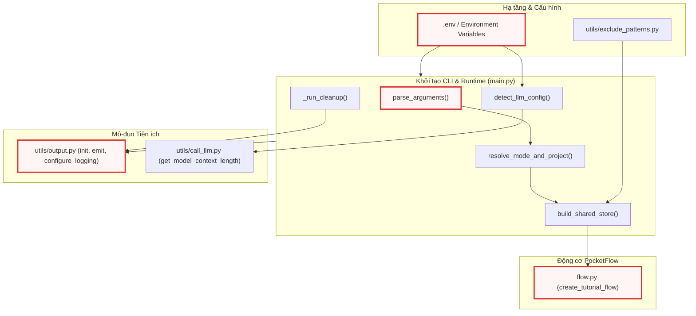

---

## 2. Cấu trúc Hạ tầng, Tiêu chuẩn Mã nguồn & Đóng gói Container

Một hệ thống tự động sinh tài liệu mã nguồn quy mô lớn đòi hỏi sự nhất quán tuyệt đối giữa môi trường phát triển cục bộ, môi trường kiểm thử CI/CD và môi trường đóng gói container.

### 2.1 Cấu hình Quản lý Mã nguồn & Linter (`pyproject.toml`, `.pre-commit-config.yaml`)
Dự án sử dụng công cụ **Ruff** thế hệ mới nhằm thay thế cho Flake8, Black và isort, giúp tối ưu hóa tốc độ kiểm tra tĩnh (static analysis) và định dạng mã nguồn.

```toml
[project]
name = "codebase-knowledge-builder"
requires-python = ">=3.10"

[tool.ruff]
line-length = 150
target-version = "py310"

# Exclude generated/vendored/docs/agent-rule files
exclude = [
    "output/",
    "__pycache__/",
    ".git/",
    "logs/",
    "docs/",
    ".clinerules/",
    ".windsurf/",
    ".agents/",
    "CLAUDE.md",
    "tests/",
    "prompts/",
]

[tool.ruff.lint]
select = [
    "E",     # pycodestyle errors (whitespace, syntax style)
    "F",     # pyflakes (unused imports, undefined names, redefined)
    "W",     # pycodestyle warnings
    "I",     # isort (import ordering)
    "UP",    # pyupgrade (modernize Python syntax)
    "B",     # flake8-bugbear (common bug patterns)
    "SIM",   # flake8-simplify (simplifiable code)
    "RUF",   # Ruff-specific rules
    "C4",    # flake8-comprehensions (unnecessary list/dict wrapping)
    "PERF",  # Perflint (performance anti-patterns)
    "FURB",  # refurb (modern Python idioms)
    "RET",   # flake8-return (consistent return patterns)
]
ignore = [
    "E402",    # module import not at top — main.py needs dotenv.load_dotenv() before env-dependent imports
    "E501",    # line too long — handled by line-length setting above
    "SIM108",  # ternary operator — readability preference
    "PERF203", # try-except-in-loop — intentional per-item error handling
    "RET504",  # unnecessary assignment before return — readability preference
]

[tool.ruff.lint.isort]
known-first-party = ["utils"]

[tool.ruff.format]
quote-style = "double"
indent-style = "space"
```

Cấu hình `pyproject.toml` thể hiện các quyết định kiến trúc cụ thể:
- **Ngưỡng độ dài dòng (`line-length = 150`)**: Được mở rộng thay vì chuẩn 88 ký tự của Black, nhằm hỗ trợ các câu lệnh prompt cấu hình phức tạp và các chuỗi định dạng logging mà không làm phân mảnh mã nguồn.
- **Bỏ qua quy tắc `E402` (Module import not at top)**: Đây là một ngoại lệ có chủ đích. Tập lệnh `main.py` bắt buộc phải gọi `dotenv.load_dotenv()` trước khi các mô-đun phụ thuộc biến môi trường (như `utils.output` hoặc `flow`) được nạp vào bộ nhớ.
- **Bỏ qua `PERF203` (try-except-in-loop)**: Các tác vụ quét tệp tin cục bộ và thu thập API cần cơ chế xử lý lỗi cục bộ cho từng tệp riêng lẻ mà không làm gián đoạn toàn bộ vòng lặp thu thập.

Quy trình kiểm soát tự động trước khi commit được thiết lập qua `.pre-commit-config.yaml`:

```yaml
repos:
  - repo: https://github.com/astral-sh/ruff-pre-commit
    # Ruff version.
    rev: v0.16.4
    hooks:
      # Run the linter with auto-fix.
      - id: ruff-check
        args: [--fix, --verbose]
        verbose: true
      # Run the formatter.
      - id: ruff-format
        args: [--verbose]
        verbose: true
```

Pipeline này đảm bảo rằng mọi thay đổi mã nguồn trước khi được ghi nhận vào Git đều tự động sửa lỗi cú pháp (`--fix`) và định dạng thống nhất theo chuẩn `double quotes` và thụt lề chuẩn.

### 2.2 Quy tắc Đánh giá Tự động (`.coderabbit.yaml`)
Hệ thống tích hợp CodeRabbit AI để đánh giá (code review) tự động trên các nhánh Pull Request. Tập tin cấu hình định nghĩa rõ ràng các vùng trọng tâm cho từng tầng trong kiến trúc:

```yaml
# CodeRabbit Configuration
# Docs: https://docs.coderabbit.ai/guides/configure-coderabbit

language: en

reviews:
  auto_review:
    enabled: true
    drafts: false
    base_branches:
      - main
  profile: assertive

  path_instructions:
    - path: "nodes.py"
      instructions: |
        This is the core pipeline — 10 PocketFlow Node classes.
        Focus on: token budget management, LLM prompt construction,
        shared store read/write patterns, and retry/cache logic.
    - path: "utils/*.py"
      instructions: |
        Utility modules. Focus on: function signatures matching
        docs/design.md Section 9 contracts, error handling, and
        edge cases in file crawling and token counting.
    - path: "prompts/**/*.md"
      instructions: |
        LLM prompt templates. Focus on: placeholder variable names
        matching the node code, instruction clarity, and whether
        the prompts could cause LLM hallucination or off-topic output.
    - path: "main.py"
      instructions: |
        CLI entry point. Focus on: argument validation, shared store
        initialization, and backward compatibility of CLI flags.

chat:
  auto_reply: true
```

Chỉ thị `path_instructions` hướng dẫn reviewer tự động kiểm tra chặt chẽ tính tương thích ngược của CLI trong `main.py`, tính chính xác của các biến giữ chỗ (`{placeholder}`) trong prompt template, và tính toàn vẹn của hợp đồng interface trong `utils/`.

### 2.3 Đóng gói Môi trường Container (`Dockerfile`)
Nhằm loại bỏ sự khác biệt giữa các hệ điều hành của lập trình viên và phục vụ triển khai trong CI/CD pipeline, hệ thống cung cấp Dockerfile chuẩn hóa:

```dockerfile
FROM python:3.10-slim

# update packages, install git and remove cache
RUN apt-get update && apt-get install -y git && rm -rf /var/lib/apt/lists/*

WORKDIR /app

COPY requirements.txt .
RUN pip install --no-cache-dir -r requirements.txt

COPY . .

ENTRYPOINT ["python", "main.py"]
```

Quy trình build tối ưu hóa layer caching:
1. Sử dụng base image `python:3.10-slim` để giảm thiểu dung lượng image.
2. Cài đặt tiện ích hệ thống `git` — phụ thuộc thiết yếu của thư viện `GitPython` khi thu thập kho lưu trữ từ xa.
3. Sao chép và cài đặt `requirements.txt` trước khi sao chép toàn bộ mã nguồn, giúp tận dụng Docker layer cache khi mã nguồn thay đổi nhưng danh sách thư viện giữ nguyên.
4. Thiết lập `ENTRYPOINT ["python", "main.py"]`, biến container thành một CLI executable trực tiếp.

---

## 3. Phân tích Chi tiết Từng Hàm & Luồng Xử lý (Function-by-Function Breakdown)

Điểm vào `main.py` được thiết kế theo nguyên tắc phân rã chức năng mô-đun (*Modular Decomposition*). Mỗi hàm chịu một trách nhiệm rõ ràng trong chuỗi khởi tạo trước khi chuyển giao quyền điều khiển cho đồ thị luồng PocketFlow.

```
                    +--------------------------------+
                    |             main()             |
                    +---------------+----------------+
                                    |
     +------------------------------+------------------------------+
     |                |             |              |               |
     v                v             v              v               v
parse_arguments()  resolve()  build_store()  detect_llm()  display_config()
```

### 3.1 Phân tích Tham số Dòng lệnh: `parse_arguments()`

Hàm `parse_arguments()` chịu trách nhiệm định nghĩa toàn bộ giao diện cờ dòng lệnh mà người dùng hoặc hệ thống CI/CD có thể truyền vào.

```python
def parse_arguments():
    """Parse and return command-line arguments."""
    parser = argparse.ArgumentParser(description="Generate a tutorial for a GitHub codebase or local directory.")

    # Source: --repo or --dir (mutually exclusive but not required if --cleanup is used)
    source_group = parser.add_mutually_exclusive_group()
    source_group.add_argument("--repo", help="URL of the public GitHub repository.")
    source_group.add_argument("--dir", help="Path to local directory.")
    parser.add_argument("--cleanup", action="store_true", help="Clean up logs and cache files. Can be used standalone or after a run.")

    parser.add_argument("-n", "--name", help="Project name (optional, derived from repo/directory if omitted).")
    parser.add_argument("-t", "--token", help="GitHub personal access token (optional, reads from GITHUB_TOKEN env var if not provided).")
    parser.add_argument("-o", "--output", default="output", help="Base directory for output (default: ./output).")
    parser.add_argument("-i", "--include", nargs="+", help="Files to include (e.g., '*.py' '*.js'). Defaults to '*' (all files).")
    parser.add_argument(
        "-e",
        "--exclude",
        nargs="+",
        help="Files to exclude. Custom patterns are automatically merged with a massive global exclusion list (build caches, node_modules, binaries, media, AI environments) AND your repository's native .gitignore rules.",
    )
    parser.add_argument("-s", "--max-size", type=int, default=200000, help="Maximum file size in bytes (default: 200000, about 200KB).")
    # ...
```

Phần đầu của hàm thiết lập nhóm tham số nguồn dữ liệu bằng `add_mutually_exclusive_group()`. Cơ chế này ngăn chặn người dùng kích hoạt đồng thời cả `--repo` (thu thập từ xa) và `--dir` (quét thư mục cục bộ). Đồng thời, các tham số như `--include` và `--exclude` được cấu hình `nargs="+"`, cho phép người dùng truyền danh sách nhiều mẫu globbing phân cách bởi khoảng trắng.

Tiếp theo, hàm đăng ký các tham số điều khiển hành vi của LLM, chế độ tạo tài liệu và các cơ chế xử lý lô (batching):

```python
    # ...
    # Add language parameter for multi-language support
    parser.add_argument("--language", default="english", help="Language for the generated tutorial (default: english).")
    # Add use_cache parameter to control LLM caching
    parser.add_argument("--no-cache", action="store_true", help="Disable LLM response caching (default: caching enabled).")
    # Add max_abstraction_num parameter to control the number of abstractions
    parser.add_argument("--max-abstractions", type=int, default=10, help="Maximum number of abstractions to identify (default: 10).")
    # Add thinking_level parameter for LLM reasoning capabilities
    parser.add_argument(
        "--thinking-level",
        default=None,
        help="Thinking effort level for native Gemini, OpenRouter, and Ollama reasoning models (e.g., low, medium, high). Leave empty to use model defaults.",
    )
    # Add max_tokens parameter
    parser.add_argument(
        "--max-tokens", type=int, default=None, help="Maximum number of tokens for the context window (default: fetched dynamically)."
    )

    # --- Documentation Mode & Generation Styles ---
    parser.add_argument(
        "--mode",
        choices=["tutorial", "advanced", "api-reference", "sdk"],
        default="tutorial",
        help="Documentation style (tutorial, advanced, api-reference, sdk). (default: tutorial).",
    )
    parser.add_argument("--advanced", action="store_true", help="Legacy flag: equivalent to --mode advanced.")
    parser.add_argument("--mkdocs", action="store_true", help="Format output for MkDocs Material (adds YAML frontmatter & nav snippet).")
    parser.add_argument(
        "--incremental",
        action="store_true",
        help="Enable MD5 incremental caching to skip unchanged modules (Only supported in --mode api-reference).",
    )
    parser.add_argument(
        "--force-rebuild", action="store_true", help="Clear incremental cache and regenerate all chapters from scratch (use with --incremental)."
    )

    # Add batching parameters
    parser.add_argument("--batch", type=int, default=50, help="Maximum files per batch when using map-reduce mode (default: 50).")
    parser.add_argument("--force-batch", action="store_true", help="Force map-reduce mode regardless of context size.")
    # Debug mode
    parser.add_argument("--debug", action="store_true", help="Enable verbose debug output.")

    return parser, parser.parse_args()
```

Cấu hình tham số tại đoạn mã trên cho thấy một số kỹ thuật thiết kế quan trọng:
- **Tương thích ngược (Backward Compatibility)**: Cờ `--advanced` vẫn được duy trì song song với `--mode advanced` để không làm đứt gãy các tập lệnh tự động hóa cũ của người dùng.
- **Tính toán động vs Ghi đè thủ công**: Tham số `--max-tokens` mặc định là `None`, cho phép hệ thống tự động phát hiện kích thước cửa sổ ngữ cảnh thực tế của model thông qua API metadata, trừ khi người dùng chủ động ép buộc một giá trị cụ thể.
- **Tách bạch đối tượng phân tích cú pháp**: Hàm trả về cả `parser` và `args` (dưới dạng một tuple `(parser, parser.parse_args())`), giúp hàm điều phối `main()` có thể chủ động gọi `parser.error(...)` khi xảy ra lỗi logic nghiệp vụ mà không cần tái tạo parser.

### 3.2 Phân giải Chế độ Tài liệu & Định danh Dự án: `resolve_mode_and_project()`

Hàm `resolve_mode_and_project()` chuẩn hóa chế độ thực thi và tự động trích xuất tên dự án nếu người dùng không truyền cờ `--name` tường minh.

```python
def resolve_mode_and_project(args):
    """Resolve documentation mode (handling --advanced legacy flag) and derive project name.

    Returns:
        tuple[str, str]: (mode, project_name)
    """
    mode = "advanced" if args.advanced else args.mode
    project_name = args.name
    if not project_name:
        if args.dir:
            project_name = os.path.basename(os.path.abspath(args.dir))
        elif args.repo:
            project_name = args.repo.rstrip("/").split("/")[-1]
        else:
            project_name = "project"
    return mode, project_name
```

Luồng logic của hàm xử lý các trường hợp biên:
1. Nếu cờ kế thừa `args.advanced` mang giá trị `True`, nó sẽ ưu tiên ghi đè chế độ thành `"advanced"`, bất kể giá trị của `args.mode`.
2. Nếu `project_name` bị bỏ trống (`None`), hàm sẽ:
   - Với nguồn thư mục cục bộ (`args.dir`): Sử dụng `os.path.abspath()` để giải quyết triệt để các đường dẫn tương đối (như `.`, `..`, `./src`) trước khi lấy tên thư mục cuối cùng bằng `os.path.basename()`.
   - Với nguồn kho lưu trữ Git (`args.repo`): Loại bỏ ký tự gạch chéo cuối (`rstrip("/")`) và tách chuỗi URL để lấy phần định danh cuối cùng của repository (ví dụ `https://github.com/facebook/react` $\rightarrow$ `react`).
   - Trường hợp dự phòng (fallback) khi chỉ chạy tác vụ dọn dẹp: Đặt tên mặc định là `"project"`.

### 3.3 Tự động Phát hiện & Đàm phán Cấu hình LLM: `detect_llm_config()`

Hệ thống hỗ trợ đa nhà cung cấp mô hình ngôn ngữ (Google Gemini, OpenRouter, Ollama). Hàm `detect_llm_config()` có nhiệm vụ phân giải nhà cung cấp đang hoạt động và xác định giới hạn token ngữ cảnh.

```python
def detect_llm_config(args):
    """Detect LLM provider, model, endpoint, and context length from environment.

    Returns:
        tuple: (provider, model_name, endpoint_url, api_key, context_length)
    """
    from utils.call_llm import get_model_context_length

    provider = os.environ.get("LLM_PROVIDER")
    if provider:
        model_name = os.environ.get(f"{provider}_MODEL", "unknown")
        endpoint_url = os.environ.get(f"{provider}_BASE_URL", "unknown")
        api_key = os.environ.get(f"{provider}_API_KEY", "")
    else:
        # Fallback to Gemini if neither provider is explicitly set but it's used
        if os.environ.get("GEMINI_PROJECT_ID") or os.environ.get("GEMINI_API_KEY"):
            provider = "GEMINI"
            model_name = os.environ.get("GEMINI_MODEL", "gemini-3.7-flash")
            endpoint_url = "generativelanguage.googleapis.com"
            api_key = os.environ.get("GEMINI_API_KEY", "")
        else:
            provider = "UNKNOWN"
            model_name = "unknown"
            endpoint_url = "unknown"
            api_key = ""

    context_length = args.max_tokens or get_model_context_length(endpoint_url, model_name, api_key)
    return provider, model_name, endpoint_url, api_key, context_length
```

Cơ chế phân giải hoạt động theo mô hình phân cấp (Hierarchical Fallback):
- **Phân cấp 1 (Tường minh)**: Nếu biến `LLM_PROVIDER` được định nghĩa (ví dụ `OPENROUTER` hoặc `OLLAMA`), hệ thống tự động suy luận tiền tố biến môi trường tương ứng: `{PROVIDER}_MODEL`, `{PROVIDER}_BASE_URL`, và `{PROVIDER}_API_KEY`.
- **Phân cấp 2 (Mặc định Gemini)**: Nếu `LLM_PROVIDER` không được đặt nhưng phát hiện sự tồn tại của `GEMINI_API_KEY` hoặc `GEMINI_PROJECT_ID`, hệ thống tự động kích hoạt cấu hình Gemini với model mặc định là `gemini-3.7-flash`.
- **Phân định Context Window**: Giá trị `context_length` được ưu tiên lấy từ cờ ghi đè `args.max_tokens`. Nếu không có, hàm sẽ gọi `get_model_context_length(endpoint_url, model_name, api_key)` từ `utils.call_llm` để truy vấn kích thước ngữ cảnh được tối ưu hóa cho model đó.

### 3.4 Xây dựng Kho Lưu Trữ Dùng Chung: `build_shared_store()`

Kho lưu trữ dùng chung (*Shared Store*) là trung tâm dữ liệu được truyền xuyên suốt đồ thị PocketFlow. Hàm `build_shared_store()` khởi tạo và cấu trúc hóa từ điển này theo đúng hợp đồng thiết kế.

```python
def build_shared_store(args, github_token, mode):
    """Construct the shared store dictionary passed between PocketFlow nodes.

    Returns:
        dict: The shared store with all CLI args, patterns, and empty output slots.
    """
    return {
        "repo_url": args.repo,
        "local_dir": args.dir,
        "project_name": args.name,  # Can be None, FetchRepo will derive it
        "github_token": github_token,
        "output_dir": args.output,  # Base directory for CombineTutorial output
        # Include/exclude patterns and max file size
        "include_patterns": set(args.include) if args.include else DEFAULT_INCLUDE_PATTERNS,
        "exclude_patterns": DEFAULT_EXCLUDE_PATTERNS.union(set(args.exclude)) if args.exclude else DEFAULT_EXCLUDE_PATTERNS,
        "max_file_size": args.max_size,
        # Language for multi-language support
        "language": args.language,
        # Cache flag (inverse of no-cache)
        "use_cache": not args.no_cache,
        # Max abstractions
        "max_abstraction_num": args.max_abstractions,
        # LLM reasoning capabilities
        "thinking_level": args.thinking_level,
        # Max tokens override
        "max_tokens": args.max_tokens,
        # Mode, mkdocs, and incremental
        "mode": mode,
        "mkdocs": args.mkdocs,
        "incremental": args.incremental,
        "advanced_mode": mode == "advanced",
        # Batching settings
        "batch_size": args.batch,
        "force_batch": args.force_batch,
        # Debug mode
        "debug": args.debug,
        # Outputs populated by downstream nodes
        "files": [],
        "abstractions": [],
        "relationships": {},
        "chapter_order": [],
        "chapters": [],
        "final_output_dir": None,
    }
```

Một số lưu ý quan trọng về thiết kế trong Shared Store:
- **Hợp nhất Mẫu Loại trừ (Pattern Union)**: `exclude_patterns` luôn được tính toán bằng phép hợp tập hợp (`DEFAULT_EXCLUDE_PATTERNS.union(...)`). Điều này đảm bảo rằng dù người dùng truyền vào các mẫu loại trừ tùy biến thông qua cờ `-e/--exclude`, các danh mục nhị phân, cache, file tạm, thư viện môi trường máy ảo và các tệp nhạy cảm định nghĩa trong `utils/exclude_patterns.py` sẽ **không bao giờ** bị quét nhầm.
- **Cấp phát trước các Khe Đầu ra (Output Slots)**: Các khóa dữ liệu như `files`, `abstractions`, `relationships`, `chapter_order`, và `chapters` được khởi tạo sẵn với kiểu dữ liệu rỗng (`[]` hoặc `{}`). Điều này giúp các Node kế tiếp có thể đọc hoặc ghi đè mà không gây ra ngoại lệ `KeyError`.
- **Cờ logic suy diễn**: `use_cache` được đảo ngược logic từ `not args.no_cache`, và `advanced_mode` được suy diễn từ `mode == "advanced"` để duy trì tính tương thích với các Node cũ.

### 3.5 Hiển thị Cấu hình & Quốc tế hóa UI: `display_config()`

Trước khi bắt đầu thực thi đồ thị xử lý, toàn bộ cấu hình đã phân giải được in ra console nhằm phục vụ mục đích kiểm tra và ghi log.

```python
def display_config(args, mode, provider, model_name, endpoint_url, context_length, log_file):
    """Emit all configuration values to the console."""
    emit("START_GENERATION", source=args.repo or args.dir, language=args.language.capitalize())
    emit("CFG_HEADER")
    emit("CFG_AI_PROVIDER", value=provider)
    emit("CFG_AI_ENDPOINT", value=endpoint_url)
    emit("CFG_AI_MODEL", value=model_name)
    emit("CFG_CONTEXT_LENGTH", value=f"{context_length:,}")
    emit("CFG_THINKING_LEVEL", value=args.thinking_level or "None")
    emit("CFG_BATCH_SIZE", value=f"{args.batch}")
    _enabled = get("CFG_VALUE_ENABLED")
    _disabled = get("CFG_VALUE_DISABLED")
    emit("CFG_FORCE_BATCH", value=_enabled if args.force_batch else _disabled)
    emit("CFG_OUTPUT_MODE", value=mode)
    emit("CFG_MKDOCS", value=_enabled if args.mkdocs else _disabled)
    emit("CFG_INCREMENTAL", value=_enabled if args.incremental else _disabled)
    if args.incremental:
        emit("CFG_FORCE_REBUILD", value=_enabled if args.force_rebuild else _disabled)
    if mode == "api-reference":
        emit("CFG_MAX_ABSTRACTIONS", value=get("CFG_VALUE_API_REF_MAX"))
    else:
        emit("CFG_MAX_ABSTRACTIONS", value=str(args.max_abstractions))
    emit("CFG_LLM_CACHING", value=_disabled if args.no_cache else _enabled)
    if args.debug:
        emit("CFG_DEBUG_MODE")
    emit("CFG_LOG_FILE", value=log_file)
    print()  # Blank line after config block
```

Tuân thủ nghiêm ngặt quy tắc kiến trúc của dự án, hàm `display_config()` **hoàn toàn không chứa các chuỗi giao diện người dùng hardcoded** và không trực tiếp sử dụng mã màu ANSI. Thay vào đó, toàn bộ việc định dạng, màu sắc và dịch thuật đa ngôn ngữ được ủy quyền cho hàm `emit()` và `get()` từ `utils.output`, sử dụng bảng từ điển chuỗi `utils/strings.csv`.

### 3.6 Cơ chế Dọn dẹp Tài nguyên & Cache: `_run_cleanup()`

Hàm `_run_cleanup()` chịu trách nhiệm giải phóng không gian lưu trữ và xóa các tệp cache/log khi có yêu cầu.

```python
def _run_cleanup():
    """Clean up cache files and log directory."""
    import shutil

    emit("CLEANUP_START")

    for cache_path in ["llm_cache.json"]:
        if os.path.exists(cache_path):
            try:
                os.remove(cache_path)
                emit("CLEANUP_REMOVED", path=cache_path)
            except Exception as e:
                emit("CLEANUP_FAILED", path=cache_path, error=e)

    log_dir = os.environ.get("LOG_DIR", "logs")
    if os.path.exists(log_dir) and os.path.isdir(log_dir):
        try:
            shutil.rmtree(log_dir)
            emit("CLEANUP_REMOVED_DIR", path=log_dir)
        except Exception as e:
            emit("CLEANUP_FAILED", path=log_dir, error=e)
```

Hàm này được thiết kế để có thể chạy độc lập (khi người dùng chỉ truyền cờ `--cleanup`) hoặc chạy như một bước dọn dẹp hậu kỳ (post-run cleanup) sau khi quy trình sinh tài liệu hoàn tất. Cơ chế xử lý sử dụng khối `try-except` độc lập cho từng mục tiêu xóa nhằm đảm bảo nếu việc xóa cache LLM gặp sự cố quyền truy cập (permission denied), hệ thống vẫn tiếp tục nỗ lực xóa thư mục logs mà không bị crash đột ngột.

### 3.7 Điều phối Thực thi Điểm vào: `main()`

Hàm `main()` là hàm điều phối chính kết nối toàn bộ các hàm thành phần kể trên thành một luồng thực thi hoàn chỉnh.

Do `main()` quản lý toàn bộ vòng đời khởi động, chúng ta phân tích nó qua 2 giai đoạn logic:

#### Giai đoạn 1: Khởi tạo, Kiểm tra Ràng buộc & Xử lý Cache Tăng dần

```python
def main():
    parser, args = parse_arguments()
    init_output(
        language=args.language,
        use_cache=not args.no_cache,
        thinking_level=args.thinking_level,
    )

    # Handle standalone --cleanup (no --dir or --repo)
    if args.cleanup and not args.dir and not args.repo:
        _run_cleanup()
        return

    # Require --dir or --repo for generation
    if not args.dir and not args.repo:
        parser.error("one of the arguments --repo --dir --cleanup is required")

    # Get GitHub token from argument or environment variable if using repo
    github_token = None
    if args.repo:
        github_token = args.token or os.environ.get("GITHUB_TOKEN")
        if not github_token:
            emit("WARN_NO_GITHUB_TOKEN")

    mode, project_name = resolve_mode_and_project(args)

    # Enforce incremental cache constraints
    if args.incremental and mode != "api-reference":
        emit("WARN_INCREMENTAL_API_ONLY")
        args.incremental = False

    # Handle --force-rebuild: delete the cache manifest to force fresh generation
    if args.force_rebuild and args.incremental:
        output_base = args.output or "output"
        manifest_path = os.path.join(output_base, project_name, ".doc_cache_manifest.json")
        if os.path.exists(manifest_path):
            os.remove(manifest_path)
            emit("FORCE_REBUILD_DELETED", path=manifest_path)
        else:
            emit("FORCE_REBUILD_NO_MANIFEST", path=manifest_path)
    elif args.force_rebuild and not args.incremental:
        emit("WARN_FORCE_REBUILD_NO_INCREMENTAL")
```

Trong giai đoạn đầu, hệ thống thực hiện khởi tạo hệ thống xuất nhập `init_output` dựa trên ngôn ngữ chỉ định. Nếu cờ `--cleanup` được gọi đơn lẻ, nó thực thi dọn dẹp và thoát ngay lập tức. Nếu chạy luồng sinh tài liệu, hệ thống xác thực sự hiện diện của `--repo` hoặc `--dir`. 

Đặc biệt, hệ thống kiểm soát chặt chẽ tính hợp lệ của cờ `--incremental`: chế độ cache tăng dần MD5 hiện chỉ được hỗ trợ trong `--mode api-reference`. Nếu người dùng bật cờ này ở các chế độ khác, hệ thống sẽ phát cảnh báo `WARN_INCREMENTAL_API_ONLY` và tự động tắt cờ. Đối với cờ `--force-rebuild`, hệ thống chủ động tìm và xóa tệp `.doc_cache_manifest.json` trong thư mục đầu ra của dự án để buộc các node downstream tái tạo tài liệu từ đầu.

#### Giai đoạn 2: Xây dựng Store, Khởi tạo Logging & Kích hoạt Flow

```python
    # ...
    shared = build_shared_store(args, github_token, mode)
    provider, model_name, endpoint_url, _, context_length = detect_llm_config(args)
    log_file = configure_logging(project_name=project_name, mode=mode)
    display_config(args, mode, provider, model_name, endpoint_url, context_length, log_file)

    # Create and run the flow
    tutorial_flow = create_tutorial_flow()
    tutorial_flow.run(shared)

    # Cleanup after run if requested
    if args.cleanup:
        _run_cleanup()


if __name__ == "__main__":
    main()
```

Ở giai đoạn cuối, sau khi `build_shared_store()` và `detect_llm_config()` hoàn tất việc đóng gói trạng thái, hệ thống kích hoạt cấu hình ghi log ra tệp chuyên biệt (`configure_logging`) và hiển thị bảng thông số qua `display_config`. 

Sau đó, hàm triệu gọi `create_tutorial_flow()` từ `flow.py` để tạo đồ thị luồng xử lý của PocketFlow và truyền đối tượng `shared` vào phương thức `run()`. Nếu người dùng chỉ định cờ `--cleanup` đồng thời với tác vụ sinh tài liệu, hàm `_run_cleanup()` sẽ được kích hoạt ở bước cuối cùng sau khi đồ thị thực thi xong hoàn toàn.

---

## 4. Sơ đồ Luồng Thực thi & Vòng đời Trạng thái (Execution Flow & Lifecycle State Diagrams)

Để hình dung trực quan cách thức dữ liệu chuyển động từ khi người dùng gõ lệnh cho đến khi PocketFlow tiếp nhận quyền điều khiển, chúng ta xem xét hai sơ đồ dưới đây.

### 4.1 Sơ đồ Phân nhánh & Quyết định Khởi tạo (`flowchart TD`)

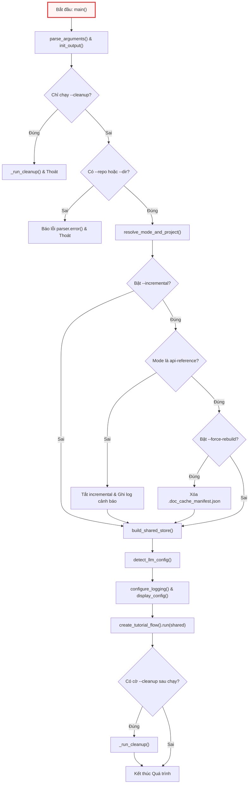

### 4.2 Sơ đồ Tuần tự Tương tác giữa các Thành phần (`sequenceDiagram`)

Sơ đồ tuần tự minh họa sự cộng tác giữa CLI Facade, Hệ thống Tệp, Biến Môi trường và Động cơ Luồng:

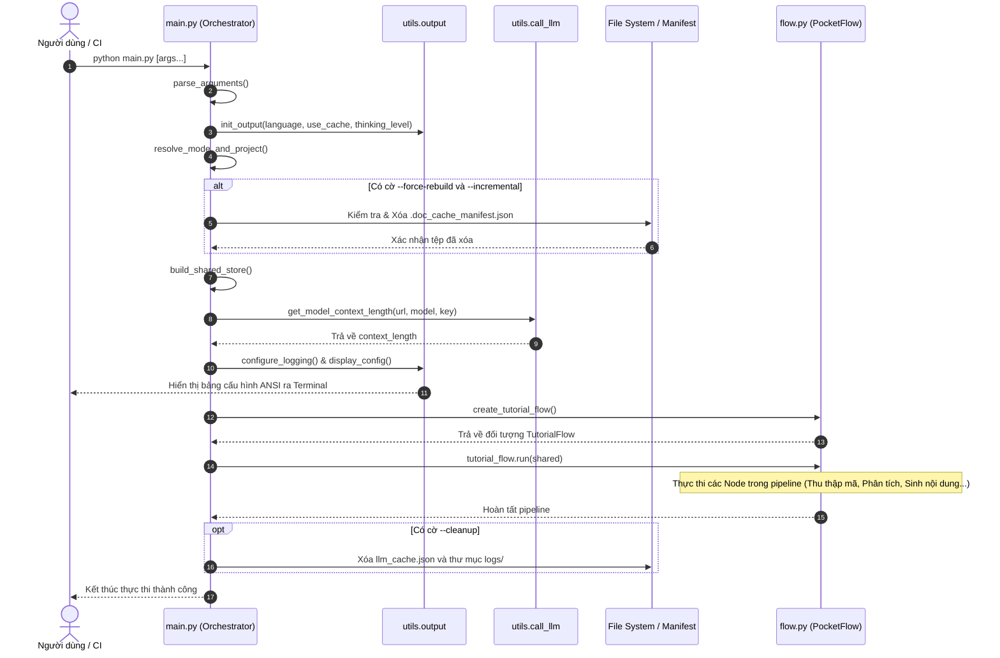

---

## 5. Các Ràng buộc Hệ thống, Concurrency & Xử lý Bộ nhớ

Khi xây dựng và bảo trì tầng khởi tạo runtime, các kỹ sư cần nắm rõ các đặc tính và ràng buộc hệ thống sau:

### 5.1 Mô hình Luồng & Xử lý Đồng thời (Concurrency Model)
- `main.py` hoạt động trên tiến trình đơn (**Single-threaded Process**). Quá trình khởi tạo, đọc biến môi trường, phân tích cú pháp CLI và xây dựng Shared Store diễn ra hoàn toàn tuần tự.
- Khi `tutorial_flow.run(shared)` được gọi, các `BatchNode` của PocketFlow (sẽ được tìm hiểu chi tiết ở các chương sau) có thể thực thi các tác vụ gọi API song song hoặc phân lô (batching). Do đó, đối tượng `shared` (từ điển Python) được truyền qua tham chiếu (**pass-by-reference**).
- *Quy tắc An toàn Dữ liệu*: Tầng khởi tạo `main.py` chỉ cấp phát cấu trúc khung. Các Node nghiệp vụ bên dưới không được phép xóa (delete) hoặc thay đổi kiểu dữ liệu (re-type) của các khóa cấu hình cốt lõi trong `shared`, mà chỉ được phép đọc cấu hình và ghi dữ liệu bổ sung vào các khe đầu ra đã được cấp phát sẵn (`files`, `abstractions`, `chapters`, ...).

### 5.2 Quản lý Bộ nhớ & Giới hạn Kích thước Tệp (Memory Footprint)
- Tham số `--max-size` (mặc định 200,000 bytes ~ 200KB) được thiết lập tại `main.py` đóng vai trò là chốt chặn an toàn vòng ngoài (**Safety Gatekeeper**). Bộ thu thập tệp tin sẽ dựa vào giá trị này trong Shared Store để bỏ qua ngay lập tức các tệp mã nguồn quá lớn, ngăn ngừa rủi ro cạn kiệt bộ nhớ RAM khi đọc các file bundle minified hoặc dữ liệu nhị phân kích thước lớn.
- Biến `use_cache` điều khiển cơ chế lưu trữ phản hồi LLM vào tệp `llm_cache.json` trên ổ đĩa. Khi xử lý các kho mã nguồn khổng lồ, kỹ sư có thể sử dụng cờ `--cleanup` để giải phóng dung lượng đĩa cứng sau khi hoàn thành.

---

## 6. Hướng dẫn Thực tế Dành cho Thành viên Mới (Practical Notes for New Team Members)

Phần này cung cấp các hướng dẫn cụ thể giúp các kỹ sư mới nhanh chóng làm quen và gỡ lỗi hệ thống.

### 6.1 Vị trí Cấu hình & Biến Môi trường Quan Trọng

Để kích hoạt hệ thống, bạn cần tạo tệp `.env` tại thư mục gốc dự án dựa trên mẫu sau:

```bash
# 1. Cấu hình mặc định Google Gemini (Khuyến nghị)
GEMINI_API_KEY="your-gemini-api-key-here"
GEMINI_MODEL="gemini-3.7-flash"

# 2. Hoặc Cấu hình OpenRouter (Nếu sử dụng Claude 3.7 / OpenAI O1)
LLM_PROVIDER="OPENROUTER"
OPENROUTER_API_KEY="your-openrouter-key"
OPENROUTER_BASE_URL="https://openrouter.ai/api/v1"
OPENROUTER_MODEL="anthropic/claude-3.7-sonnet"

# 3. Hoặc Cấu hình Ollama Cục bộ (Local LLM)
LLM_PROVIDER="OLLAMA"
OLLAMA_BASE_URL="http://localhost:11434"
OLLAMA_MODEL="deepseek-r1:14b"

# 4. Token truy cập GitHub (Dành cho kho mã nguồn private hoặc tránh rate limit)
GITHUB_TOKEN="ghp_yourPersonalAccessTokenHere"

# 5. Cấu hình đường dẫn thư mục Log (Tùy chọn)
LOG_DIR="logs"
```

### 6.2 Điểm Ngắt Gỡ Lỗi (Debugging Entry Points)

Khi gặp sự cố trong quá trình khởi động ứng dụng, hãy đặt breakpoint tại các vị trí chiến lược sau trong `main.py`:

| Tập tin / Hàm | Vị trí Breakpoint | Mục đích Kiểm tra |
|---|---|---|
| `main.py:parse_arguments()` | Dòng `return parser, parser.parse_args()` | Kiểm tra các cờ người dùng truyền vào đã được chuyển đổi đúng kiểu dữ liệu (`int`, `bool`, `list`) chưa. |
| `main.py:detect_llm_config()` | Dòng `context_length = args.max_tokens or ...` | Xác minh xem API key có nạp thành công từ `.env` không và kích thước `context_length` đàm phán được là bao nhiêu. |
| `main.py:build_shared_store()` | Dòng `return { ... }` | Kiểm tra tập hợp các mẫu `exclude_patterns` đã bao gồm cả mẫu tùy biến lẫn mẫu mặc định chưa. |
| `main.py:main()` | Dòng `tutorial_flow.run(shared)` | Kiểm tra toàn bộ trạng thái cuối cùng của Shared Store ngay trước khi kích hoạt Node đầu tiên. |

### 6.3 Các Điểm Kỳ Dị Kỹ Thuật & Nợ Công Nghệ (Known Quirks & Tech Debt)

1. **Thứ tự Import và Cảnh báo Linter `E402`**:
   - `dotenv.load_dotenv()` bắt buộc phải được gọi ở đầu `main.py`, ngay trước khi import `utils.output` và `flow`. Điều này là do một số mô-đun phụ thuộc trực tiếp vào các biến môi trường được nạp tại thời điểm khởi tạo package. Linter Ruff đã được cấu hình tường minh để bỏ qua lỗi `E402` cho tệp này.
2. **Ép kiểu Dữ liệu Tập hợp (Set vs List) trong Pattern Matching**:
   - `include_patterns` và `exclude_patterns` trong Shared Store được lưu dưới dạng `set` để tối ưu hóa hiệu năng kiểm tra phần tử ($O(1)$) khi quét hàng ngàn tệp tin. Tuy nhiên, khi truyền từ CLI qua `argparse`, chúng là `list`. Hàm `build_shared_store()` bắt buộc phải bọc `set(args.include)` để tránh lỗi kiểu dữ liệu ở các tầng sau.
3. **Sự phụ thuộc Ngầm của `project_name`**:
   - Nếu `--name` không được truyền, `resolve_mode_and_project()` sẽ suy diễn tên dự án từ URL hoặc thư mục. Tuy nhiên, nếu nguồn là `--repo`, tên chính xác thực tế của repository đôi khi chỉ được xác định chắc chắn sau khi `FetchRepo` clone kho về. Do đó, Shared Store chấp nhận `project_name: None` ban đầu và cho phép `FetchRepo` ghi đè lại sau.

### 6.4 Lưu ý Khi Tạo Pull Request & Code Review

Khi thực hiện các thay đổi liên quan đến CLI và hạ tầng khởi tạo, hãy luôn tuân thủ các quy tắc kiểm tra:

1. **Không phá vỡ hợp đồng CLI**: Nếu thêm tham số CLI mới, luôn cung cấp giá trị `default` hợp lý và cập nhật tài liệu `README.md` ở cả hai phần ngôn ngữ (English & Tiếng Việt).
2. **Không hardcode chuỗi thông báo**: Tất cả chuỗi hiển thị console mới phải được thêm vào tệp `utils/strings.csv` kèm theo mã khóa (`STRING_KEY`) và gọi thông qua `emit("STRING_KEY", ...)` trong `utils.output`.
3. **Kiểm tra cú pháp tự động**: Trước khi gửi PR, hãy chạy lệnh sau để xác minh toàn bộ các tệp Python đều vượt qua bộ phân tích cú pháp AST:
   ```bash
   python -c "import ast; [ast.parse(open(f).read()) for f in ['main.py','flow.py','nodes.py','utils/call_llm.py','utils/crawl_local_files.py','utils/crawl_github_files.py','utils/token_utils.py','utils/output.py','utils/exclude_patterns.py','utils/prompts.py']]; print('All files pass syntax check')"
   ```

---

## 7. Tổng kết Kỹ thuật & Bước Tiếp Theo

Trong chương này, chúng ta đã phân tích chi tiết nền tảng hạ tầng và điểm vào của hệ thống **Codebase Knowledge Builder**:
- **Cấu hình & Tiêu chuẩn**: Cách thức dự án sử dụng `pyproject.toml`, `Dockerfile`, `.pre-commit-config.yaml` và `.coderabbit.yaml` để duy trì chất lượng mã nguồn và môi trường đồng nhất.
- **Phân giải Tham số & Cấu hình Runtime**: Luồng hoạt động của `main.py` từ việc phân tích cờ CLI qua `parse_arguments()`, chuẩn hóa chế độ tài liệu qua `resolve_mode_and_project()`, đến việc tự động phát hiện thông số LLM qua `detect_llm_config()`.
- **Mô hình Trạng thái Khởi tạo**: Cấu trúc của đối tượng *Shared Store* — huyết mạch dữ liệu liên kết CLI Facade với động cơ thực thi PocketFlow.

Sau khi hệ thống khởi tạo hoàn tất và Shared Store được thiết lập đầy đủ thông số cấu hình, bước tiếp theo trong pipeline là nạp mã nguồn từ hệ thống tệp cục bộ hoặc tải kho lưu trữ từ xa qua GitHub API, đồng thời áp dụng các bộ lọc chuyên sâu để loại bỏ nhiễu.

Mời bạn tiếp tục tìm hiểu cơ chế này tại [Chương 2: Hệ thống Thu thập & Lọc Mã nguồn Đa nguồn](02_hệ_thống_thu_thập___lọc_mã_nguồn_đa_nguồn.md).


---

<a id="chapter-2"></a>

# Chapter 2: Hệ thống Thu thập & Lọc Mã nguồn Đa nguồn

Tiếp nối kiến trúc khởi tạo CLI, đàm phán cấu hình runtime và thiết lập `Shared Store` đã được trình bày chi tiết tại [Chapter 1: Khởi tạo CLI, Cấu hình Runtime & Hạ tầng Dự án](01_khởi_tạo_cli__cấu_hình_runtime___hạ_tầng_dự_án.md), quy trình xử lý của hệ thống chuyển tiếp sang bước quan trọng tiếp theo: nạp dữ liệu mã nguồn thô vào bộ nhớ. Đây là giai đoạn thực thi của node `FetchRepo`, nơi dữ liệu từ hệ thống tệp cục bộ hoặc các kho lưu trữ từ xa (GitHub) được thu thập, phân loại, lọc bỏ rác và chuẩn hóa thành một cấu trúc dữ liệu duy nhất để phục vụ các tầng phân tích AST và LLM hạ nguồn.

Chương này đi sâu vào kiến trúc và chi tiết hiện thực của **Hệ thống Thu thập & Lọc Mã nguồn Đa nguồn** (Data Ingestion & Filtering Layer), phân tích cách hệ thống kết hợp các mẫu thiết kế hướng đối tượng, thuật toán duyệt cây thư mục đơn lượt, cơ chế phân tích `.gitignore` đa tầng và các chốt chặn an toàn bộ nhớ.

---

## 1. Tổng quan Kiến trúc (Technical Overview)

### 1.1. Vai trò Kiến trúc (Architectural Role)

Hệ thống Thu thập & Lọc Mã nguồn đóng vai trò là Tầng Nhập liệu Dữ liệu (Data Ingestion Layer) trong toàn bộ pipeline. Nhiệm vụ tối thượng của tầng này là chuyển đổi các nguồn mã nguồn không đồng nhất—bao gồm thư mục cục bộ trên đĩa cứng, kho lưu trữ GitHub truy xuất qua REST API, hoặc kho lưu trữ Git truy xuất qua giao thức SSH—thành một biểu diễn phẳng chuẩn hóa trong bộ nhớ dưới dạng:

```python
{"files": {filepath: content}}
```

```
+-------------------------------------------------------------------------------+
|                       DATA INGESTION LAYER BOUNDARY                           |
|                                                                               |
|   +-------------------+  +--------------------+  +------------------------+   |
|   | Local Filesystem  |  |  GitHub REST API   |  |   Remote Git via SSH   |   |
|   | (os.walk single)  |  | (Tree/Blob/Raw API)|  |  (Temporary Git Clone) |   |
|   +---------+---------+  +---------+----------+  +-----------+------------+   |
|             |                      |                         |                |
|             +----------------------+-------------------------+                |
|                                    |                                          |
|                                    v                                          |
|                 +--------------------------------------+                      |
|                 | 6-Stage Multi-Tier Filtering Pipeline|                      |
|                 +--------------------------------------+                      |
|                                    |                                          |
|                                    v                                          |
|                 +--------------------------------------+                      |
|                 | Standard In-Memory Dict Contract     |                      |
|                 | {"files": {filepath: file_content}}  |                      |
|                 +--------------------------------------+                      |
+------------------------------------+------------------------------------------+
                                     |
                                     v
                  [Downstream AST & LLM Context Nodes]
```

Nếu thành phần này không tồn tại hoặc được thiết kế sơ sài, toàn bộ hệ thống sẽ phải đối mặt với các rủi ro kỹ thuật nghiêm trọng:
1. **Tràn bộ nhớ và cạn kiệt Context Window**: Việc vô tình đọc các tệp nhị phân (`.png`, `.exe`, `.pyc`), các thư mục thư viện bên thứ ba (`node_modules`, `.venv`), hoặc các tệp lockfile khổng lồ (`package-lock.json`, `Cargo.lock`) sẽ làm bùng nổ dung lượng token, dẫn đến vượt ngưỡng context window của LLM hoặc gây lỗi `OutOfMemoryError` tại runtime.
2. **Nghẽn băng thông và Rate Limit HTTP**: Việc duyệt đệ quy kho lưu trữ từ xa mà không có chiến lược caching, né tránh rate limit (HTTP 429/403) và tải payload tối ưu sẽ làm tê liệt pipeline khi làm việc với các repository quy mô lớn.
3. **Rò rỉ bí mật và dữ liệu nhạy cảm**: Nếu không tuân thủ nghiêm ngặt chuẩn loại trừ `.gitignore` và các tệp môi trường (`.env`), hệ thống có thể vô tình đưa các token API, khóa bí mật hoặc mã nguồn nhạy cảm vào prompt của mô hình ngôn ngữ.

### 1.2. Mẫu Thiết kế (Design Patterns)

Kiến trúc của thành phần ingestion được xây dựng dựa trên hai mẫu thiết kế chính:

*   **Strategy Pattern (Mẫu Chiến lược)**: Tách biệt hoàn toàn hành vi thu thập dữ liệu thành các chiến lược độc lập dựa trên giao thức và nguồn dữ liệu:
    *   `crawl_local_files`: Chiến lược quét trực tiếp hệ thống tệp cục bộ.
    *   `crawl_github_files` (nhánh SSH): Chiến lược phân nhánh sử dụng `gitpython` để clone tạm thời kho lưu trữ vào thư mục ẩn `tempfile.TemporaryDirectory()`.
    *   `crawl_github_files` (nhánh REST API): Chiến lược duyệt cây đối tượng GitHub API (`/trees`, `/contents`) có tích hợp khả năng tự động nghỉ chờ khi chạm ngưỡng rate limit.
*   **Filter Chain Pattern (Chuỗi Bộ lọc Đa cấp)**: Quy trình đánh giá tệp và thư mục được tổ chức thành một chuỗi kiểm tra nghiêm ngặt tuần tự:
    $$\text{Prune Directory} \longrightarrow \text{Multi-tier Gitignore} \longrightarrow \text{Exclude Globs} \longrightarrow \text{Include Globs} \longrightarrow \text{Size Guardrail} \longrightarrow \text{UTF-8 Decode}$$
    Việc áp dụng mẫu Filter Chain cho phép loại bỏ các nhánh cây thư mục không hợp lệ từ sớm (Early Pruning), triệt tiêu hàng nghìn thao tác đọc đĩa (Disk I/O) hoặc gọi API mạng không cần thiết.

### 1.3. Trách nhiệm Cốt lõi (Core Responsibilities)

1.  **Phân giải Điểm nhập Nguồn (Source Resolution)**: Tự động nhận diện định dạng đường dẫn đầu vào (Local Path, GitHub HTTPS URL, Git SSH URL) và điều phối sang chiến lược crawl phù hợp.
2.  **Khởi tạo & Đồng bộ Ngữ cảnh Loại trừ (Exclusion Context)**: Hợp nhất danh sách loại trừ mặc định toàn cục `DEFAULT_EXCLUDE_PATTERNS` với các cờ dòng lệnh do người dùng định nghĩa (`--exclude`).
3.  **Xử lý Phân cấp `.gitignore` Chuẩn Git Wildmatch**: Tải và áp dụng các tệp `.gitignore` ở cấp gốc cũng như lồng ghép ở các thư mục con theo đúng phạm vi hiệu lực cục bộ bằng thư viện `pathspec`.
4.  **Cắt tỉa Nhánh Sớm (Early Directory Pruning)**: Can thiệp trực tiếp vào danh sách duyệt thư mục để dừng duyệt toàn bộ cây con nếu thư mục cha khớp mẫu loại trừ.
5.  **Thẩm tra Ranh giới Dữ liệu (Safety Guardrails)**: Kiểm tra dung lượng tệp (`max_file_size`) và đảm bảo chỉ nạp các tệp văn bản giải mã được qua bảng mã UTF-8 (hỗ trợ UTF-8 BOM qua `utf-8-sig`).
6.  **Chuẩn hóa Đầu ra và Thống kê Vận hành**: Trả về từ điển tệp chuẩn và phát tín hiệu đo lường (telemetry/logging) thông qua hệ thống `utils.output`.

### 1.4. Phụ thuộc Hệ thống (Key Dependencies)

Thành phần này tương tác trực tiếp với các thư viện ngoại vi cấp thấp và các module tiện ích nội bộ của dự án.

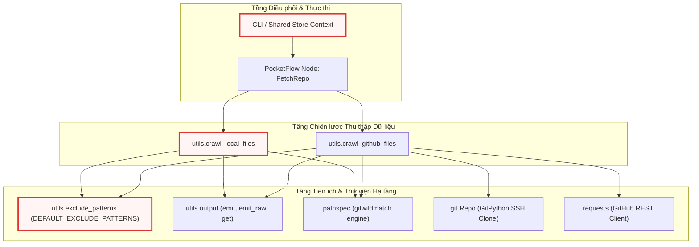

---

## 2. Danh mục Mẫu Lọc Toàn cục (`utils/exclude_patterns.py`)

Module `utils/exclude_patterns.py` đóng vai trò là một cơ sở tri thức tĩnh (static knowledge base) chứa tập hợp các biểu thức lọc dạng glob (`fnmatch`). Các mẫu này được thiết kế dựa trên kinh nghiệm phát triển phần mềm thực tế nhằm loại bỏ toàn bộ các tệp rác, tệp sinh tự động (build artifacts), môi trường ảo và tệp cấu hình của các IDE hiện đại.

```python
DEFAULT_EXCLUDE_PATTERNS = {
    # 1. Media, Data, and Static Assets
    "assets/*",
    "data/*",
    "images/*",
    "public/*",
    "static/*",
    "temp/*",
    "tmp/*",
    "media/*",
    "*.jpg",
    "*.jpeg",
    "*.png",
    "*.gif",
    "*.ico",
    "*.svg",
    "*.webp",
    "*.mp4",
    "*.webm",
    "*.mov",
    "*.mp3",
    "*.wav",
    "*.pdf",
    "*.doc",
    "*.docx",
    "*.xls",
    "*.xlsx",
    "*.ppt",
    "*.pptx",
    "*.zip",
    "*.tar",
    "*.gz",
    "*.rar",
    "*.7z",
    # 2. Build, Distribution, and Framework Caches
    "dist/*",
    "build/*",
    "out/*",
    "output/*",
    "target/*",
    "bin/*",
    "obj/*",
    ".next/*",
    ".nuxt/*",
    ".svelte-kit/*",
    ".expo/*",
    "docs/*",
    "test/*",
    "tests/*",
    "examples/*",
    "v1/*",
    "experimental/*",
    "deprecated/*",
    "misc/*",
    "legacy/*",
    "*.log",
    "*.bak",
    "*.tmp",
    "*.swp",
    # ...
```

Tập hợp `DEFAULT_EXCLUDE_PATTERNS` được tổ chức thành 7 nhóm phân loại chiến lược:
1. **Media, Data & Assets tĩnh**: Ngăn chặn nạp các định dạng ảnh, video, audio và tài liệu văn phòng nhị phân.
2. **Build, Distribution & Framework Caches**: Loại bỏ các thư mục đầu ra của trình biên dịch (C++, Rust, Java) và các framework frontend hiện đại (Next.js, Nuxt, SvelteKit).
3. **Môi trường, Dependencies & Lockfiles**: Loại bỏ `node_modules`, `.venv`, các tệp khóa gói (`package-lock.json`, `Cargo.lock`, `poetry.lock`) vốn chứa hàng triệu ký tự có thể làm tê liệt bộ nhớ đệm ngữ cảnh của LLM.
4. **Đặc thù Ngôn ngữ Lập trình**: Loại bỏ bytecode Python (`.pyc`, `__pycache__`), thư viện Java bytecode (`.class`, `.jar`), và thư viện liên kết động/tĩnh (`.so`, `.dll`, `.dylib`, `.a`).
5. **Hệ điều hành & Quản lý Phiên bản**: Bỏ qua metadata của OS (`.DS_Store`, `Thumbs.db`) và cơ sở dữ liệu nội bộ của VCS (`.git/*`, `.svn/*`).
6. **IDE Cổ điển**: Bỏ qua cấu hình của VS Code, IntelliJ, Eclipse (`.vscode/*`, `.idea/*`).
7. **AI Agents & Modern AI IDEs**: Đây là điểm kiến trúc đáng chú ý: hệ thống chủ động bỏ qua cấu hình và quy tắc của các AI agent khác như `.cursor/*`, `.windsurf/*`, `.cline/*`, `.claude/*`, `.copilot/*` để tránh gây nhiễu loạn ngữ cảnh cho prompt kiến trúc của chính pipeline.

Các mẫu thư mục được định dạng theo quy ước kết thúc bằng `/*` (ví dụ: `"dist/*"`). Khi thực hiện kiểm tra, tầng crawl sẽ sử dụng phương thức `removesuffix("/*")` để trích xuất tên thư mục gốc phục vụ thao tác khớp chuỗi với tên thư mục trong quá trình duyệt cây.

---

## 3. Động cơ Quét Tệp Cục bộ (`utils/crawl_local_files.py`)

Module `utils/crawl_local_files.py` chịu trách nhiệm thu thập mã nguồn từ hệ thống tệp cục bộ với hiệu năng cao, đảm bảo không đọc thừa tệp và xử lý chính xác hệ thống `.gitignore` đa tầng.

### 3.1. Cơ chế Nạp và Thẩm tra `.gitignore` Đa tầng

Trong các dự án phần mềm phức tạp (đặc biệt là Monorepo), các thư mục con có thể chứa tệp `.gitignore` riêng để ghi đè hoặc bổ sung quy tắc cho nhánh cây con đó. Hàm `_load_gitignore` và `_matches_any_gitignore` xử lý triệt để bài toán này.

```python
def _load_gitignore(gitignore_path):
    """Load a .gitignore file and return a PathSpec, or None on failure."""
    try:
        with open(gitignore_path, encoding="utf-8-sig") as f:
            return pathspec.PathSpec.from_lines("gitwildmatch", f.readlines())
    except Exception:
        return None


def _matches_any_gitignore(gitignore_specs, abs_path, is_dir=False):
    """Check if a path matches ANY loaded .gitignore spec.

    Each spec is checked with the path relative to its own .gitignore directory.
    For directories, a trailing '/' is appended for proper gitignore matching.

    Args:
        gitignore_specs: dict of {abs_dir_path: pathspec.PathSpec}
        abs_path: absolute path of the file or directory to check
        is_dir: True if checking a directory
    Returns:
        True if the path matches any gitignore rule
    """
    for gi_dir, spec in gitignore_specs.items():
        rel = os.path.relpath(abs_path, gi_dir)
        # Skip if the path is not under this gitignore's scope
        if rel.startswith(".."):
            continue
        match_path = rel.replace("\\", "/")
        if is_dir:
            match_path = match_path.rstrip("/") + "/"
        if spec.match_file(match_path):
            return True
    return False
```

`_load_gitignore` khởi tạo một đối tượng `pathspec.PathSpec` sử dụng cú pháp `gitwildmatch` chuẩn Git. Hàm mở tệp với bảng mã `utf-8-sig` nhằm tự động xử lý các tệp cấu hình chứa Byte Order Mark (BOM) do Windows tạo ra. 

Hàm `_matches_any_gitignore` duyệt qua một từ điển chứa các `pathspec` đã tải, trong đó khóa là đường dẫn tuyệt đối đến thư mục chứa tệp `.gitignore` tương ứng (`gi_dir`). Điểm mấu chốt ở đây là việc tính toán đường dẫn tương đối `rel = os.path.relpath(abs_path, gi_dir)`. Nếu `rel.startswith("..")`, tệp hoặc thư mục hiện tại nằm ngoài phạm vi ảnh hưởng của tệp `.gitignore` này và bị bỏ qua ngay lập tức. Đối với thư mục (`is_dir=True`), hàm chuẩn hóa đường dẫn bằng cách thêm dấu gạch chéo `/` ở cuối (`match_path.rstrip("/") + "/"`), giúp bộ phân tích `pathspec` phân biệt chính xác quy tắc dành riêng cho thư mục (ví dụ: `build/`) với quy tắc tệp trùng tên.

### 3.2. Thuật toán Duyệt Thư mục Đơn lượt và Cắt tỉa Nhánh sớm

Để tối ưu hóa hiệu năng I/O trên đĩa cứng, `crawl_local_files` triển khai thuật toán duyệt đơn lượt (Single-pass Traversal) thông qua `os.walk`, kết hợp việc biến đổi trực tiếp danh sách thư mục con `dirs` để cắt tỉa toàn bộ nhánh cây không hợp lệ.

```python
    # --- Single-pass: walk, filter, and process inline ---
    for root, dirs, files in os.walk(directory):
        abs_root = os.path.abspath(root)

        # Check for nested .gitignore in current directory (skip root, already loaded)
        if abs_root != os.path.abspath(directory):
            nested_gi = os.path.join(root, ".gitignore")
            if os.path.exists(nested_gi):
                spec = _load_gitignore(nested_gi)
                if spec:
                    gitignore_specs[abs_root] = spec

        # --- Directory filtering ---
        excluded_dirs = set()
        for d in sorted(dirs):
            abs_d = os.path.join(abs_root, d)
            dirpath_rel = os.path.relpath(abs_d, directory)

            reason = None
            if _matches_any_gitignore(gitignore_specs, abs_d, is_dir=True):
                reason = reason_gitignore
            elif exclude_patterns:
                for pattern in exclude_patterns:
                    dir_pattern = pattern.removesuffix("/*")
                    if fnmatch.fnmatch(dirpath_rel, dir_pattern) or fnmatch.fnmatch(d, dir_pattern):
                        reason = reason_excluded
                        break

            if reason:
                excluded_dirs.add(d)
                entry_num += 1
                count_excluded += 1
                emit("CRAWL_DIR_EXCLUDED", num=entry_num, path=dirpath_rel, reason=reason)

        for d in dirs.copy():
            if d in excluded_dirs:
                dirs.remove(d)

        # Sort remaining dirs for consistent traversal order
        dirs.sort()
```

Đoạn mã trên thể hiện kỹ thuật tối ưu hóa cốt lõi khi làm việc với `os.walk`. Khi duyệt qua mỗi thư mục `root`:
1. **Phát hiện `.gitignore` lồng nhau (Nested .gitignore Discovery)**: Nếu thư mục hiện tại không phải là gốc và chứa `.gitignore`, `pathspec` tương ứng sẽ được nạp ngay lập tức vào `gitignore_specs` với phạm vi áp dụng bắt đầu từ `abs_root`.
2. **Cắt tỉa Thư mục Sớm (Early Directory Pruning)**: Hệ thống kiểm tra từng thư mục con `d` dựa trên cả `_matches_any_gitignore` và `exclude_patterns`. Khi phát hiện một thư mục nằm trong danh sách loại trừ (ví dụ: `node_modules` hoặc `.git`), thư mục đó được thêm vào tập hợp `excluded_dirs`.
3. **Biến đổi `dirs` tại chỗ (`dirs.remove(d)`)**: Bằng cách loại bỏ phần tử khỏi danh sách `dirs` mà `os.walk` đang tham chiếu, Python sẽ bỏ qua hoàn toàn việc duyệt đệ quy vào các thư mục con của `d`. Cơ chế này ngăn chặn việc quét hàng chục nghìn tệp phụ thuộc không cần thiết, giúp tiết kiệm thời gian và tài nguyên CPU.
4. **Sắp xếp thứ tự (`dirs.sort()`)**: Đảm bảo thứ tự duyệt luôn tất định (deterministic) trên mọi hệ điều hành khác nhau (Linux, macOS, Windows).

### 3.3. Chuỗi Lọc Tệp Đa cấp, Giới hạn Dung lượng và Giải mã Văn bản

Sau khi các thư mục con đã được lọc sạch, các tệp tin trong thư mục hiện tại sẽ đi vào quy trình thẩm định tệp chi tiết trước khi nội dung được nạp vào bộ nhớ.

```python
        # --- File processing (inline, sorted) ---
        for filename in sorted(files):
            filepath = os.path.join(root, filename)
            abs_filepath = os.path.abspath(filepath)
            relpath = os.path.relpath(filepath, directory) if use_relative_paths else filepath
            entry_num += 1

            # Check gitignore (all levels)
            if _matches_any_gitignore(gitignore_specs, abs_filepath):
                count_excluded += 1
                emit("CRAWL_FILE_GITIGNORE", num=entry_num, path=relpath)
                continue

            # Check exclude patterns
            excluded = False
            if exclude_patterns:
                for pattern in exclude_patterns:
                    if fnmatch.fnmatch(relpath, pattern):
                        excluded = True
                        break
            if excluded:
                count_excluded += 1
                emit("CRAWL_FILE_EXCLUDED", num=entry_num, path=relpath)
                continue

            # Check include patterns
            if include_patterns:
                matched = False
                for pattern in include_patterns:
                    if fnmatch.fnmatch(relpath, pattern):
                        matched = True
                        break
                if not matched:
                    count_excluded += 1
                    emit("CRAWL_FILE_NOT_INCLUDED", num=entry_num, path=relpath)
                    continue

            # Check size limit
            if max_file_size and os.path.getsize(filepath) > max_file_size:
                count_size_limit += 1
                skipped_size_limit.append(relpath)
                size_kb = os.path.getsize(filepath) / 1024
                emit("CRAWL_FILE_SIZE_LIMIT", num=entry_num, path=relpath, size=f"{size_kb:.0f}")
                continue

            # Try to read as text
            try:
                with open(filepath, encoding="utf-8-sig") as f:
                    content = f.read()
                files_dict[relpath] = content
                count_processed += 1
                emit("CRAWL_FILE_PROCESSED", num=entry_num, path=relpath)
            except (UnicodeDecodeError, ValueError):
                count_non_text += 1
                skipped_non_text.append(relpath)
                emit("CRAWL_FILE_NOT_TEXT", num=entry_num, path=relpath)
            except Exception as e:
                count_non_text += 1
                skipped_non_text.append(relpath)
                emit("CRAWL_FILE_ERROR", num=entry_num, path=relpath, error=e)
```

Quy trình xử lý tệp tin áp dụng nguyên lý Fail-Fast để tối ưu tài nguyên:
* **Bộ lọc Cú pháp**: Tệp được so khớp tuần tự với quy tắc `.gitignore`, mẫu `exclude_patterns` và mẫu `include_patterns`. Nếu không đạt, hàm gọi lệnh `continue` để dừng xử lý ngay lập tức trước khi thực hiện bất kỳ lệnh đọc đĩa nào.
* **Chốt chặn Kích thước Tệp (`os.getsize`)**: Trước khi mở tệp, `os.getsize(filepath)` được gọi để kiểm tra ngưỡng `max_file_size`. Nếu tệp vượt quá ngưỡng (mặc định cấu hình từ CLI), nó sẽ bị loại bỏ nhằm ngăn ngừa các tệp dump dữ liệu hoặc log làm tràn RAM.
* **Phát hiện Dữ liệu Nhị phân bằng Exception Handling**: Thay vì sử dụng các thư viện đoán mime-type nặng nề, mã nguồn chủ động mở tệp bằng chế độ văn bản với encoding `utf-8-sig`. Nếu tệp là mã nhị phân (như hình ảnh, file thực thi biên dịch, PDF), Python sẽ ném ra ngoại lệ `UnicodeDecodeError` hoặc `ValueError`. Khối `try-except` bắt chính xác các lỗi này, ghi nhận tệp vào danh sách `skipped_non_text` và tiếp tục luồng xử lý mà không làm sập chương trình.

---

## 4. Động cơ Thu thập Mã nguồn Từ xa (`utils/crawl_github_files.py`)

Module `utils/crawl_github_files.py` là một giải pháp thu thập dữ liệu từ xa hoàn chỉnh, hỗ trợ hai phương thức vận hành: Clone tạm qua SSH và Duyệt cây đối tượng qua GitHub REST API.

### 4.1. Phân giải URL, Nhánh và Cây Thư mục (URL Parsing & Ref Resolution)

Khi nhận một URL GitHub từ người dùng, hệ thống cần phân tích chính xác cấu trúc của URL để tách biệt: Tên chủ sở hữu (owner), tên kho lưu trữ (repo), tham chiếu phiên bản (commit SHA, tag hoặc branch) và đường dẫn thư mục con cụ thể.

```python
    # Parse GitHub URL to extract owner, repo, commit/branch, and path
    parsed_url = urlparse(repo_url)
    path_parts = parsed_url.path.strip("/").split("/")

    if len(path_parts) < 2:
        raise ValueError(f"Invalid GitHub URL: {repo_url}")

    # Extract the basic components
    owner = path_parts[0]
    repo = path_parts[1]

    # Setup for GitHub API
    headers = {"Accept": "application/vnd.github.v3+json"}
    if token:
        headers["Authorization"] = f"token {token}"
    # ...
    # Check if URL contains a specific branch/commit
    if len(path_parts) > 3 and path_parts[2] == "tree":

        def join_parts(i):
            return "/".join(path_parts[i:])

        branches = fetch_branches(owner, repo)
        branch_names = (branch.get("name") for branch in branches)

        # Fetching branches was not successful
        if len(branches) == 0:
            return None

        # Check branch name
        relevant_path = join_parts(3)

        # Find a match with relevant path and get the branch name
        filter_gen = (name for name in branch_names if relevant_path.startswith(name))
        ref = next(filter_gen, None)

        # If match is not found, check for is it a tree
        if ref is None:
            tree = path_parts[3]
            ref = tree if check_tree(owner, repo, tree) else None

        # If it is neither a tree nor a branch name
        if ref is None:
            emit_raw("ERROR", "The given path does not match with any branch and any tree in the repository.\nPlease verify the path is exists.")
            return None

        # Combine all parts after the ref as the path
        part_index = 5 if "/" in ref else 4
        specific_path = join_parts(part_index) if part_index < len(path_parts) else ""
    else:
        # Don't put the ref param in query
        # and let Github decide default branch
        ref = None
        specific_path = ""
```

Logic phân giải URL giải quyết bài toán phức tạp khi tên nhánh chứa dấu gạch chéo (ví dụ: `feature/authentication`):
1. **Trích xuất Owner/Repo**: Sử dụng `urllib.parse.urlparse` để lấy đường dẫn và tách theo dấu `/`.
2. **Nhận diện Từ khóa `tree`**: Nếu URL có định dạng `https://github.com/owner/repo/tree/...`, hệ thống gọi hàm trợ năng `fetch_branches` để lấy danh sách toàn bộ các nhánh của kho lưu trữ từ endpoint `/branches`.
3. **Phân giải Tiền tố Nhánh (Branch Prefix Matching)**: Hệ thống sử dụng một generator expression để so khớp đường dẫn phía sau `tree/` với danh sách tên nhánh thực tế. Nhờ vậy, nếu nhánh là `fix/bug-123`, hệ thống sẽ nhận diện chính xác `ref = "fix/bug-123"` và tính toán phần còn lại của URL thành `specific_path`.
4. **Fallback sang Git Tree Object**: Nếu không khớp với bất kỳ tên nhánh nào, hệ thống kiểm tra xem mã hash có phải là một commit SHA hoặc Git Tree hợp lệ hay không qua hàm `check_tree`.

### 4.2. Chiến lược Clone Tạm thời qua Giao thức SSH

Khi đường dẫn repository được định dạng dưới dạng SSH URL (bắt đầu bằng `git@` hoặc kết thúc bằng `.git`), hệ thống kích hoạt chiến lược clone cục bộ tạm thời.

```python
    # Detect SSH URL (git@ or .git suffix)
    is_ssh_url = repo_url.startswith("git@") or repo_url.endswith(".git")

    if is_ssh_url:
        # Clone repo via SSH to temp dir
        with tempfile.TemporaryDirectory() as tmpdirname:
            emit_raw("PROGRESS", f"Cloning SSH repo {repo_url} to temp dir {tmpdirname} ...")
            try:
                repo = git.Repo.clone_from(repo_url, tmpdirname)
            except Exception as e:
                emit_raw("ERROR", f"Error cloning repo: {e}")
                return {"files": {}, "stats": {"error": str(e)}}

            # Attempt to checkout specific commit/branch if in URL
            # Parse ref and subdir from SSH URL? SSH URLs don't have branch info embedded
            # So rely on default branch, or user can checkout manually later
            # Optionally, user can pass ref explicitly in future API

            # Walk directory
            files = {}

            # --- Counters ---
            count_processed = 0
            count_excluded = 0
            count_size_limit = 0
            count_non_text = 0
            skipped_size_list = []
            skipped_non_text_list = []
            entry_num = 0
            # ...
```

Chiến lược này sử dụng context manager `tempfile.TemporaryDirectory()` để đảm bảo tính cô lập và quản lý tài nguyên nghiêm ngặt:
* **Quản lý Vòng đời Tự động**: Toàn bộ dữ liệu của kho lưu trữ được clone từ xa bằng `git.Repo.clone_from(repo_url, tmpdirname)`. Khi khối lệnh `with` kết thúc (kể cả khi xảy ra ngoại lệ), hệ điều hành sẽ tự động xóa sạch thư mục tạm thời, không để lại bất kỳ dữ liệu rác nào trên ổ đĩa của server.
* **Tái sử dụng Logic Duyệt Cục bộ**: Bên trong thư mục tạm `tmpdirname`, quy trình tải `.gitignore`, cắt tỉa thư mục cha và duyệt tệp tuần tự được tái lập hoàn toàn tương tự như `crawl_local_files`, mang lại tốc độ đọc nội dung tệp ở mức I/O đĩa cục bộ cực nhanh so với việc gọi hàng trăm HTTP request qua API.

### 4.3. Thuật toán Đệ quy Qua REST API và Cơ chế Tự động Né Rate Limit

Đối với các URL HTTPS thông thường, `crawl_github_files` sử dụng GitHub Contents API (`/repos/{owner}/{repo}/contents/{path}`). Do GitHub áp dụng hạn ngạch gọi API rất nghiêm ngặt (60 request/giờ cho unauthenticated và 5,000 request/giờ cho authenticated requests), hàm `fetch_contents` tích hợp sẵn cơ chế chống nghẽn và tự động phục hồi.

```python
    def fetch_contents(path):
        """Fetch contents of the repository at a specific path and commit"""
        url = f"https://api.github.com/repos/{owner}/{repo}/contents/{path}"
        params = {"ref": ref} if ref is not None else {}

        response = requests.get(url, headers=headers, params=params, timeout=(30, 30))

        if response.status_code in (403, 429) and "rate limit exceeded" in response.text.lower():
            if not token:
                raise Exception("GitHub API rate limit exceeded. Please provide a GitHub token using --token or GITHUB_TOKEN env var.")
            reset_time = int(response.headers.get("X-RateLimit-Reset", 0))
            wait_time = max(reset_time - time.time(), 0) + 1
            emit_raw("WARNING", f"Rate limit exceeded. Waiting for {wait_time:.0f} seconds...")
            time.sleep(wait_time)
            return fetch_contents(path)

        if response.status_code == 404:
            # ... (Emit appropriate 404 error based on token / branch state)
            return None

        if response.status_code != 200:
            emit_raw("ERROR", f"Error fetching {path}: {response.status_code} - {response.text}")
            return None

        contents = response.json()
        if not isinstance(contents, list):
            contents = [contents]
        # ...
```

Cơ chế xử lý lỗi HTTP và Rate Limiting hoạt động như sau:
1. **Bắt mã trạng thái 403 / 429**: Khi API trả về lỗi vượt ngưỡng hạn mức, hệ thống kiểm tra sự tồn tại của `token`. Nếu chạy ở chế độ unauthenticated, một ngoại lệ tường minh sẽ được ném ra để cảnh báo người dùng cần bổ sung `GITHUB_TOKEN`.
2. **Tự động Đàm phán Thời gian Chờ (`X-RateLimit-Reset`)**: Khi có token hợp lệ nhưng vẫn bị rate limit (ví dụ trong các đợt crawl quy mô lớn), hệ thống trích xuất header `X-RateLimit-Reset` của GitHub (thời điểm Epoch mà hạn ngạch được làm mới), tính toán khoảng thời gian cần ngủ (`wait_time = max(reset_time - time.time(), 0) + 1`), gọi lệnh `time.sleep(wait_time)` và tự động thực hiện lại lệnh gọi hàm đệ quy `return fetch_contents(path)`.
3. **Phân hóa Lỗi 404 Thông minh**: Xử lý ngữ cảnh lỗi 404 để phân biệt rõ ràng giữa các trường hợp: Repository riêng tư (cần token), nhánh mặc định không phải `main` (gợi ý chuyển sang `master`), hoặc đường dẫn con không tồn tại.

### 4.4. Chiến lược Tải Nội dung Kép: Download URL và Giải mã Base64

Sau khi nhận được danh sách metadata của các đối tượng trong thư mục từ GitHub API, hệ thống duyệt qua từng mục và áp dụng chiến lược tải dữ liệu kép tùy theo thuộc tính của payload.

```python
            if item["type"] == "file":
                api_counters["entry"] += 1
                entry_num = api_counters["entry"]

                # Check if file should be included based on patterns
                if not should_include_file(rel_path, item["name"], gitignore_spec=gitignore_spec):
                    api_counters["excluded"] += 1
                    emit("CRAWL_FILE_EXCLUDED", num=entry_num, path=rel_path)
                    continue

                # Check file size if available
                file_size = item.get("size", 0)
                if file_size > max_file_size:
                    api_counters["size_limit"] += 1
                    api_skipped_size.append(rel_path)
                    size_kb = file_size / 1024
                    emit("CRAWL_FILE_SIZE_LIMIT", num=entry_num, path=rel_path, size=f"{size_kb:.0f}")
                    continue

                # For files, get raw content
                if item.get("download_url"):
                    file_url = item["download_url"]
                    file_response = requests.get(file_url, headers=headers, timeout=(30, 30))

                    # Final size check in case content-length header is available but differs from metadata
                    content_length = int(file_response.headers.get("content-length", 0))
                    if content_length > max_file_size:
                        api_counters["size_limit"] += 1
                        api_skipped_size.append(rel_path)
                        size_kb = content_length / 1024
                        emit("CRAWL_FILE_SIZE_LIMIT", num=entry_num, path=rel_path, size=f"{size_kb:.0f}")
                        continue

                    if file_response.status_code == 200:
                        files[rel_path] = file_response.text
                        api_counters["processed"] += 1
                        emit("CRAWL_FILE_PROCESSED", num=entry_num, path=rel_path)
                    else:
                        api_counters["non_text"] += 1
                        api_skipped_non_text.append(rel_path)
                        emit("CRAWL_FILE_HTTP_ERROR", num=entry_num, path=rel_path, status=file_response.status_code)
                else:
                    # Alternative method if download_url is not available
                    content_response = requests.get(item["url"], headers=headers, timeout=(30, 30))
                    if content_response.status_code == 200:
                        content_data = content_response.json()
                        if content_data.get("encoding") == "base64" and "content" in content_data:
                            # Check size of base64 content before decoding
                            if len(content_data["content"]) * 0.75 > max_file_size:  # Approximate size calculation
                                estimated_size = int(len(content_data["content"]) * 0.75)
                                api_counters["size_limit"] += 1
                                api_skipped_size.append(rel_path)
                                size_kb = estimated_size / 1024
                                emit("CRAWL_FILE_SIZE_LIMIT", num=entry_num, path=rel_path, size=f"{size_kb:.0f}")
                                continue

                            file_content = base64.b64decode(content_data["content"]).decode("utf-8")
                            files[rel_path] = file_content
                            api_counters["processed"] += 1
                            emit("CRAWL_FILE_PROCESSED", num=entry_num, path=rel_path)
```

Đoạn mã trên thể hiện tính toàn vẹn trong xử lý biên dữ liệu:
1. **Ưu tiên Tải Thô (Raw Download)**: Khi thuộc tính `download_url` khả dụng (trỏ tới `raw.githubusercontent.com`), hệ thống thực hiện request trực tiếp để lấy `file_response.text`. Cách này tiết kiệm chi phí CPU vì không phải phân tích JSON và giải mã chuỗi Base64.
2. **Kiểm tra Kích thước 2 Lớp (Two-tier Size Guard)**: Kích thước tệp được kiểm tra lần đầu thông qua trường `size` trong metadata của JSON API. Khi tải qua `download_url`, hệ thống kiểm tra lại lần thứ hai thông qua header HTTP `content-length`.
3. **Dự phòng Giải mã Base64 (Base64 Fallback & Size Estimation)**: Trong trường hợp `download_url` bị khuyết (thường xảy ra ở một số enterprise GitHub setup hoặc đối tượng đặc thù), hệ thống gọi API URL của đối tượng (`item["url"]`), nhận payload JSON chứa chuỗi mã hóa Base64. Trước khi giải mã bằng hàm `base64.b64decode`, hệ thống áp dụng công thức ước lượng kích thước:
   $$\text{Kích thước ước tính (bytes)} = \text{len}(\text{content}) \times 0.75$$
   Nếu kích thước ước lượng này vượt quá `max_file_size`, thao tác giải mã sẽ bị hủy bỏ ngay lập tức, tránh lãng phí chu kỳ xử lý của CPU và phân bổ bộ nhớ không cần thiết.

---

## 5. Sơ đồ Luồng Thực thi & Luồng Dữ liệu (Execution Flows)

### 5.1. Chuỗi Bộ lọc Dữ liệu Đa cấp (Filter Chain Pipeline)

Sơ đồ tuần tự các điều kiện logic mà một tệp tin phải vượt qua để được nạp vào từ điển kết quả cuối cùng:

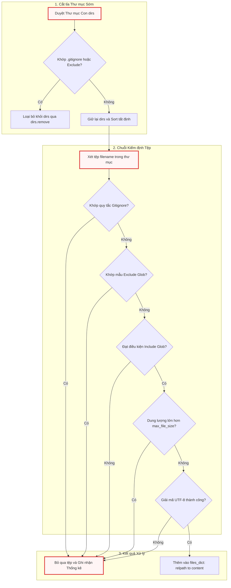

### 5.2. Luồng Xử lý GitHub REST API và Né Rate Limit

Sơ đồ luồng tương tác giữa Crawler và GitHub REST API trong kịch bản phát hiện vượt ngưỡng hạn ngạch gọi mạng:

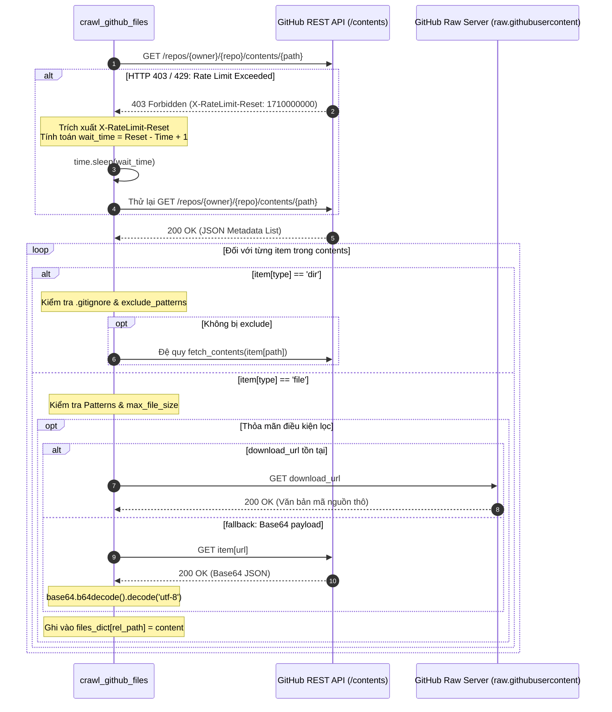

---

## 6. Mô hình Đồng quy, Ràng buộc & Đặc tính Mở rộng

### 6.1. Mô hình Xử lý và An toàn Bộ nhớ

1. **Thực thi Đồng bộ Tuyến tính (Synchronous Single-Threaded Execution)**: Cả hai module crawl hiện tại đều thực thi đồng bộ trên luồng chính. Đây là một quyết định thiết kế có chủ đích:
   * *Ưu điểm*: Đơn giản hóa việc quản lý trạng thái đếm số lượng tệp, đảm bảo tính tất định của nhật ký dòng lệnh và loại bỏ hoàn toàn các nguy cơ tranh chấp tài nguyên (race conditions) khi ghi dữ liệu vào từ điển `files`.
   * *Đánh đổi*: Thời gian chờ I/O mạng khi gọi GitHub API tuần tự qua từng thư mục có thể kéo dài nếu kho lưu trữ có cấu trúc cây thư mục quá sâu.
2. **Dấu chân Bộ nhớ (Memory Footprint)**: Dữ liệu mã nguồn được lưu trữ hoàn toàn trong RAM dưới dạng chuỗi UTF-8 trong một từ điển Python duy nhất `{"files": {filepath: content}}`. 
   * Đối với các codebase thông thường (dưới 50MB mã nguồn văn bản), mô hình này đạt hiệu năng truy cập tức thì (in-memory lookup $O(1)$) cho các node phân tích cú pháp AST tiếp theo.
   * Để bảo vệ hệ thống khỏi cạn kiệt RAM, `max_file_size` (mặc định 1MB mỗi tệp) đóng vai trò là chốt chặn cứng; các tệp dữ liệu lớn, database SQLite nhúng hay artifact sẽ bị triệt tiêu từ cấp I/O.

### 6.2. Bảng Tóm tắt Chức năng các Module

| Module / Hàm | Trách nhiệm Nghiệp vụ | Đầu vào Chính | Đầu ra / Trạng thái Thay đổi |
| :--- | :--- | :--- | :--- |
| `DEFAULT_EXCLUDE_PATTERNS` | Định nghĩa tập hợp các mẫu loại trừ rác, cache, lockfile toàn cục | Không | `set[str]` |
| `_load_gitignore` | Đọc và biên dịch cú pháp Git wildmatch từ đĩa | Đường dẫn tệp `.gitignore` | Đối tượng `pathspec.PathSpec` hoặc `None` |
| `_matches_any_gitignore` | Thẩm tra đường dẫn với toàn bộ cây phân cấp `.gitignore` | `gitignore_specs`, `abs_path`, `is_dir` | `bool` (`True` nếu khớp luật bỏ qua) |
| `crawl_local_files` | Quét, lọc và nạp tệp từ hệ thống đĩa cục bộ | `directory`, `include_patterns`, `exclude_patterns`, `max_file_size` | `dict`: `{"files": {filepath: content}}` |
| `crawl_github_files` | Quét kho lưu trữ GitHub từ xa qua SSH hoặc REST API | `repo_url`, `token`, `max_file_size`, `use_relative_paths` | `dict`: `{"files": {...}, "stats": {...}}` |

---

## 7. Ghi chú Thực tế cho Kỹ sư Mới (Practical Notes for New Team Members)

### 7.1. Cấu hình & Biến Môi trường Liên quan

*   **`GITHUB_TOKEN`**: Khai báo trong tệp `.env` hoặc truyền qua cờ CLI `--token`. Đây là cấu hình tối quan trọng nếu bạn crawl các kho lưu trữ từ xa. Nếu không có token, bạn sẽ bị giới hạn ở 60 request/giờ và không thể crawl các private repository.
*   **`DEFAULT_EXCLUDE_PATTERNS`**: Tọa lạc tại `utils/exclude_patterns.py`. Khi dự án tiếp nhận một framework mới có thư mục cache đặc thù (ví dụ: `.astro/*` hay `.turbo/*`), đây là nơi đầu tiên bạn cần cập nhật để áp dụng cho toàn hệ thống.

### 7.2. Điểm Gỡ lỗi Phổ biến (Debugging Entry Points)

1. **Tại sao một tệp mã nguồn quan trọng bị bỏ qua (Skip)?**
   * Đặt breakpoint tại vòng lặp `for filename in sorted(files):` trong `crawl_local_files.py` hoặc bên trong `fetch_contents` trong `crawl_github_files.py`.
   * Kiểm tra xem tệp có bị khớp bởi `_matches_any_gitignore` (do có tệp `.gitignore` ẩn ở thư mục cha nào đó) hoặc do khớp với danh sách mẫu mở rộng trong `DEFAULT_EXCLUDE_PATTERNS` (ví dụ: tệp nằm trong thư mục có tên `test/` hoặc `examples/`).
2. **Lỗi `UnicodeDecodeError` / Không đọc được tệp tiếng Nhật, tiếng Trung, tiếng Việt:**
   * Hệ thống sử dụng encoding `utf-8-sig`. Nếu dự án mục tiêu sử dụng các bảng mã legacy như `Shift-JIS`, `GBK` hoặc `Windows-1252`, tệp sẽ bị phân loại nhầm thành non-text (`skipped_non_text`). Điểm can thiệp là khối `try-except` đọc tệp trong `crawl_local_files.py`.
3. **Lỗi treo khi crawl GitHub URL:**
   * Kiểm tra log hiển thị xem hệ thống có đang rơi vào trạng thái `time.sleep(wait_time)` do vượt hạn mức API hay không. Header `X-RateLimit-Reset` sẽ báo chính xác thời điểm hệ thống tiếp tục chạy.

### 7.3. Nợ Kỹ thuật & Đặc tính Dị biệt Cần Lưu ý

*   **SSH Branch Extraction**: Trong `crawl_github_files.py`, khi crawl qua URL dạng SSH, hệ thống hiện tại mặc định clone nhánh mặc định của repo từ xa (`default branch`) chứ chưa phân giải sâu các branch con được chỉ định trong URL.
*   **Chi phí API Calls khi dùng REST**: Với các kho lưu trữ có hàng trăm thư mục nhỏ, việc gọi HTTP GET đệ quy cho từng thư mục làm tăng độ trễ mạng (Network Latency). Một hướng tối ưu hóa tiềm năng trong tương lai là chuyển sang sử dụng GitHub Trees API đệ quy (`GET /repos/{owner}/{repo}/git/trees/{tree_sha}?recursive=1`) để lấy toàn bộ cây thư mục chỉ trong 1 request duy nhất trước khi tải nội dung.

### 7.4. Quy chuẩn Đánh giá Mã nguồn (Code Review Guidelines)

Khi review các Pull Request liên quan đến thành phần này, cần chú ý:
*   **Không phá vỡ hợp đồng dữ liệu**: Giá trị trả về bắt buộc phải tuân thủ nghiêm ngặt cấu trúc `{"files": {filepath: content}}`.
*   **Không đưa logic in chuỗi trực tiếp (`print`) vào module**: Mọi thông báo tiến trình, lỗi hoặc cảnh báo bắt buộc phải ủy quyền cho hệ thống i18n thông qua `emit()` hoặc `emit_raw()` của `utils.output`.
*   **Không được xóa bỏ `utf-8-sig`**: Việc hạ cấp xuống `open(filepath, 'r')` mặc định sẽ gây lỗi trên các môi trường Windows khi gặp tệp chứa ký tự BOM.

---

## 8. Tóm tắt Kỹ thuật & Bước tiếp theo

Trong chương này, chúng ta đã mổ xẻ toàn diện kiến trúc của **Hệ thống Thu thập & Lọc Mã nguồn Đa nguồn**:
*   Cách tổ chức danh mục loại trừ toàn cục 7 nhóm tại `exclude_patterns.py`.
*   Thuật toán duyệt đĩa đơn lượt kết hợp cắt tỉa thư mục cha sớm và giải quyết `.gitignore` đa cấp tại `crawl_local_files.py`.
*   Chiến lược linh hoạt giữa SSH clone và REST API kèm cơ chế tự động đàm phán rate limit tại `crawl_github_files.py`.
*   Toàn bộ luồng dữ liệu đều quy tụ về cấu trúc từ điển `files` chuẩn hóa trong bộ nhớ, sẵn sàng cung cấp cho các node xử lý thông minh tiếp theo.

Sau khi toàn bộ mã nguồn của kho lưu trữ đã được nạp sạch sẽ vào bộ nhớ, thách thức tiếp theo là: Làm thế nào để quản lý ngữ cảnh này, tính toán token và gửi các truy vấn tối ưu đến các nhà cung cấp mô hình ngôn ngữ lớn (LLM)? 

Mời bạn tiếp tục tìm hiểu tại [Chapter 3: Tích hợp Mô hình Ngôn ngữ & Quản lý Token Context](03_tích_hợp_mô_hình_ngôn_ngữ___quản_lý_token_context.md).


---

<a id="chapter-3"></a>

# Chapter 3: Tích hợp Mô hình Ngôn ngữ & Quản lý Token Context


Ở [Chương 2: Hệ thống Thu thập & Lọc Mã nguồn Đa nguồn](02_hệ_thống_thu_thập___lọc_mã_nguồn_đa_nguồn.md), chúng ta đã tìm hiểu cách thức hệ thống quét, thẩm định và chuẩn hóa toàn bộ tệp tin của kho mã nguồn thành một từ điển dữ liệu phẳng trong bộ nhớ. Sau khi dữ liệu mã nguồn đã được làm sạch và nạp vào bộ nhớ RAM, thách thức cốt lõi tiếp theo là: làm thế nào để chuyển đổi hàng trăm nghìn dòng mã thô này thành các prompt có cấu trúc, gửi chúng đến các Mô hình Ngôn ngữ Lớn (LLM) khác nhau một cách tin cậy, kiểm soát chặt chẽ ngân sách token, tối ưu hóa chi phí API thông qua bộ nhớ đệm, và hỗ trợ đa dạng nhà cung cấp mà không làm biến đổi logic nghiệp vụ của hệ thống?

Chương này sẽ phân tích sâu tầng kiến trúc Gateway/Adapter nằm tại hai module nòng cốt: `utils/call_llm.py` và `utils/token_utils.py`.

---

## 1. Tổng quan Kiến trúc (Technical Overview)

### 1.1 Vai trò Kiến trúc (Architectural Role)

Trong một hệ thống phân tích mã nguồn tự động, việc tương tác với LLM không chỉ đơn thuần là gửi một chuỗi văn bản và nhận về phản hồi. Tầng Tích hợp LLM & Quản lý Token Context đóng vai trò là **Lớp Biên Dịch vụ AI (AI Gateway & Adapter Layer)**, thiết lập ranh giới phân lập giữa logic nghiệp vụ phân tích AST/đồ thị luồng (thuộc các Node trong PocketFlow) và các giao thức giao tiếp mạng với nhà cung cấp mô hình.

```
+-------------------------------------------------------------------------------+
|                             PocketFlow Nodes Layer                            |
|             (Summarize, GenerateChapters, WriteTutorial, Translate)           |
+-------------------------------------------------------------------------------+
                                      │
                                      ▼
+-------------------------------------------------------------------------------+
|                      AI Gateway & Token Management Layer                      |
|                                                                               |
|   +--------------------------+             +------------------------------+   |
|   |   utils/token_utils.py   |             |      utils/call_llm.py       |   |
|   |  - BPE Token Counter     |             |  - Caching Proxy             |   |
|   |  - Context Budgeting     |             |  - Multi-Provider Adapter    |   |
|   |  - Fallback Heuristics   |             |  - Thinking Config Engine    |   |
|   +--------------------------+             +------------------------------+   |
+-------------------------------------------------------------------------------+
                 │                                           │
                 ▼                                           ▼
      +---------------------+               +-------------------------------+
      |  tiktoken (cl100k)  |               | Google GenAI SDK (Vertex/AI)  |
      |  Character Fallback |               | OpenAI-Compatible HTTP REST   |
      +---------------------+               | (OpenRouter / Ollama)         |
                                            +-------------------------------+
```

Nếu thành phần này không tồn tại dưới dạng một lớp trừu tượng độc lập:
* Toàn bộ mã nguồn nghiệp vụ tại các Node xử lý sẽ bị "nhiễm" (leaked) mã triển khai SDK đặc thù của từng nhà cung cấp (ví dụ: cú pháp `types.ThinkingConfig` của Google SDK bị trộn lẫn với logic sinh tài liệu).
* Không có điểm kiểm soát tập trung để đo lường token đầu vào/đầu ra, dẫn đến nguy cơ vượt quá cửa sổ ngữ cảnh (Context Window Overflow) gây gián đoạn quy trình thực thi dài hạn.
* Chi phí vận hành và thời gian phát triển sẽ bùng nổ do thiếu cơ chế bộ nhớ đệm (caching) cho các prompt lặp lại trong quá trình gỡ lỗi hoặc chạy lại pipeline.

### 1.2 Mẫu Thiết kế (Design Patterns)

Thành phần tích hợp này áp dụng ba mẫu thiết kế kinh điển:

1. **Adapter Pattern**: Chuẩn hóa các giao diện gọi API không tương thích giữa Google Gemini (`google.genai` SDK chuyên dụng) và các nhà cung cấp hỗ trợ giao thức chuẩn `/v1/chat/completions` (OpenRouter, Ollama) về một hàm thực thi duy nhất: `call_llm(prompt, use_cache, thinking_level)`. 
   * *Đánh đổi (Trade-off)*: Giảm thiểu sự phụ thuộc vào các tính năng độc quyền của một SDK đơn lẻ để đổi lấy tính linh hoạt và khả năng hoán đổi nhà cung cấp mà không phải sửa đổi mã nguồn ở tầng Node.
2. **Proxy Pattern (Caching Proxy)**: Hàm `call_llm` bọc một lớp đệm trung gian dựa trên tệp JSON (`llm_cache.json`). Mọi yêu cầu trước khi được chuyển đến mạng đều được tra cứu theo hàm băm của nội dung prompt.
   * *Đánh đổi (Trade-off)*: Tăng nhẹ độ trễ đọc đĩa (Disk I/O) cho mỗi lượt gọi để đổi lấy việc tiết kiệm $100\%$ chi phí API và triệt tiêu độ trễ mạng đối với các prompt đã từng thực thi.
3. **Gateway Pattern**: Đóng gói logic đàm phán kích thước ngữ cảnh (`get_model_context_length`), phát hiện nhà cung cấp tự động (`get_llm_provider`), và điều khiển cấp độ tư duy/suy luận (`thinking_level`).

### 1.3 Trách nhiệm Cốt lõi (Core Responsibilities)

* **Điều phối & Định tuyến Truy vấn**: Tiếp nhận prompt từ tầng nghiệp vụ, thẩm định cấu hình môi trường và định tuyến lệnh gọi đến đúng SDK cục bộ hoặc endpoint HTTP từ xa.
* **Quản lý Cấp độ Tư duy (Reasoning/Thinking Budget)**: Chuyển đổi tham số trừu tượng (`low`, `medium`, `high`) thành cấu hình ngân sách token tư duy cụ thể cho Google Gemini hoặc cờ `reasoning_effort` / `think` cho OpenRouter và Ollama.
* **Kiểm soát & Ước tính Dung lượng Token**: Sử dụng bộ mã hóa BPE `cl100k_base` từ thư viện `tiktoken` để tính toán chính xác số token của prompt trước khi gửi, đi kèm cơ chế dự phòng (fallback) tự động dựa trên tỷ lệ ký tự.
* **Bộ nhớ đệm Phản hồi Cục bộ**: Quản lý vòng đời lưu trữ và tải kết quả truy vấn từ `llm_cache.json` nhằm hỗ trợ tái thực thi nhanh và tiết kiệm chi phí.
* **Phân tích và Giám sát Context Window**: Xuất thông số thống kê chi tiết về tỷ lệ chiếm dụng cửa sổ ngữ cảnh của từng Node ra màn hình console và tệp nhật ký có cấu trúc.

### 1.4 Phụ thuộc Hệ thống (Key Dependencies)

Sơ đồ ngữ cảnh dưới đây thể hiện mối quan hệ giữa Tầng Tích hợp LLM với các thành phần phụ thuộc bên trong và bên ngoài:

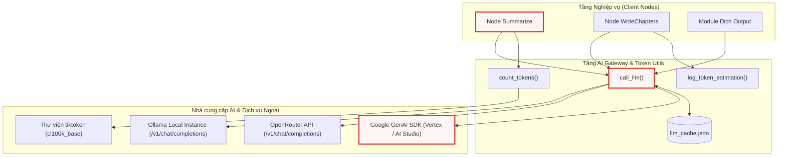

---

## 2. Phân tích Hiện thực Chi tiết theo Hàm (Function-by-Function Breakdown)

Dưới đây là chi tiết mã nguồn và các phân tích kỹ thuật chuyên sâu của từng module.

### 2.1 Quản lý Trì hoãn Logging và Bộ nhớ đệm Cục bộ

Trong `utils/call_llm.py`, việc cấu hình logging và bộ nhớ đệm đòi hỏi xử lý khéo léo để tránh xung đột khi module được import tại các thời điểm khác nhau trong chu trình khởi động ứng dụng.

```python
# Configure logging - deferred until main.py calls configure_logging()
# At import time, set up logger with NullHandler (no file output yet)
logger = logging.getLogger("llm_logger")
logger.setLevel(logging.INFO)
logger.propagate = False  # Prevent propagation to root logger
logger.addHandler(logging.NullHandler())  # Absorb logs until configured


# Simple cache configuration
cache_file = "llm_cache.json"


def load_cache():
    try:
        with open(cache_file) as f:
            return json.load(f)
    except Exception:
        logger.warning("Failed to load cache.")
    return {}


def save_cache(cache):
    try:
        with open(cache_file, "w") as f:
            json.dump(cache, f)
    except Exception:
        logger.warning("Failed to save cache")
```

Đoạn mã trên thể hiện hai quyết định kiến trúc quan trọng:
1. **Mô hình Trì hoãn Logging (Deferred Logging)**: Tại thời điểm nạp module (`import time`), đường dẫn thư mục `logs/` có thể chưa được `main.py` khởi tạo. Do đó, logger được gắn một `logging.NullHandler()` và tắt cờ `propagate` để nuốt toàn bộ log tạm thời, ngăn chặn việc xuất log rác ra console trước khi hệ thống sẵn sàng.
2. **Cơ chế Nuốt Ngoại lệ An toàn cho Cache (Fail-Safe Cache I/O)**: Hai hàm `load_cache()` và `save_cache()` bắt toàn bộ ngoại lệ chung (`except Exception`). Nếu tệp `llm_cache.json` bị khóa, lỗi phân tích cú pháp JSON hoặc quyền truy cập tệp bị từ chối, hệ thống chỉ ghi nhận cảnh báo và trả về một từ điển rỗng `{}` thay vì làm sập toàn bộ tiến trình phân tích kéo dài.

---

### 2.2 Nhận diện Nhà cung cấp và Đàm phán Ngữ cảnh Mô hình

Hệ thống cho phép cấu hình động nhà cung cấp thông qua biến môi trường, đồng thời cung cấp khả năng tự động truy vấn thông tin metadata từ API từ xa.

```python
def get_llm_provider():
    provider = os.getenv("LLM_PROVIDER")
    if not provider and (os.getenv("GEMINI_PROJECT_ID") or os.getenv("GEMINI_API_KEY")):
        provider = "GEMINI"
    # if necessary, add ANTHROPIC/OPENAI
    return provider


# Cache for model capabilities to avoid repeated API calls
_openrouter_models_cache = None


def _get_openrouter_model_info(model_id: str) -> dict:
    global _openrouter_models_cache
    if _openrouter_models_cache is None:
        try:
            resp = requests.get("https://openrouter.ai/api/v1/models", timeout=5)
            _openrouter_models_cache = resp.json().get("data", [])
        except Exception:
            _openrouter_models_cache = []

    return next((m for m in _openrouter_models_cache if m.get("id") == model_id), None)
```

Hàm `get_llm_provider()` triển khai logic suy đoán thông minh: nếu biến `LLM_PROVIDER` không được chỉ định tường minh nhưng tồn tại khóa `GEMINI_PROJECT_ID` hoặc `GEMINI_API_KEY`, hệ thống sẽ tự động chuyển hướng sử dụng nhà cung cấp Google Gemini.

Đối với OpenRouter, module duy trì một biến bộ nhớ đệm toàn cục `_openrouter_models_cache`. Việc truy vấn danh sách mô hình qua HTTP `GET /api/v1/models` chỉ diễn ra duy nhất một lần (Lazy Loading với thời gian timeout ngắn 5 giây). Các lần gọi tiếp theo sẽ duyệt trực tiếp trên danh sách đối tượng đã được lưu trong bộ nhớ RAM, hạn chế tối đa độ trễ mạng.

Tiếp theo là hàm xác định kích thước cửa sổ ngữ cảnh cực đại:

```python
def get_model_context_length(endpoint_url: str, model_name: str, api_key: str = "") -> int:
    """
    Fetch the maximum context length of a model based on the endpoint.
    If endpoint is Gemini API, safely default to 1,000,000 tokens.
    If endpoint is openrouter.ai, make GET to /api/v1/models and extract.
    Default to 100,000.
    """
    default_limit = 100000
    try:
        if not endpoint_url:
            return default_limit

        if "generativelanguage.googleapis.com" in endpoint_url or "gemini" in model_name.lower():
            # Safely default to 1M tokens for Gemini models
            return 1000000

        if "openrouter.ai" in endpoint_url:
            resp = requests.get("https://openrouter.ai/api/v1/models", timeout=5)
            data = resp.json().get("data", [])
            for m in data:
                if m.get("id") == model_name:
                    return m.get("context_length", default_limit)
    except Exception as e:
        logger.warning(f"Failed to fetch context length for {model_name} at {endpoint_url}: {e}")

    return default_limit
```

Hàm `get_model_context_length` đóng vai trò là cơ chế bảo vệ ngưỡng an toàn (Safety Boundary) cho toàn bộ pipeline:
* Nếu mô hình thuộc họ Google Gemini, hệ thống tự động gán trần hạn ngạch là $1{,}000{,}000$ tokens.
* Nếu là OpenRouter, hệ thống trích xuất trường `context_length` từ phản hồi API của model tương ứng.
* Nếu có bất kỳ lỗi mạng hoặc không khớp thông tin, hệ thống tự động fallback về mức an toàn chuẩn là $100{,}000$ tokens.

---

### 2.3 Bộ Điều phối Gọi LLM Thống nhất (`call_llm`)

Hàm `call_llm()` là giao diện công khai chính mà toàn bộ các Node và mô-đun dịch thuật tiêu thụ. Hàm này tích hợp toàn bộ chu trình: tính toán token, kiểm tra cache, gọi mạng, đo thời gian thực thi và cập nhật cache.

```python
# By default, we use Google Gemini 3.7 flash, as it shows great performance for code understanding
def call_llm(prompt: str, use_cache: bool = True, thinking_level: str | None = None) -> str:
    import time

    from utils.token_utils import count_tokens

    provider = get_llm_provider()
    model = os.environ.get(f"{provider}_MODEL", os.environ.get("GEMINI_MODEL", "unknown"))
    prompt_tokens = count_tokens(prompt)

    logger.info(f"{'=' * 80}")
    logger.info(
        f"LLM CALL START | provider={provider} | model={model} | thinking={thinking_level} | cache={'enabled' if use_cache else 'disabled'} | prompt_tokens={prompt_tokens:,}"
    )
    logger.info(f"PROMPT:\n{prompt}")

    # Check cache if enabled
    if use_cache:
        cache = load_cache()
        if prompt in cache:
            cached_response = cache[prompt]
            logger.info(f"CACHE HIT | response_chars={len(cached_response):,}")
            logger.info(f"RESPONSE (cached):\n{cached_response}")
            logger.info("LLM CALL END | result=cache_hit")
            return cached_response
// ...
```

Ở đoạn đầu của `call_llm()`, cấu trúc log dạng key-value phân cách bằng ký tự `|` được thiết lập nhằm phục vụ việc phân tích dữ liệu tự động (log parsing). Nếu tham số `use_cache=True`, chuỗi prompt đầy đủ sẽ được sử dụng làm khóa định danh để tra cứu trực tiếp trong tệp cache. Nếu xảy ra **Cache Hit**, hàm lập tức trả về nội dung đã lưu, cắt giảm hoàn toàn thời gian chờ đợi và tiêu tốn quota.

Nếu xảy ra **Cache Miss**, quy trình chuyển sang giai đoạn thực thi cuộc gọi mạng thực tế:

```python
// ...
    # Make the actual LLM call
    start_time = time.time()
    logger.info(f"API CALL | sending request to {provider}...")

    if provider == "GEMINI":
        response_text = _call_llm_gemini(prompt, thinking_level=thinking_level)
    else:  # generic method using a URL that is OpenAI compatible API (Ollama, ...)
        response_text = _call_llm_provider(prompt, thinking_level=thinking_level)

    elapsed = time.time() - start_time
    logger.info(f"API CALL COMPLETE | elapsed={elapsed:.1f}s | response_chars={len(response_text):,}")
    logger.info(f"RESPONSE:\n{response_text}")

    # Update cache if enabled
    if use_cache:
        cache = load_cache()
        cache[prompt] = response_text
        save_cache(cache)
        logger.info("CACHE WRITE | saved response to cache")

    logger.info(f"LLM CALL END | result=success | elapsed={elapsed:.1f}s")
    return response_text
```

Khối mã trên minh họa tính đối xứng trong xử lý: hàm định thời `time.time()` đo lường chính xác độ trễ mạng đến hàng phần mười giây (`elapsed:.1f}s`). Ngay sau khi nhận kết quả thành công, nếu cờ `use_cache` bật, dữ liệu sẽ lập tức được ghi ngược lại vào bộ lưu trữ đĩa thông qua cặp hàm `load_cache()` / `save_cache()`, đảm bảo tính bền vững của dữ liệu cho các lần chạy tiếp theo.

---

### 2.4 Tích hợp Chuyên biệt Google Gemini SDK (`_call_llm_gemini`)

Google Gemini là mô hình mặc định chính của dự án nhờ hiệu năng vượt trội trong việc phân tích mã nguồn và cửa sổ ngữ cảnh lớn. Hàm `_call_llm_gemini()` đóng gói toàn bộ các cấu hình chuyên biệt của SDK mới `google.genai`.

```python
def _call_llm_gemini(prompt: str, thinking_level: str | None = None) -> str:
    if os.getenv("GEMINI_PROJECT_ID"):
        client = genai.Client(vertexai=True, project=os.getenv("GEMINI_PROJECT_ID"), location=os.getenv("GEMINI_LOCATION", "us-central1"))
    elif os.getenv("GEMINI_API_KEY"):
        client = genai.Client(api_key=os.getenv("GEMINI_API_KEY"))
    else:
        raise ValueError("Either GEMINI_PROJECT_ID or GEMINI_API_KEY must be set in the environment")
    model = os.getenv("GEMINI_MODEL", "gemini-3.7-flash")

    kwargs = {"model": model, "contents": [prompt]}

    if thinking_level:
        # Map string levels to budgets for the installed SDK version
        budget_map = {"low": 1024, "medium": 4096, "high": 8192}
        budget = budget_map.get(thinking_level.lower(), 4096)
        thinking_config = types.ThinkingConfig(include_thoughts=True, thinking_budget=budget)
        kwargs["config"] = types.GenerateContentConfig(thinking_config=thinking_config)

    response = client.models.generate_content(**kwargs)

    # Extract only text parts to avoid "non-text parts: ['thought_signature']" warnings
    if response.candidates and response.candidates[0].content.parts:
        text_parts = [part.text for part in response.candidates[0].content.parts if part.text is not None]
        return "".join(text_parts)
    return ""
```

Phân tích các chi tiết kỹ thuật chuyên sâu trong hàm này:
1. **Hỗ trợ Song song Hai Chế độ Xác thực (Dual Authentication Mode)**: Hàm hỗ trợ cả môi trường doanh nghiệp trên Google Cloud Vertex AI (thông qua `GEMINI_PROJECT_ID` và `GEMINI_LOCATION`) lẫn môi trường phát triển độc lập sử dụng khóa Google AI Studio (`GEMINI_API_KEY`).
2. **Ánh xạ Ngân sách Tư duy (Thinking Budget Mapping)**: Chuỗi ký tự cấp độ tư duy (`low`, `medium`, `high`) được chuyển đổi thành số lượng token ngân sách cụ thể (`1024`, `4096`, `8192` tokens) thông qua cấu hình `types.ThinkingConfig`.
3. **Lọc Phần tử Nội dung (Candidate Content Filtering)**: Khi kích hoạt chế độ suy luận mở rộng (`include_thoughts=True`), SDK của Gemini trả về nhiều phần tử `parts` bên trong nội dung, bao gồm cả các khối siêu dữ liệu như `thought_signature`. Logic duyệt danh sách `[part.text for part in parts if part.text is not None]` đảm bảo chỉ các đoạn văn bản thực sự mới được ghép lại thành kết quả, triệt tiêu triệt để các cảnh báo rác từ SDK.

---

### 2.5 Cổng Tương thích Chuẩn OpenAI (`_call_llm_provider`)

Để hỗ trợ các nhà cung cấp bên thứ ba hoặc các máy chủ mô hình chạy cục bộ (như OpenRouter hoặc Ollama), hàm `_call_llm_provider()` triển khai một client HTTP đa năng tương thích với giao thức chuẩn OpenAI `/v1/chat/completions`.

#### Phần 1: Cấu hình Biến Môi trường, Headers và Payload Suy luận

```python
def _call_llm_provider(prompt: str, thinking_level: str | None = None) -> str:
    """
    Call an LLM provider based on environment variables.
    Environment variables:
    - LLM_PROVIDER: "OLLAMA" or "OPENROUTER"
    - <provider>_MODEL: Model name (e.g., OLLAMA_MODEL, OPENROUTER_MODEL)
    - <provider>_BASE_URL: Base URL without endpoint (e.g., OLLAMA_BASE_URL, OPENROUTER_BASE_URL)
    - <provider>_API_KEY: API key (e.g., OLLAMA_API_KEY, OPENROUTER_API_KEY; optional for providers that don't require it)
    The endpoint /v1/chat/completions will be appended to the base URL.
    """

    # Read the provider from environment variable
    provider = os.environ.get("LLM_PROVIDER")
    if not provider:
        raise ValueError("LLM_PROVIDER environment variable is required")

    # Construct the names of the other environment variables
    model_var = f"{provider}_MODEL"
    base_url_var = f"{provider}_BASE_URL"
    api_key_var = f"{provider}_API_KEY"

    # Read the provider-specific variables
    model = os.environ.get(model_var)
    base_url = os.environ.get(base_url_var)
    api_key = os.environ.get(api_key_var, "")  # API key is optional, default to empty string

    # Validate required variables
    if not model:
        raise ValueError(f"{model_var} environment variable is required")
    if not base_url:
        raise ValueError(f"{base_url_var} environment variable is required")

    # Append the endpoint to the base URL
    url = f"{base_url.rstrip('/')}/v1/chat/completions"

    # Configure headers and payload based on provider
    headers = {
        "Content-Type": "application/json",
    }
    if api_key:  # Only add Authorization header if API key is provided
        headers["Authorization"] = f"Bearer {api_key}"

    payload = {
        "model": model,
        "messages": [{"role": "user", "content": prompt}],
        "temperature": 0.7,
    }
// ...
```

Cơ chế đọc cấu hình sử dụng mô hình nội suy biến môi trường theo tiền tố: `{PROVIDER}_MODEL`, `{PROVIDER}_BASE_URL`, và `{PROVIDER}_API_KEY`. Điều này cho phép cấu hình đồng thời nhiều nhà cung cấp trong cùng một tệp `.env` mà không gây xung đột khóa. Đường dẫn cơ sở được chuẩn hóa bằng phương thức `.rstrip('/')` để ngăn chặn lỗi nhân đôi dấu gạch chéo khi ghép nối endpoint `/v1/chat/completions`.

Tiếp theo là phân đoạn xử lý các dị biệt về tham số suy luận (reasoning parameters) giữa các nhà cung cấp:

```python
// ...
    if provider == "OPENROUTER" and thinking_level:
        model_info = _get_openrouter_model_info(model)
        if model_info and "reasoning" in model_info:
            supported_efforts = model_info["reasoning"].get("supported_efforts", [])
            if thinking_level.lower() in supported_efforts:
                payload["reasoning"] = {"effort": thinking_level.lower()}
                payload["temperature"] = 1.0  # Required for many reasoning models
            else:
                logger.warning(f"Invalid thinking level '{thinking_level}' for model {model}. Supported efforts: {supported_efforts}")
        else:
            logger.warning(f"Model {model} does not support reasoning via OpenRouter API.")

    elif provider == "OLLAMA" and thinking_level:
        # Some Ollama SDKs / API versions look for `think`, others look for standard `reasoning_effort`
        payload["think"] = thinking_level.lower()
        payload["reasoning_effort"] = thinking_level.lower()
        payload["temperature"] = 1.0
// ...
```

Đoạn mã trên xử lý sự khác biệt cơ bản trong cách các nền tảng hiểu khái niệm "suy luận":
* **OpenRouter**: Kiểm tra khả năng hỗ trợ thông qua metadata (`supported_efforts`). Nếu hợp lệ, tham số được đặt vào đối tượng `payload["reasoning"] = {"effort": ...}` và nhiệt độ bắt buộc phải nâng lên `1.0` (theo đặc tả kỹ thuật của các mô hình như OpenAI o1/o3-mini hoặc DeepSeek R1).
* **Ollama**: Do sự không nhất quán giữa các phiên bản máy chủ Ollama, mã nguồn chủ động thiết lập song song cả hai khóa `payload["think"]` và `payload["reasoning_effort"]` để đạt được khả năng tương thích tối đa.

#### Phần 2: Thực thi Yêu cầu HTTP và Xử lý Lỗi Phòng thủ Đa tầng

```python
// ...
    try:
        response = requests.post(url, headers=headers, json=payload, timeout=(10, 300))
        try:
            response_json = response.json()  # Log the response
        except (ValueError, requests.exceptions.JSONDecodeError):
            from utils.output import emit_raw

            emit_raw(
                "WARNING",
                f"Warning: Provider returned invalid JSON. Status Code: {response.status_code}, Response Text: {response.text}",
                dest="STDOUT",
            )
            logger.warning(f"Provider returned invalid JSON. Status Code: {response.status_code}, Response Text: {response.text}")
            raise ValueError(f"Provider returned invalid JSON. Status Code: {response.status_code}") from None
        response.raise_for_status()

        # Defensive check: API may return 200 with error/rate-limit payload missing 'choices'
        if "choices" not in response_json or not response_json["choices"]:
            error_detail = response_json.get("error", response_json)
            logger.warning(f"API returned 200 but no 'choices' in response: {error_detail}")
            raise ValueError(f"API response missing 'choices' key. Response: {error_detail}")

        return response_json["choices"][0]["message"]["content"]
    except requests.exceptions.HTTPError as e:
        error_message = f"HTTP error occurred: {e}"
        try:
            error_details = response.json().get("error", "No additional details")
            error_message += f" (Details: {error_details})"
        except Exception:
            pass
        raise Exception(error_message) from e
    except requests.exceptions.ConnectionError as e:
        raise Exception(f"Failed to connect to {provider} API. Check your network connection.") from e
    except requests.exceptions.Timeout as e:
        raise Exception(f"Request to {provider} API timed out.") from e
    except requests.exceptions.RequestException as e:
        raise Exception(f"An error occurred while making the request to {provider}: {e}") from e
    except ValueError as e:
        raise Exception(f"Failed to parse response as JSON from {provider}. The server might have returned an invalid response.") from e
```

Khối thực thi HTTP này áp dụng chiến lược xử lý lỗi phòng thủ đa lớp (Defensive Programming):
1. **Thiết lập Timeout Kép `timeout=(10, 300)`**: Yêu cầu thiết lập kết nối (Connect Timeout) trong vòng 10 giây, và cho phép thời gian đọc phản hồi (Read Timeout) tối đa lên tới 300 giây (5 phút), phù hợp với các tác vụ tổng hợp mã nguồn lớn hoặc các mô hình reasoning cần thời gian suy nghĩ dài.
2. **Kiểm tra Phản hồi 200 Không hợp lệ (Defensive Choice Verification)**: Một số cổng proxy API trả về mã HTTP `200 OK` nhưng nội dung JSON bên trong lại là thông báo lỗi hoặc bị cắt ngắn làm mất mảng `choices`. Khối mã chủ động kiểm tra sự tồn tại của `choices` trước khi truy xuất phần tử con, ngăn chặn lỗi `IndexError` hoặc `KeyError` không tường minh.
3. **Bóc tách Thông tin Lỗi HTTP Chi tiết**: Khi phát sinh ngoại lệ `HTTPError`, hệ thống cố gắng trích xuất trường `error` từ nội dung JSON trả về để làm giàu ngữ cảnh lỗi cho kỹ sư vận hành.

---

### 2.6 Đo lường và Phân tích Token Context (`utils/token_utils.py`)

Module `utils/token_utils.py` cung cấp các công cụ toán học và hiển thị để theo dõi tải lượng ngữ cảnh mà hệ thống đưa vào LLM.

#### Bộ đếm Token với Singleton BPE và Dự phòng Ký tự

```python
import logging

import tiktoken

from utils.output import emit

# Get the shared logger from call_llm module
logger = logging.getLogger("llm_logger")

# Lazy-loaded tiktoken encoding (singleton)
_encoding = None


def _get_encoding():
    global _encoding
    if _encoding is None:
        try:
            _encoding = tiktoken.get_encoding("cl100k_base")
        except Exception:
            _encoding = None
    return _encoding


def count_tokens(text: str) -> int:
    """Count tokens using tiktoken, with fallback to chars/4."""
    if not text:
        return 0
    enc = _get_encoding()
    if enc:
        return len(enc.encode(text, disallowed_special=()))
    return len(text) // 4
```

Hàm `_get_encoding()` khởi tạo đối tượng mã hóa `cl100k_base` (tương thích chuẩn OpenAI/GPT-4) theo mô hình Lazy Singleton. Quá trình tải bảng từ vựng BPE chỉ diễn ra một lần duy nhất trong toàn bộ vòng đời ứng dụng.

Tại hàm `count_tokens()`:
* Tham số `disallowed_special=()` vô hiệu hóa việc ném ngoại lệ khi gặp các token đặc biệt (như `<|endoftext|>`), cho phép đếm an toàn trên toàn bộ chuỗi mã nguồn thô chứa các ký tự đặc thù.
* **Cơ chế Fallback Heuristic**: Nếu môi trường không thể tải bảng từ vựng `tiktoken` (ví dụ: thiếu kết nối Internet để tải file từ điển BPE lúc cài đặt hoặc lỗi nhị phân C-extension), hệ thống tự động chuyển sang ước tính bằng công thức: $\text{Số tokens} \approx \lfloor \text{Số ký tự} / 4 \rfloor$, bảo đảm ứng dụng không bao giờ bị dừng đột ngột.

#### Phân bổ và Giám sát Dung lượng Context cho Từng Node

```python
def log_token_estimation(node_name: str, prompt_content: str, max_tokens: int, token_usage: dict | None = None) -> None:
    token_count = count_tokens(prompt_content)
    percentage = (token_count / max_tokens) * 100 if max_tokens else 0

    # Build token usage breakdown suffix for stdout display
    suffix = ""
    usage_log_str = ""
    if token_usage:
        max_label_len = max(len(label) for label in token_usage)
        lines = []
        log_parts = []
        for label, value in token_usage.items():
            pct = (value / token_count * 100) if token_count else 0
            padded_label = label.ljust(max_label_len)
            lines.append(f"\t{padded_label} : {value:,} ({pct:.0f}%)")
            log_parts.append(f"{label}={value:,} ({pct:.0f}%)")
        suffix = "\n" + "\n".join(lines)
        usage_log_str = " | " + " | ".join(log_parts)

    # Console output via emit (styled by CSV LEVEL=WARNING → yellow)
    emit(
        "TOKEN_ANALYTICS",
        suffix=suffix,
        node_name=node_name,
        token_count=f"{token_count:,}",
        max_tokens=f"{max_tokens:,}",
        percentage=f"{percentage:.1f}",
    )

    # File log stays single-line for parseability (structured, not translatable)
    logger.info(f"NODE EXEC | node={node_name} | prompt_tokens={token_count:,} / {max_tokens:,} ({percentage:.1f}% capacity){usage_log_str}")
```

Hàm `log_token_estimation` chịu trách nhiệm tạo bức tranh toàn cảnh về việc sử dụng bộ nhớ ngữ cảnh:
* **Tính toán Tỷ lệ Chiếm dụng**: Đo lường tỷ lệ phần trăm dung lượng prompt so với giới hạn cực đại của mô hình ($\text{percentage} = \frac{\text{token\_count}}{\text{max\_tokens}} \times 100$).
* **Phân rã Thành phần Prompt (Usage Breakdown)**: Nếu truyền vào tham số `token_usage` (chứa số token của từng thành phần như mã nguồn tệp tin, sơ đồ quan hệ, prompt chỉ thị), hàm sẽ tự động căn lề văn bản (`ljust`) và tính tỷ lệ phần trăm đóng góp của từng thành phần.
* **Phân tách Đa kênh (Dual-Channel Output)**: Đầu ra console được định dạng màu sắc thông qua hàm `emit("TOKEN_ANALYTICS")` từ `utils.output`, trong khi tệp log nhận một bản ghi đơn dòng (single-line log) có cấu trúc chuẩn để các hệ thống thu thập log (như ELK hoặc Datadog) dễ dàng trích xuất thông tin.

---

### 2.7 Bảng Tổng hợp Toàn bộ Các Hàm trong Thành phần

Dưới đây là bảng tổng hợp trách nhiệm và hành vi cốt lõi của các hàm thuộc tầng tích hợp LLM:

| Tệp nguồn | Tên hàm / Thuộc tính | Trách nhiệm chính | Hành vi kỹ thuật đặc thù |
| :--- | :--- | :--- | :--- |
| `utils/call_llm.py` | `load_cache()` | Đọc bộ nhớ đệm từ đĩa | Bắt mọi ngoại lệ I/O, trả về `{}` nếu lỗi. |
| `utils/call_llm.py` | `save_cache(cache)` | Ghi phản hồi vào đĩa | Ghi đè file `llm_cache.json` dưới dạng JSON có cấu trúc. |
| `utils/call_llm.py` | `get_llm_provider()` | Xác định Provider đang hoạt động | Ưu tiên biến `LLM_PROVIDER`, tự suy luận `GEMINI` nếu có Key/Project ID. |
| `utils/call_llm.py` | `_get_openrouter_model_info()` | Tra cứu năng lực mô hình OpenRouter | Tải lười (Lazy fetch) metadata qua HTTP GET, lưu bộ nhớ RAM tĩnh. |
| `utils/call_llm.py` | `get_model_context_length()` | Xác định trần Context Window | Mặc định $1\text{M}$ cho Gemini, tra cứu động cho OpenRouter, fallback $100\text{k}$. |
| `utils/call_llm.py` | `call_llm()` | Điều phối truy vấn LLM cấp cao | Kiểm tra cache hit, gọi API, đo thời gian, ghi log và lưu cache miss. |
| `utils/call_llm.py` | `_call_llm_gemini()` | Tương tác SDK Google Gemini | Hỗ trợ VertexAI/AI Studio, cấu hình `ThinkingConfig`, lọc bỏ `thought_signature`. |
| `utils/call_llm.py` | `_call_llm_provider()` | Tương tác qua HTTP OpenAI format | Ánh xạ biến môi trường động, cấu hình timeout kép `(10, 300)`, kiểm tra `choices`. |
| `utils/token_utils.py` | `_get_encoding()` | Khởi tạo Tokenizer | Khởi tạo Singleton cho bộ mã hóa `cl100k_base` của `tiktoken`. |
| `utils/token_utils.py` | `count_tokens()` | Đếm số lượng token văn bản | Mã hóa BPE an toàn; tự động fallback sang `len(text) // 4`. |
| `utils/token_utils.py` | `log_token_estimation()` | Báo cáo dung lượng ngữ cảnh | Tính tỷ lệ phần trăm context, định dạng phân rã chi tiết, xuất console và log tệp. |

---

## 3. Luồng Thực thi & Chuyển đổi Trạng thái (Execution Flow & Sequence)

Để nắm rõ cách các hàm phối hợp với nhau trong một chu kỳ xử lý, chúng ta xem xét hai sơ đồ dưới đây.

### 3.1 Sơ đồ Tuần tự: Vòng đời Một Yêu cầu Truy vấn LLM

Sơ đồ tuần tự sau mô tả luồng dữ liệu từ khi một Node (ví dụ `GenerateChapters`) yêu cầu sinh nội dung cho đến khi nhận được kết quả cuối cùng:

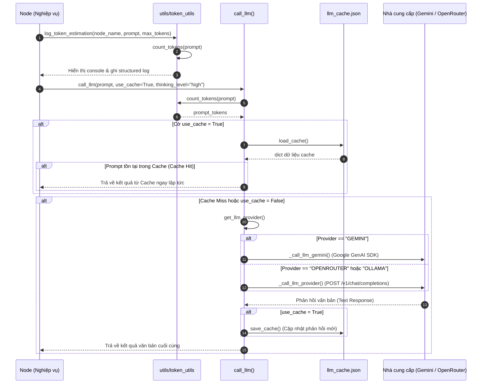

### 3.2 Sơ đồ Cây Quyết định: Điều hướng Nhà cung cấp và Cấu hình Suy luận

Sơ đồ luồng dưới đây thể hiện toàn bộ nhánh logic rẽ hướng bên trong `call_llm()`, `_call_llm_gemini()` và `_call_llm_provider()`:

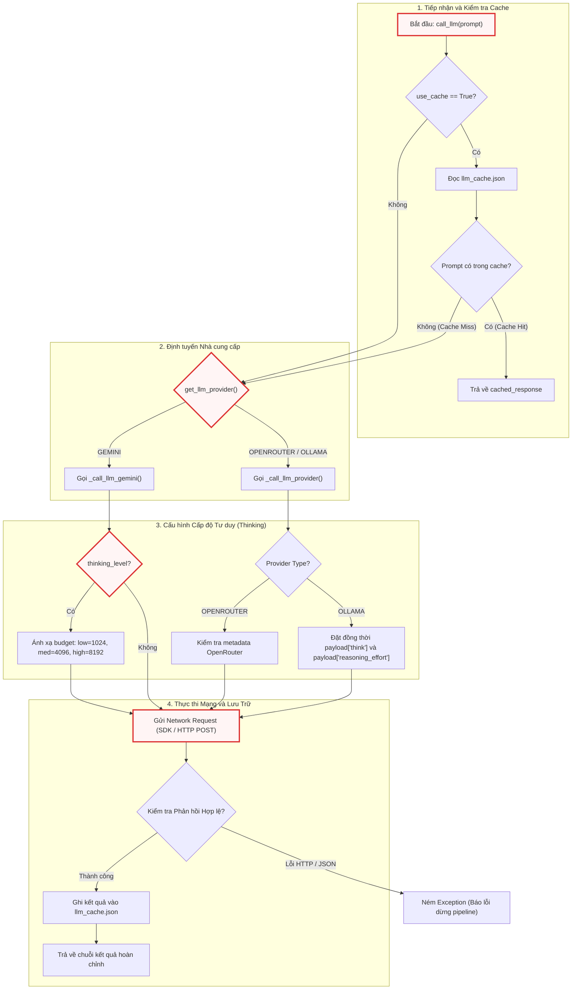

---

## 4. Ràng buộc Kỹ thuật, Xử lý Đồng thời & Khả năng Mở rộng

Khi vận hành hệ thống trong môi trường thực tế với các kho mã nguồn lớn, kỹ sư cần lưu ý các đặc tính vận hành sau:

### 4.1 Mô hình I/O-Bound và Rủi ro Tranh chấp Tệp Cache (Race Conditions)

* Toàn bộ các thao tác mạng gọi LLM đều là các tác vụ I/O-bound có độ trễ lớn (dao động từ $2$ giây đến hơn $60$ giây cho mỗi yêu cầu).
* **Tranh chấp Ghi Cache (Cache Race Condition)**: Hiện tại, `llm_cache.json` được thiết kế dưới dạng một tệp JSON phẳng đơn lẻ trên đĩa. Trong mô hình thực thi tuần tự của PocketFlow, cơ chế này hoạt động hoàn hảo mà không gặp rủi ro xung đột. Tuy nhiên, nếu hệ thống được nâng cấp để chạy các Node hoặc các Chapter song song (sử dụng `asyncio` hoặc `concurrent.futures`), việc nhiều tiến trình cùng đọc/ghi đồng thời vào `llm_cache.json` mà không có cơ chế khóa tệp (File Locking như thư viện `filelock`) sẽ dẫn đến hiện tượng tệp JSON bị hỏng dữ liệu (`JSONDecodeError`).

### 4.2 Chiến lược Quản lý Hạn ngạch và Timeout

* Hàm `_call_llm_provider` áp dụng cấu hình `timeout=(10, 300)`. Đây là thiết kế có chủ đích:
  * **Connect Timeout (10s)**: Ngắt kết nối sớm nếu địa chỉ IP máy chủ không phản hồi, ngăn ngừa việc tiến trình bị treo vô thời hạn do sự cố định tuyến mạng.
  * **Read Timeout (300s)**: Dành thời lượng đủ lớn cho các mô hình có năng lực suy luận sâu (như Gemini 3.7 Thinking hoặc DeepSeek R1) tổng hợp và phân tích các prompt mã nguồn phức tạp có dung lượng lên đến hàng chục nghìn tokens.

### 4.3 Độ Lệch Mã hóa Token (Tokenizer Drift)

* Module `token_utils.py` chuẩn hóa việc đếm token thông qua bảng từ vựng `cl100k_base` của OpenAI.
* Cần lưu ý rằng: Google Gemini sử dụng bộ mã hóa BPE riêng biệt của họ (SentencePiece-based tokenizer). Do đó, số lượng token tính toán bởi `tiktoken` sẽ có độ lệch nhỏ ($\pm 5-10\%$) so với số token thực tế mà API của Gemini tính toán. Tuy nhiên, với cửa sổ ngữ cảnh lên tới $1{,}000{,}000$ tokens của Gemini, mức độ sai lệch này hoàn toàn nằm trong biên độ an toàn cho phép.

---

## 5. Ghi chú Thực tế cho Kỹ sư Mới (Practical Notes for New Team Members)

### 5.1 Vị trí Cấu hình và Biến Môi trường Cần Thiết

Toàn bộ cấu hình của thành phần này được điều khiển qua tệp `.env` tại thư mục gốc của dự án. Dưới đây là bảng ma trận các biến môi trường quan trọng:

```ini
# ==============================================================================
# CẤU HÌNH NHÀ CUNG CẤP AI (CHỌN 1 TRONG 3 NHÓM DƯỚI ĐÂY)
# ==============================================================================

# Nhóm 1: Google Gemini (Khuyên dùng - Mặc định)
LLM_PROVIDER=GEMINI
GEMINI_API_KEY=AIzaSy...               # Sử dụng cho Google AI Studio
# Hoặc cấu hình Vertex AI Enterprise:
# GEMINI_PROJECT_ID=my-gcp-project
# GEMINI_LOCATION=us-central1
GEMINI_MODEL=gemini-3.7-flash

# Nhóm 2: OpenRouter (Hỗ trợ truy cập đa dạng mô hình thương mại)
# LLM_PROVIDER=OPENROUTER
# OPENROUTER_API_KEY=sk-or-v1-...
# OPENROUTER_BASE_URL=https://openrouter.ai/api
# OPENROUTER_MODEL=anthropic/claude-3.7-sonnet

# Nhóm 3: Máy chủ Mô hình Cục bộ (Ollama)
# LLM_PROVIDER=OLLAMA
# OLLAMA_BASE_URL=http://localhost:11434
# OLLAMA_MODEL=qwen2.5-coder:32b
# OLLAMA_API_KEY=                      # Để trống nếu không yêu cầu
```

### 5.2 Điểm Gỡ lỗi Phổ biến (Common Debugging Entry Points)

1. **Kiểm tra Log Truy vấn Đầy đủ**: Mọi prompt thô gửi đi và văn bản phản hồi nhận về đều được ghi nhận chi tiết tại tệp log có cấu trúc trong thư mục `logs/llm_execution.log` (được kích hoạt bởi `main.py`). Khi kết quả đầu ra của tài liệu không như kỳ vọng, hãy tìm kiếm từ khóa `LLM CALL START` hoặc `PROMPT:` trong tệp log này để kiểm tra nội dung prompt thực tế.
2. **Điểm Đặt Breakpoint Chiến lược**:
   * `utils/call_llm.py:call_llm`: Kiểm tra luồng xem prompt có bị Cache Hit ngoài ý muốn hay không.
   * `utils/call_llm.py:_call_llm_gemini`: Kiểm tra đối tượng `kwargs["config"]` xem `thinking_budget` có được truyền chính xác vào SDK hay không.
   * `utils/call_llm.py:_call_llm_provider`: Đặt breakpoint ngay trước dòng `requests.post` để kiểm tra cấu trúc payload JSON thực tế gửi đến OpenRouter/Ollama.

### 5.3 Điểm Kỳ dị & Nợ Kỹ thuật Cần Lưu ý (Known Quirks & Tech Debt)

* **Xóa Bộ nhớ đệm Thao tác Tay**: Tệp `llm_cache.json` lưu dồn toàn bộ phản hồi qua các lần chạy. Khi bạn thay đổi mã nguồn prompt template trong các file `prompts/` hoặc thay đổi logic phân tích AST, prompt có thể vẫn giữ nguyên nếu nội dung file không đổi, dẫn đến việc LLM trả về kết quả cũ từ cache. Khi debug hoặc tinh chỉnh prompt, hãy chạy CLI với cờ vô hiệu hóa cache hoặc chủ động xóa tệp `llm_cache.json`.
* **Trích xuất Text Part từ Gemini SDK**: Tại `_call_llm_gemini`, đoạn code kiểm tra `response.candidates[0].content.parts` là bắt buộc để tránh crash khi Gemini trả về cấu trúc nội dung hỗn hợp chứa cả khối reasoning metadata và khối văn bản thường. Đừng cố gắng thay thế nó bằng thuộc tính viết tắt `response.text` vì thuộc tính này sẽ ném ngoại lệ nếu phản hồi chứa các phần tử phi văn bản (non-text parts).

### 5.4 Quy chuẩn Đánh giá Mã nguồn (Code Review Checklist)

Khi đánh giá (review) các Pull Request liên quan đến module này, cần kiểm tra nghiêm ngặt:
* [ ] Có đoạn mã nào vô tình hardcode chuỗi API Key hoặc URL thay vì đọc từ `os.environ` không?
* [ ] Khi bổ sung Provider mới, hàm có đảm bảo tuân thủ cấu trúc timeout `timeout=(10, 300)` và bóc tách lỗi HTTP chi tiết không?
* [ ] Hàm đếm token mới (nếu có) có cơ chế fallback an toàn phòng trường hợp thư viện BPE bị lỗi không?
* [ ] Định dạng bản ghi log có duy trì quy chuẩn phân cách bằng ký tự `|` để không làm hỏng bộ phân tích log tự động không?

---

## 6. Tóm tắt Kỹ thuật & Chuyển tiếp

Trong chương này, chúng ta đã mổ xẻ toàn diện kiến trúc của Tầng Tích hợp Mô hình Ngôn ngữ & Quản lý Token Context:
1. **Kiến trúc Adapter/Gateway**: Cách module `call_llm.py` trừu tượng hóa sự khác biệt giữa SDK độc quyền Google Gemini và giao thức chuẩn OpenAI (OpenRouter, Ollama) thành một giao diện thống nhất.
2. **Cơ chế Quản lý Cấp độ Tư duy**: Ánh xạ linh hoạt tham số `thinking_level` thành ngân sách token (`ThinkingConfig`) trên Gemini và cấu hình `reasoning_effort`/`think` trên OpenRouter/Ollama.
3. **Đo lường & Phân tích Token**: Cơ chế đếm token Singleton dựa trên `tiktoken` với phương án dự phòng ký tự, kết hợp cùng hệ thống phân rã dung lượng context đa kênh (`log_token_estimation`).
4. **Bộ nhớ đệm Hai Lớp**: Khả năng tối ưu chi phí và tăng tốc chu trình phát triển thông qua bộ nhớ đệm `llm_cache.json`.

Sau khi đã làm chủ tầng thu thập dữ liệu mã nguồn ([Chương 2](02_hệ_thống_thu_thập___lọc_mã_nguồn_đa_nguồn.md)) và tầng giao tiếp AI Gateway (Chương 3), hệ thống đã sẵn sàng kết nối các thành phần này vào một đồ thị xử lý có cấu trúc. Hãy cùng chuyển tiếp sang [Chương 4: Động cơ Điều phối Luồng & Xử lý Node Đa tầng](04_động_cơ_điều_phối_luồng___xử_lý_node_đa_tầng.md) để khám phá cách framework PocketFlow điều phối luồng dữ liệu qua các Node phân tích, trích xuất cấu trúc trừu tượng và kiến tạo tài liệu chuyên sâu.


---

<a id="chapter-4"></a>

# Chapter 4: Động cơ Điều phối Luồng & Xử lý Node Đa tầng


Sau khi đã thiết lập nền tảng giao tiếp AI và kiểm soát ngân sách token tại [Chương 3: Tích hợp Mô hình Ngôn ngữ & Quản lý Token Context](03_tích_hợp_mô_hình_ngôn_ngữ___quản_lý_token_context.md), hệ thống cần một cơ chế điều phối cấp cao để kết nối các tài nguyên mã nguồn thô thành một chuỗi phân tích mạch lạc. Động cơ Điều phối Luồng (Flow Orchestration Engine) và hệ thống Node xử lý đa tầng chính là hạt nhân hiện thực hóa toàn bộ logic nghiệp vụ đó.

Chương này sẽ phân tích chi tiết cấu trúc đồ thị luồng có hướng không chu trình (DAG - Directed Acyclic Graph) được xây dựng trên nền tảng framework PocketFlow, phân tích sâu các mẫu thiết kế kiến trúc, chiến lược phân bổ token hai lượt (two-pass token budgeting), cơ chế lưu đệm tăng dần bằng mã băm MD5 và thuật toán gom cụm điều hướng tài liệu tự động.

---

## 1. Tổng quan Kiến trúc (Technical Overview)

### 1.1 Vai trò Kiến trúc (Architectural Role)
Trong kiến trúc tổng thể, thành phần này đóng vai trò là **Bộ Điều Phối Trung Tâm (Core Orchestrator)**. Quá trình chuyển đổi một kho mã nguồn lớn thành bộ tài liệu hoàn chỉnh đòi hỏi việc phân tách thành nhiều giai đoạn tính toán: thu thập tệp tin, đo lường dung lượng ngữ cảnh, trích xuất các khái niệm trừu tượng (abstractions), phân tích quan hệ phụ thuộc, định thứ tự đọc tối ưu và soạn thảo nội dung từng chương.

Nếu không có động cơ điều phối này, hệ thống sẽ rơi vào một kiến trúc nguyên khối (monolithic script), dẫn đến các vấn đề nghiêm trọng:
- Khó kiểm soát lỗi cục bộ (nếu một bước sinh nội dung thất bại, toàn bộ tiến trình phân tích trước đó bị mất trắng).
- Không thể tối ưu hóa dung lượng token động theo kích thước repository (dễ vượt ngưỡng context window của LLM).
- Không có cơ chế lưu đệm trạng thái giữa chừng, gây lãng phí chi phí API và thời gian chạy khi biên dịch lại.

Hệ thống giải quyết triệt để vấn đề này bằng cách mô hình hóa toàn bộ quy trình thành một đồ thị thực thi, trong đó mỗi nút (Node) là một đơn vị tính toán độc lập, tự đóng gói logic và giao tiếp với nhau qua một bộ nhớ dùng chung (`shared store`).

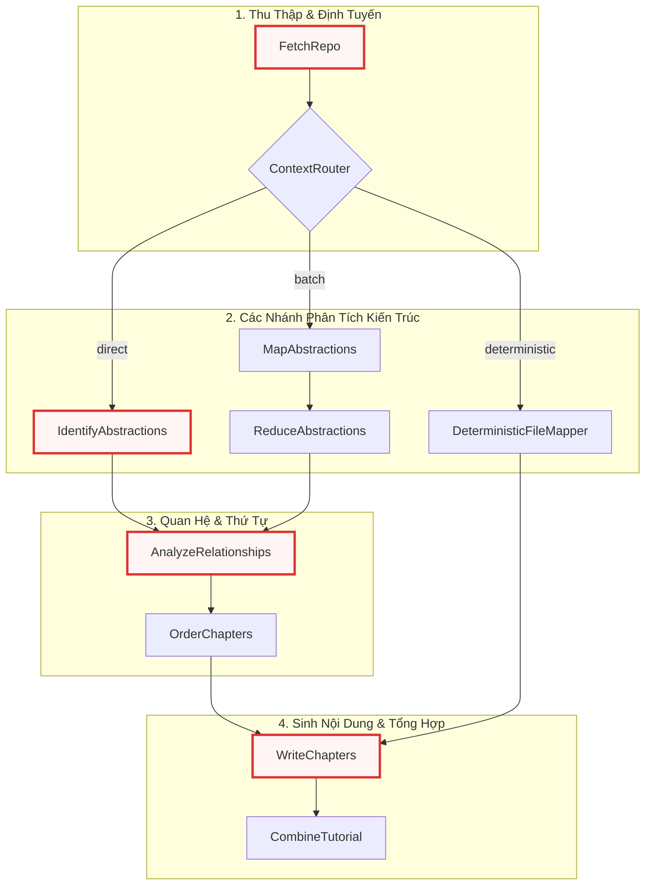

### 1.2 Các Mẫu Thiết kế (Design Patterns)
Động cơ điều phối áp dụng 5 mẫu thiết kế phần mềm cốt lõi:

1. **Pipeline & Chain of Responsibility Pattern**: Toàn bộ quy trình xử lý dữ liệu được tổ chức thành các trạm liên tiếp. Dữ liệu đầu ra của trạm trước trở thành đầu vào hoặc ngữ cảnh cho trạm sau thông qua cấu trúc từ điển `shared store`.
2. **Template Method Pattern**: Hiện thực hóa thông qua lớp cơ sở `Node` và `BatchNode` của PocketFlow. Chu trình sống của mỗi nút bắt buộc tuân theo ba pha: `prep()` (chuẩn bị dữ liệu/prompt) $\rightarrow$ `exec()` (thực thi I/O mạng hoặc tính toán nặng) $\rightarrow$ `post()` (cập nhật kết quả vào `shared store` hoặc quyết định nhánh rẽ).
3. **Strategy / Dynamic Routing Pattern**: Nút `ContextRouter` đánh giá kích thước mã nguồn thực tế so với giới hạn `max_tokens` của LLM để chuyển đổi linh hoạt giữa các chiến lược xử lý: `direct` (xử lý đơn lượt), `batch` (MapReduce đa lượt) hoặc `deterministic` (ánh xạ từng tệp mã nguồn cho API Reference).
4. **MapReduce Pattern**: Áp dụng trong cặp nút `MapAbstractions` và `ReduceAbstractions` khi phân tích các repository vượt ngưỡng cửa sổ ngữ cảnh, chia nhỏ tệp mã nguồn thành từng lô và tổng hợp danh sách khái niệm kiến trúc tổng thể.
5. **Incremental Cache Pattern**: Áp dụng tại `WriteChapters` thông qua bảng kê `.doc_cache_manifest.json` và mã băm MD5 của nội dung tệp, giúp bỏ qua các chương không có thay đổi mã nguồn trong các lần chạy kế tiếp.

### 1.3 Trách nhiệm Cốt lõi (Core Responsibilities)
- **Quản lý cấu trúc Đồ thị Luồng (DAG Topology)**: Thiết lập thứ tự thực thi và các ràng buộc phụ thuộc giữa các node trong `flow.py`.
- **Định tuyến Ngữ cảnh & Cân đối Dung lượng (Token Budget Routing)**: Đo lường chính xác chi phí token (file content, directory tree, prompt overhead) để phân nhánh xử lý an toàn.
- **Phát hiện Trừu tượng Kiến trúc (Architectural Abstraction Discovery)**: Nhận diện các thành phần cốt lõi của hệ thống mã nguồn thông qua phân tích cú pháp YAML trả về từ LLM.
- **Phân tích Đồ thị Phụ thuộc (Dependency Analysis)**: Thiết lập quan hệ gọi/kế thừa giữa các module với thuật toán phân bổ ngân sách hai lượt chống cạn kiệt token.
- **Sinh Chương Tuần tự kèm Tóm tắt Lũy kế (Progressive Chapter Generation)**: Tạo tài liệu từng chương và duy trì ngữ cảnh kỹ thuật liên chương mà không gây bùng nổ token $O(n^2)$.
- **Biên tập & Xuất bản Đa định dạng (Multi-format Publishing)**: Xuất bản tài liệu dưới dạng tệp Markdown độc lập hoặc cấu trúc thư mục MkDocs hoàn chỉnh kèm sơ đồ tương tác Mermaid.

### 1.4 Các Phụ thuộc Chính (Key Dependencies)

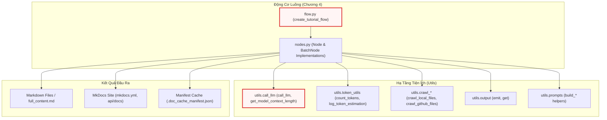

---

## 2. Kiến trúc Đồ thị Thực thi & Mô hình Vòng đời Node

### 2.1 Cấu hình Đồ thị Thực thi (`create_tutorial_flow`)
Tệp `flow.py` là nơi duy nhất định nghĩa cấu trúc đồ thị thực thi bằng cách khởi tạo các đối tượng Node và kết nối chúng bằng các toán tử luồng của PocketFlow (`>>` cho luồng tuần tự và `- "branch_name" >>` cho định tuyến có điều kiện).

```python
def create_tutorial_flow():
    fetch_repo = FetchRepo()
    context_router = ContextRouter()
    map_abstractions = MapAbstractions(max_retries=5, wait=20)
    reduce_abstractions = ReduceAbstractions(max_retries=5, wait=20)
    identify_abstractions = IdentifyAbstractions(max_retries=5, wait=20)
    analyze_relationships = AnalyzeRelationships(max_retries=5, wait=20)
    order_chapters = OrderChapters(max_retries=5, wait=20)
    write_chapters = WriteChapters(max_retries=5, wait=20)
    combine_tutorial = CombineTutorial()
    deterministic_mapper = DeterministicFileMapper(max_retries=5, wait=20)

    fetch_repo >> context_router

    context_router - "direct" >> identify_abstractions
    context_router - "batch" >> map_abstractions
    context_router - "deterministic" >> deterministic_mapper

    map_abstractions >> reduce_abstractions

    identify_abstractions >> analyze_relationships
    reduce_abstractions >> analyze_relationships

    analyze_relationships >> order_chapters
    order_chapters >> write_chapters

    deterministic_mapper >> write_chapters

    write_chapters >> combine_tutorial

    return Flow(start=fetch_repo)
```

Đoạn mã trên thể hiện sự tách biệt rõ ràng giữa cấu trúc đồ thị và logic xử lý nội tại của từng nút. Các nút có tương tác trực tiếp với mô hình ngôn ngữ lớn (LLM) đều được cấu hình tham số tự phục hồi `max_retries=5` và thời gian chờ giãn cách `wait=20` giây để xử lý triệt để các sự cố gián đoạn mạng hoặc lỗi vượt hạn ngạch tốc độ (rate limit).

Điểm đáng chú ý trong cấu trúc đồ thị này là cơ chế hội tụ luồng:
1. Nhánh `direct` (đi qua `identify_abstractions`) và nhánh `batch` (đi qua `map_abstractions >> reduce_abstractions`) đều hội tụ tại `analyze_relationships`.
2. Nhánh `deterministic` (đi qua `deterministic_mapper`) bỏ qua hoàn toàn các bước phân tích quan hệ trừu tượng và sắp xếp chương, đi thẳng vào `write_chapters` vì thứ tự tệp đã được tính toán tất định theo cấu trúc thư mục.

### 2.2 Vòng đời Thực thi của `Node` và `BatchNode`
Mỗi Node trong hệ thống kế thừa từ lớp `Node` hoặc `BatchNode` của thư viện PocketFlow và bắt buộc phải tuân theo chu trình ba bước nghiêm ngặt:

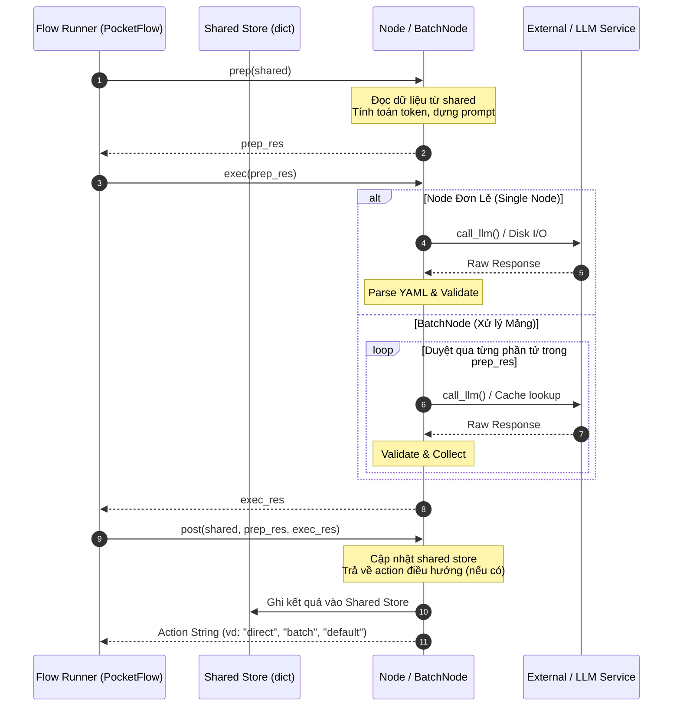

- **`prep(self, shared)`**: Hàm nhận tham chiếu đến từ điển `shared`. Tại đây, Node chỉ đọc các khóa cần thiết, tính toán dữ liệu trung gian và chuẩn bị tham số đầu vào (ví dụ: prompt string, token budget). Pha này tuyệt đối không thay đổi trạng thái của `shared`.
- **`exec(self, prep_res)`**: Nhận đầu ra của `prep()`. Đây là nơi diễn ra các tác vụ tốn thời gian hoặc có khả năng phát sinh ngoại lệ (gọi mạng HTTP, đọc ghi tệp đĩa, phân tích cú pháp). Đối với `BatchNode`, `exec(self, item)` sẽ được gọi lặp cho từng phần tử trong danh sách mà `prep()` trả về.
- **`post(self, shared, prep_res, exec_res)`**: Nhận kết quả từ `exec()`, tiến hành ghi đè hoặc bổ sung các trường dữ liệu mới vào `shared`. Nếu Node tham gia định tuyến, hàm này sẽ trả về chuỗi định danh nhánh tiếp theo (ví dụ: `"direct"`, `"batch"`).

---

## 3. Phân tích Chi tiết Từng Node & Luồng Nghiệp vụ

### 3.1 Thu thập và Tiền xử lý Mã nguồn (`FetchRepo`)
Nút `FetchRepo` đóng vai trò là điểm vào (`start`) của toàn bộ đồ thị. Nó tiếp nhận cấu hình nguồn từ CLI/môi trường và chuyển hóa cây thư mục thành một danh sách phẳng các bộ dữ liệu `(path, content)`.

```python
class FetchRepo(Node):
    def prep(self, shared):
        repo_url = shared.get("repo_url")
        local_dir = shared.get("local_dir")
        project_name = shared.get("project_name")

        if not project_name:
            if repo_url:
                project_name = repo_url.split("/")[-1].replace(".git", "")
            else:
                project_name = os.path.basename(os.path.abspath(local_dir))
            shared["project_name"] = project_name

        include_patterns = shared["include_patterns"]
        exclude_patterns = shared["exclude_patterns"]
        max_file_size = shared["max_file_size"]

        return {
            "repo_url": repo_url,
            "local_dir": local_dir,
            "token": shared.get("github_token"),
            "include_patterns": include_patterns,
            "exclude_patterns": exclude_patterns,
            "max_file_size": max_file_size,
            "use_relative_paths": True,
        }
```

Trong phương thức `prep()`, nếu tên dự án (`project_name`) chưa được người dùng chỉ định tường minh qua dòng lệnh, hệ thống sẽ tự động suy luận tên dự án từ phần cuối của URL GitHub hoặc tên thư mục cục bộ. Toàn bộ các quy tắc lọc tệp (`include_patterns`, `exclude_patterns`) và trần dung lượng tệp (`max_file_size`) được đóng gói thành một từ điển cấu hình độc lập để bàn giao cho `exec()`.

```python
    def exec(self, prep_res):
        source = prep_res["repo_url"] or prep_res["local_dir"]
        llm_logger.info(f"NODE EXEC | node=FetchRepo | action=crawl_files | source={source}")

        if prep_res["repo_url"]:
            emit("CRAWL_REPOSITORY", url=prep_res["repo_url"])
            result = crawl_github_files(
                repo_url=prep_res["repo_url"],
                token=prep_res["token"],
                include_patterns=prep_res["include_patterns"],
                exclude_patterns=prep_res["exclude_patterns"],
                max_file_size=prep_res["max_file_size"],
                use_relative_paths=prep_res["use_relative_paths"],
            )
        else:
            emit("CRAWL_DIRECTORY", path=prep_res["local_dir"])
            result = crawl_local_files(
                directory=prep_res["local_dir"],
                include_patterns=prep_res["include_patterns"],
                exclude_patterns=prep_res["exclude_patterns"],
                max_file_size=prep_res["max_file_size"],
                use_relative_paths=prep_res["use_relative_paths"],
            )

        files_list = list(result.get("files", {}).items())
        if len(files_list) == 0:
            raise ValueError("No matching files found. Check your directory and include/exclude patterns.")

        llm_logger.info(f"NODE COMPLETE | node=FetchRepo | files_found={len(files_list)}")
        return files_list

    def post(self, shared, prep_res, exec_res):
        shared["files"] = exec_res  # List of (path, content) tuples
```

Phương thức `exec()` kích hoạt bộ thu thập tệp tương ứng (GitHub crawler hoặc Local crawler) đã được xây dựng từ [Chương 2: Hệ thống Thu thập & Lọc Mã nguồn Đa nguồn](02_hệ_thống_thu_thập___lọc_mã_nguồn_đa_nguồn.md). Kết quả được chuyển đổi từ dạng từ điển sang danh sách các tuple `[(path, content), ...]`, đảm bảo tính tất định về thứ tự chỉ mục (`index`) của tệp trong suốt toàn bộ pipeline hạ nguồn. Nếu danh sách tệp rỗng, hệ thống sẽ phát sinh `ValueError` ngay lập tức theo nguyên lý Fail-Fast để dừng tiến trình trước khi tiêu tốn tài nguyên token.

---

### 3.2 Đo lường & Định tuyến Ngữ cảnh Động (`ContextRouter`)
`ContextRouter` là nút ra quyết định thông minh nhất trong đồ thị luồng. Nhiệm vụ của nó là tính toán chính xác tổng lượng token của mã nguồn, khấu trừ dung lượng tiêu hao cố định của hệ thống prompt, và chọn ra nhánh thực thi tối ưu nhất.

#### Giai đoạn 1: Đo lường Overhead và Tính toán Ngưỡng An toàn
```python
class ContextRouter(Node):
    def prep(self, shared):
        files_data = shared["files"]
        max_tokens = resolve_max_tokens(shared)
        shared["max_tokens"] = max_tokens

        count_tokens = create_token_counter()

        prompt_dir = os.path.join(os.path.dirname(os.path.abspath(__file__)), "prompts")
        max_template_tokens = 0
        for subdir in ["tutorial", "advanced"]:
            template_path = os.path.join(prompt_dir, subdir, "map_abstractions.md")
            if os.path.exists(template_path):
                with open(template_path, encoding="utf-8-sig") as f:
                    t = count_tokens(f.read())
                max_template_tokens = max(max_template_tokens, t)

        directory_tree = build_directory_tree(files_data)
        tree_tokens = count_tokens(directory_tree)

        file_listing_str = "\n".join(f"- {i} # {path}" for i, (path, _) in enumerate(files_data))
        listing_tokens = count_tokens(file_listing_str)

        prompt_overhead = max_template_tokens + tree_tokens + listing_tokens
        emit(
            "CAPACITY_PROMPT_OVERHEAD",
            total=f"{prompt_overhead:,}",
            template=f"{max_template_tokens:,}",
            tree=f"{tree_tokens:,}",
            listing=f"{listing_tokens:,}",
        )
```

Đoạn mã trên xử lý bài toán định cỡ ngữ cảnh một cách thận trọng. Thay vì giả định một con số tĩnh, `ContextRouter` nạp trực tiếp mẫu prompt từ đĩa, dựng cây thư mục đầy đủ (`build_directory_tree`) và đo lường kích thước chính xác bằng bộ đếm token BPE (`tiktoken`). Tổng dung lượng của các phần tử này được gộp thành `prompt_overhead`.

#### Giai đoạn 2: Phân nhóm Token và Quyết định Nhánh Rẽ
```python
        total_tokens = 0
        file_token_map = []
        for i, (path, content) in enumerate(files_data):
            entry = f"--- File Index {i}: {path} ---\n{content}\n\n"
            tokens = count_tokens(entry)
            total_tokens += tokens
            file_token_map.append(tokens)

        safety_limit = int(max_tokens * 0.95)
        effective_limit = safety_limit - prompt_overhead
        force_batch = shared.get("force_batch", False)

        if shared.get("mode", "tutorial") == "api-reference":
            emit("CAPACITY_API_REF_MODE")
            return ("deterministic", files_data, effective_limit, shared.get("batch_size", 50), None, None, directory_tree, False)

        if total_tokens <= effective_limit and not force_batch:
            emit(
                "CAPACITY_FITS", tokens=f"{total_tokens:,}", limit=f"{effective_limit:,}", safety=f"{safety_limit:,}", overhead=f"{prompt_overhead:,}"
            )
            return ("direct", files_data, effective_limit, shared.get("batch_size", 50), None, None, directory_tree, False)

        return (
            "batch",
            files_data,
            effective_limit,
            shared.get("batch_size", 50),
            file_token_map,
            count_tokens,
            directory_tree,
            shared.get("debug", False),
        )
```

Giới hạn hiệu dụng (`effective_limit`) được tính toán bằng công thức:
$$\text{effective\_limit} = (\text{max\_tokens} \times 0.95) - \text{prompt\_overhead}$$

Trong đó, biên an toàn $5\%$ được bảo lưu để chứa phản hồi sinh ra từ LLM. Logic định tuyến hoạt động như sau:
1. Nếu chế độ hoạt động là `api-reference`, tuyến đường lập tức được gán thành `"deterministic"`.
2. Nếu tổng số token của toàn bộ mã nguồn nhỏ hơn hoặc bằng `effective_limit` và không bật cờ `--force-batch`, hệ thống chọn tuyến `"direct"`.
3. Trường hợp mã nguồn vượt ngưỡng `effective_limit` hoặc có cờ ép buộc phân lô, tuyến đường được gán thành `"batch"`.

#### Giai đoạn 3: Thuật toán Gom Cụm Lô Giữ Toàn Vẹn Thư Mục (Folder-Aware Batching)
```python
    def exec(self, prep_res):
        route, files_data, effective_limit, batch_size, file_token_map, _count_tokens, directory_tree, debug = prep_res

        if route in ("direct", "deterministic"):
            return route

        dir_groups = defaultdict(list)
        for i, (path, content) in enumerate(files_data):
            dir_groups[os.path.dirname(path)].append((i, path, content, file_token_map[i]))

        batches = []
        for dirname in sorted(dir_groups.keys()):
            current_batch = []
            current_tokens = 0

            for i, path, content, tokens in dir_groups[dirname]:
                if current_batch and (current_tokens + tokens > effective_limit or len(current_batch) >= batch_size):
                    batches.append(current_batch)
                    current_batch = []
                    current_tokens = 0

                current_batch.append((i, path, content))
                current_tokens += tokens

            if current_batch:
                batches.append(current_batch)

        self._directory_tree = directory_tree
        return batches

    def post(self, shared, prep_res, exec_res):
        if exec_res in ("direct", "deterministic"):
            return exec_res
        shared["file_batches"] = exec_res
        shared["directory_tree"] = getattr(self, "_directory_tree", build_directory_tree(shared["files"]))
        return "batch"
```

Khi rơi vào nhánh `batch`, phương thức `exec()` thực thi một thuật toán gom cụm thông minh:
- Gom tất cả các tệp có chung thư mục cha (`os.path.dirname`) vào cùng một nhóm để bảo toàn ngữ cảnh cục bộ của các module có liên quan chặt chẽ.
- Không bao giờ trộn lẫn các tệp của hai thư mục khác nhau vào cùng một lô trừ khi lô đó đã được đóng gói hoàn toàn.
- Kiểm tra liên tục hai điều kiện dừng của mỗi lô: tổng lượng token vượt quá `effective_limit` hoặc số lượng tệp đạt trần `batch_size`.
- Giá trị trả về từ `post()` trực tiếp kích hoạt PocketFlow chuyển hướng luồng dữ liệu sang nhánh tương ứng.

---

### 3.3 Ánh xạ Module Quyết định (`DeterministicFileMapper`)
Dành riêng cho chế độ sinh tài liệu tham chiếu API (`api-reference`), nút `DeterministicFileMapper` loại bỏ tính ngẫu nhiên trong việc phân nhóm module của LLM và thay thế bằng việc lập tài liệu cho từng tệp mã nguồn cụ thể.

```python
class DeterministicFileMapper(Node):
    def prep(self, shared):
        files_data = shared["files"]
        project_name = shared["project_name"]
        file_listing = "\n".join([f"{i} # {path}" for i, (path, _) in enumerate(files_data)])
        prompt = build_code_file_filter_prompt(project_name, file_listing)
        return prompt, shared.get("use_cache", True), shared.get("thinking_level", None), shared.get("max_tokens", 100000)

    def exec(self, prep_res):
        try:
            prompt, use_cache, thinking_level, max_tokens = prep_res
            emit("LLM_CALL_FILTER_FILES")
            log_token_estimation(self.__class__.__name__, prompt, max_tokens)
            response = call_llm(prompt, use_cache=(use_cache and self.cur_retry == 0), thinking_level=thinking_level)
            valid_indices = parse_yaml_response(response)
            if not isinstance(valid_indices, list):
                valid_indices = []
            return [int(idx) for idx in valid_indices]
        except Exception as e:
            emit("NODE_RETRY_ERROR", class_name=self.__class__.__name__, error=e)
            llm_logger.error(f"[Node {self.__class__.__name__}] Error: {e}", exc_info=True)
            raise e
```

Thay vì phân tích toàn bộ nội dung tệp, `DeterministicFileMapper` gửi danh sách đường dẫn tệp đến LLM với prompt chuyên biệt `build_code_file_filter_prompt` để sàng lọc các tệp mã nguồn thuần túy chứa logic nghiệp vụ, đồng thời loại bỏ các tệp giao diện (UI layout như `.xaml`, `.html`), tệp cấu hình (`.xml`, `.json`), và kịch bản dựng (`.csproj`).

```python
    def post(self, shared, prep_res, exec_res):
        files = shared.get("files", [])
        valid_indices = set(exec_res)
        modules = []
        chapter_order = []

        for idx, (file_path, _content) in enumerate(files):
            if idx not in valid_indices:
                emit("SKIP_NON_CODE_FILE", path=file_path)
                continue

            clean_name = os.path.basename(file_path)
            modules.append(
                {"name": clean_name, "description": f"Internal API reference for `{file_path}`", "files": [idx], "original_path": file_path}
            )
            chapter_order.append(len(modules) - 1)

        shared["abstractions"] = modules
        shared["chapter_order"] = sorted(
            chapter_order,
            key=lambda idx: (
                -modules[idx]["original_path"].count("/") - modules[idx]["original_path"].count(os.sep),
                modules[idx]["original_path"].lower(),
            ),
        )
        shared["relationships"] = {"summary": "Deterministic Internal API Reference.", "details": []}
        emit("DONE_DETERMINISTIC_MAPPER", count=len(modules))
        return "default"
```

Trong phương thức `post()`, một cơ chế sắp xếp thứ tự chương đặc biệt được áp dụng: **Sắp xếp theo độ sâu thư mục giảm dần (Deepest Directory First)**. Các tệp nằm sâu nhất trong cây thư mục (thường là các hàm tiện ích `utils`, lớp cơ sở dữ liệu `models`) sẽ được đặt lên đầu để viết tài liệu trước. Khi đến lượt các tệp điều phối cấp cao ở thư mục gốc (như `main.py` hay `server.py`), phần tóm tắt kỹ thuật của các module tầng dưới đã sẵn sàng làm ngữ cảnh bổ trợ.

---

### 3.4 Nhận diện Khái niệm Kiến trúc Trực tiếp (`IdentifyAbstractions`)
Khi kích thước mã nguồn nằm trong giới hạn một lần gọi của LLM (nhánh `direct`), `IdentifyAbstractions` chịu trách nhiệm phân tích toàn bộ repository và trích xuất danh sách các khái niệm kiến trúc cốt lõi.

```python
class IdentifyAbstractions(Node):
    def prep(self, shared):
        files_data = shared["files"]
        project_name = shared["project_name"]
        language = shared.get("language", "english")
        use_cache = shared.get("use_cache", True)
        max_abstraction_num = shared.get("max_abstraction_num", 10)
        thinking_level = shared.get("thinking_level", None)

        def create_llm_context(files_data):
            max_tokens = resolve_max_tokens(shared)
            safety_limit = int(max_tokens * 0.95)
            count_tokens = create_token_counter()
            context = ""
            current_tokens = 0

            for i, (path, content) in enumerate(files_data):
                entry = f"--- File Index {i}: {path} ---\n{content}\n\n"
                entry_tokens = count_tokens(entry)
                if current_tokens + entry_tokens > safety_limit:
                    emit("WARN_CONTEXT_TRUNCATED", index=i, path=path, limit=safety_limit)
                    break
                context += entry
                current_tokens += entry_tokens
            return context

        context = create_llm_context(files_data)
        directory_tree = build_directory_tree(files_data)
        return (
            context, directory_tree, len(files_data), project_name,
            language, use_cache, max_abstraction_num, thinking_level,
            shared.get("advanced_mode", False), shared.get("max_tokens", 100000), shared.get("mode", "tutorial")
        )
```

Hàm `prep()` xây dựng một chuỗi ngữ cảnh liên tục chứa toàn bộ các tệp mã nguồn kèm chỉ mục định danh `File Index {i}`. Cơ chế cắt tỉa an toàn (`safety_limit`) được lồng trực tiếp trong vòng lặp duyệt tệp để phòng ngừa trường hợp tổng kích thước vượt ngưỡng bất ngờ.

```python
    def exec(self, prep_res):
        try:
            (context, directory_tree, total_files_count, project_name, language,
             use_cache, max_abstraction_num, thinking_level, _advanced_mode, max_tokens, mode) = prep_res

            language_instruction = ""
            name_lang_hint = ""
            desc_lang_hint = ""
            if language.lower() != "english":
                language_instruction = f"IMPORTANT: Generate the `name` and `description` for each abstraction in **{language.capitalize()}** language. Do NOT use English for these fields.\n\n"
                name_lang_hint = f" (value in {language.capitalize()})"
                desc_lang_hint = f" (value in {language.capitalize()})"

            prompt_template = load_prompt_template("identify_abstractions", mode=mode)
            prompt = prompt_template.format(
                project_name=project_name, context=context, language_instruction=language_instruction,
                max_abstraction_num=max_abstraction_num, name_lang_hint=name_lang_hint,
                desc_lang_hint=desc_lang_hint, directory_tree=directory_tree,
            )

            response = call_llm(prompt, use_cache=(use_cache and self.cur_retry == 0), thinking_level=thinking_level)
            abstractions = parse_yaml_response(response)

            validated_abstractions = []
            for item in abstractions:
                import re
                validated_indices = []
                for idx_entry in item["file_indices"]:
                    idx_str = str(idx_entry).split("#")[0].strip()
                    if "-" in idx_str:
                        parts = idx_str.split("-")
                        if len(parts) == 2:
                            start_idx = int(re.findall(r"\d+", parts[0])[0])
                            end_idx = int(re.findall(r"\d+", parts[1])[0])
                            validated_indices.extend(idx for idx in range(start_idx, end_idx + 1) if 0 <= idx < total_files_count)
                            continue
                    nums = re.findall(r"\d+", idx_str)
                    if nums:
                        idx = int(nums[0])
                        if 0 <= idx < total_files_count:
                            validated_indices.append(idx)

                validated_abstractions.append({
                    "name": item["name"],
                    "description": item["description"],
                    "files": sorted(set(validated_indices)),
                })
            return validated_abstractions
        except Exception as e:
            emit("NODE_RETRY_ERROR", class_name=self.__class__.__name__, error=e)
            raise e
```

Trong phương thức `exec()`, hệ thống thực hiện kiểm định nghiêm ngặt kết quả phản hồi từ LLM:
- Sử dụng hàm `parse_yaml_response` để bóc tách khối YAML nằm trong cặp dấu ```yaml.
- Sử dụng biểu thức chính quy (`regex`) để chuẩn hóa trường `file_indices`. LLM thường trả về các định dạng phong phú như `["0 # main.py", "1-3"]`. Logic trên xử lý phân tách dải số liên tiếp (`0-3` $\rightarrow$ `[0, 1, 2, 3]`), loại bỏ phần chú thích đường dẫn phía sau dấu `#`, và kiểm tra biên (`0 <= idx < total_files_count`) để ngăn chặn hoàn toàn lỗi truy cập vượt chỉ mục (IndexError).

---

### 3.5 Phân tách và Tổng hợp Khái niệm Kiến trúc Lớn (`MapAbstractions` & `ReduceAbstractions`)
Khi xử lý các kho mã nguồn vượt ngưỡng kích thước của một cửa sổ ngữ cảnh, nhánh `batch` sẽ kích hoạt mô hình MapReduce gồm hai giai đoạn.

```python
class MapAbstractions(BatchNode):
    def prep(self, shared):
        return [
            {
                "batch_index": i,
                "files": batch,
                "project_name": shared["project_name"],
                "language": shared.get("language", "english"),
                "use_cache": shared.get("use_cache", True),
                "thinking_level": shared.get("thinking_level", None),
                "max_tokens": shared.get("max_tokens", 100000),
                "directory_tree": shared.get("directory_tree", ""),
                "mode": shared.get("mode", "tutorial"),
            }
            for i, batch in enumerate(shared["file_batches"])
        ]

    def exec(self, item):
        batch_index = item["batch_index"]
        files = item["files"]
        emit("LLM_CALL_MAP_ABSTRACTIONS", batch_index=batch_index, file_count=len(files))

        context = "".join(f"--- File Index {i}: {path} ---\n{content}\n\n" for i, path, content in files)
        prompt_template = load_prompt_template("map_abstractions", mode=item.get("mode", "tutorial"))
        prompt = prompt_template.format(
            project_name=item["project_name"],
            context=context,
            language_instruction="",
            name_lang_hint="",
            desc_lang_hint="",
            directory_tree=item.get("directory_tree", "Not available"),
        )
        response = call_llm(prompt, use_cache=(item["use_cache"] and self.cur_retry == 0), thinking_level=item["thinking_level"])
        return parse_yaml_response(response)

    def post(self, shared, prep_res, exec_res_list):
        all_abstractions = []
        for batch_abs in exec_res_list:
            if isinstance(batch_abs, list):
                all_abstractions.extend(batch_abs)
        shared["mapped_abstractions"] = all_abstractions
```

`MapAbstractions` là một `BatchNode`. Phương thức `prep()` phân rã danh sách các lô tệp (`shared["file_batches"]`) thành các payload độc lập. Trong `exec()`, mỗi lô được gửi tới LLM kèm theo cây thư mục tổng thể (`directory_tree`) để LLM hiểu được vị trí tương đối của lô tệp hiện tại trong toàn bộ cấu trúc dự án. Kết quả từng phần được gộp lại tại `post()` vào khóa `mapped_abstractions`.

Sau khi giai đoạn Map hoàn tất, `ReduceAbstractions` nhận toàn bộ các trừu tượng cục bộ này và thực hiện tổng hợp thành danh sách khái niệm kiến trúc toàn cục (tối đa `max_abstraction_num`, mặc định là 10):

```python
class ReduceAbstractions(Node):
    def prep(self, shared):
        return (
            shared["mapped_abstractions"],
            shared["project_name"],
            shared.get("language", "english"),
            shared.get("use_cache", True),
            shared.get("max_abstraction_num", 10),
            shared.get("thinking_level", None),
            shared.get("max_tokens", 100000),
            shared.get("mode", "tutorial"),
        )

    def exec(self, prep_res):
        mapped_abstractions, project_name, language, use_cache, max_abstraction_num, thinking_level, max_tokens, mode = prep_res

        context = ""
        for i, abs_obj in enumerate(mapped_abstractions):
            context += f"- Partial Abstraction {i}: {abs_obj['name']}\n  Description: {abs_obj['description']}\n  Files: {abs_obj.get('file_indices', abs_obj.get('files', []))}\n\n"

        prompt_template = load_prompt_template("reduce_abstractions", mode=mode)
        prompt = prompt_template.format(
            project_name=project_name,
            partial_abstractions=context,
            max_abstraction_num=max_abstraction_num,
            language_instruction="",
            name_lang_hint="",
            desc_lang_hint="",
        )
        response = call_llm(prompt, use_cache=(use_cache and self.cur_retry == 0), thinking_level=thinking_level)
        return parse_yaml_response(response)

    def post(self, shared, prep_res, exec_res):
        shared["abstractions"] = exec_res
```

Giai đoạn Reduce này khử trùng lặp (deduplication) các module bị phân mảnh giữa các lô, gộp các tệp liên quan vào cùng một chủ đề kiến trúc thống nhất và bảo toàn ánh xạ chỉ số tệp (`file_indices`).

---

### 3.6 Phân tích Quan hệ Phụ thuộc với Thuật toán Phân bổ Ngân sách Hai Lượt (`AnalyzeRelationships`)
Nút `AnalyzeRelationships` xác định các quan hệ tương tác giữa các khái niệm trừu tượng (ví dụ: "gọi API", "kế thừa", "lắng nghe sự kiện"). Thách thức lớn nhất tại nút này là cung cấp đủ đoạn mã minh chứng cho tất cả các trừu tượng mà không làm tràn ngân sách token.

#### Thuật toán Phân bổ Ngân sách Hai Lượt (Two-Pass Token Budgeting)
```python
class AnalyzeRelationships(Node):
    def prep(self, shared):
        abstractions = shared["abstractions"]
        files_data = shared["files"]
        project_name = shared["project_name"]
        max_tokens = shared.get("max_tokens", 100000)
        safety_limit = int(max_tokens * 0.95)
        prompt_overhead = 2000

        estimate_tokens = create_token_counter()
        context = "Identified Abstractions:\n"
        for i, abstr in enumerate(abstractions):
            file_indices_str = ", ".join(map(str, abstr["files"]))
            context += f"- Index {i}: {abstr['name']} (Relevant files: [{file_indices_str}])\n  Description: {abstr['description']}\n"

        current_tokens = estimate_tokens(context)
        total_budget = safety_limit - current_tokens - prompt_overhead
        num_abstractions = len(abstractions)

        abstr_file_data = []
        for abstr in abstractions:
            sized = []
            for idx in abstr["files"]:
                if 0 <= idx < len(files_data):
                    path, file_content = files_data[idx]
                    entry = f"\n--- File: {idx} # {path} ---\n{file_content}\n"
                    sized.append((idx, path, file_content, estimate_tokens(entry)))
            sized.sort(key=lambda x: x[3], reverse=True)
            abstr_file_data.append(sized)
```

Trước tiên, hệ thống trích xuất toàn bộ các tệp liên quan đến từng trừu tượng và sắp xếp các tệp theo dung lượng giảm dần (`sized.sort(key=lambda x: x[3], reverse=True)`), giả định rằng các tệp có dung lượng mã lớn hơn thường chứa nhiều cấu trúc logic và định nghĩa giao tiếp hơn.

```python
        # Pass 1: Chia đều ngân sách cho từng abstraction, theo dõi ngân sách dư
        per_abstr_budget = total_budget // max(num_abstractions, 1)
        included_indices = set()
        abstr_results = []

        for _i, sized in enumerate(abstr_file_data):
            budget = per_abstr_budget
            included_files = []
            remaining_files = []
            for idx, path, file_content, tokens in sized:
                if idx in included_indices:
                    included_files.append((idx, path, None, 0))
                    continue
                if tokens <= budget:
                    included_files.append((idx, path, file_content, tokens))
                    budget -= tokens
                    included_indices.add(idx)
                else:
                    remaining_files.append((idx, path, file_content, tokens))
            abstr_results.append((included_files, remaining_files, budget))

        # Pass 2: Tái phân phối phần ngân sách chưa dùng hết cho các abstraction bị thiếu
        total_unused = sum(r[2] for r in abstr_results)
        if total_unused > 0:
            for i, (included_files, remaining_files, _unused) in enumerate(abstr_results):
                if not remaining_files or total_unused <= 0:
                    continue
                still_remaining = []
                for idx, path, file_content, tokens in remaining_files:
                    if idx in included_indices:
                        included_files.append((idx, path, None, 0))
                        continue
                    if tokens <= total_unused:
                        included_files.append((idx, path, file_content, tokens))
                        total_unused -= tokens
                        included_indices.add(idx)
                    else:
                        still_remaining.append((idx, path, file_content, tokens))
                abstr_results[i] = (included_files, still_remaining, 0)
```

Thuật toán phân bổ hai lượt hoạt động như sau:
1. **Lượt 1 (Pass 1 - Fair Share)**: Ngân sách token khả dụng được chia đều cho tất cả các trừu tượng (`per_abstr_budget`). Điều này ngăn chặn tình trạng các trừu tượng đầu danh sách chiếm hết dung lượng ngữ cảnh khiến các trừu tượng cuối bị "bỏ đói" (starvation). Nếu một tệp đã được đưa vào một trừu tượng trước đó, nó sẽ được đánh dấu và không tính trùng dung lượng.
2. **Lượt 2 (Pass 2 - Redistribution)**: Thu thập toàn bộ lượng token chưa sử dụng từ các trừu tượng nhỏ (ít mã nguồn) và phân bổ tuần tự cho các trừu tượng phức tạp đang còn tệp trong danh sách `remaining_files`.
3. Nếu một tệp không thể nhét vừa ngân sách sau cả 2 lượt, hệ thống chỉ đính kèm đường dẫn tệp (`path only`) để LLM vẫn nhận thức được sự tồn tại của tệp mà không gây tràn context.

```python
    def exec(self, prep_res):
        try:
            (context, abstraction_listing, num_abstractions, project_name, language,
             use_cache, thinking_level, _advanced_mode, max_tokens, mode) = prep_res

            prompt_template = load_prompt_template("identify_relationships", mode=mode)
            prompt = prompt_template.format(
                project_name=project_name, list_lang_note="", abstraction_listing=abstraction_listing,
                context=context, language_instruction="", lang_hint="",
            )
            response = call_llm(prompt, use_cache=(use_cache and self.cur_retry == 0), thinking_level=thinking_level)
            relationships_data = parse_yaml_response(response)

            validated_relationships = []
            for rel in relationships_data["relationships"]:
                from_nums = re.findall(r"\d+", str(rel["from_abstraction"]))
                to_nums = re.findall(r"\d+", str(rel["to_abstraction"]))
                if from_nums and to_nums:
                    from_idx = int(from_nums[0])
                    to_idx = int(to_nums[0])
                    if 0 <= from_idx < num_abstractions and 0 <= to_idx < num_abstractions:
                        validated_relationships.append({
                            "from": from_idx,
                            "to": to_idx,
                            "label": rel["label"],
                        })
            return {"summary": relationships_data["summary"], "details": validated_relationships}
        except Exception as e:
            emit("NODE_RETRY_ERROR", class_name=self.__class__.__name__, error=e)
            raise e
```

Phương thức `exec()` gửi prompt quan hệ đến LLM, bóc tách cấu trúc YAML và chuyển đổi các định danh trừu tượng thành các cặp chỉ mục số nguyên hợp lệ `{"from": int, "to": int, "label": str}`, loại bỏ hoàn toàn các liên kết trỏ đến các chỉ mục không tồn tại.

---

### 3.7 Sắp xếp Trình tự Chương Hợp lý (`OrderChapters`)
Nút `OrderChapters` xác định lộ trình đọc hợp lý nhất cho tài liệu, đảm bảo người đọc tiếp cận kiến trúc từ gốc đến ngọn hoặc theo trình tự khởi tạo tự nhiên của hệ thống.

```python
class OrderChapters(Node):
    def prep(self, shared):
        abstractions = shared["abstractions"]
        relationships = shared["relationships"]
        project_name = shared["project_name"]

        abstraction_info = [f"- {i} # {a['name']}" for i, a in enumerate(abstractions)]
        abstraction_listing = "\n".join(abstraction_info)

        context = f"Project Summary:\n{relationships['summary']}\n\nRelationships:\n"
        for rel in relationships["details"]:
            from_name = abstractions[rel["from"]]["name"]
            to_name = abstractions[rel["to"]]["name"]
            context += f"- From {rel['from']} ({from_name}) to {rel['to']} ({to_name}): {rel['label']}\n"

        return (
            abstraction_listing, context, len(abstractions), project_name,
            shared.get("use_cache", True), shared.get("thinking_level", None),
            shared.get("max_tokens", 100000), shared.get("mode", "tutorial")
        )

    def exec(self, prep_res):
        try:
            (abstraction_listing, context, num_abstractions, project_name,
             use_cache, thinking_level, max_tokens, mode) = prep_res

            prompt_template = load_prompt_template("order_chapters", mode=mode)
            prompt = prompt_template.format(
                project_name=project_name, list_lang_note="", abstraction_listing=abstraction_listing, context=context
            )
            response = call_llm(prompt, use_cache=(use_cache and self.cur_retry == 0), thinking_level=thinking_level)
            ordered_indices_raw = parse_yaml_response(response)

            ordered_indices = []
            seen_indices = set()
            for entry in ordered_indices_raw:
                idx = int(str(entry).split("#")[0].strip())
                if not (0 <= idx < num_abstractions) or idx in seen_indices:
                    raise ValueError(f"Invalid or duplicate index {idx} in ordered list.")
                ordered_indices.append(idx)
                seen_indices.add(idx)

            if len(ordered_indices) != num_abstractions:
                raise ValueError(f"Ordered list length mismatch. Missing: {set(range(num_abstractions)) - seen_indices}")

            return ordered_indices
        except Exception as e:
            emit("NODE_RETRY_ERROR", class_name=self.__class__.__name__, error=e)
            raise e

    def post(self, shared, prep_res, exec_res):
        shared["chapter_order"] = exec_res
```

Phương thức `exec()` thực thi một kiểm tra tính toàn vẹn nghiêm ngặt (Strict Integrity Validation):
- Đảm bảo danh sách trả về là một hoán vị hợp lệ (permutation) của tập chỉ số `[0 .. num_abstractions - 1]`.
- Không cho phép trùng lặp phần tử (`seen_indices`).
- Không cho phép thiếu bất kỳ khái niệm trừu tượng nào. Nếu phát hiện thiếu chỉ mục, `ValueError` sẽ được kích hoạt để kích hoạt cơ chế retry của PocketFlow nhằm yêu cầu LLM tạo lại thứ tự.

---

### 3.8 Soạn thảo Chương Tăng dần & Quản lý Bộ nhớ Đệm MD5 (`WriteChapters`)
`WriteChapters` là nút tốn nhiều tài nguyên tính toán nhất trong toàn bộ hệ thống. Nó sinh nội dung chi tiết cho từng chương dựa trên danh sách thứ tự đã được xác định, áp dụng cơ chế tóm tắt kỹ thuật liên chương và lưu đệm tăng dần bằng mã băm MD5.

#### Giai đoạn 1: Chuẩn bị Payload Lô & Tên Tệp Tài liệu
```python
class WriteChapters(BatchNode):
    def prep(self, shared):
        chapter_order = shared["chapter_order"]
        abstractions = shared["abstractions"]
        files_data = shared["files"]
        language = shared.get("language", "english")
        is_mkdocs = shared.get("mkdocs", False)

        self.chapters_written_so_far = []
        self.chapter_summaries = []

        all_chapters = []
        chapter_filenames = {}
        for i, abstraction_index in enumerate(chapter_order):
            if 0 <= abstraction_index < len(abstractions):
                chapter_num = i + 1
                chapter_name = abstractions[abstraction_index]["name"].replace("\n", " ").strip()
                if is_mkdocs and "original_path" in abstractions[abstraction_index]:
                    doc_rel_path = abstractions[abstraction_index]["original_path"] + ".md"
                    filename = doc_rel_path.replace(os.sep, "/")
                elif is_mkdocs:
                    safe_name = "".join(c if c.isalnum() else "_" for c in chapter_name).lower()
                    filename = f"{safe_name}.md"
                else:
                    safe_name = "".join(c if c.isalnum() else "_" for c in chapter_name).lower()
                    filename = f"{i + 1:02d}_{safe_name}.md"

                all_chapters.append(f"{chapter_num}. {chapter_name} (doc: {filename})")
                chapter_filenames[abstraction_index] = {
                    "num": chapter_num, "name": chapter_name, "filename": filename,
                }

        full_chapter_listing = "\n".join(all_chapters)
```

Phương thức `prep()` tạo bảng ánh xạ tên tệp tài liệu `chapter_filenames`. Việc chuẩn hóa tên tệp ngay tại đây cho phép mọi chương đều nắm được đường dẫn chính xác (`doc: filename.md`) của các chương khác, từ đó hỗ trợ LLM tạo các liên kết chéo nội bộ (cross-references) dạng Markdown chuẩn xác.

#### Giai đoạn 2: Kiểm tra Bộ nhớ Đệm Tăng Dần MD5 (Incremental Cache)
```python
    def exec(self, item):
        try:
            abstraction_name = item["abstraction_details"]["name"]
            chapter_num = item["chapter_num"]
            project_name = item.get("project_name")
            language = item.get("language", "english")
            incremental = item.get("incremental", False)
            output_dir = item.get("output_dir", "output")
            filename = item.get("filename")
            is_mkdocs = item.get("mkdocs", False)

            file_context_str = "\n\n".join(
                f"--- File: {idx_path.split('# ')[1] if '# ' in idx_path else idx_path} ---\n{content}"
                for idx_path, content in item["related_files_content_map"].items()
            )

            current_hash = None
            if incremental and output_dir:
                import hashlib, json
                hasher = hashlib.md5()
                hasher.update(file_context_str.encode("utf-8"))
                current_hash = hasher.hexdigest()

                manifest_path = os.path.join(output_dir, project_name, ".doc_cache_manifest.json")
                if os.path.exists(manifest_path):
                    with open(manifest_path, encoding="utf-8") as f:
                        manifest = json.load(f)
                    if manifest.get(abstraction_name) == current_hash:
                        file_path = (
                            os.path.join(output_dir, project_name, "docs", "api", filename)
                            if is_mkdocs
                            else os.path.join(output_dir, project_name, filename)
                        )
                        if os.path.exists(file_path):
                            emit("CACHE_HIT_SKIP", name=abstraction_name)
                            with open(file_path, encoding="utf-8") as f:
                                cached_content = f.read()
                            clean_content = cached_content
                            if is_mkdocs and clean_content.startswith("---"):
                                parts = clean_content.split("---", 2)
                                if len(parts) >= 3:
                                    clean_content = parts[2].strip()
                            self.chapters_written_so_far.append(clean_content)
                            # Tái tạo tóm tắt kỹ thuật cho chương từ cache
                            summary_prompt = build_chapter_summary_prompt(chapter_num, abstraction_name, clean_content, language)
                            chapter_summary = call_llm(summary_prompt, use_cache=True, thinking_level=None)
                            self.chapter_summaries.append(f"Chapter {chapter_num} — {abstraction_name.strip()}:\n{chapter_summary}")
                            return {"content": clean_content, "hash": current_hash, "name": abstraction_name}
```

Kiến trúc đệm tăng dần được tối ưu hóa như sau:
1. Tính mã băm MD5 dựa trên chuỗi ghép nội dung của tất cả các tệp mã nguồn thuộc về chương đó (`file_context_str`).
2. Đối chiếu mã băm này với bảng kê `.doc_cache_manifest.json` đã lưu từ lần chạy trước.
3. **Cache Hit**: Nếu mã băm trùng khớp và tệp tài liệu tồn tại trên đĩa, hệ thống đọc trực tiếp nội dung từ đĩa, bỏ qua cuộc gọi LLM sinh chương tốn kém.
4. **Bảo tồn Ngữ cảnh**: Ngay cả khi trúng cache, hệ thống vẫn gọi một prompt nhẹ (`build_chapter_summary_prompt`) để lấy tóm tắt kỹ thuật cô đọng của chương đó, đưa vào `self.chapter_summaries` nhằm phục vụ ngữ cảnh cho các chương tiếp theo.

#### Giai đoạn 3: Sinh Nội Dung và Tạo Tóm Tắt Kỹ Thuật 4 Chiều Lũy Kế
```python
            previous_chapters_summary = "\n---\n".join(self.chapter_summaries)
            prompt_template = load_prompt_template("draft_chapters", mode=item.get("mode", "tutorial"))
            prompt = prompt_template.format(
                language_instruction="", project_name=project_name, abstraction_name=abstraction_name,
                chapter_num=chapter_num, concept_details_note="", abstraction_description=item["abstraction_details"]["description"],
                structure_note="", full_chapter_listing=item["full_chapter_listing"], current_doc_path=item.get("current_doc_path", ""),
                directory_tree=item.get("directory_tree", ""), prev_summary_note="",
                previous_chapters_summary=previous_chapters_summary or "This is the first chapter.",
                file_context_str=file_context_str or "No specific code snippets provided for this abstraction.",
                language=language.capitalize(), instruction_lang_note="", link_lang_note="",
                code_comment_note="", mermaid_lang_note="", tone_note="",
            )

            chapter_content = call_llm(prompt, use_cache=(item["use_cache"] and self.cur_retry == 0), thinking_level=item["thinking_level"])
            self.chapters_written_so_far.append(chapter_content)

            # Tạo tóm tắt kỹ thuật cấu trúc 4 chiều phục vụ các chương sau
            summary_prompt = build_chapter_summary_prompt(chapter_num, abstraction_name, chapter_content, language)
            chapter_summary = call_llm(summary_prompt, use_cache=item["use_cache"], thinking_level=None)
            self.chapter_summaries.append(f"Chapter {chapter_num} — {abstraction_name.strip()}:\n{chapter_summary}")

            return {"content": chapter_content, "hash": current_hash, "name": abstraction_name}
        except Exception as e:
            emit("NODE_RETRY_ERROR", class_name=self.__class__.__name__, error=e)
            raise e
```

Việc truyền tải toàn bộ nội dung của các chương trước vào prompt của chương hiện tại sẽ gây ra hiện tượng bùng nổ token bậc hai $O(n^2)$. Để giải quyết vấn đề này, hàm `build_chapter_summary_prompt` từ `utils/prompts.py` được sử dụng để tóm tắt chương vừa viết thành 4 chiều kỹ thuật (Mỗi chiều 3-5 câu):
1. **Component Scope & Responsibility**: Phạm vi nghiệp vụ và vai trò trong hệ thống.
2. **Key Technical Elements**: Các lớp, dịch vụ, hàm, giao thức cụ thể.
3. **Implementation Patterns & Architecture**: Mẫu thiết kế, luồng dữ liệu, cơ chế xử lý lỗi.
4. **System Integration & Dependencies**: Điểm tích hợp và quan hệ với các thành phần khác.

Chuỗi tóm tắt cấu trúc này giúp các chương phía sau nắm bắt trọn vẹn ngữ cảnh kiến trúc của các chương phía trước với chi phí token không đổi $O(n)$.

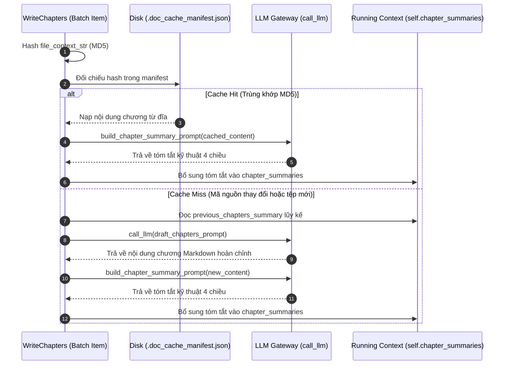

---

### 3.9 Tổng hợp Tài liệu, Điều hướng MkDocs & Trực quan hóa Mermaid (`CombineTutorial`)
Nút cuối cùng trong đồ thị, `CombineTutorial`, tổng hợp toàn bộ các kết quả phân tích thành các tệp phân phối cuối cùng, hỗ trợ cả định dạng Markdown độc lập (Standalone) lẫn trang tài liệu MkDocs Material hoàn chỉnh.

#### Giai đoạn 1: Dựng Sơ đồ Mermaid Tự động
```python
class CombineTutorial(Node):
    def prep(self, shared):
        project_name = shared["project_name"]
        output_base_dir = shared.get("output_dir", "output")
        output_path = os.path.join(output_base_dir, project_name)
        relationships_data = shared["relationships"]
        abstractions = shared["abstractions"]

        mermaid_lines = ["flowchart TD"]
        for i, abstr in enumerate(abstractions):
            node_id = f"A{i}"
            sanitized_name = abstr["name"].replace('"', "").replace("\n", " ").strip()
            mermaid_lines.append(f'    {node_id}("{sanitized_name}")')

        for rel in relationships_data["details"]:
            from_node_id = f"A{rel['from']}"
            to_node_id = f"A{rel['to']}"
            edge_label = rel["label"].replace('"', "").replace("\n", " ")
            if len(edge_label) > 30:
                edge_label = edge_label[:27] + "..."
            mermaid_lines.append(f'    {from_node_id} -- "{edge_label}" --> {to_node_id}')

        # Đánh dấu các node nền tảng (có từ 2 liên kết trỏ đến trở lên)
        incoming = {f"A{i}": 0 for i in range(len(abstractions))}
        for rel in relationships_data["details"]:
            incoming[f"A{rel['to']}"] += 1
        entry_nodes = [nid for nid, inc in incoming.items() if inc >= 2]
        if entry_nodes:
            mermaid_lines.append("    classDef entryNode stroke:#d33,stroke-width:3px,fill:#fff5f5")
            mermaid_lines.extend(f"    class {node_id} entryNode" for node_id in entry_nodes)

        mermaid_diagram = "\n".join(mermaid_lines)
```

Sơ đồ Mermaid được dựng tự động từ danh sách quan hệ:
- Mỗi khái niệm trừu tượng trở thành một nút `A{i}` với nhãn đã được làm sạch ký tự xuống dòng và dấu ngoặc kép.
- Các liên kết có nhãn cạnh (`edge_label`) được cắt ngắn nếu vượt quá 30 ký tự để giữ cho biểu đồ trực quan.
- Thuật toán đếm bậc vào (in-degree count) nhận diện các nút nền tảng (`inc >= 2`) và áp dụng lớp CSS `entryNode` với viền đỏ nổi bật.

#### Giai đoạn 2: Gom Nhóm Điều Hướng Bằng LLM Cho MkDocs (LLM-Assisted Nav Grouping)
Trong chế độ `api-reference` với số lượng module lớn ($>5$), việc hiển thị thanh điều hướng phẳng (flat navigation) làm giảm trải nghiệm người dùng. `CombineTutorial` sử dụng LLM cùng hàm `build_grouped_nav` để gom nhóm các module theo chức năng nghiệp vụ.

```python
    def exec(self, prep_res):
        output_path = prep_res["output_path"]
        is_mkdocs = prep_res["is_mkdocs"]
        chapter_files = prep_res["chapter_files"]
        os.makedirs(output_path, exist_ok=True)

        if is_mkdocs:
            mode = prep_res["mode"]
            project_name = prep_res["project_name"]
            sections = None

            if mode == "api-reference" and len(chapter_files) > 5:
                try:
                    chapter_summaries = prep_res.get("chapter_summaries", [])
                    module_entries = [
                        f"- {cf['module_name']}: {chapter_summaries[i] if i < len(chapter_summaries) else cf['description']}"
                        for i, cf in enumerate(chapter_files)
                    ]
                    module_list = "\n".join(module_entries)

                    prompt_path = os.path.join(os.path.dirname(os.path.abspath(__file__)), "prompts", "common", "group_modules.md")
                    with open(prompt_path, encoding="utf-8-sig") as f:
                        group_template = f.read()

                    group_prompt = group_template.format(
                        project_name=project_name, module_count=len(chapter_files),
                        module_list=module_list, directory_tree=prep_res.get("directory_tree", "N/A"),
                        language_note="",
                    )
                    group_response = call_llm(group_prompt, use_cache=prep_res.get("use_cache", True))
                    parsed = parse_yaml_response(group_response)
                    sections = parsed.get("sections", parsed) if isinstance(parsed, dict) else None

                    if sections:
                        grouped_modules = collect_all_modules(sections)
                        ungrouped = [cf["module_name"] for cf in chapter_files if cf["module_name"] not in grouped_modules]
                        if ungrouped:
                            sections.append({"name": "Other", "modules": ungrouped})
                        nav_lines = build_grouped_nav(sections, chapter_files, indent=4)
                        nav_lines.insert(0, "    - api/index.md")
                        nav_snippet = "nav:\n  - API Reference:\n" + "\n".join(nav_lines)
```

Đoạn mã trên thể hiện tính phòng thủ cao trong việc xử lý kết quả nhóm của LLM:
- Kiểm tra danh sách các module đã được gom nhóm bằng hàm `collect_all_modules(sections)`.
- Nếu LLM bỏ sót bất kỳ module nào, hệ thống tự động tạo một nhóm cứu trợ `"Other"` để chứa các module chưa được phân nhóm (`ungrouped`), đảm bảo không có tệp tài liệu nào bị mất liên kết trên thanh điều hướng.
- Hàm `build_grouped_nav` từ `utils/prompts.py` duyệt đệ quy cây phân nhóm, tự động tạo các lớp thư mục con nếu các module trong cùng nhóm nằm ở nhiều thư mục khác nhau.

#### Giai đoạn 3: Xuất Bản Tệp Cấu Hình và Mã Nguồn Tài Liệu
```python
                mkdocs_config = build_mkdocs_config(f"{project_name} — Documentation", nav_snippet)
                with open(os.path.join(output_path, "mkdocs.yml"), "w", encoding="utf-8") as f:
                    f.write(mkdocs_config)

                js_dir = os.path.join(output_path, "docs", "javascripts")
                os.makedirs(js_dir, exist_ok=True)
                with open(os.path.join(js_dir, "mermaid-init.js"), "w", encoding="utf-8") as f:
                    f.write(build_mermaid_init_js())

                for chapter_info in chapter_files:
                    chapter_filepath = os.path.join(output_path, "docs", "api", chapter_info["filename"])
                    os.makedirs(os.path.dirname(chapter_filepath), exist_ok=True)
                    with open(chapter_filepath, "w", encoding="utf-8") as f:
                        f.write(chapter_info["content"])
```

Nếu cấu hình là MkDocs:
1. Ghi tệp cấu hình `mkdocs.yml` hoàn chỉnh dựa trên Material for MkDocs thông qua `build_mkdocs_config`.
2. Tạo tệp JavaScript `mermaid-init.js` để khởi tạo sơ đồ Mermaid với lớp CSS `.mermaid-raw`, vượt qua các thiết lập ghi đè màu mặc định của giao diện Material và trả lại giao diện chuẩn như trên GitHub.
3. Xuất bản toàn bộ các tệp tài liệu chương vào thư mục con `docs/api/`, sẵn sàng cho lệnh `mkdocs serve` hoặc `mkdocs build`.

Nếu là chế độ tài liệu độc lập (Standalone), `CombineTutorial` sẽ tạo `index.md` chứa bảng mục lục và sơ đồ Mermaid, cùng với tệp gộp `full_content.md` chứa toàn bộ nội dung của tất cả các chương để tiện cho việc đọc một lượt hoặc xuất PDF.

---

## 4. Tóm Tắt Trách Nhiệm Các Module & Hàm Bổ Trợ

Dưới đây là bảng tổng hợp các hàm bổ trợ kiến trúc được sử dụng xuyên suốt trong `nodes.py` và `utils/prompts.py`:

| Tên Hàm / Lớp | Vị Trí | Trách Nhiệm Kỹ Thuật | Hành Vi & Logic Cốt Lõi |
| :--- | :--- | :--- | :--- |
| `build_directory_tree` | `nodes.py` | Tạo chuỗi biểu diễn phân cấp thư mục | Nhóm tệp theo thư mục cha, gán nhãn chỉ mục `(idx:i)`, sắp xếp thứ tự bảng chữ cái. |
| `get_content_for_indices` | `nodes.py` | Trích xuất nội dung mã nguồn theo chỉ mục | Nhận danh sách chỉ số `[int]`, trả về từ điển `{"idx # path": content}` an toàn với lỗi tràn biên. |
| `parse_yaml_response` | `nodes.py` | Bóc tách và thẩm định YAML từ phản hồi LLM | Cắt chuỗi giữa khối ` ```yaml ` và ` ``` `, phân tích cú pháp an toàn với `yaml.safe_load`. |
| `resolve_max_tokens` | `nodes.py` | Xác định trần token tối đa của runtime | Đọc từ `shared["max_tokens"]` hoặc truy vấn kích thước ngữ cảnh API thông qua `get_model_context_length`. |
| `build_chapter_summary_prompt` | `utils/prompts.py` | Tạo prompt tóm tắt kỹ thuật 4 chiều | Đóng gói nội dung chương vừa viết, yêu cầu LLM tóm tắt phạm vi, phần tử kỹ thuật, mẫu thiết kế và tích hợp. |
| `build_mkdocs_config` | `utils/prompts.py` | Tạo tệp cấu hình `mkdocs.yml` hoàn chỉnh | Cấu hình Material theme, tiện ích mở rộng pymdownx (superfences, highlight), nạp plugin Panzoom và nhúng navigation. |
| `build_grouped_nav` | `utils/prompts.py` | Dựng cấu trúc cây điều hướng MkDocs đệ quy | Chuyển đổi JSON phân nhóm của LLM thành cú pháp YAML nav, tự động phân nhóm phụ nếu chung nhóm nhưng khác thư mục. |

---

## 5. Ràng Buộc Kỹ Thuật, Xung Nhịp Luồng & An Toàn Bộ Nhớ

### 5.1 Mô hình Đột biến Trạng thái Bộ nhớ Dùng chung (Shared Mutable State)
- Framework PocketFlow sử dụng một từ điển Python duy nhất (`shared: dict`) được truyền theo dạng tham chiếu (pass-by-reference) qua tất cả các Node.
- **Tính tuần tự (Sequential Execution)**: Đồ thị DAG hiện tại thực thi đơn luồng (single-threaded). Các BatchNode xử lý tuần tự từng item trong lô thay vì chạy song song qua đa tiến trình. Điều này loại bỏ hoàn toàn hiện tượng tương tranh bộ nhớ (race condition) trên `shared store`, đồng thời giữ cho việc theo dõi biến trạng thái lũy kế (`self.chapter_summaries`) luôn đảm bảo tính thứ tự.

### 5.2 Cơ chế Tự phục hồi và Kháng lỗi LLM
Mọi nút thực thi LLM đều được trang bị hai tầng phòng thủ:
1. **Tầng SDK / Mạng**: `max_retries=5` kết hợp với tham số `wait=20` giây tại `flow.py` giúp vượt qua các lỗi nghẽn mạng tạm thời hoặc hạn ngạch HTTP 429/503.
2. **Tầng Thẩm định Cú pháp (Parsing Validation)**: Nếu LLM trả về cấu trúc YAML bị lỗi hoặc thiếu các khóa bắt buộc (`file_indices`, `from_abstraction`, `relationships`), Node sẽ chủ động ném ra ngoại lệ `ValueError`. PocketFlow bắt ngoại lệ này tại chu trình `exec()` và tự động kích hoạt retry, trong đó cờ `use_cache` được tắt tại các lần thử lại (`self.cur_retry > 0`) để ép buộc LLM sinh lại một phản hồi mới hoàn toàn.

---

## 6. Hướng Dẫn Thực Hành Dành Cho Kỹ Sư Mới (Practical Notes for New Team Members)

### 6.1 Vị trí Cấu hình & Biến Trạng thái Trọng yếu
Khi gỡ lỗi hoặc bổ sung tính năng mới cho pipeline, các khóa trạng thái cốt lõi trong `shared` bao gồm:
- `shared["files"]`: Mảng gốc `[(path, content), ...]`. Đây là chân lý dữ liệu (source of truth), chỉ mục của mảng này quyết định ID của tệp xuyên suốt hệ thống.
- `shared["abstractions"]`: Danh sách từ điển các khái niệm kiến trúc `[{"name": str, "description": str, "files": [int]}]`.
- `shared["chapter_order"]`: Danh sách các chỉ số nguyên quy định trình tự sinh tài liệu.
- `shared["chapter_summaries"]`: Danh sách các đoạn tóm tắt kỹ thuật 4 chiều lũy kế từ Chương 1 đến Chương hiện tại.

### 6.2 Điểm Gỡ Lỗi Chiến Lược (Strategic Debugging Breakpoints)
1. **Lỗi tràn cửa sổ ngữ cảnh**: Đặt breakpoint tại `ContextRouter.prep()`. Kiểm tra biến `prompt_overhead` và `effective_limit`. Xem giá trị trả về của `route` để biết vì sao hệ thống quyết định đi nhánh `batch` hay `direct`.
2. **Lỗi mất mát module trong thanh điều hướng**: Đặt breakpoint tại `CombineTutorial.exec()`, ngay sau lệnh `parse_yaml_response(group_response)`. Kiểm tra danh sách `ungrouped` để xem LLM có bỏ sót module nào trong quá trình nhóm hay không.
3. **Lỗi trượt Cache MD5**: Đặt breakpoint tại `WriteChapters.exec()`. Kiểm tra giá trị `current_hash` và nội dung đọc ra từ `.doc_cache_manifest.json`.

### 6.3 Các Bẫy Kỹ Thuật Thường Gặp (Known Gotchas)
- **YAML Format Hallucination**: LLM đôi khi trả về chuỗi bọc ngoài bằng ` ```yaml ` nhưng bên trong lại là JSON hoặc định dạng danh sách không chuẩn. Hàm `parse_yaml_response` có thể ném `ValueError` nếu LLM chèn thêm các đoạn giải thích bên ngoài khối mã.
- **Mã băm MD5 thay đổi do định dạng dòng (Line Endings)**: Nếu tệp mã nguồn được checkout trên Windows (`CRLF`) rồi chạy trên Linux (`LF`), mã băm MD5 của `file_context_str` sẽ bị thay đổi dù mã nguồn không đổi, dẫn đến việc toàn bộ cache bị vô hiệu hóa (cache miss toàn bộ).

---

## 7. Tổng kết & Chuyển tiếp

Chương 4 đã phân tích toàn diện kiến trúc **Động cơ Điều phối Luồng & Xử lý Node Đa tầng**, bao gồm:
- Mô hình đồ thị thực thi DAG dựa trên PocketFlow với chu trình sống ba pha chuẩn hóa (`prep` $\rightarrow$ `exec` $\rightarrow$ `post`).
- Cơ chế định tuyến token động tại `ContextRouter` với biên an toàn và khấu trừ chi phí overhead hệ thống.
- Thuật toán MapReduce cho codebase lớn và thuật toán phân bổ ngân sách hai lượt tại `AnalyzeRelationships`.
- Quản lý bộ nhớ đệm tăng dần MD5 và tóm tắt kỹ thuật 4 chiều lũy kế tại `WriteChapters`.
- Cơ chế xuất bản đa định dạng và gom nhóm điều hướng thông minh tại `CombineTutorial`.

Để hiểu rõ cấu trúc chi tiết của các prompt mẫu được sử dụng trong các Node phân tích kiến trúc này, mời bạn tiếp tục đón đọc [Chương 5: Hệ thống Prompt Mẫu cho Tutorial & Phân tích Kiến trúc Nâng cao](05_hệ_thống_prompt_mẫu_cho_tutorial___phân_tích_kiến_trúc_nâng_cao.md).


---

<a id="chapter-5"></a>

# Chapter 5: Hệ thống Prompt Mẫu cho Tutorial & Phân tích Kiến trúc Nâng cao


Sau khi đã tìm hiểu cách [Chương 4: Động cơ Điều phối Luồng & Xử lý Node Đa tầng](04_động_cơ_điều_phối_luồng___xử_lý_node_đa_tầng.md) xây dựng đồ thị thực thi DAG và quản lý chu trình sống của các Node xử lý, chương này sẽ đi sâu vào Tầng Quy định Tri thức và Định hình Phản hồi (Prompt & Knowledge Specification Layer). Đây là nơi lưu trữ toàn bộ các mẫu chỉ dẫn (prompt templates) bằng Markdown, định nghĩa các hợp đồng dữ liệu nghiêm ngặt giữa mã nguồn phân tích và các mô hình ngôn ngữ lớn (LLM).

---

## 1. Tổng quan Kiến trúc (Technical Overview)

### 1.1 Vai trò Kiến trúc (Architectural Role)
Hệ thống Prompt Mẫu đóng vai trò là tầng định hướng suy luận chuyên biệt, tách biệt hoàn toàn mã logic điều phối (`nodes.py`, `flow.py`) khỏi các quy tắc biên soạn ngôn ngữ tự nhiên. Nếu không có tầng trừu tượng này:
- Toàn bộ logic prompt kỹ thuật sẽ bị nhúng cứng (hardcoded) dưới dạng chuỗi ký tự bên trong các lớp Python, dẫn đến vi phạm nguyên lý Phân tách Mối quan tâm (Separation of Concerns).
- Việc tối ưu hóa kỹ thuật sinh prompt (Prompt Engineering), thay đổi ngôn ngữ đích (i18n), hoặc điều chỉnh tỷ lệ trích xuất mã nguồn sẽ đòi hỏi phải chỉnh sửa trực tiếp mã thực thi, làm tăng rủi ro hồi quy (regression risk) trên toàn bộ pipeline.
- Không thể chuẩn hóa hợp đồng dữ liệu đầu ra: LLM sẽ sinh dữ liệu phi cấu trúc, gây sập bộ phân tích cú pháp YAML hạ nguồn (`parse_yaml_response`).

Hệ thống được tổ chức thành hai chế độ phân tích độc lập:
1. `prompts/tutorial/`: Hướng tới đối tượng kỹ sư mới làm quen với dự án, ưu tiên phương pháp giải thích bằng phép loại suy (analogy), phân rã use-case tuần tự và kiểm soát kích thước khối mã nhỏ (10-20 dòng).
2. `prompts/advanced/`: Hướng tới kỹ sư cao cấp (Senior Engineer) và Quản lý Kỹ thuật (Technical PM), tập trung sâu vào ranh giới thiết kế hệ thống, phân tích đánh đổi kiến trúc (architectural tradeoffs), mô hình tương tranh (concurrency), và quy chuẩn Mermaid đa dạng.

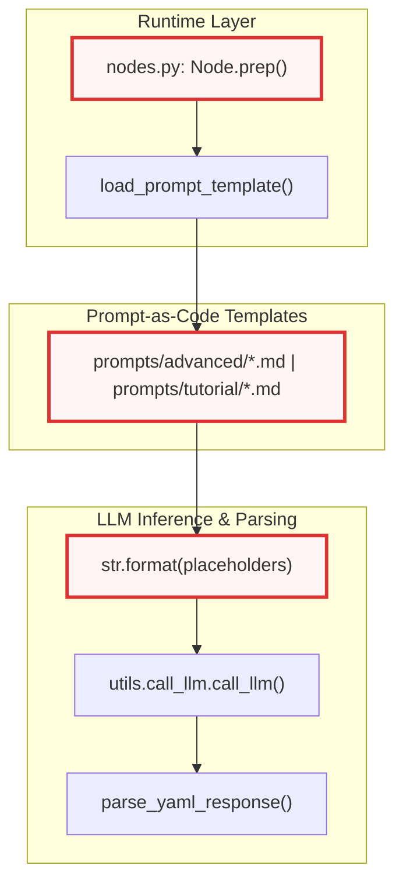

### 1.2 Mẫu Thiết kế Ứng dụng (Design Patterns)
Hệ thống kết hợp ba mẫu thiết kế cốt lõi:
- **Prompt-as-Code Pattern**: Các tệp Markdown đóng vai trò như các mã nguồn cấu hình có cấu trúc. Mỗi mẫu chứa các biến giữ chỗ `{placeholder}` được định nghĩa rõ ràng, biến tệp prompt thành một khuôn mẫu giao diện (interface contract) được kiểm tra kiểu dữ liệu tĩnh gián tiếp thông qua hàm `format()` của Python.
- **Strategy Pattern**: Việc chia tách hai thư mục `tutorial` và `advanced` cho phép hoán đổi chiến lược biên soạn tài liệu trong thời gian chạy (runtime) dựa trên tham số dòng lệnh `--mode` mà không làm thay đổi logic vận hành của các Node bên trong `flow.py`.
- **Interface Contract / Schema Enforcement Pattern**: Định nghĩa mẫu phản hồi YAML bắt buộc trong từng prompt trích xuất (`identify_abstractions`, `map_abstractions`, `reduce_abstractions`, `identify_relationships`, `order_chapters`), biến câu trả lời tự do của LLM thành cấu trúc dữ liệu có thể giải mã an toàn.

### 1.3 Trách nhiệm Cốt lõi (Core Responsibilities)
- Thiết lập hợp đồng biến giữ chỗ (`{project_name}`, `{context}`, `{directory_tree}`, v.v.) đồng bộ với các tham số truyền vào từ `nodes.py`.
- Ép buộc định dạng phản hồi chuẩn YAML với các trường bắt buộc (`name`, `description`, `file_indices`, `relationships`), loại bỏ hoàn toàn hiện tượng ảo giác cú pháp.
- Định chế hóa tỷ lệ nội dung (Content Ratio): Bắt buộc tỷ lệ văn bản phân tích đạt tối thiểu 55-60% và giới hạn mã nguồn ở mức 40-45%.
- Chuẩn hóa hệ thống sơ đồ Mermaid: Quy định định hướng bắt buộc `flowchart TD`, chuẩn hóa định dạng nút quy trình `nodeId["Label"]`, cấm các ký tự đặc biệt gây lỗi render trình duyệt.
- Áp dụng nguyên tắc trung thực mã nguồn (Code Fidelity): Nghiêm cấm tạo mã giả tưởng, bắt buộc trích xuất trực tiếp mã thực tế từ ngữ cảnh tệp và giữ nguyên chú thích gốc.

### 1.4 Phụ thuộc Hệ thống (Key Dependencies)

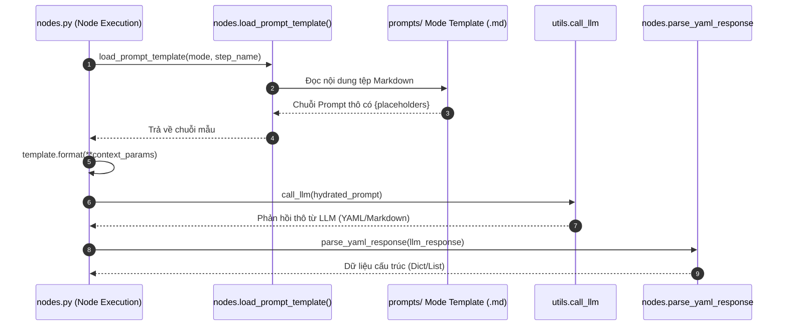

Thành phần prompt phụ thuộc vào:
- `nodes.py`: Nơi thực hiện nạp tệp, điền giá trị cho các biến và giải mã kết quả đầu ra.
- `utils/call_llm.py`: Đóng vai trò cầu nối đưa prompt hoàn chỉnh tới mô hình ngôn ngữ tương ứng (xem chi tiết tại [Chương 3: Tích hợp Mô hình Ngôn ngữ & Quản lý Token Context](03_tích_hợp_mô_hình_ngôn_ngữ___quản_lý_token_context.md)).
- `utils/output.py`: Chịu trách nhiệm cung cấp các chuỗi chỉ thị ngôn ngữ tự nhiên được nội địa hóa (`{language_instruction}`, `{desc_lang_hint}`) thông qua hệ thống i18n (xem chi tiết tại [Chương 7: Hệ thống Đa ngôn ngữ (i18n), Định dạng Đầu ra & Logging](07_hệ_thống_đa_ngôn_ngữ__i18n___định_dạng_đầu_ra___logging.md)).

---

## 2. Đi sâu vào Hiện thực Kiến trúc (Deep-Dive Implementation)

### 2.1 Hợp đồng Dữ liệu Biến giữ chỗ (Placeholder Data Contracts)
Mỗi tệp template Markdown hoạt động như một hàm nhận tham số. Bảng dưới đây liệt kê các biến giữ chỗ tiêu chuẩn và kiểu dữ liệu tương ứng được cung cấp bởi `nodes.py`:

| Tên Biến Giữ Chỗ | Kiểu Dữ Liệu | Nguồn Cung Cấp trong `nodes.py` | Mô Tả Ý Nghĩa |
| :--- | :--- | :--- | :--- |
| `{project_name}` | `str` | `shared["project_name"]` | Tên dự án được suy luận hoặc người dùng chỉ định |
| `{context}` | `str` | Nối nội dung các tệp mã nguồn | Toàn bộ hoặc một phần (batch) mã nguồn kèm chỉ số tệp |
| `{directory_tree}` | `str` | `build_directory_tree()` | Biểu diễn cây thư mục hệ thống dưới dạng văn bản |
| `{max_abstraction_num}` | `int` | `shared["max_abstractions"]` | Số lượng trừu tượng kiến trúc tối đa cần trích xuất |
| `{abstraction_listing}` | `str` | `shared["abstractions"]` | Danh sách các trừu tượng đã định danh kèm chỉ số |
| `{language_instruction}` | `str` | `get_language_instruction()` | Chỉ thị ép buộc ngôn ngữ đầu ra (ví dụ: tiếng Việt) |
| `{name_lang_hint}` | `str` | `get_language_hint("name")` | Gợi ý ngôn ngữ cho trường tên trong YAML |
| `{desc_lang_hint}` | `str` | `get_language_hint("desc")` | Gợi ý ngôn ngữ cho trường mô tả trong YAML |
| `{file_context_str}` | `str` | `_build_file_context()` | Đoạn mã nguồn trích xuất riêng cho chương hiện tại |
| `{previous_chapters_summary}` | `str` | `shared["chapter_summaries"]` | Tóm tắt kiến trúc 4 chiều tích lũy từ các chương trước |

### 2.2 Cơ chế Thực thi Phân cấp giữa `tutorial` và `advanced`
Sự khác biệt cốt lõi giữa hai chế độ tài liệu không nằm ở kiến trúc luồng dữ liệu mà nằm ở các ràng buộc kỹ thuật được cài đặt bên trong prompt:

```mermaid
flowchart TD
    subgraph SubgraphModeDifferences["So Sánh Ràng Buộc Kỹ Thuật Giữa 2 Chế Độ"]
        TutorialBranch["Chế độ Tutorial"]
        AdvancedBranch["Chế độ Advanced"]
    end

    subgraph SubgraphTutorialRules["Quy Định Tutorial"]
        T_Tone["Giọng văn thân thiện, dùng phép loại suy"]
        T_Block["Kích thước khối mã: 10-20 dòng (Max 30)"]
        T_Ratio["Tỷ lệ văn bản: >= 60% giải thích"]
        T_Length["Dung lượng chương: 3,000 - 6,000 từ"]
    end

    subgraph SubgraphAdvancedRules["Quy Định Advanced"]
        A_Tone["Chuyên sâu, bỏ qua lý thuyết cơ bản"]
        A_Block["Kích thước khối mã: 20-50 dòng (Max 60)"]
        A_Ratio["Tỷ lệ văn bản: >= 55% giải thích"]
        A_Length["Dung lượng chương: 5,000 - 10,000 từ"]
        A_Breakdown["Bắt buộc mổ xẻ từng hàm/handler chuyên biệt"]
    end

    TutorialBranch --> T_Tone
    TutorialBranch --> T_Block
    TutorialBranch --> T_Ratio
    TutorialBranch --> T_Length

    AdvancedBranch --> A_Tone
    AdvancedBranch --> A_Block
    AdvancedBranch --> A_Ratio
    AdvancedBranch --> A_Length
    AdvancedBranch --> A_Breakdown

    classDef entryNode stroke:#d33,stroke-width:3px,fill:#fff5f5;
    class TutorialBranch entryNode
    class T_Tone entryNode
    class A_Tone entryNode
```

---

## 3. Phân rã Chi tiết Từng Tệp Prompt Mẫu (Template-by-Template Breakdown)

### 3.1 Nhóm Prompt Phân tích & Nhận diện Trừu tượng Kiến trúc

#### 3.1.1 `prompts/advanced/identify_abstractions.md`
- **Kích hoạt & Ngữ cảnh**: Được gọi bởi Node `IdentifyAbstractions` khi toàn bộ codebase nằm vừa trong một cửa sổ ngữ cảnh đơn (Single-pass mode).
- **Hợp đồng Đầu vào / Đầu ra**: Nhận `{context}`, `{directory_tree}`, `{max_abstraction_num}`; sinh danh sách YAML chứa các trường `name`, `description`, và `file_indices`.
- **Đoạn mã Prompt Trích xuất**:

```markdown
For the project `{project_name}`:

Codebase Context:
{context}

Full Project Directory Structure:
{directory_tree}

{language_instruction}Analyze the codebase context.
Identify the top 5-{max_abstraction_num} core architectural abstractions and components for an advanced system onboarding reference.

COVERAGE RULE: Every file index listed below MUST belong to at least one abstraction.
After forming your initial abstractions, scan the file listing to verify no files are unassigned.
If any files are orphaned, either create a new abstraction or expand an existing one.
Do NOT skip files just because they contain only data models, configuration, or simple boilerplate —
these are architecturally significant for understanding the system's data boundaries.

GRANULARITY GUIDANCE:
- Group files that share the same design pattern and serve the same architectural role into ONE abstraction.
- Keep files that serve fundamentally different roles in SEPARATE abstractions, even if co-located in the same directory.
- Data model / schema / DTO files should be grouped with the service or component that primarily consumes them,
  NOT lumped into a catch-all "Models" or "Types" abstraction.
- If a single directory contains 20+ files, it likely spans multiple abstractions — don't force them into one.
// ...
```

- **Phân tích Kiến trúc**:
Quy tắc `COVERAGE RULE` áp đặt một ràng buộc toán học chặt chẽ lên LLM: tập hợp các chỉ số tệp gán vào các abstraction phải phủ hoàn toàn tập hợp tệp đầu vào ($F_{assigned} = F_{total}$). Điều này ngăn chặn xu hướng của mô hình bỏ qua các tệp cấu hình, thực thể DTO hoặc script phụ trợ. Hướng dẫn `GRANULARITY GUIDANCE` ngăn ngừa lỗi phản mẫu thiết kế (anti-pattern) phổ biến khi LLM gom toàn bộ thực thể vào một nhóm rác mang tên "Models" hoặc gộp chung 20+ tệp trong cùng một thư mục thành một module duy nhất, qua đó bảo toàn ranh giới miền nghiệp vụ (Domain Boundaries).

---

#### 3.1.2 `prompts/tutorial/identify_abstractions.md`
- **Kích hoạt & Ngữ cảnh**: Được gọi bởi Node `IdentifyAbstractions` trong chế độ `tutorial`.
- **Hợp đồng Đầu vào / Đầu ra**: Tương tự bản `advanced`, nhưng định hướng mô tả khái niệm theo hướng tiếp cận người mới bắt đầu.
- **Đoạn mã Prompt Trích xuất**:

```markdown
For each abstraction, provide:
1. A concise `name`{name_lang_hint}.
2. A beginner-friendly `description` explaining what it is with a simple analogy, in around 150-250 words{desc_lang_hint}.
   Include: (a) the core problem it solves, (b) which 2-3 classes or files are most central, (c) a one-sentence note on how it connects to other parts of the system.
3. A list of relevant `file_indices` (integers) using the format `idx # path/comment`.

Format the output as a YAML list of dictionaries:

```yaml
- name: |
    Query Processing{name_lang_hint}
  description: |
    Explains what the abstraction does.
    It's like a central dispatcher routing requests.{desc_lang_hint}
  file_indices:
    - 0 # path/to/file1.py
    - 3 # path/to/related.py
# ...
```
```

- **Phân tích Kiến trúc**:
Prompt này tái cấu trúc định dạng mô tả bằng cách giới hạn độ dài từ 150-250 từ và bắt buộc sử dụng phép loại suy (analogy). Kỹ thuật này giúp chuyển đổi các khái niệm kỹ thuật phức tạp thành các mô hình tư duy trực quan (mental models), phục vụ mục đích đào tạo nhanh cho nhân sự mới mà không làm mất đi tính chính xác của danh sách chỉ số tệp liên quan (`file_indices`).

---

### 3.2 Nhóm Prompt Phân tích Phân tán (MapReduce Abstraction Pipeline)

Khi kích thước codebase vượt quá ngưỡng cửa sổ ngữ cảnh đơn, hệ thống kích hoạt cơ chế MapReduce. Giai đoạn này sử dụng hai mẫu prompt: `map_abstractions.md` và `reduce_abstractions.md`.

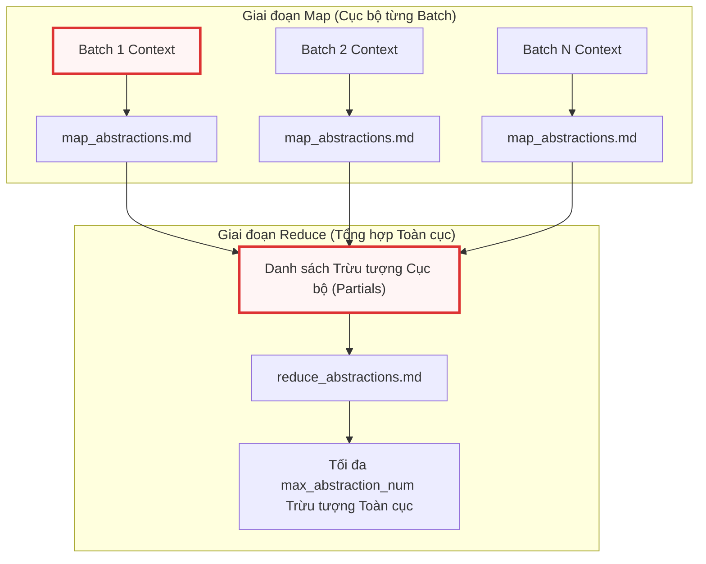

#### 3.2.1 `prompts/advanced/map_abstractions.md`
- **Kích hoạt & Ngữ cảnh**: Được gọi bởi Node `DeterministicFileMapper` hoặc `MapAbstractions` lặp qua từng phần nhỏ (batch) của codebase.
- **Hợp đồng Đầu vào / Đầu ra**: Nhận một tập con các tệp `{context}` và `{directory_tree}` toàn cục; trả về danh sách trừu tượng cục bộ.
- **Đoạn mã Prompt Trích xuất**:

```markdown
Analyze the provided codebase context which is a subset (batch) of the entire codebase.
Identify the core abstractions to help those new to the codebase. Focus on "local" abstractions present in this batch.
You MUST preserve core logic, architectural patterns, class structures, and function signatures with minimal loss.

You MUST identify at least 3 abstractions per batch, even if files seem closely related.
Distinguish between: service/logic files vs. data model/schema files vs. configuration/infrastructure files.

This batch is one slice of a larger codebase. The full directory structure is provided above for context.
If you see references to external types, namespaces, or services not present in this batch,
mention them as "external dependencies" in the description but do NOT create abstractions for code you cannot see.
// ...
```

- **Phân tích Kiến trúc**:
Vấn đề nan giải nhất trong giai đoạn Map là hiện tượng mô hình suy diễn sai lệch về các thành phần nằm ngoài ngữ cảnh hiện tại. Chỉ thị `do NOT create abstractions for code you cannot see` thiết lập ranh giới dữ liệu nghiêm ngặt: LLM chỉ được phép phân tích các tệp có mặt trong batch, biến các tham chiếu bên ngoài thành `external dependencies`. Quy tắc bắt buộc nhận diện tối thiểu 3 abstraction ngăn chặn việc LLM lười biếng gộp toàn bộ batch thành một thực thể duy nhất.

---

#### 3.2.2 `prompts/advanced/reduce_abstractions.md`
- **Kích hoạt & Ngữ cảnh**: Được gọi bởi Node `ReduceAbstractions` sau khi toàn bộ các batch đã hoàn thành giai đoạn Map.
- **Hợp đồng Đầu vào / Đầu ra**: Nhận `{partial_abstractions}` thô từ tất cả các batch; gom cụm và chuẩn hóa thành tối đa `{max_abstraction_num}` trừu tượng hoàn chỉnh.
- **Đoạn mã Prompt Trích xuất**:

```markdown
We have identified several partial, overlapping abstractions from different batches of the codebase.

Partial Abstractions:
{partial_abstractions}

{language_instruction}Your task is to merge these overlapping partial abstractions into a cohesive, global list of maximum {max_abstraction_num} core abstractions.

MERGE RULES:
- DO merge: partial abstractions from different batches that clearly describe the same component
  (same class names mentioned, same namespace, overlapping file indices).
- DO merge: a small auxiliary concern (1-3 files) into the larger component it serves.
- DO NOT merge: abstractions at different architectural layers (e.g., network infrastructure + business logic).
- DO NOT merge: abstractions with different consumers (e.g., admin-facing tools + end-user-facing services).
- DO NOT merge if the result would cover more than ~30 files — that's too broad for one section; keep them separate.
// ...
```

- **Phân tích Kiến trúc**:
Phần `MERGE RULES` cung cấp một cây quyết định logic giúp LLM giải quyết bài toán gom cụm đồ thị:
1. *Tiêu chuẩn Hợp nhất*: Dựa trên giao thoa chỉ số tệp (`file_indices`), không gian tên (namespace) và các lớp phụ trợ (1-3 tệp).
2. *Ranh giới Cấm Hợp nhất*: Phân tách tuyệt đối giữa các tầng kiến trúc (ví dụ: Hạ tầng mạng vs Logic nghiệp vụ) và giới hạn quy mô một abstraction không được vượt quá ~30 tệp để tránh làm loãng nội dung chương sau này.
3. *Kiểm tra Bảo toàn Độ phủ*: Bắt buộc đối chiếu danh sách chỉ số tệp sau khi hợp nhất nhằm đảm bảo không có tệp nào bị đánh rơi trong quá trình rút gọn.

---

#### 3.2.3 `prompts/tutorial/map_abstractions.md` & `reduce_abstractions.md`
- **Kích hoạt & Ngữ cảnh**: Tương đương phiên bản `advanced` trong luồng MapReduce của chế độ `tutorial`.
- **Đoạn mã Trích xuất (`prompts/tutorial/reduce_abstractions.md`)**:

```markdown
For each merged abstraction, provide:
1. A concise `name`{name_lang_hint}.
2. A beginner-friendly `description` summarizing the merged concepts, their architectural role, and core logic with a simple analogy, in around 150-250 words{desc_lang_hint}.
3. A merged list of `files` combining all file indices and paths from the input abstractions.

Format the output as a YAML list of dictionaries:

```yaml
- name: |
    Global Query Engine{name_lang_hint}
  description: |
    Combined description of the query processing engine.
    It acts as the central hub routing queries to the correct database.{desc_lang_hint}
  files:
    - 0 # path/to/file1.py
    - 3 # path/to/related.py
    - 15 # path/to/other_batch_file.js
# ... up to {max_abstraction_num} abstractions
```
```

- **Phân tích Kiến trúc**:
Cấu trúc đầu ra duy trì tính nhất quán hoàn toàn với phiên bản `advanced` về lược đồ dữ liệu YAML (`name`, `description`, `files`), đảm bảo hàm `parse_yaml_response()` trong `nodes.py` có thể tái sử dụng cùng một logic phân tích cú pháp mà không cần quan tâm đến chế độ tài liệu đang chạy.

---

### 3.3 Nhóm Prompt Quan hệ Đồ thị & Sắp xếp Thứ tự Chương

#### 3.3.1 `prompts/advanced/identify_relationships.md`
- **Kích hoạt & Ngữ cảnh**: Được gọi bởi Node `AnalyzeRelationships` sau khi danh sách trừu tượng toàn cục đã được xác lập.
- **Hợp đồng Đầu vào / Đầu ra**: Nhận danh sách trừu tượng `{abstraction_listing}` và ngữ cảnh mã nguồn trích xuất `{context}`; sinh tóm tắt kiến trúc (`summary`) và danh sách cạnh đồ thị có hướng (`relationships`).
- **Đoạn mã Prompt Trích xuất**:

```markdown
{language_instruction}Please provide:
1. A high-level technical `summary` of the project's architecture, key technologies, and design philosophy in a few sentences{lang_hint}. Use markdown formatting with **bold** and *italic* text to highlight critical architectural components.
2. A list (`relationships`) describing the key technical interactions, dependencies, or data flows between these abstractions. For each relationship, specify:
    - `from_abstraction`: Index of the source abstraction (e.g., `0 # AbstractionName1`)
    - `to_abstraction`: Index of the target abstraction (e.g., `1 # AbstractionName2`)
    - `label`: A brief, technically precise label for the interaction **in just a few words**{lang_hint}.
      The label should tell an onboarding engineer what specifically flows between components and through what mechanism.
      Examples of good labels: "calls via RPC for lookup", "subscribes to config-change events", "encrypts tokens using", "delegates background tasks to"
      Examples of bad labels: "uses", "manages", "depends on" (too vague for architecture understanding)
    Ideally the relationship should be backed by one abstraction directly depending on, calling, or passing parameters to another.
    Exclude trivial interactions.

IMPORTANT: Make sure EVERY abstraction is involved in at least ONE relationship (either as source or target). Each abstraction index must appear at least once across all relationships.
// ...
```

- **Phân tích Kiến trúc**:
Chỉ thị này giải quyết hai vấn đề cốt tử trong việc dựng đồ thị kiến trúc hệ thống:
1. *Chất lượng Nhãn Quan hệ (`label`)*: Bằng cách đưa ra các phản ví dụ cụ thể (bad labels: `"uses"`, `"manages"` vs good labels: `"calls via RPC for lookup"`), prompt buộc mô hình phải chỉ rõ cơ chế giao tiếp kỹ thuật (IPC, RPC, Event, DI) thay vì các động từ mơ hồ.
2. *Tính Liên thông của Đồ thị*: Điều kiện `EVERY abstraction is involved in at least ONE relationship` đảm bảo đồ thị kiến trúc không bị phân mảnh thành các đỉnh cô lập (isolated nodes), cho phép trình trực quan hóa Mermaid ở giai đoạn sau render một cấu trúc liên kết hoàn chỉnh.

---

#### 3.3.2 `prompts/advanced/order_chapters.md` & `prompts/tutorial/order_chapters.md`
- **Kích hoạt & Ngữ cảnh**: Được gọi bởi Node `OrderChapters` để xác định trình tự biên soạn các chương tài liệu.
- **Hợp đồng Đầu vào / Đầu ra**: Nhận danh sách trừu tượng và các mối quan hệ đồ thị; sinh danh sách thứ tự chỉ số trừu tượng theo định dạng YAML list.
- **Đoạn mã Prompt Trích xuất (`prompts/advanced/order_chapters.md`)**:

```markdown
Given the following project abstractions and their relationships for the project ```` {project_name} ````:

Abstractions (Index # Name){list_lang_note}:
{abstraction_listing}

Context about relationships and project summary:
{context}

The reader is a senior engineer or PM onboarding mid-project. Order for maximum "aha, now I get the system" progression:

ORDERING STRATEGY:
1. Start with shared infrastructure that everything depends on (utilities, common libraries, connection management).
2. Then security & identity (authentication, authorization, token management) — readers need to understand trust boundaries early.
3. Then core domain services in dependency order (if service A calls service B, explain B first).
4. Then integration/adapter layers (external gateways, third-party connectors).
5. End with cross-cutting operational concerns (logging, analytics, monitoring, admin tools).

The goal: after reading chapters 1-3, the reader can understand any code review. After all chapters, they can lead architecture discussions.

Output the ordered list of abstraction indices, including the name in a comment for clarity. Use the format `idx # AbstractionName`.
// ...
```

- **Phân tích Kiến trúc**:
Chiến lược sắp xếp (`ORDERING STRATEGY`) định nghĩa một thuật toán sắp xếp topo (topological sort) có nhận thức ngữ nghĩa:
- Tầng 1: Hạ tầng dùng chung & Tiện ích nền tảng.
- Tầng 2: Ranh giới tin cậy & Bảo mật (Security/Identity).
- Tầng 3: Dịch vụ nghiệp vụ cốt lõi theo thứ tự phụ thuộc (Dependency Order).
- Tầng 4: Tầng kết nối ngoại vi (Gateways/Adapters).
- Tầng 5: Mối quan tâm cắt ngang (Logging/Telemetry/CLI).
Cách sắp xếp này đảm bảo người đọc tích lũy ngữ cảnh kỹ thuật tuyến tính: không bao giờ gặp một khái niệm ở chương sau mà chưa được định nghĩa ở các chương trước.

---

### 3.4 Nhóm Prompt Soạn thảo Chương Kỹ thuật Chuyên sâu (Draft Chapters)

Đây là các mẫu prompt phức tạp nhất trong toàn bộ hệ thống, điều khiển trực tiếp quá trình sinh nội dung chi tiết cho từng chương tài liệu.

#### 3.4.1 `prompts/advanced/draft_chapters.md`
- **Kích hoạt & Ngữ cảnh**: Được gọi tuần tự bên trong vòng lặp của Node `WriteChapters` trong chế độ `advanced`.
- **Hợp đồng Đầu vào / Đầu ra**: Tiếp nhận toàn bộ cây thư mục `{directory_tree}`, cấu trúc toàn bộ tài liệu `{full_chapter_listing}`, đường dẫn tài liệu hiện tại `{current_doc_path}`, tóm tắt lũy kế các chương trước `{previous_chapters_summary}`, và ngữ cảnh mã nguồn riêng của chương `{file_context_str}`. Đầu ra là một văn bản Markdown hoàn chỉnh.

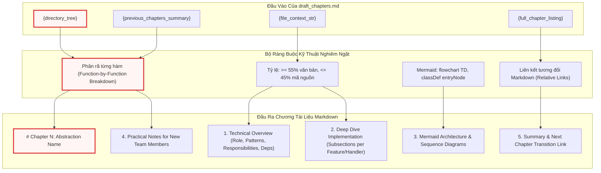

- **Đoạn mã Prompt Trích xuất (Quy định Phân rã Chức năng & Tỷ lệ Mã nguồn)**:

```markdown
- FUNCTION-BY-FUNCTION BREAKDOWN (CRITICAL): Do NOT write a brief architectural overview and then dump the source code. Instead, identify EVERY major feature, option, handler, or workflow in this component and give each its own `###` subsection. For each feature/handler:
  1. State what it does and when it is triggered (button click, event, API call, etc.)
  2. Trace the control flow step-by-step through the key internal methods it calls
  3. Show ONLY the 20-50 most significant lines of code for that feature (extracted selectively with `// ...` for boilerplate)
  4. Explain the logic, edge cases, and error handling AFTER the code block
  If a single class file implements 8 distinct operations (e.g., Option 1 through Option 8), each operation MUST get its own subsection with its own code analysis — do not lump them together.
  WITHIN SUBSECTIONS: If a method is longer than 50 lines, split it into 2-3 logical segments (e.g., setup/validation → core logic → result handling). Show each segment as a separate code block (20-40 lines) with its own analysis paragraph between blocks.

- IMPORTANT: You MUST extract and include ACTUAL code snippets from the provided file context — never invent examples. However, DO NOT dump entire source files. Instead, selectively extract the most architecturally significant methods, classes, or code sections.

- CODE FIDELITY: Inside fenced code blocks, preserve ALL original source code and comments EXACTLY as they appear{code_comment_note}. Your explanatory notes go in prose paragraphs OUTSIDE the code fence, not as modified inline comments.

- CODE BLOCK SIZE: Keep individual code blocks to 20-50 lines each. The absolute maximum is 60 lines — only for tightly coupled struct definitions, P/Invoke declarations, or similar indivisible blocks. Use `// ...` (or the language's comment syntax) to skip boilerplate, repetitive branches, or trivial accessors. NEVER exceed 60 lines in one code block.

- EXPLANATION RATIO: For every code block, you MUST write at least one full paragraph (3-5 sentences minimum) of analysis immediately after it — explain WHY the code is structured that way, what design decisions are visible, what edge cases it handles, and what an engineer should pay attention to. The overall chapter should be at least 55% prose and at most 45% code by line count.
// ...
```

- **Phân tích Kiến trúc**:
Đoạn chỉ dẫn trên ngăn chặn hai lỗi nghiêm trọng nhất khi LLM viết tài liệu kỹ thuật:
1. *Hiện tượng "Code-Dumping"*: LLM thường có xu hướng in toàn bộ tệp mã nguồn dài hàng trăm dòng mà không có bình luận. Bằng cách giới hạn kích thước khối mã từ 20-50 dòng (tuyệt đối không vượt quá 60 dòng) và yêu cầu tách một hàm dài thành 2-3 phân đoạn logic có đoạn văn phân tích ở giữa, prompt buộc mô hình phải thực hiện mổ xẻ mã nguồn chi tiết.
2. *Nguyên tắc Trung thực Tuyệt đối (Code Fidelity)*: Cấm chỉnh sửa, dịch hoặc thay đổi chú thích bên trong khối mã. Mọi phân tích kỹ thuật phải nằm ở các đoạn văn xuôi bên ngoài khối mã, đảm bảo mã nguồn trích xuất có thể sao chép và chạy chính xác.

- **Đoạn mã Prompt Trích xuất (Quy chuẩn Sơ đồ Mermaid & Liên kết Điều hướng)**:

```markdown
- Describe the internal execution flow or state transitions{instruction_lang_note}. You MUST generate Mermaid diagrams using fenced code blocks (```mermaid). NEVER use ASCII art, box-drawing characters (+---+, |, v), or plaintext diagrams — they render poorly in web documentation. Choose the diagram type based on what aspect of the code you're illustrating:
  * `sequenceDiagram` — for request/response flows that cross multiple components or services
  * `flowchart TD` — for decision logic, branching, or pipeline stages within a single component (MUST use TD direction)
  * `erDiagram` — for data model relationships (database schemas, entity hierarchies)
  * `classDiagram` — for inheritance, composition, or factory patterns
  * `stateDiagram` — for entity lifecycle states (e.g., pending → confirmed → settled)
  Use AT LEAST 2 different diagram types per chapter when appropriate.
  Keep the diagrams technically precise. {mermaid_lang_note}.
  MERMAID RENDERING RULES: All flowcharts MUST use `flowchart TD` (top-down). Never use LR, RL, or BT. All process nodes MUST use rectangular brackets with quoted labels: `nodeId["Label"]`. Never use rounded `("Label")`, stadium `(["Label"])`, hexagon, or other shapes. Decision nodes MAY use diamond shape: `nodeId{{"Decision?"}}`. Do not embed newlines inside node label quotes. Avoid special characters (`&`, `<`, `>`) in labels — use words instead. For diagrams with 6+ nodes, use `subgraph` blocks to group related nodes and prevent flat sprawl.
  MERMAID STYLING RULES: For flowchart diagrams, define `classDef entryNode stroke:#d33,stroke-width:3px,fill:#fff5f5;` ONCE at the end of the diagram, then apply `class nodeId entryNode` to the first node of the overall flow AND the first node inside each subgraph. Leave ALL other nodes with default Mermaid styling — do NOT add custom colors, fills, or styles to non-entry nodes. Do NOT use `%%{{init}}%%` directives — the site handles theming automatically.
// ...
```

- **Phân tích Kiến trúc**:
Quy chuẩn Mermaid này giải quyết triệt để các lỗi phân tích cú pháp thường gặp trên trình duyệt khi render bằng MkDocs Material:
- *Hướng bắt buộc `flowchart TD`*: Ngăn chặn việc hiển thị tràn chiều ngang màn hình trên giao diện web di động hoặc máy tính bảng.
- *Quy chuẩn Nút `nodeId["Label"]`*: Đặt nhãn trong dấu ngoặc kép ngăn ngừa xung đột cú pháp khi nhãn chứa khoảng trắng hoặc dấu phân cách.
- *Quy tắc Định kiểu (Styling Rule)*: Định nghĩa lớp `entryNode` đồng nhất với viền đỏ `#d33` và nền `#fff5f5` giúp làm nổi bật điểm vào thực thi của hệ thống mà không làm rối loạn bộ giao diện sáng/tối mặc định của trang tài liệu.

---

#### 3.4.2 `prompts/tutorial/draft_chapters.md`
- **Kích hoạt & Ngữ cảnh**: Được gọi tuần tự trong chế độ `tutorial`.
- **Đoạn mã Prompt Trích xuất**:

```markdown
- Begin with a high-level motivation explaining what problem this abstraction solves{instruction_lang_note}. Start with a central use case as a concrete example. The whole chapter should guide the reader to understand how to solve this use case. Make it very minimal and friendly to beginners.

- If the abstraction is complex, break it down into key concepts. Explain each concept one-by-one in a very beginner-friendly way{instruction_lang_note}.

- Explain how to use this abstraction to solve the use case{instruction_lang_note}. Give example inputs and outputs for code snippets (if the output isn't values, describe at a high level what will happen{instruction_lang_note}).

- CODE BLOCK SIZE: Keep each code block to 10-20 lines. The absolute maximum for any single code block is 30 lines — only when showing a tightly coupled struct/class definition that cannot be meaningfully split. Use `// ...` to skip boilerplate. NEVER exceed 30 lines in one code block.

- EXPLANATION RATIO: For every code block, you MUST write at least one full paragraph (3-5 sentences minimum) of explanation immediately after it. The overall chapter should be at least 60% prose and at most 40% code by line count.
// ...
```

- **Phân tích Kiến trúc**:
Trong chế độ `tutorial`, mục tiêu sư phạm được ưu tiên hàng đầu. Quy mô khối mã bị giới hạn xuống chỉ còn 10-20 dòng (tối đa 30 dòng) và tỷ lệ văn bản giải thích nâng lên $\ge 60\%$. Mỗi khối mã bắt buộc phải đi kèm ví dụ đầu vào/đầu ra (Inputs/Outputs) rõ ràng, giúp kỹ sư chưa có kinh nghiệm dễ dàng hình dung luồng dữ liệu mà không bị quá tải bởi các chi tiết kỹ thuật cấp thấp.

---

## 4. Bảng Tra cứu Tổng hợp Mẫu Prompt Hệ thống

Bảng dưới đây tổng hợp toàn bộ 12 tệp mẫu prompt thuộc hai chế độ `advanced` và `tutorial`, xác định rõ Node điều phối và vai trò kiến trúc trong hệ thống:

| Đường Dẫn Tệp Mẫu | Node Điều Phối Tiếp Nhận | Mục Tiêu & Trọng Tâm Kỹ Thuật | Định Dạng Đầu Ra |
| :--- | :--- | :--- | :--- |
| `prompts/advanced/identify_abstractions.md` | `IdentifyAbstractions` | Nhận diện ranh giới module kiến trúc đơn lượt cho Senior | YAML List |
| `prompts/advanced/map_abstractions.md` | `MapAbstractions` | Trích xuất module cục bộ từ từng batch mã nguồn | YAML List |
| `prompts/advanced/reduce_abstractions.md` | `ReduceAbstractions` | Hợp nhất và loại bỏ trùng lặp các trừu tượng phân tán | YAML List |
| `prompts/advanced/identify_relationships.md` | `AnalyzeRelationships` | Xây dựng đồ thị quan hệ và nhãn giao tiếp kỹ thuật | YAML (Summary + Edges) |
| `prompts/advanced/order_chapters.md` | `OrderChapters` | Quy hoạch thứ tự đọc theo luồng phụ thuộc kiến trúc | YAML List |
| `prompts/advanced/draft_chapters.md` | `WriteChapters` | Soạn thảo chương kiến trúc chuyên sâu, mổ xẻ hàm | Markdown thuần |
| `prompts/tutorial/identify_abstractions.md` | `IdentifyAbstractions` | Nhận diện khái niệm cốt lõi kèm phép loại suy | YAML List |
| `prompts/tutorial/map_abstractions.md` | `MapAbstractions` | Trích xuất khái niệm cơ bản cục bộ theo batch | YAML List |
| `prompts/tutorial/reduce_abstractions.md` | `ReduceAbstractions` | Hợp nhất khái niệm thân thiện cho người mới | YAML List |
| `prompts/tutorial/identify_relationships.md` | `AnalyzeRelationships` | Xác định tương tác dữ liệu/điều khiển cơ bản | YAML (Summary + Edges) |
| `prompts/tutorial/order_chapters.md` | `OrderChapters` | Sắp xếp thứ tự từ giao diện người dùng vào bên trong | YAML List |
| `prompts/tutorial/draft_chapters.md` | `WriteChapters` | Soạn thảo hướng dẫn từng bước theo use-case | Markdown thuần |

---

## 5. Lưu ý Thực tiễn cho Kỹ sư Phát triển (Practical Notes for New Team Members)

### 5.1 Vị trí Cấu hình & Mở rộng Mẫu Prompt
- Toàn bộ các tệp prompt mẫu được đặt tại thư mục gốc `prompts/advanced/` và `prompts/tutorial/`.
- Khi bổ sung hoặc sửa đổi một biến giữ chỗ `{new_placeholder}` trong tệp Markdown, kỹ sư **bắt buộc** phải cập nhật phương thức chuẩn bị tham số tương ứng trong `nodes.py` (tại các phương thức `prep()` của Node liên quan). Nếu không, quá trình gọi hàm `str.format()` của Python sẽ ném ra ngoại lệ `KeyError` và làm sập pipeline.

### 5.2 Điểm vào Gỡ lỗi Thường gặp (Debugging Entry Points)
- **Lỗi Phân tích Cú pháp YAML (`YAML Parsing Error`)**: Khi LLM sinh phản hồi bọc trong các thẻ markdown không chuẩn hoặc quên thụt đầu dòng (indentation), hãy kiểm tra trực tiếp nhật ký tại `logs/llm_execution.log`. Phương thức `parse_yaml_response()` trong `nodes.py` là điểm đặt breakpoint lý tưởng để kiểm tra chuỗi thô trả về từ mô hình trước khi giải mã.
- **Hiện tượng Tràn Token Ngữ cảnh**: Nếu một prompt trong giai đoạn MapReduce vượt quá cửa sổ ngữ cảnh của LLM, hãy kiểm tra hàm `build_directory_tree()` và chuỗi `{context}` xem có chứa các tệp rác chưa được lọc qua `DEFAULT_EXCLUDE_PATTERNS` hay không.

### 5.3 Điểm Kỳ dị Kỹ thuật Cần Lưu ý (Known Quirks & Technical Debt)
- **Xung đột Dấu ngoặc nhọn trong Markdown**: Do hệ thống sử dụng cơ chế nội suy chuỗi chuẩn của Python (`template.format(...)`), bất kỳ ký tự ngoặc nhọn `{` hoặc `}` nào xuất hiện tự nhiên trong mã giả hoặc biểu đồ Mermaid bên trong tệp prompt Markdown đều **phải được nhân đôi** thành `{{` hoặc `}}` để tránh bị trình biên dịch nhầm lẫn là biến giữ chỗ.
- **Ràng buộc Đường dẫn Tương đối (Relative Markdown Links)**: Biến `{current_doc_path}` được tính toán động để LLM có thể sinh chính xác các đường dẫn liên kết giữa các chương tài liệu (ví dụ: `../ch02/doc.md`). Nếu thay đổi cấu trúc thư mục xuất bản của MkDocs, logic tính toán đường dẫn tương đối trong `nodes.py` phải được cập nhật đồng bộ.

### 5.4 Lưu ý Khi Đánh giá Mã nguồn (Code Review Checklist)
1. **Kiểm tra Độ trung thực của Biến Giữ Chỗ**: Đảm bảo mọi biến `{variable}` trong tệp prompt đều có đối số truyền vào tương ứng trong `nodes.py`.
2. **Kiểm tra Quy chuẩn Mermaid**: Không chấp nhận các PR đưa vào các chỉ thị sơ đồ Mermaid dạng `flowchart LR` hoặc các hình dạng nút không chuẩn (`([])`, `(())`) trong các tệp prompt soạn thảo chương.
3. **Bảo toàn Tỷ lệ Văn bản/Mã nguồn**: Bất kỳ thay đổi nào làm giảm tỷ lệ văn bản giải thích xuống dưới 55% đều phải bị từ chối để duy trì chiều sâu kỹ thuật của tài liệu.

---

## 6. Tổng kết Kỹ thuật & Bước tiếp theo

Chương này đã phân tích toàn diện Tầng Quy định Tri thức và Định hình Phản hồi của hệ thống, làm rõ cách thức các mẫu prompt Markdown hoạt động như các hợp đồng dữ liệu nghiêm ngặt để điều phối năng lực suy luận của LLM. Chúng ta đã mổ xẻ cấu trúc chi tiết của 12 tệp prompt mẫu, cơ chế phân cấp giữa hai chế độ `tutorial` và `advanced`, cũng như các quy tắc ngặt nghèo về trích xuất mã nguồn và tạo biểu đồ Mermaid.

Ở chương tiếp theo, chúng ta sẽ chuyển trọng tâm sang một chế độ tài liệu chuyên biệt khác: [Chương 6: Hệ thống Prompt Mẫu cho Tài liệu API & Tích hợp SDK](06_hệ_thống_prompt_mẫu_cho_tài_liệu_api___tích_hợp_sdk.md), nơi các prompt được tối ưu hóa đặc thù cho việc bóc tách chữ ký hàm, tham số REST endpoint và sinh tài liệu SDK hướng nhà phát triển.


---

<a id="chapter-6"></a>

# Chapter 6: Hệ thống Prompt Mẫu cho Tài liệu API & Tích hợp SDK

Trong [Chương 5: Hệ thống Prompt Mẫu cho Tutorial & Phân tích Kiến trúc Nâng cao](05_hệ_thống_prompt_mẫu_cho_tutorial___phân_tích_kiến_trúc_nâng_cao.md), chúng ta đã phân tích cách hệ thống sử dụng các mẫu chỉ dẫn sư phạm để truyền tải luồng dữ liệu nghiệp vụ và ranh giới kiến trúc cấp cao. Tuy nhiên, đối với các kỹ sư trực tiếp tích hợp thư viện hoặc bảo trì mã nguồn nội bộ, hệ thống đòi hỏi hai định dạng tài liệu có tính quy chuẩn khắt khe hơn: **Tài liệu Tham chiếu API Toàn diện (API Reference)** và **Hướng dẫn Tích hợp Thư viện (SDK Integration Guide)**.

Chương này đi sâu vào kiến trúc của hệ thống Prompt Mẫu chuyên biệt hóa cho hai chế độ `--mode api-reference` và `--mode sdk`, cùng cơ chế phân cụm ngữ nghĩa thanh điều hướng thông minh thông qua mẫu `prompts/common/group_modules.md`.

---

## 1. Tổng quan Kiến trúc

### 1.1 Vai trò Kiến trúc (Architectural Role)
Tầng Prompt Mẫu cho API Reference và SDK chịu trách nhiệm định hình tri thức kỹ thuật thành các hợp đồng giao diện có độ chính xác tuyệt đối. 

Nếu như chế độ `tutorial` chấp nhận việc gộp nhóm các tệp tin theo use-case để tạo câu chuyện mạch lạc, thì chế độ `api-reference` áp dụng nguyên tắc **Ánh xạ Tất định 1:1 (Deterministic 1:1 File Mapping)**: Mỗi tệp nguồn trong dự án tương ứng chính xác với một trang tài liệu độc lập, bóc tách toàn bộ hàm công khai, hàm nội bộ (private/protected helpers), thuộc tính lớp và ngoại lệ phát sinh. Ngược lại, chế độ `sdk` tái cấu trúc mã nguồn theo góc nhìn của **Lập trình viên Tiêu thụ (SDK Consumer)**, chỉ trích xuất các bề mặt API công khai, quy trình khởi tạo cấu hình và các mẫu tích hợp thực tế.

Nếu thiếu thành phần này:
- LLM sẽ tự do tóm tắt mã nguồn dẫn đến việc bỏ sót các hàm nội bộ quan trọng trong tài liệu API.
- Các đoạn mã ví dụ sẽ bị "sáng tác" (hallucinated) thay vì trích xuất từ các điểm gọi lệnh (call sites) hoặc ca kiểm thử thực tế.
- Thanh điều hướng (sidebar) của hệ thống MkDocs Material sẽ bị phẳng hóa hoặc phân mảnh, khiến người dùng không thể điều hướng trong các dự án có hàng trăm module.

### 1.2 Mẫu Thiết kế (Design Patterns)
Hệ thống triển khai các mẫu thiết kế phần mềm cốt lõi sau:

1. **Prompt-as-Code & Schema Enforcement**: Toàn bộ chỉ dẫn kỹ thuật được quản lý như mã nguồn trong các tệp Markdown (`prompts/api-reference/*.md`, `prompts/sdk/*.md`, `prompts/common/*.md`), áp đặt các ràng buộc cấu trúc YAML và Markdown nghiêm ngặt ở đầu ra của LLM.
2. **Strategy Pattern qua Routing Động vs. Tất định**: 
   - Trong chế độ `sdk`, hệ thống sử dụng chiến lược Khám phá Trừu tượng Động (*Dynamic Abstraction Discovery*) thông qua quy trình MapReduce (`map_abstractions.md` $\rightarrow$ `reduce_abstractions.md`).
   - Trong chế độ `api-reference`, hệ thống chuyển hướng qua `DeterministicFileMapper` để ánh xạ trực tiếp 1:1, bỏ qua hoàn toàn bước trích xuất trừu tượng của LLM nhằm loại bỏ rủi ro bỏ sót tệp.
3. **Two-Tier Information Architecture**: Sử dụng mẫu `prompts/common/group_modules.md` để tách biệt việc tạo nội dung chương khỏi việc xây dựng cấu trúc điều hướng phân cấp (hierarchical navigation).

### 1.3 Trách nhiệm Cốt lõi (Core Responsibilities)
- **Chuẩn hóa Đặc tả Kỹ thuật Từng Hàm (Method-by-Method Breakdown)**: Ràng buộc LLM phân tích chi tiết từng hàm theo mẫu cố định: Visibility, Signature, Description, Parameters, Returns, Raises, Example.
- **Bảo toàn Tính Chân thực của Mã Nguồn (Code Fidelity)**: Ngăn chặn tuyệt đối việc LLM dịch chú thích trong code, đổi tên biến hoặc bịa đặt mã kiểm thử.
- **Phân cụm Ngữ nghĩa Đa tầng (Semantic Module Grouping)**: Tự động phân tích toàn bộ metadata của các module để tạo cấu trúc cây thư mục điều hướng chuẩn YAML cho MkDocs.
- **Định tuyến Lộ trình Tích hợp SDK**: Sắp xếp thứ tự các module theo hành trình tự nhiên của nhà phát triển (Khởi tạo $\rightarrow$ Xác thực $\rightarrow$ Nghiệp vụ cốt lõi $\rightarrow$ Tùy biến nâng cao $\rightarrow$ Tiện ích chẩn đoán).

### 1.4 Các Thành phần Phụ thuộc & Vị trí trong Hệ thống

Hệ thống prompt mẫu tương tác trực tiếp với các Node điều phối trong [Động cơ Điều phối Luồng & Xử lý Node Đa tầng](04_động_cơ_điều_phối_luồng___xử_lý_node_đa_tầng.md), nhận chỉ thị ngôn ngữ từ [Hệ thống Đa ngôn ngữ (i18n), Định dạng Đầu ra & Logging](07_hệ_thống_đa_ngôn_ngữ__i18n___định_dạng_đầu_ra___logging.md), và chuyển tiếp prompt đã nội suy qua [Tích hợp Mô hình Ngôn ngữ & Quản lý Token Context](03_tích_hớp_mô_hình_ngôn_ngữ___quản_lý_token_context.md).

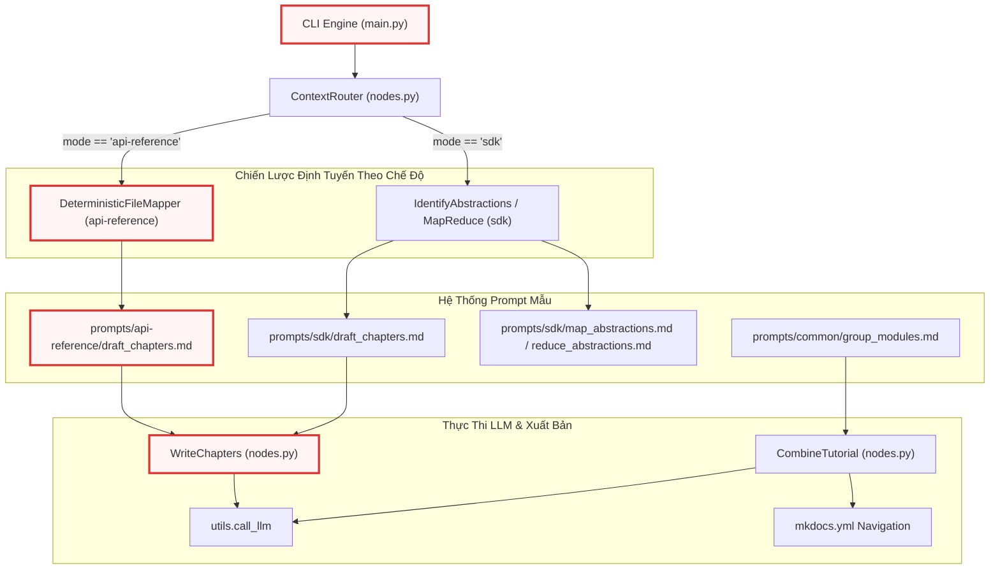

---

## 2. Phân rã Chi tiết Từng Chức năng & Mẫu Chỉ dẫn

### 2.1 Chế độ API Reference: Đặc tả Toàn diện 1:1 (`api-reference/draft_chapters.md`)

Trong chế độ `api-reference`, tài liệu hướng tới các kỹ sư phát triển nội bộ hoặc các chuyên gia cần hiểu rõ từng ngóc ngách của mã nguồn. Tệp mẫu `prompts/api-reference/draft_chapters.md` thiết lập một hợp đồng nghiêm ngặt: **Mỗi tệp mã nguồn là một trang tài liệu tham chiếu hoàn chỉnh**.

#### Trích đoạn Mẫu Chỉ dẫn Khởi tạo & Cấu trúc Phân rã Từng Hàm:
```markdown
{language_instruction}Write a complete formal API and internal engineering documentation reference page (in Markdown format) for the source file `{abstraction_name}` in the project `{project_name}`.
This is a 1:1 file-to-page mapping — each page documents exactly ONE source code file exhaustively.

File Details{concept_details_note}:
- Name: {abstraction_name}
- Description:
{abstraction_description}

Full Project Directory Structure:
{directory_tree}

Complete API Index{structure_note}:
{full_chapter_listing}

Your documentation page location: {current_doc_path}

Context from previous pages{prev_summary_note}:
{previous_chapters_summary}

Source Code Context:
{file_context_str}

Instructions for the API reference page (Generate content in {language} unless specified otherwise):
- Start with a clear heading `# {abstraction_name}`.
- Below the heading, state the source file path in this exact format: `> **Source:** \`path/to/file.ext\``
- Provide a technical overview of this file's purpose, behavior, and role in the system.

- If this is not the first page in the API Index, begin with a brief transition noting how this file relates to the previous one. Reference the previous page with a proper Markdown link using its name{link_lang_note}.

- This is an EXHAUSTIVE internal reference. Extract ALL classes, methods, functions, AND important class properties/fields defined in this file.
- CRITICAL: You MUST include all private methods, protected methods (e.g., methods starting with `_` or `__`), and internal helper functions present in the Source Code Context above. Do not skip any classes or functions — document EVERYTHING in this file.
```

Đoạn prompt trên thiết lập ngữ cảnh đầu vào gồm 8 biến nội suy chính. Điểm mấu chốt nằm ở chỉ thị `CRITICAL`: Bắt buộc mô hình không được bỏ qua các phương thức private (`_` hoặc `__`) và các hàm trợ năng nội bộ. Điều này trực tiếp giải quyết vấn đề cố hữu của các hệ thống tạo tài liệu tự động vốn chỉ quét qua các định nghĩa `public export`. Biến `{file_context_str}` chứa toàn bộ nội dung tệp nguồn (được cung cấp bởi `DeterministicFileMapper`), đảm bảo LLM có đầy đủ ngữ cảnh để thực thi bóc tách.

#### Hợp đồng Cấu trúc Hàm & Ràng buộc Độ dài:
```markdown
- FUNCTION-BY-FUNCTION BREAKDOWN (CRITICAL): Do NOT dump the entire source file and call it documentation. Instead, go method-by-method:
  1. Give each public method/function its own `###` subsection using the template below
  2. For each method, show its signature and the core implementation logic (10-50 lines, using `// ...` to skip boilerplate)
  3. Follow each code block with a prose paragraph explaining the behavior, edge cases, and error handling
  If the file implements multiple distinct features or handlers (e.g., 8 button click handlers), each MUST get its own documented subsection — do not lump them into one giant code block.

- Generate standard Markdown API documentation enforcing this exact structure for each method/function:

### `function_or_method_name()`
**Visibility**: (Specify Public, Protected, or Private)
**Signature**: `def _function_name(arg1: type) -> type:` (or equivalent in the source language)

**Description**: Technical description of the behavior and internal implementation details. What does this actually do under the hood?

**Parameters**:
* `arg1` (type): Description of the argument.

**Returns**:
* `type`: Description of the return value.

**Raises**:
* `ExceptionType`: When/why it is raised internally.

**Example**:
```python
# Show ACTUAL usage from the source code — extract a real call site, test case,
# or the method's own implementation. NEVER invent example code.
```
```

Cấu trúc định dạng này chuẩn hóa đầu ra theo chuẩn tài liệu kỹ thuật cấp cao. Ràng buộc `FUNCTION-BY-FUNCTION BREAKDOWN` ngăn chặn hiện tượng LLM nhồi nhét toàn bộ tệp nguồn vào một khối code duy nhất rồi đưa ra giải thích chung chung. Mỗi hàm bắt buộc phải có trường `Visibility`, `Signature`, `Parameters`, `Returns`, `Raises` và `Example`. Quy tắc `NO INVENTED CODE` yêu cầu LLM trích xuất các ví dụ từ chính các ca kiểm thử hoặc lời gọi hàm thực tế có trong ngữ cảnh mã nguồn; nếu không có điểm gọi lệnh, LLM phải hiển thị chính phần thân hàm đó thay vì tự tạo một đoạn mã giả lập.

#### Ràng buộc Sơ đồ Trực quan & Tỷ lệ Giải thích Kỹ thuật:
```markdown
- CODE FIDELITY: Inside fenced code blocks, preserve ALL original source code and comments EXACTLY as they appear — in their original language, with original variable names, and original inline comments. Never translate, rephrase, or modify code or inline comments. Your own explanations belong in prose paragraphs outside the code fence.

- CODE BLOCK SIZE: For each documented method/function, show its signature and the core implementation logic in a code block of 10-50 lines. Use `// ...` (or the language's comment syntax) to skip boilerplate, repetitive branches, or trivial setup within the method body. NEVER exceed 50 lines in one code block. Follow each code block with a prose paragraph explaining the implementation behavior.

- EXPLANATION RATIO: For every code block, you MUST write at least one full paragraph (3-5 sentences minimum) of technical explanation immediately after it — describe the behavior, implementation strategy, error handling, and edge cases. Do NOT just show code with a one-liner description.

- When the file defines control flows, inheritance hierarchies, state machines, or node/pipeline architectures, you MUST include Mermaid diagrams using fenced code blocks (```mermaid). NEVER use ASCII art, box-drawing characters (+---+, |, v), or plaintext diagrams — they render poorly in web documentation. Choose the appropriate Mermaid diagram type:
  * `classDiagram` — for inheritance, composition, or factory patterns
  * `sequenceDiagram` — for request/response flows that cross multiple components
  * `flowchart TD` — for decision logic, branching, pipeline stages, or node architecture (MUST use TD direction)
  * `stateDiagram` — for entity lifecycle states
```

Chỉ thị `CODE FIDELITY` bảo vệ toàn vẹn cú pháp của mã nguồn: Mô hình ngôn ngữ tuyệt đối không được dịch mã nguồn hoặc chú thích nội dòng sang ngôn ngữ khác, bảo đảm mã copy-paste luôn chạy được. Tỷ lệ phân tích `EXPLANATION RATIO` (tối thiểu 3-5 câu văn xuôi sau mỗi khối code) buộc LLM phải giải thích chiến lược xử lý lỗi (error handling) và các trường hợp biên (edge cases). Về mặt trực quan hóa, hệ thống cấm hoàn toàn ASCII art và áp đặt quy chuẩn Mermaid nghiêm ngặt (`flowchart TD`, khối hộp vuông có nhãn chuỗi `"Label"` và lớp giao diện nhấn mạnh `entryNode`).

---

### 2.2 Chế độ SDK: Bề mặt Tích hợp Công khai & Developer Experience (`sdk/draft_chapters.md`)

Chế độ `sdk` phục vụ đối tượng lập trình viên bên ngoài tích hợp thư viện vào ứng dụng của họ. Khác với `api-reference`, tài liệu SDK lược bỏ các chi tiết triển khai nội bộ tầm thường, tập trung vào giao diện công khai và mô hình sử dụng thực tế.

#### Cấu trúc Chỉ dẫn Soạn thảo SDK:
```markdown
{language_instruction}Write a complete formal SDK documentation reference page (in Markdown format) for the module `{abstraction_name}` in the project `{project_name}`.

Module Details{concept_details_note}:
- Name: {abstraction_name}
- Description:
{abstraction_description}

Full Project Directory Structure:
{directory_tree}

Complete SDK Index{structure_note}:
{full_chapter_listing}

Your documentation page location: {current_doc_path}

Context from previous modules{prev_summary_note}:
{previous_chapters_summary}

Source Code Context:
{file_context_str}

Instructions for the SDK reference page (Generate content in {language} unless specified otherwise):
- Start with a clear heading `# {abstraction_name}`.
- Provide a technical overview of this module's behavior and what capability it provides to SDK consumers.

- If this is not the first module in the SDK Index, begin with a brief transition noting how this module relates to the previous one. Reference the previous module with a proper Markdown link using its name{link_lang_note}.

- Extract the primary public-facing APIs, classes, and methods relevant for an SDK consumer. Focus on what a developer needs to integrate this module. You DO NOT need to document internal helper methods or private functions unless they are crucial for understanding the architecture.
```

So sánh với `api-reference`, mục tiêu của mẫu này chuyển dịch từ *exhaustiveness* (tính toàn diện) sang *actionability* (tính khả thi trong tích hợp). Câu chỉ thị `"You DO NOT need to document internal helper methods or private functions unless they are crucial for understanding the architecture"` giúp tinh giản tài liệu, giữ sự tập trung của nhà phát triển vào các API công khai chính.

#### Quy chuẩn Định dạng Phương thức SDK:
```markdown
- Generate standard Markdown API documentation enforcing this exact structure for each public method/function:

### `function_or_method_name()`
**Signature**: `def function_name(arg1: type) -> type:` (or equivalent in the source language)

**Description**: What does this function do for the developer? Focus on usage, not internal implementation.

**Parameters**:
* `arg1` (type): Description of the argument.

**Returns**:
* `type`: Description of the return value.

**Example**:
```python
# Show a REAL-WORLD usage example derived from actual source code patterns.
# Extract from tests, existing call sites, or construct from the method's
# actual signature and behavior. NEVER invent hypothetical code.
```

- Document all public-facing APIs present in the Source Code Context above. Group methods under their respective class headings (`## ClassName`).

- IMPORTANT: You MUST reference ACTUAL code from the provided Source Code Context — never invent examples. However, DO NOT dump entire source files. Instead, extract the most significant public methods and classes selectively.
```

Mục `Description` trong mẫu SDK tập trung vào giá trị sử dụng cho lập trình viên thay vì phân tích cơ chế nội tại dưới nắp ca-pô. Khối `Example` được tối ưu hóa để phản ánh các mẫu tích hợp thực tế (real-world usage patterns), hỗ trợ kỹ sư tích hợp nhanh chóng thông qua việc sao chép các đoạn mã khởi tạo và cấu hình hợp lệ.

---

### 2.3 Phân cụm Ngữ nghĩa Thanh Điều hướng: `prompts/common/group_modules.md`

Khi tài liệu hóa một hệ thống lớn có từ 50 đến hàng trăm tệp tin, việc hiển thị toàn bộ danh sách module trên một thanh bên phẳng (flat sidebar) sẽ gây quá tải nhận thức. Mẫu chỉ dẫn `group_modules.md` được gọi trong node `CombineTutorial` để yêu cầu LLM phân tích toàn bộ danh sách module và cây thư mục, từ đó tổng hợp thành cấu trúc cây điều hướng phân cấp (hierarchical navigation tree) cho MkDocs Material.

#### Toàn văn Mẫu Chỉ dẫn Phân nhóm:
```markdown
You are organizing a documentation sidebar for the project "{project_name}".

Below are all {module_count} documented modules with their technical summaries:

{module_list}

Directory structure of the project:
{directory_tree}

Group these modules into a LOGICAL HIERARCHY for a documentation sidebar.

Rules:
- Create as many sections and sub-sections as the project needs
- Group by PURPOSE and DOMAIN, not by directory or filename
- Section names should be meaningful to developers
- Every module MUST appear in exactly one section
- Order sections from most fundamental to most specialized
- Order modules within each section logically
- For small projects (under 15 modules), 2-4 sections is fine
- For large projects (50+ modules), use nested sub-sections
{language_note}

Return ONLY valid YAML:

```yaml
sections:
  - name: "Section Name"
    modules: ["module_name_1", "module_name_2"]
  - name: "Parent Section"
    children:
      - name: "Child Section"
        modules: ["module_name_3"]
```
```

Đoạn chỉ dẫn áp đặt các quy tắc logic chặt chẽ:
1. **Phân nhóm theo Mục đích và Miền nghiệp vụ (Purpose & Domain)**: Không phụ thuộc cứng nhắc vào vị trí thư mục vật lý, cho phép gộp các file có vai trò tương hỗ (như client và middleware) vào cùng một phân mục hợp lý.
2. **Nguyên tắc Bao phủ Toàn vẹn (Exhaustive Coverage)**: Mọi module bắt buộc phải xuất hiện trong đúng một section.
3. **Thứ tự Tiến hóa (Progression Ordering)**: Sắp xếp các section từ nền tảng nhất (Core/Models/Config) đến chuyên biệt nhất (Extensions/CLI/Diagnostics).
4. **Hợp đồng Đầu ra YAML Đơn nhất (Strict YAML Schema)**: Chỉ trả về cấu trúc danh sách lồng nhau gồm các khóa `sections`, `name`, `modules`, `children` giúp hàm `parse_yaml_response()` giải mã trực tiếp thành cấu trúc dữ liệu Python để ghi vào `mkdocs.yml`.

#### Quy trình Xử lý Phân nhóm Thanh Điều hướng:

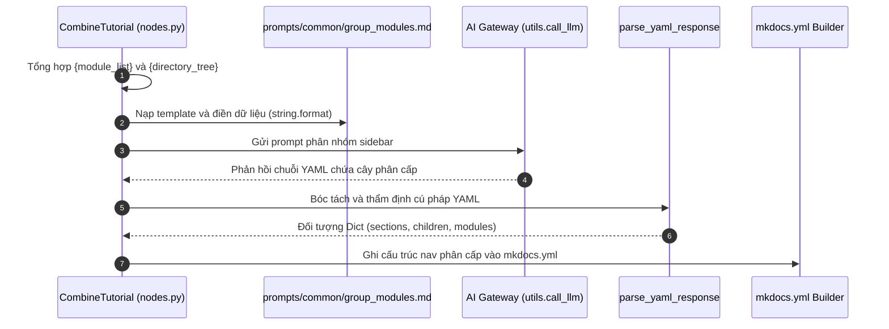

---

### 2.4 Khám phá & Gom cụm Module SDK (`sdk/identify_abstractions.md` & `sdk/reduce_abstractions.md`)

Trong chế độ `sdk`, hệ thống không ánh xạ 1:1 theo tệp mà gom nhóm các tệp có mối liên hệ chức năng chặt chẽ thành các "Module SDK". 

#### Trích đoạn Mẫu Chỉ dẫn Nhận diện Module SDK (`sdk/identify_abstractions.md`):
```markdown
For the project `{project_name}`, your task is to identify the core logical SDK modules or namespaces from the codebase context provided below to generate a cohesive Public SDK documentation reference.

Codebase Context:
{context}

Full Project Directory Structure:
{directory_tree}

{language_instruction}You must identify and group the files into logically distinct SDK Modules (e.g., `Authentication`, `Database Models`, `UI Event Handlers`). Do NOT do a 1:1 file mapping. Group related files into cohesive modules that a developer would naturally look for when integrating this SDK.

COVERAGE RULE: Every file index listed below MUST belong to at least one SDK module.
After forming your initial modules, scan the file listing to verify no files are unassigned.
If any files are orphaned, either create a new module or expand an existing one.
Do NOT skip files just because they contain only data models, configuration, or simple boilerplate —
these define the SDK's data contracts and configuration surface.
```

Quy tắc `COVERAGE RULE` đảm bảo tính toàn vẹn 100% của kho mã nguồn. Dù không ánh xạ 1:1, hệ thống không cho phép bất kỳ tệp nào bị "bỏ rơi" (orphaned). Các tệp mô hình dữ liệu (DTO/Schema) phải được nhóm kèm với module trực tiếp tiêu thụ chúng, tránh tạo ra các module vô danh dạng "Models" hoặc "Types" chung chung gây khó khăn cho việc tra cứu.

#### Hợp nhất Batch qua `sdk/reduce_abstractions.md`:
Đối với các codebase vượt ngưỡng kích thước cửa sổ ngữ cảnh, node `IdentifyAbstractions` chạy qua nhiều batch (`map_abstractions.md`), sau đó sử dụng `sdk/reduce_abstractions.md` để hợp nhất các module trùng lặp.

```markdown
For the project `{project_name}`:

We have identified several partial, overlapping SDK modules from different batches of the codebase.

Partial Modules:
{partial_abstractions}

{language_instruction}Your task is to merge these overlapping partial modules into a cohesive, global list of maximum {max_abstraction_num} core SDK modules.

MERGE RULES:
- DO merge: partial modules from different batches that clearly describe the same component (same class names mentioned, same namespace, overlapping file indices).
- DO merge: a small auxiliary concern (1-3 files) into the larger module it serves.
- DO NOT merge: modules at different architectural layers (e.g., network infrastructure + business logic).
- DO NOT merge: modules with different consumers (e.g., admin-facing tools + end-user-facing services).
- DO NOT merge if the result would cover more than ~30 files — that is too broad for one reference page; keep them separate.
```

Các quy tắc `MERGE RULES` và `SIZING GUIDANCE` thiết lập ranh giới định lượng rõ ràng: Nếu một module gom quá 30 tệp, nó phải được tách biệt; nếu một mối quan tâm phụ chỉ gồm 1-3 tệp, nó phải được gộp vào module chính. Điều này giúp cân bằng độ dài của các trang tài liệu SDK, ngăn ngừa việc tài liệu bị quá ngắn (loãng) hoặc quá dài (vượt trần token context khi sinh nội dung chi tiết).

---

### 2.5 Quy hoạch Lộ trình Tích hợp & Sơ đồ Quan hệ SDK (`sdk/order_chapters.md` & `sdk/identify_relationships.md`)

Sau khi danh sách module trừu tượng được thiết lập, hệ thống tiến hành xác định thứ tự đọc và các mối quan hệ tương tác.

#### Chỉ dẫn Sắp xếp Chương SDK (`sdk/order_chapters.md`):
```markdown
Given the following SDK modules and their dependencies for the project `{project_name}`:

Modules (Index # Name){list_lang_note}:
{abstraction_listing}

Context about relationships and project summary:
{context}

What is the best order to present these modules in the SDK documentation?
The reader is a developer integrating this SDK into their application. Order for maximum "I can start building immediately" progression.

ORDERING STRATEGY:
1. Start with getting-started essentials: initialization, configuration, and client setup — what the developer needs to write their first line of code.
2. Then authentication and identity modules — the developer needs to understand trust boundaries before calling any API.
3. Then core domain modules in the order a typical integration would use them (e.g., create resource → query resource → update resource → delete resource).
4. Then advanced features and customization modules (hooks, plugins, middleware, custom serializers).
5. End with utilities, helpers, and diagnostic modules (logging, debugging, error handling).
```

Chiến lược `ORDERING STRATEGY` phản ánh chính xác hành trình nhận thức (cognitive journey) của một lập trình viên:
$$\text{Cài đặt \& Cấu hình} \longrightarrow \text{Xác thực} \longrightarrow \text{Nghiệp vụ Cốt lõi} \longrightarrow \text{Tùy biến Nâng cao} \longrightarrow \text{Tiện ích \& Chẩn đoán}$$

Thứ tự này giúp lập trình viên có thể đọc tài liệu tuần tự từ Chương 1 đến hết và có thể bắt đầu viết code ngay từ những trang đầu tiên.

#### Định nghĩa Mối quan hệ Kỹ thuật (`sdk/identify_relationships.md`):
```markdown
{language_instruction}Please provide:
1. A high-level technical `summary` of the project's SDK architecture in a few sentences{lang_hint}. Use markdown formatting with **bold** and *italic* text to highlight key components and integration patterns.
2. A list (`relationships`) describing the key technical interactions, dependencies, or data flows between these modules. For each relationship, specify:
    - `from_abstraction`: Index of the source module (e.g., `0 # Module1`)
    - `to_abstraction`: Index of the target module (e.g., `1 # Module2`)
    - `label`: A precise technical label for the interaction **in just a few words**{lang_hint}.
      The label should describe WHAT flows between the two (data, control, events) and through what mechanism.
      Examples of good labels: "calls via RPC for lookup", "inherits interface from", "validates tokens via", "persists entities to", "subscribes to config-change events"
      Examples of bad labels: "uses", "manages", "depends on", "related to" (too vague to be useful for SDK consumers)
```

Prompt yêu cầu các nhãn quan hệ (`label`) phải mô tả chính xác bản chất tương tác kỹ thuật (giao thức, luồng dữ liệu, sự kiện) thay vì các động từ mơ hồ như `"uses"` hay `"depends on"`. Dữ liệu này sau đó được chuyển đổi trực tiếp thành biểu đồ kiến trúc hệ thống bằng Mermaid trong tài liệu hoàn chỉnh.

---

### 2.6 Cơ chế Bỏ qua Nhận diện Trừu tượng Tất định (Deterministic Bypass) trong API Reference

Một quyết định thiết kế kiến trúc quan trọng trong hệ thống là sự hiện diện của các tệp prompt có chú thích vô hiệu hóa trong thư mục `prompts/api-reference/`:
- `identify_abstractions.md`
- `identify_relationships.md`
- `map_abstractions.md`
- `reduce_abstractions.md`
- `order_chapters.md`

#### Ghi chú Kỹ thuật Đầu Tệp (Header Warning):
```markdown
<!-- NOTE: This template is NOT used in the current api-reference flow.
     ContextRouter routes api-reference mode to DeterministicFileMapper,
     which bypasses abstraction discovery entirely (1:1 file mapping).
     Kept for potential future use if api-reference adds a non-deterministic path. -->
```

#### Phân tích Cơ chế Kiến trúc:
Trong chế độ `api-reference`, lớp `ContextRouter` trong `nodes.py` nhận diện cờ `--mode api-reference` và chuyển hướng luồng thực thi sang `DeterministicFileMapper`. Node này trực tiếp lặp qua danh sách `shared["files"]` và tạo ra danh sách abstractions mà mỗi abstraction tương ứng chính xác với một tệp vật lý. 

Tại sao hệ thống lại duy trì các tệp prompt này trong mã nguồn dù không thực thi tại runtime?
1. **Tính Nhất quán của Cấu trúc Thư mục (Directory Symmetry)**: Giữ cho cây thư mục `prompts/api-reference` đối xứng 1:1 với `prompts/tutorial`, `prompts/advanced` và `prompts/sdk`.
2. **Khả năng Mở rộng Tương lai (Future Extension)**: Sẵn sàng kích hoạt chế độ "API Reference Cấp Cụm" (Clustered API Reference) nếu người dùng yêu cầu gom nhóm các endpoint mà không muốn dùng chế độ 1:1 chi tiết.
3. **Phòng thủ Hồi quy (Regression Defense)**: Đảm bảo nếu một lập trình viên vô tình gọi phương thức trừu tượng hóa cho API Reference, hệ thống vẫn có prompt hợp lệ để nạp thay vì gây lỗi `FileNotFoundError`.

---

## 3. So sánh Kiến trúc Giữa Các Chế độ Prompt

Bảng dưới đây tổng hợp sự khác biệt về bản chất kỹ thuật, đối tượng độc giả và hợp đồng đầu ra giữa chế độ `api-reference`, `sdk`, và hai chế độ đã phân tích ở Chương 5:

| Thuộc tính Kiến trúc | Chế độ `api-reference` | Chế độ `sdk` | Chế độ `tutorial` / `advanced` (Chương 5) |
| :--- | :--- | :--- | :--- |
| **Mục tiêu Trọng tâm** | Tham chiếu nội bộ chi tiết, toàn diện 100% | Tích hợp thư viện công khai, nâng cao DX | Sư phạm, luồng thực thi, đánh đổi thiết kế |
| **Chiến lược Ánh xạ Tệp** | **Tất định 1:1** (`DeterministicFileMapper`) | **Phân cụm Ngữ nghĩa** (MapReduce/LLM) | **Phân cụm Trừu tượng** (MapReduce/LLM) |
| **Phạm vi Hàm Bóc tách** | **Tất cả** (Public, Protected, Private, Helper) | **Chỉ Public APIs** và luồng tích hợp | Khối mã nguồn minh họa luồng dữ liệu |
| **Mẫu Cấu trúc Hàm** | Bắt buộc (Visibility, Signature, Params, Returns, Raises, Example) | Bắt buộc (Signature, Description, Params, Returns, Real Example) | Tự do theo ngữ cảnh câu chuyện kỹ thuật |
| **Yêu cầu Mã Ví dụ** | Trích xuất call site/test thực tế (Tuyệt đối không bịa đặt) | Trích xuất pattern thực tế từ code/test | Đoạn code minh họa kèm giải thích |
| **Xây dựng Thanh Nav** | Phân cụm ngữ nghĩa qua `group_modules.md` | Phân cụm ngữ nghĩa qua `group_modules.md` | Sắp xếp theo thứ tự đọc tuyến tính (`order_chapters`) |
| **Độ dài Trang Dự kiến** | 3,000 – 8,000 từ / trang | 3,000 – 6,000 từ / trang | 3,000 – 7,000 từ / chương |

---

## 4. Mô hình Dữ liệu và Cấu trúc Biến Nội suy

Để đảm bảo khả năng liên kết chéo và tái cấu trúc nội dung chính xác, các prompt mẫu trong chương này ràng buộc chặt chẽ với các biến trạng thái trong `shared store`.

```mermaid
classDiagram
    class PromptContextVariables {
        +String project_name
        +String language_instruction
        +String directory_tree
        +String abstraction_name
        +String abstraction_description
        +String current_doc_path
        +String full_chapter_listing
        +String previous_chapters_summary
        +String file_context_str
    }

    class APIDraftChaptersTemplate {
        <<Template: api-reference/draft_chapters.md>>
        +Enforce 1:1 file mapping
        +Require private/protected methods
        +Extract Visibility/Signature/Params/Raises
        +Mermaid flowchart TD styling
    }

    class SDKDraftChaptersTemplate {
        <<Template: sdk/draft_chapters.md>>
        +Focus on public-facing APIs
        +Document consumer setup flows
        +Filter out internal helpers
    }

    class GroupModulesTemplate {
        <<Template: common/group_modules.md>>
        +Input: module_list, directory_tree
        +Output: YAML sections and children hierarchy
    }

    PromptContextVariables <|-- APIDraftChaptersTemplate : Interpolates
    PromptContextVariables <|-- SDKDraftChaptersTemplate : Interpolates
    PromptContextVariables <|-- GroupModulesTemplate : Interpolates
```

Mỗi biến đại diện cho một phần dữ liệu được tính toán động bởi pipeline:
- `{current_doc_path}`: Cho phép LLM tính toán chính xác đường dẫn tương đối (`../sub/file.md`) khi tạo các liên kết Markdown chéo giữa các trang tài liệu.
- `{full_chapter_listing}`: Cung cấp toàn bộ chỉ mục tài liệu của dự án để LLM biết trang hiện tại đang đứng ở đâu trong bức tranh tổng thể.
- `{previous_chapters_summary}`: Chứa tóm tắt lũy kế 4 chiều từ các chương trước (được tạo bởi `build_chapter_summary_prompt`), giúp duy trì tính liên tục và tham chiếu nhất quán.

---

## 5. Ghi chú Thực tiễn cho Kỹ sư Mới (Practical Notes for New Team Members)

### 5.1 Vị trí Cấu hình & Mở rộng Mẫu Chỉ dẫn
- **Đường dẫn Prompt**: Toàn bộ prompt được lưu trữ trong thư mục `prompts/`. Khi cần chỉnh sửa định dạng tài liệu API, hãy can thiệp trực tiếp vào `prompts/api-reference/draft_chapters.md`. Nếu cần thay đổi hành vi tích hợp SDK, can thiệp vào `prompts/sdk/draft_chapters.md`.
- **Cấu hình Thanh Điều hướng**: Quy tắc phân nhóm sidebar được quy định tại `prompts/common/group_modules.md`. Nếu cấu trúc điều hướng sinh ra quá sâu hoặc quá phẳng, hãy điều chỉnh các chỉ thị phân cấp trong tệp này.

### 5.2 Điểm Kiểm tra Khi Gặp Lỗi (Debugging Entry Points)
- **Lỗi Cú pháp YAML trong `group_modules`**: Khi LLM sinh ra YAML không hợp lệ cho cấu trúc sidebar, hàm `parse_yaml_response()` trong `nodes.py` sẽ ném ngoại lệ hoặc trả về từ điển rỗng. Hãy kiểm tra tệp `logs/llm_execution.log` để xem chuỗi YAML thô do LLM trả về.
- **Hiện tượng Thiếu Hàm Private trong API Reference**: Nếu tài liệu API sinh ra thiếu các phương thức nội bộ, hãy kiểm tra lại biến `{file_context_str}` trong `WriteChapters.prep()`. Đảm bảo rằng `DeterministicFileMapper` đã đọc toàn bộ tệp và không bị cắt tỉa nhầm bởi bộ lọc kích thước `--max-size`.
- **Lỗi Sai Đường Dẫn Liên Kết Markdown**: Nếu các liên kết tương đối giữa các trang bị lỗi 404 trên MkDocs, kiểm tra biến `{current_doc_path}` được truyền vào prompt. LLM dựa hoàn toàn vào đường dẫn này để sinh đường dẫn tương đối.

### 5.3 Nợ Kỹ thuật & Các Lưu ý Đặc thù (Known Quirks)
- **Ràng buộc Giới hạn 50 Dòng Code Block**: Prompt chỉ thị LLM không được xuất khối mã vượt quá 50 dòng và phải dùng `// ...` để bỏ qua boilerplate. Một số mô hình LLM nhỏ có thể phớt lờ chỉ thị này và xuất toàn bộ mã nguồn lớn. Cần theo dõi log token nếu nhận thấy dung lượng phản hồi tăng đột biến.
- **Tính Thừa kế của các Tệp Prompt Vô hiệu hóa**: Các tệp `prompts/api-reference/identify_*.md` hiện không tham gia vào luồng runtime. Khi thực hiện tái cấu trúc lớn (refactoring), hãy cẩn trọng không xóa nhầm các tệp này để duy trì tính đối xứng của kho prompt.

### 5.4 Quy chuẩn Đánh giá Code (Code Review Guidelines)
- Khi cập nhật bất kỳ tệp Markdown prompt nào, **tuyệt đối không hardcode ngôn ngữ tự nhiên** trong thân prompt. Luôn sử dụng các biến giữ chỗ `{language_instruction}`, `{name_lang_hint}`, `{desc_lang_hint}` để đảm bảo tính năng đa ngôn ngữ (i18n) không bị phá vỡ.
- Mọi thay đổi trong cấu trúc đầu ra Markdown của `draft_chapters.md` phải được kiểm tra tương thích với trình dựng của theme MkDocs Material (đặc biệt là cú pháp Admonition, Code Fences và biểu đồ Mermaid).

---

## 6. Tóm tắt Kỹ thuật & Bước tiếp theo

Chương này đã làm rõ kiến trúc thiết kế của Hệ thống Prompt Mẫu dành cho Tài liệu Tham chiếu API và Hướng dẫn Tích hợp SDK. Chúng ta đã phân tích:
- Cơ chế ánh xạ tất định 1:1 và quy chuẩn bóc tách từng phương thức khắt khe trong `api-reference/draft_chapters.md`.
- Hướng tiếp cận lấy nhà phát triển làm trung tâm trong `sdk/draft_chapters.md`.
- Thuật toán phân cụm thanh điều hướng đệ quy thông minh qua `common/group_modules.md`.
- Lý do kiến trúc cho việc bỏ qua nhận diện trừu tượng động trong chế độ API Reference.

Trong chương tiếp theo, chúng ta sẽ khảo sát lớp hỗ trợ toàn cục: cách hệ thống thực hiện bản địa hóa đa ngôn ngữ, chuẩn hóa định dạng kết xuất và quản lý luồng nhật ký thực thi.

👉 Chuyển sang [Chương 7: Hệ thống Đa ngôn ngữ (i18n), Định dạng Đầu ra & Logging](07_hệ_thống_đa_ngôn_ngữ__i18n___định_dạng_đầu_ra___logging.md).


---

<a id="chapter-7"></a>

# Chapter 7: Hệ thống Đa ngôn ngữ (i18n), Định dạng Đầu ra & Logging

Ở chương trước, [Hệ thống Prompt Mẫu cho Tài liệu API & Tích hợp SDK](06_hệ_thống_prompt_mẫu_cho_tài_liệu_api___tích_hợp_sdk.md) đã phân tích chi tiết kỹ thuật trích xuất bề mặt mã nguồn, ánh xạ tất định 1:1 và cấu trúc hóa cây điều hướng phân cấp. Tuy nhiên, để một hệ thống tài liệu hóa mã nguồn tự động vận hành trơn tru trong môi trường kỹ thuật đa quốc gia, toàn bộ thông điệp giao diện dòng lệnh (CLI), luồng nhật ký chẩn đoán (Diagnostic Logging) và các nhãn tiêu đề Markdown sinh ra phải được trừu tượng hóa khỏi mã nguồn logic.

Chương này đi sâu vào kiến trúc của **Hệ thống Đa ngôn ngữ (i18n), Định dạng Đầu ra & Logging** — lớp dịch vụ nền tảng chịu trách nhiệm về toàn bộ giao diện tương tác người dùng trên Terminal, cơ chế tự động bản địa hóa chuỗi thông điệp dựa trên LLM (*LLM Auto-Translation Fallback*) và hệ thống phân lập luồng ghi nhật ký vận hành theo từng phiên làm việc.

---

## 1. Tổng quan Kiến trúc (Technical Overview)

### 1.1. Vai trò Kiến trúc (Architectural Role)
Trong các công cụ CLI phức tạp, việc nhúng trực tiếp các chuỗi ký tự hiển thị (*hardcoded strings*), mã màu terminal và lệnh in `print()` rải rác khắp các tầng nghiệp vụ dẫn đến ba vấn đề kiến trúc nghiêm trọng:
1. **Khó bảo trì và kiểm thử:** Bất kỳ thay đổi nào về văn bản, định dạng hiển thị hoặc bổ sung ngôn ngữ mới đều đòi hỏi phải can thiệp trực tiếp vào mã nguồn của các Node xử lý dữ liệu.
2. **Nhiễu loạn luồng dữ liệu:** Việc thiếu kiểm soát giữa đầu ra tiêu chuẩn (`STDOUT`) dành cho người dùng và đầu ra nhật ký (`LOG`) dành cho việc chẩn đoán lỗi khiến việc phân tích hiệu năng và debug trở nên khó khăn.
3. **Phá vỡ tính nhất quán của tài liệu sinh ra:** Các nhãn điều hướng (Navigation Labels), tiêu đề chương (Chapter Headings) và bảng mục lục (TOC) trong tài liệu Markdown đầu ra có thể bị lệch ngôn ngữ so với cấu hình người dùng yêu cầu.

Thành phần `utils.output` đóng vai trò là một **Lớp Trừu Tượng Hóa Đầu Ra Tập Trung (Centralized Output Abstraction Layer)**. Nó phân tách hoàn toàn tầng giao tiếp người dùng ra khỏi logic điều phối lõi (`flow.py`, `nodes.py`, `crawl_*.py`). Nếu hệ thống này gặp sự cố, CLI sẽ mất khả năng hiển thị tiến trình, định dạng mã màu ANSI bị vỡ, luồng ghi log bị gián đoạn và hệ thống tài liệu Markdown sẽ bị lỗi hiển thị các thành phần đa ngôn ngữ.

### 1.2. Mẫu Thiết kế (Design Patterns)
Hệ thống kết hợp ba mẫu thiết kế chính nhằm tối ưu hóa tính mở rộng và khả năng tự phục hồi:

*   **Externalized Strings (Resource Bundle Pattern):** Toàn bộ chuỗi thông điệp, nhãn giao diện và mẫu câu định dạng được lưu trữ độc lập trong tệp tài nguyên tĩnh `utils/strings.csv`. Mã nguồn ứng dụng chỉ tham chiếu đến các chuỗi này thông qua định danh duy nhất (`STRING_KEY`).
*   **LLM Auto-Translation Fallback (Self-Healing i18n):** Khác với các hệ thống i18n truyền thống (như GNU gettext) đòi hỏi dịch thủ công toàn bộ tệp `.po`/`.mo` trước khi biên dịch, hệ thống này tích hợp cơ chế tự phục hồi. Khi nhận diện một ngôn ngữ mới chưa từng có trong `strings.csv`, hệ thống tự động trích xuất các khóa còn thiếu, gửi yêu cầu đến LLM thông qua prompt `prompts/common/translate_strings.md`, phân tích cú pháp phản hồi và tự động ghi đè bổ sung cột ngôn ngữ mới vào tệp CSV ngay trong runtime.
*   **Logging Facade & Destination Routing Pattern:** Đóng gói thư viện chuẩn `logging` của Python dưới các hàm điều phối `emit()` và `emit_raw()`. Hệ thống tự động phân luồng dữ liệu dựa trên thuộc tính `DEST` của từng thông điệp: chỉ xuất ra màn hình (`STDOUT`), chỉ ghi vào tệp chẩn đoán (`LOG`), hoặc phát đồng thời tới cả hai kênh (`BOTH`).

```
                              +---------------------------------------+
                              |         CLI Arguments (--language)    |
                              +-------------------+-------------------+
                                                  |
                                                  v
                                      +-----------------------+
                                      |   utils.output.init   |
                                      +-----------+-----------+
                                                  |
                         +------------------------+------------------------+
                         |                                                 |
                         v                                                 v
              [strings.csv Exists]                              [Missing Target Lang]
                         |                                                 |
                         v                                                 v
              +----------------------+                         +-----------------------+
              |    _load_strings     |                         |    _auto_translate    |
              +----------+-----------+                         +-----------+-----------+
                         |                                                 |
                         |                                                 v
                         |                                     +-----------------------+
                         |                                     |  prompts/common/      |
                         |                                     |  translate_strings.md |
                         |                                     +-----------+-----------+
                         |                                                 |
                         |                                                 v
                         |                                     +-----------------------+
                         |                                     |   utils.call_llm      |
                         |                                     +-----------+-----------+
                         |                                                 |
                         |                                                 v
                         |                                     +-----------------------+
                         |                                     | _write_translations_  |
                         |                                     | to_csv                |
                         |                                     +-----------+-----------+
                         |                                                 |
                         +------------------------+------------------------+
                                                  |
                                                  v
                                      +-----------------------+
                                      |   _strings (in RAM)   |
                                      +-----------+-----------+
                                                  |
                   +------------------------------+------------------------------+
                   |                                                             |
                   v                                                             v
        +--------------------+                                        +--------------------+
        |   emit(key, ...)   |                                        |     get(key)       |
        +----------+---------+                                        +----------+---------+
                   |                                                             |
         +---------+---------+                                                   v
         |                   |                                        +--------------------+
         v                   v                                        | Markdown Generator |
+-----------------+ +-----------------+                               | (Combine Nodes)    |
| STDOUT (Color)  | | logs/{run}.log  |                               +--------------------+
+-----------------+ +-----------------+
```

### 1.3. Trách nhiệm Cốt lõi (Core Responsibilities)
1. **Quản lý Tập trung Bảng Chuỗi i18n:** Nạp, phân tích và ánh xạ các chuỗi văn bản từ `utils/strings.csv` vào bộ nhớ RAM với cơ chế fallback tự động về tiếng Anh (`english`) khi một khóa chưa được bản địa hóa.
2. **Tự động Dịch Thuật Runtime:** Phát hiện các chuỗi chưa được dịch sang ngôn ngữ mục tiêu (`--language`), kích hoạt pipeline dịch thuật thông qua LLM và cập nhật trực tiếp vào tệp CSV mà không làm gián đoạn luồng thực thi chính.
3. **Định dạng Trực quan ANSI Terminal:** Ánh xạ mức độ thông điệp (`LEVEL`) thành các mã màu ANSI tương ứng (Cyan cho tiến trình, Green cho thành công, Yellow cho cảnh báo, Red cho lỗi, Gray cho debug).
4. **Định tuyến Kênh Xuất (Destination Routing):** Kiểm soát chính xác nơi thông điệp được xuất ra dựa trên trường `DEST` (`BOTH`, `STDOUT`, `LOG`) để tránh làm rác màn hình terminal hoặc bỏ sót thông tin chẩn đoán.
5. **Cấu hình Logging Chuyên biệt theo Phiên:** Khởi tạo tệp log cô lập cho từng phiên chạy tại thư mục `logs/` theo định dạng `{project_name}_{mode}_{YYYYMMDD_HHmmss}.log`, đồng thời loại bỏ các handler rác và thiết lập bộ định dạng thời gian chuẩn xác.
6. **Cung cấp Nhãn Giao diện cho Tầng Sinh Markdown:** Cung cấp hàm `get()` cho các node hạ nguồn (`CombineTutorialNode`, `DeterministicFileMapper`) để lấy chuỗi văn bản thuần đã dịch nhằm nhúng vào cấu trúc tài liệu tĩnh.

### 1.4. Phụ thuộc Trọng yếu (Key Dependencies)

```mermaid
flowchart TD
    subgraph CLI_AND_NODES["Tầng Điều Phối & Node Thực Thi"]
        MainModule["main.py"]
        NodesModule["nodes.py"]
        CrawlModule["crawl_local_files / crawl_github_files"]
        TokenUtilsModule["token_utils.py"]
    end

    subgraph OUTPUT_SUBSYSTEM["utils.output Subsystem"]
        OutputInit["init() / configure_logging()"]
        OutputEmit["emit() / emit_raw()"]
        OutputGet["get()"]
        OutputAutoTrans["_auto_translate() / _write_translations_to_csv()"]
    end

    subgraph EXTERNAL_RESOURCES["Tài Nguyên & Dịch Vụ Ngoài"]
        StringsCSV["utils/strings.csv"]
        TranslatePrompt["prompts/common/translate_strings.md"]
        CallLLM["utils.call_llm.call_llm()"]
        LogFileSystem["Hệ thống File logs/*.log"]
    end

    MainModule -->|"1. Khởi tạo ngôn ngữ & logging"| OutputInit
    MainModule -->|"2. Thông báo trạng thái cấu hình"| OutputEmit
    NodesModule -->|"3. Ghi log tiến trình & phân tích token"| OutputEmit
    NodesModule -->|"4. Truy xuất nhãn Markdown đa ngôn ngữ"| OutputGet
    CrawlModule -->|"5. Báo cáo quét tệp & loại trừ"| OutputEmit
    TokenUtilsModule -->|"6. Cảnh báo dung lượng ngữ cảnh"| OutputEmit

    OutputInit -->|"Đọc chuỗi ngôn ngữ"| StringsCSV
    OutputInit -->|"Kích hoạt dịch tự động"| OutputAutoTrans
    OutputAutoTrans -->|"Nạp mẫu chỉ dẫn"| TranslatePrompt
    OutputAutoTrans -->|"Gửi yêu cầu dịch"| CallLLM
    OutputAutoTrans -->|"Ghi đè cột ngôn ngữ mới"| StringsCSV
    OutputEmit -->|"Ghi dữ liệu chẩn đoán"| LogFileSystem

    classDef entryNode stroke:#d33,stroke-width:3px,fill:#fff5f5;
    class MainModule entryNode
    class OutputInit entryNode
    class StringsCSV entryNode
```

---

## 2. Cấu trúc Dữ liệu & Quản lý Trạng thái Module

Module `utils/output.py` hoạt động như một singleton module-level. Trạng thái hoạt động của hệ thống được duy trì thông qua các biến toàn cục nội bộ, kiểm soát toàn bộ vòng đời từ khi nhận tham số dòng lệnh đến khi kết thúc phiên chạy.

### 2.1. Cấu trúc Bảng Tra Cứu Chuỗi (`strings.csv`)
Tệp `utils/strings.csv` được thiết kế theo cấu trúc bảng hai chiều:
*   `STRING_KEY`: Định danh duy nhất của chuỗi (khóa chính).
*   `LEVEL`: Cấp độ thông điệp, quyết định màu sắc terminal và log level (`PROGRESS`, `SUCCESS`, `WARNING`, `ERROR`, `INFO`, `DEBUG`, `FILE_WRITE`, `UI`).
*   `DEST`: Kênh phân phối đích (`BOTH`, `STDOUT`, `LOG`).
*   Các cột ngôn ngữ (`english`, `vietnamese`, `chinese`, `japanese`, ...): Chứa nội dung văn bản tương ứng với ngôn ngữ đó, hỗ trợ các biến giữ chỗ dạng `{placeholder}`.

```csv
STRING_KEY,LEVEL,DEST,english,vietnamese,chinese,japanese,korean,french,spanish,german,portuguese,russian,thai,indonesian
LLM_CALL_WRITE_CHAPTER,PROGRESS,BOTH,[LLM Call] Writing chapter {chapter_num} for: {name}...,[LLM Call] Đang viết chương {chapter_num} cho: {name}...,,,,,,,,,,
UI_TUTORIAL,UI,BOTH,Tutorial,Hướng dẫn,教程,チュートリアル,튜토리얼,Tutoriel,Tutorial,Anleitung,Tutorial,Руководство,บทเรียน,Tutorial
```

### 2.2. Trạng thái Runtime và Bảng Ánh Xạ Màu Sắc / Logging

```python
# ---------------------------------------------------------------------------
# ANSI color map: LEVEL → color code
# ---------------------------------------------------------------------------
COLORS = {
    "PROGRESS": "\033[96m",  # Cyan — LLM calls, active steps
    "SUCCESS": "\033[92m",  # Green — completions, cache hits
    "WARNING": "\033[93m",  # Yellow — warnings, capacity alerts
    "ERROR": "\033[91m",  # Red — errors, failures
    "INFO": "",  # Plain — config, counts, labels
    "DEBUG": "\033[90m",  # Gray — skipped files, debug
    "FILE_WRITE": "",  # Plain — "  - Wrote {path}" messages
    "UI": "",  # N/A — used in generated docs, never printed
}
RESET = "\033[0m"

# Logging level map: output LEVEL → Python logging level
LOG_LEVELS = {
    "PROGRESS": logging.INFO,
    "SUCCESS": logging.INFO,
    "WARNING": logging.WARNING,
    "ERROR": logging.ERROR,
    "INFO": logging.INFO,
    "DEBUG": logging.DEBUG,
    "FILE_WRITE": logging.DEBUG,
}

# ---------------------------------------------------------------------------
# Module state
# ---------------------------------------------------------------------------
_strings = {}  # {key: {"text": str, "level": str, "dest": str}}
_language = "English"  # Capitalized for display (e.g., "Vietnamese")
_lang_col = "english"  # Lowercase for CSV column lookup
_logger = logging.getLogger("llm_logger")
_csv_path = None
_use_cache = True
_thinking_level = None
```

Cấu trúc trên định hình ranh giới vận hành của module:
1. `COLORS` sử dụng các chuỗi thoát ANSI tiêu chuẩn 16 màu/256 màu để tương thích tối đa với mọi terminal emulator hiện đại (Linux, macOS Terminal, Windows Terminal).
2. `LOG_LEVELS` chuyển đổi ngữ nghĩa giao diện CLI (`PROGRESS`, `SUCCESS`) thành mức độ logging kỹ thuật (`logging.INFO`, `logging.DEBUG`) của thư viện Python chuẩn, đảm bảo tính tương thích khi tích hợp với các hệ thống giám sát log tập trung.
3. Biến toàn cục `_strings` lưu trữ toàn bộ dữ liệu đã được giải mã từ CSV dưới dạng dictionary truy xuất với độ phức tạp $O(1)$.
4. Các biến `_use_cache` và `_thinking_level` được lưu trữ để tái sử dụng khi module cần tự khởi tạo lệnh gọi LLM trong tác vụ dịch tự động.

---

## 3. Phân tích Chi tiết Từng Chức năng & Luồng Xử lý

### 3.1. Khởi tạo Hệ thống & Nạp Dữ liệu: `init()` và `_load_strings()`

Hàm `init()` là điểm vào bắt buộc của hệ thống đầu ra, được gọi từ `main.py` ngay sau khi phân tích cú pháp CLI arguments và trước bất kỳ thao tác in ấn nào.

```python
def init(language="english", use_cache=True, thinking_level=None):
    """Initialize the output system: load strings.csv, set language, auto-translate missing.

    Must be called from main() after parsing CLI arguments but before any emit() calls.

    Args:
        language: Target language name (e.g., "Vietnamese").
        use_cache: Whether LLM caching is enabled (passed to translation calls).
        thinking_level: LLM thinking level (passed to translation calls).
    """
    global _language, _lang_col, _csv_path, _use_cache, _thinking_level
    _language = language.capitalize()
    _lang_col = language.lower()
    _csv_path = os.path.join(os.path.dirname(os.path.abspath(__file__)), "strings.csv")
    _use_cache = use_cache
    _thinking_level = thinking_level
    _load_strings()
    _auto_translate()
```

Hàm `init()` thiết lập trạng thái toàn cục cho ngôn ngữ mục tiêu (`_language` để hiển thị trên UI và `_lang_col` để truy vấn cột CSV). Đường dẫn `_csv_path` được tính toán tuyệt đối dựa trên vị trí của module `utils/output.py`, loại bỏ hoàn toàn lỗi sai lệch đường dẫn tương đối khi ứng dụng được kích hoạt từ các thư mục làm việc (working directory) khác nhau.

Tiếp theo, `_load_strings()` thực hiện quét toàn bộ tệp CSV vào bộ nhớ RAM:

```python
def _load_strings():
    """Load all strings from strings.csv."""
    global _strings
    _strings = {}

    if not _csv_path or not os.path.exists(_csv_path):
        return

    translated_count = 0
    total_count = 0

    with open(_csv_path, encoding="utf-8-sig") as f:
        reader = csv.DictReader(f)
        for row in reader:
            key = row.get("STRING_KEY", "").strip()
            if not key or key.startswith("#"):
                continue

            level = row.get("LEVEL", "INFO").strip()
            dest = row.get("DEST", "BOTH").strip()

            # Priority: language column → English fallback
            text = row.get(_lang_col, "").strip()
            if text:
                translated_count += 1
            else:
                text = row.get("english", "").strip()

            total_count += 1
            _strings[key] = {"text": text, "level": level, "dest": dest}

    if _lang_col != "english" and translated_count == total_count:
        emit_raw("SUCCESS", f"[i18n] {_language} — loaded {translated_count} strings from CSV")
```

Trong phương thức `_load_strings()`, việc sử dụng bảng mã `utf-8-sig` đóng vai trò tối quan trọng: nó tự động loại bỏ ký tự Byte Order Mark (BOM - `\ufeff`) nếu tệp CSV được chỉnh sửa từ Microsoft Excel trên Windows. Vòng lặp duyệt qua từng dòng, bỏ qua các dòng chú thích bắt đầu bằng `#` hoặc dòng trống. Cơ chế ưu tiên được áp dụng triệt để: nếu giá trị tại cột ngôn ngữ yêu cầu (`_lang_col`) rỗng hoặc không tồn tại, hệ thống tự động fallback về cột `english`, đảm bảo ứng dụng không bao giờ bị gián đoạn do thiếu chuỗi.

---

### 3.2. Động cơ Tự Động Dịch Ngôn Ngữ Thiếu: `_auto_translate()` & `_write_translations_to_csv()`

Khi người dùng cấu hình một ngôn ngữ chưa có hoặc chưa hoàn thiện trong `strings.csv`, hàm `_auto_translate()` sẽ phát hiện các khóa bị khuyết và kích hoạt chuỗi tác vụ dịch thuật tự động.

#### Phân đoạn 1: Quét khóa thiếu và chuẩn bị Prompt Dịch Thuật

```python
def _auto_translate():
    """Auto-translate missing strings via LLM and write back into strings.csv."""
    if _lang_col == "english":
        return

    if not _csv_path or not os.path.exists(_csv_path):
        return

    # Collect strings that have no translation in the target language column
    missing = {}
    is_new_column = False
    with open(_csv_path, encoding="utf-8-sig") as f:
        reader = csv.DictReader(f)
        fieldnames = list(reader.fieldnames)
        is_new_column = _lang_col not in fieldnames
        for row in reader:
            key = row.get("STRING_KEY", "").strip()
            if not key or key.startswith("#"):
                continue
            # Check if the language column exists and has a value
            lang_text = row.get(_lang_col, "").strip() if _lang_col in fieldnames else ""
            if lang_text:
                continue  # Already translated

            english_text = row.get("english", "").strip()
            if english_text:
                missing[key] = english_text

    if not missing:
        return

    # Report what we found
    if is_new_column:
        emit_raw("PROGRESS", f"[i18n] New language '{_language}' — adding column to strings.csv")
    emit_raw("PROGRESS", f"[i18n] {len(missing)} strings need translation to {_language}")
```

Đoạn mã trên thể hiện tính toán kiểm tra hai lớp:
1. Xác định xem tên ngôn ngữ `_lang_col` đã tồn tại trong danh sách tiêu đề cột (`fieldnames`) của CSV hay chưa. Nếu chưa, cờ `is_new_column` được bật.
2. Lọc tất cả các dòng có `STRING_KEY` hợp lệ nhưng thiếu nội dung bản địa hóa, gom toàn bộ chuỗi tiếng Anh tương ứng vào từ điển `missing` theo cặp `{STRING_KEY: english_text}`. Nếu từ điển `missing` rỗng, tiến trình thoát ngay lập tức mà không tiêu tốn tài nguyên mạng hay token.

#### Phân đoạn 2: Gọi LLM và Trích xuất Dữ liệu JSON

```python
    # Batch translate via LLM
    try:
        from utils.call_llm import call_llm

        entries_json = json.dumps(missing, ensure_ascii=False, indent=2)

        # Load prompt template from prompts/common/translate_strings.md
        prompt_path = os.path.join(
            os.path.dirname(os.path.dirname(os.path.abspath(__file__))),
            "prompts",
            "common",
            "translate_strings.md",
        )
        with open(prompt_path, encoding="utf-8") as pf:
            prompt_template = pf.read()
        prompt = prompt_template.format(language=_language, entries=entries_json)

        emit_raw("PROGRESS", f"[i18n] Calling LLM to translate {len(missing)} strings...")
        response = call_llm(prompt, use_cache=_use_cache, thinking_level=_thinking_level)

        # Extract JSON from response
        json_match = re.search(r"\{[^{}]*(?:\{[^{}]*\}[^{}]*)*\}", response, re.DOTALL)
        if json_match:
            translations = json.loads(json_match.group())
            translated_count = len(translations)

            # Write translations back into strings.csv
            _write_translations_to_csv(translations)
            emit_raw("SUCCESS", f"[i18n] Translated {translated_count}/{len(missing)} strings — saved to strings.csv")

            # Reload strings from the updated CSV so all translations are active
            _load_strings()
        else:
            emit_raw("WARNING", "[i18n] LLM response did not contain valid JSON — falling back to English")

    except Exception as e:
        emit_raw("WARNING", f"[i18n] Translation failed: {e} — falling back to English")
```

Tại phân đoạn này, hệ thống áp dụng kỹ thuật *Lazy Import* đối với `utils.call_llm.call_llm` nhằm ngăn ngừa lỗi vòng lặp phụ thuộc tròn (*circular dependency*), vì `call_llm.py` cũng sử dụng `output.py` để ghi log.

Mẫu chỉ thị dịch thuật được nạp từ `prompts/common/translate_strings.md`:

```markdown
Translate the following CLI output strings from English to {language}.
These are technical tool output messages for a code documentation generator.

Rules:
- Keep {{placeholder}} variables exactly as-is (e.g., {{count}}, {{path}}, {{name}})
- Keep technical terms like LLM, API, MkDocs, token, cache in English
- Keep all formatting: brackets [], colons :, dashes -, indentation
- Return ONLY a valid JSON object mapping each key to its translated string

{entries}
```

Hệ thống sử dụng biểu thức chính quy (Regex) với cờ `re.DOTALL` để bóc tách khối JSON hợp lệ từ phản hồi của LLM, loại bỏ các đoạn văn bản giải thích ngoài lề hoặc markdown code block wrapper (````json ... ````). Nếu quá trình gọi LLM hoặc parse JSON gặp sự cố, hệ thống bắt ngoại lệ toàn cục, đưa ra cảnh báo nhẹ qua `emit_raw("WARNING", ...)` và giữ nguyên cơ chế fallback tiếng Anh mà không làm crash ứng dụng.

#### Phân đoạn 3: Lưu trữ Bền vững vào CSV (`_write_translations_to_csv`)

```python
def _write_translations_to_csv(translations):
    """Write LLM translations back into strings.csv, persisting them for future runs.

    If the target language column doesn't exist, it is added to the CSV.
    """
    rows = []
    fieldnames = None

    with open(_csv_path, encoding="utf-8-sig") as f:
        reader = csv.DictReader(f)
        fieldnames = list(reader.fieldnames)
        # Add language column if it doesn't exist
        if _lang_col not in fieldnames:
            fieldnames.append(_lang_col)
        for row in reader:
            key = row.get("STRING_KEY", "").strip()
            if key in translations:
                row[_lang_col] = translations[key]
            rows.append(row)

    # Write with BOM so Excel opens as UTF-8 without extra import steps
    with open(_csv_path, "w", encoding="utf-8-sig", newline="") as f:
        writer = csv.DictWriter(f, fieldnames=fieldnames)
        writer.writeheader()
        writer.writerows(rows)
```

Hàm `_write_translations_to_csv` thực hiện quy trình cập nhật tệp tin hai pha (Read-Modify-Write). Nếu cột ngôn ngữ mới chưa có trong `fieldnames`, nó sẽ được bổ sung vào cuối danh sách. Sau khi cập nhật các giá trị dịch vào từng dòng tương ứng với `STRING_KEY`, toàn bộ nội dung được ghi đè trở lại đĩa cứng với định dạng mã hóa `utf-8-sig` và cờ `newline=""` (ngăn chặn chèn thêm dòng trống trên hệ điều hành Windows). Ngay sau khi ghi đĩa thành công, `_auto_translate()` gọi lại `_load_strings()` để nạp trực tiếp dữ liệu mới vào RAM.

---

### 3.3. Cơ chế Định dạng & Phân luồng Đầu ra: `emit()` & `_format_safe()`

Hàm `emit()` là giao diện xuất thông tin chính được sử dụng trên toàn bộ hệ thống.

```python
def _format_safe(template, kwargs):
    """Apply .format(**kwargs) with graceful fallback on missing keys."""
    try:
        return template.format(**kwargs)
    except (KeyError, IndexError, ValueError):
        return template


def emit(key, suffix="", **kwargs):
    """Emit a translatable string to stdout and/or log file.

    Args:
        key: String key from strings.csv (e.g., "LLM_CALL_WRITE_CHAPTER").
        suffix: Optional extra text appended after the main message (e.g., token breakdown).
        **kwargs: Variables to substitute into the string template.
    """
    entry = _strings.get(key)
    if not entry:
        # Fallback for unknown keys — print raw so nothing is silently lost
        print(f"[UNKNOWN STRING: {key}]")
        return

    text = _format_safe(entry["text"], kwargs)
    if suffix:
        text = text + suffix

    level = entry["level"]
    dest = entry["dest"]
    color = COLORS.get(level, "")
    reset = RESET if color else ""

    if dest in ("BOTH", "STDOUT"):
        print(f"{color}{text}{reset}")
    if dest in ("BOTH", "LOG"):
        _logger.log(LOG_LEVELS.get(level, logging.INFO), text)
```

Logic xử lý của `emit()` và `_format_safe()` bao gồm các chốt chặn phòng thủ:
1. **Fallback Khóa Lạ:** Nếu `key` không tồn tại trong từ điển `_strings`, hàm in thông báo `[UNKNOWN STRING: key]` ra terminal thay vì ném ngoại lệ `KeyError`.
2. **Safe Formatting:** Phương thức `_format_safe()` bọc lời gọi `template.format(**kwargs)` trong khối `try-except`. Nếu mã nguồn truyền thiếu tham số biến hoặc template chứa ký tự ngoặc nhọn `{}` không hợp lệ, chuỗi gốc chưa format sẽ được trả về nguyên vẹn thay vì làm dừng chương trình.
3. **ANSI Color Wrap:** Mã màu ANSI được chèn vào trước chuỗi ký tự và ký tự `RESET` (`\033[0m`) được thêm vào cuối cùng chỉ khi in ra `STDOUT`. Khi ghi vào `_logger`, chuỗi văn bản thuần túy (*clean text*) không chứa mã ANSI được sử dụng, đảm bảo tệp log không bị ô nhiễm bởi các ký tự điều khiển.
4. **Destination Routing:** Điều kiện kiểm tra `dest in ("BOTH", "STDOUT")` và `dest in ("BOTH", "LOG")` phân phối độc lập thông điệp tới terminal hoặc logging handler.

---

### 3.4. Xuất Dữ liệu Động & Cấu trúc Tự do: `emit_raw()`

Đối với các dữ liệu dạng cấu trúc động không thể định nghĩa trước trong `strings.csv` (như bảng danh sách tệp được crawl, thông tin chi tiết từng batch tệp, hoặc tiến trình thời gian thực), hàm `emit_raw()` cung cấp khả năng xuất trực tiếp với đầy đủ màu sắc và logging.

```python
def emit_raw(level, text, dest="BOTH"):
    """Emit a pre-formatted string with explicit level styling.

    Use for dynamic/structural output that doesn't come from strings.csv
    (e.g., numbered file lists, batch details, crawl summary tables).
    """
    color = COLORS.get(level, "")
    reset = RESET if color else ""

    if dest in ("BOTH", "STDOUT"):
        print(f"{color}{text}{reset}")
    if dest in ("BOTH", "LOG"):
        _logger.log(LOG_LEVELS.get(level, logging.INFO), text)
```

`emit_raw()` nhận trực tiếp tham số `level` (ví dụ `"SUCCESS"`, `"WARNING"`, `"ERROR"`) để tự động tra cứu mã màu ANSI từ `COLORS` và cấp độ ghi log từ `LOG_LEVELS`. Hàm này cho phép các kỹ sư hiển thị dữ liệu linh hoạt nhưng vẫn tuân thủ bảng quy chuẩn màu sắc chung của ứng dụng.

---

### 3.5. Truy xuất Nhãn Đa ngôn ngữ cho Markdown: `get()`

Tầng sinh tài liệu Markdown (`CombineTutorialNode`, `DeterministicFileMapper`) cần nhúng các nhãn văn bản đã dịch (như tiêu đề "Mục lục", "Kho mã nguồn", "Chương") trực tiếp vào nội dung tệp tài liệu mà không in ra màn hình console hay ghi log.

```python
def get(key, **kwargs):
    """Get a translated string without printing or logging.

    Use for UI strings embedded in generated markdown (index.md headings, etc.).
    Returns the raw translated text with variable substitution applied.
    """
    entry = _strings.get(key)
    if not entry:
        return key  # Fallback: return the key itself
    return _format_safe(entry["text"], kwargs)
```

Hàm `get()` đóng vai trò là một bộ chuyển đổi dữ liệu thuần túy (pure accessor). Nó truy xuất bản dịch từ bộ nhớ cache `_strings`, thực thi `_format_safe` với các tham số truyền vào và trả về chuỗi kết quả. Nếu khóa không tồn tại, nó trả về chính chuỗi `key` làm giá trị fallback, giúp tài liệu đầu ra vẫn giữ được ngữ nghĩa cơ bản.

---

### 3.6. Cấu hình Logging Phiên Chạy: `configure_logging()`

Module `output.py` quản lý logger chuyên biệt có tên `"llm_logger"`. Hàm `configure_logging()` thiết lập cơ chế ghi nhật ký ra tệp theo từng phiên chạy độc lập.

```python
def configure_logging(project_name="project", mode="tutorial"):
    """Configure file-based logging for this run.

    Creates a new log file per invocation:
        logs/{project_name}_{mode}_{YYYYMMDD_HHmmss}.log

    Must be called from main() after parsing CLI arguments.
    """
    from datetime import datetime

    log_directory = os.getenv("LOG_DIR", "logs")
    os.makedirs(log_directory, exist_ok=True)

    safe_project = "".join(c if c.isalnum() or c in "-_." else "_" for c in project_name)
    safe_mode = mode.replace("-", "_")
    timestamp = datetime.now().strftime("%Y%m%d_%H%M%S")
    log_file = os.path.join(log_directory, f"{safe_project}_{safe_mode}_{timestamp}.log")

    # Remove any existing handlers (e.g., NullHandler) and add the file handler
    _logger.handlers.clear()
    file_handler = logging.FileHandler(log_file, encoding="utf-8")
    file_handler.setFormatter(logging.Formatter("%(asctime)s - %(levelname)s - %(message)s"))
    _logger.addHandler(file_handler)

    # Log run metadata at the start of every log file
    _logger.info(f"{'=' * 80}")
    _logger.info(f"RUN STARTED | project={project_name} | mode={mode} | timestamp={timestamp}")
    _logger.info(f"Log file: {log_file}")
    _logger.info(f"{'=' * 80}")

    return log_file
```

Các quyết định thiết kế quan trọng trong `configure_logging()`:
1. **Sanitization Tên Tệp:** Sử dụng biểu thức lọc ký tự `safe_project = "".join(...)` để loại bỏ các ký tự đặc biệt có thể phá vỡ đường dẫn hệ thống tệp (như dấu `/`, `\`, `:`, `*`, `?`).
2. **Định Danh Phiên Chạy Tất Định:** Tên tệp log kết hợp ba yếu tố: tên dự án, chế độ tài liệu (`tutorial`, `api_reference`, `sdk`) và timestamp ISO chính xác đến từng giây. Điều này ngăn ngừa việc các phiên chạy đồng thời ghi đè lên log của nhau.
3. **Quản lý Handler:** Lệnh `_logger.handlers.clear()` loại bỏ triệt để các handler mặc định (như `NullHandler` hoặc handler từ phiên chạy trước trong unit test), ngăn chặn tình trạng nhân bản thông điệp log (*duplicate log entries*).
4. **Chuẩn Hóa Metadata Đầu Phiên:** Tự động ghi tiêu đề metadata bao gồm tên dự án, chế độ và dấu thời gian, phục vụ cho việc phân tích log tự động sau này.

---

## 4. Sơ đồ Luồng Hoạt Động Toàn Cục (Execution Flow Diagrams)

### 4.1. Quy trình Khởi tạo & Tự Phục Hồi Dịch Thuật (Sequence Diagram)

Sơ đồ tuần tự dưới đây mô tả sự tương tác giữa CLI Bootstrap, `output.py`, tệp `strings.csv`, LLM Gateway và hệ thống File Logging trong quá trình khởi động ứng dụng:

```mermaid
sequenceDiagram
    autonumber
    actor User as Người dùng / CLI
    participant Main as main.py
    participant Output as utils.output
    participant CSV as utils/strings.csv
    participant LLM as utils.call_llm
    participant LogFS as logs/*.log

    User->>Main: Chạy lệnh với --language="Vietnamese"
    Main->>Output: configure_logging(project, mode)
    Output->>LogFS: Khởi tạo FileHandler UTF-8 & Ghi Header
    Output-->>Main: Trả về đường dẫn tệp log

    Main->>Output: init(language="vietnamese")
    Output->>CSV: Mở đọc strings.csv (utf-8-sig)
    CSV-->>Output: Danh sách các dòng dữ liệu

    alt Ngôn ngữ đã tồn tại và đầy đủ chuỗi
        Output->>Output: Nạp dữ liệu vào _strings (RAM)
        Output-->>User: [i18n] Vietnamese — loaded N strings
    else Phát hiện ngôn ngữ mới hoặc thiếu khóa
        Output->>User: [i18n] N strings need translation
        Output->>LLM: call_llm(prompt_with_missing_json)
        LLM-->>Output: Phản hồi JSON chứa chuỗi dịch
        Output->>CSV: _write_translations_to_csv (Cập nhật cột mới)
        Output->>Output: _load_strings() (Tái nạp vào RAM)
        Output-->>User: [i18n] Translated N/N strings — saved
    end

    Main->>Output: emit("START_GENERATION", source="repo", language="Vietnamese")
    Output->>User: In thông báo STDOUT (Màu Cyan)
    Output->>LogFS: Ghi nhật ký vào tệp log
```

### 4.2. Luồng Điều Phối và Định Tuyến Thông Điệp trong `emit()` (Flowchart)

Sơ đồ luồng dưới đây mô tả chi tiết các bước xử lý nội bộ khi một lời gọi `emit(key, suffix, **kwargs)` được thực thi:

```mermaid
flowchart TD
    StartEmit["Nhận lời gọi emit(key, suffix, kwargs)"] --> CheckKey{"Khóa tồn tại trong _strings?"}

    subgraph ERROR_HANDLING["Xử Lý Fallback Khóa Lạ"]
        PrintUnknown["In '[UNKNOWN STRING: key]' ra STDOUT"]
        EndUnknown["Kết thúc tác vụ"]
    end

    CheckKey -- "Không" --> PrintUnknown
    PrintUnknown --> EndUnknown

    CheckKey -- "Có" --> FormatSafe["Thực thi _format_safe(template, kwargs)"]

    subgraph FORMATTING["Định Dạng & Chuẩn Bị Chuỗi"]
        FormatSafe --> CheckSuffix{"Có tham số suffix?"}
        CheckSuffix -- "Có" --> AppendSuffix["Nối suffix vào text"]
        CheckSuffix -- "Không" --> ResolveLevel["Tra cứu LEVEL và DEST"]
        AppendSuffix --> ResolveLevel
    end

    subgraph ROUTING["Điều Phối Kênh Xuất"]
        ResolveLevel --> CheckStdout{"DEST in ['BOTH', 'STDOUT']?"}
        CheckStdout -- "Có" --> ApplyColor["Bọc mã màu ANSI tương ứng với LEVEL"]
        ApplyColor --> PrintConsole["In ra màn hình Console"]
        CheckStdout -- "Không" --> CheckLog{"DEST in ['BOTH', 'LOG']?"}
        PrintConsole --> CheckLog

        CheckLog -- "Có" --> MapLogLevel["Ánh xạ LEVEL sang logging.LEVEL"]
        MapLogLevel --> WriteLogFile["_logger.log(level, text)"]
        CheckLog -- "Không" --> EndEmit["Hoàn tất emit"]
        WriteLogFile --> EndEmit
    end

    classDef entryNode stroke:#d33,stroke-width:3px,fill:#fff5f5;
    class StartEmit entryNode
    class PrintUnknown entryNode
    class FormatSafe entryNode
    class CheckStdout entryNode
```

---

## 5. Bảng Tổng Hợp Thành Phần & Phương Thức

Dưới đây là bảng tổng hợp các phương thức, biến cấu hình và trách nhiệm kỹ thuật của module `utils/output.py`:

| Hàm / Thuộc Tính | Phạm Vi Truy Cập | Trách Nhiệm Kỹ Thuật | Hành Vi Cốt Lõi |
| :--- | :--- | :--- | :--- |
| `COLORS` | Module Constant | Bảng mã màu ANSI terminal | Ánh xạ 8 cấp độ thông điệp thành các chuỗi mã thoát màu tiêu chuẩn. |
| `LOG_LEVELS` | Module Constant | Ánh xạ cấp độ logging | Chuyển đổi trạng thái hiển thị (`PROGRESS`, `SUCCESS`) thành mức độ `logging.INFO`, `logging.DEBUG`, `logging.WARNING`. |
| `init()` | Public API | Khởi tạo toàn bộ hệ thống đầu ra | Nạp `strings.csv`, cấu hình ngôn ngữ, tự động kích hoạt dịch nếu thiếu chuỗi. |
| `emit()` | Public API | Xuất thông điệp có khóa đa ngôn ngữ | Tra cứu chuỗi từ RAM, thay thế tham số an toàn, bọc màu ANSI và định tuyến kênh xuất. |
| `emit_raw()` | Public API | Xuất thông điệp cấu trúc tự do | Áp dụng styling và ghi log trực tiếp cho các chuỗi động không nằm trong `strings.csv`. |
| `get()` | Public API | Truy xuất chuỗi thuần cho Markdown | Trả về chuỗi văn bản đã dịch và điền tham số mà không in ấn hay ghi log. |
| `configure_logging()` | Public API | Khởi tạo file log phiên chạy | Tạo tệp log tại `logs/{project}_{mode}_{timestamp}.log`, thiết lập bộ định dạng UTF-8. |
| `_load_strings()` | Private Helper | Đọc dữ liệu từ `strings.csv` | Sử dụng `csv.DictReader` với `utf-8-sig`, ưu tiên cột ngôn ngữ chỉ định trước khi fallback về `english`. |
| `_auto_translate()` | Private Helper | Tự động hóa bản địa hóa qua LLM | Quét các khóa thiếu, gọi LLM qua prompt `translate_strings.md`, phân tích JSON và cập nhật CSV. |
| `_write_translations_to_csv()` | Private Helper | Bền vững hóa bản dịch vào đĩa | Ghi đè tệp CSV với BOM, tự động thêm cột ngôn ngữ mới nếu chưa tồn tại. |
| `_format_safe()` | Private Helper | Thay thế biến an toàn trong chuỗi | Bọc phương thức `str.format()` trong khối `try-except` để ngăn ngừa crash khi thiếu tham số. |

---

## 6. Ghi Chú Thực Tế Dành Cho Kỹ Sư Mới (Practical Notes for New Team Members)

### 6.1. Cấu hình Runtime & Biến Môi Trường
*   `LOG_DIR`: Biến môi trường tùy chọn quy định thư mục lưu trữ file log (mặc định là thư mục `logs/` tại gốc dự án).
*   `--language`: Tham số CLI (ví dụ: `--language="Vietnamese"`, `--language="Japanese"`). Giá trị này được chuyển trực tiếp vào `init()` để chọn cột tra cứu trong `strings.csv`.
*   `--no-cache`: Khi được bật, cờ này sẽ được truyền tới `init(use_cache=False)`, buộc LLM phải dịch mới toàn bộ các chuỗi thiếu thay vì sử dụng phản hồi từ cache `llm_cache.json`.
*   `--thinking-level`: Tùy chọn ngân sách suy luận (thinking budget) của mô hình khi thực hiện lệnh dịch.

### 6.2. Điểm Vào Gỡ Lỗi Trọng Yếu (Debugging Entry Points)
1. **Kiểm tra Log Phiên Chạy:** Khi hệ thống gặp lỗi logic hoặc LLM trả về phản hồi sai cấu trúc, tệp log tại `logs/{project}_{mode}_{timestamp}.log` là nơi đầu tiên cần kiểm tra. Toàn bộ các thông điệp `DEBUG` (bao gồm tệp bị bỏ qua, tỷ lệ token chiếm dụng) đều được ghi lại đầy đủ dù không hiển thị trên màn hình console.
2. **Đặt Breakpoint tại `_auto_translate()`:** Nếu ngôn ngữ mới không được cập nhật vào `strings.csv`, hãy đặt breakpoint tại dòng `response = call_llm(...)` và `json_match = re.search(...)` trong `utils/output.py`. Đa phần sự cố bắt nguồn từ việc mô hình LLM sinh phản hồi markdown chứa văn bản giải thích khiến biểu thức Regex trích xuất JSON thất bại.
3. **Lỗi Mã Hóa Ký Tự (Encoding Issues):** Khi chỉnh sửa `strings.csv` bằng các công cụ bên ngoài, luôn đảm bảo tệp được lưu với bảng mã **UTF-8 with BOM** (`utf-8-sig`). Nếu lưu dưới dạng UTF-8 không BOM hoặc ANSI, các ký tự tiếng Việt có dấu có thể bị lỗi font hiển thị trên một số phiên bản Windows console cũ.

### 6.3. Điểm Kỳ Dị & Nợ Kỹ Thuật Cần Lưu Ý (Quirks & Technical Debt)
*   **Module-level Global State:** Module `output.py` sử dụng các biến toàn cục (`_strings`, `_language`, `_logger`). Thiết kế này tối ưu hóa sự tiện lợi khi sử dụng khắp dự án mà không cần truyền instance thông qua dependency injection. Tuy nhiên, nó tạo ra rào cản khi muốn chạy kiểm thử song song (parallel testing) nhiều ngôn ngữ khác nhau trong cùng một tiến trình Python.
*   **Race Condition trên Tệp CSV khi Chạy Đa Tiến Trình:** Nếu hệ thống được mở rộng để chạy đa tiến trình (`multiprocessing`), việc nhiều tiến trình cùng phát hiện ngôn ngữ thiếu và đồng thời gọi `_write_translations_to_csv()` có thể dẫn đến xung đột ghi đè tệp CSV (file corruption). Trong kiến trúc hiện tại, PocketFlow vận hành đơn luồng cho pha khởi tạo nên rủi ro này được triệt tiêu, nhưng cần lưu ý nếu tái cấu trúc trong tương lai.
*   **Xử lý Biến Giữ Chỗ lồng nhau:** Các chuỗi trong `strings.csv` sử dụng cú pháp `{variable}` chuẩn của Python. Nếu trong thông điệp cần in ra ký tự ngoặc nhọn thực tế (ví dụ: cú pháp JSON `{ "key": "value" }`), chuỗi trong CSV phải được escape bằng hai dấu ngoặc nhọn `{{ ... }}` để tránh lỗi `KeyError` trong `_format_safe()`.

### 6.4. Quy Chuẩn Đánh Giá Mã Nguồn (Code Review Checklist)
Khi tham gia phát triển hoặc review code trong dự án, các kỹ sư cần tuân thủ nghiêm ngặt các nguyên tắc sau:
*   [ ] **Tuyệt đối không sử dụng `print()` trực tiếp:** Mọi thông báo hiển thị cho người dùng phải thông qua `emit()` (nếu là chuỗi tĩnh có trong CSV) hoặc `emit_raw()` (nếu là chuỗi cấu trúc động).
*   [ ] **Không hardcode chuỗi thông điệp trong Node:** Khi bổ sung tính năng mới trong `nodes.py` hoặc `crawl_*.py`, phải định nghĩa khóa mới trong `utils/strings.csv` với cột `english` và `vietnamese` chuẩn mực trước khi sử dụng trong mã logic.
*   [ ] **Không dùng f-string trước khi truyền vào `emit()`:** Tránh viết `emit("MY_KEY", text=f"Value: {val}")`. Hãy định nghĩa template trong CSV là `Value: {val}` và gọi `emit("MY_KEY", val=val)` để hệ thống đa ngôn ngữ có thể bản địa hóa toàn bộ câu trúc câu.
*   [ ] **Phân loại chính xác `DEST` và `LEVEL`:** Đảm bảo các thông điệp chi tiết tần suất cao được gán mức `DEBUG` hoặc `DEST="LOG"` để không làm tràn ngập màn hình dòng lệnh của người dùng cuối.

---

## 7. Tổng kết Kỹ thuật (Technical Summary)

Chương 7 đã hoàn thiện bức tranh kiến trúc toàn diện của dự án thông qua việc đi sâu vào **Hệ thống Đa ngôn ngữ (i18n), Định dạng Đầu ra & Logging**. Bằng cách kết hợp mẫu thiết kế *Resource Bundle* với cơ chế *Self-Healing LLM Auto-Translation*, hệ thống giải quyết triệt để bài toán bản địa hóa tự động mà không làm gia tăng gánh nặng bảo trì mã nguồn. Đồng thời, cấu trúc phân luồng đầu ra chuyên biệt giúp duy trì giao diện dòng lệnh ANSI trực quan, sinh tài liệu Markdown chuẩn xác và thiết lập hệ thống ghi log chẩn đoán cô lập cho từng phiên vận hành.

---

### Tổng Kết Toàn Bộ Tài Liệu Kiến Trúc Dự Án

Trải qua 7 chương của bộ tài liệu kiến trúc, chúng ta đã phân tích toàn bộ các tầng xử lý trong hệ sinh thái Codebase Knowledge Builder:
1. [Khởi tạo CLI, Cấu hình Runtime & Hạ tầng Dự án](01_khởi_tạo_cli__cấu_hình_runtime___hạ_tầng_dự_án.md): Thiết lập điểm vào, quản lý Shared Store và đàm phán cấu hình.
2. [Hệ thống Thu thập & Lọc Mã nguồn Đa nguồn](02_hệ_thống_thu_thập___lọc_mã_nguồn_đa_nguồn.md): Thu thập tệp cục bộ và GitHub API với kỹ thuật cắt tỉa nhánh cây và lọc `.gitignore` chuyên sâu.
3. [Tích hợp Mô hình Ngôn ngữ & Quản lý Token Context](03_tích_hợp_mô_hình_ngôn_ngữ___quản_lý_token_context.md): Trừu tượng hóa AI Gateway, kiểm soát ngân sách token và lưu đệm phản hồi.
4. [Động cơ Điều phối Luồng & Xử lý Node Đa tầng](04_động_cơ_điều_phối_luồng___xử_lý_node_đa_tầng.md): Vận hành đồ thị DAG, định tuyến ngữ cảnh và kiểm soát bộ nhớ đệm tăng dần.
5. [Hệ thống Prompt Mẫu cho Tutorial & Phân tích Kiến trúc Nâng cao](05_hệ_thống_prompt_mẫu_cho_tutorial___phân_tích_kiến_trúc_nâng_cao.md): Thiết kế hợp đồng dữ liệu cho hướng tiếp cận sư phạm và phân tích kiến trúc sâu.
6. [Hệ thống Prompt Mẫu cho Tài liệu API & Tích hợp SDK](06_hệ_thống_prompt_mẫu_cho_tài_liệu_api___tích_hợp_sdk.md): Trích xuất chi tiết API, ánh xạ tất định 1:1 và cấu trúc cây điều hướng phân cấp.
7. [Hệ thống Đa ngôn ngữ (i18n), Định dạng Đầu ra & Logging](07_hệ_thống_đa_ngôn_ngữ__i18n___định_dạng_đầu_ra___logging.md): Trừu tượng hóa tương tác người dùng, tự động bản địa hóa và ghi log vận hành phiên chạy.

Toàn bộ hệ thống tạo thành một pipeline khép kín, tối ưu hóa về mặt toán học và an toàn bộ nhớ, sẵn sàng chuyển đổi bất kỳ kho mã nguồn phức tạp nào thành một hệ sinh thái tài liệu kỹ thuật hoàn chỉnh và chuyên nghiệp.


---
