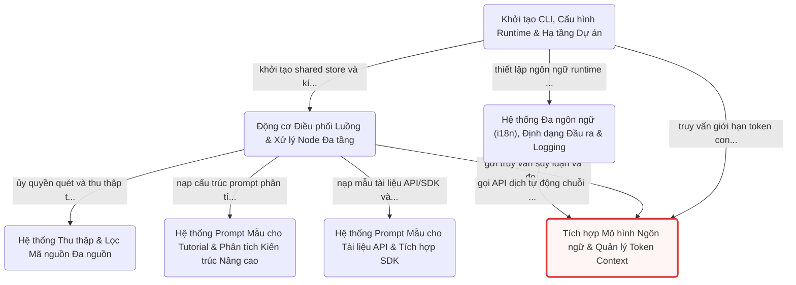

# Hướng dẫn: test

Dự án được xây dựng theo kiến trúc **Flow-based DAG Pipeline** dựa trên nền tảng *PocketFlow*, phân tách quy trình phân tích mã nguồn và sinh tài liệu kỹ thuật thành các nút xử lý (*Node / BatchNode*) độc lập giao tiếp qua *Shared Store*. Hệ thống kết hợp tầng nhập liệu thông minh (*Data Ingestion*) hỗ trợ lọc tệp đa tầng theo chuẩn *Git wildmatch*, cổng giao tiếp mô hình ngôn ngữ lớn (*LLM Gateway*) với khả năng kiểm soát ngân sách token và bộ nhớ đệm gia tăng (*MD5 Incremental Cache*), cùng hệ sinh thái mẫu *Prompt-as-Code* chuyên biệt hóa cho từng định dạng tài liệu (Hướng dẫn, Kiến trúc sâu, API Reference, SDK) và giao diện xuất bản đa ngôn ngữ (*i18n*).

**Kho mã nguồn:** `.`

## Các chương

1. [Khởi tạo CLI, Cấu hình Runtime & Hạ tầng Dự án](01_khởi_tạo_cli__cấu_hình_runtime___hạ_tầng_dự_án.md)
2. [Hệ thống Thu thập & Lọc Mã nguồn Đa nguồn](02_hệ_thống_thu_thập___lọc_mã_nguồn_đa_nguồn.md)
3. [Tích hợp Mô hình Ngôn ngữ & Quản lý Token Context](03_tích_hợp_mô_hình_ngôn_ngữ___quản_lý_token_context.md)
4. [Động cơ Điều phối Luồng & Xử lý Node Đa tầng](04_động_cơ_điều_phối_luồng___xử_lý_node_đa_tầng.md)
5. [Hệ thống Prompt Mẫu cho Tutorial & Phân tích Kiến trúc Nâng cao](05_hệ_thống_prompt_mẫu_cho_tutorial___phân_tích_kiến_trúc_nâng_cao.md)
6. [Hệ thống Prompt Mẫu cho Tài liệu API & Tích hợp SDK](06_hệ_thống_prompt_mẫu_cho_tài_liệu_api___tích_hợp_sdk.md)
7. [Hệ thống Đa ngôn ngữ (i18n), Định dạng Đầu ra & Logging](07_hệ_thống_đa_ngôn_ngữ__i18n___định_dạng_đầu_ra___logging.md)

---

**Nội dung đầy đủ:** [full_content.md](full_content.md)
