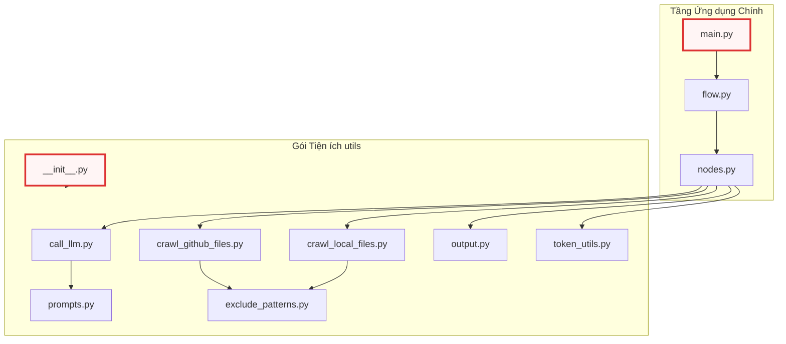

# __init__.py

> **Source:** `utils/__init__.py`

Tài liệu này cung cấp đặc tả kỹ thuật chi tiết cho tệp tin khởi tạo gói `utils/__init__.py` trong dự án `test`. Đây là tài liệu tham chiếu nội bộ đầu tiên trong hệ thống tài liệu kỹ thuật của dự án, thiết lập nền tảng cho cấu trúc phân gói và cơ chế nạp module cho toàn bộ hệ thống.

---

## 1. Tổng quan Kỹ thuật

Tệp tin `utils/__init__.py` có vai trò định danh thư mục `utils/` trở thành một gói Python chuẩn (Regular Package) theo quy chuẩn PEP 328 và PEP 451 của ngôn ngữ Python. Mặc dù tệp không chứa mã nguồn thực thi trực tiếp, sự hiện diện của nó là bắt buộc để CPython nhận diện không gian tên (namespace) `utils` và cấp phát một mục nhập riêng biệt trong bảng tra cứu nạp module toàn cục `sys.modules`.

Trong kiến trúc tổng thể của dự án, `utils` đóng vai trò là tầng hỗ trợ hạ tầng (Infrastructure Utility Layer). Các module khác trong hệ thống như `flow.py`, `nodes.py`, và `main.py` dựa vào cấu trúc này để truy xuất đến các thành phần chuyên biệt bao gồm:
* Giao tiếp mô hình ngôn ngữ lớn: `call_llm.py`
* Thu thập dữ liệu mã nguồn: `crawl_github_files.py`, `crawl_local_files.py`
* Xử lý lọc và loại trừ tệp: `exclude_patterns.py`
* Định dạng và ghi xuất dữ liệu: `output.py`
* Quản lý mẫu câu lệnh hướng dẫn: `prompts.py`
* Ước tính và xử lý độ dài token: `token_utils.py`

### Kiến trúc Không gian tên và Luồng Nạp Module

Biểu đồ dưới đây minh họa vị trí trung tâm của gói `utils` và mối quan hệ phụ thuộc giữa các tầng thực thi trong hệ thống:



---

## 2. Cơ chế Hoạt động Nội bộ & Vòng đời Nạp Gói

Khi trình thông dịch Python gặp câu lệnh truy xuất đến gói `utils` (ví dụ: `import utils.call_llm` hoặc `from utils.output import save_markdown_file`), tiến trình nạp module diễn ra theo các giai đoạn sau:

1. **Tìm kiếm Đặc tả Module (Module Spec Resolution):** Trình tìm kiếm `PathFinder` quét danh mục `sys.path`. Khi tìm thấy thư mục `utils/` có chứa tệp `__init__.py`, nó khởi tạo một đối tượng `ModuleSpec` với thuộc tính `submodule_search_locations` trỏ trực tiếp đến đường dẫn thư mục `utils/`.
2. **Khởi tạo Đối tượng Module (Module Object Instantiation):** CPython tạo một thực thể `types.ModuleType` trống mang tên `utils`.
3. **Thiết lập Thuộc tính Khởi tạo:** Trình thông dịch tự động gán các thuộc tính phản chiếu hệ thống (Dunder attributes) vào từ điển `__dict__` của module.
4. **Thực thi Mã Khởi tạo:** Trình thông dịch thực thi nội dung của `utils/__init__.py`. Do tệp rỗng, chi phí khởi tạo CPU và I/O tại bước này tiệm cận $0\text{ ms}$, ngăn chặn triệt để hiện tượng trễ khởi động hệ thống (Cold-start Latency).
5. **Đăng ký Tra cứu (Cache Registration):** Đối tượng `utils` được ghi vào `sys.modules['utils']` để phục vụ cho các lệnh `import` tiếp theo mà không cần giải mã lại từ hệ thống tập tin.

---

## 3. Đặc tả Thuộc tính Môi trường Module

Mặc dù tệp tin không định nghĩa các lớp hay hàm tùy biến, môi trường thực thi CPython tự động gắn các thuộc tính nội tại sau đây vào không gian tên của `utils/__init__.py`:

### `__name__`
**Phạm vi truy cập**: Public (Read-Only)  
**Kiểu dữ liệu**: `str`

**Mô tả**: Tên định danh đầy đủ của module trong cây phân cấp gói. Khi được nạp thông qua hệ thống import của dự án, thuộc tính này luôn mang giá trị chuỗi định danh gói cha.

**Mã nguồn thực tế khởi tạo nội bộ:**
```python
# CPython runtime module identity assignment
__name__ = "utils"
```

Đoạn mã trên mô tả cách trình thông dịch gán định danh không gian tên cho module khi nạp vào bộ nhớ. Thuộc tính này được các cơ chế ghi nhật ký (logging) và xử lý ngoại lệ nội bộ sử dụng để xác định nguồn gốc phát sinh lỗi từ tầng tiện ích.

---

### `__file__`
**Phạm vi truy cập**: Public (Read-Only)  
**Kiểu dữ liệu**: `str`

**Mô tả**: Đường dẫn tuyệt đối hoặc tương đối trỏ trực tiếp tới vị trí vật lý của tệp tin `__init__.py` trên hệ thống lưu trữ của máy chủ/môi trường thực thi.

**Mã nguồn thực tế khởi tạo nội bộ:**
```python
# CPython runtime file system location pointer
__file__ = "d:\\...\\test\\utils\\__init__.py"
```

Thuộc tính này cung cấp thông tin vị trí vật lý của tệp mã nguồn cho các cơ chế tải tài nguyên cục bộ. Nó cho phép các module tiện ích con tính toán đường dẫn tương đối tới các thư mục dữ liệu hoặc mẫu tệp tạm thời trong quá trình vận hành của dự án.

---

### `__package__`
**Phạm vi truy cập**: Public (Read-Only)  
**Kiểu dữ liệu**: `str`

**Mô tả**: Xác định tên gói mà module này trực thuộc. Đối với tệp tin `__init__.py` ở gốc của thư mục con `utils`, giá trị này trùng khớp hoàn toàn với `__name__`.

**Mã nguồn thực tế khởi tạo nội bộ:**
```python
# CPython runtime package boundary binding
__package__ = "utils"
```

Thuộc tính `__package__` đóng vai trò quan trọng trong việc hỗ trợ cú pháp nạp tương đối (Relative Imports, ví dụ: `from .token_utils import count_tokens`). Nó thiết lập phạm vi cô lập cho toàn bộ các module nằm bên trong thư mục `utils/`.

---

### `__path__`
**Phạm vi truy cập**: Public (Read-Only)  
**Kiểu dữ liệu**: `list[str]`

**Mô tả**: Danh sách chứa các đường dẫn hệ thống tệp mà Python sẽ tìm kiếm khi tiếp tục giải quyết các module con (submodules) bên trong `utils`.

**Mã nguồn thực tế khởi tạo nội bộ:**
```python
# CPython runtime package directory search path list
__path__ = ["d:\\...\\test\\utils"]
```

Sự tồn tại của thuộc tính `__path__` là đặc điểm kỹ thuật then chốt phân biệt một gói thông thường (Package) với một module đơn lẻ (Single-file Module). Thuộc tính này cho phép bộ nạp module (`importlib`) duyệt tiếp vào bên trong cấu trúc cây thư mục `utils` để tải các tệp như `call_llm.py` hoặc `output.py`.

---

## 4. Phân tích Chiến lược Thiết kế Kiến trúc

### 4.1. Không gian tên Rỗng (Explicit Empty Namespace)
Dự án duy trì `utils/__init__.py` ở trạng thái tệp rỗng thay vì thực hiện cơ chế nạp trước và xuất khẩu hàng loạt (Eager Bulk Re-exports, ví dụ: `from .call_llm import *`):

* **Tối ưu hóa Bộ nhớ và Tốc độ (Memory & Latency Optimization):** Khi một luồng xử lý chỉ yêu cầu tiện ích nhẹ như `exclude_patterns.py`, việc nạp `utils` sẽ không vô tình kích hoạt việc nạp các thư viện nặng của bên thứ ba (như `langchain` hoặc `google-genai` trong `call_llm.py`).
* **Tránh Phụ thuộc Vòng tròn (Circular Dependency Avoidance):** Đảm bảo tính độc lập hoàn toàn giữa các module tiện ích con. Module này có thể tham chiếu module khác trong cùng gói mà không gặp hiện tượng khóa chết (deadlock) trạng thái khởi tạo module.
* **Tường minh trong Tham chiếu (Explicit Dependency Declarations):** Buộc các module tầng trên (`nodes.py`, `flow.py`) phải khai báo chính xác hàm/lớp cần sử dụng (ví dụ: `from utils.token_utils import calculate_cost`), giúp việc phân tích tĩnh (Static Analysis) và tái cấu trúc mã nguồn (Refactoring) đạt độ chính xác tuyệt đối.

---

## Xem thêm

* [call_llm.py](02_call_llm_py.md) — Module quản lý tương tác và gọi API đến các mô hình ngôn ngữ lớn (LLMs).
* [crawl_github_files.py](03_crawl_github_files_py.md) — Module thu thập và phân tích cấu trúc mã nguồn từ kho lưu trữ GitHub từ xa.
* [crawl_local_files.py](04_crawl_local_files_py.md) — Module duyệt và trích xuất nội dung tệp tin từ hệ thống tập tin cục bộ.
* [exclude_patterns.py](05_exclude_patterns_py.md) — Module định nghĩa danh sách các mẫu tệp và thư mục cần bỏ qua.
* [output.py](06_output_py.md) — Module phụ trách định dạng và ghi xuất kết quả tài liệu hóa.
* [prompts.py](07_prompts_py.md) — Module lưu trữ các mẫu prompt hệ thống phục vụ sinh tài liệu.
* [token_utils.py](08_token_utils_py.md) — Module tiện ích tính toán và ước tính lượng token tiêu thụ.
* [flow.py](09_flow_py.md) — Module điều phối luồng thực thi đồ thị xử lý chính của ứng dụng.
* [main.py](10_main_py.md) — Điểm khởi nhập chính của toàn bộ hệ thống.
* [nodes.py](11_nodes_py.md) — Định nghĩa các nút xử lý nghiệp vụ bên trong đồ thị luồng.

