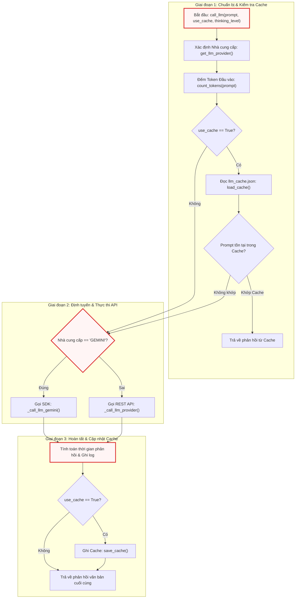
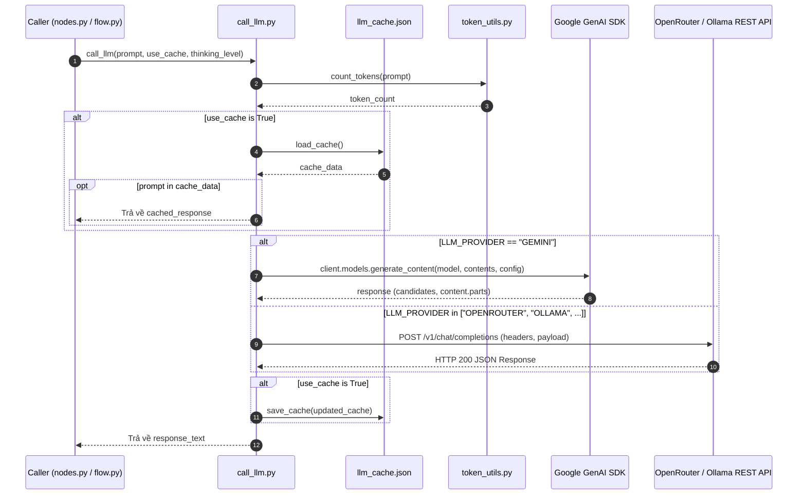

# call_llm.py

> **Source:** `utils/call_llm.py`

Tiếp nối việc thiết lập không gian tên và nền tảng nạp module tại [1. __init__.py](01___init___py.md), tệp `utils/call_llm.py` đóng vai trò là tầng giao tiếp và trừu tượng hóa hạ tầng mô hình ngôn ngữ lớn (LLM Gateway / Abstraction Layer) cốt lõi của toàn bộ hệ thống. Module này chịu trách nhiệm điều phối toàn bộ các yêu cầu tạo sinh văn bản, phân tích mã nguồn và suy luận logic từ các tác vụ cấp cao trong đồ thị xử lý sang các API suy luận biên hoặc đám mây.

---

## Tổng quan Kỹ thuật (Technical Overview)

Tệp `call_llm.py` đóng gói toàn bộ logic kết nối, xác thực, điều phối suy luận và tối ưu hóa chi phí khi tương tác với các nhà cung cấp LLM khác nhau. Hệ thống hỗ trợ đa nền tảng thông qua hai nhánh xử lý chính:
1. **Google GenAI SDK (Native):** Tương tác trực tiếp với hệ sinh thái Google Gemini (bao gồm Gemini API qua API Key hoặc Google Cloud Vertex AI qua Project ID/Location), hỗ trợ cấu hình ngân sách suy luận (Thinking Budget) cho các mô hình thế hệ mới như `gemini-3.7-flash`.
2. **OpenAI-Compatible REST Gateway:** Tương tác với bất kỳ nhà cung cấp nào hỗ trợ chuẩn endpoint `/v1/chat/completions` (như OpenRouter, Ollama cục bộ, hoặc các máy chủ tự lưu trữ vLLM/TGI), tích hợp khả năng tùy biến tham số suy luận (`reasoning_effort`, `think`).

Bên cạnh khả năng đa định tuyến, module còn tích hợp các cơ chế phụ trợ quan trọng:
* **Bộ nhớ đệm phản hồi cục bộ (Local Response Caching):** Lưu trữ kết quả suy luận dựa trên nội dung prompt vào tệp `llm_cache.json` nhằm giảm thiểu độ trễ, tiết kiệm chi phí token và hỗ trợ quá trình gỡ lỗi có tính lặp lại (deterministic debugging).
* **Truy vấn giới hạn ngữ cảnh động (Dynamic Context Length Resolution):** Tự động phát hiện kích thước cửa sổ ngữ cảnh tối đa từ OpenRouter API hoặc thiết lập giá trị mặc định an toàn cho Gemini.
* **Ghi log phân tầng và đo lường hiệu năng:** Đo lường thời gian phản hồi (elapsed time), đếm số lượng token đầu vào thông qua [8. token_utils.py](08_token_utils_py.md), và cách ly logger trong giai đoạn nạp module thông qua `logging.NullHandler`.

---

## Sơ đồ Kiến trúc & Luồng Thực thi (Architecture & Execution Flow)

### Luồng Điều phối Yêu cầu Tổng thể (`call_llm`)

Sơ đồ dưới đây mô tả chi tiết chu trình xử lý một yêu cầu suy luận từ khi tiếp nhận prompt, kiểm tra bộ nhớ đệm, định tuyến nhà cung cấp, thiết lập tham số suy luận cho đến khi cập nhật cache và trả về kết quả:



---

### Trình tự Tương tác Thành phần (Component Sequence Interaction)



---

## Cấu hình & Biến Cấp Module (Module-Level Variables & Configurations)

Tệp `call_llm.py` khởi tạo một số trạng thái toàn cục và cấu hình logging ngay khi được nạp vào tiến trình CPython:

```python
# Load environment variables from .env file
load_dotenv()

# Configure logging - deferred until main.py calls configure_logging()
# At import time, set up logger with NullHandler (no file output yet)
logger = logging.getLogger("llm_logger")
logger.setLevel(logging.INFO)
logger.propagate = False  # Prevent propagation to root logger
logger.addHandler(logging.NullHandler())  # Absorb logs until configured


# Simple cache configuration
cache_file = "llm_cache.json"

# Cache for model capabilities to avoid repeated API calls
_openrouter_models_cache = None
```

### Chi tiết các Biến Cấu hình:

* `logger`: Thể hiện logger chuyên biệt `"llm_logger"`. Để tránh hiện tượng ghi đè hoặc xả log ra console ngoài ý muốn trong quá trình import trước khi [10. main.py](10_main_py.md) thiết lập logging hoàn chỉnh, logger được gán `logging.NullHandler()` và tắt cờ `propagate`.
* `cache_file` (`str`): Đường dẫn tệp lưu trữ cache cục bộ dạng JSON (`"llm_cache.json"`).
* `_openrouter_models_cache` (`list[dict] | None`): Bộ nhớ đệm trong RAM lưu trữ danh sách siêu dữ liệu các mô hình lấy từ OpenRouter API, ngăn ngừa việc gửi yêu cầu mạng HTTP GET lặp lại nhiều lần.

### Danh mục Biến Môi trường Quản lý:

| Biến Môi Trường | Kiểu Dữ Liệu | Bắt Buộc | Mục Đích |
| :--- | :--- | :--- | :--- |
| `LLM_PROVIDER` | `str` | Tùy chọn | Tên nhà cung cấp (`GEMINI`, `OPENROUTER`, `OLLAMA`). Tự động nhận diện `GEMINI` nếu có khóa Google. |
| `GEMINI_PROJECT_ID` | `str` | Tùy chọn | ID dự án Google Cloud Vertex AI (kích hoạt chế độ `vertexai=True`). |
| `GEMINI_LOCATION` | `str` | Tùy chọn | Khu vực lưu trữ Vertex AI (mặc định: `"us-central1"`). |
| `GEMINI_API_KEY` | `str` | Tùy chọn | Khóa API của Google AI Studio (khi không dùng Vertex AI). |
| `GEMINI_MODEL` | `str` | Tùy chọn | Định danh mô hình Google Gemini (mặc định: `"gemini-3.7-flash"`). |
| `<PROVIDER>_MODEL` | `str` | Có (nếu dùng REST) | Tên mô hình tương ứng cho nhà cung cấp (ví dụ: `OPENROUTER_MODEL`, `OLLAMA_MODEL`). |
| `<PROVIDER>_BASE_URL` | `str` | Có (nếu dùng REST) | URL gốc của máy chủ (ví dụ: `http://localhost:11434`, `https://openrouter.ai/api`). |
| `<PROVIDER>_API_KEY` | `str` | Tùy chọn | Khóa xác thực Bearer token cho REST API (tùy chọn với Ollama cục bộ). |

---

## Chi tiết các Hàm Cấp Module (Module-Level Functions)

### `load_cache()`
**Visibility**: Public  
**Signature**: `def load_cache() -> dict:`

**Description**:  
Đọc và giải mã dữ liệu bộ nhớ đệm từ tệp vật lý được chỉ định bởi biến toàn cục `cache_file`. Nếu tệp không tồn tại, bị lỗi định dạng JSON hoặc gặp sự cố truy xuất I/O, hàm bắt lỗi ngoại lệ, ghi lại cảnh báo vào logger và trả về một từ điển rỗng nhằm đảm bảo tính liên tục của ứng dụng.

```python
def load_cache():
    try:
        with open(cache_file) as f:
            return json.load(f)
    except Exception:
        logger.warning("Failed to load cache.")
    return {}
```

Khối mã trên đóng vai trò là một chốt phòng thủ (defensive fallback) cho việc đọc dữ liệu không đồng bộ. Khi `llm_cache.json` chưa được khởi tạo ở lần chạy đầu tiên, khối `try-except` đảm bảo tiến trình không bị gián đoạn và trả về từ điển `{}` an toàn. Mọi lỗi đọc đĩa đều được ghi nhận qua `logger.warning`.

**Parameters**:  
* Không có tham số đầu vào.

**Returns**:  
* `dict`: Bản đồ ánh xạ giữa chuỗi prompt nguyên bản (`str`) và kết quả phản hồi của mô hình (`str`).

**Raises**:  
* Không ném ngoại lệ ra ngoài (mọi `Exception` đều được bắt và xử lý nội bộ).

**Example**:
```python
# Trích xuất từ cách sử dụng nội bộ trong call_llm()
if use_cache:
    cache = load_cache()
    if prompt in cache:
        cached_response = cache[prompt]
```

---

### `save_cache()`
**Visibility**: Public  
**Signature**: `def save_cache(cache: dict) -> None:`

**Description**:  
Tuần tự hóa cấu trúc từ điển bộ nhớ đệm thành định dạng JSON và ghi đè vào tệp `cache_file`. Toàn bộ thao tác I/O được bao bọc trong khối bảo vệ ngoại lệ để tránh làm sập tiến trình chính nếu hệ thống tệp bị khóa hoặc gặp lỗi phân quyền ghi.

```python
def save_cache(cache):
    try:
        with open(cache_file, "w") as f:
            json.dump(cache, f)
    except Exception:
        logger.warning("Failed to save cache")
```

Hàm thực hiện mở tệp ở chế độ ghi (`"w"`) và sử dụng `json.dump` để đồng bộ trạng thái bộ nhớ đệm từ RAM xuống đĩa. Trong trường hợp hệ thống gặp lỗi phân quyền ghi (permission denied) hoặc đầy dung lượng ổ đĩa, hàm ghi log cảnh báo `"Failed to save cache"` và tiếp tục thực thi bình thường mà không làm gián đoạn luồng sinh mã.

**Parameters**:  
* `cache` (`dict`): Từ điển chứa các cặp khóa-giá trị prompt và phản hồi cần lưu trữ.

**Returns**:  
* `None`

**Raises**:  
* Không ném ngoại lệ ra ngoài.

**Example**:
```python
# Trích xuất từ cách sử dụng nội bộ trong call_llm()
if use_cache:
    cache = load_cache()
    cache[prompt] = response_text
    save_cache(cache)
```

---

### `get_llm_provider()`
**Visibility**: Public  
**Signature**: `def get_llm_provider() -> str | None:`

**Description**:  
Xác định nhà cung cấp LLM hoạt động hiện tại dựa trên cấu hình biến môi trường. Hàm kiểm tra trực tiếp biến `LLM_PROVIDER`. Nếu biến này chưa được thiết lập tường minh nhưng hệ thống phát hiện sự tồn tại của `GEMINI_PROJECT_ID` hoặc `GEMINI_API_KEY`, hàm sẽ tự động phân giải nhà cung cấp mặc định là `"GEMINI"`.

```python
def get_llm_provider():
    provider = os.getenv("LLM_PROVIDER")
    if not provider and (os.getenv("GEMINI_PROJECT_ID") or os.getenv("GEMINI_API_KEY")):
        provider = "GEMINI"
    # if necessary, add ANTHROPIC/OPENAI
    return provider
```

Hàm này cung cấp cơ chế suy đoán thông minh cấu hình (configuration auto-discovery). Bằng cách ưu tiên biến `LLM_PROVIDER`, hệ thống cho phép người dùng chuyển đổi linh hoạt giữa các nhà cung cấp như `"OPENROUTER"` hoặc `"OLLAMA"`. Khi thiếu cấu hình này, cơ chế fallback sẽ kích hoạt nếu có bất kỳ thông tin xác thực Google Gemini nào được khai báo trong môi trường `.env`.

**Parameters**:  
* Không có tham số đầu vào.

**Returns**:  
* `str | None`: Tên định danh nhà cung cấp (ví dụ: `"GEMINI"`, `"OPENROUTER"`, `"OLLAMA"`) hoặc `None` nếu không tìm thấy cấu hình hợp lệ.

**Raises**:  
* Không ném ngoại lệ.

**Example**:
```python
# Trích xuất từ cách sử dụng nội bộ trong call_llm()
provider = get_llm_provider()
model = os.environ.get(f"{provider}_MODEL", os.environ.get("GEMINI_MODEL", "unknown"))
```

---

### `_get_openrouter_model_info()`
**Visibility**: Private  
**Signature**: `def _get_openrouter_model_info(model_id: str) -> dict | None:`

**Description**:  
Truy vấn thông tin chi tiết và khả năng hỗ trợ kỹ thuật của một mô hình cụ thể từ API OpenRouter. Hàm sử dụng một biến đệm toàn cục (`_openrouter_models_cache`) để lưu trữ danh sách toàn bộ các mô hình sau lần gọi đầu tiên, giảm thiểu số lượng HTTP GET request đến máy chủ OpenRouter trong suốt vòng đời ứng dụng.

```python
def _get_openrouter_model_info(model_id: str) -> dict:
    global _openrouter_models_cache
    if _openrouter_models_cache is None:
        try:
            resp = requests.get("https://openrouter.ai/api/v1/models", timeout=5)
            _openrouter_models_cache = resp.json().get("data", [])
        except Exception:
            _openrouter_models_cache = []

    return next((m for m in _openrouter_models_cache if m.get("id") == model_id), None)
```

Hàm thực hiện lazy-loading đối với siêu dữ liệu mô hình từ endpoint `https://openrouter.ai/api/v1/models` với thời gian chờ kết nối là 5 giây (`timeout=5`). Sau khi tải thành công, hàm sử dụng hàm tích hợp `next()` kết hợp generator expression để tìm kiếm phần tử có khóa `id` khớp với `model_id`. Nếu xảy ra lỗi kết nối hoặc không tìm thấy, hàm trả về danh sách rỗng hoặc `None`.

**Parameters**:  
* `model_id` (`str`): Chuỗi định danh mô hình trên OpenRouter (ví dụ: `"anthropic/claude-3.7-sonnet:thinking"` hoặc `"deepseek/deepseek-r1"`).

**Returns**:  
* `dict | None`: Từ điển chứa thông tin cấu hình mô hình (bao gồm trường `context_length`, `reasoning`, v.v.) hoặc `None` nếu không tìm thấy.

**Raises**:  
* Không ném ngoại lệ ra ngoài.

**Example**:
```python
# Trích xuất từ cách sử dụng nội bộ trong _call_llm_provider()
if provider == "OPENROUTER" and thinking_level:
    model_info = _get_openrouter_model_info(model)
    if model_info and "reasoning" in model_info:
        supported_efforts = model_info["reasoning"].get("supported_efforts", [])
```

---

### `get_model_context_length()`
**Visibility**: Public  
**Signature**: `def get_model_context_length(endpoint_url: str, model_name: str, api_key: str = "") -> int:`

**Description**:  
Truy xuất hoặc ước lượng kích thước cửa sổ ngữ cảnh tối đa (tính theo đơn vị token) của một mô hình dựa trên URL endpoint và định danh mô hình. Hàm xử lý riêng biệt cho các trường hợp Google Gemini (mặc định an toàn $1{,}000{,}000$ token) và OpenRouter API (truy vấn động qua REST API), trước khi áp dụng giá trị mặc định hệ thống là $100{,}000$ token.

```python
def get_model_context_length(endpoint_url: str, model_name: str, api_key: str = "") -> int:
    """
    Fetch the maximum context length of a model based on the endpoint.
    If endpoint is Gemini API, safely default to 1,000,000 tokens.
    If endpoint is openrouter.ai, make GET to /api/v1/models and extract.
    Default to 100,000.
    """
    default_limit = 100000
    try:
        if not endpoint_url:
            return default_limit

        if "generativelanguage.googleapis.com" in endpoint_url or "gemini" in model_name.lower():
            # Safely default to 1M tokens for Gemini models
            return 1000000

        if "openrouter.ai" in endpoint_url:
            resp = requests.get("https://openrouter.ai/api/v1/models", timeout=5)
            data = resp.json().get("data", [])
            for m in data:
                if m.get("id") == model_name:
                    return m.get("context_length", default_limit)
    except Exception as e:
        logger.warning(f"Failed to fetch context length for {model_name} at {endpoint_url}: {e}")

    return default_limit
```

Hàm kiểm tra chuỗi URL và tên mô hình để đưa ra quyết định tối ưu kích thước token. Đối với các mô hình Gemini, hàm trả về giới hạn $1{,}000{,}000$ token tương ứng với kiến trúc Long-Context của dòng Gemini 1.5/2.0/3.x. Đối với OpenRouter, một yêu cầu GET được gửi tới endpoint models để bóc tách trường `context_length`. Trong trường hợp mạng lỗi hoặc endpoint không khớp, giá trị fallback an toàn là `100000` được trả về.

**Parameters**:  
* `endpoint_url` (`str`): Địa chỉ URL của máy chủ API đang kết nối.
* `model_name` (`str`): Tên hoặc mã định danh của mô hình ngôn ngữ.
* `api_key` (`str`, tùy chọn): Khóa API xác thực (mặc định: `""`).

**Returns**:  
* `int`: Số lượng token tối đa mà cửa sổ ngữ cảnh của mô hình có thể tiếp nhận.

**Raises**:  
* Không ném ngoại lệ ra ngoài (mọi lỗi đều được bắt và log dưới dạng warning).

**Example**:
```python
# Kiểm tra độ dài ngữ cảnh cho mô hình OpenRouter hoặc Gemini
context_limit = get_model_context_length(
    endpoint_url="https://openrouter.ai/api/v1",
    model_name="google/gemini-2.5-pro"
)
```

---

### `_call_llm_provider()`
**Visibility**: Private  
**Signature**: `def _call_llm_provider(prompt: str, thinking_level: str | None = None) -> str:`

**Description**:  
Thực thi yêu cầu gọi API suy luận tới các nhà cung cấp bên thứ ba tuân thủ chuẩn REST OpenAI-Compatible (như OpenRouter hoặc Ollama). Hàm tự động đọc các biến môi trường cấu hình động (`<PROVIDER>_MODEL`, `<PROVIDER>_BASE_URL`, `<PROVIDER>_API_KEY`), chuẩn hóa payload JSON, cấu hình các tham số suy luận nâng cao (`reasoning`, `think`), và xử lý phòng thủ các trường hợp phản hồi lỗi từ phía máy chủ.

```python
def _call_llm_provider(prompt: str, thinking_level: str | None = None) -> str:
    # Read the provider from environment variable
    provider = os.environ.get("LLM_PROVIDER")
    if not provider:
        raise ValueError("LLM_PROVIDER environment variable is required")

    # Construct the names of the other environment variables
    model_var = f"{provider}_MODEL"
    base_url_var = f"{provider}_BASE_URL"
    api_key_var = f"{provider}_API_KEY"

    # Read the provider-specific variables
    model = os.environ.get(model_var)
    base_url = os.environ.get(base_url_var)
    api_key = os.environ.get(api_key_var, "")  # API key is optional, default to empty string

    # Validate required variables
    if not model:
        raise ValueError(f"{model_var} environment variable is required")
    if not base_url:
        raise ValueError(f"{base_url_var} environment variable is required")

    # Append the endpoint to the base URL
    url = f"{base_url.rstrip('/')}/v1/chat/completions"

    # Configure headers and payload based on provider
    headers = {
        "Content-Type": "application/json",
    }
    if api_key:  # Only add Authorization header if API key is provided
        headers["Authorization"] = f"Bearer {api_key}"

    payload = {
        "model": model,
        "messages": [{"role": "user", "content": prompt}],
        "temperature": 0.7,
    }
    // ...
```

Phần đầu của hàm thiết lập cơ chế nạp biến môi trường động theo tiền tố nhà cung cấp. Đường dẫn API được chuẩn hóa bằng cách loại bỏ dấu gạch chéo cuối URL thông qua `rstrip('/')` và gắn thêm `/v1/chat/completions`. Tiêu đề HTTP `Authorization` chỉ được bổ sung khi `api_key` có giá trị khác rỗng, cho phép tương thích hoàn hảo với cả các dịch vụ công cộng lẫn các máy chủ Ollama chạy trong mạng nội bộ không cần mật mã.

```python
    // ...
    if provider == "OPENROUTER" and thinking_level:
        model_info = _get_openrouter_model_info(model)
        if model_info and "reasoning" in model_info:
            supported_efforts = model_info["reasoning"].get("supported_efforts", [])
            if thinking_level.lower() in supported_efforts:
                payload["reasoning"] = {"effort": thinking_level.lower()}
                payload["temperature"] = 1.0  # Required for many reasoning models
            else:
                logger.warning(f"Invalid thinking level '{thinking_level}' for model {model}. Supported efforts: {supported_efforts}")
        else:
            logger.warning(f"Model {model} does not support reasoning via OpenRouter API.")

    elif provider == "OLLAMA" and thinking_level:
        # Some Ollama SDKs / API versions look for `think`, others look for standard `reasoning_effort`
        payload["think"] = thinking_level.lower()
        payload["reasoning_effort"] = thinking_level.lower()
        payload["temperature"] = 1.0

    try:
        response = requests.post(url, headers=headers, json=payload, timeout=(10, 300))
        try:
            response_json = response.json()  # Log the response
        except (ValueError, requests.exceptions.JSONDecodeError):
            from utils.output import emit_raw

            emit_raw(
                "WARNING",
                f"Warning: Provider returned invalid JSON. Status Code: {response.status_code}, Response Text: {response.text}",
                dest="STDOUT",
            )
            logger.warning(f"Provider returned invalid JSON. Status Code: {response.status_code}, Response Text: {response.text}")
            raise ValueError(f"Provider returned invalid JSON. Status Code: {response.status_code}") from None
        response.raise_for_status()

        # Defensive check: API may return 200 with error/rate-limit payload missing 'choices'
        if "choices" not in response_json or not response_json["choices"]:
            error_detail = response_json.get("error", response_json)
            logger.warning(f"API returned 200 but no 'choices' in response: {error_detail}")
            raise ValueError(f"API response missing 'choices' key. Response: {error_detail}")

        return response_json["choices"][0]["message"]["content"]
    except requests.exceptions.HTTPError as e:
    // ...
```

Đoạn xử lý suy luận kiểm tra khả năng hỗ trợ chế độ reasoning. Với OpenRouter, hàm xác thực mức độ nỗ lực suy nghĩ (`thinking_level`) thông qua `_get_openrouter_model_info` và nâng `temperature` lên `1.0`. Với Ollama, hàm gán đồng thời hai trường `think` và `reasoning_effort`. Quá trình gọi HTTP POST được gán timeout kép `(10, 300)` (10 giây thiết lập kết nối, 300 giây chờ phản hồi). Lỗi phản hồi không phải JSON được bắt riêng và cảnh báo trực tiếp ra màn hình thông qua `emit_raw` từ [6. output.py](06_output_py.md). Đồng thời, cơ chế kiểm tra phòng thủ đảm bảo trường `choices` luôn tồn tại trong payload trả về ngay cả khi mã trạng thái HTTP là 200.

**Parameters**:  
* `prompt` (`str`): Nội dung yêu cầu/câu hỏi gửi tới LLM.
* `thinking_level` (`str | None`, tùy chọn): Mức độ nỗ lực suy luận mong muốn (ví dụ: `"low"`, `"medium"`, `"high"`). Mặc định là `None`.

**Returns**:  
* `str`: Chuỗi văn bản phản hồi do mô hình tạo ra (`response_json["choices"][0]["message"]["content"]`).

**Raises**:  
* `ValueError`: Nếu thiếu biến môi trường `LLM_PROVIDER`, `<PROVIDER>_MODEL`, `<PROVIDER>_BASE_URL`, phản hồi từ máy chủ không phải định dạng JSON hợp lệ, hoặc phản hồi thiếu khóa `choices`.
* `Exception`: Đóng gói các lỗi mạng từ thư viện `requests` bao gồm `HTTPError`, `ConnectionError`, `Timeout`, và `RequestException`.

**Example**:
```python
# Trích xuất từ cách sử dụng nội bộ trong call_llm()
else:  # generic method using a URL that is OpenAI compatible API (Ollama, ...)
    response_text = _call_llm_provider(prompt, thinking_level=thinking_level)
```

---

### `_call_llm_gemini()`
**Visibility**: Private  
**Signature**: `def _call_llm_gemini(prompt: str, thinking_level: str | None = None) -> str:`

**Description**:  
Thực thi yêu cầu tạo sinh nội dung sử dụng bộ SDK chính thức `google-genai`. Hàm tự động cấu hình đối tượng máy khách (`genai.Client`) dựa trên sự hiện diện của `GEMINI_PROJECT_ID` (kích hoạt chế độ Google Cloud Vertex AI với vùng `GEMINI_LOCATION`) hoặc `GEMINI_API_KEY` (kích hoạt chế độ Google AI Studio). Hàm cũng hỗ trợ cấu hình ngân sách suy nghĩ (`ThinkingConfig`) và trích xuất an toàn các phần văn bản từ phản hồi.

```python
def _call_llm_gemini(prompt: str, thinking_level: str | None = None) -> str:
    if os.getenv("GEMINI_PROJECT_ID"):
        client = genai.Client(vertexai=True, project=os.getenv("GEMINI_PROJECT_ID"), location=os.getenv("GEMINI_LOCATION", "us-central1"))
    elif os.getenv("GEMINI_API_KEY"):
        client = genai.Client(api_key=os.getenv("GEMINI_API_KEY"))
    else:
        raise ValueError("Either GEMINI_PROJECT_ID or GEMINI_API_KEY must be set in the environment")
    model = os.getenv("GEMINI_MODEL", "gemini-3.7-flash")

    kwargs = {"model": model, "contents": [prompt]}

    if thinking_level:
        # Map string levels to budgets for the installed SDK version
        budget_map = {"low": 1024, "medium": 4096, "high": 8192}
        budget = budget_map.get(thinking_level.lower(), 4096)
        thinking_config = types.ThinkingConfig(include_thoughts=True, thinking_budget=budget)
        kwargs["config"] = types.GenerateContentConfig(thinking_config=thinking_config)

    response = client.models.generate_content(**kwargs)

    # Extract only text parts to avoid "non-text parts: ['thought_signature']" warnings
    if response.candidates and response.candidates[0].content.parts:
        text_parts = [part.text for part in response.candidates[0].content.parts if part.text is not None]
        return "".join(text_parts)
    return ""
```

Hàm khởi tạo đối tượng `genai.Client` linh hoạt theo môi trường thực thi: ưu tiên Vertex AI doanh nghiệp trước, sau đó tới AI Studio API key cá nhân. Khi kích hoạt `thinking_level`, hàm ánh xạ mức độ suy nghĩ sang ngân sách token cụ thể (`low` = 1024, `medium` = 4096, `high` = 8192 token) và gắn vào `types.ThinkingConfig`. Nhằm tránh cảnh báo hệ thống khi mô hình trả về các khối dữ liệu suy nghĩ không phải văn bản thô (`thought_signature`), hàm duyệt qua `candidates[0].content.parts` và chỉ trích xuất, nối các phần tử có trường `part.text` hợp lệ.

**Parameters**:  
* `prompt` (`str`): Nội dung yêu cầu phân tích gửi tới mô hình Gemini.
* `thinking_level` (`str | None`, tùy chọn): Mức độ suy luận dạng chuỗi (`"low"`, `"medium"`, `"high"`). Mặc định là `None`.

**Returns**:  
* `str`: Toàn bộ nội dung văn bản phản hồi được ghép từ các phần tử hợp lệ của ứng viên đầu tiên, hoặc chuỗi rỗng `""` nếu không có dữ liệu.

**Raises**:  
* `ValueError`: Nếu cả `GEMINI_PROJECT_ID` và `GEMINI_API_KEY` đều không được khai báo trong biến môi trường.
* `google.genai.errors.APIError`: Ném ra nếu API của Google từ chối yêu cầu, vượt hạn mức (quota) hoặc lỗi mạng.

**Example**:
```python
# Trích xuất từ cách sử dụng nội bộ trong call_llm()
if provider == "GEMINI":
    response_text = _call_llm_gemini(prompt, thinking_level=thinking_level)
```

---

### `call_llm()`
**Visibility**: Public  
**Signature**: `def call_llm(prompt: str, use_cache: bool = True, thinking_level: str | None = None) -> str:`

**Description**:  
Hàm giao diện chính (Primary Entry Point) được toàn bộ hệ thống sử dụng để tương tác với mô hình ngôn ngữ lớn. Hàm chịu trách nhiệm điều phối toàn bộ vòng đời của một truy vấn LLM: tính toán số lượng token đầu vào, kiểm tra và trả về dữ liệu từ bộ nhớ đệm (nếu được kích hoạt), ghi nhật ký đo lường thời gian thực thi (benchmarking), định tuyến tới nhà cung cấp phù hợp, và lưu phản hồi mới vào cache trước khi trả kết quả cho hàm gọi.

```python
# By default, we use Google Gemini 3.7 flash, as it shows great performance for code understanding
def call_llm(prompt: str, use_cache: bool = True, thinking_level: str | None = None) -> str:
    import time

    from utils.token_utils import count_tokens

    provider = get_llm_provider()
    model = os.environ.get(f"{provider}_MODEL", os.environ.get("GEMINI_MODEL", "unknown"))
    prompt_tokens = count_tokens(prompt)

    logger.info(f"{'=' * 80}")
    logger.info(
        f"LLM CALL START | provider={provider} | model={model} | thinking={thinking_level} | cache={'enabled' if use_cache else 'disabled'} | prompt_tokens={prompt_tokens:,}"
    )
    logger.info(f"PROMPT:\n{prompt}")

    # Check cache if enabled
    if use_cache:
        cache = load_cache()
        if prompt in cache:
            cached_response = cache[prompt]
            logger.info(f"CACHE HIT | response_chars={len(cached_response):,}")
            logger.info(f"RESPONSE (cached):\n{cached_response}")
            logger.info("LLM CALL END | result=cache_hit")
            return cached_response

    # Make the actual LLM call
    start_time = time.time()
    logger.info(f"API CALL | sending request to {provider}...")

    if provider == "GEMINI":
        response_text = _call_llm_gemini(prompt, thinking_level=thinking_level)
    else:  # generic method using a URL that is OpenAI compatible API (Ollama, ...)
        response_text = _call_llm_provider(prompt, thinking_level=thinking_level)

    elapsed = time.time() - start_time
    logger.info(f"API CALL COMPLETE | elapsed={elapsed:.1f}s | response_chars={len(response_text):,}")
    logger.info(f"RESPONSE:\n{response_text}")

    # Update cache if enabled
    if use_cache:
        cache = load_cache()
        cache[prompt] = response_text
        save_cache(cache)
        logger.info("CACHE WRITE | saved response to cache")

    logger.info(f"LLM CALL END | result=success | elapsed={elapsed:.1f}s")
    return response_text
```

Hàm bắt đầu bằng việc nạp cục bộ hàm `count_tokens` từ [8. token_utils.py](08_token_utils_py.md) nhằm tối ưu thời gian khởi động của module và tính toán chính xác lượng token của chuỗi prompt đầu vào. Nếu cờ `use_cache=True` được kích hoạt, hàm thực hiện tra cứu nhanh trong `llm_cache.json`; khi trúng cache (`CACHE HIT`), phản hồi được trả về ngay lập tức với thời gian thực thi xấp xỉ 0ms. Trong trường hợp trượt cache (`CACHE MISS`), hàm kích hoạt bộ đếm thời gian `start_time`, gửi yêu cầu tới nhà cung cấp tương ứng (`_call_llm_gemini` hoặc `_call_llm_provider`), đo đạc thời gian chờ `elapsed`, ghi log chi tiết cấu trúc phản hồi và cập nhật ngược lại tệp cache.

**Parameters**:  
* `prompt` (`str`): Chuỗi văn bản prompt hoàn chỉnh chứa các chỉ dẫn hoặc đoạn mã cần phân tích.
* `use_cache` (`bool`, tùy chọn): Cờ điều khiển việc sử dụng bộ nhớ đệm. Khi gán `True`, hệ thống sẽ đọc và ghi vào `llm_cache.json`. Mặc định là `True`.
* `thinking_level` (`str | None`, tùy chọn): Mức độ sâu trong suy luận logic (`"low"`, `"medium"`, `"high"` hoặc `None`). Mặc định là `None`.

**Returns**:  
* `str`: Nội dung văn bản phản hồi do mô hình ngôn ngữ sinh ra.

**Raises**:  
* `ValueError`: Nếu cấu hình nhà cung cấp hoặc biến môi trường bị thiếu/không hợp lệ.
* `Exception`: Ném lại bất kỳ ngoại lệ nào phát sinh trong quá trình gọi API thực tế.

**Example**:
```python
# Trích xuất từ khối thực thi kiểm thử tại cuối tệp call_llm.py
test_prompt = "Hello, how are you?"

# First call - should hit the API
print("Making call...")
response1 = call_llm(test_prompt, use_cache=False)
print(f"Response: {response1}")
```

---

## Phân tích Xử lý Lỗi & Khả năng Phục hồi (Error Handling & Resilience Strategies)

Tệp `call_llm.py` triển khai chiến lược bảo vệ nhiều tầng (Multi-tier Defensive Programming) nhằm cô lập các sự cố mạng và đảm bảo độ ổn định của toàn bộ pipeline phân tích:

### 1. Bắt Lỗi và Bọc Ngoại lệ Mạng (Network Exception Wrapping)
Trong hàm `_call_llm_provider`, toàn bộ các loại lỗi phát sinh từ thư viện `requests` được phân loại tường minh:
* `requests.exceptions.HTTPError`: Bóc tách thông tin lỗi chi tiết trong phản hồi JSON từ máy chủ (nếu có trường `error`) để cung cấp thông báo rõ ràng cho kỹ sư vận hành.
* `requests.exceptions.ConnectionError`: Chuyển đổi thành thông báo lỗi kết nối mạng tường minh, nhắc nhở kiểm tra đường truyền tới nhà cung cấp.
* `requests.exceptions.Timeout`: Bắt lỗi khi mô hình mất hơn 300 giây để hoàn thành suy luận.
* `requests.exceptions.JSONDecodeError` / `ValueError`: Bắt trường hợp máy chủ trả về mã lỗi HTML (ví dụ: Cloudflare 502 Bad Gateway) thay vì định dạng JSON chuẩn. Hệ thống sử dụng hàm `emit_raw` từ [6. output.py](06_output_py.md) để cảnh báo tức thì ra STDOUT.

### 2. Kiểm Tra Phòng Thủ Cấu Trúc Dữ Liệu (Defensive Structural Checks)
Một số nhà cung cấp hoặc proxy API có thể trả về mã trạng thái HTTP 200 OK nhưng phần thân phản hồi lại chứa thông báo lỗi hoặc chạm giới hạn hạn mức (rate limit) dẫn tới việc thiếu trường `choices`. Mã nguồn xử lý triệt để tình huống này:
```python
if "choices" not in response_json or not response_json["choices"]:
    error_detail = response_json.get("error", response_json)
    logger.warning(f"API returned 200 but no 'choices' in response: {error_detail}")
    raise ValueError(f"API response missing 'choices' key. Response: {error_detail}")
```

### 3. Lọc Khối Dữ Liệu Không Phải Văn Bản trong Gemini SDK
Khi sử dụng tính năng suy nghĩ (`ThinkingConfig`) của Gemini SDK, các phiên bản mới có thể trả về các khối `thought_signature` hoặc metadata nội bộ bên trong `response.candidates[0].content.parts`. Việc truy cập trực tiếp `response.text` có thể gây ra cảnh báo `UserWarning: non-text parts: ['thought_signature']`. Module khắc phục điều này bằng cách duyệt mảng và lọc chính xác các phần tử `part.text is not None`:
```python
if response.candidates and response.candidates[0].content.parts:
    text_parts = [part.text for part in response.candidates[0].content.parts if part.text is not None]
    return "".join(text_parts)
```

---

## Khối Thực thi Trực tiếp (Execution Entry Point)

Module cung cấp một khối kiểm thử độc lập (`if __name__ == "__main__":`) cho phép các kỹ sư kiểm tra kết nối API và xác thực cấu hình môi trường mà không cần chạy toàn bộ đồ thị ứng dụng:

```python
if __name__ == "__main__":
    test_prompt = "Hello, how are you?"

    # First call - should hit the API
    print("Making call...")
    response1 = call_llm(test_prompt, use_cache=False)
    print(f"Response: {response1}")
```

Khối mã trên thực hiện gửi một câu chào đơn giản `"Hello, how are you?"` với cờ `use_cache=False` để ép buộc hệ thống thực hiện một cuộc gọi mạng thực tế tới nhà cung cấp LLM đã cấu hình. Khi chạy trực tiếp qua lệnh `python utils/call_llm.py`, kết quả phản hồi sẽ được in ra STDOUT, hỗ trợ kiểm tra nhanh tính hợp lệ của API Key và đường truyền mạng.

---

## Xem thêm (See Also)

* [1. __init__.py](01___init___py.md) — Thiết lập gói hạ tầng `utils` và cấu trúc không gian tên.
* [6. output.py](06_output_py.md) — Cung cấp hàm `emit_raw` được `call_llm.py` sử dụng để xuất cảnh báo lỗi JSON không hợp lệ ra giao diện dòng lệnh.
* [8. token_utils.py](08_token_utils_py.md) — Tiện ích tính toán và đếm số lượng token đầu vào (`count_tokens`) phục vụ việc ghi nhật ký chi phí LLM.
* [9. flow.py](09_flow_py.md) — Đồ thị điều phối quy trình phân tích và quản lý trạng thái luồng làm việc sử dụng `call_llm`.
* [10. main.py](10_main_py.md) — Điểm khởi đầu ứng dụng, chịu trách nhiệm gọi hàm cấu hình hệ thống ghi log chính thức cho `llm_logger`.
* [11. nodes.py](11_nodes_py.md) — Tập hợp các nút xử lý nghiệp vụ thực hiện các cuộc gọi trực tiếp tới `call_llm` để phân tích kiến trúc mã nguồn.

