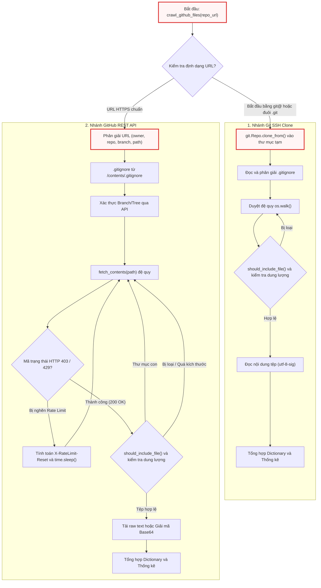
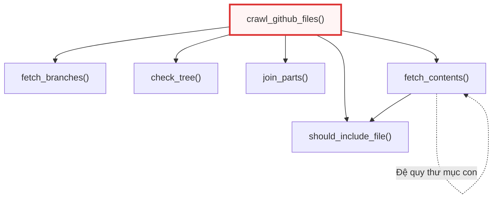

# crawl_github_files.py

> **Source:** `utils/crawl_github_files.py`

Tiếp nối hạ tầng giao tiếp mô hình ngôn ngữ lớn tại [call_llm.py](02_call_llm_py.md), module `crawl_github_files.py` đảm nhiệm vai trò là cổng thu thập dữ liệu mã nguồn từ xa (Remote Repository Ingestion Gateway). Thành phần này chịu trách nhiệm bóc tách, tải về và tiền xử lý cấu trúc tệp tin cùng nội dung mã nguồn từ các kho lưu trữ GitHub công khai hoặc riêng tư, đóng vai trò cung cấp ngữ cảnh đầu vào (context window data) cho các nút phân tích kiến trúc tiếp theo trong hệ thống.

---

## 1. Tổng quan Kiến trúc & Nguyên lý Hoạt động

Module `crawl_github_files.py` cung cấp giải pháp thu thập mã nguồn kép (Dual-Engine Crawling Strategy), cho phép hệ thống linh hoạt chuyển đổi giữa hai phương thức tiếp cận dựa trên định dạng URL đầu vào:

1. **Phương thức Git SSH Clone cục bộ (SSH Cloning Engine)**: Được kích hoạt khi URL có tiền tố `git@` hoặc hậu tố `.git`. Cơ chế này sử dụng thư viện `gitpython` để sao chép toàn bộ kho lưu trữ vào một thư mục tạm thời (`tempfile.TemporaryDirectory`), sau đó tiến hành duyệt cây thư mục bằng `os.walk` kết hợp lọc tệp tin trực tiếp trên ổ đĩa.
2. **Phương thức GitHub REST API v3 (REST API Ingestion Engine)**: Được kích hoạt đối với các liên kết web chuẩn (`https://github.com/...`). Cơ chế này phân giải URL để xác định `owner`, `repo`, nhánh/commit (`ref`), và đường dẫn con (`subdirectory`). Quá trình thu thập diễn ra đệ quy thông qua giao thức HTTP REST, hỗ trợ tải trực tiếp qua `download_url` hoặc giải mã chuỗi Base64.

Cả hai phương thức đều tích hợp các bộ lọc phòng thủ nghiêm ngặt: kiểm tra quy tắc loại trừ mẫu (`include_patterns`, `exclude_patterns`), phân giải tệp cấu hình `.gitignore` chuẩn quy cách (`pathspec`), giới hạn dung lượng tệp (`max_file_size`) và tự động xử lý hiện tượng nghẽn giới hạn tần suất yêu cầu (Rate Limit Backoff).



---

## 2. Các Hàm Cấp Module (Module-Level Functions)

### `crawl_github_files()`
**Visibility**: Public  
**Signature**: 
```python
def crawl_github_files(
    repo_url: str,
    token: str | None = None,
    max_file_size: int = 1 * 1024 * 1024,
    use_relative_paths: bool = False,
    include_patterns: str | set[str] | None = None,
    exclude_patterns: str | set[str] | None = None,
) -> dict:
```

**Description**: Hàm điều phối chính chịu trách nhiệm tiếp nhận yêu cầu thu thập dữ liệu từ kho lưu trữ GitHub. Hàm thực hiện chuẩn hóa các tham số lọc mẫu đầu vào (`include_patterns`, `exclude_patterns`) từ chuỗi đơn lẻ sang cấu trúc dữ liệu `set`, nhận diện cơ chế truy cập (SSH hay REST API), điều phối luồng nạp cấu hình `.gitignore`, kiểm soát bộ đếm thống kê và tổng hợp kết quả trả về dưới dạng bảng ánh xạ đường dẫn - nội dung tệp.

**Parameters**:
* `repo_url` (`str`): Đường dẫn URL của kho lưu trữ GitHub. Có thể là URL giao thức SSH (ví dụ: `git@github.com:user/repo.git`) hoặc URL giao thức HTTPS kèm định danh nhánh/commit và thư mục con (ví dụ: `https://github.com/microsoft/autogen/tree/main/python/packages`).
* `token` (`str | None`, tùy chọn): GitHub Personal Access Token (PAT). Bắt buộc đối với các kho lưu trữ riêng tư (private repos) và khuyến nghị sử dụng đối với kho lưu trữ công khai để tránh bị giới hạn tần suất yêu cầu bởi GitHub API.
* `max_file_size` (`int`, tùy chọn): Ngưỡng dung lượng tệp tin tối đa tính bằng byte được phép đọc hoặc tải về. Giá trị mặc định là `1,048,576` bytes ($1\text{ MB}$).
* `use_relative_paths` (`bool`, tùy chọn): Cờ kích hoạt chuẩn hóa đường dẫn tương đối. Nếu đặt là `True`, đường dẫn tệp tin trong kết quả trả về sẽ được loại bỏ phần tiền tố thư mục gốc đã chỉ định trên URL.
* `include_patterns` (`str | set[str] | None`, tùy chọn): Biểu thức mẫu tên tệp (glob pattern) chỉ định các tệp cần thu thập (ví dụ: `"*.py"` hoặc `{"*.py", "*.md"}`). Mặc định là `None` (chấp nhận tất cả tệp).
* `exclude_patterns` (`str | set[str] | None`, tùy chọn): Biểu thức mẫu tên tệp hoặc đường dẫn thư mục cần loại trừ khỏi quá trình thu thập. Mặc định là `None`.

**Returns**:
* `dict`: Cấu trúc dữ liệu chứa hai khóa chính:
  * `"files"` (`dict[str, str]`): Bảng ánh xạ giữa đường dẫn tệp tin (`key`) và toàn bộ nội dung văn bản thuần của tệp (`value`).
  * `"stats"` (`dict[str, Any]`): Báo cáo thống kê bao gồm số lượng tệp đã tải (`downloaded_count`), số lượng tệp bị bỏ qua (`skipped_count`), danh sách tệp bỏ qua (`skipped_files`), đường dẫn cơ sở (`base_path`), cùng cấu hình lọc được áp dụng.

**Raises**:
* `ValueError`: Ném ra khi cấu trúc URL HTTPS không hợp lệ (không phân tách được tối thiểu hai thành phần `owner` và `repo`).
* `Exception`: Ném ra khi vượt quá giới hạn tần suất GitHub API mà không có `token` được cung cấp.

**Implementation Details & Logic Extracts**:

Khởi tạo cấu hình và phân nhánh thực thi SSH Clone:

```python
    # Convert single pattern to set
    if include_patterns and isinstance(include_patterns, str):
        include_patterns = {include_patterns}
    if exclude_patterns and isinstance(exclude_patterns, str):
        exclude_patterns = {exclude_patterns}

    # // ... [Nested helper should_include_file definition] ...

    # Detect SSH URL (git@ or .git suffix)
    is_ssh_url = repo_url.startswith("git@") or repo_url.endswith(".git")

    if is_ssh_url:
        # Clone repo via SSH to temp dir
        with tempfile.TemporaryDirectory() as tmpdirname:
            emit_raw("PROGRESS", f"Cloning SSH repo {repo_url} to temp dir {tmpdirname} ...")
            try:
                repo = git.Repo.clone_from(repo_url, tmpdirname)
            except Exception as e:
                emit_raw("ERROR", f"Error cloning repo: {e}")
                return {"files": {}, "stats": {"error": str(e)}}
            # // ... [SSH traversal logic] ...
```

Đoạn mã trên chuẩn hóa các biến `include_patterns` và `exclude_patterns` thành tập hợp `set` nhằm tối ưu hóa việc kiểm tra thành phần. Sau đó, hệ thống phân tích chuỗi URL: nếu phát hiện định dạng SSH, một thư mục tạm thời sẽ được tạo lập tự động thông qua `tempfile.TemporaryDirectory()`. Toàn bộ mã nguồn được nhân bản bằng `git.Repo.clone_from`. Mọi lỗi phát sinh trong quá trình clone (như lỗi xác thực SSH key hoặc lỗi kết nối mạng) đều được bắt lại, thông báo qua hàm `emit_raw` và trả về cấu trúc lỗi an toàn.

Xử lý duyệt thư mục và áp dụng bộ lọc trên máy cục bộ (nhánh SSH):

```python
            # --- Load .gitignore ---
            gitignore_path = os.path.join(tmpdirname, ".gitignore")
            gitignore_spec = None
            if os.path.exists(gitignore_path):
                try:
                    with open(gitignore_path, encoding="utf-8-sig") as f:
                        gitignore_spec = pathspec.PathSpec.from_lines("gitwildmatch", f.readlines())
                    emit("CRAWL_GITIGNORE_LOADED", path="repository")
                except Exception:
                    pass

            for root, dirs, filenames in os.walk(tmpdirname):
                # Filter directories
                excluded_dirs = set()
                for d in sorted(dirs):
                    dirpath_rel = os.path.relpath(os.path.join(root, d), tmpdirname)
                    reason = None
                    if gitignore_spec and gitignore_spec.match_file(dirpath_rel):
                        reason = get("CRAWL_REASON_GITIGNORE")
                    elif exclude_patterns:
                        for pattern in exclude_patterns:
                            dir_pattern = pattern.removesuffix("/*")
                            if fnmatch.fnmatch(dirpath_rel, dir_pattern) or fnmatch.fnmatch(d, dir_pattern):
                                reason = get("CRAWL_REASON_EXCLUDED")
                                break

                    if reason:
                        excluded_dirs.add(d)
                        entry_num += 1
                        count_excluded += 1
                        emit("CRAWL_DIR_EXCLUDED", num=entry_num, path=dirpath_rel, reason=reason)

                for d in dirs.copy():
                    if d in excluded_dirs:
                        dirs.remove(d)

                dirs.sort()
                # // ... [File processing loop] ...
```

Trong quá trình duyệt thư mục SSH, hệ thống kiểm tra sự tồn tại của tệp `.gitignore` tại thư mục gốc và khởi tạo đối tượng `pathspec.PathSpec` với cú pháp `gitwildmatch`. Khi gọi `os.walk`, danh sách các thư mục con (`dirs`) được duyệt và so khớp với cả `.gitignore` lẫn `exclude_patterns`. Việc biến đổi trực tiếp danh sách `dirs` bằng cách loại bỏ các thư mục nằm trong `excluded_dirs` giúp ngăn chặn `os.walk` đi sâu vào các cây thư mục không mong muốn (như `.git`, `node_modules`, `venv`), giảm thiểu đáng kể chi phí I/O trên đĩa.

Xử lý đọc nội dung tệp và phân loại lỗi mã hóa (nhánh SSH):

```python
                for filename in sorted(filenames):
                    abs_path = os.path.join(root, filename)
                    rel_path = os.path.relpath(abs_path, tmpdirname)
                    entry_num += 1

                    # Check include/exclude patterns
                    if not should_include_file(rel_path, filename, gitignore_spec=gitignore_spec):
                        count_excluded += 1
                        emit("CRAWL_FILE_EXCLUDED", num=entry_num, path=rel_path)
                        continue

                    # Check file size
                    try:
                        file_size = os.path.getsize(abs_path)
                    except OSError:
                        continue

                    if file_size > max_file_size:
                        count_size_limit += 1
                        skipped_size_list.append(rel_path)
                        size_kb = file_size / 1024
                        emit("CRAWL_FILE_SIZE_LIMIT", num=entry_num, path=rel_path, size=f"{size_kb:.0f}")
                        continue

                    # Read content
                    try:
                        with open(abs_path, encoding="utf-8-sig") as f:
                            content = f.read()
                        files[rel_path] = content
                        count_processed += 1
                        emit("CRAWL_FILE_PROCESSED", num=entry_num, path=rel_path)
                    except (UnicodeDecodeError, ValueError):
                        count_non_text += 1
                        skipped_non_text_list.append(rel_path)
                        emit("CRAWL_FILE_NOT_TEXT", num=entry_num, path=rel_path)
                    except Exception as e:
                        count_non_text += 1
                        skipped_non_text_list.append(rel_path)
                        emit("CRAWL_FILE_ERROR", num=entry_num, path=rel_path, error=e)
```

Mỗi tệp tin sau khi vượt qua hàm kiểm tra `should_include_file` sẽ được thẩm định dung lượng qua `os.getsize`. Nếu vượt ngưỡng `max_file_size`, tệp bị bỏ qua và ghi nhận vào `skipped_size_list`. Khi đọc tệp, hệ thống sử dụng bảng mã `utf-8-sig` để tự động xử lý ký tự BOM (Byte Order Mark) nếu có. Nếu tệp là định dạng nhị phân (hình ảnh, tệp thực thi, thư viện liên kết động) hoặc gặp lỗi giải mã, ngoại lệ `UnicodeDecodeError` và `ValueError` sẽ được bắt lại, phân loại tệp vào nhóm phi văn bản (`count_non_text`) mà không làm gián đoạn luồng duyệt chính.

Phân giải cấu trúc URL và chuẩn bị yêu cầu REST API:

```python
    # Parse GitHub URL to extract owner, repo, commit/branch, and path
    parsed_url = urlparse(repo_url)
    path_parts = parsed_url.path.strip("/").split("/")

    if len(path_parts) < 2:
        raise ValueError(f"Invalid GitHub URL: {repo_url}")

    # Extract the basic components
    owner = path_parts[0]
    repo = path_parts[1]

    # Setup for GitHub API
    headers = {"Accept": "application/vnd.github.v3+json"}
    if token:
        headers["Authorization"] = f"token {token}"
```

Đối với nhánh HTTP REST, hàm sử dụng `urllib.parse.urlparse` để tách các thành phần trong chuỗi đường dẫn. Hệ thống yêu cầu tối thiểu hai thành phần là định danh tài khoản/tổ chức (`owner`) và tên kho lưu trữ (`repo`). Tiêu đề HTTP được cấu hình chuẩn với `Accept: application/vnd.github.v3+json` và tự động đính kèm khóa xác thực `Authorization: token <token>` nếu tham số `token` được cung cấp.

Phân giải nhánh, mã băm commit và đường dẫn con trong URL:

```python
    # Check if URL contains a specific branch/commit
    if len(path_parts) > 3 and path_parts[2] == "tree":

        def join_parts(i):
            return "/".join(path_parts[i:])

        branches = fetch_branches(owner, repo)
        branch_names = (branch.get("name") for branch in branches)

        # Fetching branches was not successful
        if len(branches) == 0:
            return None

        # Check branch name
        relevant_path = join_parts(3)

        # Find a match with relevant path and get the branch name
        filter_gen = (name for name in branch_names if relevant_path.startswith(name))
        ref = next(filter_gen, None)

        # If match is not found, check for is it a tree
        if ref is None:
            tree = path_parts[3]
            ref = tree if check_tree(owner, repo, tree) else None

        # If it is neither a tree nor a branch name
        if ref is None:
            emit_raw("ERROR", "The given path does not match with any branch and any tree in the repository.\nPlease verify the path is exists.")
            return None

        # Combine all parts after the ref as the path
        part_index = 5 if "/" in ref else 4
        specific_path = join_parts(part_index) if part_index < len(path_parts) else ""
    else:
        # Don't put the ref param in query
        # and let Github decide default branch
        ref = None
        specific_path = ""
```

Đoạn mã giải quyết bài toán phức tạp khi URL chứa định dạng nhánh có dấu gạch chéo (ví dụ: `tree/feature/new-ui/src`). Thuật toán truy xuất danh sách toàn bộ các nhánh của kho lưu trữ thông qua `fetch_branches()`, sau đó kiểm tra tiền tố của chuỗi đường dẫn (`relevant_path`) với danh sách tên nhánh. Nếu không khớp với bất kỳ nhánh nào, hệ thống tiếp tục kiểm tra xem chuỗi phân đoạn có phải là mã định danh cây/commit thông qua `check_tree()`. Khi đã xác định chính xác `ref`, phần còn lại của đường dẫn được gán vào `specific_path` để giới hạn phạm vi thu thập đệ quy.

Tải và khởi tạo `.gitignore` qua GitHub API:

```python
    # --- Try to fetch .gitignore ---
    gitignore_spec = None
    try:
        gi_url = f"https://api.github.com/repos/{owner}/{repo}/contents/.gitignore"
        gi_params = {"ref": ref} if ref is not None else {}
        gi_resp = requests.get(gi_url, headers=headers, params=gi_params, timeout=(10, 10))
        if gi_resp.status_code == 200:
            gi_data = gi_resp.json()
            if "content" in gi_data and gi_data.get("encoding") == "base64":
                gi_content = base64.b64decode(gi_data["content"]).decode("utf-8")
                gitignore_spec = pathspec.PathSpec.from_lines("gitwildmatch", gi_content.splitlines())
                emit("CRAWL_GITIGNORE_LOADED", path="repository (API)")
    except Exception:
        pass
```

Trước khi tiến hành duyệt đệ quy cây thư mục, một yêu cầu HTTP GET được gửi đến endpoint `/contents/.gitignore` kèm theo tham số `ref` tương ứng. Nếu tệp tồn tại (HTTP 200), nội dung mã hóa Base64 được giải mã thành chuỗi văn bản thuần và biên dịch thành đối tượng `pathspec.PathSpec`. Trường hợp tệp không tồn tại hoặc gặp lỗi kết nối, ngoại lệ được bỏ qua một cách an toàn và `gitignore_spec` giữ giá trị `None`.

**Example**:
```python
# Trích xuất từ khối kiểm thử/thực thi mẫu ở cuối tệp utils/crawl_github_files.py
repo_url = "https://github.com/pydantic/pydantic/tree/6c38dc93f40a47f4d1350adca9ec0d72502e223f/pydantic"

result = crawl_github_files(
    repo_url,
    token=github_token,
    max_file_size=1 * 1024 * 1024,  # 1 MB in bytes
    use_relative_paths=True,  # Enable relative paths
    include_patterns={"*.py", "*.md"},  # Include Python and Markdown files
)

files = result["files"]
stats = result["stats"]
```

---

## 3. Các Hàm Tiện ích Nội bộ (Internal Helper Functions)

Các hàm dưới đây được định nghĩa cục bộ (nested functions) bên trong thân hàm `crawl_github_files()` nhằm thực hiện các tác vụ chuyên biệt hóa trong từng phạm vi xử lý.



---

### `should_include_file()`
**Visibility**: Nested Helper (Private to `crawl_github_files`)  
**Signature**: 
```python
def should_include_file(
    file_path: str, 
    file_name: str, 
    gitignore_spec: pathspec.PathSpec | None = None
) -> bool:
```

**Description**: Hàm đánh giá logic quyết định xem một tệp tin có thỏa mãn các tiêu chí lọc để được nạp vào bộ nhớ hay không. Quá trình kiểm tra diễn ra theo 3 tầng liên tiếp:
1. So khớp tên tệp (`file_name`) với tập hợp `include_patterns` thông qua `fnmatch.fnmatch`.
2. So khớp đường dẫn tệp (`file_path`) với đặc tả loại trừ của `gitignore_spec` (nếu có).
3. So khớp đường dẫn tệp (`file_path`) với tập hợp `exclude_patterns`.

**Parameters**:
* `file_path` (`str`): Đường dẫn đầy đủ hoặc tương đối của tệp tính từ thư mục gốc thu thập.
* `file_name` (`str`): Tên cơ sở (basename) của tệp tin.
* `gitignore_spec` (`pathspec.PathSpec | None`, tùy chọn): Đối tượng so khớp quy tắc `.gitignore` đã biên dịch.

**Returns**:
* `bool`: Trả về `True` nếu tệp vượt qua toàn bộ các bộ lọc và được phép tải/đọc; ngược lại trả về `False`.

**Raises**:
* Không phát sinh ngoại lệ trực tiếp.

**Implementation Logic**:
```python
    def should_include_file(file_path: str, file_name: str, gitignore_spec=None) -> bool:
        """Determine if a file should be included based on patterns"""
        # If no include patterns are specified, include all files
        if not include_patterns:
            include_file = True
        else:
            # Check if file matches any include pattern
            include_file = any(fnmatch.fnmatch(file_name, pattern) for pattern in include_patterns)

        # Check gitignore if provided
        if include_file and gitignore_spec and gitignore_spec.match_file(file_path):
            return False

        # If exclude patterns are specified, check if file should be excluded
        if exclude_patterns and include_file:
            # Exclude if file matches any exclude pattern
            exclude_file = any(fnmatch.fnmatch(file_path, pattern) for pattern in exclude_patterns)
            return not exclude_file

        return include_file
```

Logic trên áp dụng nguyên lý đánh giá lười (short-circuit evaluation). Nếu `include_patterns` được thiết lập, hàm sẽ chỉ kiểm tra tiếp các quy tắc loại trừ nếu tệp khớp với ít nhất một mẫu bao gồm. Sự kết hợp giữa so khớp tên tệp (đối với include) và so khớp toàn bộ đường dẫn (đối với gitignore và exclude) đảm bảo độ linh hoạt cao khi cấu hình các bộ lọc phức tạp.

**Example**:
```python
# Trích xuất từ cách gọi nội bộ trong crawl_github_files
# Kiểm tra include/exclude patterns trong nhánh REST API
if not should_include_file(rel_path, item["name"], gitignore_spec=gitignore_spec):
    api_counters["excluded"] += 1
    emit("CRAWL_FILE_EXCLUDED", num=entry_num, path=rel_path)
    continue
```

---

### `fetch_branches()`
**Visibility**: Nested Helper (Private to `crawl_github_files`)  
**Signature**: 
```python
def fetch_branches(owner: str, repo: str) -> list[dict] | None:
```

**Description**: Gửi yêu cầu HTTP GET đến GitHub REST API endpoint `/repos/{owner}/{repo}/branches` để lấy danh sách toàn bộ các nhánh của kho lưu trữ. Hàm thiết lập thời gian chờ (timeout) cố định là 30 giây cho cả kết nối và đọc dữ liệu, đồng thời xử lý các trường hợp lỗi HTTP phổ biến như 404 (kho lưu trữ không tồn tại hoặc là repo riêng tư nhưng thiếu token) và 403/429 (vượt hạn mức truy cập API).

**Parameters**:
* `owner` (`str`): Tên người dùng hoặc tổ chức sở hữu kho lưu trữ trên GitHub.
* `repo` (`str`): Tên kho lưu trữ.

**Returns**:
* `list[dict]`: Danh sách các đối tượng JSON đại diện cho các nhánh nếu truy vấn thành công.
* `list`: Danh sách rỗng `[]` nếu gặp lỗi 404 hoặc mã trạng thái HTTP khác 200.

**Raises**:
* `Exception`: Ném ra thông báo `"GitHub API rate limit exceeded..."` nếu nhận mã trạng thái 403 hoặc 429 khi không có `token` xác thực.

**Implementation Logic**:
```python
    def fetch_branches(owner: str, repo: str):
        """Get branches of the repository"""

        url = f"https://api.github.com/repos/{owner}/{repo}/branches"
        response = requests.get(url, headers=headers, timeout=(30, 30))

        if response.status_code in (403, 429) and not token:
            raise Exception("GitHub API rate limit exceeded. Please provide a GitHub token using --token or GITHUB_TOKEN env var.")

        if response.status_code == 404:
            if not token:
                emit_raw(
                    "ERROR",
                    "Error 404: Repository not found or is private.\n"
                    "If this is a private repository, please provide a valid GitHub token via the 'token' argument or set the GITHUB_TOKEN environment variable.",
                )
            else:
                emit_raw(
                    "ERROR",
                    "Error 404: Repository not found or insufficient permissions with the provided token.\n"
                    "Please verify the repository exists and the token has access to this repository.",
                )
            return []

        if response.status_code != 200:
            emit_raw("ERROR", f"Error fetching the branches of {owner}/{repo}: {response.status_code} - {response.text}")
            return []

        return response.json()
```

Hàm này thực hiện bóc tách lỗi HTTP chi tiết dựa trên trạng thái cung cấp của biến `token`. Nếu nhận mã lỗi 404 khi không có token, hệ thống sẽ đưa ra hướng dẫn người dùng thiết lập biến môi trường `GITHUB_TOKEN`. Nếu đã có token nhưng vẫn gặp lỗi 404, thông báo sẽ chỉ rõ vấn đề về quyền hạn truy cập (insufficient permissions).

**Example**:
```python
# Trích xuất từ logic giải quyết branch trong crawl_github_files
branches = fetch_branches(owner, repo)
branch_names = (branch.get("name") for branch in branches)

if len(branches) == 0:
    return None
```

---

### `check_tree()`
**Visibility**: Nested Helper (Private to `crawl_github_files`)  
**Signature**: 
```python
def check_tree(owner: str, repo: str, tree: str) -> bool:
```

**Description**: Kiểm tra sự tồn tại của một cây đối tượng Git (Git Tree SHA hoặc Commit SHA) trên GitHub thông qua endpoint `/repos/{owner}/{repo}/git/trees/{tree}`. Hàm này được sử dụng như một cơ chế dự phòng khi chuỗi định danh trên URL không khớp với bất kỳ tên nhánh nào trong danh sách nhánh được trả về từ `fetch_branches()`.

**Parameters**:
* `owner` (`str`): Tên chủ sở hữu kho lưu trữ.
* `repo` (`str`): Tên kho lưu trữ.
* `tree` (`str`): Chuỗi băm SHA của commit hoặc Git tree cần kiểm tra.

**Returns**:
* `bool`: Trả về `True` nếu mã trạng thái HTTP là 200 (cây tồn tại); ngược lại trả về `False`.

**Raises**:
* `Exception`: Ném ra lỗi nếu chạm giới hạn tần suất GitHub API (HTTP 403/429) trong điều kiện không sử dụng token.

**Implementation Logic**:
```python
    def check_tree(owner: str, repo: str, tree: str):
        """Check the repository has the given tree"""

        url = f"https://api.github.com/repos/{owner}/{repo}/git/trees/{tree}"
        response = requests.get(url, headers=headers, timeout=(30, 30))

        if response.status_code in (403, 429) and not token:
            raise Exception("GitHub API rate limit exceeded. Please provide a GitHub token using --token or GITHUB_TOKEN env var.")

        return response.status_code == 200
```

Hàm đóng vai trò kiểm tra tính hợp lệ của tham chiếu Git (Ref Validator) mức thấp. Nhờ việc gọi trực tiếp Git Trees API, hệ thống hỗ trợ thu thập mã nguồn tại một commit bất kỳ trong lịch sử mà không cần commit đó phải là đỉnh (HEAD) của một nhánh hiện hữu.

**Example**:
```python
# Trích xuất từ logic xác định ref khi không khớp tên nhánh
if ref is None:
    tree = path_parts[3]
    ref = tree if check_tree(owner, repo, tree) else None
```

---

### `join_parts()`
**Visibility**: Nested Helper (Private to `crawl_github_files`)  
**Signature**: 
```python
def join_parts(i: int) -> str:
```

**Description**: Hàm tiện ích cục bộ hỗ trợ ghép nối lại các phân đoạn đường dẫn URL (danh sách `path_parts`) bắt đầu từ chỉ mục `i` đến cuối danh sách, sử dụng dấu gạch chéo `/` làm ký tự phân tách.

**Parameters**:
* `i` (`int`): Chỉ mục phần tử bắt đầu ghép trong mảng `path_parts`.

**Returns**:
* `str`: Chuỗi đường dẫn kết hợp hoàn chỉnh.

**Raises**:
* Không phát sinh ngoại lệ.

**Implementation Logic**:
```python
        def join_parts(i):
            return "/".join(path_parts[i:])
```

Hàm này được dùng để tái tạo lại chuỗi đường dẫn con nằm sau thành phần `tree/<branch_name>` nhằm phân tách chính xác giữa tên nhánh và đường dẫn thư mục nội bộ trong kho lưu trữ.

**Example**:
```python
# Trích xuất từ logic tính toán relevant_path và specific_path
relevant_path = join_parts(3)
# ...
part_index = 5 if "/" in ref else 4
specific_path = join_parts(part_index) if part_index < len(path_parts) else ""
```

---

### `fetch_contents()`
**Visibility**: Nested Helper (Private to `crawl_github_files`)  
**Signature**: 
```python
def fetch_contents(path: str) -> None:
```

**Description**: Hàm đệ quy cốt lõi trong chế độ GitHub REST API, chịu trách nhiệm duyệt qua từng cấp thư mục bắt đầu từ `specific_path`. Đối với mỗi mục (item) được trả về từ endpoint `/contents/{path}`:
* Nếu là thư mục (`type == "dir"`): Kiểm tra điều kiện loại trừ qua `.gitignore` và `exclude_patterns`. Nếu hợp lệ, tiếp tục gọi đệ quy `fetch_contents(item_path)`.
* Nếu là tệp tin (`type == "file"`): Kiểm tra quy tắc lọc mẫu và giới hạn kích thước (`max_file_size`). Nếu hợp lệ, tiến hành tải nội dung văn bản qua `download_url` hoặc giải mã chuỗi Base64 từ trường `content`, sau đó ghi trực tiếp vào từ điển `files`.
* Xử lý cơ chế tự động chờ (Rate Limit Backoff): Tự động tính toán thời gian `X-RateLimit-Reset`, tạm dừng tiến trình bằng `time.sleep()` và thực hiện gọi lại chính nó khi hết thời gian phong tỏa.

**Parameters**:
* `path` (`str`): Đường dẫn tương đối của thư mục hoặc tệp tin cần truy vấn nội dung từ GitHub API.

**Returns**:
* `None`: Hàm không trả về giá trị, dữ liệu thu thập được cập nhật trực tiếp vào biến đóng bao (closure variable) `files` và `api_counters`.

**Raises**:
* `Exception`: Ném ra khi bị chặn tần suất yêu cầu (403/429) mà người dùng không cung cấp `token`.

**Implementation Logic**:

Kiểm soát lỗi và cơ chế Rate Limit Backoff:

```python
    def fetch_contents(path):
        """Fetch contents of the repository at a specific path and commit"""
        url = f"https://api.github.com/repos/{owner}/{repo}/contents/{path}"
        params = {"ref": ref} if ref is not None else {}

        response = requests.get(url, headers=headers, params=params, timeout=(30, 30))

        if response.status_code in (403, 429) and "rate limit exceeded" in response.text.lower():
            if not token:
                raise Exception("GitHub API rate limit exceeded. Please provide a GitHub token using --token or GITHUB_TOKEN env var.")
            reset_time = int(response.headers.get("X-RateLimit-Reset", 0))
            wait_time = max(reset_time - time.time(), 0) + 1
            emit_raw("WARNING", f"Rate limit exceeded. Waiting for {wait_time:.0f} seconds...")
            time.sleep(wait_time)
            return fetch_contents(path)

        if response.status_code == 404:
            # // ... [Error logging for 404 paths] ...
            return None

        if response.status_code != 200:
            emit_raw("ERROR", f"Error fetching {path}: {response.status_code} - {response.text}")
            return None
```

Đoạn mã trên thể hiện kỹ thuật phục hồi lỗi mạng nâng cao. Khi API phản hồi mã lỗi 403 hoặc 429 kèm thông điệp vượt hạn ngạch, hàm đọc tiêu đề `X-RateLimit-Reset` (chứa mốc thời gian Unix timestamp khi hạn mức được làm mới), tính toán khoảng thời gian cần ngủ (`wait_time`) và gọi lại chính nó (`return fetch_contents(path)`). Cơ chế này đảm bảo tiến trình thu thập dữ liệu lớn không bị đứt đoạn giữa chừng.

Xử lý tải và giải mã nội dung tệp tin:

```python
        contents = response.json()
        if not isinstance(contents, list):
            contents = [contents]

        for item in contents:
            item_path = item["path"]
            if use_relative_paths and specific_path:
                if item_path.startswith(specific_path):
                    rel_path = item_path[len(specific_path) :].lstrip("/")
                else:
                    rel_path = item_path
            else:
                rel_path = item_path

            if item["type"] == "file":
                api_counters["entry"] += 1
                entry_num = api_counters["entry"]

                if not should_include_file(rel_path, item["name"], gitignore_spec=gitignore_spec):
                    api_counters["excluded"] += 1
                    emit("CRAWL_FILE_EXCLUDED", num=entry_num, path=rel_path)
                    continue

                file_size = item.get("size", 0)
                if file_size > max_file_size:
                    api_counters["size_limit"] += 1
                    api_skipped_size.append(rel_path)
                    size_kb = file_size / 1024
                    emit("CRAWL_FILE_SIZE_LIMIT", num=entry_num, path=rel_path, size=f"{size_kb:.0f}")
                    continue

                # For files, get raw content
                if item.get("download_url"):
                    file_url = item["download_url"]
                    file_response = requests.get(file_url, headers=headers, timeout=(30, 30))
                    # // ... [Content-length verification] ...
                    if file_response.status_code == 200:
                        files[rel_path] = file_response.text
                        api_counters["processed"] += 1
                        emit("CRAWL_FILE_PROCESSED", num=entry_num, path=rel_path)
                # // ... [Base64 fallback processing] ...
```

Hàm chuẩn hóa phản hồi từ GitHub API (chuyển đổi đối tượng đơn lẻ thành danh sách nếu truy vấn trực tiếp một tệp). Khi xử lý từng phần tử loại `file`, hệ thống ưu tiên tải trực tiếp văn bản thô từ `download_url` nhằm giảm thiểu chi phí tính toán CPU cho việc giải mã Base64. Trước khi lưu vào `files`, kích thước phản hồi thực tế từ tiêu đề `content-length` tiếp tục được kiểm tra lại để phòng ngừa sai lệch siêu dữ liệu.

Xử lý loại trừ và duyệt đệ quy thư mục:

```python
            elif item["type"] == "dir":
                dir_excluded = False
                dir_reason = None

                if gitignore_spec and gitignore_spec.match_file(rel_path):
                    dir_excluded = True
                    dir_reason = get("CRAWL_REASON_GITIGNORE")

                if not dir_excluded and exclude_patterns:
                    dir_name = item["name"]
                    for pattern in exclude_patterns:
                        dir_pattern = pattern.removesuffix("/*")
                        if (
                            fnmatch.fnmatch(item_path, dir_pattern)
                            or fnmatch.fnmatch(rel_path, dir_pattern)
                            or fnmatch.fnmatch(dir_name, dir_pattern)
                        ):
                            dir_excluded = True
                            dir_reason = get("CRAWL_REASON_EXCLUDED")
                            break

                if dir_excluded:
                    api_counters["entry"] += 1
                    api_counters["excluded"] += 1
                    emit("CRAWL_DIR_EXCLUDED", num=api_counters["entry"], path=rel_path, reason=dir_reason)
                    continue

                fetch_contents(item_path)
```

Trước khi thực hiện lời gọi đệ quy `fetch_contents(item_path)` cho các mục có `type == "dir"`, hệ thống tiến hành kiểm tra sớm (early pruning) đối với thư mục. Bằng cách so sánh tên thư mục và đường dẫn với `.gitignore` và `exclude_patterns`, các nhánh thư mục bị cấm sẽ bị cắt bỏ ngay lập tức, tiết kiệm tối đa số lượng request gửi lên GitHub API.

**Example**:
```python
# Trích xuất từ điểm khởi động đệ quy trong crawl_github_files
fetch_contents(specific_path)
```

---

## 4. Bảng Thống kê Cấu trúc & Trường Dữ liệu Trả về

Cấu trúc từ điển (Dictionary) trả về từ `crawl_github_files()` tuân thủ định dạng chuẩn sau:

| Khóa (Key) | Kiểu Dữ liệu (Type) | Mô tả Kỹ thuật |
| :--- | :--- | :--- |
| `files` | `dict[str, str]` | Bảng ánh xạ các cặp key-value, trong đó `key` là đường dẫn tệp tin (chuẩn hóa theo relative/absolute tùy cờ `use_relative_paths`) và `value` là toàn bộ chuỗi nội dung văn bản thuần. |
| `stats.downloaded_count` | `int` | Tổng số lượng tệp tin đã được tải về và xử lý thành công. |
| `stats.skipped_count` | `int` | Số lượng tệp bị bỏ qua do lỗi hoặc vượt kích thước. |
| `stats.skipped_files` | `list[str]` | Danh sách chi tiết đường dẫn các tệp bị bỏ qua trong quá trình duyệt. |
| `stats.base_path` | `str \| None` | Chuỗi đường dẫn gốc được dùng làm mốc tính đường dẫn tương đối (nếu `use_relative_paths=True`). |
| `stats.include_patterns` | `set[str] \| None` | Tập hợp các biểu thức mẫu lọc bao gồm đã áp dụng. |
| `stats.exclude_patterns` | `set[str] \| None` | Tập hợp các biểu thức mẫu lọc loại trừ đã áp dụng. |
| `stats.source` | `str` (tùy chọn) | Định danh nguồn thu thập (chỉ xuất hiện trong nhánh SSH với giá trị `"ssh_clone"`). |

---

## Xem thêm (See Also)

* [__init__.py](01___init___py.md) — Khởi tạo không gian tên tầng tiện ích hạ tầng `utils`.
* [call_llm.py](02_call_llm_py.md) — Tầng cổng kết nối và điều phối mô hình ngôn ngữ lớn (LLM Gateway).
* [crawl_local_files.py](04_crawl_local_files_py.md) — Module thu thập và phân tích mã nguồn từ hệ thống tệp cục bộ.
* [exclude_patterns.py](05_exclude_patterns_py.md) — Danh mục các biểu thức chính quy và mẫu loại trừ tệp/thư mục mặc định.
* [output.py](06_output_py.md) — Hệ thống phát sự kiện và hiển thị thông báo tiến trình (`emit`, `emit_raw`, `get`).

