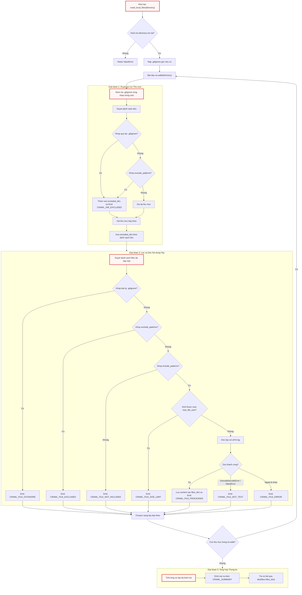

# crawl_local_files.py

> **Source:** `utils\crawl_local_files.py`

Tài liệu này cung cấp đặc tả kỹ thuật chi tiết và tham chiếu API nội bộ cho module `utils\crawl_local_files.py`. Module này chịu trách nhiệm thu thập, phân tích và tiền xử lý toàn bộ các tệp mã nguồn từ hệ thống tệp cục bộ (Local File System) nhằm tạo lập ngữ cảnh phục vụ các tác vụ phân tích mã nguồn và mô hình ngôn ngữ lớn (LLM).

Ở chương trước, [crawl_github_files.py](03_crawl_github_files_py.md) đã giải quyết bài toán tải mã nguồn từ xa thông qua hạ tầng GitHub REST API và Git SSH. Tương ứng trên môi trường nội bộ, `crawl_local_files.py` đóng vai trò là cổng nạp dữ liệu cục bộ (Local Repository Ingestion Gateway). Module cung cấp giao diện đầu ra chuẩn hóa đồng nhất (`dict[str, str]`) tương thích hoàn toàn với luồng xử lý của `crawl_github_files.py`, nhưng được tối ưu hóa đặc biệt cho I/O đĩa cục bộ, cơ chế duyệt tệp đơn kỳ (single-pass traversal), và khả năng phân giải quy tắc `.gitignore` phân cấp đa tầng.

---

## 1. Tổng quan Kiến trúc & Nguyên lý Hoạt động

Module `crawl_local_files.py` thực hiện quét đệ quy cấu trúc thư mục trên máy cục bộ bằng cách kết hợp thư viện chuẩn `os` và bộ phân tích cú pháp mẫu `pathspec` (tuân thủ chuẩn `gitwildmatch` của Git). Quá trình thu thập được thiết kế theo các nguyên tắc kỹ thuật cốt lõi sau:

1. **Phân giải `.gitignore` Đa tầng (Hierarchical Gitignore Resolution):** Hệ thống không chỉ đọc tệp `.gitignore` tại thư mục gốc mà còn tự động phát hiện và nạp các tệp `.gitignore` lồng nhau trong các thư mục con trong quá trình duyệt. Mỗi quy tắc được gắn chặt với phạm vi (scope) tương đối của thư mục chứa nó.
2. **Cắt tỉa Thư mục Sớm (Early Directory Pruning):** Bằng cách can thiệp trực tiếp vào danh sách `dirs` trong hàm `os.walk()`, module loại bỏ hoàn toàn các nhánh thư mục bị cấm (như `.git`, `node_modules`, `__pycache__`) ngay từ cấp cao nhất, ngăn chặn việc duyệt sâu không cần thiết và tiết kiệm tài nguyên I/O đĩa.
3. **Đường ống Lọc 5 Tầng Phòng thủ (5-Stage Defensive Filter Pipeline):** Từng tệp tin được thẩm định qua 5 rào cản độc lập trước khi đọc nội dung:
   * Kiểm tra quy tắc `.gitignore` phân cấp.
   * So khớp danh sách mẫu loại trừ tường minh (`exclude_patterns`).
   * So khớp danh sách mẫu bao gồm (`include_patterns`).
   * Kiểm tra giới hạn dung lượng tệp (`max_file_size`).
   * Kiểm tra tính hợp lệ của định dạng văn bản thuần (loại bỏ tệp nhị phân thông qua giải mã UTF-8 có xử lý BOM).
4. **Truyền phát Sự kiện Tiến trình (Event-Driven Progress Emission):** Mọi hành động duyệt, loại trừ, bỏ qua hoặc xử lý thành công đều kích hoạt sự kiện thông qua hệ thống thông báo [output.py](06_output_py.md), cho phép tầng giao diện hiển thị trạng thái theo thời gian thực mà không làm nghẽn luồng xử lý chính.

---

## 2. Sơ đồ Luồng Xử lý Thu thập Dữ liệu Cục bộ

Sơ đồ tuần tự dưới đây mô tả chi tiết quy trình xử lý, cắt tỉa thư mục và đánh giá điều kiện lọc tệp tin trong hàm `crawl_local_files`:



---

## 3. Module-Level Functions

Phần này đặc tả chi tiết toàn bộ các hàm nội bộ (private helpers) và hàm công khai (public API) được định nghĩa trong `utils/crawl_local_files.py`.

```
utils\crawl_local_files.py
├── _load_gitignore(gitignore_path)
├── _matches_any_gitignore(gitignore_specs, abs_path, is_dir=False)
└── crawl_local_files(directory, include_patterns=None, exclude_patterns=None, max_file_size=None, use_relative_paths=True)
```

---

### `_load_gitignore()`

**Visibility**: Private (Hàm trợ giúp nội bộ)  
**Signature**: `def _load_gitignore(gitignore_path: str) -> Optional[pathspec.PathSpec]:`

**Description**:  
Hàm thực hiện nạp và biên dịch nội dung của một tệp `.gitignore` cục bộ thành đối tượng `pathspec.PathSpec`. Quá trình biên dịch sử dụng cú pháp chuẩn `gitwildmatch` nhằm tái tạo chính xác cơ chế khớp mẫu của Git (bao gồm toán tử `**`, dấu phủ định `!`, và quy tắc xử lý dấu `/`). Hàm được bọc hoàn toàn trong khối `try...except` để đảm bảo khi tệp tin bị khóa, hỏng phân quyền hoặc lỗi đọc dữ liệu, tiến trình quét tổng thể vẫn tiếp tục mà không làm sập ứng dụng.

**Parameters**:
* `gitignore_path` (`str`): Đường dẫn tuyệt đối hoặc tương đối trỏ tới tệp `.gitignore` cần nạp.

**Returns**:
* `pathspec.PathSpec | None`: Trả về đối tượng `PathSpec` đã được biên dịch nếu nạp và phân tích cú pháp thành công; trả về `None` nếu tệp không tồn tại hoặc xảy ra lỗi I/O.

**Raises**:
* Hàm không ném ngoại lệ ra ngoài (toàn bộ các ngoại lệ `Exception` phát sinh đều được bắt và chuyển đổi thành giá trị trả về `None`).

**Source Implementation**:
```python
def _load_gitignore(gitignore_path):
    """Load a .gitignore file and return a PathSpec, or None on failure."""
    try:
        with open(gitignore_path, encoding="utf-8-sig") as f:
            return pathspec.PathSpec.from_lines("gitwildmatch", f.readlines())
    except Exception:
        return None
```

Đoạn mã trên sử dụng bảng mã `utf-8-sig` khi mở tệp nhằm loại bỏ Byte Order Mark (BOM) nếu tệp `.gitignore` được tạo hoặc chỉnh sửa trên các hệ điều hành Windows cũ. Phương thức `pathspec.PathSpec.from_lines("gitwildmatch", ...)` tiếp nhận một tập hợp các dòng văn bản và chuyển đổi chúng thành một cây cú pháp trừu tượng tối ưu cho việc kiểm tra so khớp chuỗi đường dẫn.

**Example**:
```python
# Trích xuất từ logic nạp .gitignore gốc trong crawl_local_files()
root_gi_path = os.path.join(directory, ".gitignore")
if os.path.exists(root_gi_path):
    spec = _load_gitignore(root_gi_path)
    if spec:
        gitignore_specs[os.path.abspath(directory)] = spec
        emit("CRAWL_GITIGNORE_LOADED", path=root_gi_path)
```

---

### `_matches_any_gitignore()`

**Visibility**: Private (Hàm trợ giúp nội bộ)  
**Signature**: `def _matches_any_gitignore(gitignore_specs: dict[str, pathspec.PathSpec], abs_path: str, is_dir: bool = False) -> bool:`

**Description**:  
Hàm thực hiện kiểm tra xem một đường dẫn tệp tin hoặc thư mục cụ thể có bị loại trừ bởi bất kỳ đối tượng `PathSpec` nào đang hoạt động hay không. Điểm mấu chốt trong thuật toán là **tính cục bộ theo phạm vi (Scoping)**: mỗi tệp `.gitignore` chỉ có hiệu lực đối với các tệp và thư mục con nằm bên trong cây thư mục chứa chính nó. Do đó, hàm tính toán đường dẫn tương đối từ vị trí đặt `.gitignore` (`gi_dir`) tới đường dẫn cần kiểm tra (`abs_path`). Nếu đường dẫn nằm ngoài phạm vi (bắt đầu bằng `..`), quy tắc đó sẽ bị bỏ qua. Chuỗi đường dẫn được chuẩn hóa sang định dạng dấu gạch chéo xuôi (`/`) của chuẩn POSIX để đảm bảo tính nhất quán trên mọi hệ điều hành.

**Parameters**:
* `gitignore_specs` (`dict[str, pathspec.PathSpec]`): Bảng ánh xạ với khóa là đường dẫn tuyệt đối của thư mục chứa `.gitignore` (`abs_dir_path`) và giá trị là đối tượng `PathSpec` tương ứng.
* `abs_path` (`str`): Đường dẫn tuyệt đối của tệp hoặc thư mục cần kiểm tra tính hợp lệ.
* `is_dir` (`bool`, tùy chọn): Cờ định danh đối tượng đang kiểm tra là thư mục. Mặc định là `False`. Khi là `True`, một dấu `/` sẽ được tự động gắn vào cuối chuỗi đường dẫn để kích hoạt chính xác các quy tắc loại trừ thư mục trong cú pháp Git (ví dụ: `build/`).

**Returns**:
* `bool`: Trả về `True` nếu đường dẫn khớp với ít nhất một quy tắc cấm trong bất kỳ `.gitignore` nào có phạm vi bao bọc nó; ngược lại trả về `False`.

**Raises**:
* Hàm không chủ động ném ngoại lệ.

**Source Implementation**:
```python
def _matches_any_gitignore(gitignore_specs, abs_path, is_dir=False):
    """Check if a path matches ANY loaded .gitignore spec.

    Each spec is checked with the path relative to its own .gitignore directory.
    For directories, a trailing '/' is appended for proper gitignore matching.

    Args:
        gitignore_specs: dict of {abs_dir_path: pathspec.PathSpec}
        abs_path: absolute path of the file or directory to check
        is_dir: True if checking a directory
    Returns:
        True if the path matches any gitignore rule
    """
    for gi_dir, spec in gitignore_specs.items():
        rel = os.path.relpath(abs_path, gi_dir)
        # Skip if the path is not under this gitignore's scope
        if rel.startswith(".."):
            continue
        match_path = rel.replace("\\", "/")
        if is_dir:
            match_path = match_path.rstrip("/") + "/"
        if spec.match_file(match_path):
            return True
    return False
```

Thuật toán lặp qua từng mục nhập trong từ điển `gitignore_specs`. Biểu thức `os.path.relpath(abs_path, gi_dir)` chuyển đổi đường dẫn kiểm tra về hệ quy chiếu của thư mục chứa tệp `.gitignore`. Nếu kết quả trả về bắt đầu bằng `..`, nghĩa là `abs_path` nằm ở thư mục cha hoặc nhánh song song bên ngoài tầm ảnh hưởng của `gi_dir`, hàm sẽ bỏ qua vòng lặp đó ngay lập tức. Đối với các thư mục (`is_dir=True`), thao tác `match_path.rstrip("/") + "/"` đảm bảo định dạng chuỗi luôn kết thúc bằng đúng một ký tự `/`, thỏa mãn tiêu chuẩn đánh giá thư mục của `pathspec`.

**Example**:
```python
# Kiểm tra thư mục trong crawl_local_files
if _matches_any_gitignore(gitignore_specs, abs_d, is_dir=True):
    reason = reason_gitignore

# Kiểm tra tệp tin trong crawl_local_files
if _matches_any_gitignore(gitignore_specs, abs_filepath):
    count_excluded += 1
    emit("CRAWL_FILE_GITIGNORE", num=entry_num, path=relpath)
    continue
```

---

### `crawl_local_files()`

**Visibility**: Public (Điểm nhập API chính)  
**Signature**:  
```python
def crawl_local_files(
    directory: str,
    include_patterns: Optional[set[str]] = None,
    exclude_patterns: Optional[set[str]] = None,
    max_file_size: Optional[int] = None,
    use_relative_paths: bool = True,
) -> dict[str, dict[str, str]]:
```

**Description**:  
Hàm điều phối toàn bộ vòng đời thu thập mã nguồn trên cây thư mục cục bộ. Hàm thực hiện kiểm tra tính hợp lệ của thư mục đầu vào, nạp `.gitignore` tại gốc, khởi tạo các bộ đếm thống kê và tiến hành duyệt đệ quy thông qua `os.walk()`. Trong mỗi vòng lặp, hàm tự động phát hiện các tệp `.gitignore` cấp con, thực hiện cắt tỉa các thư mục không hợp lệ khỏi `dirs`, lọc tệp tin qua danh sách mẫu loại trừ/bao gồm và giới hạn dung lượng, sau đó đọc nội dung văn bản thuần của các tệp hợp lệ. Cuối cùng, hàm gửi các sự kiện thống kê tổng kết qua hệ thống thông báo `emit()` và trả về từ điển chứa toàn bộ nội dung tệp.

**Parameters**:
* `directory` (`str`): Đường dẫn trỏ tới thư mục cục bộ cần thu thập dữ liệu.
* `include_patterns` (`set[str] | None`, tùy chọn): Tập hợp các mẫu khớp tên tệp cần giữ lại (ví dụ: `{"*.py", "*.ts"}`). Nếu được truyền vào, chỉ các tệp khớp với ít nhất một mẫu mới được đọc. Mặc định là `None` (chấp nhận mọi tệp).
* `exclude_patterns` (`set[str] | None`, tùy chọn): Tập hợp các mẫu khớp tên tệp hoặc đường dẫn cần loại bỏ (ví dụ: `{"tests/*", "*.lock"}`). Mặc định là `None`.
* `max_file_size` (`int | None`, tùy chọn): Ngưỡng kích thước tệp tối đa tính bằng byte. Các tệp vượt quá ngưỡng này sẽ bị bỏ qua để tránh tràn bộ nhớ. Mặc định là `None`.
* `use_relative_paths` (`bool`, tùy chọn): Xác định xem khóa đường dẫn trong từ điển kết quả trả về có phải là đường dẫn tương đối so với `directory` hay không. Mặc định là `True`.

**Returns**:
* `dict[str, dict[str, str]]`: Từ điển kết quả có cấu trúc `{"files": {filepath: content}}`, trong đó `filepath` là chuỗi đường dẫn tệp (tương đối hoặc tuyệt đối) và `content` là toàn bộ nội dung văn bản thuần của tệp đó.

**Raises**:
* `ValueError`: Ném ra khi tham số `directory` không tồn tại trên hệ thống hoặc không phải là một thư mục hợp lệ (`not os.path.isdir(directory)`).

**Source Implementation**:
```python
def crawl_local_files(
    directory,
    include_patterns=None,
    exclude_patterns=None,
    max_file_size=None,
    use_relative_paths=True,
):
    """
    Crawl files in a local directory with similar interface as crawl_github_files.
    // ... docstring ...
    """
    if not os.path.isdir(directory):
        raise ValueError(f"Directory does not exist: {directory}")

    files_dict = {}

    # --- Counters ---
    entry_num = 0
    count_processed = 0
    count_excluded = 0
    count_size_limit = 0
    count_non_text = 0
    skipped_size_limit = []
    skipped_non_text = []

    # --- Gitignore specs: {abs_dir_path: pathspec} ---
    gitignore_specs = {}
    root_gi_path = os.path.join(directory, ".gitignore")
    if os.path.exists(root_gi_path):
        spec = _load_gitignore(root_gi_path)
        if spec:
            gitignore_specs[os.path.abspath(directory)] = spec
            emit("CRAWL_GITIGNORE_LOADED", path=root_gi_path)

    # Translated reason strings (looked up once)
    reason_excluded = get("CRAWL_REASON_EXCLUDED")
    reason_gitignore = get("CRAWL_REASON_GITIGNORE")

    # --- Single-pass: walk, filter, and process inline ---
    for root, dirs, files in os.walk(directory):
        abs_root = os.path.abspath(root)

        # Check for nested .gitignore in current directory (skip root, already loaded)
        if abs_root != os.path.abspath(directory):
            nested_gi = os.path.join(root, ".gitignore")
            if os.path.exists(nested_gi):
                spec = _load_gitignore(nested_gi)
                if spec:
                    gitignore_specs[abs_root] = spec

        # --- Directory filtering ---
        excluded_dirs = set()
        for d in sorted(dirs):
            abs_d = os.path.join(abs_root, d)
            dirpath_rel = os.path.relpath(abs_d, directory)

            reason = None
            if _matches_any_gitignore(gitignore_specs, abs_d, is_dir=True):
                reason = reason_gitignore
            elif exclude_patterns:
                for pattern in exclude_patterns:
                    dir_pattern = pattern.removesuffix("/*")
                    if fnmatch.fnmatch(dirpath_rel, dir_pattern) or fnmatch.fnmatch(d, dir_pattern):
                        reason = reason_excluded
                        break

            if reason:
                excluded_dirs.add(d)
                entry_num += 1
                count_excluded += 1
                emit("CRAWL_DIR_EXCLUDED", num=entry_num, path=dirpath_rel, reason=reason)

        for d in dirs.copy():
            if d in excluded_dirs:
                dirs.remove(d)

        # Sort remaining dirs for consistent traversal order
        dirs.sort()

        # --- File processing (inline, sorted) ---
        for filename in sorted(files):
            filepath = os.path.join(root, filename)
            abs_filepath = os.path.abspath(filepath)
            relpath = os.path.relpath(filepath, directory) if use_relative_paths else filepath
            entry_num += 1

            # Check gitignore (all levels)
            if _matches_any_gitignore(gitignore_specs, abs_filepath):
                count_excluded += 1
                emit("CRAWL_FILE_GITIGNORE", num=entry_num, path=relpath)
                continue

            # Check exclude patterns
            excluded = False
            if exclude_patterns:
                for pattern in exclude_patterns:
                    if fnmatch.fnmatch(relpath, pattern):
                        excluded = True
                        break
            if excluded:
                count_excluded += 1
                emit("CRAWL_FILE_EXCLUDED", num=entry_num, path=relpath)
                continue

            # Check include patterns
            if include_patterns:
                matched = False
                for pattern in include_patterns:
                    if fnmatch.fnmatch(relpath, pattern):
                        matched = True
                        break
                if not matched:
                    count_excluded += 1
                    emit("CRAWL_FILE_NOT_INCLUDED", num=entry_num, path=relpath)
                    continue

            # Check size limit
            if max_file_size and os.path.getsize(filepath) > max_file_size:
                count_size_limit += 1
                skipped_size_limit.append(relpath)
                size_kb = os.path.getsize(filepath) / 1024
                emit("CRAWL_FILE_SIZE_LIMIT", num=entry_num, path=relpath, size=f"{size_kb:.0f}")
                continue

            # Try to read as text
            try:
                with open(filepath, encoding="utf-8-sig") as f:
                    content = f.read()
                files_dict[relpath] = content
                count_processed += 1
                emit("CRAWL_FILE_PROCESSED", num=entry_num, path=relpath)
            except (UnicodeDecodeError, ValueError):
                count_non_text += 1
                skipped_non_text.append(relpath)
                emit("CRAWL_FILE_NOT_TEXT", num=entry_num, path=relpath)
            except Exception as e:
                count_non_text += 1
                skipped_non_text.append(relpath)
                emit("CRAWL_FILE_ERROR", num=entry_num, path=relpath, error=e)

    # --- Summary ---
    total_fetched = count_processed + count_excluded + count_size_limit + count_non_text
    emit("CRAWL_SUMMARY_HEADER")
    emit("CRAWL_SUMMARY_TOTAL", count=total_fetched)
    emit("CRAWL_SUMMARY_PROCESSED", count=count_processed)
    if count_excluded > 0:
        emit("CRAWL_SUMMARY_EXCLUDED", count=count_excluded)
    if count_size_limit > 0:
        emit("CRAWL_SUMMARY_SIZE_LIMIT", count=count_size_limit)
        for f in skipped_size_limit:
            emit("CRAWL_SUMMARY_ITEM", name=f)
    if count_non_text > 0:
        emit("CRAWL_SUMMARY_NON_TEXT", count=count_non_text)
        for f in skipped_non_text:
            emit("CRAWL_SUMMARY_ITEM", name=f)

    return {"files": files_dict}
```

Hàm `crawl_local_files` triển khai kỹ thuật duyệt nội tuyến (inline processing) giúp tối ưu hóa bộ nhớ RAM: tệp được đọc và đưa vào bộ đệm ngay trong quá trình duyệt thay vì phải thu thập toàn bộ danh sách đường dẫn rồi mới đọc ở lượt duyệt thứ hai. Cơ chế loại trừ thư mục sử dụng vòng lặp `for d in dirs.copy(): if d in excluded_dirs: dirs.remove(d)` là một thao tác trực tiếp trên danh sách nội tại của `os.walk`, ngăn trình duyệt đi sâu vào các cây thư mục con bị cấm.

Trong khối xử lý ngoại lệ I/O tệp tin, việc bắt cả `UnicodeDecodeError` và `ValueError` giúp nhận diện chính xác các tệp nhị phân (như `.png`, `.exe`, `.so`, `.pyc`) hoặc tệp văn bản bị hỏng bảng mã mà không làm gián đoạn toàn bộ tiến trình thu thập. Các tệp này được ghi nhận vào danh sách `skipped_non_text` và phát sự kiện `CRAWL_FILE_NOT_TEXT`. Khối tổng kết cuối cùng tính toán `total_fetched` dựa trên tổng 4 nhóm tệp: đã xử lý, bị loại trừ, vượt kích thước và phi văn bản.

**Example**:
```python
# Trích xuất từ khối __main__ thực tế của utils/crawl_local_files.py
files_data = crawl_local_files(
    "..",
    exclude_patterns={
        "*.pyc",
        "__pycache__/*",
        ".venv/*",
        ".git/*",
        "docs/*",
        "output/*",
    },
)
print(f"Found {len(files_data['files'])} files:")
for path in files_data["files"]:
    print(f"  {path}")
```

---

## 4. Phân tích Khối Thực thi Trực tiếp (`__main__`)

Module cung cấp một điểm kiểm thử độc lập (smoke test) tại cuối tệp nhằm hỗ trợ việc kiểm tra nhanh tính năng duyệt tệp cục bộ mà không cần khởi chạy toàn bộ luồng điều phối của ứng dụng.

```python
if __name__ == "__main__":
    print("--- Crawling parent directory ('..') ---")
    files_data = crawl_local_files(
        "..",
        exclude_patterns={
            "*.pyc",
            "__pycache__/*",
            ".venv/*",
            ".git/*",
            "docs/*",
            "output/*",
        },
    )
    print(f"Found {len(files_data['files'])} files:")
    for path in files_data["files"]:
        print(f"  {path}")
```

Khối mã này cấu hình một tập hợp các mẫu loại trừ tiêu chuẩn trong phát triển phần mềm (`*.pyc`, `__pycache__/*`, `.venv/*`, `.git/*`, `docs/*`, `output/*`) và thực hiện quét thư mục cha (`..`). Kết quả đầu ra in ra tổng số lượng tệp thu thập được cùng danh sách toàn bộ đường dẫn tương đối, giúp kỹ sư dễ dàng kiểm tra tính chính xác của bộ lọc và quy tắc `.gitignore`.

---

## 5. Bảng Tổng kết Các Sự kiện Phát sinh (Emitted Output Events)

Trong quá trình thực thi, `crawl_local_files.py` tương tác với hệ thống quản lý hiển thị [output.py](06_output_py.md) thông qua các khóa sự kiện sau:

| Mã Sự kiện (`Event Key`) | Tham số Truyền vào | Mô tả Kỹ thuật |
| :--- | :--- | :--- |
| `CRAWL_GITIGNORE_LOADED` | `path` | Phát ra khi một tệp `.gitignore` (gốc hoặc lồng nhau) được nạp thành công. |
| `CRAWL_DIR_EXCLUDED` | `num`, `path`, `reason` | Phát ra khi một thư mục bị cắt tỉa khỏi cây duyệt do khớp `.gitignore` hoặc `exclude_patterns`. |
| `CRAWL_FILE_GITIGNORE` | `num`, `path` | Phát ra khi một tệp tin bị loại bỏ do khớp quy tắc `.gitignore`. |
| `CRAWL_FILE_EXCLUDED` | `num`, `path` | Phát ra khi một tệp tin bị loại bỏ do khớp danh sách `exclude_patterns`. |
| `CRAWL_FILE_NOT_INCLUDED`| `num`, `path` | Phát ra khi tệp tin không khớp với bất kỳ mẫu nào trong `include_patterns`. |
| `CRAWL_FILE_SIZE_LIMIT` | `num`, `path`, `size` | Phát ra khi tệp tin bị bỏ qua do dung lượng vượt quá `max_file_size`. |
| `CRAWL_FILE_PROCESSED` | `num`, `path` | Phát ra khi tệp tin văn bản được đọc và lưu vào bộ nhớ thành công. |
| `CRAWL_FILE_NOT_TEXT` | `num`, `path` | Phát ra khi tệp tin gặp lỗi giải mã UTF-8 (nhận diện là tệp nhị phân). |
| `CRAWL_FILE_ERROR` | `num`, `path`, `error` | Phát ra khi phát sinh ngoại lệ I/O không xác định trong quá trình mở/đọc tệp. |
| `CRAWL_SUMMARY_HEADER` | *(không có)* | Đánh dấu bắt đầu khối thông tin tổng kết quá trình thu thập. |
| `CRAWL_SUMMARY_TOTAL` | `count` | Báo cáo tổng số lượng mục nhập đã duyệt qua. |
| `CRAWL_SUMMARY_PROCESSED`| `count` | Báo cáo số lượng tệp tin văn bản được xử lý thành công. |
| `CRAWL_SUMMARY_EXCLUDED` | `count` | Báo cáo tổng số lượng tệp/thư mục bị loại trừ bởi bộ lọc. |
| `CRAWL_SUMMARY_SIZE_LIMIT`| `count` | Báo cáo số lượng tệp bị bỏ qua do vượt giới hạn kích thước. |
| `CRAWL_SUMMARY_NON_TEXT` | `count` | Báo cáo số lượng tệp bị bỏ qua do không phải định dạng văn bản thuần. |
| `CRAWL_SUMMARY_ITEM` | `name` | Liệt kê chi tiết từng tệp tin bị bỏ qua trong danh sách tổng kết. |

---

## 6. So sánh Kỹ thuật: `crawl_local_files` vs `crawl_github_files`

| Tiêu chí Đánh giá | `crawl_local_files.py` | `crawl_github_files.py` |
| :--- | :--- | :--- |
| **Nguồn dữ liệu** | Hệ thống tệp cục bộ (Local Disk / SSD) | GitHub Remote Repository (REST API v3 / Git SSH) |
| **Cơ chế Truy cập** | `os.walk` đơn kỳ nội tuyến | Duyệt REST API đệ quy hoặc Clone thư mục tạm (`gitpython`) |
| **Xử lý `.gitignore`** | Phân giải động đa tầng (Root + Nested subdirectories) | Phân giải tệp `.gitignore` tại thư mục gốc |
| **Kiểm soát Tần suất** | Không áp dụng (bị giới hạn bởi tốc độ đọc I/O đĩa) | Cơ chế hồi đáp trễ tự động (`Rate Limit Backoff` qua HTTP Header) |
| **Cấu trúc Dữ liệu Trả về** | `{"files": {path: content}}` | `{"files": {path: content}, "stats": {...}}` |
| **Quản lý Bộ nhớ Tạm** | Không tạo tệp tạm, đọc trực tiếp vào RAM | Quản lý vòng đời thư mục tạm `tempfile.TemporaryDirectory` (chế độ SSH) |

---

## See Also

* [03_crawl_github_files_py.md](03_crawl_github_files_py.md) — Cổng thu thập dữ liệu mã nguồn từ xa thông qua GitHub API và Git SSH.
* [05_exclude_patterns_py.md](05_exclude_patterns_py.md) — Danh mục các mẫu tệp và thư mục mặc định cần loại trừ trong toàn hệ thống.
* [06_output_py.md](06_output_py.md) — Hạ tầng phát sự kiện, chuẩn hóa thông báo và quốc tế hóa giao diện dòng lệnh.
* [09_flow_py.md](09_flow_py.md) — Đồ thị luồng công việc điều phối việc gọi bộ thu thập mã nguồn trước khi phân tích.
* [10_main_py.md](10_main_py.md) — Điểm nhập chương trình chính, cấu hình đường dẫn thư mục và tham số quét ban đầu.

