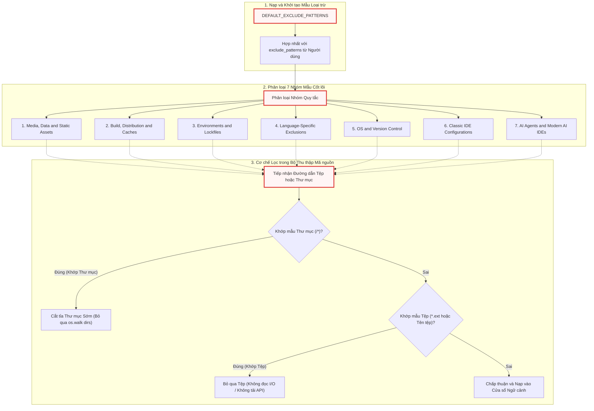

# exclude_patterns.py

> **Source:** `utils/exclude_patterns.py`

Tiếp nối từ [Chương 4 — crawl_local_files.py](04_crawl_local_files_py.md), nơi các cơ chế duyệt cây thư mục cục bộ và phân giải quy tắc `.gitignore` được triển khai chi tiết, module `utils/exclude_patterns.py` đóng vai trò là cơ sở tri thức tĩnh trung tâm định nghĩa các mẫu loại trừ tệp tin và thư mục mặc định cho toàn bộ hệ sinh thái thu thập mã nguồn của hệ thống. 

Mục tiêu thiết kế cốt lõi của module này là bảo vệ và tối ưu hóa **cửa sổ ngữ cảnh (context window)** của các mô hình ngôn ngữ lớn (LLM) được điều phối thông qua [Chương 2 — call_llm.py](02_call_llm_py.md). Bằng cách thiết lập một tập hợp gồm hơn 80 mẫu lọc glob (`fnmatch`), module ngăn chặn sự xâm nhập của các tệp nhị phân, dữ liệu đa phương tiện, môi trường ảo độc lập, tệp rác hệ điều hành, thư mục phụ thuộc cồng kềnh, cấu hình IDE nội bộ và siêu dữ liệu của các AI Agent thế hệ mới.

---

## Tổng quan Kỹ thuật & Kiến trúc Hệ thống

Trong các luồng xử lý mã nguồn tự động, việc nạp nguyên vẹn toàn bộ cây thư mục dự án sẽ gây ra hai vấn đề kỹ thuật nghiêm trọng:
1. **Tràn dung lượng ngữ cảnh & lãng phí chi phí tính toán**: Các tệp thư viện bên thứ ba (như `node_modules/*`, `venv/*`), tệp khóa phiên bản (`package-lock.json`, `Cargo.lock`) hay dữ liệu nhị phân/đa phương tiện chứa hàng triệu ký tự không mang giá trị kiến trúc logic, làm nghẽn bộ đếm token tại [Chương 8 — token_utils.py](08_token_utils_py.md).
2. **Nhiễu loạn suy luận (Hallucination/Noise)**: Sự xuất hiện của các tệp bản dựng (`dist/*`, `build/*`) hoặc tệp nhật ký thực thi (`*.log`) làm sai lệch khả năng phân tích kiến trúc của các nút phân tích trong [Chương 11 — nodes.py](11_nodes_py.md).

Module `exclude_patterns.py` giải quyết bài toán này bằng cách đóng gói hằng số tập hợp `DEFAULT_EXCLUDE_PATTERNS`. Tập hợp này được tiêu thụ trực tiếp bởi cả hai cổng thu thập dữ liệu:
* **Thu thập từ xa**: [Chương 3 — crawl_github_files.py](03_crawl_github_files_py.md) sử dụng các mẫu này để bỏ qua các nhánh cây thư mục (tree entries) và tệp tin qua GitHub REST API hoặc Git SSH.
* **Thu thập cục bộ**: [Chương 4 — crawl_local_files.py](04_crawl_local_files_py.md) tận dụng các mẫu kết thúc bằng đuôi `/*` để thực hiện kỹ thuật **cắt tỉa thư mục sớm (Early Directory Pruning)** ngay trong hàm `os.walk()`, giúp loại bỏ hoàn toàn chi phí I/O đĩa đối với các nhánh cây bị cấm.

### Cú pháp và Quy ước Mẫu (Glob Syntax)

Tập hợp `DEFAULT_EXCLUDE_PATTERNS` tuân thủ nghiêm ngặt cú pháp khớp mẫu của thư viện chuẩn `fnmatch`:
* **Mẫu thư mục (`directory/*`)**: Các mẫu kết thúc bằng ký tự `/*` (ví dụ: `node_modules/*`, `__pycache__/*`) chỉ định rằng toàn bộ cây thư mục con và các tệp bên trong thư mục đó phải bị loại bỏ ngay từ vòng lặp duyệt cấp cao nhất.
* **Mẫu mở rộng tệp (`*.ext`)**: Các mẫu bắt đầu bằng dấu sao (`*`) theo sau là phần mở rộng (ví dụ: `*.png`, `*.pyc`, `*.lock`) áp dụng cho tất cả các tệp ở bất kỳ độ sâu phân cấp nào trong cấu trúc dự án.
* **Mẫu định danh chính xác (`filename`)**: Khớp trực tiếp với tên tệp cụ thể ở cấp cơ sở (ví dụ: `.DS_Store`, `Thumbs.db`, `.cursorrules`).

---

## Luồng Đánh giá và Phân loại Mẫu Loại trừ

Sơ đồ dưới đây mô tả cấu trúc phân tầng của 7 nhóm mẫu loại trừ và cách các cổng thu thập dữ liệu (`crawl_local_files.py` và `crawl_github_files.py`) sử dụng tập hợp `DEFAULT_EXCLUDE_PATTERNS` để lọc dữ liệu mã nguồn:



---

## Hằng số Cấp Module (Module-Level Constants)

### `DEFAULT_EXCLUDE_PATTERNS`

**Độ hiển thị**: Công khai (Public Constant)  
**Kiểu dữ liệu**: `set[str]`

**Mô tả Kỹ thuật**:  
`DEFAULT_EXCLUDE_PATTERNS` là một tập hợp kiểu `set` chứa toàn bộ các chuỗi mẫu loại trừ mặc định. Việc sử dụng cấu trúc dữ liệu `set` trong Python đảm bảo:
1. **Tính bất biến và duy nhất (Uniqueness)**: Không tồn tại các phần tử trùng lặp, tối ưu hóa kích thước bộ nhớ RAM khi module được nạp vào không gian tên của tiến trình.
2. **Hiệu năng hợp nhất tập hợp ($O(N)$)**: Cho phép các bộ thu thập thực hiện thao tác toán tử hợp nhất (`DEFAULT_EXCLUDE_PATTERNS | user_exclude_patterns`) với độ phức tạp tuyến tính cực kỳ nhanh chóng trước khi bước vào chu kỳ quét hệ thống tệp.

Dưới đây là chi tiết cài đặt của từng nhóm quy tắc cấu thành nên `DEFAULT_EXCLUDE_PATTERNS`:

---

### Nhóm 1: Tài nguyên Đa phương tiện, Dữ liệu & Tệp tĩnh (Media, Data, and Static Assets)

```python
    # 1. Media, Data, and Static Assets
    "assets/*",
    "data/*",
    "images/*",
    "public/*",
    "static/*",
    "temp/*",
    "tmp/*",
    "media/*",
    "*.jpg",
    "*.jpeg",
    "*.png",
    "*.gif",
    "*.ico",
    "*.svg",
    "*.webp",
    "*.mp4",
    "*.webm",
    "*.mov",
    "*.mp3",
    "*.wav",
    "*.pdf",
    "*.doc",
    "*.docx",
    "*.xls",
    "*.xlsx",
    "*.ppt",
    "*.pptx",
    "*.zip",
    "*.tar",
    "*.gz",
    "*.rar",
    "*.7z",
```

**Chi tiết Thực thi & Cơ chế Hoạt động**:
* **Thư mục tài nguyên (`assets/*`, `data/*`, `images/*`, `public/*`, `static/*`, `temp/*`, `tmp/*`, `media/*`)**: Chứa các tệp tĩnh phục vụ giao diện người dùng hoặc dữ liệu tạm thời. Các tệp này thường có dung lượng lớn nhưng không chứa logic điều hướng hoặc thuật toán lõi của phần mềm.
* **Phần mở rộng hình ảnh và đồ họa (`*.jpg`, `*.jpeg`, `*.png`, `*.gif`, `*.ico`, `*.svg`, `*.webp`)**: Các định dạng raster và vector. Mặc dù `.svg` là định dạng XML dạng văn bản, nó thường chứa dữ liệu tọa độ dựng hình rất dài, gây lãng phí nghiêm trọng token của LLM mà không đóng góp vào việc hiểu logic nghiệp vụ.
* **Tệp âm thanh, video (`*.mp4`, `*.webm`, `*.mov`, `*.mp3`, `*.wav`)**: Hoàn toàn là tệp nhị phân đa phương tiện.
* **Tài liệu văn phòng (`*.pdf`, `*.doc`, `*.docx`, `*.xls`, `*.xlsx`, `*.ppt`, `*.pptx`)**: Các định dạng tài liệu nhị phân hoặc nén XML (như Office Open XML), không thể đọc trực tiếp bằng cơ chế giải mã UTF-8 thông thường và sẽ gây lỗi `UnicodeDecodeError` nếu cố gắng đọc dưới dạng văn bản thuần.
* **Tệp lưu trữ và nén (`*.zip`, `*.tar`, `*.gz`, `*.rar`, `*.7z`)**: Dữ liệu lưu trữ nén nhị phân, phải được bỏ qua để tránh gây treo parser.

---

### Nhóm 2: Tệp dựng, Phân phối & Bộ nhớ đệm Framework (Build, Distribution, and Framework Caches)

```python
    # 2. Build, Distribution, and Framework Caches
    "dist/*",
    "build/*",
    "out/*",
    "output/*",
    "target/*",
    "bin/*",
    "obj/*",
    ".next/*",
    ".nuxt/*",
    ".svelte-kit/*",
    ".expo/*",
    "docs/*",
    "test/*",
    "tests/*",
    "examples/*",
    "v1/*",
    "experimental/*",
    "deprecated/*",
    "misc/*",
    "legacy/*",
    "*.log",
    "*.bak",
    "*.tmp",
    "*.swp",
```

**Chi tiết Thực thi & Cơ chế Hoạt động**:
* **Thư mục phân phối và đầu ra biên dịch (`dist/*`, `build/*`, `out/*`, `output/*`, `target/*`, `bin/*`, `obj/*`)**: Chứa mã nguồn đã qua đóng gói (bundle), thu gọn (minify) hoặc các tệp nhị phân đã biên dịch của các ngôn ngữ như Rust (`target/*`), C#/C++ (`bin/*`, `obj/*`), JavaScript/TypeScript (`dist/*`, `build/*`).
* **Bộ nhớ đệm framework hiện đại (`.next/*`, `.nuxt/*`, `.svelte-kit/*`, `.expo/*`)**: Thư mục sinh tự động của các framework Next.js, NuxtJS, SvelteKit, và Expo. Các thư mục này chứa mã nguồn máy chủ trung gian, tệp phân tích cú pháp tĩnh và siêu dữ liệu định tuyến được tạo động trong quá trình phát triển.
* **Mã nguồn thử nghiệm, tài liệu & ví dụ (`docs/*`, `test/*`, `tests/*`, `examples/*`, `v1/*`, `experimental/*`, `deprecated/*`, `misc/*`, `legacy/*`)**: Nhằm tối ưu hóa trọng tâm của LLM vào kiến trúc phần mềm cốt lõi (Core Production Architecture), các tệp tài liệu mở rộng, ca kiểm thử đơn vị, thư viện ví dụ hoặc các nhánh mã cũ/không còn duy trì được chủ động lược bỏ khỏi luồng phân tích ngữ cảnh.
* **Tệp phụ trợ và nhật ký (`*.log`, `*.bak`, `*.tmp`, `*.swp`)**: Tệp ghi nhận trạng thái runtime, tệp sao lưu tự động và tệp hoán đổi (swap file) của các trình soạn thảo như Vim/Nano.

---

### Nhóm 3: Môi trường ảo, Thư viện Phụ thuộc & Tệp Khóa (Environments, Dependencies & Lockfiles)

```python
    # 3. Environments, Dependencies & Lockfiles
    "venv/*",
    ".venv/*",
    "env/*",
    ".env",
    ".env.*",
    "node_modules/*",
    "bower_components/*",
    "jspm_packages/*",
    "vendor/*",
    "packages/*",
    "*.lock",
    "package-lock.json",
    "yarn.lock",
    "pnpm-lock.yaml",
    "Cargo.lock",
    "Gemfile.lock",
    "poetry.lock",
    "mix.lock",
    "Pipfile.lock",
```

**Chi tiết Thực thi & Cơ chế Hoạt động**:
* **Môi trường ảo Python (`venv/*`, `.venv/*`, `env/*`)**: Cách ly toàn bộ thư viện bên thứ ba của Python. Nếu không loại trừ, `os.walk()` sẽ quét qua hàng chục nghìn tệp của hệ sinh thái `site-packages`.
* **Bảo mật biến môi trường (`.env`, `.env.*`)**: Ngăn chặn rò rỉ các bí mật bảo mật (Secrets, API Keys, Tokens, Passwords) vào cửa sổ ngữ cảnh của LLM hoặc nhật ký xuất bản ra ngoài hệ thống.
* **Quản lý gói phụ thuộc đa ngôn ngữ (`node_modules/*`, `bower_components/*`, `jspm_packages/*`, `vendor/*`, `packages/*`)**: Thư mục chứa mã nguồn thư viện cài đặt từ npm, Bower, JSPM, Composer (PHP `vendor/`) hoặc Monorepo packages.
* **Tệp khóa phiên bản phụ thuộc (Lockfiles)**: Bao gồm `*.lock`, `package-lock.json` (NPM), `yarn.lock` (Yarn), `pnpm-lock.yaml` (PNPM), `Cargo.lock` (Rust), `Gemfile.lock` (Ruby), `poetry.lock` (Poetry), `mix.lock` (Elixir), và `Pipfile.lock` (Pipenv). Các tệp này chứa hàm băm toàn vẹn (integrity hash) và cây phụ thuộc chi tiết với kích thước rất lớn, không mang giá trị cho việc phân tích luồng logic ứng dụng.

---

### Nhóm 4: Quy tắc Loại trừ Đặc thù theo Ngôn ngữ Lập trình (Language-Specific Exclusions)

```python
    # 4. Language-Specific Exclusions
    "__pycache__/*",
    "*.pyc",
    "*.pyo",
    "*.pyd",
    ".pytest_cache/*",
    ".ruff_cache/*",
    ".tox/*",
    ".coverage",
    "htmlcov/*",  # Python
    ".gradle/*",
    "*.class",
    "*.jar",
    "*.war",
    "*.ear",
    "*.nar",  # Java / JVM
    "*.o",
    "*.obj",
    "*.dll",
    "*.exe",
    "*.so",
    "*.dylib",
    "*.lib",
    "*.a",  # C/C++/Native
    "ios/Pods/*",
    "android/.gradle/*",
    "android/app/build/*",  # Mobile
```

**Chi tiết Thực thi & Cơ chế Hoạt động**:
* **Hệ sinh thái Python**: Bỏ qua bytecode đã biên dịch (`__pycache__/*`, `*.pyc`, `*.pyo`), thư viện động mở rộng C-Python (`*.pyd`), bộ nhớ đệm công cụ kiểm thử/linter (`.pytest_cache/*`, `.ruff_cache/*`, `.tox/*`) và báo cáo độ phủ mã nguồn (`.coverage`, `htmlcov/*`).
* **Hệ sinh thái JVM / Java**: Loại bỏ thư mục cấu hình và bộ nhớ đệm Gradle (`.gradle/*`), tệp bytecode trung gian (`*.class`), cùng các gói đóng gói thực thi/phân phối (`*.jar`, `*.war`, `*.ear`, `*.nar`).
* **Mã nguồn Native C / C++ / HĐH**: Lọc bỏ các tệp đối tượng nhị phân (`*.o`, `*.obj`), thư viện liên kết động (`*.dll`, `*.so`, `*.dylib`), tệp thực thi độc lập (`*.exe`), và thư viện liên kết tĩnh (`*.lib`, `*.a`).
* **Môi trường ứng dụng di động (Mobile - iOS & Android)**: Bỏ qua thư viện quản lý phụ thuộc CocoaPods (`ios/Pods/*`), tệp dựng và bộ đệm build của hệ điều hành Android (`android/.gradle/*`, `android/app/build/*`).

---

### Nhóm 5: Hệ điều hành & Hệ thống Quản lý Phiên bản (OS & Version Control)

```python
    # 5. OS & Version Control
    ".git/*",
    ".github/*",
    ".svn/*",
    ".hg/*",
    ".DS_Store",
    "Thumbs.db",
    "desktop.ini",
```

**Chi tiết Thực thi & Cơ chế Hoạt động**:
* **Cơ sở dữ liệu quản lý phiên bản (VCS Metadata)**: Triệt tiêu các thư mục cơ sở dữ liệu nội bộ của Git (`.git/*`), cấu hình luồng làm việc CI/CD (`.github/*`), Apache Subversion (`.svn/*`), và Mercurial (`.hg/*`). Việc bỏ qua `.git/*` là tối quan trọng vì đây là nơi chứa toàn bộ đối tượng nén dạng blob, commit tree và chỉ mục delta.
* **Tệp rác hệ điều hành (OS Artifacts)**: Loại bỏ các tệp lưu trữ siêu dữ liệu thư mục của macOS (`.DS_Store`), tệp lưu trữ bộ đệm hình thu nhỏ của Windows (`Thumbs.db`), và tệp cấu hình hiển thị thư mục của Windows Shell (`desktop.ini`).

---

### Nhóm 6: Môi trường Phát triển Tích hợp Truyền thống (Classic IDEs)

```python
    # 6. Classic IDEs
    ".vscode/*",
    ".idea/*",
    "*.iml",
    ".eclipse/*",
    ".settings/*",
    ".classpath",
    ".project",
    ".vs/*",
```

**Chi tiết Thực thi & Cơ chế Hoạt động**:
* **Visual Studio Code & Visual Studio**: Loại bỏ cài đặt môi trường cục bộ, cấu hình trình gỡ lỗi và phần mở rộng (`.vscode/*`, `.vs/*`).
* **Hệ sinh thái JetBrains (IntelliJ IDEA, PyCharm, WebStorm)**: Bỏ qua thư mục cấu hình dự án (`.idea/*`) và tệp mô tả module của IntelliJ (`*.iml`).
* **Hệ sinh thái Eclipse**: Loại bỏ các thư mục và tệp cấu hình không gian làm việc (`.eclipse/*`, `.settings/*`, `.classpath`, `.project`).

---

### Nhóm 7: AI Agents & Môi trường AI IDE Hiện đại (AI Agents & Modern AI IDEs)

```python
    # 7. AI Agents & Modern AI IDEs
    ".cursor/*",
    ".cursorrules",
    ".windsurf/*",
    ".windsurfrules",
    ".cline/*",
    ".clinerules",
    ".roo/*",
    ".roorules",
    ".agent/*",
    ".agents/*",
    ".continue/*",
    ".aide/*",
    ".gemini/*",
    ".antigravity/*",
    ".claude/*",
    ".copilot/*",
```

**Chi tiết Thực thi & Cơ chế Hoạt động**:
* **Trình soạn thảo AI Cốt lõi (Cursor, Windsurf)**: Loại bỏ các thư mục cấu hình và tệp quy tắc chỉ thị prompt riêng (`.cursor/*`, `.cursorrules`, `.windsurf/*`, `.windsurfrules`).
* **Tiện ích mở rộng AI Coding Assistants (Cline, Roo Code, Continue, Copilot, Claude)**: Loại trừ siêu dữ liệu và cấu hình tương tác của Cline (`.cline/*`, `.clinerules`), Roo Code (`.roo/*`, `.roorules`), Continue (`.continue/*`), Aide (`.aide/*`), GitHub Copilot (`.copilot/*`), Claude Code (`.claude/*`), Google Gemini CLI (`.gemini/*`), và các tác tử độc lập (`.agent/*`, `.agents/*`, `.antigravity/*`).
* **Mục tiêu kỹ thuật**: Đảm bảo hệ thống không bị xung đột prompt (Prompt Confusion) hoặc bị tác động bởi các chỉ thị hệ thống (system prompts/rules) được nhúng bởi các công cụ AI khác trong cùng thư mục mã nguồn.

---

## Ví dụ Tích hợp trong Mã nguồn Thực tế

Module `exclude_patterns.py` không chứa các hàm thực thi riêng lẻ, mà được thiết kế thuần túy như một kho lưu trữ mẫu tĩnh. Dưới đây là cách hai module thu thập dữ liệu tiêu thụ trực tiếp `DEFAULT_EXCLUDE_PATTERNS`:

### 1. Tích hợp trong `crawl_local_files.py`

Trong [Chương 4 — crawl_local_files.py](04_crawl_local_files_py.md), tập hợp `DEFAULT_EXCLUDE_PATTERNS` được nạp để lọc thư mục và tệp trong quá trình duyệt đĩa cứng:

```python
# Trích xuất từ utils/crawl_local_files.py
from utils.exclude_patterns import DEFAULT_EXCLUDE_PATTERNS

def crawl_local_files(
    root_dir: str,
    include_patterns: set[str] | None = None,
    exclude_patterns: set[str] | None = None,
    max_file_size: int = 100 * 1024,
) -> dict[str, dict[str, str]]:
    # ...
    # Hợp nhất tập hợp loại trừ mặc định với cấu hình do người dùng cung cấp
    all_exclude_patterns = DEFAULT_EXCLUDE_PATTERNS | (exclude_patterns or set())
    # ...
    for root, dirs, files in os.walk(root_dir, topdown=True):
        # Cắt tỉa thư mục sớm bằng cách chỉnh sửa danh sách dirs tại chỗ (in-place)
        dirs[:] = [
            d for d in dirs
            if not any(fnmatch(f"{d}/*", pat) for pat in all_exclude_patterns)
        ]
        # ...
```

*Đoạn mã trên minh họa việc sử dụng toán tử hợp nhất `|` của Python `set` để kết hợp các mẫu loại trừ người dùng truyền vào với `DEFAULT_EXCLUDE_PATTERNS`. Nhờ cơ chế `dirs[:] = [...]`, các thư mục như `node_modules` hay `.git` sẽ bị `os.walk()` bỏ qua ngay lập tức mà không tiêu tốn I/O đĩa.*

### 2. Tích hợp trong `crawl_github_files.py`

Trong [Chương 3 — crawl_github_files.py](03_crawl_github_files_py.md), `DEFAULT_EXCLUDE_PATTERNS` được dùng để thẩm định từng nút trên cây thư mục GitHub từ xa:

```python
# Trích xuất logic kiểm tra tệp từ utils/crawl_github_files.py
from utils.exclude_patterns import DEFAULT_EXCLUDE_PATTERNS

def should_include_file(
    file_path: str,
    include_patterns: set[str] | None,
    exclude_patterns: set[str] | None,
) -> bool:
    all_exclude = DEFAULT_EXCLUDE_PATTERNS | (exclude_patterns or set())
    for pattern in all_exclude:
        if fnmatch(file_path, pattern):
            return False
    return True
```

*Đoạn mã thể hiện hàm helper kiểm tra tệp tin từ xa trước khi tiến hành gửi yêu cầu HTTP tải nội dung thô (Raw text) hoặc giải mã Base64, giúp tiết kiệm triệt để hạn ngạch (Rate Limit) của GitHub REST API.*

---

## Bảng Tra cứu Toàn diện Danh mục Mẫu Loại trừ

Bảng dưới đây tổng hợp đầy đủ các nhóm mẫu được định nghĩa trong `DEFAULT_EXCLUDE_PATTERNS`, cùng mục đích kỹ thuật và phạm vi ảnh hưởng của chúng:

| Phân nhóm Mẫu | Số lượng Mẫu | Ví dụ Tiêu biểu | Mục tiêu Kỹ thuật |
| :--- | :--- | :--- | :--- |
| **1. Media & Static Assets** | 32 | `assets/*`, `*.png`, `*.mp4`, `*.pdf`, `*.zip` | Chặn tệp nhị phân, dữ liệu đa phương tiện, tài liệu văn phòng và tệp nén không thể đọc dưới dạng mã nguồn thuần UTF-8. |
| **2. Build & Caches** | 24 | `dist/*`, `build/*`, `.next/*`, `docs/*`, `*.log` | Ngăn chặn nạp mã đã đóng gói/thu gọn, bộ nhớ đệm dựng của framework và tệp nhật ký runtime. |
| **3. Environments & Locks** | 19 | `node_modules/*`, `.venv/*`, `.env`, `package-lock.json` | Bảo vệ biến môi trường nhạy cảm, loại bỏ các thư viện phụ thuộc hàng triệu dòng và tệp khóa phiên bản cồng kềnh. |
| **4. Language-Specific** | 24 | `__pycache__/*`, `*.class`, `*.o`, `ios/Pods/*` | Loại trừ bytecode, tệp nhị phân đối tượng máy, thư viện liên kết động/tĩnh và bộ nhớ đệm công cụ kiểm thử. |
| **5. OS & VCS** | 7 | `.git/*`, `.github/*`, `.DS_Store`, `Thumbs.db` | Cắt tỉa cây dữ liệu nội bộ của hệ thống quản lý phiên bản và tệp rác hệ điều hành. |
| **6. Classic IDEs** | 8 | `.vscode/*`, `.idea/*`, `.eclipse/*`, `*.iml` | Loại bỏ cấu hình không gian làm việc cục bộ của các trình soạn thảo mã nguồn truyền thống. |
| **7. AI Agents & IDEs** | 16 | `.cursor/*`, `.cursorrules`, `.cline/*`, `.gemini/*` | Tránh xung đột chỉ thị hệ thống và ngăn rò rỉ ngữ cảnh của các công cụ AI coding assistant khác. |

---

## Xem Thêm (See Also)

* [Chương 1 — \_\_init\_\_.py](01___init___py.md): Khởi tạo gói hạ tầng `utils` và cấu trúc không gian tên.
* [Chương 3 — crawl_github_files.py](03_crawl_github_files_py.md): Module thu thập mã nguồn GitHub từ xa sử dụng `DEFAULT_EXCLUDE_PATTERNS` để lọc các nút trên Git tree.
* [Chương 4 — crawl_local_files.py](04_crawl_local_files_py.md): Module thu thập mã nguồn cục bộ áp dụng `DEFAULT_EXCLUDE_PATTERNS` trong kỹ thuật cắt tỉa `os.walk()` sớm.
* [Chương 8 — token_utils.py](08_token_utils_py.md): Tiện ích đếm token nhận dữ liệu đã qua tinh lọc để tối ưu hóa cửa sổ ngữ cảnh LLM.

