# output.py

> **Source:** `utils/output.py`

Tiếp nối từ cấu trúc quy tắc lọc tệp tĩnh được thiết lập trong [Chương 5 — exclude_patterns.py](05_exclude_patterns_py.md), module `output.py` đảm nhận vai trò là hệ thống con trung tâm chịu trách nhiệm quản lý, định dạng và điều phối toàn bộ luồng thông tin giao tiếp ra giao diện dòng lệnh (CLI stdout) cũng như hệ thống ghi nhật ký tệp tin (File Logging) xuyên suốt vòng đời vận hành của ứng dụng.

---

## 1. Tổng Quan Kỹ Thuật (Technical Overview)

Module `utils/output.py` cung cấp giải pháp xuất dữ liệu tập trung (Centralized Output Utility), tích hợp cơ chế bản địa hóa đa ngôn ngữ động (Internationalization - i18n), định dạng màu sắc dòng lệnh (ANSI Color Formatting), và phân phối nhật ký đa kênh (Multi-target Dispatching). Thành phần này giải quyết triệt để vấn đề phân mảnh thông điệp người dùng và cô lập dữ liệu ghi vết bằng cách tập trung toàn bộ chuỗi văn bản giao diện vào một tệp dữ liệu duy nhất (`utils/strings.csv`).

Kiến trúc nội bộ của module vận hành dựa trên bốn trụ cột kỹ thuật cốt lõi:

1. **Bản địa hóa dữ liệu động (Dynamic Localization & i18n):** Toàn bộ chuỗi hiển thị được tách biệt khỏi mã logic và quản lý trong tệp `strings.csv`. Khi khởi tạo, hệ thống tự động tải và lập chỉ mục chuỗi theo ngôn ngữ mục tiêu (ví dụ: `Vietnamese`, `English`).
2. **Tự động dịch thuật qua mô hình ngôn ngữ (Autonomous LLM Translation Backfill):** Khi phát hiện thiếu chuỗi dịch hoặc khi người dùng yêu cầu một ngôn ngữ mới chưa từng có cột dữ liệu trong CSV, module sẽ kích hoạt quy trình thu thập các khóa còn thiếu, nạp mẫu prompt `prompts/common/translate_strings.md`, gọi hàm suy luận `call_llm()` từ module [Chương 2 — call_llm.py](02_call_llm_py.md) để dịch toàn bộ chuỗi theo lô (batch), và tự động cập nhật ghi đè dữ liệu mới vào `strings.csv` với bảng mã `utf-8-sig`.
3. **Định tuyến hiển thị & Kiểm soát kiểu dáng (Multi-target Routing & Styling):** Module định nghĩa bảng ánh xạ cấp độ thông báo (`PROGRESS`, `SUCCESS`, `WARNING`, `ERROR`, `INFO`, `DEBUG`, `FILE_WRITE`, `UI`) tương ứng với mã màu ANSI (qua bảng tra cứu `COLORS`) và các cấp độ ghi log chuẩn của Python (qua `LOG_LEVELS`). Mỗi thông điệp có thể được định tuyến độc lập tới màn hình console (`STDOUT`), tệp log (`LOG`), hoặc đồng thời cả hai (`BOTH`).
4. **Quản lý nhật ký phiên chạy có cấu trúc (Structured Invocation Logging):** Cung cấp hàm cấu hình `configure_logging()` nhằm khởi tạo tệp nhật ký riêng biệt cho từng phiên thực thi theo định dạng `logs/{project}_{mode}_{YYYYMMDD_HHmmss}.log`, tự động xóa các handler rác (như `NullHandler`) và ghi kèm siêu dữ liệu phiên chạy (metadata header) chuẩn hóa.

---

## 2. Sơ Đồ Kiến Trúc & Luồng Thực Thi (Architecture Flowchart)

Sơ đồ dưới đây minh họa toàn bộ vòng đời khởi tạo hệ thống xuất dữ liệu, quy trình tự động bù đắp bản dịch qua LLM, cùng cơ chế định tuyến và phát thông điệp tới console và tệp log.

```mermaid
flowchart TD
    subgraph Subgraph_Init["Quy Trình Khởi Tạo & Bản Địa Hóa"]
        initEntry["Bắt đầu: init()"]
        setGlobals["Thiết lập biến toàn cục: language, csv_path, use_cache"]
        loadStringsCall["Gọi _load_strings() nạp dữ liệu từ strings.csv"]
        checkEnglish{"Ngôn ngữ là English?"}
        checkMissing{"Tồn tại chuỗi thiếu bản dịch?"}
        loadPrompt["Đọc prompt mẫu: translate_strings.md"]
        callLLM["Gọi call_llm() dịch chuỗi theo lô"]
        parseJSON{"Bóc tách JSON từ phản hồi LLM?"}
        writeCSV["Gọi _write_translations_to_csv() lưu vào CSV"]
        reloadStrings["Tái nạp chuỗi: _load_strings()"]
        warnJSON["Cảnh báo: Phản hồi không phải JSON, dùng tiếng Anh"]
        warnLLM["Cảnh báo ngoại lệ: Dịch thất bại, dùng tiếng Anh"]
        initDone["Hoàn tất khởi tạo Output Engine"]
    end

    subgraph Subgraph_Emit["Quy Trình Phát Thông Điệp: emit() & emit_raw()"]
        emitEntry["Điểm nhập: emit() hoặc emit_raw()"]
        lookupKey{"Khóa chuỗi tồn tại trong _strings?"}
        fallbackUnknown["In cảnh báo [UNKNOWN STRING: key]"]
        safeFormat["Thực thi _format_safe() ghép biến và suffix"]
        resolveColor["Tra cứu mã màu ANSI từ bảng COLORS"]
        checkDest{"Kiểm tra cờ định tuyến dest"}
        printStdout["Xuất stdout với mã màu ANSI và RESET"]
        logFile["Ghi log qua _logger với cấp độ từ LOG_LEVELS"]
        emitDone["Kết thúc phát thông điệp"]
    end

    initEntry --> setGlobals
    setGlobals --> loadStringsCall
    loadStringsCall --> checkEnglish
    checkEnglish -- Đúng --> initDone
    checkEnglish -- Sai --> checkMissing
    checkMissing -- Không --> initDone
    checkMissing -- Có --> loadPrompt
    loadPrompt --> callLLM
    callLLM --> parseJSON
    parseJSON -- Thành công --> writeCSV
    writeCSV --> reloadStrings
    reloadStrings --> initDone
    parseJSON -- Thất bại --> warnJSON
    warnJSON --> initDone
    callLLM -- Lỗi ngoại lệ --> warnLLM
    warnLLM --> initDone

    emitEntry --> lookupKey
    lookupKey -- Không --> fallbackUnknown
    lookupKey -- Có --> safeFormat
    safeFormat --> resolveColor
    resolveColor --> checkDest
    checkDest -- BOTH hoặc STDOUT --> printStdout
    checkDest -- BOTH hoặc LOG --> logFile
    printStdout --> emitDone
    logFile --> emitDone

    classDef entryNode stroke:#d33,stroke-width:3px,fill:#fff5f5;
    class initEntry entryNode
    class emitEntry entryNode
```



---

## 3. Hằng Số & Biến Trạng Thái Module (Constants & Module State)

### 3.1. Hằng Số Màu Sắc & Cấp Độ Ghi Log

```python
# ---------------------------------------------------------------------------
# ANSI color map: LEVEL → color code
# ---------------------------------------------------------------------------
COLORS = {
    "PROGRESS": "\033[96m",  # Cyan — LLM calls, active steps
    "SUCCESS": "\033[92m",  # Green — completions, cache hits
    "WARNING": "\033[93m",  # Yellow — warnings, capacity alerts
    "ERROR": "\033[91m",  # Red — errors, failures
    "INFO": "",  # Plain — config, counts, labels
    "DEBUG": "\033[90m",  # Gray — skipped files, debug
    "FILE_WRITE": "",  # Plain — "  - Wrote {path}" messages
    "UI": "",  # N/A — used in generated docs, never printed
}
RESET = "\033[0m"

# Logging level map: output LEVEL → Python logging level
LOG_LEVELS = {
    "PROGRESS": logging.INFO,
    "SUCCESS": logging.INFO,
    "WARNING": logging.WARNING,
    "ERROR": logging.ERROR,
    "INFO": logging.INFO,
    "DEBUG": logging.DEBUG,
    "FILE_WRITE": logging.DEBUG,
}
```

* `COLORS` (`dict[str, str]`): Ánh xạ tên cấp độ thông điệp logic sang mã điều khiển thoát ANSI (ANSI escape sequences). Cung cấp khả năng hiển thị trực quan trên terminal:
  * `PROGRESS` (`\033[96m` - Cyan): Dùng cho các tiến trình đang thực thi, lời gọi LLM.
  * `SUCCESS` (`\033[92m` - Green): Dùng cho các tác vụ hoàn thành, trúng cache (`CACHE HIT`).
  * `WARNING` (`\033[93m` - Yellow): Cảnh báo suy giảm hiệu năng, vượt ngưỡng dung lượng.
  * `ERROR` (`\033[91m` - Red): Thông báo lỗi hệ thống, thất bại mạng hoặc dữ liệu không hợp lệ.
  * `DEBUG` (`\033[90m` - Gray): Hiển thị thông tin gỡ lỗi, tệp tin bị bỏ qua.
  * `INFO`, `FILE_WRITE`, `UI` (`""`): Văn bản thuần, không áp dụng màu sắc.
* `RESET` (`str`): Chuỗi thoát `\033[0m` có chức năng hoàn nguyên màu văn bản của terminal về trạng thái mặc định, ngăn chặn hiện tượng lem màu sang các dòng lệnh tiếp theo.
* `LOG_LEVELS` (`dict[str, int]`): Ánh xạ cấp độ thông điệp logic sang các hằng số cấp độ chuẩn của module `logging` của Python (`logging.INFO`, `logging.WARNING`, `logging.ERROR`, `logging.DEBUG`).

---

### 3.2. Biến Trạng Thái Cấp Module (Module-Level State)

```python
# ---------------------------------------------------------------------------
# Module state
# ---------------------------------------------------------------------------
_strings = {}  # {key: {"text": str, "level": str, "dest": str}}
_language = "English"  # Capitalized for display (e.g., "Vietnamese")
_lang_col = "english"  # Lowercase for CSV column lookup
_logger = logging.getLogger("llm_logger")
_csv_path = None
_use_cache = True
_thinking_level = None
```

* `_strings` (`dict[str, dict[str, str]]`): Bảng băm bộ nhớ đệm lưu trữ toàn bộ các chuỗi giao diện được nạp từ CSV. Mỗi phần tử có cấu trúc:
  ```python
  {"text": str, "level": str, "dest": str}
  ```
* `_language` (`str`): Tên ngôn ngữ đích được viết hoa chữ cái đầu (ví dụ: `"Vietnamese"`), dùng trong hiển thị nhật ký và tạo prompt dịch thuật.
* `_lang_col` (`str`): Tên cột ngôn ngữ dạng chữ thường (ví dụ: `"vietnamese"`), dùng để khớp khóa cột trong tệp `strings.csv`.
* `_logger` (`logging.Logger`): Thực thể logger toàn cục định danh `"llm_logger"`, tiếp nhận các bản ghi nhật ký của toàn bộ hệ thống.
* `_csv_path` (`str | None`): Đường dẫn tuyệt đối dẫn tới tệp cơ sở dữ liệu chuỗi `utils/strings.csv`.
* `_use_cache` (`bool`): Cờ kiểm soát việc sử dụng cache khi thực hiện các yêu cầu dịch thuật chuỗi qua LLM.
* `_thinking_level` (`str | int | None`): Cấu hình mức độ suy luận (thinking level) truyền cho LLM trong tiến trình dịch thuật.

---

## 4. Các Hàm Cấp Module (Module-Level Functions)

### `init()`
**Visibility**: Public
**Signature**: `def init(language: str = "english", use_cache: bool = True, thinking_level: int | str | None = None) -> None:`

**Description**: Khởi tạo toàn bộ hệ thống xuất dữ liệu và bản địa hóa của ứng dụng. Hàm này thiết lập đường dẫn tệp `strings.csv`, chuẩn hóa tên ngôn ngữ mục tiêu, nạp bảng chuỗi văn bản vào bộ nhớ thông qua `_load_strings()`, và tự động kích hoạt tiến trình bù đắp bản dịch `_auto_translate()` nếu phát hiện có chuỗi chưa được chuyển ngữ sang ngôn ngữ đích. Hàm bắt buộc phải được gọi từ điểm nhập `main()` ngay sau khi phân tích cú pháp tham số dòng lệnh và trước bất kỳ lệnh `emit()` nào.

**Parameters**:
* `language` (`str`, mặc định `"english"`): Tên ngôn ngữ đích cần áp dụng cho giao diện (ví dụ: `"Vietnamese"`, `"English"`).
* `use_cache` (`bool`, mặc định `True`): Xác định xem các lời gọi LLM phục vụ dịch chuỗi có sử dụng bộ nhớ đệm cục bộ hay không.
* `thinking_level` (`int | str | None`, mặc định `None`): Tham số điều khiển độ sâu suy luận khi gọi LLM cho tác vụ dịch thuật.

**Returns**:
* `None`: Hàm chỉ thay đổi trạng thái toàn cục của module.

**Raises**:
* Không trực tiếp phát sinh ngoại lệ; các ngoại lệ trong tiến trình con được xử lý phòng thủ nội bộ.

**Example**:
```python
# Trích xuất từ cách sử dụng chuẩn trong module:
from utils.output import init as init_output, emit

init_output(language="english")          # Load strings, set language
emit("LLM_CALL_WRITE_CHAPTER", chapter_num=1, name="flow")  # Print + log
```

```python
def init(language="english", use_cache=True, thinking_level=None):
    """Initialize the output system: load strings.csv, set language, auto-translate missing.

    Must be called from main() after parsing CLI arguments but before any emit() calls.

    Args:
        language: Target language name (e.g., "Vietnamese").
        use_cache: Whether LLM caching is enabled (passed to translation calls).
        thinking_level: LLM thinking level (passed to translation calls).
    """
    global _language, _lang_col, _csv_path, _use_cache, _thinking_level
    _language = language.capitalize()
    _lang_col = language.lower()
    _csv_path = os.path.join(os.path.dirname(os.path.abspath(__file__)), "strings.csv")
    _use_cache = use_cache
    _thinking_level = thinking_level
    _load_strings()
    _auto_translate()
```

Hàm thực thi việc gán các biến module toàn cục bao gồm chuyển đổi `_language` sang dạng viết hoa (`capitalize()`) phục vụ hiển thị và `_lang_col` sang dạng viết thường (`lower()`) để đối soát cột dữ liệu CSV. Đường dẫn `_csv_path` được xác định tuyệt đối dựa trên vị trí của tệp `output.py`. Sau khi thiết lập trạng thái, tiến trình đọc chuỗi tĩnh và tự động dịch chuỗi thiếu sẽ chạy tuần tự, đảm bảo khi kết thúc hàm `init()`, toàn bộ các chuỗi giao diện thuộc ngôn ngữ yêu cầu đã sẵn sàng trong bộ nhớ.

---

### `emit()`
**Visibility**: Public
**Signature**: `def emit(key: str, suffix: str = "", **kwargs: Any) -> None:`

**Description**: Phát một chuỗi văn bản đã được bản địa hóa ra màn hình console (stdout) và/hoặc ghi vào tệp log của hệ thống dựa trên khóa chuỗi (`key`) được định nghĩa trong `strings.csv`. Hàm thực hiện tra cứu cấu hình hiển thị của khóa (bao gồm mẫu văn bản, cấp độ nghiêm trọng `level`, và đích phát `dest`), sau đó áp dụng cơ chế thay thế biến an toàn thông qua `_format_safe()`. Nếu có tham số `suffix`, chuỗi hậu tố này sẽ được nối thêm vào cuối thông điệp trước khi áp dụng mã màu ANSI tương ứng.

**Parameters**:
* `key` (`str`): Định danh duy nhất của chuỗi trong tệp `strings.csv` (ví dụ: `"LLM_CALL_WRITE_CHAPTER"`).
* `suffix` (`str`, mặc định `""`): Chuỗi văn bản bổ sung được nối vào cuối thông điệp (thường dùng để hiển thị chi tiết số lượng token hoặc thời gian thực thi).
* `**kwargs` (`Any`): Danh sách các biến đặt chỗ (placeholders) cần thay thế vào mẫu chuỗi (ví dụ: `chapter_num=1`, `name="flow"`).

**Returns**:
* `None`: Thực hiện xuất dữ liệu ra console/log, không trả về giá trị.

**Raises**:
* Không phát sinh ngoại lệ. Nếu `key` không tồn tại trong từ điển chuỗi `_strings`, hàm in thông báo dự phòng `[UNKNOWN STRING: {key}]` ra stdout để tránh nuốt lỗi âm thầm.

**Example**:
```python
# Trích xuất từ tài liệu hướng dẫn và mã nguồn:
from utils.output import emit

emit("LLM_CALL_WRITE_CHAPTER", chapter_num=1, name="flow")
```

```python
def emit(key, suffix="", **kwargs):
    """Emit a translatable string to stdout and/or log file.

    Args:
        key: String key from strings.csv (e.g., "LLM_CALL_WRITE_CHAPTER").
        suffix: Optional extra text appended after the main message (e.g., token breakdown).
        **kwargs: Variables to substitute into the string template.
    """
    entry = _strings.get(key)
    if not entry:
        # Fallback for unknown keys — print raw so nothing is silently lost
        print(f"[UNKNOWN STRING: {key}]")
        return

    text = _format_safe(entry["text"], kwargs)
    if suffix:
        text = text + suffix

    level = entry["level"]
    dest = entry["dest"]
    color = COLORS.get(level, "")
    reset = RESET if color else ""

    if dest in ("BOTH", "STDOUT"):
        print(f"{color}{text}{reset}")
    if dest in ("BOTH", "LOG"):
        _logger.log(LOG_LEVELS.get(level, logging.INFO), text)
```

Khi được gọi, hàm kiểm tra sự tồn tại của `entry` trong bộ nhớ đệm `_strings`. Cơ chế định tuyến `dest` phân tách luồng xuất thành hai kênh độc lập: nếu `dest` là `"BOTH"` hoặc `"STDOUT"`, nội dung sẽ được bọc trong chuỗi thoát ANSI `color` và `reset` rồi in ra màn hình qua `print()`; nếu `dest` là `"BOTH"` hoặc `"LOG"`, nội dung (dưới dạng văn bản thuần không chứa mã ANSI) sẽ được gửi tới `_logger` với cấp độ tương ứng tra từ bảng `LOG_LEVELS`.

---

### `emit_raw()`
**Visibility**: Public
**Signature**: `def emit_raw(level: str, text: str, dest: str = "BOTH") -> None:`

**Description**: Phát trực tiếp một chuỗi văn bản tự do đã được định dạng trước với cấp độ hiển thị và kiểu dáng màu sắc tường minh mà không cần tra cứu từ tệp `strings.csv`. Hàm này chuyên dụng cho các cấu trúc đầu ra động, các khối dữ liệu cấu trúc phức tạp, danh sách tệp được đánh số, bảng tổng kết thu thập tệp (crawl summary table), hoặc thông báo trạng thái của tiến trình bản địa hóa i18n.

**Parameters**:
* `level` (`str`): Cấp độ nghiêm trọng logic (`"PROGRESS"`, `"SUCCESS"`, `"WARNING"`, `"ERROR"`, `"INFO"`, `"DEBUG"`, `"FILE_WRITE"`).
* `text` (`str`): Nội dung chuỗi văn bản cần hiển thị và/hoặc ghi log.
* `dest` (`str`, mặc định `"BOTH"`): Đích phát thông điệp (`"BOTH"`, `"STDOUT"`, hoặc `"LOG"`).

**Returns**:
* `None`: Không trả về dữ liệu.

**Raises**:
* Không phát sinh ngoại lệ.

**Example**:
```python
# Trích xuất từ mã nguồn utils/output.py:
from utils.output import emit_raw

emit_raw("WARNING", "Custom message")
emit_raw("PROGRESS", "[i18n] Calling LLM to translate missing strings...")
```

```python
def emit_raw(level, text, dest="BOTH"):
    """Emit a pre-formatted string with explicit level styling.

    Use for dynamic/structural output that doesn't come from strings.csv
    (e.g., numbered file lists, batch details, crawl summary tables).
    """
    color = COLORS.get(level, "")
    reset = RESET if color else ""

    if dest in ("BOTH", "STDOUT"):
        print(f"{color}{text}{reset}")
    if dest in ("BOTH", "LOG"):
        _logger.log(LOG_LEVELS.get(level, logging.INFO), text)
```

`emit_raw()` cung cấp một giao diện gọn nhẹ cho các module khác khi cần in ấn dữ liệu động được tạo ra trong thời gian chạy (runtime). Hàm tra cứu trực tiếp mã màu từ `COLORS` và cấp độ từ `LOG_LEVELS`, bỏ qua các bước tìm kiếm bảng băm `_strings` và thay thế biến mẫu, giúp tối ưu hóa hiệu năng cho các vòng lặp in ấn danh sách tệp tin lớn.

---

### `get()`
**Visibility**: Public
**Signature**: `def get(key: str, **kwargs: Any) -> str:`

**Description**: Truy xuất nội dung chuỗi văn bản đã được bản địa hóa và áp dụng phép nội suy biến mà không in ra console cũng như không ghi vào tệp nhật ký. Hàm này được thiết kế chuyên biệt để lấy các chuỗi nhãn giao diện (UI labels), tiêu đề chương mục, hoặc các chuỗi cấu trúc cần nhúng trực tiếp vào các tệp tài liệu Markdown được sinh tự động (như `index.md`).

**Parameters**:
* `key` (`str`): Định danh chuỗi trong `strings.csv` (ví dụ: `"UI_TUTORIAL"`).
* `**kwargs` (`Any`): Các cặp khóa-giá trị dùng để điền vào các biến đặt chỗ `{placeholder}` trong chuỗi.

**Returns**:
* `str`: Chuỗi văn bản đã dịch và điền tham số hoàn chỉnh. Nếu không tìm thấy khóa, hàm trả về chính giá trị của `key` như một cơ chế dự phòng an toàn.

**Raises**:
* Không phát sinh ngoại lệ.

**Example**:
```python
# Trích xuất từ mã nguồn utils/output.py:
from utils.output import get

label = get("UI_TUTORIAL")
```

```python
def get(key, **kwargs):
    """Get a translated string without printing or logging.

    Use for UI strings embedded in generated markdown (index.md headings, etc.).
    Returns the raw translated text with variable substitution applied.
    """
    entry = _strings.get(key)
    if not entry:
        return key  # Fallback: return the key itself
    return _format_safe(entry["text"], kwargs)
```

Hàm thực hiện truy xuất khóa trong từ điển `_strings`. Nếu khóa không tồn tại, hàm trả về chính chuỗi `key` nhằm ngăn ngừa ứng dụng bị gián đoạn do lỗi `KeyError`. Khi tìm thấy dữ liệu, chuỗi mẫu được chuyển tiếp qua hàm trợ giúp `_format_safe(entry["text"], kwargs)` để thực hiện phép thế chuỗi an toàn.

---

### `configure_logging()`
**Visibility**: Public
**Signature**: `def configure_logging(project_name: str = "project", mode: str = "tutorial") -> str:`

**Description**: Cấu hình hệ thống ghi nhật ký dựa trên tệp (file-based logging) cho phiên thực thi hiện tại. Hàm tạo thư mục nhật ký (mặc định lấy từ biến môi trường `LOG_DIR` hoặc thư mục `"logs"`), chuẩn hóa tên dự án và chế độ chạy thành chuỗi an toàn cho hệ thống tệp, sau đó tạo một tệp log có gắn nhãn thời gian theo định dạng `logs/{safe_project}_{safe_mode}_{YYYYMMDD_HHmmss}.log`. Tất cả các handler hiện có trên `_logger` (như `NullHandler`) sẽ bị xóa bỏ và thay thế bằng một `FileHandler` mới với định dạng thời gian chuẩn hóa.

**Parameters**:
* `project_name` (`str`, mặc định `"project"`): Tên của dự án đang được xử lý.
* `mode` (`str`, mặc định `"tutorial"`): Chế độ vận hành của hệ thống (ví dụ: `"tutorial"`, `"api-reference"`).

**Returns**:
* `str`: Đường dẫn tuyệt đối hoặc tương đối dẫn tới tệp log vừa được khởi tạo thành công.

**Raises**:
* `OSError`: Có thể phát sinh nếu hệ thống tệp không cho phép tạo thư mục hoặc ghi tệp (không được bắt nội bộ để báo hiệu lỗi quyền truy cập).

**Example**:
```python
# Khởi tạo ghi nhật ký cho một phiên làm việc:
from utils.output import configure_logging

log_path = configure_logging(project_name="my_repo", mode="tutorial")
```

```python
def configure_logging(project_name="project", mode="tutorial"):
    """Configure file-based logging for this run.

    Creates a new log file per invocation:
        logs/{project_name}_{mode}_{YYYYMMDD_HHmmss}.log

    Must be called from main() after parsing CLI arguments.
    """
    from datetime import datetime

    log_directory = os.getenv("LOG_DIR", "logs")
    os.makedirs(log_directory, exist_ok=True)

    safe_project = "".join(c if c.isalnum() or c in "-_." else "_" for c in project_name)
    safe_mode = mode.replace("-", "_")
    timestamp = datetime.now().strftime("%Y%m%d_%H%M%S")
    log_file = os.path.join(log_directory, f"{safe_project}_{safe_mode}_{timestamp}.log")

    # Remove any existing handlers (e.g., NullHandler) and add the file handler
    _logger.handlers.clear()
    file_handler = logging.FileHandler(log_file, encoding="utf-8")
    file_handler.setFormatter(logging.Formatter("%(asctime)s - %(levelname)s - %(message)s"))
    _logger.addHandler(file_handler)

    # Log run metadata at the start of every log file
    _logger.info(f"{'=' * 80}")
    _logger.info(f"RUN STARTED | project={project_name} | mode={mode} | timestamp={timestamp}")
    _logger.info(f"Log file: {log_file}")
    _logger.info(f"{'=' * 80}")

    return log_file
```

Hàm sử dụng biểu thức lọc ký tự `"".join(c if c.isalnum() or c in "-_." else "_" for c in project_name)` nhằm đảm bảo tên tệp không chứa các ký tự đặc biệt gây lỗi trên hệ điều hành Windows hoặc POSIX. Sau khi gắn `FileHandler` với bộ định dạng `"%(asctime)s - %(levelname)s - %(message)s"`, hàm chủ động ghi một khối siêu dữ liệu khởi động dài 80 ký tự (`RUN STARTED`) để phân tách rõ ràng giữa các lần chạy trong kho lưu trữ nhật ký.

---

### `_format_safe()`
**Visibility**: Private
**Signature**: `def _format_safe(template: str, kwargs: dict[str, Any]) -> str:`

**Description**: Thực hiện nội suy và thế biến an toàn vào chuỗi định dạng `template.format(**kwargs)`. Hàm này bọc lệnh `format()` trong khối xử lý ngoại lệ phòng thủ để bắt các lỗi cú pháp định dạng phổ biến như thiếu khóa (`KeyError`), tràn chỉ số (`IndexError`), hoặc sai định dạng (`ValueError`). Khi phát sinh lỗi, hàm trả về nguyên bản chuỗi mẫu `template` mà không làm sập luồng thực thi của ứng dụng.

**Parameters**:
* `template` (`str`): Chuỗi văn bản mẫu chứa các thẻ vị trí dạng `{placeholder}`.
* `kwargs` (`dict[str, Any]`): Từ điển các biến cần điền vào mẫu.

**Returns**:
* `str`: Chuỗi văn bản sau khi đã điền đầy đủ các giá trị biến, hoặc trả về nguyên trạng `template` nếu quá trình thế biến gặp lỗi.

**Raises**:
* Không phát sinh ngoại lệ (đã bắt toàn bộ `KeyError`, `IndexError`, `ValueError`).

**Example**:
```python
# Trích xuất nội bộ trong _format_safe:
template = "Wrote {path}"
result = _format_safe(template, {"path": "docs/01.md"})
```

```python
def _format_safe(template, kwargs):
    """Apply .format(**kwargs) with graceful fallback on missing keys."""
    try:
        return template.format(**kwargs)
    except (KeyError, IndexError, ValueError):
        return template
```

Hàm đóng vai trò là cơ chế phòng vệ thiết yếu cho hệ thống đa ngôn ngữ: khi một chuỗi dịch máy hoặc dịch thủ công bị lỗi thiếu placeholder (ví dụ LLM dịch làm mất `{count}` hoặc viết sai tên biến), hàm ngăn chặn sự cố sập ứng dụng và duy trì sự ổn định cho toàn bộ pipeline sinh tài liệu.

---

### `_load_strings()`
**Visibility**: Private
**Signature**: `def _load_strings() -> None:`

**Description**: Đọc và nạp toàn bộ định nghĩa chuỗi từ tệp `utils/strings.csv` vào biến bộ nhớ đệm `_strings`. Hàm sử dụng bộ đọc `csv.DictReader` với bảng mã `utf-8-sig` để tự động loại bỏ ký tự Byte Order Mark nếu có. Đối với mỗi dòng dữ liệu, hàm đọc khóa `STRING_KEY`, cấp độ `LEVEL`, đích phát `DEST`, và ưu tiên lấy bản dịch tương ứng với cột ngôn ngữ hiện tại `_lang_col`. Nếu cột ngôn ngữ hiện tại bị bỏ trống, hàm tự động dùng giá trị từ cột `english` làm dự phòng (fallback).

**Parameters**:
* Không nhận tham số trực tiếp (sử dụng biến trạng thái module `_csv_path`, `_lang_col`, `_language`).

**Returns**:
* `None`: Cập nhật trực tiếp vào từ điển toàn cục `_strings`.

**Raises**:
* Không phát sinh ngoại lệ; nếu `_csv_path` không tồn tại, hàm lặng lẽ thoát sớm mà không thao tác.

**Example**:
```python
# Trích xuất từ cách triệu gọi nội bộ trong init():
_csv_path = os.path.join(os.path.dirname(os.path.abspath(__file__)), "strings.csv")
_load_strings()
```

```python
def _load_strings():
    """Load all strings from strings.csv."""
    global _strings
    _strings = {}

    if not _csv_path or not os.path.exists(_csv_path):
        return

    translated_count = 0
    total_count = 0

    with open(_csv_path, encoding="utf-8-sig") as f:
        reader = csv.DictReader(f)
        for row in reader:
            key = row.get("STRING_KEY", "").strip()
            if not key or key.startswith("#"):
                continue

            level = row.get("LEVEL", "INFO").strip()
            dest = row.get("DEST", "BOTH").strip()

            # Priority: language column → English fallback
            text = row.get(_lang_col, "").strip()
            if text:
                translated_count += 1
            else:
                text = row.get("english", "").strip()

            total_count += 1
            _strings[key] = {"text": text, "level": level, "dest": dest}

    if _lang_col != "english" and translated_count == total_count:
        emit_raw("SUCCESS", f"[i18n] {_language} — loaded {translated_count} strings from CSV")
```

Hàm tự động bỏ qua các dòng rỗng hoặc các dòng ghi chú bắt đầu bằng ký tự `#`. Nếu tất cả các chuỗi trong tệp đều đã có bản dịch cho ngôn ngữ mục tiêu (`translated_count == total_count`), hàm phát một thông điệp trạng thái `SUCCESS` thông báo số lượng chuỗi đã sẵn sàng mà không cần gọi LLM để dịch thêm.

---

### `_auto_translate()`
**Visibility**: Private
**Signature**: `def _auto_translate() -> None:`

**Description**: Tự động phát hiện các chuỗi chưa có bản dịch cho ngôn ngữ đích trong `strings.csv`, sau đó gọi LLM để thực hiện chuyển ngữ hàng loạt và lưu kết quả trở lại tệp CSV. Quy trình thực hiện gồm: kiểm tra sự tồn tại của cột ngôn ngữ, tập hợp toàn bộ chuỗi tiếng Anh bị thiếu bản dịch vào một từ điển JSON, đọc mẫu prompt `prompts/common/translate_strings.md`, gửi yêu cầu tới mô hình qua `call_llm()`, bóc tách cấu trúc JSON phản hồi bằng biểu thức chính quy (Regex), gọi `_write_translations_to_csv()` để lưu trữ vĩnh viễn, và cuối cùng gọi `_load_strings()` để kích hoạt các bản dịch mới vào bộ nhớ.

**Parameters**:
* Không có tham số trực tiếp (truy xuất qua trạng thái module `_lang_col`, `_language`, `_csv_path`, `_use_cache`, `_thinking_level`).

**Returns**:
* `None`: Ghi dữ liệu vào CSV và cập nhật bộ nhớ đệm chuỗi.

**Raises**:
* Không phát sinh ngoại lệ ra bên ngoài. Toàn bộ quá trình gọi LLM và xử lý JSON được bọc trong khối `try...except Exception` an toàn; nếu gặp lỗi, hàm sẽ phát cảnh báo `WARNING` và cho phép hệ thống tiếp tục chạy với bản dịch tiếng Anh dự phòng.

**Example**:
```python
# Trích xuất cách _auto_translate điều phối việc dịch:
if _lang_col != "english":
    _auto_translate()
```

```python
def _auto_translate():
    """Auto-translate missing strings via LLM and write back into strings.csv."""
    if _lang_col == "english":
        return

    if not _csv_path or not os.path.exists(_csv_path):
        return

    # Collect strings that have no translation in the target language column
    missing = {}
    is_new_column = False
    with open(_csv_path, encoding="utf-8-sig") as f:
        reader = csv.DictReader(f)
        fieldnames = list(reader.fieldnames)
        is_new_column = _lang_col not in fieldnames
        for row in reader:
            key = row.get("STRING_KEY", "").strip()
            if not key or key.startswith("#"):
                continue
            # Check if the language column exists and has a value
            lang_text = row.get(_lang_col, "").strip() if _lang_col in fieldnames else ""
            if lang_text:
                continue  # Already translated

            english_text = row.get("english", "").strip()
            if english_text:
                missing[key] = english_text

    if not missing:
        return

    # Report what we found
    if is_new_column:
        emit_raw("PROGRESS", f"[i18n] New language '{_language}' — adding column to strings.csv")
    emit_raw("PROGRESS", f"[i18n] {len(missing)} strings need translation to {_language}")

    # Batch translate via LLM
    try:
        from utils.call_llm import call_llm

        entries_json = json.dumps(missing, ensure_ascii=False, indent=2)

        # Load prompt template from prompts/common/translate_strings.md
        prompt_path = os.path.join(
            os.path.dirname(os.path.dirname(os.path.abspath(__file__))),
            "prompts",
            "common",
            "translate_strings.md",
        )
        with open(prompt_path, encoding="utf-8") as pf:
            prompt_template = pf.read()
        prompt = prompt_template.format(language=_language, entries=entries_json)

        emit_raw("PROGRESS", f"[i18n] Calling LLM to translate {len(missing)} strings...")
        response = call_llm(prompt, use_cache=_use_cache, thinking_level=_thinking_level)

        # Extract JSON from response
        json_match = re.search(r"\{[^{}]*(?:\{[^{}]*\}[^{}]*)*\}", response, re.DOTALL)
        if json_match:
            translations = json.loads(json_match.group())
            translated_count = len(translations)

            # Write translations back into strings.csv
            _write_translations_to_csv(translations)
            emit_raw("SUCCESS", f"[i18n] Translated {translated_count}/{len(missing)} strings — saved to strings.csv")

            # Reload strings from the updated CSV so all translations are active
            _load_strings()
        else:
            emit_raw("WARNING", "[i18n] LLM response did not contain valid JSON — falling back to English")

    except Exception as e:
        emit_raw("WARNING", f"[i18n] Translation failed: {e} — falling back to English")
```

Hàm sử dụng biểu thức chính quy `re.search(r"\{[^{}]*(?:\{[^{}]*\}[^{}]*)*\}", response, re.DOTALL)` để bóc tách khối JSON hợp lệ ngay cả khi LLM phản hồi kèm theo văn bản giải thích hoặc định dạng Markdown code fence. Sau khi phân tích cú pháp thành công qua `json.loads()`, dữ liệu được truyền tới `_write_translations_to_csv()`, rồi gọi lại `_load_strings()` để làm mới trạng thái trong bộ nhớ.

---

### `_write_translations_to_csv()`
**Visibility**: Private
**Signature**: `def _write_translations_to_csv(translations: dict[str, str]) -> None:`

**Description**: Ghi các bản dịch mới nhận được từ LLM trở lại tệp `strings.csv`, đảm bảo dữ liệu được lưu trữ vĩnh viễn trên đĩa cứng cho các lần chạy tiếp theo. Nếu cột ngôn ngữ đích chưa tồn tại trong danh sách tiêu đề (`fieldnames`), hàm sẽ tự động mở rộng danh sách trường để thêm cột mới. Quá trình ghi tệp bắt buộc sử dụng bảng mã `utf-8-sig` (kèm theo Byte Order Mark) để Microsoft Excel và các phần mềm bảng tính khác có thể mở trực tiếp tệp CSV chứa ký tự Unicode đa ngôn ngữ mà không bị lỗi hiển thị font.

**Parameters**:
* `translations` (`dict[str, str]`): Từ điển chứa các cặp ánh xạ giữa `STRING_KEY` và nội dung chuỗi đã được dịch sang ngôn ngữ đích.

**Returns**:
* `None`: Ghi đè tệp tin trên đĩa.

**Raises**:
* `OSError` / `IOError`: Có thể phát sinh nếu tệp bị khóa ghi hoặc không đủ quyền truy cập hệ thống tệp.

**Example**:
```python
# Trích xuất cách _write_translations_to_csv được gọi:
translations = {"LLM_CALL_WRITE_CHAPTER": "Đang gọi LLM để viết chương {chapter_num}: {name}..."}
_write_translations_to_csv(translations)
```

```python
def _write_translations_to_csv(translations):
    """Write LLM translations back into strings.csv, persisting them for future runs.

    If the target language column doesn't exist, it is added to the CSV.
    """
    rows = []
    fieldnames = None

    with open(_csv_path, encoding="utf-8-sig") as f:
        reader = csv.DictReader(f)
        fieldnames = list(reader.fieldnames)
        # Add language column if it doesn't exist
        if _lang_col not in fieldnames:
            fieldnames.append(_lang_col)
        for row in reader:
            key = row.get("STRING_KEY", "").strip()
            if key in translations:
                row[_lang_col] = translations[key]
            rows.append(row)

    # Write with BOM so Excel opens as UTF-8 without extra import steps
    with open(_csv_path, "w", encoding="utf-8-sig", newline="") as f:
        writer = csv.DictWriter(f, fieldnames=fieldnames)
        writer.writeheader()
        writer.writerows(rows)
```

Thuật toán thực hiện đọc toàn bộ cấu trúc CSV hiện có vào bộ nhớ đệm danh sách `rows`, đồng thời kiểm tra nếu `_lang_col` chưa nằm trong `fieldnames` thì sẽ nối thêm tên cột vào cuối danh sách. Sau đó, với mỗi dòng có `key` trùng khớp với khóa trong từ điển `translations`, giá trị của cột `_lang_col` sẽ được cập nhật. Quá trình ghi tệp sử dụng `csv.DictWriter` với `newline=""` để đảm bảo tương thích chuẩn ký tự ngắt dòng trên đa nền tảng (Windows CRLF và Unix LF).

---

## 5. Bảng Tổng Hợp API (API Reference Summary)

| Tên Hàm / Thuộc Tính | Phạm Vi Truy Cập | Mục Đích & Trách Nhiệm Kỹ Thuật | Đầu Vào / Đầu Ra Chính |
| :--- | :--- | :--- | :--- |
| `COLORS` | Public | Bảng tra cứu chuỗi thoát màu ANSI theo cấp độ thông báo | `dict[str, str]` |
| `LOG_LEVELS` | Public | Bảng ánh xạ cấp độ thông báo logic sang `logging.LEVEL` của Python | `dict[str, int]` |
| `init()` | Public | Khởi tạo hệ thống xuất dữ liệu, nạp CSV và tự động dịch chuỗi thiếu | `language: str, use_cache: bool, thinking_level: Any` $\rightarrow$ `None` |
| `emit()` | Public | Phát chuỗi bản địa hóa theo mẫu từ CSV ra stdout và/hoặc tệp log | `key: str, suffix: str, **kwargs` $\rightarrow$ `None` |
| `emit_raw()` | Public | Xuất chuỗi định dạng tự do với cấp độ và màu sắc tùy chỉnh | `level: str, text: str, dest: str` $\rightarrow$ `None` |
| `get()` | Public | Lấy chuỗi bản địa hóa (đã điền biến) phục vụ nhúng vào Markdown | `key: str, **kwargs` $\rightarrow$ `str` |
| `configure_logging()` | Public | Khởi tạo `FileHandler` và tệp log định dạng theo phiên chạy | `project_name: str, mode: str` $\rightarrow$ `str` (đường dẫn tệp) |
| `_format_safe()` | Private | Điền biến `{placeholder}` an toàn với cơ chế bắt lỗi phòng thủ | `template: str, kwargs: dict` $\rightarrow$ `str` |
| `_load_strings()` | Private | Đọc tệp `strings.csv` và lập chỉ mục chuỗi vào bộ nhớ | Không tham số $\rightarrow$ `None` |
| `_auto_translate()` | Private | Điều phối tiến trình gọi LLM để dịch các chuỗi còn thiếu | Không tham số $\rightarrow$ `None` |
| `_write_translations_to_csv()` | Private | Ghi đè các bản dịch mới vào `strings.csv` bằng chuẩn UTF-8-SIG | `translations: dict[str, str]` $\rightarrow$ `None` |

---

## 6. Xem Thêm (See Also)

* [Chương 1 — \_\_init\_\_.py](01___init___py.md): Cấu trúc nạp gói hạ tầng tiện ích.
* [Chương 2 — call_llm.py](02_call_llm_py.md): Cổng giao tiếp LLM được `_auto_translate()` sử dụng để thực hiện dịch thuật chuỗi tự động.
* [Chương 3 — crawl_github_files.py](03_crawl_github_files_py.md): Module thu thập mã nguồn từ xa, sử dụng `emit()` và `emit_raw()` để hiển thị tiến trình.
* [Chương 4 — crawl_local_files.py](04_crawl_local_files_py.md): Module quét tệp cục bộ, sử dụng `get()` và `emit()` để thông báo trạng thái.
* [Chương 5 — exclude_patterns.py](05_exclude_patterns_py.md): Định nghĩa danh mục mẫu tệp loại trừ dùng trong quá trình nạp dữ liệu.
* [Chương 7 — prompts.py](07_prompts_py.md): Quản lý các mẫu prompt hệ thống của toàn bộ ứng dụng.
* [Chương 10 — main.py](10_main_py.md): Điểm nhập chương trình, nơi trực tiếp gọi `init()` và `configure_logging()`.

