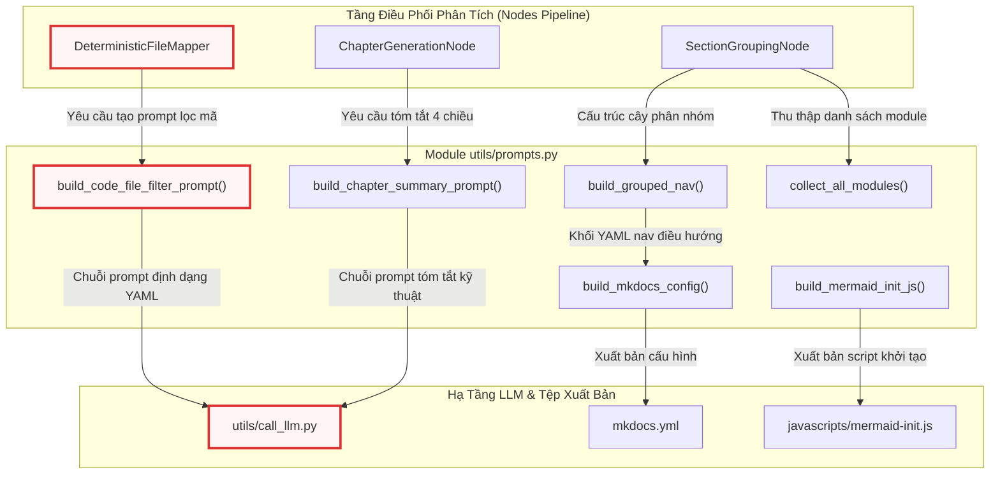
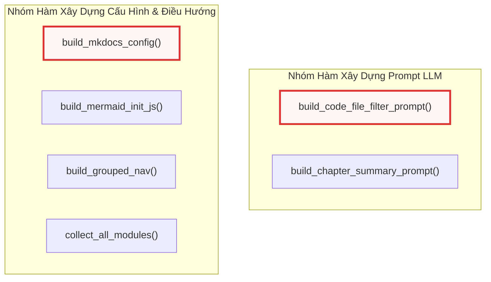
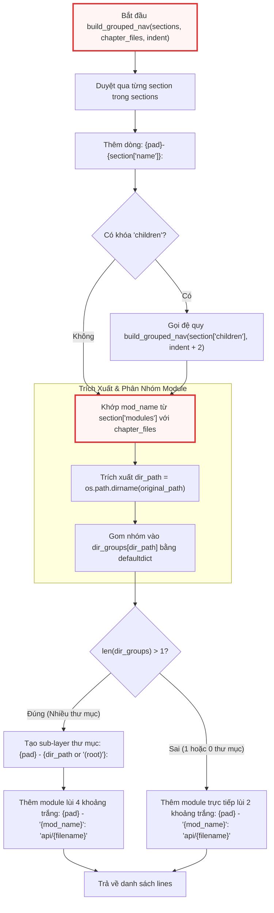

# prompts.py

> **Source:** `utils/prompts.py`

Trong chương trước ([Chương 6 — output.py](06_output_py.md)), chúng ta đã nghiên cứu hệ thống con chịu trách nhiệm xuất dữ liệu đầu ra, ghi nhật ký và cơ chế bản địa hóa đa ngôn ngữ thông qua việc dịch chuỗi giao diện người dùng. Tiếp nối luồng xử lý của hệ thống, module `utils/prompts.py` đóng vai trò là kho lưu trữ và bộ sinh tập trung cho các cấu trúc prompt nội bộ (inline prompts) cùng các hàm tiện ích tạo cấu hình triển khai tài liệu tĩnh (MkDocs & Mermaid).

Khác với các tệp mẫu prompt theo ngữ cảnh người dùng được nạp động từ thư mục `prompts/{mode}/`, các prompt và trình cấu hình trong `prompts.py` được lập trình cứng (hardcoded programmatic builders) nhằm phục vụ các tác vụ hạ tầng tất định: phân loại và lọc tệp mã nguồn kỹ thuật, trích xuất tóm tắt kiến trúc 4 chiều giữa các chương, tạo tệp cấu hình `mkdocs.yml`, thiết lập mã script khởi tạo Mermaid JS, và giải quyết đệ quy cây điều hướng tài liệu phân cấp.

---

## Tổng quan Kỹ thuật (Technical Overview)

Module `utils/prompts.py` cung cấp các hàm độc lập không trạng thái (stateless helper functions) chịu trách nhiệm giải quyết hai nhóm bài toán kỹ thuật cốt lõi trong quy trình phân tích và đóng gói tài liệu:

1. **Xây dựng Prompt Nội bộ cho LLM (Internal LLM Prompt Construction):**
   * **Lọc tệp mã nguồn kỹ thuật:** Hàm `build_code_file_filter_prompt()` tạo ra chỉ thị tối ưu cho thành phần `DeterministicFileMapper` để nhận diện chính xác các tệp mã nguồn chứa logic nghiệp vụ, đồng thời loại bỏ các tệp giao diện (UI layout), cấu hình (JSON, XML), tệp tĩnh và kịch bản bản dựng (build scripts). Kết quả trả về từ LLM bị ràng buộc nghiêm ngặt dưới định dạng danh sách YAML thuần túy.
   * **Tóm tắt ngữ cảnh liên chương (Cross-Chapter Summary):** Hàm `build_chapter_summary_prompt()` thiết lập cấu trúc tóm tắt kỹ thuật gồm đúng 4 khía cạnh: Phạm vi & Trách nhiệm, Các phần tử kỹ thuật cốt lõi, Mẫu triển khai & Kiến trúc, Tích hợp hệ thống & Phụ thuộc. Bản tóm tắt này đóng vai trò là bộ nhớ ngữ cảnh ngắn hạn được truyền liên tiếp vào các prompt sinh chương tiếp theo nhằm bảo toàn tính nhất quán trong toàn bộ tài liệu.

2. **Sinh Cấu hình và Cây Điều hướng Tài liệu Tĩnh (Documentation Site Generation):**
   * **Đóng gói cấu hình MkDocs:** Hàm `build_mkdocs_config()` tự động sinh tệp `mkdocs.yml` hoàn chỉnh tích hợp Material Theme, hỗ trợ chế độ màu Sáng/Tối, sao chép khối mã nguồn, tiện ích mở rộng đánh dấu cú pháp `pymdownx`, cùng plugin tương tác thu phóng/kéo sơ đồ Panzoom.
   * **Cô lập và khởi tạo Mermaid:** Hàm `build_mermaid_init_js()` sinh mã JavaScript khởi tạo thư viện Mermaid với lớp tùy chỉnh `.mermaid-raw`, ngăn chặn việc giao diện Material ghi đè bảng màu mặc định và bảo toàn phong cách hiển thị sơ đồ chuẩn kỹ thuật.
   * **Xây dựng cấu trúc điều hướng phân cấp:** Hàm `build_grouped_nav()` và `collect_all_modules()` phân tích đệ quy cấu trúc nhóm module do LLM phân loại, tự động phân nhóm phụ theo đường dẫn thư mục vật lý nếu các module trong cùng nhóm chức năng nằm rải rác trên nhiều thư mục, tạo nên cây điều hướng MkDocs trực quan.

---

## Kiến trúc Luồng Dữ liệu và Tương tác Hệ thống

Sơ đồ dưới đây mô tả cách `utils/prompts.py` tương tác với các nút điều phối trong [Chương 11 — nodes.py](11_nodes_py.md), tầng gọi mô hình [Chương 2 — call_llm.py](02_call_llm_py.md), và quy trình đóng gói xuất bản tài liệu tĩnh tại [Chương 10 — main.py](10_main_py.md):



---

## Module-Level Functions

Tất cả các phần tử trong `utils/prompts.py` đều được thiết kế dưới dạng các hàm độc lập cấp module (Module-Level Functions), không duy trì trạng thái nội bộ và có tính tất định cao.



---

### `build_code_file_filter_prompt()`
**Visibility**: Public  
**Signature**: `def build_code_file_filter_prompt(project_name: str, file_listing: str) -> str:`

**Description**:  
Hàm tạo chuỗi prompt có cấu trúc gửi tới mô hình ngôn ngữ lớn nhằm lọc danh sách tệp của dự án trong chế độ tham chiếu API (`api-reference`). Nhiệm vụ của prompt là yêu cầu LLM phân biệt và chỉ giữ lại các tệp mã nguồn thực thụ (chứa API, hàm, lớp, logic nghiệp vụ), đồng thời loại trừ toàn bộ các tệp giao diện người dùng, tệp cấu hình, tài nguyên tĩnh, kịch bản biên dịch và tài liệu hướng dẫn. Để phục vụ việc bóc tách tự động bằng máy, prompt ép buộc mô hình chỉ phản hồi duy nhất một khối mã YAML chứa danh sách chỉ số (indices) của các tệp được chọn.

**Parameters**:
* `project_name` (`str`): Tên định danh của dự án hoặc kho mã nguồn đang được phân tích.
* `file_listing` (`str`): Danh sách toàn bộ các tệp đã được lập chỉ mục (dưới dạng văn bản nhiều dòng kèm chỉ số số nguyên).

**Returns**:
* `str`: Chuỗi prompt hoàn chỉnh sẵn sàng chuyển tiếp tới `call_llm()`.

**Raises**:
* Không phát sinh ngoại lệ nội bộ trực tiếp.

**Example**:
```python
def build_code_file_filter_prompt(project_name: str, file_listing: str) -> str:
    """Build the prompt for DeterministicFileMapper to filter non-code files.

    Used in api-reference mode to identify which files are actual code modules
    (APIs, functions, classes, business logic) vs. UI layouts, configs, assets.
    """
    return (
        f"For the project `{project_name}`, here is the list of all files in the codebase:\n\n"
        f"{file_listing}\n\n"
        f"Your task is to identify WHICH of these files are ACTUAL CODE files that contain "
        f"APIs, functions, classes, or core business logic.\n"
        f"EXCLUDE: UI layouts (like .xaml, .storyboard, .html), configuration files "
        f"(like .xml, .json, .manifest, .ini), static assets, build scripts "
        f"(like .csproj, .sln), and documentation.\n\n"
        f"Return ONLY a YAML list of the file indices that should be documented as code modules.\n\n"
        f"```yaml\n- 0\n- 1\n- 3\n```"
    )
```

Hàm sử dụng cú pháp f-string để chèn trực tiếp `project_name` và `file_listing` vào mẫu chỉ thị cố định. Prompt thiết lập danh sách cấm cụ thể bao gồm các phần mở rộng phổ biến như `.xaml`, `.storyboard`, `.html`, `.xml`, `.json`, `.manifest`, `.ini`, `.csproj`, `.sln`. Bằng cách cung cấp khối mẫu định dạng đầu ra ````yaml\n- 0\n- 1\n- 3\n````, hàm giúp tầng phân tích cú pháp ở các nút xử lý phía sau (ví dụ: `DeterministicFileMapper` trong [Chương 11 — nodes.py](11_nodes_py.md)) dễ dàng bóc tách mảng số nguyên thông qua thư viện `yaml` mà không lo bị nhiễu bởi các đoạn văn giải thích lan man của LLM.

---

### `build_chapter_summary_prompt()`
**Visibility**: Public  
**Signature**: `def build_chapter_summary_prompt(chapter_num: int, abstraction_name: str, chapter_content: str, language: str = "english") -> str:`

**Description**:  
Hàm xây dựng prompt điều phối LLM tóm tắt một chương tài liệu vừa được sinh ra theo chuẩn cấu trúc kỹ thuật 4 chiều. Bản tóm tắt này đóng vai trò cầu nối ngữ cảnh giữa các chương: sau khi mỗi chương hoàn thành, bản tóm tắt được lưu vào trạng thái đồ thị thực thi và chèn vào prompt của các chương tiếp theo, đảm bảo LLM duy trì sự liên kết logic và hiểu rõ vai trò của các module tiền nhiệm mà không bị vượt quá giới hạn cửa sổ ngữ cảnh (context window).

**Parameters**:
* `chapter_num` (`int`): Số thứ tự định danh của chương hiện tại (ví dụ: `1`, `2`).
* `abstraction_name` (`str`): Tên khái niệm hoặc định danh module tương ứng với chương (ví dụ: `call_llm.py`).
* `chapter_content` (`str`): Toàn bộ nội dung văn bản Markdown của chương vừa được khởi tạo.
* `language` (`str`, tùy chọn): Ngôn ngữ mục tiêu cho bản tóm tắt. Mặc định là `"english"`.

**Returns**:
* `str`: Chuỗi prompt tóm tắt hoàn chỉnh chứa các chỉ thị phân tích 4 chiều cùng nội dung chương.

**Raises**:
* Không phát sinh ngoại lệ nội bộ trực tiếp.

**Example**:
```python
def build_chapter_summary_prompt(chapter_num: int, abstraction_name: str, chapter_content: str, language: str = "english") -> str:
    """Build the prompt for generating a technical summary of a written chapter.

    Used after each chapter is generated to create a concise technical summary
    for cross-chapter context. The summary is fed into subsequent chapters'
    prompts so the LLM maintains coherence across the full document.

    The summary captures 4 technical dimensions with 3-5 sentences each:
    1. Component scope & responsibility
    2. Key classes/services/functions and their roles
    3. Implementation patterns & architectural decisions
    4. Inter-component interfaces & dependencies
    """
    lang_instruction = f"Write the entire summary in {language.capitalize()}. " if language.lower() != "english" else ""
    return (
        f"{lang_instruction}"
        f"Summarize the following documentation chapter as a structured technical brief. "
        f"For EACH of the 4 points below, write 3-5 concise technical sentences:\n\n"
        f"(1) **Component Scope & Responsibility**: What is the main technical domain this "
        f"chapter covers? What problems does it solve and what role does it play in the system?\n\n"
        f"(2) **Key Technical Elements**: What are the specific classes, services, functions, "
        f"data models, or protocols discussed? Name them and describe their concrete roles.\n\n"
        f"(3) **Implementation Patterns & Architecture**: What design patterns, communication "
        f"protocols, data flow strategies, error handling mechanisms, or security measures "
        f"are covered? How are they implemented?\n\n"
        f"(4) **System Integration & Dependencies**: How does this component interface with "
        f"other parts of the system? What does it consume from or provide to other components? "
        f"What are the key integration points?\n\n"
        f"---\n"
        f"Chapter {chapter_num}: {abstraction_name}\n"
        f"{chapter_content}"
    )
```

Logic hàm xử lý đa ngôn ngữ thông qua biến `lang_instruction`: nếu tham số `language` khác `"english"`, một chỉ thị tiền tố (`Write the entire summary in {language.capitalize()}. `) sẽ được gắn vào đầu prompt nhằm ép buộc mô hình dịch và tóm tắt trực tiếp sang ngôn ngữ chỉ định. Bốn chiều kỹ thuật được quy định rõ ràng yêu cầu LLM viết từ 3 đến 5 câu súc tích cho mỗi mục, giúp trích xuất toàn diện từ mục đích kiến trúc, các lớp/hàm cụ thể, mẫu thiết kế đến giao diện tích hợp mà không làm thất thoát chi tiết quan trọng.

---

### `build_mkdocs_config()`
**Visibility**: Public  
**Signature**: `def build_mkdocs_config(site_name: str, nav_yaml: str) -> str:`

**Description**:  
Hàm tạo cấu hình hoàn chỉnh cho tệp `mkdocs.yml` khi người dùng kích hoạt cờ xuất bản `--mkdocs`. Chuỗi cấu hình được tạo sẵn sàng để sử dụng với giao diện Material for MkDocs (`mkdocs-material`), cấu hình khả năng chuyển đổi giao diện Sáng/Tối, công cụ sao chép mã, làm nổi bật cú pháp với `pymdownx.highlight`, plugin tương tác sơ đồ `panzoom`, tiện ích rào chắn tùy chỉnh cho Mermaid (`.mermaid-raw`), và tích hợp cây điều hướng động được trích xuất từ chuỗi YAML `nav_yaml`.

**Parameters**:
* `site_name` (`str`): Tiêu đề hiển thị trên thanh điều hướng của trang web tài liệu.
* `nav_yaml` (`str`): Khối văn bản YAML định nghĩa cấu trúc điều hướng (navigation snippet) do hàm `build_grouped_nav()` hoặc pipeline sinh ra.

**Returns**:
* `str`: Toàn bộ nội dung tệp `mkdocs.yml` hoàn chỉnh dưới dạng chuỗi văn bản.

**Raises**:
* Không phát sinh ngoại lệ nội bộ trực tiếp.

**Example**:
```python
def build_mkdocs_config(site_name: str, nav_yaml: str) -> str:
    """Build a complete mkdocs.yml for local --mkdocs output.

    Generates a ready-to-use MkDocs Material config with:
    - Material theme with code copy buttons
    - Syntax highlighting (pymdownx.highlight + inlinehilite)
    - Mermaid diagram rendering via custom 'mermaid-raw' class (bypasses
      Material's Mermaid color overrides so diagrams use Mermaid's default theme)
    - Panzoom plugin for interactive Mermaid diagram zoom/pan
    - Navigation from the generated nav_snippet

    Users can run `mkdocs serve` or `mkdocs build` directly in the output dir.
    """
    # Extract nav items from nav_snippet (strip the "nav:" header line)
    nav_lines = nav_yaml.split("\n")
    nav_body = "\n".join(nav_lines[1:]) if nav_lines else ""

    return (
        f"site_name: '{site_name}'\n"
        f"theme:\n"
        f"  name: material\n"
        f"  features:\n"
        f"    - content.code.copy\n"
        f"    - navigation.indexes\n"
        f"  palette:\n"
        f"    - scheme: default\n"
        f"      toggle:\n"
        f"        icon: material/brightness-7\n"
        f"        name: Switch to dark mode\n"
        f"    - scheme: slate\n"
        f"      toggle:\n"
        f"        icon: material/brightness-4\n"
        f"        name: Switch to light mode\n"
        f"plugins:\n"
        f"  - search\n"
        f"  - panzoom:\n"
        f"      include_selectors:\n"
        f"        - '.mermaid-raw'\n"
        f"markdown_extensions:\n"
        f"  - pymdownx.highlight:\n"
        f"      anchor_linenums: true\n"
        f"      use_pygments: true\n"
        f"  - pymdownx.superfences:\n"
        f"      custom_fences:\n"
        f"        - name: mermaid\n"
        f"          class: mermaid-raw\n"
        f"          format: !!python/name:pymdownx.superfences.fence_code_format\n"
        f"  - pymdownx.inlinehilite\n"
        f"extra_javascript:\n"
        f"  - https://cdn.jsdelivr.net/npm/mermaid@11/dist/mermaid.min.js\n"
        f"  - javascripts/mermaid-init.js\n"
        f"nav:\n"
        f"  - Home: index.md\n"
        f"{nav_body}\n"
    )
```

Hàm tiến hành tiền xử lý `nav_yaml` bằng cách bóc tách dòng tiêu đề `nav:` (nếu có) thông qua thao tác tách dòng `nav_yaml.split("\n")` và ghép lại phần thân `nav_body`. Điểm đặc biệt trong cấu hình là việc định nghĩa lớp `mermaid-raw` trong phần mở rộng `pymdownx.superfences`. Kỹ thuật này giúp phân tách hoàn toàn sơ đồ Mermaid khỏi bộ quy tắc CSS mặc định của theme Material, kết hợp với script `javascripts/mermaid-init.js` để hiển thị sơ đồ chuẩn xác theo bảng màu gốc của Mermaid (nền vàng cho subgraph, khối màu tím lavender cho các node). Đồng thời, plugin `panzoom` được cấu hình để tự động liên kết với bộ chọn `.mermaid-raw`, cho phép người dùng phóng to/thu nhỏ và kéo thả sơ đồ phức tạp trên trình duyệt.

---

### `build_mermaid_init_js()`
**Visibility**: Public  
**Signature**: `def build_mermaid_init_js() -> str:`

**Description**:  
Hàm sinh mã nguồn JavaScript tĩnh được lưu tại đường dẫn `javascripts/mermaid-init.js` trong thư mục tài liệu xuất bản. Mã kịch bản này lắng nghe sự kiện `DOMContentLoaded`, khởi tạo đối tượng thư viện `mermaid` ở chế độ thủ công (`startOnLoad: false`) với chủ đề mặc định (`theme: 'default'`), và kích hoạt phân tích cú pháp trên toàn bộ các phần tử HTML sở hữu lớp `.mermaid-raw`.

**Parameters**:
* Hàm không nhận tham số đầu vào.

**Returns**:
* `str`: Chuỗi mã nguồn JavaScript thuần túy.

**Raises**:
* Không phát sinh ngoại lệ nội bộ.

**Example**:
```python
def build_mermaid_init_js() -> str:
    """Build JS to initialize Mermaid on .mermaid-raw elements.

    Material for MkDocs applies its own color overrides to elements with
    class 'mermaid'. By using class 'mermaid-raw' in superfences config
    and initializing Mermaid manually, diagrams render with Mermaid's
    built-in default theme: yellow subgraph backgrounds, lavender nodes,
    clean rectangles — matching how GitHub renders Mermaid natively.
    """
    return """\
// Initialize Mermaid on .mermaid-raw elements (bypasses Material theme override)
// Material for MkDocs targets .mermaid class for its own color overrides.
// By using .mermaid-raw, diagrams render with Mermaid's default theme:
// yellow subgraph backgrounds, lavender nodes, clean rectangles.
document.addEventListener('DOMContentLoaded', function() {
  if (typeof mermaid !== 'undefined') {
    mermaid.initialize({ startOnLoad: false, theme: 'default' });
    mermaid.run({ querySelector: '.mermaid-raw' });
  }
});
"""
```

Kịch bản JavaScript này giải quyết xung đột CSS phổ biến trong hệ sinh thái MkDocs Material: khi MkDocs Material phát hiện thẻ có lớp `mermaid`, nó sẽ tự động áp đặt bảng màu đơn sắc của theme lên các nút và đường nối, làm mất đi sự trực quan của các sơ đồ phức tạp. Bằng cách trì hoãn việc chạy tự động (`startOnLoad: false`) và chuyển sang gọi tường minh `mermaid.run({ querySelector: '.mermaid-raw' })`, sơ đồ giữ nguyên giao diện chuẩn hóa (tương tự như cách GitHub hiển thị Mermaid nguyên bản). Kịch bản cũng bọc an toàn trong khối kiểm tra `typeof mermaid !== 'undefined'` để tránh gây lỗi JavaScript trên các trang không nạp CDN.

---

### `build_grouped_nav()`
**Visibility**: Public  
**Signature**: `def build_grouped_nav(sections: list, chapter_files: list, indent: int = 4) -> list[str]:`

**Description**:  
Hàm đệ quy phân tích cấu trúc cây phân nhóm do mô hình ngôn ngữ lớn tạo ra (`sections`) và chuyển đổi thành các dòng thụt lề định dạng YAML cho mục `nav` của MkDocs. Hàm hỗ trợ độ sâu lồng nhau tùy ý thông qua khóa `children`. Đối với các nhóm chức năng chứa các module nằm trên nhiều thư mục vật lý khác nhau, hàm tự động tạo thêm một tầng nhóm phụ theo đường dẫn thư mục (`dir_path`). Ngược lại, nếu toàn bộ module trong nhóm cùng nằm trên một thư mục, cấu trúc sẽ được giữ phẳng nhằm tránh việc lồng cấp điều hướng không cần thiết.

**Parameters**:
* `sections` (`list`): Danh sách các đối tượng từ điển biểu diễn cấu trúc nhóm (mỗi phần tử chứa khóa `'name'`, tùy chọn danh sách `'modules'` và `'children'`).
* `chapter_files` (`list`): Danh sách siêu dữ liệu các tệp chương đã sinh (mỗi phần tử là một từ điển chứa `'module_name'`, `'filename'`, `'original_path'`).
* `indent` (`int`, tùy chọn): Mức độ thụt lề đầu dòng hiện tại tính bằng số ký tự khoảng trắng. Mặc định là `4`.

**Returns**:
* `list[str]`: Danh sách các chuỗi văn bản, mỗi chuỗi đại diện cho một dòng cấu hình điều hướng YAML hợp lệ.

**Raises**:
* Không phát sinh ngoại lệ nội bộ trực tiếp; xử lý an toàn các giá trị `None` hoặc chuỗi rỗng của đường dẫn thông qua toán tử điều kiện logic.

**Example**:
```python
def build_grouped_nav(sections: list, chapter_files: list, indent: int = 4) -> list[str]:
    lines = []
    pad = " " * indent
    for section in sections:
        lines.append(f"{pad}- {section['name']}:")
        if "children" in section:
            lines.extend(build_grouped_nav(section["children"], chapter_files, indent + 2))

        # Collect matched modules with directory info
        matched = []
        for mod_name in section.get("modules", []):
            match = next((cf for cf in chapter_files if cf["module_name"] == mod_name), None)
            if match:
                dir_path = os.path.dirname(match.get("original_path", "")) or ""
                matched.append((dir_path, mod_name, match))

        # Group by directory
        from collections import defaultdict

        dir_groups = defaultdict(list)
        for dir_path, mod_name, match in matched:
            dir_groups[dir_path].append((mod_name, match))

        if len(dir_groups) > 1:
            # Multiple directories → add dir sub-layer with full path
            for dir_path in sorted(dir_groups.keys()):
                label = dir_path or "(root)"
                lines.append(f"{pad}  - {label}:")
                for mod_name, match in dir_groups[dir_path]:
                    lines.append(f"{pad}    - '{mod_name}': 'api/{match['filename']}'")
        else:
            # Single directory or no original_path → flat list
            for mod_name, match in matched:
                lines.append(f"{pad}  - '{mod_name}': 'api/{match['filename']}'")

    return lines
```

Sơ đồ sau đây mô tả chi tiết logic phân nhánh và nhóm thư mục tự động trong hàm `build_grouped_nav()`:



Thuật toán vận hành bằng cách quét danh sách tên module trong `section.get("modules", [])`, tìm kiếm thông tin tệp tương ứng trong `chapter_files` bằng hàm `next()`. Đường dẫn thư mục gốc được trích xuất bằng `os.path.dirname(match.get("original_path", ""))`. Sử dụng `collections.defaultdict(list)`, hàm gom các module có cùng `dir_path`. Nếu số lượng thư mục phân biệt `len(dir_groups) > 1`, hàm sẽ tự động chèn một tầng phân cấp trung gian với nhãn là đường dẫn thư mục tương đối (hoặc `"(root)"` nếu nằm tại thư mục gốc của dự án), giúp cấu trúc cây tài liệu phản ánh chính xác vị trí vật lý của mã nguồn mà không cần thực hiện thêm bất kỳ lượt gọi LLM nào.

---

### `collect_all_modules()`
**Visibility**: Public  
**Signature**: `def collect_all_modules(sections: list) -> set:`

**Description**:  
Hàm đệ quy thu thập toàn bộ danh sách tên module duy nhất được tham chiếu trong cây cấu trúc phân nhóm `sections`. Hàm được sử dụng trong các nút tiền xử lý và hậu xử lý điều hướng để kiểm tra tính toàn vẹn (reconciliation), đảm bảo không có tệp mã nguồn nào bị bỏ sót hoặc bị trùng lặp giữa các nhóm phân loại của mô hình ngôn ngữ lớn.

**Parameters**:
* `sections` (`list`): Danh sách các cấu trúc nhóm phân cấp chứa khóa `'modules'` và tùy chọn khóa `'children'`.

**Returns**:
* `set`: Tập hợp kiểu `set` chứa toàn bộ các chuỗi tên module được tìm thấy trên toàn bộ các nhánh của cây.

**Raises**:
* Không phát sinh ngoại lệ nội bộ trực tiếp.

**Example**:
```python
def collect_all_modules(sections: list) -> set:
    """Recursively collect all module names referenced in a sections tree."""
    result = set()
    for section in sections:
        result.update(section.get("modules", []))
        if "children" in section:
            result.update(collect_all_modules(section["children"]))
    return result
```

Hàm khởi tạo một tập hợp rỗng `result = set()`. Trong mỗi vòng lặp qua từng phần tử `section`, phương thức `update()` được gọi để đưa toàn bộ danh sách `section.get("modules", [])` vào tập hợp (tự động loại bỏ các phần tử trùng lặp). Nếu phát hiện khóa `children`, hàm thực hiện gọi đệ quy `collect_all_modules(section["children"])` và hợp nhất kết quả trả về vào `result`. Độ phức tạp tính toán đạt mức tuyến tính $O(N)$ với $N$ là tổng số nút trong cây phân nhóm, đảm bảo hiệu năng xử lý tức thì ngay cả với các dự án lớn chứa hàng trăm module.

---

## Tích hợp Hệ thống và Sơ đồ Phụ thuộc (System Integration & Dependencies)

Module `utils/prompts.py` đóng vai trò là tầng hạ tầng độc lập cao, chỉ phụ thuộc duy nhất vào module chuẩn `os` của thư viện Python và module nội bộ `collections.defaultdict`. 

Bảng dưới đây tổng hợp mối quan hệ giữa các hàm trong `prompts.py` với các thành phần khác trong toàn bộ dự án:

| Hàm trong `prompts.py` | Thành phần tiêu thụ (Consumers) | Module liên quan | Mục đích nghiệp vụ |
| :--- | :--- | :--- | :--- |
| `build_code_file_filter_prompt` | `DeterministicFileMapper` | [Chương 11 — nodes.py](11_nodes_py.md), [Chương 2 — call_llm.py](02_call_llm_py.md) | Tạo prompt yêu cầu LLM lọc danh sách tệp mã nguồn hợp lệ theo chỉ số YAML. |
| `build_chapter_summary_prompt` | `ChapterGenerationNode` | [Chương 11 — nodes.py](11_nodes_py.md), [Chương 9 — flow.py](09_flow_py.md) | Sinh bản tóm tắt kỹ thuật 4 chiều để duy trì ngữ cảnh xuyên suốt giữa các chương. |
| `build_mkdocs_config` | Luồng đóng gói tài liệu | [Chương 10 — main.py](10_main_py.md) | Khởi tạo nội dung tệp `mkdocs.yml` hoàn chỉnh tích hợp Material Theme và Panzoom. |
| `build_mermaid_init_js` | Luồng đóng gói tài liệu | [Chương 10 — main.py](10_main_py.md) | Khởi tạo tệp script `javascripts/mermaid-init.js` xử lý hiển thị `.mermaid-raw`. |
| `build_grouped_nav` | `SectionGroupingNode`, Xuất bản web | [Chương 11 — nodes.py](11_nodes_py.md), [Chương 10 — main.py](10_main_py.md) | Phân giải đệ quy cây phân nhóm của LLM thành cấu trúc điều hướng YAML đa tầng. |
| `collect_all_modules` | `SectionGroupingNode` | [Chương 11 — nodes.py](11_nodes_py.md) | Thu thập tập hợp tên module để đối soát độ đầy đủ của cây tài liệu. |

---

## Xem Thêm (See Also)

* [Chương 2 — call_llm.py](02_call_llm_py.md): Tầng giao tiếp và thực thi suy luận mô hình ngôn ngữ lớn tiếp nhận các chuỗi prompt được tạo từ module này.
* [Chương 6 — output.py](06_output_py.md): Hệ thống quản lý đầu ra console, nhật ký tệp tin và dịch thuật đa ngôn ngữ giao diện.
* [Chương 8 — token_utils.py](08_token_utils_py.md): Bộ tiện ích tính toán và ước lượng số lượng token cho các chuỗi prompt trước khi gửi tới API.
* [Chương 9 — flow.py](09_flow_py.md): Đồ thị luồng công việc điều phối việc chuyển giao ngữ cảnh và bản tóm tắt chương giữa các bước thực thi.
* [Chương 10 — main.py](10_main_py.md): Điểm nhập chương trình tiêu thụ các hàm sinh cấu hình `mkdocs.yml` và script Mermaid.
* [Chương 11 — nodes.py](11_nodes_py.md): Các nút xử lý logic sử dụng `build_code_file_filter_prompt`, `build_chapter_summary_prompt` và `build_grouped_nav`.

