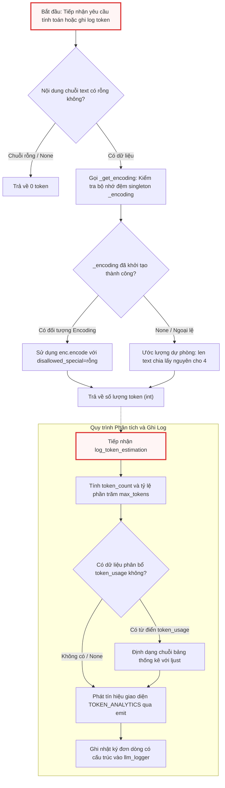

# token_utils.py

> **Source:** `utils/token_utils.py`

Tiếp nối các tiện ích sinh prompt và xử lý điều hướng cấu trúc tài liệu từ [07_prompts_py.md](07_prompts_py.md), module `token_utils.py` đảm nhiệm vai trò là hệ thống đo lường, phân tích và giám sát tải lượng token (Token Telemetry & Context Profiling) cho toàn bộ ứng dụng. Module này chịu trách nhiệm chuẩn hóa việc tính toán dung lượng ngữ cảnh của các chuỗi văn bản đầu vào trước khi chuyển tiếp tới mô hình ngôn ngữ lớn (LLM), giúp ngăn chặn sự cố tràn cửa sổ ngữ cảnh (Context Window Overflow) và cung cấp báo cáo chi tiết về tỷ lệ sử dụng tài nguyên token theo từng giai đoạn thực thi của đồ thị xử lý (`nodes.py` và `flow.py`).

---

## 1. Tổng quan Kiến trúc & Nguyên lý Hoạt động

Module `token_utils.py` được thiết kế xoay quanh hai mục tiêu cốt lõi: **độ chính xác tính toán tối đa** và **độ ổn định tuyệt đối trong môi trường sản xuất (Fail-Safe Resilience)**. Thành phần này giải quyết các thách thức kỹ thuật sau:

1. **Khởi tạo lười (Lazy-Loaded Singleton Pattern):** Bộ mã hóa Byte-Pair Encoding (BPE) của `tiktoken` đòi hỏi chi phí nạp bảng từ vựng (vocabulary tables) vào bộ nhớ trong lần đầu tiên. Module trì hoãn việc nạp tài nguyên này cho đến khi hàm tính token được gọi lần đầu, đồng thời lưu trữ đối tượng `_encoding` dưới dạng singleton để tránh nạp lại nhiều lần.
2. **Cơ chế phòng thủ và phân rã dự phòng (Graceful Degradation Fallback):** Trong trường hợp môi trường thực thi thiếu thư viện `tiktoken`, không có kết nối mạng để tải bộ dữ liệu từ vựng hoặc gặp lỗi khởi tạo BPE ngoại lệ, hệ thống sẽ tự động hạ cấp sang thuật toán ước lượng theo tỷ lệ ký tự chuẩn ($1\text{ token} \approx 4\text{ ký tự}$).
3. **Phân tích tải lượng đa kênh (Dual-Channel Token Analytics):** Cung cấp giao diện trích xuất số liệu token phân cấp, tự động căn chỉnh lề giao diện console thông qua hệ thống thông báo `emit()` của [06_output_py.md](06_output_py.md), đồng thời định dạng dữ liệu telemetry thành chuỗi nhật ký đơn dòng có cấu trúc (Single-line Structured Log) phục vụ cho việc bóc tách và giám sát tự động qua logger `llm_logger`.

---

## 2. Sơ đồ Luồng Ước lượng và Phân tích Token

Sơ đồ dưới đây mô tả luồng điều hướng logic từ khi tiếp nhận chuỗi văn bản, phân giải bộ mã hóa, tính toán dự phòng đến khi xuất dữ liệu thống kê ra terminal và tệp nhật ký:



---

## 3. Biến Toàn cục & Bộ nhớ đệm Module-Level

Các biến phạm vi module được khởi tạo tĩnh để phục vụ chia sẻ tài nguyên và tối ưu hóa bộ nhớ:

```python
# Get the shared logger from call_llm module
logger = logging.getLogger("llm_logger")

# Lazy-loaded tiktoken encoding (singleton)
_encoding = None
```

### Chi tiết Kỹ thuật:
* `logger` (`logging.Logger`): Thực thể logger toàn cục có định danh `"llm_logger"`. Thực thể này được liên kết trực tiếp với kênh ghi nhật ký hệ thống đã được cấu hình từ [06_output_py.md](06_output_py.md) và chia sẻ cùng không gian nhật ký với [02_call_llm_py.md](02_call_llm_py.md). Mọi dữ liệu phân tích token khi ghi vào đây sẽ được đưa vào tệp nhật ký phiên chạy mà không bị làm nhiễu bởi định dạng màu sắc terminal.
* `_encoding` (`tiktoken.core.Encoding | None`): Biến trạng thái module đóng vai trò là bộ nhớ đệm singleton cho đối tượng phân tích cú pháp token. Khởi tạo mặc định là `None` và chỉ được nạp dữ liệu một lần duy nhất khi có yêu cầu mã hóa đầu tiên.

---

## 4. Chi tiết Hàm Module (Module-Level Functions)

### `_get_encoding()`

**Visibility**: Private (Nội bộ module)  
**Signature**: `def _get_encoding() -> tiktoken.core.Encoding | None:`

```python
def _get_encoding():
    global _encoding
    if _encoding is None:
        try:
            _encoding = tiktoken.get_encoding("cl100k_base")
        except Exception:
            _encoding = None
    return _encoding
```

**Description**:  
Hàm nội bộ quản lý vòng đời và bộ nhớ đệm của đối tượng mã hóa `tiktoken`. Hàm sử dụng mẫu thiết kế Singleton kết hợp cơ chế Khởi tạo lười (Lazy Initialization) để trì hoãn việc đọc và giải mã bảng từ vựng BPE `cl100k_base` (tương thích chuẩn cho các dòng mô hình GPT-4, GPT-3.5-Turbo cũng như các mô hình suy luận hiện đại).

Trong quá trình thực thi, nếu gặp bất kỳ ngoại lệ nào (ví dụ: thiếu tệp nhị phân từ vựng offline, lỗi cấp phát bộ nhớ C-extension hoặc thư viện `tiktoken` chưa được cài đặt tương thích), khối `try...except Exception` sẽ chủ động bắt lỗi và gán `_encoding = None`. Thiết kế này loại bỏ hoàn toàn nguy cơ ứng dụng bị sập đột ngột (crash), cho phép tầng trên tự động kích hoạt cơ chế ước lượng dự phòng.

**Parameters**:  
* Không nhận tham số đầu vào.

**Returns**:  
* `tiktoken.core.Encoding | None`: Đối tượng mã hóa BPE `cl100k_base` nếu nạp thành công; ngược lại trả về `None`.

**Raises**:  
* Không phát sinh ngoại lệ ra ngoài (Mọi ngoại lệ nội bộ từ `tiktoken.get_encoding` đều bị cô lập và xử lý an toàn).

**Example**:
```python
enc = _get_encoding()
if enc:
    tokens = enc.encode("Hello world", disallowed_special=())
```

---

### `count_tokens()`

**Visibility**: Public  
**Signature**: `def count_tokens(text: str) -> int:`

```python
def count_tokens(text: str) -> int:
    """Count tokens using tiktoken, with fallback to chars/4."""
    if not text:
        return 0
    enc = _get_encoding()
    if enc:
        return len(enc.encode(text, disallowed_special=()))
    return len(text) // 4
```

**Description**:  
Hàm tính toán chính xác tổng số lượng token của một chuỗi văn bản đầu vào. Đây là giao diện lập trình công khai được sử dụng xuyên suốt hệ thống để đo lường tải lượng của các tệp mã nguồn từ [03_crawl_github_files.py](03_crawl_github_files.py), [04_crawl_local_files.py](04_crawl_local_files.py), các prompt tạo bởi [07_prompts.py](07_prompts_py.md) và các yêu cầu gọi mô hình trong [02_call_llm_py.md](02_call_llm_py.md).

Hàm thực hiện quy trình xử lý theo 3 bước:
1. **Kiểm tra biên (Boundary Check):** Đánh giá chuỗi `text`. Nếu chuỗi là `None`, rỗng (`""`), hàm lập tức hoàn trả giá trị `0` mà không kích hoạt bộ phân tích BPE.
2. **Mã hóa BPE chính xác:** Truy xuất bộ mã hóa qua `_get_encoding()`. Khi đối tượng `enc` khả dụng, hàm gọi phương thức `enc.encode()` với tham số `disallowed_special=()`. Việc vô hiệu hóa kiểm tra ký tự đặc biệt (`disallowed_special=()`) là cực kỳ quan trọng, cho phép chuỗi đầu vào chứa các token đặc biệt thường gặp trong mã nguồn và prompt (như `<|endoftext|>`, `<|im_start|>`) được mã hóa an toàn như văn bản thuần mà không gây lỗi `ValueError`.
3. **Hạ cấp dự phòng (Heuristic Fallback):** Nếu không thể nạp bộ mã hóa, hàm sử dụng phép chia lấy phần nguyên `len(text) // 4` dựa trên quy chuẩn trung bình $1\text{ token} \approx 4\text{ ký tự}$ trong xử lý ngôn ngữ tự nhiên và mã nguồn.

**Parameters**:  
* `text` (`str`): Chuỗi văn bản thuần hoặc nội dung mã nguồn cần đo lường số lượng token.

**Returns**:  
* `int`: Tổng số lượng token đã được mã hóa hoặc ước tính. Luôn trả về số nguyên không âm ($\ge 0$).

**Raises**:  
* Không phát sinh ngoại lệ.

**Example**:
```python
# Trích xuất từ cách sử dụng nội bộ và tích hợp hệ thống
prompt = "Analyze the system architecture for this repository."
total_tokens = count_tokens(prompt)
# total_tokens -> giá trị int (ví dụ: 8)
```

---

### `log_token_estimation()`

**Visibility**: Public  
**Signature**: `def log_token_estimation(node_name: str, prompt_content: str, max_tokens: int, token_usage: dict | None = None) -> None:`

```python
def log_token_estimation(node_name: str, prompt_content: str, max_tokens: int, token_usage: dict | None = None) -> None:
    token_count = count_tokens(prompt_content)
    percentage = (token_count / max_tokens) * 100 if max_tokens else 0

    # Build token usage breakdown suffix for stdout display
    suffix = ""
    usage_log_str = ""
    if token_usage:
        max_label_len = max(len(label) for label in token_usage)
        lines = []
        log_parts = []
        for label, value in token_usage.items():
            pct = (value / token_count * 100) if token_count else 0
            padded_label = label.ljust(max_label_len)
            lines.append(f"\t{padded_label} : {value:,} ({pct:.0f}%)")
            log_parts.append(f"{label}={value:,} ({pct:.0f}%)")
        suffix = "\n" + "\n".join(lines)
        usage_log_str = " | " + " | ".join(log_parts)

    # Console output via emit (styled by CSV LEVEL=WARNING → yellow)
    emit(
        "TOKEN_ANALYTICS",
        suffix=suffix,
        node_name=node_name,
        token_count=f"{token_count:,}",
        max_tokens=f"{max_tokens:,}",
        percentage=f"{percentage:.1f}",
    )

    # File log stays single-line for parseability (structured, not translatable)
    logger.info(f"NODE EXEC | node={node_name} | prompt_tokens={token_count:,} / {max_tokens:,} ({percentage:.1f}% capacity){usage_log_str}")
```

**Description**:  
Hàm thực hiện phân tích, định dạng và xuất báo cáo tải lượng token cho từng nút thực thi trong hệ thống (như các nút phân tích kiến trúc, ánh xạ module, tóm tắt chương trong `nodes.py`). Hàm hỗ trợ việc bóc tách tỷ lệ chiếm dụng cửa sổ ngữ cảnh và cấu trúc chi tiết các thành phần con của prompt.

Quy trình xử lý nội bộ bao gồm:
1. **Đo lường & Tính toán Tỷ lệ:** Gọi `count_tokens(prompt_content)` để lấy tổng số token đầu vào. Sau đó, tỷ lệ chiếm dụng cửa sổ ngữ cảnh (`percentage`) được tính bằng công thức:
   $$\text{percentage} = \frac{\text{token\_count}}{\text{max\_tokens}} \times 100$$
   Xử lý an toàn trường hợp `max_tokens = 0` hoặc `None` để tránh lỗi `ZeroDivisionError`.
2. **Căn lề Bảng Phân bổ (Breakdown Formatting):** Nếu có tham số `token_usage` (từ điển ánh xạ tên thành phần prompt với số lượng token tương ứng, ví dụ `{"System Prompt": 500, "Code Files": 12000}`), hàm tìm chiều dài nhãn lớn nhất (`max_label_len`) và sử dụng phương thức `str.ljust()` để căn chỉnh thẳng hàng dọc. Đồng thời tính toán tỷ lệ phần trăm của từng thành phần so với tổng số `token_count`.
3. **Xuất bản Đa Kênh:**
   * **Kênh Console (`emit`):** Gửi sự kiện định danh `"TOKEN_ANALYTICS"` tới hệ thống thông báo đa ngữ [06_output_py.md](06_output_py.md). Thông báo này được hiển thị nổi bật trên terminal (thường được cấu hình mức `WARNING` với mã màu ANSI vàng) đi kèm bảng phân bổ `suffix` thụt đầu dòng rõ ràng.
   * **Kênh Tệp Nhật ký (`logger.info`):** Ghi một dòng log có cấu trúc chuẩn hóa, ngăn cách bởi ký tự `|` (Pipe delimiter), giúp các công cụ phân tích log (Log Parsers, SIEM, Grafana Loki) dễ dàng bóc tách thông tin mà không bị ảnh hưởng bởi ký tự xuống dòng.

**Parameters**:  
* `node_name` (`str`): Tên định danh của nút hoặc tiến trình đang thực thi (ví dụ: `"FileMapperNode"`, `"ChapterSummarizer"`).
* `prompt_content` (`str`): Toàn bộ nội dung prompt hoàn chỉnh chuẩn bị gửi tới LLM.
* `max_tokens` (`int`): Giới hạn cửa sổ ngữ cảnh tối đa của mô hình được cấu hình (ví dụ: $128,000$ hoặc $1,000,000$).
* `token_usage` (`dict | None`, tùy chọn): Bảng từ điển tùy chọn chứa chi tiết phân rã số lượng token theo từng phân đoạn nghiệp vụ (`dict[str, int]`). Mặc định là `None`.

**Returns**:  
* `None`.

**Raises**:  
* Không phát sinh ngoại lệ ra bên ngoài.

**Example**:
```python
# Trích xuất cấu trúc gọi thực tế trong các nút thực thi
usage_breakdown = {
    "System Instruction": 450,
    "Repository Tree": 1200,
    "Source File Contents": 15400
}
full_prompt = "...[Nội dung prompt hoàn chỉnh]..."
max_context_window = 32768

log_token_estimation(
    node_name="ArchitectureAnalysisNode",
    prompt_content=full_prompt,
    max_tokens=max_context_window,
    token_usage=usage_breakdown
)
```

---

## 5. Bảng Phân Tích Kỹ Thuật Định Dạng Dữ Liệu Đầu Ra

Dưới đây là đặc tả kỹ thuật của hai định dạng đầu ra được điều phối bởi hàm `log_token_estimation()`:

| Kênh Đầu Ra | Phương Thức Thực Thi | Định Dạng Dữ Liệu | Mục Đích Sử Dụng |
| :--- | :--- | :--- | :--- |
| **Giao diện Dòng lệnh (CLI)** | `output.emit("TOKEN_ANALYTICS", ...)` | Đa dòng, có màu sắc ANSI, bảng phân bổ căn lề ljust, thụt đầu dòng tab (`\t`) | Giúp người dùng theo dõi trực quan mức độ tiêu thụ token theo thời gian thực khi chạy CLI |
| **Nhật ký Tệp (File Logger)** | `logger.info(...)` | Đơn dòng (Single-line), phân tách bằng dấu phân cách `\|`, không mã màu, không bản địa hóa chuỗi | Phục vụ phân tích hiệu năng sau phiên chạy, kiểm toán chi phí API và truy vết tự động |

---

## 6. Phân tích Các Trường Hợp Biên & Phòng Thủ Lỗi

1. **Chuỗi Ký Tự Đặc Biệt (Special Tokens Injection):**
   Trong các kho lưu trữ mã nguồn lớn, nhiều tệp tin (ví dụ: các tệp cấu hình tokenizer, mô hình mẫu hoặc dữ liệu huấn luyện NLP) có thể chứa các token đặc biệt như `<|endoftext|>`. Nếu gọi `tiktoken.encode()` thông thường mà không chỉ định `disallowed_special=()`, thư viện sẽ ném ngoại lệ `ValueError`. Bằng cách truyền tham số `disallowed_special=()`, module đảm bảo an toàn tuyệt đối, coi toàn bộ các chuỗi này là văn bản thô.

2. **Xử Lý Chia Cho 0 (Zero Division Guard):**
   Trong trường hợp `max_tokens` truyền vào là `0` hoặc `prompt_content` là chuỗi rỗng (`token_count == 0`), các biểu thức điều kiện `(token_count / max_tokens) * 100 if max_tokens else 0` và `(value / token_count * 100) if token_count else 0` bảo đảm tiến trình không bị ngắt quãng bởi ngoại lệ toán học.

3. **Tính Độc Lập Khi Nạp Module (Import-Time Decoupling):**
   Nhờ cơ chế lazy load, việc import `token_utils.py` không làm tiêu tốn tài nguyên I/O đọc đĩa hoặc giải nén bảng từ vựng BPE, đưa thời gian import module về mức tiệm cận $0\text{ ms}$.

---

## Xem Thêm (See Also)

* [02_call_llm_py.md](02_call_llm_py.md) — Tầng cổng kết nối LLM tiêu thụ trực tiếp hàm `count_tokens` để xác thực tải trọng yêu cầu.
* [06_output_py.md](06_output_py.md) — Hệ thống quản lý hiển thị CLI tiếp nhận mẫu sự kiện `"TOKEN_ANALYTICS"` từ `log_token_estimation`.
* [07_prompts_py.md](07_prompts_py.md) — Các tiện ích tạo prompt chịu sự kiểm soát dung lượng token bởi module này.
* [09_flow_py.md](09_flow_py.md) — Đồ thị điều phối thực thi giám sát dung lượng ngữ cảnh xuyên suốt các bước chạy.
* [11_nodes_py.md](11_nodes_py.md) — Các nút nghiệp vụ gọi `log_token_estimation` trước khi gửi payload tới LLM backend.

