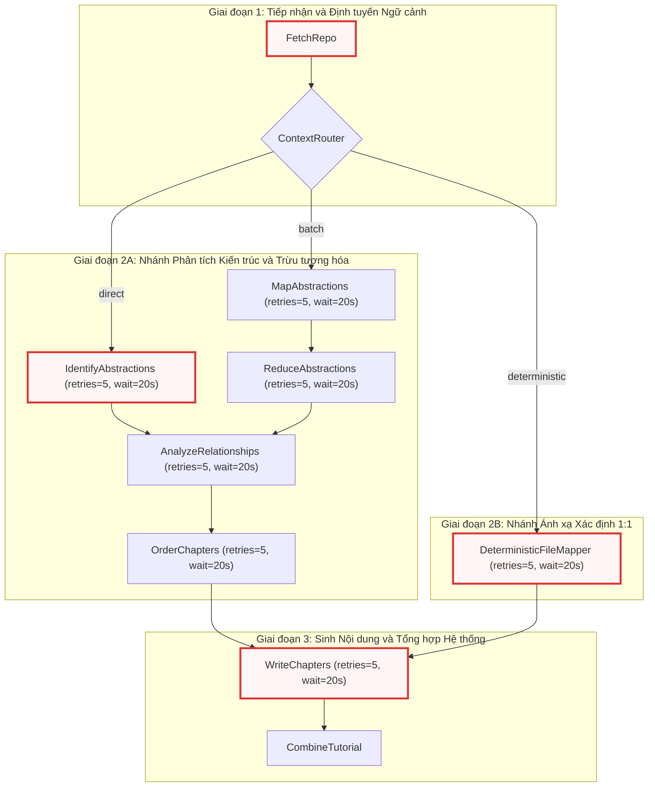
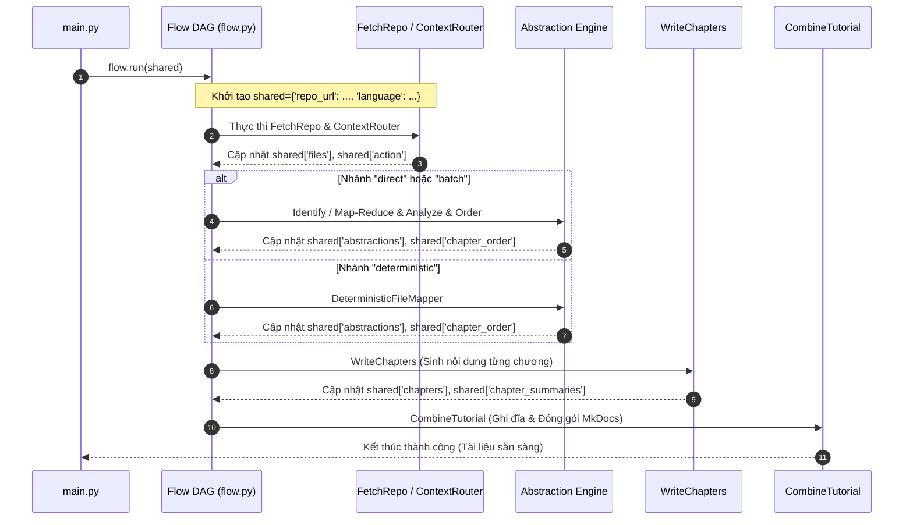

# flow.py

> **Source:** `flow.py`

Tài liệu này cung cấp đặc tả kỹ thuật và tham chiếu API nội bộ cho module `flow.py`. Module đóng vai trò là kiến trúc sư trưởng và bộ điều phối đồ thị thực thi (Workflow Orchestrator), chịu trách nhiệm thiết lập Đồ thị Có hướng Không Chu trình (Directed Acyclic Graph - DAG) dựa trên nền tảng framework `PocketFlow` để tự động hóa toàn bộ quy trình phân tích mã nguồn và sinh tài liệu kỹ thuật.

---

### Chuyển tiếp từ các thành phần trước
Trong [Chương 8 — token_utils.py](08_token_utils_py.md), hệ thống đã thiết lập hạ tầng giám sát tải lượng token, phân tích cấu hình ngữ cảnh và ước tính chi phí trước khi gửi prompt tới các Mô hình Ngôn ngữ Lớn (LLM). Module `flow.py` kế thừa năng lực này bằng cách tích hợp trực tiếp các nút xử lý nghiệp vụ từ [Chương 11 — nodes.py](11_nodes_py.md), kết nối chúng thành một đồ thị có cấu trúc phân nhánh thông minh dựa trên dung lượng ngữ cảnh và hình thái của kho mã nguồn.

---

## Tổng quan Kỹ thuật (Technical Overview)

Module `flow.py` đóng vai trò là tầng điều phối trung tâm (Workflow Pipeline Definition Layer) trong hệ thống. Thay vì thực thi các tác vụ xử lý mã nguồn theo một quy trình tuyến tính cứng nhắc (monolithic procedural script), hệ thống trừu tượng hóa từng giai đoạn xử lý thành các nút độc lập (Nodes) và sử dụng `flow.py` để mô hình hóa mối quan hệ phụ thuộc, cơ chế rẽ nhánh và khả năng tự phục hồi khi xảy ra lỗi.

### 1. Kiến trúc Đồ thị Điều phối (DAG Orchestration Architecture)
`flow.py` sử dụng framework `pocketflow`, cung cấp cú pháp toán tử nạp chồng (`>>` và `- "action" >>`) để xây dựng liên kết luồng dữ liệu và luồng điều khiển giữa các nút:
* **Toán tử chuyển tiếp tuần tự (`NodeA >> NodeB`):** Thiết lập quan hệ phụ thuộc dữ liệu đơn hướng. `NodeB` chỉ được kích hoạt sau khi `NodeA` thực thi thành công (`success`).
* **Toán tử chuyển tiếp có điều kiện (`NodeA - "action" >> NodeB`):** Thiết lập đường dẫn rẽ nhánh động. `NodeB` chỉ nhận quyền điều khiển khi giá trị trả về của `NodeA.post()` trùng khớp với nhãn chuỗi `"action"`.

### 2. Chiến lược Phân nhánh Đa hình (Polymorphic Context Routing)
Để xử lý tối ưu mọi quy mô kho mã nguồn — từ các thư viện vi mô (micro-libraries) cho tới các kho mã nguồn doanh nghiệp khổng lồ (monorepos) — luồng điều khiển tại `ContextRouter` được phân tách thành 3 nhánh thực thi riêng biệt:
1. **Nhánh Trực tiếp (`direct`):** Áp dụng cho các kho mã nguồn có dung lượng token nằm gọn trong cửa sổ ngữ cảnh (Context Window) của LLM. Luồng đi thẳng qua `IdentifyAbstractions` để trích xuất toàn bộ các khối kiến trúc cốt lõi trong một chu kỳ suy luận duy nhất.
2. **Nhánh Xử lý Hàng loạt (`batch` - Map-Reduce):** Áp dụng cho các kho mã nguồn quy mô lớn vượt ngưỡng ngữ cảnh. Hệ thống chia nhỏ tệp tin, kích hoạt `MapAbstractions` để trích xuất trừu tượng hóa cục bộ theo từng cụm, sau đó dùng `ReduceAbstractions` để hợp nhất và khử trùng lặp toàn cục.
3. **Nhánh Ánh xạ Xác định (`deterministic`):** Áp dụng cho chế độ tạo tài liệu 1:1 chuyên biệt (mỗi tệp mã nguồn tương ứng chính xác với một chương tài liệu). Nhánh này kích hoạt `DeterministicFileMapper` và bỏ qua toàn bộ các bước phân tích trừu tượng hóa (`IdentifyAbstractions`, `MapAbstractions`, `ReduceAbstractions`, `AnalyzeRelationships`, `OrderChapters`), chuyển tiếp trực tiếp tới giai đoạn viết nội dung.

### 3. Chính sách Phục hồi và Chống Nghẽn Tần suất (Resilience & Retry Policies)
Các nút tương tác với hạ tầng mạng và Mô hình Ngôn ngữ Lớn được cấu hình chính sách tự phục hồi chủ động:
* Tham số `max_retries=5` đảm bảo các yêu cầu bị lỗi mạng, đứt kết nối HTTP, phản hồi JSON không hợp lệ hoặc lỗi quá tải tạm thời (HTTP 503) sẽ được thử lại tối đa 5 lần trước khi hủy tiến trình.
* Tham số `wait=20` áp dụng thời gian chờ 20 giây giữa các lần thử lại, giúp hệ thống vượt qua các giới hạn tần suất nghiêm ngặt (Rate Limits / HTTP 429) của các nhà cung cấp như OpenAI, Google AI Studio hoặc OpenRouter.

---

## Sơ đồ Kiến trúc Đồ thị Luồng Thực thi (Flow DAG Architecture)

Sơ đồ dưới đây mô tả toàn bộ cấu trúc phân nhánh, các nút thực thi và luồng dữ liệu được định nghĩa bên trong hàm `create_tutorial_flow()`:



---

## Module-Level Functions

Module `flow.py` cung cấp hàm nhà máy (Factory Function) công khai duy nhất để đóng gói toàn bộ logic cấu hình và kết nối đồ thị.

### `create_tutorial_flow()`
**Visibility**: Public  
**Signature**: `def create_tutorial_flow() -> Flow:`

**Description**:  
Hàm `create_tutorial_flow()` đóng vai trò là điểm thiết lập đồ thị thực thi trung tâm của hệ thống. Dưới tầng logic, hàm thực hiện tuần tự các nhiệm vụ:
1. **Khởi tạo thể hiện các Node nghiệp vụ:** Cấp phát các thực thể của 10 lớp node xử lý được định nghĩa trong `nodes.py`.
2. **Cấu hình tham số chịu lỗi (Fault Tolerance Configuration):** Thiết lập `max_retries=5` và `wait=20` trên tất cả các node có tương tác suy luận với LLM (`MapAbstractions`, `ReduceAbstractions`, `IdentifyAbstractions`, `AnalyzeRelationships`, `OrderChapters`, `WriteChapters`, `DeterministicFileMapper`). Các node đóng vai trò điều hướng hoặc kết xuất thuần túy (`FetchRepo`, `ContextRouter`, `CombineTutorial`) được duy trì tham số mặc định.
3. **Liên kết cấu trúc tô pô của Đồ thị (Topology Wiring):** Thiết lập các cạnh nối vô điều kiện (`>>`) và các cạnh rẽ nhánh có điều kiện (`- "action" >>`).
4. **Đóng gói thực thể luồng (`Flow`):** Trả về đối tượng `Flow(start=fetch_repo)` chứa cấu trúc đồ thị hoàn chỉnh với điểm kích hoạt ban đầu là `FetchRepo`.

**Parameters**:
* Hàm không tiếp nhận tham số trực tiếp. Mọi tham số cấu hình hệ thống (như đường dẫn repo, danh sách mẫu loại trừ, ngôn ngữ đầu ra) được nạp vào bộ nhớ trạng thái chia sẻ (`shared` dictionary) khi thực thể `Flow` được gọi thực thi thông qua phương thức `.run(shared)`.

**Returns**:
* `Flow`: Một thực thể đồ thị `PocketFlow` đã được kết nối hoàn chỉnh, sẵn sàng nhận tham số ngữ cảnh chia sẻ để kích hoạt tiến trình sinh tài liệu.

**Raises**:
* Hàm không phát sinh ngoại lệ trực tiếp trong quá trình khởi tạo cấu trúc đồ thị. Mọi ngoại lệ runtime liên quan đến mạng, tệp tin hoặc giới hạn API sẽ được xử lý cục bộ bởi cơ chế retry của từng node hoặc truyền ra ngoài khi gọi phương thức `flow.run()`.

**Example**:
```python
# Trích xuất từ định nghĩa luồng thực thi trong flow.py
def create_tutorial_flow():
    fetch_repo = FetchRepo()
    context_router = ContextRouter()
    map_abstractions = MapAbstractions(max_retries=5, wait=20)
    reduce_abstractions = ReduceAbstractions(max_retries=5, wait=20)
    identify_abstractions = IdentifyAbstractions(max_retries=5, wait=20)
    analyze_relationships = AnalyzeRelationships(max_retries=5, wait=20)
    order_chapters = OrderChapters(max_retries=5, wait=20)
    write_chapters = WriteChapters(max_retries=5, wait=20)
    combine_tutorial = CombineTutorial()
    deterministic_mapper = DeterministicFileMapper(max_retries=5, wait=20)

    fetch_repo >> context_router

    context_router - "direct" >> identify_abstractions
    context_router - "batch" >> map_abstractions
    context_router - "deterministic" >> deterministic_mapper

    map_abstractions >> reduce_abstractions

    identify_abstractions >> analyze_relationships
    reduce_abstractions >> analyze_relationships

    analyze_relationships >> order_chapters
    order_chapters >> write_chapters

    deterministic_mapper >> write_chapters

    write_chapters >> combine_tutorial

    return Flow(start=fetch_repo)
```

#### Phân tích Chuyên sâu về Cơ chế Hoạt động và Hành vi Runtime

Đoạn mã trên thể hiện tính khai báo tường minh (Declarative Pipeline) của kiến trúc hệ thống. Dưới đây là phân tích chi tiết từng khía cạnh kỹ thuật:

```python
    fetch_repo = FetchRepo()
    context_router = ContextRouter()
    map_abstractions = MapAbstractions(max_retries=5, wait=20)
    reduce_abstractions = ReduceAbstractions(max_retries=5, wait=20)
    identify_abstractions = IdentifyAbstractions(max_retries=5, wait=20)
    analyze_relationships = AnalyzeRelationships(max_retries=5, wait=20)
    order_chapters = OrderChapters(max_retries=5, wait=20)
    write_chapters = WriteChapters(max_retries=5, wait=20)
    combine_tutorial = CombineTutorial()
    deterministic_mapper = DeterministicFileMapper(max_retries=5, wait=20)
```
Giai đoạn khởi tạo đối tượng phân định rõ hai nhóm thành phần:
* **Nhóm Node Không Trạng Thái / I/O Nhẹ (`FetchRepo`, `ContextRouter`, `CombineTutorial`):** Thực thi các tác vụ quét đĩa cứng, bóc tách cấu trúc thư mục, định tuyến dựa trên số lượng token hoặc ghi tệp Markdown ra đĩa. Các thao tác này mang tính tất định (deterministic), không phụ thuộc vào độ trễ của API bên thứ ba, do đó không cần cấu hình thử lại mở rộng.
* **Nhóm Node Trí tuệ Nhân tạo / LLM Heavy (`MapAbstractions`, `ReduceAbstractions`, `IdentifyAbstractions`, `AnalyzeRelationships`, `OrderChapters`, `WriteChapters`, `DeterministicFileMapper`):** Trực tiếp gọi hàm `call_llm()` từ [Chương 2 — call_llm.py](02_call_llm_py.md). Các node này được bọc trong bộ điều khiển vòng lặp thử lại với độ trễ cố định 20 giây (`wait=20`) và số lần thử tối đa 5 lần (`max_retries=5`). Điều này giúp cô lập hoàn toàn các sự cố sập kết nối HTTP hoặc chạm ngưỡng giới hạn tốc độ (TPM/RPM) mà không làm gián đoạn toàn bộ đồ thị.

```python
    fetch_repo >> context_router

    context_router - "direct" >> identify_abstractions
    context_router - "batch" >> map_abstractions
    context_router - "deterministic" >> deterministic_mapper
```
Giai đoạn định tuyến ngữ cảnh thiết lập điểm phân nhánh động (Dynamic Forking):
* Sau khi `FetchRepo` thu thập toàn bộ cây tệp tin và lưu trữ trong từ điển `shared["files"]`, `ContextRouter` đo lường tổng số token thông qua module [Chương 8 — token_utils.py](08_token_utils_py.md).
* `ContextRouter.post()` trả về một trong ba chuỗi định tuyến (`"direct"`, `"batch"`, hoặc `"deterministic"`).
* Cơ chế của PocketFlow đối chiếu chuỗi này với các cạnh có điều kiện (`- "action" >>`). Chỉ có đúng một nhánh tương ứng được kích hoạt, các nhánh còn lại sẽ ở trạng thái không tải (idle), giải phóng bộ nhớ và tài nguyên tính toán.

```python
    map_abstractions >> reduce_abstractions

    identify_abstractions >> analyze_relationships
    reduce_abstractions >> analyze_relationships

    analyze_relationships >> order_chapters
    order_chapters >> write_chapters
```
Giai đoạn đồng quy và phân tích kiến trúc (Architecture Synthesis):
* Nếu đi theo nhánh `"batch"`, `map_abstractions` xử lý phân đoạn mã nguồn và chuyển kết quả cho `reduce_abstractions` để tổng hợp thành danh sách các khối trừu tượng hóa chuẩn hóa.
* Cả `identify_abstractions` (từ nhánh `"direct"`) và `reduce_abstractions` (từ nhánh `"batch"`) đều có cạnh nối hội tụ về `analyze_relationships`. PocketFlow hỗ trợ mô hình hợp nhất nhiều nguồn (Many-to-One Convergence): nút nào hoàn thành trước sẽ chuyển tiếp dữ liệu tới nút kế tiếp.
* `AnalyzeRelationships` phân tích ma trận phụ thuộc giữa các thành phần kiến trúc, sau đó `OrderChapters` xác định thứ tự logic của các chương tài liệu nhằm đảm bảo trải nghiệm đọc tối ưu từ khái niệm nền tảng đến chi tiết cài đặt.

```python
    deterministic_mapper >> write_chapters

    write_chapters >> combine_tutorial

    return Flow(start=fetch_repo)
```
Giai đoạn sinh nội dung và đóng gói (Synthesis & Aggregation):
* Nhánh `"deterministic"` đi thẳng từ `deterministic_mapper` vào `write_chapters`, vượt qua hoàn toàn các bước phân tích trừu tượng hóa và sắp xếp chương. Điều này tối ưu hóa thời gian xử lý khi người dùng yêu cầu lập tài liệu ánh xạ 1:1 theo từng tệp mã nguồn vật lý.
* `write_chapters` đảm nhận khối lượng tính toán lớn nhất: sinh nội dung chi tiết cho từng chương, trích xuất tóm tắt kỹ thuật 4 chiều thông qua tiện ích từ [Chương 7 — prompts.py](07_prompts_py.md).
* `combine_tutorial` nhận toàn bộ các chương đã hoàn thiện, tiến hành biên dịch cây điều hướng MkDocs, tạo tệp `mkdocs.yml`, chèn script Mermaid JS và xuất bản cấu trúc tài liệu hoàn chỉnh ra thư mục đích.
* Lời gọi `Flow(start=fetch_repo)` đóng gói toàn bộ DAG và xác định `fetch_repo` là điểm vào (Entrypoint) duy nhất.

---

## Bảng Ma trận Cấu hình và Trách nhiệm của các Node (Node Configuration & Responsibility Matrix)

Dưới đây là bảng tổng hợp chi tiết cấu hình thực thi, loại tác vụ và trách nhiệm dữ liệu của từng node trong đồ thị:

| Node Thực thi | Loại Tác vụ | Cấu hình Thử lại | Dữ liệu Đầu vào (`shared`) | Dữ liệu Đầu ra (`shared`) | Trách nhiệm Kỹ thuật |
| :--- | :--- | :--- | :--- | :--- | :--- |
| `FetchRepo` | I/O & Network | Mặc định (`retries=0`) | `repo_url`, `is_local`, `include_patterns`, `exclude_patterns` | `files`, `repo_name`, `stats` | Quét hệ thống tệp cục bộ hoặc gọi GitHub API để tải mã nguồn, giải nén và lọc tệp thô. |
| `ContextRouter` | Heuristic Decision | Mặc định (`retries=0`) | `files`, `force_deterministic`, `force_batch` | `action` (`"direct"`, `"batch"`, `"deterministic"`) | Đếm token toàn bộ tệp tin, phân tích cấu trúc dự án và quyết định chiến lược xử lý tối ưu. |
| `IdentifyAbstractions` | LLM Inference | `max_retries=5`, `wait=20` | `files`, `language` | `abstractions` | Phân tích trực tiếp toàn bộ kho mã nguồn để trích xuất danh sách các thành phần trừu tượng hóa cốt lõi. |
| `MapAbstractions` | LLM Batch Inference | `max_retries=5`, `wait=20` | `files`, `language`, `batch_size` | `raw_abstractions_list` | Chia nhỏ kho mã nguồn thành từng lô (batches) và trích xuất trừu tượng hóa cục bộ trên từng phần. |
| `ReduceAbstractions` | LLM Inference | `max_retries=5`, `wait=20` | `raw_abstractions_list`, `language` | `abstractions` | Gom nhóm, loại bỏ trùng lặp và chuẩn hóa các trừu tượng hóa từ giai đoạn Map thành một danh mục thống nhất. |
| `DeterministicFileMapper` | Heuristic / LLM | `max_retries=5`, `wait=20` | `files`, `language` | `abstractions`, `chapter_order` | Ánh xạ 1:1 từng tệp mã nguồn thành một chương tài liệu độc lập, sinh tiêu đề và định tuyến trực tiếp. |
| `AnalyzeRelationships` | LLM Inference | `max_retries=5`, `wait=20` | `abstractions`, `files`, `language` | `relationships`, `architecture_graph` | Phân tích quan hệ phụ thuộc, luồng dữ liệu và giao tiếp giữa các thành phần trừu tượng hóa. |
| `OrderChapters` | LLM Inference | `max_retries=5`, `wait=20` | `abstractions`, `relationships`, `language` | `chapter_order` | Sắp xếp thứ tự các chương tài liệu theo lộ trình sư phạm hợp lý (từ khái quát đến chi tiết). |
| `WriteChapters` | LLM Heavy Iteration | `max_retries=5`, `wait=20` | `files`, `chapter_order`, `abstractions`, `relationships` | `chapters`, `chapter_summaries` | Lặp qua từng chương, sinh nội dung Markdown chuyên sâu kèm sơ đồ Mermaid và tóm tắt kỹ thuật. |
| `CombineTutorial` | I/O & Packaging | Mặc định (`retries=0`) | `chapters`, `chapter_summaries`, `repo_name`, `language` | `mkdocs_config`, `output_dir` | Ghi tệp Markdown, sinh cấu hình `mkdocs.yml`, tích hợp script Mermaid và hoàn tất tài liệu. |

---

## Luồng Dữ liệu Trạng thái Chia sẻ (Shared Memory State Flow)

Trong kiến trúc của `pocketflow`, các node không truyền dữ liệu trực tiếp qua tham số hàm mà tương tác thông qua một từ điển bộ nhớ dùng chung (`shared: dict[str, Any]`). Bảng dưới đây thể hiện vòng đời và biến đổi của các khóa trạng thái cốt lõi xuyên suốt đồ thị:



1. **Khởi tạo trạng thái ban đầu:** `main.py` chuẩn bị từ điển `shared` chứa cấu hình CLI (`repo_url`, `language`, `include_patterns`, `exclude_patterns`, v.v.).
2. **Nạp dữ liệu tệp:** `FetchRepo` đọc và ghi đè `shared["files"]` dưới dạng `dict[str, str]` (đường dẫn tệp $\to$ nội dung tệp).
3. **Đánh giá và Định tuyến:** `ContextRouter` kiểm tra dung lượng `shared["files"]`, quyết định nhánh xử lý và chuyển quyền điều khiển.
4. **Trừu tượng hóa và Sắp xếp:** Dù đi qua nhánh Direct, Batch hay Deterministic, kết quả cuối cùng đều ghi nhận hai khóa cốt lõi vào `shared`:
   * `shared["abstractions"]`: Danh mục các thực thể kỹ thuật được phân tích.
   * `shared["chapter_order"]`: Danh sách định danh chương theo thứ tự xuất bản.
5. **Sinh nội dung chi tiết:** `WriteChapters` đọc từng phần tử trong `shared["chapter_order"]`, sử dụng tóm tắt từ các chương trước (`shared["chapter_summaries"]`) làm ngữ cảnh liên tục để sinh nội dung cho chương hiện tại, sau đó lưu toàn bộ vào `shared["chapters"]`.
6. **Tổng hợp và Kết xuất:** `CombineTutorial` tiêu thụ `shared["chapters"]` và các siêu dữ liệu liên quan để tạo cấu trúc tệp tin tĩnh trên đĩa cứng.

---

## Xem Thêm (See Also)

* [Chương 2 — call_llm.py](02_call_llm_py.md): Module cổng kết nối LLM, cung cấp hạ tầng suy luận và cơ chế cache mà các node trong `flow.py` phụ thuộc.
* [Chương 7 — prompts.py](07_prompts_py.md): Thư viện hàm tạo prompt tĩnh, cung cấp cấu trúc câu lệnh cho các node phân tích và sinh chương.
* [Chương 8 — token_utils.py](08_token_utils_py.md): Hệ thống đo lường và tính toán token, hỗ trợ `ContextRouter` ra quyết định định tuyến chính xác.
* [Chương 10 — main.py](10_main_py.md): Điểm nhập chương trình (CLI Entrypoint), nơi gọi `create_tutorial_flow()` và khởi động luồng thực thi `.run()`.
* [Chương 11 — nodes.py](11_nodes_py.md): Nơi định nghĩa chi tiết mã nguồn và logic nội bộ của toàn bộ 10 lớp Node được kết nối trong đồ thị `flow.py`.

