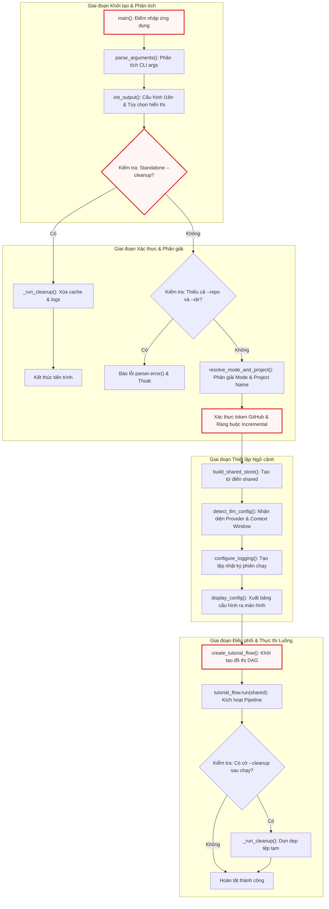

# main.py

> **Source:** `main.py`

Tiếp nối kiến trúc Đồ thị Có hướng Không Chu trình (DAG) được xây dựng trong [Chương 9 — flow.py](09_flow_py.md), tệp `main.py` đóng vai trò là điểm nhập thực thi trung tâm (Root Orchestration Entrypoint) và giao diện dòng lệnh (CLI Interface) của toàn bộ hệ thống tạo tài liệu. Thành phần này chịu trách nhiệm quản trị vòng đời ứng dụng từ thời điểm tiếp nhận đối số từ người dùng, nạp biến môi trường, khởi tạo hệ thống logging và bản địa hóa, phân giải cấu hình mô hình ngôn ngữ lớn (LLM), thiết lập bộ nhớ trạng thái dùng chung (`shared store`), cho đến việc kích hoạt luồng xử lý `PocketFlow` và dọn dẹp tài nguyên sau thực thi.

---

## 1. Tổng quan Kỹ thuật & Kiến trúc Hệ thống

`main.py` là mắt xích liên kết giữa giao diện người dùng bên ngoài và tầng điều phối luồng xử lý bên trong. Tệp chuyển đổi các tham số dòng lệnh khai báo phân tán thành một cấu trúc dữ liệu trạng thái hợp nhất (`shared`), đáp ứng hợp đồng dữ liệu mà các nút trong [Chương 11 — nodes.py](11_nodes_py.md) yêu cầu.

### Sơ đồ Luồng Thực thi Tổng thể (Execution Flowchart)



---

## 2. Hằng số & Cấu hình Phạm vi Module

### `DEFAULT_INCLUDE_PATTERNS`
* **Kiểu dữ liệu**: `set[str]`
* **Giá trị**: `{"*"}`
* **Mục đích kỹ thuật**: Định nghĩa tập hợp mẫu đường dẫn mặc định cho phép thu thập toàn bộ các tệp tin trong kho lưu trữ mã nguồn khi người dùng không truyền đối số `--include` (`-i`). Giá trị này hoạt động kết hợp cùng danh sách đen mặc định `DEFAULT_EXCLUDE_PATTERNS` được nạp từ [Chương 5 — exclude_patterns.py](05_exclude_patterns_py.md).

```python
# Default file patterns
DEFAULT_INCLUDE_PATTERNS = {"*"}

from utils.exclude_patterns import DEFAULT_EXCLUDE_PATTERNS
```

---

## 3. Các Hàm Cấp Module (Module-Level Functions)

### `parse_arguments()`
**Visibility**: Public  
**Signature**: `def parse_arguments() -> tuple[argparse.ArgumentParser, argparse.Namespace]:`

**Description**:  
Khởi tạo và cấu hình bộ phân tích đối số dòng lệnh `argparse.ArgumentParser`. Hàm thiết lập các nhóm tham số loại trừ lẫn nhau (mutually exclusive group) cho nguồn dữ liệu (`--repo` và `--dir`), các cờ cấu hình hành vi tài liệu, thông số suy luận LLM, tùy chọn bộ nhớ đệm, chiến lược gom cụm (batching), và chế độ sửa lỗi nâng cao (debug).

**Parameters**:  
* Không có tham số đầu vào. Hàm đọc trực tiếp từ `sys.argv`.

**Returns**:  
* `tuple[argparse.ArgumentParser, argparse.Namespace]`: Bộ đôi bao gồm đối tượng parser (để kích hoạt lỗi khi cần) và đối tượng chứa các giá trị đối số đã được phân tích cú pháp.

**Raises**:  
* `SystemExit`: Tự động kích hoạt bởi `argparse` nếu người dùng truyền sai cú pháp hoặc gọi `--help`.

**Example**:
```python
def parse_arguments():
    """Parse and return command-line arguments."""
    parser = argparse.ArgumentParser(description="Generate a tutorial for a GitHub codebase or local directory.")

    # Source: --repo or --dir (mutually exclusive but not required if --cleanup is used)
    source_group = parser.add_mutually_exclusive_group()
    source_group.add_argument("--repo", help="URL of the public GitHub repository.")
    source_group.add_argument("--dir", help="Path to local directory.")
    parser.add_argument("--cleanup", action="store_true", help="Clean up logs and cache files. Can be used standalone or after a run.")

    parser.add_argument("-n", "--name", help="Project name (optional, derived from repo/directory if omitted).")
    parser.add_argument("-t", "--token", help="GitHub personal access token (optional, reads from GITHUB_TOKEN env var if not provided).")
    parser.add_argument("-o", "--output", default="output", help="Base directory for output (default: ./output).")
    parser.add_argument("-i", "--include", nargs="+", help="Files to include (e.g., '*.py' '*.js'). Defaults to '*' (all files).")
    parser.add_argument(
        "-e",
        "--exclude",
        nargs="+",
        help="Files to exclude. Custom patterns are automatically merged with a massive global exclusion list (build caches, node_modules, binaries, media, AI environments) AND your repository's native .gitignore rules.",
    )
    parser.add_argument("-s", "--max-size", type=int, default=200000, help="Maximum file size in bytes (default: 200000, about 200KB).")
    # Add language parameter for multi-language support
    parser.add_argument("--language", default="english", help="Language for the generated tutorial (default: english).")
    # Add use_cache parameter to control LLM caching
    parser.add_argument("--no-cache", action="store_true", help="Disable LLM response caching (default: caching enabled).")
    # Add max_abstraction_num parameter to control the number of abstractions
    parser.add_argument("--max-abstractions", type=int, default=10, help="Maximum number of abstractions to identify (default: 10).")
    # Add thinking_level parameter for LLM reasoning capabilities
    parser.add_argument(
        "--thinking-level",
        default=None,
        help="Thinking effort level for native Gemini, OpenRouter, and Ollama reasoning models (e.g., low, medium, high). Leave empty to use model defaults.",
    )
    # Add max_tokens parameter
    parser.add_argument(
        "--max-tokens", type=int, default=None, help="Maximum number of tokens for the context window (default: fetched dynamically)."
    )

    # --- Documentation Mode & Generation Styles ---
    parser.add_argument(
        "--mode",
        choices=["tutorial", "advanced", "api-reference", "sdk"],
        default="tutorial",
        help="Documentation style (tutorial, advanced, api-reference, sdk). (default: tutorial).",
    )
    parser.add_argument("--advanced", action="store_true", help="Legacy flag: equivalent to --mode advanced.")
    parser.add_argument("--mkdocs", action="store_true", help="Format output for MkDocs Material (adds YAML frontmatter & nav snippet).")
    parser.add_argument(
        "--incremental",
        action="store_true",
        help="Enable MD5 incremental caching to skip unchanged modules (Only supported in --mode api-reference).",
    )
    parser.add_argument(
        "--force-rebuild", action="store_true", help="Clear incremental cache and regenerate all chapters from scratch (use with --incremental)."
    )

    # Add batching parameters
    parser.add_argument("--batch", type=int, default=50, help="Maximum files per batch when using map-reduce mode (default: 50).")
    parser.add_argument("--force-batch", action="store_true", help="Force map-reduce mode regardless of context size.")
    # Debug mode
    parser.add_argument("--debug", action="store_true", help="Enable verbose debug output.")

    return parser, parser.parse_args()
```

Hàm `parse_arguments` thiết lập cấu trúc đầu vào CLI mạnh mẽ với khả năng bảo vệ tính toàn vẹn dữ liệu ngay từ tầng phân tích cú pháp. Điểm đáng chú ý trong thiết kế là việc sử dụng `add_mutually_exclusive_group()` cho `--repo` và `--dir` nhưng không bắt buộc (`required=False`) ở cấp parser. Điều này cho phép người dùng kích hoạt cờ độc lập `--cleanup` mà không bị lỗi thiếu nguồn mã nguồn. Hàm cũng cung cấp khả năng tương thích ngược thông qua cờ `--advanced`, đồng thời hỗ trợ chuyển giao các danh sách lọc tệp (`--include`, `--exclude`) dưới dạng mảng chuỗi `nargs="+"` nhằm phục vụ cho các thuật toán so khớp mẫu `fnmatch` và `pathspec` ở các tầng xử lý sau.

---

### `resolve_mode_and_project()`
**Visibility**: Public  
**Signature**: `def resolve_mode_and_project(args: argparse.Namespace) -> tuple[str, str]:`

**Description**:  
Phân giải chế độ tạo tài liệu kỹ thuật và tự động suy luận định danh tên dự án (`project_name`) từ đường dẫn cục bộ hoặc URL từ xa nếu người dùng không cung cấp tường minh qua cờ `--name` (`-n`).

**Parameters**:  
* `args` (`argparse.Namespace`): Đối tượng chứa toàn bộ tham số dòng lệnh đã phân tích.

**Returns**:  
* `tuple[str, str]`: Bộ đôi bao gồm `(mode, project_name)`.

**Raises**:  
* Không phát sinh ngoại lệ trực tiếp. Tự động chuyển về giá trị mặc định `"project"` nếu không thể xác định nguồn.

**Example**:
```python
def resolve_mode_and_project(args):
    """Resolve documentation mode (handling --advanced legacy flag) and derive project name.

    Returns:
        tuple[str, str]: (mode, project_name)
    """
    mode = "advanced" if args.advanced else args.mode
    project_name = args.name
    if not project_name:
        if args.dir:
            project_name = os.path.basename(os.path.abspath(args.dir))
        elif args.repo:
            project_name = args.repo.rstrip("/").split("/")[-1]
        else:
            project_name = "project"
    return mode, project_name
```

Hàm xử lý độ ưu tiên cấu hình cho kiểu tài liệu: cờ kế thừa `--advanced` luôn được ưu tiên ghi đè lên tùy chọn `--mode` mặc định. Đối với việc xác định định danh dự án, hàm áp dụng giải thuật chuẩn hóa đường dẫn thông qua `os.path.abspath()` kết hợp `os.path.basename()` đối với thư mục cục bộ, loại bỏ các đường dẫn tương đối như `.` hoặc `..`. Đối với kho lưu trữ GitHub từ xa, hàm loại bỏ ký tự dấu gạch chéo cuối (`rstrip("/")`) và lấy phần tử cuối cùng của URL để trích xuất tên repository ngắn gọn, làm cơ sở tạo cấu trúc thư mục đầu ra đồng nhất.

---

### `build_shared_store()`
**Visibility**: Public  
**Signature**: `def build_shared_store(args: argparse.Namespace, github_token: str | None, mode: str) -> dict[str, Any]:`

**Description**:  
Khởi tạo cấu trúc dữ liệu trung tâm (`shared: dict`) đóng vai trò là bảng trạng thái chia sẻ (Shared State Store) được truyền xuyên suốt qua tất cả các nút trong đồ thị `PocketFlow`. Hàm này chuẩn hóa toàn bộ cấu hình, kết hợp các mẫu loại trừ mặc định và khởi tạo sẵn các vùng nhớ trống cho đầu ra của các nút xử lý phía sau.

**Parameters**:  
* `args` (`argparse.Namespace`): Các tham số dòng lệnh đã phân tích cú pháp.
* `github_token` (`str | None`): Mã thông báo xác thực GitHub cá nhân hoặc `None`.
* `mode` (`str`): Chế độ tài liệu đã được phân giải từ `resolve_mode_and_project()`.

**Returns**:  
* `dict`: Từ điển trạng thái toàn cục chứa toàn bộ tham số điều khiển và các khe dữ liệu kết quả (`files`, `abstractions`, `relationships`, `chapter_order`, `chapters`, `final_output_dir`).

**Raises**:  
* Không phát sinh ngoại lệ.

**Example**:
```python
def build_shared_store(args, github_token, mode):
    """Construct the shared store dictionary passed between PocketFlow nodes.

    Returns:
        dict: The shared store with all CLI args, patterns, and empty output slots.
    """
    return {
        "repo_url": args.repo,
        "local_dir": args.dir,
        "project_name": args.name,  # Can be None, FetchRepo will derive it
        "github_token": github_token,
        "output_dir": args.output,  # Base directory for CombineTutorial output
        # Include/exclude patterns and max file size
        "include_patterns": set(args.include) if args.include else DEFAULT_INCLUDE_PATTERNS,
        "exclude_patterns": DEFAULT_EXCLUDE_PATTERNS.union(set(args.exclude)) if args.exclude else DEFAULT_EXCLUDE_PATTERNS,
        "max_file_size": args.max_size,
        # Language for multi-language support
        "language": args.language,
        # Cache flag (inverse of no-cache)
        "use_cache": not args.no_cache,
        # Max abstractions
        "max_abstraction_num": args.max_abstractions,
        # LLM reasoning capabilities
        "thinking_level": args.thinking_level,
        # Max tokens override
        "max_tokens": args.max_tokens,
        # Mode, mkdocs, and incremental
        "mode": mode,
        "mkdocs": args.mkdocs,
        "incremental": args.incremental,
        "advanced_mode": mode == "advanced",
        # Batching settings
        "batch_size": args.batch,
        "force_batch": args.force_batch,
        # Debug mode
        "debug": args.debug,
        # Outputs populated by downstream nodes
        "files": [],
        "abstractions": [],
        "relationships": {},
        "chapter_order": [],
        "chapters": [],
        "final_output_dir": None,
    }
```

Hàm `build_shared_store` đóng vai trò là hợp đồng dữ liệu chuẩn hóa (Data Contract Factory) kết nối giữa CLI và đồ thị thực thi của `PocketFlow`. Cấu trúc từ điển được thiết kế bao gồm cả các cờ điều khiển luồng (`use_cache`, `force_batch`, `incremental`, `thinking_level`) lẫn các khe chứa dữ liệu trung gian dạng danh sách/từ điển trống. Việc sử dụng phép hợp tập hợp `DEFAULT_EXCLUDE_PATTERNS.union(set(args.exclude))` đảm bảo các quy tắc loại trừ hệ thống quan trọng (như `.git`, `node_modules`, môi trường ảo) luôn luôn được duy trì ngay cả khi người dùng bổ sung các mẫu loại trừ tùy chỉnh.

---

### `detect_llm_config()`
**Visibility**: Public  
**Signature**: `def detect_llm_config(args: argparse.Namespace) -> tuple[str, str, str, str, int]:`

**Description**:  
Truy vấn và nhận diện cấu hình backend suy luận LLM từ các biến môi trường hệ thống (`.env`). Hàm xác định nhà cung cấp (`LLM_PROVIDER`), tên mô hình, URL endpoint, API key, đồng thời phân giải kích thước cửa sổ ngữ cảnh tối đa (`context_length`) bằng cách gọi hàm `get_model_context_length()` từ [Chương 2 — call_llm.py](02_call_llm_py.md).

**Parameters**:  
* `args` (`argparse.Namespace`): Đối tượng tham số dòng lệnh (dùng để kiểm tra cờ ghi đè `--max-tokens`).

**Returns**:  
* `tuple[str, str, str, str, int]`: Bộ 5 phần tử gồm:
  1. `provider` (`str`): Tên định danh nhà cung cấp (ví dụ: `"OPENROUTER"`, `"GEMINI"`, `"OLLAMA"`, hoặc `"UNKNOWN"`).
  2. `model_name` (`str`): Tên định danh mô hình LLM.
  3. `endpoint_url` (`str`): Đường dẫn cơ sở kết nối API.
  4. `api_key` (`str`): Khóa bí mật dùng để xác thực.
  5. `context_length` (`int`): Giới hạn cửa sổ ngữ cảnh tính theo token.

**Raises**:  
* Không phát sinh ngoại lệ; tự động chuyển về cấu hình dự phòng Gemini hoặc các giá trị mặc định `"unknown"` nếu không tìm thấy cấu hình hợp lệ.

**Example**:
```python
def detect_llm_config(args):
    """Detect LLM provider, model, endpoint, and context length from environment.

    Returns:
        tuple: (provider, model_name, endpoint_url, api_key, context_length)
    """
    from utils.call_llm import get_model_context_length

    provider = os.environ.get("LLM_PROVIDER")
    if provider:
        model_name = os.environ.get(f"{provider}_MODEL", "unknown")
        endpoint_url = os.environ.get(f"{provider}_BASE_URL", "unknown")
        api_key = os.environ.get(f"{provider}_API_KEY", "")
    else:
        # Fallback to Gemini if neither provider is explicitly set but it's used
        if os.environ.get("GEMINI_PROJECT_ID") or os.environ.get("GEMINI_API_KEY"):
            provider = "GEMINI"
            model_name = os.environ.get("GEMINI_MODEL", "gemini-3.7-flash")
            endpoint_url = "generativelanguage.googleapis.com"
            api_key = os.environ.get("GEMINI_API_KEY", "")
        else:
            provider = "UNKNOWN"
            model_name = "unknown"
            endpoint_url = "unknown"
            api_key = ""

    context_length = args.max_tokens or get_model_context_length(endpoint_url, model_name, api_key)
    return provider, model_name, endpoint_url, api_key, context_length
```

Thuật toán nhận diện trong `detect_llm_config` tuân theo mô hình phân giải động theo không gian tên môi trường (Environment Variable Namespacing). Khi `LLM_PROVIDER` được chỉ định (chẳng hạn `OPENROUTER`), hàm sẽ tự động tra cứu các biến tiền tố tương ứng như `OPENROUTER_MODEL`, `OPENROUTER_BASE_URL` và `OPENROUTER_API_KEY`. Trong trường hợp biến định danh nhà cung cấp bị bỏ trống, hệ thống áp dụng cơ chế suy đoán thông minh (Heuristic Fallback): nếu phát hiện sự tồn tại của `GEMINI_PROJECT_ID` hoặc `GEMINI_API_KEY`, nó sẽ mặc định trỏ về hạ tầng Google Gemini (`gemini-3.7-flash`). Cuối cùng, giá trị `--max-tokens` từ CLI sẽ được ưu tiên cao nhất để ghi đè lên kết quả phân giải siêu dữ liệu từ hàm `get_model_context_length()`.

---

### `display_config()`
**Visibility**: Public  
**Signature**: `def display_config(args: argparse.Namespace, mode: str, provider: str, model_name: str, endpoint_url: str, context_length: int, log_file: str) -> None:`

**Description**:  
Xuất toàn bộ bảng tóm tắt cấu hình thực thi phiên chạy ra console thông qua hệ thống bản địa hóa và định dạng của [Chương 6 — output.py](06_output_py.md). Báo cáo này bao gồm thông tin nguồn mã nguồn, nhà cung cấp AI, giới hạn ngữ cảnh, cấp độ suy luận (thinking level), chiến lược gom cụm, và đường dẫn tệp nhật ký.

**Parameters**:  
* `args` (`argparse.Namespace`): Tham số dòng lệnh đã phân tích.
* `mode` (`str`): Chế độ tài liệu (`tutorial`, `advanced`, `api-reference`, `sdk`).
* `provider` (`str`): Tên định danh nhà cung cấp LLM.
* `model_name` (`str`): Tên mô hình LLM đang sử dụng.
* `endpoint_url` (`str`): Endpoint kết nối API.
* `context_length` (`int`): Kích thước cửa sổ ngữ cảnh tối đa.
* `log_file` (`str`): Đường dẫn tệp ghi log phiên chạy do `configure_logging()` trả về.

**Returns**:  
* `None`

**Raises**:  
* Không phát sinh ngoại lệ.

**Example**:
```python
def display_config(args, mode, provider, model_name, endpoint_url, context_length, log_file):
    """Emit all configuration values to the console."""
    emit("START_GENERATION", source=args.repo or args.dir, language=args.language.capitalize())
    emit("CFG_HEADER")
    emit("CFG_AI_PROVIDER", value=provider)
    emit("CFG_AI_ENDPOINT", value=endpoint_url)
    emit("CFG_AI_MODEL", value=model_name)
    emit("CFG_CONTEXT_LENGTH", value=f"{context_length:,}")
    emit("CFG_THINKING_LEVEL", value=args.thinking_level or "None")
    emit("CFG_BATCH_SIZE", value=f"{args.batch}")
    _enabled = get("CFG_VALUE_ENABLED")
    _disabled = get("CFG_VALUE_DISABLED")
    emit("CFG_FORCE_BATCH", value=_enabled if args.force_batch else _disabled)
    emit("CFG_OUTPUT_MODE", value=mode)
    emit("CFG_MKDOCS", value=_enabled if args.mkdocs else _disabled)
    emit("CFG_INCREMENTAL", value=_enabled if args.incremental else _disabled)
    if args.incremental:
        emit("CFG_FORCE_REBUILD", value=_enabled if args.force_rebuild else _disabled)
    if mode == "api-reference":
        emit("CFG_MAX_ABSTRACTIONS", value=get("CFG_VALUE_API_REF_MAX"))
    else:
        emit("CFG_MAX_ABSTRACTIONS", value=str(args.max_abstractions))
    emit("CFG_LLM_CACHING", value=_disabled if args.no_cache else _enabled)
    if args.debug:
        emit("CFG_DEBUG_MODE")
    emit("CFG_LOG_FILE", value=log_file)
    print()  # Blank line after config block
```

`display_config` sử dụng hoàn toàn hàm `emit()` và `get()` từ module `output.py`, đảm bảo mọi thông điệp in ra màn hình đều tuân thủ ngôn ngữ giao diện được chỉ định qua `--language`. Đối với các giá trị logic bật/tắt (như `force_batch`, `mkdocs`, `incremental`), hàm tra cứu chuỗi bản địa hóa tương ứng (`CFG_VALUE_ENABLED` / `CFG_VALUE_DISABLED`). Đặc biệt, nếu hệ thống vận hành ở chế độ `api-reference`, thông số `max_abstractions` sẽ tự động hiển thị nhãn vô hạn được định nghĩa trong `CFG_VALUE_API_REF_MAX` thay vì một con số cố định, phản ánh chính xác cơ chế ánh xạ tất định của nút `DeterministicFileMapper`.

---

### `_run_cleanup()`
**Visibility**: Private / Internal Helper  
**Signature**: `def _run_cleanup() -> None:`

**Description**:  
Thực hiện dọn dẹp hệ thống tệp đĩa cứng, bao gồm việc xóa tệp bộ nhớ đệm phản hồi LLM cục bộ (`llm_cache.json`) và xóa đệ quy toàn bộ thư mục chứa nhật ký thực thi (`logs/`).

**Parameters**:  
* Không có tham số đầu vào. Thư mục nhật ký được xác định qua biến môi trường `LOG_DIR` (mặc định là `"logs"`).

**Returns**:  
* `None`

**Raises**:  
* Bắt an toàn mọi ngoại lệ kiểu `Exception` trong quá trình xóa tệp/thư mục và thông báo qua sự kiện `CLEANUP_FAILED` thay vì làm sập ứng dụng.

**Example**:
```python
def _run_cleanup():
    """Clean up cache files and log directory."""
    import shutil

    emit("CLEANUP_START")

    for cache_path in ["llm_cache.json"]:
        if os.path.exists(cache_path):
            try:
                os.remove(cache_path)
                emit("CLEANUP_REMOVED", path=cache_path)
            except Exception as e:
                emit("CLEANUP_FAILED", path=cache_path, error=e)

    log_dir = os.environ.get("LOG_DIR", "logs")
    if os.path.exists(log_dir) and os.path.isdir(log_dir):
        try:
            shutil.rmtree(log_dir)
            emit("CLEANUP_REMOVED_DIR", path=log_dir)
        except Exception as e:
            emit("CLEANUP_FAILED", path=log_dir, error=e)
```

Hàm `_run_cleanup` sử dụng mô hình dọn dẹp phòng thủ (Defensive Cleanup Strategy). Nó kiểm tra sự tồn tại của tệp đệm và thư mục log bằng `os.path.exists()` và `os.path.isdir()` trước khi thực hiện thao tác xóa vật lý thông qua `os.remove()` và `shutil.rmtree()`. Việc bao bọc các thao tác I/O trong các khối `try...except Exception` độc lập giúp cô lập lỗi cục bộ (ví dụ: khi tệp nhật ký đang bị khóa bởi tiến trình khác trên hệ điều hành Windows), đảm bảo thông báo lỗi được đẩy ra logger/console mà không làm ngắt quãng vòng đời kết thúc của ứng dụng.

---

### `main()`
**Visibility**: Public  
**Signature**: `def main() -> None:`

**Description**:  
Hàm điều phối cấp cao nhất đóng vai trò là điểm khởi động tiến trình. `main()` kết nối toàn bộ chuỗi chức năng: nạp cấu hình, thẩm định các ràng buộc logic dòng lệnh, kích hoạt dọn dẹp độc lập (nếu có), phân giải manifest bộ nhớ đệm tăng dần (`.doc_cache_manifest.json`), khởi tạo đồ thị DAG qua `create_tutorial_flow()`, kích hoạt pipeline và thực hiện dọn dẹp tài nguyên hậu kỳ.

**Parameters**:  
* Không có tham số đầu vào.

**Returns**:  
* `None`

**Raises**:  
* `SystemExit`: Kích hoạt khi thiếu tham số đầu vào bắt buộc (`--repo`, `--dir`, hoặc `--cleanup`) thông qua phương thức `parser.error()`.

**Example**:
```python
def main():
    parser, args = parse_arguments()
    init_output(
        language=args.language,
        use_cache=not args.no_cache,
        thinking_level=args.thinking_level,
    )

    # Handle standalone --cleanup (no --dir or --repo)
    if args.cleanup and not args.dir and not args.repo:
        _run_cleanup()
        return

    # Require --dir or --repo for generation
    if not args.dir and not args.repo:
        parser.error("one of the arguments --repo --dir --cleanup is required")

    # Get GitHub token from argument or environment variable if using repo
    github_token = None
    if args.repo:
        github_token = args.token or os.environ.get("GITHUB_TOKEN")
        if not github_token:
            emit("WARN_NO_GITHUB_TOKEN")

    mode, project_name = resolve_mode_and_project(args)

    # Enforce incremental cache constraints
    if args.incremental and mode != "api-reference":
        emit("WARN_INCREMENTAL_API_ONLY")
        args.incremental = False

    # Handle --force-rebuild: delete the cache manifest to force fresh generation
    if args.force_rebuild and args.incremental:
        output_base = args.output or "output"
        manifest_path = os.path.join(output_base, project_name, ".doc_cache_manifest.json")
        if os.path.exists(manifest_path):
            os.remove(manifest_path)
            emit("FORCE_REBUILD_DELETED", path=manifest_path)
        else:
            emit("FORCE_REBUILD_NO_MANIFEST", path=manifest_path)
    elif args.force_rebuild and not args.incremental:
        emit("WARN_FORCE_REBUILD_NO_INCREMENTAL")

    shared = build_shared_store(args, github_token, mode)
    provider, model_name, endpoint_url, _, context_length = detect_llm_config(args)
    log_file = configure_logging(project_name=project_name, mode=mode)
    display_config(args, mode, provider, model_name, endpoint_url, context_length, log_file)

    # Create and run the flow
    tutorial_flow = create_tutorial_flow()
    tutorial_flow.run(shared)

    # Cleanup after run if requested
    if args.cleanup:
        _run_cleanup()
```

Hàm `main()` chứa các quy tắc logic nghiệp vụ quan trọng nhằm bảo đảm tính toàn vẹn trước khi vận hành đồ thị:
1. **Kiểm tra đầu vào tối thiểu**: Bắt buộc phải có ít nhất một trong ba cờ: `--repo`, `--dir` hoặc `--cleanup`. Nếu chỉ có `--cleanup`, hàm thực thi `_run_cleanup()` và thoát ngay lập tức bằng lệnh `return`.
2. **Kiểm tra Token GitHub**: Phát cảnh báo không chặn `WARN_NO_GITHUB_TOKEN` nếu người dùng quét repo từ xa mà không có token, giúp người dùng nhận biết nguy cơ bị chặn bởi GitHub Rate Limit.
3. **Ràng buộc Chế độ Tăng dần (Incremental Cache)**: Tính năng `--incremental` chỉ được hỗ trợ khi `--mode api-reference`. Nếu người dùng bật cờ này ở các chế độ khác, hệ thống sẽ tự động hạ cấp `args.incremental = False` và phát thông báo `WARN_INCREMENTAL_API_ONLY`.
4. **Xử lý Tái thiết Toàn bộ (`--force-rebuild`)**: Nếu người dùng kết hợp `--force-rebuild` cùng `--incremental`, hàm sẽ trực tiếp xóa tệp `.doc_cache_manifest.json` trong thư mục đích để ép buộc toàn bộ các chương phải sinh lại từ đầu.
5. **Điều phối và Dọn dẹp Hậu kỳ**: Thực thi `tutorial_flow.run(shared)` để chuyển giao toàn bộ quyền kiểm soát cho đồ thị DAG, và thực hiện xóa cache/log nếu người dùng yêu cầu `--cleanup` kèm theo lệnh sinh tài liệu.

---

## 4. Tương tác với Hệ sinh thái Cốt lõi

Bảng dưới đây mô tả cách `main.py` tích hợp với các module nội bộ khác trong hệ thống:

| Module Liên kết | Loại Tương tác | Mục đích Tích hợp |
| :--- | :--- | :--- |
| **`flow.py`** | Gọi trực tiếp | Khởi tạo đối tượng đồ thị DAG thực thi thông qua `create_tutorial_flow()`. |
| **`utils.output`** | Cấu hình & Xuất dữ liệu | Khởi tạo bảng dịch chuỗi (`init`), cấu hình tệp nhật ký (`configure_logging`), phát sự kiện định dạng (`emit`), và lấy chuỗi bản địa hóa (`get`). |
| **`utils.call_llm`** | Đo lường cấu hình | Phân giải kích thước cửa sổ ngữ cảnh thông qua `get_model_context_length()`. |
| **`utils.exclude_patterns`** | Nạp hằng số | Hợp nhất tập hợp `DEFAULT_EXCLUDE_PATTERNS` vào bộ lọc trạng thái chia sẻ. |
| **`nodes.py`** | Cung cấp dữ liệu gián tiếp | Định hình từ điển `shared` chứa toàn bộ cờ và mảng dữ liệu phục vụ các nút thực thi. |

---

## Xem Thêm (See Also)

* [Chương 1 — \_\_init\_\_.py](01___init___py.md): Khởi tạo gói tiện ích hạ tầng của hệ thống.
* [Chương 2 — call_llm.py](02_call_llm_py.md): Cổng kết nối hạ tầng LLM và phân giải độ dài ngữ cảnh mô hình.
* [Chương 5 — exclude_patterns.py](05_exclude_patterns_py.md): Danh mục quy tắc loại trừ tệp tin và thư mục mặc định.
* [Chương 6 — output.py](06_output_py.md): Hệ thống con quản lý giao diện dòng lệnh, logging và bản địa hóa đa ngôn ngữ.
* [Chương 9 — flow.py](09_flow_py.md): Định nghĩa đồ thị luồng công việc DAG và điều phối thực thi các nút.
* [Chương 11 — nodes.py](11_nodes_py.md): Các nút nghiệp vụ tiếp nhận và xử lý dữ liệu từ từ điển `shared`.

