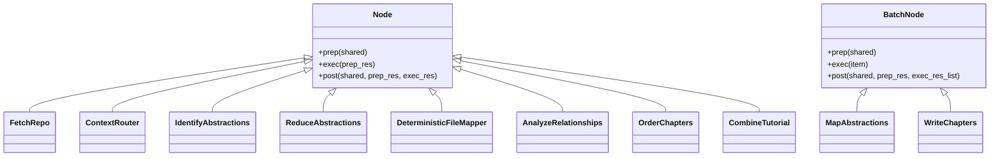
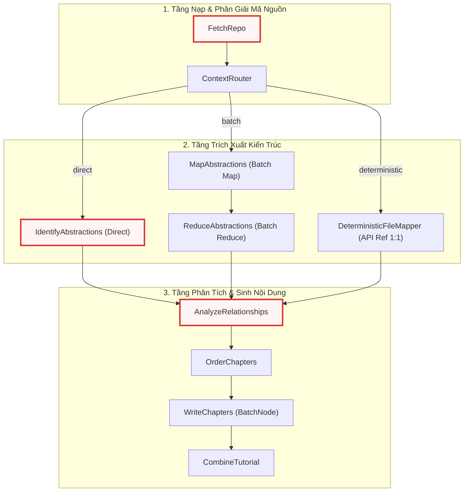

# nodes.py

> **Source:** `nodes.py`

Tệp `nodes.py` định nghĩa toàn bộ hệ thống các nút xử lý nghiệp vụ (Node Classes) và các hàm trợ giúp kỹ thuật cốt lõi, đóng vai trò là động cơ thực thi của toàn bộ quy trình phân tích mã nguồn và sinh tài liệu. Được xây dựng trên nền tảng framework `PocketFlow`, các lớp trong module này kế thừa từ `Node` hoặc `BatchNode`, hiện thực hóa kiến trúc ba giai đoạn chuẩn hóa gồm Chuẩn bị (`prep`), Thực thi (`exec`), và Hậu xử lý (`post`).

Trong vòng đời kiến trúc của hệ thống, tiếp nối giai đoạn phân tích tham số dòng lệnh và khởi tạo bảng trạng thái dùng chung tại [Chương 10 — main.py](10_main_py.md), tệp `nodes.py` tiếp nhận từ điển trạng thái `shared`, thực hiện quét tệp tin, tính toán phân bổ ngân sách token, điều phối suy luận đa tầng qua Mô hình Ngôn ngữ Lớn (LLM), và kết xuất cấu trúc trang tài liệu MkDocs hoặc Markdown độc lập. Các nút xử lý được kết nối và điều phối dưới dạng Đồ thị Có hướng Không Chu trình (DAG) trong [Chương 9 — flow.py](09_flow_py.md).

---

## Sơ đồ Kiến trúc & Phân cấp Lớp

Cấu trúc phân cấp kế thừa từ framework `PocketFlow` và quan hệ giữa các nút xử lý được mô tả qua sơ đồ lớp dưới đây:



Quy trình luân chuyển dữ liệu và phân nhánh định tuyến ngữ cảnh giữa các nút xử lý được minh họa chi tiết trong sơ đồ luồng:



---

## Module-Level Functions

Module cung cấp 6 hàm trợ giúp độc lập không trạng thái phục vụ phân tích cây thư mục, trích xuất mã nguồn, xử lý mẫu prompt, bóc tách cấu trúc phản hồi và định lượng tài nguyên token.

### `build_directory_tree()`
**Visibility**: Public  
**Signature**: `def build_directory_tree(files_data: list[tuple[str, str]]) -> str:`

**Description**: Xây dựng biểu diễn chuỗi phân cấp thu gọn của cây thư mục dự án dựa trên danh sách các bộ nhị phân `(đường_dẫn, nội_dung)`. Hàm nhóm các tệp theo thư mục cha, gán kèm chỉ số định danh (`idx:i`) vào từng tên tệp, và sắp xếp theo thứ tự bảng chữ cái. Cấu trúc cây này cung cấp thông tin ngữ cảnh không gian giúp LLM hiểu được phân bố vật lý của dự án mà không cần đọc toàn bộ nội dung tệp.

**Parameters**:
* `files_data` (`list[tuple[str, str]]`): Danh sách các phần tử chứa đường dẫn tương đối và nội dung tệp mã nguồn.

**Returns**:
* `str`: Chuỗi văn bản nhiều dòng biểu diễn cây thư mục đã định dạng và đánh chỉ số.

**Raises**:
* Không có ngoại lệ tường minh.

**Example**:
```python
def build_directory_tree(files_data):
    from collections import defaultdict

    dir_files = defaultdict(list)
    for i, (path, _content) in enumerate(files_data):
        dirname = os.path.dirname(path) or "."
        basename = os.path.basename(path)
        dir_files[dirname].append(f"{basename} (idx:{i})")

    lines = []
    for dirname in sorted(dir_files.keys()):
        lines.append(f"{dirname}/")
        lines.extend(f"  {fname}" for fname in sorted(dir_files[dirname]))
    return "\n".join(lines)
```

Hàm sử dụng `collections.defaultdict` để gom nhóm các tệp tin theo khóa là đường dẫn thư mục cha (`os.path.dirname`). Trong trường hợp tệp nằm ở thư mục gốc, giá trị `"."` sẽ được áp dụng làm định danh mặc định. Mỗi tệp tin được gắn thẻ chỉ số tương ứng trong mảng `files_data` (`(idx:i)`), cho phép các mô hình LLM tham chiếu chéo chính xác vị trí tệp khi đưa ra quyết định phân nhóm trừu tượng hóa kiến trúc. Cây thư mục đầu ra được sắp xếp tăng dần theo tên thư mục và tên tệp nhằm bảo đảm tính tất định tuyệt đối giữa các lần chạy.

---

### `get_content_for_indices()`
**Visibility**: Public  
**Signature**: `def get_content_for_indices(files_data: list[tuple[str, str]], indices: list[int]) -> dict[str, str]:`

**Description**: Trích xuất nội dung văn bản thuần của các tệp tin dựa trên danh sách chỉ số chỉ định từ tập dữ liệu `files_data`. Hàm định dạng khóa của từ điển kết quả theo mẫu chuẩn `"{index} # {path}"`, cung cấp cả thông tin số thứ tự và đường dẫn ngữ cảnh cho các prompt suy luận của LLM.

**Parameters**:
* `files_data` (`list[tuple[str, str]]`): Danh sách toàn bộ các tệp mã nguồn nạp từ kho lưu trữ.
* `indices` (`list[int]`): Danh sách các chỉ số nguyên đại diện cho các tệp cần trích xuất.

**Returns**:
* `dict[str, str]`: Bảng ánh xạ từ chuỗi định danh chỉ số - đường dẫn sang nội dung mã nguồn của tệp.

**Raises**:
* Không có ngoại lệ tường minh; tự động bỏ qua các chỉ số nằm ngoài phạm vi danh sách.

**Example**:
```python
def get_content_for_indices(files_data, indices):
    content_map = {}
    for i in indices:
        if 0 <= i < len(files_data):
            path, content = files_data[i]
            content_map[f"{i} # {path}"] = content  # Use index + path as key for context
    return content_map
```

Hàm thực hiện việc kiểm tra biên phòng thủ `0 <= i < len(files_data)` trước khi truy xuất dữ liệu từ danh sách. Cơ chế này ngăn ngừa triệt để lỗi `IndexError` khi LLM sinh ra các chỉ số tệp ảo (hallucinated indices). Việc nhúng chuỗi định danh `"{i} # {path}"` làm khóa giúp LLM duy trì khả năng liên kết giữa chỉ số logic mà nó đã phân tích ở các bước trước với nội dung mã nguồn thực tế khi sinh nội dung chi tiết cho từng chương.

---

### `load_prompt_template()`
**Visibility**: Public  
**Signature**: `def load_prompt_template(template_name: str, advanced_mode: bool = False, mode: str | None = None) -> str:`

**Description**: Đọc và nạp nội dung tệp mẫu Markdown từ thư mục con tương ứng bên trong cấu trúc `prompts/`. Hàm hỗ trợ linh hoạt các chế độ tài liệu (`tutorial`, `advanced`, `sdk`, `api-reference`) bằng cách điều hướng chính xác đường dẫn thư mục mẫu.

**Parameters**:
* `template_name` (`str`): Tên định danh của tệp mẫu prompt (không bao gồm phần mở rộng `.md`).
* `advanced_mode` (`bool`): Cờ kích hoạt chế độ chuyên sâu (chỉ sử dụng khi `mode` là `None`). Mặc định là `False`.
* `mode` (`str | None`): Tên chế độ tài liệu tường minh quy định thư mục chứa prompt. Mặc định là `None`.

**Returns**:
* `str`: Toàn bộ nội dung chuỗi văn bản của tệp mẫu prompt.

**Raises**:
* `FileNotFoundError`: Khi không tìm thấy tệp mẫu prompt tương ứng trên ổ đĩa.
* `OSError`: Khi xảy ra lỗi truy xuất I/O trong quá trình mở tệp.

**Example**:
```python
def load_prompt_template(template_name, advanced_mode=False, mode=None):
    if mode is None:
        prompt_dir = "advanced" if advanced_mode else "tutorial"
    else:
        prompt_dir = mode

    path = os.path.join(os.path.dirname(os.path.abspath(__file__)), "prompts", prompt_dir, f"{template_name}.md")
    with open(path, encoding="utf-8-sig") as f:
        return f.read()
```

Hàm xác định đường dẫn tệp tuyệt đối thông qua việc bóc tách vị trí vật lý của `nodes.py` bằng `os.path.abspath(__file__)`. Tệp được mở với bảng mã `utf-8-sig` nhằm loại bỏ ký tự Byte Order Mark (BOM) nếu có, ngăn chặn các lỗi biến dạng ký tự ẩn làm sai lệch cấu trúc định dạng chuỗi của Python khi thực hiện phép nội suy `str.format()`. Cơ chế này cho phép hệ thống phân tách hoàn toàn nội dung chỉ thị prompt khỏi mã nguồn logic.

---

### `parse_yaml_response()`
**Visibility**: Public  
**Signature**: `def parse_yaml_response(response: str) -> dict | list | Any:`

**Description**: Bóc tách và chuyển đổi chuỗi phản hồi từ LLM chứa khối mã YAML được bao bọc trong các khối rào mã ````yaml ... ```` thành các đối tượng Python (`dict` hoặc `list`).

**Parameters**:
* `response` (`str`): Chuỗi văn bản thô nhận về từ API của mô hình ngôn ngữ lớn.

**Returns**:
* `dict | list | Any`: Cấu trúc dữ liệu đã được phân tích cú pháp an toàn bằng thư viện `yaml`.

**Raises**:
* `ValueError`: Ném ra khi không tìm thấy khối mã ````yaml```` hoặc dữ liệu YAML bên trong bị lỗi cú pháp không thể nạp.

**Example**:
```python
def parse_yaml_response(response):
    try:
        yaml_str = response.strip().split("```yaml")[1].split("```")[0].strip()
        return yaml.safe_load(yaml_str)
    except Exception as e:
        raise ValueError(f"Failed to parse YAML: {e}") from e
```

Hàm sử dụng giải thuật cắt chuỗi hai giai đoạn để cô lập khối dữ liệu giữa thẻ bắt đầu ````yaml` và thẻ đóng ````. Kỹ thuật này loại bỏ toàn bộ các câu thoại dẫn dắt hoặc kết luận không mong muốn mà LLM có thể tự ý sinh ra ngoài khối mã. Phương thức `yaml.safe_load` được sử dụng để ngăn chặn việc thực thi mã độc hại (Arbitrary Code Execution) có thể xảy ra khi phân tích cú pháp các đối tượng không đáng tin cậy. Nếu quá trình trích xuất thất bại, hàm đóng gói ngoại lệ gốc thành một `ValueError` kèm thông báo chi tiết để kích hoạt cơ chế thử lại của đồ thị.

---

### `create_token_counter()`
**Visibility**: Public  
**Signature**: `def create_token_counter() -> Callable[[str], int]:`

**Description**: Hàm nhà máy (Factory function) khởi tạo một hàm đếm token có độ chính xác cao dựa trên bảng mã BPE `cl100k_base` của `tiktoken`, tích hợp giải thuật suy đoán heuristic dự phòng khi môi trường gặp sự cố.

**Parameters**:
* Không có tham số.

**Returns**:
* `Callable[[str], int]`: Hàm tiếp nhận một chuỗi văn bản và trả về số lượng token ước tính dạng số nguyên.

**Raises**:
* Không ném ngoại lệ ra ngoài; tự động bắt mọi lỗi khởi tạo và chuyển đổi sang hàm dự phòng.

**Example**:
```python
def create_token_counter():
    try:
        enc = tiktoken.get_encoding("cl100k_base")
        return lambda text: len(enc.encode(text, disallowed_special=()))
    except Exception:
        return lambda text: len(text) // 4
```

Hàm áp dụng mẫu thiết kế Graceful Degradation (Suy thoái êm dịu). Khi `tiktoken` tải thành công bảng mã `cl100k_base`, hàm lambda trả về sẽ vô hiệu hóa kiểm tra token đặc biệt bằng cờ `disallowed_special=()`, ngăn chặn các ngoại lệ khi mã nguồn chứa các chuỗi như `<|endoftext|>`. Trong trường hợp môi trường không thể nạp bảng từ vựng hoặc thiếu tài nguyên bộ nhớ, hàm tự động chuyển sang giải thuật heuristic $1\text{ token} \approx 4\text{ ký tự}$ (`len(text) // 4`), đảm bảo quy trình đo lường không bao giờ làm gián đoạn luồng thực thi chính.

---

### `resolve_max_tokens()`
**Visibility**: Public  
**Signature**: `def resolve_max_tokens(shared: dict[str, Any]) -> int:`

**Description**: Phân giải giới hạn kích thước cửa sổ ngữ cảnh tối đa (`max_tokens`) cho phiên chạy. Hàm ưu tiên giá trị được cấu hình tường minh trong từ điển `shared`, nếu không có sẽ tự động suy đoán dựa trên biến môi trường của nhà cung cấp LLM hiện tại.

**Parameters**:
* `shared` (`dict[str, Any]`): Bảng lưu trữ trạng thái dùng chung của pipeline.

**Returns**:
* `int`: Số lượng token tối đa mà cửa sổ ngữ cảnh của mô hình mục tiêu có thể xử lý.

**Raises**:
* Không có ngoại lệ tường minh.

**Example**:
```python
def resolve_max_tokens(shared):
    max_tokens = shared.get("max_tokens")
    if max_tokens is not None:
        return max_tokens
    provider = os.environ.get("LLM_PROVIDER")
    if provider == "GEMINI" or not provider:
        endpoint = "https://generativelanguage.googleapis.com"
        model_name = os.getenv("GEMINI_MODEL", "gemini-3.7-flash")
        api_key = os.getenv("GEMINI_API_KEY", "")
    else:
        endpoint = os.environ.get(f"{provider}_BASE_URL", "")
        model_name = os.environ.get(f"{provider}_MODEL", "")
        api_key = os.environ.get(f"{provider}_API_KEY", "")
    return get_model_context_length(endpoint, model_name, api_key)
```

Hàm hoạt động theo cơ chế phân giải phân cấp (Hierarchical Fallback). Khi khóa `max_tokens` chưa được gán giá trị trong `shared`, hàm kiểm tra biến `LLM_PROVIDER`. Đối với nhà cung cấp mặc định hoặc `GEMINI`, hàm thiết lập endpoint của Google Generative Language API và nạp mô hình từ `GEMINI_MODEL`. Đối với các nhà cung cấp khác (như OpenAI, OpenRouter), hàm xây dựng biến môi trường động theo mẫu `{provider}_BASE_URL`, `{provider}_MODEL`, và `{provider}_API_KEY`, sau đó ủy quyền việc truy vấn kích thước ngữ cảnh cho hàm `get_model_context_length` từ module [Chương 2 — call_llm.py](02_call_llm_py.md).

---

## Class: `FetchRepo`

`FetchRepo` là nút nhập liệu đầu tiên trong đồ thị DAG, kế thừa từ lớp `Node`. Nút này chịu trách nhiệm thu thập toàn bộ các tệp mã nguồn từ kho lưu trữ GitHub từ xa hoặc thư mục tệp tin cục bộ, áp dụng các bộ lọc loại trừ/bao gồm, và chuyển đổi dữ liệu thành danh sách các bộ nhị phân chuẩn hóa lưu trong bảng trạng thái `shared`.

### `FetchRepo.prep()`
**Visibility**: Public  
**Signature**: `def prep(self, shared: dict[str, Any]) -> dict[str, Any]:`

**Description**: Trích xuất cấu hình nguồn mã nguồn, phân giải tên dự án (`project_name`) nếu chưa được thiết lập, và đóng gói các mẫu lọc (`include_patterns`, `exclude_patterns`, `max_file_size`) phục vụ tiến trình quét.

**Parameters**:
* `shared` (`dict[str, Any]`): Bảng trạng thái chia sẻ chứa thông tin URL kho lưu trữ hoặc đường dẫn thư mục cục bộ.

**Returns**:
* `dict[str, Any]`: Từ điển chứa toàn bộ tham số cấu hình nạp tệp đã được chuẩn hóa.

**Raises**:
* Không có ngoại lệ tường minh.

**Example**:
```python
class FetchRepo(Node):
    def prep(self, shared):
        repo_url = shared.get("repo_url")
        local_dir = shared.get("local_dir")
        project_name = shared.get("project_name")

        if not project_name:
            if repo_url:
                project_name = repo_url.split("/")[-1].replace(".git", "")
            else:
                project_name = os.path.basename(os.path.abspath(local_dir))
            shared["project_name"] = project_name

        include_patterns = shared["include_patterns"]
        exclude_patterns = shared["exclude_patterns"]
        max_file_size = shared["max_file_size"]

        return {
            "repo_url": repo_url,
            "local_dir": local_dir,
            "token": shared.get("github_token"),
            "include_patterns": include_patterns,
            "exclude_patterns": exclude_patterns,
            "max_file_size": max_file_size,
            "use_relative_paths": True,
        }
```

Phương thức kiểm tra sự tồn tại của `project_name` trong `shared`. Nếu bị khuyết, nó tự động trích xuất tên dự án từ phần cuối của URL GitHub (loại bỏ đuôi `.git`) hoặc lấy tên thư mục cuối cùng từ đường dẫn tuyệt đối của `local_dir`. Sau đó, nó gom nhóm toàn bộ các tham số quét tệp cần thiết thành một từ điển cấu hình và bàn giao cho giai đoạn `exec`.

---

### `FetchRepo.exec()`
**Visibility**: Public  
**Signature**: `def exec(self, prep_res: dict[str, Any]) -> list[tuple[str, str]]:`

**Description**: Thực thi việc thu thập mã nguồn bằng cách gọi module `crawl_github_files` (nếu có `repo_url`) hoặc `crawl_local_files` (nếu dùng `local_dir`). Chuyển đổi từ điển tệp tin thành danh sách các bộ `(đường_dẫn, nội_dung)`.

**Parameters**:
* `prep_res` (`dict[str, Any]`): Kết quả cấu hình từ phương thức `prep`.

**Returns**:
* `list[tuple[str, str]]`: Danh sách các phần tử nhị phân chứa đường dẫn tệp và nội dung văn bản thuần.

**Raises**:
* `ValueError`: Ném ra khi kết quả quét không tìm thấy bất kỳ tệp hợp lệ nào phù hợp với quy tắc lọc.

**Example**:
```python
    def exec(self, prep_res):
        source = prep_res["repo_url"] or prep_res["local_dir"]
        llm_logger.info(f"NODE EXEC | node=FetchRepo | action=crawl_files | source={source}")

        if prep_res["repo_url"]:
            emit("CRAWL_REPOSITORY", url=prep_res["repo_url"])
            result = crawl_github_files(
                repo_url=prep_res["repo_url"],
                token=prep_res["token"],
                include_patterns=prep_res["include_patterns"],
                exclude_patterns=prep_res["exclude_patterns"],
                max_file_size=prep_res["max_file_size"],
                use_relative_paths=prep_res["use_relative_paths"],
            )
        else:
            emit("CRAWL_DIRECTORY", path=prep_res["local_dir"])
            result = crawl_local_files(
                directory=prep_res["local_dir"],
                include_patterns=prep_res["include_patterns"],
                exclude_patterns=prep_res["exclude_patterns"],
                max_file_size=prep_res["max_file_size"],
                use_relative_paths=prep_res["use_relative_paths"],
            )

        files_list = list(result.get("files", {}).items())
        if len(files_list) == 0:
            raise ValueError("No matching files found. Check your directory and include/exclude patterns.")

        llm_logger.info(f"NODE COMPLETE | node=FetchRepo | files_found={len(files_list)}")
        return files_list
```

Phương thức thực hiện rẽ nhánh thu thập dữ liệu dựa trên nguồn đầu vào. Đối với kho lưu trữ từ xa, nó ủy quyền xử lý cho `crawl_github_files` từ [Chương 3 — crawl_github_files.py](03_crawl_github_files_py.md). Đối với thư mục nội bộ, nó gọi `crawl_local_files` từ [Chương 4 — crawl_local_files.py](04_crawl_local_files_py.md). Kết quả trả về từ bộ quét được chuyển đổi từ dạng từ điển `dict[path, content]` sang danh sách các tuple `[(path, content), ...]`. Nếu danh sách rỗng, phương thức lập tức ném lỗi `ValueError` để chặn đứng pipeline trước khi tiêu tốn tài nguyên suy luận LLM.

---

### `FetchRepo.post()`
**Visibility**: Public  
**Signature**: `def post(self, shared: dict[str, Any], prep_res: dict[str, Any], exec_res: list[tuple[str, str]]) -> None:`

**Description**: Lưu trữ danh sách tệp mã nguồn thu thập được vào bảng trạng thái `shared["files"]`.

**Parameters**:
* `shared` (`dict[str, Any]`): Bảng trạng thái chia sẻ toàn cục.
* `prep_res` (`dict[str, Any]`): Kết quả trả về từ `prep`.
* `exec_res` (`list[tuple[str, str]]`): Danh sách các tệp mã nguồn thu thập được từ `exec`.

**Returns**:
* `None`

**Raises**:
* Không có ngoại lệ tường minh.

**Example**:
```python
    def post(self, shared, prep_res, exec_res):
        shared["files"] = exec_res  # List of (path, content) tuples
```

Phương thức thực hiện thao tác gán trực tiếp danh sách tệp vào khóa `"files"` của từ điển `shared`, làm tiền đề dữ liệu đầu vào cho các nút phân tích kích thước ngữ cảnh và trích xuất cấu trúc tiếp theo trong đồ thị.

---

## Class: `ContextRouter`

`ContextRouter` là nút định tuyến logic điều kiện quan trọng nhất của hệ thống, kế thừa từ lớp `Node`. Nút này tính toán tổng dung lượng token của toàn bộ dự án, đối soát với giới hạn an toàn của mô hình LLM, và quyết định rẽ nhánh luồng công việc theo một trong ba chiến lược: `deterministic` (ánh xạ tệp 1:1), `direct` (xử lý toàn bộ trong một lượt), hoặc `batch` (chia lô theo cấu trúc thư mục).

### `ContextRouter.prep()`
**Visibility**: Public  
**Signature**: `def prep(self, shared: dict[str, Any]) -> tuple:`

**Description**: Đo lường chi phí token cố định của prompt (mẫu prompt, cây thư mục, danh mục chỉ số tệp) và nội dung của toàn bộ các tệp tin. Thiết lập ngưỡng an toàn bằng 95% `max_tokens` và tính toán giới hạn hiệu dụng (`effective_limit`). Xác định hành động định tuyến ban đầu.

**Parameters**:
* `shared` (`dict[str, Any]`): Bảng trạng thái chia sẻ chứa dữ liệu tệp và cấu hình chế độ.

**Returns**:
* `tuple`: Bộ dữ liệu gồm hành vi định tuyến (`route`), danh sách tệp, giới hạn hiệu dụng, kích thước lô, mảng token từng tệp, hàm đếm token, cây thư mục, và cờ gỡ lỗi.

**Raises**:
* Không có ngoại lệ tường minh.

**Example**:
```python
class ContextRouter(Node):
    def prep(self, shared):
        files_data = shared["files"]
        max_tokens = resolve_max_tokens(shared)
        shared["max_tokens"] = max_tokens

        count_tokens = create_token_counter()
        # // ... [Tính toán chi phí prompt_overhead từ template, directory tree, và listing] ...

        prompt_overhead = max_template_tokens + tree_tokens + listing_tokens
        # // ... [Tính tổng total_tokens và xây dựng file_token_map] ...

        safety_limit = int(max_tokens * 0.95)
        effective_limit = safety_limit - prompt_overhead
        force_batch = shared.get("force_batch", False)

        if shared.get("mode", "tutorial") == "api-reference":
            emit("CAPACITY_API_REF_MODE")
            return ("deterministic", files_data, effective_limit, shared.get("batch_size", 50), None, None, directory_tree, False)

        if total_tokens > effective_limit or force_batch:
            # // ... [Phát thông báo emit tương ứng] ...
            return ("batch", files_data, effective_limit, shared.get("batch_size", 50), file_token_map, count_tokens, directory_tree, shared.get("debug", False))

        return ("direct", files_data, effective_limit, shared.get("batch_size", 50), None, None, directory_tree, False)
```

Giai đoạn `prep` thực hiện giải thuật định lượng tài nguyên phòng thủ chặt chẽ. Nó tính toán chi phí token tĩnh phát sinh từ mẫu prompt dài nhất giữa các chế độ, chuỗi cây thư mục và danh sách chỉ mục tệp tin (`prompt_overhead`). Ngưỡng an toàn tuyệt đối được chốt ở mức $95\%$ kích thước ngữ cảnh tối đa của mô hình (`safety_limit`), từ đó suy ra dung lượng thực tế dành cho mã nguồn (`effective_limit = safety_limit - prompt_overhead`). Nếu người dùng yêu cầu chế độ `api-reference`, nút lập tức chuyển sang nhánh `"deterministic"`. Nếu tổng token vượt quá giới hạn hiệu dụng hoặc cờ `force_batch` được kích hoạt, luồng sẽ chuyển sang `"batch"`; ngược lại, nếu toàn bộ mã nguồn nằm trong giới hạn an toàn, nhánh `"direct"` sẽ được chọn.

---

### `ContextRouter.exec()`
**Visibility**: Public  
**Signature**: `def exec(self, prep_res: tuple) -> str | list[list[tuple[int, str, str]]]:`

**Description**: Xử lý logic chia lô thông minh bảo toàn tính liên kết ngữ cảnh theo thư mục (Directory-Aware Batching). Gom nhóm các tệp theo thư mục cha và phân bổ vào từng lô sao cho không bao giờ trộn lẫn các thư mục khác nhau và không vượt quá `effective_limit` hoặc `batch_size`.

**Parameters**:
* `prep_res` (`tuple`): Dữ liệu tính toán dung lượng ngữ cảnh từ `prep`.

**Returns**:
* `str | list[list[tuple[int, str, str]]]`: Chuỗi định tuyến `"direct"` / `"deterministic"`, hoặc danh sách các lô tệp tin sẵn sàng cho `MapAbstractions`.

**Raises**:
* Không có ngoại lệ tường minh.

**Example**:
```python
    def exec(self, prep_res):
        route, files_data, effective_limit, batch_size, file_token_map, _count_tokens, directory_tree, debug = prep_res
        if route in ("direct", "deterministic"):
            return route

        dir_groups = defaultdict(list)
        for i, (path, content) in enumerate(files_data):
            dir_groups[os.path.dirname(path)].append((i, path, content, file_token_map[i]))

        batches = []
        for dirname in sorted(dir_groups.keys()):
            current_batch = []
            current_tokens = 0

            for i, path, content, tokens in dir_groups[dirname]:
                if current_batch and (current_tokens + tokens > effective_limit or len(current_batch) >= batch_size):
                    batches.append(current_batch)
                    current_batch = []
                    current_tokens = 0

                current_batch.append((i, path, content))
                current_tokens += tokens

            if current_batch:
                batches.append(current_batch)

        self._directory_tree = directory_tree
        return batches
```

Phương thức giải quyết bài toán phân mảnh ngữ cảnh bằng cách phân nhóm toàn bộ tệp tin theo đường dẫn thư mục (`dir_groups`). Khi duyệt qua từng thư mục, hệ thống tích lũy các tệp vào `current_batch` kèm theo số lượng token đã tính trước. Một lô mới chỉ được khởi tạo khi việc bổ sung thêm một tệp sẽ làm vượt quá giới hạn `effective_limit` hoặc chạm trần số lượng tệp `batch_size`. Đặc biệt, các tệp trong cùng một thư mục luôn được ưu tiên đóng gói chung, ngăn ngừa hiện tượng mất mát ngữ cảnh cấu trúc khi gửi dữ liệu sang các tiến trình phân tích song song.

---

### `ContextRouter.post()`
**Visibility**: Public  
**Signature**: `def post(self, shared: dict[str, Any], prep_res: tuple, exec_res: Any) -> str:`

**Description**: Cập nhật danh sách các lô tệp (`file_batches`) và chuỗi cây thư mục (`directory_tree`) vào từ điển `shared`. Trả về định danh hành động điều hướng cho đồ thị DAG (`"direct"`, `"deterministic"`, hoặc `"batch"`).

**Parameters**:
* `shared` (`dict[str, Any]`): Bảng trạng thái chia sẻ toàn cục.
* `prep_res` (`tuple`): Dữ liệu chuẩn bị từ `prep`.
* `exec_res` (`Any`): Kết quả định tuyến hoặc danh sách các lô tệp từ `exec`.

**Returns**:
* `str`: Nhãn chuyển tiếp nhánh điều hướng của đồ thị `PocketFlow`.

**Raises**:
* Không có ngoại lệ tường minh.

**Example**:
```python
    def post(self, shared, prep_res, exec_res):
        if exec_res == "direct":
            return "direct"
        if exec_res == "deterministic":
            return "deterministic"
        shared["file_batches"] = exec_res
        shared["directory_tree"] = getattr(self, "_directory_tree", build_directory_tree(shared["files"]))
        return "batch"
```

Phương thức đóng vai trò là cổng điều hướng luồng dữ liệu (Flow Gate). Nó kiểm tra kết quả trả về từ `exec`: nếu là chuỗi định tuyến đơn lẻ, nó lập tức hoàn trả giá trị để kích hoạt nhánh chuyển tiếp tương ứng trong DAG của `flow.py`. Trong trường hợp chạy theo lô, nó lưu mảng các lô tệp vào `shared["file_batches"]`, đính kèm cây thư mục đại diện vào `shared["directory_tree"]`, và trả về chuỗi hành động `"batch"`.

---

## Class: `DeterministicFileMapper`

`DeterministicFileMapper` kế thừa từ `Node`, là thành phần cốt lõi xử lý chế độ tham chiếu API tất định (`api-reference`). Nút này sử dụng LLM để lọc bỏ các tệp không chứa mã nguồn thực tế (tệp cấu hình, văn bản tĩnh), sau đó tự động thiết lập ánh xạ quan hệ 1:1 giữa mỗi tệp mã nguồn hợp lệ và một chương tài liệu, sắp xếp thứ tự xử lý theo độ sâu thư mục (từ lá lên gốc).

### `DeterministicFileMapper.prep()`
**Visibility**: Public  
**Signature**: `def prep(self, shared: dict[str, Any]) -> tuple[str, bool, str | None, int]:`

**Description**: Xây dựng danh sách toàn bộ các tệp tin kèm chỉ số định danh và gọi hàm `build_code_file_filter_prompt` từ [Chương 7 — prompts.py](07_prompts_py.md) để tạo câu lệnh yêu cầu LLM xác định các tệp mã nguồn thực thụ.

**Parameters**:
* `shared` (`dict[str, Any]`): Bảng trạng thái chia sẻ.

**Returns**:
* `tuple[str, bool, str | None, int]`: Bộ 4 phần tử gồm chuỗi prompt lọc tệp, cờ sử dụng cache, mức độ suy luận thinking, và giới hạn token tối đa.

**Raises**:
* Không có ngoại lệ tường minh.

**Example**:
```python
class DeterministicFileMapper(Node):
    def prep(self, shared):
        files_data = shared["files"]
        project_name = shared["project_name"]

        file_listing = "\n".join([f"{i} # {path}" for i, (path, _) in enumerate(files_data)])

        prompt = build_code_file_filter_prompt(project_name, file_listing)
        return prompt, shared.get("use_cache", True), shared.get("thinking_level", None), shared.get("max_tokens", 100000)
```

Phương thức duyệt qua toàn bộ danh sách `files_data`, chuyển đổi thành chuỗi liệt kê chỉ số định danh kết hợp đường dẫn theo mẫu `"{i} # {path}"`. Chuỗi này được đưa vào hàm tiện ích `build_code_file_filter_prompt` để sinh câu lệnh yêu cầu LLM phân tích phần mở rộng và ngữ cảnh đường dẫn, nhằm lọc bỏ các tệp cấu hình không cần thiết trước khi bước vào giai đoạn ánh xạ chi tiết.

---

### `DeterministicFileMapper.exec()`
**Visibility**: Public  
**Signature**: `def exec(self, prep_res: tuple) -> list[int]:`

**Description**: Gửi prompt lọc tệp tới LLM qua hàm `call_llm`, phân tích cú pháp khối YAML trả về thành danh sách các chỉ số nguyên của những tệp mã nguồn hợp lệ.

**Parameters**:
* `prep_res` (`tuple`): Bộ tham số chuẩn bị từ `prep`.

**Returns**:
* `list[int]`: Danh sách các chỉ số tệp mã nguồn đã được thẩm định.

**Raises**:
* `Exception`: Bắt mọi lỗi trong quá trình gọi LLM hoặc phân tích YAML, ghi nhật ký chi tiết qua `llm_logger` và ném lại ngoại lệ để kích hoạt cơ chế retry của `PocketFlow`.

**Example**:
```python
    def exec(self, prep_res):
        try:
            prompt, use_cache, thinking_level, max_tokens = prep_res
            emit("LLM_CALL_FILTER_FILES")
            log_token_estimation(self.__class__.__name__, prompt, max_tokens)
            response = call_llm(prompt, use_cache=(use_cache and self.cur_retry == 0), thinking_level=thinking_level)
            valid_indices = parse_yaml_response(response)
            if not isinstance(valid_indices, list):
                valid_indices = []
            return [int(idx) for idx in valid_indices]
        except Exception as e:
            emit("NODE_RETRY_ERROR", class_name=self.__class__.__name__, error=e)
            llm_logger.error(f"[Node {self.__class__.__name__}] Error: {e}", exc_info=True)
            raise e
```

Phương thức sử dụng `log_token_estimation` từ [Chương 8 — token_utils.py](08_token_utils_py.md) để ghi nhận dung lượng ngữ cảnh trước khi gọi `call_llm`. Kết quả phản hồi được chuyển qua hàm `parse_yaml_response`. Đoạn mã thực hiện kiểm tra an toàn kiểu dữ liệu bằng `isinstance(valid_indices, list)` và ép kiểu toàn bộ phần tử sang số nguyên (`int(idx)`), loại bỏ triệt để các định dạng chuỗi không hợp lệ có thể gây lỗi chỉ mục mảng về sau.

---

### `DeterministicFileMapper.post()`
**Visibility**: Public  
**Signature**: `def post(self, shared: dict[str, Any], prep_res: tuple, exec_res: list[int]) -> str:`

**Description**: Khởi tạo danh sách các module trừu tượng hóa 1:1 cho từng tệp hợp lệ, sắp xếp thứ tự chương (`chapter_order`) theo độ sâu thư mục (từ sâu nhất đến nông nhất, sau đó theo bảng chữ cái), và gán cấu trúc quan hệ mặc định vào `shared`.

**Parameters**:
* `shared` (`dict[str, Any]`): Bảng trạng thái chia sẻ toàn cục.
* `prep_res` (`tuple`): Dữ liệu từ `prep`.
* `exec_res` (`list[int]`): Danh sách các chỉ số tệp hợp lệ từ `exec`.

**Returns**:
* `str`: Luôn trả về chuỗi `"default"`.

**Raises**:
* Không có ngoại lệ tường minh.

**Example**:
```python
    def post(self, shared, prep_res, exec_res):
        import os

        files = shared.get("files", [])
        valid_indices = set(exec_res)
        modules = []
        chapter_order = []

        for idx, (file_path, _content) in enumerate(files):
            if idx not in valid_indices:
                emit("SKIP_NON_CODE_FILE", path=file_path)
                continue

            clean_name = os.path.basename(file_path)
            modules.append(
                {"name": clean_name, "description": f"Internal API reference for `{file_path}`", "files": [idx], "original_path": file_path}
            )
            chapter_order.append(len(modules) - 1)

        shared["abstractions"] = modules
        shared["chapter_order"] = sorted(
            chapter_order,
            key=lambda idx: (
                -modules[idx]["original_path"].count("/") - modules[idx]["original_path"].count(os.sep),
                modules[idx]["original_path"].lower(),
            ),
        )
        shared["relationships"] = {"summary": "Deterministic Internal API Reference.", "details": []}
        emit("DONE_DETERMINISTIC_MAPPER", count=len(modules))
        return "default"
```

Phương thức triển khai chiến lược sắp xếp thứ tự chương mang tính quyết định: các tệp ở tầng thư mục sâu nhất (các tệp lá/tiện ích như `utils/`) sẽ được ưu tiên đưa lên xử lý trước các tệp điều phối ở tầng ngoài (như `main.py`). Bằng cách đếm số lượng dấu phân cách thư mục (`/` và `os.sep`) và lấy giá trị đối âm làm khóa chính, hệ thống đảm bảo rằng khi LLM sinh tài liệu cho các module điều phối cấp cao, bản tóm tắt kỹ thuật của toàn bộ các module phụ thuộc tầng dưới đã có sẵn trong bộ nhớ ngữ cảnh.

---

## Class: `IdentifyAbstractions`

`IdentifyAbstractions` kế thừa từ `Node`, là nút trích xuất kiến trúc áp dụng cho luồng xử lý trực tiếp (`direct path`). Nút này xây dựng ngữ cảnh toàn bộ dự án (nằm trong giới hạn an toàn), gọi LLM để nhận diện các khái niệm trừu tượng hóa cốt lõi, và xác thực tính hợp lệ của các chỉ số tệp liên quan.

### `IdentifyAbstractions.prep()`
**Visibility**: Public  
**Signature**: `def prep(self, shared: dict[str, Any]) -> tuple:`

**Description**: Xây dựng chuỗi ngữ cảnh mã nguồn tích lũy tôn trọng giới hạn an toàn token, tạo chuỗi cây thư mục dự án, và đóng gói toàn bộ 11 tham số cần thiết cho quá trình gọi mô hình.

**Parameters**:
* `shared` (`dict[str, Any]`): Bảng trạng thái chia sẻ.

**Returns**:
* `tuple`: Bộ 11 phần tử chứa ngữ cảnh mã nguồn, cây thư mục, tổng số tệp, tên dự án, ngôn ngữ, cờ cache, số lượng trừu tượng hóa tối đa, mức độ suy luận, cờ chế độ nâng cao, giới hạn token và chế độ tài liệu.

**Raises**:
* Không có ngoại lệ tường minh.

**Example**:
```python
class IdentifyAbstractions(Node):
    def prep(self, shared):
        files_data = shared["files"]
        project_name = shared["project_name"]
        language = shared.get("language", "english")
        use_cache = shared.get("use_cache", True)
        max_abstraction_num = shared.get("max_abstraction_num", 10)
        thinking_level = shared.get("thinking_level", None)

        def create_llm_context(files_data):
            max_tokens = resolve_max_tokens(shared)
            safety_limit = int(max_tokens * 0.95)
            count_tokens = create_token_counter()
            context = ""
            current_tokens = 0

            for i, (path, content) in enumerate(files_data):
                entry = f"--- File Index {i}: {path} ---\n{content}\n\n"
                entry_tokens = count_tokens(entry)
                if current_tokens + entry_tokens > safety_limit:
                    emit("WARN_CONTEXT_TRUNCATED", index=i, path=path, limit=safety_limit)
                    break
                context += entry
                current_tokens += entry_tokens
            return context

        context = create_llm_context(files_data)
        directory_tree = build_directory_tree(files_data)
        return (
            context, directory_tree, len(files_data), project_name, language,
            use_cache, max_abstraction_num, thinking_level,
            shared.get("advanced_mode", False), shared.get("max_tokens", 100000), shared.get("mode", "tutorial")
        )
```

Hàm cục bộ `create_llm_context` lặp qua từng tệp trong `files_data`, tính toán kích thước token của từng khối và cộng dồn vào chuỗi `context`. Nếu việc thêm một tệp làm tổng token vượt quá ngưỡng `safety_limit`, vòng lặp sẽ dừng ngay lập tức và phát cảnh báo `"WARN_CONTEXT_TRUNCATED"`. Kỹ thuật phòng thủ này ngăn chặn hoàn toàn lỗi tràn cửa sổ ngữ cảnh khi gọi API LLM ở bước `exec`.

---

### `IdentifyAbstractions.exec()`
**Visibility**: Public  
**Signature**: `def exec(self, prep_res: tuple) -> list[dict[str, Any]]:`

**Description**: Nạp mẫu prompt `identify_abstractions`, định dạng các tham số đa ngôn ngữ, gửi yêu cầu tới LLM, và tiến hành kiểm tra cấu trúc nghiêm ngặt cùng giải thuật bóc tách dải chỉ số tệp tin (hỗ trợ định dạng khoảng `start-end`).

**Parameters**:
* `prep_res` (`tuple`): Bộ 11 tham số từ `prep`.

**Returns**:
* `list[dict[str, Any]]`: Danh sách các đối tượng trừu tượng hóa hợp lệ gồm `name`, `description`, và mảng chỉ số tệp `files`.

**Raises**:
* `ValueError`: Ném ra khi kết quả từ LLM không phải dạng danh sách hoặc thiếu các trường bắt buộc (`name`, `description`, `file_indices`).
* `Exception`: Bắt các lỗi hạ tầng khác và ném lại để kích hoạt cơ chế retry.

**Example**:
```python
    def exec(self, prep_res):
        try:
            (context, directory_tree, total_files_count, project_name, language,
             use_cache, max_abstraction_num, thinking_level, _advanced_mode, max_tokens, mode) = prep_res

            # // ... [Cấu hình chỉ thị ngôn ngữ và nạp template] ...
            response = call_llm(prompt, use_cache=(use_cache and self.cur_retry == 0), thinking_level=thinking_level)
            abstractions = parse_yaml_response(response)

            validated_abstractions = []
            for item in abstractions:
                # // ... [Kiểm tra kiểu dữ liệu name, description, file_indices] ...
                validated_indices = []
                for idx_entry in item["file_indices"]:
                    try:
                        idx_str = str(idx_entry).split("#")[0].strip()
                        if "-" in idx_str:
                            parts = idx_str.split("-")
                            if len(parts) == 2:
                                start_idx = int(re.findall(r"\d+", parts[0])[0])
                                end_idx = int(re.findall(r"\d+", parts[1])[0])
                                validated_indices.extend(idx for idx in range(start_idx, end_idx + 1) if 0 <= idx < total_files_count)
                                continue
                        nums = re.findall(r"\d+", idx_str)
                        if nums:
                            idx = int(nums[0])
                            if 0 <= idx < total_files_count:
                                validated_indices.append(idx)
                    except (ValueError, TypeError, IndexError):
                        continue

                item["files"] = sorted(set(validated_indices))
                validated_abstractions.append({"name": item["name"], "description": item["description"], "files": item["files"]})
            return validated_abstractions
        except Exception as e:
            emit("NODE_RETRY_ERROR", class_name=self.__class__.__name__, error=e)
            llm_logger.error(f"[Node {self.__class__.__name__}] Error: {e}", exc_info=True)
            raise e
```

Phương thức triển khai bộ giải mã chỉ số tệp cực kỳ linh hoạt bằng biểu thức chính quy (`re`). Nó hỗ trợ phân tích cả các mục chỉ số đơn lẻ kèm chú thích (ví dụ `"0 # main.py"`), các số nguyên thuần túy, và đặc biệt là các dải chỉ số mở rộng (ví dụ `"2-5"`). Toàn bộ chỉ số được thẩm định nằm trong khoảng `[0, total_files_count - 1]`, loại bỏ các phần tử trùng lặp thông qua cấu trúc `set`, và sắp xếp tăng dần nhằm đảm bảo tính toàn vẹn dữ liệu.

---

### `IdentifyAbstractions.post()`
**Visibility**: Public  
**Signature**: `def post(self, shared: dict[str, Any], prep_res: tuple, exec_res: list[dict[str, Any]]) -> None:`

**Description**: Ghi danh sách các khái niệm trừu tượng hóa đã xác thực vào `shared["abstractions"]`.

**Parameters**:
* `shared` (`dict[str, Any]`): Bảng trạng thái chia sẻ toàn cục.
* `prep_res` (`tuple`): Kết quả từ `prep`.
* `exec_res` (`list[dict[str, Any]]`): Kết quả trừu tượng hóa từ `exec`.

**Returns**:
* `None`

**Raises**:
* Không có ngoại lệ tường minh.

**Example**:
```python
    def post(self, shared, prep_res, exec_res):
        shared["abstractions"] = exec_res  # List of {"name": str, "description": str, "files": [int]}
```

Dữ liệu được lưu trữ trực tiếp dưới dạng danh sách các từ điển chuẩn hóa `{"name": str, "description": str, "files": list[int]}`, sẵn sàng làm đầu vào cho bước phân tích quan hệ kiến trúc `AnalyzeRelationships`.

---

## Class: `MapAbstractions`

`MapAbstractions` kế thừa từ `BatchNode`, đại diện cho pha Map trong mô hình Map-Reduce áp dụng cho các kho mã nguồn lớn. Nút này nhận danh sách các lô tệp tin từ `file_batches` và thực hiện nhận diện các khái niệm trừu tượng hóa cục bộ trên từng lô một cách độc lập.

### `MapAbstractions.prep()`
**Visibility**: Public  
**Signature**: `def prep(self, shared: dict[str, Any]) -> list[dict[str, Any]]:`

**Description**: Biến đổi mảng các lô tệp `shared["file_batches"]` thành danh sách các đối tượng cấu hình độc lập phục vụ cho quá trình thực thi song song hoặc lặp theo lô của `BatchNode`.

**Parameters**:
* `shared` (`dict[str, Any]`): Bảng trạng thái chia sẻ.

**Returns**:
* `list[dict[str, Any]]`: Danh sách các mục công việc cấu hình cho từng lô.

**Raises**:
* Không có ngoại lệ tường minh.

**Example**:
```python
class MapAbstractions(BatchNode):
    def prep(self, shared):
        return [
            {
                "batch_index": i,
                "files": batch,
                "project_name": shared["project_name"],
                "language": shared.get("language", "english"),
                "use_cache": shared.get("use_cache", True),
                "thinking_level": shared.get("thinking_level", None),
                "advanced_mode": shared.get("advanced_mode", False),
                "max_tokens": shared.get("max_tokens", 100000),
                "directory_tree": shared.get("directory_tree", ""),
                "mode": shared.get("mode", "tutorial"),
            }
            for i, batch in enumerate(shared["file_batches"])
        ]
```

Phương thức ánh xạ từng phần tử trong `shared["file_batches"]` thành một từ điển đóng gói đầy đủ ngữ cảnh dự án: chỉ số lô, danh sách tệp của lô, cây thư mục toàn cục, và các thiết lập mô hình. Nhờ đó, mỗi phiên thực thi `exec` của `BatchNode` hoàn toàn độc lập và không phụ thuộc vào trạng thái của các lô khác.

---

### `MapAbstractions.exec()`
**Visibility**: Public  
**Signature**: `def exec(self, item: dict[str, Any]) -> list[dict[str, Any]]:`

**Description**: Định dạng ngữ cảnh mã nguồn cho riêng lô hiện tại, nạp mẫu `map_abstractions`, gửi yêu cầu tới LLM, và bóc tách các khái niệm trừu tượng hóa cục bộ kèm xác thực chỉ số tệp.

**Parameters**:
* `item` (`dict[str, Any]`): Cấu hình công việc của một lô duy nhất từ `prep`.

**Returns**:
* `list[dict[str, Any]]`: Danh sách các đối tượng trừu tượng hóa cục bộ tìm thấy trong lô.

**Raises**:
* `Exception`: Bắt và ném lại các ngoại lệ phát sinh trong quá trình gọi LLM hoặc phân tích kết quả.

**Example**:
```python
    def exec(self, item):
        batch_index = item["batch_index"]
        files = item["files"]
        emit("LLM_CALL_MAP_ABSTRACTIONS", batch_index=batch_index, file_count=len(files))

        context = "".join(f"--- File Index {i}: {path} ---\n{content}\n\n" for i, path, content in files)
        prompt_template = load_prompt_template("map_abstractions", mode=item.get("mode", "tutorial"))

        # // ... [Nội suy prompt kèm chỉ thị ngôn ngữ và ghi nhật ký token] ...
        response = call_llm(prompt, use_cache=(item["use_cache"] and self.cur_retry == 0), thinking_level=item["thinking_level"])
        abstractions = parse_yaml_response(response)

        validated_abstractions = []
        if isinstance(abstractions, list):
            for obj in abstractions:
                if isinstance(obj, dict) and "name" in obj and "description" in obj and "file_indices" in obj:
                    import re
                    validated_indices = []
                    for idx_entry in obj["file_indices"]:
                        nums = re.findall(r"\d+", str(idx_entry))
                        if nums:
                            validated_indices.append(int(nums[0]))
                    if validated_indices:
                        validated_abstractions.append(
                            {"name": obj["name"], "description": obj["description"], "files": sorted(set(validated_indices))}
                        )
        return validated_abstractions
```

Phương thức xây dựng chuỗi `context` từ các tệp thuộc phạm vi lô hiện tại, kết hợp với chuỗi `directory_tree` toàn cục nhằm cung cấp cho LLM cái nhìn tổng quan về vị trí của lô trong toàn bộ dự án. Sau khi nhận phản hồi từ LLM, mã sử dụng biểu thức chính quy để trích xuất số nguyên từ `file_indices`, bảo đảm các chỉ số tệp được lưu trữ dưới dạng mảng số nguyên duy nhất đã sắp xếp.

---

### `MapAbstractions.post()`
**Visibility**: Public  
**Signature**: `def post(self, shared: dict[str, Any], prep_res: Any, exec_res_list: list[list[dict[str, Any]]]) -> None:`

**Description**: Gộp toàn bộ danh sách các trừu tượng hóa cục bộ từ tất cả các lô thực thi thành một danh sách duy nhất và lưu vào `shared["mapped_abstractions"]`.

**Parameters**:
* `shared` (`dict[str, Any]`): Bảng trạng thái chia sẻ toàn cục.
* `prep_res` (`Any`): Kết quả từ `prep`.
* `exec_res_list` (`list[list[dict[str, Any]]]`): Danh sách chứa kết quả trả về của từng lô từ `exec`.

**Returns**:
* `None`

**Raises**:
* Không có ngoại lệ tường minh.

**Example**:
```python
    def post(self, shared, prep_res, exec_res_list):
        all_abstractions = []
        for batch_abs in exec_res_list:
            all_abstractions.extend(batch_abs)
        shared["mapped_abstractions"] = all_abstractions
```

Phương thức duyệt qua mảng lồng nhau `exec_res_list` (trong đó mỗi phần tử là kết quả của một lô `MapAbstractions`), làm phẳng (flatten) thành một danh sách duy nhất `all_abstractions`, và cập nhật vào khóa `"mapped_abstractions"` của bộ nhớ chia sẻ để chuẩn bị cho pha thu gọn tại `ReduceAbstractions`.

---

## Class: `ReduceAbstractions`

`ReduceAbstractions` kế thừa từ `Node`, là giai đoạn Reduce trong mô hình xử lý kho mã nguồn lớn. Nút này nhận toàn bộ các trừu tượng hóa cục bộ được sinh ra từ pha Map, gửi tới LLM để loại bỏ trùng lặp, hợp nhất các khái niệm tương đồng, và tinh chỉnh thành danh sách tối đa `max_abstraction_num` khái niệm toàn cục.

### `ReduceAbstractions.prep()`
**Visibility**: Public  
**Signature**: `def prep(self, shared: dict[str, Any]) -> tuple:`

**Description**: Trích xuất `mapped_abstractions` và các thiết lập cấu hình từ `shared`, đóng gói thành bộ tham số đầu vào cho `exec`.

**Parameters**:
* `shared` (`dict[str, Any]`): Bảng trạng thái chia sẻ.

**Returns**:
* `tuple`: Bộ 9 tham số gồm danh sách trừu tượng hóa cục bộ, tên dự án, ngôn ngữ, cờ cache, số lượng trừu tượng hóa tối đa, mức độ suy luận, cờ nâng cao, giới hạn token và chế độ tài liệu.

**Raises**:
* Không có ngoại lệ tường minh.

**Example**:
```python
class ReduceAbstractions(Node):
    def prep(self, shared):
        return (
            shared["mapped_abstractions"],
            shared["project_name"],
            shared.get("language", "english"),
            shared.get("use_cache", True),
            shared.get("max_abstraction_num", 10),
            shared.get("thinking_level", None),
            shared.get("advanced_mode", False),
            shared.get("max_tokens", 100000),
            shared.get("mode", "tutorial"),
        )
```

Phương thức thu thập kết quả trung gian từ bước Map (`mapped_abstractions`) cùng với các ràng buộc về số lượng chương mong muốn (`max_abstraction_num`, mặc định là 10) để bàn giao cho bước tinh gọn tiếp theo.

---

### `ReduceAbstractions.exec()`
**Visibility**: Public  
**Signature**: `def exec(self, prep_res: tuple) -> list[dict[str, Any]]:`

**Description**: Định dạng danh sách các trừu tượng hóa cục bộ thành chuỗi ngữ cảnh, nạp mẫu `reduce_abstractions`, yêu cầu LLM hợp nhất và loại bỏ trùng lặp, sau đó phân tích và xác thực cấu trúc YAML đầu ra.

**Parameters**:
* `prep_res` (`tuple`): Bộ 9 tham số chuẩn bị từ `prep`.

**Returns**:
* `list[dict[str, Any]]`: Danh sách các trừu tượng hóa kiến trúc toàn cục đã được tinh gọn.

**Raises**:
* `Exception`: Bắt và ném lại các ngoại lệ phát sinh trong quá trình gọi LLM hoặc bóc tách dữ liệu.

**Example**:
```python
    def exec(self, prep_res):
        mapped_abstractions, project_name, language, use_cache, max_abstraction_num, thinking_level, _advanced_mode, max_tokens, mode = prep_res

        context = ""
        for i, abs_obj in enumerate(mapped_abstractions):
            context += f"- Partial Abstraction {i}: {abs_obj['name']}\n  Description: {abs_obj['description']}\n  Files: {abs_obj['files']}\n\n"

        prompt_template = load_prompt_template("reduce_abstractions", mode=mode)
        # // ... [Nội suy prompt kèm chỉ thị ngôn ngữ và giới hạn max_abstraction_num] ...

        emit("LLM_CALL_REDUCE_ABSTRACTIONS", count=len(mapped_abstractions))
        log_token_estimation(self.__class__.__name__, prompt, max_tokens)
        response = call_llm(prompt, use_cache=(use_cache and self.cur_retry == 0), thinking_level=thinking_level)
        abstractions = parse_yaml_response(response)

        validated_abstractions = []
        if isinstance(abstractions, list):
            for obj in abstractions:
                if isinstance(obj, dict) and "name" in obj and "description" in obj and "files" in obj:
                    import re
                    validated_indices = []
                    for idx_entry in obj["files"]:
                        nums = re.findall(r"\d+", str(idx_entry))
                        if nums:
                            validated_indices.append(int(nums[0]))
                    if validated_indices:
                        validated_abstractions.append(
                            {"name": obj["name"], "description": obj["description"], "files": sorted(set(validated_indices))}
                        )
        return validated_abstractions
```

Phương thức tổng hợp các kết quả trừu tượng hóa riêng lẻ thành chuỗi văn bản mô tả các "Partial Abstraction". LLM nhận nhiệm vụ nhìn nhận bức tranh toàn cảnh để phát hiện các module bị phân mảnh giữa các lô, gộp chúng lại dưới một định danh thống nhất, và phân bổ lại danh sách `files` chứa toàn bộ chỉ số tệp liên quan. Đầu ra được lọc phòng thủ qua `re.findall(r"\d+", ...)` để bảo đảm tính hợp lệ của mảng chỉ số.

---

### `ReduceAbstractions.post()`
**Visibility**: Public  
**Signature**: `def post(self, shared: dict[str, Any], prep_res: tuple, exec_res: list[dict[str, Any]]) -> None:`

**Description**: Lưu trữ danh sách trừu tượng hóa kiến trúc toàn cục đã tinh gọn vào `shared["abstractions"]`.

**Parameters**:
* `shared` (`dict[str, Any]`): Bảng trạng thái chia sẻ toàn cục.
* `prep_res` (`tuple`): Kết quả từ `prep`.
* `exec_res` (`list[dict[str, Any]]`): Kết quả từ `exec`.

**Returns**:
* `None`

**Raises**:
* Không có ngoại lệ tường minh.

**Example**:
```python
    def post(self, shared, prep_res, exec_res):
        shared["abstractions"] = exec_res
```

Phương thức gán mảng trừu tượng hóa đã thu gọn vào `shared["abstractions"]`. Tại thời điểm này, nhánh xử lý theo lô (`batch`) chính thức hội tụ về cùng cấu trúc dữ liệu với nhánh xử lý trực tiếp (`direct`), chuẩn bị cho bước phân tích quan hệ phụ thuộc.

---

## Class: `AnalyzeRelationships`

`AnalyzeRelationships` kế thừa từ `Node`, chịu trách nhiệm phân tích sự tương tác, luồng dữ liệu và quan hệ phụ thuộc kiến trúc giữa các trừu tượng hóa. Nút này áp dụng giải thuật phân bổ ngân sách token 2 pha (Two-Pass Token Budget Allocation) để nhúng tối đa các đoạn mã nguồn quan trọng nhất mà không làm cạn kiệt ngân sách của các module phía sau.

### `AnalyzeRelationships.prep()`
**Visibility**: Public  
**Signature**: `def prep(self, shared: dict[str, Any]) -> tuple:`

**Description**: Thực thi giải thuật phân bổ ngân sách token hai pha: Pha 1 chia đều ngân sách khả dụng cho từng trừu tượng hóa và chọn các tệp lớn nhất; Pha 2 thu hồi lượng ngân sách chưa dùng để tái phân bổ cho các trừu tượng hóa có nhiều tệp tin hơn. Xây dựng ngữ cảnh prompt hoàn chỉnh.

**Parameters**:
* `shared` (`dict[str, Any]`): Bảng trạng thái chia sẻ chứa `abstractions` và `files`.

**Returns**:
* `tuple`: Bộ 10 tham số chứa chuỗi ngữ cảnh mã nguồn tối ưu ngân sách, danh mục trừu tượng hóa, số lượng module, tên dự án, ngôn ngữ, cờ cache, mức suy luận, cờ nâng cao, max tokens và chế độ tài liệu.

**Raises**:
* Không có ngoại lệ tường minh.

**Example**:
```python
class AnalyzeRelationships(Node):
    def prep(self, shared):
        abstractions = shared["abstractions"]
        files_data = shared["files"]
        # // ... [Khởi tạo context và tính toán tổng ngân sách total_budget] ...

        # Two-pass allocation:
        # Pass 1: give each abstraction an equal share, track unused
        per_abstr_budget = total_budget // max(num_abstractions, 1)
        included_indices = set()
        abstr_results = []

        for _i, sized in enumerate(abstr_file_data):
            budget = per_abstr_budget
            included_files = []
            remaining_files = []
            for idx, path, file_content, tokens in sized:
                if idx in included_indices:
                    included_files.append((idx, path, None, 0))
                    continue
                if tokens <= budget:
                    included_files.append((idx, path, file_content, tokens))
                    budget -= tokens
                    included_indices.add(idx)
                else:
                    remaining_files.append((idx, path, file_content, tokens))
            abstr_results.append((included_files, remaining_files, budget))

        # Pass 2: redistribute unused budget to abstractions with remaining files
        total_unused = sum(r[2] for r in abstr_results)
        if total_unused > 0:
            for i, (included_files, remaining_files, _unused) in enumerate(abstr_results):
                if not remaining_files or total_unused <= 0:
                    continue
                still_remaining = []
                for idx, path, file_content, tokens in remaining_files:
                    if idx in included_indices:
                        included_files.append((idx, path, None, 0))
                        continue
                    if tokens <= total_unused:
                        included_files.append((idx, path, file_content, tokens))
                        total_unused -= tokens
                        included_indices.add(idx)
                    else:
                        still_remaining.append((idx, path, file_content, tokens))
                abstr_results[i] = (included_files, still_remaining, 0)
        # // ... [Xây dựng context hoàn chỉnh] ...
```

Giải thuật phân bổ ngân sách giải quyết triệt để hiện tượng "bỏ đói token" (Token Starvation) đối với các module nằm ở cuối danh sách. Bằng cách tính toán kích thước token của từng tệp và sắp xếp giảm dần (ưu tiên tệp lớn nhất vì mang nhiều ý nghĩa kiến trúc nhất), Pha 1 cấp cho mỗi module một hạn mức cơ sở `per_abstr_budget`. Nếu một module sử dụng không hết hạn mức, phần dư thừa được gom vào `total_unused` và Pha 2 sẽ tái phân phối công bằng cho các module phức tạp có nhiều tệp vượt hạn mức ban đầu. Các tệp đã xuất hiện ở module trước sẽ chỉ hiển thị tham chiếu đường dẫn nhằm tránh lãng phí token lặp lại.

---

### `AnalyzeRelationships.exec()`
**Visibility**: Public  
**Signature**: `def exec(self, prep_res: tuple) -> dict[str, Any]:`

**Description**: Nạp mẫu `identify_relationships`, gọi LLM để trích xuất bản tóm tắt kiến trúc toàn dự án và danh sách các liên kết có hướng giữa các trừu tượng hóa, đồng thời thẩm định tính hợp lệ của các chỉ số quan hệ `from` và `to`.

**Parameters**:
* `prep_res` (`tuple`): Bộ 10 tham số chuẩn bị từ `prep`.

**Returns**:
* `dict[str, Any]`: Từ điển chứa bản tóm tắt kiến trúc (`summary`) và danh sách các quan hệ chi tiết (`details`) gồm các chỉ số `from`, `to`, và nhãn `label`.

**Raises**:
* `ValueError`: Khi dữ liệu LLM trả về không đúng cấu trúc từ điển hoặc thiếu các khóa `summary`, `relationships`.
* `Exception`: Bắt các lỗi khác và ném lại để thực hiện retry.

**Example**:
```python
    def exec(self, prep_res):
        try:
            (context, abstraction_listing, num_abstractions, project_name, language,
             use_cache, thinking_level, _advanced_mode, max_tokens, mode) = prep_res

            # // ... [Nội suy prompt và gọi call_llm] ...
            relationships_data = parse_yaml_response(response)
            # // ... [Kiểm tra kiểu dữ liệu của summary và relationships] ...

            validated_relationships = []
            for rel in relationships_data["relationships"]:
                # // ... [Kiểm tra khóa from_abstraction, to_abstraction, label] ...
                from_idx = int(re.findall(r"\d+", str(rel["from_abstraction"]))[0])
                to_idx = int(re.findall(r"\d+", str(rel["to_abstraction"]))[0])

                if not (0 <= from_idx < num_abstractions and 0 <= to_idx < num_abstractions):
                    emit("WARN_INVALID_RELATIONSHIP", from_idx=from_idx, to_idx=to_idx, max_idx=num_abstractions - 1)
                    continue
                validated_relationships.append({"from": from_idx, "to": to_idx, "label": rel["label"]})

            emit("DONE_RELATIONSHIPS")
            return {"summary": relationships_data["summary"], "details": validated_relationships}
        except Exception as e:
            emit("NODE_RETRY_ERROR", class_name=self.__class__.__name__, error=e)
            llm_logger.error(f"[Node {self.__class__.__name__}] Error: {e}", exc_info=True)
            raise e
```

Phương thức bóc tách cấu trúc đồ thị từ phản hồi YAML. Mỗi cạnh quan hệ được kiểm tra tính hợp lệ nghiêm ngặt: chỉ số nguồn `from_idx` và chỉ số đích `to_idx` bắt buộc phải là số nguyên hợp lệ nằm trong khoảng `[0, num_abstractions - 1]`. Nếu LLM liên kết tới một chỉ số không tồn tại, hệ thống sẽ phát cảnh báo `"WARN_INVALID_RELATIONSHIP"` và tự động loại bỏ cạnh lỗi mà không làm sập tiến trình phân tích.

---

### `AnalyzeRelationships.post()`
**Visibility**: Public  
**Signature**: `def post(self, shared: dict[str, Any], prep_res: tuple, exec_res: dict[str, Any]) -> None:`

**Description**: Lưu cấu trúc quan hệ kiến trúc đã xác thực vào `shared["relationships"]`.

**Parameters**:
* `shared` (`dict[str, Any]`): Bảng trạng thái chia sẻ toàn cục.
* `prep_res` (`tuple`): Kết quả từ `prep`.
* `exec_res` (`dict[str, Any]`): Dữ liệu quan hệ từ `exec`.

**Returns**:
* `None`

**Raises**:
* Không có ngoại lệ tường minh.

**Example**:
```python
    def post(self, shared, prep_res, exec_res):
        shared["relationships"] = exec_res
```

Dữ liệu quan hệ được lưu trữ hoàn chỉnh dưới dạng `{"summary": str, "details": [{"from": int, "to": int, "label": str}]}`, sẵn sàng phục vụ việc xác định thứ tự chương tại `OrderChapters` và sinh sơ đồ Mermaid tại `CombineTutorial`.

---

## Class: `OrderChapters`

`OrderChapters` kế thừa từ `Node`, chịu trách nhiệm sắp xếp thứ tự trình bày các chương tài liệu theo trình tự sư phạm và luồng phụ thuộc logic hợp lý nhất, dựa trên bản tóm tắt dự án và đồ thị quan hệ kiến trúc.

### `OrderChapters.prep()`
**Visibility**: Public  
**Signature**: `def prep(self, shared: dict[str, Any]) -> tuple:`

**Description**: Tổng hợp danh sách các trừu tượng hóa, bản tóm tắt dự án, và danh sách các quan hệ phụ thuộc thành chuỗi ngữ cảnh để LLM đánh giá thứ tự đọc tối ưu.

**Parameters**:
* `shared` (`dict[str, Any]`): Bảng trạng thái chia sẻ.

**Returns**:
* `tuple`: Bộ 10 tham số gồm danh sách trừu tượng hóa, chuỗi quan hệ, tổng số module, tên dự án, ghi chú ngôn ngữ, cờ cache, mức suy luận, cờ nâng cao, max tokens và chế độ tài liệu.

**Raises**:
* Không có ngoại lệ tường minh.

**Example**:
```python
class OrderChapters(Node):
    def prep(self, shared):
        abstractions = shared["abstractions"]
        relationships = shared["relationships"]
        project_name = shared["project_name"]
        language = shared.get("language", "english")
        use_cache = shared.get("use_cache", True)
        thinking_level = shared.get("thinking_level", None)

        abstraction_info_for_prompt = [f"- {i} # {a['name']}" for i, a in enumerate(abstractions)]
        abstraction_listing = "\n".join(abstraction_info_for_prompt)

        context = f"Project Summary:\n{relationships['summary']}\n\nRelationships (Indices refer to abstractions above):\n"
        for rel in relationships["details"]:
            from_name = abstractions[rel["from"]]["name"]
            to_name = abstractions[rel["to"]]["name"]
            context += f"- From {rel['from']} ({from_name}) to {rel['to']} ({to_name}): {rel['label']}\n"

        return (
            abstraction_listing, context, len(abstractions), project_name, "",
            use_cache, thinking_level, shared.get("advanced_mode", False),
            shared.get("max_tokens", 100000), shared.get("mode", "tutorial")
        )
```

Phương thức xây dựng một bản tóm lược trực quan cho LLM, mô tả rõ ràng từng khái niệm trừu tượng hóa kèm chỉ số, kết hợp với các mũi tên phụ thuộc (từ module nào tới module nào kèm nhãn tương tác). Nhờ đó, LLM có đầy đủ dữ liệu để xác định các khái niệm nền tảng (Foundation Concepts) cần được giảng giải trước các module phụ thuộc tầng trên.

---

### `OrderChapters.exec()`
**Visibility**: Public  
**Signature**: `def exec(self, prep_res: tuple) -> list[int]:`

**Description**: Nạp mẫu `order_chapters`, gọi LLM để nhận danh sách chỉ số chương đã được sắp xếp, kiểm tra tính toàn vẹn (đảm bảo không trùng lặp và không bỏ sót bất kỳ module nào).

**Parameters**:
* `prep_res` (`tuple`): Bộ 10 tham số từ `prep`.

**Returns**:
* `list[int]`: Danh sách các chỉ số nguyên đại diện cho thứ tự đọc các chương từ đầu đến cuối.

**Raises**:
* `ValueError`: Khi kết quả LLM trả về không phải danh sách, chứa chỉ số vượt biên, chứa chỉ số trùng lặp, hoặc độ dài danh sách không khớp chính xác với tổng số trừu tượng hóa.
* `Exception`: Bắt các lỗi khác và ném lại để kích hoạt retry.

**Example**:
```python
    def exec(self, prep_res):
        try:
            (abstraction_listing, context, num_abstractions, project_name, list_lang_note,
             use_cache, thinking_level, _advanced_mode, max_tokens, mode) = prep_res

            prompt_template = load_prompt_template("order_chapters", mode=mode)
            prompt = prompt_template.format(
                project_name=project_name, list_lang_note=list_lang_note,
                abstraction_listing=abstraction_listing, context=context
            )
            emit("LLM_CALL_ORDER_CHAPTERS")
            log_token_estimation(self.__class__.__name__, prompt, max_tokens)
            response = call_llm(prompt, use_cache=(use_cache and self.cur_retry == 0), thinking_level=thinking_level)

            ordered_indices_raw = parse_yaml_response(response)
            if not isinstance(ordered_indices_raw, list):
                raise ValueError("LLM output is not a list")

            ordered_indices = []
            seen_indices = set()
            for entry in ordered_indices_raw:
                idx = int(str(entry).split("#")[0].strip())
                if not (0 <= idx < num_abstractions):
                    raise ValueError(f"Invalid index {idx} in ordered list. Max index is {num_abstractions - 1}.")
                if idx in seen_indices:
                    raise ValueError(f"Duplicate index {idx} found in ordered list.")
                ordered_indices.append(idx)
                seen_indices.add(idx)

            if len(ordered_indices) != num_abstractions:
                raise ValueError(f"Ordered list length ({len(ordered_indices)}) does not match number of abstractions ({num_abstractions}).")

            emit("DONE_CHAPTER_ORDER", indices=ordered_indices)
            return ordered_indices
        except Exception as e:
            emit("NODE_RETRY_ERROR", class_name=self.__class__.__name__, error=e)
            llm_logger.error(f"[Node {self.__class__.__name__}] Error: {e}", exc_info=True)
            raise e
```

Phương thức áp dụng các điều kiện thẩm định chặt chẽ (Guard Clauses): mỗi mục trong danh sách được chuyển đổi an toàn sang số nguyên sau khi cắt bỏ phần chú thích `#`. Hệ thống duy trì tập hợp `seen_indices` để phát hiện chỉ số bị lặp. Cuối cùng, phương thức kiểm tra điều kiện tiên quyết: `len(ordered_indices) == num_abstractions`. Nếu LLM vô tình bỏ quên một chương, ngoại lệ `ValueError` sẽ được kích hoạt ngay lập tức để yêu cầu mô hình sinh lại danh sách hoàn chỉnh.

---

### `OrderChapters.post()`
**Visibility**: Public  
**Signature**: `def post(self, shared: dict[str, Any], prep_res: tuple, exec_res: list[int]) -> None:`

**Description**: Ghi danh sách thứ tự chỉ số chương đã được thẩm định vào `shared["chapter_order"]`.

**Parameters**:
* `shared` (`dict[str, Any]`): Bảng trạng thái chia sẻ toàn cục.
* `prep_res` (`tuple`): Kết quả từ `prep`.
* `exec_res` (`list[int]`): Danh sách chỉ số đã sắp xếp từ `exec`.

**Returns**:
* `None`

**Raises**:
* Không có ngoại lệ tường minh.

**Example**:
```python
    def post(self, shared, prep_res, exec_res):
        shared["chapter_order"] = exec_res  # List of indices
```

Thứ tự chương được ghi nhận vào `shared["chapter_order"]`, đóng vai trò là kim chỉ nam điều phối tuần tự cho nút viết nội dung chi tiết `WriteChapters`.

---

## Class: `WriteChapters`

`WriteChapters` kế thừa từ `BatchNode`, là nút xử lý nặng nhất của hệ thống. Nút này thực hiện việc viết nội dung chi tiết cho từng chương tài liệu theo thứ tự đã định. Nút tích hợp cơ chế bộ nhớ đệm tăng dần theo hàm băm MD5 (`Incremental Caching`), tạo tóm tắt kỹ thuật đa chiều giữa các chương để duy trì ngữ cảnh liên tục mà không làm bùng nổ token ($O(N)$ thay vì $O(N^2)$), và tự động chuẩn hóa định dạng tiêu đề Markdown.

### `WriteChapters.prep()`
**Visibility**: Public  
**Signature**: `def prep(self, shared: dict[str, Any]) -> list[dict[str, Any]]:`

**Description**: Khởi tạo danh sách ánh xạ tên tệp tài liệu tương ứng cho toàn bộ các chương, thiết lập danh sách phẳng `full_chapter_listing` để phục vụ tạo liên kết chéo, và đóng gói cấu hình chi tiết cho từng chương thành các mục xử lý độc lập.

**Parameters**:
* `shared` (`dict[str, Any]`): Bảng trạng thái chia sẻ.

**Returns**:
* `list[dict[str, Any]]`: Danh sách các mục công việc cấu hình cho từng chương.

**Raises**:
* Không có ngoại lệ tường minh.

**Example**:
```python
class WriteChapters(BatchNode):
    def prep(self, shared):
        chapter_order = shared["chapter_order"]
        abstractions = shared["abstractions"]
        files_data = shared["files"]
        language = shared.get("language", "english")
        use_cache = shared.get("use_cache", True)
        thinking_level = shared.get("thinking_level", None)

        self.chapters_written_so_far = []
        self.chapter_summaries = []

        all_chapters = []
        chapter_filenames = {}
        for i, abstraction_index in enumerate(chapter_order):
            if 0 <= abstraction_index < len(abstractions):
                chapter_num = i + 1
                chapter_name = abstractions[abstraction_index]["name"].replace("\n", " ").strip()
                is_mkdocs = shared.get("mkdocs", False)
                if is_mkdocs and "original_path" in abstractions[abstraction_index]:
                    filename = (abstractions[abstraction_index]["original_path"] + ".md").replace(os.sep, "/")
                else:
                    safe_name = "".join(c if c.isalnum() else "_" for c in chapter_name).lower()
                    filename = f"{safe_name}.md" if is_mkdocs else f"{i + 1:02d}_{safe_name}.md"

                all_chapters.append(f"{chapter_num}. {chapter_name} (doc: {filename})")
                chapter_filenames[abstraction_index] = {"num": chapter_num, "name": chapter_name, "filename": filename}

        full_chapter_listing = "\n".join(all_chapters)
        # // ... [Khởi tạo danh sách items_to_process chứa thông tin từng chương] ...
        return items_to_process
```

Phương thức chuẩn bị toàn bộ siêu dữ liệu liên kết chéo trước khi bước vào giai đoạn sinh nội dung. Cấu trúc `chapter_filenames` lưu trữ mối quan hệ giữa chỉ số trừu tượng hóa và tên tệp Markdown thực tế trên đĩa. Danh sách `full_chapter_listing` được cung cấp đồng nhất cho toàn bộ các chương, giúp LLM trong quá trình viết có thể tự động tạo ra các liên kết Markdown tương đối chính xác tới các chương khác trong tài liệu.

---

### `WriteChapters.exec()`
**Visibility**: Public  
**Signature**: `def exec(self, item: dict[str, Any]) -> dict[str, Any]:`

**Description**: Thực thi việc viết một chương tài liệu. Xử lý kiểm tra bộ nhớ đệm tăng dần MD5 trong `.doc_cache_manifest.json`, nạp bản tóm tắt các chương trước (`previous_chapters_summary`), gửi prompt tới LLM, chuẩn hóa tiêu đề chương `# Chapter N: Name`, và tự động sinh bản tóm tắt kỹ thuật 4 chiều của chương hiện tại bằng hàm `build_chapter_summary_prompt` từ [Chương 7 — prompts.py](07_prompts_py.md).

**Parameters**:
* `item` (`dict[str, Any]`): Cấu hình chi tiết của một chương từ `prep`.

**Returns**:
* `dict[str, Any]`: Từ điển chứa nội dung chương (`content`), mã băm MD5 (`hash`), và tên trừu tượng hóa (`name`).

**Raises**:
* `Exception`: Bắt và ném lại các lỗi phát sinh trong quá trình gọi LLM hoặc xử lý tệp đệm.

**Example**:
```python
    def exec(self, item):
        try:
            # // ... [Trích xuất thông tin abstraction_name, chapter_num, file_context_str] ...

            # --- Incremental Caching Logic ---
            current_hash = None
            if incremental and output_dir:
                import hashlib, json
                hasher = hashlib.md5()
                hasher.update(file_context_str.encode("utf-8"))
                current_hash = hasher.hexdigest()

                manifest_path = os.path.join(output_dir, project_name, ".doc_cache_manifest.json")
                if os.path.exists(manifest_path):
                    with open(manifest_path, encoding="utf-8") as f:
                        manifest = json.load(f)
                    if manifest.get(abstraction_name) == current_hash:
                        # // ... [Cache hit! Đọc file cũ, nạp vào chapters_written_so_far và sinh summary nếu cần] ...
                        return {"content": clean_content, "hash": current_hash, "name": abstraction_name}

            previous_chapters_summary = "\n---\n".join(self.chapter_summaries)
            prompt_template = load_prompt_template("draft_chapters", mode=mode)
            # // ... [Nội suy prompt draft_chapters và gọi call_llm] ...
            chapter_content = call_llm(prompt, use_cache=(use_cache and self.cur_retry == 0), thinking_level=thinking_level)

            # // ... [Chuẩn hóa tiêu đề Markdown # Chapter N: Name nếu bị thiếu] ...
            self.chapters_written_so_far.append(chapter_content)

            # Generate LLM summary for cross-chapter context
            summary_prompt = build_chapter_summary_prompt(chapter_num, abstraction_name, chapter_content, language)
            chapter_summary = call_llm(summary_prompt, use_cache=use_cache, thinking_level=None)
            self.chapter_summaries.append(f"Chapter {chapter_num} — {abstraction_name.strip()}:\n{chapter_summary}")

            return {"content": chapter_content, "hash": current_hash, "name": abstraction_name}
        except Exception as e:
            emit("NODE_RETRY_ERROR", class_name=self.__class__.__name__, error=e)
            llm_logger.error(f"[Node {self.__class__.__name__}] Error: {e}", exc_info=True)
            raise e
```

Phương thức triển khai hai kỹ thuật kiến trúc quan trọng:
1. **Bộ nhớ đệm tăng dần (MD5 Incremental Cache)**: Tính toán mã băm MD5 từ toàn bộ nội dung mã nguồn liên quan (`file_context_str`). Nếu mã băm khớp với giá trị đã lưu trong `.doc_cache_manifest.json`, nút lập tức đọc nội dung tệp cũ từ đĩa, phát sự kiện `"CACHE_HIT_SKIP"` và bỏ qua việc gọi LLM viết lại chương.
2. **Ngữ cảnh tóm tắt kỹ thuật liên chương**: Thay vì chuyển tiếp toàn bộ nội dung văn bản của các chương trước (dẫn đến sự bùng nổ token bậc hai $O(N^2)$), hệ thống gọi một lượt LLM phụ gọn nhẹ để sinh bản tóm tắt kỹ thuật cô đọng (3-5 câu). Chuỗi tóm tắt này được tích lũy vào `self.chapter_summaries` và đưa vào làm ngữ cảnh đầu vào cho các chương tiếp theo, đảm bảo tính mạch lạc xuyên suốt tài liệu với chi phí token tuyến tính $O(N)$.

---

### `WriteChapters.post()`
**Visibility**: Public  
**Signature**: `def post(self, shared: dict[str, Any], prep_res: Any, exec_res_list: list[dict[str, Any]]) -> None:`

**Description**: Lưu toàn bộ nội dung các chương vào `shared["chapters"]`, cập nhật tệp kê khai bộ nhớ đệm tăng dần `.doc_cache_manifest.json` trên đĩa, đồng bộ hóa danh sách tóm tắt chương vào `shared["chapter_summaries"]`, và giải phóng các biến tạm của thực thể.

**Parameters**:
* `shared` (`dict[str, Any]`): Bảng trạng thái chia sẻ toàn cục.
* `prep_res` (`Any`): Kết quả từ `prep`.
* `exec_res_list` (`list[dict[str, Any]]`): Danh sách kết quả trả về của từng chương từ `exec`.

**Returns**:
* `None`

**Raises**:
* Không có ngoại lệ tường minh.

**Example**:
```python
    def post(self, shared, prep_res, exec_res_list):
        import json, os

        shared["chapters"] = [res["content"] for res in exec_res_list]

        if shared.get("incremental"):
            output_dir = os.path.join(shared.get("output_dir", "output"), shared.get("project_name"))
            os.makedirs(output_dir, exist_ok=True)
            manifest_path = os.path.join(output_dir, ".doc_cache_manifest.json")

            manifest = {}
            if os.path.exists(manifest_path):
                try:
                    with open(manifest_path, encoding="utf-8") as f:
                        manifest = json.load(f)
                except Exception:
                    pass

            for res in exec_res_list:
                if res.get("hash") and res.get("name"):
                    manifest[res["name"]] = res["hash"]

            with open(manifest_path, "w", encoding="utf-8") as f:
                json.dump(manifest, f, indent=2)

        shared["chapter_summaries"] = list(self.chapter_summaries)
        del self.chapters_written_so_far
        del self.chapter_summaries
        emit("DONE_ALL_CHAPTERS", count=len(exec_res_list))
```

Phương thức hoàn tất việc đồng bộ dữ liệu sau khi toàn bộ các chương đã được viết xong. Nếu cờ `incremental` được bật, tệp `.doc_cache_manifest.json` sẽ được ghi đè bằng bảng ánh xạ mã băm mới nhất. Đồng thời, các thuộc tính tạm thời trên thực thể (`self.chapters_written_so_far`, `self.chapter_summaries`) được xóa tường minh bằng toán tử `del` nhằm hỗ trợ bộ gom rác (Garbage Collector) thu hồi bộ nhớ ngay lập tức.

---

## Class: `CombineTutorial`

`CombineTutorial` kế thừa từ `Node`, là nút kết xuất cuối cùng của pipeline. Nút này chịu trách nhiệm tổng hợp toàn bộ các chương tài liệu, sinh sơ đồ cấu trúc Mermaid, tự động nhóm cây điều hướng qua LLM (đối với MkDocs), và xuất bản toàn bộ tệp tin ra ổ đĩa theo định dạng trang web MkDocs hoàn chỉnh hoặc tệp Markdown độc lập.

### `CombineTutorial.prep()`
**Visibility**: Public  
**Signature**: `def prep(self, shared: dict[str, Any]) -> dict[str, Any]:`

**Description**: Chuẩn bị dữ liệu kết xuất: sinh chuỗi mã sơ đồ Mermaid TD từ `relationships`, tra cứu chuỗi giao diện bản địa hóa qua module [Chương 6 — output.py](06_output_py.md), đóng gói cấu trúc Frontmatter YAML cho từng trang, và tạo nội dung chỉ mục trang chủ.

**Parameters**:
* `shared` (`dict[str, Any]`): Bảng trạng thái chia sẻ chứa dữ liệu quan hệ, thứ tự chương và nội dung các chương.

**Returns**:
* `dict[str, Any]`: Từ điển cấu hình chứa toàn bộ nội dung trang chủ, danh sách tệp chương, chuỗi sơ đồ Mermaid, và cờ định dạng MkDocs.

**Raises**:
* Không có ngoại lệ tường minh.

**Example**:
```python
class CombineTutorial(Node):
    def prep(self, shared):
        project_name = shared["project_name"]
        output_base_dir = shared.get("output_dir", "output")
        output_path = os.path.join(output_base_dir, project_name)
        relationships_data = shared["relationships"]
        chapter_order = shared["chapter_order"]
        abstractions = shared["abstractions"]
        chapters_content = shared["chapters"]

        # --- Generate Mermaid Diagram ---
        mermaid_lines = ["flowchart TD"]
        for i, abstr in enumerate(abstractions):
            sanitized_name = abstr["name"].replace('"', "").replace("\n", " ").strip()
            mermaid_lines.append(f'    A{i}("{sanitized_name}")')
        for rel in relationships_data["details"]:
            edge_label = rel["label"].replace('"', "").replace("\n", " ")
            if len(edge_label) > 30:
                edge_label = edge_label[:27] + "..."
            mermaid_lines.append(f'    A{rel["from"]} -- "{edge_label}" --> A{rel["to"]}')

        incoming = {f"A{i}": 0 for i in range(len(abstractions))}
        for rel in relationships_data["details"]:
            incoming[f"A{rel['to']}"] += 1
        entry_nodes = [nid for nid, inc in incoming.items() if inc >= 2]
        if entry_nodes:
            mermaid_lines.append("    classDef entryNode stroke:#d33,stroke-width:3px,fill:#fff5f5")
            mermaid_lines.extend(f"    class {node_id} entryNode" for node_id in entry_nodes)

        mermaid_diagram = "\n".join(mermaid_lines)
        # // ... [Đóng gói cấu trúc Frontmatter cho MkDocs hoặc Markdown truyền thống] ...
```

Phương thức tự động chuyển đổi cấu trúc đồ thị quan hệ thành mã sơ đồ Mermaid `flowchart TD`. Các nút được khử nhiễu ký tự xuống dòng và dấu ngoặc kép. Nhãn cạnh (`edge_label`) được cắt tỉa an toàn ở độ dài 30 ký tự để tránh làm vỡ giao diện sơ đồ. Đặc biệt, phương thức thực hiện phân tích bậc vào (In-degree centrality): các nút có từ 2 liên kết phụ thuộc trỏ tới trở lên (`incoming >= 2`) sẽ được xác định là các nút nền tảng cốt lõi (Foundation Nodes) và được gán lớp CSS nổi bật `classDef entryNode`.

---

### `CombineTutorial._build_index_sections()`
**Visibility**: Private / Static  
**Signature**: `def _build_index_sections(lines: list[str], sections: list[dict[str, Any]], chapter_files: list[dict[str, Any]], level: int = 3) -> None:`

**Description**: Hàm đệ quy tĩnh hỗ trợ xây dựng nội dung bảng mục lục phân cấp theo từng phân mục cho tệp `docs/api/index.md`. Tự động trích xuất mô tả ngắn gọn từ nội dung chương nếu mô tả ban đầu là chuỗi mặc định.

**Parameters**:
* `lines` (`list[str]`): Danh sách các dòng văn bản Markdown đang được tích lũy.
* `sections` (`list[dict[str, Any]]`): Cây phân mục chứa tên nhóm và danh sách các module trực thuộc.
* `chapter_files` (`list[dict[str, Any]]`): Danh sách thông tin các tệp chương tài liệu.
* `level` (`int`): Cấp độ tiêu đề Markdown (`#`). Mặc định là 3 (`###`).

**Returns**:
* `None`

**Raises**:
* Không có ngoại lệ tường minh.

**Example**:
```python
    @staticmethod
    def _build_index_sections(lines, sections, chapter_files, level=3):
        heading = "#" * level
        for section in sections:
            lines.append(f"{heading} {section['name']}")
            lines.append("")
            if section.get("modules"):
                lines.append("| Chapter | Description |")
                lines.append("|---------|-------------|")
                for mod_name in section["modules"]:
                    match = next((cf for cf in chapter_files if cf["module_name"] == mod_name), None)
                    if match:
                        display = mod_name.split(".")[-1] if "." in mod_name else mod_name
                        desc = match["description"]
                        if desc.startswith("Internal API reference"):
                            content_lines = match["content"].strip().split("\n")
                            for cl in content_lines:
                                cs = cl.strip()
                                if cs and not cs.startswith(("---", "#", "```", "title:", "sidebar_position:")):
                                    desc = cs[:120]
                                    break
                        lines.append(f"| [{display}](api/{match['filename']}) | {desc} |")
                lines.append("")
            for child in section.get("children", []):
                CombineTutorial._build_index_sections(lines, [child], chapter_files, level + 1)
```

Phương thức duyệt đệ quy qua từng nút trong cây phân mục `sections`. Đối với mỗi module, nó tìm kiếm tệp tài liệu tương ứng trong `chapter_files`, tạo bảng định dạng Markdown với liên kết dẫn trực tiếp tới tệp `api/{filename}`. Nếu mô tả của module mang định dạng chung (`"Internal API reference..."`), phương thức tự động quét nội dung dòng văn bản đầu tiên của chương (bỏ qua Frontmatter và tiêu đề) để trích xuất 120 ký tự đầu làm phần giới thiệu cô đọng cho bảng tra cứu.

---

### `CombineTutorial.exec()`
**Visibility**: Public  
**Signature**: `def exec(self, prep_res: dict[str, Any]) -> str:`

**Description**: Ghi toàn bộ dữ liệu ra hệ thống tệp. Nếu ở chế độ `is_mkdocs`, nút thực hiện phân nhóm cây điều hướng qua LLM (nếu có trên 5 module), tạo `mkdocs.yml` (kèm Material Theme), `mermaid-init.js`, `api/index.md`, `nav_snippet.yml` và các trang API chi tiết. Nếu ở chế độ độc lập, nút tạo `index.md`, các tệp chương riêng lẻ và tệp tổng hợp `full_content.md`.

**Parameters**:
* `prep_res` (`dict[str, Any]`): Dữ liệu chuẩn bị từ `prep`.

**Returns**:
* `str`: Đường dẫn thư mục đầu ra chứa toàn bộ tài liệu đã được ghi thành công.

**Raises**:
* `Exception`: Bắt các lỗi I/O hoặc lỗi gọi LLM phân nhóm và ném lại để xử lý.

**Example**:
```python
    def exec(self, prep_res):
        try:
            output_path = prep_res["output_path"]
            is_mkdocs = prep_res["is_mkdocs"]
            chapter_files = prep_res["chapter_files"]
            os.makedirs(output_path, exist_ok=True)

            if is_mkdocs:
                project_name = prep_res["project_name"]
                mode = prep_res["mode"]
                api_docs_path = os.path.join(output_path, "docs", "api")
                os.makedirs(api_docs_path, exist_ok=True)

                # --- LLM-Assisted Nav Grouping (api-reference only, 6+ modules) ---
                sections = None
                if mode == "api-reference" and len(chapter_files) > 5:
                    try:
                        # // ... [Gọi LLM với template prompts/common/group_modules.md] ...
                        parsed = parse_yaml_response(group_response)
                        sections = parsed.get("sections", parsed) if isinstance(parsed, dict) else None
                        if sections:
                            grouped_modules = collect_all_modules(sections)
                            ungrouped = [cf["module_name"] for cf in chapter_files if cf["module_name"] not in grouped_modules]
                            if ungrouped:
                                sections.append({"name": "Other", "modules": ungrouped})
                            nav_lines = build_grouped_nav(sections, chapter_files, indent=4)
                            nav_snippet = "nav:\n  - API Reference:\n" + "\n".join(nav_lines)
                    except Exception as e:
                        nav_snippet = prep_res["nav_snippet"]

                # Write mkdocs.yml, mermaid-init.js, index.md, nav_snippet.yml, and chapter files
                # // ... [Thực hiện ghi các file ra đĩa] ...
            else:
                # // ... [Ghi index.md, các chapter files và full_content.md] ...
                pass

            return output_path
        except Exception as e:
            emit("NODE_RETRY_ERROR", class_name=self.__class__.__name__, error=e)
            llm_logger.error(f"[Node {self.__class__.__name__}] Error: {e}", exc_info=True)
            raise e
```

Phương thức điều phối xuất bản đa định dạng với các biện pháp bảo vệ toàn vẹn dữ liệu:
1. **Phân nhóm điều hướng thông minh (Nav Grouping)**: Khi tài liệu có trên 5 module trong chế độ `api-reference`, nút gửi danh sách tóm tắt các chương tới LLM kèm mẫu `group_modules.md`. Sau khi phân tích cây phân mục, phương thức gọi `collect_all_modules` từ [Chương 7 — prompts.py](07_prompts_py.md) để đối soát. Bất kỳ module nào bị LLM bỏ sót sẽ tự động được gom vào nhóm `"Other"`, bảo đảm không bao giờ xảy ra tình trạng "mồ côi" trang tài liệu.
2. **Đóng gói MkDocs tĩnh**: Sinh tệp cấu hình `mkdocs.yml` với giao diện Material Theme và nạp kịch bản khởi tạo sơ đồ `mermaid-init.js` vào thư mục `docs/javascripts/`.
3. **Chế độ Markdown hợp nhất**: Đối với chế độ thông thường, ngoài việc ghi các tệp chương riêng lẻ, nút tự động xây dựng tệp `full_content.md` chứa bảng mục lục neo liên kết nội bộ (`<a id="chapter-N"></a>`), cho phép người đọc theo dõi toàn bộ tài liệu trong một trang duy nhất.

---

### `CombineTutorial.post()`
**Visibility**: Public  
**Signature**: `def post(self, shared: dict[str, Any], prep_res: dict[str, Any], exec_res: str) -> None:`

**Description**: Ghi nhận đường dẫn thư mục xuất bản cuối cùng vào `shared["final_output_dir"]` và phát sự kiện thông báo hoàn tất toàn bộ quy trình tạo tài liệu.

**Parameters**:
* `shared` (`dict[str, Any]`): Bảng trạng thái chia sẻ toàn cục.
* `prep_res` (`dict[str, Any]`): Kết quả từ `prep`.
* `exec_res` (`str`): Đường dẫn thư mục đầu ra từ `exec`.

**Returns**:
* `None`

**Raises**:
* Không có ngoại lệ tường minh.

**Example**:
```python
    def post(self, shared, prep_res, exec_res):
        shared["final_output_dir"] = exec_res  # Store the output path
        emit("GEN_COMPLETE", path=exec_res)
```

Phương thức đánh dấu điểm kết thúc của toàn bộ đồ thị DAG. Bằng việc phát sự kiện `"GEN_COMPLETE"` qua hàm `emit` từ module [Chương 6 — output.py](06_output_py.md), hệ thống hiển thị đường dẫn thư mục kết quả trên giao diện dòng lệnh của người dùng và hoàn tất phiên làm việc.

---

## Xem Thêm (See Also)

* [Chương 1 — __init__.py](01___init___py.md): Khởi tạo không gian tên gói tiện ích hạ tầng.
* [Chương 2 — call_llm.py](02_call_llm_py.md): Cổng kết nối và trừu tượng hóa giao tiếp đa nền tảng LLM.
* [Chương 3 — crawl_github_files.py](03_crawl_github_files_py.md): Module thu thập mã nguồn từ kho lưu trữ GitHub từ xa.
* [Chương 4 — crawl_local_files.py](04_crawl_local_files_py.md): Module quét và nạp mã nguồn từ hệ thống tệp đĩa cục bộ.
* [Chương 5 — exclude_patterns.py](05_exclude_patterns_py.md): Danh mục quy tắc lọc và loại trừ tệp tĩnh mặc định.
* [Chương 6 — output.py](06_output_py.md): Hệ thống con xuất nhật ký, thông báo dòng lệnh và bản địa hóa đa ngôn ngữ.
* [Chương 7 — prompts.py](07_prompts_py.md): Các hàm tiện ích sinh mẫu prompt và cấu hình MkDocs tĩnh.
* [Chương 8 — token_utils.py](08_token_utils_py.md): Tiện ích đo lường, tính toán token và giám sát tải lượng ngữ cảnh.
* [Chương 9 — flow.py](09_flow_py.md): Tầng điều phối và kết nối các nút xử lý thành đồ thị DAG hoàn chỉnh.
* [Chương 10 — main.py](10_main_py.md): Điểm nhập thực thi ứng dụng, phân tích đối số CLI và quản trị vòng đời phiên chạy.

