# Mục lục

- [__init__.py](#chapter-1)
- [call_llm.py](#chapter-2)
- [crawl_github_files.py](#chapter-3)
- [crawl_local_files.py](#chapter-4)
- [exclude_patterns.py](#chapter-5)
- [output.py](#chapter-6)
- [prompts.py](#chapter-7)
- [token_utils.py](#chapter-8)
- [flow.py](#chapter-9)
- [main.py](#chapter-10)
- [nodes.py](#chapter-11)

<a id="chapter-1"></a>

# __init__.py

> **Source:** `utils/__init__.py`

Tài liệu này cung cấp đặc tả kỹ thuật chi tiết cho tệp tin khởi tạo gói `utils/__init__.py` trong dự án `test`. Đây là tài liệu tham chiếu nội bộ đầu tiên trong hệ thống tài liệu kỹ thuật của dự án, thiết lập nền tảng cho cấu trúc phân gói và cơ chế nạp module cho toàn bộ hệ thống.

---

## 1. Tổng quan Kỹ thuật

Tệp tin `utils/__init__.py` có vai trò định danh thư mục `utils/` trở thành một gói Python chuẩn (Regular Package) theo quy chuẩn PEP 328 và PEP 451 của ngôn ngữ Python. Mặc dù tệp không chứa mã nguồn thực thi trực tiếp, sự hiện diện của nó là bắt buộc để CPython nhận diện không gian tên (namespace) `utils` và cấp phát một mục nhập riêng biệt trong bảng tra cứu nạp module toàn cục `sys.modules`.

Trong kiến trúc tổng thể của dự án, `utils` đóng vai trò là tầng hỗ trợ hạ tầng (Infrastructure Utility Layer). Các module khác trong hệ thống như `flow.py`, `nodes.py`, và `main.py` dựa vào cấu trúc này để truy xuất đến các thành phần chuyên biệt bao gồm:
* Giao tiếp mô hình ngôn ngữ lớn: `call_llm.py`
* Thu thập dữ liệu mã nguồn: `crawl_github_files.py`, `crawl_local_files.py`
* Xử lý lọc và loại trừ tệp: `exclude_patterns.py`
* Định dạng và ghi xuất dữ liệu: `output.py`
* Quản lý mẫu câu lệnh hướng dẫn: `prompts.py`
* Ước tính và xử lý độ dài token: `token_utils.py`

### Kiến trúc Không gian tên và Luồng Nạp Module

Biểu đồ dưới đây minh họa vị trí trung tâm của gói `utils` và mối quan hệ phụ thuộc giữa các tầng thực thi trong hệ thống:

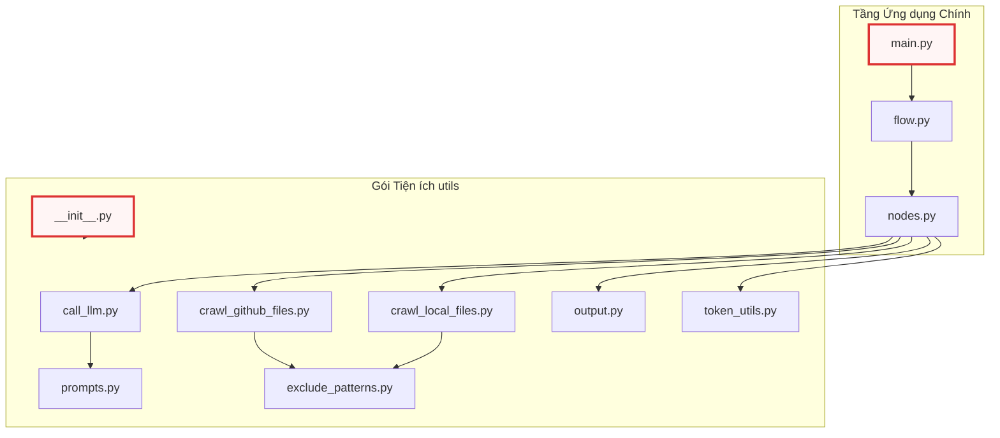

---

## 2. Cơ chế Hoạt động Nội bộ & Vòng đời Nạp Gói

Khi trình thông dịch Python gặp câu lệnh truy xuất đến gói `utils` (ví dụ: `import utils.call_llm` hoặc `from utils.output import save_markdown_file`), tiến trình nạp module diễn ra theo các giai đoạn sau:

1. **Tìm kiếm Đặc tả Module (Module Spec Resolution):** Trình tìm kiếm `PathFinder` quét danh mục `sys.path`. Khi tìm thấy thư mục `utils/` có chứa tệp `__init__.py`, nó khởi tạo một đối tượng `ModuleSpec` với thuộc tính `submodule_search_locations` trỏ trực tiếp đến đường dẫn thư mục `utils/`.
2. **Khởi tạo Đối tượng Module (Module Object Instantiation):** CPython tạo một thực thể `types.ModuleType` trống mang tên `utils`.
3. **Thiết lập Thuộc tính Khởi tạo:** Trình thông dịch tự động gán các thuộc tính phản chiếu hệ thống (Dunder attributes) vào từ điển `__dict__` của module.
4. **Thực thi Mã Khởi tạo:** Trình thông dịch thực thi nội dung của `utils/__init__.py`. Do tệp rỗng, chi phí khởi tạo CPU và I/O tại bước này tiệm cận $0\text{ ms}$, ngăn chặn triệt để hiện tượng trễ khởi động hệ thống (Cold-start Latency).
5. **Đăng ký Tra cứu (Cache Registration):** Đối tượng `utils` được ghi vào `sys.modules['utils']` để phục vụ cho các lệnh `import` tiếp theo mà không cần giải mã lại từ hệ thống tập tin.

---

## 3. Đặc tả Thuộc tính Môi trường Module

Mặc dù tệp tin không định nghĩa các lớp hay hàm tùy biến, môi trường thực thi CPython tự động gắn các thuộc tính nội tại sau đây vào không gian tên của `utils/__init__.py`:

### `__name__`
**Phạm vi truy cập**: Public (Read-Only)  
**Kiểu dữ liệu**: `str`

**Mô tả**: Tên định danh đầy đủ của module trong cây phân cấp gói. Khi được nạp thông qua hệ thống import của dự án, thuộc tính này luôn mang giá trị chuỗi định danh gói cha.

**Mã nguồn thực tế khởi tạo nội bộ:**
```python
# CPython runtime module identity assignment
__name__ = "utils"
```

Đoạn mã trên mô tả cách trình thông dịch gán định danh không gian tên cho module khi nạp vào bộ nhớ. Thuộc tính này được các cơ chế ghi nhật ký (logging) và xử lý ngoại lệ nội bộ sử dụng để xác định nguồn gốc phát sinh lỗi từ tầng tiện ích.

---

### `__file__`
**Phạm vi truy cập**: Public (Read-Only)  
**Kiểu dữ liệu**: `str`

**Mô tả**: Đường dẫn tuyệt đối hoặc tương đối trỏ trực tiếp tới vị trí vật lý của tệp tin `__init__.py` trên hệ thống lưu trữ của máy chủ/môi trường thực thi.

**Mã nguồn thực tế khởi tạo nội bộ:**
```python
# CPython runtime file system location pointer
__file__ = "d:\\...\\test\\utils\\__init__.py"
```

Thuộc tính này cung cấp thông tin vị trí vật lý của tệp mã nguồn cho các cơ chế tải tài nguyên cục bộ. Nó cho phép các module tiện ích con tính toán đường dẫn tương đối tới các thư mục dữ liệu hoặc mẫu tệp tạm thời trong quá trình vận hành của dự án.

---

### `__package__`
**Phạm vi truy cập**: Public (Read-Only)  
**Kiểu dữ liệu**: `str`

**Mô tả**: Xác định tên gói mà module này trực thuộc. Đối với tệp tin `__init__.py` ở gốc của thư mục con `utils`, giá trị này trùng khớp hoàn toàn với `__name__`.

**Mã nguồn thực tế khởi tạo nội bộ:**
```python
# CPython runtime package boundary binding
__package__ = "utils"
```

Thuộc tính `__package__` đóng vai trò quan trọng trong việc hỗ trợ cú pháp nạp tương đối (Relative Imports, ví dụ: `from .token_utils import count_tokens`). Nó thiết lập phạm vi cô lập cho toàn bộ các module nằm bên trong thư mục `utils/`.

---

### `__path__`
**Phạm vi truy cập**: Public (Read-Only)  
**Kiểu dữ liệu**: `list[str]`

**Mô tả**: Danh sách chứa các đường dẫn hệ thống tệp mà Python sẽ tìm kiếm khi tiếp tục giải quyết các module con (submodules) bên trong `utils`.

**Mã nguồn thực tế khởi tạo nội bộ:**
```python
# CPython runtime package directory search path list
__path__ = ["d:\\...\\test\\utils"]
```

Sự tồn tại của thuộc tính `__path__` là đặc điểm kỹ thuật then chốt phân biệt một gói thông thường (Package) với một module đơn lẻ (Single-file Module). Thuộc tính này cho phép bộ nạp module (`importlib`) duyệt tiếp vào bên trong cấu trúc cây thư mục `utils` để tải các tệp như `call_llm.py` hoặc `output.py`.

---

## 4. Phân tích Chiến lược Thiết kế Kiến trúc

### 4.1. Không gian tên Rỗng (Explicit Empty Namespace)
Dự án duy trì `utils/__init__.py` ở trạng thái tệp rỗng thay vì thực hiện cơ chế nạp trước và xuất khẩu hàng loạt (Eager Bulk Re-exports, ví dụ: `from .call_llm import *`):

* **Tối ưu hóa Bộ nhớ và Tốc độ (Memory & Latency Optimization):** Khi một luồng xử lý chỉ yêu cầu tiện ích nhẹ như `exclude_patterns.py`, việc nạp `utils` sẽ không vô tình kích hoạt việc nạp các thư viện nặng của bên thứ ba (như `langchain` hoặc `google-genai` trong `call_llm.py`).
* **Tránh Phụ thuộc Vòng tròn (Circular Dependency Avoidance):** Đảm bảo tính độc lập hoàn toàn giữa các module tiện ích con. Module này có thể tham chiếu module khác trong cùng gói mà không gặp hiện tượng khóa chết (deadlock) trạng thái khởi tạo module.
* **Tường minh trong Tham chiếu (Explicit Dependency Declarations):** Buộc các module tầng trên (`nodes.py`, `flow.py`) phải khai báo chính xác hàm/lớp cần sử dụng (ví dụ: `from utils.token_utils import calculate_cost`), giúp việc phân tích tĩnh (Static Analysis) và tái cấu trúc mã nguồn (Refactoring) đạt độ chính xác tuyệt đối.

---

## Xem thêm

* [call_llm.py](02_call_llm_py.md) — Module quản lý tương tác và gọi API đến các mô hình ngôn ngữ lớn (LLMs).
* [crawl_github_files.py](03_crawl_github_files_py.md) — Module thu thập và phân tích cấu trúc mã nguồn từ kho lưu trữ GitHub từ xa.
* [crawl_local_files.py](04_crawl_local_files_py.md) — Module duyệt và trích xuất nội dung tệp tin từ hệ thống tập tin cục bộ.
* [exclude_patterns.py](05_exclude_patterns_py.md) — Module định nghĩa danh sách các mẫu tệp và thư mục cần bỏ qua.
* [output.py](06_output_py.md) — Module phụ trách định dạng và ghi xuất kết quả tài liệu hóa.
* [prompts.py](07_prompts_py.md) — Module lưu trữ các mẫu prompt hệ thống phục vụ sinh tài liệu.
* [token_utils.py](08_token_utils_py.md) — Module tiện ích tính toán và ước tính lượng token tiêu thụ.
* [flow.py](09_flow_py.md) — Module điều phối luồng thực thi đồ thị xử lý chính của ứng dụng.
* [main.py](10_main_py.md) — Điểm khởi nhập chính của toàn bộ hệ thống.
* [nodes.py](11_nodes_py.md) — Định nghĩa các nút xử lý nghiệp vụ bên trong đồ thị luồng.


---

<a id="chapter-2"></a>

# call_llm.py

> **Source:** `utils/call_llm.py`

Tiếp nối việc thiết lập không gian tên và nền tảng nạp module tại [1. __init__.py](01___init___py.md), tệp `utils/call_llm.py` đóng vai trò là tầng giao tiếp và trừu tượng hóa hạ tầng mô hình ngôn ngữ lớn (LLM Gateway / Abstraction Layer) cốt lõi của toàn bộ hệ thống. Module này chịu trách nhiệm điều phối toàn bộ các yêu cầu tạo sinh văn bản, phân tích mã nguồn và suy luận logic từ các tác vụ cấp cao trong đồ thị xử lý sang các API suy luận biên hoặc đám mây.

---

## Tổng quan Kỹ thuật (Technical Overview)

Tệp `call_llm.py` đóng gói toàn bộ logic kết nối, xác thực, điều phối suy luận và tối ưu hóa chi phí khi tương tác với các nhà cung cấp LLM khác nhau. Hệ thống hỗ trợ đa nền tảng thông qua hai nhánh xử lý chính:
1. **Google GenAI SDK (Native):** Tương tác trực tiếp với hệ sinh thái Google Gemini (bao gồm Gemini API qua API Key hoặc Google Cloud Vertex AI qua Project ID/Location), hỗ trợ cấu hình ngân sách suy luận (Thinking Budget) cho các mô hình thế hệ mới như `gemini-3.7-flash`.
2. **OpenAI-Compatible REST Gateway:** Tương tác với bất kỳ nhà cung cấp nào hỗ trợ chuẩn endpoint `/v1/chat/completions` (như OpenRouter, Ollama cục bộ, hoặc các máy chủ tự lưu trữ vLLM/TGI), tích hợp khả năng tùy biến tham số suy luận (`reasoning_effort`, `think`).

Bên cạnh khả năng đa định tuyến, module còn tích hợp các cơ chế phụ trợ quan trọng:
* **Bộ nhớ đệm phản hồi cục bộ (Local Response Caching):** Lưu trữ kết quả suy luận dựa trên nội dung prompt vào tệp `llm_cache.json` nhằm giảm thiểu độ trễ, tiết kiệm chi phí token và hỗ trợ quá trình gỡ lỗi có tính lặp lại (deterministic debugging).
* **Truy vấn giới hạn ngữ cảnh động (Dynamic Context Length Resolution):** Tự động phát hiện kích thước cửa sổ ngữ cảnh tối đa từ OpenRouter API hoặc thiết lập giá trị mặc định an toàn cho Gemini.
* **Ghi log phân tầng và đo lường hiệu năng:** Đo lường thời gian phản hồi (elapsed time), đếm số lượng token đầu vào thông qua [8. token_utils.py](08_token_utils_py.md), và cách ly logger trong giai đoạn nạp module thông qua `logging.NullHandler`.

---

## Sơ đồ Kiến trúc & Luồng Thực thi (Architecture & Execution Flow)

### Luồng Điều phối Yêu cầu Tổng thể (`call_llm`)

Sơ đồ dưới đây mô tả chi tiết chu trình xử lý một yêu cầu suy luận từ khi tiếp nhận prompt, kiểm tra bộ nhớ đệm, định tuyến nhà cung cấp, thiết lập tham số suy luận cho đến khi cập nhật cache và trả về kết quả:

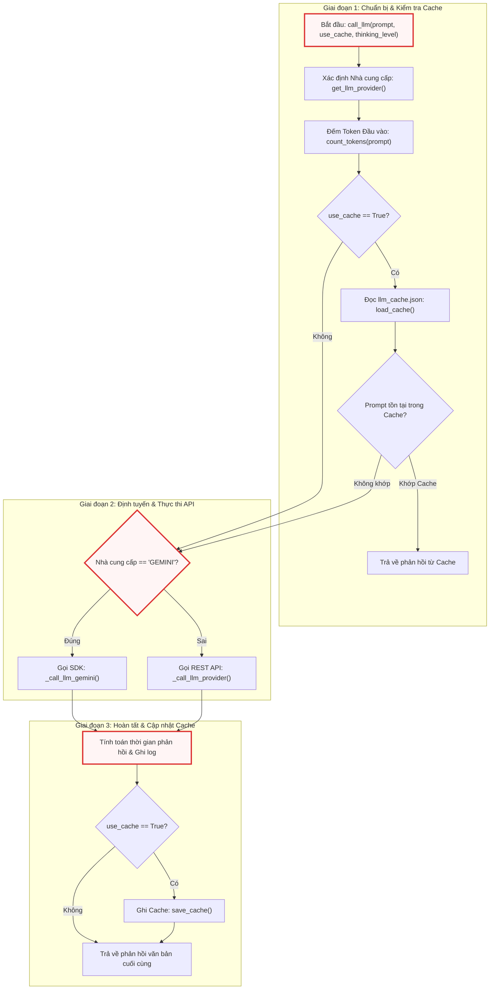

---

### Trình tự Tương tác Thành phần (Component Sequence Interaction)

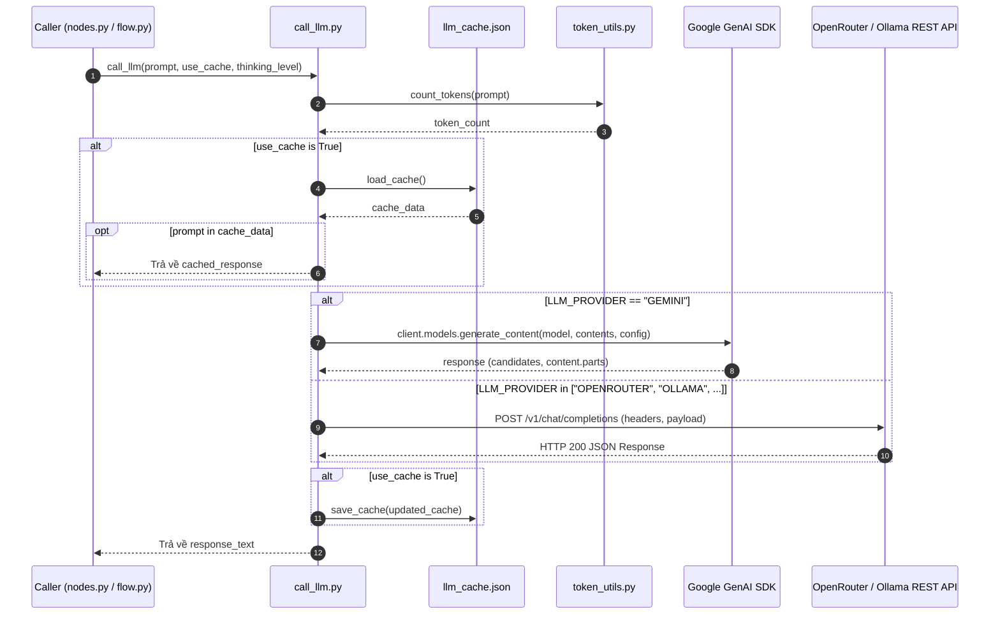

---

## Cấu hình & Biến Cấp Module (Module-Level Variables & Configurations)

Tệp `call_llm.py` khởi tạo một số trạng thái toàn cục và cấu hình logging ngay khi được nạp vào tiến trình CPython:

```python
# Load environment variables from .env file
load_dotenv()

# Configure logging - deferred until main.py calls configure_logging()
# At import time, set up logger with NullHandler (no file output yet)
logger = logging.getLogger("llm_logger")
logger.setLevel(logging.INFO)
logger.propagate = False  # Prevent propagation to root logger
logger.addHandler(logging.NullHandler())  # Absorb logs until configured


# Simple cache configuration
cache_file = "llm_cache.json"

# Cache for model capabilities to avoid repeated API calls
_openrouter_models_cache = None
```

### Chi tiết các Biến Cấu hình:

* `logger`: Thể hiện logger chuyên biệt `"llm_logger"`. Để tránh hiện tượng ghi đè hoặc xả log ra console ngoài ý muốn trong quá trình import trước khi [10. main.py](10_main_py.md) thiết lập logging hoàn chỉnh, logger được gán `logging.NullHandler()` và tắt cờ `propagate`.
* `cache_file` (`str`): Đường dẫn tệp lưu trữ cache cục bộ dạng JSON (`"llm_cache.json"`).
* `_openrouter_models_cache` (`list[dict] | None`): Bộ nhớ đệm trong RAM lưu trữ danh sách siêu dữ liệu các mô hình lấy từ OpenRouter API, ngăn ngừa việc gửi yêu cầu mạng HTTP GET lặp lại nhiều lần.

### Danh mục Biến Môi trường Quản lý:

| Biến Môi Trường | Kiểu Dữ Liệu | Bắt Buộc | Mục Đích |
| :--- | :--- | :--- | :--- |
| `LLM_PROVIDER` | `str` | Tùy chọn | Tên nhà cung cấp (`GEMINI`, `OPENROUTER`, `OLLAMA`). Tự động nhận diện `GEMINI` nếu có khóa Google. |
| `GEMINI_PROJECT_ID` | `str` | Tùy chọn | ID dự án Google Cloud Vertex AI (kích hoạt chế độ `vertexai=True`). |
| `GEMINI_LOCATION` | `str` | Tùy chọn | Khu vực lưu trữ Vertex AI (mặc định: `"us-central1"`). |
| `GEMINI_API_KEY` | `str` | Tùy chọn | Khóa API của Google AI Studio (khi không dùng Vertex AI). |
| `GEMINI_MODEL` | `str` | Tùy chọn | Định danh mô hình Google Gemini (mặc định: `"gemini-3.7-flash"`). |
| `<PROVIDER>_MODEL` | `str` | Có (nếu dùng REST) | Tên mô hình tương ứng cho nhà cung cấp (ví dụ: `OPENROUTER_MODEL`, `OLLAMA_MODEL`). |
| `<PROVIDER>_BASE_URL` | `str` | Có (nếu dùng REST) | URL gốc của máy chủ (ví dụ: `http://localhost:11434`, `https://openrouter.ai/api`). |
| `<PROVIDER>_API_KEY` | `str` | Tùy chọn | Khóa xác thực Bearer token cho REST API (tùy chọn với Ollama cục bộ). |

---

## Chi tiết các Hàm Cấp Module (Module-Level Functions)

### `load_cache()`
**Visibility**: Public  
**Signature**: `def load_cache() -> dict:`

**Description**:  
Đọc và giải mã dữ liệu bộ nhớ đệm từ tệp vật lý được chỉ định bởi biến toàn cục `cache_file`. Nếu tệp không tồn tại, bị lỗi định dạng JSON hoặc gặp sự cố truy xuất I/O, hàm bắt lỗi ngoại lệ, ghi lại cảnh báo vào logger và trả về một từ điển rỗng nhằm đảm bảo tính liên tục của ứng dụng.

```python
def load_cache():
    try:
        with open(cache_file) as f:
            return json.load(f)
    except Exception:
        logger.warning("Failed to load cache.")
    return {}
```

Khối mã trên đóng vai trò là một chốt phòng thủ (defensive fallback) cho việc đọc dữ liệu không đồng bộ. Khi `llm_cache.json` chưa được khởi tạo ở lần chạy đầu tiên, khối `try-except` đảm bảo tiến trình không bị gián đoạn và trả về từ điển `{}` an toàn. Mọi lỗi đọc đĩa đều được ghi nhận qua `logger.warning`.

**Parameters**:  
* Không có tham số đầu vào.

**Returns**:  
* `dict`: Bản đồ ánh xạ giữa chuỗi prompt nguyên bản (`str`) và kết quả phản hồi của mô hình (`str`).

**Raises**:  
* Không ném ngoại lệ ra ngoài (mọi `Exception` đều được bắt và xử lý nội bộ).

**Example**:
```python
# Trích xuất từ cách sử dụng nội bộ trong call_llm()
if use_cache:
    cache = load_cache()
    if prompt in cache:
        cached_response = cache[prompt]
```

---

### `save_cache()`
**Visibility**: Public  
**Signature**: `def save_cache(cache: dict) -> None:`

**Description**:  
Tuần tự hóa cấu trúc từ điển bộ nhớ đệm thành định dạng JSON và ghi đè vào tệp `cache_file`. Toàn bộ thao tác I/O được bao bọc trong khối bảo vệ ngoại lệ để tránh làm sập tiến trình chính nếu hệ thống tệp bị khóa hoặc gặp lỗi phân quyền ghi.

```python
def save_cache(cache):
    try:
        with open(cache_file, "w") as f:
            json.dump(cache, f)
    except Exception:
        logger.warning("Failed to save cache")
```

Hàm thực hiện mở tệp ở chế độ ghi (`"w"`) và sử dụng `json.dump` để đồng bộ trạng thái bộ nhớ đệm từ RAM xuống đĩa. Trong trường hợp hệ thống gặp lỗi phân quyền ghi (permission denied) hoặc đầy dung lượng ổ đĩa, hàm ghi log cảnh báo `"Failed to save cache"` và tiếp tục thực thi bình thường mà không làm gián đoạn luồng sinh mã.

**Parameters**:  
* `cache` (`dict`): Từ điển chứa các cặp khóa-giá trị prompt và phản hồi cần lưu trữ.

**Returns**:  
* `None`

**Raises**:  
* Không ném ngoại lệ ra ngoài.

**Example**:
```python
# Trích xuất từ cách sử dụng nội bộ trong call_llm()
if use_cache:
    cache = load_cache()
    cache[prompt] = response_text
    save_cache(cache)
```

---

### `get_llm_provider()`
**Visibility**: Public  
**Signature**: `def get_llm_provider() -> str | None:`

**Description**:  
Xác định nhà cung cấp LLM hoạt động hiện tại dựa trên cấu hình biến môi trường. Hàm kiểm tra trực tiếp biến `LLM_PROVIDER`. Nếu biến này chưa được thiết lập tường minh nhưng hệ thống phát hiện sự tồn tại của `GEMINI_PROJECT_ID` hoặc `GEMINI_API_KEY`, hàm sẽ tự động phân giải nhà cung cấp mặc định là `"GEMINI"`.

```python
def get_llm_provider():
    provider = os.getenv("LLM_PROVIDER")
    if not provider and (os.getenv("GEMINI_PROJECT_ID") or os.getenv("GEMINI_API_KEY")):
        provider = "GEMINI"
    # if necessary, add ANTHROPIC/OPENAI
    return provider
```

Hàm này cung cấp cơ chế suy đoán thông minh cấu hình (configuration auto-discovery). Bằng cách ưu tiên biến `LLM_PROVIDER`, hệ thống cho phép người dùng chuyển đổi linh hoạt giữa các nhà cung cấp như `"OPENROUTER"` hoặc `"OLLAMA"`. Khi thiếu cấu hình này, cơ chế fallback sẽ kích hoạt nếu có bất kỳ thông tin xác thực Google Gemini nào được khai báo trong môi trường `.env`.

**Parameters**:  
* Không có tham số đầu vào.

**Returns**:  
* `str | None`: Tên định danh nhà cung cấp (ví dụ: `"GEMINI"`, `"OPENROUTER"`, `"OLLAMA"`) hoặc `None` nếu không tìm thấy cấu hình hợp lệ.

**Raises**:  
* Không ném ngoại lệ.

**Example**:
```python
# Trích xuất từ cách sử dụng nội bộ trong call_llm()
provider = get_llm_provider()
model = os.environ.get(f"{provider}_MODEL", os.environ.get("GEMINI_MODEL", "unknown"))
```

---

### `_get_openrouter_model_info()`
**Visibility**: Private  
**Signature**: `def _get_openrouter_model_info(model_id: str) -> dict | None:`

**Description**:  
Truy vấn thông tin chi tiết và khả năng hỗ trợ kỹ thuật của một mô hình cụ thể từ API OpenRouter. Hàm sử dụng một biến đệm toàn cục (`_openrouter_models_cache`) để lưu trữ danh sách toàn bộ các mô hình sau lần gọi đầu tiên, giảm thiểu số lượng HTTP GET request đến máy chủ OpenRouter trong suốt vòng đời ứng dụng.

```python
def _get_openrouter_model_info(model_id: str) -> dict:
    global _openrouter_models_cache
    if _openrouter_models_cache is None:
        try:
            resp = requests.get("https://openrouter.ai/api/v1/models", timeout=5)
            _openrouter_models_cache = resp.json().get("data", [])
        except Exception:
            _openrouter_models_cache = []

    return next((m for m in _openrouter_models_cache if m.get("id") == model_id), None)
```

Hàm thực hiện lazy-loading đối với siêu dữ liệu mô hình từ endpoint `https://openrouter.ai/api/v1/models` với thời gian chờ kết nối là 5 giây (`timeout=5`). Sau khi tải thành công, hàm sử dụng hàm tích hợp `next()` kết hợp generator expression để tìm kiếm phần tử có khóa `id` khớp với `model_id`. Nếu xảy ra lỗi kết nối hoặc không tìm thấy, hàm trả về danh sách rỗng hoặc `None`.

**Parameters**:  
* `model_id` (`str`): Chuỗi định danh mô hình trên OpenRouter (ví dụ: `"anthropic/claude-3.7-sonnet:thinking"` hoặc `"deepseek/deepseek-r1"`).

**Returns**:  
* `dict | None`: Từ điển chứa thông tin cấu hình mô hình (bao gồm trường `context_length`, `reasoning`, v.v.) hoặc `None` nếu không tìm thấy.

**Raises**:  
* Không ném ngoại lệ ra ngoài.

**Example**:
```python
# Trích xuất từ cách sử dụng nội bộ trong _call_llm_provider()
if provider == "OPENROUTER" and thinking_level:
    model_info = _get_openrouter_model_info(model)
    if model_info and "reasoning" in model_info:
        supported_efforts = model_info["reasoning"].get("supported_efforts", [])
```

---

### `get_model_context_length()`
**Visibility**: Public  
**Signature**: `def get_model_context_length(endpoint_url: str, model_name: str, api_key: str = "") -> int:`

**Description**:  
Truy xuất hoặc ước lượng kích thước cửa sổ ngữ cảnh tối đa (tính theo đơn vị token) của một mô hình dựa trên URL endpoint và định danh mô hình. Hàm xử lý riêng biệt cho các trường hợp Google Gemini (mặc định an toàn $1{,}000{,}000$ token) và OpenRouter API (truy vấn động qua REST API), trước khi áp dụng giá trị mặc định hệ thống là $100{,}000$ token.

```python
def get_model_context_length(endpoint_url: str, model_name: str, api_key: str = "") -> int:
    """
    Fetch the maximum context length of a model based on the endpoint.
    If endpoint is Gemini API, safely default to 1,000,000 tokens.
    If endpoint is openrouter.ai, make GET to /api/v1/models and extract.
    Default to 100,000.
    """
    default_limit = 100000
    try:
        if not endpoint_url:
            return default_limit

        if "generativelanguage.googleapis.com" in endpoint_url or "gemini" in model_name.lower():
            # Safely default to 1M tokens for Gemini models
            return 1000000

        if "openrouter.ai" in endpoint_url:
            resp = requests.get("https://openrouter.ai/api/v1/models", timeout=5)
            data = resp.json().get("data", [])
            for m in data:
                if m.get("id") == model_name:
                    return m.get("context_length", default_limit)
    except Exception as e:
        logger.warning(f"Failed to fetch context length for {model_name} at {endpoint_url}: {e}")

    return default_limit
```

Hàm kiểm tra chuỗi URL và tên mô hình để đưa ra quyết định tối ưu kích thước token. Đối với các mô hình Gemini, hàm trả về giới hạn $1{,}000{,}000$ token tương ứng với kiến trúc Long-Context của dòng Gemini 1.5/2.0/3.x. Đối với OpenRouter, một yêu cầu GET được gửi tới endpoint models để bóc tách trường `context_length`. Trong trường hợp mạng lỗi hoặc endpoint không khớp, giá trị fallback an toàn là `100000` được trả về.

**Parameters**:  
* `endpoint_url` (`str`): Địa chỉ URL của máy chủ API đang kết nối.
* `model_name` (`str`): Tên hoặc mã định danh của mô hình ngôn ngữ.
* `api_key` (`str`, tùy chọn): Khóa API xác thực (mặc định: `""`).

**Returns**:  
* `int`: Số lượng token tối đa mà cửa sổ ngữ cảnh của mô hình có thể tiếp nhận.

**Raises**:  
* Không ném ngoại lệ ra ngoài (mọi lỗi đều được bắt và log dưới dạng warning).

**Example**:
```python
# Kiểm tra độ dài ngữ cảnh cho mô hình OpenRouter hoặc Gemini
context_limit = get_model_context_length(
    endpoint_url="https://openrouter.ai/api/v1",
    model_name="google/gemini-2.5-pro"
)
```

---

### `_call_llm_provider()`
**Visibility**: Private  
**Signature**: `def _call_llm_provider(prompt: str, thinking_level: str | None = None) -> str:`

**Description**:  
Thực thi yêu cầu gọi API suy luận tới các nhà cung cấp bên thứ ba tuân thủ chuẩn REST OpenAI-Compatible (như OpenRouter hoặc Ollama). Hàm tự động đọc các biến môi trường cấu hình động (`<PROVIDER>_MODEL`, `<PROVIDER>_BASE_URL`, `<PROVIDER>_API_KEY`), chuẩn hóa payload JSON, cấu hình các tham số suy luận nâng cao (`reasoning`, `think`), và xử lý phòng thủ các trường hợp phản hồi lỗi từ phía máy chủ.

```python
def _call_llm_provider(prompt: str, thinking_level: str | None = None) -> str:
    # Read the provider from environment variable
    provider = os.environ.get("LLM_PROVIDER")
    if not provider:
        raise ValueError("LLM_PROVIDER environment variable is required")

    # Construct the names of the other environment variables
    model_var = f"{provider}_MODEL"
    base_url_var = f"{provider}_BASE_URL"
    api_key_var = f"{provider}_API_KEY"

    # Read the provider-specific variables
    model = os.environ.get(model_var)
    base_url = os.environ.get(base_url_var)
    api_key = os.environ.get(api_key_var, "")  # API key is optional, default to empty string

    # Validate required variables
    if not model:
        raise ValueError(f"{model_var} environment variable is required")
    if not base_url:
        raise ValueError(f"{base_url_var} environment variable is required")

    # Append the endpoint to the base URL
    url = f"{base_url.rstrip('/')}/v1/chat/completions"

    # Configure headers and payload based on provider
    headers = {
        "Content-Type": "application/json",
    }
    if api_key:  # Only add Authorization header if API key is provided
        headers["Authorization"] = f"Bearer {api_key}"

    payload = {
        "model": model,
        "messages": [{"role": "user", "content": prompt}],
        "temperature": 0.7,
    }
    // ...
```

Phần đầu của hàm thiết lập cơ chế nạp biến môi trường động theo tiền tố nhà cung cấp. Đường dẫn API được chuẩn hóa bằng cách loại bỏ dấu gạch chéo cuối URL thông qua `rstrip('/')` và gắn thêm `/v1/chat/completions`. Tiêu đề HTTP `Authorization` chỉ được bổ sung khi `api_key` có giá trị khác rỗng, cho phép tương thích hoàn hảo với cả các dịch vụ công cộng lẫn các máy chủ Ollama chạy trong mạng nội bộ không cần mật mã.

```python
    // ...
    if provider == "OPENROUTER" and thinking_level:
        model_info = _get_openrouter_model_info(model)
        if model_info and "reasoning" in model_info:
            supported_efforts = model_info["reasoning"].get("supported_efforts", [])
            if thinking_level.lower() in supported_efforts:
                payload["reasoning"] = {"effort": thinking_level.lower()}
                payload["temperature"] = 1.0  # Required for many reasoning models
            else:
                logger.warning(f"Invalid thinking level '{thinking_level}' for model {model}. Supported efforts: {supported_efforts}")
        else:
            logger.warning(f"Model {model} does not support reasoning via OpenRouter API.")

    elif provider == "OLLAMA" and thinking_level:
        # Some Ollama SDKs / API versions look for `think`, others look for standard `reasoning_effort`
        payload["think"] = thinking_level.lower()
        payload["reasoning_effort"] = thinking_level.lower()
        payload["temperature"] = 1.0

    try:
        response = requests.post(url, headers=headers, json=payload, timeout=(10, 300))
        try:
            response_json = response.json()  # Log the response
        except (ValueError, requests.exceptions.JSONDecodeError):
            from utils.output import emit_raw

            emit_raw(
                "WARNING",
                f"Warning: Provider returned invalid JSON. Status Code: {response.status_code}, Response Text: {response.text}",
                dest="STDOUT",
            )
            logger.warning(f"Provider returned invalid JSON. Status Code: {response.status_code}, Response Text: {response.text}")
            raise ValueError(f"Provider returned invalid JSON. Status Code: {response.status_code}") from None
        response.raise_for_status()

        # Defensive check: API may return 200 with error/rate-limit payload missing 'choices'
        if "choices" not in response_json or not response_json["choices"]:
            error_detail = response_json.get("error", response_json)
            logger.warning(f"API returned 200 but no 'choices' in response: {error_detail}")
            raise ValueError(f"API response missing 'choices' key. Response: {error_detail}")

        return response_json["choices"][0]["message"]["content"]
    except requests.exceptions.HTTPError as e:
    // ...
```

Đoạn xử lý suy luận kiểm tra khả năng hỗ trợ chế độ reasoning. Với OpenRouter, hàm xác thực mức độ nỗ lực suy nghĩ (`thinking_level`) thông qua `_get_openrouter_model_info` và nâng `temperature` lên `1.0`. Với Ollama, hàm gán đồng thời hai trường `think` và `reasoning_effort`. Quá trình gọi HTTP POST được gán timeout kép `(10, 300)` (10 giây thiết lập kết nối, 300 giây chờ phản hồi). Lỗi phản hồi không phải JSON được bắt riêng và cảnh báo trực tiếp ra màn hình thông qua `emit_raw` từ [6. output.py](06_output_py.md). Đồng thời, cơ chế kiểm tra phòng thủ đảm bảo trường `choices` luôn tồn tại trong payload trả về ngay cả khi mã trạng thái HTTP là 200.

**Parameters**:  
* `prompt` (`str`): Nội dung yêu cầu/câu hỏi gửi tới LLM.
* `thinking_level` (`str | None`, tùy chọn): Mức độ nỗ lực suy luận mong muốn (ví dụ: `"low"`, `"medium"`, `"high"`). Mặc định là `None`.

**Returns**:  
* `str`: Chuỗi văn bản phản hồi do mô hình tạo ra (`response_json["choices"][0]["message"]["content"]`).

**Raises**:  
* `ValueError`: Nếu thiếu biến môi trường `LLM_PROVIDER`, `<PROVIDER>_MODEL`, `<PROVIDER>_BASE_URL`, phản hồi từ máy chủ không phải định dạng JSON hợp lệ, hoặc phản hồi thiếu khóa `choices`.
* `Exception`: Đóng gói các lỗi mạng từ thư viện `requests` bao gồm `HTTPError`, `ConnectionError`, `Timeout`, và `RequestException`.

**Example**:
```python
# Trích xuất từ cách sử dụng nội bộ trong call_llm()
else:  # generic method using a URL that is OpenAI compatible API (Ollama, ...)
    response_text = _call_llm_provider(prompt, thinking_level=thinking_level)
```

---

### `_call_llm_gemini()`
**Visibility**: Private  
**Signature**: `def _call_llm_gemini(prompt: str, thinking_level: str | None = None) -> str:`

**Description**:  
Thực thi yêu cầu tạo sinh nội dung sử dụng bộ SDK chính thức `google-genai`. Hàm tự động cấu hình đối tượng máy khách (`genai.Client`) dựa trên sự hiện diện của `GEMINI_PROJECT_ID` (kích hoạt chế độ Google Cloud Vertex AI với vùng `GEMINI_LOCATION`) hoặc `GEMINI_API_KEY` (kích hoạt chế độ Google AI Studio). Hàm cũng hỗ trợ cấu hình ngân sách suy nghĩ (`ThinkingConfig`) và trích xuất an toàn các phần văn bản từ phản hồi.

```python
def _call_llm_gemini(prompt: str, thinking_level: str | None = None) -> str:
    if os.getenv("GEMINI_PROJECT_ID"):
        client = genai.Client(vertexai=True, project=os.getenv("GEMINI_PROJECT_ID"), location=os.getenv("GEMINI_LOCATION", "us-central1"))
    elif os.getenv("GEMINI_API_KEY"):
        client = genai.Client(api_key=os.getenv("GEMINI_API_KEY"))
    else:
        raise ValueError("Either GEMINI_PROJECT_ID or GEMINI_API_KEY must be set in the environment")
    model = os.getenv("GEMINI_MODEL", "gemini-3.7-flash")

    kwargs = {"model": model, "contents": [prompt]}

    if thinking_level:
        # Map string levels to budgets for the installed SDK version
        budget_map = {"low": 1024, "medium": 4096, "high": 8192}
        budget = budget_map.get(thinking_level.lower(), 4096)
        thinking_config = types.ThinkingConfig(include_thoughts=True, thinking_budget=budget)
        kwargs["config"] = types.GenerateContentConfig(thinking_config=thinking_config)

    response = client.models.generate_content(**kwargs)

    # Extract only text parts to avoid "non-text parts: ['thought_signature']" warnings
    if response.candidates and response.candidates[0].content.parts:
        text_parts = [part.text for part in response.candidates[0].content.parts if part.text is not None]
        return "".join(text_parts)
    return ""
```

Hàm khởi tạo đối tượng `genai.Client` linh hoạt theo môi trường thực thi: ưu tiên Vertex AI doanh nghiệp trước, sau đó tới AI Studio API key cá nhân. Khi kích hoạt `thinking_level`, hàm ánh xạ mức độ suy nghĩ sang ngân sách token cụ thể (`low` = 1024, `medium` = 4096, `high` = 8192 token) và gắn vào `types.ThinkingConfig`. Nhằm tránh cảnh báo hệ thống khi mô hình trả về các khối dữ liệu suy nghĩ không phải văn bản thô (`thought_signature`), hàm duyệt qua `candidates[0].content.parts` và chỉ trích xuất, nối các phần tử có trường `part.text` hợp lệ.

**Parameters**:  
* `prompt` (`str`): Nội dung yêu cầu phân tích gửi tới mô hình Gemini.
* `thinking_level` (`str | None`, tùy chọn): Mức độ suy luận dạng chuỗi (`"low"`, `"medium"`, `"high"`). Mặc định là `None`.

**Returns**:  
* `str`: Toàn bộ nội dung văn bản phản hồi được ghép từ các phần tử hợp lệ của ứng viên đầu tiên, hoặc chuỗi rỗng `""` nếu không có dữ liệu.

**Raises**:  
* `ValueError`: Nếu cả `GEMINI_PROJECT_ID` và `GEMINI_API_KEY` đều không được khai báo trong biến môi trường.
* `google.genai.errors.APIError`: Ném ra nếu API của Google từ chối yêu cầu, vượt hạn mức (quota) hoặc lỗi mạng.

**Example**:
```python
# Trích xuất từ cách sử dụng nội bộ trong call_llm()
if provider == "GEMINI":
    response_text = _call_llm_gemini(prompt, thinking_level=thinking_level)
```

---

### `call_llm()`
**Visibility**: Public  
**Signature**: `def call_llm(prompt: str, use_cache: bool = True, thinking_level: str | None = None) -> str:`

**Description**:  
Hàm giao diện chính (Primary Entry Point) được toàn bộ hệ thống sử dụng để tương tác với mô hình ngôn ngữ lớn. Hàm chịu trách nhiệm điều phối toàn bộ vòng đời của một truy vấn LLM: tính toán số lượng token đầu vào, kiểm tra và trả về dữ liệu từ bộ nhớ đệm (nếu được kích hoạt), ghi nhật ký đo lường thời gian thực thi (benchmarking), định tuyến tới nhà cung cấp phù hợp, và lưu phản hồi mới vào cache trước khi trả kết quả cho hàm gọi.

```python
# By default, we use Google Gemini 3.7 flash, as it shows great performance for code understanding
def call_llm(prompt: str, use_cache: bool = True, thinking_level: str | None = None) -> str:
    import time

    from utils.token_utils import count_tokens

    provider = get_llm_provider()
    model = os.environ.get(f"{provider}_MODEL", os.environ.get("GEMINI_MODEL", "unknown"))
    prompt_tokens = count_tokens(prompt)

    logger.info(f"{'=' * 80}")
    logger.info(
        f"LLM CALL START | provider={provider} | model={model} | thinking={thinking_level} | cache={'enabled' if use_cache else 'disabled'} | prompt_tokens={prompt_tokens:,}"
    )
    logger.info(f"PROMPT:\n{prompt}")

    # Check cache if enabled
    if use_cache:
        cache = load_cache()
        if prompt in cache:
            cached_response = cache[prompt]
            logger.info(f"CACHE HIT | response_chars={len(cached_response):,}")
            logger.info(f"RESPONSE (cached):\n{cached_response}")
            logger.info("LLM CALL END | result=cache_hit")
            return cached_response

    # Make the actual LLM call
    start_time = time.time()
    logger.info(f"API CALL | sending request to {provider}...")

    if provider == "GEMINI":
        response_text = _call_llm_gemini(prompt, thinking_level=thinking_level)
    else:  # generic method using a URL that is OpenAI compatible API (Ollama, ...)
        response_text = _call_llm_provider(prompt, thinking_level=thinking_level)

    elapsed = time.time() - start_time
    logger.info(f"API CALL COMPLETE | elapsed={elapsed:.1f}s | response_chars={len(response_text):,}")
    logger.info(f"RESPONSE:\n{response_text}")

    # Update cache if enabled
    if use_cache:
        cache = load_cache()
        cache[prompt] = response_text
        save_cache(cache)
        logger.info("CACHE WRITE | saved response to cache")

    logger.info(f"LLM CALL END | result=success | elapsed={elapsed:.1f}s")
    return response_text
```

Hàm bắt đầu bằng việc nạp cục bộ hàm `count_tokens` từ [8. token_utils.py](08_token_utils_py.md) nhằm tối ưu thời gian khởi động của module và tính toán chính xác lượng token của chuỗi prompt đầu vào. Nếu cờ `use_cache=True` được kích hoạt, hàm thực hiện tra cứu nhanh trong `llm_cache.json`; khi trúng cache (`CACHE HIT`), phản hồi được trả về ngay lập tức với thời gian thực thi xấp xỉ 0ms. Trong trường hợp trượt cache (`CACHE MISS`), hàm kích hoạt bộ đếm thời gian `start_time`, gửi yêu cầu tới nhà cung cấp tương ứng (`_call_llm_gemini` hoặc `_call_llm_provider`), đo đạc thời gian chờ `elapsed`, ghi log chi tiết cấu trúc phản hồi và cập nhật ngược lại tệp cache.

**Parameters**:  
* `prompt` (`str`): Chuỗi văn bản prompt hoàn chỉnh chứa các chỉ dẫn hoặc đoạn mã cần phân tích.
* `use_cache` (`bool`, tùy chọn): Cờ điều khiển việc sử dụng bộ nhớ đệm. Khi gán `True`, hệ thống sẽ đọc và ghi vào `llm_cache.json`. Mặc định là `True`.
* `thinking_level` (`str | None`, tùy chọn): Mức độ sâu trong suy luận logic (`"low"`, `"medium"`, `"high"` hoặc `None`). Mặc định là `None`.

**Returns**:  
* `str`: Nội dung văn bản phản hồi do mô hình ngôn ngữ sinh ra.

**Raises**:  
* `ValueError`: Nếu cấu hình nhà cung cấp hoặc biến môi trường bị thiếu/không hợp lệ.
* `Exception`: Ném lại bất kỳ ngoại lệ nào phát sinh trong quá trình gọi API thực tế.

**Example**:
```python
# Trích xuất từ khối thực thi kiểm thử tại cuối tệp call_llm.py
test_prompt = "Hello, how are you?"

# First call - should hit the API
print("Making call...")
response1 = call_llm(test_prompt, use_cache=False)
print(f"Response: {response1}")
```

---

## Phân tích Xử lý Lỗi & Khả năng Phục hồi (Error Handling & Resilience Strategies)

Tệp `call_llm.py` triển khai chiến lược bảo vệ nhiều tầng (Multi-tier Defensive Programming) nhằm cô lập các sự cố mạng và đảm bảo độ ổn định của toàn bộ pipeline phân tích:

### 1. Bắt Lỗi và Bọc Ngoại lệ Mạng (Network Exception Wrapping)
Trong hàm `_call_llm_provider`, toàn bộ các loại lỗi phát sinh từ thư viện `requests` được phân loại tường minh:
* `requests.exceptions.HTTPError`: Bóc tách thông tin lỗi chi tiết trong phản hồi JSON từ máy chủ (nếu có trường `error`) để cung cấp thông báo rõ ràng cho kỹ sư vận hành.
* `requests.exceptions.ConnectionError`: Chuyển đổi thành thông báo lỗi kết nối mạng tường minh, nhắc nhở kiểm tra đường truyền tới nhà cung cấp.
* `requests.exceptions.Timeout`: Bắt lỗi khi mô hình mất hơn 300 giây để hoàn thành suy luận.
* `requests.exceptions.JSONDecodeError` / `ValueError`: Bắt trường hợp máy chủ trả về mã lỗi HTML (ví dụ: Cloudflare 502 Bad Gateway) thay vì định dạng JSON chuẩn. Hệ thống sử dụng hàm `emit_raw` từ [6. output.py](06_output_py.md) để cảnh báo tức thì ra STDOUT.

### 2. Kiểm Tra Phòng Thủ Cấu Trúc Dữ Liệu (Defensive Structural Checks)
Một số nhà cung cấp hoặc proxy API có thể trả về mã trạng thái HTTP 200 OK nhưng phần thân phản hồi lại chứa thông báo lỗi hoặc chạm giới hạn hạn mức (rate limit) dẫn tới việc thiếu trường `choices`. Mã nguồn xử lý triệt để tình huống này:
```python
if "choices" not in response_json or not response_json["choices"]:
    error_detail = response_json.get("error", response_json)
    logger.warning(f"API returned 200 but no 'choices' in response: {error_detail}")
    raise ValueError(f"API response missing 'choices' key. Response: {error_detail}")
```

### 3. Lọc Khối Dữ Liệu Không Phải Văn Bản trong Gemini SDK
Khi sử dụng tính năng suy nghĩ (`ThinkingConfig`) của Gemini SDK, các phiên bản mới có thể trả về các khối `thought_signature` hoặc metadata nội bộ bên trong `response.candidates[0].content.parts`. Việc truy cập trực tiếp `response.text` có thể gây ra cảnh báo `UserWarning: non-text parts: ['thought_signature']`. Module khắc phục điều này bằng cách duyệt mảng và lọc chính xác các phần tử `part.text is not None`:
```python
if response.candidates and response.candidates[0].content.parts:
    text_parts = [part.text for part in response.candidates[0].content.parts if part.text is not None]
    return "".join(text_parts)
```

---

## Khối Thực thi Trực tiếp (Execution Entry Point)

Module cung cấp một khối kiểm thử độc lập (`if __name__ == "__main__":`) cho phép các kỹ sư kiểm tra kết nối API và xác thực cấu hình môi trường mà không cần chạy toàn bộ đồ thị ứng dụng:

```python
if __name__ == "__main__":
    test_prompt = "Hello, how are you?"

    # First call - should hit the API
    print("Making call...")
    response1 = call_llm(test_prompt, use_cache=False)
    print(f"Response: {response1}")
```

Khối mã trên thực hiện gửi một câu chào đơn giản `"Hello, how are you?"` với cờ `use_cache=False` để ép buộc hệ thống thực hiện một cuộc gọi mạng thực tế tới nhà cung cấp LLM đã cấu hình. Khi chạy trực tiếp qua lệnh `python utils/call_llm.py`, kết quả phản hồi sẽ được in ra STDOUT, hỗ trợ kiểm tra nhanh tính hợp lệ của API Key và đường truyền mạng.

---

## Xem thêm (See Also)

* [1. __init__.py](01___init___py.md) — Thiết lập gói hạ tầng `utils` và cấu trúc không gian tên.
* [6. output.py](06_output_py.md) — Cung cấp hàm `emit_raw` được `call_llm.py` sử dụng để xuất cảnh báo lỗi JSON không hợp lệ ra giao diện dòng lệnh.
* [8. token_utils.py](08_token_utils_py.md) — Tiện ích tính toán và đếm số lượng token đầu vào (`count_tokens`) phục vụ việc ghi nhật ký chi phí LLM.
* [9. flow.py](09_flow_py.md) — Đồ thị điều phối quy trình phân tích và quản lý trạng thái luồng làm việc sử dụng `call_llm`.
* [10. main.py](10_main_py.md) — Điểm khởi đầu ứng dụng, chịu trách nhiệm gọi hàm cấu hình hệ thống ghi log chính thức cho `llm_logger`.
* [11. nodes.py](11_nodes_py.md) — Tập hợp các nút xử lý nghiệp vụ thực hiện các cuộc gọi trực tiếp tới `call_llm` để phân tích kiến trúc mã nguồn.


---

<a id="chapter-3"></a>

# crawl_github_files.py

> **Source:** `utils/crawl_github_files.py`

Tiếp nối hạ tầng giao tiếp mô hình ngôn ngữ lớn tại [call_llm.py](02_call_llm_py.md), module `crawl_github_files.py` đảm nhiệm vai trò là cổng thu thập dữ liệu mã nguồn từ xa (Remote Repository Ingestion Gateway). Thành phần này chịu trách nhiệm bóc tách, tải về và tiền xử lý cấu trúc tệp tin cùng nội dung mã nguồn từ các kho lưu trữ GitHub công khai hoặc riêng tư, đóng vai trò cung cấp ngữ cảnh đầu vào (context window data) cho các nút phân tích kiến trúc tiếp theo trong hệ thống.

---

## 1. Tổng quan Kiến trúc & Nguyên lý Hoạt động

Module `crawl_github_files.py` cung cấp giải pháp thu thập mã nguồn kép (Dual-Engine Crawling Strategy), cho phép hệ thống linh hoạt chuyển đổi giữa hai phương thức tiếp cận dựa trên định dạng URL đầu vào:

1. **Phương thức Git SSH Clone cục bộ (SSH Cloning Engine)**: Được kích hoạt khi URL có tiền tố `git@` hoặc hậu tố `.git`. Cơ chế này sử dụng thư viện `gitpython` để sao chép toàn bộ kho lưu trữ vào một thư mục tạm thời (`tempfile.TemporaryDirectory`), sau đó tiến hành duyệt cây thư mục bằng `os.walk` kết hợp lọc tệp tin trực tiếp trên ổ đĩa.
2. **Phương thức GitHub REST API v3 (REST API Ingestion Engine)**: Được kích hoạt đối với các liên kết web chuẩn (`https://github.com/...`). Cơ chế này phân giải URL để xác định `owner`, `repo`, nhánh/commit (`ref`), và đường dẫn con (`subdirectory`). Quá trình thu thập diễn ra đệ quy thông qua giao thức HTTP REST, hỗ trợ tải trực tiếp qua `download_url` hoặc giải mã chuỗi Base64.

Cả hai phương thức đều tích hợp các bộ lọc phòng thủ nghiêm ngặt: kiểm tra quy tắc loại trừ mẫu (`include_patterns`, `exclude_patterns`), phân giải tệp cấu hình `.gitignore` chuẩn quy cách (`pathspec`), giới hạn dung lượng tệp (`max_file_size`) và tự động xử lý hiện tượng nghẽn giới hạn tần suất yêu cầu (Rate Limit Backoff).

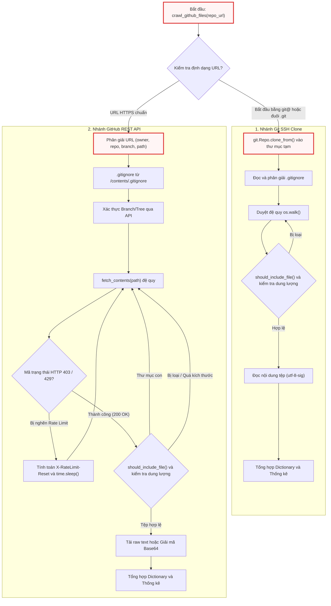

---

## 2. Các Hàm Cấp Module (Module-Level Functions)

### `crawl_github_files()`
**Visibility**: Public  
**Signature**: 
```python
def crawl_github_files(
    repo_url: str,
    token: str | None = None,
    max_file_size: int = 1 * 1024 * 1024,
    use_relative_paths: bool = False,
    include_patterns: str | set[str] | None = None,
    exclude_patterns: str | set[str] | None = None,
) -> dict:
```

**Description**: Hàm điều phối chính chịu trách nhiệm tiếp nhận yêu cầu thu thập dữ liệu từ kho lưu trữ GitHub. Hàm thực hiện chuẩn hóa các tham số lọc mẫu đầu vào (`include_patterns`, `exclude_patterns`) từ chuỗi đơn lẻ sang cấu trúc dữ liệu `set`, nhận diện cơ chế truy cập (SSH hay REST API), điều phối luồng nạp cấu hình `.gitignore`, kiểm soát bộ đếm thống kê và tổng hợp kết quả trả về dưới dạng bảng ánh xạ đường dẫn - nội dung tệp.

**Parameters**:
* `repo_url` (`str`): Đường dẫn URL của kho lưu trữ GitHub. Có thể là URL giao thức SSH (ví dụ: `git@github.com:user/repo.git`) hoặc URL giao thức HTTPS kèm định danh nhánh/commit và thư mục con (ví dụ: `https://github.com/microsoft/autogen/tree/main/python/packages`).
* `token` (`str | None`, tùy chọn): GitHub Personal Access Token (PAT). Bắt buộc đối với các kho lưu trữ riêng tư (private repos) và khuyến nghị sử dụng đối với kho lưu trữ công khai để tránh bị giới hạn tần suất yêu cầu bởi GitHub API.
* `max_file_size` (`int`, tùy chọn): Ngưỡng dung lượng tệp tin tối đa tính bằng byte được phép đọc hoặc tải về. Giá trị mặc định là `1,048,576` bytes ($1\text{ MB}$).
* `use_relative_paths` (`bool`, tùy chọn): Cờ kích hoạt chuẩn hóa đường dẫn tương đối. Nếu đặt là `True`, đường dẫn tệp tin trong kết quả trả về sẽ được loại bỏ phần tiền tố thư mục gốc đã chỉ định trên URL.
* `include_patterns` (`str | set[str] | None`, tùy chọn): Biểu thức mẫu tên tệp (glob pattern) chỉ định các tệp cần thu thập (ví dụ: `"*.py"` hoặc `{"*.py", "*.md"}`). Mặc định là `None` (chấp nhận tất cả tệp).
* `exclude_patterns` (`str | set[str] | None`, tùy chọn): Biểu thức mẫu tên tệp hoặc đường dẫn thư mục cần loại trừ khỏi quá trình thu thập. Mặc định là `None`.

**Returns**:
* `dict`: Cấu trúc dữ liệu chứa hai khóa chính:
  * `"files"` (`dict[str, str]`): Bảng ánh xạ giữa đường dẫn tệp tin (`key`) và toàn bộ nội dung văn bản thuần của tệp (`value`).
  * `"stats"` (`dict[str, Any]`): Báo cáo thống kê bao gồm số lượng tệp đã tải (`downloaded_count`), số lượng tệp bị bỏ qua (`skipped_count`), danh sách tệp bỏ qua (`skipped_files`), đường dẫn cơ sở (`base_path`), cùng cấu hình lọc được áp dụng.

**Raises**:
* `ValueError`: Ném ra khi cấu trúc URL HTTPS không hợp lệ (không phân tách được tối thiểu hai thành phần `owner` và `repo`).
* `Exception`: Ném ra khi vượt quá giới hạn tần suất GitHub API mà không có `token` được cung cấp.

**Implementation Details & Logic Extracts**:

Khởi tạo cấu hình và phân nhánh thực thi SSH Clone:

```python
    # Convert single pattern to set
    if include_patterns and isinstance(include_patterns, str):
        include_patterns = {include_patterns}
    if exclude_patterns and isinstance(exclude_patterns, str):
        exclude_patterns = {exclude_patterns}

    # // ... [Nested helper should_include_file definition] ...

    # Detect SSH URL (git@ or .git suffix)
    is_ssh_url = repo_url.startswith("git@") or repo_url.endswith(".git")

    if is_ssh_url:
        # Clone repo via SSH to temp dir
        with tempfile.TemporaryDirectory() as tmpdirname:
            emit_raw("PROGRESS", f"Cloning SSH repo {repo_url} to temp dir {tmpdirname} ...")
            try:
                repo = git.Repo.clone_from(repo_url, tmpdirname)
            except Exception as e:
                emit_raw("ERROR", f"Error cloning repo: {e}")
                return {"files": {}, "stats": {"error": str(e)}}
            # // ... [SSH traversal logic] ...
```

Đoạn mã trên chuẩn hóa các biến `include_patterns` và `exclude_patterns` thành tập hợp `set` nhằm tối ưu hóa việc kiểm tra thành phần. Sau đó, hệ thống phân tích chuỗi URL: nếu phát hiện định dạng SSH, một thư mục tạm thời sẽ được tạo lập tự động thông qua `tempfile.TemporaryDirectory()`. Toàn bộ mã nguồn được nhân bản bằng `git.Repo.clone_from`. Mọi lỗi phát sinh trong quá trình clone (như lỗi xác thực SSH key hoặc lỗi kết nối mạng) đều được bắt lại, thông báo qua hàm `emit_raw` và trả về cấu trúc lỗi an toàn.

Xử lý duyệt thư mục và áp dụng bộ lọc trên máy cục bộ (nhánh SSH):

```python
            # --- Load .gitignore ---
            gitignore_path = os.path.join(tmpdirname, ".gitignore")
            gitignore_spec = None
            if os.path.exists(gitignore_path):
                try:
                    with open(gitignore_path, encoding="utf-8-sig") as f:
                        gitignore_spec = pathspec.PathSpec.from_lines("gitwildmatch", f.readlines())
                    emit("CRAWL_GITIGNORE_LOADED", path="repository")
                except Exception:
                    pass

            for root, dirs, filenames in os.walk(tmpdirname):
                # Filter directories
                excluded_dirs = set()
                for d in sorted(dirs):
                    dirpath_rel = os.path.relpath(os.path.join(root, d), tmpdirname)
                    reason = None
                    if gitignore_spec and gitignore_spec.match_file(dirpath_rel):
                        reason = get("CRAWL_REASON_GITIGNORE")
                    elif exclude_patterns:
                        for pattern in exclude_patterns:
                            dir_pattern = pattern.removesuffix("/*")
                            if fnmatch.fnmatch(dirpath_rel, dir_pattern) or fnmatch.fnmatch(d, dir_pattern):
                                reason = get("CRAWL_REASON_EXCLUDED")
                                break

                    if reason:
                        excluded_dirs.add(d)
                        entry_num += 1
                        count_excluded += 1
                        emit("CRAWL_DIR_EXCLUDED", num=entry_num, path=dirpath_rel, reason=reason)

                for d in dirs.copy():
                    if d in excluded_dirs:
                        dirs.remove(d)

                dirs.sort()
                # // ... [File processing loop] ...
```

Trong quá trình duyệt thư mục SSH, hệ thống kiểm tra sự tồn tại của tệp `.gitignore` tại thư mục gốc và khởi tạo đối tượng `pathspec.PathSpec` với cú pháp `gitwildmatch`. Khi gọi `os.walk`, danh sách các thư mục con (`dirs`) được duyệt và so khớp với cả `.gitignore` lẫn `exclude_patterns`. Việc biến đổi trực tiếp danh sách `dirs` bằng cách loại bỏ các thư mục nằm trong `excluded_dirs` giúp ngăn chặn `os.walk` đi sâu vào các cây thư mục không mong muốn (như `.git`, `node_modules`, `venv`), giảm thiểu đáng kể chi phí I/O trên đĩa.

Xử lý đọc nội dung tệp và phân loại lỗi mã hóa (nhánh SSH):

```python
                for filename in sorted(filenames):
                    abs_path = os.path.join(root, filename)
                    rel_path = os.path.relpath(abs_path, tmpdirname)
                    entry_num += 1

                    # Check include/exclude patterns
                    if not should_include_file(rel_path, filename, gitignore_spec=gitignore_spec):
                        count_excluded += 1
                        emit("CRAWL_FILE_EXCLUDED", num=entry_num, path=rel_path)
                        continue

                    # Check file size
                    try:
                        file_size = os.path.getsize(abs_path)
                    except OSError:
                        continue

                    if file_size > max_file_size:
                        count_size_limit += 1
                        skipped_size_list.append(rel_path)
                        size_kb = file_size / 1024
                        emit("CRAWL_FILE_SIZE_LIMIT", num=entry_num, path=rel_path, size=f"{size_kb:.0f}")
                        continue

                    # Read content
                    try:
                        with open(abs_path, encoding="utf-8-sig") as f:
                            content = f.read()
                        files[rel_path] = content
                        count_processed += 1
                        emit("CRAWL_FILE_PROCESSED", num=entry_num, path=rel_path)
                    except (UnicodeDecodeError, ValueError):
                        count_non_text += 1
                        skipped_non_text_list.append(rel_path)
                        emit("CRAWL_FILE_NOT_TEXT", num=entry_num, path=rel_path)
                    except Exception as e:
                        count_non_text += 1
                        skipped_non_text_list.append(rel_path)
                        emit("CRAWL_FILE_ERROR", num=entry_num, path=rel_path, error=e)
```

Mỗi tệp tin sau khi vượt qua hàm kiểm tra `should_include_file` sẽ được thẩm định dung lượng qua `os.getsize`. Nếu vượt ngưỡng `max_file_size`, tệp bị bỏ qua và ghi nhận vào `skipped_size_list`. Khi đọc tệp, hệ thống sử dụng bảng mã `utf-8-sig` để tự động xử lý ký tự BOM (Byte Order Mark) nếu có. Nếu tệp là định dạng nhị phân (hình ảnh, tệp thực thi, thư viện liên kết động) hoặc gặp lỗi giải mã, ngoại lệ `UnicodeDecodeError` và `ValueError` sẽ được bắt lại, phân loại tệp vào nhóm phi văn bản (`count_non_text`) mà không làm gián đoạn luồng duyệt chính.

Phân giải cấu trúc URL và chuẩn bị yêu cầu REST API:

```python
    # Parse GitHub URL to extract owner, repo, commit/branch, and path
    parsed_url = urlparse(repo_url)
    path_parts = parsed_url.path.strip("/").split("/")

    if len(path_parts) < 2:
        raise ValueError(f"Invalid GitHub URL: {repo_url}")

    # Extract the basic components
    owner = path_parts[0]
    repo = path_parts[1]

    # Setup for GitHub API
    headers = {"Accept": "application/vnd.github.v3+json"}
    if token:
        headers["Authorization"] = f"token {token}"
```

Đối với nhánh HTTP REST, hàm sử dụng `urllib.parse.urlparse` để tách các thành phần trong chuỗi đường dẫn. Hệ thống yêu cầu tối thiểu hai thành phần là định danh tài khoản/tổ chức (`owner`) và tên kho lưu trữ (`repo`). Tiêu đề HTTP được cấu hình chuẩn với `Accept: application/vnd.github.v3+json` và tự động đính kèm khóa xác thực `Authorization: token <token>` nếu tham số `token` được cung cấp.

Phân giải nhánh, mã băm commit và đường dẫn con trong URL:

```python
    # Check if URL contains a specific branch/commit
    if len(path_parts) > 3 and path_parts[2] == "tree":

        def join_parts(i):
            return "/".join(path_parts[i:])

        branches = fetch_branches(owner, repo)
        branch_names = (branch.get("name") for branch in branches)

        # Fetching branches was not successful
        if len(branches) == 0:
            return None

        # Check branch name
        relevant_path = join_parts(3)

        # Find a match with relevant path and get the branch name
        filter_gen = (name for name in branch_names if relevant_path.startswith(name))
        ref = next(filter_gen, None)

        # If match is not found, check for is it a tree
        if ref is None:
            tree = path_parts[3]
            ref = tree if check_tree(owner, repo, tree) else None

        # If it is neither a tree nor a branch name
        if ref is None:
            emit_raw("ERROR", "The given path does not match with any branch and any tree in the repository.\nPlease verify the path is exists.")
            return None

        # Combine all parts after the ref as the path
        part_index = 5 if "/" in ref else 4
        specific_path = join_parts(part_index) if part_index < len(path_parts) else ""
    else:
        # Don't put the ref param in query
        # and let Github decide default branch
        ref = None
        specific_path = ""
```

Đoạn mã giải quyết bài toán phức tạp khi URL chứa định dạng nhánh có dấu gạch chéo (ví dụ: `tree/feature/new-ui/src`). Thuật toán truy xuất danh sách toàn bộ các nhánh của kho lưu trữ thông qua `fetch_branches()`, sau đó kiểm tra tiền tố của chuỗi đường dẫn (`relevant_path`) với danh sách tên nhánh. Nếu không khớp với bất kỳ nhánh nào, hệ thống tiếp tục kiểm tra xem chuỗi phân đoạn có phải là mã định danh cây/commit thông qua `check_tree()`. Khi đã xác định chính xác `ref`, phần còn lại của đường dẫn được gán vào `specific_path` để giới hạn phạm vi thu thập đệ quy.

Tải và khởi tạo `.gitignore` qua GitHub API:

```python
    # --- Try to fetch .gitignore ---
    gitignore_spec = None
    try:
        gi_url = f"https://api.github.com/repos/{owner}/{repo}/contents/.gitignore"
        gi_params = {"ref": ref} if ref is not None else {}
        gi_resp = requests.get(gi_url, headers=headers, params=gi_params, timeout=(10, 10))
        if gi_resp.status_code == 200:
            gi_data = gi_resp.json()
            if "content" in gi_data and gi_data.get("encoding") == "base64":
                gi_content = base64.b64decode(gi_data["content"]).decode("utf-8")
                gitignore_spec = pathspec.PathSpec.from_lines("gitwildmatch", gi_content.splitlines())
                emit("CRAWL_GITIGNORE_LOADED", path="repository (API)")
    except Exception:
        pass
```

Trước khi tiến hành duyệt đệ quy cây thư mục, một yêu cầu HTTP GET được gửi đến endpoint `/contents/.gitignore` kèm theo tham số `ref` tương ứng. Nếu tệp tồn tại (HTTP 200), nội dung mã hóa Base64 được giải mã thành chuỗi văn bản thuần và biên dịch thành đối tượng `pathspec.PathSpec`. Trường hợp tệp không tồn tại hoặc gặp lỗi kết nối, ngoại lệ được bỏ qua một cách an toàn và `gitignore_spec` giữ giá trị `None`.

**Example**:
```python
# Trích xuất từ khối kiểm thử/thực thi mẫu ở cuối tệp utils/crawl_github_files.py
repo_url = "https://github.com/pydantic/pydantic/tree/6c38dc93f40a47f4d1350adca9ec0d72502e223f/pydantic"

result = crawl_github_files(
    repo_url,
    token=github_token,
    max_file_size=1 * 1024 * 1024,  # 1 MB in bytes
    use_relative_paths=True,  # Enable relative paths
    include_patterns={"*.py", "*.md"},  # Include Python and Markdown files
)

files = result["files"]
stats = result["stats"]
```

---

## 3. Các Hàm Tiện ích Nội bộ (Internal Helper Functions)

Các hàm dưới đây được định nghĩa cục bộ (nested functions) bên trong thân hàm `crawl_github_files()` nhằm thực hiện các tác vụ chuyên biệt hóa trong từng phạm vi xử lý.

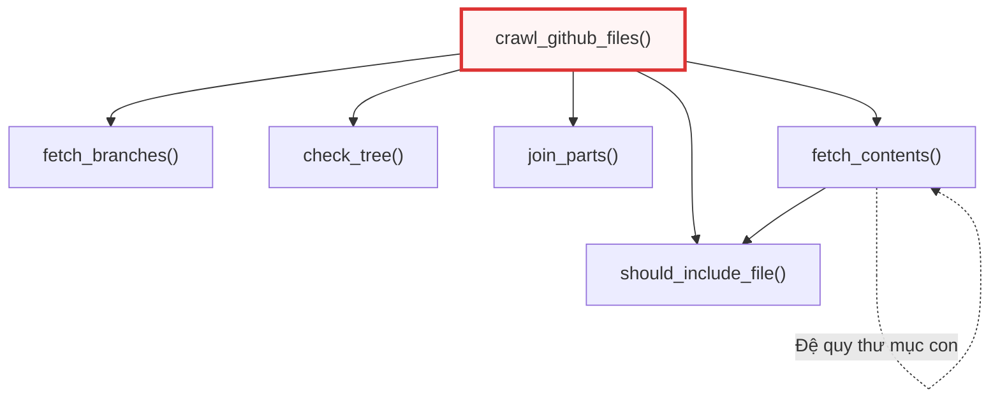

---

### `should_include_file()`
**Visibility**: Nested Helper (Private to `crawl_github_files`)  
**Signature**: 
```python
def should_include_file(
    file_path: str, 
    file_name: str, 
    gitignore_spec: pathspec.PathSpec | None = None
) -> bool:
```

**Description**: Hàm đánh giá logic quyết định xem một tệp tin có thỏa mãn các tiêu chí lọc để được nạp vào bộ nhớ hay không. Quá trình kiểm tra diễn ra theo 3 tầng liên tiếp:
1. So khớp tên tệp (`file_name`) với tập hợp `include_patterns` thông qua `fnmatch.fnmatch`.
2. So khớp đường dẫn tệp (`file_path`) với đặc tả loại trừ của `gitignore_spec` (nếu có).
3. So khớp đường dẫn tệp (`file_path`) với tập hợp `exclude_patterns`.

**Parameters**:
* `file_path` (`str`): Đường dẫn đầy đủ hoặc tương đối của tệp tính từ thư mục gốc thu thập.
* `file_name` (`str`): Tên cơ sở (basename) của tệp tin.
* `gitignore_spec` (`pathspec.PathSpec | None`, tùy chọn): Đối tượng so khớp quy tắc `.gitignore` đã biên dịch.

**Returns**:
* `bool`: Trả về `True` nếu tệp vượt qua toàn bộ các bộ lọc và được phép tải/đọc; ngược lại trả về `False`.

**Raises**:
* Không phát sinh ngoại lệ trực tiếp.

**Implementation Logic**:
```python
    def should_include_file(file_path: str, file_name: str, gitignore_spec=None) -> bool:
        """Determine if a file should be included based on patterns"""
        # If no include patterns are specified, include all files
        if not include_patterns:
            include_file = True
        else:
            # Check if file matches any include pattern
            include_file = any(fnmatch.fnmatch(file_name, pattern) for pattern in include_patterns)

        # Check gitignore if provided
        if include_file and gitignore_spec and gitignore_spec.match_file(file_path):
            return False

        # If exclude patterns are specified, check if file should be excluded
        if exclude_patterns and include_file:
            # Exclude if file matches any exclude pattern
            exclude_file = any(fnmatch.fnmatch(file_path, pattern) for pattern in exclude_patterns)
            return not exclude_file

        return include_file
```

Logic trên áp dụng nguyên lý đánh giá lười (short-circuit evaluation). Nếu `include_patterns` được thiết lập, hàm sẽ chỉ kiểm tra tiếp các quy tắc loại trừ nếu tệp khớp với ít nhất một mẫu bao gồm. Sự kết hợp giữa so khớp tên tệp (đối với include) và so khớp toàn bộ đường dẫn (đối với gitignore và exclude) đảm bảo độ linh hoạt cao khi cấu hình các bộ lọc phức tạp.

**Example**:
```python
# Trích xuất từ cách gọi nội bộ trong crawl_github_files
# Kiểm tra include/exclude patterns trong nhánh REST API
if not should_include_file(rel_path, item["name"], gitignore_spec=gitignore_spec):
    api_counters["excluded"] += 1
    emit("CRAWL_FILE_EXCLUDED", num=entry_num, path=rel_path)
    continue
```

---

### `fetch_branches()`
**Visibility**: Nested Helper (Private to `crawl_github_files`)  
**Signature**: 
```python
def fetch_branches(owner: str, repo: str) -> list[dict] | None:
```

**Description**: Gửi yêu cầu HTTP GET đến GitHub REST API endpoint `/repos/{owner}/{repo}/branches` để lấy danh sách toàn bộ các nhánh của kho lưu trữ. Hàm thiết lập thời gian chờ (timeout) cố định là 30 giây cho cả kết nối và đọc dữ liệu, đồng thời xử lý các trường hợp lỗi HTTP phổ biến như 404 (kho lưu trữ không tồn tại hoặc là repo riêng tư nhưng thiếu token) và 403/429 (vượt hạn mức truy cập API).

**Parameters**:
* `owner` (`str`): Tên người dùng hoặc tổ chức sở hữu kho lưu trữ trên GitHub.
* `repo` (`str`): Tên kho lưu trữ.

**Returns**:
* `list[dict]`: Danh sách các đối tượng JSON đại diện cho các nhánh nếu truy vấn thành công.
* `list`: Danh sách rỗng `[]` nếu gặp lỗi 404 hoặc mã trạng thái HTTP khác 200.

**Raises**:
* `Exception`: Ném ra thông báo `"GitHub API rate limit exceeded..."` nếu nhận mã trạng thái 403 hoặc 429 khi không có `token` xác thực.

**Implementation Logic**:
```python
    def fetch_branches(owner: str, repo: str):
        """Get branches of the repository"""

        url = f"https://api.github.com/repos/{owner}/{repo}/branches"
        response = requests.get(url, headers=headers, timeout=(30, 30))

        if response.status_code in (403, 429) and not token:
            raise Exception("GitHub API rate limit exceeded. Please provide a GitHub token using --token or GITHUB_TOKEN env var.")

        if response.status_code == 404:
            if not token:
                emit_raw(
                    "ERROR",
                    "Error 404: Repository not found or is private.\n"
                    "If this is a private repository, please provide a valid GitHub token via the 'token' argument or set the GITHUB_TOKEN environment variable.",
                )
            else:
                emit_raw(
                    "ERROR",
                    "Error 404: Repository not found or insufficient permissions with the provided token.\n"
                    "Please verify the repository exists and the token has access to this repository.",
                )
            return []

        if response.status_code != 200:
            emit_raw("ERROR", f"Error fetching the branches of {owner}/{repo}: {response.status_code} - {response.text}")
            return []

        return response.json()
```

Hàm này thực hiện bóc tách lỗi HTTP chi tiết dựa trên trạng thái cung cấp của biến `token`. Nếu nhận mã lỗi 404 khi không có token, hệ thống sẽ đưa ra hướng dẫn người dùng thiết lập biến môi trường `GITHUB_TOKEN`. Nếu đã có token nhưng vẫn gặp lỗi 404, thông báo sẽ chỉ rõ vấn đề về quyền hạn truy cập (insufficient permissions).

**Example**:
```python
# Trích xuất từ logic giải quyết branch trong crawl_github_files
branches = fetch_branches(owner, repo)
branch_names = (branch.get("name") for branch in branches)

if len(branches) == 0:
    return None
```

---

### `check_tree()`
**Visibility**: Nested Helper (Private to `crawl_github_files`)  
**Signature**: 
```python
def check_tree(owner: str, repo: str, tree: str) -> bool:
```

**Description**: Kiểm tra sự tồn tại của một cây đối tượng Git (Git Tree SHA hoặc Commit SHA) trên GitHub thông qua endpoint `/repos/{owner}/{repo}/git/trees/{tree}`. Hàm này được sử dụng như một cơ chế dự phòng khi chuỗi định danh trên URL không khớp với bất kỳ tên nhánh nào trong danh sách nhánh được trả về từ `fetch_branches()`.

**Parameters**:
* `owner` (`str`): Tên chủ sở hữu kho lưu trữ.
* `repo` (`str`): Tên kho lưu trữ.
* `tree` (`str`): Chuỗi băm SHA của commit hoặc Git tree cần kiểm tra.

**Returns**:
* `bool`: Trả về `True` nếu mã trạng thái HTTP là 200 (cây tồn tại); ngược lại trả về `False`.

**Raises**:
* `Exception`: Ném ra lỗi nếu chạm giới hạn tần suất GitHub API (HTTP 403/429) trong điều kiện không sử dụng token.

**Implementation Logic**:
```python
    def check_tree(owner: str, repo: str, tree: str):
        """Check the repository has the given tree"""

        url = f"https://api.github.com/repos/{owner}/{repo}/git/trees/{tree}"
        response = requests.get(url, headers=headers, timeout=(30, 30))

        if response.status_code in (403, 429) and not token:
            raise Exception("GitHub API rate limit exceeded. Please provide a GitHub token using --token or GITHUB_TOKEN env var.")

        return response.status_code == 200
```

Hàm đóng vai trò kiểm tra tính hợp lệ của tham chiếu Git (Ref Validator) mức thấp. Nhờ việc gọi trực tiếp Git Trees API, hệ thống hỗ trợ thu thập mã nguồn tại một commit bất kỳ trong lịch sử mà không cần commit đó phải là đỉnh (HEAD) của một nhánh hiện hữu.

**Example**:
```python
# Trích xuất từ logic xác định ref khi không khớp tên nhánh
if ref is None:
    tree = path_parts[3]
    ref = tree if check_tree(owner, repo, tree) else None
```

---

### `join_parts()`
**Visibility**: Nested Helper (Private to `crawl_github_files`)  
**Signature**: 
```python
def join_parts(i: int) -> str:
```

**Description**: Hàm tiện ích cục bộ hỗ trợ ghép nối lại các phân đoạn đường dẫn URL (danh sách `path_parts`) bắt đầu từ chỉ mục `i` đến cuối danh sách, sử dụng dấu gạch chéo `/` làm ký tự phân tách.

**Parameters**:
* `i` (`int`): Chỉ mục phần tử bắt đầu ghép trong mảng `path_parts`.

**Returns**:
* `str`: Chuỗi đường dẫn kết hợp hoàn chỉnh.

**Raises**:
* Không phát sinh ngoại lệ.

**Implementation Logic**:
```python
        def join_parts(i):
            return "/".join(path_parts[i:])
```

Hàm này được dùng để tái tạo lại chuỗi đường dẫn con nằm sau thành phần `tree/<branch_name>` nhằm phân tách chính xác giữa tên nhánh và đường dẫn thư mục nội bộ trong kho lưu trữ.

**Example**:
```python
# Trích xuất từ logic tính toán relevant_path và specific_path
relevant_path = join_parts(3)
# ...
part_index = 5 if "/" in ref else 4
specific_path = join_parts(part_index) if part_index < len(path_parts) else ""
```

---

### `fetch_contents()`
**Visibility**: Nested Helper (Private to `crawl_github_files`)  
**Signature**: 
```python
def fetch_contents(path: str) -> None:
```

**Description**: Hàm đệ quy cốt lõi trong chế độ GitHub REST API, chịu trách nhiệm duyệt qua từng cấp thư mục bắt đầu từ `specific_path`. Đối với mỗi mục (item) được trả về từ endpoint `/contents/{path}`:
* Nếu là thư mục (`type == "dir"`): Kiểm tra điều kiện loại trừ qua `.gitignore` và `exclude_patterns`. Nếu hợp lệ, tiếp tục gọi đệ quy `fetch_contents(item_path)`.
* Nếu là tệp tin (`type == "file"`): Kiểm tra quy tắc lọc mẫu và giới hạn kích thước (`max_file_size`). Nếu hợp lệ, tiến hành tải nội dung văn bản qua `download_url` hoặc giải mã chuỗi Base64 từ trường `content`, sau đó ghi trực tiếp vào từ điển `files`.
* Xử lý cơ chế tự động chờ (Rate Limit Backoff): Tự động tính toán thời gian `X-RateLimit-Reset`, tạm dừng tiến trình bằng `time.sleep()` và thực hiện gọi lại chính nó khi hết thời gian phong tỏa.

**Parameters**:
* `path` (`str`): Đường dẫn tương đối của thư mục hoặc tệp tin cần truy vấn nội dung từ GitHub API.

**Returns**:
* `None`: Hàm không trả về giá trị, dữ liệu thu thập được cập nhật trực tiếp vào biến đóng bao (closure variable) `files` và `api_counters`.

**Raises**:
* `Exception`: Ném ra khi bị chặn tần suất yêu cầu (403/429) mà người dùng không cung cấp `token`.

**Implementation Logic**:

Kiểm soát lỗi và cơ chế Rate Limit Backoff:

```python
    def fetch_contents(path):
        """Fetch contents of the repository at a specific path and commit"""
        url = f"https://api.github.com/repos/{owner}/{repo}/contents/{path}"
        params = {"ref": ref} if ref is not None else {}

        response = requests.get(url, headers=headers, params=params, timeout=(30, 30))

        if response.status_code in (403, 429) and "rate limit exceeded" in response.text.lower():
            if not token:
                raise Exception("GitHub API rate limit exceeded. Please provide a GitHub token using --token or GITHUB_TOKEN env var.")
            reset_time = int(response.headers.get("X-RateLimit-Reset", 0))
            wait_time = max(reset_time - time.time(), 0) + 1
            emit_raw("WARNING", f"Rate limit exceeded. Waiting for {wait_time:.0f} seconds...")
            time.sleep(wait_time)
            return fetch_contents(path)

        if response.status_code == 404:
            # // ... [Error logging for 404 paths] ...
            return None

        if response.status_code != 200:
            emit_raw("ERROR", f"Error fetching {path}: {response.status_code} - {response.text}")
            return None
```

Đoạn mã trên thể hiện kỹ thuật phục hồi lỗi mạng nâng cao. Khi API phản hồi mã lỗi 403 hoặc 429 kèm thông điệp vượt hạn ngạch, hàm đọc tiêu đề `X-RateLimit-Reset` (chứa mốc thời gian Unix timestamp khi hạn mức được làm mới), tính toán khoảng thời gian cần ngủ (`wait_time`) và gọi lại chính nó (`return fetch_contents(path)`). Cơ chế này đảm bảo tiến trình thu thập dữ liệu lớn không bị đứt đoạn giữa chừng.

Xử lý tải và giải mã nội dung tệp tin:

```python
        contents = response.json()
        if not isinstance(contents, list):
            contents = [contents]

        for item in contents:
            item_path = item["path"]
            if use_relative_paths and specific_path:
                if item_path.startswith(specific_path):
                    rel_path = item_path[len(specific_path) :].lstrip("/")
                else:
                    rel_path = item_path
            else:
                rel_path = item_path

            if item["type"] == "file":
                api_counters["entry"] += 1
                entry_num = api_counters["entry"]

                if not should_include_file(rel_path, item["name"], gitignore_spec=gitignore_spec):
                    api_counters["excluded"] += 1
                    emit("CRAWL_FILE_EXCLUDED", num=entry_num, path=rel_path)
                    continue

                file_size = item.get("size", 0)
                if file_size > max_file_size:
                    api_counters["size_limit"] += 1
                    api_skipped_size.append(rel_path)
                    size_kb = file_size / 1024
                    emit("CRAWL_FILE_SIZE_LIMIT", num=entry_num, path=rel_path, size=f"{size_kb:.0f}")
                    continue

                # For files, get raw content
                if item.get("download_url"):
                    file_url = item["download_url"]
                    file_response = requests.get(file_url, headers=headers, timeout=(30, 30))
                    # // ... [Content-length verification] ...
                    if file_response.status_code == 200:
                        files[rel_path] = file_response.text
                        api_counters["processed"] += 1
                        emit("CRAWL_FILE_PROCESSED", num=entry_num, path=rel_path)
                # // ... [Base64 fallback processing] ...
```

Hàm chuẩn hóa phản hồi từ GitHub API (chuyển đổi đối tượng đơn lẻ thành danh sách nếu truy vấn trực tiếp một tệp). Khi xử lý từng phần tử loại `file`, hệ thống ưu tiên tải trực tiếp văn bản thô từ `download_url` nhằm giảm thiểu chi phí tính toán CPU cho việc giải mã Base64. Trước khi lưu vào `files`, kích thước phản hồi thực tế từ tiêu đề `content-length` tiếp tục được kiểm tra lại để phòng ngừa sai lệch siêu dữ liệu.

Xử lý loại trừ và duyệt đệ quy thư mục:

```python
            elif item["type"] == "dir":
                dir_excluded = False
                dir_reason = None

                if gitignore_spec and gitignore_spec.match_file(rel_path):
                    dir_excluded = True
                    dir_reason = get("CRAWL_REASON_GITIGNORE")

                if not dir_excluded and exclude_patterns:
                    dir_name = item["name"]
                    for pattern in exclude_patterns:
                        dir_pattern = pattern.removesuffix("/*")
                        if (
                            fnmatch.fnmatch(item_path, dir_pattern)
                            or fnmatch.fnmatch(rel_path, dir_pattern)
                            or fnmatch.fnmatch(dir_name, dir_pattern)
                        ):
                            dir_excluded = True
                            dir_reason = get("CRAWL_REASON_EXCLUDED")
                            break

                if dir_excluded:
                    api_counters["entry"] += 1
                    api_counters["excluded"] += 1
                    emit("CRAWL_DIR_EXCLUDED", num=api_counters["entry"], path=rel_path, reason=dir_reason)
                    continue

                fetch_contents(item_path)
```

Trước khi thực hiện lời gọi đệ quy `fetch_contents(item_path)` cho các mục có `type == "dir"`, hệ thống tiến hành kiểm tra sớm (early pruning) đối với thư mục. Bằng cách so sánh tên thư mục và đường dẫn với `.gitignore` và `exclude_patterns`, các nhánh thư mục bị cấm sẽ bị cắt bỏ ngay lập tức, tiết kiệm tối đa số lượng request gửi lên GitHub API.

**Example**:
```python
# Trích xuất từ điểm khởi động đệ quy trong crawl_github_files
fetch_contents(specific_path)
```

---

## 4. Bảng Thống kê Cấu trúc & Trường Dữ liệu Trả về

Cấu trúc từ điển (Dictionary) trả về từ `crawl_github_files()` tuân thủ định dạng chuẩn sau:

| Khóa (Key) | Kiểu Dữ liệu (Type) | Mô tả Kỹ thuật |
| :--- | :--- | :--- |
| `files` | `dict[str, str]` | Bảng ánh xạ các cặp key-value, trong đó `key` là đường dẫn tệp tin (chuẩn hóa theo relative/absolute tùy cờ `use_relative_paths`) và `value` là toàn bộ chuỗi nội dung văn bản thuần. |
| `stats.downloaded_count` | `int` | Tổng số lượng tệp tin đã được tải về và xử lý thành công. |
| `stats.skipped_count` | `int` | Số lượng tệp bị bỏ qua do lỗi hoặc vượt kích thước. |
| `stats.skipped_files` | `list[str]` | Danh sách chi tiết đường dẫn các tệp bị bỏ qua trong quá trình duyệt. |
| `stats.base_path` | `str \| None` | Chuỗi đường dẫn gốc được dùng làm mốc tính đường dẫn tương đối (nếu `use_relative_paths=True`). |
| `stats.include_patterns` | `set[str] \| None` | Tập hợp các biểu thức mẫu lọc bao gồm đã áp dụng. |
| `stats.exclude_patterns` | `set[str] \| None` | Tập hợp các biểu thức mẫu lọc loại trừ đã áp dụng. |
| `stats.source` | `str` (tùy chọn) | Định danh nguồn thu thập (chỉ xuất hiện trong nhánh SSH với giá trị `"ssh_clone"`). |

---

## Xem thêm (See Also)

* [__init__.py](01___init___py.md) — Khởi tạo không gian tên tầng tiện ích hạ tầng `utils`.
* [call_llm.py](02_call_llm_py.md) — Tầng cổng kết nối và điều phối mô hình ngôn ngữ lớn (LLM Gateway).
* [crawl_local_files.py](04_crawl_local_files_py.md) — Module thu thập và phân tích mã nguồn từ hệ thống tệp cục bộ.
* [exclude_patterns.py](05_exclude_patterns_py.md) — Danh mục các biểu thức chính quy và mẫu loại trừ tệp/thư mục mặc định.
* [output.py](06_output_py.md) — Hệ thống phát sự kiện và hiển thị thông báo tiến trình (`emit`, `emit_raw`, `get`).


---

<a id="chapter-4"></a>

# crawl_local_files.py

> **Source:** `utils\crawl_local_files.py`

Tài liệu này cung cấp đặc tả kỹ thuật chi tiết và tham chiếu API nội bộ cho module `utils\crawl_local_files.py`. Module này chịu trách nhiệm thu thập, phân tích và tiền xử lý toàn bộ các tệp mã nguồn từ hệ thống tệp cục bộ (Local File System) nhằm tạo lập ngữ cảnh phục vụ các tác vụ phân tích mã nguồn và mô hình ngôn ngữ lớn (LLM).

Ở chương trước, [crawl_github_files.py](03_crawl_github_files_py.md) đã giải quyết bài toán tải mã nguồn từ xa thông qua hạ tầng GitHub REST API và Git SSH. Tương ứng trên môi trường nội bộ, `crawl_local_files.py` đóng vai trò là cổng nạp dữ liệu cục bộ (Local Repository Ingestion Gateway). Module cung cấp giao diện đầu ra chuẩn hóa đồng nhất (`dict[str, str]`) tương thích hoàn toàn với luồng xử lý của `crawl_github_files.py`, nhưng được tối ưu hóa đặc biệt cho I/O đĩa cục bộ, cơ chế duyệt tệp đơn kỳ (single-pass traversal), và khả năng phân giải quy tắc `.gitignore` phân cấp đa tầng.

---

## 1. Tổng quan Kiến trúc & Nguyên lý Hoạt động

Module `crawl_local_files.py` thực hiện quét đệ quy cấu trúc thư mục trên máy cục bộ bằng cách kết hợp thư viện chuẩn `os` và bộ phân tích cú pháp mẫu `pathspec` (tuân thủ chuẩn `gitwildmatch` của Git). Quá trình thu thập được thiết kế theo các nguyên tắc kỹ thuật cốt lõi sau:

1. **Phân giải `.gitignore` Đa tầng (Hierarchical Gitignore Resolution):** Hệ thống không chỉ đọc tệp `.gitignore` tại thư mục gốc mà còn tự động phát hiện và nạp các tệp `.gitignore` lồng nhau trong các thư mục con trong quá trình duyệt. Mỗi quy tắc được gắn chặt với phạm vi (scope) tương đối của thư mục chứa nó.
2. **Cắt tỉa Thư mục Sớm (Early Directory Pruning):** Bằng cách can thiệp trực tiếp vào danh sách `dirs` trong hàm `os.walk()`, module loại bỏ hoàn toàn các nhánh thư mục bị cấm (như `.git`, `node_modules`, `__pycache__`) ngay từ cấp cao nhất, ngăn chặn việc duyệt sâu không cần thiết và tiết kiệm tài nguyên I/O đĩa.
3. **Đường ống Lọc 5 Tầng Phòng thủ (5-Stage Defensive Filter Pipeline):** Từng tệp tin được thẩm định qua 5 rào cản độc lập trước khi đọc nội dung:
   * Kiểm tra quy tắc `.gitignore` phân cấp.
   * So khớp danh sách mẫu loại trừ tường minh (`exclude_patterns`).
   * So khớp danh sách mẫu bao gồm (`include_patterns`).
   * Kiểm tra giới hạn dung lượng tệp (`max_file_size`).
   * Kiểm tra tính hợp lệ của định dạng văn bản thuần (loại bỏ tệp nhị phân thông qua giải mã UTF-8 có xử lý BOM).
4. **Truyền phát Sự kiện Tiến trình (Event-Driven Progress Emission):** Mọi hành động duyệt, loại trừ, bỏ qua hoặc xử lý thành công đều kích hoạt sự kiện thông qua hệ thống thông báo [output.py](06_output_py.md), cho phép tầng giao diện hiển thị trạng thái theo thời gian thực mà không làm nghẽn luồng xử lý chính.

---

## 2. Sơ đồ Luồng Xử lý Thu thập Dữ liệu Cục bộ

Sơ đồ tuần tự dưới đây mô tả chi tiết quy trình xử lý, cắt tỉa thư mục và đánh giá điều kiện lọc tệp tin trong hàm `crawl_local_files`:

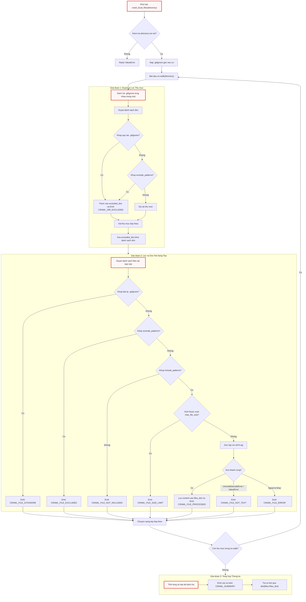

---

## 3. Module-Level Functions

Phần này đặc tả chi tiết toàn bộ các hàm nội bộ (private helpers) và hàm công khai (public API) được định nghĩa trong `utils/crawl_local_files.py`.

```
utils\crawl_local_files.py
├── _load_gitignore(gitignore_path)
├── _matches_any_gitignore(gitignore_specs, abs_path, is_dir=False)
└── crawl_local_files(directory, include_patterns=None, exclude_patterns=None, max_file_size=None, use_relative_paths=True)
```

---

### `_load_gitignore()`

**Visibility**: Private (Hàm trợ giúp nội bộ)  
**Signature**: `def _load_gitignore(gitignore_path: str) -> Optional[pathspec.PathSpec]:`

**Description**:  
Hàm thực hiện nạp và biên dịch nội dung của một tệp `.gitignore` cục bộ thành đối tượng `pathspec.PathSpec`. Quá trình biên dịch sử dụng cú pháp chuẩn `gitwildmatch` nhằm tái tạo chính xác cơ chế khớp mẫu của Git (bao gồm toán tử `**`, dấu phủ định `!`, và quy tắc xử lý dấu `/`). Hàm được bọc hoàn toàn trong khối `try...except` để đảm bảo khi tệp tin bị khóa, hỏng phân quyền hoặc lỗi đọc dữ liệu, tiến trình quét tổng thể vẫn tiếp tục mà không làm sập ứng dụng.

**Parameters**:
* `gitignore_path` (`str`): Đường dẫn tuyệt đối hoặc tương đối trỏ tới tệp `.gitignore` cần nạp.

**Returns**:
* `pathspec.PathSpec | None`: Trả về đối tượng `PathSpec` đã được biên dịch nếu nạp và phân tích cú pháp thành công; trả về `None` nếu tệp không tồn tại hoặc xảy ra lỗi I/O.

**Raises**:
* Hàm không ném ngoại lệ ra ngoài (toàn bộ các ngoại lệ `Exception` phát sinh đều được bắt và chuyển đổi thành giá trị trả về `None`).

**Source Implementation**:
```python
def _load_gitignore(gitignore_path):
    """Load a .gitignore file and return a PathSpec, or None on failure."""
    try:
        with open(gitignore_path, encoding="utf-8-sig") as f:
            return pathspec.PathSpec.from_lines("gitwildmatch", f.readlines())
    except Exception:
        return None
```

Đoạn mã trên sử dụng bảng mã `utf-8-sig` khi mở tệp nhằm loại bỏ Byte Order Mark (BOM) nếu tệp `.gitignore` được tạo hoặc chỉnh sửa trên các hệ điều hành Windows cũ. Phương thức `pathspec.PathSpec.from_lines("gitwildmatch", ...)` tiếp nhận một tập hợp các dòng văn bản và chuyển đổi chúng thành một cây cú pháp trừu tượng tối ưu cho việc kiểm tra so khớp chuỗi đường dẫn.

**Example**:
```python
# Trích xuất từ logic nạp .gitignore gốc trong crawl_local_files()
root_gi_path = os.path.join(directory, ".gitignore")
if os.path.exists(root_gi_path):
    spec = _load_gitignore(root_gi_path)
    if spec:
        gitignore_specs[os.path.abspath(directory)] = spec
        emit("CRAWL_GITIGNORE_LOADED", path=root_gi_path)
```

---

### `_matches_any_gitignore()`

**Visibility**: Private (Hàm trợ giúp nội bộ)  
**Signature**: `def _matches_any_gitignore(gitignore_specs: dict[str, pathspec.PathSpec], abs_path: str, is_dir: bool = False) -> bool:`

**Description**:  
Hàm thực hiện kiểm tra xem một đường dẫn tệp tin hoặc thư mục cụ thể có bị loại trừ bởi bất kỳ đối tượng `PathSpec` nào đang hoạt động hay không. Điểm mấu chốt trong thuật toán là **tính cục bộ theo phạm vi (Scoping)**: mỗi tệp `.gitignore` chỉ có hiệu lực đối với các tệp và thư mục con nằm bên trong cây thư mục chứa chính nó. Do đó, hàm tính toán đường dẫn tương đối từ vị trí đặt `.gitignore` (`gi_dir`) tới đường dẫn cần kiểm tra (`abs_path`). Nếu đường dẫn nằm ngoài phạm vi (bắt đầu bằng `..`), quy tắc đó sẽ bị bỏ qua. Chuỗi đường dẫn được chuẩn hóa sang định dạng dấu gạch chéo xuôi (`/`) của chuẩn POSIX để đảm bảo tính nhất quán trên mọi hệ điều hành.

**Parameters**:
* `gitignore_specs` (`dict[str, pathspec.PathSpec]`): Bảng ánh xạ với khóa là đường dẫn tuyệt đối của thư mục chứa `.gitignore` (`abs_dir_path`) và giá trị là đối tượng `PathSpec` tương ứng.
* `abs_path` (`str`): Đường dẫn tuyệt đối của tệp hoặc thư mục cần kiểm tra tính hợp lệ.
* `is_dir` (`bool`, tùy chọn): Cờ định danh đối tượng đang kiểm tra là thư mục. Mặc định là `False`. Khi là `True`, một dấu `/` sẽ được tự động gắn vào cuối chuỗi đường dẫn để kích hoạt chính xác các quy tắc loại trừ thư mục trong cú pháp Git (ví dụ: `build/`).

**Returns**:
* `bool`: Trả về `True` nếu đường dẫn khớp với ít nhất một quy tắc cấm trong bất kỳ `.gitignore` nào có phạm vi bao bọc nó; ngược lại trả về `False`.

**Raises**:
* Hàm không chủ động ném ngoại lệ.

**Source Implementation**:
```python
def _matches_any_gitignore(gitignore_specs, abs_path, is_dir=False):
    """Check if a path matches ANY loaded .gitignore spec.

    Each spec is checked with the path relative to its own .gitignore directory.
    For directories, a trailing '/' is appended for proper gitignore matching.

    Args:
        gitignore_specs: dict of {abs_dir_path: pathspec.PathSpec}
        abs_path: absolute path of the file or directory to check
        is_dir: True if checking a directory
    Returns:
        True if the path matches any gitignore rule
    """
    for gi_dir, spec in gitignore_specs.items():
        rel = os.path.relpath(abs_path, gi_dir)
        # Skip if the path is not under this gitignore's scope
        if rel.startswith(".."):
            continue
        match_path = rel.replace("\\", "/")
        if is_dir:
            match_path = match_path.rstrip("/") + "/"
        if spec.match_file(match_path):
            return True
    return False
```

Thuật toán lặp qua từng mục nhập trong từ điển `gitignore_specs`. Biểu thức `os.path.relpath(abs_path, gi_dir)` chuyển đổi đường dẫn kiểm tra về hệ quy chiếu của thư mục chứa tệp `.gitignore`. Nếu kết quả trả về bắt đầu bằng `..`, nghĩa là `abs_path` nằm ở thư mục cha hoặc nhánh song song bên ngoài tầm ảnh hưởng của `gi_dir`, hàm sẽ bỏ qua vòng lặp đó ngay lập tức. Đối với các thư mục (`is_dir=True`), thao tác `match_path.rstrip("/") + "/"` đảm bảo định dạng chuỗi luôn kết thúc bằng đúng một ký tự `/`, thỏa mãn tiêu chuẩn đánh giá thư mục của `pathspec`.

**Example**:
```python
# Kiểm tra thư mục trong crawl_local_files
if _matches_any_gitignore(gitignore_specs, abs_d, is_dir=True):
    reason = reason_gitignore

# Kiểm tra tệp tin trong crawl_local_files
if _matches_any_gitignore(gitignore_specs, abs_filepath):
    count_excluded += 1
    emit("CRAWL_FILE_GITIGNORE", num=entry_num, path=relpath)
    continue
```

---

### `crawl_local_files()`

**Visibility**: Public (Điểm nhập API chính)  
**Signature**:  
```python
def crawl_local_files(
    directory: str,
    include_patterns: Optional[set[str]] = None,
    exclude_patterns: Optional[set[str]] = None,
    max_file_size: Optional[int] = None,
    use_relative_paths: bool = True,
) -> dict[str, dict[str, str]]:
```

**Description**:  
Hàm điều phối toàn bộ vòng đời thu thập mã nguồn trên cây thư mục cục bộ. Hàm thực hiện kiểm tra tính hợp lệ của thư mục đầu vào, nạp `.gitignore` tại gốc, khởi tạo các bộ đếm thống kê và tiến hành duyệt đệ quy thông qua `os.walk()`. Trong mỗi vòng lặp, hàm tự động phát hiện các tệp `.gitignore` cấp con, thực hiện cắt tỉa các thư mục không hợp lệ khỏi `dirs`, lọc tệp tin qua danh sách mẫu loại trừ/bao gồm và giới hạn dung lượng, sau đó đọc nội dung văn bản thuần của các tệp hợp lệ. Cuối cùng, hàm gửi các sự kiện thống kê tổng kết qua hệ thống thông báo `emit()` và trả về từ điển chứa toàn bộ nội dung tệp.

**Parameters**:
* `directory` (`str`): Đường dẫn trỏ tới thư mục cục bộ cần thu thập dữ liệu.
* `include_patterns` (`set[str] | None`, tùy chọn): Tập hợp các mẫu khớp tên tệp cần giữ lại (ví dụ: `{"*.py", "*.ts"}`). Nếu được truyền vào, chỉ các tệp khớp với ít nhất một mẫu mới được đọc. Mặc định là `None` (chấp nhận mọi tệp).
* `exclude_patterns` (`set[str] | None`, tùy chọn): Tập hợp các mẫu khớp tên tệp hoặc đường dẫn cần loại bỏ (ví dụ: `{"tests/*", "*.lock"}`). Mặc định là `None`.
* `max_file_size` (`int | None`, tùy chọn): Ngưỡng kích thước tệp tối đa tính bằng byte. Các tệp vượt quá ngưỡng này sẽ bị bỏ qua để tránh tràn bộ nhớ. Mặc định là `None`.
* `use_relative_paths` (`bool`, tùy chọn): Xác định xem khóa đường dẫn trong từ điển kết quả trả về có phải là đường dẫn tương đối so với `directory` hay không. Mặc định là `True`.

**Returns**:
* `dict[str, dict[str, str]]`: Từ điển kết quả có cấu trúc `{"files": {filepath: content}}`, trong đó `filepath` là chuỗi đường dẫn tệp (tương đối hoặc tuyệt đối) và `content` là toàn bộ nội dung văn bản thuần của tệp đó.

**Raises**:
* `ValueError`: Ném ra khi tham số `directory` không tồn tại trên hệ thống hoặc không phải là một thư mục hợp lệ (`not os.path.isdir(directory)`).

**Source Implementation**:
```python
def crawl_local_files(
    directory,
    include_patterns=None,
    exclude_patterns=None,
    max_file_size=None,
    use_relative_paths=True,
):
    """
    Crawl files in a local directory with similar interface as crawl_github_files.
    // ... docstring ...
    """
    if not os.path.isdir(directory):
        raise ValueError(f"Directory does not exist: {directory}")

    files_dict = {}

    # --- Counters ---
    entry_num = 0
    count_processed = 0
    count_excluded = 0
    count_size_limit = 0
    count_non_text = 0
    skipped_size_limit = []
    skipped_non_text = []

    # --- Gitignore specs: {abs_dir_path: pathspec} ---
    gitignore_specs = {}
    root_gi_path = os.path.join(directory, ".gitignore")
    if os.path.exists(root_gi_path):
        spec = _load_gitignore(root_gi_path)
        if spec:
            gitignore_specs[os.path.abspath(directory)] = spec
            emit("CRAWL_GITIGNORE_LOADED", path=root_gi_path)

    # Translated reason strings (looked up once)
    reason_excluded = get("CRAWL_REASON_EXCLUDED")
    reason_gitignore = get("CRAWL_REASON_GITIGNORE")

    # --- Single-pass: walk, filter, and process inline ---
    for root, dirs, files in os.walk(directory):
        abs_root = os.path.abspath(root)

        # Check for nested .gitignore in current directory (skip root, already loaded)
        if abs_root != os.path.abspath(directory):
            nested_gi = os.path.join(root, ".gitignore")
            if os.path.exists(nested_gi):
                spec = _load_gitignore(nested_gi)
                if spec:
                    gitignore_specs[abs_root] = spec

        # --- Directory filtering ---
        excluded_dirs = set()
        for d in sorted(dirs):
            abs_d = os.path.join(abs_root, d)
            dirpath_rel = os.path.relpath(abs_d, directory)

            reason = None
            if _matches_any_gitignore(gitignore_specs, abs_d, is_dir=True):
                reason = reason_gitignore
            elif exclude_patterns:
                for pattern in exclude_patterns:
                    dir_pattern = pattern.removesuffix("/*")
                    if fnmatch.fnmatch(dirpath_rel, dir_pattern) or fnmatch.fnmatch(d, dir_pattern):
                        reason = reason_excluded
                        break

            if reason:
                excluded_dirs.add(d)
                entry_num += 1
                count_excluded += 1
                emit("CRAWL_DIR_EXCLUDED", num=entry_num, path=dirpath_rel, reason=reason)

        for d in dirs.copy():
            if d in excluded_dirs:
                dirs.remove(d)

        # Sort remaining dirs for consistent traversal order
        dirs.sort()

        # --- File processing (inline, sorted) ---
        for filename in sorted(files):
            filepath = os.path.join(root, filename)
            abs_filepath = os.path.abspath(filepath)
            relpath = os.path.relpath(filepath, directory) if use_relative_paths else filepath
            entry_num += 1

            # Check gitignore (all levels)
            if _matches_any_gitignore(gitignore_specs, abs_filepath):
                count_excluded += 1
                emit("CRAWL_FILE_GITIGNORE", num=entry_num, path=relpath)
                continue

            # Check exclude patterns
            excluded = False
            if exclude_patterns:
                for pattern in exclude_patterns:
                    if fnmatch.fnmatch(relpath, pattern):
                        excluded = True
                        break
            if excluded:
                count_excluded += 1
                emit("CRAWL_FILE_EXCLUDED", num=entry_num, path=relpath)
                continue

            # Check include patterns
            if include_patterns:
                matched = False
                for pattern in include_patterns:
                    if fnmatch.fnmatch(relpath, pattern):
                        matched = True
                        break
                if not matched:
                    count_excluded += 1
                    emit("CRAWL_FILE_NOT_INCLUDED", num=entry_num, path=relpath)
                    continue

            # Check size limit
            if max_file_size and os.path.getsize(filepath) > max_file_size:
                count_size_limit += 1
                skipped_size_limit.append(relpath)
                size_kb = os.path.getsize(filepath) / 1024
                emit("CRAWL_FILE_SIZE_LIMIT", num=entry_num, path=relpath, size=f"{size_kb:.0f}")
                continue

            # Try to read as text
            try:
                with open(filepath, encoding="utf-8-sig") as f:
                    content = f.read()
                files_dict[relpath] = content
                count_processed += 1
                emit("CRAWL_FILE_PROCESSED", num=entry_num, path=relpath)
            except (UnicodeDecodeError, ValueError):
                count_non_text += 1
                skipped_non_text.append(relpath)
                emit("CRAWL_FILE_NOT_TEXT", num=entry_num, path=relpath)
            except Exception as e:
                count_non_text += 1
                skipped_non_text.append(relpath)
                emit("CRAWL_FILE_ERROR", num=entry_num, path=relpath, error=e)

    # --- Summary ---
    total_fetched = count_processed + count_excluded + count_size_limit + count_non_text
    emit("CRAWL_SUMMARY_HEADER")
    emit("CRAWL_SUMMARY_TOTAL", count=total_fetched)
    emit("CRAWL_SUMMARY_PROCESSED", count=count_processed)
    if count_excluded > 0:
        emit("CRAWL_SUMMARY_EXCLUDED", count=count_excluded)
    if count_size_limit > 0:
        emit("CRAWL_SUMMARY_SIZE_LIMIT", count=count_size_limit)
        for f in skipped_size_limit:
            emit("CRAWL_SUMMARY_ITEM", name=f)
    if count_non_text > 0:
        emit("CRAWL_SUMMARY_NON_TEXT", count=count_non_text)
        for f in skipped_non_text:
            emit("CRAWL_SUMMARY_ITEM", name=f)

    return {"files": files_dict}
```

Hàm `crawl_local_files` triển khai kỹ thuật duyệt nội tuyến (inline processing) giúp tối ưu hóa bộ nhớ RAM: tệp được đọc và đưa vào bộ đệm ngay trong quá trình duyệt thay vì phải thu thập toàn bộ danh sách đường dẫn rồi mới đọc ở lượt duyệt thứ hai. Cơ chế loại trừ thư mục sử dụng vòng lặp `for d in dirs.copy(): if d in excluded_dirs: dirs.remove(d)` là một thao tác trực tiếp trên danh sách nội tại của `os.walk`, ngăn trình duyệt đi sâu vào các cây thư mục con bị cấm.

Trong khối xử lý ngoại lệ I/O tệp tin, việc bắt cả `UnicodeDecodeError` và `ValueError` giúp nhận diện chính xác các tệp nhị phân (như `.png`, `.exe`, `.so`, `.pyc`) hoặc tệp văn bản bị hỏng bảng mã mà không làm gián đoạn toàn bộ tiến trình thu thập. Các tệp này được ghi nhận vào danh sách `skipped_non_text` và phát sự kiện `CRAWL_FILE_NOT_TEXT`. Khối tổng kết cuối cùng tính toán `total_fetched` dựa trên tổng 4 nhóm tệp: đã xử lý, bị loại trừ, vượt kích thước và phi văn bản.

**Example**:
```python
# Trích xuất từ khối __main__ thực tế của utils/crawl_local_files.py
files_data = crawl_local_files(
    "..",
    exclude_patterns={
        "*.pyc",
        "__pycache__/*",
        ".venv/*",
        ".git/*",
        "docs/*",
        "output/*",
    },
)
print(f"Found {len(files_data['files'])} files:")
for path in files_data["files"]:
    print(f"  {path}")
```

---

## 4. Phân tích Khối Thực thi Trực tiếp (`__main__`)

Module cung cấp một điểm kiểm thử độc lập (smoke test) tại cuối tệp nhằm hỗ trợ việc kiểm tra nhanh tính năng duyệt tệp cục bộ mà không cần khởi chạy toàn bộ luồng điều phối của ứng dụng.

```python
if __name__ == "__main__":
    print("--- Crawling parent directory ('..') ---")
    files_data = crawl_local_files(
        "..",
        exclude_patterns={
            "*.pyc",
            "__pycache__/*",
            ".venv/*",
            ".git/*",
            "docs/*",
            "output/*",
        },
    )
    print(f"Found {len(files_data['files'])} files:")
    for path in files_data["files"]:
        print(f"  {path}")
```

Khối mã này cấu hình một tập hợp các mẫu loại trừ tiêu chuẩn trong phát triển phần mềm (`*.pyc`, `__pycache__/*`, `.venv/*`, `.git/*`, `docs/*`, `output/*`) và thực hiện quét thư mục cha (`..`). Kết quả đầu ra in ra tổng số lượng tệp thu thập được cùng danh sách toàn bộ đường dẫn tương đối, giúp kỹ sư dễ dàng kiểm tra tính chính xác của bộ lọc và quy tắc `.gitignore`.

---

## 5. Bảng Tổng kết Các Sự kiện Phát sinh (Emitted Output Events)

Trong quá trình thực thi, `crawl_local_files.py` tương tác với hệ thống quản lý hiển thị [output.py](06_output_py.md) thông qua các khóa sự kiện sau:

| Mã Sự kiện (`Event Key`) | Tham số Truyền vào | Mô tả Kỹ thuật |
| :--- | :--- | :--- |
| `CRAWL_GITIGNORE_LOADED` | `path` | Phát ra khi một tệp `.gitignore` (gốc hoặc lồng nhau) được nạp thành công. |
| `CRAWL_DIR_EXCLUDED` | `num`, `path`, `reason` | Phát ra khi một thư mục bị cắt tỉa khỏi cây duyệt do khớp `.gitignore` hoặc `exclude_patterns`. |
| `CRAWL_FILE_GITIGNORE` | `num`, `path` | Phát ra khi một tệp tin bị loại bỏ do khớp quy tắc `.gitignore`. |
| `CRAWL_FILE_EXCLUDED` | `num`, `path` | Phát ra khi một tệp tin bị loại bỏ do khớp danh sách `exclude_patterns`. |
| `CRAWL_FILE_NOT_INCLUDED`| `num`, `path` | Phát ra khi tệp tin không khớp với bất kỳ mẫu nào trong `include_patterns`. |
| `CRAWL_FILE_SIZE_LIMIT` | `num`, `path`, `size` | Phát ra khi tệp tin bị bỏ qua do dung lượng vượt quá `max_file_size`. |
| `CRAWL_FILE_PROCESSED` | `num`, `path` | Phát ra khi tệp tin văn bản được đọc và lưu vào bộ nhớ thành công. |
| `CRAWL_FILE_NOT_TEXT` | `num`, `path` | Phát ra khi tệp tin gặp lỗi giải mã UTF-8 (nhận diện là tệp nhị phân). |
| `CRAWL_FILE_ERROR` | `num`, `path`, `error` | Phát ra khi phát sinh ngoại lệ I/O không xác định trong quá trình mở/đọc tệp. |
| `CRAWL_SUMMARY_HEADER` | *(không có)* | Đánh dấu bắt đầu khối thông tin tổng kết quá trình thu thập. |
| `CRAWL_SUMMARY_TOTAL` | `count` | Báo cáo tổng số lượng mục nhập đã duyệt qua. |
| `CRAWL_SUMMARY_PROCESSED`| `count` | Báo cáo số lượng tệp tin văn bản được xử lý thành công. |
| `CRAWL_SUMMARY_EXCLUDED` | `count` | Báo cáo tổng số lượng tệp/thư mục bị loại trừ bởi bộ lọc. |
| `CRAWL_SUMMARY_SIZE_LIMIT`| `count` | Báo cáo số lượng tệp bị bỏ qua do vượt giới hạn kích thước. |
| `CRAWL_SUMMARY_NON_TEXT` | `count` | Báo cáo số lượng tệp bị bỏ qua do không phải định dạng văn bản thuần. |
| `CRAWL_SUMMARY_ITEM` | `name` | Liệt kê chi tiết từng tệp tin bị bỏ qua trong danh sách tổng kết. |

---

## 6. So sánh Kỹ thuật: `crawl_local_files` vs `crawl_github_files`

| Tiêu chí Đánh giá | `crawl_local_files.py` | `crawl_github_files.py` |
| :--- | :--- | :--- |
| **Nguồn dữ liệu** | Hệ thống tệp cục bộ (Local Disk / SSD) | GitHub Remote Repository (REST API v3 / Git SSH) |
| **Cơ chế Truy cập** | `os.walk` đơn kỳ nội tuyến | Duyệt REST API đệ quy hoặc Clone thư mục tạm (`gitpython`) |
| **Xử lý `.gitignore`** | Phân giải động đa tầng (Root + Nested subdirectories) | Phân giải tệp `.gitignore` tại thư mục gốc |
| **Kiểm soát Tần suất** | Không áp dụng (bị giới hạn bởi tốc độ đọc I/O đĩa) | Cơ chế hồi đáp trễ tự động (`Rate Limit Backoff` qua HTTP Header) |
| **Cấu trúc Dữ liệu Trả về** | `{"files": {path: content}}` | `{"files": {path: content}, "stats": {...}}` |
| **Quản lý Bộ nhớ Tạm** | Không tạo tệp tạm, đọc trực tiếp vào RAM | Quản lý vòng đời thư mục tạm `tempfile.TemporaryDirectory` (chế độ SSH) |

---

## See Also

* [03_crawl_github_files_py.md](03_crawl_github_files_py.md) — Cổng thu thập dữ liệu mã nguồn từ xa thông qua GitHub API và Git SSH.
* [05_exclude_patterns_py.md](05_exclude_patterns_py.md) — Danh mục các mẫu tệp và thư mục mặc định cần loại trừ trong toàn hệ thống.
* [06_output_py.md](06_output_py.md) — Hạ tầng phát sự kiện, chuẩn hóa thông báo và quốc tế hóa giao diện dòng lệnh.
* [09_flow_py.md](09_flow_py.md) — Đồ thị luồng công việc điều phối việc gọi bộ thu thập mã nguồn trước khi phân tích.
* [10_main_py.md](10_main_py.md) — Điểm nhập chương trình chính, cấu hình đường dẫn thư mục và tham số quét ban đầu.


---

<a id="chapter-5"></a>

# exclude_patterns.py

> **Source:** `utils/exclude_patterns.py`

Tiếp nối từ [Chương 4 — crawl_local_files.py](04_crawl_local_files_py.md), nơi các cơ chế duyệt cây thư mục cục bộ và phân giải quy tắc `.gitignore` được triển khai chi tiết, module `utils/exclude_patterns.py` đóng vai trò là cơ sở tri thức tĩnh trung tâm định nghĩa các mẫu loại trừ tệp tin và thư mục mặc định cho toàn bộ hệ sinh thái thu thập mã nguồn của hệ thống. 

Mục tiêu thiết kế cốt lõi của module này là bảo vệ và tối ưu hóa **cửa sổ ngữ cảnh (context window)** của các mô hình ngôn ngữ lớn (LLM) được điều phối thông qua [Chương 2 — call_llm.py](02_call_llm_py.md). Bằng cách thiết lập một tập hợp gồm hơn 80 mẫu lọc glob (`fnmatch`), module ngăn chặn sự xâm nhập của các tệp nhị phân, dữ liệu đa phương tiện, môi trường ảo độc lập, tệp rác hệ điều hành, thư mục phụ thuộc cồng kềnh, cấu hình IDE nội bộ và siêu dữ liệu của các AI Agent thế hệ mới.

---

## Tổng quan Kỹ thuật & Kiến trúc Hệ thống

Trong các luồng xử lý mã nguồn tự động, việc nạp nguyên vẹn toàn bộ cây thư mục dự án sẽ gây ra hai vấn đề kỹ thuật nghiêm trọng:
1. **Tràn dung lượng ngữ cảnh & lãng phí chi phí tính toán**: Các tệp thư viện bên thứ ba (như `node_modules/*`, `venv/*`), tệp khóa phiên bản (`package-lock.json`, `Cargo.lock`) hay dữ liệu nhị phân/đa phương tiện chứa hàng triệu ký tự không mang giá trị kiến trúc logic, làm nghẽn bộ đếm token tại [Chương 8 — token_utils.py](08_token_utils_py.md).
2. **Nhiễu loạn suy luận (Hallucination/Noise)**: Sự xuất hiện của các tệp bản dựng (`dist/*`, `build/*`) hoặc tệp nhật ký thực thi (`*.log`) làm sai lệch khả năng phân tích kiến trúc của các nút phân tích trong [Chương 11 — nodes.py](11_nodes_py.md).

Module `exclude_patterns.py` giải quyết bài toán này bằng cách đóng gói hằng số tập hợp `DEFAULT_EXCLUDE_PATTERNS`. Tập hợp này được tiêu thụ trực tiếp bởi cả hai cổng thu thập dữ liệu:
* **Thu thập từ xa**: [Chương 3 — crawl_github_files.py](03_crawl_github_files_py.md) sử dụng các mẫu này để bỏ qua các nhánh cây thư mục (tree entries) và tệp tin qua GitHub REST API hoặc Git SSH.
* **Thu thập cục bộ**: [Chương 4 — crawl_local_files.py](04_crawl_local_files_py.md) tận dụng các mẫu kết thúc bằng đuôi `/*` để thực hiện kỹ thuật **cắt tỉa thư mục sớm (Early Directory Pruning)** ngay trong hàm `os.walk()`, giúp loại bỏ hoàn toàn chi phí I/O đĩa đối với các nhánh cây bị cấm.

### Cú pháp và Quy ước Mẫu (Glob Syntax)

Tập hợp `DEFAULT_EXCLUDE_PATTERNS` tuân thủ nghiêm ngặt cú pháp khớp mẫu của thư viện chuẩn `fnmatch`:
* **Mẫu thư mục (`directory/*`)**: Các mẫu kết thúc bằng ký tự `/*` (ví dụ: `node_modules/*`, `__pycache__/*`) chỉ định rằng toàn bộ cây thư mục con và các tệp bên trong thư mục đó phải bị loại bỏ ngay từ vòng lặp duyệt cấp cao nhất.
* **Mẫu mở rộng tệp (`*.ext`)**: Các mẫu bắt đầu bằng dấu sao (`*`) theo sau là phần mở rộng (ví dụ: `*.png`, `*.pyc`, `*.lock`) áp dụng cho tất cả các tệp ở bất kỳ độ sâu phân cấp nào trong cấu trúc dự án.
* **Mẫu định danh chính xác (`filename`)**: Khớp trực tiếp với tên tệp cụ thể ở cấp cơ sở (ví dụ: `.DS_Store`, `Thumbs.db`, `.cursorrules`).

---

## Luồng Đánh giá và Phân loại Mẫu Loại trừ

Sơ đồ dưới đây mô tả cấu trúc phân tầng của 7 nhóm mẫu loại trừ và cách các cổng thu thập dữ liệu (`crawl_local_files.py` và `crawl_github_files.py`) sử dụng tập hợp `DEFAULT_EXCLUDE_PATTERNS` để lọc dữ liệu mã nguồn:

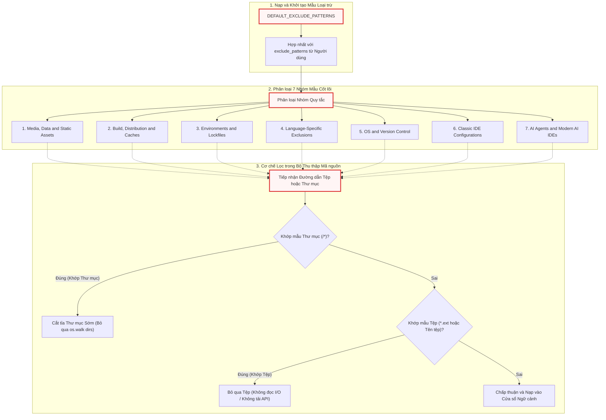

---

## Hằng số Cấp Module (Module-Level Constants)

### `DEFAULT_EXCLUDE_PATTERNS`

**Độ hiển thị**: Công khai (Public Constant)  
**Kiểu dữ liệu**: `set[str]`

**Mô tả Kỹ thuật**:  
`DEFAULT_EXCLUDE_PATTERNS` là một tập hợp kiểu `set` chứa toàn bộ các chuỗi mẫu loại trừ mặc định. Việc sử dụng cấu trúc dữ liệu `set` trong Python đảm bảo:
1. **Tính bất biến và duy nhất (Uniqueness)**: Không tồn tại các phần tử trùng lặp, tối ưu hóa kích thước bộ nhớ RAM khi module được nạp vào không gian tên của tiến trình.
2. **Hiệu năng hợp nhất tập hợp ($O(N)$)**: Cho phép các bộ thu thập thực hiện thao tác toán tử hợp nhất (`DEFAULT_EXCLUDE_PATTERNS | user_exclude_patterns`) với độ phức tạp tuyến tính cực kỳ nhanh chóng trước khi bước vào chu kỳ quét hệ thống tệp.

Dưới đây là chi tiết cài đặt của từng nhóm quy tắc cấu thành nên `DEFAULT_EXCLUDE_PATTERNS`:

---

### Nhóm 1: Tài nguyên Đa phương tiện, Dữ liệu & Tệp tĩnh (Media, Data, and Static Assets)

```python
    # 1. Media, Data, and Static Assets
    "assets/*",
    "data/*",
    "images/*",
    "public/*",
    "static/*",
    "temp/*",
    "tmp/*",
    "media/*",
    "*.jpg",
    "*.jpeg",
    "*.png",
    "*.gif",
    "*.ico",
    "*.svg",
    "*.webp",
    "*.mp4",
    "*.webm",
    "*.mov",
    "*.mp3",
    "*.wav",
    "*.pdf",
    "*.doc",
    "*.docx",
    "*.xls",
    "*.xlsx",
    "*.ppt",
    "*.pptx",
    "*.zip",
    "*.tar",
    "*.gz",
    "*.rar",
    "*.7z",
```

**Chi tiết Thực thi & Cơ chế Hoạt động**:
* **Thư mục tài nguyên (`assets/*`, `data/*`, `images/*`, `public/*`, `static/*`, `temp/*`, `tmp/*`, `media/*`)**: Chứa các tệp tĩnh phục vụ giao diện người dùng hoặc dữ liệu tạm thời. Các tệp này thường có dung lượng lớn nhưng không chứa logic điều hướng hoặc thuật toán lõi của phần mềm.
* **Phần mở rộng hình ảnh và đồ họa (`*.jpg`, `*.jpeg`, `*.png`, `*.gif`, `*.ico`, `*.svg`, `*.webp`)**: Các định dạng raster và vector. Mặc dù `.svg` là định dạng XML dạng văn bản, nó thường chứa dữ liệu tọa độ dựng hình rất dài, gây lãng phí nghiêm trọng token của LLM mà không đóng góp vào việc hiểu logic nghiệp vụ.
* **Tệp âm thanh, video (`*.mp4`, `*.webm`, `*.mov`, `*.mp3`, `*.wav`)**: Hoàn toàn là tệp nhị phân đa phương tiện.
* **Tài liệu văn phòng (`*.pdf`, `*.doc`, `*.docx`, `*.xls`, `*.xlsx`, `*.ppt`, `*.pptx`)**: Các định dạng tài liệu nhị phân hoặc nén XML (như Office Open XML), không thể đọc trực tiếp bằng cơ chế giải mã UTF-8 thông thường và sẽ gây lỗi `UnicodeDecodeError` nếu cố gắng đọc dưới dạng văn bản thuần.
* **Tệp lưu trữ và nén (`*.zip`, `*.tar`, `*.gz`, `*.rar`, `*.7z`)**: Dữ liệu lưu trữ nén nhị phân, phải được bỏ qua để tránh gây treo parser.

---

### Nhóm 2: Tệp dựng, Phân phối & Bộ nhớ đệm Framework (Build, Distribution, and Framework Caches)

```python
    # 2. Build, Distribution, and Framework Caches
    "dist/*",
    "build/*",
    "out/*",
    "output/*",
    "target/*",
    "bin/*",
    "obj/*",
    ".next/*",
    ".nuxt/*",
    ".svelte-kit/*",
    ".expo/*",
    "docs/*",
    "test/*",
    "tests/*",
    "examples/*",
    "v1/*",
    "experimental/*",
    "deprecated/*",
    "misc/*",
    "legacy/*",
    "*.log",
    "*.bak",
    "*.tmp",
    "*.swp",
```

**Chi tiết Thực thi & Cơ chế Hoạt động**:
* **Thư mục phân phối và đầu ra biên dịch (`dist/*`, `build/*`, `out/*`, `output/*`, `target/*`, `bin/*`, `obj/*`)**: Chứa mã nguồn đã qua đóng gói (bundle), thu gọn (minify) hoặc các tệp nhị phân đã biên dịch của các ngôn ngữ như Rust (`target/*`), C#/C++ (`bin/*`, `obj/*`), JavaScript/TypeScript (`dist/*`, `build/*`).
* **Bộ nhớ đệm framework hiện đại (`.next/*`, `.nuxt/*`, `.svelte-kit/*`, `.expo/*`)**: Thư mục sinh tự động của các framework Next.js, NuxtJS, SvelteKit, và Expo. Các thư mục này chứa mã nguồn máy chủ trung gian, tệp phân tích cú pháp tĩnh và siêu dữ liệu định tuyến được tạo động trong quá trình phát triển.
* **Mã nguồn thử nghiệm, tài liệu & ví dụ (`docs/*`, `test/*`, `tests/*`, `examples/*`, `v1/*`, `experimental/*`, `deprecated/*`, `misc/*`, `legacy/*`)**: Nhằm tối ưu hóa trọng tâm của LLM vào kiến trúc phần mềm cốt lõi (Core Production Architecture), các tệp tài liệu mở rộng, ca kiểm thử đơn vị, thư viện ví dụ hoặc các nhánh mã cũ/không còn duy trì được chủ động lược bỏ khỏi luồng phân tích ngữ cảnh.
* **Tệp phụ trợ và nhật ký (`*.log`, `*.bak`, `*.tmp`, `*.swp`)**: Tệp ghi nhận trạng thái runtime, tệp sao lưu tự động và tệp hoán đổi (swap file) của các trình soạn thảo như Vim/Nano.

---

### Nhóm 3: Môi trường ảo, Thư viện Phụ thuộc & Tệp Khóa (Environments, Dependencies & Lockfiles)

```python
    # 3. Environments, Dependencies & Lockfiles
    "venv/*",
    ".venv/*",
    "env/*",
    ".env",
    ".env.*",
    "node_modules/*",
    "bower_components/*",
    "jspm_packages/*",
    "vendor/*",
    "packages/*",
    "*.lock",
    "package-lock.json",
    "yarn.lock",
    "pnpm-lock.yaml",
    "Cargo.lock",
    "Gemfile.lock",
    "poetry.lock",
    "mix.lock",
    "Pipfile.lock",
```

**Chi tiết Thực thi & Cơ chế Hoạt động**:
* **Môi trường ảo Python (`venv/*`, `.venv/*`, `env/*`)**: Cách ly toàn bộ thư viện bên thứ ba của Python. Nếu không loại trừ, `os.walk()` sẽ quét qua hàng chục nghìn tệp của hệ sinh thái `site-packages`.
* **Bảo mật biến môi trường (`.env`, `.env.*`)**: Ngăn chặn rò rỉ các bí mật bảo mật (Secrets, API Keys, Tokens, Passwords) vào cửa sổ ngữ cảnh của LLM hoặc nhật ký xuất bản ra ngoài hệ thống.
* **Quản lý gói phụ thuộc đa ngôn ngữ (`node_modules/*`, `bower_components/*`, `jspm_packages/*`, `vendor/*`, `packages/*`)**: Thư mục chứa mã nguồn thư viện cài đặt từ npm, Bower, JSPM, Composer (PHP `vendor/`) hoặc Monorepo packages.
* **Tệp khóa phiên bản phụ thuộc (Lockfiles)**: Bao gồm `*.lock`, `package-lock.json` (NPM), `yarn.lock` (Yarn), `pnpm-lock.yaml` (PNPM), `Cargo.lock` (Rust), `Gemfile.lock` (Ruby), `poetry.lock` (Poetry), `mix.lock` (Elixir), và `Pipfile.lock` (Pipenv). Các tệp này chứa hàm băm toàn vẹn (integrity hash) và cây phụ thuộc chi tiết với kích thước rất lớn, không mang giá trị cho việc phân tích luồng logic ứng dụng.

---

### Nhóm 4: Quy tắc Loại trừ Đặc thù theo Ngôn ngữ Lập trình (Language-Specific Exclusions)

```python
    # 4. Language-Specific Exclusions
    "__pycache__/*",
    "*.pyc",
    "*.pyo",
    "*.pyd",
    ".pytest_cache/*",
    ".ruff_cache/*",
    ".tox/*",
    ".coverage",
    "htmlcov/*",  # Python
    ".gradle/*",
    "*.class",
    "*.jar",
    "*.war",
    "*.ear",
    "*.nar",  # Java / JVM
    "*.o",
    "*.obj",
    "*.dll",
    "*.exe",
    "*.so",
    "*.dylib",
    "*.lib",
    "*.a",  # C/C++/Native
    "ios/Pods/*",
    "android/.gradle/*",
    "android/app/build/*",  # Mobile
```

**Chi tiết Thực thi & Cơ chế Hoạt động**:
* **Hệ sinh thái Python**: Bỏ qua bytecode đã biên dịch (`__pycache__/*`, `*.pyc`, `*.pyo`), thư viện động mở rộng C-Python (`*.pyd`), bộ nhớ đệm công cụ kiểm thử/linter (`.pytest_cache/*`, `.ruff_cache/*`, `.tox/*`) và báo cáo độ phủ mã nguồn (`.coverage`, `htmlcov/*`).
* **Hệ sinh thái JVM / Java**: Loại bỏ thư mục cấu hình và bộ nhớ đệm Gradle (`.gradle/*`), tệp bytecode trung gian (`*.class`), cùng các gói đóng gói thực thi/phân phối (`*.jar`, `*.war`, `*.ear`, `*.nar`).
* **Mã nguồn Native C / C++ / HĐH**: Lọc bỏ các tệp đối tượng nhị phân (`*.o`, `*.obj`), thư viện liên kết động (`*.dll`, `*.so`, `*.dylib`), tệp thực thi độc lập (`*.exe`), và thư viện liên kết tĩnh (`*.lib`, `*.a`).
* **Môi trường ứng dụng di động (Mobile - iOS & Android)**: Bỏ qua thư viện quản lý phụ thuộc CocoaPods (`ios/Pods/*`), tệp dựng và bộ đệm build của hệ điều hành Android (`android/.gradle/*`, `android/app/build/*`).

---

### Nhóm 5: Hệ điều hành & Hệ thống Quản lý Phiên bản (OS & Version Control)

```python
    # 5. OS & Version Control
    ".git/*",
    ".github/*",
    ".svn/*",
    ".hg/*",
    ".DS_Store",
    "Thumbs.db",
    "desktop.ini",
```

**Chi tiết Thực thi & Cơ chế Hoạt động**:
* **Cơ sở dữ liệu quản lý phiên bản (VCS Metadata)**: Triệt tiêu các thư mục cơ sở dữ liệu nội bộ của Git (`.git/*`), cấu hình luồng làm việc CI/CD (`.github/*`), Apache Subversion (`.svn/*`), và Mercurial (`.hg/*`). Việc bỏ qua `.git/*` là tối quan trọng vì đây là nơi chứa toàn bộ đối tượng nén dạng blob, commit tree và chỉ mục delta.
* **Tệp rác hệ điều hành (OS Artifacts)**: Loại bỏ các tệp lưu trữ siêu dữ liệu thư mục của macOS (`.DS_Store`), tệp lưu trữ bộ đệm hình thu nhỏ của Windows (`Thumbs.db`), và tệp cấu hình hiển thị thư mục của Windows Shell (`desktop.ini`).

---

### Nhóm 6: Môi trường Phát triển Tích hợp Truyền thống (Classic IDEs)

```python
    # 6. Classic IDEs
    ".vscode/*",
    ".idea/*",
    "*.iml",
    ".eclipse/*",
    ".settings/*",
    ".classpath",
    ".project",
    ".vs/*",
```

**Chi tiết Thực thi & Cơ chế Hoạt động**:
* **Visual Studio Code & Visual Studio**: Loại bỏ cài đặt môi trường cục bộ, cấu hình trình gỡ lỗi và phần mở rộng (`.vscode/*`, `.vs/*`).
* **Hệ sinh thái JetBrains (IntelliJ IDEA, PyCharm, WebStorm)**: Bỏ qua thư mục cấu hình dự án (`.idea/*`) và tệp mô tả module của IntelliJ (`*.iml`).
* **Hệ sinh thái Eclipse**: Loại bỏ các thư mục và tệp cấu hình không gian làm việc (`.eclipse/*`, `.settings/*`, `.classpath`, `.project`).

---

### Nhóm 7: AI Agents & Môi trường AI IDE Hiện đại (AI Agents & Modern AI IDEs)

```python
    # 7. AI Agents & Modern AI IDEs
    ".cursor/*",
    ".cursorrules",
    ".windsurf/*",
    ".windsurfrules",
    ".cline/*",
    ".clinerules",
    ".roo/*",
    ".roorules",
    ".agent/*",
    ".agents/*",
    ".continue/*",
    ".aide/*",
    ".gemini/*",
    ".antigravity/*",
    ".claude/*",
    ".copilot/*",
```

**Chi tiết Thực thi & Cơ chế Hoạt động**:
* **Trình soạn thảo AI Cốt lõi (Cursor, Windsurf)**: Loại bỏ các thư mục cấu hình và tệp quy tắc chỉ thị prompt riêng (`.cursor/*`, `.cursorrules`, `.windsurf/*`, `.windsurfrules`).
* **Tiện ích mở rộng AI Coding Assistants (Cline, Roo Code, Continue, Copilot, Claude)**: Loại trừ siêu dữ liệu và cấu hình tương tác của Cline (`.cline/*`, `.clinerules`), Roo Code (`.roo/*`, `.roorules`), Continue (`.continue/*`), Aide (`.aide/*`), GitHub Copilot (`.copilot/*`), Claude Code (`.claude/*`), Google Gemini CLI (`.gemini/*`), và các tác tử độc lập (`.agent/*`, `.agents/*`, `.antigravity/*`).
* **Mục tiêu kỹ thuật**: Đảm bảo hệ thống không bị xung đột prompt (Prompt Confusion) hoặc bị tác động bởi các chỉ thị hệ thống (system prompts/rules) được nhúng bởi các công cụ AI khác trong cùng thư mục mã nguồn.

---

## Ví dụ Tích hợp trong Mã nguồn Thực tế

Module `exclude_patterns.py` không chứa các hàm thực thi riêng lẻ, mà được thiết kế thuần túy như một kho lưu trữ mẫu tĩnh. Dưới đây là cách hai module thu thập dữ liệu tiêu thụ trực tiếp `DEFAULT_EXCLUDE_PATTERNS`:

### 1. Tích hợp trong `crawl_local_files.py`

Trong [Chương 4 — crawl_local_files.py](04_crawl_local_files_py.md), tập hợp `DEFAULT_EXCLUDE_PATTERNS` được nạp để lọc thư mục và tệp trong quá trình duyệt đĩa cứng:

```python
# Trích xuất từ utils/crawl_local_files.py
from utils.exclude_patterns import DEFAULT_EXCLUDE_PATTERNS

def crawl_local_files(
    root_dir: str,
    include_patterns: set[str] | None = None,
    exclude_patterns: set[str] | None = None,
    max_file_size: int = 100 * 1024,
) -> dict[str, dict[str, str]]:
    # ...
    # Hợp nhất tập hợp loại trừ mặc định với cấu hình do người dùng cung cấp
    all_exclude_patterns = DEFAULT_EXCLUDE_PATTERNS | (exclude_patterns or set())
    # ...
    for root, dirs, files in os.walk(root_dir, topdown=True):
        # Cắt tỉa thư mục sớm bằng cách chỉnh sửa danh sách dirs tại chỗ (in-place)
        dirs[:] = [
            d for d in dirs
            if not any(fnmatch(f"{d}/*", pat) for pat in all_exclude_patterns)
        ]
        # ...
```

*Đoạn mã trên minh họa việc sử dụng toán tử hợp nhất `|` của Python `set` để kết hợp các mẫu loại trừ người dùng truyền vào với `DEFAULT_EXCLUDE_PATTERNS`. Nhờ cơ chế `dirs[:] = [...]`, các thư mục như `node_modules` hay `.git` sẽ bị `os.walk()` bỏ qua ngay lập tức mà không tiêu tốn I/O đĩa.*

### 2. Tích hợp trong `crawl_github_files.py`

Trong [Chương 3 — crawl_github_files.py](03_crawl_github_files_py.md), `DEFAULT_EXCLUDE_PATTERNS` được dùng để thẩm định từng nút trên cây thư mục GitHub từ xa:

```python
# Trích xuất logic kiểm tra tệp từ utils/crawl_github_files.py
from utils.exclude_patterns import DEFAULT_EXCLUDE_PATTERNS

def should_include_file(
    file_path: str,
    include_patterns: set[str] | None,
    exclude_patterns: set[str] | None,
) -> bool:
    all_exclude = DEFAULT_EXCLUDE_PATTERNS | (exclude_patterns or set())
    for pattern in all_exclude:
        if fnmatch(file_path, pattern):
            return False
    return True
```

*Đoạn mã thể hiện hàm helper kiểm tra tệp tin từ xa trước khi tiến hành gửi yêu cầu HTTP tải nội dung thô (Raw text) hoặc giải mã Base64, giúp tiết kiệm triệt để hạn ngạch (Rate Limit) của GitHub REST API.*

---

## Bảng Tra cứu Toàn diện Danh mục Mẫu Loại trừ

Bảng dưới đây tổng hợp đầy đủ các nhóm mẫu được định nghĩa trong `DEFAULT_EXCLUDE_PATTERNS`, cùng mục đích kỹ thuật và phạm vi ảnh hưởng của chúng:

| Phân nhóm Mẫu | Số lượng Mẫu | Ví dụ Tiêu biểu | Mục tiêu Kỹ thuật |
| :--- | :--- | :--- | :--- |
| **1. Media & Static Assets** | 32 | `assets/*`, `*.png`, `*.mp4`, `*.pdf`, `*.zip` | Chặn tệp nhị phân, dữ liệu đa phương tiện, tài liệu văn phòng và tệp nén không thể đọc dưới dạng mã nguồn thuần UTF-8. |
| **2. Build & Caches** | 24 | `dist/*`, `build/*`, `.next/*`, `docs/*`, `*.log` | Ngăn chặn nạp mã đã đóng gói/thu gọn, bộ nhớ đệm dựng của framework và tệp nhật ký runtime. |
| **3. Environments & Locks** | 19 | `node_modules/*`, `.venv/*`, `.env`, `package-lock.json` | Bảo vệ biến môi trường nhạy cảm, loại bỏ các thư viện phụ thuộc hàng triệu dòng và tệp khóa phiên bản cồng kềnh. |
| **4. Language-Specific** | 24 | `__pycache__/*`, `*.class`, `*.o`, `ios/Pods/*` | Loại trừ bytecode, tệp nhị phân đối tượng máy, thư viện liên kết động/tĩnh và bộ nhớ đệm công cụ kiểm thử. |
| **5. OS & VCS** | 7 | `.git/*`, `.github/*`, `.DS_Store`, `Thumbs.db` | Cắt tỉa cây dữ liệu nội bộ của hệ thống quản lý phiên bản và tệp rác hệ điều hành. |
| **6. Classic IDEs** | 8 | `.vscode/*`, `.idea/*`, `.eclipse/*`, `*.iml` | Loại bỏ cấu hình không gian làm việc cục bộ của các trình soạn thảo mã nguồn truyền thống. |
| **7. AI Agents & IDEs** | 16 | `.cursor/*`, `.cursorrules`, `.cline/*`, `.gemini/*` | Tránh xung đột chỉ thị hệ thống và ngăn rò rỉ ngữ cảnh của các công cụ AI coding assistant khác. |

---

## Xem Thêm (See Also)

* [Chương 1 — \_\_init\_\_.py](01___init___py.md): Khởi tạo gói hạ tầng `utils` và cấu trúc không gian tên.
* [Chương 3 — crawl_github_files.py](03_crawl_github_files_py.md): Module thu thập mã nguồn GitHub từ xa sử dụng `DEFAULT_EXCLUDE_PATTERNS` để lọc các nút trên Git tree.
* [Chương 4 — crawl_local_files.py](04_crawl_local_files_py.md): Module thu thập mã nguồn cục bộ áp dụng `DEFAULT_EXCLUDE_PATTERNS` trong kỹ thuật cắt tỉa `os.walk()` sớm.
* [Chương 8 — token_utils.py](08_token_utils_py.md): Tiện ích đếm token nhận dữ liệu đã qua tinh lọc để tối ưu hóa cửa sổ ngữ cảnh LLM.


---

<a id="chapter-6"></a>

# output.py

> **Source:** `utils/output.py`

Tiếp nối từ cấu trúc quy tắc lọc tệp tĩnh được thiết lập trong [Chương 5 — exclude_patterns.py](05_exclude_patterns_py.md), module `output.py` đảm nhận vai trò là hệ thống con trung tâm chịu trách nhiệm quản lý, định dạng và điều phối toàn bộ luồng thông tin giao tiếp ra giao diện dòng lệnh (CLI stdout) cũng như hệ thống ghi nhật ký tệp tin (File Logging) xuyên suốt vòng đời vận hành của ứng dụng.

---

## 1. Tổng Quan Kỹ Thuật (Technical Overview)

Module `utils/output.py` cung cấp giải pháp xuất dữ liệu tập trung (Centralized Output Utility), tích hợp cơ chế bản địa hóa đa ngôn ngữ động (Internationalization - i18n), định dạng màu sắc dòng lệnh (ANSI Color Formatting), và phân phối nhật ký đa kênh (Multi-target Dispatching). Thành phần này giải quyết triệt để vấn đề phân mảnh thông điệp người dùng và cô lập dữ liệu ghi vết bằng cách tập trung toàn bộ chuỗi văn bản giao diện vào một tệp dữ liệu duy nhất (`utils/strings.csv`).

Kiến trúc nội bộ của module vận hành dựa trên bốn trụ cột kỹ thuật cốt lõi:

1. **Bản địa hóa dữ liệu động (Dynamic Localization & i18n):** Toàn bộ chuỗi hiển thị được tách biệt khỏi mã logic và quản lý trong tệp `strings.csv`. Khi khởi tạo, hệ thống tự động tải và lập chỉ mục chuỗi theo ngôn ngữ mục tiêu (ví dụ: `Vietnamese`, `English`).
2. **Tự động dịch thuật qua mô hình ngôn ngữ (Autonomous LLM Translation Backfill):** Khi phát hiện thiếu chuỗi dịch hoặc khi người dùng yêu cầu một ngôn ngữ mới chưa từng có cột dữ liệu trong CSV, module sẽ kích hoạt quy trình thu thập các khóa còn thiếu, nạp mẫu prompt `prompts/common/translate_strings.md`, gọi hàm suy luận `call_llm()` từ module [Chương 2 — call_llm.py](02_call_llm_py.md) để dịch toàn bộ chuỗi theo lô (batch), và tự động cập nhật ghi đè dữ liệu mới vào `strings.csv` với bảng mã `utf-8-sig`.
3. **Định tuyến hiển thị & Kiểm soát kiểu dáng (Multi-target Routing & Styling):** Module định nghĩa bảng ánh xạ cấp độ thông báo (`PROGRESS`, `SUCCESS`, `WARNING`, `ERROR`, `INFO`, `DEBUG`, `FILE_WRITE`, `UI`) tương ứng với mã màu ANSI (qua bảng tra cứu `COLORS`) và các cấp độ ghi log chuẩn của Python (qua `LOG_LEVELS`). Mỗi thông điệp có thể được định tuyến độc lập tới màn hình console (`STDOUT`), tệp log (`LOG`), hoặc đồng thời cả hai (`BOTH`).
4. **Quản lý nhật ký phiên chạy có cấu trúc (Structured Invocation Logging):** Cung cấp hàm cấu hình `configure_logging()` nhằm khởi tạo tệp nhật ký riêng biệt cho từng phiên thực thi theo định dạng `logs/{project}_{mode}_{YYYYMMDD_HHmmss}.log`, tự động xóa các handler rác (như `NullHandler`) và ghi kèm siêu dữ liệu phiên chạy (metadata header) chuẩn hóa.

---

## 2. Sơ Đồ Kiến Trúc & Luồng Thực Thi (Architecture Flowchart)

Sơ đồ dưới đây minh họa toàn bộ vòng đời khởi tạo hệ thống xuất dữ liệu, quy trình tự động bù đắp bản dịch qua LLM, cùng cơ chế định tuyến và phát thông điệp tới console và tệp log.

```mermaid
flowchart TD
    subgraph Subgraph_Init["Quy Trình Khởi Tạo & Bản Địa Hóa"]
        initEntry["Bắt đầu: init()"]
        setGlobals["Thiết lập biến toàn cục: language, csv_path, use_cache"]
        loadStringsCall["Gọi _load_strings() nạp dữ liệu từ strings.csv"]
        checkEnglish{"Ngôn ngữ là English?"}
        checkMissing{"Tồn tại chuỗi thiếu bản dịch?"}
        loadPrompt["Đọc prompt mẫu: translate_strings.md"]
        callLLM["Gọi call_llm() dịch chuỗi theo lô"]
        parseJSON{"Bóc tách JSON từ phản hồi LLM?"}
        writeCSV["Gọi _write_translations_to_csv() lưu vào CSV"]
        reloadStrings["Tái nạp chuỗi: _load_strings()"]
        warnJSON["Cảnh báo: Phản hồi không phải JSON, dùng tiếng Anh"]
        warnLLM["Cảnh báo ngoại lệ: Dịch thất bại, dùng tiếng Anh"]
        initDone["Hoàn tất khởi tạo Output Engine"]
    end

    subgraph Subgraph_Emit["Quy Trình Phát Thông Điệp: emit() & emit_raw()"]
        emitEntry["Điểm nhập: emit() hoặc emit_raw()"]
        lookupKey{"Khóa chuỗi tồn tại trong _strings?"}
        fallbackUnknown["In cảnh báo [UNKNOWN STRING: key]"]
        safeFormat["Thực thi _format_safe() ghép biến và suffix"]
        resolveColor["Tra cứu mã màu ANSI từ bảng COLORS"]
        checkDest{"Kiểm tra cờ định tuyến dest"}
        printStdout["Xuất stdout với mã màu ANSI và RESET"]
        logFile["Ghi log qua _logger với cấp độ từ LOG_LEVELS"]
        emitDone["Kết thúc phát thông điệp"]
    end

    initEntry --> setGlobals
    setGlobals --> loadStringsCall
    loadStringsCall --> checkEnglish
    checkEnglish -- Đúng --> initDone
    checkEnglish -- Sai --> checkMissing
    checkMissing -- Không --> initDone
    checkMissing -- Có --> loadPrompt
    loadPrompt --> callLLM
    callLLM --> parseJSON
    parseJSON -- Thành công --> writeCSV
    writeCSV --> reloadStrings
    reloadStrings --> initDone
    parseJSON -- Thất bại --> warnJSON
    warnJSON --> initDone
    callLLM -- Lỗi ngoại lệ --> warnLLM
    warnLLM --> initDone

    emitEntry --> lookupKey
    lookupKey -- Không --> fallbackUnknown
    lookupKey -- Có --> safeFormat
    safeFormat --> resolveColor
    resolveColor --> checkDest
    checkDest -- BOTH hoặc STDOUT --> printStdout
    checkDest -- BOTH hoặc LOG --> logFile
    printStdout --> emitDone
    logFile --> emitDone

    classDef entryNode stroke:#d33,stroke-width:3px,fill:#fff5f5;
    class initEntry entryNode
    class emitEntry entryNode
```

---

## 3. Hằng Số & Biến Trạng Thái Module (Constants & Module State)

### 3.1. Hằng Số Màu Sắc & Cấp Độ Ghi Log

```python
# ---------------------------------------------------------------------------
# ANSI color map: LEVEL → color code
# ---------------------------------------------------------------------------
COLORS = {
    "PROGRESS": "\033[96m",  # Cyan — LLM calls, active steps
    "SUCCESS": "\033[92m",  # Green — completions, cache hits
    "WARNING": "\033[93m",  # Yellow — warnings, capacity alerts
    "ERROR": "\033[91m",  # Red — errors, failures
    "INFO": "",  # Plain — config, counts, labels
    "DEBUG": "\033[90m",  # Gray — skipped files, debug
    "FILE_WRITE": "",  # Plain — "  - Wrote {path}" messages
    "UI": "",  # N/A — used in generated docs, never printed
}
RESET = "\033[0m"

# Logging level map: output LEVEL → Python logging level
LOG_LEVELS = {
    "PROGRESS": logging.INFO,
    "SUCCESS": logging.INFO,
    "WARNING": logging.WARNING,
    "ERROR": logging.ERROR,
    "INFO": logging.INFO,
    "DEBUG": logging.DEBUG,
    "FILE_WRITE": logging.DEBUG,
}
```

* `COLORS` (`dict[str, str]`): Ánh xạ tên cấp độ thông điệp logic sang mã điều khiển thoát ANSI (ANSI escape sequences). Cung cấp khả năng hiển thị trực quan trên terminal:
  * `PROGRESS` (`\033[96m` - Cyan): Dùng cho các tiến trình đang thực thi, lời gọi LLM.
  * `SUCCESS` (`\033[92m` - Green): Dùng cho các tác vụ hoàn thành, trúng cache (`CACHE HIT`).
  * `WARNING` (`\033[93m` - Yellow): Cảnh báo suy giảm hiệu năng, vượt ngưỡng dung lượng.
  * `ERROR` (`\033[91m` - Red): Thông báo lỗi hệ thống, thất bại mạng hoặc dữ liệu không hợp lệ.
  * `DEBUG` (`\033[90m` - Gray): Hiển thị thông tin gỡ lỗi, tệp tin bị bỏ qua.
  * `INFO`, `FILE_WRITE`, `UI` (`""`): Văn bản thuần, không áp dụng màu sắc.
* `RESET` (`str`): Chuỗi thoát `\033[0m` có chức năng hoàn nguyên màu văn bản của terminal về trạng thái mặc định, ngăn chặn hiện tượng lem màu sang các dòng lệnh tiếp theo.
* `LOG_LEVELS` (`dict[str, int]`): Ánh xạ cấp độ thông điệp logic sang các hằng số cấp độ chuẩn của module `logging` của Python (`logging.INFO`, `logging.WARNING`, `logging.ERROR`, `logging.DEBUG`).

---

### 3.2. Biến Trạng Thái Cấp Module (Module-Level State)

```python
# ---------------------------------------------------------------------------
# Module state
# ---------------------------------------------------------------------------
_strings = {}  # {key: {"text": str, "level": str, "dest": str}}
_language = "English"  # Capitalized for display (e.g., "Vietnamese")
_lang_col = "english"  # Lowercase for CSV column lookup
_logger = logging.getLogger("llm_logger")
_csv_path = None
_use_cache = True
_thinking_level = None
```

* `_strings` (`dict[str, dict[str, str]]`): Bảng băm bộ nhớ đệm lưu trữ toàn bộ các chuỗi giao diện được nạp từ CSV. Mỗi phần tử có cấu trúc:
  ```python
  {"text": str, "level": str, "dest": str}
  ```
* `_language` (`str`): Tên ngôn ngữ đích được viết hoa chữ cái đầu (ví dụ: `"Vietnamese"`), dùng trong hiển thị nhật ký và tạo prompt dịch thuật.
* `_lang_col` (`str`): Tên cột ngôn ngữ dạng chữ thường (ví dụ: `"vietnamese"`), dùng để khớp khóa cột trong tệp `strings.csv`.
* `_logger` (`logging.Logger`): Thực thể logger toàn cục định danh `"llm_logger"`, tiếp nhận các bản ghi nhật ký của toàn bộ hệ thống.
* `_csv_path` (`str | None`): Đường dẫn tuyệt đối dẫn tới tệp cơ sở dữ liệu chuỗi `utils/strings.csv`.
* `_use_cache` (`bool`): Cờ kiểm soát việc sử dụng cache khi thực hiện các yêu cầu dịch thuật chuỗi qua LLM.
* `_thinking_level` (`str | int | None`): Cấu hình mức độ suy luận (thinking level) truyền cho LLM trong tiến trình dịch thuật.

---

## 4. Các Hàm Cấp Module (Module-Level Functions)

### `init()`
**Visibility**: Public
**Signature**: `def init(language: str = "english", use_cache: bool = True, thinking_level: int | str | None = None) -> None:`

**Description**: Khởi tạo toàn bộ hệ thống xuất dữ liệu và bản địa hóa của ứng dụng. Hàm này thiết lập đường dẫn tệp `strings.csv`, chuẩn hóa tên ngôn ngữ mục tiêu, nạp bảng chuỗi văn bản vào bộ nhớ thông qua `_load_strings()`, và tự động kích hoạt tiến trình bù đắp bản dịch `_auto_translate()` nếu phát hiện có chuỗi chưa được chuyển ngữ sang ngôn ngữ đích. Hàm bắt buộc phải được gọi từ điểm nhập `main()` ngay sau khi phân tích cú pháp tham số dòng lệnh và trước bất kỳ lệnh `emit()` nào.

**Parameters**:
* `language` (`str`, mặc định `"english"`): Tên ngôn ngữ đích cần áp dụng cho giao diện (ví dụ: `"Vietnamese"`, `"English"`).
* `use_cache` (`bool`, mặc định `True`): Xác định xem các lời gọi LLM phục vụ dịch chuỗi có sử dụng bộ nhớ đệm cục bộ hay không.
* `thinking_level` (`int | str | None`, mặc định `None`): Tham số điều khiển độ sâu suy luận khi gọi LLM cho tác vụ dịch thuật.

**Returns**:
* `None`: Hàm chỉ thay đổi trạng thái toàn cục của module.

**Raises**:
* Không trực tiếp phát sinh ngoại lệ; các ngoại lệ trong tiến trình con được xử lý phòng thủ nội bộ.

**Example**:
```python
# Trích xuất từ cách sử dụng chuẩn trong module:
from utils.output import init as init_output, emit

init_output(language="english")          # Load strings, set language
emit("LLM_CALL_WRITE_CHAPTER", chapter_num=1, name="flow")  # Print + log
```

```python
def init(language="english", use_cache=True, thinking_level=None):
    """Initialize the output system: load strings.csv, set language, auto-translate missing.

    Must be called from main() after parsing CLI arguments but before any emit() calls.

    Args:
        language: Target language name (e.g., "Vietnamese").
        use_cache: Whether LLM caching is enabled (passed to translation calls).
        thinking_level: LLM thinking level (passed to translation calls).
    """
    global _language, _lang_col, _csv_path, _use_cache, _thinking_level
    _language = language.capitalize()
    _lang_col = language.lower()
    _csv_path = os.path.join(os.path.dirname(os.path.abspath(__file__)), "strings.csv")
    _use_cache = use_cache
    _thinking_level = thinking_level
    _load_strings()
    _auto_translate()
```

Hàm thực thi việc gán các biến module toàn cục bao gồm chuyển đổi `_language` sang dạng viết hoa (`capitalize()`) phục vụ hiển thị và `_lang_col` sang dạng viết thường (`lower()`) để đối soát cột dữ liệu CSV. Đường dẫn `_csv_path` được xác định tuyệt đối dựa trên vị trí của tệp `output.py`. Sau khi thiết lập trạng thái, tiến trình đọc chuỗi tĩnh và tự động dịch chuỗi thiếu sẽ chạy tuần tự, đảm bảo khi kết thúc hàm `init()`, toàn bộ các chuỗi giao diện thuộc ngôn ngữ yêu cầu đã sẵn sàng trong bộ nhớ.

---

### `emit()`
**Visibility**: Public
**Signature**: `def emit(key: str, suffix: str = "", **kwargs: Any) -> None:`

**Description**: Phát một chuỗi văn bản đã được bản địa hóa ra màn hình console (stdout) và/hoặc ghi vào tệp log của hệ thống dựa trên khóa chuỗi (`key`) được định nghĩa trong `strings.csv`. Hàm thực hiện tra cứu cấu hình hiển thị của khóa (bao gồm mẫu văn bản, cấp độ nghiêm trọng `level`, và đích phát `dest`), sau đó áp dụng cơ chế thay thế biến an toàn thông qua `_format_safe()`. Nếu có tham số `suffix`, chuỗi hậu tố này sẽ được nối thêm vào cuối thông điệp trước khi áp dụng mã màu ANSI tương ứng.

**Parameters**:
* `key` (`str`): Định danh duy nhất của chuỗi trong tệp `strings.csv` (ví dụ: `"LLM_CALL_WRITE_CHAPTER"`).
* `suffix` (`str`, mặc định `""`): Chuỗi văn bản bổ sung được nối vào cuối thông điệp (thường dùng để hiển thị chi tiết số lượng token hoặc thời gian thực thi).
* `**kwargs` (`Any`): Danh sách các biến đặt chỗ (placeholders) cần thay thế vào mẫu chuỗi (ví dụ: `chapter_num=1`, `name="flow"`).

**Returns**:
* `None`: Thực hiện xuất dữ liệu ra console/log, không trả về giá trị.

**Raises**:
* Không phát sinh ngoại lệ. Nếu `key` không tồn tại trong từ điển chuỗi `_strings`, hàm in thông báo dự phòng `[UNKNOWN STRING: {key}]` ra stdout để tránh nuốt lỗi âm thầm.

**Example**:
```python
# Trích xuất từ tài liệu hướng dẫn và mã nguồn:
from utils.output import emit

emit("LLM_CALL_WRITE_CHAPTER", chapter_num=1, name="flow")
```

```python
def emit(key, suffix="", **kwargs):
    """Emit a translatable string to stdout and/or log file.

    Args:
        key: String key from strings.csv (e.g., "LLM_CALL_WRITE_CHAPTER").
        suffix: Optional extra text appended after the main message (e.g., token breakdown).
        **kwargs: Variables to substitute into the string template.
    """
    entry = _strings.get(key)
    if not entry:
        # Fallback for unknown keys — print raw so nothing is silently lost
        print(f"[UNKNOWN STRING: {key}]")
        return

    text = _format_safe(entry["text"], kwargs)
    if suffix:
        text = text + suffix

    level = entry["level"]
    dest = entry["dest"]
    color = COLORS.get(level, "")
    reset = RESET if color else ""

    if dest in ("BOTH", "STDOUT"):
        print(f"{color}{text}{reset}")
    if dest in ("BOTH", "LOG"):
        _logger.log(LOG_LEVELS.get(level, logging.INFO), text)
```

Khi được gọi, hàm kiểm tra sự tồn tại của `entry` trong bộ nhớ đệm `_strings`. Cơ chế định tuyến `dest` phân tách luồng xuất thành hai kênh độc lập: nếu `dest` là `"BOTH"` hoặc `"STDOUT"`, nội dung sẽ được bọc trong chuỗi thoát ANSI `color` và `reset` rồi in ra màn hình qua `print()`; nếu `dest` là `"BOTH"` hoặc `"LOG"`, nội dung (dưới dạng văn bản thuần không chứa mã ANSI) sẽ được gửi tới `_logger` với cấp độ tương ứng tra từ bảng `LOG_LEVELS`.

---

### `emit_raw()`
**Visibility**: Public
**Signature**: `def emit_raw(level: str, text: str, dest: str = "BOTH") -> None:`

**Description**: Phát trực tiếp một chuỗi văn bản tự do đã được định dạng trước với cấp độ hiển thị và kiểu dáng màu sắc tường minh mà không cần tra cứu từ tệp `strings.csv`. Hàm này chuyên dụng cho các cấu trúc đầu ra động, các khối dữ liệu cấu trúc phức tạp, danh sách tệp được đánh số, bảng tổng kết thu thập tệp (crawl summary table), hoặc thông báo trạng thái của tiến trình bản địa hóa i18n.

**Parameters**:
* `level` (`str`): Cấp độ nghiêm trọng logic (`"PROGRESS"`, `"SUCCESS"`, `"WARNING"`, `"ERROR"`, `"INFO"`, `"DEBUG"`, `"FILE_WRITE"`).
* `text` (`str`): Nội dung chuỗi văn bản cần hiển thị và/hoặc ghi log.
* `dest` (`str`, mặc định `"BOTH"`): Đích phát thông điệp (`"BOTH"`, `"STDOUT"`, hoặc `"LOG"`).

**Returns**:
* `None`: Không trả về dữ liệu.

**Raises**:
* Không phát sinh ngoại lệ.

**Example**:
```python
# Trích xuất từ mã nguồn utils/output.py:
from utils.output import emit_raw

emit_raw("WARNING", "Custom message")
emit_raw("PROGRESS", "[i18n] Calling LLM to translate missing strings...")
```

```python
def emit_raw(level, text, dest="BOTH"):
    """Emit a pre-formatted string with explicit level styling.

    Use for dynamic/structural output that doesn't come from strings.csv
    (e.g., numbered file lists, batch details, crawl summary tables).
    """
    color = COLORS.get(level, "")
    reset = RESET if color else ""

    if dest in ("BOTH", "STDOUT"):
        print(f"{color}{text}{reset}")
    if dest in ("BOTH", "LOG"):
        _logger.log(LOG_LEVELS.get(level, logging.INFO), text)
```

`emit_raw()` cung cấp một giao diện gọn nhẹ cho các module khác khi cần in ấn dữ liệu động được tạo ra trong thời gian chạy (runtime). Hàm tra cứu trực tiếp mã màu từ `COLORS` và cấp độ từ `LOG_LEVELS`, bỏ qua các bước tìm kiếm bảng băm `_strings` và thay thế biến mẫu, giúp tối ưu hóa hiệu năng cho các vòng lặp in ấn danh sách tệp tin lớn.

---

### `get()`
**Visibility**: Public
**Signature**: `def get(key: str, **kwargs: Any) -> str:`

**Description**: Truy xuất nội dung chuỗi văn bản đã được bản địa hóa và áp dụng phép nội suy biến mà không in ra console cũng như không ghi vào tệp nhật ký. Hàm này được thiết kế chuyên biệt để lấy các chuỗi nhãn giao diện (UI labels), tiêu đề chương mục, hoặc các chuỗi cấu trúc cần nhúng trực tiếp vào các tệp tài liệu Markdown được sinh tự động (như `index.md`).

**Parameters**:
* `key` (`str`): Định danh chuỗi trong `strings.csv` (ví dụ: `"UI_TUTORIAL"`).
* `**kwargs` (`Any`): Các cặp khóa-giá trị dùng để điền vào các biến đặt chỗ `{placeholder}` trong chuỗi.

**Returns**:
* `str`: Chuỗi văn bản đã dịch và điền tham số hoàn chỉnh. Nếu không tìm thấy khóa, hàm trả về chính giá trị của `key` như một cơ chế dự phòng an toàn.

**Raises**:
* Không phát sinh ngoại lệ.

**Example**:
```python
# Trích xuất từ mã nguồn utils/output.py:
from utils.output import get

label = get("UI_TUTORIAL")
```

```python
def get(key, **kwargs):
    """Get a translated string without printing or logging.

    Use for UI strings embedded in generated markdown (index.md headings, etc.).
    Returns the raw translated text with variable substitution applied.
    """
    entry = _strings.get(key)
    if not entry:
        return key  # Fallback: return the key itself
    return _format_safe(entry["text"], kwargs)
```

Hàm thực hiện truy xuất khóa trong từ điển `_strings`. Nếu khóa không tồn tại, hàm trả về chính chuỗi `key` nhằm ngăn ngừa ứng dụng bị gián đoạn do lỗi `KeyError`. Khi tìm thấy dữ liệu, chuỗi mẫu được chuyển tiếp qua hàm trợ giúp `_format_safe(entry["text"], kwargs)` để thực hiện phép thế chuỗi an toàn.

---

### `configure_logging()`
**Visibility**: Public
**Signature**: `def configure_logging(project_name: str = "project", mode: str = "tutorial") -> str:`

**Description**: Cấu hình hệ thống ghi nhật ký dựa trên tệp (file-based logging) cho phiên thực thi hiện tại. Hàm tạo thư mục nhật ký (mặc định lấy từ biến môi trường `LOG_DIR` hoặc thư mục `"logs"`), chuẩn hóa tên dự án và chế độ chạy thành chuỗi an toàn cho hệ thống tệp, sau đó tạo một tệp log có gắn nhãn thời gian theo định dạng `logs/{safe_project}_{safe_mode}_{YYYYMMDD_HHmmss}.log`. Tất cả các handler hiện có trên `_logger` (như `NullHandler`) sẽ bị xóa bỏ và thay thế bằng một `FileHandler` mới với định dạng thời gian chuẩn hóa.

**Parameters**:
* `project_name` (`str`, mặc định `"project"`): Tên của dự án đang được xử lý.
* `mode` (`str`, mặc định `"tutorial"`): Chế độ vận hành của hệ thống (ví dụ: `"tutorial"`, `"api-reference"`).

**Returns**:
* `str`: Đường dẫn tuyệt đối hoặc tương đối dẫn tới tệp log vừa được khởi tạo thành công.

**Raises**:
* `OSError`: Có thể phát sinh nếu hệ thống tệp không cho phép tạo thư mục hoặc ghi tệp (không được bắt nội bộ để báo hiệu lỗi quyền truy cập).

**Example**:
```python
# Khởi tạo ghi nhật ký cho một phiên làm việc:
from utils.output import configure_logging

log_path = configure_logging(project_name="my_repo", mode="tutorial")
```

```python
def configure_logging(project_name="project", mode="tutorial"):
    """Configure file-based logging for this run.

    Creates a new log file per invocation:
        logs/{project_name}_{mode}_{YYYYMMDD_HHmmss}.log

    Must be called from main() after parsing CLI arguments.
    """
    from datetime import datetime

    log_directory = os.getenv("LOG_DIR", "logs")
    os.makedirs(log_directory, exist_ok=True)

    safe_project = "".join(c if c.isalnum() or c in "-_." else "_" for c in project_name)
    safe_mode = mode.replace("-", "_")
    timestamp = datetime.now().strftime("%Y%m%d_%H%M%S")
    log_file = os.path.join(log_directory, f"{safe_project}_{safe_mode}_{timestamp}.log")

    # Remove any existing handlers (e.g., NullHandler) and add the file handler
    _logger.handlers.clear()
    file_handler = logging.FileHandler(log_file, encoding="utf-8")
    file_handler.setFormatter(logging.Formatter("%(asctime)s - %(levelname)s - %(message)s"))
    _logger.addHandler(file_handler)

    # Log run metadata at the start of every log file
    _logger.info(f"{'=' * 80}")
    _logger.info(f"RUN STARTED | project={project_name} | mode={mode} | timestamp={timestamp}")
    _logger.info(f"Log file: {log_file}")
    _logger.info(f"{'=' * 80}")

    return log_file
```

Hàm sử dụng biểu thức lọc ký tự `"".join(c if c.isalnum() or c in "-_." else "_" for c in project_name)` nhằm đảm bảo tên tệp không chứa các ký tự đặc biệt gây lỗi trên hệ điều hành Windows hoặc POSIX. Sau khi gắn `FileHandler` với bộ định dạng `"%(asctime)s - %(levelname)s - %(message)s"`, hàm chủ động ghi một khối siêu dữ liệu khởi động dài 80 ký tự (`RUN STARTED`) để phân tách rõ ràng giữa các lần chạy trong kho lưu trữ nhật ký.

---

### `_format_safe()`
**Visibility**: Private
**Signature**: `def _format_safe(template: str, kwargs: dict[str, Any]) -> str:`

**Description**: Thực hiện nội suy và thế biến an toàn vào chuỗi định dạng `template.format(**kwargs)`. Hàm này bọc lệnh `format()` trong khối xử lý ngoại lệ phòng thủ để bắt các lỗi cú pháp định dạng phổ biến như thiếu khóa (`KeyError`), tràn chỉ số (`IndexError`), hoặc sai định dạng (`ValueError`). Khi phát sinh lỗi, hàm trả về nguyên bản chuỗi mẫu `template` mà không làm sập luồng thực thi của ứng dụng.

**Parameters**:
* `template` (`str`): Chuỗi văn bản mẫu chứa các thẻ vị trí dạng `{placeholder}`.
* `kwargs` (`dict[str, Any]`): Từ điển các biến cần điền vào mẫu.

**Returns**:
* `str`: Chuỗi văn bản sau khi đã điền đầy đủ các giá trị biến, hoặc trả về nguyên trạng `template` nếu quá trình thế biến gặp lỗi.

**Raises**:
* Không phát sinh ngoại lệ (đã bắt toàn bộ `KeyError`, `IndexError`, `ValueError`).

**Example**:
```python
# Trích xuất nội bộ trong _format_safe:
template = "Wrote {path}"
result = _format_safe(template, {"path": "docs/01.md"})
```

```python
def _format_safe(template, kwargs):
    """Apply .format(**kwargs) with graceful fallback on missing keys."""
    try:
        return template.format(**kwargs)
    except (KeyError, IndexError, ValueError):
        return template
```

Hàm đóng vai trò là cơ chế phòng vệ thiết yếu cho hệ thống đa ngôn ngữ: khi một chuỗi dịch máy hoặc dịch thủ công bị lỗi thiếu placeholder (ví dụ LLM dịch làm mất `{count}` hoặc viết sai tên biến), hàm ngăn chặn sự cố sập ứng dụng và duy trì sự ổn định cho toàn bộ pipeline sinh tài liệu.

---

### `_load_strings()`
**Visibility**: Private
**Signature**: `def _load_strings() -> None:`

**Description**: Đọc và nạp toàn bộ định nghĩa chuỗi từ tệp `utils/strings.csv` vào biến bộ nhớ đệm `_strings`. Hàm sử dụng bộ đọc `csv.DictReader` với bảng mã `utf-8-sig` để tự động loại bỏ ký tự Byte Order Mark nếu có. Đối với mỗi dòng dữ liệu, hàm đọc khóa `STRING_KEY`, cấp độ `LEVEL`, đích phát `DEST`, và ưu tiên lấy bản dịch tương ứng với cột ngôn ngữ hiện tại `_lang_col`. Nếu cột ngôn ngữ hiện tại bị bỏ trống, hàm tự động dùng giá trị từ cột `english` làm dự phòng (fallback).

**Parameters**:
* Không nhận tham số trực tiếp (sử dụng biến trạng thái module `_csv_path`, `_lang_col`, `_language`).

**Returns**:
* `None`: Cập nhật trực tiếp vào từ điển toàn cục `_strings`.

**Raises**:
* Không phát sinh ngoại lệ; nếu `_csv_path` không tồn tại, hàm lặng lẽ thoát sớm mà không thao tác.

**Example**:
```python
# Trích xuất từ cách triệu gọi nội bộ trong init():
_csv_path = os.path.join(os.path.dirname(os.path.abspath(__file__)), "strings.csv")
_load_strings()
```

```python
def _load_strings():
    """Load all strings from strings.csv."""
    global _strings
    _strings = {}

    if not _csv_path or not os.path.exists(_csv_path):
        return

    translated_count = 0
    total_count = 0

    with open(_csv_path, encoding="utf-8-sig") as f:
        reader = csv.DictReader(f)
        for row in reader:
            key = row.get("STRING_KEY", "").strip()
            if not key or key.startswith("#"):
                continue

            level = row.get("LEVEL", "INFO").strip()
            dest = row.get("DEST", "BOTH").strip()

            # Priority: language column → English fallback
            text = row.get(_lang_col, "").strip()
            if text:
                translated_count += 1
            else:
                text = row.get("english", "").strip()

            total_count += 1
            _strings[key] = {"text": text, "level": level, "dest": dest}

    if _lang_col != "english" and translated_count == total_count:
        emit_raw("SUCCESS", f"[i18n] {_language} — loaded {translated_count} strings from CSV")
```

Hàm tự động bỏ qua các dòng rỗng hoặc các dòng ghi chú bắt đầu bằng ký tự `#`. Nếu tất cả các chuỗi trong tệp đều đã có bản dịch cho ngôn ngữ mục tiêu (`translated_count == total_count`), hàm phát một thông điệp trạng thái `SUCCESS` thông báo số lượng chuỗi đã sẵn sàng mà không cần gọi LLM để dịch thêm.

---

### `_auto_translate()`
**Visibility**: Private
**Signature**: `def _auto_translate() -> None:`

**Description**: Tự động phát hiện các chuỗi chưa có bản dịch cho ngôn ngữ đích trong `strings.csv`, sau đó gọi LLM để thực hiện chuyển ngữ hàng loạt và lưu kết quả trở lại tệp CSV. Quy trình thực hiện gồm: kiểm tra sự tồn tại của cột ngôn ngữ, tập hợp toàn bộ chuỗi tiếng Anh bị thiếu bản dịch vào một từ điển JSON, đọc mẫu prompt `prompts/common/translate_strings.md`, gửi yêu cầu tới mô hình qua `call_llm()`, bóc tách cấu trúc JSON phản hồi bằng biểu thức chính quy (Regex), gọi `_write_translations_to_csv()` để lưu trữ vĩnh viễn, và cuối cùng gọi `_load_strings()` để kích hoạt các bản dịch mới vào bộ nhớ.

**Parameters**:
* Không có tham số trực tiếp (truy xuất qua trạng thái module `_lang_col`, `_language`, `_csv_path`, `_use_cache`, `_thinking_level`).

**Returns**:
* `None`: Ghi dữ liệu vào CSV và cập nhật bộ nhớ đệm chuỗi.

**Raises**:
* Không phát sinh ngoại lệ ra bên ngoài. Toàn bộ quá trình gọi LLM và xử lý JSON được bọc trong khối `try...except Exception` an toàn; nếu gặp lỗi, hàm sẽ phát cảnh báo `WARNING` và cho phép hệ thống tiếp tục chạy với bản dịch tiếng Anh dự phòng.

**Example**:
```python
# Trích xuất cách _auto_translate điều phối việc dịch:
if _lang_col != "english":
    _auto_translate()
```

```python
def _auto_translate():
    """Auto-translate missing strings via LLM and write back into strings.csv."""
    if _lang_col == "english":
        return

    if not _csv_path or not os.path.exists(_csv_path):
        return

    # Collect strings that have no translation in the target language column
    missing = {}
    is_new_column = False
    with open(_csv_path, encoding="utf-8-sig") as f:
        reader = csv.DictReader(f)
        fieldnames = list(reader.fieldnames)
        is_new_column = _lang_col not in fieldnames
        for row in reader:
            key = row.get("STRING_KEY", "").strip()
            if not key or key.startswith("#"):
                continue
            # Check if the language column exists and has a value
            lang_text = row.get(_lang_col, "").strip() if _lang_col in fieldnames else ""
            if lang_text:
                continue  # Already translated

            english_text = row.get("english", "").strip()
            if english_text:
                missing[key] = english_text

    if not missing:
        return

    # Report what we found
    if is_new_column:
        emit_raw("PROGRESS", f"[i18n] New language '{_language}' — adding column to strings.csv")
    emit_raw("PROGRESS", f"[i18n] {len(missing)} strings need translation to {_language}")

    # Batch translate via LLM
    try:
        from utils.call_llm import call_llm

        entries_json = json.dumps(missing, ensure_ascii=False, indent=2)

        # Load prompt template from prompts/common/translate_strings.md
        prompt_path = os.path.join(
            os.path.dirname(os.path.dirname(os.path.abspath(__file__))),
            "prompts",
            "common",
            "translate_strings.md",
        )
        with open(prompt_path, encoding="utf-8") as pf:
            prompt_template = pf.read()
        prompt = prompt_template.format(language=_language, entries=entries_json)

        emit_raw("PROGRESS", f"[i18n] Calling LLM to translate {len(missing)} strings...")
        response = call_llm(prompt, use_cache=_use_cache, thinking_level=_thinking_level)

        # Extract JSON from response
        json_match = re.search(r"\{[^{}]*(?:\{[^{}]*\}[^{}]*)*\}", response, re.DOTALL)
        if json_match:
            translations = json.loads(json_match.group())
            translated_count = len(translations)

            # Write translations back into strings.csv
            _write_translations_to_csv(translations)
            emit_raw("SUCCESS", f"[i18n] Translated {translated_count}/{len(missing)} strings — saved to strings.csv")

            # Reload strings from the updated CSV so all translations are active
            _load_strings()
        else:
            emit_raw("WARNING", "[i18n] LLM response did not contain valid JSON — falling back to English")

    except Exception as e:
        emit_raw("WARNING", f"[i18n] Translation failed: {e} — falling back to English")
```

Hàm sử dụng biểu thức chính quy `re.search(r"\{[^{}]*(?:\{[^{}]*\}[^{}]*)*\}", response, re.DOTALL)` để bóc tách khối JSON hợp lệ ngay cả khi LLM phản hồi kèm theo văn bản giải thích hoặc định dạng Markdown code fence. Sau khi phân tích cú pháp thành công qua `json.loads()`, dữ liệu được truyền tới `_write_translations_to_csv()`, rồi gọi lại `_load_strings()` để làm mới trạng thái trong bộ nhớ.

---

### `_write_translations_to_csv()`
**Visibility**: Private
**Signature**: `def _write_translations_to_csv(translations: dict[str, str]) -> None:`

**Description**: Ghi các bản dịch mới nhận được từ LLM trở lại tệp `strings.csv`, đảm bảo dữ liệu được lưu trữ vĩnh viễn trên đĩa cứng cho các lần chạy tiếp theo. Nếu cột ngôn ngữ đích chưa tồn tại trong danh sách tiêu đề (`fieldnames`), hàm sẽ tự động mở rộng danh sách trường để thêm cột mới. Quá trình ghi tệp bắt buộc sử dụng bảng mã `utf-8-sig` (kèm theo Byte Order Mark) để Microsoft Excel và các phần mềm bảng tính khác có thể mở trực tiếp tệp CSV chứa ký tự Unicode đa ngôn ngữ mà không bị lỗi hiển thị font.

**Parameters**:
* `translations` (`dict[str, str]`): Từ điển chứa các cặp ánh xạ giữa `STRING_KEY` và nội dung chuỗi đã được dịch sang ngôn ngữ đích.

**Returns**:
* `None`: Ghi đè tệp tin trên đĩa.

**Raises**:
* `OSError` / `IOError`: Có thể phát sinh nếu tệp bị khóa ghi hoặc không đủ quyền truy cập hệ thống tệp.

**Example**:
```python
# Trích xuất cách _write_translations_to_csv được gọi:
translations = {"LLM_CALL_WRITE_CHAPTER": "Đang gọi LLM để viết chương {chapter_num}: {name}..."}
_write_translations_to_csv(translations)
```

```python
def _write_translations_to_csv(translations):
    """Write LLM translations back into strings.csv, persisting them for future runs.

    If the target language column doesn't exist, it is added to the CSV.
    """
    rows = []
    fieldnames = None

    with open(_csv_path, encoding="utf-8-sig") as f:
        reader = csv.DictReader(f)
        fieldnames = list(reader.fieldnames)
        # Add language column if it doesn't exist
        if _lang_col not in fieldnames:
            fieldnames.append(_lang_col)
        for row in reader:
            key = row.get("STRING_KEY", "").strip()
            if key in translations:
                row[_lang_col] = translations[key]
            rows.append(row)

    # Write with BOM so Excel opens as UTF-8 without extra import steps
    with open(_csv_path, "w", encoding="utf-8-sig", newline="") as f:
        writer = csv.DictWriter(f, fieldnames=fieldnames)
        writer.writeheader()
        writer.writerows(rows)
```

Thuật toán thực hiện đọc toàn bộ cấu trúc CSV hiện có vào bộ nhớ đệm danh sách `rows`, đồng thời kiểm tra nếu `_lang_col` chưa nằm trong `fieldnames` thì sẽ nối thêm tên cột vào cuối danh sách. Sau đó, với mỗi dòng có `key` trùng khớp với khóa trong từ điển `translations`, giá trị của cột `_lang_col` sẽ được cập nhật. Quá trình ghi tệp sử dụng `csv.DictWriter` với `newline=""` để đảm bảo tương thích chuẩn ký tự ngắt dòng trên đa nền tảng (Windows CRLF và Unix LF).

---

## 5. Bảng Tổng Hợp API (API Reference Summary)

| Tên Hàm / Thuộc Tính | Phạm Vi Truy Cập | Mục Đích & Trách Nhiệm Kỹ Thuật | Đầu Vào / Đầu Ra Chính |
| :--- | :--- | :--- | :--- |
| `COLORS` | Public | Bảng tra cứu chuỗi thoát màu ANSI theo cấp độ thông báo | `dict[str, str]` |
| `LOG_LEVELS` | Public | Bảng ánh xạ cấp độ thông báo logic sang `logging.LEVEL` của Python | `dict[str, int]` |
| `init()` | Public | Khởi tạo hệ thống xuất dữ liệu, nạp CSV và tự động dịch chuỗi thiếu | `language: str, use_cache: bool, thinking_level: Any` $\rightarrow$ `None` |
| `emit()` | Public | Phát chuỗi bản địa hóa theo mẫu từ CSV ra stdout và/hoặc tệp log | `key: str, suffix: str, **kwargs` $\rightarrow$ `None` |
| `emit_raw()` | Public | Xuất chuỗi định dạng tự do với cấp độ và màu sắc tùy chỉnh | `level: str, text: str, dest: str` $\rightarrow$ `None` |
| `get()` | Public | Lấy chuỗi bản địa hóa (đã điền biến) phục vụ nhúng vào Markdown | `key: str, **kwargs` $\rightarrow$ `str` |
| `configure_logging()` | Public | Khởi tạo `FileHandler` và tệp log định dạng theo phiên chạy | `project_name: str, mode: str` $\rightarrow$ `str` (đường dẫn tệp) |
| `_format_safe()` | Private | Điền biến `{placeholder}` an toàn với cơ chế bắt lỗi phòng thủ | `template: str, kwargs: dict` $\rightarrow$ `str` |
| `_load_strings()` | Private | Đọc tệp `strings.csv` và lập chỉ mục chuỗi vào bộ nhớ | Không tham số $\rightarrow$ `None` |
| `_auto_translate()` | Private | Điều phối tiến trình gọi LLM để dịch các chuỗi còn thiếu | Không tham số $\rightarrow$ `None` |
| `_write_translations_to_csv()` | Private | Ghi đè các bản dịch mới vào `strings.csv` bằng chuẩn UTF-8-SIG | `translations: dict[str, str]` $\rightarrow$ `None` |

---

## 6. Xem Thêm (See Also)

* [Chương 1 — \_\_init\_\_.py](01___init___py.md): Cấu trúc nạp gói hạ tầng tiện ích.
* [Chương 2 — call_llm.py](02_call_llm_py.md): Cổng giao tiếp LLM được `_auto_translate()` sử dụng để thực hiện dịch thuật chuỗi tự động.
* [Chương 3 — crawl_github_files.py](03_crawl_github_files_py.md): Module thu thập mã nguồn từ xa, sử dụng `emit()` và `emit_raw()` để hiển thị tiến trình.
* [Chương 4 — crawl_local_files.py](04_crawl_local_files_py.md): Module quét tệp cục bộ, sử dụng `get()` và `emit()` để thông báo trạng thái.
* [Chương 5 — exclude_patterns.py](05_exclude_patterns_py.md): Định nghĩa danh mục mẫu tệp loại trừ dùng trong quá trình nạp dữ liệu.
* [Chương 7 — prompts.py](07_prompts_py.md): Quản lý các mẫu prompt hệ thống của toàn bộ ứng dụng.
* [Chương 10 — main.py](10_main_py.md): Điểm nhập chương trình, nơi trực tiếp gọi `init()` và `configure_logging()`.


---

<a id="chapter-7"></a>

# prompts.py

> **Source:** `utils/prompts.py`

Trong chương trước ([Chương 6 — output.py](06_output_py.md)), chúng ta đã nghiên cứu hệ thống con chịu trách nhiệm xuất dữ liệu đầu ra, ghi nhật ký và cơ chế bản địa hóa đa ngôn ngữ thông qua việc dịch chuỗi giao diện người dùng. Tiếp nối luồng xử lý của hệ thống, module `utils/prompts.py` đóng vai trò là kho lưu trữ và bộ sinh tập trung cho các cấu trúc prompt nội bộ (inline prompts) cùng các hàm tiện ích tạo cấu hình triển khai tài liệu tĩnh (MkDocs & Mermaid).

Khác với các tệp mẫu prompt theo ngữ cảnh người dùng được nạp động từ thư mục `prompts/{mode}/`, các prompt và trình cấu hình trong `prompts.py` được lập trình cứng (hardcoded programmatic builders) nhằm phục vụ các tác vụ hạ tầng tất định: phân loại và lọc tệp mã nguồn kỹ thuật, trích xuất tóm tắt kiến trúc 4 chiều giữa các chương, tạo tệp cấu hình `mkdocs.yml`, thiết lập mã script khởi tạo Mermaid JS, và giải quyết đệ quy cây điều hướng tài liệu phân cấp.

---

## Tổng quan Kỹ thuật (Technical Overview)

Module `utils/prompts.py` cung cấp các hàm độc lập không trạng thái (stateless helper functions) chịu trách nhiệm giải quyết hai nhóm bài toán kỹ thuật cốt lõi trong quy trình phân tích và đóng gói tài liệu:

1. **Xây dựng Prompt Nội bộ cho LLM (Internal LLM Prompt Construction):**
   * **Lọc tệp mã nguồn kỹ thuật:** Hàm `build_code_file_filter_prompt()` tạo ra chỉ thị tối ưu cho thành phần `DeterministicFileMapper` để nhận diện chính xác các tệp mã nguồn chứa logic nghiệp vụ, đồng thời loại bỏ các tệp giao diện (UI layout), cấu hình (JSON, XML), tệp tĩnh và kịch bản bản dựng (build scripts). Kết quả trả về từ LLM bị ràng buộc nghiêm ngặt dưới định dạng danh sách YAML thuần túy.
   * **Tóm tắt ngữ cảnh liên chương (Cross-Chapter Summary):** Hàm `build_chapter_summary_prompt()` thiết lập cấu trúc tóm tắt kỹ thuật gồm đúng 4 khía cạnh: Phạm vi & Trách nhiệm, Các phần tử kỹ thuật cốt lõi, Mẫu triển khai & Kiến trúc, Tích hợp hệ thống & Phụ thuộc. Bản tóm tắt này đóng vai trò là bộ nhớ ngữ cảnh ngắn hạn được truyền liên tiếp vào các prompt sinh chương tiếp theo nhằm bảo toàn tính nhất quán trong toàn bộ tài liệu.

2. **Sinh Cấu hình và Cây Điều hướng Tài liệu Tĩnh (Documentation Site Generation):**
   * **Đóng gói cấu hình MkDocs:** Hàm `build_mkdocs_config()` tự động sinh tệp `mkdocs.yml` hoàn chỉnh tích hợp Material Theme, hỗ trợ chế độ màu Sáng/Tối, sao chép khối mã nguồn, tiện ích mở rộng đánh dấu cú pháp `pymdownx`, cùng plugin tương tác thu phóng/kéo sơ đồ Panzoom.
   * **Cô lập và khởi tạo Mermaid:** Hàm `build_mermaid_init_js()` sinh mã JavaScript khởi tạo thư viện Mermaid với lớp tùy chỉnh `.mermaid-raw`, ngăn chặn việc giao diện Material ghi đè bảng màu mặc định và bảo toàn phong cách hiển thị sơ đồ chuẩn kỹ thuật.
   * **Xây dựng cấu trúc điều hướng phân cấp:** Hàm `build_grouped_nav()` và `collect_all_modules()` phân tích đệ quy cấu trúc nhóm module do LLM phân loại, tự động phân nhóm phụ theo đường dẫn thư mục vật lý nếu các module trong cùng nhóm chức năng nằm rải rác trên nhiều thư mục, tạo nên cây điều hướng MkDocs trực quan.

---

## Kiến trúc Luồng Dữ liệu và Tương tác Hệ thống

Sơ đồ dưới đây mô tả cách `utils/prompts.py` tương tác với các nút điều phối trong [Chương 11 — nodes.py](11_nodes_py.md), tầng gọi mô hình [Chương 2 — call_llm.py](02_call_llm_py.md), và quy trình đóng gói xuất bản tài liệu tĩnh tại [Chương 10 — main.py](10_main_py.md):

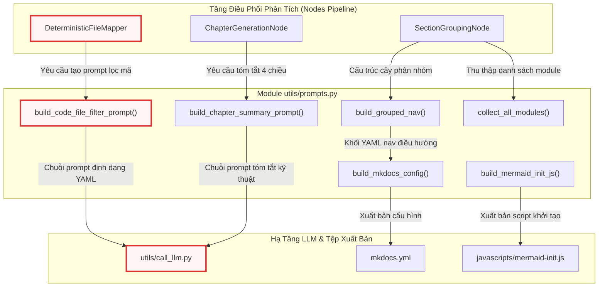

---

## Module-Level Functions

Tất cả các phần tử trong `utils/prompts.py` đều được thiết kế dưới dạng các hàm độc lập cấp module (Module-Level Functions), không duy trì trạng thái nội bộ và có tính tất định cao.

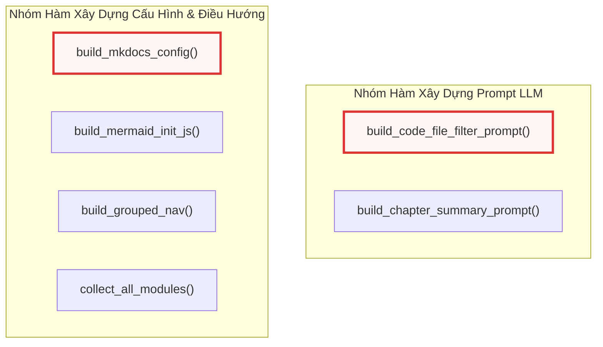

---

### `build_code_file_filter_prompt()`
**Visibility**: Public  
**Signature**: `def build_code_file_filter_prompt(project_name: str, file_listing: str) -> str:`

**Description**:  
Hàm tạo chuỗi prompt có cấu trúc gửi tới mô hình ngôn ngữ lớn nhằm lọc danh sách tệp của dự án trong chế độ tham chiếu API (`api-reference`). Nhiệm vụ của prompt là yêu cầu LLM phân biệt và chỉ giữ lại các tệp mã nguồn thực thụ (chứa API, hàm, lớp, logic nghiệp vụ), đồng thời loại trừ toàn bộ các tệp giao diện người dùng, tệp cấu hình, tài nguyên tĩnh, kịch bản biên dịch và tài liệu hướng dẫn. Để phục vụ việc bóc tách tự động bằng máy, prompt ép buộc mô hình chỉ phản hồi duy nhất một khối mã YAML chứa danh sách chỉ số (indices) của các tệp được chọn.

**Parameters**:
* `project_name` (`str`): Tên định danh của dự án hoặc kho mã nguồn đang được phân tích.
* `file_listing` (`str`): Danh sách toàn bộ các tệp đã được lập chỉ mục (dưới dạng văn bản nhiều dòng kèm chỉ số số nguyên).

**Returns**:
* `str`: Chuỗi prompt hoàn chỉnh sẵn sàng chuyển tiếp tới `call_llm()`.

**Raises**:
* Không phát sinh ngoại lệ nội bộ trực tiếp.

**Example**:
```python
def build_code_file_filter_prompt(project_name: str, file_listing: str) -> str:
    """Build the prompt for DeterministicFileMapper to filter non-code files.

    Used in api-reference mode to identify which files are actual code modules
    (APIs, functions, classes, business logic) vs. UI layouts, configs, assets.
    """
    return (
        f"For the project `{project_name}`, here is the list of all files in the codebase:\n\n"
        f"{file_listing}\n\n"
        f"Your task is to identify WHICH of these files are ACTUAL CODE files that contain "
        f"APIs, functions, classes, or core business logic.\n"
        f"EXCLUDE: UI layouts (like .xaml, .storyboard, .html), configuration files "
        f"(like .xml, .json, .manifest, .ini), static assets, build scripts "
        f"(like .csproj, .sln), and documentation.\n\n"
        f"Return ONLY a YAML list of the file indices that should be documented as code modules.\n\n"
        f"```yaml\n- 0\n- 1\n- 3\n```"
    )
```

Hàm sử dụng cú pháp f-string để chèn trực tiếp `project_name` và `file_listing` vào mẫu chỉ thị cố định. Prompt thiết lập danh sách cấm cụ thể bao gồm các phần mở rộng phổ biến như `.xaml`, `.storyboard`, `.html`, `.xml`, `.json`, `.manifest`, `.ini`, `.csproj`, `.sln`. Bằng cách cung cấp khối mẫu định dạng đầu ra ````yaml\n- 0\n- 1\n- 3\n````, hàm giúp tầng phân tích cú pháp ở các nút xử lý phía sau (ví dụ: `DeterministicFileMapper` trong [Chương 11 — nodes.py](11_nodes_py.md)) dễ dàng bóc tách mảng số nguyên thông qua thư viện `yaml` mà không lo bị nhiễu bởi các đoạn văn giải thích lan man của LLM.

---

### `build_chapter_summary_prompt()`
**Visibility**: Public  
**Signature**: `def build_chapter_summary_prompt(chapter_num: int, abstraction_name: str, chapter_content: str, language: str = "english") -> str:`

**Description**:  
Hàm xây dựng prompt điều phối LLM tóm tắt một chương tài liệu vừa được sinh ra theo chuẩn cấu trúc kỹ thuật 4 chiều. Bản tóm tắt này đóng vai trò cầu nối ngữ cảnh giữa các chương: sau khi mỗi chương hoàn thành, bản tóm tắt được lưu vào trạng thái đồ thị thực thi và chèn vào prompt của các chương tiếp theo, đảm bảo LLM duy trì sự liên kết logic và hiểu rõ vai trò của các module tiền nhiệm mà không bị vượt quá giới hạn cửa sổ ngữ cảnh (context window).

**Parameters**:
* `chapter_num` (`int`): Số thứ tự định danh của chương hiện tại (ví dụ: `1`, `2`).
* `abstraction_name` (`str`): Tên khái niệm hoặc định danh module tương ứng với chương (ví dụ: `call_llm.py`).
* `chapter_content` (`str`): Toàn bộ nội dung văn bản Markdown của chương vừa được khởi tạo.
* `language` (`str`, tùy chọn): Ngôn ngữ mục tiêu cho bản tóm tắt. Mặc định là `"english"`.

**Returns**:
* `str`: Chuỗi prompt tóm tắt hoàn chỉnh chứa các chỉ thị phân tích 4 chiều cùng nội dung chương.

**Raises**:
* Không phát sinh ngoại lệ nội bộ trực tiếp.

**Example**:
```python
def build_chapter_summary_prompt(chapter_num: int, abstraction_name: str, chapter_content: str, language: str = "english") -> str:
    """Build the prompt for generating a technical summary of a written chapter.

    Used after each chapter is generated to create a concise technical summary
    for cross-chapter context. The summary is fed into subsequent chapters'
    prompts so the LLM maintains coherence across the full document.

    The summary captures 4 technical dimensions with 3-5 sentences each:
    1. Component scope & responsibility
    2. Key classes/services/functions and their roles
    3. Implementation patterns & architectural decisions
    4. Inter-component interfaces & dependencies
    """
    lang_instruction = f"Write the entire summary in {language.capitalize()}. " if language.lower() != "english" else ""
    return (
        f"{lang_instruction}"
        f"Summarize the following documentation chapter as a structured technical brief. "
        f"For EACH of the 4 points below, write 3-5 concise technical sentences:\n\n"
        f"(1) **Component Scope & Responsibility**: What is the main technical domain this "
        f"chapter covers? What problems does it solve and what role does it play in the system?\n\n"
        f"(2) **Key Technical Elements**: What are the specific classes, services, functions, "
        f"data models, or protocols discussed? Name them and describe their concrete roles.\n\n"
        f"(3) **Implementation Patterns & Architecture**: What design patterns, communication "
        f"protocols, data flow strategies, error handling mechanisms, or security measures "
        f"are covered? How are they implemented?\n\n"
        f"(4) **System Integration & Dependencies**: How does this component interface with "
        f"other parts of the system? What does it consume from or provide to other components? "
        f"What are the key integration points?\n\n"
        f"---\n"
        f"Chapter {chapter_num}: {abstraction_name}\n"
        f"{chapter_content}"
    )
```

Logic hàm xử lý đa ngôn ngữ thông qua biến `lang_instruction`: nếu tham số `language` khác `"english"`, một chỉ thị tiền tố (`Write the entire summary in {language.capitalize()}. `) sẽ được gắn vào đầu prompt nhằm ép buộc mô hình dịch và tóm tắt trực tiếp sang ngôn ngữ chỉ định. Bốn chiều kỹ thuật được quy định rõ ràng yêu cầu LLM viết từ 3 đến 5 câu súc tích cho mỗi mục, giúp trích xuất toàn diện từ mục đích kiến trúc, các lớp/hàm cụ thể, mẫu thiết kế đến giao diện tích hợp mà không làm thất thoát chi tiết quan trọng.

---

### `build_mkdocs_config()`
**Visibility**: Public  
**Signature**: `def build_mkdocs_config(site_name: str, nav_yaml: str) -> str:`

**Description**:  
Hàm tạo cấu hình hoàn chỉnh cho tệp `mkdocs.yml` khi người dùng kích hoạt cờ xuất bản `--mkdocs`. Chuỗi cấu hình được tạo sẵn sàng để sử dụng với giao diện Material for MkDocs (`mkdocs-material`), cấu hình khả năng chuyển đổi giao diện Sáng/Tối, công cụ sao chép mã, làm nổi bật cú pháp với `pymdownx.highlight`, plugin tương tác sơ đồ `panzoom`, tiện ích rào chắn tùy chỉnh cho Mermaid (`.mermaid-raw`), và tích hợp cây điều hướng động được trích xuất từ chuỗi YAML `nav_yaml`.

**Parameters**:
* `site_name` (`str`): Tiêu đề hiển thị trên thanh điều hướng của trang web tài liệu.
* `nav_yaml` (`str`): Khối văn bản YAML định nghĩa cấu trúc điều hướng (navigation snippet) do hàm `build_grouped_nav()` hoặc pipeline sinh ra.

**Returns**:
* `str`: Toàn bộ nội dung tệp `mkdocs.yml` hoàn chỉnh dưới dạng chuỗi văn bản.

**Raises**:
* Không phát sinh ngoại lệ nội bộ trực tiếp.

**Example**:
```python
def build_mkdocs_config(site_name: str, nav_yaml: str) -> str:
    """Build a complete mkdocs.yml for local --mkdocs output.

    Generates a ready-to-use MkDocs Material config with:
    - Material theme with code copy buttons
    - Syntax highlighting (pymdownx.highlight + inlinehilite)
    - Mermaid diagram rendering via custom 'mermaid-raw' class (bypasses
      Material's Mermaid color overrides so diagrams use Mermaid's default theme)
    - Panzoom plugin for interactive Mermaid diagram zoom/pan
    - Navigation from the generated nav_snippet

    Users can run `mkdocs serve` or `mkdocs build` directly in the output dir.
    """
    # Extract nav items from nav_snippet (strip the "nav:" header line)
    nav_lines = nav_yaml.split("\n")
    nav_body = "\n".join(nav_lines[1:]) if nav_lines else ""

    return (
        f"site_name: '{site_name}'\n"
        f"theme:\n"
        f"  name: material\n"
        f"  features:\n"
        f"    - content.code.copy\n"
        f"    - navigation.indexes\n"
        f"  palette:\n"
        f"    - scheme: default\n"
        f"      toggle:\n"
        f"        icon: material/brightness-7\n"
        f"        name: Switch to dark mode\n"
        f"    - scheme: slate\n"
        f"      toggle:\n"
        f"        icon: material/brightness-4\n"
        f"        name: Switch to light mode\n"
        f"plugins:\n"
        f"  - search\n"
        f"  - panzoom:\n"
        f"      include_selectors:\n"
        f"        - '.mermaid-raw'\n"
        f"markdown_extensions:\n"
        f"  - pymdownx.highlight:\n"
        f"      anchor_linenums: true\n"
        f"      use_pygments: true\n"
        f"  - pymdownx.superfences:\n"
        f"      custom_fences:\n"
        f"        - name: mermaid\n"
        f"          class: mermaid-raw\n"
        f"          format: !!python/name:pymdownx.superfences.fence_code_format\n"
        f"  - pymdownx.inlinehilite\n"
        f"extra_javascript:\n"
        f"  - https://cdn.jsdelivr.net/npm/mermaid@11/dist/mermaid.min.js\n"
        f"  - javascripts/mermaid-init.js\n"
        f"nav:\n"
        f"  - Home: index.md\n"
        f"{nav_body}\n"
    )
```

Hàm tiến hành tiền xử lý `nav_yaml` bằng cách bóc tách dòng tiêu đề `nav:` (nếu có) thông qua thao tác tách dòng `nav_yaml.split("\n")` và ghép lại phần thân `nav_body`. Điểm đặc biệt trong cấu hình là việc định nghĩa lớp `mermaid-raw` trong phần mở rộng `pymdownx.superfences`. Kỹ thuật này giúp phân tách hoàn toàn sơ đồ Mermaid khỏi bộ quy tắc CSS mặc định của theme Material, kết hợp với script `javascripts/mermaid-init.js` để hiển thị sơ đồ chuẩn xác theo bảng màu gốc của Mermaid (nền vàng cho subgraph, khối màu tím lavender cho các node). Đồng thời, plugin `panzoom` được cấu hình để tự động liên kết với bộ chọn `.mermaid-raw`, cho phép người dùng phóng to/thu nhỏ và kéo thả sơ đồ phức tạp trên trình duyệt.

---

### `build_mermaid_init_js()`
**Visibility**: Public  
**Signature**: `def build_mermaid_init_js() -> str:`

**Description**:  
Hàm sinh mã nguồn JavaScript tĩnh được lưu tại đường dẫn `javascripts/mermaid-init.js` trong thư mục tài liệu xuất bản. Mã kịch bản này lắng nghe sự kiện `DOMContentLoaded`, khởi tạo đối tượng thư viện `mermaid` ở chế độ thủ công (`startOnLoad: false`) với chủ đề mặc định (`theme: 'default'`), và kích hoạt phân tích cú pháp trên toàn bộ các phần tử HTML sở hữu lớp `.mermaid-raw`.

**Parameters**:
* Hàm không nhận tham số đầu vào.

**Returns**:
* `str`: Chuỗi mã nguồn JavaScript thuần túy.

**Raises**:
* Không phát sinh ngoại lệ nội bộ.

**Example**:
```python
def build_mermaid_init_js() -> str:
    """Build JS to initialize Mermaid on .mermaid-raw elements.

    Material for MkDocs applies its own color overrides to elements with
    class 'mermaid'. By using class 'mermaid-raw' in superfences config
    and initializing Mermaid manually, diagrams render with Mermaid's
    built-in default theme: yellow subgraph backgrounds, lavender nodes,
    clean rectangles — matching how GitHub renders Mermaid natively.
    """
    return """\
// Initialize Mermaid on .mermaid-raw elements (bypasses Material theme override)
// Material for MkDocs targets .mermaid class for its own color overrides.
// By using .mermaid-raw, diagrams render with Mermaid's default theme:
// yellow subgraph backgrounds, lavender nodes, clean rectangles.
document.addEventListener('DOMContentLoaded', function() {
  if (typeof mermaid !== 'undefined') {
    mermaid.initialize({ startOnLoad: false, theme: 'default' });
    mermaid.run({ querySelector: '.mermaid-raw' });
  }
});
"""
```

Kịch bản JavaScript này giải quyết xung đột CSS phổ biến trong hệ sinh thái MkDocs Material: khi MkDocs Material phát hiện thẻ có lớp `mermaid`, nó sẽ tự động áp đặt bảng màu đơn sắc của theme lên các nút và đường nối, làm mất đi sự trực quan của các sơ đồ phức tạp. Bằng cách trì hoãn việc chạy tự động (`startOnLoad: false`) và chuyển sang gọi tường minh `mermaid.run({ querySelector: '.mermaid-raw' })`, sơ đồ giữ nguyên giao diện chuẩn hóa (tương tự như cách GitHub hiển thị Mermaid nguyên bản). Kịch bản cũng bọc an toàn trong khối kiểm tra `typeof mermaid !== 'undefined'` để tránh gây lỗi JavaScript trên các trang không nạp CDN.

---

### `build_grouped_nav()`
**Visibility**: Public  
**Signature**: `def build_grouped_nav(sections: list, chapter_files: list, indent: int = 4) -> list[str]:`

**Description**:  
Hàm đệ quy phân tích cấu trúc cây phân nhóm do mô hình ngôn ngữ lớn tạo ra (`sections`) và chuyển đổi thành các dòng thụt lề định dạng YAML cho mục `nav` của MkDocs. Hàm hỗ trợ độ sâu lồng nhau tùy ý thông qua khóa `children`. Đối với các nhóm chức năng chứa các module nằm trên nhiều thư mục vật lý khác nhau, hàm tự động tạo thêm một tầng nhóm phụ theo đường dẫn thư mục (`dir_path`). Ngược lại, nếu toàn bộ module trong nhóm cùng nằm trên một thư mục, cấu trúc sẽ được giữ phẳng nhằm tránh việc lồng cấp điều hướng không cần thiết.

**Parameters**:
* `sections` (`list`): Danh sách các đối tượng từ điển biểu diễn cấu trúc nhóm (mỗi phần tử chứa khóa `'name'`, tùy chọn danh sách `'modules'` và `'children'`).
* `chapter_files` (`list`): Danh sách siêu dữ liệu các tệp chương đã sinh (mỗi phần tử là một từ điển chứa `'module_name'`, `'filename'`, `'original_path'`).
* `indent` (`int`, tùy chọn): Mức độ thụt lề đầu dòng hiện tại tính bằng số ký tự khoảng trắng. Mặc định là `4`.

**Returns**:
* `list[str]`: Danh sách các chuỗi văn bản, mỗi chuỗi đại diện cho một dòng cấu hình điều hướng YAML hợp lệ.

**Raises**:
* Không phát sinh ngoại lệ nội bộ trực tiếp; xử lý an toàn các giá trị `None` hoặc chuỗi rỗng của đường dẫn thông qua toán tử điều kiện logic.

**Example**:
```python
def build_grouped_nav(sections: list, chapter_files: list, indent: int = 4) -> list[str]:
    lines = []
    pad = " " * indent
    for section in sections:
        lines.append(f"{pad}- {section['name']}:")
        if "children" in section:
            lines.extend(build_grouped_nav(section["children"], chapter_files, indent + 2))

        # Collect matched modules with directory info
        matched = []
        for mod_name in section.get("modules", []):
            match = next((cf for cf in chapter_files if cf["module_name"] == mod_name), None)
            if match:
                dir_path = os.path.dirname(match.get("original_path", "")) or ""
                matched.append((dir_path, mod_name, match))

        # Group by directory
        from collections import defaultdict

        dir_groups = defaultdict(list)
        for dir_path, mod_name, match in matched:
            dir_groups[dir_path].append((mod_name, match))

        if len(dir_groups) > 1:
            # Multiple directories → add dir sub-layer with full path
            for dir_path in sorted(dir_groups.keys()):
                label = dir_path or "(root)"
                lines.append(f"{pad}  - {label}:")
                for mod_name, match in dir_groups[dir_path]:
                    lines.append(f"{pad}    - '{mod_name}': 'api/{match['filename']}'")
        else:
            # Single directory or no original_path → flat list
            for mod_name, match in matched:
                lines.append(f"{pad}  - '{mod_name}': 'api/{match['filename']}'")

    return lines
```

Sơ đồ sau đây mô tả chi tiết logic phân nhánh và nhóm thư mục tự động trong hàm `build_grouped_nav()`:

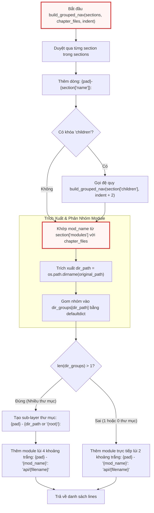

Thuật toán vận hành bằng cách quét danh sách tên module trong `section.get("modules", [])`, tìm kiếm thông tin tệp tương ứng trong `chapter_files` bằng hàm `next()`. Đường dẫn thư mục gốc được trích xuất bằng `os.path.dirname(match.get("original_path", ""))`. Sử dụng `collections.defaultdict(list)`, hàm gom các module có cùng `dir_path`. Nếu số lượng thư mục phân biệt `len(dir_groups) > 1`, hàm sẽ tự động chèn một tầng phân cấp trung gian với nhãn là đường dẫn thư mục tương đối (hoặc `"(root)"` nếu nằm tại thư mục gốc của dự án), giúp cấu trúc cây tài liệu phản ánh chính xác vị trí vật lý của mã nguồn mà không cần thực hiện thêm bất kỳ lượt gọi LLM nào.

---

### `collect_all_modules()`
**Visibility**: Public  
**Signature**: `def collect_all_modules(sections: list) -> set:`

**Description**:  
Hàm đệ quy thu thập toàn bộ danh sách tên module duy nhất được tham chiếu trong cây cấu trúc phân nhóm `sections`. Hàm được sử dụng trong các nút tiền xử lý và hậu xử lý điều hướng để kiểm tra tính toàn vẹn (reconciliation), đảm bảo không có tệp mã nguồn nào bị bỏ sót hoặc bị trùng lặp giữa các nhóm phân loại của mô hình ngôn ngữ lớn.

**Parameters**:
* `sections` (`list`): Danh sách các cấu trúc nhóm phân cấp chứa khóa `'modules'` và tùy chọn khóa `'children'`.

**Returns**:
* `set`: Tập hợp kiểu `set` chứa toàn bộ các chuỗi tên module được tìm thấy trên toàn bộ các nhánh của cây.

**Raises**:
* Không phát sinh ngoại lệ nội bộ trực tiếp.

**Example**:
```python
def collect_all_modules(sections: list) -> set:
    """Recursively collect all module names referenced in a sections tree."""
    result = set()
    for section in sections:
        result.update(section.get("modules", []))
        if "children" in section:
            result.update(collect_all_modules(section["children"]))
    return result
```

Hàm khởi tạo một tập hợp rỗng `result = set()`. Trong mỗi vòng lặp qua từng phần tử `section`, phương thức `update()` được gọi để đưa toàn bộ danh sách `section.get("modules", [])` vào tập hợp (tự động loại bỏ các phần tử trùng lặp). Nếu phát hiện khóa `children`, hàm thực hiện gọi đệ quy `collect_all_modules(section["children"])` và hợp nhất kết quả trả về vào `result`. Độ phức tạp tính toán đạt mức tuyến tính $O(N)$ với $N$ là tổng số nút trong cây phân nhóm, đảm bảo hiệu năng xử lý tức thì ngay cả với các dự án lớn chứa hàng trăm module.

---

## Tích hợp Hệ thống và Sơ đồ Phụ thuộc (System Integration & Dependencies)

Module `utils/prompts.py` đóng vai trò là tầng hạ tầng độc lập cao, chỉ phụ thuộc duy nhất vào module chuẩn `os` của thư viện Python và module nội bộ `collections.defaultdict`. 

Bảng dưới đây tổng hợp mối quan hệ giữa các hàm trong `prompts.py` với các thành phần khác trong toàn bộ dự án:

| Hàm trong `prompts.py` | Thành phần tiêu thụ (Consumers) | Module liên quan | Mục đích nghiệp vụ |
| :--- | :--- | :--- | :--- |
| `build_code_file_filter_prompt` | `DeterministicFileMapper` | [Chương 11 — nodes.py](11_nodes_py.md), [Chương 2 — call_llm.py](02_call_llm_py.md) | Tạo prompt yêu cầu LLM lọc danh sách tệp mã nguồn hợp lệ theo chỉ số YAML. |
| `build_chapter_summary_prompt` | `ChapterGenerationNode` | [Chương 11 — nodes.py](11_nodes_py.md), [Chương 9 — flow.py](09_flow_py.md) | Sinh bản tóm tắt kỹ thuật 4 chiều để duy trì ngữ cảnh xuyên suốt giữa các chương. |
| `build_mkdocs_config` | Luồng đóng gói tài liệu | [Chương 10 — main.py](10_main_py.md) | Khởi tạo nội dung tệp `mkdocs.yml` hoàn chỉnh tích hợp Material Theme và Panzoom. |
| `build_mermaid_init_js` | Luồng đóng gói tài liệu | [Chương 10 — main.py](10_main_py.md) | Khởi tạo tệp script `javascripts/mermaid-init.js` xử lý hiển thị `.mermaid-raw`. |
| `build_grouped_nav` | `SectionGroupingNode`, Xuất bản web | [Chương 11 — nodes.py](11_nodes_py.md), [Chương 10 — main.py](10_main_py.md) | Phân giải đệ quy cây phân nhóm của LLM thành cấu trúc điều hướng YAML đa tầng. |
| `collect_all_modules` | `SectionGroupingNode` | [Chương 11 — nodes.py](11_nodes_py.md) | Thu thập tập hợp tên module để đối soát độ đầy đủ của cây tài liệu. |

---

## Xem Thêm (See Also)

* [Chương 2 — call_llm.py](02_call_llm_py.md): Tầng giao tiếp và thực thi suy luận mô hình ngôn ngữ lớn tiếp nhận các chuỗi prompt được tạo từ module này.
* [Chương 6 — output.py](06_output_py.md): Hệ thống quản lý đầu ra console, nhật ký tệp tin và dịch thuật đa ngôn ngữ giao diện.
* [Chương 8 — token_utils.py](08_token_utils_py.md): Bộ tiện ích tính toán và ước lượng số lượng token cho các chuỗi prompt trước khi gửi tới API.
* [Chương 9 — flow.py](09_flow_py.md): Đồ thị luồng công việc điều phối việc chuyển giao ngữ cảnh và bản tóm tắt chương giữa các bước thực thi.
* [Chương 10 — main.py](10_main_py.md): Điểm nhập chương trình tiêu thụ các hàm sinh cấu hình `mkdocs.yml` và script Mermaid.
* [Chương 11 — nodes.py](11_nodes_py.md): Các nút xử lý logic sử dụng `build_code_file_filter_prompt`, `build_chapter_summary_prompt` và `build_grouped_nav`.


---

<a id="chapter-8"></a>

# token_utils.py

> **Source:** `utils/token_utils.py`

Tiếp nối các tiện ích sinh prompt và xử lý điều hướng cấu trúc tài liệu từ [07_prompts_py.md](07_prompts_py.md), module `token_utils.py` đảm nhiệm vai trò là hệ thống đo lường, phân tích và giám sát tải lượng token (Token Telemetry & Context Profiling) cho toàn bộ ứng dụng. Module này chịu trách nhiệm chuẩn hóa việc tính toán dung lượng ngữ cảnh của các chuỗi văn bản đầu vào trước khi chuyển tiếp tới mô hình ngôn ngữ lớn (LLM), giúp ngăn chặn sự cố tràn cửa sổ ngữ cảnh (Context Window Overflow) và cung cấp báo cáo chi tiết về tỷ lệ sử dụng tài nguyên token theo từng giai đoạn thực thi của đồ thị xử lý (`nodes.py` và `flow.py`).

---

## 1. Tổng quan Kiến trúc & Nguyên lý Hoạt động

Module `token_utils.py` được thiết kế xoay quanh hai mục tiêu cốt lõi: **độ chính xác tính toán tối đa** và **độ ổn định tuyệt đối trong môi trường sản xuất (Fail-Safe Resilience)**. Thành phần này giải quyết các thách thức kỹ thuật sau:

1. **Khởi tạo lười (Lazy-Loaded Singleton Pattern):** Bộ mã hóa Byte-Pair Encoding (BPE) của `tiktoken` đòi hỏi chi phí nạp bảng từ vựng (vocabulary tables) vào bộ nhớ trong lần đầu tiên. Module trì hoãn việc nạp tài nguyên này cho đến khi hàm tính token được gọi lần đầu, đồng thời lưu trữ đối tượng `_encoding` dưới dạng singleton để tránh nạp lại nhiều lần.
2. **Cơ chế phòng thủ và phân rã dự phòng (Graceful Degradation Fallback):** Trong trường hợp môi trường thực thi thiếu thư viện `tiktoken`, không có kết nối mạng để tải bộ dữ liệu từ vựng hoặc gặp lỗi khởi tạo BPE ngoại lệ, hệ thống sẽ tự động hạ cấp sang thuật toán ước lượng theo tỷ lệ ký tự chuẩn ($1\text{ token} \approx 4\text{ ký tự}$).
3. **Phân tích tải lượng đa kênh (Dual-Channel Token Analytics):** Cung cấp giao diện trích xuất số liệu token phân cấp, tự động căn chỉnh lề giao diện console thông qua hệ thống thông báo `emit()` của [06_output_py.md](06_output_py.md), đồng thời định dạng dữ liệu telemetry thành chuỗi nhật ký đơn dòng có cấu trúc (Single-line Structured Log) phục vụ cho việc bóc tách và giám sát tự động qua logger `llm_logger`.

---

## 2. Sơ đồ Luồng Ước lượng và Phân tích Token

Sơ đồ dưới đây mô tả luồng điều hướng logic từ khi tiếp nhận chuỗi văn bản, phân giải bộ mã hóa, tính toán dự phòng đến khi xuất dữ liệu thống kê ra terminal và tệp nhật ký:

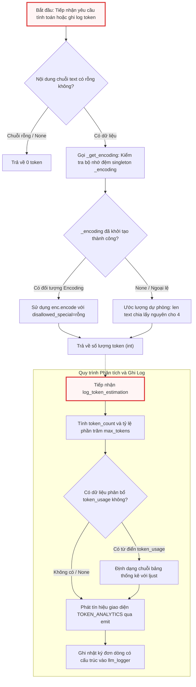

---

## 3. Biến Toàn cục & Bộ nhớ đệm Module-Level

Các biến phạm vi module được khởi tạo tĩnh để phục vụ chia sẻ tài nguyên và tối ưu hóa bộ nhớ:

```python
# Get the shared logger from call_llm module
logger = logging.getLogger("llm_logger")

# Lazy-loaded tiktoken encoding (singleton)
_encoding = None
```

### Chi tiết Kỹ thuật:
* `logger` (`logging.Logger`): Thực thể logger toàn cục có định danh `"llm_logger"`. Thực thể này được liên kết trực tiếp với kênh ghi nhật ký hệ thống đã được cấu hình từ [06_output_py.md](06_output_py.md) và chia sẻ cùng không gian nhật ký với [02_call_llm_py.md](02_call_llm_py.md). Mọi dữ liệu phân tích token khi ghi vào đây sẽ được đưa vào tệp nhật ký phiên chạy mà không bị làm nhiễu bởi định dạng màu sắc terminal.
* `_encoding` (`tiktoken.core.Encoding | None`): Biến trạng thái module đóng vai trò là bộ nhớ đệm singleton cho đối tượng phân tích cú pháp token. Khởi tạo mặc định là `None` và chỉ được nạp dữ liệu một lần duy nhất khi có yêu cầu mã hóa đầu tiên.

---

## 4. Chi tiết Hàm Module (Module-Level Functions)

### `_get_encoding()`

**Visibility**: Private (Nội bộ module)  
**Signature**: `def _get_encoding() -> tiktoken.core.Encoding | None:`

```python
def _get_encoding():
    global _encoding
    if _encoding is None:
        try:
            _encoding = tiktoken.get_encoding("cl100k_base")
        except Exception:
            _encoding = None
    return _encoding
```

**Description**:  
Hàm nội bộ quản lý vòng đời và bộ nhớ đệm của đối tượng mã hóa `tiktoken`. Hàm sử dụng mẫu thiết kế Singleton kết hợp cơ chế Khởi tạo lười (Lazy Initialization) để trì hoãn việc đọc và giải mã bảng từ vựng BPE `cl100k_base` (tương thích chuẩn cho các dòng mô hình GPT-4, GPT-3.5-Turbo cũng như các mô hình suy luận hiện đại).

Trong quá trình thực thi, nếu gặp bất kỳ ngoại lệ nào (ví dụ: thiếu tệp nhị phân từ vựng offline, lỗi cấp phát bộ nhớ C-extension hoặc thư viện `tiktoken` chưa được cài đặt tương thích), khối `try...except Exception` sẽ chủ động bắt lỗi và gán `_encoding = None`. Thiết kế này loại bỏ hoàn toàn nguy cơ ứng dụng bị sập đột ngột (crash), cho phép tầng trên tự động kích hoạt cơ chế ước lượng dự phòng.

**Parameters**:  
* Không nhận tham số đầu vào.

**Returns**:  
* `tiktoken.core.Encoding | None`: Đối tượng mã hóa BPE `cl100k_base` nếu nạp thành công; ngược lại trả về `None`.

**Raises**:  
* Không phát sinh ngoại lệ ra ngoài (Mọi ngoại lệ nội bộ từ `tiktoken.get_encoding` đều bị cô lập và xử lý an toàn).

**Example**:
```python
enc = _get_encoding()
if enc:
    tokens = enc.encode("Hello world", disallowed_special=())
```

---

### `count_tokens()`

**Visibility**: Public  
**Signature**: `def count_tokens(text: str) -> int:`

```python
def count_tokens(text: str) -> int:
    """Count tokens using tiktoken, with fallback to chars/4."""
    if not text:
        return 0
    enc = _get_encoding()
    if enc:
        return len(enc.encode(text, disallowed_special=()))
    return len(text) // 4
```

**Description**:  
Hàm tính toán chính xác tổng số lượng token của một chuỗi văn bản đầu vào. Đây là giao diện lập trình công khai được sử dụng xuyên suốt hệ thống để đo lường tải lượng của các tệp mã nguồn từ [03_crawl_github_files.py](03_crawl_github_files.py), [04_crawl_local_files.py](04_crawl_local_files.py), các prompt tạo bởi [07_prompts.py](07_prompts_py.md) và các yêu cầu gọi mô hình trong [02_call_llm_py.md](02_call_llm_py.md).

Hàm thực hiện quy trình xử lý theo 3 bước:
1. **Kiểm tra biên (Boundary Check):** Đánh giá chuỗi `text`. Nếu chuỗi là `None`, rỗng (`""`), hàm lập tức hoàn trả giá trị `0` mà không kích hoạt bộ phân tích BPE.
2. **Mã hóa BPE chính xác:** Truy xuất bộ mã hóa qua `_get_encoding()`. Khi đối tượng `enc` khả dụng, hàm gọi phương thức `enc.encode()` với tham số `disallowed_special=()`. Việc vô hiệu hóa kiểm tra ký tự đặc biệt (`disallowed_special=()`) là cực kỳ quan trọng, cho phép chuỗi đầu vào chứa các token đặc biệt thường gặp trong mã nguồn và prompt (như `<|endoftext|>`, `<|im_start|>`) được mã hóa an toàn như văn bản thuần mà không gây lỗi `ValueError`.
3. **Hạ cấp dự phòng (Heuristic Fallback):** Nếu không thể nạp bộ mã hóa, hàm sử dụng phép chia lấy phần nguyên `len(text) // 4` dựa trên quy chuẩn trung bình $1\text{ token} \approx 4\text{ ký tự}$ trong xử lý ngôn ngữ tự nhiên và mã nguồn.

**Parameters**:  
* `text` (`str`): Chuỗi văn bản thuần hoặc nội dung mã nguồn cần đo lường số lượng token.

**Returns**:  
* `int`: Tổng số lượng token đã được mã hóa hoặc ước tính. Luôn trả về số nguyên không âm ($\ge 0$).

**Raises**:  
* Không phát sinh ngoại lệ.

**Example**:
```python
# Trích xuất từ cách sử dụng nội bộ và tích hợp hệ thống
prompt = "Analyze the system architecture for this repository."
total_tokens = count_tokens(prompt)
# total_tokens -> giá trị int (ví dụ: 8)
```

---

### `log_token_estimation()`

**Visibility**: Public  
**Signature**: `def log_token_estimation(node_name: str, prompt_content: str, max_tokens: int, token_usage: dict | None = None) -> None:`

```python
def log_token_estimation(node_name: str, prompt_content: str, max_tokens: int, token_usage: dict | None = None) -> None:
    token_count = count_tokens(prompt_content)
    percentage = (token_count / max_tokens) * 100 if max_tokens else 0

    # Build token usage breakdown suffix for stdout display
    suffix = ""
    usage_log_str = ""
    if token_usage:
        max_label_len = max(len(label) for label in token_usage)
        lines = []
        log_parts = []
        for label, value in token_usage.items():
            pct = (value / token_count * 100) if token_count else 0
            padded_label = label.ljust(max_label_len)
            lines.append(f"\t{padded_label} : {value:,} ({pct:.0f}%)")
            log_parts.append(f"{label}={value:,} ({pct:.0f}%)")
        suffix = "\n" + "\n".join(lines)
        usage_log_str = " | " + " | ".join(log_parts)

    # Console output via emit (styled by CSV LEVEL=WARNING → yellow)
    emit(
        "TOKEN_ANALYTICS",
        suffix=suffix,
        node_name=node_name,
        token_count=f"{token_count:,}",
        max_tokens=f"{max_tokens:,}",
        percentage=f"{percentage:.1f}",
    )

    # File log stays single-line for parseability (structured, not translatable)
    logger.info(f"NODE EXEC | node={node_name} | prompt_tokens={token_count:,} / {max_tokens:,} ({percentage:.1f}% capacity){usage_log_str}")
```

**Description**:  
Hàm thực hiện phân tích, định dạng và xuất báo cáo tải lượng token cho từng nút thực thi trong hệ thống (như các nút phân tích kiến trúc, ánh xạ module, tóm tắt chương trong `nodes.py`). Hàm hỗ trợ việc bóc tách tỷ lệ chiếm dụng cửa sổ ngữ cảnh và cấu trúc chi tiết các thành phần con của prompt.

Quy trình xử lý nội bộ bao gồm:
1. **Đo lường & Tính toán Tỷ lệ:** Gọi `count_tokens(prompt_content)` để lấy tổng số token đầu vào. Sau đó, tỷ lệ chiếm dụng cửa sổ ngữ cảnh (`percentage`) được tính bằng công thức:
   $$\text{percentage} = \frac{\text{token\_count}}{\text{max\_tokens}} \times 100$$
   Xử lý an toàn trường hợp `max_tokens = 0` hoặc `None` để tránh lỗi `ZeroDivisionError`.
2. **Căn lề Bảng Phân bổ (Breakdown Formatting):** Nếu có tham số `token_usage` (từ điển ánh xạ tên thành phần prompt với số lượng token tương ứng, ví dụ `{"System Prompt": 500, "Code Files": 12000}`), hàm tìm chiều dài nhãn lớn nhất (`max_label_len`) và sử dụng phương thức `str.ljust()` để căn chỉnh thẳng hàng dọc. Đồng thời tính toán tỷ lệ phần trăm của từng thành phần so với tổng số `token_count`.
3. **Xuất bản Đa Kênh:**
   * **Kênh Console (`emit`):** Gửi sự kiện định danh `"TOKEN_ANALYTICS"` tới hệ thống thông báo đa ngữ [06_output_py.md](06_output_py.md). Thông báo này được hiển thị nổi bật trên terminal (thường được cấu hình mức `WARNING` với mã màu ANSI vàng) đi kèm bảng phân bổ `suffix` thụt đầu dòng rõ ràng.
   * **Kênh Tệp Nhật ký (`logger.info`):** Ghi một dòng log có cấu trúc chuẩn hóa, ngăn cách bởi ký tự `|` (Pipe delimiter), giúp các công cụ phân tích log (Log Parsers, SIEM, Grafana Loki) dễ dàng bóc tách thông tin mà không bị ảnh hưởng bởi ký tự xuống dòng.

**Parameters**:  
* `node_name` (`str`): Tên định danh của nút hoặc tiến trình đang thực thi (ví dụ: `"FileMapperNode"`, `"ChapterSummarizer"`).
* `prompt_content` (`str`): Toàn bộ nội dung prompt hoàn chỉnh chuẩn bị gửi tới LLM.
* `max_tokens` (`int`): Giới hạn cửa sổ ngữ cảnh tối đa của mô hình được cấu hình (ví dụ: $128,000$ hoặc $1,000,000$).
* `token_usage` (`dict | None`, tùy chọn): Bảng từ điển tùy chọn chứa chi tiết phân rã số lượng token theo từng phân đoạn nghiệp vụ (`dict[str, int]`). Mặc định là `None`.

**Returns**:  
* `None`.

**Raises**:  
* Không phát sinh ngoại lệ ra bên ngoài.

**Example**:
```python
# Trích xuất cấu trúc gọi thực tế trong các nút thực thi
usage_breakdown = {
    "System Instruction": 450,
    "Repository Tree": 1200,
    "Source File Contents": 15400
}
full_prompt = "...[Nội dung prompt hoàn chỉnh]..."
max_context_window = 32768

log_token_estimation(
    node_name="ArchitectureAnalysisNode",
    prompt_content=full_prompt,
    max_tokens=max_context_window,
    token_usage=usage_breakdown
)
```

---

## 5. Bảng Phân Tích Kỹ Thuật Định Dạng Dữ Liệu Đầu Ra

Dưới đây là đặc tả kỹ thuật của hai định dạng đầu ra được điều phối bởi hàm `log_token_estimation()`:

| Kênh Đầu Ra | Phương Thức Thực Thi | Định Dạng Dữ Liệu | Mục Đích Sử Dụng |
| :--- | :--- | :--- | :--- |
| **Giao diện Dòng lệnh (CLI)** | `output.emit("TOKEN_ANALYTICS", ...)` | Đa dòng, có màu sắc ANSI, bảng phân bổ căn lề ljust, thụt đầu dòng tab (`\t`) | Giúp người dùng theo dõi trực quan mức độ tiêu thụ token theo thời gian thực khi chạy CLI |
| **Nhật ký Tệp (File Logger)** | `logger.info(...)` | Đơn dòng (Single-line), phân tách bằng dấu phân cách `\|`, không mã màu, không bản địa hóa chuỗi | Phục vụ phân tích hiệu năng sau phiên chạy, kiểm toán chi phí API và truy vết tự động |

---

## 6. Phân tích Các Trường Hợp Biên & Phòng Thủ Lỗi

1. **Chuỗi Ký Tự Đặc Biệt (Special Tokens Injection):**
   Trong các kho lưu trữ mã nguồn lớn, nhiều tệp tin (ví dụ: các tệp cấu hình tokenizer, mô hình mẫu hoặc dữ liệu huấn luyện NLP) có thể chứa các token đặc biệt như `<|endoftext|>`. Nếu gọi `tiktoken.encode()` thông thường mà không chỉ định `disallowed_special=()`, thư viện sẽ ném ngoại lệ `ValueError`. Bằng cách truyền tham số `disallowed_special=()`, module đảm bảo an toàn tuyệt đối, coi toàn bộ các chuỗi này là văn bản thô.

2. **Xử Lý Chia Cho 0 (Zero Division Guard):**
   Trong trường hợp `max_tokens` truyền vào là `0` hoặc `prompt_content` là chuỗi rỗng (`token_count == 0`), các biểu thức điều kiện `(token_count / max_tokens) * 100 if max_tokens else 0` và `(value / token_count * 100) if token_count else 0` bảo đảm tiến trình không bị ngắt quãng bởi ngoại lệ toán học.

3. **Tính Độc Lập Khi Nạp Module (Import-Time Decoupling):**
   Nhờ cơ chế lazy load, việc import `token_utils.py` không làm tiêu tốn tài nguyên I/O đọc đĩa hoặc giải nén bảng từ vựng BPE, đưa thời gian import module về mức tiệm cận $0\text{ ms}$.

---

## Xem Thêm (See Also)

* [02_call_llm_py.md](02_call_llm_py.md) — Tầng cổng kết nối LLM tiêu thụ trực tiếp hàm `count_tokens` để xác thực tải trọng yêu cầu.
* [06_output_py.md](06_output_py.md) — Hệ thống quản lý hiển thị CLI tiếp nhận mẫu sự kiện `"TOKEN_ANALYTICS"` từ `log_token_estimation`.
* [07_prompts_py.md](07_prompts_py.md) — Các tiện ích tạo prompt chịu sự kiểm soát dung lượng token bởi module này.
* [09_flow_py.md](09_flow_py.md) — Đồ thị điều phối thực thi giám sát dung lượng ngữ cảnh xuyên suốt các bước chạy.
* [11_nodes_py.md](11_nodes_py.md) — Các nút nghiệp vụ gọi `log_token_estimation` trước khi gửi payload tới LLM backend.


---

<a id="chapter-9"></a>

# flow.py

> **Source:** `flow.py`

Tài liệu này cung cấp đặc tả kỹ thuật và tham chiếu API nội bộ cho module `flow.py`. Module đóng vai trò là kiến trúc sư trưởng và bộ điều phối đồ thị thực thi (Workflow Orchestrator), chịu trách nhiệm thiết lập Đồ thị Có hướng Không Chu trình (Directed Acyclic Graph - DAG) dựa trên nền tảng framework `PocketFlow` để tự động hóa toàn bộ quy trình phân tích mã nguồn và sinh tài liệu kỹ thuật.

---

### Chuyển tiếp từ các thành phần trước
Trong [Chương 8 — token_utils.py](08_token_utils_py.md), hệ thống đã thiết lập hạ tầng giám sát tải lượng token, phân tích cấu hình ngữ cảnh và ước tính chi phí trước khi gửi prompt tới các Mô hình Ngôn ngữ Lớn (LLM). Module `flow.py` kế thừa năng lực này bằng cách tích hợp trực tiếp các nút xử lý nghiệp vụ từ [Chương 11 — nodes.py](11_nodes_py.md), kết nối chúng thành một đồ thị có cấu trúc phân nhánh thông minh dựa trên dung lượng ngữ cảnh và hình thái của kho mã nguồn.

---

## Tổng quan Kỹ thuật (Technical Overview)

Module `flow.py` đóng vai trò là tầng điều phối trung tâm (Workflow Pipeline Definition Layer) trong hệ thống. Thay vì thực thi các tác vụ xử lý mã nguồn theo một quy trình tuyến tính cứng nhắc (monolithic procedural script), hệ thống trừu tượng hóa từng giai đoạn xử lý thành các nút độc lập (Nodes) và sử dụng `flow.py` để mô hình hóa mối quan hệ phụ thuộc, cơ chế rẽ nhánh và khả năng tự phục hồi khi xảy ra lỗi.

### 1. Kiến trúc Đồ thị Điều phối (DAG Orchestration Architecture)
`flow.py` sử dụng framework `pocketflow`, cung cấp cú pháp toán tử nạp chồng (`>>` và `- "action" >>`) để xây dựng liên kết luồng dữ liệu và luồng điều khiển giữa các nút:
* **Toán tử chuyển tiếp tuần tự (`NodeA >> NodeB`):** Thiết lập quan hệ phụ thuộc dữ liệu đơn hướng. `NodeB` chỉ được kích hoạt sau khi `NodeA` thực thi thành công (`success`).
* **Toán tử chuyển tiếp có điều kiện (`NodeA - "action" >> NodeB`):** Thiết lập đường dẫn rẽ nhánh động. `NodeB` chỉ nhận quyền điều khiển khi giá trị trả về của `NodeA.post()` trùng khớp với nhãn chuỗi `"action"`.

### 2. Chiến lược Phân nhánh Đa hình (Polymorphic Context Routing)
Để xử lý tối ưu mọi quy mô kho mã nguồn — từ các thư viện vi mô (micro-libraries) cho tới các kho mã nguồn doanh nghiệp khổng lồ (monorepos) — luồng điều khiển tại `ContextRouter` được phân tách thành 3 nhánh thực thi riêng biệt:
1. **Nhánh Trực tiếp (`direct`):** Áp dụng cho các kho mã nguồn có dung lượng token nằm gọn trong cửa sổ ngữ cảnh (Context Window) của LLM. Luồng đi thẳng qua `IdentifyAbstractions` để trích xuất toàn bộ các khối kiến trúc cốt lõi trong một chu kỳ suy luận duy nhất.
2. **Nhánh Xử lý Hàng loạt (`batch` - Map-Reduce):** Áp dụng cho các kho mã nguồn quy mô lớn vượt ngưỡng ngữ cảnh. Hệ thống chia nhỏ tệp tin, kích hoạt `MapAbstractions` để trích xuất trừu tượng hóa cục bộ theo từng cụm, sau đó dùng `ReduceAbstractions` để hợp nhất và khử trùng lặp toàn cục.
3. **Nhánh Ánh xạ Xác định (`deterministic`):** Áp dụng cho chế độ tạo tài liệu 1:1 chuyên biệt (mỗi tệp mã nguồn tương ứng chính xác với một chương tài liệu). Nhánh này kích hoạt `DeterministicFileMapper` và bỏ qua toàn bộ các bước phân tích trừu tượng hóa (`IdentifyAbstractions`, `MapAbstractions`, `ReduceAbstractions`, `AnalyzeRelationships`, `OrderChapters`), chuyển tiếp trực tiếp tới giai đoạn viết nội dung.

### 3. Chính sách Phục hồi và Chống Nghẽn Tần suất (Resilience & Retry Policies)
Các nút tương tác với hạ tầng mạng và Mô hình Ngôn ngữ Lớn được cấu hình chính sách tự phục hồi chủ động:
* Tham số `max_retries=5` đảm bảo các yêu cầu bị lỗi mạng, đứt kết nối HTTP, phản hồi JSON không hợp lệ hoặc lỗi quá tải tạm thời (HTTP 503) sẽ được thử lại tối đa 5 lần trước khi hủy tiến trình.
* Tham số `wait=20` áp dụng thời gian chờ 20 giây giữa các lần thử lại, giúp hệ thống vượt qua các giới hạn tần suất nghiêm ngặt (Rate Limits / HTTP 429) của các nhà cung cấp như OpenAI, Google AI Studio hoặc OpenRouter.

---

## Sơ đồ Kiến trúc Đồ thị Luồng Thực thi (Flow DAG Architecture)

Sơ đồ dưới đây mô tả toàn bộ cấu trúc phân nhánh, các nút thực thi và luồng dữ liệu được định nghĩa bên trong hàm `create_tutorial_flow()`:

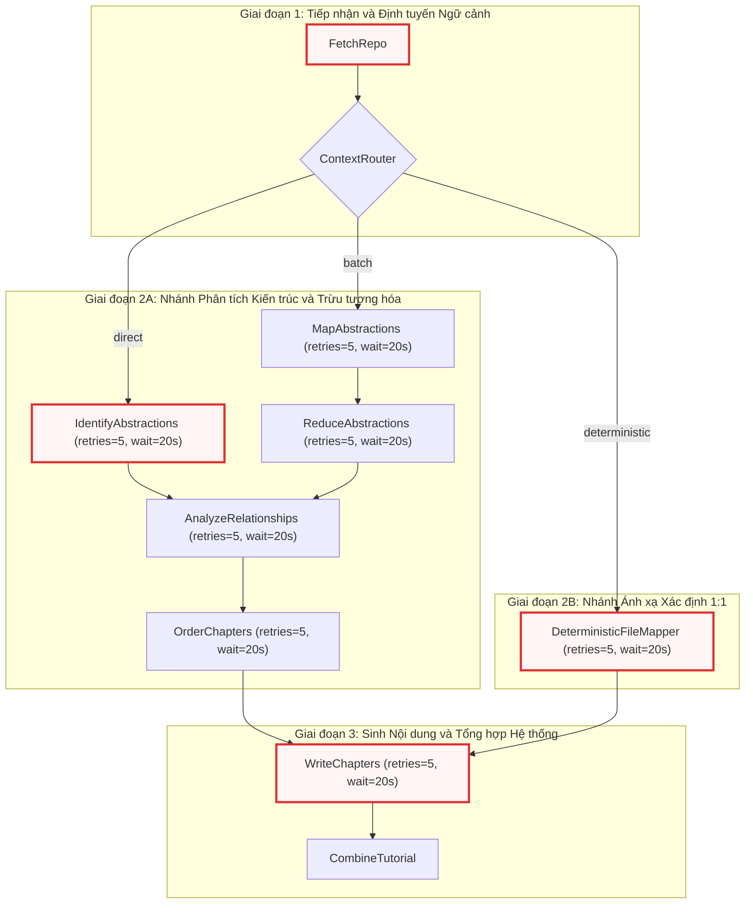

---

## Module-Level Functions

Module `flow.py` cung cấp hàm nhà máy (Factory Function) công khai duy nhất để đóng gói toàn bộ logic cấu hình và kết nối đồ thị.

### `create_tutorial_flow()`
**Visibility**: Public  
**Signature**: `def create_tutorial_flow() -> Flow:`

**Description**:  
Hàm `create_tutorial_flow()` đóng vai trò là điểm thiết lập đồ thị thực thi trung tâm của hệ thống. Dưới tầng logic, hàm thực hiện tuần tự các nhiệm vụ:
1. **Khởi tạo thể hiện các Node nghiệp vụ:** Cấp phát các thực thể của 10 lớp node xử lý được định nghĩa trong `nodes.py`.
2. **Cấu hình tham số chịu lỗi (Fault Tolerance Configuration):** Thiết lập `max_retries=5` và `wait=20` trên tất cả các node có tương tác suy luận với LLM (`MapAbstractions`, `ReduceAbstractions`, `IdentifyAbstractions`, `AnalyzeRelationships`, `OrderChapters`, `WriteChapters`, `DeterministicFileMapper`). Các node đóng vai trò điều hướng hoặc kết xuất thuần túy (`FetchRepo`, `ContextRouter`, `CombineTutorial`) được duy trì tham số mặc định.
3. **Liên kết cấu trúc tô pô của Đồ thị (Topology Wiring):** Thiết lập các cạnh nối vô điều kiện (`>>`) và các cạnh rẽ nhánh có điều kiện (`- "action" >>`).
4. **Đóng gói thực thể luồng (`Flow`):** Trả về đối tượng `Flow(start=fetch_repo)` chứa cấu trúc đồ thị hoàn chỉnh với điểm kích hoạt ban đầu là `FetchRepo`.

**Parameters**:
* Hàm không tiếp nhận tham số trực tiếp. Mọi tham số cấu hình hệ thống (như đường dẫn repo, danh sách mẫu loại trừ, ngôn ngữ đầu ra) được nạp vào bộ nhớ trạng thái chia sẻ (`shared` dictionary) khi thực thể `Flow` được gọi thực thi thông qua phương thức `.run(shared)`.

**Returns**:
* `Flow`: Một thực thể đồ thị `PocketFlow` đã được kết nối hoàn chỉnh, sẵn sàng nhận tham số ngữ cảnh chia sẻ để kích hoạt tiến trình sinh tài liệu.

**Raises**:
* Hàm không phát sinh ngoại lệ trực tiếp trong quá trình khởi tạo cấu trúc đồ thị. Mọi ngoại lệ runtime liên quan đến mạng, tệp tin hoặc giới hạn API sẽ được xử lý cục bộ bởi cơ chế retry của từng node hoặc truyền ra ngoài khi gọi phương thức `flow.run()`.

**Example**:
```python
# Trích xuất từ định nghĩa luồng thực thi trong flow.py
def create_tutorial_flow():
    fetch_repo = FetchRepo()
    context_router = ContextRouter()
    map_abstractions = MapAbstractions(max_retries=5, wait=20)
    reduce_abstractions = ReduceAbstractions(max_retries=5, wait=20)
    identify_abstractions = IdentifyAbstractions(max_retries=5, wait=20)
    analyze_relationships = AnalyzeRelationships(max_retries=5, wait=20)
    order_chapters = OrderChapters(max_retries=5, wait=20)
    write_chapters = WriteChapters(max_retries=5, wait=20)
    combine_tutorial = CombineTutorial()
    deterministic_mapper = DeterministicFileMapper(max_retries=5, wait=20)

    fetch_repo >> context_router

    context_router - "direct" >> identify_abstractions
    context_router - "batch" >> map_abstractions
    context_router - "deterministic" >> deterministic_mapper

    map_abstractions >> reduce_abstractions

    identify_abstractions >> analyze_relationships
    reduce_abstractions >> analyze_relationships

    analyze_relationships >> order_chapters
    order_chapters >> write_chapters

    deterministic_mapper >> write_chapters

    write_chapters >> combine_tutorial

    return Flow(start=fetch_repo)
```

#### Phân tích Chuyên sâu về Cơ chế Hoạt động và Hành vi Runtime

Đoạn mã trên thể hiện tính khai báo tường minh (Declarative Pipeline) của kiến trúc hệ thống. Dưới đây là phân tích chi tiết từng khía cạnh kỹ thuật:

```python
    fetch_repo = FetchRepo()
    context_router = ContextRouter()
    map_abstractions = MapAbstractions(max_retries=5, wait=20)
    reduce_abstractions = ReduceAbstractions(max_retries=5, wait=20)
    identify_abstractions = IdentifyAbstractions(max_retries=5, wait=20)
    analyze_relationships = AnalyzeRelationships(max_retries=5, wait=20)
    order_chapters = OrderChapters(max_retries=5, wait=20)
    write_chapters = WriteChapters(max_retries=5, wait=20)
    combine_tutorial = CombineTutorial()
    deterministic_mapper = DeterministicFileMapper(max_retries=5, wait=20)
```
Giai đoạn khởi tạo đối tượng phân định rõ hai nhóm thành phần:
* **Nhóm Node Không Trạng Thái / I/O Nhẹ (`FetchRepo`, `ContextRouter`, `CombineTutorial`):** Thực thi các tác vụ quét đĩa cứng, bóc tách cấu trúc thư mục, định tuyến dựa trên số lượng token hoặc ghi tệp Markdown ra đĩa. Các thao tác này mang tính tất định (deterministic), không phụ thuộc vào độ trễ của API bên thứ ba, do đó không cần cấu hình thử lại mở rộng.
* **Nhóm Node Trí tuệ Nhân tạo / LLM Heavy (`MapAbstractions`, `ReduceAbstractions`, `IdentifyAbstractions`, `AnalyzeRelationships`, `OrderChapters`, `WriteChapters`, `DeterministicFileMapper`):** Trực tiếp gọi hàm `call_llm()` từ [Chương 2 — call_llm.py](02_call_llm_py.md). Các node này được bọc trong bộ điều khiển vòng lặp thử lại với độ trễ cố định 20 giây (`wait=20`) và số lần thử tối đa 5 lần (`max_retries=5`). Điều này giúp cô lập hoàn toàn các sự cố sập kết nối HTTP hoặc chạm ngưỡng giới hạn tốc độ (TPM/RPM) mà không làm gián đoạn toàn bộ đồ thị.

```python
    fetch_repo >> context_router

    context_router - "direct" >> identify_abstractions
    context_router - "batch" >> map_abstractions
    context_router - "deterministic" >> deterministic_mapper
```
Giai đoạn định tuyến ngữ cảnh thiết lập điểm phân nhánh động (Dynamic Forking):
* Sau khi `FetchRepo` thu thập toàn bộ cây tệp tin và lưu trữ trong từ điển `shared["files"]`, `ContextRouter` đo lường tổng số token thông qua module [Chương 8 — token_utils.py](08_token_utils_py.md).
* `ContextRouter.post()` trả về một trong ba chuỗi định tuyến (`"direct"`, `"batch"`, hoặc `"deterministic"`).
* Cơ chế của PocketFlow đối chiếu chuỗi này với các cạnh có điều kiện (`- "action" >>`). Chỉ có đúng một nhánh tương ứng được kích hoạt, các nhánh còn lại sẽ ở trạng thái không tải (idle), giải phóng bộ nhớ và tài nguyên tính toán.

```python
    map_abstractions >> reduce_abstractions

    identify_abstractions >> analyze_relationships
    reduce_abstractions >> analyze_relationships

    analyze_relationships >> order_chapters
    order_chapters >> write_chapters
```
Giai đoạn đồng quy và phân tích kiến trúc (Architecture Synthesis):
* Nếu đi theo nhánh `"batch"`, `map_abstractions` xử lý phân đoạn mã nguồn và chuyển kết quả cho `reduce_abstractions` để tổng hợp thành danh sách các khối trừu tượng hóa chuẩn hóa.
* Cả `identify_abstractions` (từ nhánh `"direct"`) và `reduce_abstractions` (từ nhánh `"batch"`) đều có cạnh nối hội tụ về `analyze_relationships`. PocketFlow hỗ trợ mô hình hợp nhất nhiều nguồn (Many-to-One Convergence): nút nào hoàn thành trước sẽ chuyển tiếp dữ liệu tới nút kế tiếp.
* `AnalyzeRelationships` phân tích ma trận phụ thuộc giữa các thành phần kiến trúc, sau đó `OrderChapters` xác định thứ tự logic của các chương tài liệu nhằm đảm bảo trải nghiệm đọc tối ưu từ khái niệm nền tảng đến chi tiết cài đặt.

```python
    deterministic_mapper >> write_chapters

    write_chapters >> combine_tutorial

    return Flow(start=fetch_repo)
```
Giai đoạn sinh nội dung và đóng gói (Synthesis & Aggregation):
* Nhánh `"deterministic"` đi thẳng từ `deterministic_mapper` vào `write_chapters`, vượt qua hoàn toàn các bước phân tích trừu tượng hóa và sắp xếp chương. Điều này tối ưu hóa thời gian xử lý khi người dùng yêu cầu lập tài liệu ánh xạ 1:1 theo từng tệp mã nguồn vật lý.
* `write_chapters` đảm nhận khối lượng tính toán lớn nhất: sinh nội dung chi tiết cho từng chương, trích xuất tóm tắt kỹ thuật 4 chiều thông qua tiện ích từ [Chương 7 — prompts.py](07_prompts_py.md).
* `combine_tutorial` nhận toàn bộ các chương đã hoàn thiện, tiến hành biên dịch cây điều hướng MkDocs, tạo tệp `mkdocs.yml`, chèn script Mermaid JS và xuất bản cấu trúc tài liệu hoàn chỉnh ra thư mục đích.
* Lời gọi `Flow(start=fetch_repo)` đóng gói toàn bộ DAG và xác định `fetch_repo` là điểm vào (Entrypoint) duy nhất.

---

## Bảng Ma trận Cấu hình và Trách nhiệm của các Node (Node Configuration & Responsibility Matrix)

Dưới đây là bảng tổng hợp chi tiết cấu hình thực thi, loại tác vụ và trách nhiệm dữ liệu của từng node trong đồ thị:

| Node Thực thi | Loại Tác vụ | Cấu hình Thử lại | Dữ liệu Đầu vào (`shared`) | Dữ liệu Đầu ra (`shared`) | Trách nhiệm Kỹ thuật |
| :--- | :--- | :--- | :--- | :--- | :--- |
| `FetchRepo` | I/O & Network | Mặc định (`retries=0`) | `repo_url`, `is_local`, `include_patterns`, `exclude_patterns` | `files`, `repo_name`, `stats` | Quét hệ thống tệp cục bộ hoặc gọi GitHub API để tải mã nguồn, giải nén và lọc tệp thô. |
| `ContextRouter` | Heuristic Decision | Mặc định (`retries=0`) | `files`, `force_deterministic`, `force_batch` | `action` (`"direct"`, `"batch"`, `"deterministic"`) | Đếm token toàn bộ tệp tin, phân tích cấu trúc dự án và quyết định chiến lược xử lý tối ưu. |
| `IdentifyAbstractions` | LLM Inference | `max_retries=5`, `wait=20` | `files`, `language` | `abstractions` | Phân tích trực tiếp toàn bộ kho mã nguồn để trích xuất danh sách các thành phần trừu tượng hóa cốt lõi. |
| `MapAbstractions` | LLM Batch Inference | `max_retries=5`, `wait=20` | `files`, `language`, `batch_size` | `raw_abstractions_list` | Chia nhỏ kho mã nguồn thành từng lô (batches) và trích xuất trừu tượng hóa cục bộ trên từng phần. |
| `ReduceAbstractions` | LLM Inference | `max_retries=5`, `wait=20` | `raw_abstractions_list`, `language` | `abstractions` | Gom nhóm, loại bỏ trùng lặp và chuẩn hóa các trừu tượng hóa từ giai đoạn Map thành một danh mục thống nhất. |
| `DeterministicFileMapper` | Heuristic / LLM | `max_retries=5`, `wait=20` | `files`, `language` | `abstractions`, `chapter_order` | Ánh xạ 1:1 từng tệp mã nguồn thành một chương tài liệu độc lập, sinh tiêu đề và định tuyến trực tiếp. |
| `AnalyzeRelationships` | LLM Inference | `max_retries=5`, `wait=20` | `abstractions`, `files`, `language` | `relationships`, `architecture_graph` | Phân tích quan hệ phụ thuộc, luồng dữ liệu và giao tiếp giữa các thành phần trừu tượng hóa. |
| `OrderChapters` | LLM Inference | `max_retries=5`, `wait=20` | `abstractions`, `relationships`, `language` | `chapter_order` | Sắp xếp thứ tự các chương tài liệu theo lộ trình sư phạm hợp lý (từ khái quát đến chi tiết). |
| `WriteChapters` | LLM Heavy Iteration | `max_retries=5`, `wait=20` | `files`, `chapter_order`, `abstractions`, `relationships` | `chapters`, `chapter_summaries` | Lặp qua từng chương, sinh nội dung Markdown chuyên sâu kèm sơ đồ Mermaid và tóm tắt kỹ thuật. |
| `CombineTutorial` | I/O & Packaging | Mặc định (`retries=0`) | `chapters`, `chapter_summaries`, `repo_name`, `language` | `mkdocs_config`, `output_dir` | Ghi tệp Markdown, sinh cấu hình `mkdocs.yml`, tích hợp script Mermaid và hoàn tất tài liệu. |

---

## Luồng Dữ liệu Trạng thái Chia sẻ (Shared Memory State Flow)

Trong kiến trúc của `pocketflow`, các node không truyền dữ liệu trực tiếp qua tham số hàm mà tương tác thông qua một từ điển bộ nhớ dùng chung (`shared: dict[str, Any]`). Bảng dưới đây thể hiện vòng đời và biến đổi của các khóa trạng thái cốt lõi xuyên suốt đồ thị:

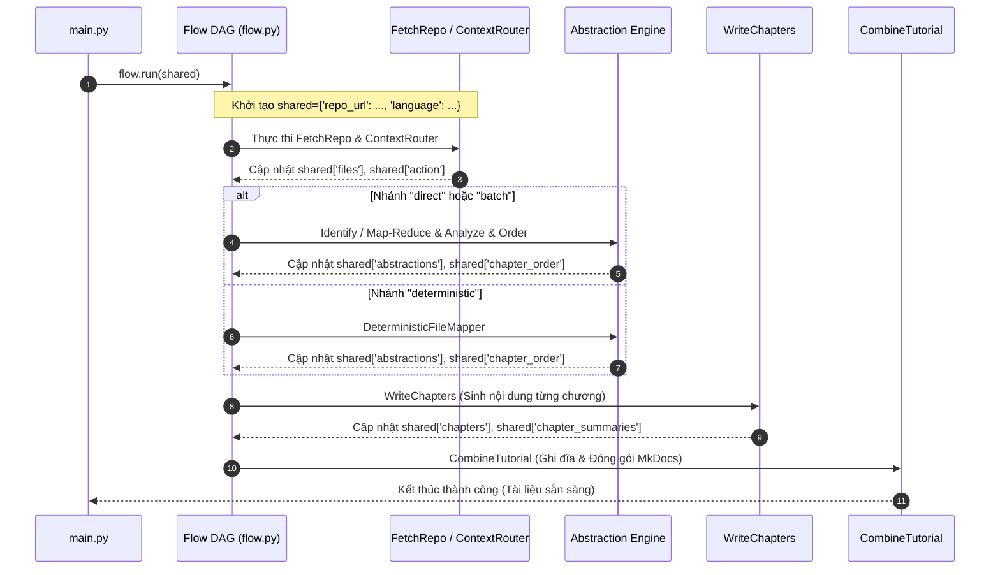

1. **Khởi tạo trạng thái ban đầu:** `main.py` chuẩn bị từ điển `shared` chứa cấu hình CLI (`repo_url`, `language`, `include_patterns`, `exclude_patterns`, v.v.).
2. **Nạp dữ liệu tệp:** `FetchRepo` đọc và ghi đè `shared["files"]` dưới dạng `dict[str, str]` (đường dẫn tệp $\to$ nội dung tệp).
3. **Đánh giá và Định tuyến:** `ContextRouter` kiểm tra dung lượng `shared["files"]`, quyết định nhánh xử lý và chuyển quyền điều khiển.
4. **Trừu tượng hóa và Sắp xếp:** Dù đi qua nhánh Direct, Batch hay Deterministic, kết quả cuối cùng đều ghi nhận hai khóa cốt lõi vào `shared`:
   * `shared["abstractions"]`: Danh mục các thực thể kỹ thuật được phân tích.
   * `shared["chapter_order"]`: Danh sách định danh chương theo thứ tự xuất bản.
5. **Sinh nội dung chi tiết:** `WriteChapters` đọc từng phần tử trong `shared["chapter_order"]`, sử dụng tóm tắt từ các chương trước (`shared["chapter_summaries"]`) làm ngữ cảnh liên tục để sinh nội dung cho chương hiện tại, sau đó lưu toàn bộ vào `shared["chapters"]`.
6. **Tổng hợp và Kết xuất:** `CombineTutorial` tiêu thụ `shared["chapters"]` và các siêu dữ liệu liên quan để tạo cấu trúc tệp tin tĩnh trên đĩa cứng.

---

## Xem Thêm (See Also)

* [Chương 2 — call_llm.py](02_call_llm_py.md): Module cổng kết nối LLM, cung cấp hạ tầng suy luận và cơ chế cache mà các node trong `flow.py` phụ thuộc.
* [Chương 7 — prompts.py](07_prompts_py.md): Thư viện hàm tạo prompt tĩnh, cung cấp cấu trúc câu lệnh cho các node phân tích và sinh chương.
* [Chương 8 — token_utils.py](08_token_utils_py.md): Hệ thống đo lường và tính toán token, hỗ trợ `ContextRouter` ra quyết định định tuyến chính xác.
* [Chương 10 — main.py](10_main_py.md): Điểm nhập chương trình (CLI Entrypoint), nơi gọi `create_tutorial_flow()` và khởi động luồng thực thi `.run()`.
* [Chương 11 — nodes.py](11_nodes_py.md): Nơi định nghĩa chi tiết mã nguồn và logic nội bộ của toàn bộ 10 lớp Node được kết nối trong đồ thị `flow.py`.


---

<a id="chapter-10"></a>

# main.py

> **Source:** `main.py`

Tiếp nối kiến trúc Đồ thị Có hướng Không Chu trình (DAG) được xây dựng trong [Chương 9 — flow.py](09_flow_py.md), tệp `main.py` đóng vai trò là điểm nhập thực thi trung tâm (Root Orchestration Entrypoint) và giao diện dòng lệnh (CLI Interface) của toàn bộ hệ thống tạo tài liệu. Thành phần này chịu trách nhiệm quản trị vòng đời ứng dụng từ thời điểm tiếp nhận đối số từ người dùng, nạp biến môi trường, khởi tạo hệ thống logging và bản địa hóa, phân giải cấu hình mô hình ngôn ngữ lớn (LLM), thiết lập bộ nhớ trạng thái dùng chung (`shared store`), cho đến việc kích hoạt luồng xử lý `PocketFlow` và dọn dẹp tài nguyên sau thực thi.

---

## 1. Tổng quan Kỹ thuật & Kiến trúc Hệ thống

`main.py` là mắt xích liên kết giữa giao diện người dùng bên ngoài và tầng điều phối luồng xử lý bên trong. Tệp chuyển đổi các tham số dòng lệnh khai báo phân tán thành một cấu trúc dữ liệu trạng thái hợp nhất (`shared`), đáp ứng hợp đồng dữ liệu mà các nút trong [Chương 11 — nodes.py](11_nodes_py.md) yêu cầu.

### Sơ đồ Luồng Thực thi Tổng thể (Execution Flowchart)

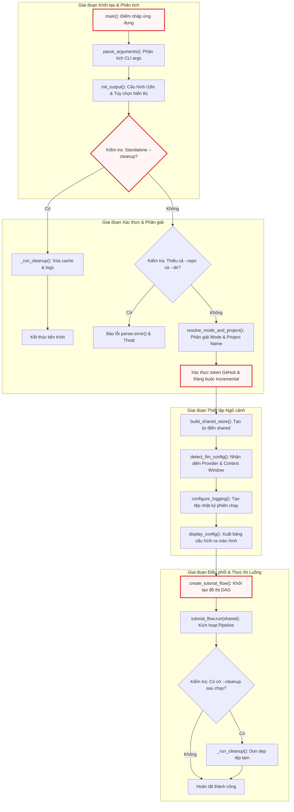

---

## 2. Hằng số & Cấu hình Phạm vi Module

### `DEFAULT_INCLUDE_PATTERNS`
* **Kiểu dữ liệu**: `set[str]`
* **Giá trị**: `{"*"}`
* **Mục đích kỹ thuật**: Định nghĩa tập hợp mẫu đường dẫn mặc định cho phép thu thập toàn bộ các tệp tin trong kho lưu trữ mã nguồn khi người dùng không truyền đối số `--include` (`-i`). Giá trị này hoạt động kết hợp cùng danh sách đen mặc định `DEFAULT_EXCLUDE_PATTERNS` được nạp từ [Chương 5 — exclude_patterns.py](05_exclude_patterns_py.md).

```python
# Default file patterns
DEFAULT_INCLUDE_PATTERNS = {"*"}

from utils.exclude_patterns import DEFAULT_EXCLUDE_PATTERNS
```

---

## 3. Các Hàm Cấp Module (Module-Level Functions)

### `parse_arguments()`
**Visibility**: Public  
**Signature**: `def parse_arguments() -> tuple[argparse.ArgumentParser, argparse.Namespace]:`

**Description**:  
Khởi tạo và cấu hình bộ phân tích đối số dòng lệnh `argparse.ArgumentParser`. Hàm thiết lập các nhóm tham số loại trừ lẫn nhau (mutually exclusive group) cho nguồn dữ liệu (`--repo` và `--dir`), các cờ cấu hình hành vi tài liệu, thông số suy luận LLM, tùy chọn bộ nhớ đệm, chiến lược gom cụm (batching), và chế độ sửa lỗi nâng cao (debug).

**Parameters**:  
* Không có tham số đầu vào. Hàm đọc trực tiếp từ `sys.argv`.

**Returns**:  
* `tuple[argparse.ArgumentParser, argparse.Namespace]`: Bộ đôi bao gồm đối tượng parser (để kích hoạt lỗi khi cần) và đối tượng chứa các giá trị đối số đã được phân tích cú pháp.

**Raises**:  
* `SystemExit`: Tự động kích hoạt bởi `argparse` nếu người dùng truyền sai cú pháp hoặc gọi `--help`.

**Example**:
```python
def parse_arguments():
    """Parse and return command-line arguments."""
    parser = argparse.ArgumentParser(description="Generate a tutorial for a GitHub codebase or local directory.")

    # Source: --repo or --dir (mutually exclusive but not required if --cleanup is used)
    source_group = parser.add_mutually_exclusive_group()
    source_group.add_argument("--repo", help="URL of the public GitHub repository.")
    source_group.add_argument("--dir", help="Path to local directory.")
    parser.add_argument("--cleanup", action="store_true", help="Clean up logs and cache files. Can be used standalone or after a run.")

    parser.add_argument("-n", "--name", help="Project name (optional, derived from repo/directory if omitted).")
    parser.add_argument("-t", "--token", help="GitHub personal access token (optional, reads from GITHUB_TOKEN env var if not provided).")
    parser.add_argument("-o", "--output", default="output", help="Base directory for output (default: ./output).")
    parser.add_argument("-i", "--include", nargs="+", help="Files to include (e.g., '*.py' '*.js'). Defaults to '*' (all files).")
    parser.add_argument(
        "-e",
        "--exclude",
        nargs="+",
        help="Files to exclude. Custom patterns are automatically merged with a massive global exclusion list (build caches, node_modules, binaries, media, AI environments) AND your repository's native .gitignore rules.",
    )
    parser.add_argument("-s", "--max-size", type=int, default=200000, help="Maximum file size in bytes (default: 200000, about 200KB).")
    # Add language parameter for multi-language support
    parser.add_argument("--language", default="english", help="Language for the generated tutorial (default: english).")
    # Add use_cache parameter to control LLM caching
    parser.add_argument("--no-cache", action="store_true", help="Disable LLM response caching (default: caching enabled).")
    # Add max_abstraction_num parameter to control the number of abstractions
    parser.add_argument("--max-abstractions", type=int, default=10, help="Maximum number of abstractions to identify (default: 10).")
    # Add thinking_level parameter for LLM reasoning capabilities
    parser.add_argument(
        "--thinking-level",
        default=None,
        help="Thinking effort level for native Gemini, OpenRouter, and Ollama reasoning models (e.g., low, medium, high). Leave empty to use model defaults.",
    )
    # Add max_tokens parameter
    parser.add_argument(
        "--max-tokens", type=int, default=None, help="Maximum number of tokens for the context window (default: fetched dynamically)."
    )

    # --- Documentation Mode & Generation Styles ---
    parser.add_argument(
        "--mode",
        choices=["tutorial", "advanced", "api-reference", "sdk"],
        default="tutorial",
        help="Documentation style (tutorial, advanced, api-reference, sdk). (default: tutorial).",
    )
    parser.add_argument("--advanced", action="store_true", help="Legacy flag: equivalent to --mode advanced.")
    parser.add_argument("--mkdocs", action="store_true", help="Format output for MkDocs Material (adds YAML frontmatter & nav snippet).")
    parser.add_argument(
        "--incremental",
        action="store_true",
        help="Enable MD5 incremental caching to skip unchanged modules (Only supported in --mode api-reference).",
    )
    parser.add_argument(
        "--force-rebuild", action="store_true", help="Clear incremental cache and regenerate all chapters from scratch (use with --incremental)."
    )

    # Add batching parameters
    parser.add_argument("--batch", type=int, default=50, help="Maximum files per batch when using map-reduce mode (default: 50).")
    parser.add_argument("--force-batch", action="store_true", help="Force map-reduce mode regardless of context size.")
    # Debug mode
    parser.add_argument("--debug", action="store_true", help="Enable verbose debug output.")

    return parser, parser.parse_args()
```

Hàm `parse_arguments` thiết lập cấu trúc đầu vào CLI mạnh mẽ với khả năng bảo vệ tính toàn vẹn dữ liệu ngay từ tầng phân tích cú pháp. Điểm đáng chú ý trong thiết kế là việc sử dụng `add_mutually_exclusive_group()` cho `--repo` và `--dir` nhưng không bắt buộc (`required=False`) ở cấp parser. Điều này cho phép người dùng kích hoạt cờ độc lập `--cleanup` mà không bị lỗi thiếu nguồn mã nguồn. Hàm cũng cung cấp khả năng tương thích ngược thông qua cờ `--advanced`, đồng thời hỗ trợ chuyển giao các danh sách lọc tệp (`--include`, `--exclude`) dưới dạng mảng chuỗi `nargs="+"` nhằm phục vụ cho các thuật toán so khớp mẫu `fnmatch` và `pathspec` ở các tầng xử lý sau.

---

### `resolve_mode_and_project()`
**Visibility**: Public  
**Signature**: `def resolve_mode_and_project(args: argparse.Namespace) -> tuple[str, str]:`

**Description**:  
Phân giải chế độ tạo tài liệu kỹ thuật và tự động suy luận định danh tên dự án (`project_name`) từ đường dẫn cục bộ hoặc URL từ xa nếu người dùng không cung cấp tường minh qua cờ `--name` (`-n`).

**Parameters**:  
* `args` (`argparse.Namespace`): Đối tượng chứa toàn bộ tham số dòng lệnh đã phân tích.

**Returns**:  
* `tuple[str, str]`: Bộ đôi bao gồm `(mode, project_name)`.

**Raises**:  
* Không phát sinh ngoại lệ trực tiếp. Tự động chuyển về giá trị mặc định `"project"` nếu không thể xác định nguồn.

**Example**:
```python
def resolve_mode_and_project(args):
    """Resolve documentation mode (handling --advanced legacy flag) and derive project name.

    Returns:
        tuple[str, str]: (mode, project_name)
    """
    mode = "advanced" if args.advanced else args.mode
    project_name = args.name
    if not project_name:
        if args.dir:
            project_name = os.path.basename(os.path.abspath(args.dir))
        elif args.repo:
            project_name = args.repo.rstrip("/").split("/")[-1]
        else:
            project_name = "project"
    return mode, project_name
```

Hàm xử lý độ ưu tiên cấu hình cho kiểu tài liệu: cờ kế thừa `--advanced` luôn được ưu tiên ghi đè lên tùy chọn `--mode` mặc định. Đối với việc xác định định danh dự án, hàm áp dụng giải thuật chuẩn hóa đường dẫn thông qua `os.path.abspath()` kết hợp `os.path.basename()` đối với thư mục cục bộ, loại bỏ các đường dẫn tương đối như `.` hoặc `..`. Đối với kho lưu trữ GitHub từ xa, hàm loại bỏ ký tự dấu gạch chéo cuối (`rstrip("/")`) và lấy phần tử cuối cùng của URL để trích xuất tên repository ngắn gọn, làm cơ sở tạo cấu trúc thư mục đầu ra đồng nhất.

---

### `build_shared_store()`
**Visibility**: Public  
**Signature**: `def build_shared_store(args: argparse.Namespace, github_token: str | None, mode: str) -> dict[str, Any]:`

**Description**:  
Khởi tạo cấu trúc dữ liệu trung tâm (`shared: dict`) đóng vai trò là bảng trạng thái chia sẻ (Shared State Store) được truyền xuyên suốt qua tất cả các nút trong đồ thị `PocketFlow`. Hàm này chuẩn hóa toàn bộ cấu hình, kết hợp các mẫu loại trừ mặc định và khởi tạo sẵn các vùng nhớ trống cho đầu ra của các nút xử lý phía sau.

**Parameters**:  
* `args` (`argparse.Namespace`): Các tham số dòng lệnh đã phân tích cú pháp.
* `github_token` (`str | None`): Mã thông báo xác thực GitHub cá nhân hoặc `None`.
* `mode` (`str`): Chế độ tài liệu đã được phân giải từ `resolve_mode_and_project()`.

**Returns**:  
* `dict`: Từ điển trạng thái toàn cục chứa toàn bộ tham số điều khiển và các khe dữ liệu kết quả (`files`, `abstractions`, `relationships`, `chapter_order`, `chapters`, `final_output_dir`).

**Raises**:  
* Không phát sinh ngoại lệ.

**Example**:
```python
def build_shared_store(args, github_token, mode):
    """Construct the shared store dictionary passed between PocketFlow nodes.

    Returns:
        dict: The shared store with all CLI args, patterns, and empty output slots.
    """
    return {
        "repo_url": args.repo,
        "local_dir": args.dir,
        "project_name": args.name,  # Can be None, FetchRepo will derive it
        "github_token": github_token,
        "output_dir": args.output,  # Base directory for CombineTutorial output
        # Include/exclude patterns and max file size
        "include_patterns": set(args.include) if args.include else DEFAULT_INCLUDE_PATTERNS,
        "exclude_patterns": DEFAULT_EXCLUDE_PATTERNS.union(set(args.exclude)) if args.exclude else DEFAULT_EXCLUDE_PATTERNS,
        "max_file_size": args.max_size,
        # Language for multi-language support
        "language": args.language,
        # Cache flag (inverse of no-cache)
        "use_cache": not args.no_cache,
        # Max abstractions
        "max_abstraction_num": args.max_abstractions,
        # LLM reasoning capabilities
        "thinking_level": args.thinking_level,
        # Max tokens override
        "max_tokens": args.max_tokens,
        # Mode, mkdocs, and incremental
        "mode": mode,
        "mkdocs": args.mkdocs,
        "incremental": args.incremental,
        "advanced_mode": mode == "advanced",
        # Batching settings
        "batch_size": args.batch,
        "force_batch": args.force_batch,
        # Debug mode
        "debug": args.debug,
        # Outputs populated by downstream nodes
        "files": [],
        "abstractions": [],
        "relationships": {},
        "chapter_order": [],
        "chapters": [],
        "final_output_dir": None,
    }
```

Hàm `build_shared_store` đóng vai trò là hợp đồng dữ liệu chuẩn hóa (Data Contract Factory) kết nối giữa CLI và đồ thị thực thi của `PocketFlow`. Cấu trúc từ điển được thiết kế bao gồm cả các cờ điều khiển luồng (`use_cache`, `force_batch`, `incremental`, `thinking_level`) lẫn các khe chứa dữ liệu trung gian dạng danh sách/từ điển trống. Việc sử dụng phép hợp tập hợp `DEFAULT_EXCLUDE_PATTERNS.union(set(args.exclude))` đảm bảo các quy tắc loại trừ hệ thống quan trọng (như `.git`, `node_modules`, môi trường ảo) luôn luôn được duy trì ngay cả khi người dùng bổ sung các mẫu loại trừ tùy chỉnh.

---

### `detect_llm_config()`
**Visibility**: Public  
**Signature**: `def detect_llm_config(args: argparse.Namespace) -> tuple[str, str, str, str, int]:`

**Description**:  
Truy vấn và nhận diện cấu hình backend suy luận LLM từ các biến môi trường hệ thống (`.env`). Hàm xác định nhà cung cấp (`LLM_PROVIDER`), tên mô hình, URL endpoint, API key, đồng thời phân giải kích thước cửa sổ ngữ cảnh tối đa (`context_length`) bằng cách gọi hàm `get_model_context_length()` từ [Chương 2 — call_llm.py](02_call_llm_py.md).

**Parameters**:  
* `args` (`argparse.Namespace`): Đối tượng tham số dòng lệnh (dùng để kiểm tra cờ ghi đè `--max-tokens`).

**Returns**:  
* `tuple[str, str, str, str, int]`: Bộ 5 phần tử gồm:
  1. `provider` (`str`): Tên định danh nhà cung cấp (ví dụ: `"OPENROUTER"`, `"GEMINI"`, `"OLLAMA"`, hoặc `"UNKNOWN"`).
  2. `model_name` (`str`): Tên định danh mô hình LLM.
  3. `endpoint_url` (`str`): Đường dẫn cơ sở kết nối API.
  4. `api_key` (`str`): Khóa bí mật dùng để xác thực.
  5. `context_length` (`int`): Giới hạn cửa sổ ngữ cảnh tính theo token.

**Raises**:  
* Không phát sinh ngoại lệ; tự động chuyển về cấu hình dự phòng Gemini hoặc các giá trị mặc định `"unknown"` nếu không tìm thấy cấu hình hợp lệ.

**Example**:
```python
def detect_llm_config(args):
    """Detect LLM provider, model, endpoint, and context length from environment.

    Returns:
        tuple: (provider, model_name, endpoint_url, api_key, context_length)
    """
    from utils.call_llm import get_model_context_length

    provider = os.environ.get("LLM_PROVIDER")
    if provider:
        model_name = os.environ.get(f"{provider}_MODEL", "unknown")
        endpoint_url = os.environ.get(f"{provider}_BASE_URL", "unknown")
        api_key = os.environ.get(f"{provider}_API_KEY", "")
    else:
        # Fallback to Gemini if neither provider is explicitly set but it's used
        if os.environ.get("GEMINI_PROJECT_ID") or os.environ.get("GEMINI_API_KEY"):
            provider = "GEMINI"
            model_name = os.environ.get("GEMINI_MODEL", "gemini-3.7-flash")
            endpoint_url = "generativelanguage.googleapis.com"
            api_key = os.environ.get("GEMINI_API_KEY", "")
        else:
            provider = "UNKNOWN"
            model_name = "unknown"
            endpoint_url = "unknown"
            api_key = ""

    context_length = args.max_tokens or get_model_context_length(endpoint_url, model_name, api_key)
    return provider, model_name, endpoint_url, api_key, context_length
```

Thuật toán nhận diện trong `detect_llm_config` tuân theo mô hình phân giải động theo không gian tên môi trường (Environment Variable Namespacing). Khi `LLM_PROVIDER` được chỉ định (chẳng hạn `OPENROUTER`), hàm sẽ tự động tra cứu các biến tiền tố tương ứng như `OPENROUTER_MODEL`, `OPENROUTER_BASE_URL` và `OPENROUTER_API_KEY`. Trong trường hợp biến định danh nhà cung cấp bị bỏ trống, hệ thống áp dụng cơ chế suy đoán thông minh (Heuristic Fallback): nếu phát hiện sự tồn tại của `GEMINI_PROJECT_ID` hoặc `GEMINI_API_KEY`, nó sẽ mặc định trỏ về hạ tầng Google Gemini (`gemini-3.7-flash`). Cuối cùng, giá trị `--max-tokens` từ CLI sẽ được ưu tiên cao nhất để ghi đè lên kết quả phân giải siêu dữ liệu từ hàm `get_model_context_length()`.

---

### `display_config()`
**Visibility**: Public  
**Signature**: `def display_config(args: argparse.Namespace, mode: str, provider: str, model_name: str, endpoint_url: str, context_length: int, log_file: str) -> None:`

**Description**:  
Xuất toàn bộ bảng tóm tắt cấu hình thực thi phiên chạy ra console thông qua hệ thống bản địa hóa và định dạng của [Chương 6 — output.py](06_output_py.md). Báo cáo này bao gồm thông tin nguồn mã nguồn, nhà cung cấp AI, giới hạn ngữ cảnh, cấp độ suy luận (thinking level), chiến lược gom cụm, và đường dẫn tệp nhật ký.

**Parameters**:  
* `args` (`argparse.Namespace`): Tham số dòng lệnh đã phân tích.
* `mode` (`str`): Chế độ tài liệu (`tutorial`, `advanced`, `api-reference`, `sdk`).
* `provider` (`str`): Tên định danh nhà cung cấp LLM.
* `model_name` (`str`): Tên mô hình LLM đang sử dụng.
* `endpoint_url` (`str`): Endpoint kết nối API.
* `context_length` (`int`): Kích thước cửa sổ ngữ cảnh tối đa.
* `log_file` (`str`): Đường dẫn tệp ghi log phiên chạy do `configure_logging()` trả về.

**Returns**:  
* `None`

**Raises**:  
* Không phát sinh ngoại lệ.

**Example**:
```python
def display_config(args, mode, provider, model_name, endpoint_url, context_length, log_file):
    """Emit all configuration values to the console."""
    emit("START_GENERATION", source=args.repo or args.dir, language=args.language.capitalize())
    emit("CFG_HEADER")
    emit("CFG_AI_PROVIDER", value=provider)
    emit("CFG_AI_ENDPOINT", value=endpoint_url)
    emit("CFG_AI_MODEL", value=model_name)
    emit("CFG_CONTEXT_LENGTH", value=f"{context_length:,}")
    emit("CFG_THINKING_LEVEL", value=args.thinking_level or "None")
    emit("CFG_BATCH_SIZE", value=f"{args.batch}")
    _enabled = get("CFG_VALUE_ENABLED")
    _disabled = get("CFG_VALUE_DISABLED")
    emit("CFG_FORCE_BATCH", value=_enabled if args.force_batch else _disabled)
    emit("CFG_OUTPUT_MODE", value=mode)
    emit("CFG_MKDOCS", value=_enabled if args.mkdocs else _disabled)
    emit("CFG_INCREMENTAL", value=_enabled if args.incremental else _disabled)
    if args.incremental:
        emit("CFG_FORCE_REBUILD", value=_enabled if args.force_rebuild else _disabled)
    if mode == "api-reference":
        emit("CFG_MAX_ABSTRACTIONS", value=get("CFG_VALUE_API_REF_MAX"))
    else:
        emit("CFG_MAX_ABSTRACTIONS", value=str(args.max_abstractions))
    emit("CFG_LLM_CACHING", value=_disabled if args.no_cache else _enabled)
    if args.debug:
        emit("CFG_DEBUG_MODE")
    emit("CFG_LOG_FILE", value=log_file)
    print()  # Blank line after config block
```

`display_config` sử dụng hoàn toàn hàm `emit()` và `get()` từ module `output.py`, đảm bảo mọi thông điệp in ra màn hình đều tuân thủ ngôn ngữ giao diện được chỉ định qua `--language`. Đối với các giá trị logic bật/tắt (như `force_batch`, `mkdocs`, `incremental`), hàm tra cứu chuỗi bản địa hóa tương ứng (`CFG_VALUE_ENABLED` / `CFG_VALUE_DISABLED`). Đặc biệt, nếu hệ thống vận hành ở chế độ `api-reference`, thông số `max_abstractions` sẽ tự động hiển thị nhãn vô hạn được định nghĩa trong `CFG_VALUE_API_REF_MAX` thay vì một con số cố định, phản ánh chính xác cơ chế ánh xạ tất định của nút `DeterministicFileMapper`.

---

### `_run_cleanup()`
**Visibility**: Private / Internal Helper  
**Signature**: `def _run_cleanup() -> None:`

**Description**:  
Thực hiện dọn dẹp hệ thống tệp đĩa cứng, bao gồm việc xóa tệp bộ nhớ đệm phản hồi LLM cục bộ (`llm_cache.json`) và xóa đệ quy toàn bộ thư mục chứa nhật ký thực thi (`logs/`).

**Parameters**:  
* Không có tham số đầu vào. Thư mục nhật ký được xác định qua biến môi trường `LOG_DIR` (mặc định là `"logs"`).

**Returns**:  
* `None`

**Raises**:  
* Bắt an toàn mọi ngoại lệ kiểu `Exception` trong quá trình xóa tệp/thư mục và thông báo qua sự kiện `CLEANUP_FAILED` thay vì làm sập ứng dụng.

**Example**:
```python
def _run_cleanup():
    """Clean up cache files and log directory."""
    import shutil

    emit("CLEANUP_START")

    for cache_path in ["llm_cache.json"]:
        if os.path.exists(cache_path):
            try:
                os.remove(cache_path)
                emit("CLEANUP_REMOVED", path=cache_path)
            except Exception as e:
                emit("CLEANUP_FAILED", path=cache_path, error=e)

    log_dir = os.environ.get("LOG_DIR", "logs")
    if os.path.exists(log_dir) and os.path.isdir(log_dir):
        try:
            shutil.rmtree(log_dir)
            emit("CLEANUP_REMOVED_DIR", path=log_dir)
        except Exception as e:
            emit("CLEANUP_FAILED", path=log_dir, error=e)
```

Hàm `_run_cleanup` sử dụng mô hình dọn dẹp phòng thủ (Defensive Cleanup Strategy). Nó kiểm tra sự tồn tại của tệp đệm và thư mục log bằng `os.path.exists()` và `os.path.isdir()` trước khi thực hiện thao tác xóa vật lý thông qua `os.remove()` và `shutil.rmtree()`. Việc bao bọc các thao tác I/O trong các khối `try...except Exception` độc lập giúp cô lập lỗi cục bộ (ví dụ: khi tệp nhật ký đang bị khóa bởi tiến trình khác trên hệ điều hành Windows), đảm bảo thông báo lỗi được đẩy ra logger/console mà không làm ngắt quãng vòng đời kết thúc của ứng dụng.

---

### `main()`
**Visibility**: Public  
**Signature**: `def main() -> None:`

**Description**:  
Hàm điều phối cấp cao nhất đóng vai trò là điểm khởi động tiến trình. `main()` kết nối toàn bộ chuỗi chức năng: nạp cấu hình, thẩm định các ràng buộc logic dòng lệnh, kích hoạt dọn dẹp độc lập (nếu có), phân giải manifest bộ nhớ đệm tăng dần (`.doc_cache_manifest.json`), khởi tạo đồ thị DAG qua `create_tutorial_flow()`, kích hoạt pipeline và thực hiện dọn dẹp tài nguyên hậu kỳ.

**Parameters**:  
* Không có tham số đầu vào.

**Returns**:  
* `None`

**Raises**:  
* `SystemExit`: Kích hoạt khi thiếu tham số đầu vào bắt buộc (`--repo`, `--dir`, hoặc `--cleanup`) thông qua phương thức `parser.error()`.

**Example**:
```python
def main():
    parser, args = parse_arguments()
    init_output(
        language=args.language,
        use_cache=not args.no_cache,
        thinking_level=args.thinking_level,
    )

    # Handle standalone --cleanup (no --dir or --repo)
    if args.cleanup and not args.dir and not args.repo:
        _run_cleanup()
        return

    # Require --dir or --repo for generation
    if not args.dir and not args.repo:
        parser.error("one of the arguments --repo --dir --cleanup is required")

    # Get GitHub token from argument or environment variable if using repo
    github_token = None
    if args.repo:
        github_token = args.token or os.environ.get("GITHUB_TOKEN")
        if not github_token:
            emit("WARN_NO_GITHUB_TOKEN")

    mode, project_name = resolve_mode_and_project(args)

    # Enforce incremental cache constraints
    if args.incremental and mode != "api-reference":
        emit("WARN_INCREMENTAL_API_ONLY")
        args.incremental = False

    # Handle --force-rebuild: delete the cache manifest to force fresh generation
    if args.force_rebuild and args.incremental:
        output_base = args.output or "output"
        manifest_path = os.path.join(output_base, project_name, ".doc_cache_manifest.json")
        if os.path.exists(manifest_path):
            os.remove(manifest_path)
            emit("FORCE_REBUILD_DELETED", path=manifest_path)
        else:
            emit("FORCE_REBUILD_NO_MANIFEST", path=manifest_path)
    elif args.force_rebuild and not args.incremental:
        emit("WARN_FORCE_REBUILD_NO_INCREMENTAL")

    shared = build_shared_store(args, github_token, mode)
    provider, model_name, endpoint_url, _, context_length = detect_llm_config(args)
    log_file = configure_logging(project_name=project_name, mode=mode)
    display_config(args, mode, provider, model_name, endpoint_url, context_length, log_file)

    # Create and run the flow
    tutorial_flow = create_tutorial_flow()
    tutorial_flow.run(shared)

    # Cleanup after run if requested
    if args.cleanup:
        _run_cleanup()
```

Hàm `main()` chứa các quy tắc logic nghiệp vụ quan trọng nhằm bảo đảm tính toàn vẹn trước khi vận hành đồ thị:
1. **Kiểm tra đầu vào tối thiểu**: Bắt buộc phải có ít nhất một trong ba cờ: `--repo`, `--dir` hoặc `--cleanup`. Nếu chỉ có `--cleanup`, hàm thực thi `_run_cleanup()` và thoát ngay lập tức bằng lệnh `return`.
2. **Kiểm tra Token GitHub**: Phát cảnh báo không chặn `WARN_NO_GITHUB_TOKEN` nếu người dùng quét repo từ xa mà không có token, giúp người dùng nhận biết nguy cơ bị chặn bởi GitHub Rate Limit.
3. **Ràng buộc Chế độ Tăng dần (Incremental Cache)**: Tính năng `--incremental` chỉ được hỗ trợ khi `--mode api-reference`. Nếu người dùng bật cờ này ở các chế độ khác, hệ thống sẽ tự động hạ cấp `args.incremental = False` và phát thông báo `WARN_INCREMENTAL_API_ONLY`.
4. **Xử lý Tái thiết Toàn bộ (`--force-rebuild`)**: Nếu người dùng kết hợp `--force-rebuild` cùng `--incremental`, hàm sẽ trực tiếp xóa tệp `.doc_cache_manifest.json` trong thư mục đích để ép buộc toàn bộ các chương phải sinh lại từ đầu.
5. **Điều phối và Dọn dẹp Hậu kỳ**: Thực thi `tutorial_flow.run(shared)` để chuyển giao toàn bộ quyền kiểm soát cho đồ thị DAG, và thực hiện xóa cache/log nếu người dùng yêu cầu `--cleanup` kèm theo lệnh sinh tài liệu.

---

## 4. Tương tác với Hệ sinh thái Cốt lõi

Bảng dưới đây mô tả cách `main.py` tích hợp với các module nội bộ khác trong hệ thống:

| Module Liên kết | Loại Tương tác | Mục đích Tích hợp |
| :--- | :--- | :--- |
| **`flow.py`** | Gọi trực tiếp | Khởi tạo đối tượng đồ thị DAG thực thi thông qua `create_tutorial_flow()`. |
| **`utils.output`** | Cấu hình & Xuất dữ liệu | Khởi tạo bảng dịch chuỗi (`init`), cấu hình tệp nhật ký (`configure_logging`), phát sự kiện định dạng (`emit`), và lấy chuỗi bản địa hóa (`get`). |
| **`utils.call_llm`** | Đo lường cấu hình | Phân giải kích thước cửa sổ ngữ cảnh thông qua `get_model_context_length()`. |
| **`utils.exclude_patterns`** | Nạp hằng số | Hợp nhất tập hợp `DEFAULT_EXCLUDE_PATTERNS` vào bộ lọc trạng thái chia sẻ. |
| **`nodes.py`** | Cung cấp dữ liệu gián tiếp | Định hình từ điển `shared` chứa toàn bộ cờ và mảng dữ liệu phục vụ các nút thực thi. |

---

## Xem Thêm (See Also)

* [Chương 1 — \_\_init\_\_.py](01___init___py.md): Khởi tạo gói tiện ích hạ tầng của hệ thống.
* [Chương 2 — call_llm.py](02_call_llm_py.md): Cổng kết nối hạ tầng LLM và phân giải độ dài ngữ cảnh mô hình.
* [Chương 5 — exclude_patterns.py](05_exclude_patterns_py.md): Danh mục quy tắc loại trừ tệp tin và thư mục mặc định.
* [Chương 6 — output.py](06_output_py.md): Hệ thống con quản lý giao diện dòng lệnh, logging và bản địa hóa đa ngôn ngữ.
* [Chương 9 — flow.py](09_flow_py.md): Định nghĩa đồ thị luồng công việc DAG và điều phối thực thi các nút.
* [Chương 11 — nodes.py](11_nodes_py.md): Các nút nghiệp vụ tiếp nhận và xử lý dữ liệu từ từ điển `shared`.


---

<a id="chapter-11"></a>

# nodes.py

> **Source:** `nodes.py`

Tệp `nodes.py` định nghĩa toàn bộ hệ thống các nút xử lý nghiệp vụ (Node Classes) và các hàm trợ giúp kỹ thuật cốt lõi, đóng vai trò là động cơ thực thi của toàn bộ quy trình phân tích mã nguồn và sinh tài liệu. Được xây dựng trên nền tảng framework `PocketFlow`, các lớp trong module này kế thừa từ `Node` hoặc `BatchNode`, hiện thực hóa kiến trúc ba giai đoạn chuẩn hóa gồm Chuẩn bị (`prep`), Thực thi (`exec`), và Hậu xử lý (`post`).

Trong vòng đời kiến trúc của hệ thống, tiếp nối giai đoạn phân tích tham số dòng lệnh và khởi tạo bảng trạng thái dùng chung tại [Chương 10 — main.py](10_main_py.md), tệp `nodes.py` tiếp nhận từ điển trạng thái `shared`, thực hiện quét tệp tin, tính toán phân bổ ngân sách token, điều phối suy luận đa tầng qua Mô hình Ngôn ngữ Lớn (LLM), và kết xuất cấu trúc trang tài liệu MkDocs hoặc Markdown độc lập. Các nút xử lý được kết nối và điều phối dưới dạng Đồ thị Có hướng Không Chu trình (DAG) trong [Chương 9 — flow.py](09_flow_py.md).

---

## Sơ đồ Kiến trúc & Phân cấp Lớp

Cấu trúc phân cấp kế thừa từ framework `PocketFlow` và quan hệ giữa các nút xử lý được mô tả qua sơ đồ lớp dưới đây:

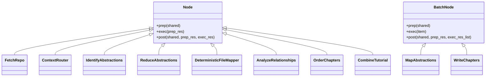

Quy trình luân chuyển dữ liệu và phân nhánh định tuyến ngữ cảnh giữa các nút xử lý được minh họa chi tiết trong sơ đồ luồng:

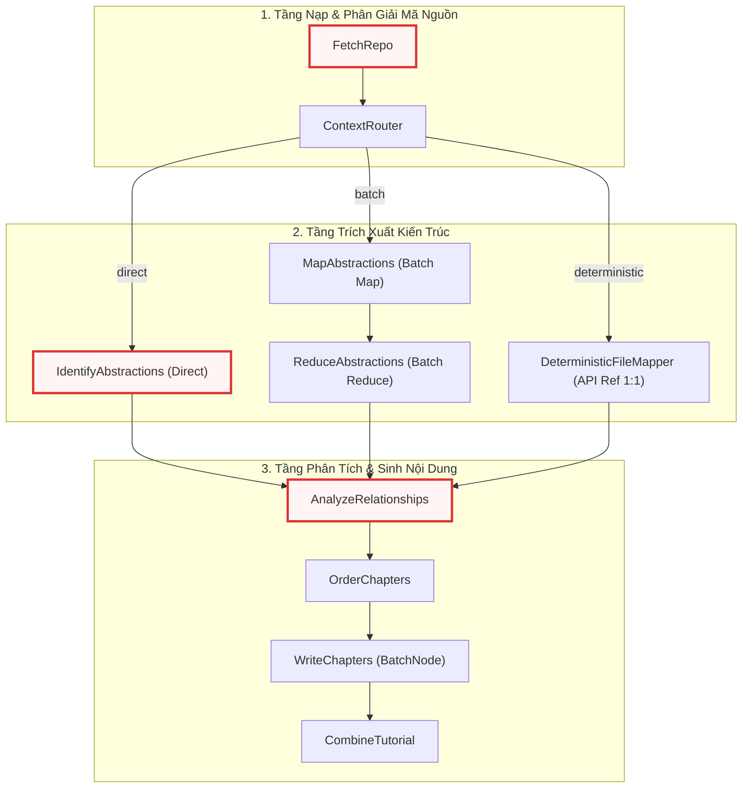

---

## Module-Level Functions

Module cung cấp 6 hàm trợ giúp độc lập không trạng thái phục vụ phân tích cây thư mục, trích xuất mã nguồn, xử lý mẫu prompt, bóc tách cấu trúc phản hồi và định lượng tài nguyên token.

### `build_directory_tree()`
**Visibility**: Public  
**Signature**: `def build_directory_tree(files_data: list[tuple[str, str]]) -> str:`

**Description**: Xây dựng biểu diễn chuỗi phân cấp thu gọn của cây thư mục dự án dựa trên danh sách các bộ nhị phân `(đường_dẫn, nội_dung)`. Hàm nhóm các tệp theo thư mục cha, gán kèm chỉ số định danh (`idx:i`) vào từng tên tệp, và sắp xếp theo thứ tự bảng chữ cái. Cấu trúc cây này cung cấp thông tin ngữ cảnh không gian giúp LLM hiểu được phân bố vật lý của dự án mà không cần đọc toàn bộ nội dung tệp.

**Parameters**:
* `files_data` (`list[tuple[str, str]]`): Danh sách các phần tử chứa đường dẫn tương đối và nội dung tệp mã nguồn.

**Returns**:
* `str`: Chuỗi văn bản nhiều dòng biểu diễn cây thư mục đã định dạng và đánh chỉ số.

**Raises**:
* Không có ngoại lệ tường minh.

**Example**:
```python
def build_directory_tree(files_data):
    from collections import defaultdict

    dir_files = defaultdict(list)
    for i, (path, _content) in enumerate(files_data):
        dirname = os.path.dirname(path) or "."
        basename = os.path.basename(path)
        dir_files[dirname].append(f"{basename} (idx:{i})")

    lines = []
    for dirname in sorted(dir_files.keys()):
        lines.append(f"{dirname}/")
        lines.extend(f"  {fname}" for fname in sorted(dir_files[dirname]))
    return "\n".join(lines)
```

Hàm sử dụng `collections.defaultdict` để gom nhóm các tệp tin theo khóa là đường dẫn thư mục cha (`os.path.dirname`). Trong trường hợp tệp nằm ở thư mục gốc, giá trị `"."` sẽ được áp dụng làm định danh mặc định. Mỗi tệp tin được gắn thẻ chỉ số tương ứng trong mảng `files_data` (`(idx:i)`), cho phép các mô hình LLM tham chiếu chéo chính xác vị trí tệp khi đưa ra quyết định phân nhóm trừu tượng hóa kiến trúc. Cây thư mục đầu ra được sắp xếp tăng dần theo tên thư mục và tên tệp nhằm bảo đảm tính tất định tuyệt đối giữa các lần chạy.

---

### `get_content_for_indices()`
**Visibility**: Public  
**Signature**: `def get_content_for_indices(files_data: list[tuple[str, str]], indices: list[int]) -> dict[str, str]:`

**Description**: Trích xuất nội dung văn bản thuần của các tệp tin dựa trên danh sách chỉ số chỉ định từ tập dữ liệu `files_data`. Hàm định dạng khóa của từ điển kết quả theo mẫu chuẩn `"{index} # {path}"`, cung cấp cả thông tin số thứ tự và đường dẫn ngữ cảnh cho các prompt suy luận của LLM.

**Parameters**:
* `files_data` (`list[tuple[str, str]]`): Danh sách toàn bộ các tệp mã nguồn nạp từ kho lưu trữ.
* `indices` (`list[int]`): Danh sách các chỉ số nguyên đại diện cho các tệp cần trích xuất.

**Returns**:
* `dict[str, str]`: Bảng ánh xạ từ chuỗi định danh chỉ số - đường dẫn sang nội dung mã nguồn của tệp.

**Raises**:
* Không có ngoại lệ tường minh; tự động bỏ qua các chỉ số nằm ngoài phạm vi danh sách.

**Example**:
```python
def get_content_for_indices(files_data, indices):
    content_map = {}
    for i in indices:
        if 0 <= i < len(files_data):
            path, content = files_data[i]
            content_map[f"{i} # {path}"] = content  # Use index + path as key for context
    return content_map
```

Hàm thực hiện việc kiểm tra biên phòng thủ `0 <= i < len(files_data)` trước khi truy xuất dữ liệu từ danh sách. Cơ chế này ngăn ngừa triệt để lỗi `IndexError` khi LLM sinh ra các chỉ số tệp ảo (hallucinated indices). Việc nhúng chuỗi định danh `"{i} # {path}"` làm khóa giúp LLM duy trì khả năng liên kết giữa chỉ số logic mà nó đã phân tích ở các bước trước với nội dung mã nguồn thực tế khi sinh nội dung chi tiết cho từng chương.

---

### `load_prompt_template()`
**Visibility**: Public  
**Signature**: `def load_prompt_template(template_name: str, advanced_mode: bool = False, mode: str | None = None) -> str:`

**Description**: Đọc và nạp nội dung tệp mẫu Markdown từ thư mục con tương ứng bên trong cấu trúc `prompts/`. Hàm hỗ trợ linh hoạt các chế độ tài liệu (`tutorial`, `advanced`, `sdk`, `api-reference`) bằng cách điều hướng chính xác đường dẫn thư mục mẫu.

**Parameters**:
* `template_name` (`str`): Tên định danh của tệp mẫu prompt (không bao gồm phần mở rộng `.md`).
* `advanced_mode` (`bool`): Cờ kích hoạt chế độ chuyên sâu (chỉ sử dụng khi `mode` là `None`). Mặc định là `False`.
* `mode` (`str | None`): Tên chế độ tài liệu tường minh quy định thư mục chứa prompt. Mặc định là `None`.

**Returns**:
* `str`: Toàn bộ nội dung chuỗi văn bản của tệp mẫu prompt.

**Raises**:
* `FileNotFoundError`: Khi không tìm thấy tệp mẫu prompt tương ứng trên ổ đĩa.
* `OSError`: Khi xảy ra lỗi truy xuất I/O trong quá trình mở tệp.

**Example**:
```python
def load_prompt_template(template_name, advanced_mode=False, mode=None):
    if mode is None:
        prompt_dir = "advanced" if advanced_mode else "tutorial"
    else:
        prompt_dir = mode

    path = os.path.join(os.path.dirname(os.path.abspath(__file__)), "prompts", prompt_dir, f"{template_name}.md")
    with open(path, encoding="utf-8-sig") as f:
        return f.read()
```

Hàm xác định đường dẫn tệp tuyệt đối thông qua việc bóc tách vị trí vật lý của `nodes.py` bằng `os.path.abspath(__file__)`. Tệp được mở với bảng mã `utf-8-sig` nhằm loại bỏ ký tự Byte Order Mark (BOM) nếu có, ngăn chặn các lỗi biến dạng ký tự ẩn làm sai lệch cấu trúc định dạng chuỗi của Python khi thực hiện phép nội suy `str.format()`. Cơ chế này cho phép hệ thống phân tách hoàn toàn nội dung chỉ thị prompt khỏi mã nguồn logic.

---

### `parse_yaml_response()`
**Visibility**: Public  
**Signature**: `def parse_yaml_response(response: str) -> dict | list | Any:`

**Description**: Bóc tách và chuyển đổi chuỗi phản hồi từ LLM chứa khối mã YAML được bao bọc trong các khối rào mã ````yaml ... ```` thành các đối tượng Python (`dict` hoặc `list`).

**Parameters**:
* `response` (`str`): Chuỗi văn bản thô nhận về từ API của mô hình ngôn ngữ lớn.

**Returns**:
* `dict | list | Any`: Cấu trúc dữ liệu đã được phân tích cú pháp an toàn bằng thư viện `yaml`.

**Raises**:
* `ValueError`: Ném ra khi không tìm thấy khối mã ````yaml```` hoặc dữ liệu YAML bên trong bị lỗi cú pháp không thể nạp.

**Example**:
```python
def parse_yaml_response(response):
    try:
        yaml_str = response.strip().split("```yaml")[1].split("```")[0].strip()
        return yaml.safe_load(yaml_str)
    except Exception as e:
        raise ValueError(f"Failed to parse YAML: {e}") from e
```

Hàm sử dụng giải thuật cắt chuỗi hai giai đoạn để cô lập khối dữ liệu giữa thẻ bắt đầu ````yaml` và thẻ đóng ````. Kỹ thuật này loại bỏ toàn bộ các câu thoại dẫn dắt hoặc kết luận không mong muốn mà LLM có thể tự ý sinh ra ngoài khối mã. Phương thức `yaml.safe_load` được sử dụng để ngăn chặn việc thực thi mã độc hại (Arbitrary Code Execution) có thể xảy ra khi phân tích cú pháp các đối tượng không đáng tin cậy. Nếu quá trình trích xuất thất bại, hàm đóng gói ngoại lệ gốc thành một `ValueError` kèm thông báo chi tiết để kích hoạt cơ chế thử lại của đồ thị.

---

### `create_token_counter()`
**Visibility**: Public  
**Signature**: `def create_token_counter() -> Callable[[str], int]:`

**Description**: Hàm nhà máy (Factory function) khởi tạo một hàm đếm token có độ chính xác cao dựa trên bảng mã BPE `cl100k_base` của `tiktoken`, tích hợp giải thuật suy đoán heuristic dự phòng khi môi trường gặp sự cố.

**Parameters**:
* Không có tham số.

**Returns**:
* `Callable[[str], int]`: Hàm tiếp nhận một chuỗi văn bản và trả về số lượng token ước tính dạng số nguyên.

**Raises**:
* Không ném ngoại lệ ra ngoài; tự động bắt mọi lỗi khởi tạo và chuyển đổi sang hàm dự phòng.

**Example**:
```python
def create_token_counter():
    try:
        enc = tiktoken.get_encoding("cl100k_base")
        return lambda text: len(enc.encode(text, disallowed_special=()))
    except Exception:
        return lambda text: len(text) // 4
```

Hàm áp dụng mẫu thiết kế Graceful Degradation (Suy thoái êm dịu). Khi `tiktoken` tải thành công bảng mã `cl100k_base`, hàm lambda trả về sẽ vô hiệu hóa kiểm tra token đặc biệt bằng cờ `disallowed_special=()`, ngăn chặn các ngoại lệ khi mã nguồn chứa các chuỗi như `<|endoftext|>`. Trong trường hợp môi trường không thể nạp bảng từ vựng hoặc thiếu tài nguyên bộ nhớ, hàm tự động chuyển sang giải thuật heuristic $1\text{ token} \approx 4\text{ ký tự}$ (`len(text) // 4`), đảm bảo quy trình đo lường không bao giờ làm gián đoạn luồng thực thi chính.

---

### `resolve_max_tokens()`
**Visibility**: Public  
**Signature**: `def resolve_max_tokens(shared: dict[str, Any]) -> int:`

**Description**: Phân giải giới hạn kích thước cửa sổ ngữ cảnh tối đa (`max_tokens`) cho phiên chạy. Hàm ưu tiên giá trị được cấu hình tường minh trong từ điển `shared`, nếu không có sẽ tự động suy đoán dựa trên biến môi trường của nhà cung cấp LLM hiện tại.

**Parameters**:
* `shared` (`dict[str, Any]`): Bảng lưu trữ trạng thái dùng chung của pipeline.

**Returns**:
* `int`: Số lượng token tối đa mà cửa sổ ngữ cảnh của mô hình mục tiêu có thể xử lý.

**Raises**:
* Không có ngoại lệ tường minh.

**Example**:
```python
def resolve_max_tokens(shared):
    max_tokens = shared.get("max_tokens")
    if max_tokens is not None:
        return max_tokens
    provider = os.environ.get("LLM_PROVIDER")
    if provider == "GEMINI" or not provider:
        endpoint = "https://generativelanguage.googleapis.com"
        model_name = os.getenv("GEMINI_MODEL", "gemini-3.7-flash")
        api_key = os.getenv("GEMINI_API_KEY", "")
    else:
        endpoint = os.environ.get(f"{provider}_BASE_URL", "")
        model_name = os.environ.get(f"{provider}_MODEL", "")
        api_key = os.environ.get(f"{provider}_API_KEY", "")
    return get_model_context_length(endpoint, model_name, api_key)
```

Hàm hoạt động theo cơ chế phân giải phân cấp (Hierarchical Fallback). Khi khóa `max_tokens` chưa được gán giá trị trong `shared`, hàm kiểm tra biến `LLM_PROVIDER`. Đối với nhà cung cấp mặc định hoặc `GEMINI`, hàm thiết lập endpoint của Google Generative Language API và nạp mô hình từ `GEMINI_MODEL`. Đối với các nhà cung cấp khác (như OpenAI, OpenRouter), hàm xây dựng biến môi trường động theo mẫu `{provider}_BASE_URL`, `{provider}_MODEL`, và `{provider}_API_KEY`, sau đó ủy quyền việc truy vấn kích thước ngữ cảnh cho hàm `get_model_context_length` từ module [Chương 2 — call_llm.py](02_call_llm_py.md).

---

## Class: `FetchRepo`

`FetchRepo` là nút nhập liệu đầu tiên trong đồ thị DAG, kế thừa từ lớp `Node`. Nút này chịu trách nhiệm thu thập toàn bộ các tệp mã nguồn từ kho lưu trữ GitHub từ xa hoặc thư mục tệp tin cục bộ, áp dụng các bộ lọc loại trừ/bao gồm, và chuyển đổi dữ liệu thành danh sách các bộ nhị phân chuẩn hóa lưu trong bảng trạng thái `shared`.

### `FetchRepo.prep()`
**Visibility**: Public  
**Signature**: `def prep(self, shared: dict[str, Any]) -> dict[str, Any]:`

**Description**: Trích xuất cấu hình nguồn mã nguồn, phân giải tên dự án (`project_name`) nếu chưa được thiết lập, và đóng gói các mẫu lọc (`include_patterns`, `exclude_patterns`, `max_file_size`) phục vụ tiến trình quét.

**Parameters**:
* `shared` (`dict[str, Any]`): Bảng trạng thái chia sẻ chứa thông tin URL kho lưu trữ hoặc đường dẫn thư mục cục bộ.

**Returns**:
* `dict[str, Any]`: Từ điển chứa toàn bộ tham số cấu hình nạp tệp đã được chuẩn hóa.

**Raises**:
* Không có ngoại lệ tường minh.

**Example**:
```python
class FetchRepo(Node):
    def prep(self, shared):
        repo_url = shared.get("repo_url")
        local_dir = shared.get("local_dir")
        project_name = shared.get("project_name")

        if not project_name:
            if repo_url:
                project_name = repo_url.split("/")[-1].replace(".git", "")
            else:
                project_name = os.path.basename(os.path.abspath(local_dir))
            shared["project_name"] = project_name

        include_patterns = shared["include_patterns"]
        exclude_patterns = shared["exclude_patterns"]
        max_file_size = shared["max_file_size"]

        return {
            "repo_url": repo_url,
            "local_dir": local_dir,
            "token": shared.get("github_token"),
            "include_patterns": include_patterns,
            "exclude_patterns": exclude_patterns,
            "max_file_size": max_file_size,
            "use_relative_paths": True,
        }
```

Phương thức kiểm tra sự tồn tại của `project_name` trong `shared`. Nếu bị khuyết, nó tự động trích xuất tên dự án từ phần cuối của URL GitHub (loại bỏ đuôi `.git`) hoặc lấy tên thư mục cuối cùng từ đường dẫn tuyệt đối của `local_dir`. Sau đó, nó gom nhóm toàn bộ các tham số quét tệp cần thiết thành một từ điển cấu hình và bàn giao cho giai đoạn `exec`.

---

### `FetchRepo.exec()`
**Visibility**: Public  
**Signature**: `def exec(self, prep_res: dict[str, Any]) -> list[tuple[str, str]]:`

**Description**: Thực thi việc thu thập mã nguồn bằng cách gọi module `crawl_github_files` (nếu có `repo_url`) hoặc `crawl_local_files` (nếu dùng `local_dir`). Chuyển đổi từ điển tệp tin thành danh sách các bộ `(đường_dẫn, nội_dung)`.

**Parameters**:
* `prep_res` (`dict[str, Any]`): Kết quả cấu hình từ phương thức `prep`.

**Returns**:
* `list[tuple[str, str]]`: Danh sách các phần tử nhị phân chứa đường dẫn tệp và nội dung văn bản thuần.

**Raises**:
* `ValueError`: Ném ra khi kết quả quét không tìm thấy bất kỳ tệp hợp lệ nào phù hợp với quy tắc lọc.

**Example**:
```python
    def exec(self, prep_res):
        source = prep_res["repo_url"] or prep_res["local_dir"]
        llm_logger.info(f"NODE EXEC | node=FetchRepo | action=crawl_files | source={source}")

        if prep_res["repo_url"]:
            emit("CRAWL_REPOSITORY", url=prep_res["repo_url"])
            result = crawl_github_files(
                repo_url=prep_res["repo_url"],
                token=prep_res["token"],
                include_patterns=prep_res["include_patterns"],
                exclude_patterns=prep_res["exclude_patterns"],
                max_file_size=prep_res["max_file_size"],
                use_relative_paths=prep_res["use_relative_paths"],
            )
        else:
            emit("CRAWL_DIRECTORY", path=prep_res["local_dir"])
            result = crawl_local_files(
                directory=prep_res["local_dir"],
                include_patterns=prep_res["include_patterns"],
                exclude_patterns=prep_res["exclude_patterns"],
                max_file_size=prep_res["max_file_size"],
                use_relative_paths=prep_res["use_relative_paths"],
            )

        files_list = list(result.get("files", {}).items())
        if len(files_list) == 0:
            raise ValueError("No matching files found. Check your directory and include/exclude patterns.")

        llm_logger.info(f"NODE COMPLETE | node=FetchRepo | files_found={len(files_list)}")
        return files_list
```

Phương thức thực hiện rẽ nhánh thu thập dữ liệu dựa trên nguồn đầu vào. Đối với kho lưu trữ từ xa, nó ủy quyền xử lý cho `crawl_github_files` từ [Chương 3 — crawl_github_files.py](03_crawl_github_files_py.md). Đối với thư mục nội bộ, nó gọi `crawl_local_files` từ [Chương 4 — crawl_local_files.py](04_crawl_local_files_py.md). Kết quả trả về từ bộ quét được chuyển đổi từ dạng từ điển `dict[path, content]` sang danh sách các tuple `[(path, content), ...]`. Nếu danh sách rỗng, phương thức lập tức ném lỗi `ValueError` để chặn đứng pipeline trước khi tiêu tốn tài nguyên suy luận LLM.

---

### `FetchRepo.post()`
**Visibility**: Public  
**Signature**: `def post(self, shared: dict[str, Any], prep_res: dict[str, Any], exec_res: list[tuple[str, str]]) -> None:`

**Description**: Lưu trữ danh sách tệp mã nguồn thu thập được vào bảng trạng thái `shared["files"]`.

**Parameters**:
* `shared` (`dict[str, Any]`): Bảng trạng thái chia sẻ toàn cục.
* `prep_res` (`dict[str, Any]`): Kết quả trả về từ `prep`.
* `exec_res` (`list[tuple[str, str]]`): Danh sách các tệp mã nguồn thu thập được từ `exec`.

**Returns**:
* `None`

**Raises**:
* Không có ngoại lệ tường minh.

**Example**:
```python
    def post(self, shared, prep_res, exec_res):
        shared["files"] = exec_res  # List of (path, content) tuples
```

Phương thức thực hiện thao tác gán trực tiếp danh sách tệp vào khóa `"files"` của từ điển `shared`, làm tiền đề dữ liệu đầu vào cho các nút phân tích kích thước ngữ cảnh và trích xuất cấu trúc tiếp theo trong đồ thị.

---

## Class: `ContextRouter`

`ContextRouter` là nút định tuyến logic điều kiện quan trọng nhất của hệ thống, kế thừa từ lớp `Node`. Nút này tính toán tổng dung lượng token của toàn bộ dự án, đối soát với giới hạn an toàn của mô hình LLM, và quyết định rẽ nhánh luồng công việc theo một trong ba chiến lược: `deterministic` (ánh xạ tệp 1:1), `direct` (xử lý toàn bộ trong một lượt), hoặc `batch` (chia lô theo cấu trúc thư mục).

### `ContextRouter.prep()`
**Visibility**: Public  
**Signature**: `def prep(self, shared: dict[str, Any]) -> tuple:`

**Description**: Đo lường chi phí token cố định của prompt (mẫu prompt, cây thư mục, danh mục chỉ số tệp) và nội dung của toàn bộ các tệp tin. Thiết lập ngưỡng an toàn bằng 95% `max_tokens` và tính toán giới hạn hiệu dụng (`effective_limit`). Xác định hành động định tuyến ban đầu.

**Parameters**:
* `shared` (`dict[str, Any]`): Bảng trạng thái chia sẻ chứa dữ liệu tệp và cấu hình chế độ.

**Returns**:
* `tuple`: Bộ dữ liệu gồm hành vi định tuyến (`route`), danh sách tệp, giới hạn hiệu dụng, kích thước lô, mảng token từng tệp, hàm đếm token, cây thư mục, và cờ gỡ lỗi.

**Raises**:
* Không có ngoại lệ tường minh.

**Example**:
```python
class ContextRouter(Node):
    def prep(self, shared):
        files_data = shared["files"]
        max_tokens = resolve_max_tokens(shared)
        shared["max_tokens"] = max_tokens

        count_tokens = create_token_counter()
        # // ... [Tính toán chi phí prompt_overhead từ template, directory tree, và listing] ...

        prompt_overhead = max_template_tokens + tree_tokens + listing_tokens
        # // ... [Tính tổng total_tokens và xây dựng file_token_map] ...

        safety_limit = int(max_tokens * 0.95)
        effective_limit = safety_limit - prompt_overhead
        force_batch = shared.get("force_batch", False)

        if shared.get("mode", "tutorial") == "api-reference":
            emit("CAPACITY_API_REF_MODE")
            return ("deterministic", files_data, effective_limit, shared.get("batch_size", 50), None, None, directory_tree, False)

        if total_tokens > effective_limit or force_batch:
            # // ... [Phát thông báo emit tương ứng] ...
            return ("batch", files_data, effective_limit, shared.get("batch_size", 50), file_token_map, count_tokens, directory_tree, shared.get("debug", False))

        return ("direct", files_data, effective_limit, shared.get("batch_size", 50), None, None, directory_tree, False)
```

Giai đoạn `prep` thực hiện giải thuật định lượng tài nguyên phòng thủ chặt chẽ. Nó tính toán chi phí token tĩnh phát sinh từ mẫu prompt dài nhất giữa các chế độ, chuỗi cây thư mục và danh sách chỉ mục tệp tin (`prompt_overhead`). Ngưỡng an toàn tuyệt đối được chốt ở mức $95\%$ kích thước ngữ cảnh tối đa của mô hình (`safety_limit`), từ đó suy ra dung lượng thực tế dành cho mã nguồn (`effective_limit = safety_limit - prompt_overhead`). Nếu người dùng yêu cầu chế độ `api-reference`, nút lập tức chuyển sang nhánh `"deterministic"`. Nếu tổng token vượt quá giới hạn hiệu dụng hoặc cờ `force_batch` được kích hoạt, luồng sẽ chuyển sang `"batch"`; ngược lại, nếu toàn bộ mã nguồn nằm trong giới hạn an toàn, nhánh `"direct"` sẽ được chọn.

---

### `ContextRouter.exec()`
**Visibility**: Public  
**Signature**: `def exec(self, prep_res: tuple) -> str | list[list[tuple[int, str, str]]]:`

**Description**: Xử lý logic chia lô thông minh bảo toàn tính liên kết ngữ cảnh theo thư mục (Directory-Aware Batching). Gom nhóm các tệp theo thư mục cha và phân bổ vào từng lô sao cho không bao giờ trộn lẫn các thư mục khác nhau và không vượt quá `effective_limit` hoặc `batch_size`.

**Parameters**:
* `prep_res` (`tuple`): Dữ liệu tính toán dung lượng ngữ cảnh từ `prep`.

**Returns**:
* `str | list[list[tuple[int, str, str]]]`: Chuỗi định tuyến `"direct"` / `"deterministic"`, hoặc danh sách các lô tệp tin sẵn sàng cho `MapAbstractions`.

**Raises**:
* Không có ngoại lệ tường minh.

**Example**:
```python
    def exec(self, prep_res):
        route, files_data, effective_limit, batch_size, file_token_map, _count_tokens, directory_tree, debug = prep_res
        if route in ("direct", "deterministic"):
            return route

        dir_groups = defaultdict(list)
        for i, (path, content) in enumerate(files_data):
            dir_groups[os.path.dirname(path)].append((i, path, content, file_token_map[i]))

        batches = []
        for dirname in sorted(dir_groups.keys()):
            current_batch = []
            current_tokens = 0

            for i, path, content, tokens in dir_groups[dirname]:
                if current_batch and (current_tokens + tokens > effective_limit or len(current_batch) >= batch_size):
                    batches.append(current_batch)
                    current_batch = []
                    current_tokens = 0

                current_batch.append((i, path, content))
                current_tokens += tokens

            if current_batch:
                batches.append(current_batch)

        self._directory_tree = directory_tree
        return batches
```

Phương thức giải quyết bài toán phân mảnh ngữ cảnh bằng cách phân nhóm toàn bộ tệp tin theo đường dẫn thư mục (`dir_groups`). Khi duyệt qua từng thư mục, hệ thống tích lũy các tệp vào `current_batch` kèm theo số lượng token đã tính trước. Một lô mới chỉ được khởi tạo khi việc bổ sung thêm một tệp sẽ làm vượt quá giới hạn `effective_limit` hoặc chạm trần số lượng tệp `batch_size`. Đặc biệt, các tệp trong cùng một thư mục luôn được ưu tiên đóng gói chung, ngăn ngừa hiện tượng mất mát ngữ cảnh cấu trúc khi gửi dữ liệu sang các tiến trình phân tích song song.

---

### `ContextRouter.post()`
**Visibility**: Public  
**Signature**: `def post(self, shared: dict[str, Any], prep_res: tuple, exec_res: Any) -> str:`

**Description**: Cập nhật danh sách các lô tệp (`file_batches`) và chuỗi cây thư mục (`directory_tree`) vào từ điển `shared`. Trả về định danh hành động điều hướng cho đồ thị DAG (`"direct"`, `"deterministic"`, hoặc `"batch"`).

**Parameters**:
* `shared` (`dict[str, Any]`): Bảng trạng thái chia sẻ toàn cục.
* `prep_res` (`tuple`): Dữ liệu chuẩn bị từ `prep`.
* `exec_res` (`Any`): Kết quả định tuyến hoặc danh sách các lô tệp từ `exec`.

**Returns**:
* `str`: Nhãn chuyển tiếp nhánh điều hướng của đồ thị `PocketFlow`.

**Raises**:
* Không có ngoại lệ tường minh.

**Example**:
```python
    def post(self, shared, prep_res, exec_res):
        if exec_res == "direct":
            return "direct"
        if exec_res == "deterministic":
            return "deterministic"
        shared["file_batches"] = exec_res
        shared["directory_tree"] = getattr(self, "_directory_tree", build_directory_tree(shared["files"]))
        return "batch"
```

Phương thức đóng vai trò là cổng điều hướng luồng dữ liệu (Flow Gate). Nó kiểm tra kết quả trả về từ `exec`: nếu là chuỗi định tuyến đơn lẻ, nó lập tức hoàn trả giá trị để kích hoạt nhánh chuyển tiếp tương ứng trong DAG của `flow.py`. Trong trường hợp chạy theo lô, nó lưu mảng các lô tệp vào `shared["file_batches"]`, đính kèm cây thư mục đại diện vào `shared["directory_tree"]`, và trả về chuỗi hành động `"batch"`.

---

## Class: `DeterministicFileMapper`

`DeterministicFileMapper` kế thừa từ `Node`, là thành phần cốt lõi xử lý chế độ tham chiếu API tất định (`api-reference`). Nút này sử dụng LLM để lọc bỏ các tệp không chứa mã nguồn thực tế (tệp cấu hình, văn bản tĩnh), sau đó tự động thiết lập ánh xạ quan hệ 1:1 giữa mỗi tệp mã nguồn hợp lệ và một chương tài liệu, sắp xếp thứ tự xử lý theo độ sâu thư mục (từ lá lên gốc).

### `DeterministicFileMapper.prep()`
**Visibility**: Public  
**Signature**: `def prep(self, shared: dict[str, Any]) -> tuple[str, bool, str | None, int]:`

**Description**: Xây dựng danh sách toàn bộ các tệp tin kèm chỉ số định danh và gọi hàm `build_code_file_filter_prompt` từ [Chương 7 — prompts.py](07_prompts_py.md) để tạo câu lệnh yêu cầu LLM xác định các tệp mã nguồn thực thụ.

**Parameters**:
* `shared` (`dict[str, Any]`): Bảng trạng thái chia sẻ.

**Returns**:
* `tuple[str, bool, str | None, int]`: Bộ 4 phần tử gồm chuỗi prompt lọc tệp, cờ sử dụng cache, mức độ suy luận thinking, và giới hạn token tối đa.

**Raises**:
* Không có ngoại lệ tường minh.

**Example**:
```python
class DeterministicFileMapper(Node):
    def prep(self, shared):
        files_data = shared["files"]
        project_name = shared["project_name"]

        file_listing = "\n".join([f"{i} # {path}" for i, (path, _) in enumerate(files_data)])

        prompt = build_code_file_filter_prompt(project_name, file_listing)
        return prompt, shared.get("use_cache", True), shared.get("thinking_level", None), shared.get("max_tokens", 100000)
```

Phương thức duyệt qua toàn bộ danh sách `files_data`, chuyển đổi thành chuỗi liệt kê chỉ số định danh kết hợp đường dẫn theo mẫu `"{i} # {path}"`. Chuỗi này được đưa vào hàm tiện ích `build_code_file_filter_prompt` để sinh câu lệnh yêu cầu LLM phân tích phần mở rộng và ngữ cảnh đường dẫn, nhằm lọc bỏ các tệp cấu hình không cần thiết trước khi bước vào giai đoạn ánh xạ chi tiết.

---

### `DeterministicFileMapper.exec()`
**Visibility**: Public  
**Signature**: `def exec(self, prep_res: tuple) -> list[int]:`

**Description**: Gửi prompt lọc tệp tới LLM qua hàm `call_llm`, phân tích cú pháp khối YAML trả về thành danh sách các chỉ số nguyên của những tệp mã nguồn hợp lệ.

**Parameters**:
* `prep_res` (`tuple`): Bộ tham số chuẩn bị từ `prep`.

**Returns**:
* `list[int]`: Danh sách các chỉ số tệp mã nguồn đã được thẩm định.

**Raises**:
* `Exception`: Bắt mọi lỗi trong quá trình gọi LLM hoặc phân tích YAML, ghi nhật ký chi tiết qua `llm_logger` và ném lại ngoại lệ để kích hoạt cơ chế retry của `PocketFlow`.

**Example**:
```python
    def exec(self, prep_res):
        try:
            prompt, use_cache, thinking_level, max_tokens = prep_res
            emit("LLM_CALL_FILTER_FILES")
            log_token_estimation(self.__class__.__name__, prompt, max_tokens)
            response = call_llm(prompt, use_cache=(use_cache and self.cur_retry == 0), thinking_level=thinking_level)
            valid_indices = parse_yaml_response(response)
            if not isinstance(valid_indices, list):
                valid_indices = []
            return [int(idx) for idx in valid_indices]
        except Exception as e:
            emit("NODE_RETRY_ERROR", class_name=self.__class__.__name__, error=e)
            llm_logger.error(f"[Node {self.__class__.__name__}] Error: {e}", exc_info=True)
            raise e
```

Phương thức sử dụng `log_token_estimation` từ [Chương 8 — token_utils.py](08_token_utils_py.md) để ghi nhận dung lượng ngữ cảnh trước khi gọi `call_llm`. Kết quả phản hồi được chuyển qua hàm `parse_yaml_response`. Đoạn mã thực hiện kiểm tra an toàn kiểu dữ liệu bằng `isinstance(valid_indices, list)` và ép kiểu toàn bộ phần tử sang số nguyên (`int(idx)`), loại bỏ triệt để các định dạng chuỗi không hợp lệ có thể gây lỗi chỉ mục mảng về sau.

---

### `DeterministicFileMapper.post()`
**Visibility**: Public  
**Signature**: `def post(self, shared: dict[str, Any], prep_res: tuple, exec_res: list[int]) -> str:`

**Description**: Khởi tạo danh sách các module trừu tượng hóa 1:1 cho từng tệp hợp lệ, sắp xếp thứ tự chương (`chapter_order`) theo độ sâu thư mục (từ sâu nhất đến nông nhất, sau đó theo bảng chữ cái), và gán cấu trúc quan hệ mặc định vào `shared`.

**Parameters**:
* `shared` (`dict[str, Any]`): Bảng trạng thái chia sẻ toàn cục.
* `prep_res` (`tuple`): Dữ liệu từ `prep`.
* `exec_res` (`list[int]`): Danh sách các chỉ số tệp hợp lệ từ `exec`.

**Returns**:
* `str`: Luôn trả về chuỗi `"default"`.

**Raises**:
* Không có ngoại lệ tường minh.

**Example**:
```python
    def post(self, shared, prep_res, exec_res):
        import os

        files = shared.get("files", [])
        valid_indices = set(exec_res)
        modules = []
        chapter_order = []

        for idx, (file_path, _content) in enumerate(files):
            if idx not in valid_indices:
                emit("SKIP_NON_CODE_FILE", path=file_path)
                continue

            clean_name = os.path.basename(file_path)
            modules.append(
                {"name": clean_name, "description": f"Internal API reference for `{file_path}`", "files": [idx], "original_path": file_path}
            )
            chapter_order.append(len(modules) - 1)

        shared["abstractions"] = modules
        shared["chapter_order"] = sorted(
            chapter_order,
            key=lambda idx: (
                -modules[idx]["original_path"].count("/") - modules[idx]["original_path"].count(os.sep),
                modules[idx]["original_path"].lower(),
            ),
        )
        shared["relationships"] = {"summary": "Deterministic Internal API Reference.", "details": []}
        emit("DONE_DETERMINISTIC_MAPPER", count=len(modules))
        return "default"
```

Phương thức triển khai chiến lược sắp xếp thứ tự chương mang tính quyết định: các tệp ở tầng thư mục sâu nhất (các tệp lá/tiện ích như `utils/`) sẽ được ưu tiên đưa lên xử lý trước các tệp điều phối ở tầng ngoài (như `main.py`). Bằng cách đếm số lượng dấu phân cách thư mục (`/` và `os.sep`) và lấy giá trị đối âm làm khóa chính, hệ thống đảm bảo rằng khi LLM sinh tài liệu cho các module điều phối cấp cao, bản tóm tắt kỹ thuật của toàn bộ các module phụ thuộc tầng dưới đã có sẵn trong bộ nhớ ngữ cảnh.

---

## Class: `IdentifyAbstractions`

`IdentifyAbstractions` kế thừa từ `Node`, là nút trích xuất kiến trúc áp dụng cho luồng xử lý trực tiếp (`direct path`). Nút này xây dựng ngữ cảnh toàn bộ dự án (nằm trong giới hạn an toàn), gọi LLM để nhận diện các khái niệm trừu tượng hóa cốt lõi, và xác thực tính hợp lệ của các chỉ số tệp liên quan.

### `IdentifyAbstractions.prep()`
**Visibility**: Public  
**Signature**: `def prep(self, shared: dict[str, Any]) -> tuple:`

**Description**: Xây dựng chuỗi ngữ cảnh mã nguồn tích lũy tôn trọng giới hạn an toàn token, tạo chuỗi cây thư mục dự án, và đóng gói toàn bộ 11 tham số cần thiết cho quá trình gọi mô hình.

**Parameters**:
* `shared` (`dict[str, Any]`): Bảng trạng thái chia sẻ.

**Returns**:
* `tuple`: Bộ 11 phần tử chứa ngữ cảnh mã nguồn, cây thư mục, tổng số tệp, tên dự án, ngôn ngữ, cờ cache, số lượng trừu tượng hóa tối đa, mức độ suy luận, cờ chế độ nâng cao, giới hạn token và chế độ tài liệu.

**Raises**:
* Không có ngoại lệ tường minh.

**Example**:
```python
class IdentifyAbstractions(Node):
    def prep(self, shared):
        files_data = shared["files"]
        project_name = shared["project_name"]
        language = shared.get("language", "english")
        use_cache = shared.get("use_cache", True)
        max_abstraction_num = shared.get("max_abstraction_num", 10)
        thinking_level = shared.get("thinking_level", None)

        def create_llm_context(files_data):
            max_tokens = resolve_max_tokens(shared)
            safety_limit = int(max_tokens * 0.95)
            count_tokens = create_token_counter()
            context = ""
            current_tokens = 0

            for i, (path, content) in enumerate(files_data):
                entry = f"--- File Index {i}: {path} ---\n{content}\n\n"
                entry_tokens = count_tokens(entry)
                if current_tokens + entry_tokens > safety_limit:
                    emit("WARN_CONTEXT_TRUNCATED", index=i, path=path, limit=safety_limit)
                    break
                context += entry
                current_tokens += entry_tokens
            return context

        context = create_llm_context(files_data)
        directory_tree = build_directory_tree(files_data)
        return (
            context, directory_tree, len(files_data), project_name, language,
            use_cache, max_abstraction_num, thinking_level,
            shared.get("advanced_mode", False), shared.get("max_tokens", 100000), shared.get("mode", "tutorial")
        )
```

Hàm cục bộ `create_llm_context` lặp qua từng tệp trong `files_data`, tính toán kích thước token của từng khối và cộng dồn vào chuỗi `context`. Nếu việc thêm một tệp làm tổng token vượt quá ngưỡng `safety_limit`, vòng lặp sẽ dừng ngay lập tức và phát cảnh báo `"WARN_CONTEXT_TRUNCATED"`. Kỹ thuật phòng thủ này ngăn chặn hoàn toàn lỗi tràn cửa sổ ngữ cảnh khi gọi API LLM ở bước `exec`.

---

### `IdentifyAbstractions.exec()`
**Visibility**: Public  
**Signature**: `def exec(self, prep_res: tuple) -> list[dict[str, Any]]:`

**Description**: Nạp mẫu prompt `identify_abstractions`, định dạng các tham số đa ngôn ngữ, gửi yêu cầu tới LLM, và tiến hành kiểm tra cấu trúc nghiêm ngặt cùng giải thuật bóc tách dải chỉ số tệp tin (hỗ trợ định dạng khoảng `start-end`).

**Parameters**:
* `prep_res` (`tuple`): Bộ 11 tham số từ `prep`.

**Returns**:
* `list[dict[str, Any]]`: Danh sách các đối tượng trừu tượng hóa hợp lệ gồm `name`, `description`, và mảng chỉ số tệp `files`.

**Raises**:
* `ValueError`: Ném ra khi kết quả từ LLM không phải dạng danh sách hoặc thiếu các trường bắt buộc (`name`, `description`, `file_indices`).
* `Exception`: Bắt các lỗi hạ tầng khác và ném lại để kích hoạt cơ chế retry.

**Example**:
```python
    def exec(self, prep_res):
        try:
            (context, directory_tree, total_files_count, project_name, language,
             use_cache, max_abstraction_num, thinking_level, _advanced_mode, max_tokens, mode) = prep_res

            # // ... [Cấu hình chỉ thị ngôn ngữ và nạp template] ...
            response = call_llm(prompt, use_cache=(use_cache and self.cur_retry == 0), thinking_level=thinking_level)
            abstractions = parse_yaml_response(response)

            validated_abstractions = []
            for item in abstractions:
                # // ... [Kiểm tra kiểu dữ liệu name, description, file_indices] ...
                validated_indices = []
                for idx_entry in item["file_indices"]:
                    try:
                        idx_str = str(idx_entry).split("#")[0].strip()
                        if "-" in idx_str:
                            parts = idx_str.split("-")
                            if len(parts) == 2:
                                start_idx = int(re.findall(r"\d+", parts[0])[0])
                                end_idx = int(re.findall(r"\d+", parts[1])[0])
                                validated_indices.extend(idx for idx in range(start_idx, end_idx + 1) if 0 <= idx < total_files_count)
                                continue
                        nums = re.findall(r"\d+", idx_str)
                        if nums:
                            idx = int(nums[0])
                            if 0 <= idx < total_files_count:
                                validated_indices.append(idx)
                    except (ValueError, TypeError, IndexError):
                        continue

                item["files"] = sorted(set(validated_indices))
                validated_abstractions.append({"name": item["name"], "description": item["description"], "files": item["files"]})
            return validated_abstractions
        except Exception as e:
            emit("NODE_RETRY_ERROR", class_name=self.__class__.__name__, error=e)
            llm_logger.error(f"[Node {self.__class__.__name__}] Error: {e}", exc_info=True)
            raise e
```

Phương thức triển khai bộ giải mã chỉ số tệp cực kỳ linh hoạt bằng biểu thức chính quy (`re`). Nó hỗ trợ phân tích cả các mục chỉ số đơn lẻ kèm chú thích (ví dụ `"0 # main.py"`), các số nguyên thuần túy, và đặc biệt là các dải chỉ số mở rộng (ví dụ `"2-5"`). Toàn bộ chỉ số được thẩm định nằm trong khoảng `[0, total_files_count - 1]`, loại bỏ các phần tử trùng lặp thông qua cấu trúc `set`, và sắp xếp tăng dần nhằm đảm bảo tính toàn vẹn dữ liệu.

---

### `IdentifyAbstractions.post()`
**Visibility**: Public  
**Signature**: `def post(self, shared: dict[str, Any], prep_res: tuple, exec_res: list[dict[str, Any]]) -> None:`

**Description**: Ghi danh sách các khái niệm trừu tượng hóa đã xác thực vào `shared["abstractions"]`.

**Parameters**:
* `shared` (`dict[str, Any]`): Bảng trạng thái chia sẻ toàn cục.
* `prep_res` (`tuple`): Kết quả từ `prep`.
* `exec_res` (`list[dict[str, Any]]`): Kết quả trừu tượng hóa từ `exec`.

**Returns**:
* `None`

**Raises**:
* Không có ngoại lệ tường minh.

**Example**:
```python
    def post(self, shared, prep_res, exec_res):
        shared["abstractions"] = exec_res  # List of {"name": str, "description": str, "files": [int]}
```

Dữ liệu được lưu trữ trực tiếp dưới dạng danh sách các từ điển chuẩn hóa `{"name": str, "description": str, "files": list[int]}`, sẵn sàng làm đầu vào cho bước phân tích quan hệ kiến trúc `AnalyzeRelationships`.

---

## Class: `MapAbstractions`

`MapAbstractions` kế thừa từ `BatchNode`, đại diện cho pha Map trong mô hình Map-Reduce áp dụng cho các kho mã nguồn lớn. Nút này nhận danh sách các lô tệp tin từ `file_batches` và thực hiện nhận diện các khái niệm trừu tượng hóa cục bộ trên từng lô một cách độc lập.

### `MapAbstractions.prep()`
**Visibility**: Public  
**Signature**: `def prep(self, shared: dict[str, Any]) -> list[dict[str, Any]]:`

**Description**: Biến đổi mảng các lô tệp `shared["file_batches"]` thành danh sách các đối tượng cấu hình độc lập phục vụ cho quá trình thực thi song song hoặc lặp theo lô của `BatchNode`.

**Parameters**:
* `shared` (`dict[str, Any]`): Bảng trạng thái chia sẻ.

**Returns**:
* `list[dict[str, Any]]`: Danh sách các mục công việc cấu hình cho từng lô.

**Raises**:
* Không có ngoại lệ tường minh.

**Example**:
```python
class MapAbstractions(BatchNode):
    def prep(self, shared):
        return [
            {
                "batch_index": i,
                "files": batch,
                "project_name": shared["project_name"],
                "language": shared.get("language", "english"),
                "use_cache": shared.get("use_cache", True),
                "thinking_level": shared.get("thinking_level", None),
                "advanced_mode": shared.get("advanced_mode", False),
                "max_tokens": shared.get("max_tokens", 100000),
                "directory_tree": shared.get("directory_tree", ""),
                "mode": shared.get("mode", "tutorial"),
            }
            for i, batch in enumerate(shared["file_batches"])
        ]
```

Phương thức ánh xạ từng phần tử trong `shared["file_batches"]` thành một từ điển đóng gói đầy đủ ngữ cảnh dự án: chỉ số lô, danh sách tệp của lô, cây thư mục toàn cục, và các thiết lập mô hình. Nhờ đó, mỗi phiên thực thi `exec` của `BatchNode` hoàn toàn độc lập và không phụ thuộc vào trạng thái của các lô khác.

---

### `MapAbstractions.exec()`
**Visibility**: Public  
**Signature**: `def exec(self, item: dict[str, Any]) -> list[dict[str, Any]]:`

**Description**: Định dạng ngữ cảnh mã nguồn cho riêng lô hiện tại, nạp mẫu `map_abstractions`, gửi yêu cầu tới LLM, và bóc tách các khái niệm trừu tượng hóa cục bộ kèm xác thực chỉ số tệp.

**Parameters**:
* `item` (`dict[str, Any]`): Cấu hình công việc của một lô duy nhất từ `prep`.

**Returns**:
* `list[dict[str, Any]]`: Danh sách các đối tượng trừu tượng hóa cục bộ tìm thấy trong lô.

**Raises**:
* `Exception`: Bắt và ném lại các ngoại lệ phát sinh trong quá trình gọi LLM hoặc phân tích kết quả.

**Example**:
```python
    def exec(self, item):
        batch_index = item["batch_index"]
        files = item["files"]
        emit("LLM_CALL_MAP_ABSTRACTIONS", batch_index=batch_index, file_count=len(files))

        context = "".join(f"--- File Index {i}: {path} ---\n{content}\n\n" for i, path, content in files)
        prompt_template = load_prompt_template("map_abstractions", mode=item.get("mode", "tutorial"))

        # // ... [Nội suy prompt kèm chỉ thị ngôn ngữ và ghi nhật ký token] ...
        response = call_llm(prompt, use_cache=(item["use_cache"] and self.cur_retry == 0), thinking_level=item["thinking_level"])
        abstractions = parse_yaml_response(response)

        validated_abstractions = []
        if isinstance(abstractions, list):
            for obj in abstractions:
                if isinstance(obj, dict) and "name" in obj and "description" in obj and "file_indices" in obj:
                    import re
                    validated_indices = []
                    for idx_entry in obj["file_indices"]:
                        nums = re.findall(r"\d+", str(idx_entry))
                        if nums:
                            validated_indices.append(int(nums[0]))
                    if validated_indices:
                        validated_abstractions.append(
                            {"name": obj["name"], "description": obj["description"], "files": sorted(set(validated_indices))}
                        )
        return validated_abstractions
```

Phương thức xây dựng chuỗi `context` từ các tệp thuộc phạm vi lô hiện tại, kết hợp với chuỗi `directory_tree` toàn cục nhằm cung cấp cho LLM cái nhìn tổng quan về vị trí của lô trong toàn bộ dự án. Sau khi nhận phản hồi từ LLM, mã sử dụng biểu thức chính quy để trích xuất số nguyên từ `file_indices`, bảo đảm các chỉ số tệp được lưu trữ dưới dạng mảng số nguyên duy nhất đã sắp xếp.

---

### `MapAbstractions.post()`
**Visibility**: Public  
**Signature**: `def post(self, shared: dict[str, Any], prep_res: Any, exec_res_list: list[list[dict[str, Any]]]) -> None:`

**Description**: Gộp toàn bộ danh sách các trừu tượng hóa cục bộ từ tất cả các lô thực thi thành một danh sách duy nhất và lưu vào `shared["mapped_abstractions"]`.

**Parameters**:
* `shared` (`dict[str, Any]`): Bảng trạng thái chia sẻ toàn cục.
* `prep_res` (`Any`): Kết quả từ `prep`.
* `exec_res_list` (`list[list[dict[str, Any]]]`): Danh sách chứa kết quả trả về của từng lô từ `exec`.

**Returns**:
* `None`

**Raises**:
* Không có ngoại lệ tường minh.

**Example**:
```python
    def post(self, shared, prep_res, exec_res_list):
        all_abstractions = []
        for batch_abs in exec_res_list:
            all_abstractions.extend(batch_abs)
        shared["mapped_abstractions"] = all_abstractions
```

Phương thức duyệt qua mảng lồng nhau `exec_res_list` (trong đó mỗi phần tử là kết quả của một lô `MapAbstractions`), làm phẳng (flatten) thành một danh sách duy nhất `all_abstractions`, và cập nhật vào khóa `"mapped_abstractions"` của bộ nhớ chia sẻ để chuẩn bị cho pha thu gọn tại `ReduceAbstractions`.

---

## Class: `ReduceAbstractions`

`ReduceAbstractions` kế thừa từ `Node`, là giai đoạn Reduce trong mô hình xử lý kho mã nguồn lớn. Nút này nhận toàn bộ các trừu tượng hóa cục bộ được sinh ra từ pha Map, gửi tới LLM để loại bỏ trùng lặp, hợp nhất các khái niệm tương đồng, và tinh chỉnh thành danh sách tối đa `max_abstraction_num` khái niệm toàn cục.

### `ReduceAbstractions.prep()`
**Visibility**: Public  
**Signature**: `def prep(self, shared: dict[str, Any]) -> tuple:`

**Description**: Trích xuất `mapped_abstractions` và các thiết lập cấu hình từ `shared`, đóng gói thành bộ tham số đầu vào cho `exec`.

**Parameters**:
* `shared` (`dict[str, Any]`): Bảng trạng thái chia sẻ.

**Returns**:
* `tuple`: Bộ 9 tham số gồm danh sách trừu tượng hóa cục bộ, tên dự án, ngôn ngữ, cờ cache, số lượng trừu tượng hóa tối đa, mức độ suy luận, cờ nâng cao, giới hạn token và chế độ tài liệu.

**Raises**:
* Không có ngoại lệ tường minh.

**Example**:
```python
class ReduceAbstractions(Node):
    def prep(self, shared):
        return (
            shared["mapped_abstractions"],
            shared["project_name"],
            shared.get("language", "english"),
            shared.get("use_cache", True),
            shared.get("max_abstraction_num", 10),
            shared.get("thinking_level", None),
            shared.get("advanced_mode", False),
            shared.get("max_tokens", 100000),
            shared.get("mode", "tutorial"),
        )
```

Phương thức thu thập kết quả trung gian từ bước Map (`mapped_abstractions`) cùng với các ràng buộc về số lượng chương mong muốn (`max_abstraction_num`, mặc định là 10) để bàn giao cho bước tinh gọn tiếp theo.

---

### `ReduceAbstractions.exec()`
**Visibility**: Public  
**Signature**: `def exec(self, prep_res: tuple) -> list[dict[str, Any]]:`

**Description**: Định dạng danh sách các trừu tượng hóa cục bộ thành chuỗi ngữ cảnh, nạp mẫu `reduce_abstractions`, yêu cầu LLM hợp nhất và loại bỏ trùng lặp, sau đó phân tích và xác thực cấu trúc YAML đầu ra.

**Parameters**:
* `prep_res` (`tuple`): Bộ 9 tham số chuẩn bị từ `prep`.

**Returns**:
* `list[dict[str, Any]]`: Danh sách các trừu tượng hóa kiến trúc toàn cục đã được tinh gọn.

**Raises**:
* `Exception`: Bắt và ném lại các ngoại lệ phát sinh trong quá trình gọi LLM hoặc bóc tách dữ liệu.

**Example**:
```python
    def exec(self, prep_res):
        mapped_abstractions, project_name, language, use_cache, max_abstraction_num, thinking_level, _advanced_mode, max_tokens, mode = prep_res

        context = ""
        for i, abs_obj in enumerate(mapped_abstractions):
            context += f"- Partial Abstraction {i}: {abs_obj['name']}\n  Description: {abs_obj['description']}\n  Files: {abs_obj['files']}\n\n"

        prompt_template = load_prompt_template("reduce_abstractions", mode=mode)
        # // ... [Nội suy prompt kèm chỉ thị ngôn ngữ và giới hạn max_abstraction_num] ...

        emit("LLM_CALL_REDUCE_ABSTRACTIONS", count=len(mapped_abstractions))
        log_token_estimation(self.__class__.__name__, prompt, max_tokens)
        response = call_llm(prompt, use_cache=(use_cache and self.cur_retry == 0), thinking_level=thinking_level)
        abstractions = parse_yaml_response(response)

        validated_abstractions = []
        if isinstance(abstractions, list):
            for obj in abstractions:
                if isinstance(obj, dict) and "name" in obj and "description" in obj and "files" in obj:
                    import re
                    validated_indices = []
                    for idx_entry in obj["files"]:
                        nums = re.findall(r"\d+", str(idx_entry))
                        if nums:
                            validated_indices.append(int(nums[0]))
                    if validated_indices:
                        validated_abstractions.append(
                            {"name": obj["name"], "description": obj["description"], "files": sorted(set(validated_indices))}
                        )
        return validated_abstractions
```

Phương thức tổng hợp các kết quả trừu tượng hóa riêng lẻ thành chuỗi văn bản mô tả các "Partial Abstraction". LLM nhận nhiệm vụ nhìn nhận bức tranh toàn cảnh để phát hiện các module bị phân mảnh giữa các lô, gộp chúng lại dưới một định danh thống nhất, và phân bổ lại danh sách `files` chứa toàn bộ chỉ số tệp liên quan. Đầu ra được lọc phòng thủ qua `re.findall(r"\d+", ...)` để bảo đảm tính hợp lệ của mảng chỉ số.

---

### `ReduceAbstractions.post()`
**Visibility**: Public  
**Signature**: `def post(self, shared: dict[str, Any], prep_res: tuple, exec_res: list[dict[str, Any]]) -> None:`

**Description**: Lưu trữ danh sách trừu tượng hóa kiến trúc toàn cục đã tinh gọn vào `shared["abstractions"]`.

**Parameters**:
* `shared` (`dict[str, Any]`): Bảng trạng thái chia sẻ toàn cục.
* `prep_res` (`tuple`): Kết quả từ `prep`.
* `exec_res` (`list[dict[str, Any]]`): Kết quả từ `exec`.

**Returns**:
* `None`

**Raises**:
* Không có ngoại lệ tường minh.

**Example**:
```python
    def post(self, shared, prep_res, exec_res):
        shared["abstractions"] = exec_res
```

Phương thức gán mảng trừu tượng hóa đã thu gọn vào `shared["abstractions"]`. Tại thời điểm này, nhánh xử lý theo lô (`batch`) chính thức hội tụ về cùng cấu trúc dữ liệu với nhánh xử lý trực tiếp (`direct`), chuẩn bị cho bước phân tích quan hệ phụ thuộc.

---

## Class: `AnalyzeRelationships`

`AnalyzeRelationships` kế thừa từ `Node`, chịu trách nhiệm phân tích sự tương tác, luồng dữ liệu và quan hệ phụ thuộc kiến trúc giữa các trừu tượng hóa. Nút này áp dụng giải thuật phân bổ ngân sách token 2 pha (Two-Pass Token Budget Allocation) để nhúng tối đa các đoạn mã nguồn quan trọng nhất mà không làm cạn kiệt ngân sách của các module phía sau.

### `AnalyzeRelationships.prep()`
**Visibility**: Public  
**Signature**: `def prep(self, shared: dict[str, Any]) -> tuple:`

**Description**: Thực thi giải thuật phân bổ ngân sách token hai pha: Pha 1 chia đều ngân sách khả dụng cho từng trừu tượng hóa và chọn các tệp lớn nhất; Pha 2 thu hồi lượng ngân sách chưa dùng để tái phân bổ cho các trừu tượng hóa có nhiều tệp tin hơn. Xây dựng ngữ cảnh prompt hoàn chỉnh.

**Parameters**:
* `shared` (`dict[str, Any]`): Bảng trạng thái chia sẻ chứa `abstractions` và `files`.

**Returns**:
* `tuple`: Bộ 10 tham số chứa chuỗi ngữ cảnh mã nguồn tối ưu ngân sách, danh mục trừu tượng hóa, số lượng module, tên dự án, ngôn ngữ, cờ cache, mức suy luận, cờ nâng cao, max tokens và chế độ tài liệu.

**Raises**:
* Không có ngoại lệ tường minh.

**Example**:
```python
class AnalyzeRelationships(Node):
    def prep(self, shared):
        abstractions = shared["abstractions"]
        files_data = shared["files"]
        # // ... [Khởi tạo context và tính toán tổng ngân sách total_budget] ...

        # Two-pass allocation:
        # Pass 1: give each abstraction an equal share, track unused
        per_abstr_budget = total_budget // max(num_abstractions, 1)
        included_indices = set()
        abstr_results = []

        for _i, sized in enumerate(abstr_file_data):
            budget = per_abstr_budget
            included_files = []
            remaining_files = []
            for idx, path, file_content, tokens in sized:
                if idx in included_indices:
                    included_files.append((idx, path, None, 0))
                    continue
                if tokens <= budget:
                    included_files.append((idx, path, file_content, tokens))
                    budget -= tokens
                    included_indices.add(idx)
                else:
                    remaining_files.append((idx, path, file_content, tokens))
            abstr_results.append((included_files, remaining_files, budget))

        # Pass 2: redistribute unused budget to abstractions with remaining files
        total_unused = sum(r[2] for r in abstr_results)
        if total_unused > 0:
            for i, (included_files, remaining_files, _unused) in enumerate(abstr_results):
                if not remaining_files or total_unused <= 0:
                    continue
                still_remaining = []
                for idx, path, file_content, tokens in remaining_files:
                    if idx in included_indices:
                        included_files.append((idx, path, None, 0))
                        continue
                    if tokens <= total_unused:
                        included_files.append((idx, path, file_content, tokens))
                        total_unused -= tokens
                        included_indices.add(idx)
                    else:
                        still_remaining.append((idx, path, file_content, tokens))
                abstr_results[i] = (included_files, still_remaining, 0)
        # // ... [Xây dựng context hoàn chỉnh] ...
```

Giải thuật phân bổ ngân sách giải quyết triệt để hiện tượng "bỏ đói token" (Token Starvation) đối với các module nằm ở cuối danh sách. Bằng cách tính toán kích thước token của từng tệp và sắp xếp giảm dần (ưu tiên tệp lớn nhất vì mang nhiều ý nghĩa kiến trúc nhất), Pha 1 cấp cho mỗi module một hạn mức cơ sở `per_abstr_budget`. Nếu một module sử dụng không hết hạn mức, phần dư thừa được gom vào `total_unused` và Pha 2 sẽ tái phân phối công bằng cho các module phức tạp có nhiều tệp vượt hạn mức ban đầu. Các tệp đã xuất hiện ở module trước sẽ chỉ hiển thị tham chiếu đường dẫn nhằm tránh lãng phí token lặp lại.

---

### `AnalyzeRelationships.exec()`
**Visibility**: Public  
**Signature**: `def exec(self, prep_res: tuple) -> dict[str, Any]:`

**Description**: Nạp mẫu `identify_relationships`, gọi LLM để trích xuất bản tóm tắt kiến trúc toàn dự án và danh sách các liên kết có hướng giữa các trừu tượng hóa, đồng thời thẩm định tính hợp lệ của các chỉ số quan hệ `from` và `to`.

**Parameters**:
* `prep_res` (`tuple`): Bộ 10 tham số chuẩn bị từ `prep`.

**Returns**:
* `dict[str, Any]`: Từ điển chứa bản tóm tắt kiến trúc (`summary`) và danh sách các quan hệ chi tiết (`details`) gồm các chỉ số `from`, `to`, và nhãn `label`.

**Raises**:
* `ValueError`: Khi dữ liệu LLM trả về không đúng cấu trúc từ điển hoặc thiếu các khóa `summary`, `relationships`.
* `Exception`: Bắt các lỗi khác và ném lại để thực hiện retry.

**Example**:
```python
    def exec(self, prep_res):
        try:
            (context, abstraction_listing, num_abstractions, project_name, language,
             use_cache, thinking_level, _advanced_mode, max_tokens, mode) = prep_res

            # // ... [Nội suy prompt và gọi call_llm] ...
            relationships_data = parse_yaml_response(response)
            # // ... [Kiểm tra kiểu dữ liệu của summary và relationships] ...

            validated_relationships = []
            for rel in relationships_data["relationships"]:
                # // ... [Kiểm tra khóa from_abstraction, to_abstraction, label] ...
                from_idx = int(re.findall(r"\d+", str(rel["from_abstraction"]))[0])
                to_idx = int(re.findall(r"\d+", str(rel["to_abstraction"]))[0])

                if not (0 <= from_idx < num_abstractions and 0 <= to_idx < num_abstractions):
                    emit("WARN_INVALID_RELATIONSHIP", from_idx=from_idx, to_idx=to_idx, max_idx=num_abstractions - 1)
                    continue
                validated_relationships.append({"from": from_idx, "to": to_idx, "label": rel["label"]})

            emit("DONE_RELATIONSHIPS")
            return {"summary": relationships_data["summary"], "details": validated_relationships}
        except Exception as e:
            emit("NODE_RETRY_ERROR", class_name=self.__class__.__name__, error=e)
            llm_logger.error(f"[Node {self.__class__.__name__}] Error: {e}", exc_info=True)
            raise e
```

Phương thức bóc tách cấu trúc đồ thị từ phản hồi YAML. Mỗi cạnh quan hệ được kiểm tra tính hợp lệ nghiêm ngặt: chỉ số nguồn `from_idx` và chỉ số đích `to_idx` bắt buộc phải là số nguyên hợp lệ nằm trong khoảng `[0, num_abstractions - 1]`. Nếu LLM liên kết tới một chỉ số không tồn tại, hệ thống sẽ phát cảnh báo `"WARN_INVALID_RELATIONSHIP"` và tự động loại bỏ cạnh lỗi mà không làm sập tiến trình phân tích.

---

### `AnalyzeRelationships.post()`
**Visibility**: Public  
**Signature**: `def post(self, shared: dict[str, Any], prep_res: tuple, exec_res: dict[str, Any]) -> None:`

**Description**: Lưu cấu trúc quan hệ kiến trúc đã xác thực vào `shared["relationships"]`.

**Parameters**:
* `shared` (`dict[str, Any]`): Bảng trạng thái chia sẻ toàn cục.
* `prep_res` (`tuple`): Kết quả từ `prep`.
* `exec_res` (`dict[str, Any]`): Dữ liệu quan hệ từ `exec`.

**Returns**:
* `None`

**Raises**:
* Không có ngoại lệ tường minh.

**Example**:
```python
    def post(self, shared, prep_res, exec_res):
        shared["relationships"] = exec_res
```

Dữ liệu quan hệ được lưu trữ hoàn chỉnh dưới dạng `{"summary": str, "details": [{"from": int, "to": int, "label": str}]}`, sẵn sàng phục vụ việc xác định thứ tự chương tại `OrderChapters` và sinh sơ đồ Mermaid tại `CombineTutorial`.

---

## Class: `OrderChapters`

`OrderChapters` kế thừa từ `Node`, chịu trách nhiệm sắp xếp thứ tự trình bày các chương tài liệu theo trình tự sư phạm và luồng phụ thuộc logic hợp lý nhất, dựa trên bản tóm tắt dự án và đồ thị quan hệ kiến trúc.

### `OrderChapters.prep()`
**Visibility**: Public  
**Signature**: `def prep(self, shared: dict[str, Any]) -> tuple:`

**Description**: Tổng hợp danh sách các trừu tượng hóa, bản tóm tắt dự án, và danh sách các quan hệ phụ thuộc thành chuỗi ngữ cảnh để LLM đánh giá thứ tự đọc tối ưu.

**Parameters**:
* `shared` (`dict[str, Any]`): Bảng trạng thái chia sẻ.

**Returns**:
* `tuple`: Bộ 10 tham số gồm danh sách trừu tượng hóa, chuỗi quan hệ, tổng số module, tên dự án, ghi chú ngôn ngữ, cờ cache, mức suy luận, cờ nâng cao, max tokens và chế độ tài liệu.

**Raises**:
* Không có ngoại lệ tường minh.

**Example**:
```python
class OrderChapters(Node):
    def prep(self, shared):
        abstractions = shared["abstractions"]
        relationships = shared["relationships"]
        project_name = shared["project_name"]
        language = shared.get("language", "english")
        use_cache = shared.get("use_cache", True)
        thinking_level = shared.get("thinking_level", None)

        abstraction_info_for_prompt = [f"- {i} # {a['name']}" for i, a in enumerate(abstractions)]
        abstraction_listing = "\n".join(abstraction_info_for_prompt)

        context = f"Project Summary:\n{relationships['summary']}\n\nRelationships (Indices refer to abstractions above):\n"
        for rel in relationships["details"]:
            from_name = abstractions[rel["from"]]["name"]
            to_name = abstractions[rel["to"]]["name"]
            context += f"- From {rel['from']} ({from_name}) to {rel['to']} ({to_name}): {rel['label']}\n"

        return (
            abstraction_listing, context, len(abstractions), project_name, "",
            use_cache, thinking_level, shared.get("advanced_mode", False),
            shared.get("max_tokens", 100000), shared.get("mode", "tutorial")
        )
```

Phương thức xây dựng một bản tóm lược trực quan cho LLM, mô tả rõ ràng từng khái niệm trừu tượng hóa kèm chỉ số, kết hợp với các mũi tên phụ thuộc (từ module nào tới module nào kèm nhãn tương tác). Nhờ đó, LLM có đầy đủ dữ liệu để xác định các khái niệm nền tảng (Foundation Concepts) cần được giảng giải trước các module phụ thuộc tầng trên.

---

### `OrderChapters.exec()`
**Visibility**: Public  
**Signature**: `def exec(self, prep_res: tuple) -> list[int]:`

**Description**: Nạp mẫu `order_chapters`, gọi LLM để nhận danh sách chỉ số chương đã được sắp xếp, kiểm tra tính toàn vẹn (đảm bảo không trùng lặp và không bỏ sót bất kỳ module nào).

**Parameters**:
* `prep_res` (`tuple`): Bộ 10 tham số từ `prep`.

**Returns**:
* `list[int]`: Danh sách các chỉ số nguyên đại diện cho thứ tự đọc các chương từ đầu đến cuối.

**Raises**:
* `ValueError`: Khi kết quả LLM trả về không phải danh sách, chứa chỉ số vượt biên, chứa chỉ số trùng lặp, hoặc độ dài danh sách không khớp chính xác với tổng số trừu tượng hóa.
* `Exception`: Bắt các lỗi khác và ném lại để kích hoạt retry.

**Example**:
```python
    def exec(self, prep_res):
        try:
            (abstraction_listing, context, num_abstractions, project_name, list_lang_note,
             use_cache, thinking_level, _advanced_mode, max_tokens, mode) = prep_res

            prompt_template = load_prompt_template("order_chapters", mode=mode)
            prompt = prompt_template.format(
                project_name=project_name, list_lang_note=list_lang_note,
                abstraction_listing=abstraction_listing, context=context
            )
            emit("LLM_CALL_ORDER_CHAPTERS")
            log_token_estimation(self.__class__.__name__, prompt, max_tokens)
            response = call_llm(prompt, use_cache=(use_cache and self.cur_retry == 0), thinking_level=thinking_level)

            ordered_indices_raw = parse_yaml_response(response)
            if not isinstance(ordered_indices_raw, list):
                raise ValueError("LLM output is not a list")

            ordered_indices = []
            seen_indices = set()
            for entry in ordered_indices_raw:
                idx = int(str(entry).split("#")[0].strip())
                if not (0 <= idx < num_abstractions):
                    raise ValueError(f"Invalid index {idx} in ordered list. Max index is {num_abstractions - 1}.")
                if idx in seen_indices:
                    raise ValueError(f"Duplicate index {idx} found in ordered list.")
                ordered_indices.append(idx)
                seen_indices.add(idx)

            if len(ordered_indices) != num_abstractions:
                raise ValueError(f"Ordered list length ({len(ordered_indices)}) does not match number of abstractions ({num_abstractions}).")

            emit("DONE_CHAPTER_ORDER", indices=ordered_indices)
            return ordered_indices
        except Exception as e:
            emit("NODE_RETRY_ERROR", class_name=self.__class__.__name__, error=e)
            llm_logger.error(f"[Node {self.__class__.__name__}] Error: {e}", exc_info=True)
            raise e
```

Phương thức áp dụng các điều kiện thẩm định chặt chẽ (Guard Clauses): mỗi mục trong danh sách được chuyển đổi an toàn sang số nguyên sau khi cắt bỏ phần chú thích `#`. Hệ thống duy trì tập hợp `seen_indices` để phát hiện chỉ số bị lặp. Cuối cùng, phương thức kiểm tra điều kiện tiên quyết: `len(ordered_indices) == num_abstractions`. Nếu LLM vô tình bỏ quên một chương, ngoại lệ `ValueError` sẽ được kích hoạt ngay lập tức để yêu cầu mô hình sinh lại danh sách hoàn chỉnh.

---

### `OrderChapters.post()`
**Visibility**: Public  
**Signature**: `def post(self, shared: dict[str, Any], prep_res: tuple, exec_res: list[int]) -> None:`

**Description**: Ghi danh sách thứ tự chỉ số chương đã được thẩm định vào `shared["chapter_order"]`.

**Parameters**:
* `shared` (`dict[str, Any]`): Bảng trạng thái chia sẻ toàn cục.
* `prep_res` (`tuple`): Kết quả từ `prep`.
* `exec_res` (`list[int]`): Danh sách chỉ số đã sắp xếp từ `exec`.

**Returns**:
* `None`

**Raises**:
* Không có ngoại lệ tường minh.

**Example**:
```python
    def post(self, shared, prep_res, exec_res):
        shared["chapter_order"] = exec_res  # List of indices
```

Thứ tự chương được ghi nhận vào `shared["chapter_order"]`, đóng vai trò là kim chỉ nam điều phối tuần tự cho nút viết nội dung chi tiết `WriteChapters`.

---

## Class: `WriteChapters`

`WriteChapters` kế thừa từ `BatchNode`, là nút xử lý nặng nhất của hệ thống. Nút này thực hiện việc viết nội dung chi tiết cho từng chương tài liệu theo thứ tự đã định. Nút tích hợp cơ chế bộ nhớ đệm tăng dần theo hàm băm MD5 (`Incremental Caching`), tạo tóm tắt kỹ thuật đa chiều giữa các chương để duy trì ngữ cảnh liên tục mà không làm bùng nổ token ($O(N)$ thay vì $O(N^2)$), và tự động chuẩn hóa định dạng tiêu đề Markdown.

### `WriteChapters.prep()`
**Visibility**: Public  
**Signature**: `def prep(self, shared: dict[str, Any]) -> list[dict[str, Any]]:`

**Description**: Khởi tạo danh sách ánh xạ tên tệp tài liệu tương ứng cho toàn bộ các chương, thiết lập danh sách phẳng `full_chapter_listing` để phục vụ tạo liên kết chéo, và đóng gói cấu hình chi tiết cho từng chương thành các mục xử lý độc lập.

**Parameters**:
* `shared` (`dict[str, Any]`): Bảng trạng thái chia sẻ.

**Returns**:
* `list[dict[str, Any]]`: Danh sách các mục công việc cấu hình cho từng chương.

**Raises**:
* Không có ngoại lệ tường minh.

**Example**:
```python
class WriteChapters(BatchNode):
    def prep(self, shared):
        chapter_order = shared["chapter_order"]
        abstractions = shared["abstractions"]
        files_data = shared["files"]
        language = shared.get("language", "english")
        use_cache = shared.get("use_cache", True)
        thinking_level = shared.get("thinking_level", None)

        self.chapters_written_so_far = []
        self.chapter_summaries = []

        all_chapters = []
        chapter_filenames = {}
        for i, abstraction_index in enumerate(chapter_order):
            if 0 <= abstraction_index < len(abstractions):
                chapter_num = i + 1
                chapter_name = abstractions[abstraction_index]["name"].replace("\n", " ").strip()
                is_mkdocs = shared.get("mkdocs", False)
                if is_mkdocs and "original_path" in abstractions[abstraction_index]:
                    filename = (abstractions[abstraction_index]["original_path"] + ".md").replace(os.sep, "/")
                else:
                    safe_name = "".join(c if c.isalnum() else "_" for c in chapter_name).lower()
                    filename = f"{safe_name}.md" if is_mkdocs else f"{i + 1:02d}_{safe_name}.md"

                all_chapters.append(f"{chapter_num}. {chapter_name} (doc: {filename})")
                chapter_filenames[abstraction_index] = {"num": chapter_num, "name": chapter_name, "filename": filename}

        full_chapter_listing = "\n".join(all_chapters)
        # // ... [Khởi tạo danh sách items_to_process chứa thông tin từng chương] ...
        return items_to_process
```

Phương thức chuẩn bị toàn bộ siêu dữ liệu liên kết chéo trước khi bước vào giai đoạn sinh nội dung. Cấu trúc `chapter_filenames` lưu trữ mối quan hệ giữa chỉ số trừu tượng hóa và tên tệp Markdown thực tế trên đĩa. Danh sách `full_chapter_listing` được cung cấp đồng nhất cho toàn bộ các chương, giúp LLM trong quá trình viết có thể tự động tạo ra các liên kết Markdown tương đối chính xác tới các chương khác trong tài liệu.

---

### `WriteChapters.exec()`
**Visibility**: Public  
**Signature**: `def exec(self, item: dict[str, Any]) -> dict[str, Any]:`

**Description**: Thực thi việc viết một chương tài liệu. Xử lý kiểm tra bộ nhớ đệm tăng dần MD5 trong `.doc_cache_manifest.json`, nạp bản tóm tắt các chương trước (`previous_chapters_summary`), gửi prompt tới LLM, chuẩn hóa tiêu đề chương `# Chapter N: Name`, và tự động sinh bản tóm tắt kỹ thuật 4 chiều của chương hiện tại bằng hàm `build_chapter_summary_prompt` từ [Chương 7 — prompts.py](07_prompts_py.md).

**Parameters**:
* `item` (`dict[str, Any]`): Cấu hình chi tiết của một chương từ `prep`.

**Returns**:
* `dict[str, Any]`: Từ điển chứa nội dung chương (`content`), mã băm MD5 (`hash`), và tên trừu tượng hóa (`name`).

**Raises**:
* `Exception`: Bắt và ném lại các lỗi phát sinh trong quá trình gọi LLM hoặc xử lý tệp đệm.

**Example**:
```python
    def exec(self, item):
        try:
            # // ... [Trích xuất thông tin abstraction_name, chapter_num, file_context_str] ...

            # --- Incremental Caching Logic ---
            current_hash = None
            if incremental and output_dir:
                import hashlib, json
                hasher = hashlib.md5()
                hasher.update(file_context_str.encode("utf-8"))
                current_hash = hasher.hexdigest()

                manifest_path = os.path.join(output_dir, project_name, ".doc_cache_manifest.json")
                if os.path.exists(manifest_path):
                    with open(manifest_path, encoding="utf-8") as f:
                        manifest = json.load(f)
                    if manifest.get(abstraction_name) == current_hash:
                        # // ... [Cache hit! Đọc file cũ, nạp vào chapters_written_so_far và sinh summary nếu cần] ...
                        return {"content": clean_content, "hash": current_hash, "name": abstraction_name}

            previous_chapters_summary = "\n---\n".join(self.chapter_summaries)
            prompt_template = load_prompt_template("draft_chapters", mode=mode)
            # // ... [Nội suy prompt draft_chapters và gọi call_llm] ...
            chapter_content = call_llm(prompt, use_cache=(use_cache and self.cur_retry == 0), thinking_level=thinking_level)

            # // ... [Chuẩn hóa tiêu đề Markdown # Chapter N: Name nếu bị thiếu] ...
            self.chapters_written_so_far.append(chapter_content)

            # Generate LLM summary for cross-chapter context
            summary_prompt = build_chapter_summary_prompt(chapter_num, abstraction_name, chapter_content, language)
            chapter_summary = call_llm(summary_prompt, use_cache=use_cache, thinking_level=None)
            self.chapter_summaries.append(f"Chapter {chapter_num} — {abstraction_name.strip()}:\n{chapter_summary}")

            return {"content": chapter_content, "hash": current_hash, "name": abstraction_name}
        except Exception as e:
            emit("NODE_RETRY_ERROR", class_name=self.__class__.__name__, error=e)
            llm_logger.error(f"[Node {self.__class__.__name__}] Error: {e}", exc_info=True)
            raise e
```

Phương thức triển khai hai kỹ thuật kiến trúc quan trọng:
1. **Bộ nhớ đệm tăng dần (MD5 Incremental Cache)**: Tính toán mã băm MD5 từ toàn bộ nội dung mã nguồn liên quan (`file_context_str`). Nếu mã băm khớp với giá trị đã lưu trong `.doc_cache_manifest.json`, nút lập tức đọc nội dung tệp cũ từ đĩa, phát sự kiện `"CACHE_HIT_SKIP"` và bỏ qua việc gọi LLM viết lại chương.
2. **Ngữ cảnh tóm tắt kỹ thuật liên chương**: Thay vì chuyển tiếp toàn bộ nội dung văn bản của các chương trước (dẫn đến sự bùng nổ token bậc hai $O(N^2)$), hệ thống gọi một lượt LLM phụ gọn nhẹ để sinh bản tóm tắt kỹ thuật cô đọng (3-5 câu). Chuỗi tóm tắt này được tích lũy vào `self.chapter_summaries` và đưa vào làm ngữ cảnh đầu vào cho các chương tiếp theo, đảm bảo tính mạch lạc xuyên suốt tài liệu với chi phí token tuyến tính $O(N)$.

---

### `WriteChapters.post()`
**Visibility**: Public  
**Signature**: `def post(self, shared: dict[str, Any], prep_res: Any, exec_res_list: list[dict[str, Any]]) -> None:`

**Description**: Lưu toàn bộ nội dung các chương vào `shared["chapters"]`, cập nhật tệp kê khai bộ nhớ đệm tăng dần `.doc_cache_manifest.json` trên đĩa, đồng bộ hóa danh sách tóm tắt chương vào `shared["chapter_summaries"]`, và giải phóng các biến tạm của thực thể.

**Parameters**:
* `shared` (`dict[str, Any]`): Bảng trạng thái chia sẻ toàn cục.
* `prep_res` (`Any`): Kết quả từ `prep`.
* `exec_res_list` (`list[dict[str, Any]]`): Danh sách kết quả trả về của từng chương từ `exec`.

**Returns**:
* `None`

**Raises**:
* Không có ngoại lệ tường minh.

**Example**:
```python
    def post(self, shared, prep_res, exec_res_list):
        import json, os

        shared["chapters"] = [res["content"] for res in exec_res_list]

        if shared.get("incremental"):
            output_dir = os.path.join(shared.get("output_dir", "output"), shared.get("project_name"))
            os.makedirs(output_dir, exist_ok=True)
            manifest_path = os.path.join(output_dir, ".doc_cache_manifest.json")

            manifest = {}
            if os.path.exists(manifest_path):
                try:
                    with open(manifest_path, encoding="utf-8") as f:
                        manifest = json.load(f)
                except Exception:
                    pass

            for res in exec_res_list:
                if res.get("hash") and res.get("name"):
                    manifest[res["name"]] = res["hash"]

            with open(manifest_path, "w", encoding="utf-8") as f:
                json.dump(manifest, f, indent=2)

        shared["chapter_summaries"] = list(self.chapter_summaries)
        del self.chapters_written_so_far
        del self.chapter_summaries
        emit("DONE_ALL_CHAPTERS", count=len(exec_res_list))
```

Phương thức hoàn tất việc đồng bộ dữ liệu sau khi toàn bộ các chương đã được viết xong. Nếu cờ `incremental` được bật, tệp `.doc_cache_manifest.json` sẽ được ghi đè bằng bảng ánh xạ mã băm mới nhất. Đồng thời, các thuộc tính tạm thời trên thực thể (`self.chapters_written_so_far`, `self.chapter_summaries`) được xóa tường minh bằng toán tử `del` nhằm hỗ trợ bộ gom rác (Garbage Collector) thu hồi bộ nhớ ngay lập tức.

---

## Class: `CombineTutorial`

`CombineTutorial` kế thừa từ `Node`, là nút kết xuất cuối cùng của pipeline. Nút này chịu trách nhiệm tổng hợp toàn bộ các chương tài liệu, sinh sơ đồ cấu trúc Mermaid, tự động nhóm cây điều hướng qua LLM (đối với MkDocs), và xuất bản toàn bộ tệp tin ra ổ đĩa theo định dạng trang web MkDocs hoàn chỉnh hoặc tệp Markdown độc lập.

### `CombineTutorial.prep()`
**Visibility**: Public  
**Signature**: `def prep(self, shared: dict[str, Any]) -> dict[str, Any]:`

**Description**: Chuẩn bị dữ liệu kết xuất: sinh chuỗi mã sơ đồ Mermaid TD từ `relationships`, tra cứu chuỗi giao diện bản địa hóa qua module [Chương 6 — output.py](06_output_py.md), đóng gói cấu trúc Frontmatter YAML cho từng trang, và tạo nội dung chỉ mục trang chủ.

**Parameters**:
* `shared` (`dict[str, Any]`): Bảng trạng thái chia sẻ chứa dữ liệu quan hệ, thứ tự chương và nội dung các chương.

**Returns**:
* `dict[str, Any]`: Từ điển cấu hình chứa toàn bộ nội dung trang chủ, danh sách tệp chương, chuỗi sơ đồ Mermaid, và cờ định dạng MkDocs.

**Raises**:
* Không có ngoại lệ tường minh.

**Example**:
```python
class CombineTutorial(Node):
    def prep(self, shared):
        project_name = shared["project_name"]
        output_base_dir = shared.get("output_dir", "output")
        output_path = os.path.join(output_base_dir, project_name)
        relationships_data = shared["relationships"]
        chapter_order = shared["chapter_order"]
        abstractions = shared["abstractions"]
        chapters_content = shared["chapters"]

        # --- Generate Mermaid Diagram ---
        mermaid_lines = ["flowchart TD"]
        for i, abstr in enumerate(abstractions):
            sanitized_name = abstr["name"].replace('"', "").replace("\n", " ").strip()
            mermaid_lines.append(f'    A{i}("{sanitized_name}")')
        for rel in relationships_data["details"]:
            edge_label = rel["label"].replace('"', "").replace("\n", " ")
            if len(edge_label) > 30:
                edge_label = edge_label[:27] + "..."
            mermaid_lines.append(f'    A{rel["from"]} -- "{edge_label}" --> A{rel["to"]}')

        incoming = {f"A{i}": 0 for i in range(len(abstractions))}
        for rel in relationships_data["details"]:
            incoming[f"A{rel['to']}"] += 1
        entry_nodes = [nid for nid, inc in incoming.items() if inc >= 2]
        if entry_nodes:
            mermaid_lines.append("    classDef entryNode stroke:#d33,stroke-width:3px,fill:#fff5f5")
            mermaid_lines.extend(f"    class {node_id} entryNode" for node_id in entry_nodes)

        mermaid_diagram = "\n".join(mermaid_lines)
        # // ... [Đóng gói cấu trúc Frontmatter cho MkDocs hoặc Markdown truyền thống] ...
```

Phương thức tự động chuyển đổi cấu trúc đồ thị quan hệ thành mã sơ đồ Mermaid `flowchart TD`. Các nút được khử nhiễu ký tự xuống dòng và dấu ngoặc kép. Nhãn cạnh (`edge_label`) được cắt tỉa an toàn ở độ dài 30 ký tự để tránh làm vỡ giao diện sơ đồ. Đặc biệt, phương thức thực hiện phân tích bậc vào (In-degree centrality): các nút có từ 2 liên kết phụ thuộc trỏ tới trở lên (`incoming >= 2`) sẽ được xác định là các nút nền tảng cốt lõi (Foundation Nodes) và được gán lớp CSS nổi bật `classDef entryNode`.

---

### `CombineTutorial._build_index_sections()`
**Visibility**: Private / Static  
**Signature**: `def _build_index_sections(lines: list[str], sections: list[dict[str, Any]], chapter_files: list[dict[str, Any]], level: int = 3) -> None:`

**Description**: Hàm đệ quy tĩnh hỗ trợ xây dựng nội dung bảng mục lục phân cấp theo từng phân mục cho tệp `docs/api/index.md`. Tự động trích xuất mô tả ngắn gọn từ nội dung chương nếu mô tả ban đầu là chuỗi mặc định.

**Parameters**:
* `lines` (`list[str]`): Danh sách các dòng văn bản Markdown đang được tích lũy.
* `sections` (`list[dict[str, Any]]`): Cây phân mục chứa tên nhóm và danh sách các module trực thuộc.
* `chapter_files` (`list[dict[str, Any]]`): Danh sách thông tin các tệp chương tài liệu.
* `level` (`int`): Cấp độ tiêu đề Markdown (`#`). Mặc định là 3 (`###`).

**Returns**:
* `None`

**Raises**:
* Không có ngoại lệ tường minh.

**Example**:
```python
    @staticmethod
    def _build_index_sections(lines, sections, chapter_files, level=3):
        heading = "#" * level
        for section in sections:
            lines.append(f"{heading} {section['name']}")
            lines.append("")
            if section.get("modules"):
                lines.append("| Chapter | Description |")
                lines.append("|---------|-------------|")
                for mod_name in section["modules"]:
                    match = next((cf for cf in chapter_files if cf["module_name"] == mod_name), None)
                    if match:
                        display = mod_name.split(".")[-1] if "." in mod_name else mod_name
                        desc = match["description"]
                        if desc.startswith("Internal API reference"):
                            content_lines = match["content"].strip().split("\n")
                            for cl in content_lines:
                                cs = cl.strip()
                                if cs and not cs.startswith(("---", "#", "```", "title:", "sidebar_position:")):
                                    desc = cs[:120]
                                    break
                        lines.append(f"| [{display}](api/{match['filename']}) | {desc} |")
                lines.append("")
            for child in section.get("children", []):
                CombineTutorial._build_index_sections(lines, [child], chapter_files, level + 1)
```

Phương thức duyệt đệ quy qua từng nút trong cây phân mục `sections`. Đối với mỗi module, nó tìm kiếm tệp tài liệu tương ứng trong `chapter_files`, tạo bảng định dạng Markdown với liên kết dẫn trực tiếp tới tệp `api/{filename}`. Nếu mô tả của module mang định dạng chung (`"Internal API reference..."`), phương thức tự động quét nội dung dòng văn bản đầu tiên của chương (bỏ qua Frontmatter và tiêu đề) để trích xuất 120 ký tự đầu làm phần giới thiệu cô đọng cho bảng tra cứu.

---

### `CombineTutorial.exec()`
**Visibility**: Public  
**Signature**: `def exec(self, prep_res: dict[str, Any]) -> str:`

**Description**: Ghi toàn bộ dữ liệu ra hệ thống tệp. Nếu ở chế độ `is_mkdocs`, nút thực hiện phân nhóm cây điều hướng qua LLM (nếu có trên 5 module), tạo `mkdocs.yml` (kèm Material Theme), `mermaid-init.js`, `api/index.md`, `nav_snippet.yml` và các trang API chi tiết. Nếu ở chế độ độc lập, nút tạo `index.md`, các tệp chương riêng lẻ và tệp tổng hợp `full_content.md`.

**Parameters**:
* `prep_res` (`dict[str, Any]`): Dữ liệu chuẩn bị từ `prep`.

**Returns**:
* `str`: Đường dẫn thư mục đầu ra chứa toàn bộ tài liệu đã được ghi thành công.

**Raises**:
* `Exception`: Bắt các lỗi I/O hoặc lỗi gọi LLM phân nhóm và ném lại để xử lý.

**Example**:
```python
    def exec(self, prep_res):
        try:
            output_path = prep_res["output_path"]
            is_mkdocs = prep_res["is_mkdocs"]
            chapter_files = prep_res["chapter_files"]
            os.makedirs(output_path, exist_ok=True)

            if is_mkdocs:
                project_name = prep_res["project_name"]
                mode = prep_res["mode"]
                api_docs_path = os.path.join(output_path, "docs", "api")
                os.makedirs(api_docs_path, exist_ok=True)

                # --- LLM-Assisted Nav Grouping (api-reference only, 6+ modules) ---
                sections = None
                if mode == "api-reference" and len(chapter_files) > 5:
                    try:
                        # // ... [Gọi LLM với template prompts/common/group_modules.md] ...
                        parsed = parse_yaml_response(group_response)
                        sections = parsed.get("sections", parsed) if isinstance(parsed, dict) else None
                        if sections:
                            grouped_modules = collect_all_modules(sections)
                            ungrouped = [cf["module_name"] for cf in chapter_files if cf["module_name"] not in grouped_modules]
                            if ungrouped:
                                sections.append({"name": "Other", "modules": ungrouped})
                            nav_lines = build_grouped_nav(sections, chapter_files, indent=4)
                            nav_snippet = "nav:\n  - API Reference:\n" + "\n".join(nav_lines)
                    except Exception as e:
                        nav_snippet = prep_res["nav_snippet"]

                # Write mkdocs.yml, mermaid-init.js, index.md, nav_snippet.yml, and chapter files
                # // ... [Thực hiện ghi các file ra đĩa] ...
            else:
                # // ... [Ghi index.md, các chapter files và full_content.md] ...
                pass

            return output_path
        except Exception as e:
            emit("NODE_RETRY_ERROR", class_name=self.__class__.__name__, error=e)
            llm_logger.error(f"[Node {self.__class__.__name__}] Error: {e}", exc_info=True)
            raise e
```

Phương thức điều phối xuất bản đa định dạng với các biện pháp bảo vệ toàn vẹn dữ liệu:
1. **Phân nhóm điều hướng thông minh (Nav Grouping)**: Khi tài liệu có trên 5 module trong chế độ `api-reference`, nút gửi danh sách tóm tắt các chương tới LLM kèm mẫu `group_modules.md`. Sau khi phân tích cây phân mục, phương thức gọi `collect_all_modules` từ [Chương 7 — prompts.py](07_prompts_py.md) để đối soát. Bất kỳ module nào bị LLM bỏ sót sẽ tự động được gom vào nhóm `"Other"`, bảo đảm không bao giờ xảy ra tình trạng "mồ côi" trang tài liệu.
2. **Đóng gói MkDocs tĩnh**: Sinh tệp cấu hình `mkdocs.yml` với giao diện Material Theme và nạp kịch bản khởi tạo sơ đồ `mermaid-init.js` vào thư mục `docs/javascripts/`.
3. **Chế độ Markdown hợp nhất**: Đối với chế độ thông thường, ngoài việc ghi các tệp chương riêng lẻ, nút tự động xây dựng tệp `full_content.md` chứa bảng mục lục neo liên kết nội bộ (`<a id="chapter-N"></a>`), cho phép người đọc theo dõi toàn bộ tài liệu trong một trang duy nhất.

---

### `CombineTutorial.post()`
**Visibility**: Public  
**Signature**: `def post(self, shared: dict[str, Any], prep_res: dict[str, Any], exec_res: str) -> None:`

**Description**: Ghi nhận đường dẫn thư mục xuất bản cuối cùng vào `shared["final_output_dir"]` và phát sự kiện thông báo hoàn tất toàn bộ quy trình tạo tài liệu.

**Parameters**:
* `shared` (`dict[str, Any]`): Bảng trạng thái chia sẻ toàn cục.
* `prep_res` (`dict[str, Any]`): Kết quả từ `prep`.
* `exec_res` (`str`): Đường dẫn thư mục đầu ra từ `exec`.

**Returns**:
* `None`

**Raises**:
* Không có ngoại lệ tường minh.

**Example**:
```python
    def post(self, shared, prep_res, exec_res):
        shared["final_output_dir"] = exec_res  # Store the output path
        emit("GEN_COMPLETE", path=exec_res)
```

Phương thức đánh dấu điểm kết thúc của toàn bộ đồ thị DAG. Bằng việc phát sự kiện `"GEN_COMPLETE"` qua hàm `emit` từ module [Chương 6 — output.py](06_output_py.md), hệ thống hiển thị đường dẫn thư mục kết quả trên giao diện dòng lệnh của người dùng và hoàn tất phiên làm việc.

---

## Xem Thêm (See Also)

* [Chương 1 — __init__.py](01___init___py.md): Khởi tạo không gian tên gói tiện ích hạ tầng.
* [Chương 2 — call_llm.py](02_call_llm_py.md): Cổng kết nối và trừu tượng hóa giao tiếp đa nền tảng LLM.
* [Chương 3 — crawl_github_files.py](03_crawl_github_files_py.md): Module thu thập mã nguồn từ kho lưu trữ GitHub từ xa.
* [Chương 4 — crawl_local_files.py](04_crawl_local_files_py.md): Module quét và nạp mã nguồn từ hệ thống tệp đĩa cục bộ.
* [Chương 5 — exclude_patterns.py](05_exclude_patterns_py.md): Danh mục quy tắc lọc và loại trừ tệp tĩnh mặc định.
* [Chương 6 — output.py](06_output_py.md): Hệ thống con xuất nhật ký, thông báo dòng lệnh và bản địa hóa đa ngôn ngữ.
* [Chương 7 — prompts.py](07_prompts_py.md): Các hàm tiện ích sinh mẫu prompt và cấu hình MkDocs tĩnh.
* [Chương 8 — token_utils.py](08_token_utils_py.md): Tiện ích đo lường, tính toán token và giám sát tải lượng ngữ cảnh.
* [Chương 9 — flow.py](09_flow_py.md): Tầng điều phối và kết nối các nút xử lý thành đồ thị DAG hoàn chỉnh.
* [Chương 10 — main.py](10_main_py.md): Điểm nhập thực thi ứng dụng, phân tích đối số CLI và quản trị vòng đời phiên chạy.


---
