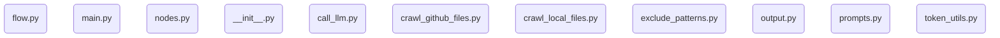

# Hướng dẫn: test

Deterministic Internal API Reference.

**Kho mã nguồn:** `.`

## Các chương

1. [__init__.py](01___init___py.md)
2. [call_llm.py](02_call_llm_py.md)
3. [crawl_github_files.py](03_crawl_github_files_py.md)
4. [crawl_local_files.py](04_crawl_local_files_py.md)
5. [exclude_patterns.py](05_exclude_patterns_py.md)
6. [output.py](06_output_py.md)
7. [prompts.py](07_prompts_py.md)
8. [token_utils.py](08_token_utils_py.md)
9. [flow.py](09_flow_py.md)
10. [main.py](10_main_py.md)
11. [nodes.py](11_nodes_py.md)

---

**Nội dung đầy đủ:** [full_content.md](full_content.md)
