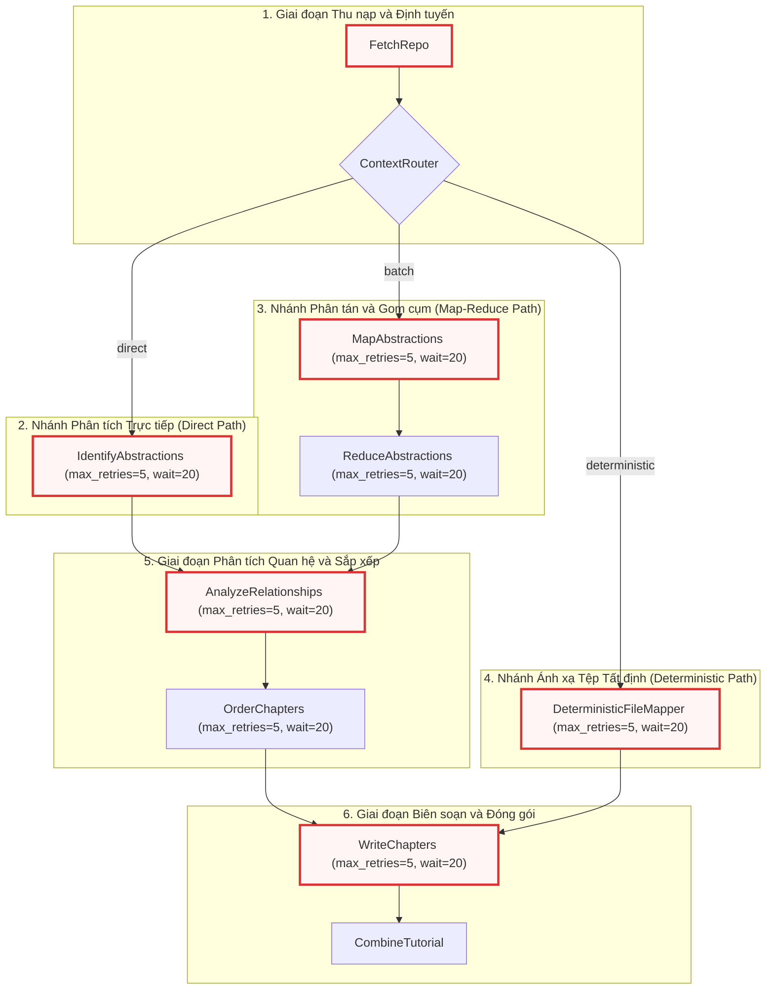

# flow.py

> **Source:** `flow.py`

Tiếp nối các cơ chế đo lường và giám sát tải trọng ngữ cảnh tại [Chương 8 — token_utils.py](utils/token_utils.py.md), mô-đun `flow.py` đóng vai trò là kiến trúc sư điều phối trung tâm của toàn bộ hệ thống. Tệp này chịu trách nhiệm khởi tạo, thiết lập cấu hình tham số thử lại (retry policy) và liên kết các nút nghiệp vụ chuyên biệt thành một Đồ thị Có hướng Không chu trình (Directed Acyclic Graph - DAG) hoàn chỉnh thông qua khung làm việc `pocketflow`.

---

## Tổng quan Kỹ thuật (Technical Overview)

Mô-đun `flow.py` cung cấp định nghĩa cấu trúc quy trình sinh tài liệu tự động (`create_tutorial_flow`). Tệp giải quyết bài toán trừu tượng hóa luồng dữ liệu phức tạp giữa các giai đoạn: từ việc thu thập mã nguồn, đánh giá dung lượng ngữ cảnh, định tuyến xử lý thích ứng, trích xuất các tầng trừu tượng, phân tích quan hệ kiến trúc, cho đến việc biên soạn và đóng gói tài liệu đầu ra.

Hệ thống điều khiển luồng thực thi thông qua việc nạp và cấu hình 10 lớp nút nghiệp vụ từ mô-đun [nodes.py](nodes.py.md). Để đảm bảo tính bền bỉ trước các biến động mạng và giới hạn tốc độ (rate limit) khi gọi API của các Mô hình Ngôn ngữ Lớn (LLM), `flow.py` áp dụng chính sách tự động thử lại (`max_retries=5`, `wait=20`) trên toàn bộ các nút xử lý LLM nặng. Ngược lại, các nút thực thi cục bộ hoặc tác vụ I/O xác định được vận hành ở chế độ mặc định nhằm tối ưu hóa độ trễ.

### Kiến trúc Đồ thị Luồng Thực thi (Flow Pipeline Architecture)

Sơ đồ dưới đây minh họa cấu trúc DAG hoàn chỉnh của quy trình xử lý, bao gồm 3 nhánh phân hóa chiến lược dựa trên kết quả phân tích của bộ định tuyến ngữ cảnh (`ContextRouter`):



---

## Module-Level Functions

### `create_tutorial_flow()`

**Visibility**: Public  
**Signature**: `def create_tutorial_flow() -> Flow:`

**Description**:  
Hàm `create_tutorial_flow` chịu trách nhiệm khởi tạo toàn bộ các thể hiện (instances) của các nút xử lý trong hệ thống, cấu hình tham số chống chịu lỗi cho các tác vụ suy luận LLM, và kết nối chúng thành một đồ thị thực thi logic thông qua các toán tử nạp chồng (`>>` và `- action >>`) của thư viện `pocketflow`. Đồ thị này định nghĩa toàn bộ vòng đời phân tích và sinh tài liệu của ứng dụng, đồng thời trả về một đối tượng `Flow` sẵn sàng thực thi với điểm bắt đầu là `FetchRepo`.

**Parameters**:  
* Không có tham số đầu vào.

**Returns**:  
* `Flow`: Một thể hiện luồng điều khiển của `pocketflow.Flow` với điểm nhập `start=fetch_repo`, đóng gói toàn bộ cấu trúc đồ thị phụ thuộc và các quy tắc rẽ nhánh động.

**Raises**:  
* Không phát sinh ngoại lệ trực tiếp trong quá trình khởi tạo đồ thị. Mọi ngoại lệ thực thi (nếu có) sẽ được trì hoãn và quản lý bởi runtime của `Flow.run()` tại [main.py](main.py.md).

**Example**:
```python
from flow import create_tutorial_flow

# Khởi tạo đối tượng Flow hoàn chỉnh
tutorial_flow = create_tutorial_flow()

# Chạy luồng thực thi từ điểm bắt đầu với bộ nhớ chia sẻ
shared_context = {
    "repo_path": "/path/to/local/project",
    "output_dir": "./output"
}
tutorial_flow.run(shared_context)
```

---

## Chi tiết Triển khai Hàm (Function Implementation Details)

### Khởi tạo Thực thể và Cấu hình Tham số (Node Instantiation & Retry Setup)

Đoạn mã dưới đây thể hiện phần khởi tạo 10 nút nghiệp vụ với các tham số điều khiển khả năng tự phục hồi:

```python
def create_tutorial_flow():
    fetch_repo = FetchRepo()
    context_router = ContextRouter()
    map_abstractions = MapAbstractions(max_retries=5, wait=20)
    reduce_abstractions = ReduceAbstractions(max_retries=5, wait=20)
    identify_abstractions = IdentifyAbstractions(max_retries=5, wait=20)
    analyze_relationships = AnalyzeRelationships(max_retries=5, wait=20)
    order_chapters = OrderChapters(max_retries=5, wait=20)
    write_chapters = WriteChapters(max_retries=5, wait=20)
    combine_tutorial = CombineTutorial()
    deterministic_mapper = DeterministicFileMapper(max_retries=5, wait=20)
// ...
```

Trong khối mã khởi tạo này, các lớp nút được phân chia thành hai nhóm rõ rệt dựa trên bản chất tác vụ:
1. **Nhóm Nút Logic / I/O Cục bộ (`FetchRepo`, `ContextRouter`, `CombineTutorial`)**: Được khởi tạo bằng hàm dựng mặc định không truyền tham số `max_retries` hay `wait`. Các nút này thực hiện việc quét hệ thống tệp, tính toán số lượng token trong bộ nhớ hoặc ghi các tệp Markdown/YAML xuống đĩa mà không phụ thuộc vào dịch vụ mạng bên ngoài, do đó không cần cấu hình độ trễ chờ phục hồi.
2. **Nhóm Nút Suy luận LLM (`MapAbstractions`, `ReduceAbstractions`, `IdentifyAbstractions`, `AnalyzeRelationships`, `OrderChapters`, `WriteChapters`, `DeterministicFileMapper`)**: Được cấu hình đồng nhất với `max_retries=5` và `wait=20`. Cấu hình này chỉ định rằng nếu một nút gặp sự cố khi gọi API mô hình ngôn ngữ (như mã lỗi HTTP `429 Too Many Requests`, `503 Service Unavailable`, hoặc phản hồi JSON không đúng cấu trúc), framework sẽ tự động tạm dừng 20 giây trước khi thử lại, lặp lại tối đa 5 lần trước khi báo lỗi nghiêm trọng.

---

### Thiết lập Rẽ nhánh Động và Kết nối Đồ thị (Branching & Graph Topology Setup)

Đoạn mã dưới đây thiết lập các liên kết có hướng giữa các nút, bao gồm cả các liên kết tuần tự tất định và các liên kết điều kiện:

```python
// ...
    fetch_repo >> context_router

    context_router - "direct" >> identify_abstractions
    context_router - "batch" >> map_abstractions
    context_router - "deterministic" >> deterministic_mapper

    map_abstractions >> reduce_abstractions

    identify_abstractions >> analyze_relationships
    reduce_abstractions >> analyze_relationships

    analyze_relationships >> order_chapters
    order_chapters >> write_chapters

    deterministic_mapper >> write_chapters

    write_chapters >> combine_tutorial

    return Flow(start=fetch_repo)
```

Logic kết nối đồ thị triển khai hệ thống phân luồng xử lý đa nhánh mạnh mẽ:
* **Toán tử Tuần tự (`>>`)**: Thiết lập mối quan hệ phụ thuộc trước-sau giữa hai nút (ví dụ: `fetch_repo >> context_router`). Nút phía sau chỉ được kích hoạt sau khi nút phía trước hoàn tất thành công và cập nhật ngữ cảnh vào bộ nhớ chia sẻ.
* **Toán tử Điều kiện (`- action >>`)**: Thiết lập liên kết rẽ nhánh dựa trên chuỗi hành động được trả về từ phương thức `post()` của nút điều hướng (`ContextRouter`). Tùy thuộc vào tổng dung lượng token của kho mã nguồn và cờ cấu hình chế độ, `context_router` sẽ phát ra một trong ba tín hiệu:
  1. `"direct"`: Kích hoạt nút `IdentifyAbstractions` khi toàn bộ kho mã nguồn nằm gọn trong cửa sổ ngữ cảnh đơn của LLM.
  2. `"batch"`: Kích hoạt chuỗi `MapAbstractions >> ReduceAbstractions` theo mô hình Map-Reduce để xử lý các kho mã nguồn có dung lượng lớn vượt ngưỡng token an toàn.
  3. `"deterministic"`: Kích hoạt nút `DeterministicFileMapper` khi người dùng kích hoạt chế độ ánh xạ tệp 1-1, bỏ qua quá trình trừu tượng hóa mức cao.
* **Điểm Hội tụ và Đồng bộ (Convergence Points)**: 
  - Cả hai nhánh `"direct"` (`identify_abstractions`) và `"batch"` (`reduce_abstractions`) đều hội tụ về nút `AnalyzeRelationships` để xây dựng đồ thị quan hệ tổng thể giữa các thành phần kiến trúc trước khi chuyển giao cho `OrderChapters`.
  - Nhánh `"deterministic"` đi thẳng tới `write_chapters`, bỏ qua hoàn toàn các bước phân tích quan hệ và sắp xếp chương phức tạp vì cấu trúc chương đã được ánh xạ tất định từ cây thư mục vật lý.
* **Giai đoạn Đóng gói**: Toàn bộ các nhánh đều dẫn về `write_chapters` để biên soạn nội dung chi tiết từng chương, sau đó kết thúc tại `combine_tutorial` để tạo cấu hình `mkdocs.yml`, sao chép tài nguyên tĩnh và xuất bản tài liệu hoàn chỉnh.
* **Điểm Khởi tạo Luồng**: Lệnh `Flow(start=fetch_repo)` xác định điểm vào duy nhất của toàn bộ hệ thống là nút `fetch_repo`.

---

## Phân tích Chuyên sâu Kiến trúc Đường ống (Deep-Dive Pipeline Architecture)

### 1. Cơ chế Hoạt động của Bộ định tuyến Ngữ cảnh (Context Routing Mechanics)

`ContextRouter` đóng vai trò là một bộ điều hướng động tại thời điểm chạy (runtime dynamic router). Quá trình phân luồng dựa trên việc so sánh tải trọng token (được đo lường từ [token_utils.py](utils/token_utils.py.md)) với giới hạn cửa sổ ngữ cảnh tối đa của mô hình đang sử dụng (lấy từ [call_llm.py](utils/call_llm.py.md)).

Bảng dưới đây mô tả chi tiết các đường dẫn thực thi tương ứng với từng trạng thái phân nhánh:

| Quyết định Rẽ nhánh | Điều kiện Kích hoạt | Chuỗi Nút Thực thi | Mục tiêu Kiến trúc |
| :--- | :--- | :--- | :--- |
| **`direct`** | Tổng số token $\le$ Ngưỡng ngữ cảnh an toàn | `IdentifyAbstractions` $\rightarrow$ `AnalyzeRelationships` $\rightarrow$ `OrderChapters` $\rightarrow$ `WriteChapters` $\rightarrow$ `CombineTutorial` | Phân tích toàn diện kho mã nguồn nhỏ/vừa trong một prompt duy nhất, giữ nguyên vẹn ngữ cảnh liên tệp. |
| **`batch`** | Tổng số token $>$ Ngưỡng ngữ cảnh an toàn | `MapAbstractions` $\rightarrow$ `ReduceAbstractions` $\rightarrow$ `AnalyzeRelationships` $\rightarrow$ `OrderChapters` $\rightarrow$ `WriteChapters` $\rightarrow$ `CombineTutorial` | Chia nhỏ cây mã nguồn thành các lô (batches), trích xuất trừu tượng hóa song song (Map), sau đó hợp nhất và khử trùng lặp (Reduce). |
| **`deterministic`** | Cờ cấu hình ánh xạ tệp cưỡng bức (`deterministic_mode = True`) | `DeterministicFileMapper` $\rightarrow$ `WriteChapters` $\rightarrow$ `CombineTutorial` | Tạo tài liệu dạng 1-1 cho từng tệp mã nguồn theo thứ tự cây thư mục vật lý, bỏ qua phân tích trừu tượng hóa cấp cao. |

---

### 2. Mô hình Chống chịu Lỗi và Quản lý Trạng thái (Fault Tolerance & State Propagation)

Mô-đun `flow.py` tận dụng cơ chế chia sẻ trạng thái tập trung (`shared_storage`) của `PocketFlow`. Mỗi nút trong đồ thị nhận vào một từ điển ngữ cảnh chung, đọc các khóa dữ liệu đầu vào do các nút trước tạo ra, và ghi đè hoặc bổ sung các khóa kết quả mới.

Quá trình luân chuyển dữ liệu diễn ra theo các bước chuyển giao sau:
1. `FetchRepo` đưa vào `shared_storage` danh sách tệp `files` và cây thư mục.
2. `ContextRouter` kiểm tra kích thước `files`, xác định số lượng token và trả về nhãn nhánh điều hướng.
3. Nhánh trừu tượng hóa (`IdentifyAbstractions` hoặc `MapAbstractions`/`ReduceAbstractions`) ghi danh sách các khái niệm/thành phần cốt lõi vào khóa `abstractions`.
4. `AnalyzeRelationships` tiêu thụ `abstractions` và mã nguồn để xây dựng ma trận phụ thuộc kiến trúc, lưu vào khóa `relationships`.
5. `OrderChapters` tiêu thụ `abstractions` và `relationships` để xác định trình tự đọc tối ưu (từ cơ bản đến nâng cao), lưu vào khóa `chapters`.
6. `WriteChapters` lặp qua từng chương trong `chapters`, gọi LLM để sinh nội dung Markdown chi tiết và tóm tắt cuốn chiếu (rolling context summary).
7. `CombineTutorial` thu thập toàn bộ các tệp tài liệu đã sinh, tạo tệp `mkdocs.yml`, tích hợp sơ đồ Mermaid và hoàn tất đường ống xử lý.

Nhờ việc tách biệt hoàn toàn giữa cấu trúc định nghĩa luồng (`flow.py`) và logic thực thi chi tiết của từng nút ([nodes.py](nodes.py.md)), hệ thống đạt được tính mô-đun hóa cao, cho phép dễ dàng mở rộng thêm các nhánh phân tích chuyên sâu hoặc thay đổi chiến lược điều hướng mà không làm ảnh hưởng đến mã nguồn nghiệp vụ của các nút hiện có.

---

## Xem Thêm (See Also)

* [Chương 8 — token_utils.py](utils/token_utils.py.md): Cung cấp các tiện ích tính toán và giám sát tải trọng token phục vụ cho quyết định rẽ nhánh của `ContextRouter`.
* [Chương 10 — main.py](main.py.md): Điểm nhập chương trình, chịu trách nhiệm khởi chạy `create_tutorial_flow()` và cung cấp tham số thực thi từ CLI.
* [Chương 11 — nodes.py](nodes.py.md): Định nghĩa chi tiết toàn bộ các lớp nút nghiệp vụ được liên kết trong DAG của `flow.py`.
* [Chương 2 — call_llm.py](utils/call_llm.py.md): Tầng giao tiếp LLM được các nút trong luồng gọi đến để thực hiện suy luận văn bản.
* [Chương 7 — prompts.py](utils/prompts.py.md): Tầng sinh prompt nghiệp vụ cung cấp khuôn mẫu câu lệnh cho các nút trong luồng.

