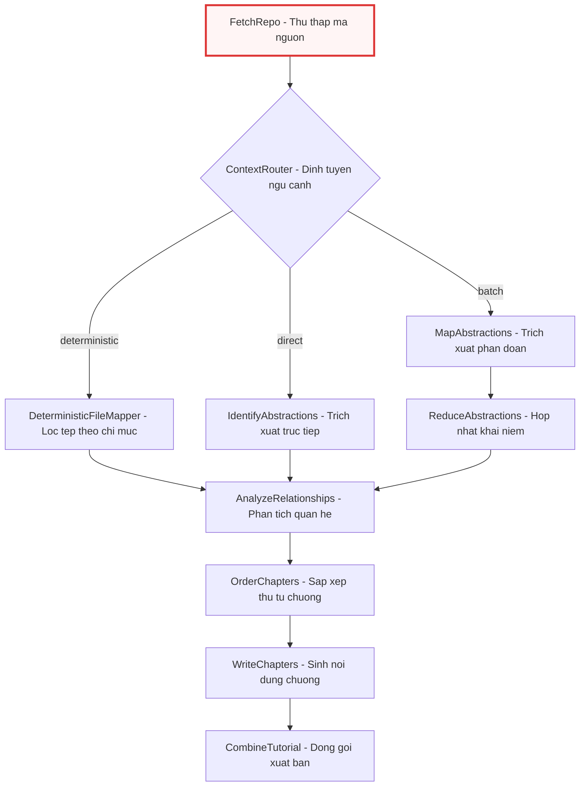
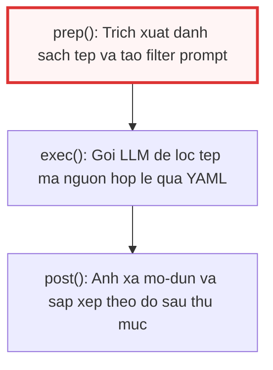
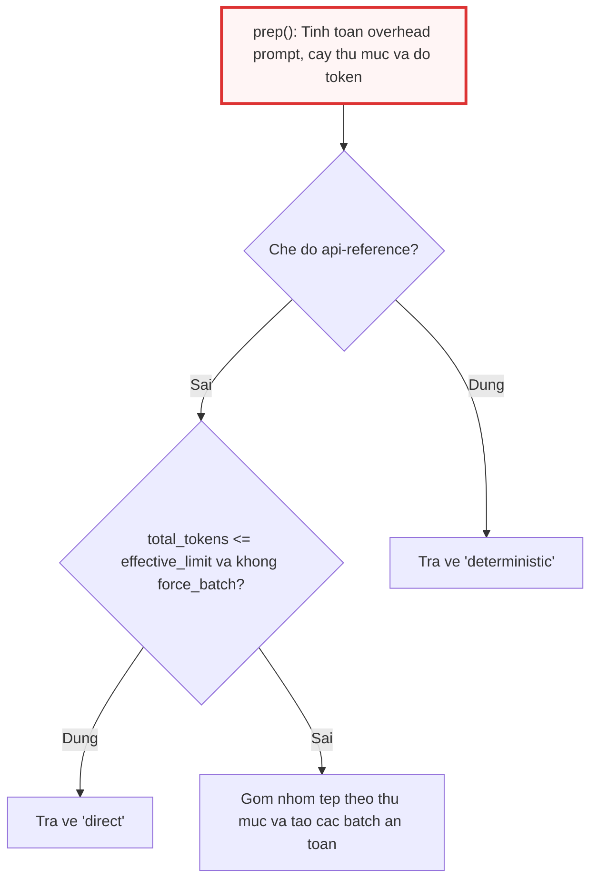
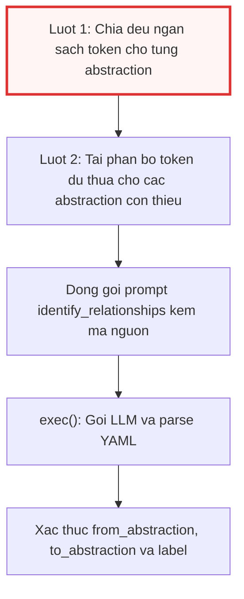
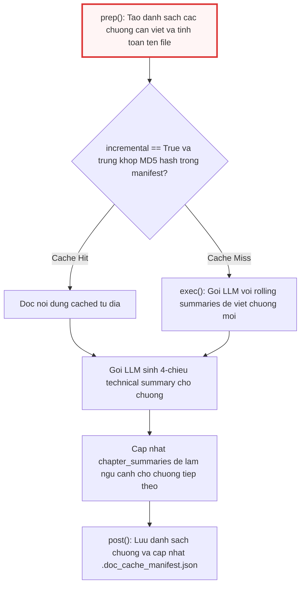

# nodes.py

> **Source:** `nodes.py`

Tiếp nối quy trình khởi tạo và điều phối cấp cao được mô tả trong [main.py](main.py.md), tệp `nodes.py` đóng vai trò là tầng hiện thực hóa chi tiết toàn bộ logic xử lý nghiệp vụ cho từng nút trong đồ thị luồng xử lý `PocketFlow` (được định nghĩa trong [flow.py](flow.py.md)). 

Tệp `nodes.py` chứa các triển khai cụ thể kế thừa từ `pocketflow.Node` và `pocketflow.BatchNode`, phụ trách các nhiệm vụ từ thu thập mã nguồn, tính toán và định tuyến ngân sách token ngữ cảnh, trích xuất và ánh xạ các khái niệm trừu tượng (abstractions), phân tích quan hệ kiến trúc, sắp xếp thứ tự chương, cho đến sinh văn bản hướng dẫn chi tiết và xuất bản tài liệu tĩnh (dưới dạng Markdown độc lập hoặc dự án MkDocs).

---

## Tổng quan Kiến trúc và Luồng Thực thi

Mỗi nút trong `nodes.py` tuân thủ vòng đời ba pha chuẩn hóa của `PocketFlow`:
1. **`prep(shared)`**: Chuẩn bị dữ liệu đầu vào từ vùng nhớ chia sẻ (`shared_storage`), phân tích cú pháp, nạp mẫu câu lệnh (prompt), và tính toán tải trọng token.
2. **`exec(prep_res)` / `exec(item)`**: Thực thi logic cốt lõi (gọi LLM, xử lý dữ liệu, kiểm tra bộ nhớ đệm hoặc đọc/ghi hệ thống tệp). Đối với `BatchNode`, pha này được lặp tuần tự cho từng phần tử.
3. **`post(shared, prep_res, exec_res)`**: Xác thực kết quả, xử lý hậu kỳ dữ liệu và ghi kết quả trở lại vùng nhớ chia sẻ `shared`, đồng thời trả về chuỗi hành động định tuyến (action) cho đồ thị điều khiển.



---

## Module-Level Functions

Các hàm trợ giúp cấp mô-đun cung cấp những tác vụ xử lý chuỗi, nạp mẫu câu lệnh, định dạng cây thư mục và đo lường token dùng chung cho nhiều nút.

### `build_directory_tree()`
**Visibility**: Public  
**Signature**: `def build_directory_tree(files_data: list[tuple[str, str]]) -> str:`

**Description**: Tạo biểu diễn trực quan dạng cây phân cấp thư mục từ danh sách các bộ dữ liệu `(path, content)`. Hàm gom nhóm các tệp theo thư mục cha và đánh số chỉ mục (`idx:i`) tương ứng cho từng tệp. Cấu trúc này giúp các mô hình ngôn ngữ lớn (LLM) nắm bắt được vị trí không gian và mối liên kết logic của mã nguồn dự án.

**Parameters**:
* `files_data` (`list[tuple[str, str]]`): Danh sách các cặp `(đường_dẫn_tương_đối, nội_dung_tệp)`.

**Returns**:
* `str`: Chuỗi văn bản phân cấp cây thư mục đã được định dạng và sắp xếp theo thứ tự bảng chữ cái.

**Example**:
```python
def build_directory_tree(files_data):
    from collections import defaultdict

    dir_files = defaultdict(list)
    for i, (path, _content) in enumerate(files_data):
        dirname = os.path.dirname(path) or "."
        basename = os.path.basename(path)
        dir_files[dirname].append(f"{basename} (idx:{i})")

    lines = []
    for dirname in sorted(dir_files.keys()):
        lines.append(f"{dirname}/")
        lines.extend(f"  {fname}" for fname in sorted(dir_files[dirname]))
    return "\n".join(lines)
```

Hàm `build_directory_tree` sử dụng từ điển nhóm `defaultdict(list)` để phân loại toàn bộ tệp dựa trên kết quả của `os.path.dirname()`. Các khóa thư mục sau đó được sắp xếp theo bảng chữ cái để tạo đầu ra có tính tất định cao. Cấu trúc cây này được tiêm vào ngữ cảnh của `ContextRouter`, `IdentifyAbstractions`, `MapAbstractions`, và `CombineTutorial`.

---

### `get_content_for_indices()`
**Visibility**: Public  
**Signature**: `def get_content_for_indices(files_data: list[tuple[str, str]], indices: list[int]) -> dict[str, str]:`

**Description**: Trích xuất nội dung của các tệp mã nguồn cụ thể dựa trên danh sách chỉ số được yêu cầu. Khóa của từ điển kết quả được định dạng theo cấu trúc `"{index} # {path}"` nhằm cung cấp định danh trực quan cho LLM trong quá trình phân tích.

**Parameters**:
* `files_data` (`list[tuple[str, str]]`): Toàn bộ danh sách tệp của dự án.
* `indices` (`list[int]`): Danh sách các chỉ số số nguyên đại diện cho các tệp cần lấy.

**Returns**:
* `dict[str, str]`: Bảng ánh xạ giữa chuỗi định danh chỉ số kèm đường dẫn và nội dung tệp tương ứng.

**Example**:
```python
def get_content_for_indices(files_data, indices):
    content_map = {}
    for i in indices:
        if 0 <= i < len(files_data):
            path, content = files_data[i]
            content_map[f"{i} # {path}"] = content  # Use index + path as key for context
    return content_map
```

Hàm thực hiện việc kiểm tra biên an toàn `0 <= i < len(files_data)` trước khi truy xuất phần tử để tránh lỗi `IndexError`. Bảng ánh xạ này được sử dụng chủ yếu trong nút `WriteChapters` để tổng hợp mã nguồn liên quan cho từng chương cụ thể.

---

### `load_prompt_template()`
**Visibility**: Public  
**Signature**: `def load_prompt_template(template_name: str, advanced_mode: bool = False, mode: str | None = None) -> str:`

**Description**: Đọc và trả về nội dung của tệp khuôn mẫu câu lệnh (prompt template) từ thư mục `prompts/`. Hàm hỗ trợ giải quyết đường dẫn linh hoạt dựa trên chế độ vận hành (`tutorial`, `advanced`, hoặc `api-reference`).

**Parameters**:
* `template_name` (`str`): Tên tệp khuôn mẫu (không bao gồm phần mở rộng `.md`).
* `advanced_mode` (`bool`): Cờ dự phòng xác định chế độ nâng cao (mặc định `False`).
* `mode` (`str | None`): Tên chế độ tài liệu tường minh (ví dụ: `"tutorial"`, `"advanced"`, `"api-reference"`).

**Returns**:
* `str`: Nội dung văn bản của tệp khuôn mẫu với bảng mã UTF-8 (hỗ trợ BOM thông qua `utf-8-sig`).

**Example**:
```python
def load_prompt_template(template_name, advanced_mode=False, mode=None):
    """Load a prompt template file from the prompts/ directory."""
    if mode is None:
        prompt_dir = "advanced" if advanced_mode else "tutorial"
    else:
        prompt_dir = mode

    path = os.path.join(os.path.dirname(os.path.abspath(__file__)), "prompts", prompt_dir, f"{template_name}.md")
    with open(path, encoding="utf-8-sig") as f:
        return f.read()
```

Hàm xác định thư mục chứa khuôn mẫu dựa trên thứ tự ưu tiên: tham số `mode` được ưu tiên cao nhất, tiếp theo là cờ boolean `advanced_mode`. Việc áp dụng bảng mã `utf-8-sig` đảm bảo loại bỏ hoàn toàn các ký tự BOM ẩn trên môi trường Windows mà không làm sai lệch cú pháp nội dung câu lệnh.

---

### `parse_yaml_response()`
**Visibility**: Public  
**Signature**: `def parse_yaml_response(response: str) -> Any:`

**Description**: Trích xuất và phân tích cú pháp khối YAML được bao bọc trong định dạng markdown fence (```` ```yaml ... ``` ````) từ phản hồi văn bản của LLM.

**Parameters**:
* `response` (`str`): Toàn bộ chuỗi phản hồi thô từ mô hình ngôn ngữ.

**Returns**:
* `Any`: Cấu trúc dữ liệu Python tương ứng (thường là `list` hoặc `dict`) sau khi giải mã YAML an toàn qua `yaml.safe_load`.

**Raises**:
* `ValueError`: Phát sinh khi không tìm thấy khối mã YAML hoặc nội dung YAML chứa lỗi cú pháp.

**Example**:
```python
def parse_yaml_response(response):
    """Extract and parse YAML from an LLM response fenced in ```yaml blocks."""
    try:
        yaml_str = response.strip().split("```yaml")[1].split("```")[0].strip()
        return yaml.safe_load(yaml_str)
    except Exception as e:
        raise ValueError(f"Failed to parse YAML: {e}") from e
```

Hàm sử dụng phương pháp bóc tách chuỗi dựa trên ký tự ngăn cách ```` ```yaml ```` và ```` ``` ````. Kỹ thuật này giúp cô lập chính xác cấu trúc dữ liệu YAML cần thiết, bỏ qua toàn bộ phần văn bản giải thích dẫn nhập hoặc kết luận mà mô hình có thể tự động sinh ra bên ngoài khối fence.

---

### `create_token_counter()`
**Visibility**: Public  
**Signature**: `def create_token_counter() -> Callable[[str], int]:`

**Description**: Khởi tạo một hàm đếm số lượng token sử dụng bộ mã hóa `tiktoken` (chuẩn `cl100k_base`), kèm theo cơ chế dự phòng ước lượng theo độ dài chuỗi ký tự nếu việc nạp thư viện gặp lỗi.

**Parameters**:
* Không có.

**Returns**:
* `Callable[[str], int]`: Hàm nhận đầu vào là chuỗi văn bản và trả về số nguyên biểu thị số lượng token.

**Example**:
```python
def create_token_counter():
    """Create a token counting function using tiktoken with char-count fallback."""
    try:
        enc = tiktoken.get_encoding("cl100k_base")
        return lambda text: len(enc.encode(text, disallowed_special=()))
    except Exception:
        return lambda text: len(text) // 4
```

Hàm trả về một closure hàm ẩn danh (`lambda`). Việc vô hiệu hóa kiểm tra ký tự đặc biệt (`disallowed_special=()`) cho phép bộ phân tích BPE xử lý an toàn mọi ký tự điều khiển trong mã nguồn thô mà không gây lỗi `ValueError`. Khi gặp sự cố môi trường, thuật toán dự phòng chia nguyên cho 4 ($4 \text{ ký tự} \approx 1 \text{ token}$) sẽ được tự động kích hoạt.

---

### `resolve_max_tokens()`
**Visibility**: Public  
**Signature**: `def resolve_max_tokens(shared: dict) -> int:`

**Description**: Xác định giới hạn token ngữ cảnh tối đa từ cấu hình trong kho lưu trữ chia sẻ hoặc tự động truy vấn thông qua thông tin biến môi trường của nhà cung cấp LLM.

**Parameters**:
* `shared` (`dict`): Vùng nhớ trạng thái chia sẻ của toàn bộ luồng.

**Returns**:
* `int`: Kích thước cửa sổ ngữ cảnh tối đa của mô hình đang sử dụng.

**Example**:
```python
def resolve_max_tokens(shared):
    """Resolve max_tokens from shared store or auto-detect from provider env vars."""
    max_tokens = shared.get("max_tokens")
    if max_tokens is not None:
        return max_tokens
    provider = os.environ.get("LLM_PROVIDER")
    if provider == "GEMINI" or not provider:
        endpoint = "https://generativelanguage.googleapis.com"
        model_name = os.getenv("GEMINI_MODEL", "gemini-3.7-flash")
        api_key = os.getenv("GEMINI_API_KEY", "")
    else:
        endpoint = os.environ.get(f"{provider}_BASE_URL", "")
        model_name = os.environ.get(f"{provider}_MODEL", "")
        api_key = os.environ.get(f"{provider}_API_KEY", "")
    return get_model_context_length(endpoint, model_name, api_key)
```

Hàm đóng vai trò phân giải giới hạn ngữ cảnh an toàn. Nếu `max_tokens` đã được lưu trữ trong `shared`, hàm sẽ trả về giá trị này ngay lập tức. Ngược lại, hàm tiến hành giải mã biến môi trường dựa trên `LLM_PROVIDER` (mặc định là Google Gemini) và gọi tới hàm [get_model_context_length](utils/call_llm.py.md) từ `utils.call_llm` để xác định kích thước cửa sổ token thực tế.

---

## Class: `DeterministicFileMapper`

Lớp kế thừa từ `pocketflow.Node`, chịu trách nhiệm ánh xạ trực tiếp và tất định từng tệp mã nguồn thành một chương tài liệu độc lập khi vận hành ở chế độ tham chiếu API (`api-reference`). Nút này sử dụng LLM để lọc bỏ các tệp không chứa logic nghiệp vụ, sau đó sắp xếp thứ tự chương theo độ sâu thư mục (leaf-first).



### `DeterministicFileMapper.prep()`
**Visibility**: Public  
**Signature**: `def prep(self, shared: dict) -> tuple[str, bool, str | None, int]:`

**Description**: Chuẩn bị dữ liệu danh sách tệp dạng chỉ số và xây dựng câu lệnh nhắc nhở LLM sàng lọc các tệp mã nguồn thực tế.

**Parameters**:
* `shared` (`dict`): Vùng nhớ trạng thái chia sẻ.

**Returns**:
* `tuple[str, bool, str | None, int]`: Bộ dữ liệu gồm `(prompt, use_cache, thinking_level, max_tokens)`.

**Example**:
```python
    def prep(self, shared):
        files_data = shared["files"]
        project_name = shared["project_name"]

        file_listing = "\n".join([f"{i} # {path}" for i, (path, _) in enumerate(files_data)])

        prompt = build_code_file_filter_prompt(project_name, file_listing)
        return prompt, shared.get("use_cache", True), shared.get("thinking_level", None), shared.get("max_tokens", 100000)
```

Phương thức trích xuất danh sách tệp từ `shared["files"]` và định dạng thành danh sách các dòng có định dạng `{index} # {path}`. Sau đó, nó gọi tiện ích [build_code_file_filter_prompt](utils/prompts.py.md) để tạo câu lệnh hướng dẫn LLM trả về danh sách các chỉ số tệp cần ghi tài liệu.

---

### `DeterministicFileMapper.exec()`
**Visibility**: Public  
**Signature**: `def exec(self, prep_res: tuple) -> list[int]:`

**Description**: Gửi yêu cầu câu lệnh tới LLM để nhận danh sách chỉ số tệp mã nguồn hợp lệ dưới định dạng YAML, sau đó phân tích và chuyển đổi thành danh sách số nguyên.

**Parameters**:
* `prep_res` (`tuple`): Bộ tham số được tạo ra từ phương thức `prep()`.

**Returns**:
* `list[int]`: Danh sách các chỉ mục tệp hợp lệ được giữ lại.

**Raises**:
* `Exception`: Bắt và ghi nhật ký mọi ngoại lệ trong quá trình gọi LLM hoặc phân tích cú pháp, sau đó ném lại ngoại lệ để kích hoạt cơ chế thử lại của `PocketFlow`.

**Example**:
```python
    def exec(self, prep_res):
        try:
            prompt, use_cache, thinking_level, max_tokens = prep_res
            emit("LLM_CALL_FILTER_FILES")
            log_token_estimation(self.__class__.__name__, prompt, max_tokens)
            response = call_llm(prompt, use_cache=(use_cache and self.cur_retry == 0), thinking_level=thinking_level)
            valid_indices = parse_yaml_response(response)
            if not isinstance(valid_indices, list):
                valid_indices = []
            return [int(idx) for idx in valid_indices]
        except Exception as e:
            emit("NODE_RETRY_ERROR", class_name=self.__class__.__name__, error=e)
            llm_logger.error(f"[Node {self.__class__.__name__}] Error: {e}", exc_info=True)
            raise e
```

Phương thức thực hiện đo lường tải lượng token thông qua [log_token_estimation](utils/token_utils.py.md) trước khi gọi [call_llm](utils/call_llm.py.md). Khi phát hiện thử lại (`self.cur_retry > 0`), cờ `use_cache` sẽ tự động bị tắt để đảm bảo yêu cầu mới được gửi trực tiếp tới API. Kết quả YAML được chuẩn hóa thành danh sách số nguyên an toàn.

---

### `DeterministicFileMapper.post()`
**Visibility**: Public  
**Signature**: `def post(self, shared: dict, prep_res: tuple, exec_res: list[int]) -> str:`

**Description**: Đóng gói các tệp hợp lệ thành cấu trúc `abstractions`, tính toán thứ tự sắp xếp chương theo độ sâu cây thư mục (leaf-first) và cập nhật vào `shared`.

**Parameters**:
* `shared` (`dict`): Vùng nhớ trạng thái chia sẻ.
* `prep_res` (`tuple`): Kết quả từ `prep()`.
* `exec_res` (`list[int]`): Danh sách các chỉ mục tệp hợp lệ từ `exec()`.

**Returns**:
* `str`: Trả về hành động điều khiển `"default"`.

**Example**:
```python
    def post(self, shared, prep_res, exec_res):
        import os

        files = shared.get("files", [])
        valid_indices = set(exec_res)
        modules = []
        chapter_order = []

        for idx, (file_path, _content) in enumerate(files):
            if idx not in valid_indices:
                emit("SKIP_NON_CODE_FILE", path=file_path)
                continue

            clean_name = os.path.basename(file_path)

            modules.append(
                {"name": clean_name, "description": f"Internal API reference for `{file_path}`", "files": [idx], "original_path": file_path}
            )
            chapter_order.append(len(modules) - 1)

        shared["abstractions"] = modules
        # Sort chapter order by directory depth (deepest first, then alphabetical).
        # This ensures utility/leaf files are processed before orchestration files,
        # so their summaries are available as cross-chapter context.
        # Works universally across all languages (Python, C#, C++, Java, etc.).
        shared["chapter_order"] = sorted(
            chapter_order,
            key=lambda idx: (
                -modules[idx]["original_path"].count("/") - modules[idx]["original_path"].count(os.sep),
                modules[idx]["original_path"].lower(),
            ),
        )
        shared["relationships"] = {"summary": "Deterministic Internal API Reference.", "details": []}
        emit("DONE_DETERMINISTIC_MAPPER", count=len(modules))
        return "default"
```

Thuật toán sắp xếp trong phương thức này sử dụng tiêu chí khóa kết hợp: ưu tiên các tệp có số lượng dấu phân cách thư mục (`/` hoặc `os.sep`) lớn nhất lên trước, sau đó sắp xếp theo bảng chữ cái. Chiến lược này đảm bảo các tệp tiện ích ở nhánh lá (leaf/utility files) được biên soạn trước, giúp tóm tắt ngữ cảnh của chúng sẵn sàng phục vụ cho các tệp điều phối cấp cao ở các chương sau.

---

## Class: `ContextRouter`

Nút trung tâm phân tích dung lượng token ngữ cảnh và đưa ra quyết định rẽ nhánh động cho đồ thị xử lý:
* `"deterministic"`: Kích hoạt cho chế độ `api-reference`.
* `"direct"`: Áp dụng khi toàn bộ mã nguồn nằm trong giới hạn an toàn của cửa sổ ngữ cảnh LLM.
* `"batch"`: Kích hoạt khi tải trọng vượt ngưỡng an toàn hoặc khi người dùng bật cờ ép buộc phân đoạn (`force_batch`).



### `ContextRouter.prep()`
**Visibility**: Public  
**Signature**: `def prep(self, shared: dict) -> tuple:`

**Description**: Phân tích chi tiết tải trọng ngữ cảnh: đo lường token của khuôn mẫu câu lệnh, cây thư mục và danh sách chỉ mục tệp; tính toán ngưỡng an toàn (95% của `max_tokens` trừ đi tổng chi phí phụ trợ) và so sánh với tổng dung lượng mã nguồn.

**Parameters**:
* `shared` (`dict`): Vùng nhớ trạng thái chia sẻ.

**Returns**:
* `tuple`: Bộ dữ liệu chứa thông tin định tuyến, danh sách tệp, giới hạn hiệu dụng (`effective_limit`), kích thước lô (`batch_size`), bảng token từng tệp (`file_token_map`), hàm đếm token, và chuỗi cây thư mục.

**Example**:
```python
    def prep(self, shared):
        files_data = shared["files"]
        max_tokens = resolve_max_tokens(shared)

        shared["max_tokens"] = max_tokens

        # --- Token estimation setup ---
        count_tokens = create_token_counter()

        # --- Calculate prompt overhead FIRST ---
        prompt_dir = os.path.join(os.path.dirname(os.path.abspath(__file__)), "prompts")
        max_template_tokens = 0
        for subdir in ["tutorial", "advanced"]:
            template_path = os.path.join(prompt_dir, subdir, "map_abstractions.md")
            if os.path.exists(template_path):
                with open(template_path, encoding="utf-8-sig") as f:
                    t = count_tokens(f.read())
                max_template_tokens = max(max_template_tokens, t)

        directory_tree = build_directory_tree(files_data)
        tree_tokens = count_tokens(directory_tree)

        file_listing_str = "\n".join(f"- {i} # {path}" for i, (path, _) in enumerate(files_data))
        listing_tokens = count_tokens(file_listing_str)

        prompt_overhead = max_template_tokens + tree_tokens + listing_tokens
        // ... Tinh tong token cua tung tep va so sanh voi safety_limit ...
```

Phương thức tính toán chi phí tĩnh (overhead) trước khi duyệt qua từng tệp để xác định `effective_limit = int(max_tokens * 0.95) - prompt_overhead`. Dữ liệu đo kiểm chi tiết được phát ra giao diện người dùng qua các sự kiện bản địa hóa của `output.emit()`.

---

### `ContextRouter.exec()`
**Visibility**: Public  
**Signature**: `def exec(self, prep_res: tuple) -> str | list[list[tuple]]:`

**Description**: Thực thi việc phân chia các tệp thành các lô (batches) an toàn về mặt token dựa trên nguyên tắc gom nhóm thư mục (không bao giờ trộn lẫn tệp của các thư mục khác nhau vào cùng một phân đoạn nếu chưa cần thiết).

**Parameters**:
* `prep_res` (`tuple`): Kết quả từ pha `prep()`.

**Returns**:
* `str | list[list[tuple]]`: Trả về chuỗi định tuyến (`"direct"` hoặc `"deterministic"`) hoặc danh sách các lô chứa bộ dữ liệu tệp `[(idx, path, content), ...]`.

**Example**:
```python
    def exec(self, prep_res):
        route, files_data, effective_limit, batch_size, file_token_map, _count_tokens, directory_tree, debug = prep_res
        llm_logger.info(
            f"NODE EXEC | node=ContextRouter | action=route_decision | route={route} | files={len(files_data)} | effective_limit={effective_limit:,}"
        )

        if route == "direct":
            return "direct"
        if route == "deterministic":
            return "deterministic"

        # Group by directory for coherence, with pre-computed tokens
        dir_groups = defaultdict(list)
        for i, (path, content) in enumerate(files_data):
            dir_groups[os.path.dirname(path)].append((i, path, content, file_token_map[i]))

        # Build token-aware batches (never mix directories)
        batches = []
        for dirname in sorted(dir_groups.keys()):
            current_batch = []
            current_tokens = 0

            for i, path, content, tokens in dir_groups[dirname]:
                # Start new batch if adding this file would exceed effective limit or file count cap
                if current_batch and (current_tokens + tokens > effective_limit or len(current_batch) >= batch_size):
                    batches.append(current_batch)
                    current_batch = []
                    current_tokens = 0

                current_batch.append((i, path, content))
                current_tokens += tokens

            if current_batch:
                batches.append(current_batch)
        // ... Log va luu _directory_tree ...
        return batches
```

Phương thức đảm bảo tính mạch lạc ngữ nghĩa bằng cách duyệt qua `dir_groups` đã sắp xếp. Một phân đoạn mới chỉ được khởi tạo khi việc bổ sung thêm một tệp sẽ làm vượt quá `effective_limit` hoặc vượt ngưỡng giới hạn số lượng tệp `batch_size`. Cây thư mục cũng được lưu trữ tạm thời vào `self._directory_tree` để tái sử dụng ở pha sau.

---

### `ContextRouter.post()`
**Visibility**: Public  
**Signature**: `def post(self, shared: dict, prep_res: tuple, exec_res: Any) -> str:`

**Description**: Cập nhật danh sách phân đoạn `file_batches` và chuỗi `directory_tree` vào vùng nhớ `shared`, đồng thời trả về chuỗi hành động định tuyến tương ứng cho đồ thị `PocketFlow`.

**Parameters**:
* `shared` (`dict`): Vùng nhớ trạng thái chia sẻ.
* `prep_res` (`tuple`): Dữ liệu từ `prep()`.
* `exec_res` (`Any`): Kết quả từ `exec()`.

**Returns**:
* `str`: Tên hành động rẽ nhánh (`"direct"`, `"deterministic"`, hoặc `"batch"`).

**Example**:
```python
    def post(self, shared, prep_res, exec_res):
        if exec_res == "direct":
            return "direct"
        if exec_res == "deterministic":
            return "deterministic"
        shared["file_batches"] = exec_res
        # Reuse directory tree built during prep()
        shared["directory_tree"] = getattr(self, "_directory_tree", build_directory_tree(shared["files"]))
        return "batch"
```

Phương thức đóng vai trò chuyển giao điều khiển trong đồ thị luồng. Nếu kết quả thực thi là một nhánh chuỗi tĩnh, nó trả về trực tiếp giá trị đó. Nếu kết quả là một danh sách các lô tệp, nó ghi nhận dữ liệu vào `shared["file_batches"]` và trả về nhãn `"batch"`.

---

## Class: `MapAbstractions`

Lớp kế thừa từ `pocketflow.BatchNode`, chịu trách nhiệm phân tích từng lô tệp riêng biệt để trích xuất danh sách các khái niệm trừu tượng cục bộ (partial abstractions).

### `MapAbstractions.prep()`
**Visibility**: Public  
**Signature**: `def prep(self, shared: dict) -> list[dict]:`

**Description**: Chuyển đổi danh sách các lô tệp `shared["file_batches"]` thành một danh sách các từ điển cấu hình để cung cấp cho vòng lặp thực thi của `BatchNode`.

**Parameters**:
* `shared` (`dict`): Vùng nhớ trạng thái chia sẻ.

**Returns**:
* `list[dict]`: Danh sách cấu hình cho từng phần tử lô, bao gồm chỉ số lô, danh sách tệp, ngôn ngữ, cấu hình suy luận và cây thư mục.

**Example**:
```python
    def prep(self, shared):
        return [
            {
                "batch_index": i,
                "files": batch,
                "project_name": shared["project_name"],
                "language": shared.get("language", "english"),
                "use_cache": shared.get("use_cache", True),
                "thinking_level": shared.get("thinking_level", None),
                "advanced_mode": shared.get("advanced_mode", False),
                "max_tokens": shared.get("max_tokens", 100000),
                "directory_tree": shared.get("directory_tree", ""),
                "mode": shared.get("mode", "tutorial"),
            }
            for i, batch in enumerate(shared["file_batches"])
        ]
```

Phương thức chuẩn bị tập dữ liệu lặp độc lập cho từng lô. Mọi thông tin cấu hình toàn cục như ngôn ngữ đích, cờ bộ nhớ đệm và mức độ suy luận được sao chép vào từng phần tử nhằm đảm bảo tính cô lập khi thực thi.

---

### `MapAbstractions.exec()`
**Visibility**: Public  
**Signature**: `def exec(self, item: dict) -> list[dict]:`

**Description**: Ghép nối mã nguồn của lô hiện tại, nạp khuôn mẫu câu lệnh `map_abstractions`, gửi yêu cầu tới LLM, và phân tích kết quả YAML trả về thành danh sách các khái niệm trừu tượng đã xác thực chỉ số tệp.

**Parameters**:
* `item` (`dict`): Cấu hình của một lô cụ thể.

**Returns**:
* `list[dict]`: Danh sách các đối tượng trừu tượng chứa các trường `name`, `description`, và `files` (danh sách chỉ mục tệp).

**Example**:
```python
    def exec(self, item):
        batch_index = item["batch_index"]
        files = item["files"]
        emit("LLM_CALL_MAP_ABSTRACTIONS", batch_index=batch_index, file_count=len(files))

        context = ""
        for i, path, content in files:
            context += f"--- File Index {i}: {path} ---\n{content}\n\n"

        prompt_template = load_prompt_template("map_abstractions", mode=item.get("mode", "tutorial"))
        // ... Dinh dang prompt va goi call_llm ...
        abstractions = parse_yaml_response(response)

        validated_abstractions = []
        if isinstance(abstractions, list):
            for obj in abstractions:
                if isinstance(obj, dict) and "name" in obj and "description" in obj and "file_indices" in obj:
                    import re

                    validated_indices = []
                    for idx_entry in obj["file_indices"]:
                        nums = re.findall(r"\d+", str(idx_entry))
                        if nums:
                            validated_indices.append(int(nums[0]))
                    if validated_indices:
                        validated_abstractions.append(
                            {"name": obj["name"], "description": obj["description"], "files": sorted(set(validated_indices))}
                        )
        return validated_abstractions
```

Phương thức xây dựng chuỗi ngữ cảnh mã nguồn bằng cách duyệt qua các tệp của lô, bổ sung chỉ dẫn ngôn ngữ nếu ngôn ngữ đầu ra khác tiếng Anh. Sau khi nhận phản hồi từ LLM, biểu thức chính quy `re.findall(r"\d+", ...)` được sử dụng để trích xuất số nguyên từ trường `file_indices`, loại bỏ các chỉ số trùng lặp thông qua `sorted(set(...))`.

---

### `MapAbstractions.post()`
**Visibility**: Public  
**Signature**: `def post(self, shared: dict, prep_res: list, exec_res_list: list[list[dict]]) -> None:`

**Description**: Thu thập và làm phẳng (flatten) toàn bộ danh sách các khái niệm trừu tượng từng phần từ tất cả các lô, sau đó ghi vào `shared["mapped_abstractions"]`.

**Parameters**:
* `shared` (`dict`): Vùng nhớ trạng thái chia sẻ.
* `prep_res` (`list`): Dữ liệu từ `prep()`.
* `exec_res_list` (`list[list[dict]]`): Danh sách kết quả trả về từ tất cả các vòng lặp `exec()`.

**Returns**:
* `None`

**Example**:
```python
    def post(self, shared, prep_res, exec_res_list):
        all_abstractions = []
        for batch_abs in exec_res_list:
            all_abstractions.extend(batch_abs)
        shared["mapped_abstractions"] = all_abstractions
```

Phương thức gộp toàn bộ các mảng trừu tượng cục bộ thành một danh sách duy nhất. Dữ liệu này đóng vai trò là đầu vào trực tiếp cho nút hợp nhất [ReduceAbstractions](#class-reduceabstractions) ở giai đoạn tiếp theo.

---

## Class: `ReduceAbstractions`

Lớp kế thừa từ `pocketflow.Node`, thực hiện pha "Reduce" trong mẫu thiết kế Map-Reduce: tiếp nhận toàn bộ các khái niệm trừu tượng cục bộ từ `MapAbstractions`, gửi yêu cầu tới LLM để khử trùng lặp, hợp nhất các khái niệm tương đồng và giới hạn lại số lượng khái niệm cốt lõi theo tham số `max_abstraction_num`.

### `ReduceAbstractions.prep()`
**Visibility**: Public  
**Signature**: `def prep(self, shared: dict) -> tuple:`

**Description**: Chuẩn bị các tham số cần thiết từ vùng nhớ `shared`, bao gồm danh sách `mapped_abstractions`, tên dự án, ngôn ngữ đích và giới hạn số lượng khái niệm tối đa.

**Parameters**:
* `shared` (`dict`): Vùng nhớ trạng thái chia sẻ.

**Returns**:
* `tuple`: Bộ 9 tham số cấu hình cho pha thực thi.

**Example**:
```python
    def prep(self, shared):
        return (
            shared["mapped_abstractions"],
            shared["project_name"],
            shared.get("language", "english"),
            shared.get("use_cache", True),
            shared.get("max_abstraction_num", 10),
            shared.get("thinking_level", None),
            shared.get("advanced_mode", False),
            shared.get("max_tokens", 100000),
            shared.get("mode", "tutorial"),
        )
```

Phương thức đóng gói dữ liệu đầu vào thành một tuple bất biến. Giá trị mặc định của `max_abstraction_num` được thiết lập là 10 nếu người dùng không chỉ định thông qua dòng lệnh.

---

### `ReduceAbstractions.exec()`
**Visibility**: Public  
**Signature**: `def exec(self, prep_res: tuple) -> list[dict]:`

**Description**: Định dạng danh sách các khái niệm trừu tượng cục bộ thành chuỗi ngữ cảnh, nạp khuôn mẫu `reduce_abstractions`, gọi LLM để hợp nhất cấu trúc và xác thực đầu ra YAML.

**Parameters**:
* `prep_res` (`tuple`): Bộ tham số từ `prep()`.

**Returns**:
* `list[dict]`: Danh sách các khái niệm trừu tượng toàn cục đã được chuẩn hóa và khử trùng lặp.

**Example**:
```python
    def exec(self, prep_res):
        mapped_abstractions, project_name, language, use_cache, max_abstraction_num, thinking_level, _advanced_mode, max_tokens, mode = prep_res

        context = ""
        for i, abs_obj in enumerate(mapped_abstractions):
            context += f"- Partial Abstraction {i}: {abs_obj['name']}\n  Description: {abs_obj['description']}\n  Files: {abs_obj['files']}\n\n"

        prompt_template = load_prompt_template("reduce_abstractions", mode=mode)
        // ... Format prompt va goi call_llm ...
        abstractions = parse_yaml_response(response)

        validated_abstractions = []
        if isinstance(abstractions, list):
            for obj in abstractions:
                if isinstance(obj, dict) and "name" in obj and "description" in obj and "files" in obj:
                    import re

                    validated_indices = []
                    for idx_entry in obj["files"]:
                        nums = re.findall(r"\d+", str(idx_entry))
                        if nums:
                            validated_indices.append(int(nums[0]))
                    if validated_indices:
                        validated_abstractions.append(
                            {"name": obj["name"], "description": obj["description"], "files": sorted(set(validated_indices))}
                        )
        return validated_abstractions
```

Phương thức xây dựng một bản tóm tắt danh sách các khái niệm phân đoạn, yêu cầu LLM tổng hợp thành các chủ đề kiến trúc cấp cao với số lượng không vượt quá `max_abstraction_num`. Cấu trúc YAML trả về được phân tích và kiểm tra tính hợp lệ của trường `files`.

---

### `ReduceAbstractions.post()`
**Visibility**: Public  
**Signature**: `def post(self, shared: dict, prep_res: tuple, exec_res: list[dict]) -> None:`

**Description**: Ghi danh sách các khái niệm trừu tượng đã hợp nhất vào `shared["abstractions"]`.

**Parameters**:
* `shared` (`dict`): Vùng nhớ trạng thái chia sẻ.
* `prep_res` (`tuple`): Dữ liệu từ `prep()`.
* `exec_res` (`list[dict]`): Kết quả danh sách khái niệm từ `exec()`.

**Returns**:
* `None`

**Example**:
```python
    def post(self, shared, prep_res, exec_res):
        shared["abstractions"] = exec_res
```

Phương thức cập nhật trạng thái toàn cục, tạo sự nhất quán về cấu trúc dữ liệu `abstractions` giữa luồng xử lý phân đoạn (`batch`) và luồng xử lý trực tiếp (`direct`).

---

## Class: `FetchRepo`

Lớp kế thừa từ `pocketflow.Node`, là nút khởi đầu của toàn bộ đồ thị luồng xử lý. Nút này chịu trách nhiệm thu nạp cây mã nguồn từ kho lưu trữ GitHub từ xa hoặc thư mục cục bộ trên đĩa.

### `FetchRepo.prep()`
**Visibility**: Public  
**Signature**: `def prep(self, shared: dict) -> dict:`

**Description**: Suy luận tên dự án nếu chưa được định nghĩa và chuẩn bị cấu hình đường dẫn, token bảo mật, các mẫu bao gồm/loại trừ tệp cùng giới hạn dung lượng tệp tối đa.

**Parameters**:
* `shared` (`dict`): Vùng nhớ trạng thái chia sẻ.

**Returns**:
* `dict`: Bảng ánh xạ cấu hình phục vụ tác vụ quét tệp.

**Example**:
```python
    def prep(self, shared):
        repo_url = shared.get("repo_url")
        local_dir = shared.get("local_dir")
        project_name = shared.get("project_name")

        if not project_name:
            if repo_url:
                project_name = repo_url.split("/")[-1].replace(".git", "")
            else:
                project_name = os.path.basename(os.path.abspath(local_dir))
            shared["project_name"] = project_name

        include_patterns = shared["include_patterns"]
        exclude_patterns = shared["exclude_patterns"]
        max_file_size = shared["max_file_size"]

        return {
            "repo_url": repo_url,
            "local_dir": local_dir,
            "token": shared.get("github_token"),
            "include_patterns": include_patterns,
            "exclude_patterns": exclude_patterns,
            "max_file_size": max_file_size,
            "use_relative_paths": True,
        }
```

Phương thức tự động tách chuỗi URL hoặc đường dẫn cục bộ để trích xuất tên dự án mặc định nếu chưa có giá trị trong `shared`. Toàn bộ mẫu loại trừ mặc định và mở rộng từ [exclude_patterns.py](utils/exclude_patterns.py.md) được chuyển giao nguyên vẹn cho động cơ thu thập.

---

### `FetchRepo.exec()`
**Visibility**: Public  
**Signature**: `def exec(self, prep_res: dict) -> list[tuple[str, str]]:`

**Description**: Kích hoạt hàm [crawl_github_files](utils/crawl_github_files.py.md) hoặc [crawl_local_files](utils/crawl_local_files.py.md) tùy thuộc vào việc người dùng chỉ định URL từ xa hay đường dẫn cục bộ, sau đó chuyển đổi từ điển tệp thành danh sách các cặp `(path, content)`.

**Parameters**:
* `prep_res` (`dict`): Cấu hình thu nạp dữ liệu từ `prep()`.

**Returns**:
* `list[tuple[str, str]]`: Danh sách các bộ đôi `(đường_dẫn_tương_đối, nội_dung_văn_bản)`.

**Raises**:
* `ValueError`: Phát sinh khi không tìm thấy bất kỳ tệp mã nguồn hợp lệ nào sau quá trình quét và lọc.

**Example**:
```python
    def exec(self, prep_res):
        source = prep_res["repo_url"] or prep_res["local_dir"]
        llm_logger.info(f"NODE EXEC | node=FetchRepo | action=crawl_files | source={source}")

        if prep_res["repo_url"]:
            emit("CRAWL_REPOSITORY", url=prep_res["repo_url"])
            result = crawl_github_files(
                repo_url=prep_res["repo_url"],
                token=prep_res["token"],
                include_patterns=prep_res["include_patterns"],
                exclude_patterns=prep_res["exclude_patterns"],
                max_file_size=prep_res["max_file_size"],
                use_relative_paths=prep_res["use_relative_paths"],
            )
        else:
            emit("CRAWL_DIRECTORY", path=prep_res["local_dir"])

            result = crawl_local_files(
                directory=prep_res["local_dir"],
                include_patterns=prep_res["include_patterns"],
                exclude_patterns=prep_res["exclude_patterns"],
                max_file_size=prep_res["max_file_size"],
                use_relative_paths=prep_res["use_relative_paths"],
            )

        files_list = list(result.get("files", {}).items())
        if len(files_list) == 0:
            raise ValueError("No matching files found. Check your directory and include/exclude patterns.")

        llm_logger.info(f"NODE COMPLETE | node=FetchRepo | files_found={len(files_list)}")
        return files_list
```

Phương thức kiểm tra tính sẵn sàng của `repo_url` để lựa chọn động cơ thu thập phù hợp. Kết quả trả về từ điển `{"files": {path: content}}` được chuyển đổi thành danh sách tuple chuẩn để thuận tiện cho việc đánh số chỉ mục theo thứ tự duyệt ở các nút downstream.

---

### `FetchRepo.post()`
**Visibility**: Public  
**Signature**: `def post(self, shared: dict, prep_res: dict, exec_res: list[tuple[str, str]]) -> None:`

**Description**: Ghi danh sách tệp `files_list` vào khóa `shared["files"]`.

**Parameters**:
* `shared` (`dict`): Vùng nhớ trạng thái chia sẻ.
* `prep_res` (`dict`): Dữ liệu từ `prep()`.
* `exec_res` (`list[tuple[str, str]]`): Danh sách tệp thu được từ `exec()`.

**Returns**:
* `None`

**Example**:
```python
    def post(self, shared, prep_res, exec_res):
        shared["files"] = exec_res  # List of (path, content) tuples
```

Phương thức thiết lập dữ liệu nền tảng cho toàn bộ quy trình. Khóa `shared["files"]` sẽ được tất cả các nút phân tích và tạo tài liệu phía sau tham chiếu liên tục.

---

## Class: `IdentifyAbstractions`

Lớp kế thừa từ `pocketflow.Node`, thực thi trích xuất trực tiếp các khái niệm kiến trúc chính trong trường hợp toàn bộ dự án nằm vừa trong giới hạn cửa sổ ngữ cảnh LLM (nhánh `"direct"`).

### `IdentifyAbstractions.prep()`
**Visibility**: Public  
**Signature**: `def prep(self, shared: dict) -> tuple:`

**Description**: Xây dựng ngữ cảnh mã nguồn hợp nhất từ tất cả các tệp (có kiểm soát biên an toàn token thông qua hàm lồng `create_llm_context`), kết hợp tạo cây thư mục và đóng gói toàn bộ tham số suy luận.

**Parameters**:
* `shared` (`dict`): Vùng nhớ trạng thái chia sẻ.

**Returns**:
* `tuple`: Bộ 11 tham số phục vụ gọi LLM.

**Example**:
```python
    def prep(self, shared):
        files_data = shared["files"]
        project_name = shared["project_name"]
        language = shared.get("language", "english")
        use_cache = shared.get("use_cache", True)
        max_abstraction_num = shared.get("max_abstraction_num", 10)
        thinking_level = shared.get("thinking_level", None)

        def create_llm_context(files_data):
            max_tokens = resolve_max_tokens(shared)
            safety_limit = int(max_tokens * 0.95)
            count_tokens = create_token_counter()
            context = ""
            current_tokens = 0

            for i, (path, content) in enumerate(files_data):
                entry = f"--- File Index {i}: {path} ---\n{content}\n\n"
                entry_tokens = count_tokens(entry)
                if current_tokens + entry_tokens > safety_limit:
                    emit("WARN_CONTEXT_TRUNCATED", index=i, path=path, limit=safety_limit)
                    break
                context += entry
                current_tokens += entry_tokens
            return context

        context = create_llm_context(files_data)
        directory_tree = build_directory_tree(files_data)
        return (context, directory_tree, len(files_data), project_name, language, use_cache, max_abstraction_num, thinking_level, shared.get("advanced_mode", False), shared.get("max_tokens", 100000), shared.get("mode", "tutorial"))
```

Hàm cục bộ `create_llm_context` duyệt tuần tự qua từng tệp và tích lũy token cho đến khi chạm ngưỡng an toàn `safety_limit`. Nếu kích thước vượt ngưỡng, hệ thống sẽ phát cảnh báo `WARN_CONTEXT_TRUNCATED` và ngắt việc nạp tệp an toàn nhằm tránh lỗi tràn ngữ cảnh khi gọi LLM.

---

### `IdentifyAbstractions.exec()`
**Visibility**: Public  
**Signature**: `def exec(self, prep_res: tuple) -> list[dict]:`

**Description**: Định dạng prompt `identify_abstractions`, gọi mô hình ngôn ngữ lớn, giải mã phản hồi YAML và kiểm tra nghiêm ngặt cấu trúc các trường (`name`, `description`, `file_indices`), đồng thời phân tích các dải chỉ số (ví dụ: `"0-3"`).

**Parameters**:
* `prep_res` (`tuple`): Bộ tham số từ `prep()`.

**Returns**:
* `list[dict]`: Danh sách các khái niệm trừu tượng hợp lệ với cấu trúc `{"name": str, "description": str, "files": [int]}`.

**Raises**:
* `ValueError`: Phát sinh khi cấu trúc phản hồi không phải là danh sách hoặc thiếu các trường dữ liệu bắt buộc.
* `Exception`: Ném lại ngoại lệ khi có lỗi hệ thống để hỗ trợ cơ chế thử lại.

**Example**:
```python
    def exec(self, prep_res):
        try:
            (
                context, directory_tree, total_files_count, project_name, language,
                use_cache, max_abstraction_num, thinking_level, _advanced_mode, max_tokens, mode,
            ) = prep_res

            // ... Xay dung prompt_template va chen language_instruction ...
            prompt = prompt_template.format(
                project_name=project_name, context=context, language_instruction=language_instruction,
                max_abstraction_num=max_abstraction_num, name_lang_hint=name_lang_hint,
                desc_lang_hint=desc_lang_hint, directory_tree=directory_tree,
            )
            // ... Goi call_llm va nhan response ...
            abstractions = parse_yaml_response(response)

            validated_abstractions = []
            for item in abstractions:
                // ... Kiem tra hop le va xu ly dai chi so hyphen (start_idx - end_idx) ...
                item["files"] = sorted(set(validated_indices))
                validated_abstractions.append({
                    "name": item["name"],
                    "description": item["description"],
                    "files": item["files"],
                })

            emit("DONE_IDENTIFIED_ABSTRACTIONS", count=len(validated_abstractions))
            return validated_abstractions
        except Exception as e:
            emit("NODE_RETRY_ERROR", class_name=self.__class__.__name__, error=e)
            llm_logger.error(f"[Node {self.__class__.__name__}] Error: {e}", exc_info=True)
            raise e
```

Thuật toán xác thực chỉ số tệp trong phương thức hỗ trợ xử lý linh hoạt cả dạng số nguyên đơn lẻ lẫn cú pháp dải chỉ số có dấu gạch ngang (ví dụ: `"2-5"` được mở rộng thành `[2, 3, 4, 5]`). Mọi chỉ số vượt quá phạm vi `total_files_count` đều bị loại bỏ tự động.

---

### `IdentifyAbstractions.post()`
**Visibility**: Public  
**Signature**: `def post(self, shared: dict, prep_res: tuple, exec_res: list[dict]) -> None:`

**Description**: Ghi danh sách các khái niệm trừu tượng đã xác thực vào `shared["abstractions"]`.

**Parameters**:
* `shared` (`dict`): Vùng nhớ trạng thái chia sẻ.
* `prep_res` (`tuple`): Dữ liệu từ `prep()`.
* `exec_res` (`list[dict]`): Kết quả trích xuất từ `exec()`.

**Returns**:
* `None`

**Example**:
```python
    def post(self, shared, prep_res, exec_res):
        shared["abstractions"] = exec_res  # List of {"name": str, "description": str, "files": [int]}
```

Phương thức hoàn tất pha nhận diện khái niệm trong luồng xử lý trực tiếp, bàn giao tập dữ liệu trừu tượng cho nút phân tích quan hệ [AnalyzeRelationships](#class-analyzerelationships).

---

## Class: `AnalyzeRelationships`

Lớp kế thừa từ `pocketflow.Node`, chịu trách nhiệm phân tích mối liên hệ tương tác, luồng dữ liệu và phụ thuộc giữa các khái niệm trừu tượng, đồng thời sinh bản tóm tắt tổng thể về dự án. Nút này áp dụng thuật toán phân bổ ngân sách token hai lượt (two-pass budget allocation) để chèn tối đa các đoạn mã nguồn liên quan mà không làm vượt giới hạn ngữ cảnh.



### `AnalyzeRelationships.prep()`
**Visibility**: Public  
**Signature**: `def prep(self, shared: dict) -> tuple:`

**Description**: Thiết lập ngữ cảnh chi tiết cho từng khái niệm và thực hiện thuật toán phân bổ ngân sách token 2 lượt nhằm lựa chọn tối ưu các đoạn trích mã nguồn quan trọng nhất của từng abstraction đưa vào prompt.

**Parameters**:
* `shared` (`dict`): Vùng nhớ trạng thái chia sẻ.

**Returns**:
* `tuple`: Bộ 10 tham số cấu hình phục vụ gọi LLM.

**Example**:
```python
    def prep(self, shared):
        abstractions = shared["abstractions"]
        files_data = shared["files"]
        project_name = shared["project_name"]
        language = shared.get("language", "english")
        use_cache = shared.get("use_cache", True)
        thinking_level = shared.get("thinking_level", None)
        num_abstractions = len(abstractions)

        // ... Tinh toan total_budget dua tren safety_limit va prompt_overhead ...

        # Two-pass allocation:
        # Pass 1: give each abstraction an equal share, track unused
        # Pass 2: redistribute unused budget to abstractions that need more
        per_abstr_budget = total_budget // max(num_abstractions, 1)
        included_indices = set()
        abstr_results = []

        for _i, sized in enumerate(abstr_file_data):
            budget = per_abstr_budget
            included_files = []
            remaining_files = []
            for idx, path, file_content, tokens in sized:
                if idx in included_indices:
                    included_files.append((idx, path, None, 0))
                    continue
                if tokens <= budget:
                    included_files.append((idx, path, file_content, tokens))
                    budget -= tokens
                    included_indices.add(idx)
                else:
                    remaining_files.append((idx, path, file_content, tokens))
            abstr_results.append((included_files, remaining_files, budget))

        # Pass 2: redistribute unused budget to abstractions with remaining files
        total_unused = sum(r[2] for r in abstr_results)
        if total_unused > 0:
            for i, (included_files, remaining_files, _unused) in enumerate(abstr_results):
                // ... Nap them cac tep con lai neu con ngan sach du thua ...
```

Thuật toán đảm bảo tính công bằng giữa các khái niệm: Lượt 1 phân chia đều tổng ngân sách khả dụng (`total_budget // num_abstractions`). Lượt 2 gom toàn bộ ngân sách không dùng hết từ các khái niệm nhỏ để tái phân bổ cho các khái niệm phức tạp có nhiều tệp mã nguồn lớn. Các tệp đã xuất hiện ở khái niệm trước sẽ chỉ được tham chiếu dưới dạng chú thích để tiết kiệm token.

---

### `AnalyzeRelationships.exec()`
**Visibility**: Public  
**Signature**: `def exec(self, prep_res: tuple) -> dict:`

**Description**: Gửi prompt `identify_relationships` tới LLM, phân tích cú pháp kết quả YAML, xác thực chỉ số các cặp quan hệ `from` và `to`, và chuẩn hóa dữ liệu kết nối.

**Parameters**:
* `prep_res` (`tuple`): Bộ tham số từ `prep()`.

**Returns**:
* `dict`: Cấu trúc dữ liệu chứa `summary` (tổng quan dự án) và `details` (danh sách các liên kết gồm `from`, `to`, `label`).

**Raises**:
* `ValueError`: Phát sinh khi dữ liệu YAML không đúng định dạng từ điển hoặc thiếu trường bắt buộc.

**Example**:
```python
    def exec(self, prep_res):
        try:
            (
                context, abstraction_listing, num_abstractions, project_name,
                language, use_cache, thinking_level, _advanced_mode, max_tokens, mode,
            ) = prep_res

            // ... Dinh dang template va goi call_llm ...
            relationships_data = parse_yaml_response(response)

            validated_relationships = []
            for rel in relationships_data["relationships"]:
                // ... Kiem tra cac truong from_abstraction, to_abstraction, label ...
                from_idx = int(from_nums[0])
                to_idx = int(to_nums[0])
                if not (0 <= from_idx < num_abstractions and 0 <= to_idx < num_abstractions):
                    emit("WARN_INVALID_RELATIONSHIP", from_idx=from_idx, to_idx=to_idx, max_idx=num_abstractions - 1)
                    continue
                validated_relationships.append({
                    "from": from_idx,
                    "to": to_idx,
                    "label": rel["label"],
                })

            emit("DONE_RELATIONSHIPS")
            return {
                "summary": relationships_data["summary"],
                "details": validated_relationships,
            }
        except Exception as e:
            emit("NODE_RETRY_ERROR", class_name=self.__class__.__name__, error=e)
            llm_logger.error(f"[Node {self.__class__.__name__}] Error: {e}", exc_info=True)
            raise e
```

Phương thức kiểm tra tính hợp lệ của từng mối quan hệ: chỉ số `from` và `to` phải nằm trong giới hạn `[0, num_abstractions - 1]`. Các quan hệ chứa chỉ số ngoài phạm vi sẽ bị loại bỏ kèm thông báo cảnh báo `WARN_INVALID_RELATIONSHIP`.

---

### `AnalyzeRelationships.post()`
**Visibility**: Public  
**Signature**: `def post(self, shared: dict, prep_res: tuple, exec_res: dict) -> None:`

**Description**: Cập nhật cấu trúc dữ liệu quan hệ vào `shared["relationships"]`.

**Parameters**:
* `shared` (`dict`): Vùng nhớ trạng thái chia sẻ.
* `prep_res` (`tuple`): Dữ liệu từ `prep()`.
* `exec_res` (`dict`): Kết quả quan hệ từ `exec()`.

**Returns**:
* `None`

**Example**:
```python
    def post(self, shared, prep_res, exec_res):
        shared["relationships"] = exec_res
```

Dữ liệu quan hệ này sẽ được sử dụng để vẽ sơ đồ Mermaid trong tài liệu tổng quan và cung cấp thông tin ngữ cảnh cho việc sắp xếp thứ tự chương trong [OrderChapters](#class-orderchapters).

---

## Class: `OrderChapters`

Lớp kế thừa từ `pocketflow.Node`, sử dụng LLM để xác định thứ tự logic tối ưu cho các chương tài liệu (từ kiến trúc nền tảng, tầng dữ liệu/tiện ích đến tầng ứng dụng và giao diện).

### `OrderChapters.prep()`
**Visibility**: Public  
**Signature**: `def prep(self, shared: dict) -> tuple:`

**Description**: Tổng hợp danh sách các khái niệm, tóm tắt tổng quan dự án và danh sách các quan hệ tương tác đã được phân tích để xây dựng ngữ cảnh đầu vào cho LLM.

**Parameters**:
* `shared` (`dict`): Vùng nhớ trạng thái chia sẻ.

**Returns**:
* `tuple`: Bộ 10 tham số cấu hình cho pha thực thi.

**Example**:
```python
    def prep(self, shared):
        abstractions = shared["abstractions"]
        relationships = shared["relationships"]
        project_name = shared["project_name"]
        language = shared.get("language", "english")
        use_cache = shared.get("use_cache", True)
        thinking_level = shared.get("thinking_level", None)

        abstraction_info_for_prompt = [f"- {i} # {a['name']}" for i, a in enumerate(abstractions)]
        abstraction_listing = "\n".join(abstraction_info_for_prompt)

        context = f"Project Summary:\n{relationships['summary']}\n\n"
        context += "Relationships (Indices refer to abstractions above):\n"
        for rel in relationships["details"]:
            from_name = abstractions[rel["from"]]["name"]
            to_name = abstractions[rel["to"]]["name"]
            context += f"- From {rel['from']} ({from_name}) to {rel['to']} ({to_name}): {rel['label']}\n"

        return (
            abstraction_listing, context, len(abstractions), project_name,
            "", use_cache, thinking_level, shared.get("advanced_mode", False),
            shared.get("max_tokens", 100000), shared.get("mode", "tutorial"),
        )
```

Phương thức chuyển đổi đồ thị quan hệ thành văn bản mô tả các cạnh `From {from} ({from_name}) to {to} ({to_name}): {label}` để mô hình ngôn ngữ hiểu được cấu trúc phân tầng và luồng phụ thuộc của hệ thống.

---

### `OrderChapters.exec()`
**Visibility**: Public  
**Signature**: `def exec(self, prep_res: tuple) -> list[int]:`

**Description**: Nạp template `order_chapters`, gọi LLM và xác thực nghiêm ngặt danh sách thứ tự chỉ số trả về: kiểm tra tính đầy đủ của các chỉ số (không thiếu, không thừa, không trùng lặp).

**Parameters**:
* `prep_res` (`tuple`): Bộ tham số từ `prep()`.

**Returns**:
* `list[int]`: Danh sách hoán vị các chỉ mục trừu tượng biểu thị thứ tự viết chương.

**Raises**:
* `ValueError`: Phát sinh khi danh sách trả về bị trùng lặp, chứa chỉ số ngoài phạm vi hoặc không khớp với tổng số lượng abstractions.

**Example**:
```python
    def exec(self, prep_res):
        try:
            (
                abstraction_listing, context, num_abstractions, project_name,
                list_lang_note, use_cache, thinking_level, _advanced_mode, max_tokens, mode,
            ) = prep_res

            prompt_template = load_prompt_template("order_chapters", mode=mode)
            prompt = prompt_template.format(
                project_name=project_name, list_lang_note=list_lang_note, abstraction_listing=abstraction_listing, context=context
            )
            emit("LLM_CALL_ORDER_CHAPTERS")
            log_token_estimation(self.__class__.__name__, prompt, max_tokens)
            response = call_llm(prompt, use_cache=(use_cache and self.cur_retry == 0), thinking_level=thinking_level)

            ordered_indices_raw = parse_yaml_response(response)
            // ... Parse va kiem tra duplicate qua seen_indices ...
            if len(ordered_indices) != num_abstractions:
                raise ValueError(
                    f"Ordered list length ({len(ordered_indices)}) does not match number of abstractions ({num_abstractions})."
                )

            emit("DONE_CHAPTER_ORDER", indices=ordered_indices)
            return ordered_indices
        except Exception as e:
            emit("NODE_RETRY_ERROR", class_name=self.__class__.__name__, error=e)
            llm_logger.error(f"[Node {self.__class__.__name__}] Error: {e}", exc_info=True)
            raise e
```

Cơ chế phòng thủ của phương thức đảm bảo tính toàn vẹn của đồ thị chương tài liệu. Nếu LLM bỏ quên bất kỳ chỉ số nào hoặc trả về danh sách có kích thước khác `num_abstractions`, ngoại lệ `ValueError` sẽ được kích hoạt ngay lập tức để yêu cầu gọi lại API với seed/retry mới.

---

### `OrderChapters.post()`
**Visibility**: Public  
**Signature**: `def post(self, shared: dict, prep_res: tuple, exec_res: list[int]) -> None:`

**Description**: Ghi danh sách thứ tự chỉ mục chương vào `shared["chapter_order"]`.

**Parameters**:
* `shared` (`dict`): Vùng nhớ trạng thái chia sẻ.
* `prep_res` (`tuple`): Dữ liệu từ `prep()`.
* `exec_res` (`list[int]`): Danh sách chỉ số đã sắp xếp từ `exec()`.

**Returns**:
* `None`

**Example**:
```python
    def post(self, shared, prep_res, exec_res):
        shared["chapter_order"] = exec_res  # List of indices
```

Dữ liệu này xác định trực tiếp trình tự mà nút [WriteChapters](#class-writechapters) sẽ lặp qua để biên soạn từng bài hướng dẫn chi tiết.

---

## Class: `WriteChapters`

Lớp kế thừa từ `pocketflow.BatchNode`, thực hiện nhiệm vụ biên soạn nội dung chi tiết cho từng chương tài liệu. Nút này triển khai cơ chế bộ nhớ đệm tăng dần (MD5 incremental caching), tóm tắt ngữ cảnh liên chương cuốn chiếu (rolling context summaries) để ngăn ngừa hiện tượng bùng nổ token bậc hai $O(n^2)$, và tự động chuẩn hóa cấu trúc tiêu đề Markdown.



### `WriteChapters.prep()`
**Visibility**: Public  
**Signature**: `def prep(self, shared: dict) -> list[dict]:`

**Description**: Khởi tạo danh sách các phần tử cần xử lý tương ứng với từng chương trong `shared["chapter_order"]`, tính toán quy tắc đặt tên tệp tài liệu (hỗ trợ phân cấp thư mục cho MkDocs hoặc tiền tố đánh số `01_...` cho chế độ standalone), đồng thời khởi tạo các danh sách bộ nhớ đệm tạm thời `chapters_written_so_far` và `chapter_summaries`.

**Parameters**:
* `shared` (`dict`): Vùng nhớ trạng thái chia sẻ.

**Returns**:
* `list[dict]`: Danh sách các đối tượng cấu hình chương để cung cấp cho `BatchNode`.

**Example**:
```python
    def prep(self, shared):
        chapter_order = shared["chapter_order"]
        abstractions = shared["abstractions"]
        files_data = shared["files"]
        language = shared.get("language", "english")
        use_cache = shared.get("use_cache", True)
        thinking_level = shared.get("thinking_level", None)

        self.chapters_written_so_far = []
        self.chapter_summaries = []

        all_chapters = []
        chapter_filenames = {}
        for i, abstraction_index in enumerate(chapter_order):
            if 0 <= abstraction_index < len(abstractions):
                chapter_num = i + 1
                chapter_name = abstractions[abstraction_index]["name"].replace("\n", " ").strip()
                is_mkdocs = shared.get("mkdocs", False)
                if is_mkdocs and "original_path" in abstractions[abstraction_index]:
                    doc_rel_path = abstractions[abstraction_index]["original_path"] + ".md"
                    filename = doc_rel_path.replace(os.sep, "/")
                elif is_mkdocs:
                    safe_name = "".join(c if c.isalnum() else "_" for c in chapter_name).lower()
                    filename = f"{safe_name}.md"
                else:
                    safe_name = "".join(c if c.isalnum() else "_" for c in chapter_name).lower()
                    filename = f"{i + 1:02d}_{safe_name}.md"

                all_chapters.append(f"{chapter_num}. {chapter_name} (doc: {filename})")
                chapter_filenames[abstraction_index] = {"num": chapter_num, "name": chapter_name, "filename": filename}

        full_chapter_listing = "\n".join(all_chapters)
        // ... Khoi tao items_to_process kem thong tin prev_chapter, next_chapter va file content map ...
        return items_to_process
```

Phương thức xây dựng bảng liên kết tĩnh `full_chapter_listing` thống nhất cho mọi chương. Việc ánh xạ trước tên tệp Markdown đích cho từng khái niệm cho phép mô hình ngôn ngữ tự động tính toán và nhúng các siêu liên kết tương đối chuẩn xác giữa các trang tài liệu.

---

### `WriteChapters.exec()`
**Visibility**: Public  
**Signature**: `def exec(self, item: dict) -> dict:`

**Description**: Thực thi biên soạn nội dung một chương cụ thể: kiểm tra bộ nhớ đệm tăng dần MD5 từ `.doc_cache_manifest.json`, kết hợp tóm tắt cuốn chiếu `previous_chapters_summary`, gọi LLM với template `draft_chapters`, sửa lỗi tiêu đề Markdown nếu thiếu, và kích hoạt tác vụ tóm tắt kỹ thuật 4 chiều để cập nhật vào `self.chapter_summaries`.

**Parameters**:
* `item` (`dict`): Cấu hình và dữ liệu của chương hiện tại.

**Returns**:
* `dict`: Từ điển chứa `content` (nội dung Markdown của chương), `hash` (mã băm MD5), và `name` (tên khái niệm).

**Raises**:
* `Exception`: Bắt lỗi, ghi nhật ký chi tiết và ném lại ngoại lệ phục vụ cơ chế thử lại.

**Example**:
```python
    def exec(self, item):
        try:
            abstraction_name = item["abstraction_details"]["name"]
            chapter_num = item["chapter_num"]
            // ... Kiem tra MD5 hash va doc tu file neu Cache Hit ...

            # Get summary of chapters written *before* this one
            previous_chapters_summary = "\n---\n".join(self.chapter_summaries)

            prompt_template = load_prompt_template("draft_chapters", mode=mode)
            prompt = prompt_template.format(
                language_instruction=language_instruction, project_name=project_name,
                abstraction_name=abstraction_name, chapter_num=chapter_num,
                concept_details_note=concept_details_note, abstraction_description=abstraction_description,
                structure_note=structure_note, full_chapter_listing=item["full_chapter_listing"],
                current_doc_path=item.get("current_doc_path", ""), directory_tree=item.get("directory_tree", ""),
                prev_summary_note=prev_summary_note, previous_chapters_summary=previous_chapters_summary or "This is the first chapter.",
                file_context_str=file_context_str or "No specific code snippets provided for this abstraction.",
                language=language.capitalize(), instruction_lang_note=instruction_lang_note,
                link_lang_note=link_lang_note, code_comment_note=code_comment_note,
                mermaid_lang_note=mermaid_lang_note, tone_note=tone_note,
            )

            emit("LLM_CALL_WRITE_CHAPTER", chapter_num=chapter_num, name=abstraction_name.strip())
            chapter_content = call_llm(prompt, use_cache=(use_cache and self.cur_retry == 0), thinking_level=thinking_level)

            # Basic validation/cleanup heading
            actual_heading = f"# Chapter {chapter_num}: {abstraction_name}"
            if not chapter_content.strip().startswith(f"# Chapter {chapter_num}") and mode != "api-reference":
                lines = chapter_content.strip().split("\n")
                if lines and lines[0].strip().startswith("#"):
                    lines[0] = actual_heading
                    chapter_content = "\n".join(lines)
                else:
                    chapter_content = f"{actual_heading}\n\n{chapter_content}"

            self.chapters_written_so_far.append(chapter_content)

            # Generate LLM summary
            summary_prompt = build_chapter_summary_prompt(chapter_num, abstraction_name, chapter_content, language)
            chapter_summary = call_llm(summary_prompt, use_cache=use_cache, thinking_level=None)
            self.chapter_summaries.append(f"Chapter {chapter_num} — {abstraction_name.strip()}:\n{chapter_summary}")

            return {"content": chapter_content, "hash": current_hash, "name": abstraction_name}
        except Exception as e:
            emit("NODE_RETRY_ERROR", class_name=self.__class__.__name__, error=e)
            llm_logger.error(f"[Node {self.__class__.__name__}] Error: {e}", exc_info=True)
            raise e
```

Phương thức thay thế việc nạp toàn bộ nội dung các chương trước bằng chuỗi tóm tắt kỹ thuật ngắn gọn (3-5 câu mỗi chương) được tạo bởi [build_chapter_summary_prompt](utils/prompts.py.md). Điều này giúp kiểm soát chi phí token ở mức $O(n)$ thay vì tăng theo cấp số nhân $O(n^2)$ khi số lượng chương tăng lên.

---

### `WriteChapters.post()`
**Visibility**: Public  
**Signature**: `def post(self, shared: dict, prep_res: list, exec_res_list: list[dict]) -> None:`

**Description**: Trích xuất nội dung văn bản của toàn bộ các chương vào `shared["chapters"]`, lưu trữ tệp manifest `.doc_cache_manifest.json` nếu bật chế độ biên soạn tăng dần, đồng bộ `chapter_summaries` vào vùng nhớ chia sẻ và giải phóng bộ nhớ tạm thời.

**Parameters**:
* `shared` (`dict`): Vùng nhớ trạng thái chia sẻ.
* `prep_res` (`list`): Dữ liệu từ `prep()`.
* `exec_res_list` (`list[dict]`): Danh sách kết quả từ tất cả các chương.

**Returns**:
* `None`

**Example**:
```python
    def post(self, shared, prep_res, exec_res_list):
        import json
        import os

        shared["chapters"] = [res["content"] for res in exec_res_list]

        if shared.get("incremental"):
            output_dir = os.path.join(shared.get("output_dir", "output"), shared.get("project_name"))
            os.makedirs(output_dir, exist_ok=True)
            manifest_path = os.path.join(output_dir, ".doc_cache_manifest.json")

            manifest = {}
            if os.path.exists(manifest_path):
                try:
                    with open(manifest_path, encoding="utf-8") as f:
                        manifest = json.load(f)
                except Exception:
                    pass

            for res in exec_res_list:
                if res.get("hash") and res.get("name"):
                    manifest[res["name"]] = res["hash"]

            with open(manifest_path, "w", encoding="utf-8") as f:
                json.dump(manifest, f, indent=2)

        shared["chapter_summaries"] = list(self.chapter_summaries)
        del self.chapters_written_so_far
        del self.chapter_summaries
        emit("DONE_ALL_CHAPTERS", count=len(exec_res_list))
```

Phương thức đảm bảo việc lưu trữ trạng thái bền vững (persistence). Manifest JSON lưu lại ánh xạ giữa tên khái niệm và mã băm MD5 của ngữ cảnh tệp mã nguồn tương ứng, giúp các lần chạy tiếp theo tự động bỏ qua các chương không có sự thay đổi về mã nguồn.

---

## Class: `CombineTutorial`

Lớp kế thừa từ `pocketflow.Node`, chịu trách nhiệm đóng gói toàn bộ các cấu phần tài liệu thành sản phẩm hoàn chỉnh trên hệ thống tệp: sinh tệp `index.md`, tạo sơ đồ kiến trúc Mermaid tổng thể, gom nhóm điều hướng bằng LLM (`nav grouping`), xuất bản cấu hình `mkdocs.yml` và kịch bản `mermaid-init.js` (nếu ở chế độ MkDocs), hoặc tạo tệp tổng hợp `full_content.md` (nếu ở chế độ Standalone).

### `CombineTutorial.prep()`
**Visibility**: Public  
**Signature**: `def prep(self, shared: dict) -> dict:`

**Description**: Sinh mã sơ đồ Mermaid TD từ đồ thị quan hệ (tự động làm nổi bật các nút nền tảng có từ 2 liên kết đến trở lên bằng `classDef entryNode`), chuẩn bị các chuỗi giao diện bản địa hóa qua `output.get()`, và định dạng siêu dữ liệu frontmatter YAML cho từng trang tài liệu.

**Parameters**:
* `shared` (`dict`): Vùng nhớ trạng thái chia sẻ.

**Returns**:
* `dict`: Tập dữ liệu chuẩn bị cho quá trình ghi đĩa và cấu hình MkDocs.

**Example**:
```python
    def prep(self, shared):
        project_name = shared["project_name"]
        output_base_dir = shared.get("output_dir", "output")
        output_path = os.path.join(output_base_dir, project_name)
        repo_url = shared.get("repo_url")

        relationships_data = shared["relationships"]
        chapter_order = shared["chapter_order"]
        abstractions = shared["abstractions"]
        chapters_content = shared["chapters"]

        # --- Generate Mermaid Diagram ---
        mermaid_lines = ["flowchart TD"]
        for i, abstr in enumerate(abstractions):
            node_id = f"A{i}"
            sanitized_name = abstr["name"].replace('"', "").replace("\n", " ").strip()
            mermaid_lines.append(f'    {node_id}("{sanitized_name}")')
        for rel in relationships_data["details"]:
            from_node_id = f"A{rel['from']}"
            to_node_id = f"A{rel['to']}"
            edge_label = rel["label"].replace('"', "").replace("\n", " ")
            if len(edge_label) > 30:
                edge_label = edge_label[:27] + "..."
            mermaid_lines.append(f'    {from_node_id} -- "{edge_label}" --> {to_node_id}')

        incoming = {f"A{i}": 0 for i in range(len(abstractions))}
        for rel in relationships_data["details"]:
            incoming[f"A{rel['to']}"] += 1
        entry_nodes = [nid for nid, inc in incoming.items() if inc >= 2]
        if entry_nodes:
            mermaid_lines.append("    classDef entryNode stroke:#d33,stroke-width:3px,fill:#fff5f5")
            mermaid_lines.extend(f"    class {node_id} entryNode" for node_id in entry_nodes)

        mermaid_diagram = "\n".join(mermaid_lines)
        // ... Dong goi ui strings va chuan bi chapter_files kem frontmatter ...
```

Thuật toán phân tích đồ thị trong `prep()` tính toán số lượng bậc vào (`incoming edges`) của từng nút trừu tượng. Các nút có từ 2 kết nối đi vào trở lên được phân loại là nút nền tảng quan trọng (`entryNode`) và được gắn viền đỏ nổi bật trong sơ đồ trực quan.

---

### `CombineTutorial._build_index_sections()`
**Visibility**: Protected (Static)  
**Signature**: `def _build_index_sections(lines: list[str], sections: list[dict], chapter_files: list[dict], level: int = 3) -> None:`

**Description**: Hàm đệ quy hỗ trợ xây dựng nội dung bảng mục lục phân cấp cho tệp `index.md` dựa trên cấu trúc các phần (sections) do LLM gom nhóm.

**Parameters**:
* `lines` (`list[str]`): Danh sách các dòng văn bản Markdown đang được tích lũy.
* `sections` (`list[dict]`): Cấu trúc cây phân nhóm chức năng.
* `chapter_files` (`list[dict]`): Danh sách thông tin các tệp chương tài liệu.
* `level` (`int`): Cấp độ tiêu đề Markdown hiện tại (mặc định là `3`, tương ứng `###`).

**Returns**:
* `None`

**Example**:
```python
    @staticmethod
    def _build_index_sections(lines, sections, chapter_files, level=3):
        """Recursively build index.md sections with module tables."""
        heading = "#" * level
        for section in sections:
            lines.append(f"{heading} {section['name']}")
            lines.append("")
            if section.get("modules"):
                lines.append("| Chapter | Description |")
                lines.append("|---------|-------------|")
                for mod_name in section["modules"]:
                    match = next((cf for cf in chapter_files if cf["module_name"] == mod_name), None)
                    if match:
                        display = mod_name.split(".")[-1] if "." in mod_name else mod_name
                        desc = match["description"]
                        if desc.startswith("Internal API reference"):
                            content_lines = match["content"].strip().split("\n")
                            for cl in content_lines:
                                cs = cl.strip()
                                if cs and not cs.startswith(("---", "#", "```", "title:", "sidebar_position:")):
                                    desc = cs[:120]
                                    break
                        lines.append(f"| [{display}](api/{match['filename']}) | {desc} |")
                lines.append("")
            for child in section.get("children", []):
                CombineTutorial._build_index_sections(lines, [child], chapter_files, level + 1)
```

Hàm trích xuất mô tả thông minh: nếu mô tả của mô-đun là chuỗi mặc định chung (`"Internal API reference..."`), hàm sẽ tự động phân tích dòng văn bản có nghĩa đầu tiên trong nội dung chương (bỏ qua tiêu đề, frontmatter, và khối mã) để cắt lấy 120 ký tự làm tóm tắt hiển thị trong bảng.

---

### `CombineTutorial.exec()`
**Visibility**: Public  
**Signature**: `def exec(self, prep_res: dict) -> str:`

**Description**: Thực thi ghi toàn bộ hệ thống tệp tài liệu ra đĩa. Nếu ở chế độ `api-reference` với hơn 5 mô-đun, nó sẽ gọi LLM để tự động phân loại cấu trúc cây điều hướng (`group_modules.md`), xây dựng tệp `mkdocs.yml`, xuất bản kịch bản `mermaid-init.js`, và lưu trữ các trang Markdown vào cấu trúc thư mục tương ứng.

**Parameters**:
* `prep_res` (`dict`): Dữ liệu từ `prep()`.

**Returns**:
* `str`: Đường dẫn thư mục đầu ra cuối cùng của tài liệu (`output_path`).

**Raises**:
* `Exception`: Bắt lỗi ghi tệp hoặc lỗi xử lý LLM và ném lại ngoại lệ.

**Example**:
```python
    def exec(self, prep_res):
        try:
            output_path = prep_res["output_path"]
            is_mkdocs = prep_res["is_mkdocs"]
            chapter_files = prep_res["chapter_files"]
            ui = prep_res["ui"]
            os.makedirs(output_path, exist_ok=True)

            if is_mkdocs:
                // ... Xy ly LLM Nav Grouping neu la api-reference va module_count > 5 ...
                # Generate mkdocs.yml with Material theme + mermaid support
                mkdocs_config = build_mkdocs_config(site_title, nav_snippet)
                mkdocs_filepath = os.path.join(output_path, "mkdocs.yml")
                with open(mkdocs_filepath, "w", encoding="utf-8") as f:
                    f.write(mkdocs_config)

                # Generate javascripts/mermaid-init.js
                js_dir = os.path.join(output_path, "docs", "javascripts")
                os.makedirs(js_dir, exist_ok=True)
                with open(os.path.join(js_dir, "mermaid-init.js"), "w", encoding="utf-8") as f:
                    f.write(build_mermaid_init_js())

                // ... Ghi index.md, nav_snippet.yml va cac trang api markdown ...
            else:
                // ... Ghi index.md, cac tap tin markdown chuong va full_content.md ...
            return output_path
        except Exception as e:
            emit("NODE_RETRY_ERROR", class_name=self.__class__.__name__, error=e)
            llm_logger.error(f"[Node {self.__class__.__name__}] Error: {e}", exc_info=True)
            raise e
```

Phương thức tích hợp toàn diện với các tiện ích [build_mkdocs_config](utils/prompts.py.md), [build_grouped_nav](utils/prompts.py.md), và [build_mermaid_init_js](utils/prompts.py.md). Khi xuất bản ở chế độ MkDocs, các tệp Markdown được tổ chức phân cấp trong thư mục `docs/api/`, đồng thời tệp cấu hình `mkdocs.yml` được cấu hình đầy đủ tiện ích mở rộng Markdown (như `pymdownx.superfences` và `panzoom`).

---

### `CombineTutorial.post()`
**Visibility**: Public  
**Signature**: `def post(self, shared: dict, prep_res: dict, exec_res: str) -> None:`

**Description**: Ghi đường dẫn thư mục tài liệu hoàn chỉnh vào `shared["final_output_dir"]` và phát tín hiệu hoàn thành toàn bộ chu trình sinh tài liệu (`GEN_COMPLETE`).

**Parameters**:
* `shared` (`dict`): Vùng nhớ trạng thái chia sẻ.
* `prep_res` (`dict`): Dữ liệu từ `prep()`.
* `exec_res` (`str`): Đường dẫn thư mục đầu ra từ `exec()`.

**Returns**:
* `None`

**Example**:
```python
    def post(self, shared, prep_res, exec_res):
        shared["final_output_dir"] = exec_res  # Store the output path
        emit("GEN_COMPLETE", path=exec_res)
```

Phương thức đánh dấu điểm kết thúc của toàn bộ đồ thị DAG. Đường dẫn kết quả được lưu trữ để `main.py` có thể hiển thị thông báo tổng kết hoặc thực hiện các tác vụ dọn dẹp tài nguyên sau đó.

---

## Xem Thêm (See Also)

* [flow.py](flow.py.md) — Định nghĩa cấu trúc đồ thị luồng xử lý DAG và chính sách thử lại kết nối 10 nút nghiệp vụ này.
* [main.py](main.py.md) — Điểm nhập dòng lệnh, khởi tạo môi trường và kích hoạt đồ thị luồng với `shared_storage`.
* [utils/call_llm.py](utils/call_llm.py.md) — Tầng trừu tượng hóa giao tiếp đa nhà cung cấp LLM và quản lý bộ nhớ đệm phản hồi trên đĩa.
* [utils/crawl_github_files.py](utils/crawl_github_files.py.md) — Động cơ thu thập mã nguồn từ xa qua GitHub API và Git Clone SSH.
* [utils/crawl_local_files.py](utils/crawl_local_files.py.md) — Động cơ quét, cắt tỉa thư mục sớm và đọc tệp trên hệ thống tệp cục bộ.
* [utils/exclude_patterns.py](utils/exclude_patterns.py.md) — Kho lưu trữ tập trung các mẫu Unix glob mặc định phục vụ việc lọc bỏ tệp rác.
* [utils/output.py](utils/output.py.md) — Hệ thống phát tín hiệu sự kiện, định dạng console ANSI và bản địa hóa đa ngôn ngữ.
* [utils/prompts.py](utils/prompts.py.md) — Các khuôn mẫu câu lệnh nghiệp vụ nội bộ và hàm sinh cấu hình MkDocs/JavaScript độc lập.
* [utils/token_utils.py](utils/token_utils.py.md) — Tiện ích đo lường, giám sát tải trọng ngữ cảnh BPE và phát dữ liệu đo kiểm token.

