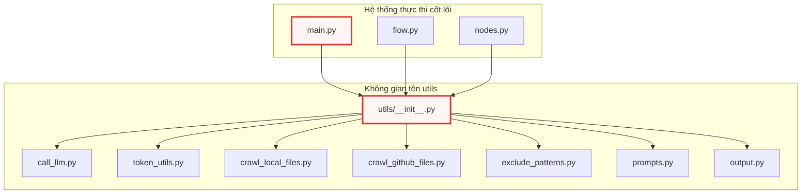

# __init__.py

> **Source:** `utils/__init__.py`

Tệp `utils/__init__.py` là điểm khởi tạo (package initializer) cho gói mô-đun tiện ích `utils` trong hệ thống `test`. Trong môi trường runtime của Python, tệp này đóng vai trò xác định thư mục `utils` như một regular package (gói tiêu chuẩn), thiết lập không gian tên (namespace) và quản lý ranh giới xuất nhập khẩu (export/import boundary) giữa các mô-đun tiện ích bổ trợ với các thành phần điều khiển luồng cốt lõi của ứng dụng.

---

## Tổng quan kỹ thuật

Trong kiến trúc tổng thể của dự án `test`, thư mục `utils` chứa toàn bộ các mô-đun hỗ trợ xử lý tác vụ chuyên biệt, bao gồm:
- Tương tác với các mô hình ngôn ngữ lớn (LLM): [`call_llm.py`](./call_llm.py.md)
- Quản lý và xử lý token: [`token_utils.py`](./token_utils.py.md)
- Thu thập dữ liệu từ hệ thống tệp cục bộ và GitHub: [`crawl_local_files.py`](./crawl_local_files.py.md), [`crawl_github_files.py`](./crawl_github_files.py.md)
- Định nghĩa các mẫu loại trừ: [`exclude_patterns.py`](./exclude_patterns.py.md)
- Quản lý mẫu câu lệnh tương tác (prompts): [`prompts.py`](./prompts.py.md)
- Xuất và định dạng dữ liệu đầu ra: [`output.py`](./output.py.md)

Tệp `utils/__init__.py` hiện diện với nội dung rỗng (0 bytes). Đây là mô hình thiết kế có chủ đích nhằm duy trì tính độc lập tối đa giữa các mô-đun nội bộ, tránh hiện tượng phụ thuộc vòng (circular dependency), đồng thời tối ưu hóa thời gian khởi động (startup time) của ứng dụng thông qua cơ chế nạp mô-đun lười (lazy/selective import). Khi một thành phần bên ngoài như [`nodes.py`](../nodes.py.md) hoặc [`flow.py`](../flow.py.md) cần sử dụng một công cụ cụ thể, nó sẽ truy xuất trực tiếp từ mô-đun đích thay vì phải nạp toàn bộ các thành phần nặng của toàn bộ gói `utils` vào bộ nhớ.

---

## Kiến trúc Package và Luồng Phụ thuộc

Dưới đây là sơ đồ kiến trúc thể hiện vị trí trung tâm của `utils/__init__.py` trong việc xác lập không gian tên `utils` và mối quan hệ với các mô-đun con cũng như các luồng thực thi cấp cao:



### Cơ chế phân giải mô-đun (Module Resolution)

Khi trình thông dịch Python nạp bất kỳ tệp nào bên trong thư mục `utils`, hệ thống import sẽ thực hiện các bước sau:

1. **Kiểm tra `sys.modules`**: Xác định xem package `utils` đã được khởi tạo trong bộ nhớ cache hay chưa.
2. **Khởi tạo Namespace**: Nếu chưa tồn tại, Python sẽ tạo một đối tượng module rỗng kiểu `types.ModuleType` với thuộc tính `__name__ = "utils"`.
3. **Thực thi `utils/__init__.py`**: Thực thi mã nguồn trong tệp này để gán các thuộc tính cơ bản (`__file__`, `__path__`, `__package__`). Vì tệp rỗng, không có biến hoặc hàm bổ sung nào được gán vào không gian tên gốc của package.
4. **Phân giải mô-đun con**: Trình nạp tiếp tục nạp các mô-đun con được chỉ định (ví dụ: `utils.call_llm`) và liên kết chúng thành thuộc tính của `utils`.

---

## Chi tiết các thành phần nội bộ (Internal Components)

### Khai báo lớp và hàm

Tệp `utils/__init__.py` không khai báo trực tiếp bất kỳ lớp (class), hàm (function), phương thức (method) hoặc biến hằng số tùy chỉnh nào. 

### Các thuộc tính mặc định do Python gán tự động

Mặc dù mã nguồn không chứa câu lệnh, trình thông dịch Python khi nạp `utils/__init__.py` vẫn cấp phát và quản lý các thuộc tính không gian tên nền tảng:

* `__name__` (`str`): Tên định danh của mô-đun trong cây phân giải, có giá trị là `"utils"`.
* `__file__` (`str`): Đường dẫn tuyệt đối hoặc tương đối trỏ đến tệp `utils/__init__.py` trên hệ thống tệp cục bộ.
* `__package__` (`str`): Tên của package cha quản lý tệp này, có giá trị là `"utils"`.
* `__path__` (`list[str]`): Danh sách chứa đường dẫn thư mục mà Python sử dụng để tìm kiếm các mô-đun con nằm trong `utils`.
* `__doc__` (`None` hoặc `str`): Docstring cấp mô-đun (mang giá trị `None` do tệp không chứa chuỗi tài liệu).

---

## Phân tích thiết kế kỹ thuật (Engineering Design Analysis)

### 1. Tránh nạp chồng chéo (Side-Effects Mitigation)
Trong các hệ thống phân tích mã nguồn và gọi LLM như ứng dụng hiện tại, việc tích hợp các thư viện bên thứ ba (như `langchain`, `openai`, `tiktoken`) có thể tiêu tốn tài nguyên bộ nhớ và thời gian biên dịch bytecode. Bằng cách giữ `__init__.py` ở trạng thái tối giản, hệ thống đảm bảo:
- Các tiến trình chỉ nạp đúng những gì chúng thực sự sử dụng.
- Không gây ra các tác dụng phụ ngoài ý muốn (side-effects) khi quét gói thư viện.

### 2. Mô hình Explicit Import vs. Wildcard Import
Do tệp không định nghĩa danh sách `__all__`, câu lệnh `from utils import *` sẽ không xuất khẩu bất kỳ đối tượng nào ngoài các thuộc tính nội bộ của package. Điều này bắt buộc các kỹ sư phát triển phải sử dụng cú pháp import tường minh (explicit imports):

```python
# Cú pháp chuẩn được khuyến nghị trong dự án:
from utils.call_llm import call_llm
from utils.token_utils import count_tokens
from utils.crawl_local_files import crawl_local_files
```

Việc này giúp công cụ phân tích tĩnh (linter, static analysis tool, type checker) dễ dàng theo dõi cây phụ thuộc và tối ưu hóa quy trình kiểm thử đơn vị (unit testing).

---

## Xem thêm (See Also)

* [`utils/call_llm.py`](./call_llm.py.md) - Mô-đun phụ trách giao tiếp và thực thi yêu cầu tới LLM.
* [`utils/token_utils.py`](./token_utils.py.md) - Các hàm tiện ích tính toán và phân bổ token.
* [`utils/crawl_local_files.py`](./crawl_local_files.py.md) - Công cụ quét và xử lý tệp tin trên môi trường cục bộ.
* [`utils/crawl_github_files.py`](./crawl_github_files.py.md) - Công cụ tích hợp API thu thập mã nguồn từ GitHub.
* [`utils/exclude_patterns.py`](./exclude_patterns.py.md) - Cấu hình và logic khớp mẫu loại trừ tệp tin/thư mục.
* [`utils/prompts.py`](./prompts.py.md) - Định nghĩa tập hợp các template câu lệnh phục vụ xử lý ngữ cảnh.
* [`utils/output.py`](./output.py.md) - Tiện ích định dạng và lưu trữ kết quả phân tích.
* [`nodes.py`](../nodes.py.md) - Các nút xử lý logic sử dụng trực tiếp các tiện ích trong package `utils`.
* [`flow.py`](../flow.py.md) - Định nghĩa luồng điều khiển chính của hệ thống.
* [`main.py`](../main.py.md) - Điểm nhập lệnh thực thi toàn bộ quy trình.

