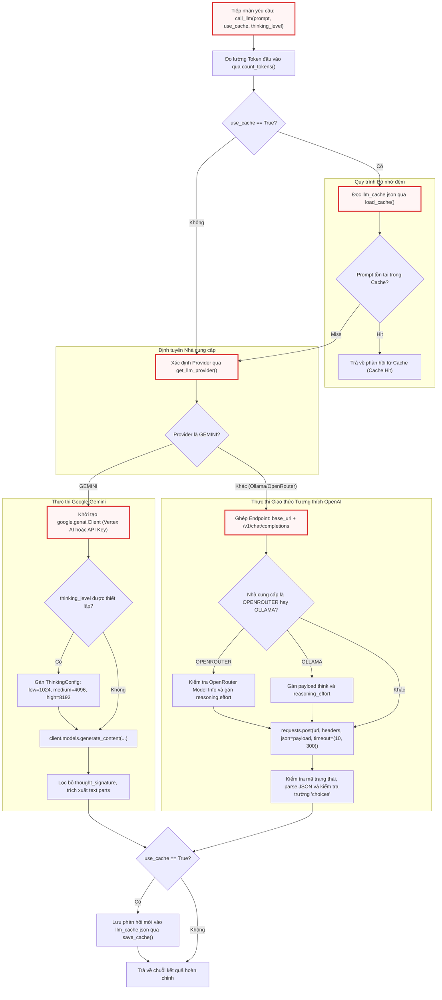

# call_llm.py

> **Source:** `utils/call_llm.py`

Tiếp nối kiến trúc nền tảng từ [Chapter 1 — __init__.py](__init__.py.md), mô-đun `utils.call_llm` là tầng điều phối và trừu tượng hóa giao tiếp với các mô hình ngôn ngữ lớn (Large Language Models - LLMs) trong hệ thống `test`. Tệp này chịu trách nhiệm chuẩn hóa giao diện gọi mô hình đa nhà cung cấp (Google Gemini, OpenRouter, Ollama), quản lý bộ nhớ đệm phản hồi trên đĩa cứng cục bộ, tính toán lượng token tiêu thụ và tích hợp cơ chế suy luận chuyên sâu (reasoning/thinking effort).

---

## Tổng quan Kỹ thuật (Technical Overview)

Mô-đun `call_llm.py` đóng vai trò là cổng giao tiếp duy nhất giữa các nút xử lý nghiệp vụ (như [nodes.py](../nodes.py.md) và [flow.py](../flow.py.md)) với các dịch vụ suy luận trí tuệ nhân tạo. Thiết kế của mô-đun hướng tới việc loại bỏ sự phụ thuộc chặt chẽ vào một nhà cung cấp cụ thể, cho phép hoán đổi linh hoạt giữa các mô hình thương mại đám mây (Google Gemini 3.7 Flash, Claude, OpenAI thông qua OpenRouter) và các mô hình mã nguồn mở triển khai cục bộ (thông qua Ollama) chỉ bằng việc thay đổi biến môi trường.

### Các Trách nhiệm Cốt lõi:
1. **Trừu tượng hóa Nhà cung cấp (Provider Abstraction)**: Tự động phát hiện và định tuyến yêu cầu tới Google Gemini SDK hoặc giao diện REST tương thích OpenAI dựa trên biến môi trường `LLM_PROVIDER`, `GEMINI_PROJECT_ID` hoặc `GEMINI_API_KEY`.
2. **Quản lý Bộ nhớ đệm (Response Caching)**: Cung cấp cơ chế lưu trữ kết quả truy vấn dưới dạng tệp JSON tĩnh (`llm_cache.json`) nhằm loại bỏ chi phí API lặp lại trong các tác vụ kiểm thử hoặc phân tích dữ liệu tĩnh.
3. **Quản lý Cấu hình Suy luận (Thinking & Reasoning Budgets)**: Ánh xạ mức độ suy luận (`low`, `medium`, `high`) thành ngân sách token (thinking budget) trong Gemini API hoặc thuộc tính `reasoning` / `think` trong các giao diện tương thích OpenAI.
4. **Giám sát & Đo lường (Telemetry & Token Auditing)**: Đếm lượng token đầu vào thông qua [token_utils.py](token_utils.py.md), đo thời gian phản hồi thực tế và ghi lại nhật ký chi tiết thông qua hệ thống `logging`.
5. **Xử lý Lỗi Phòng thủ (Defensive Error Handling)**: Bắt lỗi mạng, lỗi phân tích cú pháp JSON, kiểm tra cấu trúc phản hồi HTTP 200 thiếu trường `choices`, và gửi cảnh báo trực tiếp thông qua [output.py](output.py.md).

---

## Kiến trúc Luồng Thực thi (Execution Architecture)

Sơ đồ dưới đây mô tả chi tiết toàn bộ chu trình xử lý của hàm `call_llm()` từ khi tiếp nhận prompt, kiểm tra bộ nhớ đệm, định tuyến nhà cung cấp, cấu hình tham số suy luận cho đến khi xác thực và hoàn trả kết quả.



---

## Biến Toàn cục và Cấu hình Mô-đun (Module-Level Configuration)

Tệp `call_llm.py` khởi tạo các biến toàn cục và thiết lập cấu hình ghi nhật ký ngay tại thời điểm nhập mô-đun:

```python
# Load environment variables from .env file
load_dotenv()

# Configure logging - deferred until main.py calls configure_logging()
# At import time, set up logger with NullHandler (no file output yet)
logger = logging.getLogger("llm_logger")
logger.setLevel(logging.INFO)
logger.propagate = False  # Prevent propagation to root logger
logger.addHandler(logging.NullHandler())  # Absorb logs until configured


# Simple cache configuration
cache_file = "llm_cache.json"

# Cache for model capabilities to avoid repeated API calls
_openrouter_models_cache = None
```

### Phân tích Cơ chế Cấu hình:
- **`load_dotenv()`**: Tự động tải các biến môi trường từ tệp `.env` vào `os.environ` ngay khi mô-đun được import.
- **`logger` ("llm_logger")**: Thiết lập logger độc lập với `NullHandler` và ngắt lan truyền (`propagate = False`). Chiến lược này ngăn chặn các thông điệp log rác xuất hiện trên console trước khi hàm `configure_logging()` của [main.py](../main.py.md) thiết lập các handler chính thức (ghi ra tệp hoặc console).
- **`cache_file`**: Tên tệp lưu trữ cache mặc định (`llm_cache.json`) nằm tại thư mục thực thi gốc của tiến trình.
- **`_openrouter_models_cache`**: Bộ nhớ đệm trong RAM lưu trữ danh sách siêu dữ liệu (metadata) của các mô hình OpenRouter, giúp hạn chế việc gọi lặp lại endpoint `https://openrouter.ai/api/v1/models`.

---

## Chi tiết Các Hàm Cấp Mô-đun (Module-Level Functions)

### `load_cache()`
**Visibility**: Public  
**Signature**: `def load_cache() -> dict:`

**Description**:  
Đọc và phân tích cú pháp tệp bộ nhớ đệm `llm_cache.json` từ đĩa cứng. Nếu tệp không tồn tại, bị lỗi định dạng JSON hoặc không thể truy cập do quyền hệ thống, hàm sẽ ghi lại cảnh báo vào logger và phục hồi an toàn bằng cách trả về một từ điển (`dict`) rỗng.

**Parameters**:  
* Không có tham số.

**Returns**:  
* `dict`: Dữ liệu bộ nhớ đệm đã lưu dưới dạng cặp khóa-giá trị (`prompt: response`), hoặc từ điển rỗng nếu nạp thất bại.

**Raises**:  
* Không ném ngoại lệ ra ngoài (mọi lỗi I/O hoặc JSONDecodeError đều được bắt cục bộ).

**Example**:
```python
def load_cache():
    try:
        with open(cache_file) as f:
            return json.load(f)
    except Exception:
        logger.warning("Failed to load cache.")
    return {}
```

Đoạn mã trên thể hiện tính phòng thủ cao trong việc thao tác tệp. Khối `try...except Exception` bao bọc toán tử mở tệp và `json.load(f)` đảm bảo runtime không bị sập nếu tệp `llm_cache.json` chưa được khởi tạo trong lần chạy đầu tiên hoặc bị ngắt đột ngột khi đang ghi. Khi phát sinh lỗi, một thông báo cảnh báo mức `WARNING` được chuyển tới `llm_logger` và hàm trả về từ điển rỗng để tiến trình tiếp tục bình thường mà không sử dụng cache cũ.

---

### `save_cache()`
**Visibility**: Public  
**Signature**: `def save_cache(cache: dict) -> None:`

**Description**:  
Tuần tự hóa và ghi toàn bộ dữ liệu từ điển bộ nhớ đệm vào tệp `llm_cache.json`. Nếu quá trình ghi đĩa gặp sự cố (thiếu quyền truy cập, đầy bộ nhớ đĩa), hàm sẽ bắt ngoại lệ và ghi log cảnh báo mà không làm gián đoạn luồng thực thi chính của ứng dụng.

**Parameters**:  
* `cache` (`dict`): Cấu trúc dữ liệu từ điển chứa toàn bộ các cặp prompt và phản hồi LLM cần được duy trì xuống đĩa.

**Returns**:  
* `None`

**Raises**:  
* Không ném ngoại lệ ra ngoài.

**Example**:
```python
def save_cache(cache):
    try:
        with open(cache_file, "w") as f:
            json.dump(cache, f)
    except Exception:
        logger.warning("Failed to save cache")
```

Hàm `save_cache` mở tệp `cache_file` với chế độ ghi đè (`"w"`). Thao tác `json.dump` sẽ chuyển toàn bộ cấu trúc dữ liệu `dict` trong bộ nhớ thành định dạng JSON chuẩn. Việc bao bọc toàn bộ khối lệnh trong khối `try...except` ngăn ngừa việc lỗi ghi tệp làm sập luồng điều khiển của [flow.py](../flow.py.md), đảm bảo tính khả dụng của tác vụ chính ngay cả khi hệ thống tệp gặp trục trặc.

---

### `get_llm_provider()`
**Visibility**: Public  
**Signature**: `def get_llm_provider() -> str | None:`

**Description**:  
Xác định nhà cung cấp LLM mục tiêu dựa trên thứ tự ưu tiên của biến môi trường. Hàm kiểm tra trực tiếp biến `LLM_PROVIDER`. Nếu biến này chưa được thiết lập nhưng hệ thống phát hiện có `GEMINI_PROJECT_ID` hoặc `GEMINI_API_KEY`, giá trị trả về sẽ tự động mặc định là `"GEMINI"`.

**Parameters**:  
* Không có tham số.

**Returns**:  
* `str | None`: Tên định danh của nhà cung cấp (ví dụ: `"GEMINI"`, `"OPENROUTER"`, `"OLLAMA"`) hoặc `None` nếu không tìm thấy cấu hình hợp lệ.

**Raises**:  
* Không ném ngoại lệ.

**Example**:
```python
def get_llm_provider():
    provider = os.getenv("LLM_PROVIDER")
    if not provider and (os.getenv("GEMINI_PROJECT_ID") or os.getenv("GEMINI_API_KEY")):
        provider = "GEMINI"
    # if necessary, add ANTHROPIC/OPENAI
    return provider
```

Hàm `get_llm_provider` cung cấp cơ chế dự phòng thông minh (fallback mechanism) cho cấu hình môi trường. Logic này giúp đơn giản hóa việc triển khai hệ thống: người dùng chỉ cần cung cấp khóa `GEMINI_API_KEY` hoặc `GEMINI_PROJECT_ID` trong tệp `.env` là hệ thống có thể tự động nhận diện và kích hoạt driver Gemini mà không bắt buộc phải khai báo tường minh `LLM_PROVIDER=GEMINI`.

---

### `_get_openrouter_model_info()`
**Visibility**: Private  
**Signature**: `def _get_openrouter_model_info(model_id: str) -> dict | None:`

**Description**:  
Truy xuất siêu dữ liệu và thông tin tính năng của một mô hình cụ thể từ OpenRouter API (`https://openrouter.ai/api/v1/models`). Hàm áp dụng cơ chế nạp lười (lazy loading) và lưu kết quả vào biến toàn cục `_openrouter_models_cache` để tái sử dụng trong các lần gọi tiếp theo mà không làm tăng độ trễ mạng.

**Parameters**:  
* `model_id` (`str`): Định danh định tuyến của mô hình trên OpenRouter (ví dụ: `"anthropic/claude-3.7-sonnet"`, `"deepseek/deepseek-r1"`).

**Returns**:  
* `dict | None`: Từ điển chứa siêu dữ liệu của mô hình (bao gồm ngữ cảnh, khả năng suy luận, chi phí token), hoặc `None` nếu không tìm thấy mô hình hoặc gặp lỗi kết nối.

**Raises**:  
* Không ném ngoại lệ (lỗi HTTP/mạng được hấp thụ an toàn thành danh sách rỗng).

**Example**:
```python
def _get_openrouter_model_info(model_id: str) -> dict:
    global _openrouter_models_cache
    if _openrouter_models_cache is None:
        try:
            resp = requests.get("https://openrouter.ai/api/v1/models", timeout=5)
            _openrouter_models_cache = resp.json().get("data", [])
        except Exception:
            _openrouter_models_cache = []

    return next((m for m in _openrouter_models_cache if m.get("id") == model_id), None)
```

Cơ chế thực thi của `_get_openrouter_model_info` đảm bảo hiệu năng tối ưu thông qua biến toàn cục `_openrouter_models_cache`. Trong lần gọi đầu tiên, hàm kích hoạt yêu cầu HTTP GET đồng bộ với thời gian chờ tối đa 5 giây (`timeout=5`). Cấu trúc danh sách `data` trả về từ OpenRouter được lưu vào RAM, sau đó hàm dùng hàm tích hợp `next()` kết hợp biểu thức máy phát (generator expression) để tìm kiếm phần tử có khóa `id` khớp với `model_id`.

---

### `get_model_context_length()`
**Visibility**: Public  
**Signature**: `def get_model_context_length(endpoint_url: str, model_name: str, api_key: str = "") -> int:`

**Description**:  
Xác định giới hạn cửa sổ ngữ cảnh (maximum context length) tối đa của mô hình dựa trên URL endpoint và tên mô hình. Hàm thiết lập giá trị mặc định là 1.000.000 tokens cho các endpoint và mô hình thuộc họ Google Gemini, tự động truy vấn API của OpenRouter nếu endpoint thuộc `openrouter.ai`, và áp dụng ngưỡng an toàn dự phòng là 100.000 tokens cho các trường hợp còn lại.

**Parameters**:  
* `endpoint_url` (`str`): Địa chỉ URL cơ sở hoặc endpoint của dịch vụ API.
* `model_name` (`str`): Tên hoặc mã định danh của mô hình LLM.
* `api_key` (`str`, optional): Khóa API dùng cho việc xác thực nếu endpoint yêu cầu. Mặc định là chuỗi rỗng `""`.

**Returns**:  
* `int`: Số lượng token tối đa mà mô hình có thể tiếp nhận trong một phiên làm việc.

**Raises**:  
* Không ném ngoại lệ ra ngoài (các lỗi kết nối mạng được ghi log cảnh báo và trả về giá trị mặc định).

**Example**:
```python
def get_model_context_length(endpoint_url: str, model_name: str, api_key: str = "") -> int:
    default_limit = 100000
    try:
        if not endpoint_url:
            return default_limit

        if "generativelanguage.googleapis.com" in endpoint_url or "gemini" in model_name.lower():
            # Safely default to 1M tokens for Gemini models
            return 1000000

        if "openrouter.ai" in endpoint_url:
            resp = requests.get("https://openrouter.ai/api/v1/models", timeout=5)
            data = resp.json().get("data", [])
            for m in data:
                if m.get("id") == model_name:
                    return m.get("context_length", default_limit)
    except Exception as e:
        logger.warning(f"Failed to fetch context length for {model_name} at {endpoint_url}: {e}")

    return default_limit
```

Hàm này đóng vai trò quan trọng trong việc hỗ trợ các thuật toán phân đoạn dữ liệu và kiểm soát giới hạn cửa sổ ngữ cảnh trước khi truyền prompt lớn vào mô hình. Logic nhận diện thông minh áp dụng điều kiện `generativelanguage.googleapis.com` hoặc từ khóa `gemini` để gán ngay ngưỡng 1 triệu tokens mà không cần thực hiện thêm cuộc gọi mạng nào. Đối với OpenRouter, hàm phân tích mảng dữ liệu JSON để trích xuất trường `context_length`.

---

### `_call_llm_provider()`
**Visibility**: Private  
**Signature**: `def _call_llm_provider(prompt: str, thinking_level: str | None = None) -> str:`

**Description**:  
Thực hiện yêu cầu sinh văn bản qua giao thức HTTP REST tương thích với OpenAI Chat Completions API (`/v1/chat/completions`). Hàm đọc cấu hình từ các biến môi trường động dựa trên tên provider (`<PROVIDER>_MODEL`, `<PROVIDER>_BASE_URL`, `<PROVIDER>_API_KEY`), cấu hình mức độ suy luận (reasoning effort) phù hợp cho OpenRouter hoặc Ollama, và thực hiện kiểm tra phản hồi phòng thủ đa lớp.

**Parameters**:  
* `prompt` (`str`): Nội dung câu lệnh văn bản gửi tới mô hình.
* `thinking_level` (`str | None`, optional): Mức độ suy luận mong muốn (ví dụ: `"low"`, `"medium"`, `"high"`). Mặc định là `None`.

**Returns**:  
* `str`: Nội dung văn bản phản hồi do LLM sinh ra từ trường `choices[0].message.content`.

**Raises**:  
* `ValueError`: Khi thiếu biến môi trường bắt buộc (`LLM_PROVIDER`, `<PROVIDER>_MODEL`, `<PROVIDER>_BASE_URL`), khi phản hồi từ máy chủ không phải là JSON hợp lệ, hoặc khi mã HTTP là 200 nhưng thiếu trường `choices`.
* `Exception`: Bọc các lỗi mạng từ thư viện `requests` bao gồm `HTTPError`, `ConnectionError`, `Timeout`, và `RequestException`.

**Example**:
```python
def _call_llm_provider(prompt: str, thinking_level: str | None = None) -> str:
    // ... trích xuất biến môi trường và thiết lập headers ...
    payload = {
        "model": model,
        "messages": [{"role": "user", "content": prompt}],
        "temperature": 0.7,
    }

    if provider == "OPENROUTER" and thinking_level:
        model_info = _get_openrouter_model_info(model)
        if model_info and "reasoning" in model_info:
            supported_efforts = model_info["reasoning"].get("supported_efforts", [])
            if thinking_level.lower() in supported_efforts:
                payload["reasoning"] = {"effort": thinking_level.lower()}
                payload["temperature"] = 1.0  # Required for many reasoning models
            else:
                logger.warning(f"Invalid thinking level '{thinking_level}' for model {model}. Supported efforts: {supported_efforts}")
        else:
            logger.warning(f"Model {model} does not support reasoning via OpenRouter API.")

    elif provider == "OLLAMA" and thinking_level:
        # Some Ollama SDKs / API versions look for `think`, others look for standard `reasoning_effort`
        payload["think"] = thinking_level.lower()
        payload["reasoning_effort"] = thinking_level.lower()
        payload["temperature"] = 1.0

    try:
        response = requests.post(url, headers=headers, json=payload, timeout=(10, 300))
        try:
            response_json = response.json()  # Log the response
        except (ValueError, requests.exceptions.JSONDecodeError):
            from utils.output import emit_raw

            emit_raw(
                "WARNING",
                f"Warning: Provider returned invalid JSON. Status Code: {response.status_code}, Response Text: {response.text}",
                dest="STDOUT",
            )
            logger.warning(f"Provider returned invalid JSON. Status Code: {response.status_code}, Response Text: {response.text}")
            raise ValueError(f"Provider returned invalid JSON. Status Code: {response.status_code}") from None
        response.raise_for_status()

        # Defensive check: API may return 200 with error/rate-limit payload missing 'choices'
        if "choices" not in response_json or not response_json["choices"]:
            error_detail = response_json.get("error", response_json)
            logger.warning(f"API returned 200 but no 'choices' in response: {error_detail}")
            raise ValueError(f"API response missing 'choices' key. Response: {error_detail}")

        return response_json["choices"][0]["message"]["content"]
    except requests.exceptions.HTTPError as e:
        // ... xử lý lỗi HTTP ...
```

Hàm `_call_llm_provider` chứa các cơ chế kiểm soát kỹ thuật chuyên sâu. Về phần tham số mô hình, khi kích hoạt suy luận (`thinking_level`), hàm sẽ tự động nâng `temperature` lên `1.0` theo khuyến nghị của các kiến trúc mô hình suy luận hiện đại và tiêm tham số tương ứng vào payload (`reasoning` cho OpenRouter, `think`/`reasoning_effort` cho Ollama). Về xử lý mạng, thời gian chờ được cấu hình dạng tuple `timeout=(10, 300)` (10 giây cho kết nối TCP, 300 giây cho quá trình sinh phản hồi). Hàm còn tích hợp bước kiểm tra phòng thủ quan trọng: phát hiện trường hợp một số gateway trả về HTTP 200 kèm payload báo lỗi (rate limit/quota) nhưng khuyết mảng `choices`.

---

### `_call_llm_gemini()`
**Visibility**: Private  
**Signature**: `def _call_llm_gemini(prompt: str, thinking_level: str | None = None) -> str:`

**Description**:  
Thực thi cuộc gọi tới Google Gemini API bằng cách sử dụng SDK chính thức mới (`google.genai`). Hàm hỗ trợ xác thực thông qua Google Cloud Vertex AI (nếu có `GEMINI_PROJECT_ID`) hoặc qua API Key trực tiếp (`GEMINI_API_KEY`). Ngoài ra, hàm chuyển đổi mức độ suy luận thành ngân sách token (`ThinkingConfig`) và tự động trích xuất các phần dữ liệu văn bản thuần túy, loại bỏ các phần tử suy luận nội bộ (`thought_signature`) khỏi kết quả cuối cùng.

**Parameters**:  
* `prompt` (`str`): Nội dung câu lệnh gửi tới mô hình Gemini.
* `thinking_level` (`str | None`, optional): Mức độ suy luận được ánh xạ thành ngân sách token (`low` -> 1024, `medium` -> 4096, `high` -> 8192). Mặc định là `None`.

**Returns**:  
* `str`: Chuỗi văn bản phản hồi đã được ghép từ các phần tử văn bản (`text parts`) của ứng viên đầu tiên (`candidates[0]`).

**Raises**:  
* `ValueError`: Khi không tìm thấy cả hai biến môi trường `GEMINI_PROJECT_ID` lẫn `GEMINI_API_KEY`.
* `Exception`: Các ngoại lệ do SDK `google-genai` phát sinh trong quá trình gọi hàm `client.models.generate_content`.

**Example**:
```python
def _call_llm_gemini(prompt: str, thinking_level: str | None = None) -> str:
    if os.getenv("GEMINI_PROJECT_ID"):
        client = genai.Client(vertexai=True, project=os.getenv("GEMINI_PROJECT_ID"), location=os.getenv("GEMINI_LOCATION", "us-central1"))
    elif os.getenv("GEMINI_API_KEY"):
        client = genai.Client(api_key=os.getenv("GEMINI_API_KEY"))
    else:
        raise ValueError("Either GEMINI_PROJECT_ID or GEMINI_API_KEY must be set in the environment")
    model = os.getenv("GEMINI_MODEL", "gemini-3.7-flash")

    kwargs = {"model": model, "contents": [prompt]}

    if thinking_level:
        # Map string levels to budgets for the installed SDK version
        budget_map = {"low": 1024, "medium": 4096, "high": 8192}
        budget = budget_map.get(thinking_level.lower(), 4096)
        thinking_config = types.ThinkingConfig(include_thoughts=True, thinking_budget=budget)
        kwargs["config"] = types.GenerateContentConfig(thinking_config=thinking_config)

    response = client.models.generate_content(**kwargs)

    # Extract only text parts to avoid "non-text parts: ['thought_signature']" warnings
    if response.candidates and response.candidates[0].content.parts:
        text_parts = [part.text for part in response.candidates[0].content.parts if part.text is not None]
        return "".join(text_parts)
    return ""
```

Hàm `_call_llm_gemini` thể hiện kỹ thuật tích hợp với SDK `google-genai` thế hệ mới. Khi cấu hình suy luận, từ điển `budget_map` ánh xạ linh hoạt các chuỗi định tính thành giới hạn token cụ thể (`low`: 1024, `medium`: 4096, `high`: 8192), giúp kiểm soát chi phí token suy luận. Đoạn trích xuất phản hồi duyệt qua mảng `parts` của cấu trúc `content` và chỉ lấy các phần tử có thuộc tính `text` không rỗng (`part.text is not None`). Thao tác này loại trừ triệt để lỗi cảnh báo hệ thống liên quan đến việc chuyển đổi các phần phi văn bản như `thought_signature` sang chuỗi.

---

### `call_llm()`
**Visibility**: Public  
**Signature**: `def call_llm(prompt: str, use_cache: bool = True, thinking_level: str | None = None) -> str:`

**Description**:  
Điểm nhập (entry point) chính và công khai của toàn bộ mô-đun để thực hiện các yêu cầu suy luận LLM. Hàm thực hiện chuỗi thao tác hoàn chỉnh: tính toán số lượng token đầu vào thông qua `count_tokens`, kiểm tra và trả về dữ liệu từ bộ nhớ đệm nếu có yêu cầu (`use_cache=True`), đo đạc thời gian phản hồi thực tế của API, điều phối yêu cầu tới driver tương ứng (`_call_llm_gemini` hoặc `_call_llm_provider`), và cập nhật bộ nhớ đệm đĩa sau khi nhận phản hồi thành công.

**Parameters**:  
* `prompt` (`str`): Nội dung chuỗi câu lệnh gửi tới mô hình.
* `use_cache` (`bool`, optional): Cờ cho phép đọc và ghi bộ nhớ đệm cục bộ (`llm_cache.json`). Mặc định là `True`.
* `thinking_level` (`str | None`, optional): Mức độ suy luận mong muốn (`"low"`, `"medium"`, `"high"` hoặc `None`). Mặc định là `None`.

**Returns**:  
* `str`: Chuỗi văn bản phản hồi hoàn chỉnh từ mô hình LLM.

**Raises**:  
* `ValueError`: Phát sinh gián tiếp khi thiếu cấu hình môi trường hoặc phản hồi từ nhà cung cấp không hợp lệ.
* `Exception`: Phát sinh gián tiếp từ các lỗi kết nối mạng hoặc lỗi SDK trong các hàm nội bộ.

**Example**:
```python
def call_llm(prompt: str, use_cache: bool = True, thinking_level: str | None = None) -> str:
    import time

    from utils.token_utils import count_tokens

    provider = get_llm_provider()
    model = os.environ.get(f"{provider}_MODEL", os.environ.get("GEMINI_MODEL", "unknown"))
    prompt_tokens = count_tokens(prompt)

    logger.info(f"{'=' * 80}")
    logger.info(
        f"LLM CALL START | provider={provider} | model={model} | thinking={thinking_level} | cache={'enabled' if use_cache else 'disabled'} | prompt_tokens={prompt_tokens:,}"
    )
    logger.info(f"PROMPT:\n{prompt}")

    # Check cache if enabled
    if use_cache:
        cache = load_cache()
        if prompt in cache:
            cached_response = cache[prompt]
            logger.info(f"CACHE HIT | response_chars={len(cached_response):,}")
            logger.info(f"RESPONSE (cached):\n{cached_response}")
            logger.info("LLM CALL END | result=cache_hit")
            return cached_response

    # Make the actual LLM call
    start_time = time.time()
    logger.info(f"API CALL | sending request to {provider}...")

    if provider == "GEMINI":
        response_text = _call_llm_gemini(prompt, thinking_level=thinking_level)
    else:  # generic method using a URL that is OpenAI compatible API (Ollama, ...)
        response_text = _call_llm_provider(prompt, thinking_level=thinking_level)

    elapsed = time.time() - start_time
    logger.info(f"API CALL COMPLETE | elapsed={elapsed:.1f}s | response_chars={len(response_text):,}")
    logger.info(f"RESPONSE:\n{response_text}")

    # Update cache if enabled
    if use_cache:
        cache = load_cache()
        cache[prompt] = response_text
        save_cache(cache)
        logger.info("CACHE WRITE | saved response to cache")

    logger.info(f"LLM CALL END | result=success | elapsed={elapsed:.1f}s")
    return response_text
```

Hàm `call_llm` là trung tâm giám sát hoạt động AI của hệ thống. Trước khi thực thi bất kỳ thao tác mạng nào, hàm kích hoạt `count_tokens(prompt)` từ [token_utils.py](token_utils.py.md) nhằm ghi lại chính xác tải trọng đầu vào. Cơ chế cache hit diễn ra với độ phức tạp $O(1)$ sau khi nạp JSON, giúp trả về kết quả ngay lập tức mà không tiêu tốn quota API. Trong trường hợp cache miss hoặc `use_cache=False`, hàm sử dụng mô-đun `time` để bấm giờ chi tiết tới từng phần mười giây (`elapsed={elapsed:.1f}s`), hỗ trợ việc chẩn đoán các nút thắt cổ chai về hiệu năng trên môi trường thực tế.

---

## Khối Kiểm thử Thực thi Cục bộ (Direct Execution Test Block)

Ở cuối tệp, đoạn mã điều kiện `if __name__ == "__main__":` cung cấp một kịch bản kiểm thử nhanh tính năng gọi LLM trực tiếp từ dòng lệnh:

```python
if __name__ == "__main__":
    test_prompt = "Hello, how are you?"

    # First call - should hit the API
    print("Making call...")
    response1 = call_llm(test_prompt, use_cache=False)
    print(f"Response: {response1}")
```

### Phân tích Hoạt động Kiểm thử:
1. Định nghĩa chuỗi kiểm thử cơ bản `test_prompt = "Hello, how are you?"`.
2. Vô hiệu hóa bộ nhớ đệm (`use_cache=False`) nhằm ép buộc hệ thống gửi một yêu cầu HTTP thực tế tới nhà cung cấp đã được cấu hình trong tệp `.env`.
3. In trực tiếp kết quả phản hồi ra màn hình console (`STDOUT`), cho phép kỹ sư xác thực cấu hình API Key, kết nối mạng và tính tương thích của mô hình ngay tại chỗ mà không cần chạy toàn bộ pipeline.

---

## Xem thêm (See Also)

- [Chapter 1 — __init__.py](__init__.py.md): Khởi tạo không gian tên gói `utils`.
- [token_utils.py](token_utils.py.md): Cung cấp hàm `count_tokens` phục vụ đo lường tải trọng token đầu vào cho `call_llm`.
- [output.py](output.py.md): Cung cấp hàm `emit_raw` để xuất các cảnh báo và thông điệp trạng thái khi gặp phản hồi API lỗi.
- [prompts.py](prompts.py.md): Quản lý danh mục các mẫu prompt hệ thống được đưa vào `call_llm`.
- [nodes.py](../nodes.py.md): Các nút xử lý nghiệp vụ chính gọi trực tiếp tới `call_llm`.
- [flow.py](../flow.py.md): Trình điều phối luồng thực thi đồ thị phụ thuộc vào kết quả của `call_llm`.
- [main.py](../main.py.md): Điểm khởi đầu ứng dụng cấu hình hệ thống ghi nhật ký và biến môi trường cho `call_llm`.

