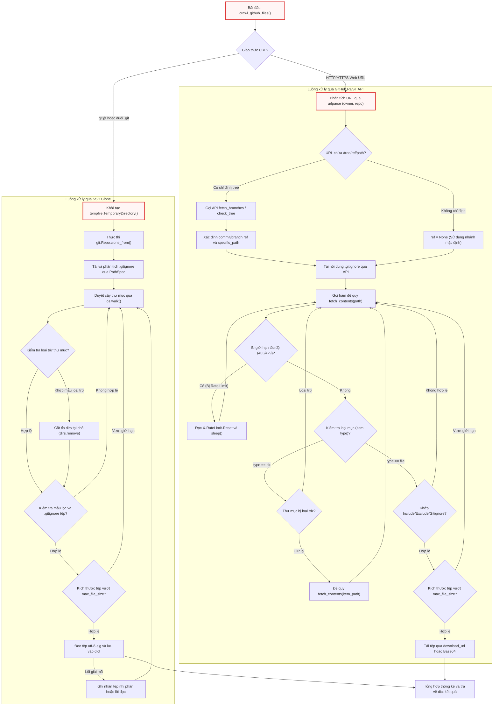

# crawl_github_files.py

> **Source:** `utils/crawl_github_files.py`

Tiếp nối sau [Chương 2 — call_llm.py](call_llm.py.md) (mô-đun đảm nhận vai trò trừu tượng hóa và điều phối các yêu cầu giao tiếp với mô hình ngôn ngữ lớn), mô-đun `crawl_github_files.py` đóng vai trò là cổng thu nạp dữ liệu từ xa (remote data ingestion engine). Thành phần này chịu trách nhiệm trích xuất, phân tích, lọc và tải toàn bộ cây mã nguồn từ các kho lưu trữ GitHub từ xa về bộ nhớ hệ thống. Dữ liệu văn bản mã nguồn thu thập được sẽ trở thành ngữ cảnh đầu vào quan trọng cho các nút phân tích và tạo tài liệu trong toàn bộ quy trình làm việc.

---

## 1. Tổng quan kỹ thuật (Technical Overview)

Mô-đun `crawl_github_files.py` cung cấp giải pháp toàn diện để trích xuất cấu trúc thư mục và nội dung tệp tin từ GitHub thông qua hai kiến trúc thực thi độc lập:
1. **Kiến trúc bản sao Git qua SSH (SSH Clone Engine):** Sử dụng thư viện `git` (GitPython) để nhân bản kho lưu trữ vào một thư mục tạm thời (`tempfile.TemporaryDirectory`), sau đó duyệt cây thư mục cục bộ bằng `os.walk`.
2. **Kiến trúc giao tiếp REST API (GitHub REST API v3 Engine):** Sử dụng thư viện `requests` để tương tác trực tiếp với giao diện lập trình ứng dụng của GitHub, duyệt đệ quy cây thư mục từ xa thông qua endpoint `/repos/{owner}/{repo}/contents/{path}` mà không cần sao chép toàn bộ lịch sử commit.

### Các đặc tính kỹ thuật cốt lõi:
* **Hệ thống lọc đa tầng (Multi-tier Filtering Pipeline):** Kết hợp việc phân tích cú pháp `.gitignore` theo chuẩn `gitwildmatch` (sử dụng thư viện `pathspec`) cùng với các mẫu lọc bao gồm (`include_patterns`) và loại trừ (`exclude_patterns`) theo chuẩn Unix glob (sử dụng thư viện `fnmatch`).
* **Cắt tỉa nhánh thư mục sớm (Early Directory Pruning):** Nhận diện và loại bỏ hoàn toàn các thư mục bị loại trừ ngay tại cấp độ duyệt cây, ngăn chặn triệt để các yêu cầu mạng hoặc thao tác I/O đĩa không cần thiết.
* **Kiểm soát ngưỡng dung lượng và định dạng tệp:** Kiểm tra kích thước tệp dựa trên siêu dữ liệu trước khi tải nội dung thực tế; tự động phát hiện và bỏ qua các tệp nhị phân (non-text files) thông qua cơ chế giải mã chuỗi UTF-8 / UTF-8-SIG.
* **Tự động xử lý giới hạn tốc độ (Rate Limit Resilience):** Đọc tiêu đề phản hồi `X-RateLimit-Reset` từ GitHub API khi gặp mã trạng thái HTTP 403 hoặc 429, tự động tính toán thời gian chờ và kích hoạt cơ chế thử lại (exponential backoff / sleep).
* **Chuẩn hóa đường dẫn linh hoạt:** Hỗ trợ tính toán đường dẫn tương đối (`use_relative_paths`) dựa trên thư mục con được chỉ định trong URL đầu vào.
* **Phát tín hiệu giám sát thời gian thực:** Đồng bộ hóa trạng thái xử lý tới giao diện người dùng thông qua mô-đun `utils.output` (`emit`, `emit_raw`, `get`).

---

## 2. Kiến trúc luồng điều khiển (Architecture Flowchart)

Sơ đồ dưới đây mô tả toàn bộ luồng quyết định, phân nhánh giao thức và các bước xử lý dữ liệu bên trong hàm `crawl_github_files`:



---

## 3. Danh mục API cấp mô-đun (Module-Level Functions)

### `crawl_github_files()`
**Visibility**: Public  
**Signature**: `def crawl_github_files(repo_url, token=None, max_file_size: int = 1 * 1024 * 1024, use_relative_paths: bool = False, include_patterns: str | set[str] | None = None, exclude_patterns: str | set[str] | None = None) -> dict:`

**Description**: Hàm công khai chính của mô-đun, chịu trách nhiệm nhận diện giao thức kho lưu trữ, khởi tạo trạng thái thu thập, biên dịch các tập mẫu lọc, và điều phối toàn bộ quá trình trích xuất dữ liệu thông qua Git SSH Clone hoặc GitHub REST API. Hàm trả về cấu trúc từ điển chứa bản đồ đường dẫn tệp kèm nội dung chuỗi cùng các siêu dữ liệu thống kê.

**Parameters**:
* `repo_url` (`str`): Đường dẫn URL của kho lưu trữ GitHub. Chấp nhận URL web đầy đủ kèm đường dẫn con và commit hash (ví dụ: `https://github.com/microsoft/autogen/tree/e45a157.../python/packages`), URL SSH (`git@github.com:...`), hoặc URL kết thúc bằng `.git`.
* `token` (`str | None`, tùy chọn): Mã khóa xác thực cá nhân (GitHub Personal Access Token - PAT). Bắt buộc đối với kho lưu trữ riêng tư (private repositories) và khuyến nghị sử dụng đối với kho lưu trữ công khai để vượt qua hạn ngạch giới hạn yêu cầu (rate limits). Có thể truyền trực tiếp hoặc nạp từ biến môi trường `GITHUB_TOKEN`.
* `max_file_size` (`int`, tùy chọn): Ngưỡng dung lượng tệp tối đa tính bằng byte được phép tải và giải mã. Mặc định là `1048576` byte (1 MB).
* `use_relative_paths` (`bool`, tùy chọn): Nếu được bật (`True`), các khóa đường dẫn tệp đầu ra sẽ được cắt tỉa để tương đối với thư mục con đã chỉ định trong `repo_url` thay vì hiển thị toàn bộ đường dẫn từ gốc kho lưu trữ. Mặc định là `False`.
* `include_patterns` (`str | set[str] | None`, tùy chọn): Chuỗi mẫu hoặc tập hợp các mẫu glob chỉ định danh sách các tệp được phép thu thập (ví dụ: `{"*.py", "*.md"}`). Nếu là `None`, toàn bộ các tệp sẽ được chấp nhận.
* `exclude_patterns` (`str | set[str] | None`, tùy chọn): Chuỗi mẫu hoặc tập hợp các mẫu glob chỉ định danh sách các tệp hoặc thư mục cần loại bỏ. Nếu là `None`, không áp dụng bộ lọc loại trừ tùy chỉnh.

**Returns**:
* `dict`: Cấu trúc dữ liệu chứa hai khóa chính:
  * `"files"` (`dict[str, str]`): Bảng ánh xạ từ đường dẫn tệp (`str`) sang nội dung văn bản hoàn chỉnh của tệp (`str`).
  * `"stats"` (`dict[str, Any]`): Siêu dữ liệu thống kê quá trình thu thập bao gồm `downloaded_count`, `skipped_count`, `skipped_files`, `base_path`, `include_patterns`, `exclude_patterns`, và `source` (nếu dùng SSH).

**Raises**:
* `ValueError`: Ném ra khi định dạng URL HTTP của GitHub không hợp lệ (không phân tách được tối thiểu thành phần `owner` và `repo`).
* `Exception`: Ném ra khi vượt quá giới hạn GitHub API Rate Limit mà không cung cấp `token`, hoặc khi xảy ra lỗi nghiêm trọng trong quá trình thực thi lệnh clone qua SSH.

**Example**:
```python
# Trích xuất từ khối __main__ của utils/crawl_github_files.py
repo_url = "https://github.com/pydantic/pydantic/tree/6c38dc93f40a47f4d1350adca9ec0d72502e223f/pydantic"

result = crawl_github_files(
    repo_url,
    token=github_token,
    max_file_size=1 * 1024 * 1024,  # 1 MB in bytes
    use_relative_paths=True,        # Enable relative paths
    include_patterns={"*.py", "*.md"},  # Include Python and Markdown files
)

files = result["files"]
stats = result["stats"]
```

---

## 4. Chi tiết triển khai các hàm nội bộ (Internal Helper Functions & Closures)

Toàn bộ logic nghiệp vụ cốt lõi của `crawl_github_files` được đóng gói thành các hàm lồng (nested helper functions) nhằm bảo toàn phạm vi biến trạng thái và thống kê cục bộ. Dưới đây là phân tích chi tiết từng hàm nội bộ.

### `should_include_file()`
**Visibility**: Private (Internal Closure within `crawl_github_files`)  
**Signature**: `def should_include_file(file_path: str, file_name: str, gitignore_spec=None) -> bool:`

```python
    def should_include_file(file_path: str, file_name: str, gitignore_spec=None) -> bool:
        """Determine if a file should be included based on patterns"""
        # If no include patterns are specified, include all files
        if not include_patterns:
            include_file = True
        else:
            # Check if file matches any include pattern
            include_file = any(fnmatch.fnmatch(file_name, pattern) for pattern in include_patterns)

        # Check gitignore if provided
        if include_file and gitignore_spec and gitignore_spec.match_file(file_path):
            return False

        # If exclude patterns are specified, check if file should be excluded
        if exclude_patterns and include_file:
            # Exclude if file matches any exclude pattern
            exclude_file = any(fnmatch.fnmatch(file_path, pattern) for pattern in exclude_patterns)
            return not exclude_file

        return include_file
```

**Description**: Hàm phán đoán điều kiện lọc tệp đa tầng. Quy trình đánh giá được thực hiện tuần tự: (1) Kiểm tra tên tệp (`file_name`) với tập mẫu `include_patterns` thông qua `fnmatch.fnmatch`. (2) Nếu tệp vượt qua bước 1 và đối tượng quy tắc `gitignore_spec` tồn tại, thực hiện khớp đường dẫn tệp (`file_path`) với các luật loại trừ trong `.gitignore`. (3) Nếu tệp tiếp tục hợp lệ và có tập mẫu `exclude_patterns`, thực hiện khớp đường dẫn tệp với danh sách loại trừ tùy chỉnh. Chỉ khi vượt qua toàn bộ 3 tầng kiểm tra, hàm mới trả về `True`.

**Parameters**:
* `file_path` (`str`): Đường dẫn đầy đủ hoặc tương đối của tệp tính từ gốc thư mục đang quét.
* `file_name` (`str`): Tên định danh đơn lẻ của tệp (basename).
* `gitignore_spec` (`pathspec.PathSpec | None`, tùy chọn): Thể hiện đối tượng biên dịch quy tắc `.gitignore`.

**Returns**:
* `bool`: `True` nếu tệp thỏa mãn toàn bộ tiêu chí thu nạp; `False` nếu tệp bị từ chối bởi bất kỳ tầng lọc nào.

---

### `fetch_branches()`
**Visibility**: Private (Internal Closure within `crawl_github_files`)  
**Signature**: `def fetch_branches(owner: str, repo: str) -> list[dict] | list:`

```python
    def fetch_branches(owner: str, repo: str):
        """Get branches of the repository"""

        url = f"https://api.github.com/repos/{owner}/{repo}/branches"
        response = requests.get(url, headers=headers, timeout=(30, 30))

        if response.status_code in (403, 429) and not token:
            raise Exception("GitHub API rate limit exceeded. Please provide a GitHub token using --token or GITHUB_TOKEN env var.")

        if response.status_code == 404:
            if not token:
                emit_raw(
                    "ERROR",
                    "Error 404: Repository not found or is private.\n"
                    "If this is a private repository, please provide a valid GitHub token via the 'token' argument or set the GITHUB_TOKEN environment variable.",
                )
            else:
                emit_raw(
                    "ERROR",
                    "Error 404: Repository not found or insufficient permissions with the provided token.\n"
                    "Please verify the repository exists and the token has access to this repository.",
                )
            return []

        if response.status_code != 200:
            emit_raw("ERROR", f"Error fetching the branches of {owner}/{repo}: {response.status_code} - {response.text}")
            return []

        return response.json()
```

**Description**: Hàm thực hiện truy vấn HTTP GET tới endpoint `/repos/{owner}/{repo}/branches` của GitHub API để lấy danh sách toàn bộ các nhánh hiện có trong kho lưu trữ. Hàm thiết lập thời gian chờ kết nối và đọc cố định là 30 giây (`timeout=(30, 30)`). Hàm xử lý các tình huống lỗi phổ biến: ném ngoại lệ nếu bị chặn bởi Rate Limit khi không có token, ghi thông báo lỗi chi tiết ra hệ thống xuất tín hiệu khi nhận mã phản hồi HTTP 404 (kho riêng tư hoặc không tồn tại) hoặc các mã lỗi HTTP khác, và trả về danh sách đối tượng JSON biểu diễn các nhánh nếu thành công.

**Parameters**:
* `owner` (`str`): Tên tổ chức hoặc chủ sở hữu kho lưu trữ GitHub.
* `repo` (`str`): Tên kho lưu trữ mục tiêu.

**Returns**:
* `list[dict] | list`: Danh sách các từ điển chứa siêu dữ liệu nhánh từ GitHub API, hoặc danh sách rỗng `[]` nếu yêu cầu thất bại.

**Raises**:
* `Exception`: Khi mã phản hồi là 403 hoặc 429 và biến `token` không được thiết lập.

---

### `check_tree()`
**Visibility**: Private (Internal Closure within `crawl_github_files`)  
**Signature**: `def check_tree(owner: str, repo: str, tree: str) -> bool:`

```python
    def check_tree(owner: str, repo: str, tree: str):
        """Check the repository has the given tree"""

        url = f"https://api.github.com/repos/{owner}/{repo}/git/trees/{tree}"
        response = requests.get(url, headers=headers, timeout=(30, 30))

        if response.status_code in (403, 429) and not token:
            raise Exception("GitHub API rate limit exceeded. Please provide a GitHub token using --token or GITHUB_TOKEN env var.")

        return response.status_code == 200
```

**Description**: Hàm thực hiện kiểm tra sự tồn tại của một đối tượng Git Tree (hoặc commit SHA) cụ thể trong kho lưu trữ từ xa thông qua endpoint `/repos/{owner}/{repo}/git/trees/{tree}`. Đây là cơ chế xác thực thứ cấp: khi chuỗi định danh trên URL không khớp với bất kỳ tên nhánh nào thu được từ `fetch_branches()`, hệ thống sẽ gọi `check_tree()` để xác định xem chuỗi đó có phải là một commit SHA hoặc Git tree hash hợp lệ hay không.

**Parameters**:
* `owner` (`str`): Tên chủ sở hữu kho lưu trữ.
* `repo` (`str`): Tên kho lưu trữ.
* `tree` (`str`): Mã băm commit SHA hoặc định danh Git Tree cần kiểm tra.

**Returns**:
* `bool`: Trả về `True` nếu máy chủ GitHub phản hồi mã trạng thái HTTP 200 (Tree tồn tại); ngược lại trả về `False`.

**Raises**:
* `Exception`: Khi mã trạng thái phản hồi rơi vào 403 hoặc 429 và yêu cầu không mang theo token xác thực.

---

### `fetch_contents()`
**Visibility**: Private (Internal Recursive Closure within `crawl_github_files`)  
**Signature**: `def fetch_contents(path: str) -> None:`

```python
    def fetch_contents(path):
        """Fetch contents of the repository at a specific path and commit"""
        url = f"https://api.github.com/repos/{owner}/{repo}/contents/{path}"
        params = {"ref": ref} if ref is not None else {}

        response = requests.get(url, headers=headers, params=params, timeout=(30, 30))

        if response.status_code in (403, 429) and "rate limit exceeded" in response.text.lower():
            if not token:
                raise Exception("GitHub API rate limit exceeded. Please provide a GitHub token using --token or GITHUB_TOKEN env var.")
            reset_time = int(response.headers.get("X-RateLimit-Reset", 0))
            wait_time = max(reset_time - time.time(), 0) + 1
            emit_raw("WARNING", f"Rate limit exceeded. Waiting for {wait_time:.0f} seconds...")
            time.sleep(wait_time)
            return fetch_contents(path)

        if response.status_code == 404:
            # ... xử lý thông báo lỗi 404 cho kho lưu trữ hoặc đường dẫn ...
            return None

        if response.status_code != 200:
            emit_raw("ERROR", f"Error fetching {path}: {response.status_code} - {response.text}")
            return None

        contents = response.json()
        if not isinstance(contents, list):
            contents = [contents]

        # ... tiếp tục duyệt các phần tử trong contents (xem phân tích bên dưới) ...
```

**Description**: Hàm đệ quy trung tâm chịu trách nhiệm quét và tải nội dung kho lưu trữ qua GitHub REST API. Hàm thực hiện các bước xử lý sau:
1. **Quản lý giới hạn tốc độ (Rate Limit Backoff):** Nếu phản hồi trả về mã 403/429 kèm thông điệp "rate limit exceeded", hàm đọc giá trị epoch timestamp từ tiêu đề `X-RateLimit-Reset`, tính toán khoảng thời gian cần chờ (`wait_time`), kích hoạt `time.sleep()`, và tự động gọi lại chính nó để tiếp tục xử lý.
2. **Xử lý danh sách nội dung:** Chuẩn hóa dữ liệu phản hồi thành một danh sách (xử lý đồng nhất cả trường hợp phản hồi là một tệp đơn lẻ hoặc một thư mục chứa nhiều mục).
3. **Phân loại và xử lý tệp (`type == "file"`):** 
   - Kiểm tra bộ lọc qua `should_include_file()`.
   - Kiểm tra dung lượng tệp từ trường `size` hoặc tiêu đề `content-length`.
   - Tải nội dung văn bản thông qua URL trực tiếp `download_url`, hoặc truy xuất dữ liệu mã hóa Base64 từ trường `content` của đối tượng tệp và thực hiện giải mã UTF-8.
4. **Phân loại và đệ quy thư mục (`type == "dir"`):**
   - Kiểm tra các mẫu loại trừ thư mục từ `.gitignore` và `exclude_patterns`.
   - Cắt tỉa thư mục nếu khớp mẫu loại trừ và phát tín hiệu `CRAWL_DIR_EXCLUDED`.
   - Đệ quy gọi `fetch_contents(item_path)` đối với các thư mục hợp lệ.

**Parameters**:
* `path` (`str`): Đường dẫn tương đối của thư mục hoặc tệp từ xa cần truy xuất nội dung.

**Returns**:
* `None`: Hàm cập nhật trực tiếp vào từ điển `files` và cấu trúc bộ đếm `api_counters` trong phạm vi bao ngoài (closure scope).

**Raises**:
* `Exception`: Khi gặp lỗi vượt ngưỡng Rate Limit mà người dùng không cung cấp `token`.

---

## 5. Phân tích chi tiết các khối xử lý chuyên sâu

### 5.1. Cơ chế duyệt cây và cắt tỉa thư mục qua SSH Clone

Trong nhánh xử lý URL SSH (`is_ssh_url = True`), mô-đun tối ưu hóa hiệu năng duyệt đĩa bằng cách can thiệp trực tiếp vào danh sách thư mục con `dirs` của `os.walk`:

```python
            for root, dirs, filenames in os.walk(tmpdirname):
                # Filter directories
                excluded_dirs = set()
                for d in sorted(dirs):
                    dirpath_rel = os.path.relpath(os.path.join(root, d), tmpdirname)
                    reason = None
                    if gitignore_spec and gitignore_spec.match_file(dirpath_rel):
                        reason = get("CRAWL_REASON_GITIGNORE")
                    elif exclude_patterns:
                        for pattern in exclude_patterns:
                            dir_pattern = pattern.removesuffix("/*")
                            if fnmatch.fnmatch(dirpath_rel, dir_pattern) or fnmatch.fnmatch(d, dir_pattern):
                                reason = get("CRAWL_REASON_EXCLUDED")
                                break

                    if reason:
                        excluded_dirs.add(d)
                        entry_num += 1
                        count_excluded += 1
                        emit("CRAWL_DIR_EXCLUDED", num=entry_num, path=dirpath_rel, reason=reason)

                for d in dirs.copy():
                    if d in excluded_dirs:
                        dirs.remove(d)

                # Sort remaining dirs for consistent traversal order
                dirs.sort()
```

Đoạn mã trên thể hiện kỹ thuật cắt tỉa cây thư mục tại chỗ (in-place directory pruning). Bằng cách duyệt qua danh sách `dirs` và loại bỏ các phần tử nằm trong `excluded_dirs` (`dirs.remove(d)`), hàm `os.walk` sẽ hoàn toàn bỏ qua việc đi sâu vào các thư mục rác (như `.git`, `node_modules`, `__pycache__` hoặc các đường dẫn bị cấm bởi `.gitignore`). Điều này giúp tiết kiệm tài nguyên I/O đĩa và CPU đáng kể khi làm việc với các kho lưu trữ có kích thước lớn.

---

### 5.2. Cơ chế ước tính dung lượng và giải mã tệp Base64 trong GitHub API

Khi tải nội dung tệp thông qua GitHub API mà không có `download_url`, hệ thống sử dụng cơ chế giải mã chuỗi Base64 từ API payload kèm theo thuật toán ước tính dung lượng phòng thủ:

```python
                else:
                    # Alternative method if download_url is not available
                    content_response = requests.get(item["url"], headers=headers, timeout=(30, 30))
                    if content_response.status_code == 200:
                        content_data = content_response.json()
                        if content_data.get("encoding") == "base64" and "content" in content_data:
                            # Check size of base64 content before decoding
                            if len(content_data["content"]) * 0.75 > max_file_size:  # Approximate size calculation
                                estimated_size = int(len(content_data["content"]) * 0.75)
                                api_counters["size_limit"] += 1
                                api_skipped_size.append(rel_path)
                                size_kb = estimated_size / 1024
                                emit("CRAWL_FILE_SIZE_LIMIT", num=entry_num, path=rel_path, size=f"{size_kb:.0f}")
                                continue

                            file_content = base64.b64decode(content_data["content"]).decode("utf-8")
                            files[rel_path] = file_content
                            api_counters["processed"] += 1
                            emit("CRAWL_FILE_PROCESSED", num=entry_num, path=rel_path)
```

Đoạn mã áp dụng công thức ước tính kích thước dữ liệu nhị phân sau khi giải mã Base64: $\text{Dung lượng thực tế} \approx \text{Độ dài chuỗi Base64} \times 0.75$. Việc kiểm tra này diễn ra trước khi gọi `base64.b64decode`, ngăn chặn việc cấp phát các vùng nhớ đệm lớn không cần thiết cho các tệp vượt quá ngưỡng `max_file_size`. Sau khi giải mã, chuỗi byte được chuyển đổi thành chuỗi ký tự UTF-8 và đưa vào bộ nhớ chính.

---

### 5.3. Phân tích URL và phân giải Commit/Branch Ref

Khi nhận được URL dạng cây thư mục (chứa từ khóa `/tree/`), mô-đun phân tách chính xác giữa tên nhánh/commit ref và đường dẫn thư mục con mục tiêu:

```python
    # Check if URL contains a specific branch/commit
    if len(path_parts) > 3 and path_parts[2] == "tree":

        def join_parts(i):
            return "/".join(path_parts[i:])

        branches = fetch_branches(owner, repo)
        branch_names = (branch.get("name") for branch in branches)

        # Fetching branches was not successful
        if len(branches) == 0:
            return None

        # Check branch name
        relevant_path = join_parts(3)

        # Find a match with relevant path and get the branch name
        filter_gen = (name for name in branch_names if relevant_path.startswith(name))
        ref = next(filter_gen, None)

        # If match is not found, check for is it a tree
        if ref is None:
            tree = path_parts[3]
            ref = tree if check_tree(owner, repo, tree) else None

        # If it is neither a tree nor a branch name
        if ref is None:
            emit_raw("ERROR", "The given path does not match with any branch and any tree in the repository.\nPlease verify the path is exists.")
            return None

        # Combine all parts after the ref as the path
        part_index = 5 if "/" in ref else 4
        specific_path = join_parts(part_index) if part_index < len(path_parts) else ""
```

Logic trên xử lý trường hợp phức tạp khi tên nhánh chứa ký tự gạch chéo (ví dụ: `feature/new-pipeline` hoặc `fix/bug-123`). Bằng cách kiểm tra tiền tố `relevant_path.startswith(name)` đối với danh sách các nhánh thực tế lấy từ API, hệ thống xác định chính xác độ dài của `ref`, từ đó tính toán đúng chỉ số `part_index` (là 4 hoặc 5) để trích xuất `specific_path` còn lại mà không làm sai lệch cấu trúc đường dẫn.

---

## 6. Khối thực thi mẫu (Execution & Verification Block)

Mô-đun định nghĩa khối kiểm thử trực tiếp `if __name__ == "__main__":` cho phép các kỹ sư kiểm tra độc lập tính năng thu thập tệp từ giao diện dòng lệnh:

```python
if __name__ == "__main__":
    # Get token from environment variable (recommended for private repos)
    github_token = os.environ.get("GITHUB_TOKEN")
    if not github_token:
        print(
            "Warning: No GitHub token found in environment variable 'GITHUB_TOKEN'.\n"
            "Private repositories will not be accessible without a token.\n"
            "To access private repos, set the environment variable or pass the token explicitly."
        )

    repo_url = "https://github.com/pydantic/pydantic/tree/6c38dc93f40a47f4d1350adca9ec0d72502e223f/pydantic"

    # Example: Get Python and Markdown files, but exclude test files
    result = crawl_github_files(
        repo_url,
        token=github_token,
        max_file_size=1 * 1024 * 1024,  # 1 MB in bytes
        use_relative_paths=True,  # Enable relative paths
        include_patterns={"*.py", "*.md"},  # Include Python and Markdown files
    )

    files = result["files"]
    stats = result["stats"]

    print(f"\nDownloaded {stats['downloaded_count']} files.")
    print(f"Skipped {stats['skipped_count']} files due to size limits or patterns.")
    print(f"Base path for relative paths: {stats['base_path']}")
    print(f"Include patterns: {stats['include_patterns']}")
    print(f"Exclude patterns: {stats['exclude_patterns']}")

    # Display all file paths in the dictionary
    print("\nFiles in dictionary:")
    for file_path in sorted(files.keys()):
        print(f"  {file_path}")

    # Example: accessing content of a specific file
    if files:
        sample_file = next(iter(files))
        print(f"\nSample file: {sample_file}")
        print(f"Content preview: {files[sample_file][:200]}...")
```

Khối mã kiểm thử minh họa toàn bộ vòng đời sử dụng của hàm `crawl_github_files`: từ việc đọc biến môi trường `GITHUB_TOKEN`, thiết lập bộ lọc tệp (`include_patterns={"*.py", "*.md"}`), bật chuẩn hóa đường dẫn tương đối (`use_relative_paths=True`), đến việc duyệt qua từ điển kết quả và in mẫu 200 ký tự đầu tiên của tệp thu thập được để kiểm chứng tính toàn vẹn dữ liệu.

---

## 7. Bảng tổng hợp cấu trúc sự kiện phát tín hiệu (Output Events Mapping)

Mô-đun `crawl_github_files.py` tương tác chặt chẽ với tầng giao diện người dùng thông qua các khóa sự kiện được định nghĩa tại `utils.output`:

| Khóa sự kiện (Event Key) | Loại gọi | Ý nghĩa và Tải trọng tham số |
| :--- | :--- | :--- |
| `CRAWL_GITIGNORE_LOADED` | `emit` | Phát khi phân tích thành công quy tắc từ tệp `.gitignore` (`path="repository"` hoặc `path="repository (API)"`). |
| `CRAWL_DIR_EXCLUDED` | `emit` | Phát khi một thư mục bị cắt tỉa do khớp mẫu loại trừ hoặc `.gitignore` (`num`, `path`, `reason`). |
| `CRAWL_FILE_EXCLUDED` | `emit` | Phát khi một tệp tin bị bỏ qua do không khớp `include_patterns` hoặc khớp `exclude_patterns` (`num`, `path`). |
| `CRAWL_FILE_SIZE_LIMIT` | `emit` | Phát khi kích thước tệp vượt quá ngưỡng `max_file_size` (`num`, `path`, `size`). |
| `CRAWL_FILE_PROCESSED` | `emit` | Phát khi tệp văn bản được đọc/tải thành công vào bộ nhớ (`num`, `path`). |
| `CRAWL_FILE_NOT_TEXT` | `emit` | Phát khi tệp xảy ra lỗi giải mã Unicode (`UnicodeDecodeError`, `ValueError`) do là tệp nhị phân (`num`, `path`). |
| `CRAWL_FILE_ERROR` | `emit` | Phát khi xảy ra ngoại lệ I/O không xác định trong quá trình đọc tệp đĩa (`num`, `path`, `error`). |
| `CRAWL_FILE_HTTP_ERROR` | `emit` | Phát khi yêu cầu tải tệp qua HTTP nhận mã trạng thái khác 200 (`num`, `path`, `status`). |
| `CRAWL_FILE_UNEXPECTED` | `emit` | Phát khi payload API của tệp không chứa định dạng mã hóa Base64 hợp lệ (`num`, `path`). |
| `CRAWL_SUMMARY_HEADER` | `emit` | Phát tiêu đề thông báo kết thúc phiên quét dữ liệu. |
| `CRAWL_SUMMARY_TOTAL` | `emit` | Phát tổng số lượng mục đã duyệt trong toàn bộ phiên (`count`). |
| `CRAWL_SUMMARY_PROCESSED` | `emit` | Phát tổng số lượng tệp hợp lệ đã được thu nạp thành công (`count`). |
| `CRAWL_SUMMARY_EXCLUDED` | `emit` | Phát tổng số lượng tệp/thư mục bị loại trừ (`count`). |
| `CRAWL_SUMMARY_SIZE_LIMIT` | `emit` | Phát số lượng tệp bị bỏ qua do vượt dung lượng (`count`). |
| `CRAWL_SUMMARY_NON_TEXT` | `emit` | Phát số lượng tệp nhị phân hoặc lỗi giải mã bị bỏ qua (`count`). |
| `CRAWL_SUMMARY_ITEM` | `emit` | Phát chi tiết từng tên tệp bị bỏ qua trong phần tổng kết (`name`). |

---

## 8. Xem thêm (See Also)

* [Chương 1 — __init__.py](__init__.py.md) — Khởi tạo gói tiện ích và quản lý không gian tên `utils`.
* [Chương 2 — call_llm.py](call_llm.py.md) — Giao tiếp với các mô hình ngôn ngữ lớn để xử lý dữ liệu mã nguồn đã thu thập.
* [Chương 4 — crawl_local_files.py](crawl_local_files.py.md) — Động cơ thu thập mã nguồn tương ứng dành cho hệ thống tệp cục bộ trên ổ đĩa.
* [Chương 5 — exclude_patterns.py](exclude_patterns.py.md) — Định nghĩa danh sách các mẫu loại trừ mặc định cho các loại dự án.
* [Chương 6 — output.py](output.py.md) — Hệ thống phát tín hiệu và định dạng thông báo tiến trình thời gian thực.
* [Chương 10 — main.py](../main.py.md) — Điểm khởi động ứng dụng và phân tích đối số dòng lệnh đầu vào (`--repo`, `--token`).
* [Chương 11 — nodes.py](../nodes.py.md) — Các nút thực thi nghiệp vụ tiếp nhận dữ liệu mã nguồn để phân tích cấu trúc dự án.

