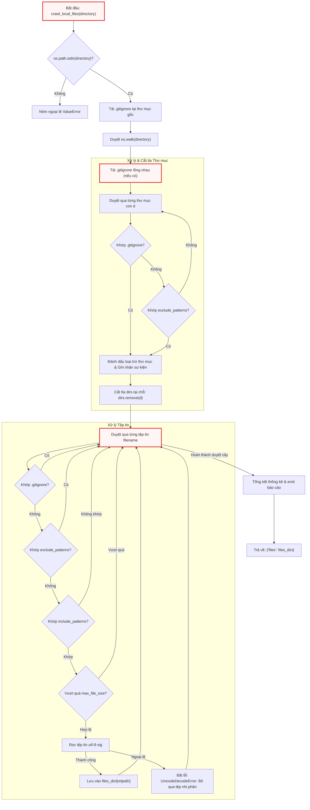

# crawl_local_files.py

> **Source:** `utils/crawl_local_files.py`

Tiếp nối động cơ thu nạp dữ liệu từ xa đã được phân tích tại [crawl_github_files.py](crawl_github_files.py.md) (Chương 3), mô-đun `crawl_local_files.py` đóng vai trò là động cơ thu thập và chuẩn hóa dữ liệu mã nguồn từ hệ thống tệp cục bộ (local filesystem). Mô-đun này cung cấp một giao diện trừu tượng hóa tương thích với bộ thu nạp dữ liệu từ GitHub, đảm bảo tính nhất quán của dữ liệu đầu vào cho toàn bộ hệ thống phân tích và tạo tài liệu phía sau.

---

## Tổng quan Kỹ thuật

Mô-đun `crawl_local_files.py` chịu trách nhiệm duyệt đệ quy cây thư mục trên ổ đĩa cục bộ, thực thi cơ chế lọc dữ liệu đa tầng, trích xuất nội dung văn bản và tổng hợp cấu trúc dữ liệu trả về cho các nút xử lý LLM trong [nodes.py](../nodes.py.md).

Các đặc tính kỹ thuật cốt lõi của thành phần bao gồm:
* **Hỗ trợ phân tích cú pháp `.gitignore` phân tầng (Hierarchical Gitignore Parsing):** Tự động phát hiện và áp dụng các tệp `.gitignore` từ thư mục gốc đến các thư mục con lồng nhau thông qua đặc tả `gitwildmatch` của thư viện `pathspec`.
* **Cắt tỉa thư mục sớm (Early Directory Pruning):** Lọc và loại bỏ trực tiếp các thư mục không hợp lệ ngay trong cấu trúc danh sách con của `os.walk`, ngăn chặn việc duyệt sâu vào các thư mục rác (như `.git`, `node_modules`, môi trường ảo) nhằm tiết kiệm chi phí I/O đĩa.
* **Lọc tệp đa tầng (Multi-layered File Filtering):** Áp dụng tuần tự các bộ lọc: quy tắc `.gitignore`, mẫu loại trừ (`exclude_patterns`), mẫu chấp nhận (`include_patterns`), và giới hạn dung lượng byte (`max_file_size`).
* **Khả năng phục hồi khi đọc tệp (Text Ingestion & Fallback Resilience):** Sử dụng bảng mã `utf-8-sig` để tự động xử lý Byte Order Mark (BOM), đồng thời bắt các ngoại lệ giải mã nhị phân (`UnicodeDecodeError`) để phân loại chính xác các tệp không phải văn bản thuần túy.
* **Giao tiếp sự kiện thời gian thực (Real-time Event Emission):** Tích hợp chặt chẽ với hệ thống thông báo đa ngôn ngữ trong [output.py](output.py.md) để cung cấp tiến độ duyệt tệp và bảng thống kê chi tiết.

---

## Kiến trúc Luồng Thực thi

Biểu đồ dưới đây mô tả chi tiết chu trình quét đĩa, lọc thư mục và xử lý tệp tin được triển khai bên trong mô-đun:



---

## Module-Level Functions

### `_load_gitignore()`
**Visibility**: Private (Nội bộ)  
**Signature**: `def _load_gitignore(gitignore_path)`

**Description**:  
Hàm chịu trách nhiệm mở tệp cấu hình `.gitignore` tại đường dẫn được chỉ định, đọc toàn bộ các dòng quy tắc và biên dịch chúng thành một đối tượng `pathspec.PathSpec` sử dụng cú pháp chuẩn `gitwildmatch`. Hàm xử lý bảng mã với `utf-8-sig` nhằm đảm bảo các ký tự BOM không làm sai lệch quy tắc đầu tiên của tệp. Nếu xảy ra bất kỳ lỗi I/O hoặc lỗi cú pháp nào trong quá trình đọc tệp, hàm sẽ bẫy toàn bộ ngoại lệ và trả về `None`, giúp luồng thu thập dữ liệu chính không bị gián đoạn.

**Parameters**:
* `gitignore_path` (`str`): Đường dẫn tuyệt đối hoặc tương đối tới tệp `.gitignore` cần nạp.

**Returns**:
* `pathspec.PathSpec | None`: Trả về đối tượng `PathSpec` chứa các quy tắc khớp mẫu nếu nạp thành công; trả về `None` nếu tệp không tồn tại hoặc không thể đọc.

**Raises**:
* Hàm không ném ngoại lệ ra ngoài; tất cả lỗi phát sinh từ `open()` hoặc `pathspec.PathSpec.from_lines()` đều được hấp thụ nội bộ thông qua khối lệnh `try...except Exception`.

**Example**:
```python
def _load_gitignore(gitignore_path):
    """Load a .gitignore file and return a PathSpec, or None on failure."""
    try:
        with open(gitignore_path, encoding="utf-8-sig") as f:
            return pathspec.PathSpec.from_lines("gitwildmatch", f.readlines())
    except Exception:
        return None
```

Đoạn mã trên thể hiện tính lập trình phòng thủ cao. Bằng cách sử dụng `gitwildmatch`, `_load_gitignore()` hỗ trợ đầy đủ các quy tắc chuẩn của Git như đệ quy thư mục (`**`), phủ định (`!`), và khớp tiền tố/hậu tố. Việc sử dụng `f.readlines()` trực tiếp chuyển giao danh sách các dòng văn bản vào trình phân tích cú pháp mà không cần tiền xử lý thủ công.

---

### `_matches_any_gitignore()`
**Visibility**: Private (Nội bộ)  
**Signature**: `def _matches_any_gitignore(gitignore_specs, abs_path, is_dir=False)`

**Description**:  
Kiểm tra xem một đường dẫn tệp hoặc thư mục có khớp với bất kỳ quy tắc nào trong tập hợp các đối tượng `.gitignore` đã được tải hay không. Do một dự án có thể chứa nhiều tệp `.gitignore` lồng nhau ở các thư mục con khác nhau, hàm thực hiện tính toán đường dẫn tương đối của đối tượng mục tiêu đối với từng vị trí đặt tệp `.gitignore`. Nếu đối tượng không nằm trong phạm vi quản lý của tệp `.gitignore` đó (đường dẫn tương đối bắt đầu bằng `..`), hàm sẽ bỏ qua. Đồng thời, hàm chuẩn hóa dấu phân cách thư mục trên môi trường Windows (`\\` thành `/`) và tự động thêm dấu `/` vào cuối đường dẫn thư mục để quy tắc phân định thư mục của Git hoạt động chính xác.

**Parameters**:
* `gitignore_specs` (`dict[str, pathspec.PathSpec]`): Bảng ánh xạ từ đường dẫn tuyệt đối của thư mục chứa `.gitignore` tới đối tượng `PathSpec` tương ứng.
* `abs_path` (`str`): Đường dẫn tuyệt đối của tệp hoặc thư mục cần kiểm tra.
* `is_dir` (`bool`, tùy chọn): Cờ xác định đối tượng kiểm tra có phải là thư mục hay không. Mặc định là `False`.

**Returns**:
* `bool`: `True` nếu đường dẫn khớp với ít nhất một quy tắc `.gitignore` đang có hiệu lực; ngược lại trả về `False`.

**Raises**:
* Không có ngoại lệ nào được ném ra từ hàm này.

**Example**:
```python
def _matches_any_gitignore(gitignore_specs, abs_path, is_dir=False):
    """Check if a path matches ANY loaded .gitignore spec."""
    for gi_dir, spec in gitignore_specs.items():
        rel = os.path.relpath(abs_path, gi_dir)
        # Skip if the path is not under this gitignore's scope
        if rel.startswith(".."):
            continue
        match_path = rel.replace("\\", "/")
        if is_dir:
            match_path = match_path.rstrip("/") + "/"
        if spec.match_file(match_path):
            return True
    return False
```

Logic xử lý trong hàm giải quyết triệt để vấn đề xung đột ngữ cảnh đường dẫn khi phân tích cây thư mục phức tạp. Phép gán `match_path = match_path.rstrip("/") + "/"` đảm bảo các quy tắc kết thúc bằng dấu gạch chéo trong `.gitignore` (ví dụ: `build/` hoặc `temp/`) chỉ khớp chính xác với các thư mục mà không làm ảnh hưởng đến các tệp tin trùng tên.

---

### `crawl_local_files()`
**Visibility**: Public (Công khai)  
**Signature**: `def crawl_local_files(directory, include_patterns=None, exclude_patterns=None, max_file_size=None, use_relative_paths=True)`

**Description**:  
Hàm điều phối chính thực hiện quét toàn bộ cây thư mục cục bộ, quản lý vòng đời duyệt tệp, lọc nhiễu, đọc nội dung và phát báo cáo tổng kết tiến trình. Hàm triển khai thuật toán duyệt đơn luồng (single-pass walk) kết hợp cắt tỉa danh mục tại chỗ nhằm tối ưu hiệu năng đĩa cứng và dung lượng bộ nhớ.

Dưới đây là phân tích chi tiết từng khối logic nghiệp vụ bên trong hàm:

#### 1. Xác thực Đầu vào và Khởi tạo Bộ đếm
Hàm kiểm tra sự tồn tại của thư mục gốc trước khi thực hiện duyệt cây. Nếu đường dẫn không hợp lệ, hệ thống sẽ ném lỗi ngay lập tức. Sau đó, các biến đếm trạng thái và danh sách ghi vết được thiết lập:

```python
    if not os.path.isdir(directory):
        raise ValueError(f"Directory does not exist: {directory}")

    files_dict = {}

    # --- Counters ---
    entry_num = 0
    count_processed = 0
    count_excluded = 0
    count_size_limit = 0
    count_non_text = 0
    skipped_size_limit = []
    skipped_non_text = []

    # --- Gitignore specs: {abs_dir_path: pathspec} ---
    gitignore_specs = {}
    root_gi_path = os.path.join(directory, ".gitignore")
    if os.path.exists(root_gi_path):
        spec = _load_gitignore(root_gi_path)
        if spec:
            gitignore_specs[os.path.abspath(directory)] = spec
            emit("CRAWL_GITIGNORE_LOADED", path=root_gi_path)

    # Translated reason strings (looked up once)
    reason_excluded = get("CRAWL_REASON_EXCLUDED")
    reason_gitignore = get("CRAWL_REASON_GITIGNORE")
```

Khối khởi tạo thiết lập một từ điển `gitignore_specs` để lưu trữ các bộ quy tắc lọc. Việc tra cứu trước các chuỗi thông điệp `reason_excluded` và `reason_gitignore` thông qua hàm `get()` của mô-đun [output.py](output.py.md) giúp loại bỏ chi phí truy xuất dịch thuật lặp lại trong suốt vòng lặp duyệt hàng nghìn tệp tin.

#### 2. Quét Thư mục & Cắt tỉa Sớm (Directory Pruning)
Trong mỗi chu kỳ lặp của `os.walk`, hàm kiểm tra sự xuất hiện của tệp `.gitignore` cục bộ mới và thực hiện đánh giá loại trừ đối với toàn bộ danh sách thư mục con `dirs`:

```python
    # --- Single-pass: walk, filter, and process inline ---
    for root, dirs, files in os.walk(directory):
        abs_root = os.path.abspath(root)

        # Check for nested .gitignore in current directory (skip root, already loaded)
        if abs_root != os.path.abspath(directory):
            nested_gi = os.path.join(root, ".gitignore")
            if os.path.exists(nested_gi):
                spec = _load_gitignore(nested_gi)
                if spec:
                    gitignore_specs[abs_root] = spec

        # --- Directory filtering ---
        excluded_dirs = set()
        for d in sorted(dirs):
            abs_d = os.path.join(abs_root, d)
            dirpath_rel = os.path.relpath(abs_d, directory)

            reason = None
            if _matches_any_gitignore(gitignore_specs, abs_d, is_dir=True):
                reason = reason_gitignore
            elif exclude_patterns:
                for pattern in exclude_patterns:
                    dir_pattern = pattern.removesuffix("/*")
                    if fnmatch.fnmatch(dirpath_rel, dir_pattern) or fnmatch.fnmatch(d, dir_pattern):
                        reason = reason_excluded
                        break

            if reason:
                excluded_dirs.add(d)
                entry_num += 1
                count_excluded += 1
                emit("CRAWL_DIR_EXCLUDED", num=entry_num, path=dirpath_rel, reason=reason)

        for d in dirs.copy():
            if d in excluded_dirs:
                dirs.remove(d)

        # Sort remaining dirs for consistent traversal order
        dirs.sort()
        # ...
```

Kỹ thuật cắt tỉa danh sách `dirs` bằng lệnh `dirs.remove(d)` trực tiếp can thiệp vào hành vi nội bộ của `os.walk`. Khi một thư mục (chẳng hạn như `.git` hoặc `node_modules`) bị xóa khỏi danh sách `dirs`, `os.walk` sẽ hoàn toàn bỏ qua việc đệ quy vào nhánh thư mục đó. Thao tác này giúp giảm thiểu hàng loạt lời gọi hàm hệ thống `stat` và `readdir` không cần thiết.

#### 3. Xử lý & Đọc Tệp tin Trực tiếp (Inline File Ingestion)
Đối với mỗi tệp tin trong danh sách `files` đã được sắp xếp, hàm áp dụng chuỗi phán đoán nghiêm ngặt trước khi thực hiện đọc nội dung:

```python
        # --- File processing (inline, sorted) ---
        for filename in sorted(files):
            filepath = os.path.join(root, filename)
            abs_filepath = os.path.abspath(filepath)
            relpath = os.path.relpath(filepath, directory) if use_relative_paths else filepath
            entry_num += 1

            # Check gitignore (all levels)
            if _matches_any_gitignore(gitignore_specs, abs_filepath):
                count_excluded += 1
                emit("CRAWL_FILE_GITIGNORE", num=entry_num, path=relpath)
                continue

            # Check exclude patterns
            excluded = False
            if exclude_patterns:
                for pattern in exclude_patterns:
                    if fnmatch.fnmatch(relpath, pattern):
                        excluded = True
                        break
            if excluded:
                count_excluded += 1
                emit("CRAWL_FILE_EXCLUDED", num=entry_num, path=relpath)
                continue

            # Check include patterns
            if include_patterns:
                matched = False
                for pattern in include_patterns:
                    if fnmatch.fnmatch(relpath, pattern):
                        matched = True
                        break
                if not matched:
                    count_excluded += 1
                    emit("CRAWL_FILE_NOT_INCLUDED", num=entry_num, path=relpath)
                    continue

            # Check size limit
            if max_file_size and os.path.getsize(filepath) > max_file_size:
                count_size_limit += 1
                skipped_size_limit.append(relpath)
                size_kb = os.path.getsize(filepath) / 1024
                emit("CRAWL_FILE_SIZE_LIMIT", num=entry_num, path=relpath, size=f"{size_kb:.0f}")
                continue

            # Try to read as text
            try:
                with open(filepath, encoding="utf-8-sig") as f:
                    content = f.read()
                files_dict[relpath] = content
                count_processed += 1
                emit("CRAWL_FILE_PROCESSED", num=entry_num, path=relpath)
            except (UnicodeDecodeError, ValueError):
                count_non_text += 1
                skipped_non_text.append(relpath)
                emit("CRAWL_FILE_NOT_TEXT", num=entry_num, path=relpath)
            except Exception as e:
                count_non_text += 1
                skipped_non_text.append(relpath)
                emit("CRAWL_FILE_ERROR", num=entry_num, path=relpath, error=e)
```

Chuỗi kiểm tra logic được sắp xếp tối ưu theo chi phí tính toán tăng dần: đầu tiên là so khớp mẫu chuỗi trên bộ nhớ (`_matches_any_gitignore`, `exclude_patterns`, `include_patterns`), tiếp theo là truy vấn siêu dữ liệu tệp qua `os.getsize()`, và cuối cùng mới thực hiện thao tác I/O đọc nội dung tệp bằng `open()`. Nếu tệp chứa dữ liệu nhị phân không thể giải mã thành văn bản UTF-8, ngoại lệ `UnicodeDecodeError` sẽ được kích hoạt và phân loại chính xác vào danh sách `skipped_non_text`.

#### 4. Tổng hợp & Phát Tín hiệu Báo cáo
Sau khi quá trình duyệt cây thư mục hoàn tất, hàm tính toán các số liệu tổng quan và phát các sự kiện kết xuất giao diện qua hệ thống `emit()`:

```python
    # --- Summary ---
    total_fetched = count_processed + count_excluded + count_size_limit + count_non_text
    emit("CRAWL_SUMMARY_HEADER")
    emit("CRAWL_SUMMARY_TOTAL", count=total_fetched)
    emit("CRAWL_SUMMARY_PROCESSED", count=count_processed)
    if count_excluded > 0:
        emit("CRAWL_SUMMARY_EXCLUDED", count=count_excluded)
    if count_size_limit > 0:
        emit("CRAWL_SUMMARY_SIZE_LIMIT", count=count_size_limit)
        for f in skipped_size_limit:
            emit("CRAWL_SUMMARY_ITEM", name=f)
    if count_non_text > 0:
        emit("CRAWL_SUMMARY_NON_TEXT", count=count_non_text)
        for f in skipped_non_text:
            emit("CRAWL_SUMMARY_ITEM", name=f)

    return {"files": files_dict}
```

Báo cáo tổng kết cung cấp bức tranh toàn diện về số lượng tệp được chấp nhận nạp vào bộ nhớ (`count_processed`), số lượng mục bị lọc bởi quy tắc (`count_excluded`), số lượng tệp vượt quá ngưỡng kích thước (`count_size_limit`) và số lượng tệp nhị phân/lỗi (`count_non_text`). Dữ liệu hoàn chỉnh được đóng gói trong một cấu trúc từ điển chứa khóa `"files"`.

**Parameters**:
* `directory` (`str`): Đường dẫn hệ thống đến thư mục cục bộ cần thu thập dữ liệu.
* `include_patterns` (`set[str] | None`, tùy chọn): Tập hợp các mẫu glob chỉ định các tệp được phép thu nạp (ví dụ: `{"*.py", "*.js"}`). Nếu là `None`, tất cả các tệp không bị loại trừ đều được xử lý.
* `exclude_patterns` (`set[str] | None`, tùy chọn): Tập hợp các mẫu glob chỉ định các đường dẫn hoặc tên tệp/thư mục cần bỏ qua (ví dụ: `{"tests/*", "*.log"}`). Mặc định là `None`.
* `max_file_size` (`int | None`, tùy chọn): Ngưỡng dung lượng tệp tối đa tính bằng byte. Tệp có kích thước lớn hơn ngưỡng này sẽ bị bỏ qua. Mặc định là `None`.
* `use_relative_paths` (`bool`, tùy chọn): Cờ xác định khóa đường dẫn trong từ điển kết quả là đường dẫn tương đối so với `directory` (`True`) hay đường dẫn gốc (`False`). Mặc định là `True`.

**Returns**:
* `dict[str, dict[str, str]]`: Cấu trúc từ điển có định dạng:
  ```python
  {
      "files": {
          "path/to/file1.py": "nội dung văn bản của file 1",
          "path/to/file2.js": "nội dung văn bản của file 2"
      }
  }
  ```

**Raises**:
* `ValueError`: Ném ra khi tham số `directory` không trỏ tới một thư mục hợp lệ trên hệ thống đĩa (`not os.path.isdir(directory)`).

**Example**:
```python
# Trích xuất từ khối kiểm thử độc lập trong crawl_local_files.py
files_data = crawl_local_files(
    "..",
    exclude_patterns={
        "*.pyc",
        "__pycache__/*",
        ".venv/*",
        ".git/*",
        "docs/*",
        "output/*",
    },
)
print(f"Found {len(files_data['files'])} files:")
for path in files_data["files"]:
    print(f"  {path}")
```

Đoạn mã ví dụ minh họa cách gọi hàm `crawl_local_files()` để quét thư mục cha (`..`) với danh sách các mẫu loại trừ phổ biến. Kết quả trả về cho phép truy xuất trực tiếp danh sách các đường dẫn tệp tương đối thông qua việc duyệt các khóa của `files_data['files']`.

---

## Điểm Kiểm thử Trực tiếp (`__main__`)

Khi tệp mã nguồn `crawl_local_files.py` được thực thi trực tiếp từ dòng lệnh (`python utils/crawl_local_files.py`), khối mã kiểm thử độc lập sẽ chạy để kiểm tra khả năng quét cây thư mục cấp cha (`..`):

```python
if __name__ == "__main__":
    print("--- Crawling parent directory ('..') ---")
    files_data = crawl_local_files(
        "..",
        exclude_patterns={
            "*.pyc",
            "__pycache__/*",
            ".venv/*",
            ".git/*",
            "docs/*",
            "output/*",
        },
    )
    print(f"Found {len(files_data['files'])} files:")
    for path in files_data["files"]:
        print(f"  {path}")
```

Khối thực thi này cung cấp một kịch bản kiểm thử nhanh tại chỗ (sanity test) cho nhà phát triển nhằm xác thực hành vi cắt tỉa thư mục đặc biệt (`.git/*`, `.venv/*`, `__pycache__/*`) và khả năng định dạng đường dẫn tương đối mà không cần khởi chạy toàn bộ luồng điều khiển phức tạp trong [main.py](../main.py.md).

---

## Phân tích Kỹ thuật Nâng cao

### 1. Cơ chế Đồng bộ Hóa Bảng mã và Xử lý BOM (`utf-8-sig`)
Trong các môi trường phát triển hỗn hợp (Windows, macOS, Linux), các trình soạn thảo mã nguồn có thể tự động chèn ký tự UTF-8 Byte Order Mark (`0xEF, 0xBB, 0xBF`) vào đầu tệp. Nếu sử dụng bộ giải mã `utf-8` thông thường, chuỗi BOM này sẽ được giữ lại dưới dạng ký tự `\ufeff`, gây sai lệch cho các bộ phân tích cú pháp mã nguồn hoặc làm hỏng dòng đầu tiên của tệp cấu hình `.gitignore`. Bằng cách áp dụng nhất quán `encoding="utf-8-sig"`, `crawl_local_files.py` tự động loại bỏ ký tự BOM một cách trong suốt.

### 2. Tối ưu hóa Bộ nhớ Thông qua Cắt tỉa Danh sách Con
Thuật toán duyệt cây của Python `os.walk(directory)` sinh ra một bộ ba `(root, dirs, files)` tại mỗi bước. Bằng việc thực hiện sửa đổi danh sách `dirs` tại chỗ (`dirs.remove(d)` hoặc gán lại các phần tử hợp lệ), mô-đun can thiệp trực tiếp vào ngăn xếp duyệt của `os.walk`. Khi gặp các thư mục phụ thuộc có quy mô lớn (ví dụ `node_modules` chứa hàng chục nghìn tệp nhỏ), việc loại bỏ thư mục từ cấp cao nhất giúp tiết kiệm tài nguyên CPU và tránh tràn bộ nhớ đệm I/O của hệ điều hành.

### 3. Chuẩn hóa Đường dẫn So khớp Gitignore Đa Nền tảng
Quy cách của Git quy định dấu phân cách đường dẫn luôn là dấu gạch chéo xuôi (`/`). Trên hệ điều hành Windows, các hàm hệ thống của Python như `os.path.relpath` trả về dấu gạch chéo ngược (`\`). Nếu đưa trực tiếp đường dẫn chứa `\` vào đối tượng `PathSpec`, quy tắc `gitwildmatch` sẽ hiểu nhầm đây là ký tự thoát (escape character) thay vì dấu phân cấp thư mục. Do đó, thao tác biến đổi `match_path = rel.replace("\\", "/")` là bước xử lý bắt buộc để đảm bảo tính toàn vẹn của logic so khớp đa nền tảng.

---

## Xem Thêm

* [crawl_github_files.py](crawl_github_files.py.md) — Động cơ thu thập mã nguồn từ xa thông qua SSH Clone và GitHub REST API.
* [exclude_patterns.py](exclude_patterns.py.md) — Định nghĩa các mẫu tệp và thư mục bị loại trừ mặc định của toàn hệ thống.
* [output.py](output.py.md) — Hệ thống phát sự kiện, bản địa hóa và định dạng kết quả hiển thị cho người dùng.
* [nodes.py](../nodes.py.md) — Các nút thực thi nghiệp vụ tiếp nhận từ điển `files` để xử lý ngữ cảnh và tạo tài liệu với LLM.
* [main.py](../main.py.md) — Điểm khởi nhập điều phối cấu hình dòng lệnh và kích hoạt quá trình thu thập dữ liệu cục bộ.

