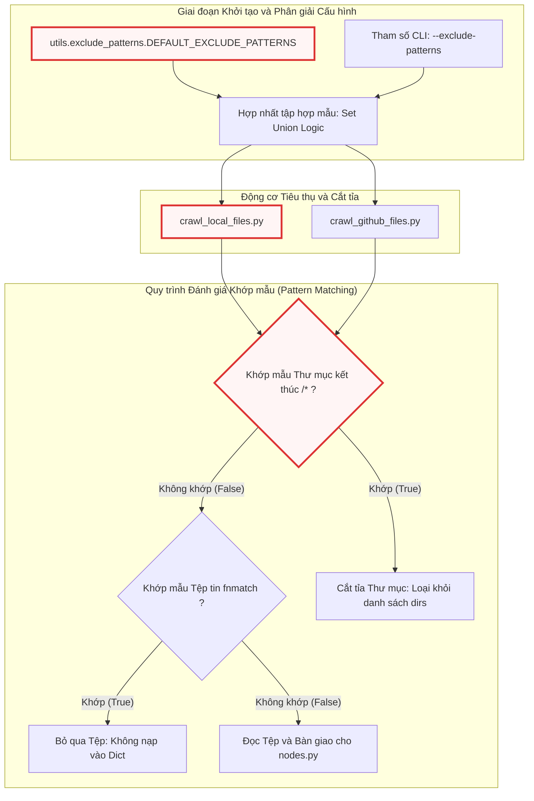

# exclude_patterns.py

> **Source:** `utils/exclude_patterns.py`

Tiếp nối các cơ chế thu thập tệp được trình bày trong [Chương 4 — crawl_local_files.py](crawl_local_files.py.md), mô-đun `utils/exclude_patterns.py` đóng vai trò là kho lưu trữ trung tâm cho toàn bộ các quy tắc và mẫu loại trừ tệp tin/thư mục mặc định (`DEFAULT_EXCLUDE_PATTERNS`). Trong khi các động cơ thu thập như `crawl_local_files.py` và `crawl_github_files.py` chịu trách nhiệm điều hướng và duyệt cây dữ liệu, thì `exclude_patterns.py` cung cấp bộ lọc tĩnh nền tảng để ngăn chặn việc đưa các tệp không liên quan, tệp nhị phân, cấu hình bảo mật nhạy cảm hoặc mã nguồn phụ thuộc vào ngữ cảnh xử lý của mô hình ngôn ngữ lớn (LLM).

---

## Tổng quan Kỹ thuật

Mô-đun `exclude_patterns.py` cung cấp một tập hợp bất biến các mẫu lọc dạng chuỗi ký tự theo chuẩn cú pháp Unix Glob (`fnmatch`). Các mẫu này được phân loại một cách có hệ thống thành 7 nhóm chức năng riêng biệt, bao phủ từ các tệp tài nguyên tĩnh, bản dựng phần mềm, môi trường ảo, tệp thực thi nhị phân, dữ liệu kiểm thử, cho đến các thư mục cấu hình của các IDE hiện đại và công cụ AI Agent.

Mục tiêu kỹ thuật cốt lõi của việc chuẩn hóa danh sách loại trừ bao gồm:
1. **Bảo toàn Ngân sách Token (Token Economy Optimization):** Ngăn chặn việc tiêu tốn token vô ích vào các tệp tĩnh, tệp nhị phân, dữ liệu nén hoặc tệp khóa phụ thuộc khổng lồ (như `package-lock.json` hay `yarn.lock`).
2. **Cắt tỉa Nhánh Duyệt Sớm (Early Branch Pruning):** Cho phép các hàm thu thập tệp (`crawl_local_files` và `crawl_github_files`) loại bỏ trực tiếp toàn bộ cây con (ví dụ: `node_modules/*`, `.git/*`, `target/*`) trong quá trình gọi `os.walk()` hoặc duyệt cây Git Tree, giảm thiểu đáng kể chi phí đọc I/O đĩa và băng thông mạng.
3. **Bảo mật và Cô lập Thông tin Nhạy cảm (Security & Secret Isolation):** Loại trừ tự động các tệp môi trường (`.env`, `.env.*`) và tệp cấu hình chứa mã khóa nhằm tránh rò rỉ dữ liệu nhạy cảm lên máy chủ suy luận LLM bên thứ ba.
4. **Loại bỏ Nhiễu Ngữ cảnh (Context Noise Reduction):** Tách biệt mã nguồn logic nghiệp vụ thực tế khỏi mã sinh tự động (build artifacts), bộ nhớ đệm kiểm thử (`.pytest_cache`), báo cáo độ bao phủ mã (`htmlcov`), và cấu hình IDE nội bộ.

---

## Kiến trúc Tích hợp và Luồng Xử lý Dữ liệu

Dưới đây là sơ đồ luồng dữ liệu minh họa cách tập hợp hằng số `DEFAULT_EXCLUDE_PATTERNS` từ `exclude_patterns.py` được nạp, kết hợp cùng tham số dòng lệnh và chuyển giao cho các động cơ thu thập dữ liệu nội bộ.



---

## Cấu trúc Dữ liệu Cấp Mô-đun (Module-Level Data Structures)

Mô-đun `exclude_patterns.py` định nghĩa duy nhất một cấu trúc dữ liệu hằng số kiểu tập hợp (`set` trong Python) chứa toàn bộ các quy tắc lọc. Việc sử dụng cấu trúc `set` cho phép thực hiện các phép toán tập hợp như hợp (union), giao (intersection), và hiệu (difference) với độ phức tạp tính toán tối ưu khi kết hợp cùng danh sách loại trừ do người dùng chỉ định từ giao diện dòng lệnh hoặc tệp cấu hình.

### `DEFAULT_EXCLUDE_PATTERNS`

**Visibility**: Public (Module-Level Constant)  
**Signature**: `DEFAULT_EXCLUDE_PATTERNS: set[str]`

**Description**:  
Tập hợp chứa tất cả các chuỗi mẫu glob mặc định được áp dụng trong toàn bộ hệ thống để lọc bỏ các đường dẫn tệp tin và thư mục không liên quan. Các mẫu trong tập hợp này tuân thủ cú pháp `fnmatch` tiêu chuẩn của hệ điều hành Unix:
* Các mẫu có hậu tố `/*` đại diện cho việc khớp toàn bộ một nhánh thư mục (ví dụ: `node_modules/*`, `dist/*`).
* Các mẫu có tiền tố `*.` đại diện cho việc lọc theo định dạng mở rộng của tệp tin (ví dụ: `*.png`, `*.pyc`, `*.exe`).
* Các mẫu có tên chính xác đại diện cho việc loại trừ tệp tin cụ thể tại mọi phân cấp thư mục (ví dụ: `.env`, `.DS_Store`, `Thumbs.db`).

Dưới đây là việc trích xuất và phân tích chi tiết từng nhóm mẫu chức năng trong tập hợp `DEFAULT_EXCLUDE_PATTERNS`:

---

### 1. Tài nguyên Tĩnh, Đa phương tiện và Dữ liệu Nén (Media, Data, and Static Assets)

Nhóm quy tắc này xử lý toàn bộ các thư mục lưu trữ tài nguyên tĩnh và các phần mở rộng tệp tin nhị phân phi văn bản hoặc tệp văn phòng nén:

```python
    # 1. Media, Data, and Static Assets
    "assets/*",
    "data/*",
    "images/*",
    "public/*",
    "static/*",
    "temp/*",
    "tmp/*",
    "media/*",
    "*.jpg",
    "*.jpeg",
    "*.png",
    "*.gif",
    "*.ico",
    "*.svg",
    "*.webp",
    "*.mp4",
    "*.webm",
    "*.mov",
    "*.mp3",
    "*.wav",
    "*.pdf",
    "*.doc",
    "*.docx",
    "*.xls",
    "*.xlsx",
    "*.ppt",
    "*.pptx",
    "*.zip",
    "*.tar",
    "*.gz",
    "*.rar",
    "*.7z",
```

**Phân tích Kỹ thuật:**
* **Mục đích:** Ngăn chặn việc nạp các tệp hình ảnh (JPEG, PNG, GIF, SVG, WEBP), âm thanh (MP3, WAV), video (MP4, WEBM, MOV), tài liệu văn phòng định dạng nhị phân (PDF, DOC, DOCX, XLS, XLSX, PPT, PPTX), và các gói nén (ZIP, TAR, GZ, RAR, 7Z).
* **Cơ chế hoạt động:** Trong các thư mục web chuẩn (như `public/*`, `static/*`, `assets/*`), số lượng tài nguyên đa phương tiện thường chiếm tỷ trọng dung lượng rất lớn. Khi `crawl_local_files` hoặc `crawl_github_files` duyệt cây thư mục, việc khớp các chuỗi `assets/*` hay `static/*` lập tức ngăn chặn toàn bộ quá trình đệ quy sâu vào cây con này, giúp tiết kiệm bộ nhớ RAM và triệt tiêu hàng nghìn lệnh kiểm tra tệp riêng lẻ.
* **Xử lý biên (Edge Cases):** Các tệp định dạng vector như `*.svg` dù có bản chất là tệp văn bản dựa trên XML nhưng vẫn bị loại trừ vì chúng biểu diễn cấu trúc đồ họa trực quan thay vì logic nghiệp vụ phần mềm, không đem lại giá trị phân tích cho LLM.

---

### 2. Bản dựng, Phân phối và Bộ nhớ đệm Framework (Build, Distribution, and Framework Caches)

Nhóm quy tắc này tập trung vào các thư mục đầu ra của quá trình biên dịch (compilation), đóng gói (bundling), và các cấu trúc bộ nhớ đệm trung gian của các framework phổ biến:

```python
    # 2. Build, Distribution, and Framework Caches
    "dist/*",
    "build/*",
    "out/*",
    "output/*",
    "target/*",
    "bin/*",
    "obj/*",
    ".next/*",
    ".nuxt/*",
    ".svelte-kit/*",
    ".expo/*",
    "docs/*",
    "test/*",
    "tests/*",
    "examples/*",
    "v1/*",
    "experimental/*",
    "deprecated/*",
    "misc/*",
    "legacy/*",
    "*.log",
    "*.bak",
    "*.tmp",
    "*.swp",
```

**Phân tích Kỹ thuật:**
* **Mục đích:** Loại bỏ mã đã qua xử lý đóng gói (minified, polyfilled, transpiled) và các tệp nhật ký/sao lưu phát sinh trong quá trình chạy ứng dụng.
* **Cơ chế hoạt động:**
  * Các thư mục `dist/*`, `build/*`, `out/*`, `output/*`, `target/*` (chuẩn trong Maven, Rust Cargo), `bin/*`, `obj/*` (chuẩn trong C# .NET) chứa kết quả sau khi build. Mã trong các thư mục này thường bị biến đổi tên biến (obfuscated) hoặc có kích thước cực lớn, gây tràn cửa sổ ngữ cảnh LLM nếu nạp nhầm.
  * Các thư mục bộ nhớ đệm framework SSR/Frontend hiện đại như `.next/*` (Next.js), `.nuxt/*` (Nuxt.js), `.svelte-kit/*` (SvelteKit), `.expo/*` (React Native Expo) chứa mã trung gian được biên dịch động trong chế độ phát triển.
  * Các thư mục phi sản xuất như `test/*`, `tests/*`, `examples/*`, `experimental/*`, `deprecated/*`, `legacy/*` được cấu hình để lọc bỏ nhằm ưu tiên đưa mã nguồn cốt lõi sản xuất vào pipeline phân tích tài liệu.
  * Các mẫu tệp tạm thời như `*.log`, `*.bak`, `*.tmp`, `*.swp` (tệp swap của trình soạn thảo Vim) tự động bị bỏ qua.

---

### 3. Môi trường Ảo, Thư viện Phụ thuộc và Tệp Khóa Phiên bản (Environments, Dependencies & Lockfiles)

Nhóm quy tắc này cô lập hoàn toàn các cây thư mục phụ thuộc của bên thứ ba, tệp biến môi trường nhạy cảm và các tệp khóa phiên bản phụ thuộc có kích thước lớn:

```python
    # 3. Environments, Dependencies & Lockfiles
    "venv/*",
    ".venv/*",
    "env/*",
    ".env",
    ".env.*",
    "node_modules/*",
    "bower_components/*",
    "jspm_packages/*",
    "vendor/*",
    "packages/*",
    "*.lock",
    "package-lock.json",
    "yarn.lock",
    "pnpm-lock.yaml",
    "Cargo.lock",
    "Gemfile.lock",
    "poetry.lock",
    "mix.lock",
    "Pipfile.lock",
```

**Phân tích Kỹ thuật:**
* **Mục đích:** Đảm bảo hệ thống không quét vào các thư viện phụ thuộc bên thứ ba (thường chứa hàng trăm nghìn tệp nhỏ), bảo vệ biến môi trường nhạy cảm và bỏ qua các tệp ánh xạ cây phụ thuộc (dependency resolution trees).
* **Cơ chế hoạt động:**
  * **Thư mục Phụ thuộc:** `node_modules/*` (JavaScript/Node.js), `vendor/*` (PHP Composer / Go Vendor), `packages/*`, `bower_components/*` được cắt tỉa ngay từ gốc.
  * **Môi trường ảo Python:** `venv/*`, `.venv/*`, `env/*` bị bỏ qua để tránh nạp các bản sao thư viện chuẩn Python cục bộ.
  * **Bảo vệ Bí mật (Secret Protection):** `.env` và tất cả các biến thể `.env.*` (ví dụ: `.env.local`, `.env.production`) bị triệt tiêu hoàn toàn. Điều này ngăn việc gửi API Key, Secret Token, thông tin kết nối cơ sở dữ liệu lên LLM.
  * **Tệp Khóa (Lockfiles):** Các tệp `package-lock.json`, `yarn.lock`, `pnpm-lock.yaml`, `Cargo.lock`, `Gemfile.lock`, `poetry.lock`, `mix.lock`, `Pipfile.lock` và mẫu chung `*.lock` thường chứa hàng chục nghìn dòng JSON/YAML mô tả mã băm (checksum) và phiên bản phụ thuộc. Việc phân tích ngữ cảnh mã nguồn không cần đến các chi tiết này, do đó loại trừ chúng giúp giảm tải đáng kể token.

---

### 4. Quy tắc Loại trừ Đặc thù theo Ngôn ngữ Lập trình (Language-Specific Exclusions)

Nhóm quy tắc này loại trừ các tệp nhị phân trung gian, mã byte (bytecode), thư viện liên kết động/tĩnh, và báo cáo phân tích mã nguồn đặc thù cho từng ngôn ngữ (Python, Java/JVM, C/C++, Mobile):

```python
    # 4. Language-Specific Exclusions
    "__pycache__/*",
    "*.pyc",
    "*.pyo",
    "*.pyd",
    ".pytest_cache/*",
    ".ruff_cache/*",
    ".tox/*",
    ".coverage",
    "htmlcov/*",  # Python
    ".gradle/*",
    "*.class",
    "*.jar",
    "*.war",
    "*.ear",
    "*.nar",  # Java / JVM
    "*.o",
    "*.obj",
    "*.dll",
    "*.exe",
    "*.so",
    "*.dylib",
    "*.lib",
    "*.a",  # C/C++/Native
    "ios/Pods/*",
    "android/.gradle/*",
    "android/app/build/*",  # Mobile
```

**Phân tích Kỹ thuật:**
* **Hệ sinh thái Python:**
  * `__pycache__/*`, `*.pyc`, `*.pyo`: Bytecode đã được biên dịch của Python Virtual Machine.
  * `*.pyd`: Thư viện mở rộng động dạng nhị phân trên hệ điều hành Windows.
  * `.pytest_cache/*`, `.ruff_cache/*`, `.tox/*`: Dữ liệu đệm của công cụ kiểm thử pytest, linter ruff và bộ điều phối tox.
  * `.coverage`, `htmlcov/*`: Tệp cơ sở dữ liệu và thư mục HTML báo cáo độ bao phủ mã nguồn.
* **Hệ sinh thái Java / JVM:**
  * `.gradle/*`: Thư mục đệm của công cụ xây dựng Gradle.
  * `*.class`: Bytecode của máy ảo Java.
  * `*.jar`, `*.war`, `*.ear`, `*.nar`: Các gói lưu trữ lưu hành ứng dụng Java dưới dạng tệp nén nhị phân.
* **Hệ sinh thái C / C++ / Native:**
  * `*.o`, `*.obj`: Tệp đối tượng (object files) sinh ra sau bước biên dịch mã nguồn trước khi liên kết.
  * `*.dll`, `*.so`, `*.dylib`: Thư viện liên kết động (Dynamic Link Libraries) trên Windows, Linux và macOS.
  * `*.exe`: Tệp thực thi nhị phân.
  * `*.lib`, `*.a`: Thư viện liên kết tĩnh (Static Libraries).
* **Phát triển Ứng dụng Di động (Mobile):**
  * `ios/Pods/*`: Thư mục phụ thuộc CocoaPods trên nền tảng iOS.
  * `android/.gradle/*`, `android/app/build/*`: Thư mục đệm và bản dựng của Android Gradle.

---

### 5. Tệp Hệ điều hành và Hệ thống Quản lý Phiên bản (OS & Version Control)

Nhóm quy tắc này loại bỏ các siêu dữ liệu quản lý phiên bản mã nguồn của VCS và các tệp siêu dữ liệu ẩn do hệ điều hành tự động tạo:

```python
    # 5. OS & Version Control
    ".git/*",
    ".github/*",
    ".svn/*",
    ".hg/*",
    ".DS_Store",
    "Thumbs.db",
    "desktop.ini",
```

**Phân tích Kỹ thuật:**
* **Hệ thống Quản lý Phiên bản (VCS):**
  * `.git/*`: Toàn bộ cơ sở dữ liệu đối tượng nội bộ (blobs, trees, commits, refs) của Git.
  * `.github/*`: Cấu hình GitHub Actions CI/CD workflows, issue templates và pull request templates.
  * `.svn/*`, `.hg/*`: Thư mục siêu dữ liệu của Apache Subversion và Mercurial.
* **Siêu dữ liệu Hệ điều hành (OS Metadata):**
  * `.DS_Store`: Tệp nhị phân lưu trữ thuộc tính hiển thị thư mục tùy chỉnh trên macOS Finder.
  * `Thumbs.db`: Cơ sở dữ liệu đệm hình thu nhỏ của Windows Explorer.
  * `desktop.ini`: Tệp cấu hình thư mục của hệ điều hành Microsoft Windows.

---

### 6. Môi trường Phát triển Tích hợp Truyền thống (Classic IDEs)

Nhóm quy tắc này lọc bỏ các tệp cấu hình không gian làm việc (workspace settings) và dự án của các IDE phổ biến:

```python
    # 6. Classic IDEs
    ".vscode/*",
    ".idea/*",
    "*.iml",
    ".eclipse/*",
    ".settings/*",
    ".classpath",
    ".project",
    ".vs/*",
```

**Phân tích Kỹ thuật:**
* **Visual Studio Code:** `.vscode/*` chứa cấu hình khởi chạy (`launch.json`), tác vụ (`tasks.json`) và thiết lập phần mở rộng (`settings.json`).
* **JetBrains IntelliJ / PyCharm / WebStorm:** `.idea/*` và các tệp mô-đun `*.iml`.
* **Eclipse IDE:** `.eclipse/*`, `.settings/*`, tệp đường dẫn classpath `.classpath`, và tệp mô tả dự án `.project`.
* **Visual Studio:** `.vs/*` chứa cơ sở dữ liệu chỉ mục và trạng thái giải pháp cục bộ của Microsoft Visual Studio.

---

### 7. Tác tử AI và Môi trường Phát triển AI Hiện đại (AI Agents & Modern AI IDEs)

Nhóm quy tắc này xử lý các quy tắc nội bộ, lịch sử hội thoại và bộ nhớ đệm của các công cụ lập trình AI thế hệ mới:

```python
    # 7. AI Agents & Modern AI IDEs
    ".cursor/*",
    ".cursorrules",
    ".windsurf/*",
    ".windsurfrules",
    ".cline/*",
    ".clinerules",
    ".roo/*",
    ".roorules",
    ".agent/*",
    ".agents/*",
    ".continue/*",
    ".aide/*",
    ".gemini/*",
    ".antigravity/*",
    ".claude/*",
    ".copilot/*",
```

**Phân tích Kỹ thuật:**
* **Mục đích:** Ngăn ngừa hiện tượng "ô nhiễm ngữ cảnh" do nạp các tệp hướng dẫn prompt nội bộ của các trợ lý AI khác (`.cursorrules`, `.windsurfrules`, `.clinerules`, `.roorules`) hoặc dữ liệu phiên làm việc trước đó của các agent.
* **Cơ chế hoạt động:**
  * Các IDE tích hợp AI như Cursor (`.cursor/*`, `.cursorrules`), Windsurf (`.windsurf/*`, `.windsurfrules`).
  * Các tiện ích mở rộng Autonomous Agent như Cline (`.cline/*`, `.clinerules`), Roo Code (`.roo/*`, `.roorules`), Continue (`.continue/*`), GitHub Copilot (`.copilot/*`).
  * Các thư mục chỉ mục AI chuyên biệt: `.agent/*`, `.agents/*`, `.aide/*`, `.gemini/*`, `.claude/*`, `.antigravity/*`. Việc loại trừ các tệp này đảm bảo mô hình LLM phân tích mã nguồn một cách khách quan dựa trên logic thuần túy thay vì bị ảnh hưởng bởi các chỉ thị prompt của bên thứ ba.

---

## Chi tiết Triển khai và Toàn vẹn Mã nguồn

Dưới đây là định nghĩa đầy đủ, nguyên bản của hằng số `DEFAULT_EXCLUDE_PATTERNS` trong tệp `utils/exclude_patterns.py`:

```python
DEFAULT_EXCLUDE_PATTERNS = {
    # 1. Media, Data, and Static Assets
    "assets/*",
    "data/*",
    "images/*",
    "public/*",
    "static/*",
    "temp/*",
    "tmp/*",
    "media/*",
    "*.jpg",
    "*.jpeg",
    "*.png",
    "*.gif",
    "*.ico",
    "*.svg",
    "*.webp",
    "*.mp4",
    "*.webm",
    "*.mov",
    "*.mp3",
    "*.wav",
    "*.pdf",
    "*.doc",
    "*.docx",
    "*.xls",
    "*.xlsx",
    "*.ppt",
    "*.pptx",
    "*.zip",
    "*.tar",
    "*.gz",
    "*.rar",
    "*.7z",
    # 2. Build, Distribution, and Framework Caches
    "dist/*",
    "build/*",
    "out/*",
    "output/*",
    "target/*",
    "bin/*",
    "obj/*",
    ".next/*",
    ".nuxt/*",
    ".svelte-kit/*",
    ".expo/*",
    "docs/*",
    "test/*",
    "tests/*",
    "examples/*",
    "v1/*",
    "experimental/*",
    "deprecated/*",
    "misc/*",
    "legacy/*",
    "*.log",
    "*.bak",
    "*.tmp",
    "*.swp",
    # 3. Environments, Dependencies & Lockfiles
    "venv/*",
    ".venv/*",
    "env/*",
    ".env",
    ".env.*",
    "node_modules/*",
    "bower_components/*",
    "jspm_packages/*",
    "vendor/*",
    "packages/*",
    "*.lock",
    "package-lock.json",
    "yarn.lock",
    "pnpm-lock.yaml",
    "Cargo.lock",
    "Gemfile.lock",
    "poetry.lock",
    "mix.lock",
    "Pipfile.lock",
    # 4. Language-Specific Exclusions
    "__pycache__/*",
    "*.pyc",
    "*.pyo",
    "*.pyd",
    ".pytest_cache/*",
    ".ruff_cache/*",
    ".tox/*",
    ".coverage",
    "htmlcov/*",  # Python
    ".gradle/*",
    "*.class",
    "*.jar",
    "*.war",
    "*.ear",
    "*.nar",  # Java / JVM
    "*.o",
    "*.obj",
    "*.dll",
    "*.exe",
    "*.so",
    "*.dylib",
    "*.lib",
    "*.a",  # C/C++/Native
    "ios/Pods/*",
    "android/.gradle/*",
    "android/app/build/*",  # Mobile
    # 5. OS & Version Control
    ".git/*",
    ".github/*",
    ".svn/*",
    ".hg/*",
    ".DS_Store",
    "Thumbs.db",
    "desktop.ini",
    # 6. Classic IDEs
    ".vscode/*",
    ".idea/*",
    "*.iml",
    ".eclipse/*",
    ".settings/*",
    ".classpath",
    ".project",
    ".vs/*",
    # 7. AI Agents & Modern AI IDEs
    ".cursor/*",
    ".cursorrules",
    ".windsurf/*",
    ".windsurfrules",
    ".cline/*",
    ".clinerules",
    ".roo/*",
    ".roorules",
    ".agent/*",
    ".agents/*",
    ".continue/*",
    ".aide/*",
    ".gemini/*",
    ".antigravity/*",
    ".claude/*",
    ".copilot/*",
}
```

Tập hợp `DEFAULT_EXCLUDE_PATTERNS` đóng vai trò là một hằng số bất biến (immutable in practice) được nạp trực tiếp vào không gian tên mô-đun khi trình thông dịch Python tải tệp `utils/exclude_patterns.py`. Khi các mô-đun thu thập dữ liệu khởi động, cấu trúc tập hợp này được chuyển giao hoặc hợp nhất với danh sách mẫu người dùng cấu hình qua CLI (như trong `main.py`).

---

## Cơ chế Đánh giá & Thuật toán Khớp mẫu (Pattern Matching Evaluation Mechanism)

Cách thức các mô-đun thu thập dữ liệu sử dụng tập hợp `DEFAULT_EXCLUDE_PATTERNS` dựa trên hai nguyên lý vận hành chính:

### 1. Phân tách và Chuẩn hóa Mẫu Thư mục (`/*`)
Khi duyệt hệ thống tệp thông qua hàm `os.walk()` trong `crawl_local_files.py`:
* Trình thu thập kiểm tra danh sách các thư mục con `dirs` tại mỗi cấp.
* Đối với mỗi thư mục `d`, hệ thống tạo chuỗi định dạng đường dẫn tương đối kết hợp hậu tố `/*` (ví dụ: `d + "/*"` hoặc `path/to/d/*`).
* Hệ thống duyệt qua tập `DEFAULT_EXCLUDE_PATTERNS`. Nếu mẫu kết thúc bằng `/*` và khớp với tiền tố thư mục qua `fnmatch.fnmatch()`:
  * Thư mục đó bị xóa trực tiếp khỏi mảng `dirs` tại chỗ (in-place modification via `dirs[:] = [...]`).
  * Thao tác này ngăn chặn hoàn toàn việc `os.walk()` đệ quy sâu vào thư mục con, loại bỏ hàng triệu chu kỳ CPU không cần thiết.

### 2. Kiểm tra Đường dẫn Tệp tin (File Path Matching)
Đối với các tệp tin riêng lẻ:
* Đường dẫn tương đối chuẩn hóa của tệp (ví dụ: `src/utils/token_utils.py` hoặc `.env`) được truyền vào hàm khớp mẫu.
* Hệ thống đối chiếu tên tệp và đường dẫn tương đối với tất cả các mẫu không kết thúc bằng `/*` hoặc các mẫu mở rộng `*.ext` trong `DEFAULT_EXCLUDE_PATTERNS`.
* Nếu có bất kỳ mẫu nào khớp (`True`), tệp sẽ bị loại bỏ khỏi danh sách nạp trước khi thực hiện các tác vụ I/O tốn kém như `os.getsize()` hoặc `open().read()`.

---

## Tác động Hiệu năng và Ngân sách Token

Việc duy trì một danh sách loại trừ tối ưu và bao phủ rộng rãi mang lại tác động kỹ thuật trực tiếp tới pipeline xử lý:

| Tiêu chí | Khi KHÔNG áp dụng `DEFAULT_EXCLUDE_PATTERNS` | Khi ÁP DỤNG `DEFAULT_EXCLUDE_PATTERNS` |
| :--- | :--- | :--- |
| **I/O Đĩa & Thời gian Quét** | Quét đệ quy hàng trăm nghìn tệp trong `node_modules`, `build`, `.git`. Thời gian quét: **10s – 60s+**. | Cắt tỉa nhánh ngay tại cấp gốc. Thời gian quét: **< 100ms – 500ms**. |
| **Băng thông Mạng (GitHub API)** | Thực hiện hàng nghìn yêu cầu REST API đệ quy để tải blob của thư viện bên thứ ba và ảnh tĩnh. Dễ vượt `RateLimit`. | Chỉ lấy Git Tree của mã nguồn thực. Giảm **80% - 95%** số lượng request API. |
| **Tiêu thụ Token LLM** | Tràn cửa sổ ngữ cảnh bởi các tệp tốn dung lượng như `package-lock.json`, minified JS, hoặc tệp binary mã hóa Base64. | Giới hạn ngữ cảnh chỉ gồm các tệp logic nghiệp vụ cốt lõi, tiết kiệm hàng triệu token và giảm tối đa chi phí API. |
| **Độ chính xác Suy luận của LLM** | Bị nhiễu bởi mã sinh tự động, cấu hình IDE, tệp `.log`, và prompt nội bộ từ các agent khác. | Tăng độ chính xác phân tích kiến trúc, hạn chế tình trạng ảo giác (hallucination). |

---

## Xem thêm (See Also)

* [Chương 3 — crawl_github_files.py](crawl_github_files.py.md): Động cơ thu thập mã nguồn từ xa từ GitHub, sử dụng `DEFAULT_EXCLUDE_PATTERNS` để lọc các blob và cây thư mục Git.
* [Chương 4 — crawl_local_files.py](crawl_local_files.py.md): Động cơ thu thập mã nguồn cục bộ, áp dụng các mẫu `DEFAULT_EXCLUDE_PATTERNS` trực tiếp vào quá trình cắt tỉa danh sách thư mục trong `os.walk()`.
* [Chương 6 — output.py](output.py.md): Hệ thống phát sự kiện trạng thái và cảnh báo khi các tệp bị loại trừ hoặc vượt ngưỡng kích thước.
* [Chương 10 — main.py](../main.py.md): Điểm nhập chương trình, tiếp nhận cờ cấu hình `--exclude-patterns` từ CLI để hợp nhất với `DEFAULT_EXCLUDE_PATTERNS`.
* [Chương 11 — nodes.py](../nodes.py.md): Các nút xử lý nghiệp vụ LLM tiếp nhận cấu trúc từ điển mã nguồn sạch đã qua bộ lọc loại trừ.

