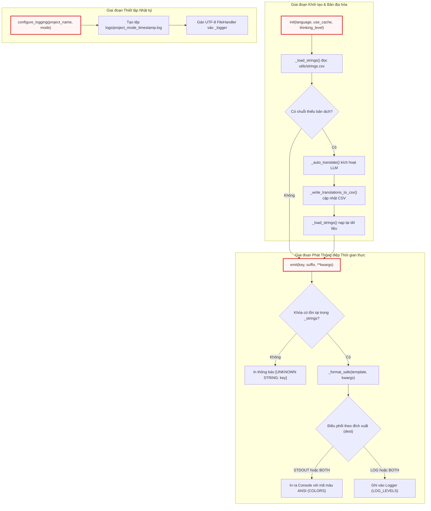

# output.py
> **Source:** `utils/output.py`

Tiếp nối mô-đun [exclude_patterns.py](exclude_patterns.py.md) — nơi thiết lập các tập hợp mẫu loại trừ tĩnh để tối ưu hóa việc nạp dữ liệu — tệp `output.py` đóng vai trò là hệ thống tiện ích trung tâm điều phối toàn bộ hoạt động xuất dữ liệu ra giao diện dòng lệnh (CLI stdout), quản lý ghi nhật ký tệp (file logging) và bản địa hóa đa ngôn ngữ (i18n). Mô-đun này cung cấp cơ chế định dạng chuỗi an toàn, mã hóa màu ANSI theo cấp độ sự kiện và tự động bổ sung bản dịch còn thiếu thông qua việc tích hợp trực tiếp với các mô hình ngôn ngữ lớn (LLM).

---

## 1. Tổng quan Kiến trúc & Vai trò Hệ thống

Mô-đun `output.py` giải quyết bốn bài toán cốt lõi trong hạ tầng hiển thị và theo dõi thực thi của hệ thống `test`:
1. **Trừu tượng hóa luồng xuất (Output Stream Abstraction):** Cho phép các thành phần nghiệp vụ (`nodes.py`, `flow.py`, `crawl_*.py`) phát thông điệp thống nhất mà không cần quan tâm đến việc thông điệp đó sẽ được in ra console, ghi vào tệp log hay cả hai (`STDOUT`, `LOG`, `BOTH`).
2. **Quản lý đa ngôn ngữ (i18n) và Khả năng tự phục hồi bản dịch:** Toàn bộ chuỗi giao diện người dùng và thông điệp trạng thái được tách biệt trong tệp `utils/strings.csv`. Nếu ngôn ngữ đích thiếu các khóa dịch thuật, hệ thống sẽ tự động kích hoạt tiến trình trích xuất, gọi LLM biên dịch hàng loạt và lưu vết vĩnh viễn ngược lại tệp CSV mà không làm gián đoạn luồng xử lý chính.
3. **Định dạng màu sắc ANSI thích ứng (ANSI Color-Coded Styling):** Phân loại thông điệp thành các cấp độ ngữ nghĩa (`PROGRESS`, `SUCCESS`, `WARNING`, `ERROR`, `INFO`, `DEBUG`, `FILE_WRITE`, `UI`) tương ứng với các mã thoát màu ANSI tiêu chuẩn.
4. **Cô lập và cấu hình hệ thống ghi nhật ký (Isolated Logging Engine):** Thiết lập tệp log chuyên biệt theo từng phiên chạy với định dạng dấu thời gian chính xác, bảo đảm an toàn tiến trình và không làm ô nhiễm bộ ghi nhật ký gốc (root logger) của Python.



---

## 2. Hằng số & Biến Trạng thái Cấp Mô-đun (Module State)

### 2.1. Bảng tra cứu Màu ANSI (`COLORS`)
Từ điển xác định chuỗi thoát ANSI được ánh xạ tương ứng với từng cấp độ logic của hệ thống:

```python
COLORS = {
    "PROGRESS": "\033[96m",  # Cyan — LLM calls, active steps
    "SUCCESS": "\033[92m",  # Green — completions, cache hits
    "WARNING": "\033[93m",  # Yellow — warnings, capacity alerts
    "ERROR": "\033[91m",  # Red — errors, failures
    "INFO": "",  # Plain — config, counts, labels
    "DEBUG": "\033[90m",  # Gray — skipped files, debug
    "FILE_WRITE": "",  # Plain — "  - Wrote {path}" messages
    "UI": "",  # N/A — used in generated docs, never printed
}
RESET = "\033[0m"
```

* **`PROGRESS` (`\033[96m` - Cyan):** Biểu thị các bước tác vụ đang thực thi, tiến trình quét tệp hoặc trạng thái kích hoạt gọi API LLM.
* **`SUCCESS` (`\033[92m` - Green):** Biểu thị các tác vụ đã hoàn thành thành công, bao gồm các trường hợp trúng bộ nhớ đệm (cache hit) hoặc hoàn tất ghi tệp tài liệu.
* **`WARNING` (`\033[93m` - Yellow):** Cảnh báo tiệm cận giới hạn ngữ cảnh, phản hồi định dạng không mong muốn hoặc các tệp tin bị bỏ qua do dung lượng lớn.
* **`ERROR` (`\033[91m` - Red):** Biểu thị các lỗi ngoại lệ nghiêm trọng, yêu cầu API thất bại hoặc gián đoạn luồng xử lý.
* **`DEBUG` (`\033[90m` - Gray):** Cung cấp dữ liệu chi tiết nội bộ, danh sách các tệp bị loại trừ theo mẫu glob.
* **`RESET` (`\033[0m`):** Chuỗi ký tự thoát chuẩn ANSI để khôi phục cấu hình màu sắc giao diện dòng lệnh về trạng thái mặc định của thiết bị đầu cuối.

### 2.2. Ánh xạ Cấp độ Nhật ký (`LOG_LEVELS`)
Từ điển chuyển đổi giữa cấp độ định dạng của giao diện sang cấp độ chuẩn của thư viện `logging` trong Python runtime:

```python
LOG_LEVELS = {
    "PROGRESS": logging.INFO,
    "SUCCESS": logging.INFO,
    "WARNING": logging.WARNING,
    "ERROR": logging.ERROR,
    "INFO": logging.INFO,
    "DEBUG": logging.DEBUG,
    "FILE_WRITE": logging.DEBUG,
}
```

### 2.3. Trạng thái Toàn cục Nội bộ (Internal Global State)
* **`_strings` (`dict`):** Lưu trữ bộ nhớ đệm các mẫu chuỗi dịch dưới cấu trúc `{key: {"text": str, "level": str, "dest": str}}`.
* **`_language` (`str`):** Tên ngôn ngữ đích được viết hoa chữ cái đầu (ví dụ: `"Vietnamese"`), sử dụng cho hiển thị giao diện và chèn vào prompt dịch thuật.
* **`_lang_col` (`str`):** Tên định danh cột tương ứng trong tệp `strings.csv` được chuẩn hóa về chữ thường (ví dụ: `"vietnamese"`).
* **`_logger` (`logging.Logger`):** Thể hiện logger chuyên biệt mang tên `"llm_logger"`.
* **`_csv_path` (`str | None`):** Đường dẫn tuyệt đối tới tệp tài nguyên chuỗi `utils/strings.csv`.
* **`_use_cache` (`bool`):** Cờ cho phép tái sử dụng bộ nhớ đệm phản hồi của LLM khi thực thi dịch thuật tự động.
* **`_thinking_level` (`str | None`):** Mức độ suy luận (reasoning effort) chuyển giao cho LLM trong các tác vụ dịch thuật.

---

## 3. Module-Level Functions

### `init()`
**Visibility**: Public  
**Signature**: `def init(language="english", use_cache=True, thinking_level=None) -> None:`

**Description**:  
Khởi tạo toàn bộ hệ thống xuất và bản địa hóa của ứng dụng. Hàm này thiết lập đường dẫn tệp CSV lưu trữ chuỗi, phân giải cấu hình ngôn ngữ đích, đồng bộ hóa trạng thái bộ nhớ và tự động kích hoạt quy trình dịch bổ sung nếu phát hiện các khóa ngôn ngữ chưa được hoàn thiện. Hàm bắt buộc phải được triệu gọi tại điểm nhập chính `main()` ngay sau khi phân tích cú pháp tham số dòng lệnh (CLI arguments) và trước bất kỳ lệnh gọi `emit()` hay `get()` nào.

**Parameters**:
* `language` (`str`): Tên định danh của ngôn ngữ đích cần kích hoạt (mặc định: `"english"`).
* `use_cache` (`bool`): Cờ xác định việc có kích hoạt bộ nhớ đệm phản hồi khi gọi LLM dịch thuật hay không (mặc định: `True`).
* `thinking_level` (`str | None`): Cấu hình mức độ tính toán suy luận cho mô hình LLM khi xử lý dịch (mặc định: `None`).

**Returns**:
* `None`

**Raises**:
* Không trực tiếp phát sinh ngoại lệ; các lỗi ngoại vi trong quá trình nạp dữ liệu hoặc gọi LLM sẽ được bắt cục bộ và chuyển sang cơ chế cảnh báo phòng thủ.

**Example**:
```python
def init(language="english", use_cache=True, thinking_level=None):
    """Initialize the output system: load strings.csv, set language, auto-translate missing.

    Must be called from main() after parsing CLI arguments but before any emit() calls.

    Args:
        language: Target language name (e.g., "Vietnamese").
        use_cache: Whether LLM caching is enabled (passed to translation calls).
        thinking_level: LLM thinking level (passed to translation calls).
    """
    global _language, _lang_col, _csv_path, _use_cache, _thinking_level
    _language = language.capitalize()
    _lang_col = language.lower()
    _csv_path = os.path.join(os.path.dirname(os.path.abspath(__file__)), "strings.csv")
    _use_cache = use_cache
    _thinking_level = thinking_level
    _load_strings()
    _auto_translate()
```

Hàm `init` đóng vai trò là điểm chốt chặn cấu hình đầu tiên trong chu trình sống của hệ thống. Bằng cách lưu trữ đường dẫn `_csv_path` dựa trên hàm `os.path.abspath(__file__)`, hàm đảm bảo việc truy xuất tệp dữ liệu chuỗi luôn chính xác tuyệt đối bất kể thư mục làm việc hiện tại (working directory) của tiến trình ở đâu. Chuỗi thực thi tuần tự từ `_load_strings()` sang `_auto_translate()` giúp đảm bảo rằng ngay sau khi `init()` hoàn tất, biến toàn cục `_strings` đã chứa đầy đủ 100% các mục dịch cho ngôn ngữ được chỉ định.

---

### `emit()`
**Visibility**: Public  
**Signature**: `def emit(key: str, suffix: str = "", **kwargs) -> None:`

**Description**:  
Thực hiện định dạng chuỗi mẫu dựa trên khóa `key` được định nghĩa trong `strings.csv`, thay thế các biến giữ chỗ thông qua hàm định dạng an toàn `_format_safe`, sau đó gắn thêm chuỗi phụ trợ `suffix` và chuyển tiếp thông điệp tới giao diện điều khiển chuẩn (stdout), tệp nhật ký (log file) hoặc cả hai tùy theo cấu hình `dest` của khóa đó.

**Parameters**:
* `key` (`str`): Khóa định danh chuỗi trong bảng `strings.csv` (ví dụ: `"LLM_CALL_WRITE_CHAPTER"`).
* `suffix` (`str`): Chuỗi văn bản bổ sung nối tiếp vào sau thông điệp chính (ví dụ: thông số chi tiết token breakdown).
* `**kwargs`: Danh sách các biến động dùng để ánh xạ vào các vị trí giữ chỗ `{placeholder}` trong mẫu văn bản.

**Returns**:
* `None`

**Raises**:
* Không phát sinh ngoại lệ. Nếu `key` không tồn tại, hàm in cảnh báo định dạng `[UNKNOWN STRING: {key}]` trực tiếp ra stdout để ngăn chặn tình trạng nuốt lỗi ngầm.

**Example**:
```python
def emit(key, suffix="", **kwargs):
    """Emit a translatable string to stdout and/or log file.

    Args:
        key: String key from strings.csv (e.g., "LLM_CALL_WRITE_CHAPTER").
        suffix: Optional extra text appended after the main message (e.g., token breakdown).
        **kwargs: Variables to substitute into the string template.
    """
    entry = _strings.get(key)
    if not entry:
        # Fallback for unknown keys — print raw so nothing is silently lost
        print(f"[UNKNOWN STRING: {key}]")
        return

    text = _format_safe(entry["text"], kwargs)
    if suffix:
        text = text + suffix

    level = entry["level"]
    dest = entry["dest"]
    color = COLORS.get(level, "")
    reset = RESET if color else ""

    if dest in ("BOTH", "STDOUT"):
        print(f"{color}{text}{reset}")
    if dest in ("BOTH", "LOG"):
        _logger.log(LOG_LEVELS.get(level, logging.INFO), text)
```

Hàm `emit` áp dụng cơ chế phân tách luồng xuất thông minh. Nhờ vào việc phân tích trường `dest`, các thông điệp chỉ mang tính trực quan cho người dùng cuối sẽ không làm phình to tệp log, trong khi các thông điệp chẩn đoán chi tiết vẫn được lưu trữ đầy đủ. Việc bọc chuỗi trong các cặp mã ANSI (`color` và `reset`) chỉ áp dụng cho nhánh `STDOUT`, giúp tệp nhật ký luôn lưu trữ văn bản thuần (plain text) sạch sẽ, không bị ô nhiễm bởi các ký tự điều khiển thiết bị đầu cuối.

---

### `emit_raw()`
**Visibility**: Public  
**Signature**: `def emit_raw(level: str, text: str, dest: str = "BOTH") -> None:`

**Description**:  
Phát trực tiếp một chuỗi văn bản đã được định dạng sẵn ra console và/hoặc tệp log với cấp độ màu sắc chỉ định rõ ràng. Hàm này được thiết kế chuyên biệt cho các đầu ra mang tính cấu trúc động, bảng biểu thống kê hoặc thông điệp tạm thời không thuộc tập hợp chuỗi tĩnh trong `strings.csv`.

**Parameters**:
* `level` (`str`): Tên cấp độ trực quan định nghĩa trong bảng `COLORS` (ví dụ: `"PROGRESS"`, `"SUCCESS"`, `"WARNING"`, `"ERROR"`, `"DEBUG"`).
* `text` (`str`): Nội dung chuỗi văn bản hoàn chỉnh cần xuất bản.
* `dest` (`str`): Đích đến của luồng xuất, chấp nhận một trong ba giá trị: `"BOTH"`, `"STDOUT"`, hoặc `"LOG"` (mặc định: `"BOTH"`).

**Returns**:
* `None`

**Raises**:
* Không phát sinh ngoại lệ.

**Example**:
```python
def emit_raw(level, text, dest="BOTH"):
    """Emit a pre-formatted string with explicit level styling.

    Use for dynamic/structural output that doesn't come from strings.csv
    (e.g., numbered file lists, batch details, crawl summary tables).
    """
    color = COLORS.get(level, "")
    reset = RESET if color else ""

    if dest in ("BOTH", "STDOUT"):
        print(f"{color}{text}{reset}")
    if dest in ("BOTH", "LOG"):
        _logger.log(LOG_LEVELS.get(level, logging.INFO), text)
```

`emit_raw` cung cấp khả năng can thiệp trực tiếp vào luồng xuất cho các thuật toán nội bộ phức tạp. Điển hình như trong [crawl_local_files.py](crawl_local_files.py.md) và [crawl_github_files.py](crawl_github_files.py.md), danh sách tệp được duyệt hoặc bảng tổng kết tỷ lệ nén token cần được in ấn theo định dạng bảng nhiều dòng tùy biến mà không thể quy định trước bằng mẫu đơn dòng trong CSV. Hàm ánh xạ trực tiếp `level` sang `LOG_LEVELS` để đảm bảo tính đồng nhất giữa giao diện và nhật ký.

---

### `get()`
**Visibility**: Public  
**Signature**: `def get(key: str, **kwargs) -> str:`

**Description**:  
Truy xuất nội dung chuỗi văn bản đã được bản địa hóa mà không thực hiện bất kỳ thao tác in ấn ra terminal hay ghi tệp log nào. Hàm hỗ trợ thay thế các biến nội suy `{placeholder}` và được dùng chủ yếu để chèn các tiêu đề, nhãn mục hoặc văn bản giao diện người dùng vào nội dung tài liệu Markdown sinh tự động.

**Parameters**:
* `key` (`str`): Khóa định danh của chuỗi trong cơ sở dữ liệu `strings.csv`.
* `**kwargs`: Tập hợp các biến số dùng để ánh xạ vào các trường giữ chỗ trong chuỗi đích.

**Returns**:
* `str`: Chuỗi văn bản đã được dịch và điền đầy đủ dữ liệu nội suy. Nếu `key` không tồn tại, hàm trả về chính giá trị `key` như một cơ chế dự phòng an toàn.

**Raises**:
* Không phát sinh ngoại lệ.

**Example**:
```python
def get(key, **kwargs):
    """Get a translated string without printing or logging.

    Use for UI strings embedded in generated markdown (index.md headings, etc.).
    Returns the raw translated text with variable substitution applied.
    """
    entry = _strings.get(key)
    if not entry:
        return key  # Fallback: return the key itself
    return _format_safe(entry["text"], kwargs)
```

Hàm `get` tách biệt hoàn toàn logic sinh văn bản tài liệu khỏi logic điều khiển giao diện CLI. Khi các nút phân tích trong `nodes.py` xây dựng cấu trúc tài liệu tổng quan (`index.md`), chúng cần các tiêu đề mục như "Mục lục", "Tổng quan Kiến trúc" theo đúng ngôn ngữ mà người dùng yêu cầu nhưng không được kích hoạt in ấn làm gián đoạn màn hình điều khiển. Việc trả về nguyên bản `key` khi tra cứu thất bại giúp phát hiện lỗi cấu hình một cách trực quan trên tài liệu đầu ra mà không làm sụp đổ tiến trình sinh mã.

---

### `configure_logging()`
**Visibility**: Public  
**Signature**: `def configure_logging(project_name="project", mode="tutorial") -> str:`

**Description**:  
Cấu hình và khởi tạo hệ thống ghi tệp nhật ký chuyên biệt cho phiên làm việc hiện tại. Hàm tự động tạo thư mục nhật ký nếu chưa tồn tại, chuẩn hóa tên dự án và chế độ thực thi để tạo tên tệp an toàn, gắn định dạng chuẩn ISO cho bộ ghi nhật ký và ghi lại các siêu dữ liệu cấu hình ban đầu của phiên chạy.

**Parameters**:
* `project_name` (`str`): Tên định danh của dự án đang được phân tích (mặc định: `"project"`).
* `mode` (`str`): Chế độ vận hành của hệ thống, ví dụ `"tutorial"` hoặc `"api-ref"` (mặc định: `"tutorial"`).

**Returns**:
* `str`: Đường dẫn tuyệt đối hoặc tương đối tới tệp nhật ký mới được khởi tạo (định dạng `logs/{safe_project}_{safe_mode}_{timestamp}.log`).

**Raises**:
* `OSError`: Có thể phát sinh nếu hệ thống tệp không cho phép tạo thư mục hoặc ghi tệp trong thư mục chỉ định bởi `LOG_DIR`.

**Example**:
```python
def configure_logging(project_name="project", mode="tutorial"):
    """Configure file-based logging for this run.

    Creates a new log file per invocation:
        logs/{project_name}_{mode}_{YYYYMMDD_HHmmss}.log

    Must be called from main() after parsing CLI arguments.
    """
    from datetime import datetime

    log_directory = os.getenv("LOG_DIR", "logs")
    os.makedirs(log_directory, exist_ok=True)

    safe_project = "".join(c if c.isalnum() or c in "-_." else "_" for c in project_name)
    safe_mode = mode.replace("-", "_")
    timestamp = datetime.now().strftime("%Y%m%d_%H%M%S")
    log_file = os.path.join(log_directory, f"{safe_project}_{safe_mode}_{timestamp}.log")

    # Remove any existing handlers (e.g., NullHandler) and add the file handler
    _logger.handlers.clear()
    file_handler = logging.FileHandler(log_file, encoding="utf-8")
    file_handler.setFormatter(logging.Formatter("%(asctime)s - %(levelname)s - %(message)s"))
    _logger.addHandler(file_handler)

    # Log run metadata at the start of every log file
    _logger.info(f"{'=' * 80}")
    _logger.info(f"RUN STARTED | project={project_name} | mode={mode} | timestamp={timestamp}")
    _logger.info(f"Log file: {log_file}")
    _logger.info(f"{'=' * 80}")

    return log_file
```

Hàm `configure_logging` thực hiện làm sạch toàn diện các handler cũ trên `_logger` bằng lệnh `_logger.handlers.clear()`. Điều này triệt tiêu hoàn toàn khả năng bị nhân bản dòng log (duplicate log records) hoặc xung đột với `NullHandler` được gán trước đó khi mô-đun [call_llm.py](call_llm.py.md) được nạp vào bộ nhớ. Việc sử dụng mã hóa `utf-8` cho `FileHandler` đảm bảo toàn bộ thông điệp đa ngôn ngữ (bao gồm tiếng Việt có dấu và các ký tự tượng hình) được ghi nhận chính xác tuyệt đối.

---

### `_format_safe()`
**Visibility**: Private  
**Signature**: `def _format_safe(template: str, kwargs: dict) -> str:`

**Description**:  
Thực thi phương thức `str.format(**kwargs)` trên mẫu chuỗi văn bản với cơ chế bao bọc an toàn. Hàm bắt giữ toàn bộ các ngoại lệ định dạng phổ biến nhằm đảm bảo hệ thống không bị dừng đột ngột khi mẫu chuỗi chứa các ký tự ngoặc nhọn `{}` không phải biến thay thế hoặc khi thiếu tham số truyền vào.

**Parameters**:
* `template` (`str`): Mẫu văn bản gốc chứa các khối định dạng `{placeholder}`.
* `kwargs` (`dict`): Từ điển ánh xạ tên biến và giá trị tương ứng cần thay thế.

**Returns**:
* `str`: Chuỗi sau khi đã thay thế các biến thành công, hoặc chính chuỗi `template` ban đầu nếu có bất kỳ lỗi định dạng nào xảy ra.

**Raises**:
* Không phát sinh ngoại lệ ra ngoài (hấp thụ `KeyError`, `IndexError`, `ValueError`).

**Example**:
```python
def _format_safe(template, kwargs):
    """Apply .format(**kwargs) with graceful fallback on missing keys."""
    try:
        return template.format(**kwargs)
    except (KeyError, IndexError, ValueError):
        return template
```

Hàm hỗ trợ nội bộ này xử lý triệt để các trường hợp biên nguy hiểm trong quá trình hiển thị. Ví dụ: khi một thông báo lỗi từ LLM hoặc một đoạn mã nguồn ngẫu nhiên chứa các ký tự `{` hoặc `}` đi qua hàm định dạng, hàm `str.format()` tiêu chuẩn của Python sẽ ném ra ngoại lệ `ValueError` hoặc `KeyError`. Nhờ có `_format_safe`, hệ thống luôn duy trì trạng thái hoạt động liên tục và trả về nguyên mẫu chuỗi ban đầu thay vì gây sập ứng dụng.

---

### `_load_strings()`
**Visibility**: Private  
**Signature**: `def _load_strings() -> None:`

**Description**:  
Nạp và phân tích toàn bộ cấu hình chuỗi từ tệp `utils/strings.csv` vào từ điển trạng thái toàn cục `_strings`. Hàm tự động xử lý ký tự Byte Order Mark (BOM), loại bỏ các dòng chú thích bắt đầu bằng ký tự `#`, thiết lập quyền ưu tiên ngôn ngữ chỉ định và tự động chuyển về cột tiếng Anh (`english`) khi chuỗi ngôn ngữ chỉ định bị bỏ trống.

**Parameters**:
* Không có.

**Returns**:
* `None`

**Raises**:
* Bắt và bỏ qua các trường hợp tệp CSV không tồn tại hoặc đường dẫn `_csv_path` chưa được thiết lập.

**Example**:
```python
def _load_strings():
    """Load all strings from strings.csv."""
    global _strings
    _strings = {}

    if not _csv_path or not os.path.exists(_csv_path):
        return

    translated_count = 0
    total_count = 0

    with open(_csv_path, encoding="utf-8-sig") as f:
        reader = csv.DictReader(f)
        for row in reader:
            key = row.get("STRING_KEY", "").strip()
            if not key or key.startswith("#"):
                continue

            level = row.get("LEVEL", "INFO").strip()
            dest = row.get("DEST", "BOTH").strip()

            # Priority: language column → English fallback
            text = row.get(_lang_col, "").strip()
            if text:
                translated_count += 1
            else:
                text = row.get("english", "").strip()

            total_count += 1
            _strings[key] = {"text": text, "level": level, "dest": dest}

    if _lang_col != "english" and translated_count == total_count:
        emit_raw("SUCCESS", f"[i18n] {_language} — loaded {translated_count} strings from CSV")
```

`_load_strings` thực thi thuật toán phân giải ưu tiên ngôn ngữ phân tầng (fallback cascading). Đối với mỗi bản ghi trong CSV, hệ thống kiểm tra sự tồn tại của giá trị trong cột `_lang_col`. Nếu giá trị này rỗng hoặc không tồn tại, hệ thống lập tức dự phòng sang giá trị tại cột `english`. Việc mở tệp bằng bảng mã `utf-8-sig` giúp vô hiệu hóa triệt để ký tự BOM vô hình thường được sinh ra bởi các công cụ chỉnh sửa bảng tính như Microsoft Excel, bảo đảm khóa đầu tiên `STRING_KEY` không bị biến dạng tên trường.

---

### `_auto_translate()`
**Visibility**: Private  
**Signature**: `def _auto_translate() -> None:`

**Description**:  
Tự động phát hiện các chuỗi chưa có bản dịch trong ngôn ngữ đích, nạp mẫu prompt dịch thuật từ tệp tài nguyên, đóng gói dữ liệu JSON và gọi mô hình ngôn ngữ lớn (LLM) thông qua `call_llm` để dịch đồng loạt. Kết quả dịch được phân tích cú pháp bằng biểu thức chính quy (regex), ghi trực tiếp vào `strings.csv` và kích hoạt nạp lại dữ liệu vào bộ nhớ.

**Parameters**:
* Không có.

**Returns**:
* `None`

**Raises**:
* Hấp thụ toàn bộ ngoại lệ tổng quát (`Exception`) trong quá trình giao tiếp mạng hoặc phân tích cú pháp JSON, đồng thời phát cảnh báo `WARNING` và duy trì bản dịch tiếng Anh dự phòng.

**Example**:
```python
def _auto_translate():
    """Auto-translate missing strings via LLM and write back into strings.csv."""
    if _lang_col == "english":
        return

    if not _csv_path or not os.path.exists(_csv_path):
        return

    # Collect strings that have no translation in the target language column
    missing = {}
    is_new_column = False
    with open(_csv_path, encoding="utf-8-sig") as f:
        reader = csv.DictReader(f)
        fieldnames = list(reader.fieldnames)
        is_new_column = _lang_col not in fieldnames
        for row in reader:
            key = row.get("STRING_KEY", "").strip()
            if not key or key.startswith("#"):
                continue
            # Check if the language column exists and has a value
            lang_text = row.get(_lang_col, "").strip() if _lang_col in fieldnames else ""
            if lang_text:
                continue  # Already translated

            english_text = row.get("english", "").strip()
            if english_text:
                missing[key] = english_text

    if not missing:
        return

    # Report what we found
    if is_new_column:
        emit_raw("PROGRESS", f"[i18n] New language '{_language}' — adding column to strings.csv")
    emit_raw("PROGRESS", f"[i18n] {len(missing)} strings need translation to {_language}")

    # Batch translate via LLM
    try:
        from utils.call_llm import call_llm

        entries_json = json.dumps(missing, ensure_ascii=False, indent=2)

        # Load prompt template from prompts/common/translate_strings.md
        prompt_path = os.path.join(
            os.path.dirname(os.path.dirname(os.path.abspath(__file__))),
            "prompts",
            "common",
            "translate_strings.md",
        )
        with open(prompt_path, encoding="utf-8") as pf:
            prompt_template = pf.read()
        prompt = prompt_template.format(language=_language, entries=entries_json)

        emit_raw("PROGRESS", f"[i18n] Calling LLM to translate {len(missing)} strings...")
        response = call_llm(prompt, use_cache=_use_cache, thinking_level=_thinking_level)

        # Extract JSON from response
        json_match = re.search(r"\{[^{}]*(?:\{[^{}]*\}[^{}]*)*\}", response, re.DOTALL)
        if json_match:
            translations = json.loads(json_match.group())
            translated_count = len(translations)

            # Write translations back into strings.csv
            _write_translations_to_csv(translations)
            emit_raw("SUCCESS", f"[i18n] Translated {translated_count}/{len(missing)} strings — saved to strings.csv")

            # Reload strings from the updated CSV so all translations are active
            _load_strings()
        else:
            emit_raw("WARNING", "[i18n] LLM response did not contain valid JSON — falling back to English")

    except Exception as e:
        emit_raw("WARNING", f"[i18n] Translation failed: {e} — falling back to English")
```

Hàm `_auto_translate` triển khai mẫu nạp lười (lazy import) đối với mô-đun [call_llm.py](call_llm.py.md) nhằm triệt tiêu hoàn toàn sự phụ thuộc vòng (circular dependency) tại thời điểm tải mã nguồn. Thuật toán phân tích phản hồi sử dụng biểu thức chính quy lồng nhau `re.search(r"\{[^{}]*(?:\{[^{}]*\}[^{}]*)*\}", response, re.DOTALL)` để bóc tách chính xác khối JSON ngay cả khi LLM phản hồi kèm theo các đoạn văn xuôi giải thích hoặc khối markdown ````json ... ````. Nếu quá trình dịch hoặc ghi tệp thất bại, hệ thống tự động giữ nguyên bản dịch tiếng Anh dự phòng mà không làm gián đoạn tiến trình đang chạy.

---

### `_write_translations_to_csv()`
**Visibility**: Private  
**Signature**: `def _write_translations_to_csv(translations: dict) -> None:`

**Description**:  
Ghi đè và bổ sung các bản dịch mới vào tệp `utils/strings.csv`. Hàm sẽ tự động tạo thêm tiêu đề cột ngôn ngữ mới vào danh sách `fieldnames` nếu cột này chưa tồn tại trong cấu trúc tệp CSV ban đầu, đồng thời duy trì định dạng mã hóa UTF-8 có dấu hiệu BOM (`utf-8-sig`) để đảm bảo khả năng tương thích khi mở bằng Microsoft Excel trên Windows.

**Parameters**:
* `translations` (`dict`): Từ điển chứa các cặp khóa - bản dịch văn bản mới `{STRING_KEY: translated_text}`.

**Returns**:
* `None`

**Raises**:
* `IOError` / `PermissionError`: Có thể phát sinh nếu tệp CSV đang bị khóa bởi tiến trình khác trên hệ điều hành.

**Example**:
```python
def _write_translations_to_csv(translations):
    """Write LLM translations back into strings.csv, persisting them for future runs.

    If the target language column doesn't exist, it is added to the CSV.
    """
    rows = []
    fieldnames = None

    with open(_csv_path, encoding="utf-8-sig") as f:
        reader = csv.DictReader(f)
        fieldnames = list(reader.fieldnames)
        # Add language column if it doesn't exist
        if _lang_col not in fieldnames:
            fieldnames.append(_lang_col)
        for row in reader:
            key = row.get("STRING_KEY", "").strip()
            if key in translations:
                row[_lang_col] = translations[key]
            rows.append(row)

    # Write with BOM so Excel opens as UTF-8 without extra import steps
    with open(_csv_path, "w", encoding="utf-8-sig", newline="") as f:
        writer = csv.DictWriter(f, fieldnames=fieldnames)
        writer.writeheader()
        writer.writerows(rows)
```

Hàm `_write_translations_to_csv` bảo toàn tính toàn vẹn cấu trúc của tệp cơ sở dữ liệu chuỗi thông qua thao tác đọc-sửa đổi-ghi (read-modify-write) toàn bộ tập dữ liệu. Việc bổ sung cột động (`fieldnames.append(_lang_col)`) cho phép hệ thống mở rộng không giới hạn số lượng ngôn ngữ được hỗ trợ mà không yêu cầu lập trình viên phải chỉnh sửa cấu trúc bảng CSV thủ công. Tham số `newline=""` trong hàm `open` kết hợp với `csv.DictWriter` ngăn chặn hiện tượng chèn dòng trống thừa trên các hệ điều hành họ Windows (CRLF).

---

## 4. Tích hợp Hệ thống & Luồng Tác vụ (System Integration)

Mô-đun `output.py` đóng vai trò là "trạm phát thanh" và "bộ não giao diện" cho toàn bộ kiến trúc `test`:
* **Điểm khởi tạo từ `main.py`:** Ngay sau khi các cờ tham số `--language`, `--mode`, `--project-name` được bóc tách từ CLI, `main.py` thực hiện gọi tuần tự `init(language=...)` và `configure_logging(...)`.
* **Cung cấp giao diện cho Động cơ Thu thập (`crawl_*.py`):** Trong suốt quá trình quét đĩa cục bộ hay gọi GitHub REST API, các thông tin tệp bị bỏ qua, giới hạn tốc độ (rate limit), cảnh báo dung lượng đều được chuyển tiếp qua `emit_raw("DEBUG", ...)` hoặc `emit("CRAWL_SUMMARY", ...)`.
* **Cung cấp giao diện cho Bộ sinh Tài liệu (`nodes.py`):** Khi các nút xử lý LLM tạo tài liệu, chúng gọi `get("UI_...")` để nhúng các tiêu đề mục đã được dịch chính xác vào tệp Markdown, đồng thời dùng `emit("LLM_CALL_WRITE_CHAPTER", ...)` để cập nhật thanh tiến trình trên terminal.

---

## Xem thêm
* [utils/call_llm.py](call_llm.py.md) — Tầng tích hợp LLM hỗ trợ nạp lười cho tác vụ tự động dịch chuỗi i18n.
* [utils/crawl_local_files.py](crawl_local_files.py.md) — Bộ thu thập tệp cục bộ sử dụng `emit()` và `emit_raw()` để báo cáo tiến trình.
* [utils/crawl_github_files.py](crawl_github_files.py.md) — Động cơ nạp dữ liệu từ xa tiêu thụ `emit_raw()` để hiển thị tiến độ tải.
* [utils/exclude_patterns.py](exclude_patterns.py.md) — Định nghĩa tập hợp mẫu lọc loại trừ tệp tĩnh.
* [utils/prompts.py](prompts.py.md) — Kho lưu trữ các khuôn mẫu câu lệnh cho hệ thống.
* [main.py](../main.py.md) — Điểm nhập chính của chương trình, nơi điều phối khởi tạo logging và xuất dữ liệu.

