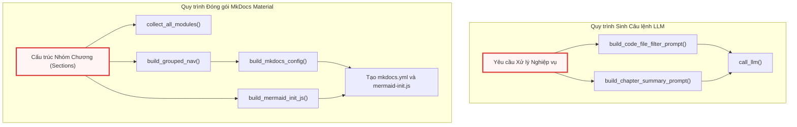
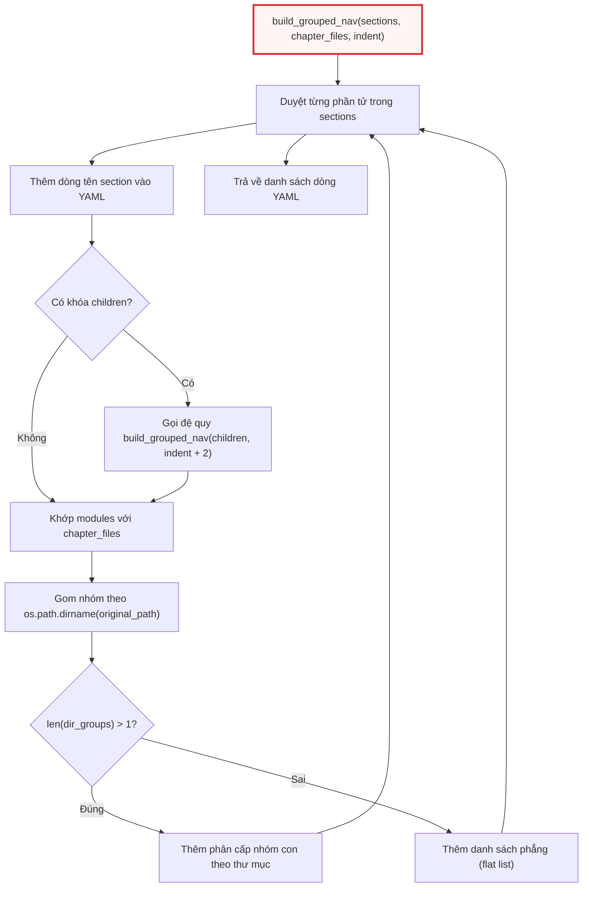

# prompts.py

> **Source:** `utils/prompts.py`

Tiếp nối từ mô-đun [output.py](output.py.md) — nơi chịu trách nhiệm quản lý đầu ra console, ghi nhật ký tệp và bản địa hóa chuỗi giao diện người dùng — tệp `utils/prompts.py` đóng vai trò là tầng sinh câu lệnh (prompt builder) và cấu hình tĩnh nội bộ cho toàn bộ hệ thống. Trong khi các câu lệnh sinh tài liệu chính của các chế độ hoạt động được nạp từ các tệp mẫu trong thư mục `prompts/{mode}/`, `prompts.py` tập trung định nghĩa các hàm tạo câu lệnh logic nghiệp vụ trực tiếp (in-code prompt builders) và các trình tạo cấu hình trang tĩnh phục vụ quá trình xuất bản tài liệu với MkDocs.

---

## Tổng quan Kỹ thuật (Technical Overview)

Mô-đun `utils/prompts.py` giải quyết ba bài toán cốt lõi trong quy trình phân tích và đóng gói tài liệu tự động:

1. **Lọc tệp mã nguồn tất định (Deterministic Code File Filtering)**: Cung cấp câu lệnh định hướng mô hình ngôn ngữ lớn (LLM) phân loại chính xác các tệp chứa logic nghiệp vụ, hàm, lớp, API thực tế; loại bỏ hoàn toàn các tệp giao diện (UI layout), tệp cấu hình, tài nguyên tĩnh và mã kịch bản dựng dự án.
2. **Duy trì tính mạch lạc đa chương (Cross-Chapter Context Preservation)**: Cung cấp hàm sinh câu lệnh tạo bản tóm tắt kỹ thuật 4 chiều (phạm vi thành phần, phần tử kỹ thuật cốt lõi, mô hình kiến trúc, giao diện tích hợp) sau khi mỗi chương tài liệu được hoàn thành. Bản tóm tắt này đóng vai trò là ngữ cảnh liên chương (inter-chapter context) được truyền liên tiếp vào các nút xử lý tài liệu tiếp theo.
3. **Tự động hóa xuất bản tĩnh với MkDocs (MkDocs Artifact Generation)**: Tự động hóa quá trình dựng tệp cấu hình `mkdocs.yml`, mã JavaScript khởi tạo biểu đồ Mermaid độc lập, và thuật toán đệ quy xây dựng cây điều hướng đa tầng (`nav`) từ kết quả phân nhóm chức năng của LLM.



---

## Danh mục Hàm Cấp Mô-đun (Module-Level Functions)

### `build_code_file_filter_prompt()`

**Visibility**: Public  
**Signature**: `def build_code_file_filter_prompt(project_name: str, file_listing: str) -> str:`

**Description**:  
Hàm tạo chuỗi prompt cho nút `DeterministicFileMapper` (sử dụng trong chế độ `api-reference`). Hàm nhận vào tên dự án và danh sách tệp mã nguồn được đánh chỉ mục, sau đó thiết lập các ràng buộc logic nghiêm ngặt nhằm hướng dẫn LLM trích xuất chính xác các tệp mã nguồn thực tế (chứa API, hàm, lớp, logic nghiệp vụ cốt lõi). Prompt yêu cầu LLM loại trừ các tệp cấu hình, tệp giao diện (XAML, Storyboard, HTML), tệp kịch bản dựng dự án (.csproj, .sln) và tài nguyên tĩnh, đồng thời ép định dạng đầu ra phải là một danh sách YAML hợp lệ chứa các chỉ số tệp (file indices).

**Parameters**:
* `project_name` (`str`): Tên định danh của dự án cần phân tích.
* `file_listing` (`str`): Chuỗi văn bản liệt kê toàn bộ đường dẫn tệp trong kho mã nguồn kèm chỉ số đại diện.

**Returns**:
* `str`: Toàn bộ nội dung prompt hoàn chỉnh sẵn sàng chuyển tới `call_llm()`.

**Raises**:
* Không có ngoại lệ nội bộ nào được ném ra.

**Example**:
```python
def build_code_file_filter_prompt(project_name: str, file_listing: str) -> str:
    """Build the prompt for DeterministicFileMapper to filter non-code files.

    Used in api-reference mode to identify which files are actual code modules
    (APIs, functions, classes, business logic) vs. UI layouts, configs, assets.
    """
    return (
        f"For the project `{project_name}`, here is the list of all files in the codebase:\n\n"
        f"{file_listing}\n\n"
        f"Your task is to identify WHICH of these files are ACTUAL CODE files that contain "
        f"APIs, functions, classes, or core business logic.\n"
        f"EXCLUDE: UI layouts (like .xaml, .storyboard, .html), configuration files "
        f"(like .xml, .json, .manifest, .ini), static assets, build scripts "
        f"(like .csproj, .sln), and documentation.\n\n"
        f"Return ONLY a YAML list of the file indices that should be documented as code modules.\n\n"
        f"```yaml\n- 0\n- 1\n- 3\n```"
    )
```

Hàm này hoạt động như một cơ chế lọc dữ liệu mức suy luận (semantic filtering). Thay vì chỉ dựa vào các quy tắc phần mở rộng tĩnh trong [exclude_patterns.py](exclude_patterns.py.md), prompt này cung cấp năng lực nhận diện ngữ nghĩa cho LLM để phân biệt giữa các tệp mã nguồn có giá trị lập tài liệu và các tệp phụ trợ. Định dạng phản hồi được cố định bằng cú pháp mã YAML khối (`yaml\n- 0\n- 1...`) giúp tầng xử lý sau (downstream parser) bóc tách danh sách chỉ số một cách tất định mà không bị ảnh hưởng bởi văn bản giải thích dư thừa từ mô hình ngôn ngữ lớn.

---

### `build_chapter_summary_prompt()`

**Visibility**: Public  
**Signature**: `def build_chapter_summary_prompt(chapter_num: int, abstraction_name: str, chapter_content: str, language: str = "english") -> str:`

**Description**:  
Hàm tạo câu lệnh yêu cầu LLM tóm tắt một chương tài liệu kỹ thuật vừa được tạo ra. Bản tóm tắt này thu thập 4 chiều kỹ thuật chuẩn hóa (mỗi chiều từ 3 đến 5 câu):
1. **Component Scope & Responsibility**: Miền kỹ thuật chính, bài toán giải quyết và vai trò trong hệ thống.
2. **Key Technical Elements**: Các lớp, dịch vụ, hàm, mô hình dữ liệu hoặc giao thức cụ thể.
3. **Implementation Patterns & Architecture**: Mẫu thiết kế, giao thức truyền thông, luồng dữ liệu, xử lý lỗi và bảo mật.
4. **System Integration & Dependencies**: Giao diện kết nối, tài nguyên cung cấp hoặc tiêu thụ từ các thành phần khác.

Hàm hỗ trợ chèn chỉ thị ngôn ngữ đầu ra linh hoạt dựa trên tham số `language`.

**Parameters**:
* `chapter_num` (`int`): Thứ tự số của chương tài liệu hiện tại trong pipeline.
* `abstraction_name` (`str`): Tiêu đề hoặc tên thành phần trừu tượng của chương.
* `chapter_content` (`str`): Toàn bộ nội dung Markdown của chương vừa được LLM sinh ra.
* `language` (`str`, tùy chọn): Ngôn ngữ mục tiêu cho bản tóm tắt kỹ thuật. Mặc định là `"english"`.

**Returns**:
* `str`: Chuỗi prompt tóm tắt kỹ thuật có cấu trúc.

**Raises**:
* Không có ngoại lệ nội bộ nào được ném ra.

**Example**:
```python
def build_chapter_summary_prompt(chapter_num: int, abstraction_name: str, chapter_content: str, language: str = "english") -> str:
    """Build the prompt for generating a technical summary of a written chapter.

    Used after each chapter is generated to create a concise technical summary
    for cross-chapter context. The summary is fed into subsequent chapters'
    prompts so the LLM maintains coherence across the full document.

    The summary captures 4 technical dimensions with 3-5 sentences each:
    1. Component scope & responsibility
    2. Key classes/services/functions and their roles
    3. Implementation patterns & architectural decisions
    4. Inter-component interfaces & dependencies
    """
    lang_instruction = f"Write the entire summary in {language.capitalize()}. " if language.lower() != "english" else ""
    return (
        f"{lang_instruction}"
        f"Summarize the following documentation chapter as a structured technical brief. "
        f"For EACH of the 4 points below, write 3-5 concise technical sentences:\n\n"
        f"(1) **Component Scope & Responsibility**: What is the main technical domain this "
        f"chapter covers? What problems does it solve and what role does it play in the system?\n\n"
        f"(2) **Key Technical Elements**: What are the specific classes, services, functions, "
        f"data models, or protocols discussed? Name them and describe their concrete roles.\n\n"
        f"(3) **Implementation Patterns & Architecture**: What design patterns, communication "
        f"protocols, data flow strategies, error handling mechanisms, or security measures "
        f"are covered? How are they implemented?\n\n"
        f"(4) **System Integration & Dependencies**: How does this component interface with "
        f"other parts of the system? What does it consume from or provide to other components? "
        f"What are the key integration points?\n\n"
        f"---\n"
        f"Chapter {chapter_num}: {abstraction_name}\n"
        f"{chapter_content}"
    )
```

Hàm `build_chapter_summary_prompt` thiết lập nền tảng cho cơ chế ghi nhớ ngữ cảnh cuốn chiếu (rolling context window). Trong quá trình tạo các tài liệu dài gồm nhiều chương, việc truyền toàn bộ nội dung các chương trước sẽ nhanh chóng làm tràn cửa sổ ngữ cảnh (context length) và tăng chi phí token. Bằng cách cô đọng nội dung mỗi chương thành một bản tóm tắt 4 chiều có độ nén thông tin cao, hệ thống cho phép LLM tham chiếu chéo chính xác các API, lớp dữ liệu và kiến trúc đã đề cập ở các chương trước mà không làm giảm tốc độ suy luận.

---

### `build_mkdocs_config()`

**Visibility**: Public  
**Signature**: `def build_mkdocs_config(site_name: str, nav_yaml: str) -> str:`

**Description**:  
Hàm sinh toàn bộ nội dung tệp cấu hình `mkdocs.yml` hoàn chỉnh phục vụ tính năng xuất bản tài liệu tĩnh (`--mkdocs`). Cấu hình được tạo bao gồm:
* Giao diện `material` tích hợp nút sao chép mã nguồn (`content.code.copy`) và chỉ mục điều hướng (`navigation.indexes`).
* Bộ chuyển đổi giao diện sáng/tối tự động (`palette`).
* Tiện ích mở rộng Markdown `pymdownx.highlight`, `pymdownx.inlinehilite` và `pymdownx.superfences`.
* Cấu hình hàng rào mã tùy chỉnh cho Mermaid với lớp `mermaid-raw` để khử xung đột kiểu dáng với theme Material.
* Tích hợp plugin `panzoom` để hỗ trợ phóng to/thu nhỏ và kéo biểu đồ tương tác.
* Nhúng thư viện CDN `mermaid.min.js` và tệp cấu hình động `javascripts/mermaid-init.js`.
* Chèn cấu trúc cây điều hướng từ chuỗi YAML `nav_yaml`.

**Parameters**:
* `site_name` (`str`): Tên tiêu đề trang tài liệu hiển thị trên thanh điều hướng và thẻ trình duyệt.
* `nav_yaml` (`str`): Chuỗi cấu hình cây điều hướng định dạng YAML (được sinh từ `build_grouped_nav`).

**Returns**:
* `str`: Nội dung văn bản định dạng YAML của tệp `mkdocs.yml`.

**Raises**:
* Không có ngoại lệ nội bộ nào được ném ra.

**Example**:
```python
def build_mkdocs_config(site_name: str, nav_yaml: str) -> str:
    """Build a complete mkdocs.yml for local --mkdocs output.

    Generates a ready-to-use MkDocs Material config with:
    - Material theme with code copy buttons
    - Syntax highlighting (pymdownx.highlight + inlinehilite)
    - Mermaid diagram rendering via custom 'mermaid-raw' class (bypasses
      Material's Mermaid color overrides so diagrams use Mermaid's default theme)
    - Panzoom plugin for interactive Mermaid diagram zoom/pan
    - Navigation from the generated nav_snippet

    Users can run `mkdocs serve` or `mkdocs build` directly in the output dir.
    """
    # Extract nav items from nav_snippet (strip the "nav:" header line)
    nav_lines = nav_yaml.split("\n")
    nav_body = "\n".join(nav_lines[1:]) if nav_lines else ""

    return (
        f"site_name: '{site_name}'\n"
        f"theme:\n"
        f"  name: material\n"
        f"  features:\n"
        f"    - content.code.copy\n"
        f"    - navigation.indexes\n"
        f"  palette:\n"
        f"    - scheme: default\n"
        f"      toggle:\n"
        f"        icon: material/brightness-7\n"
        f"        name: Switch to dark mode\n"
        f"    - scheme: slate\n"
        f"      toggle:\n"
        f"        icon: material/brightness-4\n"
        f"        name: Switch to light mode\n"
        f"plugins:\n"
        f"  - search\n"
        f"  - panzoom:\n"
        f"      include_selectors:\n"
        f"        - '.mermaid-raw'\n"
        f"markdown_extensions:\n"
        f"  - pymdownx.highlight:\n"
        f"      anchor_linenums: true\n"
        f"      use_pygments: true\n"
        f"  - pymdownx.superfences:\n"
        f"      custom_fences:\n"
        f"        - name: mermaid\n"
        f"          class: mermaid-raw\n"
        f"          format: !!python/name:pymdownx.superfences.fence_code_format\n"
        f"  - pymdownx.inlinehilite\n"
        f"extra_javascript:\n"
        f"  - https://cdn.jsdelivr.net/npm/mermaid@11/dist/mermaid.min.js\n"
        f"  - javascripts/mermaid-init.js\n"
        f"nav:\n"
        f"  - Home: index.md\n"
        f"{nav_body}\n"
    )
```

Hàm xử lý tách chuỗi `nav_yaml` đầu vào bằng cách loại bỏ dòng tiêu đề `nav:` gốc (`nav_lines[1:]`) nhằm đảm bảo khi ghép vào khung cấu hình chuẩn, các mục điều hướng sẽ nằm thụt lề chính xác dưới nhánh `nav:`. Việc cấu hình `custom_fences` với lớp CSS `mermaid-raw` là một giải pháp kiến trúc quan trọng: nó ngăn chặn các quy tắc CSS ghi đè màu sắc mặc định của giao diện Material for MkDocs, cho phép biểu đồ Mermaid hiển thị với bảng màu tiêu chuẩn đồng nhất với môi trường hiển thị gốc của GitHub.

---

### `build_mermaid_init_js()`

**Visibility**: Public  
**Signature**: `def build_mermaid_init_js() -> str:`

**Description**:  
Hàm sinh chuỗi mã nguồn JavaScript phía máy khách để nhúng vào tệp `javascripts/mermaid-init.js`. Kịch bản này lắng nghe sự kiện `DOMContentLoaded`, khởi tạo thư viện Mermaid với cấu hình `startOnLoad: false` và chủ đề `default`, sau đó kích hoạt render thủ công trên toàn bộ các phần tử tử DOM mang lớp `.mermaid-raw`.

**Parameters**:
* Không có tham số.

**Returns**:
* `str`: Chuỗi mã nguồn JavaScript thuần túy.

**Raises**:
* Không có ngoại lệ nội bộ nào được ném ra.

**Example**:
```python
def build_mermaid_init_js() -> str:
    """Build JS to initialize Mermaid on .mermaid-raw elements.

    Material for MkDocs targets .mermaid class for its own color overrides.
    By using .mermaid-raw, diagrams render with Mermaid's default theme:
    yellow subgraph backgrounds, lavender nodes, clean rectangles.
    """
    return """\
// Initialize Mermaid on .mermaid-raw elements (bypasses Material theme override)
// Material for MkDocs targets .mermaid class for its own color overrides.
// By using .mermaid-raw, diagrams render with Mermaid's default theme:
// yellow subgraph backgrounds, lavender nodes, clean rectangles.
document.addEventListener('DOMContentLoaded', function() {
  if (typeof mermaid !== 'undefined') {
    mermaid.initialize({ startOnLoad: false, theme: 'default' });
    mermaid.run({ querySelector: '.mermaid-raw' });
  }
});
"""
```

Kịch bản JavaScript được sinh ra thực hiện cô lập không gian tên hiển thị của biểu đồ Mermaid khỏi hệ thống CSS nội bộ của MkDocs Material. Khi Material for MkDocs phát hiện các phần tử có lớp CSS `.mermaid`, nó sẽ áp dụng các bộ lọc màu đơn sắc của chủ đề Material, làm mất đi các màu phân biệt mặc định (như nền vàng cho subgraph, màu hoa oải hương cho các nút). Việc khởi tạo thủ công với `querySelector: '.mermaid-raw'` đảm bảo toàn bộ biểu đồ giữ nguyên định dạng trực quan kỹ thuật chuẩn.

---

### `build_grouped_nav()`

**Visibility**: Public  
**Signature**: `def build_grouped_nav(sections: list, chapter_files: list, indent: int = 4) -> list[str]:`

**Description**:  
Hàm đệ quy xây dựng các dòng cấu hình YAML cho cây điều hướng (`nav`) của MkDocs dựa trên cấu trúc phân nhóm chức năng được LLM đề xuất (`sections`). Hàm hỗ trợ độ sâu lồng nhau tùy ý thông qua khóa `children`. Với mỗi nhóm chức năng lá, hàm sẽ đối chiếu danh sách `modules` với `chapter_files` thông qua trường `module_name`. 

Nếu các tệp trong cùng một nhóm chức năng thuộc nhiều thư mục vật lý khác nhau trong mã nguồn, hàm tự động tạo thêm một tầng nhóm con theo đường dẫn thư mục gốc (`dir_path`). Nếu toàn bộ các tệp nằm trong một thư mục duy nhất (hoặc không có `original_path`), hàm sẽ hiển thị danh sách phẳng để tránh việc lồng cấp thừa thãi.

**Parameters**:
* `sections` (`list[dict]`): Danh sách cây phân cấp các phần/chương chứa các khóa `name`, `modules` (tùy chọn) và `children` (tùy chọn).
* `chapter_files` (`list[dict]`): Danh sách siêu dữ liệu của các tệp tài liệu đã tạo, mỗi phần tử chứa `module_name`, `filename`, và `original_path`.
* `indent` (`int`, tùy chọn): Số lượng khoảng trắng thụt đầu dòng hiện tại. Mặc định là `4`.

**Returns**:
* `list[str]`: Danh sách các chuỗi dòng lệnh YAML đại diện cho cây điều hướng.

**Raises**:
* Không có ngoại lệ nội bộ nào được ném ra.

**Example**:
```python
def build_grouped_nav(sections: list, chapter_files: list, indent: int = 4) -> list[str]:
    """Recursively build MkDocs nav YAML lines from LLM section grouping.

    Handles arbitrary nesting depth via the ``children`` key.
    Each leaf module is matched against *chapter_files* by ``module_name``.
    When a functional group spans multiple directories, files are auto-sub-grouped
    by their full directory path (deterministic, no extra LLM call).
    Single-directory groups remain flat (no useless nesting).
    """
    lines = []
    pad = " " * indent
    for section in sections:
        lines.append(f"{pad}- {section['name']}:")
        if "children" in section:
            lines.extend(build_grouped_nav(section["children"], chapter_files, indent + 2))

        # Collect matched modules with directory info
        matched = []
        for mod_name in section.get("modules", []):
            match = next((cf for cf in chapter_files if cf["module_name"] == mod_name), None)
            if match:
                dir_path = os.path.dirname(match.get("original_path", "")) or ""
                matched.append((dir_path, mod_name, match))

        # Group by directory
        from collections import defaultdict

        dir_groups = defaultdict(list)
        for dir_path, mod_name, match in matched:
            dir_groups[dir_path].append((mod_name, match))

        if len(dir_groups) > 1:
            # Multiple directories -> add dir sub-layer with full path
            for dir_path in sorted(dir_groups.keys()):
                label = dir_path or "(root)"
                lines.append(f"{pad}  - {label}:")
                for mod_name, match in dir_groups[dir_path]:
                    lines.append(f"{pad}    - '{mod_name}': 'api/{match['filename']}'")
        else:
            # Single directory or no original_path -> flat list
            for mod_name, match in matched:
                lines.append(f"{pad}  - '{mod_name}': 'api/{match['filename']}'")

    return lines
```



Thuật toán của hàm kết hợp giữa phương pháp duyệt cây đệ quy và kỹ thuật phân nhóm tất định (deterministic grouping). Khi một nhóm chức năng do LLM đề xuất bao gồm các tệp phân tán trên nhiều thư mục vật lý khác nhau, hệ thống tự động bóc tách và tạo thêm tầng thư mục con bằng cách tra cứu đường dẫn `os.path.dirname` kết hợp `collections.defaultdict`. Quy trình này hoàn toàn không phát sinh thêm bất kỳ lời gọi API nào tới LLM, giúp tiết kiệm chi phí tính toán và bảo toàn cấu trúc phân cấp trực quan của dự án.

---

### `collect_all_modules()`

**Visibility**: Public  
**Signature**: `def collect_all_modules(sections: list) -> set:`

**Description**:  
Hàm hỗ trợ đệ quy duyệt qua toàn bộ cây cấu trúc `sections` ở mọi cấp độ lồng nhau nhằm thu thập và hợp nhất tất cả các định danh tên mô-đun (`module_name`) được tham chiếu trong cây thành một tập hợp duy nhất (`set`).

**Parameters**:
* `sections` (`list[dict]`): Cây phân cấp các phần chứa danh sách `modules` và các nhánh con `children`.

**Returns**:
* `set`: Tập hợp chứa tất cả các chuỗi tên mô-đun xuất hiện trong toàn bộ cây điều hướng.

**Raises**:
* Không có ngoại lệ nội bộ nào được ném ra.

**Example**:
```python
def collect_all_modules(sections: list) -> set:
    """Recursively collect all module names referenced in a sections tree."""
    result = set()
    for section in sections:
        result.update(section.get("modules", []))
        if "children" in section:
            result.update(collect_all_modules(section["children"]))
    return result
```

Hàm `collect_all_modules` được sử dụng để kiểm tra độ bao phủ (coverage checking) và phát hiện các mô-đun bị bỏ sót trong quá trình phân nhóm của LLM. Bằng cách lấy hợp tập hợp (`result.update()`) qua từng nhánh đệ quy, hàm đảm bảo phát hiện nhanh với độ phức tạp thời gian $O(N)$ (trong đó $N$ là tổng số nút trong cây cấu trúc) mà không gây trùng lặp phần tử.

---

## Chi tiết Tích hợp Hệ thống (System Integration)

Mô-đun `utils/prompts.py` đóng vai trò là cầu nối cung cấp định dạng và quy tắc nghiệp vụ cho các thành phần thực thi cấp cao trong hệ thống:

1. **Tích hợp với `nodes.py`**:
   * Nút `DeterministicFileMapper` gọi `build_code_file_filter_prompt()` để phân loại tệp mã nguồn đầu vào.
   * Nút `ChapterSummaryNode` gọi `build_chapter_summary_prompt()` sau khi mỗi chương tài liệu được hoàn thành, sau đó chuyển payload sang `utils/call_llm.py` để lấy bản tóm tắt 4 chiều.
   * Nút đóng gói tài liệu (Packaging Node) sử dụng `collect_all_modules()`, `build_grouped_nav()`, `build_mkdocs_config()`, và `build_mermaid_init_js()` để xuất bản toàn bộ trang web MkDocs hoàn chỉnh.

2. **Tích hợp với `flow.py`**:
   * Cung cấp các cấu trúc dữ liệu chuỗi chuẩn hóa giúp pipeline điều phối các luồng sinh tài liệu một cách nhất quán giữa các chế độ hoạt động (`api-reference`, `system-architecture`).

---

## Xem thêm (See Also)

* [utils/output.py](output.py.md) — Hệ thống điều phối đầu ra CLI, ghi nhật ký phiên chạy và bản địa hóa chuỗi giao diện.
* [utils/call_llm.py](call_llm.py.md) — Tầng trừu tượng hóa giao tiếp với các nhà cung cấp mô hình ngôn ngữ lớn (Gemini, OpenRouter, Ollama).
* [utils/token_utils.py](token_utils.py.md) — Các hàm tiện ích tính toán và kiểm soát ngân sách token cho prompt.
* [utils/exclude_patterns.py](exclude_patterns.py.md) — Định nghĩa các mẫu lọc tệp tĩnh loại trừ tệp nhị phân và tài nguyên không liên quan.
* [nodes.py](../nodes.py.md) — Định nghĩa các nút xử lý nghiệp vụ tiêu thụ trực tiếp các prompt từ `prompts.py`.
* [flow.py](../flow.py.md) — Trình điều khiển luồng thực thi đồ thị xử lý tài liệu tự động.

