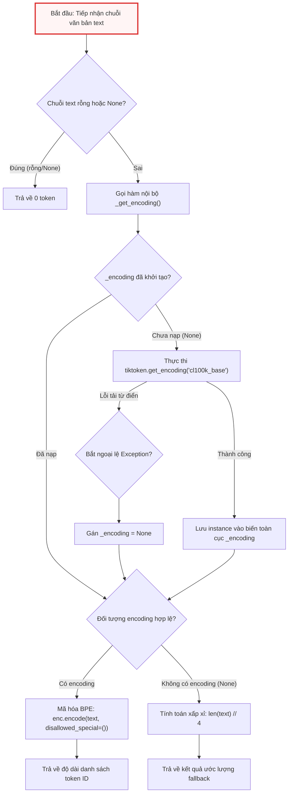
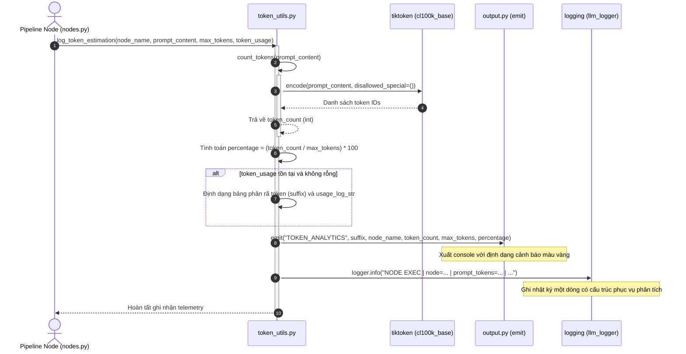

# token_utils.py

> **Source:** `utils/token_utils.py`

Tiếp nối các khuôn mẫu định dạng câu lệnh và nén ngữ cảnh đã được thiết lập trong [Chương 7 — prompts.py](prompts.py.md), mô-đun `token_utils.py` đảm nhận vai trò là hệ thống đo lường, giám sát tải trọng ngữ cảnh và dự báo dung lượng token cho toàn bộ đường ống xử lý của ứng dụng. Trong kiến trúc tương tác với các Mô hình Ngôn ngữ Lớn (LLMs), việc kiểm soát chính xác số lượng token không chỉ quyết định tính ổn định khi gọi API (ngăn ngừa lỗi vượt ngưỡng cửa sổ ngữ cảnh - *context window overflow*) mà còn tối ưu hóa chi phí vận hành và tốc độ phản hồi của hệ thống.

Mô-đun này cung cấp cơ chế phân tích từ vựng (tokenization) hiệu năng cao dựa trên thuật toán Byte Pair Encoding (BPE) thông qua thư viện `tiktoken`, kết hợp cùng giải pháp khởi tạo trễ (lazy initialization) theo mẫu thiết kế Singleton. Bên cạnh đó, tệp hiện thực cơ chế dự phòng thích ứng (heuristic fallback) giúp bảo đảm an toàn thực thi tuyệt đối trong môi trường không thể nạp từ điển BPE, đồng thời tích hợp chặt chẽ với hệ thống xuất dữ liệu [Chương 6 — output.py](output.py.md) và bộ ghi nhật ký phiên làm việc từ [Chương 2 — call_llm.py](call_llm.py.md) để cung cấp báo cáo đo lường chi tiết đa kênh.

---

## Kiến trúc Tổng quan & Luồng Xử lý

Mô-đun `token_utils.py` vận hành xoay quanh hai luồng nghiệp vụ cốt lõi:
1. **Quy trình đếm token có dự phòng:** Tự động nạp bộ mã hóa BPE `cl100k_base` trong lần gọi đầu tiên và thực thi phân tích token an toàn đối với các chuỗi chứa ký tự điều khiển đặc biệt. Nếu môi trường thiếu tài nguyên từ điển BPE, hệ thống tự động kích hoạt thuật toán xấp xỉ tỷ lệ ký tự ($4 \text{ chars} \approx 1 \text{ token}$).
2. **Quy trình đo lường và phát tín hiệu giám sát:** Tổng hợp số lượng token thực tế từ nội dung prompt, tính toán tỷ lệ bão hòa ngữ cảnh so với hạn mức tối đa của mô hình (`max_tokens`), phân rã chi tiết mức tiêu thụ của từng thành phần dữ liệu con và phân phối kết quả đồng thời tới giao diện dòng lệnh (CLI) và tệp nhật ký có cấu trúc (`llm_logger`).

### Sơ đồ luồng đếm Token và Xử lý Dự phòng



### Sơ đồ Tuần tự Ghi nhận và Phân phối Dữ liệu Đo lường



---

## Biến Toàn cục Cấp Mô-đun (Module-Level Variables)

Mô-đun duy trì hai trạng thái toàn cục phục vụ cơ chế nạp lười và chia sẻ kênh ghi log xuyên suốt runtime:

```python
# Get the shared logger from call_llm module
logger = logging.getLogger("llm_logger")

# Lazy-loaded tiktoken encoding (singleton)
_encoding = None
```

### Chi tiết Kỹ thuật:
1. `logger` (`logging.Logger`): Thực thể bộ ghi nhật ký định danh `"llm_logger"`. Tương thích và đồng bộ trực tiếp với kênh log được cấu hình trong [Chương 2 — call_llm.py](call_llm.py.md) và [Chương 6 — output.py](output.py.md). Biến này đảm bảo các bản ghi dung lượng token được lưu đồng nhất vào tệp log phiên chạy mà không gây xung đột với luồng ghi nhật ký chuẩn của hệ thống.
2. `_encoding` (`tiktoken.Encoding | None`): Biến con trỏ lưu trữ phiên bản đơn lệ (singleton instance) của bộ mã hóa BPE `cl100k_base`. Được khởi tạo với giá trị mặc định `None` để trì hoãn việc cấp phát bộ nhớ và nạp từ điển từ đĩa cho tới khi hàm `count_tokens` hoặc `_get_encoding` được kích hoạt lần đầu tiên.

---

## Các Hàm Cấp Mô-đun (Module-Level Functions)

### `_get_encoding()`
**Visibility**: Private (Internal Helper)  
**Signature**: `def _get_encoding() -> tiktoken.Encoding | None:`

**Description**:
Hàm nội bộ đảm nhận việc khởi tạo trễ (lazy initialization) và quản lý vòng đời đơn lệ (singleton) của đối tượng mã hóa `tiktoken.Encoding`. Thuật toán sử dụng bảng mã hóa `"cl100k_base"`, đây là chuẩn từ điển BPE tiêu chuẩn được áp dụng cho các dòng mô hình hiện đại (như GPT-4, GPT-3.5-Turbo và làm chuẩn xấp xỉ tin cậy cao cho các mô hình Gemini hay Claude). Hàm được bọc hoàn toàn trong khối xử lý ngoại lệ rộng `try...except Exception` nhằm đảm bảo hệ thống không bị đổ vỡ (crash) trong trường hợp môi trường thực thi thiếu kết nối tải tệp từ điển BPE hoặc gặp lỗi liên kết thư viện C/Rust bên dưới.

**Parameters**:
* Hàm không nhận tham số đầu vào.

**Returns**:
* `tiktoken.Encoding | None`: Trả về đối tượng mã hóa `cl100k_base` nếu khởi tạo thành công; trả về `None` nếu phát sinh ngoại lệ trong quá trình khởi tạo.

**Raises**:
* Không phát sinh ngoại lệ ra ngoài phạm vi hàm. Mọi ngoại lệ phát sinh trong quá trình nạp `tiktoken.get_encoding()` đều được hấp thụ an toàn và gán `_encoding = None`.

**Example**:
```python
def _get_encoding():
    global _encoding
    if _encoding is None:
        try:
            _encoding = tiktoken.get_encoding("cl100k_base")
        except Exception:
            _encoding = None
    return _encoding
```

Cơ chế Singleton kết hợp Lazy Loading giúp giảm thiểu đáng kể thời gian khởi động (startup time) của toàn bộ tiến trình CLI. Thay vì tiêu tốn hàng chục megabyte bộ nhớ RAM và thời gian I/O đĩa để nạp bảng tra cứu BPE ngay khi nạp mô-đun (`import token_utils`), quá trình này chỉ diễn ra vào thời điểm thực sự phát sinh yêu cầu tính toán token. Khi gặp sự cố môi trường (ví dụ: môi trường cô lập không có internet để tải cache từ điển tiktoken), hàm phục hồi an toàn bằng cách thiết lập giá trị `None`, mở đường cho tầng logic phía sau chuyển đổi sang chế độ ước lượng dự phòng.

---

### `count_tokens()`
**Visibility**: Public  
**Signature**: `def count_tokens(text: str) -> int:`

**Description**:
Điểm nhập công khai thực hiện đếm chính xác số lượng token của một chuỗi văn bản bất kỳ. Hàm xử lý phòng thủ đối với các đầu vào rỗng hoặc sai kiểu dữ liệu bằng cách trả về `0` ngay lập tức. Đối với chuỗi hợp lệ, hàm gọi `_get_encoding()` để lấy bộ mã hóa BPE. 

Điểm mấu chốt trong việc xử lý văn bản mã nguồn là việc truyền cờ `disallowed_special=()` vào phương thức `enc.encode()`. Mặc định, thư viện `tiktoken` sẽ ném ra ngoại lệ `ValueError` nếu phát hiện các chuỗi điều khiển đặc biệt như `<|endoftext|>`, `<|fim_prefix|>`, hoặc `<|fim_suffix|>`. Vì hệ thống chuyên xử lý tài liệu và phân tích mã nguồn phần mềm—nơi các lập trình viên hoàn toàn có thể viết các chuỗi ký tự trùng với token đặc biệt trong mã nguồn—việc vô hiệu hóa cơ chế cấm này (`disallowed_special=()`) cho phép bộ phân tích BPE xử lý mọi ký tự đặc biệt dưới dạng chuỗi văn bản thô (raw text) mà không làm sập luồng thực thi. Nếu bộ mã hóa BPE không khả dụng, hàm tự động áp dụng công thức ước lượng xấp xỉ `len(text) // 4`.

**Parameters**:
* `text` (`str`): Chuỗi văn bản, mã nguồn hoặc nội dung prompt cần đo lường số lượng token.

**Returns**:
* `int`: Tổng số lượng token được xác định qua thuật toán BPE hoặc qua công thức ước lượng dự phòng. Trả về `0` nếu chuỗi rỗng.

**Raises**:
* Không ném ngoại lệ. Hoạt động an toàn trên mọi chuỗi đầu vào.

**Example**:
```python
def count_tokens(text: str) -> int:
    """Count tokens using tiktoken, with fallback to chars/4."""
    if not text:
        return 0
    enc = _get_encoding()
    if enc:
        return len(enc.encode(text, disallowed_special=()))
    return len(text) // 4
```

Thuật toán dự phòng `len(text) // 4` dựa trên các nghiên cứu thống kê thực nghiệm về cấu trúc ngôn ngữ tự nhiên tiếng Anh và cú pháp mã nguồn chuẩn ASCII, trong đó trung bình mỗi token tương đương khoảng 4 ký tự văn bản. Việc sử dụng phép chia lấy phần nguyên `//` đảm bảo giá trị trả về luôn là số nguyên (`int`), tương thích tuyệt đối với các phép toán so sánh giới hạn cửa sổ ngữ cảnh ở các tầng điều phối cấp cao như [Chương 11 — nodes.py](../nodes.py.md). Khả năng xử lý chuỗi rỗng tại dòng điều kiện đầu tiên giúp tối ưu hóa chi phí thực thi, tránh việc gọi hàm phân tích từ vựng đối với các biến rỗng.

---

### `log_token_estimation()`
**Visibility**: Public  
**Signature**: `def log_token_estimation(node_name: str, prompt_content: str, max_tokens: int, token_usage: dict | None = None) -> None:`

**Description**:
Hàm thu thập, định dạng và phát tín hiệu đo lường dung lượng ngữ cảnh (telemetry analytics) cho từng nút xử lý (`Node`) trong hệ thống. Hàm thực hiện các bước:
1. Tính toán số lượng token của `prompt_content` thông qua `count_tokens()`.
2. Xác định tỷ lệ phần trăm bão hòa cửa sổ ngữ cảnh (`percentage`) dựa trên dung lượng tối đa cho phép (`max_tokens`).
3. Nếu tham số `token_usage` được cung cấp (chứa bảng phân rã số lượng token theo từng nguồn dữ liệu con như mã nguồn tệp, lịch sử tóm tắt, hướng dẫn hệ thống), hàm tiến hành căn lề trực quan theo dạng bảng (tabular formatting) bằng phương thức `str.ljust()` dựa trên độ dài nhãn lớn nhất (`max_label_len`).
4. Phát thông điệp hiển thị `TOKEN_ANALYTICS` tới màn hình dòng lệnh qua hàm `emit()` của [Chương 6 — output.py](output.py.md) (được tô màu vàng cảnh báo theo định nghĩa mã lỗi CSV).
5. Ghi thông tin chi tiết một dòng duy nhất (single-line structured log) vào tệp nhật ký qua `logger.info()` để các công cụ phân tích log tự động có thể bóc tách dễ dàng.

**Parameters**:
* `node_name` (`str`): Tên định danh của nút xử lý đang thực thi (ví dụ: `"ArchitectNode"`, `"DeterministicFileMapper"`, `"ModuleDocNode"`).
* `prompt_content` (`str`): Toàn bộ nội dung câu lệnh đã được biên dịch hoàn chỉnh chuẩn bị gửi tới LLM.
* `max_tokens` (`int`): Giới hạn cửa sổ ngữ cảnh tối đa của mô hình đang được sử dụng (ví dụ: `8192`, `32768`, `128000`, `1000000`).
* `token_usage` (`dict[str, int] | None`, optional): Từ điển phân rã mức tiêu thụ token của từng thành phần dữ liệu trong prompt (ví dụ: `{"System Prompt": 500, "Source Code": 12000, "Context Summary": 1500}`). Mặc định là `None`.

**Returns**:
* `None`: Hàm chỉ thực hiện tác vụ ghi nhận dữ liệu và phát tín hiệu ngoại vi (I/O side-effects).

**Raises**:
* Không ném ngoại lệ. Tự động xử lý trường hợp `max_tokens = 0` hoặc `token_count = 0` để triệt tiêu lỗi chia cho 0 (`ZeroDivisionError`).

**Example**:
```python
def log_token_estimation(node_name: str, prompt_content: str, max_tokens: int, token_usage: dict | None = None) -> None:
    token_count = count_tokens(prompt_content)
    percentage = (token_count / max_tokens) * 100 if max_tokens else 0

    # Build token usage breakdown suffix for stdout display
    suffix = ""
    usage_log_str = ""
    if token_usage:
        max_label_len = max(len(label) for label in token_usage)
        lines = []
        log_parts = []
        for label, value in token_usage.items():
            pct = (value / token_count * 100) if token_count else 0
            padded_label = label.ljust(max_label_len)
            lines.append(f"\t{padded_label} : {value:,} ({pct:.0f}%)")
            log_parts.append(f"{label}={value:,} ({pct:.0f}%)")
        suffix = "\n" + "\n".join(lines)
        usage_log_str = " | " + " | ".join(log_parts)

    # Console output via emit (styled by CSV LEVEL=WARNING -> yellow)
    emit(
        "TOKEN_ANALYTICS",
        suffix=suffix,
        node_name=node_name,
        token_count=f"{token_count:,}",
        max_tokens=f"{max_tokens:,}",
        percentage=f"{percentage:.1f}",
    )

    # File log stays single-line for parseability (structured, not translatable)
    logger.info(f"NODE EXEC | node={node_name} | prompt_tokens={token_count:,} / {max_tokens:,} ({percentage:.1f}% capacity){usage_log_str}")
```

Đoạn mã trên thể hiện tính chất phân tách luồng xuất dữ liệu chuyên biệt: trong khi giao diện người dùng (console CLI) ưu tiên tính trực quan đa dòng với thụt lề tab (`\t`) và căn chỉnh lề theo nhãn (`ljust`), luồng ghi tệp nhật ký (`logger.info`) ép toàn bộ dữ liệu cấu trúc về một dòng duy nhất sử dụng dấu phân cách thanh dọc (` | `). Điều này vừa tối ưu hóa khả năng đọc của con người trong quá trình theo dõi trực tiếp, vừa hỗ trợ các hệ thống giám sát như ELK hoặc Grafana Loki phân tích log bằng biểu thức chính quy mà không gặp sự cố với ký tự xuống dòng.

---

## Phân tích Chi tiết Kỹ thuật Chuyên sâu

### 1. Cơ chế Dự phòng BPE và An toàn Ký tự Đặc biệt
Khi xây dựng tài liệu cho các dự án phần mềm đa ngôn ngữ, dữ liệu đầu vào chứa nhiều đoạn mã nguồn phức tạp có thể chứa các mẫu token đặc biệt của các mô hình Transformer (ví dụ: `<|im_start|>`, `<|endoftext|>`). Nếu sử dụng phương thức mã hóa mặc định của `tiktoken`:

$$\text{tiktoken.encode}(text) \xrightarrow{\text{phát hiện token đặc biệt}} \mathbf{ValueError}$$

Điều này sẽ dẫn đến việc tiến trình tạo tài liệu bị dừng đột ngột giữa chừng. Việc thiết lập `disallowed_special=()` là giải pháp phòng vệ bắt buộc, chỉ định cho bộ phân giải BPE coi toàn bộ các chuỗi này là các chuỗi ký tự thông thường và tiếp tục mã hóa bình thường.

### 2. Định dạng Trực quan Bảng Phân rã Ngữ cảnh
Khi một nút xử lý nạp nhiều khối dữ liệu vào prompt (ví dụ: bộ khung mã nguồn, tài liệu liên quan, hướng dẫn hệ thống), việc chỉ biết tổng số token là chưa đủ để lập trình viên gỡ lỗi hoặc tối ưu prompt. Cấu trúc `token_usage` cho phép mô-đun sinh ra bảng phân rã trực quan:

```text
[!] Phân tích Token: ModuleDocNode
    Tổng dung lượng: 45,210 / 128,000 token (35.3% dung lượng mô hình)
    Chi tiết phân bổ:
        System Architecture Guide : 1,200 (3%)
        Target Source Code        : 38,500 (85%)
        Rolling Chapter Context   : 5,510 (12%)
```

Thuật toán tính toán độ dài chuỗi lớn nhất:
$$\text{max\_label\_len} = \max_{k \in \text{token\_usage}} (\operatorname{length}(k))$$
kết hợp cùng phương thức `label.ljust(max_label_len)` tạo ra sự đồng nhất tuyệt đối về vị trí của dấu hai chấm (` : `) và các con số thống kê, nâng cao trải nghiệm theo dõi tiến trình trên giao diện dòng lệnh.

### 3. Tối ưu Hiệu năng & Tác động Bộ nhớ
- **Bộ nhớ (Memory Footprint):** Bộ từ điển `cl100k_base` chiếm khoảng 12MB RAM khi nạp. Việc nạp theo mô hình Singleton đảm bảo rằng dù hệ thống có chạy qua hàng trăm nút (`Node`) hay tạo tài liệu cho hàng nghìn tệp mã nguồn, chỉ duy nhất một thực thể `_encoding` tồn tại trong suốt vòng đời của tiến trình Python.
- **Thời gian Thực thi (CPU Time):** `tiktoken` được biên dịch trực tiếp từ mã nguồn Rust gốc với các thuật toán BPE tối ưu hóa theo luồng byte, cho phép xử lý hàng triệu ký tự chỉ trong vài mili-giây, không gây ra bất kỳ hiện tượng nghẽn cổ chai nào trong đường ống xử lý tổng thể.

---

## Xem Thêm (See Also)

* [Chương 2 — call_llm.py](call_llm.py.md): Tầng giao tiếp LLM tiêu thụ `count_tokens` để đo lường tải trọng trước khi gửi yêu cầu HTTP và chia sẻ bộ ghi nhật ký `llm_logger`.
* [Chương 6 — output.py](output.py.md): Hệ thống hiển thị đa kênh tiếp nhận thông điệp `TOKEN_ANALYTICS` để định dạng màu sắc cảnh báo trên console.
* [Chương 7 — prompts.py](prompts.py.md): Tầng sinh prompt cung cấp các chuỗi văn bản hoàn chỉnh cho `token_utils.py` tính toán dung lượng.
* [Chương 9 — flow.py](../flow.py.md): Bộ điều phối luồng quy trình tổng thể kiểm soát việc chuyển đổi giữa các giai đoạn xử lý.
* [Chương 11 — nodes.py](../nodes.py.md): Các nút nghiệp vụ gọi trực tiếp `log_token_estimation` trước khi kích hoạt các tác vụ suy luận LLM.

